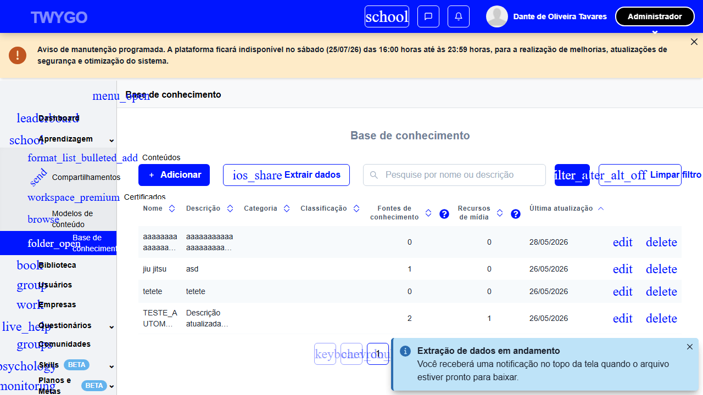
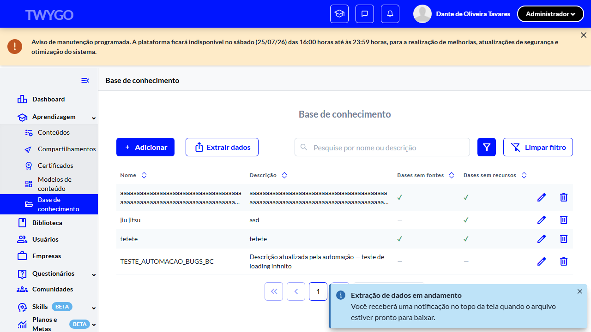

# Casos de teste — Base de Conhecimento

[← Voltar ao dashboard](index.md)

Lista detalhada por testsuite. Cada caso traz: o que era esperado pelo XML, quais steps foram executados, evidências (screenshots/trace), texto pronto pra registro de bug e — quando houver falha — uma explicação em PT-BR do motivo.

## Extração de dados de repositórios

_2 caso(s) — 2 aprovado(s), 0 falha(s)_

### ✅ Aprovado · TC2 · Exportação respeita filtros aplicados · 🟡 Normal

<a id="tc2-exportacao-respeita-filtros-aplicados"></a>_Arquivo:_ `exportacao-respeita-filtros-aplicados.spec.ts` · _Duração:_ 41.61s · _Browser:_ chromium

**Sumário (objetivo do caso):** Validar que a extração respeita os filtros aplicados (R38).

**Pré-condições:**

```
Ambiente Stage configurado
Feature flag `habilitar_base_de_conhecimento` ativa
Pelo menos 1 repositório cadastrado na organização
Usuário logado como Admin
```

**Passos do caso (XML/TestLink + execução Playwright):**

_Cada linha reproduz um passo do XML; a coluna **Status** traz o resultado da execução (do step Allure correspondente). Linhas com "Pré-condição" são da execução automatizada (login, navegação inicial) — não fazem parte do roteiro do XML._

| # | Ação do passo | Resultado esperado | Status | Notas | Duração |
|---|---|---|:---:|---|---:|
| — | _Pré-condição:_ 4. Abrir modal "Configurações da extração" | — | ✅ | — | 0.23s |
| — | _Pré-condição:_ 5. Marcar Formato=CSV, Dados=Filtro atual, Colunas=Todas | — | ✅ | — | 0.14s |
| — | _Pré-condição:_ 6. Click "Extrair" e aguardar toast de progresso | — | ✅ | — | 1.45s |
| 1 | Aplicar o filtro Categoria "Geral" | Listagem é filtrada exibindo apenas repositórios da Categoria "Geral". | ✅ | — | 24.03s |
| 2 | Clicar no botão "Exportar" | Sistema inicia o download do arquivo de extração. | ✅ | — | 0.59s |
| 3 | Aguardar o download concluir | Arquivo extraído contém apenas os repositórios da Categoria "Geral", refletindo o filtro aplicado. | ✅ | — | 11.11s |

**Evidências:**

📁 _Pasta:_ [`artifacts/projects-base-de-conhecime-18ca7--respeita-filtros-aplicados-chromium/`](artifacts/projects-base-de-conhecime-18ca7--respeita-filtros-aplicados-chromium/)

- 📸 **Screenshot (screenshot)** — [`test-finished-1.png`](artifacts/projects-base-de-conhecime-18ca7--respeita-filtros-aplicados-chromium/test-finished-1.png)

  

- 🎬 [Vídeo da execução (video.webm)](artifacts/projects-base-de-conhecime-18ca7--respeita-filtros-aplicados-chromium/video.webm)

- 🎬 [Vídeo da execução (video-1.webm)](artifacts/projects-base-de-conhecime-18ca7--respeita-filtros-aplicados-chromium/video-1.webm)

- 📦 **Trace** — [`trace.zip`](artifacts/projects-base-de-conhecime-18ca7--respeita-filtros-aplicados-chromium/trace.zip)

  ```bash
  npx playwright show-trace outputs/base-de-conhecimento/reports/extracao-de-dados-de-repositorios_20260727-222602/artifacts/projects-base-de-conhecime-18ca7--respeita-filtros-aplicados-chromium/trace.zip
  ```

- 🎥 **Vídeo** — [`video.webm`](artifacts/projects-base-de-conhecime-18ca7--respeita-filtros-aplicados-chromium/video.webm)

- 🎥 **Vídeo** — [`video-1.webm`](artifacts/projects-base-de-conhecime-18ca7--respeita-filtros-aplicados-chromium/video-1.webm)


---

### ✅ Aprovado · TC1 · Exportar listagem completa · 🔴 Crítico

<a id="tc1-exportar-listagem-completa"></a>_Arquivo:_ `exportar-listagem-completa.spec.ts` · _Duração:_ 14.43s · _Browser:_ chromium

**Sumário (objetivo do caso):** Validar a extração de dados da listagem (R37, R38).

**Pré-condições:**

```
Ambiente Stage configurado
Feature flag `habilitar_base_de_conhecimento` ativa
Pelo menos 1 repositório cadastrado na organização
Usuário logado como Admin
```

**Passos do caso (XML/TestLink + execução Playwright):**

_Cada linha reproduz um passo do XML; a coluna **Status** traz o resultado da execução (do step Allure correspondente). Linhas com "Pré-condição" são da execução automatizada (login, navegação inicial) — não fazem parte do roteiro do XML._

| # | Ação do passo | Resultado esperado | Status | Notas | Duração |
|---|---|---|:---:|---|---:|
| — | _Pré-condição:_ 4. Marcar Formato=CSV, Dados=Todos, Colunas=Todas | — | ✅ | — | 0.24s |
| — | _Pré-condição:_ 5. Click "Extrair" e aguardar toast de progresso | — | ✅ | — | 1.34s |
| 1 | Acessar a URL "/o/{orgId}/knowledge_repositories" | Listagem é exibida. | ✅ | — | 8.73s |
| 2 | Clicar no botão "Exportar" | Sistema inicia o download do arquivo de extração (CSV ou XLSX) contendo os repositórios listados. | ✅ | — | 0.06s |
| 3 | Aguardar o download concluir | Arquivo de extração está disponível no diretório de downloads do browser. | ✅ | — | 0.29s |

**Evidências:**

📁 _Pasta:_ [`artifacts/projects-base-de-conhecime-0912b--Exportar-listagem-completa-chromium/`](artifacts/projects-base-de-conhecime-0912b--Exportar-listagem-completa-chromium/)

- 📸 **Screenshot (screenshot)** — [`test-finished-1.png`](artifacts/projects-base-de-conhecime-0912b--Exportar-listagem-completa-chromium/test-finished-1.png)

  

- 🎬 [Vídeo da execução (video.webm)](artifacts/projects-base-de-conhecime-0912b--Exportar-listagem-completa-chromium/video.webm)

- 🎬 [Vídeo da execução (video-1.webm)](artifacts/projects-base-de-conhecime-0912b--Exportar-listagem-completa-chromium/video-1.webm)

- 📦 **Trace** — [`trace.zip`](artifacts/projects-base-de-conhecime-0912b--Exportar-listagem-completa-chromium/trace.zip)

  ```bash
  npx playwright show-trace outputs/base-de-conhecimento/reports/extracao-de-dados-de-repositorios_20260727-222602/artifacts/projects-base-de-conhecime-0912b--Exportar-listagem-completa-chromium/trace.zip
  ```

- 🎥 **Vídeo** — [`video.webm`](artifacts/projects-base-de-conhecime-0912b--Exportar-listagem-completa-chromium/video.webm)

- 🎥 **Vídeo** — [`video-1.webm`](artifacts/projects-base-de-conhecime-0912b--Exportar-listagem-completa-chromium/video-1.webm)


---
