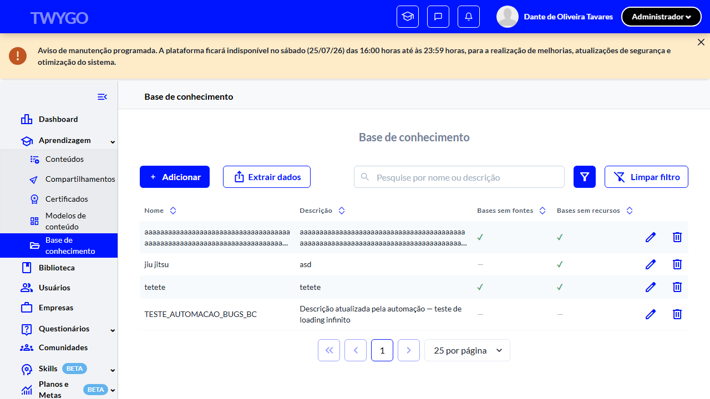
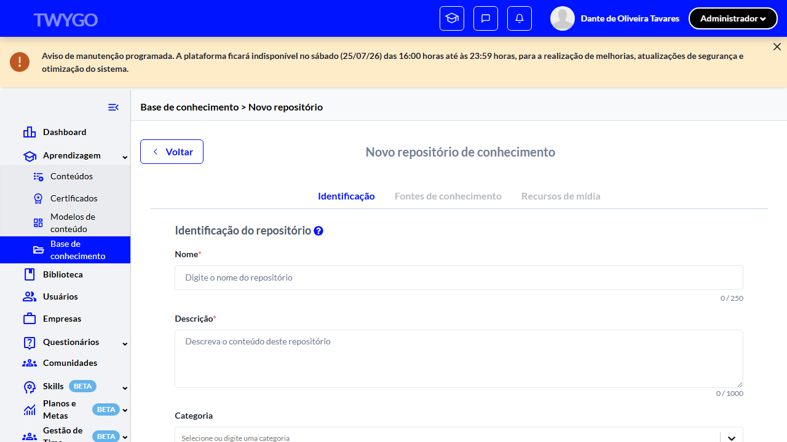
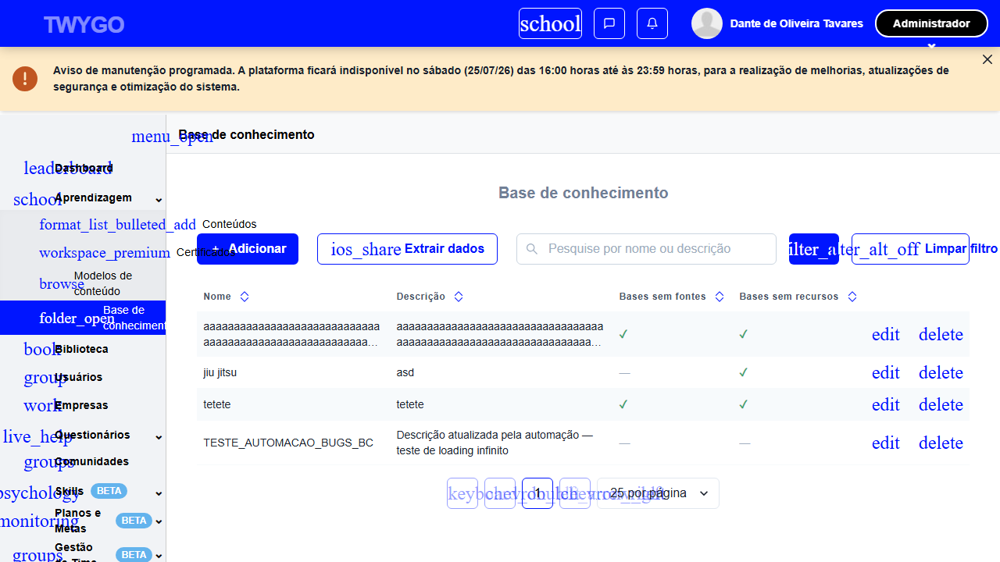

# Casos de teste — Base de Conhecimento

[← Voltar ao dashboard](index.md)

Lista detalhada por testsuite. Cada caso traz: o que era esperado pelo XML, quais steps foram executados, evidências (screenshots/trace), texto pronto pra registro de bug e — quando houver falha — uma explicação em PT-BR do motivo.

## Listagem básica de repositórios

_4 caso(s) — 2 aprovado(s), 2 falha(s)_

### ✅ Aprovado · TC1 · Acessar a listagem via menu Aprendizagem · 🔴 Crítico

<a id="tc1-acessar-a-listagem-via-menu-aprendizagem"></a>_Arquivo:_ `tc1-acessar-listagem-via-menu-aprendizagem.spec.ts` · _Duração:_ 30.25s · _Browser:_ chromium

**Sumário (objetivo do caso):** Validar acesso à listagem de repositórios de conhecimento via menu lateral, conforme R1.

**Pré-condições:**

```
Ambiente Stage configurado
Feature flag `habilitar_base_de_conhecimento` ativa na organização do teste
Usuário logado como Admin
```

**Passos do caso (XML/TestLink + execução Playwright):**

_Cada linha reproduz um passo do XML; a coluna **Status** traz o resultado da execução (do step Allure correspondente). Linhas com "Pré-condição" são da execução automatizada (login, navegação inicial) — não fazem parte do roteiro do XML._

| # | Ação do passo | Resultado esperado | Status | Notas | Duração |
|---|---|---|:---:|---|---:|
| 1 | Acessar a URL "/play" | Dashboard padrão é exibido contendo o menu lateral. | ✅ | — | 24.00s |
| 2 | Clicar no menu lateral "Aprendizagem" | Submenu lateral é exibido contendo o item "Base de conhecimento". | ✅ | — | 0.81s |
| 3 | Clicar no submenu "Base de conhecimento" | Sistema redireciona para a listagem e exibe breadcrumb "Aprendizagem > Base de conhecimento". | ✅ | — | 3.20s |
| 4 | Aguardar a listagem carregar | Listagem é renderizada com o componente ListControl. | ✅ | — | — |

**Evidências:**

📁 _Pasta:_ [`artifacts/projects-base-de-conhecime-e5515-tagem-via-menu-Aprendizagem-chromium/`](artifacts/projects-base-de-conhecime-e5515-tagem-via-menu-Aprendizagem-chromium/)

- 📸 **Screenshot (screenshot)** — [`test-finished-1.png`](artifacts/projects-base-de-conhecime-e5515-tagem-via-menu-Aprendizagem-chromium/test-finished-1.png)

  

- 🎬 [Vídeo da execução (video.webm)](artifacts/projects-base-de-conhecime-e5515-tagem-via-menu-Aprendizagem-chromium/video.webm)

- 🎬 [Vídeo da execução (video-1.webm)](artifacts/projects-base-de-conhecime-e5515-tagem-via-menu-Aprendizagem-chromium/video-1.webm)

- 📦 **Trace** — [`trace.zip`](artifacts/projects-base-de-conhecime-e5515-tagem-via-menu-Aprendizagem-chromium/trace.zip)

  ```bash
  npx playwright show-trace outputs/base-de-conhecimento/reports/listagem-basica-de-repositorios_20260723-153502/artifacts/projects-base-de-conhecime-e5515-tagem-via-menu-Aprendizagem-chromium/trace.zip
  ```

- 🎥 **Vídeo** — [`video.webm`](artifacts/projects-base-de-conhecime-e5515-tagem-via-menu-Aprendizagem-chromium/video.webm)

- 🎥 **Vídeo** — [`video-1.webm`](artifacts/projects-base-de-conhecime-e5515-tagem-via-menu-Aprendizagem-chromium/video-1.webm)


---

### ❌ Falhou · TC2 · Validar colunas obrigatórias da listagem · 🔴 Crítico

<a id="tc2-validar-colunas-obrigatorias-da-listagem"></a>_Arquivo:_ `tc2-validar-colunas-obrigatorias.spec.ts` · _Duração:_ 49.63s · _Browser:_ chromium

> **❌ Por que falhou:** O elemento esperado não apareceu na tela (locator: getByRole('columnheader', { name: 'Categoria' })).
> _Step impactado:_ **2. Verificar colunas obrigatórias: Nome, Descrição, Categoria, Classificação**

**Sumário (objetivo do caso):** Validar que a listagem exibe as colunas esperadas (R3, R4).

**Pré-condições:**

```
Ambiente Stage configurado
Feature flag `habilitar_base_de_conhecimento` ativa na organização do teste
Usuário logado como Admin
```

**Passos do caso (XML/TestLink + execução Playwright):**

_Cada linha reproduz um passo do XML; a coluna **Status** traz o resultado da execução (do step Allure correspondente). Linhas com "Pré-condição" são da execução automatizada (login, navegação inicial) — não fazem parte do roteiro do XML._

| # | Ação do passo | Resultado esperado | Status | Notas | Duração |
|---|---|---|:---:|---|---:|
| 1 | Acessar a URL "/o/{orgId}/knowledge_repositories" | Listagem é exibida com colunas: "Nome", "Categoria", "Classificação", "Criado em", "Atualizado em". | ✅ | — | 37.52s |
| 2 | Aguardar a coluna "Ações" ser exibida | Cada linha da listagem exibe os botões "Editar" e "Excluir". | ❌ | O elemento esperado não apareceu na tela (locator: getByRole('columnheader', { name: 'Categoria' })). | 10.04s |

**Evidências:**

📁 _Pasta:_ [`artifacts/projects-base-de-conhecime-f1abe-as-obrigatórias-da-listagem-chromium/`](artifacts/projects-base-de-conhecime-f1abe-as-obrigatórias-da-listagem-chromium/)

- 📸 **Screenshot (screenshot)** — [`test-failed-1.png`](artifacts/projects-base-de-conhecime-f1abe-as-obrigatórias-da-listagem-chromium/test-failed-1.png)

  

- 🎬 [Vídeo da execução (video.webm)](artifacts/projects-base-de-conhecime-f1abe-as-obrigatórias-da-listagem-chromium/video.webm)

- 🎬 [Vídeo da execução (video-1.webm)](artifacts/projects-base-de-conhecime-f1abe-as-obrigatórias-da-listagem-chromium/video-1.webm)

- 📦 **Trace** — [`trace.zip`](artifacts/projects-base-de-conhecime-f1abe-as-obrigatórias-da-listagem-chromium/trace.zip)

  ```bash
  npx playwright show-trace outputs/base-de-conhecimento/reports/listagem-basica-de-repositorios_20260723-153502/artifacts/projects-base-de-conhecime-f1abe-as-obrigatórias-da-listagem-chromium/trace.zip
  ```

- 🎥 **Vídeo** — [`video.webm`](artifacts/projects-base-de-conhecime-f1abe-as-obrigatórias-da-listagem-chromium/video.webm)

- 🎥 **Vídeo** — [`video-1.webm`](artifacts/projects-base-de-conhecime-f1abe-as-obrigatórias-da-listagem-chromium/video-1.webm)

- 📄 **DOM no momento da falha** — [`error-context.md`](artifacts/projects-base-de-conhecime-f1abe-as-obrigatórias-da-listagem-chromium/error-context.md)

#### 🐛 Pronto para registro de bug

> ❓ **Análise automática:** Inconclusivo (precisa investigação manual) · Confiança 🔴 baixa
> _Por quê:_ Sem sinal Network in-scope ou padrão de erro conhecido — revisar trace
> _Bug-report estruturado:_ [`bug-reports/listagem-basica-de-repositorios__tc2-validar-colunas-obrigatorias-da-listagem.md`](bug-reports/listagem-basica-de-repositorios__tc2-validar-colunas-obrigatorias-da-listagem.md)

**Próximas ações sugeridas:**
- Sem evidência suficiente para classificar — abrir `trace.zip` (`npx playwright show-trace`) para ver passo a passo da execução.
- Reabrir o agente com o trace em mãos para reclassificar manualmente em uma das 4 categorias.

**Descrição do BUG:** [Crítico] TC2 — Validar colunas obrigatórias da listagem — O elemento esperado não apareceu na tela (locator: getByRole('columnheader', { name: 'Categoria' })).

**Passo a passo para reprodução:**
1. Pré: Ambiente Stage configurado
1. Pré: Feature flag `habilitar_base_de_conhecimento` ativa na organização do teste
1. Pré: Usuário logado como Admin
1. 1. Acessar a URL "/o/{orgId}/knowledge_repositories"
1. 2. Aguardar a coluna "Ações" ser exibida

**Comportamento esperado:** Cada linha da listagem exibe os botões "Editar" e "Excluir".

**Comportamento atual:** O elemento esperado não apareceu na tela (locator: getByRole('columnheader', { name: 'Categoria' })). (falha aconteceu no passo 2: "Verificar colunas obrigatórias: Nome, Descrição, Categoria, Classificação", que deveria resultar em: Cada linha da listagem exibe os botões "Editar" e "Excluir".)

**Informações:**

| Campo | Valor |
|---|---|
| URL | `https://basedeconhecimento.stage.twygoead.com/` |
| Login | Credenciais via env: `TWYGO_STAGING_BASE_DE_CONHECIMENTO_EMAIL` (consulte `.env`) |
| Senha | Credenciais via env: `TWYGO_STAGING_BASE_DE_CONHECIMENTO_PASSWORD` (consulte `.env`) |
| orgId | 36675 |
| Outros | Browser: chromium |
| Outros | runId: listagem-basica-de-repositorios_20260723-153502 |
| Outros | Duração até a falha: 49.63s |
| Outros | Step impactado: 2. Verificar colunas obrigatórias: Nome, Descrição, Categoria, Classificação |

**Evidências:**

- Screenshot capturado pelo Playwright (screenshot): artifacts/projects-base-de-conhecime-f1abe-as-obrigatórias-da-listagem-chromium/test-failed-1.png
- Vídeo da execução (video-1.webm): artifacts/projects-base-de-conhecime-f1abe-as-obrigatórias-da-listagem-chromium/video-1.webm
- Vídeo da execução (video.webm): artifacts/projects-base-de-conhecime-f1abe-as-obrigatórias-da-listagem-chromium/video.webm
- Snapshot do DOM/contexto da página (error-context.md): artifacts/projects-base-de-conhecime-f1abe-as-obrigatórias-da-listagem-chromium/error-context.md
- Trace completo do Playwright (.zip) — `npx playwright show-trace`: artifacts/projects-base-de-conhecime-f1abe-as-obrigatórias-da-listagem-chromium/trace.zip

<details><summary>📋 Ver texto agregado para copiar (Jira/GitHub/Linear)</summary>

```
Descrição do BUG
[Crítico] TC2 — Validar colunas obrigatórias da listagem — O elemento esperado não apareceu na tela (locator: getByRole('columnheader', { name: 'Categoria' })).

Passo a passo para reprodução
  Pré: Ambiente Stage configurado
  Pré: Feature flag `habilitar_base_de_conhecimento` ativa na organização do teste
  Pré: Usuário logado como Admin
  1. Acessar a URL "/o/{orgId}/knowledge_repositories"
  2. Aguardar a coluna "Ações" ser exibida

Comportamento esperado
Cada linha da listagem exibe os botões "Editar" e "Excluir".

Comportamento atual
O elemento esperado não apareceu na tela (locator: getByRole('columnheader', { name: 'Categoria' })). (falha aconteceu no passo 2: "Verificar colunas obrigatórias: Nome, Descrição, Categoria, Classificação", que deveria resultar em: Cada linha da listagem exibe os botões "Editar" e "Excluir".)

Informações
- URL: https://basedeconhecimento.stage.twygoead.com/
- Login: Credenciais via env: `TWYGO_STAGING_BASE_DE_CONHECIMENTO_EMAIL` (consulte `.env`)
- Senha: Credenciais via env: `TWYGO_STAGING_BASE_DE_CONHECIMENTO_PASSWORD` (consulte `.env`)
- ID do ambiente (orgId): 36675
- Outros:
  - Browser: chromium
  - runId: listagem-basica-de-repositorios_20260723-153502
  - Duração até a falha: 49.63s
  - Step impactado: 2. Verificar colunas obrigatórias: Nome, Descrição, Categoria, Classificação

Evidências
- Screenshot capturado pelo Playwright (screenshot): artifacts/projects-base-de-conhecime-f1abe-as-obrigatórias-da-listagem-chromium/test-failed-1.png
- Vídeo da execução (video-1.webm): artifacts/projects-base-de-conhecime-f1abe-as-obrigatórias-da-listagem-chromium/video-1.webm
- Vídeo da execução (video.webm): artifacts/projects-base-de-conhecime-f1abe-as-obrigatórias-da-listagem-chromium/video.webm
- Snapshot do DOM/contexto da página (error-context.md): artifacts/projects-base-de-conhecime-f1abe-as-obrigatórias-da-listagem-chromium/error-context.md
- Trace completo do Playwright (.zip) — `npx playwright show-trace`: artifacts/projects-base-de-conhecime-f1abe-as-obrigatórias-da-listagem-chromium/trace.zip

Execução
- runId: listagem-basica-de-repositorios_20260723-153502
- environment.json: staging-base-de-conhecimento
- testsuite: Listagem básica de repositórios
- testcase: TC2 — Validar colunas obrigatórias da listagem

```

</details>

<details><summary>🔧 Stack trace técnica completa (para desenvolvedor)</summary>

```
Error: expect(locator).toBeVisible() failed

Locator: getByRole('columnheader', { name: 'Categoria' })
Expected: visible
Timeout: 10000ms
Error: element(s) not found

Call log:
  - Expect "toBeVisible" with timeout 10000ms
  - waiting for getByRole('columnheader', { name: 'Categoria' })

```

</details>

---

### ✅ Aprovado · TC3 · Validar botão de criação na listagem · 🔴 Crítico

<a id="tc3-validar-botao-de-criacao-na-listagem"></a>_Arquivo:_ `tc3-validar-botao-criacao.spec.ts` · _Duração:_ 44.59s · _Browser:_ chromium

**Sumário (objetivo do caso):** Validar presença e funcionalidade do botão de criação (R5).

**Pré-condições:**

```
Ambiente Stage configurado
Feature flag `habilitar_base_de_conhecimento` ativa na organização do teste
Usuário logado como Admin
```

**Passos do caso (XML/TestLink + execução Playwright):**

_Cada linha reproduz um passo do XML; a coluna **Status** traz o resultado da execução (do step Allure correspondente). Linhas com "Pré-condição" são da execução automatizada (login, navegação inicial) — não fazem parte do roteiro do XML._

| # | Ação do passo | Resultado esperado | Status | Notas | Duração |
|---|---|---|:---:|---|---:|
| — | _Pré-condição:_ 3. Verificar redirect para tela de criação e aba "Identificação" ativa | — | ✅ | — | 3.63s |
| 1 | Acessar a URL "/o/{orgId}/knowledge_repositories" | Listagem é exibida. | ✅ | — | 37.75s |
| 2 | Clicar no botão "+ Adicionar" | Sistema redireciona para a tela de criação de repositório exibindo a aba "Identificação". | ✅ | — | 0.90s |

**Evidências:**

📁 _Pasta:_ [`artifacts/projects-base-de-conhecime-0ba80-otão-de-criação-na-listagem-chromium/`](artifacts/projects-base-de-conhecime-0ba80-otão-de-criação-na-listagem-chromium/)

- 📸 **Screenshot (screenshot)** — [`test-finished-1.png`](artifacts/projects-base-de-conhecime-0ba80-otão-de-criação-na-listagem-chromium/test-finished-1.png)

  

- 🎬 [Vídeo da execução (video.webm)](artifacts/projects-base-de-conhecime-0ba80-otão-de-criação-na-listagem-chromium/video.webm)

- 🎬 [Vídeo da execução (video-1.webm)](artifacts/projects-base-de-conhecime-0ba80-otão-de-criação-na-listagem-chromium/video-1.webm)

- 📦 **Trace** — [`trace.zip`](artifacts/projects-base-de-conhecime-0ba80-otão-de-criação-na-listagem-chromium/trace.zip)

  ```bash
  npx playwright show-trace outputs/base-de-conhecimento/reports/listagem-basica-de-repositorios_20260723-153502/artifacts/projects-base-de-conhecime-0ba80-otão-de-criação-na-listagem-chromium/trace.zip
  ```

- 🎥 **Vídeo** — [`video.webm`](artifacts/projects-base-de-conhecime-0ba80-otão-de-criação-na-listagem-chromium/video.webm)

- 🎥 **Vídeo** — [`video-1.webm`](artifacts/projects-base-de-conhecime-0ba80-otão-de-criação-na-listagem-chromium/video-1.webm)


---

### ❌ Falhou · TC4 · Validar empty state quando não há repositórios · 🟡 Normal

<a id="tc4-validar-empty-state-quando-nao-ha-repositorios"></a>_Arquivo:_ `tc4-validar-empty-state.spec.ts` · _Duração:_ 47.12s · _Browser:_ chromium

> **❌ Por que falhou:** O elemento esperado não apareceu na tela (locator: getByText('Não há dados para exibir')).
> _Step impactado:_ **2. Verificar exibição do empty state**

**Sumário (objetivo do caso):** Validar exibição correta da listagem vazia.

**Pré-condições:**

```
Ambiente Stage configurado
Feature flag `habilitar_base_de_conhecimento` ativa na organização do teste
Usuário logado como Admin
```

**Passos do caso (XML/TestLink + execução Playwright):**

_Cada linha reproduz um passo do XML; a coluna **Status** traz o resultado da execução (do step Allure correspondente). Linhas com "Pré-condição" são da execução automatizada (login, navegação inicial) — não fazem parte do roteiro do XML._

| # | Ação do passo | Resultado esperado | Status | Notas | Duração |
|---|---|---|:---:|---|---:|
| — | _Pré-condição:_ 2. Verificar exibição do empty state | — | ❌ | O elemento esperado não apareceu na tela (locator: getByText('Não há dados para exibir')). | 10.01s |
| 1 | Acessar a URL "/o/{orgId}/knowledge_repositories" em uma organização sem repositórios cadastrados | Listagem exibe o empty state com texto convidando o usuário a criar o primeiro repositório. | ✅ | — | 35.45s |

**Evidências:**

📁 _Pasta:_ [`artifacts/projects-base-de-conhecime-6955a--quando-não-há-repositórios-chromium/`](artifacts/projects-base-de-conhecime-6955a--quando-não-há-repositórios-chromium/)

- 📸 **Screenshot (screenshot)** — [`test-finished-1.png`](artifacts/projects-base-de-conhecime-6955a--quando-não-há-repositórios-chromium/test-finished-1.png)

  

- 📸 **Screenshot (screenshot)** — [`test-failed-2.png`](artifacts/projects-base-de-conhecime-6955a--quando-não-há-repositórios-chromium/test-failed-2.png)

  

- 🎬 [Vídeo da execução (video.webm)](artifacts/projects-base-de-conhecime-6955a--quando-não-há-repositórios-chromium/video.webm)

- 🎬 [Vídeo da execução (video-1.webm)](artifacts/projects-base-de-conhecime-6955a--quando-não-há-repositórios-chromium/video-1.webm)

- 📦 **Trace** — [`trace.zip`](artifacts/projects-base-de-conhecime-6955a--quando-não-há-repositórios-chromium/trace.zip)

  ```bash
  npx playwright show-trace outputs/base-de-conhecimento/reports/listagem-basica-de-repositorios_20260723-153502/artifacts/projects-base-de-conhecime-6955a--quando-não-há-repositórios-chromium/trace.zip
  ```

- 🎥 **Vídeo** — [`video.webm`](artifacts/projects-base-de-conhecime-6955a--quando-não-há-repositórios-chromium/video.webm)

- 🎥 **Vídeo** — [`video-1.webm`](artifacts/projects-base-de-conhecime-6955a--quando-não-há-repositórios-chromium/video-1.webm)

- 📄 **DOM no momento da falha** — [`error-context.md`](artifacts/projects-base-de-conhecime-6955a--quando-não-há-repositórios-chromium/error-context.md)

#### 🐛 Pronto para registro de bug

> ❓ **Análise automática:** Inconclusivo (precisa investigação manual) · Confiança 🔴 baixa
> _Por quê:_ Sem sinal Network in-scope ou padrão de erro conhecido — revisar trace
> _Bug-report estruturado:_ [`bug-reports/listagem-basica-de-repositorios__tc4-validar-empty-state-quando-nao-ha-repositorios.md`](bug-reports/listagem-basica-de-repositorios__tc4-validar-empty-state-quando-nao-ha-repositorios.md)

**Próximas ações sugeridas:**
- Sem evidência suficiente para classificar — abrir `trace.zip` (`npx playwright show-trace`) para ver passo a passo da execução.
- Reabrir o agente com o trace em mãos para reclassificar manualmente em uma das 4 categorias.

**Descrição do BUG:** [Normal] TC4 — Validar empty state quando não há repositórios — O elemento esperado não apareceu na tela (locator: getByText('Não há dados para exibir')).

**Passo a passo para reprodução:**
1. Pré: Ambiente Stage configurado
1. Pré: Feature flag `habilitar_base_de_conhecimento` ativa na organização do teste
1. Pré: Usuário logado como Admin
1. 1. Acessar a URL "/o/{orgId}/knowledge_repositories" em uma organização sem repositórios cadastrados

**Comportamento esperado:** 1. Listagem exibe o empty state com texto convidando o usuário a criar o primeiro repositório.

**Comportamento atual:** O elemento esperado não apareceu na tela (locator: getByText('Não há dados para exibir')). (falha aconteceu no passo 2: "Verificar exibição do empty state")

**Informações:**

| Campo | Valor |
|---|---|
| URL | `https://basedeconhecimento.stage.twygoead.com/` |
| Login | Credenciais via env: `TWYGO_STAGING_BASE_DE_CONHECIMENTO_EMAIL` (consulte `.env`) |
| Senha | Credenciais via env: `TWYGO_STAGING_BASE_DE_CONHECIMENTO_PASSWORD` (consulte `.env`) |
| orgId | 36675 |
| Outros | Browser: chromium |
| Outros | runId: listagem-basica-de-repositorios_20260723-153502 |
| Outros | Duração até a falha: 47.12s |
| Outros | Step impactado: 2. Verificar exibição do empty state |

**Evidências:**

- Screenshot capturado pelo Playwright (screenshot): artifacts/projects-base-de-conhecime-6955a--quando-não-há-repositórios-chromium/test-finished-1.png
- Screenshot capturado pelo Playwright (screenshot): artifacts/projects-base-de-conhecime-6955a--quando-não-há-repositórios-chromium/test-failed-2.png
- Vídeo da execução (video-1.webm): artifacts/projects-base-de-conhecime-6955a--quando-não-há-repositórios-chromium/video-1.webm
- Vídeo da execução (video.webm): artifacts/projects-base-de-conhecime-6955a--quando-não-há-repositórios-chromium/video.webm
- Snapshot do DOM/contexto da página (error-context.md): artifacts/projects-base-de-conhecime-6955a--quando-não-há-repositórios-chromium/error-context.md
- Trace completo do Playwright (.zip) — `npx playwright show-trace`: artifacts/projects-base-de-conhecime-6955a--quando-não-há-repositórios-chromium/trace.zip

<details><summary>📋 Ver texto agregado para copiar (Jira/GitHub/Linear)</summary>

```
Descrição do BUG
[Normal] TC4 — Validar empty state quando não há repositórios — O elemento esperado não apareceu na tela (locator: getByText('Não há dados para exibir')).

Passo a passo para reprodução
  Pré: Ambiente Stage configurado
  Pré: Feature flag `habilitar_base_de_conhecimento` ativa na organização do teste
  Pré: Usuário logado como Admin
  1. Acessar a URL "/o/{orgId}/knowledge_repositories" em uma organização sem repositórios cadastrados

Comportamento esperado
1. Listagem exibe o empty state com texto convidando o usuário a criar o primeiro repositório.

Comportamento atual
O elemento esperado não apareceu na tela (locator: getByText('Não há dados para exibir')). (falha aconteceu no passo 2: "Verificar exibição do empty state")

Informações
- URL: https://basedeconhecimento.stage.twygoead.com/
- Login: Credenciais via env: `TWYGO_STAGING_BASE_DE_CONHECIMENTO_EMAIL` (consulte `.env`)
- Senha: Credenciais via env: `TWYGO_STAGING_BASE_DE_CONHECIMENTO_PASSWORD` (consulte `.env`)
- ID do ambiente (orgId): 36675
- Outros:
  - Browser: chromium
  - runId: listagem-basica-de-repositorios_20260723-153502
  - Duração até a falha: 47.12s
  - Step impactado: 2. Verificar exibição do empty state

Evidências
- Screenshot capturado pelo Playwright (screenshot): artifacts/projects-base-de-conhecime-6955a--quando-não-há-repositórios-chromium/test-finished-1.png
- Screenshot capturado pelo Playwright (screenshot): artifacts/projects-base-de-conhecime-6955a--quando-não-há-repositórios-chromium/test-failed-2.png
- Vídeo da execução (video-1.webm): artifacts/projects-base-de-conhecime-6955a--quando-não-há-repositórios-chromium/video-1.webm
- Vídeo da execução (video.webm): artifacts/projects-base-de-conhecime-6955a--quando-não-há-repositórios-chromium/video.webm
- Snapshot do DOM/contexto da página (error-context.md): artifacts/projects-base-de-conhecime-6955a--quando-não-há-repositórios-chromium/error-context.md
- Trace completo do Playwright (.zip) — `npx playwright show-trace`: artifacts/projects-base-de-conhecime-6955a--quando-não-há-repositórios-chromium/trace.zip

Execução
- runId: listagem-basica-de-repositorios_20260723-153502
- environment.json: staging-base-de-conhecimento
- testsuite: Listagem básica de repositórios
- testcase: TC4 — Validar empty state quando não há repositórios

```

</details>

<details><summary>🔧 Stack trace técnica completa (para desenvolvedor)</summary>

```
Error: expect(locator).toBeVisible() failed

Locator: getByText('Não há dados para exibir')
Expected: visible
Timeout: 10000ms
Error: element(s) not found

Call log:
  - Expect "toBeVisible" with timeout 10000ms
  - waiting for getByText('Não há dados para exibir')

```

</details>

---
