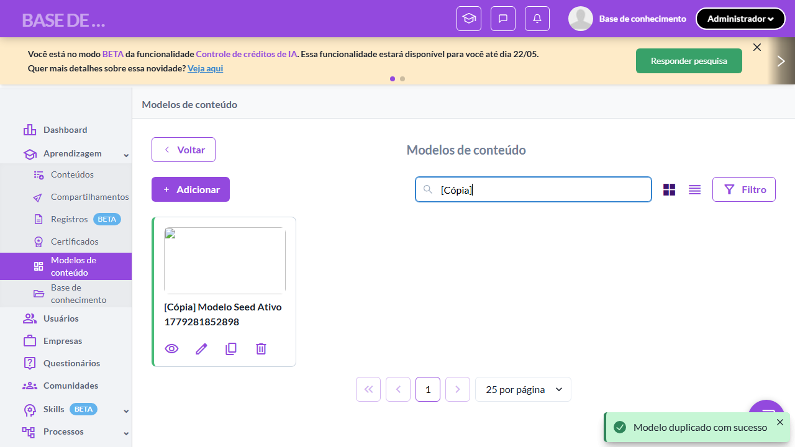
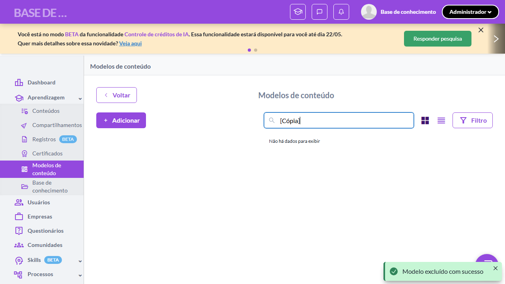
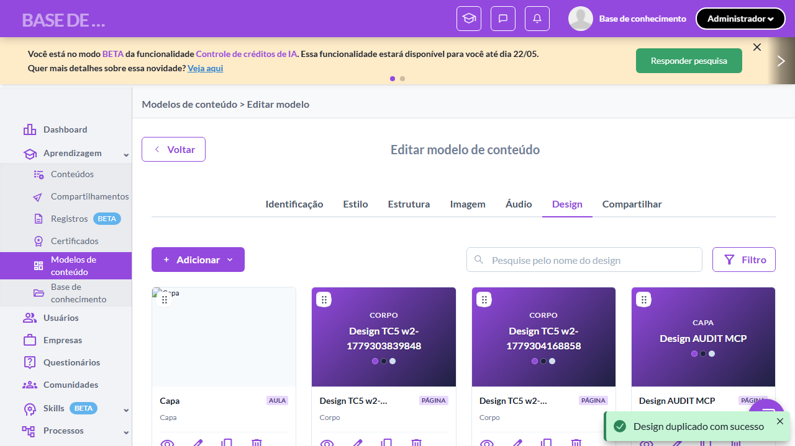
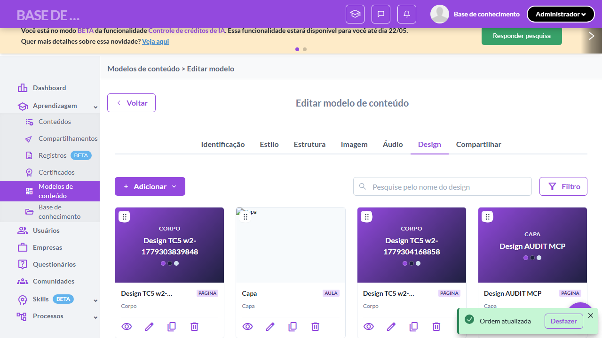
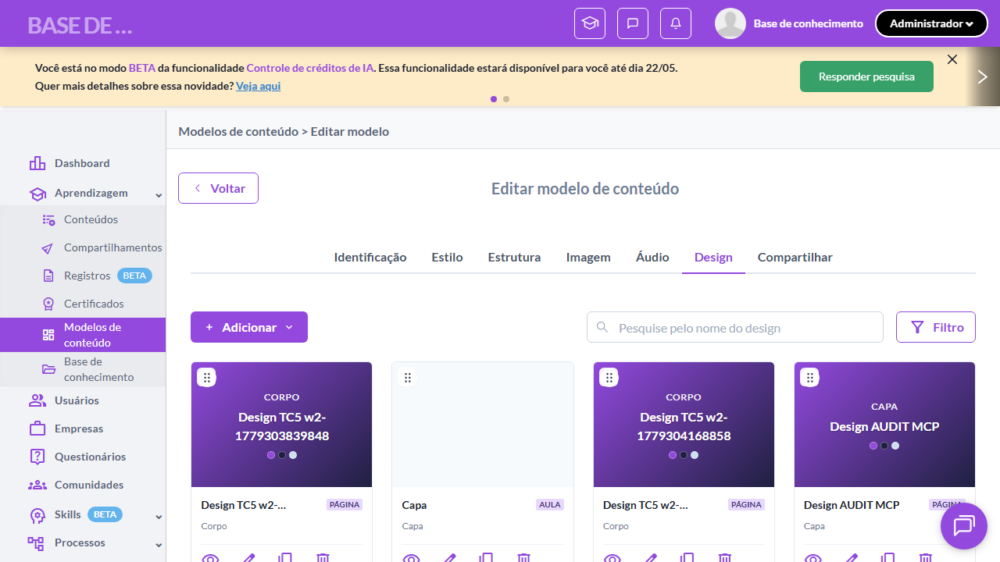

# Casos de teste — Modelos de conteúdo

[← Voltar ao dashboard](index.md)

Lista detalhada por testsuite. Cada caso traz: o que era esperado pelo XML, quais steps foram executados, evidências (screenshots/trace), texto pronto pra registro de bug e — quando houver falha — uma explicação em PT-BR do motivo.

## Ações Duplicar e Drag and Drop

_4 caso(s) — 4 aprovado(s), 0 falha(s)_

### ✅ Aprovado · TC1 · Duplicar modelo com cópia profunda · 🔴 Crítico

<a id="duplicar-modelo-com-copia-profunda"></a>_Arquivo:_ `tc01-duplicar-modelo-copia-profunda.spec.ts` · _Duração:_ 23.11s · _Browser:_ chromium

**Sumário (objetivo do caso):** Validar que duplicar modelo cria cópia profunda com nome "[Cópia] <original>" (RN 6.1).

**Pré-condições:**

```
Ambiente Stage configurado
Feature flag `modelos_de_conteudo` ativa
Modelo de teste cadastrado com pelo menos 3 designs cadastrados
Usuário logado como Admin
```

**Passos do caso (XML/TestLink + execução Playwright):**

_Cada linha reproduz um passo do XML; a coluna **Status** traz o resultado da execução (do step Allure correspondente). Linhas com "Pré-condição" são da execução automatizada (login, navegação inicial) — não fazem parte do roteiro do XML._

| # | Ação do passo | Resultado esperado | Status | Notas | Duração |
|---|---|---|:---:|---|---:|
| 1 | Acessar a listagem de modelos com o modelo de teste | Listagem é exibida. | ✅ | — | 12.41s |
| 2 | Clicar na ação "Duplicar" do modelo de teste | Toast exibida: "Modelo de conteúdo duplicado com sucesso.". | ✅ | — | 1.21s |
| 3 | Aguardar a listagem ser atualizada | Listagem exibe novo modelo com nome no formato "[Cópia] {nome original do modelo}", listado imediatamente. | ✅ | — | 2.39s |

**Evidências:**

📁 _Pasta:_ [`artifacts/projects-modelos-tests-fea-81805-r-modelo-com-cópia-profunda-chromium/`](artifacts/projects-modelos-tests-fea-81805-r-modelo-com-cópia-profunda-chromium/)

- 📸 **Screenshot (screenshot)** — [`test-finished-1.png`](artifacts/projects-modelos-tests-fea-81805-r-modelo-com-cópia-profunda-chromium/test-finished-1.png)

  

- 📸 **Screenshot (screenshot)** — [`test-finished-2.png`](artifacts/projects-modelos-tests-fea-81805-r-modelo-com-cópia-profunda-chromium/test-finished-2.png)

  

- 🎬 [Vídeo da execução (video.webm)](artifacts/projects-modelos-tests-fea-81805-r-modelo-com-cópia-profunda-chromium/video.webm)

- 📦 **Trace** — [`trace.zip`](artifacts/projects-modelos-tests-fea-81805-r-modelo-com-cópia-profunda-chromium/trace.zip)

  ```bash
  npx playwright show-trace outputs/modelos/reports/acoes-duplicar-e-drag-and-drop_20260520-171909/artifacts/projects-modelos-tests-fea-81805-r-modelo-com-cópia-profunda-chromium/trace.zip
  ```

- 🎥 **Vídeo** — [`video.webm`](artifacts/projects-modelos-tests-fea-81805-r-modelo-com-cópia-profunda-chromium/video.webm)


---

### ✅ Aprovado · TC2 · Duplicar design individual · 🔴 Crítico

<a id="duplicar-design-individual"></a>_Arquivo:_ `tc02-duplicar-design-individual.spec.ts` · _Duração:_ 24.02s · _Browser:_ chromium

**Sumário (objetivo do caso):** Validar duplicação individual de design (RN 6.1 estendido pela QA 2.2).

**Pré-condições:**

```
Ambiente Stage configurado
Feature flag `modelos_de_conteudo` ativa
Modelo de teste cadastrado com pelo menos 3 designs cadastrados
Usuário logado como Admin
```

**Passos do caso (XML/TestLink + execução Playwright):**

_Cada linha reproduz um passo do XML; a coluna **Status** traz o resultado da execução (do step Allure correspondente). Linhas com "Pré-condição" são da execução automatizada (login, navegação inicial) — não fazem parte do roteiro do XML._

| # | Ação do passo | Resultado esperado | Status | Notas | Duração |
|---|---|---|:---:|---|---:|
| 1 | Acessar a aba "Design" do modelo de teste | Listagem de designs é exibida. | ✅ | — | 19.45s |
| 2 | Clicar na ação "Duplicar" de um design existente | Listagem atualiza exibindo cópia do design com nome no formato "[Cópia] {nome original do design}". | ✅ | — | 1.34s |

**Evidências:**

📁 _Pasta:_ [`artifacts/projects-modelos-tests-fea-58f7a--Duplicar-design-individual-chromium/`](artifacts/projects-modelos-tests-fea-58f7a--Duplicar-design-individual-chromium/)

- 📸 **Screenshot (screenshot)** — [`test-finished-1.png`](artifacts/projects-modelos-tests-fea-58f7a--Duplicar-design-individual-chromium/test-finished-1.png)

  

- 🎬 [Vídeo da execução (video.webm)](artifacts/projects-modelos-tests-fea-58f7a--Duplicar-design-individual-chromium/video.webm)

- 📦 **Trace** — [`trace.zip`](artifacts/projects-modelos-tests-fea-58f7a--Duplicar-design-individual-chromium/trace.zip)

  ```bash
  npx playwright show-trace outputs/modelos/reports/acoes-duplicar-e-drag-and-drop_20260520-171909/artifacts/projects-modelos-tests-fea-58f7a--Duplicar-design-individual-chromium/trace.zip
  ```

- 🎥 **Vídeo** — [`video.webm`](artifacts/projects-modelos-tests-fea-58f7a--Duplicar-design-individual-chromium/video.webm)


---

### ✅ Aprovado · Drag and drop reorder designs 

<a id="drag-and-drop-reorder-designs"></a>_Arquivo:_ `tc03-drag-drop-reorder-designs.spec.ts` · _Duração:_ 25.54s · _Browser:_ chromium

**Passos do caso (XML/TestLink + execução Playwright):**

_Cada linha reproduz um passo do XML; a coluna **Status** traz o resultado da execução (do step Allure correspondente). Linhas com "Pré-condição" são da execução automatizada (login, navegação inicial) — não fazem parte do roteiro do XML._

| # | Ação do passo | Resultado esperado | Status | Notas | Duração |
|---|---|---|:---:|---|---:|
| — | _Pré-condição:_ 1. Acessar aba Design com pelo menos 2 designs | — | ✅ | — | 20.60s |
| — | _Pré-condição:_ 2. Arrastar 2º design pra primeira posição via drag handle | — | ✅ | — | 2.86s |

**Evidências:**

📁 _Pasta:_ [`artifacts/projects-modelos-tests-fea-39e1a-ag-and-drop-reorder-designs-chromium/`](artifacts/projects-modelos-tests-fea-39e1a-ag-and-drop-reorder-designs-chromium/)

- 📸 **Screenshot (screenshot)** — [`test-finished-1.png`](artifacts/projects-modelos-tests-fea-39e1a-ag-and-drop-reorder-designs-chromium/test-finished-1.png)

  

- 🎬 [Vídeo da execução (video.webm)](artifacts/projects-modelos-tests-fea-39e1a-ag-and-drop-reorder-designs-chromium/video.webm)

- 📦 **Trace** — [`trace.zip`](artifacts/projects-modelos-tests-fea-39e1a-ag-and-drop-reorder-designs-chromium/trace.zip)

  ```bash
  npx playwright show-trace outputs/modelos/reports/acoes-duplicar-e-drag-and-drop_20260520-171909/artifacts/projects-modelos-tests-fea-39e1a-ag-and-drop-reorder-designs-chromium/trace.zip
  ```

- 🎥 **Vídeo** — [`video.webm`](artifacts/projects-modelos-tests-fea-39e1a-ag-and-drop-reorder-designs-chromium/video.webm)


---

### ✅ Aprovado · TC4 · Drag and drop desabilitado quando filtro ativo · 🔴 Crítico

<a id="drag-and-drop-desabilitado-quando-filtro-ativo"></a>_Arquivo:_ `tc04-drag-drop-desabilitado-com-filtro.spec.ts` · _Duração:_ 26.12s · _Browser:_ chromium

**Sumário (objetivo do caso):** Validar que drag and drop fica desabilitado com filtro ativo (RN 63.1).

**Pré-condições:**

```
Ambiente Stage configurado
Feature flag `modelos_de_conteudo` ativa
Modelo de teste cadastrado com pelo menos 3 designs cadastrados
Usuário logado como Admin
```

**Passos do caso (XML/TestLink + execução Playwright):**

_Cada linha reproduz um passo do XML; a coluna **Status** traz o resultado da execução (do step Allure correspondente). Linhas com "Pré-condição" são da execução automatizada (login, navegação inicial) — não fazem parte do roteiro do XML._

| # | Ação do passo | Resultado esperado | Status | Notas | Duração |
|---|---|---|:---:|---|---:|
| — | _Pré-condição:_ cleanup: limpar filtro | — | ✅ | — | 0.47s |
| 1 | Acessar a aba "Design" do modelo de teste | Listagem é exibida. | ✅ | — | 23.10s |
| 2 | Aplicar o filtro padrão "Somente páginas" | Listagem exibe apenas designs do Tipo Página. | ✅ | — | 0.05s |
| 3 | Aguardar o ícone de drag ser renderizado | Ícone de drag exibido em estado desabilitado nas linhas/cards da listagem filtrada. | ✅ | — | — |

**Evidências:**

📁 _Pasta:_ [`artifacts/projects-modelos-tests-fea-0eadb-ilitado-quando-filtro-ativo-chromium/`](artifacts/projects-modelos-tests-fea-0eadb-ilitado-quando-filtro-ativo-chromium/)

- 📸 **Screenshot (screenshot)** — [`test-finished-1.png`](artifacts/projects-modelos-tests-fea-0eadb-ilitado-quando-filtro-ativo-chromium/test-finished-1.png)

  

- 🎬 [Vídeo da execução (video.webm)](artifacts/projects-modelos-tests-fea-0eadb-ilitado-quando-filtro-ativo-chromium/video.webm)

- 📦 **Trace** — [`trace.zip`](artifacts/projects-modelos-tests-fea-0eadb-ilitado-quando-filtro-ativo-chromium/trace.zip)

  ```bash
  npx playwright show-trace outputs/modelos/reports/acoes-duplicar-e-drag-and-drop_20260520-171909/artifacts/projects-modelos-tests-fea-0eadb-ilitado-quando-filtro-ativo-chromium/trace.zip
  ```

- 🎥 **Vídeo** — [`video.webm`](artifacts/projects-modelos-tests-fea-0eadb-ilitado-quando-filtro-ativo-chromium/video.webm)


---
