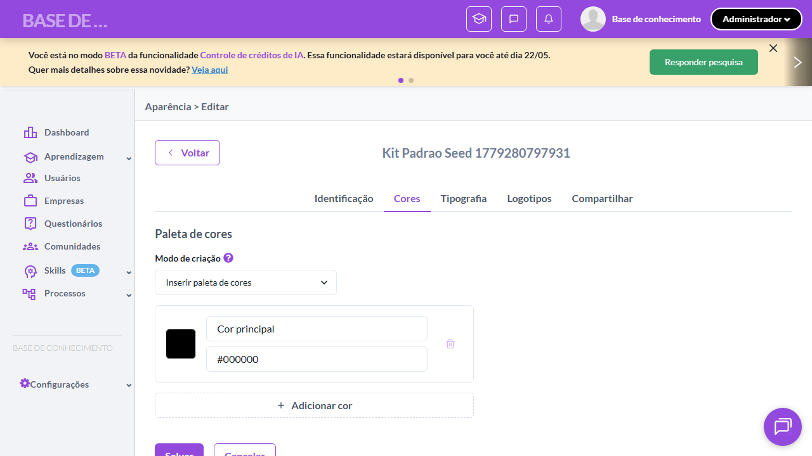
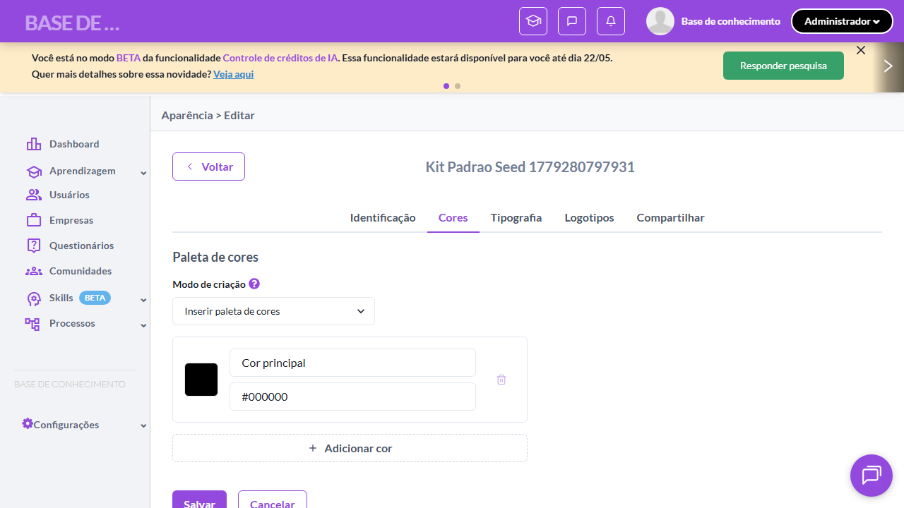

# Casos de teste — Modelos de conteúdo

[← Voltar ao dashboard](index.md)

Lista detalhada por testsuite. Cada caso traz: o que era esperado pelo XML, quais steps foram executados, evidências (screenshots/trace), texto pronto pra registro de bug e — quando houver falha — uma explicação em PT-BR do motivo.

## Bloqueio Exclusão Cores Kit de Marca

_2 caso(s) — 2 aprovado(s), 0 falha(s)_

### ✅ Aprovado · TC1 · Bloqueio de exclusão de cor em uso por modelo · 🔴 Crítico

<a id="bloqueio-de-exclusao-de-cor-em-uso-por-modelo"></a>_Arquivo:_ `tc01-bloqueio-cor-em-uso.spec.ts` · _Duração:_ 23.82s · _Browser:_ chromium

**Sumário (objetivo do caso):** Validar que cor de kit de marca em uso por modelo não pode ser excluída (RN 64).

**Pré-condições:**

```
Ambiente Stage configurado
Feature flag `modelos_de_conteudo` ativa
Kit de marca cadastrado e associado a pelo menos 1 modelo de conteúdo
Usuário logado como Admin
```

**Passos do caso (XML/TestLink + execução Playwright):**

_Cada linha reproduz um passo do XML; a coluna **Status** traz o resultado da execução (do step Allure correspondente). Linhas com "Pré-condição" são da execução automatizada (login, navegação inicial) — não fazem parte do roteiro do XML._

| # | Ação do passo | Resultado esperado | Status | Notas | Duração |
|---|---|---|:---:|---|---:|
| 1 | Acessar a tela de edição do kit de marca utilizado pelo modelo de teste | Tela de edição é exibida com as cores cadastradas. | ✅ | — | 18.70s |
| 2 | Clicar no botão de excluir da cor que está em uso pelo modelo | Mensagem de bloqueio exibida indicando que a cor está em uso por um ou mais modelos de conteúdo. Cor NÃO é excluída. | ✅ | — | 3.41s |

**Evidências:**

📁 _Pasta:_ [`artifacts/projects-modelos-tests-fea-c7334-ão-de-cor-em-uso-por-modelo-chromium/`](artifacts/projects-modelos-tests-fea-c7334-ão-de-cor-em-uso-por-modelo-chromium/)

- 📸 **Screenshot (screenshot)** — [`test-finished-1.png`](artifacts/projects-modelos-tests-fea-c7334-ão-de-cor-em-uso-por-modelo-chromium/test-finished-1.png)

  

- 🎬 [Vídeo da execução (video.webm)](artifacts/projects-modelos-tests-fea-c7334-ão-de-cor-em-uso-por-modelo-chromium/video.webm)

- 📦 **Trace** — [`trace.zip`](artifacts/projects-modelos-tests-fea-c7334-ão-de-cor-em-uso-por-modelo-chromium/trace.zip)

  ```bash
  npx playwright show-trace outputs/modelos/reports/bloqueio-exclusao-cores-kit-de-marca_20260521-081017/artifacts/projects-modelos-tests-fea-c7334-ão-de-cor-em-uso-por-modelo-chromium/trace.zip
  ```

- 🎥 **Vídeo** — [`video.webm`](artifacts/projects-modelos-tests-fea-c7334-ão-de-cor-em-uso-por-modelo-chromium/video.webm)


---

### ✅ Aprovado · TC2 · Exclusão permitida de cor sem modelos associados · 🔴 Crítico

<a id="exclusao-permitida-de-cor-sem-modelos-associados"></a>_Arquivo:_ `tc02-exclusao-cor-sem-modelos.spec.ts` · _Duração:_ 25.19s · _Browser:_ chromium

**Sumário (objetivo do caso):** Validar que cor sem modelos associados pode ser excluída normalmente (RN 64).

**Pré-condições:**

```
Ambiente Stage configurado
Feature flag `modelos_de_conteudo` ativa
Kit de marca cadastrado e associado a pelo menos 1 modelo de conteúdo
Usuário logado como Admin
```

**Passos do caso (XML/TestLink + execução Playwright):**

_Cada linha reproduz um passo do XML; a coluna **Status** traz o resultado da execução (do step Allure correspondente). Linhas com "Pré-condição" são da execução automatizada (login, navegação inicial) — não fazem parte do roteiro do XML._

| # | Ação do passo | Resultado esperado | Status | Notas | Duração |
|---|---|---|:---:|---|---:|
| — | _Pré-condição:_ 3. Adicionar cor extra (não-única) e validar que pode ser removida | — | ✅ | — | 1.08s |
| — | _Pré-condição:_ 4. Remover a cor adicionada e validar que sumiu do DOM | — | ✅ | — | 1.03s |
| 1 | Acessar a tela de edição de um kit de marca com cor não utilizada por nenhum modelo | Tela de edição é exibida. | ✅ | — | 18.47s |
| 2 | Clicar no botão de excluir da cor não utilizada | Cor é excluída e Toast de sucesso é exibida (REVISAR-FIGMA: texto exato). | ✅ | — | 2.94s |

**Evidências:**

📁 _Pasta:_ [`artifacts/projects-modelos-tests-fea-4775d--cor-sem-modelos-associados-chromium/`](artifacts/projects-modelos-tests-fea-4775d--cor-sem-modelos-associados-chromium/)

- 📸 **Screenshot (screenshot)** — [`test-finished-1.png`](artifacts/projects-modelos-tests-fea-4775d--cor-sem-modelos-associados-chromium/test-finished-1.png)

  

- 🎬 [Vídeo da execução (video.webm)](artifacts/projects-modelos-tests-fea-4775d--cor-sem-modelos-associados-chromium/video.webm)

- 📦 **Trace** — [`trace.zip`](artifacts/projects-modelos-tests-fea-4775d--cor-sem-modelos-associados-chromium/trace.zip)

  ```bash
  npx playwright show-trace outputs/modelos/reports/bloqueio-exclusao-cores-kit-de-marca_20260521-081017/artifacts/projects-modelos-tests-fea-4775d--cor-sem-modelos-associados-chromium/trace.zip
  ```

- 🎥 **Vídeo** — [`video.webm`](artifacts/projects-modelos-tests-fea-4775d--cor-sem-modelos-associados-chromium/video.webm)


---
