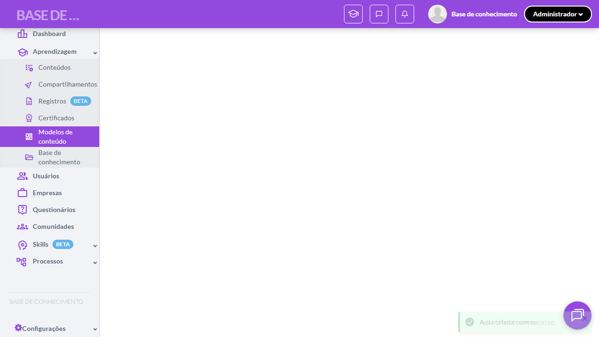

# Casos de teste — Modelos de conteúdo

[← Voltar ao dashboard](index.md)

Lista detalhada por testsuite. Cada caso traz: o que era esperado pelo XML, quais steps foram executados, evidências (screenshots/trace), texto pronto pra registro de bug e — quando houver falha — uma explicação em PT-BR do motivo.

## Criação de Design de Aula

_4 caso(s) — 2 aprovado(s), 0 falha(s), 2 ignorado(s)_

### ✅ Aprovado · TC1 · Acessar criação de Aula via menu Adicionar · 🔴 Crítico

<a id="acessar-criacao-de-aula-via-menu-adicionar"></a>_Arquivo:_ `tc01-acessar-criacao-aula-via-menu.spec.ts` · _Duração:_ 20.91s · _Browser:_ chromium

**Sumário (objetivo do caso):** Validar fluxo de criação de Aula (RN 30, RN 31, RN 38).

**Pré-condições:**

```
Ambiente Stage configurado
Feature flag `modelos_de_conteudo` ativa
Modelo de teste cadastrado no setup do spec, com pelo menos 1 kit de marca selecionado
Usuário logado como Admin
```

**Passos do caso (XML/TestLink + execução Playwright):**

_Cada linha reproduz um passo do XML; a coluna **Status** traz o resultado da execução (do step Allure correspondente). Linhas com "Pré-condição" são da execução automatizada (login, navegação inicial) — não fazem parte do roteiro do XML._

| # | Ação do passo | Resultado esperado | Status | Notas | Duração |
|---|---|---|:---:|---|---:|
| 1 | Acessar a aba "Design" do modelo de teste | Aba "Design" exibe a listagem de designs. | ✅ | — | 16.28s |
| 2 | Clicar no botão "Adicionar" | Menu suspenso é exibido com as opções "Aula" e "Página". | ✅ | — | 0.59s |
| 3 | Clicar na opção "Aula" | Sistema redireciona para a tela de criação de Aula exibindo a aba "Identificação". | ✅ | — | 1.77s |

**Evidências:**

📁 _Pasta:_ [`artifacts/projects-modelos-tests-fea-56d34--de-Aula-via-menu-Adicionar-chromium/`](artifacts/projects-modelos-tests-fea-56d34--de-Aula-via-menu-Adicionar-chromium/)

- 📸 **Screenshot (screenshot)** — [`test-finished-1.png`](artifacts/projects-modelos-tests-fea-56d34--de-Aula-via-menu-Adicionar-chromium/test-finished-1.png)

  

- 🎬 [Vídeo da execução (video.webm)](artifacts/projects-modelos-tests-fea-56d34--de-Aula-via-menu-Adicionar-chromium/video.webm)

- 📦 **Trace** — [`trace.zip`](artifacts/projects-modelos-tests-fea-56d34--de-Aula-via-menu-Adicionar-chromium/trace.zip)

  ```bash
  npx playwright show-trace outputs/modelos/reports/criacao-de-design-de-aula_20260520-163814/artifacts/projects-modelos-tests-fea-56d34--de-Aula-via-menu-Adicionar-chromium/trace.zip
  ```

- 🎥 **Vídeo** — [`video.webm`](artifacts/projects-modelos-tests-fea-56d34--de-Aula-via-menu-Adicionar-chromium/video.webm)


---

### ✅ Aprovado · TC2 · Salvar Aula com dados válidos · 🔴 Crítico

<a id="salvar-aula-com-dados-validos"></a>_Arquivo:_ `tc02-salvar-aula-dados-validos.spec.ts` · _Duração:_ 27.00s · _Browser:_ chromium

**Sumário (objetivo do caso):** Validar criação de Aula com campos da Identificação (RN 39, RN 40).

**Pré-condições:**

```
Ambiente Stage configurado
Feature flag `modelos_de_conteudo` ativa
Modelo de teste cadastrado no setup do spec, com pelo menos 1 kit de marca selecionado
Usuário logado como Admin
```

**Passos do caso (XML/TestLink + execução Playwright):**

_Cada linha reproduz um passo do XML; a coluna **Status** traz o resultado da execução (do step Allure correspondente). Linhas com "Pré-condição" são da execução automatizada (login, navegação inicial) — não fazem parte do roteiro do XML._

| # | Ação do passo | Resultado esperado | Status | Notas | Duração |
|---|---|---|:---:|---|---:|
| — | _Pré-condição:_ 2-4. Preencher Nome + Tipo "Introdução" + Sequência | — | ✅ | — | 4.37s |
| 1 | Acessar a tela de criação de Aula com a aba "Identificação" | Aba "Identificação" é exibida. | ✅ | — | 19.65s |
| 2 | Preencher o campo "Nome" com "Aula TC2 w{workerIndex}-{timestamp}" | Campo "Nome" exibe o texto digitado. | ✅ | — | — |
| 3 | Selecionar "Introdução" no campo "Tipo" | Campos de instruções são auto-preenchidos com textos canônicos de Introdução. | ✅ | — | — |
| 4 | Preencher o campo "Sequência" com "1" | Campo "Sequência" exibe o valor digitado. | ✅ | — | — |
| 5 | Clicar no botão "Salvar" | Sistema redireciona automaticamente para a aba "Design" da Aula. | ✅ | — | 0.87s |

**Evidências:**

📁 _Pasta:_ [`artifacts/projects-modelos-tests-fea-f0989-lvar-Aula-com-dados-válidos-chromium/`](artifacts/projects-modelos-tests-fea-f0989-lvar-Aula-com-dados-válidos-chromium/)

- 📸 **Screenshot (screenshot)** — [`test-finished-1.png`](artifacts/projects-modelos-tests-fea-f0989-lvar-Aula-com-dados-válidos-chromium/test-finished-1.png)

  

- 🎬 [Vídeo da execução (video.webm)](artifacts/projects-modelos-tests-fea-f0989-lvar-Aula-com-dados-válidos-chromium/video.webm)

- 📦 **Trace** — [`trace.zip`](artifacts/projects-modelos-tests-fea-f0989-lvar-Aula-com-dados-válidos-chromium/trace.zip)

  ```bash
  npx playwright show-trace outputs/modelos/reports/criacao-de-design-de-aula_20260520-163814/artifacts/projects-modelos-tests-fea-f0989-lvar-Aula-com-dados-válidos-chromium/trace.zip
  ```

- 🎥 **Vídeo** — [`video.webm`](artifacts/projects-modelos-tests-fea-f0989-lvar-Aula-com-dados-válidos-chromium/video.webm)


---

### ⊘ Ignorado · TC3 · Aba Design da Aula exibe editor padrão com customizações · 🔴 Crítico

<a id="aba-design-da-aula-exibe-editor-padrao-com-customizacoes"></a>_Arquivo:_ `tc03-aba-design-aula-editor-customizacoes.spec.ts` · _Duração:_ 0.00s · _Browser:_ chromium

> **⊘ Por que foi ignorado:** Caso ignorado pelo Playwright sem justificativa registrada (test.skip/fixme sem mensagem).

**Sumário (objetivo do caso):** Validar que a aba Design exibe o editor de Aula padrão com customizações de kit de marca (RN 41, RN 42).

**Pré-condições:**

```
Ambiente Stage configurado
Feature flag `modelos_de_conteudo` ativa
Modelo de teste cadastrado no setup do spec, com pelo menos 1 kit de marca selecionado
Usuário logado como Admin
```

**Passos do caso (XML/TestLink + execução Playwright):**

_Cada linha reproduz um passo do XML; a coluna **Status** traz o resultado da execução (do step Allure correspondente). Linhas com "Pré-condição" são da execução automatizada (login, navegação inicial) — não fazem parte do roteiro do XML._

| # | Ação do passo | Resultado esperado | Status | Notas | Duração |
|---|---|---|:---:|---|---:|
| 1 | Acessar a aba "Design" de uma Aula recém-salva | Editor de Aula padrão da plataforma é exibido. | ⊘ | Step não executado — Caso ignorado pelo Playwright sem justificativa registrada (test.skip/fixme sem mensagem). | — |
| 2 | Aguardar a ferramenta de layout com seleção de kit de marca ser renderizada | Ferramenta de layout exibe os 3 primeiros kits de marca cadastrados, com possibilidade de scroll para acessar os demais. | ⊘ | Step não executado — Caso ignorado pelo Playwright sem justificativa registrada (test.skip/fixme sem mensagem). | — |

**Evidências:**

_Sem evidências anexadas._

#### ⏳ Pendente — execução automatizada não realizada

- **Severidade do caso (XML):** Crítico
- **Motivo do skip / fixme:** Sem motivo registrado.

**Roteiro do XML (para validação manual):**
1. Pré: Ambiente Stage configurado
1. Pré: Feature flag `modelos_de_conteudo` ativa
1. Pré: Modelo de teste cadastrado no setup do spec, com pelo menos 1 kit de marca selecionado
1. Pré: Usuário logado como Admin
1. 1. Acessar a aba "Design" de uma Aula recém-salva
1. 2. Aguardar a ferramenta de layout com seleção de kit de marca ser renderizada

> Esse caso não bloqueia a build, mas precisa de validação manual ou ajuste no agente.


---

### ⊘ Ignorado · TC4 · Salvar Aula retorna para aba Design do Modelo · 🔴 Crítico

<a id="salvar-aula-retorna-para-aba-design-do-modelo"></a>_Arquivo:_ `tc04-salvar-aula-retorna-design-modelo.spec.ts` · _Duração:_ 0.00s · _Browser:_ chromium

> **⊘ Por que foi ignorado:** Caso ignorado pelo Playwright sem justificativa registrada (test.skip/fixme sem mensagem).

**Sumário (objetivo do caso):** Validar retorno à aba Design do Modelo (RN 43).

**Pré-condições:**

```
Ambiente Stage configurado
Feature flag `modelos_de_conteudo` ativa
Modelo de teste cadastrado no setup do spec, com pelo menos 1 kit de marca selecionado
Usuário logado como Admin
```

**Passos do caso (XML/TestLink + execução Playwright):**

_Cada linha reproduz um passo do XML; a coluna **Status** traz o resultado da execução (do step Allure correspondente). Linhas com "Pré-condição" são da execução automatizada (login, navegação inicial) — não fazem parte do roteiro do XML._

| # | Ação do passo | Resultado esperado | Status | Notas | Duração |
|---|---|---|:---:|---|---:|
| 1 | Acessar a aba "Design" da Aula em criação | Editor é exibido. | ⊘ | Step não executado — Caso ignorado pelo Playwright sem justificativa registrada (test.skip/fixme sem mensagem). | — |
| 2 | Clicar no botão "Salvar" da Aula | Sistema retorna para a aba "Design" do Modelo de conteúdo. | ⊘ | Step não executado — Caso ignorado pelo Playwright sem justificativa registrada (test.skip/fixme sem mensagem). | — |
| 3 | Aguardar a listagem de designs do Modelo carregar | Listagem exibe a nova Aula criada na lista de designs. | ⊘ | Step não executado — Caso ignorado pelo Playwright sem justificativa registrada (test.skip/fixme sem mensagem). | — |

**Evidências:**

_Sem evidências anexadas._

#### ⏳ Pendente — execução automatizada não realizada

- **Severidade do caso (XML):** Crítico
- **Motivo do skip / fixme:** Sem motivo registrado.

**Roteiro do XML (para validação manual):**
1. Pré: Ambiente Stage configurado
1. Pré: Feature flag `modelos_de_conteudo` ativa
1. Pré: Modelo de teste cadastrado no setup do spec, com pelo menos 1 kit de marca selecionado
1. Pré: Usuário logado como Admin
1. 1. Acessar a aba "Design" da Aula em criação
1. 2. Clicar no botão "Salvar" da Aula
1. 3. Aguardar a listagem de designs do Modelo carregar

> Esse caso não bloqueia a build, mas precisa de validação manual ou ajuste no agente.


---
