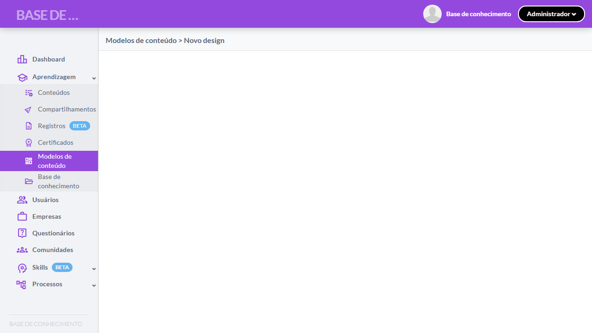
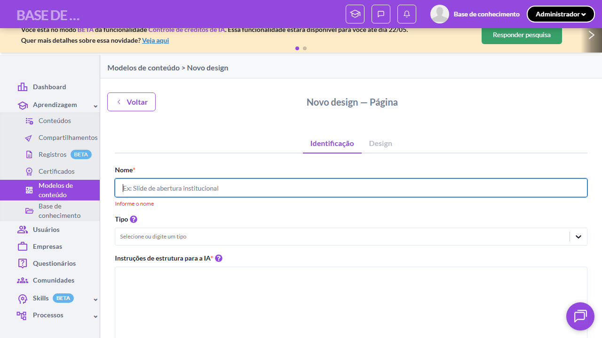
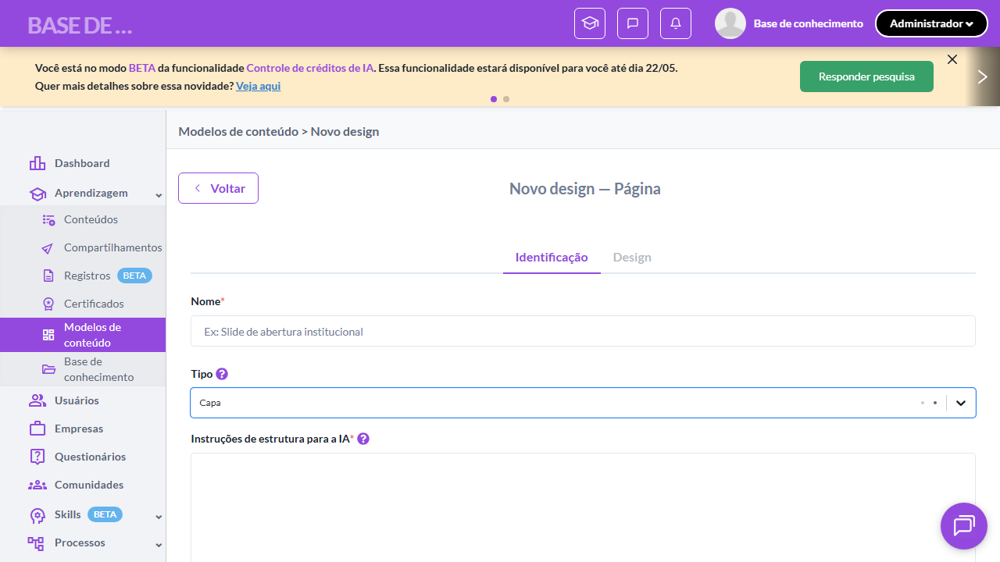
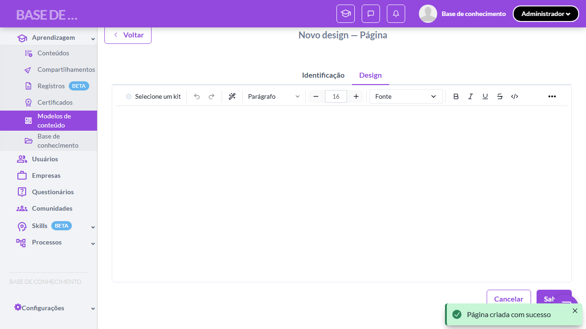
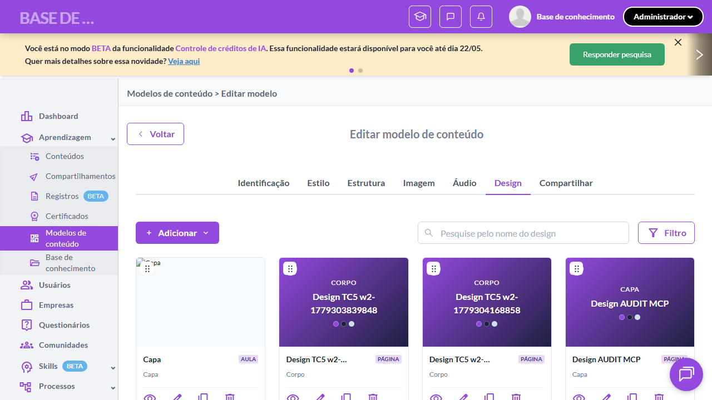

# Casos de teste — Modelos de conteúdo

[← Voltar ao dashboard](index.md)

Lista detalhada por testsuite. Cada caso traz: o que era esperado pelo XML, quais steps foram executados, evidências (screenshots/trace), texto pronto pra registro de bug e — quando houver falha — uma explicação em PT-BR do motivo.

## Criação de Design de Página

_7 caso(s) — 7 aprovado(s), 0 falha(s)_

### ✅ Aprovado · TC1 · Acessar criação de Página via menu Adicionar · 🔴 Crítico

<a id="acessar-criacao-de-pagina-via-menu-adicionar"></a>_Arquivo:_ `tc01-acessar-criacao-pagina-via-menu.spec.ts` · _Duração:_ 21.89s · _Browser:_ chromium

**Sumário (objetivo do caso):** Validar fluxo de criação de Página (RN 30, RN 31, RN 32).

**Pré-condições:**

```
Ambiente Stage configurado
Feature flag `modelos_de_conteudo` ativa
Modelo de teste cadastrado no setup do spec, com pelo menos 1 kit de marca selecionado
Usuário logado como Admin
```

**Passos do caso (XML/TestLink + execução Playwright):**

_Cada linha reproduz um passo do XML; a coluna **Status** traz o resultado da execução (do step Allure correspondente). Linhas com "Pré-condição" são da execução automatizada (login, navegação inicial) — não fazem parte do roteiro do XML._

| # | Ação do passo | Resultado esperado | Status | Notas | Duração |
|---|---|---|:---:|---|---:|
| 1 | Acessar a aba "Design" do modelo de teste | Aba "Design" exibe a listagem de designs (vazia ou com designs cadastrados). | ✅ | — | 16.61s |
| 2 | Clicar no botão "Adicionar" | Menu suspenso é exibido com as opções "Aula" e "Página". | ✅ | — | 0.66s |
| 3 | Clicar na opção "Página" | Sistema redireciona para a tela de criação de Página exibindo a aba "Identificação". | ✅ | — | 1.53s |

**Evidências:**

📁 _Pasta:_ [`artifacts/projects-modelos-tests-fea-20009-e-Página-via-menu-Adicionar-chromium/`](artifacts/projects-modelos-tests-fea-20009-e-Página-via-menu-Adicionar-chromium/)

- 📸 **Screenshot (screenshot)** — [`test-finished-1.png`](artifacts/projects-modelos-tests-fea-20009-e-Página-via-menu-Adicionar-chromium/test-finished-1.png)

  

- 🎬 [Vídeo da execução (video.webm)](artifacts/projects-modelos-tests-fea-20009-e-Página-via-menu-Adicionar-chromium/video.webm)

- 📦 **Trace** — [`trace.zip`](artifacts/projects-modelos-tests-fea-20009-e-Página-via-menu-Adicionar-chromium/trace.zip)

  ```bash
  npx playwright show-trace outputs/modelos/reports/criacao-de-design-de-pagina_20260520-162433/artifacts/projects-modelos-tests-fea-20009-e-Página-via-menu-Adicionar-chromium/trace.zip
  ```

- 🎥 **Vídeo** — [`video.webm`](artifacts/projects-modelos-tests-fea-20009-e-Página-via-menu-Adicionar-chromium/video.webm)


---

### ✅ Aprovado · Validar campos obrigatórios da aba Identificação 

<a id="validar-campos-obrigatorios-da-aba-identificacao"></a>_Arquivo:_ `tc02-validar-campos-obrigatorios.spec.ts` · _Duração:_ 26.79s · _Browser:_ chromium

**Passos do caso (XML/TestLink + execução Playwright):**

_Cada linha reproduz um passo do XML; a coluna **Status** traz o resultado da execução (do step Allure correspondente). Linhas com "Pré-condição" são da execução automatizada (login, navegação inicial) — não fazem parte do roteiro do XML._

| # | Ação do passo | Resultado esperado | Status | Notas | Duração |
|---|---|---|:---:|---|---:|
| — | _Pré-condição:_ 1. Abrir tela de criação Página | — | ✅ | — | 20.21s |
| — | _Pré-condição:_ 2. Clicar Salvar sem preencher nada | — | ✅ | — | 4.61s |
| — | _Pré-condição:_ 3. Validar bloqueio (URL permanece em /new) | — | ✅ | — | 0.03s |

**Evidências:**

📁 _Pasta:_ [`artifacts/projects-modelos-tests-fea-49207-tórios-da-aba-Identificação-chromium/`](artifacts/projects-modelos-tests-fea-49207-tórios-da-aba-Identificação-chromium/)

- 📸 **Screenshot (screenshot)** — [`test-finished-1.png`](artifacts/projects-modelos-tests-fea-49207-tórios-da-aba-Identificação-chromium/test-finished-1.png)

  

- 🎬 [Vídeo da execução (video.webm)](artifacts/projects-modelos-tests-fea-49207-tórios-da-aba-Identificação-chromium/video.webm)

- 📦 **Trace** — [`trace.zip`](artifacts/projects-modelos-tests-fea-49207-tórios-da-aba-Identificação-chromium/trace.zip)

  ```bash
  npx playwright show-trace outputs/modelos/reports/criacao-de-design-de-pagina_20260520-162433/artifacts/projects-modelos-tests-fea-49207-tórios-da-aba-Identificação-chromium/trace.zip
  ```

- 🎥 **Vídeo** — [`video.webm`](artifacts/projects-modelos-tests-fea-49207-tórios-da-aba-Identificação-chromium/video.webm)


---

### ✅ Aprovado · TC3 · Auto-preenchimento ao selecionar tipo "Capa" · 🔴 Crítico

<a id="auto-preenchimento-ao-selecionar-tipo-capa"></a>_Arquivo:_ `tc03-autofill-tipo-capa.spec.ts` · _Duração:_ 26.45s · _Browser:_ chromium

**Sumário (objetivo do caso):** Validar auto-preenchimento dos campos de instruções ao selecionar o tipo "Capa" (RN 33.1).

**Pré-condições:**

```
Ambiente Stage configurado
Feature flag `modelos_de_conteudo` ativa
Modelo de teste cadastrado no setup do spec, com pelo menos 1 kit de marca selecionado
Usuário logado como Admin
```

**Passos do caso (XML/TestLink + execução Playwright):**

_Cada linha reproduz um passo do XML; a coluna **Status** traz o resultado da execução (do step Allure correspondente). Linhas com "Pré-condição" são da execução automatizada (login, navegação inicial) — não fazem parte do roteiro do XML._

| # | Ação do passo | Resultado esperado | Status | Notas | Duração |
|---|---|---|:---:|---|---:|
| — | _Pré-condição:_ 4. Validar auto-fill via contadores Plate (49/500 estrutura + 225/500 conteúdo) | — | ✅ | — | 0.05s |
| 1 | Acessar a tela de criação de Página com a aba "Identificação" | Aba "Identificação" é exibida. | ✅ | — | 19.50s |
| 2 | Selecionar "Capa" no campo "Tipo" | Campo "Tipo" exibe "Capa" selecionado. | ✅ | — | 1.74s |
| 3 | Aguardar o auto-preenchimento dos campos de instruções | Campo "Instruções de estrutura para a IA" é preenchido automaticamente com: "Usar sempre como primeira parte de qualquer aula.". Campo "Instruções de conteúdo para a IA" é preenchido automaticamente com texto canônico da Capa. | ✅ | — | 3.15s |

**Evidências:**

📁 _Pasta:_ [`artifacts/projects-modelos-tests-fea-8db40-to-ao-selecionar-tipo-Capa--chromium/`](artifacts/projects-modelos-tests-fea-8db40-to-ao-selecionar-tipo-Capa--chromium/)

- 📸 **Screenshot (screenshot)** — [`test-finished-1.png`](artifacts/projects-modelos-tests-fea-8db40-to-ao-selecionar-tipo-Capa--chromium/test-finished-1.png)

  

- 🎬 [Vídeo da execução (video.webm)](artifacts/projects-modelos-tests-fea-8db40-to-ao-selecionar-tipo-Capa--chromium/video.webm)

- 📦 **Trace** — [`trace.zip`](artifacts/projects-modelos-tests-fea-8db40-to-ao-selecionar-tipo-Capa--chromium/trace.zip)

  ```bash
  npx playwright show-trace outputs/modelos/reports/criacao-de-design-de-pagina_20260520-162433/artifacts/projects-modelos-tests-fea-8db40-to-ao-selecionar-tipo-Capa--chromium/trace.zip
  ```

- 🎥 **Vídeo** — [`video.webm`](artifacts/projects-modelos-tests-fea-8db40-to-ao-selecionar-tipo-Capa--chromium/video.webm)


---

### ✅ Aprovado · TC4 · Tooltip do campo Tipo · 🟡 Normal

<a id="tooltip-do-campo-tipo"></a>_Arquivo:_ `tc04-tooltip-campo-tipo.spec.ts` · _Duração:_ 25.40s · _Browser:_ chromium

**Sumário (objetivo do caso):** Validar texto da tooltip do campo Tipo (RN 33).

**Pré-condições:**

```
Ambiente Stage configurado
Feature flag `modelos_de_conteudo` ativa
Modelo de teste cadastrado no setup do spec, com pelo menos 1 kit de marca selecionado
Usuário logado como Admin
```

**Passos do caso (XML/TestLink + execução Playwright):**

_Cada linha reproduz um passo do XML; a coluna **Status** traz o resultado da execução (do step Allure correspondente). Linhas com "Pré-condição" são da execução automatizada (login, navegação inicial) — não fazem parte do roteiro do XML._

| # | Ação do passo | Resultado esperado | Status | Notas | Duração |
|---|---|---|:---:|---|---:|
| 1 | Acessar a tela de criação de Página com a aba "Identificação" | Aba é exibida. | ✅ | — | 20.79s |
| 2 | Aguardar a tooltip do campo "Tipo" ser exibida ao posicionar o mouse | Tooltip exibida: "Classifique este design por tipo de parte (ex: Capa, Corpo, Encerramento). Essa informação será utilizada para filtrar e organizar seus designs.". | ✅ | — | 2.14s |

**Evidências:**

📁 _Pasta:_ [`artifacts/projects-modelos-tests-fea-8d1bd-ágina-Tooltip-do-campo-Tipo-chromium/`](artifacts/projects-modelos-tests-fea-8d1bd-ágina-Tooltip-do-campo-Tipo-chromium/)

- 📸 **Screenshot (screenshot)** — [`test-finished-1.png`](artifacts/projects-modelos-tests-fea-8d1bd-ágina-Tooltip-do-campo-Tipo-chromium/test-finished-1.png)

  

- 🎬 [Vídeo da execução (video.webm)](artifacts/projects-modelos-tests-fea-8d1bd-ágina-Tooltip-do-campo-Tipo-chromium/video.webm)

- 📦 **Trace** — [`trace.zip`](artifacts/projects-modelos-tests-fea-8d1bd-ágina-Tooltip-do-campo-Tipo-chromium/trace.zip)

  ```bash
  npx playwright show-trace outputs/modelos/reports/criacao-de-design-de-pagina_20260520-162433/artifacts/projects-modelos-tests-fea-8d1bd-ágina-Tooltip-do-campo-Tipo-chromium/trace.zip
  ```

- 🎥 **Vídeo** — [`video.webm`](artifacts/projects-modelos-tests-fea-8d1bd-ágina-Tooltip-do-campo-Tipo-chromium/video.webm)


---

### ✅ Aprovado · TC5 · Salvar Identificação redireciona para aba Design · 🔴 Crítico

<a id="salvar-identificacao-redireciona-para-aba-design"></a>_Arquivo:_ `tc05-salvar-identificacao-redireciona.spec.ts` · _Duração:_ 24.43s · _Browser:_ chromium

**Sumário (objetivo do caso):** Validar redirecionamento automático após salvar Identificação (RN 34).

**Pré-condições:**

```
Ambiente Stage configurado
Feature flag `modelos_de_conteudo` ativa
Modelo de teste cadastrado no setup do spec, com pelo menos 1 kit de marca selecionado
Usuário logado como Admin
```

**Passos do caso (XML/TestLink + execução Playwright):**

_Cada linha reproduz um passo do XML; a coluna **Status** traz o resultado da execução (do step Allure correspondente). Linhas com "Pré-condição" são da execução automatizada (login, navegação inicial) — não fazem parte do roteiro do XML._

| # | Ação do passo | Resultado esperado | Status | Notas | Duração |
|---|---|---|:---:|---|---:|
| — | _Pré-condição:_ 2-3. Preencher Nome + Tipo "Corpo" | — | ✅ | — | 3.91s |
| 1 | Acessar a tela de criação de Página com a aba "Identificação" | Aba "Identificação" é exibida. | ✅ | — | 17.31s |
| 2 | Preencher o campo "Nome" com "Design TC5 w{workerIndex}-{timestamp}" | Campo "Nome" exibe o texto digitado. | ✅ | — | — |
| 3 | Selecionar "Corpo" no campo "Tipo" | Campos de instrução são auto-preenchidos. | ✅ | — | — |
| 4 | Preencher o campo "Sequência" com "1" | Campo "Sequência" exibe o valor digitado. | ✅ | — | 0.10s |
| 5 | Clicar no botão "Salvar" | Toast exibida: "Design criado com sucesso.". Sistema redireciona automaticamente para a aba "Design" da própria Página. | ✅ | — | 1.12s |

**Evidências:**

📁 _Pasta:_ [`artifacts/projects-modelos-tests-fea-a430e-redireciona-para-aba-Design-chromium/`](artifacts/projects-modelos-tests-fea-a430e-redireciona-para-aba-Design-chromium/)

- 📸 **Screenshot (screenshot)** — [`test-finished-1.png`](artifacts/projects-modelos-tests-fea-a430e-redireciona-para-aba-Design-chromium/test-finished-1.png)

  

- 🎬 [Vídeo da execução (video.webm)](artifacts/projects-modelos-tests-fea-a430e-redireciona-para-aba-Design-chromium/video.webm)

- 📦 **Trace** — [`trace.zip`](artifacts/projects-modelos-tests-fea-a430e-redireciona-para-aba-Design-chromium/trace.zip)

  ```bash
  npx playwright show-trace outputs/modelos/reports/criacao-de-design-de-pagina_20260520-162433/artifacts/projects-modelos-tests-fea-a430e-redireciona-para-aba-Design-chromium/trace.zip
  ```

- 🎥 **Vídeo** — [`video.webm`](artifacts/projects-modelos-tests-fea-a430e-redireciona-para-aba-Design-chromium/video.webm)


---

### ✅ Aprovado · Aba Design exibe Plate Editor com Kit de Marca 

<a id="aba-design-exibe-plate-editor-com-kit-de-marca"></a>_Arquivo:_ `tc06-aba-design-plate-editor-kit.spec.ts` · _Duração:_ 24.96s · _Browser:_ chromium

**Passos do caso (XML/TestLink + execução Playwright):**

_Cada linha reproduz um passo do XML; a coluna **Status** traz o resultado da execução (do step Allure correspondente). Linhas com "Pré-condição" são da execução automatizada (login, navegação inicial) — não fazem parte do roteiro do XML._

| # | Ação do passo | Resultado esperado | Status | Notas | Duração |
|---|---|---|:---:|---|---:|
| — | _Pré-condição:_ 1. Criar Design via Identificação e chegar na aba Design | — | ✅ | — | 22.96s |
| — | _Pré-condição:_ 2. Validar Plate Editor renderizado (testId canônico) | — | ✅ | — | 0.65s |
| — | _Pré-condição:_ 3. Validar botão de Kit de Marca presente | — | ✅ | — | 0.03s |

**Evidências:**

📁 _Pasta:_ [`artifacts/projects-modelos-tests-fea-4e05e-ate-Editor-com-Kit-de-Marca-chromium/`](artifacts/projects-modelos-tests-fea-4e05e-ate-Editor-com-Kit-de-Marca-chromium/)

- 📸 **Screenshot (screenshot)** — [`test-finished-1.png`](artifacts/projects-modelos-tests-fea-4e05e-ate-Editor-com-Kit-de-Marca-chromium/test-finished-1.png)

  

- 🎬 [Vídeo da execução (video.webm)](artifacts/projects-modelos-tests-fea-4e05e-ate-Editor-com-Kit-de-Marca-chromium/video.webm)

- 📦 **Trace** — [`trace.zip`](artifacts/projects-modelos-tests-fea-4e05e-ate-Editor-com-Kit-de-Marca-chromium/trace.zip)

  ```bash
  npx playwright show-trace outputs/modelos/reports/criacao-de-design-de-pagina_20260520-162433/artifacts/projects-modelos-tests-fea-4e05e-ate-Editor-com-Kit-de-Marca-chromium/trace.zip
  ```

- 🎥 **Vídeo** — [`video.webm`](artifacts/projects-modelos-tests-fea-4e05e-ate-Editor-com-Kit-de-Marca-chromium/video.webm)


---

### ✅ Aprovado · TC7 · Salvar Página retorna para aba Design do Modelo · 🔴 Crítico

<a id="salvar-pagina-retorna-para-aba-design-do-modelo"></a>_Arquivo:_ `tc07-salvar-pagina-retorna-design-modelo.spec.ts` · _Duração:_ 31.21s · _Browser:_ chromium

**Sumário (objetivo do caso):** Validar retorno à aba Design do Modelo com listagem atualizada (RN 37).

**Pré-condições:**

```
Ambiente Stage configurado
Feature flag `modelos_de_conteudo` ativa
Modelo de teste cadastrado no setup do spec, com pelo menos 1 kit de marca selecionado
Usuário logado como Admin
```

**Passos do caso (XML/TestLink + execução Playwright):**

_Cada linha reproduz um passo do XML; a coluna **Status** traz o resultado da execução (do step Allure correspondente). Linhas com "Pré-condição" são da execução automatizada (login, navegação inicial) — não fazem parte do roteiro do XML._

| # | Ação do passo | Resultado esperado | Status | Notas | Duração |
|---|---|---|:---:|---|---:|
| 1 | Acessar a aba "Design" da Página em criação | Plate Editor é exibido. | ✅ | — | 23.81s |
| 2 | Clicar no botão "Salvar" da Página | Sistema retorna para a aba "Design" do Modelo de conteúdo. | ✅ | — | 5.74s |
| 3 | Aguardar a listagem de designs do Modelo carregar | Listagem exibe a nova Página criada na lista de designs. | ✅ | — | 0.27s |

**Evidências:**

📁 _Pasta:_ [`artifacts/projects-modelos-tests-fea-7970b-a-para-aba-Design-do-Modelo-chromium/`](artifacts/projects-modelos-tests-fea-7970b-a-para-aba-Design-do-Modelo-chromium/)

- 📸 **Screenshot (screenshot)** — [`test-finished-1.png`](artifacts/projects-modelos-tests-fea-7970b-a-para-aba-Design-do-Modelo-chromium/test-finished-1.png)

  

- 🎬 [Vídeo da execução (video.webm)](artifacts/projects-modelos-tests-fea-7970b-a-para-aba-Design-do-Modelo-chromium/video.webm)

- 📦 **Trace** — [`trace.zip`](artifacts/projects-modelos-tests-fea-7970b-a-para-aba-Design-do-Modelo-chromium/trace.zip)

  ```bash
  npx playwright show-trace outputs/modelos/reports/criacao-de-design-de-pagina_20260520-162433/artifacts/projects-modelos-tests-fea-7970b-a-para-aba-Design-do-Modelo-chromium/trace.zip
  ```

- 🎥 **Vídeo** — [`video.webm`](artifacts/projects-modelos-tests-fea-7970b-a-para-aba-Design-do-Modelo-chromium/video.webm)


---
