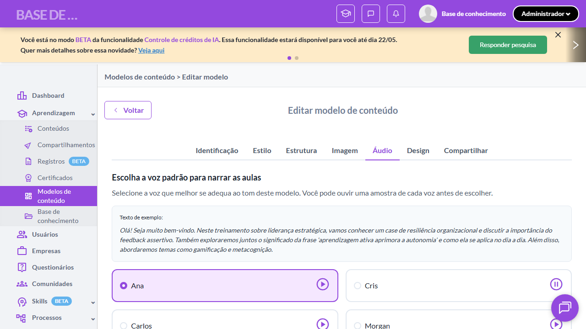

# Casos de teste — Modelos de conteúdo

[← Voltar ao dashboard](index.md)

Lista detalhada por testsuite. Cada caso traz: o que era esperado pelo XML, quais steps foram executados, evidências (screenshots/trace), texto pronto pra registro de bug e — quando houver falha — uma explicação em PT-BR do motivo.

## Criação de Modelo - Aba Áudio

_4 caso(s) — 4 aprovado(s), 0 falha(s)_

### ✅ Aprovado · TC1 · Aba Áudio exibe título e subtítulo literais · 🔴 Crítico

<a id="aba-audio-exibe-titulo-e-subtitulo-literais"></a>_Arquivo:_ `tc01-aba-audio-titulo-subtitulo.spec.ts` · _Duração:_ 22.22s · _Browser:_ chromium

**Sumário (objetivo do caso):** Validar textos literais da aba Áudio (RN 58.1, RN 58.2).

**Pré-condições:**

```
Ambiente Stage configurado
Feature flag `modelos_de_conteudo` ativa
Modelo de teste cadastrado no setup do spec (via beforeAll)
Usuário logado como Admin
```

**Passos do caso (XML/TestLink + execução Playwright):**

_Cada linha reproduz um passo do XML; a coluna **Status** traz o resultado da execução (do step Allure correspondente). Linhas com "Pré-condição" são da execução automatizada (login, navegação inicial) — não fazem parte do roteiro do XML._

| # | Ação do passo | Resultado esperado | Status | Notas | Duração |
|---|---|---|:---:|---|---:|
| 1 | Acessar a aba "Áudio" do modelo de teste | Aba "Áudio" fica selecionada. | ✅ | — | 17.82s |
| 2 | Aguardar a renderização da seção | Título exibido: "Escolha a voz padrão para narrar as aulas". Subtítulo exibido: "Selecione a voz que melhor se adequa ao tom deste modelo. Você pode ouvir uma amostra de cada voz antes de escolher.". | ✅ | — | 0.24s |

**Evidências:**

📁 _Pasta:_ [`artifacts/projects-modelos-tests-fea-d8ce1-título-e-subtítulo-literais-chromium/`](artifacts/projects-modelos-tests-fea-d8ce1-título-e-subtítulo-literais-chromium/)

- 📸 **Screenshot (screenshot)** — [`test-finished-1.png`](artifacts/projects-modelos-tests-fea-d8ce1-título-e-subtítulo-literais-chromium/test-finished-1.png)

  

- 🎬 [Vídeo da execução (video.webm)](artifacts/projects-modelos-tests-fea-d8ce1-título-e-subtítulo-literais-chromium/video.webm)

- 📦 **Trace** — [`trace.zip`](artifacts/projects-modelos-tests-fea-d8ce1-título-e-subtítulo-literais-chromium/trace.zip)

  ```bash
  npx playwright show-trace outputs/modelos/reports/criacao-de-modelo-aba-audio_20260520-155115/artifacts/projects-modelos-tests-fea-d8ce1-título-e-subtítulo-literais-chromium/trace.zip
  ```

- 🎥 **Vídeo** — [`video.webm`](artifacts/projects-modelos-tests-fea-d8ce1-título-e-subtítulo-literais-chromium/video.webm)


---

### ✅ Aprovado · TC2 · Opções de voz disponíveis · 🔴 Crítico

<a id="opcoes-de-voz-disponiveis"></a>_Arquivo:_ `tc02-opcoes-voz.spec.ts` · _Duração:_ 21.93s · _Browser:_ chromium

**Sumário (objetivo do caso):** Validar 4 opções de voz (RN 58).

**Pré-condições:**

```
Ambiente Stage configurado
Feature flag `modelos_de_conteudo` ativa
Modelo de teste cadastrado no setup do spec (via beforeAll)
Usuário logado como Admin
```

**Passos do caso (XML/TestLink + execução Playwright):**

_Cada linha reproduz um passo do XML; a coluna **Status** traz o resultado da execução (do step Allure correspondente). Linhas com "Pré-condição" são da execução automatizada (login, navegação inicial) — não fazem parte do roteiro do XML._

| # | Ação do passo | Resultado esperado | Status | Notas | Duração |
|---|---|---|:---:|---|---:|
| 1 | Acessar a aba "Áudio" | Aba é exibida. | ✅ | — | 17.21s |
| 2 | Aguardar as opções de voz serem renderizadas | Opções exibidas: "Ana", "Cris", "Carlos", "Morgan". | ✅ | — | 0.67s |

**Evidências:**

📁 _Pasta:_ [`artifacts/projects-modelos-tests-fea-36075-o-Opções-de-voz-disponíveis-chromium/`](artifacts/projects-modelos-tests-fea-36075-o-Opções-de-voz-disponíveis-chromium/)

- 📸 **Screenshot (screenshot)** — [`test-finished-1.png`](artifacts/projects-modelos-tests-fea-36075-o-Opções-de-voz-disponíveis-chromium/test-finished-1.png)

  

- 🎬 [Vídeo da execução (video.webm)](artifacts/projects-modelos-tests-fea-36075-o-Opções-de-voz-disponíveis-chromium/video.webm)

- 📦 **Trace** — [`trace.zip`](artifacts/projects-modelos-tests-fea-36075-o-Opções-de-voz-disponíveis-chromium/trace.zip)

  ```bash
  npx playwright show-trace outputs/modelos/reports/criacao-de-modelo-aba-audio_20260520-155115/artifacts/projects-modelos-tests-fea-36075-o-Opções-de-voz-disponíveis-chromium/trace.zip
  ```

- 🎥 **Vídeo** — [`video.webm`](artifacts/projects-modelos-tests-fea-36075-o-Opções-de-voz-disponíveis-chromium/video.webm)


---

### ✅ Aprovado · TC3 · Default voz "Ana" · 🔴 Crítico

<a id="default-voz-ana"></a>_Arquivo:_ `tc03-default-voz-ana.spec.ts` · _Duração:_ 22.51s · _Browser:_ chromium

**Sumário (objetivo do caso):** Validar que a voz default selecionada é "Ana" (RN 58.4).

**Pré-condições:**

```
Ambiente Stage configurado
Feature flag `modelos_de_conteudo` ativa
Modelo de teste cadastrado no setup do spec (via beforeAll)
Usuário logado como Admin
```

**Passos do caso (XML/TestLink + execução Playwright):**

_Cada linha reproduz um passo do XML; a coluna **Status** traz o resultado da execução (do step Allure correspondente). Linhas com "Pré-condição" são da execução automatizada (login, navegação inicial) — não fazem parte do roteiro do XML._

| # | Ação do passo | Resultado esperado | Status | Notas | Duração |
|---|---|---|:---:|---|---:|
| 1 | Acessar a aba "Áudio" em um novo modelo recém-criado | Aba é exibida. | ✅ | — | 19.92s |
| 2 | Aguardar a seleção default ser renderizada | Opção "Ana" é exibida como selecionada por padrão. | ✅ | — | 0.17s |

**Evidências:**

📁 _Pasta:_ [`artifacts/projects-modelos-tests-fea-a5dd1--Aba-Áudio-Default-voz-Ana--chromium/`](artifacts/projects-modelos-tests-fea-a5dd1--Aba-Áudio-Default-voz-Ana--chromium/)

- 📸 **Screenshot (screenshot)** — [`test-finished-1.png`](artifacts/projects-modelos-tests-fea-a5dd1--Aba-Áudio-Default-voz-Ana--chromium/test-finished-1.png)

  

- 🎬 [Vídeo da execução (video.webm)](artifacts/projects-modelos-tests-fea-a5dd1--Aba-Áudio-Default-voz-Ana--chromium/video.webm)

- 📦 **Trace** — [`trace.zip`](artifacts/projects-modelos-tests-fea-a5dd1--Aba-Áudio-Default-voz-Ana--chromium/trace.zip)

  ```bash
  npx playwright show-trace outputs/modelos/reports/criacao-de-modelo-aba-audio_20260520-155115/artifacts/projects-modelos-tests-fea-a5dd1--Aba-Áudio-Default-voz-Ana--chromium/trace.zip
  ```

- 🎥 **Vídeo** — [`video.webm`](artifacts/projects-modelos-tests-fea-a5dd1--Aba-Áudio-Default-voz-Ana--chromium/video.webm)


---

### ✅ Aprovado · TC4 · Botão de preview de voz funcional · 🟡 Normal

<a id="botao-de-preview-de-voz-funcional"></a>_Arquivo:_ `tc04-botao-preview-voz.spec.ts` · _Duração:_ 22.03s · _Browser:_ chromium

**Sumário (objetivo do caso):** Validar que o botão de preview/ouvir amostra está disponível para cada voz (RN 58 — quebra QA 1.5).

**Pré-condições:**

```
Ambiente Stage configurado
Feature flag `modelos_de_conteudo` ativa
Modelo de teste cadastrado no setup do spec (via beforeAll)
Usuário logado como Admin
```

**Passos do caso (XML/TestLink + execução Playwright):**

_Cada linha reproduz um passo do XML; a coluna **Status** traz o resultado da execução (do step Allure correspondente). Linhas com "Pré-condição" são da execução automatizada (login, navegação inicial) — não fazem parte do roteiro do XML._

| # | Ação do passo | Resultado esperado | Status | Notas | Duração |
|---|---|---|:---:|---|---:|
| 1 | Acessar a aba "Áudio" | Aba é exibida com as 4 opções de voz. | ✅ | — | 18.11s |
| 2 | Clicar no botão de preview da voz "Cris" | Sistema inicia reprodução da amostra de áudio da voz "Cris". | ✅ | — | 0.19s |

**Evidências:**

📁 _Pasta:_ [`artifacts/projects-modelos-tests-fea-10e36-de-preview-de-voz-funcional-chromium/`](artifacts/projects-modelos-tests-fea-10e36-de-preview-de-voz-funcional-chromium/)

- 📸 **Screenshot (screenshot)** — [`test-finished-1.png`](artifacts/projects-modelos-tests-fea-10e36-de-preview-de-voz-funcional-chromium/test-finished-1.png)

  

- 🎬 [Vídeo da execução (video.webm)](artifacts/projects-modelos-tests-fea-10e36-de-preview-de-voz-funcional-chromium/video.webm)

- 📦 **Trace** — [`trace.zip`](artifacts/projects-modelos-tests-fea-10e36-de-preview-de-voz-funcional-chromium/trace.zip)

  ```bash
  npx playwright show-trace outputs/modelos/reports/criacao-de-modelo-aba-audio_20260520-155115/artifacts/projects-modelos-tests-fea-10e36-de-preview-de-voz-funcional-chromium/trace.zip
  ```

- 🎥 **Vídeo** — [`video.webm`](artifacts/projects-modelos-tests-fea-10e36-de-preview-de-voz-funcional-chromium/video.webm)


---
