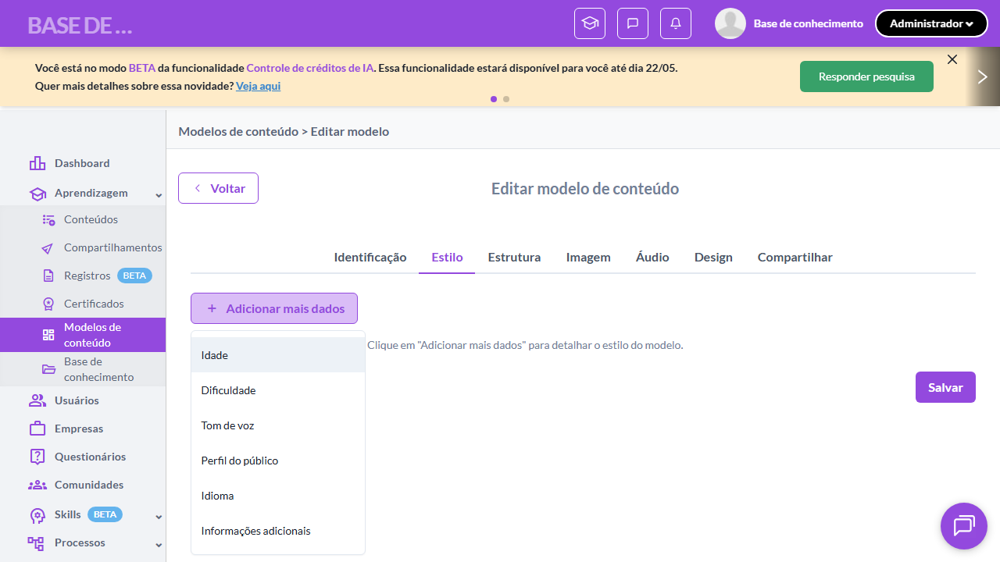
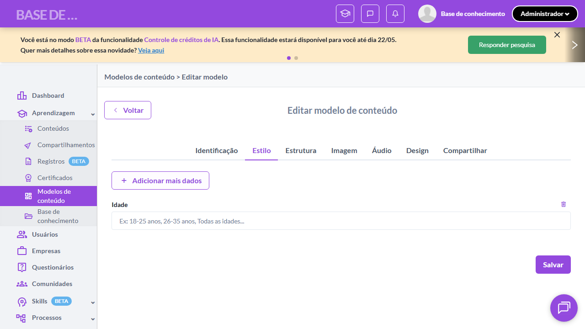

# Casos de teste — Modelos de conteúdo

[← Voltar ao dashboard](index.md)

Lista detalhada por testsuite. Cada caso traz: o que era esperado pelo XML, quais steps foram executados, evidências (screenshots/trace), texto pronto pra registro de bug e — quando houver falha — uma explicação em PT-BR do motivo.

## Criação de Modelo - Aba Estilo do Conteúdo

_2 caso(s) — 2 aprovado(s), 0 falha(s)_

### ✅ Aprovado · TC1 · Botão "Adicionar mais dados" exibe menu com 6 opções · 🔴 Crítico

<a id="botao-adicionar-mais-dados-exibe-menu-com-6-opcoes"></a>_Arquivo:_ `tc01-adicionar-mais-dados-menu-6-opcoes.spec.ts` · _Duração:_ 17.42s · _Browser:_ chromium

**Sumário (objetivo do caso):** Validar que o botão exibe menu com as 6 opções de estilo (RN 12, RN 13).

**Pré-condições:**

```
Ambiente Stage configurado
Feature flag `modelos_de_conteudo` ativa
Modelo de teste cadastrado no setup do spec (via beforeAll)
Usuário logado como Admin
```

**Passos do caso (XML/TestLink + execução Playwright):**

_Cada linha reproduz um passo do XML; a coluna **Status** traz o resultado da execução (do step Allure correspondente). Linhas com "Pré-condição" são da execução automatizada (login, navegação inicial) — não fazem parte do roteiro do XML._

| # | Ação do passo | Resultado esperado | Status | Notas | Duração |
|---|---|---|:---:|---|---:|
| 1 | Acessar a aba "Estilo do conteúdo" do modelo de teste | Aba "Estilo do conteúdo" fica selecionada. | ✅ | — | 14.87s |
| 2 | Clicar no botão "Adicionar mais dados" | Menu suspenso é exibido contendo as opções: "Idade", "Dificuldade", "Tom de voz", "Perfil do público", "Idioma", "Informações adicionais". | ✅ | — | 1.09s |

**Evidências:**

📁 _Pasta:_ [`artifacts/projects-modelos-tests-fea-eff58-dos-exibe-menu-com-6-opções-chromium/`](artifacts/projects-modelos-tests-fea-eff58-dos-exibe-menu-com-6-opções-chromium/)

- 📸 **Screenshot (screenshot)** — [`test-finished-1.png`](artifacts/projects-modelos-tests-fea-eff58-dos-exibe-menu-com-6-opções-chromium/test-finished-1.png)

  

- 🎬 [Vídeo da execução (video.webm)](artifacts/projects-modelos-tests-fea-eff58-dos-exibe-menu-com-6-opções-chromium/video.webm)

- 📦 **Trace** — [`trace.zip`](artifacts/projects-modelos-tests-fea-eff58-dos-exibe-menu-com-6-opções-chromium/trace.zip)

  ```bash
  npx playwright show-trace outputs/modelos/reports/criacao-de-modelo-aba-estilo-do-conteudo_20260520-144540/artifacts/projects-modelos-tests-fea-eff58-dos-exibe-menu-com-6-opções-chromium/trace.zip
  ```

- 🎥 **Vídeo** — [`video.webm`](artifacts/projects-modelos-tests-fea-eff58-dos-exibe-menu-com-6-opções-chromium/video.webm)


---

### ✅ Aprovado · TC2 · Adicionar campo Idade via menu · 🔴 Crítico

<a id="adicionar-campo-idade-via-menu"></a>_Arquivo:_ `tc02-adicionar-campo-idade.spec.ts` · _Duração:_ 18.27s · _Browser:_ chromium

**Sumário (objetivo do caso):** Validar adição de campo via menu (RN 13, RN 13.1).

**Pré-condições:**

```
Ambiente Stage configurado
Feature flag `modelos_de_conteudo` ativa
Modelo de teste cadastrado no setup do spec (via beforeAll)
Usuário logado como Admin
```

**Passos do caso (XML/TestLink + execução Playwright):**

_Cada linha reproduz um passo do XML; a coluna **Status** traz o resultado da execução (do step Allure correspondente). Linhas com "Pré-condição" são da execução automatizada (login, navegação inicial) — não fazem parte do roteiro do XML._

| # | Ação do passo | Resultado esperado | Status | Notas | Duração |
|---|---|---|:---:|---|---:|
| 1 | Acessar a aba "Estilo do conteúdo" do modelo de teste | Aba "Estilo do conteúdo" é exibida. | ✅ | — | 15.89s |
| 2 | Clicar no botão "Adicionar mais dados" | Menu suspenso é exibido. | ✅ | — | 0.71s |
| 3 | Clicar na opção "Idade" no menu | Menu fecha e novo campo "Idade" é inserido na seção de estilo, seguindo o mesmo padrão do Estúdio de Criação. | ✅ | — | 0.25s |

**Evidências:**

📁 _Pasta:_ [`artifacts/projects-modelos-tests-fea-d9836-cionar-campo-Idade-via-menu-chromium/`](artifacts/projects-modelos-tests-fea-d9836-cionar-campo-Idade-via-menu-chromium/)

- 📸 **Screenshot (screenshot)** — [`test-finished-1.png`](artifacts/projects-modelos-tests-fea-d9836-cionar-campo-Idade-via-menu-chromium/test-finished-1.png)

  

- 🎬 [Vídeo da execução (video.webm)](artifacts/projects-modelos-tests-fea-d9836-cionar-campo-Idade-via-menu-chromium/video.webm)

- 📦 **Trace** — [`trace.zip`](artifacts/projects-modelos-tests-fea-d9836-cionar-campo-Idade-via-menu-chromium/trace.zip)

  ```bash
  npx playwright show-trace outputs/modelos/reports/criacao-de-modelo-aba-estilo-do-conteudo_20260520-144540/artifacts/projects-modelos-tests-fea-d9836-cionar-campo-Idade-via-menu-chromium/trace.zip
  ```

- 🎥 **Vídeo** — [`video.webm`](artifacts/projects-modelos-tests-fea-d9836-cionar-campo-Idade-via-menu-chromium/video.webm)


---
