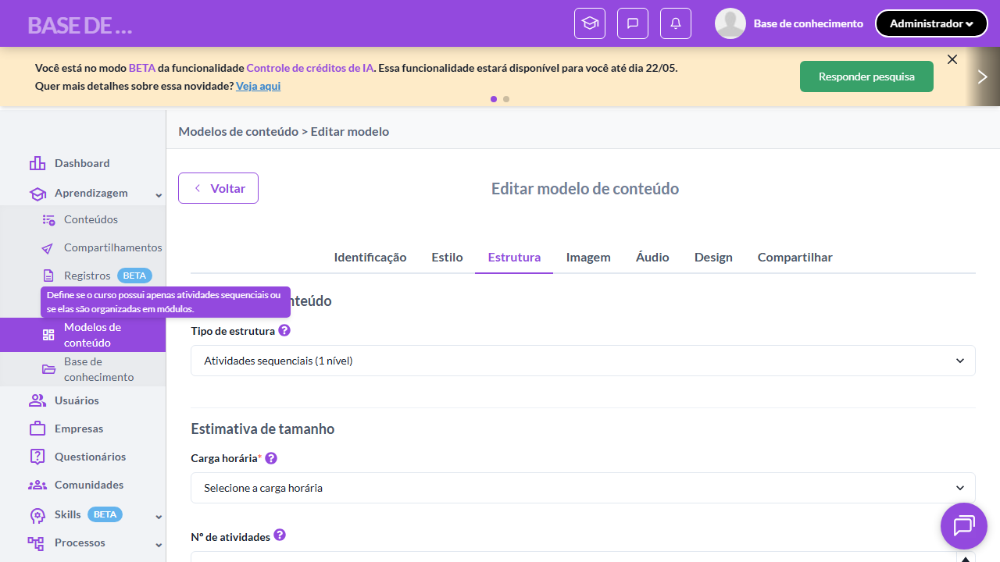
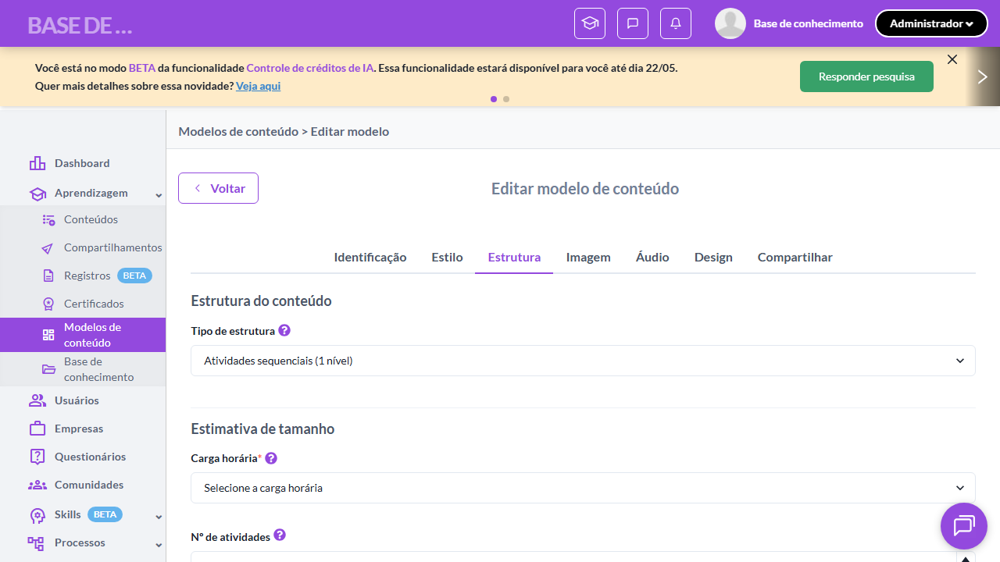
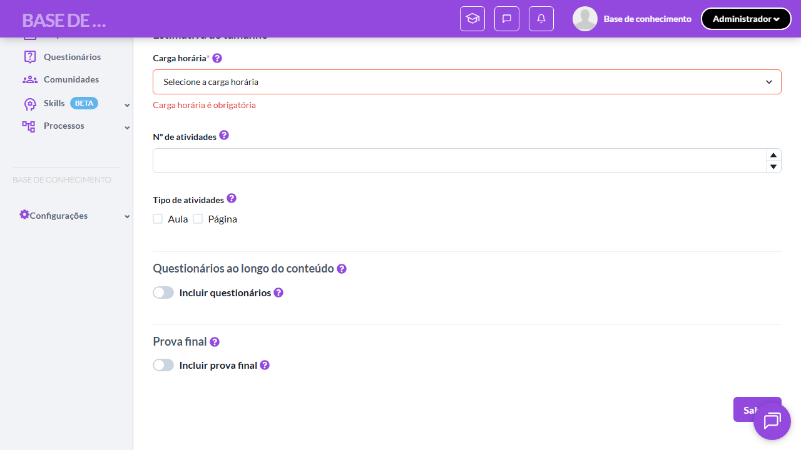
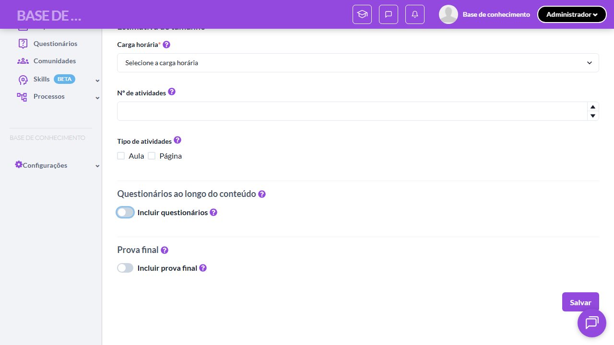
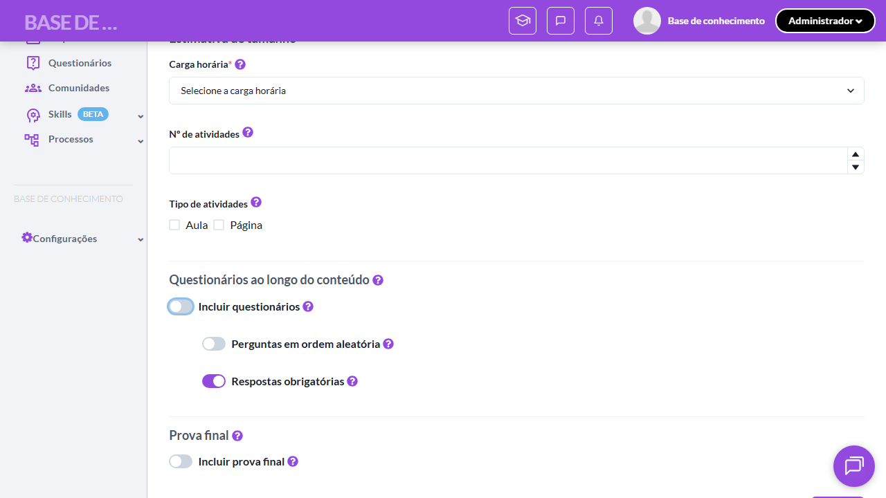
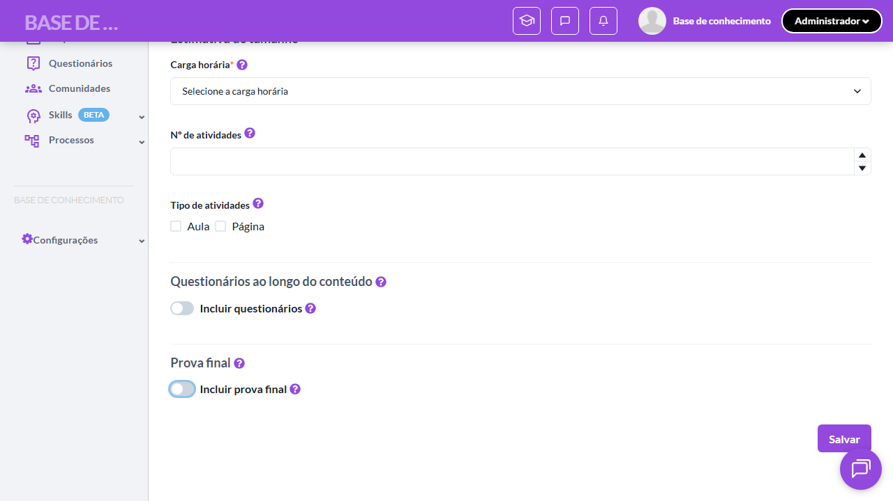

# Casos de teste — Modelos de conteúdo

[← Voltar ao dashboard](index.md)

Lista detalhada por testsuite. Cada caso traz: o que era esperado pelo XML, quais steps foram executados, evidências (screenshots/trace), texto pronto pra registro de bug e — quando houver falha — uma explicação em PT-BR do motivo.

## Criação de Modelo - Aba Estrutura do Conteúdo

_8 caso(s) — 8 aprovado(s), 0 falha(s)_

### ✅ Aprovado · TC1 · Tipo de estrutura exibe 2 opções · 🔴 Crítico

<a id="tipo-de-estrutura-exibe-2-opcoes"></a>_Arquivo:_ `tc01-tipo-estrutura-exibe-2-opcoes.spec.ts` · _Duração:_ 18.57s · _Browser:_ chromium

**Sumário (objetivo do caso):** Validar opções do dropdown "Tipo de estrutura" (RN 15, RN 16).

**Pré-condições:**

```
Ambiente Stage configurado
Feature flag `modelos_de_conteudo` ativa
Modelo de teste cadastrado no setup do spec (via beforeAll)
Usuário logado como Admin
```

**Passos do caso (XML/TestLink + execução Playwright):**

_Cada linha reproduz um passo do XML; a coluna **Status** traz o resultado da execução (do step Allure correspondente). Linhas com "Pré-condição" são da execução automatizada (login, navegação inicial) — não fazem parte do roteiro do XML._

| # | Ação do passo | Resultado esperado | Status | Notas | Duração |
|---|---|---|:---:|---|---:|
| 1 | Acessar a aba "Estrutura do conteúdo" do modelo de teste | Aba "Estrutura do conteúdo" fica selecionada. | ✅ | — | 15.79s |
| 2 | Clicar no dropdown "Tipo de estrutura" | Dropdown exibe as opções "Atividades sequenciais (1 nível)" e "Atividades agrupadas por módulos (2 níveis)". | ✅ | — | 0.47s |

**Evidências:**

📁 _Pasta:_ [`artifacts/projects-modelos-tests-fea-436b3-de-estrutura-exibe-2-opções-chromium/`](artifacts/projects-modelos-tests-fea-436b3-de-estrutura-exibe-2-opções-chromium/)

- 📸 **Screenshot (screenshot)** — [`test-finished-1.png`](artifacts/projects-modelos-tests-fea-436b3-de-estrutura-exibe-2-opções-chromium/test-finished-1.png)

  

- 🎬 [Vídeo da execução (video.webm)](artifacts/projects-modelos-tests-fea-436b3-de-estrutura-exibe-2-opções-chromium/video.webm)

- 📦 **Trace** — [`trace.zip`](artifacts/projects-modelos-tests-fea-436b3-de-estrutura-exibe-2-opções-chromium/trace.zip)

  ```bash
  npx playwright show-trace outputs/modelos/reports/criacao-de-modelo-aba-estrutura-do-conteudo_20260520-153111/artifacts/projects-modelos-tests-fea-436b3-de-estrutura-exibe-2-opções-chromium/trace.zip
  ```

- 🎥 **Vídeo** — [`video.webm`](artifacts/projects-modelos-tests-fea-436b3-de-estrutura-exibe-2-opções-chromium/video.webm)


---

### ✅ Aprovado · TC2 · Tooltip do Tipo de estrutura · 🔴 Crítico

<a id="tooltip-do-tipo-de-estrutura"></a>_Arquivo:_ `tc02-tooltip-tipo-estrutura.spec.ts` · _Duração:_ 18.30s · _Browser:_ chromium

**Sumário (objetivo do caso):** Validar texto literal da tooltip (RN 15).

**Pré-condições:**

```
Ambiente Stage configurado
Feature flag `modelos_de_conteudo` ativa
Modelo de teste cadastrado no setup do spec (via beforeAll)
Usuário logado como Admin
```

**Passos do caso (XML/TestLink + execução Playwright):**

_Cada linha reproduz um passo do XML; a coluna **Status** traz o resultado da execução (do step Allure correspondente). Linhas com "Pré-condição" são da execução automatizada (login, navegação inicial) — não fazem parte do roteiro do XML._

| # | Ação do passo | Resultado esperado | Status | Notas | Duração |
|---|---|---|:---:|---|---:|
| 1 | Acessar a aba "Estrutura do conteúdo" | Aba é exibida. | ✅ | — | 14.77s |
| 2 | Aguardar a tooltip do campo "Tipo de estrutura" ser exibida ao posicionar o mouse | Tooltip exibida: "Define se o curso possui apenas atividades sequenciais ou se elas são organizadas em módulos.". | ✅ | — | 1.43s |

**Evidências:**

📁 _Pasta:_ [`artifacts/projects-modelos-tests-fea-5ae19-ooltip-do-Tipo-de-estrutura-chromium/`](artifacts/projects-modelos-tests-fea-5ae19-ooltip-do-Tipo-de-estrutura-chromium/)

- 📸 **Screenshot (screenshot)** — [`test-finished-1.png`](artifacts/projects-modelos-tests-fea-5ae19-ooltip-do-Tipo-de-estrutura-chromium/test-finished-1.png)

  

- 🎬 [Vídeo da execução (video.webm)](artifacts/projects-modelos-tests-fea-5ae19-ooltip-do-Tipo-de-estrutura-chromium/video.webm)

- 📦 **Trace** — [`trace.zip`](artifacts/projects-modelos-tests-fea-5ae19-ooltip-do-Tipo-de-estrutura-chromium/trace.zip)

  ```bash
  npx playwright show-trace outputs/modelos/reports/criacao-de-modelo-aba-estrutura-do-conteudo_20260520-153111/artifacts/projects-modelos-tests-fea-5ae19-ooltip-do-Tipo-de-estrutura-chromium/trace.zip
  ```

- 🎥 **Vídeo** — [`video.webm`](artifacts/projects-modelos-tests-fea-5ae19-ooltip-do-Tipo-de-estrutura-chromium/video.webm)


---

### ✅ Aprovado · TC3 · Selecionar "2 níveis" exibe campo de atividades por módulo · 🔴 Crítico

<a id="selecionar-2-niveis-exibe-campo-de-atividades-por-modulo"></a>_Arquivo:_ `tc03-2-niveis-exibe-atividades-por-modulo.spec.ts` · _Duração:_ 18.72s · _Browser:_ chromium

**Sumário (objetivo do caso):** Validar comportamento condicional ao selecionar 2 níveis (RN 16.1).

**Pré-condições:**

```
Ambiente Stage configurado
Feature flag `modelos_de_conteudo` ativa
Modelo de teste cadastrado no setup do spec (via beforeAll)
Usuário logado como Admin
```

**Passos do caso (XML/TestLink + execução Playwright):**

_Cada linha reproduz um passo do XML; a coluna **Status** traz o resultado da execução (do step Allure correspondente). Linhas com "Pré-condição" são da execução automatizada (login, navegação inicial) — não fazem parte do roteiro do XML._

| # | Ação do passo | Resultado esperado | Status | Notas | Duração |
|---|---|---|:---:|---|---:|
| — | _Pré-condição:_ cleanup: voltar para "1 nível" | — | ✅ | — | 0.93s |
| 1 | Acessar a aba "Estrutura do conteúdo" | Aba é exibida. | ✅ | — | 14.84s |
| 2 | Selecionar "Atividades agrupadas por módulos (2 níveis)" no dropdown "Tipo de estrutura" | Dropdown exibe a opção selecionada. | ✅ | — | 0.98s |
| 3 | Aguardar o campo "Número de atividades por módulo" ser exibido | Campo numérico "Número de atividades por módulo" é exibido com tooltip: "Número sugerido de atividades que a IA irá criar dentro de cada módulo do curso.". | ✅ | — | 0.39s |

**Evidências:**

📁 _Pasta:_ [`artifacts/projects-modelos-tests-fea-10eb6-po-de-atividades-por-módulo-chromium/`](artifacts/projects-modelos-tests-fea-10eb6-po-de-atividades-por-módulo-chromium/)

- 📸 **Screenshot (screenshot)** — [`test-finished-1.png`](artifacts/projects-modelos-tests-fea-10eb6-po-de-atividades-por-módulo-chromium/test-finished-1.png)

  

- 🎬 [Vídeo da execução (video.webm)](artifacts/projects-modelos-tests-fea-10eb6-po-de-atividades-por-módulo-chromium/video.webm)

- 📦 **Trace** — [`trace.zip`](artifacts/projects-modelos-tests-fea-10eb6-po-de-atividades-por-módulo-chromium/trace.zip)

  ```bash
  npx playwright show-trace outputs/modelos/reports/criacao-de-modelo-aba-estrutura-do-conteudo_20260520-153111/artifacts/projects-modelos-tests-fea-10eb6-po-de-atividades-por-módulo-chromium/trace.zip
  ```

- 🎥 **Vídeo** — [`video.webm`](artifacts/projects-modelos-tests-fea-10eb6-po-de-atividades-por-módulo-chromium/video.webm)


---

### ✅ Aprovado · TC4 · Carga horária obrigatória bloqueia salvamento · 🔴 Crítico

<a id="carga-horaria-obrigatoria-bloqueia-salvamento"></a>_Arquivo:_ `tc04-carga-horaria-obrigatoria-bloqueia-save.spec.ts` · _Duração:_ 19.91s · _Browser:_ chromium

**Sumário (objetivo do caso):** Validar que sem "Carga horária sugerida" o salvamento é bloqueado (RN 18).

**Pré-condições:**

```
Ambiente Stage configurado
Feature flag `modelos_de_conteudo` ativa
Modelo de teste cadastrado no setup do spec (via beforeAll)
Usuário logado como Admin
```

**Passos do caso (XML/TestLink + execução Playwright):**

_Cada linha reproduz um passo do XML; a coluna **Status** traz o resultado da execução (do step Allure correspondente). Linhas com "Pré-condição" são da execução automatizada (login, navegação inicial) — não fazem parte do roteiro do XML._

| # | Ação do passo | Resultado esperado | Status | Notas | Duração |
|---|---|---|:---:|---|---:|
| 1 | Acessar a aba "Estrutura do conteúdo" do modelo de teste sem carga horária preenchida | Aba é exibida. | ✅ | — | 15.45s |
| 2 | Clicar no botão "Salvar" | Mensagem de validação exibida: "Carga horária sugerida é obrigatória". Modelo NÃO é salvo. | ✅ | — | 2.81s |

**Evidências:**

📁 _Pasta:_ [`artifacts/projects-modelos-tests-fea-26232-gatória-bloqueia-salvamento-chromium/`](artifacts/projects-modelos-tests-fea-26232-gatória-bloqueia-salvamento-chromium/)

- 📸 **Screenshot (screenshot)** — [`test-finished-1.png`](artifacts/projects-modelos-tests-fea-26232-gatória-bloqueia-salvamento-chromium/test-finished-1.png)

  

- 🎬 [Vídeo da execução (video.webm)](artifacts/projects-modelos-tests-fea-26232-gatória-bloqueia-salvamento-chromium/video.webm)

- 📦 **Trace** — [`trace.zip`](artifacts/projects-modelos-tests-fea-26232-gatória-bloqueia-salvamento-chromium/trace.zip)

  ```bash
  npx playwright show-trace outputs/modelos/reports/criacao-de-modelo-aba-estrutura-do-conteudo_20260520-153111/artifacts/projects-modelos-tests-fea-26232-gatória-bloqueia-salvamento-chromium/trace.zip
  ```

- 🎥 **Vídeo** — [`video.webm`](artifacts/projects-modelos-tests-fea-26232-gatória-bloqueia-salvamento-chromium/video.webm)


---

### ✅ Aprovado · TC5 · Carga horária exibe 5 opções literais · 🔴 Crítico

<a id="carga-horaria-exibe-5-opcoes-literais"></a>_Arquivo:_ `tc05-carga-horaria-5-opcoes.spec.ts` · _Duração:_ 16.13s · _Browser:_ chromium

**Sumário (objetivo do caso):** Validar as 5 opções literais de carga horária (RN 18).

**Pré-condições:**

```
Ambiente Stage configurado
Feature flag `modelos_de_conteudo` ativa
Modelo de teste cadastrado no setup do spec (via beforeAll)
Usuário logado como Admin
```

**Passos do caso (XML/TestLink + execução Playwright):**

_Cada linha reproduz um passo do XML; a coluna **Status** traz o resultado da execução (do step Allure correspondente). Linhas com "Pré-condição" são da execução automatizada (login, navegação inicial) — não fazem parte do roteiro do XML._

| # | Ação do passo | Resultado esperado | Status | Notas | Duração |
|---|---|---|:---:|---|---:|
| 1 | Acessar a aba "Estrutura do conteúdo" | Aba é exibida. | ✅ | — | 13.70s |
| 2 | Clicar no dropdown "Carga horária sugerida" | Dropdown exibe as opções "Micro (30 segundos a 5 minutos)", "Curto (5 a 15 minutos)", "Médio (15 a 30 minutos)", "Estendido (30 a 60 minutos)", "Longo (1 a 2 horas)". | ✅ | — | 0.27s |

**Evidências:**

📁 _Pasta:_ [`artifacts/projects-modelos-tests-fea-62b2e-ria-exibe-5-opções-literais-chromium/`](artifacts/projects-modelos-tests-fea-62b2e-ria-exibe-5-opções-literais-chromium/)

- 📸 **Screenshot (screenshot)** — [`test-finished-1.png`](artifacts/projects-modelos-tests-fea-62b2e-ria-exibe-5-opções-literais-chromium/test-finished-1.png)

  

- 🎬 [Vídeo da execução (video.webm)](artifacts/projects-modelos-tests-fea-62b2e-ria-exibe-5-opções-literais-chromium/video.webm)

- 📦 **Trace** — [`trace.zip`](artifacts/projects-modelos-tests-fea-62b2e-ria-exibe-5-opções-literais-chromium/trace.zip)

  ```bash
  npx playwright show-trace outputs/modelos/reports/criacao-de-modelo-aba-estrutura-do-conteudo_20260520-153111/artifacts/projects-modelos-tests-fea-62b2e-ria-exibe-5-opções-literais-chromium/trace.zip
  ```

- 🎥 **Vídeo** — [`video.webm`](artifacts/projects-modelos-tests-fea-62b2e-ria-exibe-5-opções-literais-chromium/video.webm)


---

### ✅ Aprovado · TC6 · Switch "Incluir questionários" exibe configurações básicas · 🔴 Crítico

<a id="switch-incluir-questionarios-exibe-configuracoes-basicas"></a>_Arquivo:_ `tc06-switch-incluir-questionarios.spec.ts` · _Duração:_ 19.48s · _Browser:_ chromium

**Sumário (objetivo do caso):** Validar que ativar o switch exibe os campos básicos de questionário (RN 21, RN 22).

**Pré-condições:**

```
Ambiente Stage configurado
Feature flag `modelos_de_conteudo` ativa
Modelo de teste cadastrado no setup do spec (via beforeAll)
Usuário logado como Admin
```

**Passos do caso (XML/TestLink + execução Playwright):**

_Cada linha reproduz um passo do XML; a coluna **Status** traz o resultado da execução (do step Allure correspondente). Linhas com "Pré-condição" são da execução automatizada (login, navegação inicial) — não fazem parte do roteiro do XML._

| # | Ação do passo | Resultado esperado | Status | Notas | Duração |
|---|---|---|:---:|---|---:|
| — | _Pré-condição:_ cleanup: desativar switch pra próximo TC começar limpo | — | ✅ | — | 0.67s |
| 1 | Acessar a aba "Estrutura do conteúdo" | Aba é exibida com a seção "Questionários ao longo do conteúdo". | ✅ | — | 16.02s |
| 2 | Ativar o switch "Incluir questionários no conteúdo" | Seção expande exibindo os campos básicos de configuração de questionário. | ✅ | — | 1.50s |

**Evidências:**

📁 _Pasta:_ [`artifacts/projects-modelos-tests-fea-ca9a9-exibe-configurações-básicas-chromium/`](artifacts/projects-modelos-tests-fea-ca9a9-exibe-configurações-básicas-chromium/)

- 📸 **Screenshot (screenshot)** — [`test-finished-1.png`](artifacts/projects-modelos-tests-fea-ca9a9-exibe-configurações-básicas-chromium/test-finished-1.png)

  

- 🎬 [Vídeo da execução (video.webm)](artifacts/projects-modelos-tests-fea-ca9a9-exibe-configurações-básicas-chromium/video.webm)

- 📦 **Trace** — [`trace.zip`](artifacts/projects-modelos-tests-fea-ca9a9-exibe-configurações-básicas-chromium/trace.zip)

  ```bash
  npx playwright show-trace outputs/modelos/reports/criacao-de-modelo-aba-estrutura-do-conteudo_20260520-153111/artifacts/projects-modelos-tests-fea-ca9a9-exibe-configurações-básicas-chromium/trace.zip
  ```

- 🎥 **Vídeo** — [`video.webm`](artifacts/projects-modelos-tests-fea-ca9a9-exibe-configurações-básicas-chromium/video.webm)


---

### ✅ Aprovado · TC7 · Switch "Configurações avançadas" exibe campos adicionais · 🔴 Crítico

<a id="switch-configuracoes-avancadas-exibe-campos-adicionais"></a>_Arquivo:_ `tc07-switch-configuracoes-avancadas.spec.ts` · _Duração:_ 21.31s · _Browser:_ chromium

**Sumário (objetivo do caso):** Validar que ativar configurações avançadas exibe campos adicionais (RN 22.1).

**Pré-condições:**

```
Ambiente Stage configurado
Feature flag `modelos_de_conteudo` ativa
Modelo de teste cadastrado no setup do spec (via beforeAll)
Usuário logado como Admin
```

**Passos do caso (XML/TestLink + execução Playwright):**

_Cada linha reproduz um passo do XML; a coluna **Status** traz o resultado da execução (do step Allure correspondente). Linhas com "Pré-condição" são da execução automatizada (login, navegação inicial) — não fazem parte do roteiro do XML._

| # | Ação do passo | Resultado esperado | Status | Notas | Duração |
|---|---|---|:---:|---|---:|
| — | _Pré-condição:_ 3. Ativar "Configurações avançadas" e validar campos adicionais | — | ✅ | — | 1.02s |
| — | _Pré-condição:_ cleanup: desligar switches | — | ✅ | — | 0.64s |
| 1 | Ativar o switch "Incluir questionários no conteúdo" | Campos básicos de questionário são exibidos. | ✅ | — | 16.97s |
| 2 | Ativar o switch "Configurações avançadas" | Campos adicionais de configuração são exibidos. | ✅ | — | 1.65s |

**Evidências:**

📁 _Pasta:_ [`artifacts/projects-modelos-tests-fea-8c90b-das-exibe-campos-adicionais-chromium/`](artifacts/projects-modelos-tests-fea-8c90b-das-exibe-campos-adicionais-chromium/)

- 📸 **Screenshot (screenshot)** — [`test-finished-1.png`](artifacts/projects-modelos-tests-fea-8c90b-das-exibe-campos-adicionais-chromium/test-finished-1.png)

  

- 🎬 [Vídeo da execução (video.webm)](artifacts/projects-modelos-tests-fea-8c90b-das-exibe-campos-adicionais-chromium/video.webm)

- 📦 **Trace** — [`trace.zip`](artifacts/projects-modelos-tests-fea-8c90b-das-exibe-campos-adicionais-chromium/trace.zip)

  ```bash
  npx playwright show-trace outputs/modelos/reports/criacao-de-modelo-aba-estrutura-do-conteudo_20260520-153111/artifacts/projects-modelos-tests-fea-8c90b-das-exibe-campos-adicionais-chromium/trace.zip
  ```

- 🎥 **Vídeo** — [`video.webm`](artifacts/projects-modelos-tests-fea-8c90b-das-exibe-campos-adicionais-chromium/video.webm)


---

### ✅ Aprovado · TC8 · Switch "Incluir prova final" · 🔴 Crítico

<a id="switch-incluir-prova-final"></a>_Arquivo:_ `tc08-switch-incluir-prova-final.spec.ts` · _Duração:_ 21.25s · _Browser:_ chromium

**Sumário (objetivo do caso):** Validar exibição da seção "Prova final" e campos básicos (RN 25, RN 26).

**Pré-condições:**

```
Ambiente Stage configurado
Feature flag `modelos_de_conteudo` ativa
Modelo de teste cadastrado no setup do spec (via beforeAll)
Usuário logado como Admin
```

**Passos do caso (XML/TestLink + execução Playwright):**

_Cada linha reproduz um passo do XML; a coluna **Status** traz o resultado da execução (do step Allure correspondente). Linhas com "Pré-condição" são da execução automatizada (login, navegação inicial) — não fazem parte do roteiro do XML._

| # | Ação do passo | Resultado esperado | Status | Notas | Duração |
|---|---|---|:---:|---|---:|
| — | _Pré-condição:_ cleanup: desligar switch | — | ✅ | — | 0.64s |
| 1 | Acessar a aba "Estrutura do conteúdo" | Aba é exibida com a seção "Prova final". | ✅ | — | 17.65s |
| 2 | Aguardar a tooltip da seção "Prova final" ser exibida ao posicionar o mouse | Tooltip exibida: "Avaliação aplicada ao final do curso, cobrindo todo o conteúdo.". | ✅ | — | 2.01s |
| 3 | Ativar o switch "Incluir prova final" | Seção expande exibindo os campos básicos de configuração de prova final. | ✅ | — | — |

**Evidências:**

📁 _Pasta:_ [`artifacts/projects-modelos-tests-fea-27d82-Switch-Incluir-prova-final--chromium/`](artifacts/projects-modelos-tests-fea-27d82-Switch-Incluir-prova-final--chromium/)

- 📸 **Screenshot (screenshot)** — [`test-finished-1.png`](artifacts/projects-modelos-tests-fea-27d82-Switch-Incluir-prova-final--chromium/test-finished-1.png)

  

- 🎬 [Vídeo da execução (video.webm)](artifacts/projects-modelos-tests-fea-27d82-Switch-Incluir-prova-final--chromium/video.webm)

- 📦 **Trace** — [`trace.zip`](artifacts/projects-modelos-tests-fea-27d82-Switch-Incluir-prova-final--chromium/trace.zip)

  ```bash
  npx playwright show-trace outputs/modelos/reports/criacao-de-modelo-aba-estrutura-do-conteudo_20260520-153111/artifacts/projects-modelos-tests-fea-27d82-Switch-Incluir-prova-final--chromium/trace.zip
  ```

- 🎥 **Vídeo** — [`video.webm`](artifacts/projects-modelos-tests-fea-27d82-Switch-Incluir-prova-final--chromium/video.webm)


---
