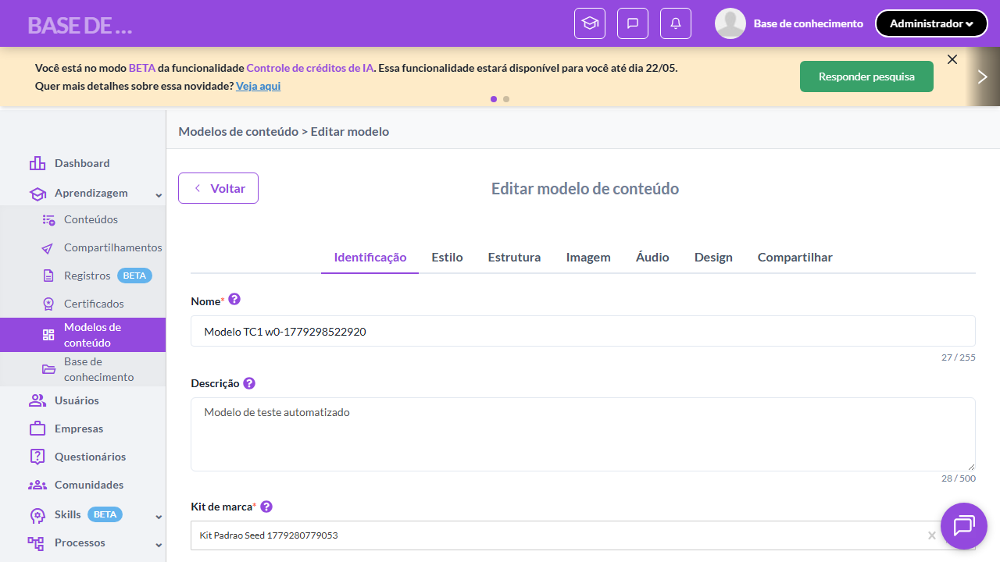
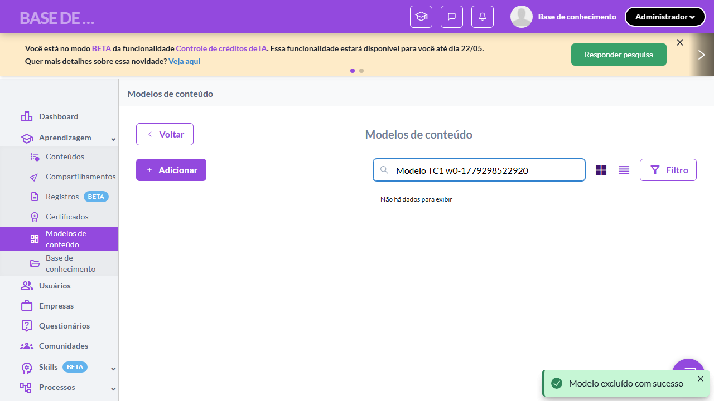
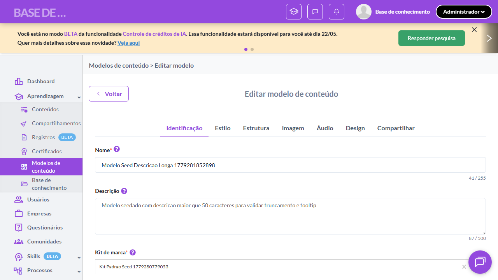
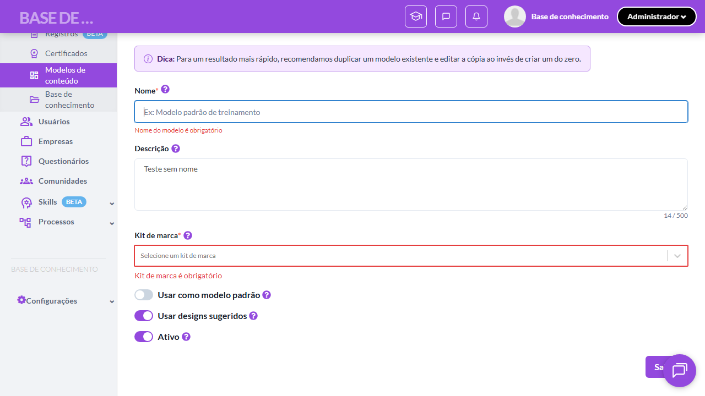
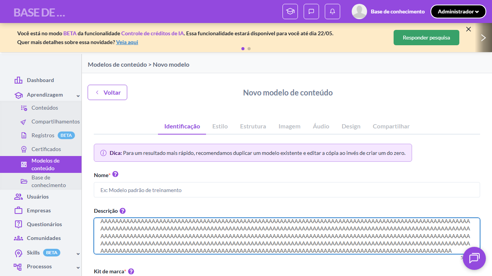
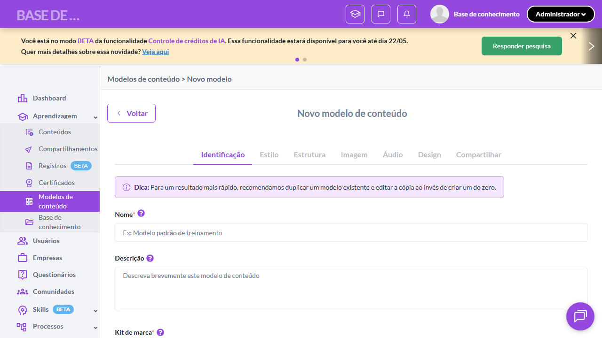

# Casos de teste — Modelos de conteúdo

[← Voltar ao dashboard](index.md)

Lista detalhada por testsuite. Cada caso traz: o que era esperado pelo XML, quais steps foram executados, evidências (screenshots/trace), texto pronto pra registro de bug e — quando houver falha — uma explicação em PT-BR do motivo.

## Criação de Modelo - Aba Identificação

_8 caso(s) — 7 aprovado(s), 0 falha(s), 1 ignorado(s)_

### ✅ Aprovado · TC1 · Criar modelo com dados válidos · 🔴 Crítico

<a id="criar-modelo-com-dados-validos"></a>_Arquivo:_ `tc01-criar-modelo-com-dados-validos.spec.ts` · _Duração:_ 19.37s · _Browser:_ chromium

**Sumário (objetivo do caso):** Validar criação de modelo (happy path) preenchendo todos os campos da aba Identificação (RN 7, RN 8).

**Pré-condições:**

```
Ambiente Stage configurado
Feature flag `modelos_de_conteudo` ativa
Pelo menos 1 kit de marca cadastrado na organização
Usuário logado como Admin
```

**Passos do caso (XML/TestLink + execução Playwright):**

_Cada linha reproduz um passo do XML; a coluna **Status** traz o resultado da execução (do step Allure correspondente). Linhas com "Pré-condição" são da execução automatizada (login, navegação inicial) — não fazem parte do roteiro do XML._

| # | Ação do passo | Resultado esperado | Status | Notas | Duração |
|---|---|---|:---:|---|---:|
| — | _Pré-condição:_ 2-5. Preencher Nome + Descrição + Kit de marca | — | ✅ | — | 2.40s |
| 1 | Acessar a URL "/o/{orgId}/content_models" | Listagem é exibida. | ✅ | — | 9.49s |
| 2 | Clicar no botão "+ Adicionar" | Sistema redireciona para a tela de criação exibindo a aba "Identificação". | ✅ | — | — |
| 3 | Preencher o campo "Nome" com "Modelo TC1 w{workerIndex}-{timestamp}" | Campo "Nome" exibe o texto digitado. | ✅ | — | — |
| 4 | Preencher o campo "Descrição" com "Modelo de teste automatizado" | Campo "Descrição" exibe o texto digitado. | ✅ | — | — |
| 5 | Selecionar "Kit padrão da organização" no dropdown "Kit de marca" | Dropdown "Kit de marca" exibe a opção selecionada. | ✅ | — | — |
| 6 | Clicar no botão "Salvar" | Toast exibida: "Modelo de conteúdo criado com sucesso.". Sistema permanece na tela de edição ou redireciona para listagem. | ✅ | — | 5.19s |

**Evidências:**

📁 _Pasta:_ [`artifacts/projects-modelos-tests-fea-bd73d-ar-modelo-com-dados-válidos-chromium/`](artifacts/projects-modelos-tests-fea-bd73d-ar-modelo-com-dados-válidos-chromium/)

- 📸 **Screenshot (screenshot)** — [`test-finished-1.png`](artifacts/projects-modelos-tests-fea-bd73d-ar-modelo-com-dados-válidos-chromium/test-finished-1.png)

  

- 📸 **Screenshot (screenshot)** — [`test-finished-2.png`](artifacts/projects-modelos-tests-fea-bd73d-ar-modelo-com-dados-válidos-chromium/test-finished-2.png)

  

- 🎬 [Vídeo da execução (video.webm)](artifacts/projects-modelos-tests-fea-bd73d-ar-modelo-com-dados-válidos-chromium/video.webm)

- 📦 **Trace** — [`trace.zip`](artifacts/projects-modelos-tests-fea-bd73d-ar-modelo-com-dados-válidos-chromium/trace.zip)

  ```bash
  npx playwright show-trace outputs/modelos/reports/criacao-de-modelo-aba-identificacao_20260520-143601/artifacts/projects-modelos-tests-fea-bd73d-ar-modelo-com-dados-válidos-chromium/trace.zip
  ```

- 🎥 **Vídeo** — [`video.webm`](artifacts/projects-modelos-tests-fea-bd73d-ar-modelo-com-dados-válidos-chromium/video.webm)


---

### ✅ Aprovado · TC2 · Badge "Dica" aparece somente na criação · 🔴 Crítico

<a id="badge-dica-aparece-somente-na-criacao"></a>_Arquivo:_ `tc02-badge-dica-aparece-na-criacao.spec.ts` · _Duração:_ 14.89s · _Browser:_ chromium

**Sumário (objetivo do caso):** Validar que a badge "Dica: Para um resultado mais rápido..." aparece apenas na criação de novo modelo (RN 9).

**Pré-condições:**

```
Ambiente Stage configurado
Feature flag `modelos_de_conteudo` ativa
Pelo menos 1 kit de marca cadastrado na organização
Usuário logado como Admin
```

**Passos do caso (XML/TestLink + execução Playwright):**

_Cada linha reproduz um passo do XML; a coluna **Status** traz o resultado da execução (do step Allure correspondente). Linhas com "Pré-condição" são da execução automatizada (login, navegação inicial) — não fazem parte do roteiro do XML._

| # | Ação do passo | Resultado esperado | Status | Notas | Duração |
|---|---|---|:---:|---|---:|
| 1 | Acessar a tela de criação de modelo | Aba "Identificação" é exibida. | ✅ | — | 9.83s |
| 2 | Aguardar a badge "Dica" ser renderizada | Badge exibida com o texto: "Dica: Para um resultado mais rápido, recomendamos duplicar um modelo existente e editar a cópia ao invés de criar um do zero.". | ✅ | — | 0.57s |

**Evidências:**

📁 _Pasta:_ [`artifacts/projects-modelos-tests-fea-29bba--aparece-somente-na-criação-chromium/`](artifacts/projects-modelos-tests-fea-29bba--aparece-somente-na-criação-chromium/)

- 📸 **Screenshot (screenshot)** — [`test-finished-1.png`](artifacts/projects-modelos-tests-fea-29bba--aparece-somente-na-criação-chromium/test-finished-1.png)

  

- 🎬 [Vídeo da execução (video.webm)](artifacts/projects-modelos-tests-fea-29bba--aparece-somente-na-criação-chromium/video.webm)

- 📦 **Trace** — [`trace.zip`](artifacts/projects-modelos-tests-fea-29bba--aparece-somente-na-criação-chromium/trace.zip)

  ```bash
  npx playwright show-trace outputs/modelos/reports/criacao-de-modelo-aba-identificacao_20260520-143601/artifacts/projects-modelos-tests-fea-29bba--aparece-somente-na-criação-chromium/trace.zip
  ```

- 🎥 **Vídeo** — [`video.webm`](artifacts/projects-modelos-tests-fea-29bba--aparece-somente-na-criação-chromium/video.webm)


---

### ✅ Aprovado · TC3 · Badge "Dica" NÃO aparece na edição · 🔴 Crítico

<a id="badge-dica-nao-aparece-na-edicao"></a>_Arquivo:_ `tc03-badge-dica-nao-aparece-na-edicao.spec.ts` · _Duração:_ 18.54s · _Browser:_ chromium

**Sumário (objetivo do caso):** Validar que a badge "Dica" NÃO é exibida em modo edição (RN 9).

**Pré-condições:**

```
Ambiente Stage configurado
Feature flag `modelos_de_conteudo` ativa
Pelo menos 1 kit de marca cadastrado na organização
Usuário logado como Admin
```

**Passos do caso (XML/TestLink + execução Playwright):**

_Cada linha reproduz um passo do XML; a coluna **Status** traz o resultado da execução (do step Allure correspondente). Linhas com "Pré-condição" são da execução automatizada (login, navegação inicial) — não fazem parte do roteiro do XML._

| # | Ação do passo | Resultado esperado | Status | Notas | Duração |
|---|---|---|:---:|---|---:|
| 1 | Acessar a listagem com pelo menos 1 modelo cadastrado | Listagem é exibida. | ✅ | — | 10.25s |
| 2 | Clicar na ação "Editar" do modelo alvo | Sistema redireciona para a tela de edição exibindo a aba "Identificação". | ✅ | — | 4.77s |
| 3 | Aguardar a tela de edição carregar completamente | Badge "Dica" NÃO é exibida na tela de edição. | ✅ | — | 1.67s |

**Evidências:**

📁 _Pasta:_ [`artifacts/projects-modelos-tests-fea-218f9--Dica-NÃO-aparece-na-edição-chromium/`](artifacts/projects-modelos-tests-fea-218f9--Dica-NÃO-aparece-na-edição-chromium/)

- 📸 **Screenshot (screenshot)** — [`test-finished-1.png`](artifacts/projects-modelos-tests-fea-218f9--Dica-NÃO-aparece-na-edição-chromium/test-finished-1.png)

  

- 🎬 [Vídeo da execução (video.webm)](artifacts/projects-modelos-tests-fea-218f9--Dica-NÃO-aparece-na-edição-chromium/video.webm)

- 📦 **Trace** — [`trace.zip`](artifacts/projects-modelos-tests-fea-218f9--Dica-NÃO-aparece-na-edição-chromium/trace.zip)

  ```bash
  npx playwright show-trace outputs/modelos/reports/criacao-de-modelo-aba-identificacao_20260520-143601/artifacts/projects-modelos-tests-fea-218f9--Dica-NÃO-aparece-na-edição-chromium/trace.zip
  ```

- 🎥 **Vídeo** — [`video.webm`](artifacts/projects-modelos-tests-fea-218f9--Dica-NÃO-aparece-na-edição-chromium/video.webm)


---

### ✅ Aprovado · TC4 · Validar campo Nome obrigatório · 🔴 Crítico

<a id="validar-campo-nome-obrigatorio"></a>_Arquivo:_ `tc04-validar-nome-obrigatorio.spec.ts` · _Duração:_ 16.84s · _Browser:_ chromium

**Sumário (objetivo do caso):** Validar que o campo "Nome" é obrigatório (RN 8).

**Pré-condições:**

```
Ambiente Stage configurado
Feature flag `modelos_de_conteudo` ativa
Pelo menos 1 kit de marca cadastrado na organização
Usuário logado como Admin
```

**Passos do caso (XML/TestLink + execução Playwright):**

_Cada linha reproduz um passo do XML; a coluna **Status** traz o resultado da execução (do step Allure correspondente). Linhas com "Pré-condição" são da execução automatizada (login, navegação inicial) — não fazem parte do roteiro do XML._

| # | Ação do passo | Resultado esperado | Status | Notas | Duração |
|---|---|---|:---:|---|---:|
| 1 | Acessar a tela de criação de modelo | Aba "Identificação" é exibida. | ✅ | — | 11.02s |
| 2 | Preencher o campo "Descrição" com "Teste sem nome" | Campo "Descrição" exibe o texto digitado. | ✅ | — | 0.55s |
| 3 | Clicar no botão "Salvar" | Mensagem de validação exibida: "Nome é obrigatório". Modelo NÃO é criado. | ✅ | — | 2.61s |

**Evidências:**

📁 _Pasta:_ [`artifacts/projects-modelos-tests-fea-1e774-idar-campo-Nome-obrigatório-chromium/`](artifacts/projects-modelos-tests-fea-1e774-idar-campo-Nome-obrigatório-chromium/)

- 📸 **Screenshot (screenshot)** — [`test-finished-1.png`](artifacts/projects-modelos-tests-fea-1e774-idar-campo-Nome-obrigatório-chromium/test-finished-1.png)

  

- 🎬 [Vídeo da execução (video.webm)](artifacts/projects-modelos-tests-fea-1e774-idar-campo-Nome-obrigatório-chromium/video.webm)

- 📦 **Trace** — [`trace.zip`](artifacts/projects-modelos-tests-fea-1e774-idar-campo-Nome-obrigatório-chromium/trace.zip)

  ```bash
  npx playwright show-trace outputs/modelos/reports/criacao-de-modelo-aba-identificacao_20260520-143601/artifacts/projects-modelos-tests-fea-1e774-idar-campo-Nome-obrigatório-chromium/trace.zip
  ```

- 🎥 **Vídeo** — [`video.webm`](artifacts/projects-modelos-tests-fea-1e774-idar-campo-Nome-obrigatório-chromium/video.webm)


---

### ✅ Aprovado · TC5 · Validar limite de 500 caracteres da Descrição · 🟡 Normal

<a id="validar-limite-de-500-caracteres-da-descricao"></a>_Arquivo:_ `tc05-limite-500-chars-descricao.spec.ts` · _Duração:_ 14.76s · _Browser:_ chromium

**Sumário (objetivo do caso):** Validar limite máximo de 500 caracteres no campo "Descrição".

**Pré-condições:**

```
Ambiente Stage configurado
Feature flag `modelos_de_conteudo` ativa
Pelo menos 1 kit de marca cadastrado na organização
Usuário logado como Admin
```

**Passos do caso (XML/TestLink + execução Playwright):**

_Cada linha reproduz um passo do XML; a coluna **Status** traz o resultado da execução (do step Allure correspondente). Linhas com "Pré-condição" são da execução automatizada (login, navegação inicial) — não fazem parte do roteiro do XML._

| # | Ação do passo | Resultado esperado | Status | Notas | Duração |
|---|---|---|:---:|---|---:|
| — | _Pré-condição:_ 3. Validar truncamento OU mensagem de limite | — | ✅ | — | 0.33s |
| 1 | Acessar a tela de criação de modelo | Aba "Identificação" é exibida. | ✅ | — | 8.12s |
| 2 | Preencher o campo "Descrição" com uma string de 501 caracteres | Campo "Descrição" trunca o input em 500 caracteres OU exibe mensagem de limite atingido. | ✅ | — | 0.42s |

**Evidências:**

📁 _Pasta:_ [`artifacts/projects-modelos-tests-fea-77046-500-caracteres-da-Descrição-chromium/`](artifacts/projects-modelos-tests-fea-77046-500-caracteres-da-Descrição-chromium/)

- 📸 **Screenshot (screenshot)** — [`test-finished-1.png`](artifacts/projects-modelos-tests-fea-77046-500-caracteres-da-Descrição-chromium/test-finished-1.png)

  

- 🎬 [Vídeo da execução (video.webm)](artifacts/projects-modelos-tests-fea-77046-500-caracteres-da-Descrição-chromium/video.webm)

- 📦 **Trace** — [`trace.zip`](artifacts/projects-modelos-tests-fea-77046-500-caracteres-da-Descrição-chromium/trace.zip)

  ```bash
  npx playwright show-trace outputs/modelos/reports/criacao-de-modelo-aba-identificacao_20260520-143601/artifacts/projects-modelos-tests-fea-77046-500-caracteres-da-Descrição-chromium/trace.zip
  ```

- 🎥 **Vídeo** — [`video.webm`](artifacts/projects-modelos-tests-fea-77046-500-caracteres-da-Descrição-chromium/video.webm)


---

### ✅ Aprovado · TC6 · Switch "Usar designs sugeridos" exibido somente na criação · 🔴 Crítico

<a id="switch-usar-designs-sugeridos-exibido-somente-na-criacao"></a>_Arquivo:_ `tc06-switch-usar-designs-somente-criacao.spec.ts` · _Duração:_ 14.03s · _Browser:_ chromium

**Sumário (objetivo do caso):** Validar que o switch "Usar designs sugeridos" só aparece na criação (RN 8).

**Pré-condições:**

```
Ambiente Stage configurado
Feature flag `modelos_de_conteudo` ativa
Pelo menos 1 kit de marca cadastrado na organização
Usuário logado como Admin
```

**Passos do caso (XML/TestLink + execução Playwright):**

_Cada linha reproduz um passo do XML; a coluna **Status** traz o resultado da execução (do step Allure correspondente). Linhas com "Pré-condição" são da execução automatizada (login, navegação inicial) — não fazem parte do roteiro do XML._

| # | Ação do passo | Resultado esperado | Status | Notas | Duração |
|---|---|---|:---:|---|---:|
| 1 | Acessar a tela de criação de modelo | Aba "Identificação" é exibida com o switch "Usar designs sugeridos" visível, marcado como ativo por padrão. | ✅ | — | 9.24s |
| 2 | Aguardar a tooltip do switch ser exibida ao posicionar o mouse | Tooltip exibida: "Quando ativo, a IA utilizará designs pré-definidos como sugestão ao gerar o conteúdo do curso". | ✅ | — | — |

**Evidências:**

📁 _Pasta:_ [`artifacts/projects-modelos-tests-fea-383a1--exibido-somente-na-criação-chromium/`](artifacts/projects-modelos-tests-fea-383a1--exibido-somente-na-criação-chromium/)

- 📸 **Screenshot (screenshot)** — [`test-finished-1.png`](artifacts/projects-modelos-tests-fea-383a1--exibido-somente-na-criação-chromium/test-finished-1.png)

  

- 🎬 [Vídeo da execução (video.webm)](artifacts/projects-modelos-tests-fea-383a1--exibido-somente-na-criação-chromium/video.webm)

- 📦 **Trace** — [`trace.zip`](artifacts/projects-modelos-tests-fea-383a1--exibido-somente-na-criação-chromium/trace.zip)

  ```bash
  npx playwright show-trace outputs/modelos/reports/criacao-de-modelo-aba-identificacao_20260520-143601/artifacts/projects-modelos-tests-fea-383a1--exibido-somente-na-criação-chromium/trace.zip
  ```

- 🎥 **Vídeo** — [`video.webm`](artifacts/projects-modelos-tests-fea-383a1--exibido-somente-na-criação-chromium/video.webm)


---

### ✅ Aprovado · TC7 · Defaults dos switches na criação · 🔴 Crítico

<a id="defaults-dos-switches-na-criacao"></a>_Arquivo:_ `tc07-defaults-switches-criacao.spec.ts` · _Duração:_ 12.73s · _Browser:_ chromium

**Sumário (objetivo do caso):** Validar valores default dos switches: "Usar como modelo padrão" = false, "Usar designs sugeridos" = true, "Ativo" = true (RN 8).

**Pré-condições:**

```
Ambiente Stage configurado
Feature flag `modelos_de_conteudo` ativa
Pelo menos 1 kit de marca cadastrado na organização
Usuário logado como Admin
```

**Passos do caso (XML/TestLink + execução Playwright):**

_Cada linha reproduz um passo do XML; a coluna **Status** traz o resultado da execução (do step Allure correspondente). Linhas com "Pré-condição" são da execução automatizada (login, navegação inicial) — não fazem parte do roteiro do XML._

| # | Ação do passo | Resultado esperado | Status | Notas | Duração |
|---|---|---|:---:|---|---:|
| 1 | Acessar a tela de criação de modelo | Aba "Identificação" é exibida. | ✅ | — | 9.06s |
| 2 | Aguardar os switches serem renderizados | Switch "Usar como modelo padrão" exibido desativado, switch "Usar designs sugeridos" exibido ativado, switch "Ativo" exibido ativado. | ✅ | — | 0.49s |

**Evidências:**

📁 _Pasta:_ [`artifacts/projects-modelos-tests-fea-9e86f-lts-dos-switches-na-criação-chromium/`](artifacts/projects-modelos-tests-fea-9e86f-lts-dos-switches-na-criação-chromium/)

- 📸 **Screenshot (screenshot)** — [`test-finished-1.png`](artifacts/projects-modelos-tests-fea-9e86f-lts-dos-switches-na-criação-chromium/test-finished-1.png)

  

- 🎬 [Vídeo da execução (video.webm)](artifacts/projects-modelos-tests-fea-9e86f-lts-dos-switches-na-criação-chromium/video.webm)

- 📦 **Trace** — [`trace.zip`](artifacts/projects-modelos-tests-fea-9e86f-lts-dos-switches-na-criação-chromium/trace.zip)

  ```bash
  npx playwright show-trace outputs/modelos/reports/criacao-de-modelo-aba-identificacao_20260520-143601/artifacts/projects-modelos-tests-fea-9e86f-lts-dos-switches-na-criação-chromium/trace.zip
  ```

- 🎥 **Vídeo** — [`video.webm`](artifacts/projects-modelos-tests-fea-9e86f-lts-dos-switches-na-criação-chromium/video.webm)


---

### ⊘ Ignorado · TC8 · Cancelar criação com alterações pendentes · 🟡 Normal

<a id="cancelar-criacao-com-alteracoes-pendentes"></a>_Arquivo:_ `tc08-cancelar-criacao-com-alteracoes.spec.ts` · _Duração:_ 0.00s · _Browser:_ chromium

> **⊘ Por que foi ignorado:** Caso ignorado pelo Playwright sem justificativa registrada (test.skip/fixme sem mensagem).

**Sumário (objetivo do caso):** Validar diálogo nativo de saída com alterações não salvas.

**Pré-condições:**

```
Ambiente Stage configurado
Feature flag `modelos_de_conteudo` ativa
Pelo menos 1 kit de marca cadastrado na organização
Usuário logado como Admin
```

**Passos do caso (XML/TestLink + execução Playwright):**

_Cada linha reproduz um passo do XML; a coluna **Status** traz o resultado da execução (do step Allure correspondente). Linhas com "Pré-condição" são da execução automatizada (login, navegação inicial) — não fazem parte do roteiro do XML._

| # | Ação do passo | Resultado esperado | Status | Notas | Duração |
|---|---|---|:---:|---|---:|
| 1 | Acessar a tela de criação de modelo | Aba "Identificação" é exibida. | ⊘ | Step não executado — Caso ignorado pelo Playwright sem justificativa registrada (test.skip/fixme sem mensagem). | — |
| 2 | Preencher o campo "Nome" com "Teste cancelamento" | Campo "Nome" exibe o texto digitado e o estado do form fica "sujo". | ⊘ | Step não executado — Caso ignorado pelo Playwright sem justificativa registrada (test.skip/fixme sem mensagem). | — |
| 3 | Clicar no botão "Cancelar" | Diálogo nativo do browser é exibido perguntando se o usuário deseja sair sem salvar. | ⊘ | Step não executado — Caso ignorado pelo Playwright sem justificativa registrada (test.skip/fixme sem mensagem). | — |
| 4 | Confirmar manter na página no diálogo | Usuário permanece na tela de criação com os dados preenchidos. | ⊘ | Step não executado — Caso ignorado pelo Playwright sem justificativa registrada (test.skip/fixme sem mensagem). | — |

**Evidências:**

_Sem evidências anexadas._

#### ⏳ Pendente — execução automatizada não realizada

- **Severidade do caso (XML):** Normal
- **Motivo do skip / fixme:** Sem motivo registrado.

**Roteiro do XML (para validação manual):**
1. Pré: Ambiente Stage configurado
1. Pré: Feature flag `modelos_de_conteudo` ativa
1. Pré: Pelo menos 1 kit de marca cadastrado na organização
1. Pré: Usuário logado como Admin
1. 1. Acessar a tela de criação de modelo
1. 2. Preencher o campo "Nome" com "Teste cancelamento"
1. 3. Clicar no botão "Cancelar"
1. 4. Confirmar manter na página no diálogo

> Esse caso não bloqueia a build, mas precisa de validação manual ou ajuste no agente.


---
