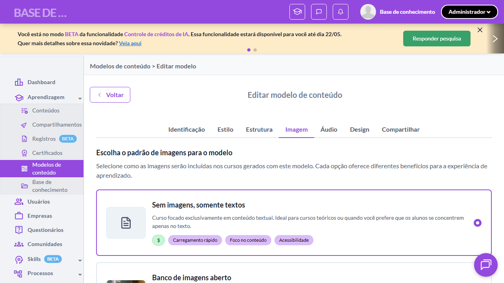

# Casos de teste — Modelos de conteúdo

[← Voltar ao dashboard](index.md)

Lista detalhada por testsuite. Cada caso traz: o que era esperado pelo XML, quais steps foram executados, evidências (screenshots/trace), texto pronto pra registro de bug e — quando houver falha — uma explicação em PT-BR do motivo.

## Criação de Modelo - Aba Imagem

_3 caso(s) — 3 aprovado(s), 0 falha(s)_

### ✅ Aprovado · TC1 · Aba Imagem exibe título e subtítulo literais · 🔴 Crítico

<a id="aba-imagem-exibe-titulo-e-subtitulo-literais"></a>_Arquivo:_ `tc01-aba-imagem-titulo-subtitulo.spec.ts` · _Duração:_ 16.02s · _Browser:_ chromium

**Sumário (objetivo do caso):** Validar textos literais da aba Imagem (RN 57.1, RN 57.2).

**Pré-condições:**

```
Ambiente Stage configurado
Feature flag `modelos_de_conteudo` ativa
Modelo de teste cadastrado no setup do spec (via beforeAll)
Usuário logado como Admin
```

**Passos do caso (XML/TestLink + execução Playwright):**

_Cada linha reproduz um passo do XML; a coluna **Status** traz o resultado da execução (do step Allure correspondente). Linhas com "Pré-condição" são da execução automatizada (login, navegação inicial) — não fazem parte do roteiro do XML._

| # | Ação do passo | Resultado esperado | Status | Notas | Duração |
|---|---|---|:---:|---|---:|
| 1 | Acessar a aba "Imagem" do modelo de teste | Aba "Imagem" fica selecionada. | ✅ | — | 13.99s |
| 2 | Aguardar a renderização da seção | Título exibido: "Escolha o padrão de imagens para o modelo". Subtítulo exibido: "Selecione como as imagens serão incluídas nos cursos gerados com este modelo. Cada opção oferece diferentes benefícios para a experiência de aprendizado.". | ✅ | — | 0.43s |

**Evidências:**

📁 _Pasta:_ [`artifacts/projects-modelos-tests-fea-2ff59-título-e-subtítulo-literais-chromium/`](artifacts/projects-modelos-tests-fea-2ff59-título-e-subtítulo-literais-chromium/)

- 📸 **Screenshot (screenshot)** — [`test-finished-1.png`](artifacts/projects-modelos-tests-fea-2ff59-título-e-subtítulo-literais-chromium/test-finished-1.png)

  

- 🎬 [Vídeo da execução (video.webm)](artifacts/projects-modelos-tests-fea-2ff59-título-e-subtítulo-literais-chromium/video.webm)

- 📦 **Trace** — [`trace.zip`](artifacts/projects-modelos-tests-fea-2ff59-título-e-subtítulo-literais-chromium/trace.zip)

  ```bash
  npx playwright show-trace outputs/modelos/reports/criacao-de-modelo-aba-imagem_20260520-153815/artifacts/projects-modelos-tests-fea-2ff59-título-e-subtítulo-literais-chromium/trace.zip
  ```

- 🎥 **Vídeo** — [`video.webm`](artifacts/projects-modelos-tests-fea-2ff59-título-e-subtítulo-literais-chromium/video.webm)


---

### ✅ Aprovado · TC2 · Opções de padrão de imagem disponíveis · 🔴 Crítico

<a id="opcoes-de-padrao-de-imagem-disponiveis"></a>_Arquivo:_ `tc02-opcoes-padrao-imagem.spec.ts` · _Duração:_ 16.05s · _Browser:_ chromium

**Sumário (objetivo do caso):** Validar 4 opções de padrão de imagem (RN 57).

**Pré-condições:**

```
Ambiente Stage configurado
Feature flag `modelos_de_conteudo` ativa
Modelo de teste cadastrado no setup do spec (via beforeAll)
Usuário logado como Admin
```

**Passos do caso (XML/TestLink + execução Playwright):**

_Cada linha reproduz um passo do XML; a coluna **Status** traz o resultado da execução (do step Allure correspondente). Linhas com "Pré-condição" são da execução automatizada (login, navegação inicial) — não fazem parte do roteiro do XML._

| # | Ação do passo | Resultado esperado | Status | Notas | Duração |
|---|---|---|:---:|---|---:|
| 1 | Acessar a aba "Imagem" | Aba é exibida. | ✅ | — | 13.76s |
| 2 | Aguardar as opções serem renderizadas | Opções exibidas: "Sem imagens, somente textos", "Banco de imagens aberto", "Gerador DALL-E (OpenAI)", "Gerador Imagen 4 (Google)". | ✅ | — | 0.64s |

**Evidências:**

📁 _Pasta:_ [`artifacts/projects-modelos-tests-fea-ad913-adrão-de-imagem-disponíveis-chromium/`](artifacts/projects-modelos-tests-fea-ad913-adrão-de-imagem-disponíveis-chromium/)

- 📸 **Screenshot (screenshot)** — [`test-finished-1.png`](artifacts/projects-modelos-tests-fea-ad913-adrão-de-imagem-disponíveis-chromium/test-finished-1.png)

  

- 🎬 [Vídeo da execução (video.webm)](artifacts/projects-modelos-tests-fea-ad913-adrão-de-imagem-disponíveis-chromium/video.webm)

- 📦 **Trace** — [`trace.zip`](artifacts/projects-modelos-tests-fea-ad913-adrão-de-imagem-disponíveis-chromium/trace.zip)

  ```bash
  npx playwright show-trace outputs/modelos/reports/criacao-de-modelo-aba-imagem_20260520-153815/artifacts/projects-modelos-tests-fea-ad913-adrão-de-imagem-disponíveis-chromium/trace.zip
  ```

- 🎥 **Vídeo** — [`video.webm`](artifacts/projects-modelos-tests-fea-ad913-adrão-de-imagem-disponíveis-chromium/video.webm)


---

### ✅ Aprovado · TC3 · Default "Sem imagens, somente textos" · 🔴 Crítico

<a id="default-sem-imagens-somente-textos"></a>_Arquivo:_ `tc03-default-sem-imagens.spec.ts` · _Duração:_ 16.40s · _Browser:_ chromium

**Sumário (objetivo do caso):** Validar que o padrão selecionado por default é "Sem imagens, somente textos" (RN 57.4).

**Pré-condições:**

```
Ambiente Stage configurado
Feature flag `modelos_de_conteudo` ativa
Modelo de teste cadastrado no setup do spec (via beforeAll)
Usuário logado como Admin
```

**Passos do caso (XML/TestLink + execução Playwright):**

_Cada linha reproduz um passo do XML; a coluna **Status** traz o resultado da execução (do step Allure correspondente). Linhas com "Pré-condição" são da execução automatizada (login, navegação inicial) — não fazem parte do roteiro do XML._

| # | Ação do passo | Resultado esperado | Status | Notas | Duração |
|---|---|---|:---:|---|---:|
| 1 | Acessar a aba "Imagem" em um novo modelo recém-criado | Aba é exibida. | ✅ | — | 14.37s |
| 2 | Aguardar a seleção default ser renderizada | Opção "Sem imagens, somente textos" é exibida como selecionada por padrão. | ✅ | — | 0.54s |

**Evidências:**

📁 _Pasta:_ [`artifacts/projects-modelos-tests-fea-fb2c4-Sem-imagens-somente-textos--chromium/`](artifacts/projects-modelos-tests-fea-fb2c4-Sem-imagens-somente-textos--chromium/)

- 📸 **Screenshot (screenshot)** — [`test-finished-1.png`](artifacts/projects-modelos-tests-fea-fb2c4-Sem-imagens-somente-textos--chromium/test-finished-1.png)

  

- 🎬 [Vídeo da execução (video.webm)](artifacts/projects-modelos-tests-fea-fb2c4-Sem-imagens-somente-textos--chromium/video.webm)

- 📦 **Trace** — [`trace.zip`](artifacts/projects-modelos-tests-fea-fb2c4-Sem-imagens-somente-textos--chromium/trace.zip)

  ```bash
  npx playwright show-trace outputs/modelos/reports/criacao-de-modelo-aba-imagem_20260520-153815/artifacts/projects-modelos-tests-fea-fb2c4-Sem-imagens-somente-textos--chromium/trace.zip
  ```

- 🎥 **Vídeo** — [`video.webm`](artifacts/projects-modelos-tests-fea-fb2c4-Sem-imagens-somente-textos--chromium/video.webm)


---
