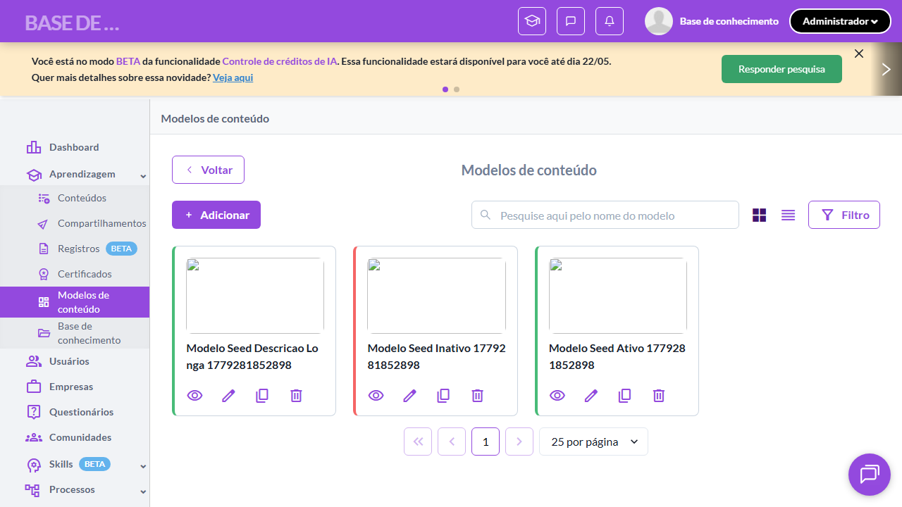

# Casos de teste — Modelos de conteúdo

[← Voltar ao dashboard](index.md)

Lista detalhada por testsuite. Cada caso traz: o que era esperado pelo XML, quais steps foram executados, evidências (screenshots/trace), texto pronto pra registro de bug e — quando houver falha — uma explicação em PT-BR do motivo.

## Filtros e Busca - Modelos

_4 caso(s) — 4 aprovado(s), 0 falha(s)_

### ✅ Aprovado · TC1 · Buscar modelo por nome · 🔴 Crítico

<a id="buscar-modelo-por-nome"></a>_Arquivo:_ `tc01-buscar-modelo-por-nome.spec.ts` · _Duração:_ 16.28s · _Browser:_ chromium

**Sumário (objetivo do caso):** Validar busca textual por nome do modelo na listagem.

**Pré-condições:**

```
Ambiente Stage configurado
Feature flag `modelos_de_conteudo` ativa
Pelo menos 4 modelos cadastrados (ativos, inativos, próprios e de terceiros) para validar filtros
Usuário logado como Admin
```

**Passos do caso (XML/TestLink + execução Playwright):**

_Cada linha reproduz um passo do XML; a coluna **Status** traz o resultado da execução (do step Allure correspondente). Linhas com "Pré-condição" são da execução automatizada (login, navegação inicial) — não fazem parte do roteiro do XML._

| # | Ação do passo | Resultado esperado | Status | Notas | Duração |
|---|---|---|:---:|---|---:|
| 1 | Acessar a URL "/o/{orgId}/content_models" | Listagem é exibida com múltiplos modelos. | ✅ | — | 10.38s |
| 2 | Preencher o campo "Buscar" com "Modelo TC1" | Listagem filtra exibindo apenas modelos cujo nome contém "Modelo TC1". | ✅ | — | 1.80s |
| 3 | Limpar o campo "Buscar" | Listagem volta a exibir todos os modelos cadastrados. | ✅ | — | 1.56s |

**Evidências:**

📁 _Pasta:_ [`artifacts/projects-modelos-tests-fea-58924-elos-Buscar-modelo-por-nome-chromium/`](artifacts/projects-modelos-tests-fea-58924-elos-Buscar-modelo-por-nome-chromium/)

- 📸 **Screenshot (screenshot)** — [`test-finished-1.png`](artifacts/projects-modelos-tests-fea-58924-elos-Buscar-modelo-por-nome-chromium/test-finished-1.png)

  

- 🎬 [Vídeo da execução (video.webm)](artifacts/projects-modelos-tests-fea-58924-elos-Buscar-modelo-por-nome-chromium/video.webm)

- 📦 **Trace** — [`trace.zip`](artifacts/projects-modelos-tests-fea-58924-elos-Buscar-modelo-por-nome-chromium/trace.zip)

  ```bash
  npx playwright show-trace outputs/modelos/reports/filtros-e-busca-modelos_20260520-141303/artifacts/projects-modelos-tests-fea-58924-elos-Buscar-modelo-por-nome-chromium/trace.zip
  ```

- 🎥 **Vídeo** — [`video.webm`](artifacts/projects-modelos-tests-fea-58924-elos-Buscar-modelo-por-nome-chromium/video.webm)


---

### ✅ Aprovado · TC2 · Filtrar modelos por Situação via drawer · 🔴 Crítico

<a id="filtrar-modelos-por-situacao-via-drawer"></a>_Arquivo:_ `tc02-filtrar-por-situacao-via-drawer.spec.ts` · _Duração:_ 16.55s · _Browser:_ chromium

**Sumário (objetivo do caso):** Validar filtragem por Situação (Ativo/Inativo) via drawer de filtros, conforme RN 60.

**Pré-condições:**

```
Ambiente Stage configurado
Feature flag `modelos_de_conteudo` ativa
Pelo menos 4 modelos cadastrados (ativos, inativos, próprios e de terceiros) para validar filtros
Usuário logado como Admin
```

**Passos do caso (XML/TestLink + execução Playwright):**

_Cada linha reproduz um passo do XML; a coluna **Status** traz o resultado da execução (do step Allure correspondente). Linhas com "Pré-condição" são da execução automatizada (login, navegação inicial) — não fazem parte do roteiro do XML._

| # | Ação do passo | Resultado esperado | Status | Notas | Duração |
|---|---|---|:---:|---|---:|
| — | _Pré-condição:_ cleanup: limpar filtro pra próximo TC começar limpo | — | ✅ | — | 0.54s |
| 1 | Clicar no botão "Filtrar" | Drawer "Filtros" é exibido à direita. | ✅ | — | 11.20s |
| 2 | Selecionar a opção "Ativo" no filtro "Situação" | Filtro "Situação" exibe a opção "Ativo" selecionada. | ✅ | — | 1.95s |
| 3 | Aplicar o filtro | Drawer fecha. Listagem exibe apenas modelos com Situação "Ativo". | ✅ | — | 0.65s |

**Evidências:**

📁 _Pasta:_ [`artifacts/projects-modelos-tests-fea-40575-los-por-Situação-via-drawer-chromium/`](artifacts/projects-modelos-tests-fea-40575-los-por-Situação-via-drawer-chromium/)

- 📸 **Screenshot (screenshot)** — [`test-finished-1.png`](artifacts/projects-modelos-tests-fea-40575-los-por-Situação-via-drawer-chromium/test-finished-1.png)

  

- 🎬 [Vídeo da execução (video.webm)](artifacts/projects-modelos-tests-fea-40575-los-por-Situação-via-drawer-chromium/video.webm)

- 📦 **Trace** — [`trace.zip`](artifacts/projects-modelos-tests-fea-40575-los-por-Situação-via-drawer-chromium/trace.zip)

  ```bash
  npx playwright show-trace outputs/modelos/reports/filtros-e-busca-modelos_20260520-141303/artifacts/projects-modelos-tests-fea-40575-los-por-Situação-via-drawer-chromium/trace.zip
  ```

- 🎥 **Vídeo** — [`video.webm`](artifacts/projects-modelos-tests-fea-40575-los-por-Situação-via-drawer-chromium/video.webm)


---

### ✅ Aprovado · Aplicar filtro padrão Modelos próprios 

<a id="aplicar-filtro-padrao-modelos-proprios"></a>_Arquivo:_ `tc03-aplicar-filtro-padrao-modelos-proprios.spec.ts` · _Duração:_ 16.99s · _Browser:_ chromium

**Passos do caso (XML/TestLink + execução Playwright):**

_Cada linha reproduz um passo do XML; a coluna **Status** traz o resultado da execução (do step Allure correspondente). Linhas com "Pré-condição" são da execução automatizada (login, navegação inicial) — não fazem parte do roteiro do XML._

| # | Ação do passo | Resultado esperado | Status | Notas | Duração |
|---|---|---|:---:|---|---:|
| — | _Pré-condição:_ 1. Acessar listagem e abrir drawer com 4 filtros padrão visíveis | — | ✅ | — | 13.70s |
| — | _Pré-condição:_ 2. Aplicar filtro padrão "Modelos próprios" | — | ✅ | — | 0.69s |
| — | _Pré-condição:_ 3. Validar filtro aplicado (drawer fechou, #clear-filter visível) | — | ✅ | — | 0.28s |
| — | _Pré-condição:_ cleanup: limpar filtro | — | ✅ | — | 0.42s |

**Evidências:**

📁 _Pasta:_ [`artifacts/projects-modelos-tests-fea-5260f-tro-padrão-Modelos-próprios-chromium/`](artifacts/projects-modelos-tests-fea-5260f-tro-padrão-Modelos-próprios-chromium/)

- 📸 **Screenshot (screenshot)** — [`test-finished-1.png`](artifacts/projects-modelos-tests-fea-5260f-tro-padrão-Modelos-próprios-chromium/test-finished-1.png)

  

- 🎬 [Vídeo da execução (video.webm)](artifacts/projects-modelos-tests-fea-5260f-tro-padrão-Modelos-próprios-chromium/video.webm)

- 📦 **Trace** — [`trace.zip`](artifacts/projects-modelos-tests-fea-5260f-tro-padrão-Modelos-próprios-chromium/trace.zip)

  ```bash
  npx playwright show-trace outputs/modelos/reports/filtros-e-busca-modelos_20260520-141303/artifacts/projects-modelos-tests-fea-5260f-tro-padrão-Modelos-próprios-chromium/trace.zip
  ```

- 🎥 **Vídeo** — [`video.webm`](artifacts/projects-modelos-tests-fea-5260f-tro-padrão-Modelos-próprios-chromium/video.webm)


---

### ✅ Aprovado · TC4 · Limpar filtros aplicados · 🟡 Normal

<a id="limpar-filtros-aplicados"></a>_Arquivo:_ `tc04-limpar-filtros-aplicados.spec.ts` · _Duração:_ 16.62s · _Browser:_ chromium

**Sumário (objetivo do caso):** Validar limpeza dos filtros aplicados.

**Pré-condições:**

```
Ambiente Stage configurado
Feature flag `modelos_de_conteudo` ativa
Pelo menos 4 modelos cadastrados (ativos, inativos, próprios e de terceiros) para validar filtros
Usuário logado como Admin
```

**Passos do caso (XML/TestLink + execução Playwright):**

_Cada linha reproduz um passo do XML; a coluna **Status** traz o resultado da execução (do step Allure correspondente). Linhas com "Pré-condição" são da execução automatizada (login, navegação inicial) — não fazem parte do roteiro do XML._

| # | Ação do passo | Resultado esperado | Status | Notas | Duração |
|---|---|---|:---:|---|---:|
| 1 | Aplicar o filtro padrão "Modelos ativos" | Listagem é filtrada exibindo apenas modelos ativos. | ✅ | — | 13.14s |
| 2 | Clicar no botão "Limpar filtros" | Listagem volta a exibir todos os modelos cadastrados sem filtros aplicados. | ✅ | — | 1.25s |

**Evidências:**

📁 _Pasta:_ [`artifacts/projects-modelos-tests-fea-7b8fa-os-Limpar-filtros-aplicados-chromium/`](artifacts/projects-modelos-tests-fea-7b8fa-os-Limpar-filtros-aplicados-chromium/)

- 📸 **Screenshot (screenshot)** — [`test-finished-1.png`](artifacts/projects-modelos-tests-fea-7b8fa-os-Limpar-filtros-aplicados-chromium/test-finished-1.png)

  

- 🎬 [Vídeo da execução (video.webm)](artifacts/projects-modelos-tests-fea-7b8fa-os-Limpar-filtros-aplicados-chromium/video.webm)

- 📦 **Trace** — [`trace.zip`](artifacts/projects-modelos-tests-fea-7b8fa-os-Limpar-filtros-aplicados-chromium/trace.zip)

  ```bash
  npx playwright show-trace outputs/modelos/reports/filtros-e-busca-modelos_20260520-141303/artifacts/projects-modelos-tests-fea-7b8fa-os-Limpar-filtros-aplicados-chromium/trace.zip
  ```

- 🎥 **Vídeo** — [`video.webm`](artifacts/projects-modelos-tests-fea-7b8fa-os-Limpar-filtros-aplicados-chromium/video.webm)


---
