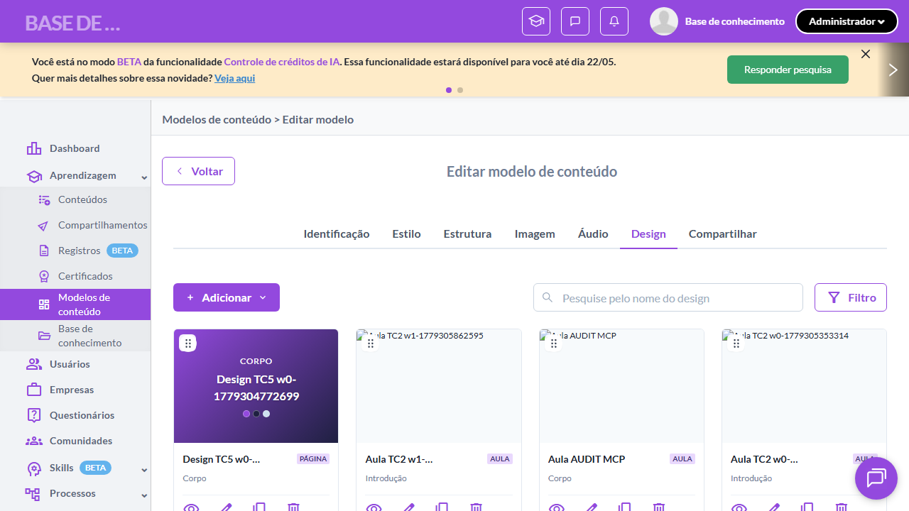

# Casos de teste — Modelos de conteúdo

[← Voltar ao dashboard](index.md)

Lista detalhada por testsuite. Cada caso traz: o que era esperado pelo XML, quais steps foram executados, evidências (screenshots/trace), texto pronto pra registro de bug e — quando houver falha — uma explicação em PT-BR do motivo.

## Listagem de Designs (aba Design do Modelo)

_3 caso(s) — 3 aprovado(s), 0 falha(s)_

### ✅ Aprovado · Listagem exibe elementos obrigatórios por design 

<a id="listagem-exibe-elementos-obrigatorios-por-design"></a>_Arquivo:_ `tc01-colunas-obrigatorias.spec.ts` · _Duração:_ 17.21s · _Browser:_ chromium

**Passos do caso (XML/TestLink + execução Playwright):**

_Cada linha reproduz um passo do XML; a coluna **Status** traz o resultado da execução (do step Allure correspondente). Linhas com "Pré-condição" são da execução automatizada (login, navegação inicial) — não fazem parte do roteiro do XML._

| # | Ação do passo | Resultado esperado | Status | Notas | Duração |
|---|---|---|:---:|---|---:|
| — | _Pré-condição:_ 1. Abrir aba Design do modelo | — | ✅ | — | 14.89s |
| — | _Pré-condição:_ 2. Validar que listagem renderiza pelo menos 1 design | — | ✅ | — | 0.55s |
| — | _Pré-condição:_ 3. Validar que cada card exibe os 4 elementos canônicos | — | ✅ | — | 0.14s |

**Evidências:**

📁 _Pasta:_ [`artifacts/projects-modelos-tests-fea-aaf1b-tos-obrigatórios-por-design-chromium/`](artifacts/projects-modelos-tests-fea-aaf1b-tos-obrigatórios-por-design-chromium/)

- 📸 **Screenshot (screenshot)** — [`test-finished-1.png`](artifacts/projects-modelos-tests-fea-aaf1b-tos-obrigatórios-por-design-chromium/test-finished-1.png)

  

- 🎬 [Vídeo da execução (video.webm)](artifacts/projects-modelos-tests-fea-aaf1b-tos-obrigatórios-por-design-chromium/video.webm)

- 📦 **Trace** — [`trace.zip`](artifacts/projects-modelos-tests-fea-aaf1b-tos-obrigatórios-por-design-chromium/trace.zip)

  ```bash
  npx playwright show-trace outputs/modelos/reports/listagem-de-designs-aba-design-do-modelo_20260520-165855/artifacts/projects-modelos-tests-fea-aaf1b-tos-obrigatórios-por-design-chromium/trace.zip
  ```

- 🎥 **Vídeo** — [`video.webm`](artifacts/projects-modelos-tests-fea-aaf1b-tos-obrigatórios-por-design-chromium/video.webm)


---

### ✅ Aprovado · TC2 · Ações da listagem de designs · 🔴 Crítico

<a id="acoes-da-listagem-de-designs"></a>_Arquivo:_ `tc02-acoes-listagem.spec.ts` · _Duração:_ 16.82s · _Browser:_ chromium

**Sumário (objetivo do caso):** Validar ações disponíveis em cada linha da listagem de designs (RN 46).

**Pré-condições:**

```
Ambiente Stage configurado
Feature flag `modelos_de_conteudo` ativa
Modelo de teste cadastrado com pelo menos 3 designs (mix de Aula e Página)
Usuário logado como Admin
```

**Passos do caso (XML/TestLink + execução Playwright):**

_Cada linha reproduz um passo do XML; a coluna **Status** traz o resultado da execução (do step Allure correspondente). Linhas com "Pré-condição" são da execução automatizada (login, navegação inicial) — não fazem parte do roteiro do XML._

| # | Ação do passo | Resultado esperado | Status | Notas | Duração |
|---|---|---|:---:|---|---:|
| 1 | Acessar a aba "Design" do modelo de teste | Listagem é exibida. | ✅ | — | 14.41s |
| 2 | Aguardar a coluna "Ações" de cada linha ser renderizada | Cada linha da listagem exibe os botões "Editar", "Duplicar" e "Excluir". | ✅ | — | 0.77s |

**Evidências:**

📁 _Pasta:_ [`artifacts/projects-modelos-tests-fea-d7a33-ções-da-listagem-de-designs-chromium/`](artifacts/projects-modelos-tests-fea-d7a33-ções-da-listagem-de-designs-chromium/)

- 📸 **Screenshot (screenshot)** — [`test-finished-1.png`](artifacts/projects-modelos-tests-fea-d7a33-ções-da-listagem-de-designs-chromium/test-finished-1.png)

  

- 🎬 [Vídeo da execução (video.webm)](artifacts/projects-modelos-tests-fea-d7a33-ções-da-listagem-de-designs-chromium/video.webm)

- 📦 **Trace** — [`trace.zip`](artifacts/projects-modelos-tests-fea-d7a33-ções-da-listagem-de-designs-chromium/trace.zip)

  ```bash
  npx playwright show-trace outputs/modelos/reports/listagem-de-designs-aba-design-do-modelo_20260520-165855/artifacts/projects-modelos-tests-fea-d7a33-ções-da-listagem-de-designs-chromium/trace.zip
  ```

- 🎥 **Vídeo** — [`video.webm`](artifacts/projects-modelos-tests-fea-d7a33-ções-da-listagem-de-designs-chromium/video.webm)


---

### ✅ Aprovado · TC3 · Filtrar designs por Tipo (Aula/Página) · 🔴 Crítico

<a id="filtrar-designs-por-tipo-aula-pagina"></a>_Arquivo:_ `tc03-filtrar-designs-por-tipo.spec.ts` · _Duração:_ 19.29s · _Browser:_ chromium

**Sumário (objetivo do caso):** Validar filtro padrão "Somente aulas" (RN 50).

**Pré-condições:**

```
Ambiente Stage configurado
Feature flag `modelos_de_conteudo` ativa
Modelo de teste cadastrado com pelo menos 3 designs (mix de Aula e Página)
Usuário logado como Admin
```

**Passos do caso (XML/TestLink + execução Playwright):**

_Cada linha reproduz um passo do XML; a coluna **Status** traz o resultado da execução (do step Allure correspondente). Linhas com "Pré-condição" são da execução automatizada (login, navegação inicial) — não fazem parte do roteiro do XML._

| # | Ação do passo | Resultado esperado | Status | Notas | Duração |
|---|---|---|:---:|---|---:|
| — | _Pré-condição:_ cleanup: limpar filtro | — | ✅ | — | 0.27s |
| 1 | Clicar no botão "Filtrar" | Drawer "Filtros" é exibido com os filtros padrão "Somente páginas" e "Somente aulas". | ✅ | — | 15.57s |
| 2 | Selecionar o filtro padrão "Somente aulas" | Filtro fica marcado. | ✅ | — | 0.90s |
| 3 | Aplicar o filtro | Drawer fecha. Listagem exibe apenas designs do Tipo "Aula". | ✅ | — | 0.75s |

**Evidências:**

📁 _Pasta:_ [`artifacts/projects-modelos-tests-fea-0ec35-signs-por-Tipo-Aula-Página--chromium/`](artifacts/projects-modelos-tests-fea-0ec35-signs-por-Tipo-Aula-Página--chromium/)

- 📸 **Screenshot (screenshot)** — [`test-finished-1.png`](artifacts/projects-modelos-tests-fea-0ec35-signs-por-Tipo-Aula-Página--chromium/test-finished-1.png)

  

- 🎬 [Vídeo da execução (video.webm)](artifacts/projects-modelos-tests-fea-0ec35-signs-por-Tipo-Aula-Página--chromium/video.webm)

- 📦 **Trace** — [`trace.zip`](artifacts/projects-modelos-tests-fea-0ec35-signs-por-Tipo-Aula-Página--chromium/trace.zip)

  ```bash
  npx playwright show-trace outputs/modelos/reports/listagem-de-designs-aba-design-do-modelo_20260520-165855/artifacts/projects-modelos-tests-fea-0ec35-signs-por-Tipo-Aula-Página--chromium/trace.zip
  ```

- 🎥 **Vídeo** — [`video.webm`](artifacts/projects-modelos-tests-fea-0ec35-signs-por-Tipo-Aula-Página--chromium/video.webm)


---
