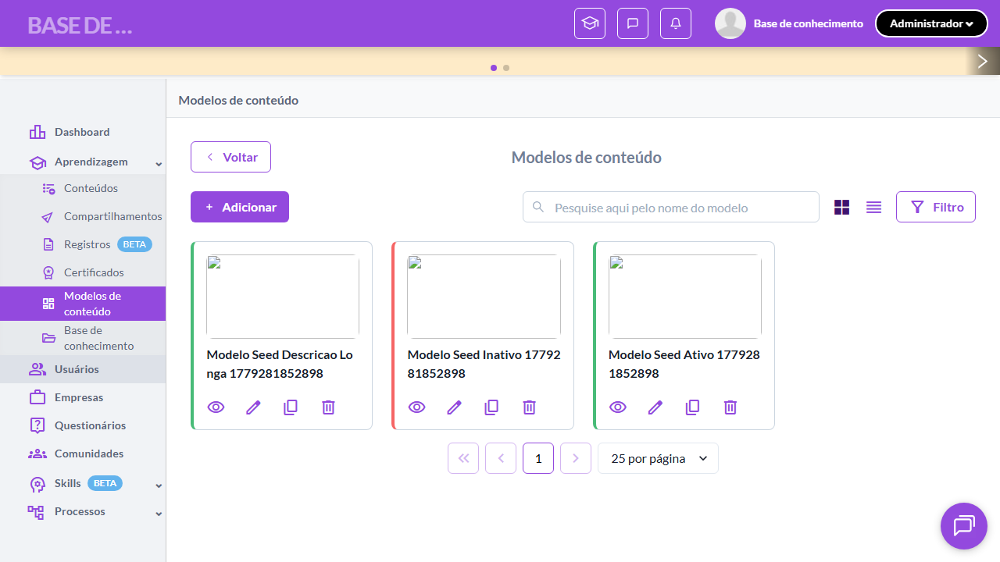
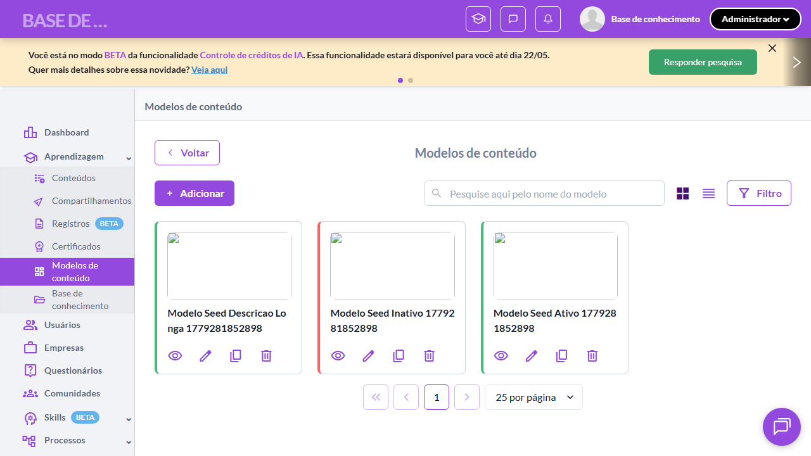
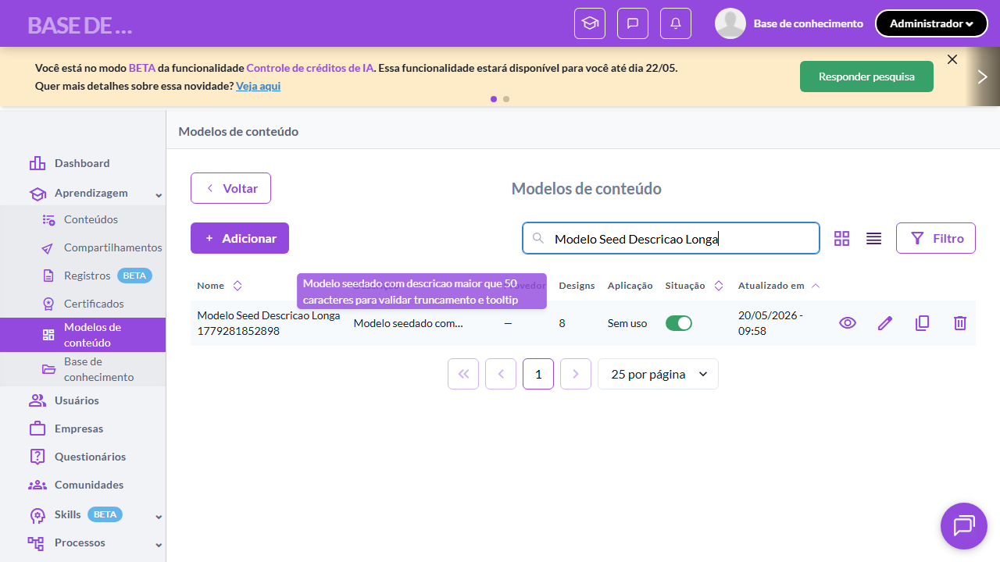
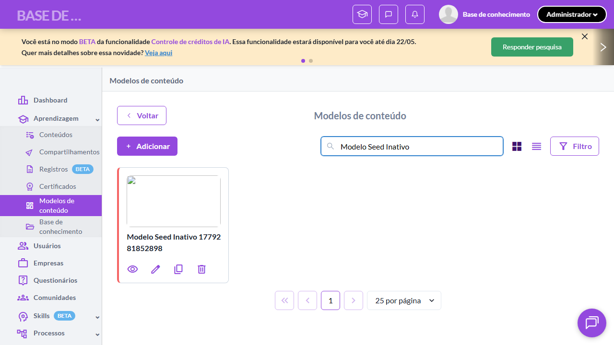

# Casos de teste — Modelos de conteúdo

[← Voltar ao dashboard](index.md)

Lista detalhada por testsuite. Cada caso traz: o que era esperado pelo XML, quais steps foram executados, evidências (screenshots/trace), texto pronto pra registro de bug e — quando houver falha — uma explicação em PT-BR do motivo.

## Listagem e Menu de Modelos

_6 caso(s) — 6 aprovado(s), 0 falha(s)_

### ✅ Aprovado · TC1 · Acessar listagem via submenu Aprendizagem · 🔴 Crítico

<a id="acessar-listagem-via-submenu-aprendizagem"></a>_Arquivo:_ `tc01-acessar-listagem-via-submenu-aprendizagem.spec.ts` · _Duração:_ 17.96s · _Browser:_ chromium

**Sumário (objetivo do caso):** Validar acesso à listagem via menu lateral, conforme RN 1, 1.1.

**Pré-condições:**

```
Ambiente Stage configurado
Feature flag `modelos_de_conteudo` ativa na organização do teste
Pelo menos 2 modelos cadastrados (1 ativo, 1 inativo) para validar visualizações
Usuário logado como Admin
```

**Passos do caso (XML/TestLink + execução Playwright):**

_Cada linha reproduz um passo do XML; a coluna **Status** traz o resultado da execução (do step Allure correspondente). Linhas com "Pré-condição" são da execução automatizada (login, navegação inicial) — não fazem parte do roteiro do XML._

| # | Ação do passo | Resultado esperado | Status | Notas | Duração |
|---|---|---|:---:|---|---:|
| 1 | Acessar a URL "/o/{orgId}/dashboard" | Dashboard padrão é exibido contendo o menu lateral. | ✅ | — | 9.42s |
| 2 | Clicar no menu lateral "Aprendizagem" | Submenu lateral é exibido contendo o item "Modelos de conteúdo" com ícone Material "browse". | ✅ | — | 0.54s |
| 3 | Clicar no submenu "Modelos de conteúdo" | Sistema redireciona para a listagem e exibe breadcrumb "Aprendizagem > Modelos de conteúdo". | ✅ | — | 5.51s |

**Evidências:**

📁 _Pasta:_ [`artifacts/projects-modelos-tests-fea-3d814-em-via-submenu-Aprendizagem-chromium/`](artifacts/projects-modelos-tests-fea-3d814-em-via-submenu-Aprendizagem-chromium/)

- 📸 **Screenshot (screenshot)** — [`test-finished-1.png`](artifacts/projects-modelos-tests-fea-3d814-em-via-submenu-Aprendizagem-chromium/test-finished-1.png)

  

- 🎬 [Vídeo da execução (video.webm)](artifacts/projects-modelos-tests-fea-3d814-em-via-submenu-Aprendizagem-chromium/video.webm)

- 📦 **Trace** — [`trace.zip`](artifacts/projects-modelos-tests-fea-3d814-em-via-submenu-Aprendizagem-chromium/trace.zip)

  ```bash
  npx playwright show-trace outputs/modelos/reports/listagem-e-menu-de-modelos_20260520-134501/artifacts/projects-modelos-tests-fea-3d814-em-via-submenu-Aprendizagem-chromium/trace.zip
  ```

- 🎥 **Vídeo** — [`video.webm`](artifacts/projects-modelos-tests-fea-3d814-em-via-submenu-Aprendizagem-chromium/video.webm)


---

### ✅ Aprovado · TC2 · Visualização padrão em Cards · 🔴 Crítico

<a id="visualizacao-padrao-em-cards"></a>_Arquivo:_ `tc02-visualizacao-padrao-em-cards.spec.ts` · _Duração:_ 15.39s · _Browser:_ chromium

**Sumário (objetivo do caso):** Validar que a visualização padrão da listagem é em formato Cards, conforme RN 3.

**Pré-condições:**

```
Ambiente Stage configurado
Feature flag `modelos_de_conteudo` ativa na organização do teste
Pelo menos 2 modelos cadastrados (1 ativo, 1 inativo) para validar visualizações
Usuário logado como Admin
```

**Passos do caso (XML/TestLink + execução Playwright):**

_Cada linha reproduz um passo do XML; a coluna **Status** traz o resultado da execução (do step Allure correspondente). Linhas com "Pré-condição" são da execução automatizada (login, navegação inicial) — não fazem parte do roteiro do XML._

| # | Ação do passo | Resultado esperado | Status | Notas | Duração |
|---|---|---|:---:|---|---:|
| — | _Pré-condição:_ 3. Validar pelo menos 1 card renderizado com nome visível | — | ✅ | — | 0.25s |
| 1 | Acessar a URL "/o/{orgId}/content_models" | Listagem é exibida em formato Cards por padrão. | ✅ | — | 8.74s |
| 2 | Aguardar a renderização dos cards | Cada card exibe imagem principal, nome do modelo, ações (List Control) e indicador de cor lateral para status. | ✅ | — | 0.91s |

**Evidências:**

📁 _Pasta:_ [`artifacts/projects-modelos-tests-fea-ed4ce-isualização-padrão-em-Cards-chromium/`](artifacts/projects-modelos-tests-fea-ed4ce-isualização-padrão-em-Cards-chromium/)

- 📸 **Screenshot (screenshot)** — [`test-finished-1.png`](artifacts/projects-modelos-tests-fea-ed4ce-isualização-padrão-em-Cards-chromium/test-finished-1.png)

  

- 🎬 [Vídeo da execução (video.webm)](artifacts/projects-modelos-tests-fea-ed4ce-isualização-padrão-em-Cards-chromium/video.webm)

- 📦 **Trace** — [`trace.zip`](artifacts/projects-modelos-tests-fea-ed4ce-isualização-padrão-em-Cards-chromium/trace.zip)

  ```bash
  npx playwright show-trace outputs/modelos/reports/listagem-e-menu-de-modelos_20260520-134501/artifacts/projects-modelos-tests-fea-ed4ce-isualização-padrão-em-Cards-chromium/trace.zip
  ```

- 🎥 **Vídeo** — [`video.webm`](artifacts/projects-modelos-tests-fea-ed4ce-isualização-padrão-em-Cards-chromium/video.webm)


---

### ✅ Aprovado · TC3 · Alternância entre visualização Cards e Lista · 🔴 Crítico

<a id="alternancia-entre-visualizacao-cards-e-lista"></a>_Arquivo:_ `tc03-alternancia-visualizacao-cards-lista.spec.ts` · _Duração:_ 15.90s · _Browser:_ chromium

**Sumário (objetivo do caso):** Validar alternância de visualização entre Cards e Lista, conforme RN 2.

**Pré-condições:**

```
Ambiente Stage configurado
Feature flag `modelos_de_conteudo` ativa na organização do teste
Pelo menos 2 modelos cadastrados (1 ativo, 1 inativo) para validar visualizações
Usuário logado como Admin
```

**Passos do caso (XML/TestLink + execução Playwright):**

_Cada linha reproduz um passo do XML; a coluna **Status** traz o resultado da execução (do step Allure correspondente). Linhas com "Pré-condição" são da execução automatizada (login, navegação inicial) — não fazem parte do roteiro do XML._

| # | Ação do passo | Resultado esperado | Status | Notas | Duração |
|---|---|---|:---:|---|---:|
| 1 | Acessar a URL "/o/{orgId}/content_models" | Listagem é exibida em formato Cards. | ✅ | — | 9.39s |
| 2 | Clicar no botão de alternância para visualização "Lista" | Listagem alterna para formato Lista exibindo colunas: "Nome", "Descrição", "Provedor", "Designs", "Aplicação", "Situação", "Atualizado em". | ✅ | — | 3.15s |
| 3 | Clicar no botão de alternância para visualização "Cards" | Listagem retorna para formato Cards. | ✅ | — | 1.27s |

**Evidências:**

📁 _Pasta:_ [`artifacts/projects-modelos-tests-fea-36c4f--visualização-Cards-e-Lista-chromium/`](artifacts/projects-modelos-tests-fea-36c4f--visualização-Cards-e-Lista-chromium/)

- 📸 **Screenshot (screenshot)** — [`test-finished-1.png`](artifacts/projects-modelos-tests-fea-36c4f--visualização-Cards-e-Lista-chromium/test-finished-1.png)

  

- 🎬 [Vídeo da execução (video.webm)](artifacts/projects-modelos-tests-fea-36c4f--visualização-Cards-e-Lista-chromium/video.webm)

- 📦 **Trace** — [`trace.zip`](artifacts/projects-modelos-tests-fea-36c4f--visualização-Cards-e-Lista-chromium/trace.zip)

  ```bash
  npx playwright show-trace outputs/modelos/reports/listagem-e-menu-de-modelos_20260520-134501/artifacts/projects-modelos-tests-fea-36c4f--visualização-Cards-e-Lista-chromium/trace.zip
  ```

- 🎥 **Vídeo** — [`video.webm`](artifacts/projects-modelos-tests-fea-36c4f--visualização-Cards-e-Lista-chromium/video.webm)


---

### ✅ Aprovado · TC4 · Coluna Descrição truncada com tooltip completo (visão Lista) · 🟡 Normal

<a id="coluna-descricao-truncada-com-tooltip-completo-visao-lista"></a>_Arquivo:_ `tc04-descricao-truncada-tooltip.spec.ts` · _Duração:_ 16.61s · _Browser:_ chromium

**Sumário (objetivo do caso):** Validar que a Descrição na visão Lista é truncada em 50 caracteres com tooltip exibindo o texto completo (RN 4.1.2).

**Pré-condições:**

```
Ambiente Stage configurado
Feature flag `modelos_de_conteudo` ativa na organização do teste
Pelo menos 2 modelos cadastrados (1 ativo, 1 inativo) para validar visualizações
Usuário logado como Admin
```

**Passos do caso (XML/TestLink + execução Playwright):**

_Cada linha reproduz um passo do XML; a coluna **Status** traz o resultado da execução (do step Allure correspondente). Linhas com "Pré-condição" são da execução automatizada (login, navegação inicial) — não fazem parte do roteiro do XML._

| # | Ação do passo | Resultado esperado | Status | Notas | Duração |
|---|---|---|:---:|---|---:|
| — | _Pré-condição:_ 3. Hover na célula e validar tooltip com texto completo | — | ✅ | — | 0.18s |
| 1 | Acessar a listagem em formato Lista para um modelo com Descrição maior que 50 caracteres | Coluna "Descrição" exibe os primeiros 50 caracteres da descrição seguidos de reticências. | ✅ | — | 13.92s |
| 2 | Posicionar o mouse sobre a Descrição truncada | Tooltip exibido com o texto completo da Descrição. | ✅ | — | 0.04s |

**Evidências:**

📁 _Pasta:_ [`artifacts/projects-modelos-tests-fea-9f639-oltip-completo-visão-Lista--chromium/`](artifacts/projects-modelos-tests-fea-9f639-oltip-completo-visão-Lista--chromium/)

- 📸 **Screenshot (screenshot)** — [`test-finished-1.png`](artifacts/projects-modelos-tests-fea-9f639-oltip-completo-visão-Lista--chromium/test-finished-1.png)

  

- 🎬 [Vídeo da execução (video.webm)](artifacts/projects-modelos-tests-fea-9f639-oltip-completo-visão-Lista--chromium/video.webm)

- 📦 **Trace** — [`trace.zip`](artifacts/projects-modelos-tests-fea-9f639-oltip-completo-visão-Lista--chromium/trace.zip)

  ```bash
  npx playwright show-trace outputs/modelos/reports/listagem-e-menu-de-modelos_20260520-134501/artifacts/projects-modelos-tests-fea-9f639-oltip-completo-visão-Lista--chromium/trace.zip
  ```

- 🎥 **Vídeo** — [`video.webm`](artifacts/projects-modelos-tests-fea-9f639-oltip-completo-visão-Lista--chromium/video.webm)


---

### ✅ Aprovado · TC5 · Botão Adicionar redireciona para criação · 🔴 Crítico

<a id="botao-adicionar-redireciona-para-criacao"></a>_Arquivo:_ `tc05-botao-adicionar-redireciona-criacao.spec.ts` · _Duração:_ 13.20s · _Browser:_ chromium

**Sumário (objetivo do caso):** Validar que o botão "Adicionar" inicia o fluxo de criação de modelo, conforme RN 2 e RN 7.

**Pré-condições:**

```
Ambiente Stage configurado
Feature flag `modelos_de_conteudo` ativa na organização do teste
Pelo menos 2 modelos cadastrados (1 ativo, 1 inativo) para validar visualizações
Usuário logado como Admin
```

**Passos do caso (XML/TestLink + execução Playwright):**

_Cada linha reproduz um passo do XML; a coluna **Status** traz o resultado da execução (do step Allure correspondente). Linhas com "Pré-condição" são da execução automatizada (login, navegação inicial) — não fazem parte do roteiro do XML._

| # | Ação do passo | Resultado esperado | Status | Notas | Duração |
|---|---|---|:---:|---|---:|
| — | _Pré-condição:_ 3. Validar aba Identificação ativa por default no form | — | ✅ | — | 2.76s |
| 1 | Acessar a listagem de modelos | Listagem é exibida. | ✅ | — | 7.31s |
| 2 | Clicar no botão "+ Adicionar" | Sistema redireciona para a tela de criação exibindo a aba "Identificação" como primeira aba. | ✅ | — | 1.74s |

**Evidências:**

📁 _Pasta:_ [`artifacts/projects-modelos-tests-fea-81907-ar-redireciona-para-criação-chromium/`](artifacts/projects-modelos-tests-fea-81907-ar-redireciona-para-criação-chromium/)

- 📸 **Screenshot (screenshot)** — [`test-finished-1.png`](artifacts/projects-modelos-tests-fea-81907-ar-redireciona-para-criação-chromium/test-finished-1.png)

  

- 🎬 [Vídeo da execução (video.webm)](artifacts/projects-modelos-tests-fea-81907-ar-redireciona-para-criação-chromium/video.webm)

- 📦 **Trace** — [`trace.zip`](artifacts/projects-modelos-tests-fea-81907-ar-redireciona-para-criação-chromium/trace.zip)

  ```bash
  npx playwright show-trace outputs/modelos/reports/listagem-e-menu-de-modelos_20260520-134501/artifacts/projects-modelos-tests-fea-81907-ar-redireciona-para-criação-chromium/trace.zip
  ```

- 🎥 **Vídeo** — [`video.webm`](artifacts/projects-modelos-tests-fea-81907-ar-redireciona-para-criação-chromium/video.webm)


---

### ✅ Aprovado · TC6 · Indicador de cor lateral reflete status ativo/inativo no card · 🟡 Normal

<a id="indicador-de-cor-lateral-reflete-status-ativo-inativo-no-card"></a>_Arquivo:_ `tc06-indicador-cor-status-card.spec.ts` · _Duração:_ 12.27s · _Browser:_ chromium

**Sumário (objetivo do caso):** Validar que o indicador de cor lateral dos cards reflete o status ativo/inativo do modelo (RN 5).

**Pré-condições:**

```
Ambiente Stage configurado
Feature flag `modelos_de_conteudo` ativa na organização do teste
Pelo menos 2 modelos cadastrados (1 ativo, 1 inativo) para validar visualizações
Usuário logado como Admin
```

**Passos do caso (XML/TestLink + execução Playwright):**

_Cada linha reproduz um passo do XML; a coluna **Status** traz o resultado da execução (do step Allure correspondente). Linhas com "Pré-condição" são da execução automatizada (login, navegação inicial) — não fazem parte do roteiro do XML._

| # | Ação do passo | Resultado esperado | Status | Notas | Duração |
|---|---|---|:---:|---|---:|
| 1 | Acessar a listagem em formato Cards com modelos ativos e inativos | Listagem exibe cards com indicadores de cor lateral distintos para modelos ativos e inativos. | ✅ | — | 7.97s |
| 2 | Aguardar o card de um modelo ativo ser exibido | Card exibe indicador de cor lateral indicando estado "Ativo". | ✅ | — | 1.16s |
| 3 | Aguardar o card de um modelo inativo ser exibido | Card exibe indicador de cor lateral indicando estado "Inativo". | ✅ | — | 1.81s |

**Evidências:**

📁 _Pasta:_ [`artifacts/projects-modelos-tests-fea-83c1a-tatus-ativo-inativo-no-card-chromium/`](artifacts/projects-modelos-tests-fea-83c1a-tatus-ativo-inativo-no-card-chromium/)

- 📸 **Screenshot (screenshot)** — [`test-finished-1.png`](artifacts/projects-modelos-tests-fea-83c1a-tatus-ativo-inativo-no-card-chromium/test-finished-1.png)

  

- 🎬 [Vídeo da execução (video.webm)](artifacts/projects-modelos-tests-fea-83c1a-tatus-ativo-inativo-no-card-chromium/video.webm)

- 📦 **Trace** — [`trace.zip`](artifacts/projects-modelos-tests-fea-83c1a-tatus-ativo-inativo-no-card-chromium/trace.zip)

  ```bash
  npx playwright show-trace outputs/modelos/reports/listagem-e-menu-de-modelos_20260520-134501/artifacts/projects-modelos-tests-fea-83c1a-tatus-ativo-inativo-no-card-chromium/trace.zip
  ```

- 🎥 **Vídeo** — [`video.webm`](artifacts/projects-modelos-tests-fea-83c1a-tatus-ativo-inativo-no-card-chromium/video.webm)


---
