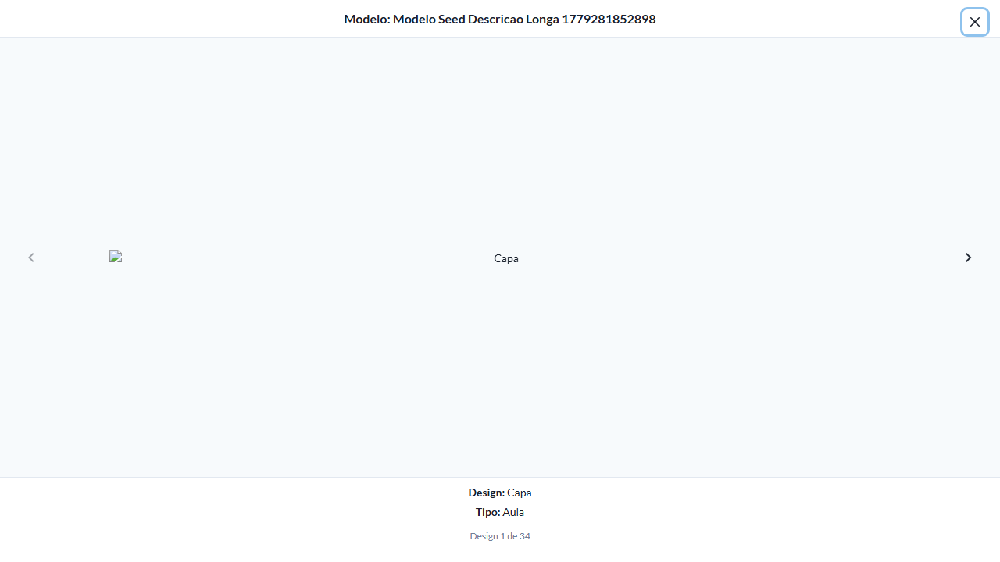
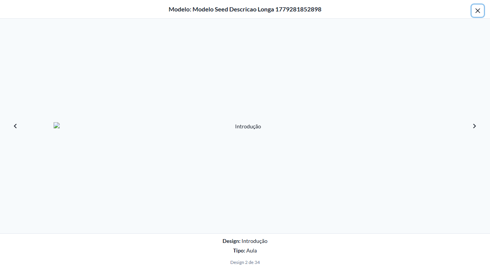
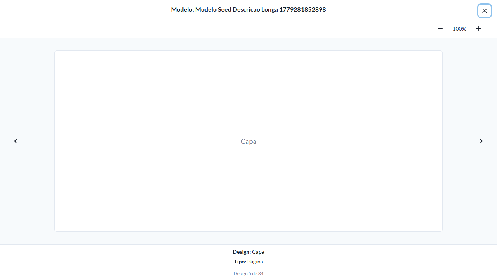

# Casos de teste — Modelos de conteúdo

[← Voltar ao dashboard](index.md)

Lista detalhada por testsuite. Cada caso traz: o que era esperado pelo XML, quais steps foram executados, evidências (screenshots/trace), texto pronto pra registro de bug e — quando houver falha — uma explicação em PT-BR do motivo.

## Preview de Modelos e Designs

_4 caso(s) — 4 aprovado(s), 0 falha(s)_

### ✅ Aprovado · TC1 · Abrir Preview de Modelo via card · 🔴 Crítico

<a id="abrir-preview-de-modelo-via-card"></a>_Arquivo:_ `tc01-abrir-preview-modelo-via-card.spec.ts` · _Duração:_ 14.27s · _Browser:_ chromium

**Sumário (objetivo do caso):** Validar abertura do modal carrossel de preview do modelo (RN 5.2).

**Pré-condições:**

```
Ambiente Stage configurado
Feature flag `modelos_de_conteudo` ativa
Modelo de teste cadastrado com pelo menos 2 designs com previews gerados (1 Aula e 1 Página)
Usuário logado como Admin
```

**Passos do caso (XML/TestLink + execução Playwright):**

_Cada linha reproduz um passo do XML; a coluna **Status** traz o resultado da execução (do step Allure correspondente). Linhas com "Pré-condição" são da execução automatizada (login, navegação inicial) — não fazem parte do roteiro do XML._

| # | Ação do passo | Resultado esperado | Status | Notas | Duração |
|---|---|---|:---:|---|---:|
| 1 | Acessar a listagem de modelos em visualização Cards | Listagem é exibida. | ✅ | — | 11.39s |
| 2 | Clicar na ação "Preview" do modelo de teste | Modal de preview é exibido com carrossel contendo o primeiro design. | ✅ | — | 1.45s |

**Evidências:**

📁 _Pasta:_ [`artifacts/projects-modelos-tests-fea-b2a65--Preview-de-Modelo-via-card-chromium/`](artifacts/projects-modelos-tests-fea-b2a65--Preview-de-Modelo-via-card-chromium/)

- 📸 **Screenshot (screenshot)** — [`test-finished-1.png`](artifacts/projects-modelos-tests-fea-b2a65--Preview-de-Modelo-via-card-chromium/test-finished-1.png)

  

- 🎬 [Vídeo da execução (video.webm)](artifacts/projects-modelos-tests-fea-b2a65--Preview-de-Modelo-via-card-chromium/video.webm)

- 📦 **Trace** — [`trace.zip`](artifacts/projects-modelos-tests-fea-b2a65--Preview-de-Modelo-via-card-chromium/trace.zip)

  ```bash
  npx playwright show-trace outputs/modelos/reports/preview-de-modelos-e-designs_20260520-174549/artifacts/projects-modelos-tests-fea-b2a65--Preview-de-Modelo-via-card-chromium/trace.zip
  ```

- 🎥 **Vídeo** — [`video.webm`](artifacts/projects-modelos-tests-fea-b2a65--Preview-de-Modelo-via-card-chromium/video.webm)


---

### ✅ Aprovado · TC2 · Conteúdo de cada item do carrossel · 🔴 Crítico

<a id="conteudo-de-cada-item-do-carrossel"></a>_Arquivo:_ `tc02-conteudo-carrossel.spec.ts` · _Duração:_ 14.11s · _Browser:_ chromium

**Sumário (objetivo do caso):** Validar campos exibidos em cada slide do carrossel (RN 5.2).

**Pré-condições:**

```
Ambiente Stage configurado
Feature flag `modelos_de_conteudo` ativa
Modelo de teste cadastrado com pelo menos 2 designs com previews gerados (1 Aula e 1 Página)
Usuário logado como Admin
```

**Passos do caso (XML/TestLink + execução Playwright):**

_Cada linha reproduz um passo do XML; a coluna **Status** traz o resultado da execução (do step Allure correspondente). Linhas com "Pré-condição" são da execução automatizada (login, navegação inicial) — não fazem parte do roteiro do XML._

| # | Ação do passo | Resultado esperado | Status | Notas | Duração |
|---|---|---|:---:|---|---:|
| 1 | Abrir o modal de Preview do modelo de teste | Modal exibe o primeiro slide do carrossel. | ✅ | — | 12.37s |
| 2 | Aguardar a renderização do slide | Slide exibe: texto "Modelo: {nome do modelo}", Thumb do design, texto "Design: {nome do design}", texto "Tipo: {Aula ou Página}", texto "Prompt: {prosa de instruções}", indicador "Design 1 de 2". | ✅ | — | 0.10s |

**Evidências:**

📁 _Pasta:_ [`artifacts/projects-modelos-tests-fea-4071c-o-de-cada-item-do-carrossel-chromium/`](artifacts/projects-modelos-tests-fea-4071c-o-de-cada-item-do-carrossel-chromium/)

- 📸 **Screenshot (screenshot)** — [`test-finished-1.png`](artifacts/projects-modelos-tests-fea-4071c-o-de-cada-item-do-carrossel-chromium/test-finished-1.png)

  

- 🎬 [Vídeo da execução (video.webm)](artifacts/projects-modelos-tests-fea-4071c-o-de-cada-item-do-carrossel-chromium/video.webm)

- 📦 **Trace** — [`trace.zip`](artifacts/projects-modelos-tests-fea-4071c-o-de-cada-item-do-carrossel-chromium/trace.zip)

  ```bash
  npx playwright show-trace outputs/modelos/reports/preview-de-modelos-e-designs_20260520-174549/artifacts/projects-modelos-tests-fea-4071c-o-de-cada-item-do-carrossel-chromium/trace.zip
  ```

- 🎥 **Vídeo** — [`video.webm`](artifacts/projects-modelos-tests-fea-4071c-o-de-cada-item-do-carrossel-chromium/video.webm)


---

### ✅ Aprovado · TC3 · Navegar entre slides no carrossel · 🔴 Crítico

<a id="navegar-entre-slides-no-carrossel"></a>_Arquivo:_ `tc03-navegar-entre-slides.spec.ts` · _Duração:_ 15.17s · _Browser:_ chromium

**Sumário (objetivo do caso):** Validar navegação entre slides (RN 5.2).

**Pré-condições:**

```
Ambiente Stage configurado
Feature flag `modelos_de_conteudo` ativa
Modelo de teste cadastrado com pelo menos 2 designs com previews gerados (1 Aula e 1 Página)
Usuário logado como Admin
```

**Passos do caso (XML/TestLink + execução Playwright):**

_Cada linha reproduz um passo do XML; a coluna **Status** traz o resultado da execução (do step Allure correspondente). Linhas com "Pré-condição" são da execução automatizada (login, navegação inicial) — não fazem parte do roteiro do XML._

| # | Ação do passo | Resultado esperado | Status | Notas | Duração |
|---|---|---|:---:|---|---:|
| 1 | Abrir o modal de Preview do modelo de teste | Modal exibe "Design 1 de 2". | ✅ | — | 12.63s |
| 2 | Clicar no botão de navegação "Próximo" do carrossel | Modal exibe o slide seguinte com indicador "Design 2 de 2". | ✅ | — | 1.17s |

**Evidências:**

📁 _Pasta:_ [`artifacts/projects-modelos-tests-fea-dda88-r-entre-slides-no-carrossel-chromium/`](artifacts/projects-modelos-tests-fea-dda88-r-entre-slides-no-carrossel-chromium/)

- 📸 **Screenshot (screenshot)** — [`test-finished-1.png`](artifacts/projects-modelos-tests-fea-dda88-r-entre-slides-no-carrossel-chromium/test-finished-1.png)

  

- 🎬 [Vídeo da execução (video.webm)](artifacts/projects-modelos-tests-fea-dda88-r-entre-slides-no-carrossel-chromium/video.webm)

- 📦 **Trace** — [`trace.zip`](artifacts/projects-modelos-tests-fea-dda88-r-entre-slides-no-carrossel-chromium/trace.zip)

  ```bash
  npx playwright show-trace outputs/modelos/reports/preview-de-modelos-e-designs_20260520-174549/artifacts/projects-modelos-tests-fea-dda88-r-entre-slides-no-carrossel-chromium/trace.zip
  ```

- 🎥 **Vídeo** — [`video.webm`](artifacts/projects-modelos-tests-fea-dda88-r-entre-slides-no-carrossel-chromium/video.webm)


---

### ✅ Aprovado · TC4 · Preview de Design tipo Página tem zoom com scroll · 🟡 Normal

<a id="preview-de-design-tipo-pagina-tem-zoom-com-scroll"></a>_Arquivo:_ `tc04-preview-pagina-zoom-scroll.spec.ts` · _Duração:_ 16.06s · _Browser:_ chromium

**Sumário (objetivo do caso):** Validar opção de zoom com scroll apenas em designs do tipo Página (RN 5.2).

**Pré-condições:**

```
Ambiente Stage configurado
Feature flag `modelos_de_conteudo` ativa
Modelo de teste cadastrado com pelo menos 2 designs com previews gerados (1 Aula e 1 Página)
Usuário logado como Admin
```

**Passos do caso (XML/TestLink + execução Playwright):**

_Cada linha reproduz um passo do XML; a coluna **Status** traz o resultado da execução (do step Allure correspondente). Linhas com "Pré-condição" são da execução automatizada (login, navegação inicial) — não fazem parte do roteiro do XML._

| # | Ação do passo | Resultado esperado | Status | Notas | Duração |
|---|---|---|:---:|---|---:|
| — | _Pré-condição:_ 3. Validar controles de zoom (aria-label Aumentar/Diminuir) | — | ✅ | — | 0.05s |
| 1 | Abrir o modal de Preview de um design tipo Página | Modal exibe o preview da Página. | ✅ | — | 12.58s |
| 2 | Aguardar a opção de zoom ser renderizada | Componente de zoom com scroll é exibido sobre o preview da Página. | ✅ | — | 2.11s |

**Evidências:**

📁 _Pasta:_ [`artifacts/projects-modelos-tests-fea-57886--Página-tem-zoom-com-scroll-chromium/`](artifacts/projects-modelos-tests-fea-57886--Página-tem-zoom-com-scroll-chromium/)

- 📸 **Screenshot (screenshot)** — [`test-finished-1.png`](artifacts/projects-modelos-tests-fea-57886--Página-tem-zoom-com-scroll-chromium/test-finished-1.png)

  

- 🎬 [Vídeo da execução (video.webm)](artifacts/projects-modelos-tests-fea-57886--Página-tem-zoom-com-scroll-chromium/video.webm)

- 📦 **Trace** — [`trace.zip`](artifacts/projects-modelos-tests-fea-57886--Página-tem-zoom-com-scroll-chromium/trace.zip)

  ```bash
  npx playwright show-trace outputs/modelos/reports/preview-de-modelos-e-designs_20260520-174549/artifacts/projects-modelos-tests-fea-57886--Página-tem-zoom-com-scroll-chromium/trace.zip
  ```

- 🎥 **Vídeo** — [`video.webm`](artifacts/projects-modelos-tests-fea-57886--Página-tem-zoom-com-scroll-chromium/video.webm)


---
