# Casos de teste — Modelos de conteúdo

[← Voltar ao dashboard](index.md)

Lista detalhada por testsuite. Cada caso traz: o que era esperado pelo XML, quais steps foram executados, evidências (screenshots/trace), texto pronto pra registro de bug e — quando houver falha — uma explicação em PT-BR do motivo.

## Listagem e Menu de Modelos

_6 caso(s) — 6 aprovado(s), 0 falha(s)_

### ✅ Aprovado · TC1 · Acessar listagem via submenu Aprendizagem · 🔴 Crítico

<a id="acessar-listagem-via-submenu-aprendizagem"></a>_Arquivo:_ `tc01-acessar-listagem-via-submenu-aprendizagem.spec.ts` · _Duração:_ 15.77s · _Browser:_ chromium

**Sumário (objetivo do caso):** Validar acesso à listagem via menu lateral, conforme RN 1, 1.1.

**Pré-condições:**

```
Ambiente Stage configurado
Feature flag `modelos_de_conteudo` ativa na organização do teste
Pelo menos 2 modelos cadastrados (1 ativo, 1 inativo) para validar visualizações
Usuário logado como Admin
```

**Passos do caso (XML/TestLink + execução Playwright):**

_Cada linha reproduz um passo do XML; a coluna **Status** traz o resultado da execução (do step Allure correspondente). Linhas com "Pré-condição" são da execução automatizada (login, navegação inicial) — não fazem parte do roteiro do XML._

| # | Ação do passo | Resultado esperado | Status | Notas | Duração |
|---|---|---|:---:|---|---:|
| 1 | Acessar a URL "/o/{orgId}/dashboard" | Dashboard padrão é exibido contendo o menu lateral. | ✅ | — | 7.61s |
| 2 | Clicar no menu lateral "Aprendizagem" | Submenu lateral é exibido contendo o item "Modelos de conteúdo" com ícone Material "browse". | ✅ | — | 0.22s |
| 3 | Clicar no submenu "Modelos de conteúdo" | Sistema redireciona para a listagem e exibe breadcrumb "Aprendizagem > Modelos de conteúdo". | ✅ | — | 6.19s |

**Evidências:**

📁 _Pasta:_ [`artifacts/projects-modelos-tests-fea-3d814-em-via-submenu-Aprendizagem-chromium/`](artifacts/projects-modelos-tests-fea-3d814-em-via-submenu-Aprendizagem-chromium/)

- 📸 **Screenshot (screenshot)** — [`test-finished-1.png`](artifacts/projects-modelos-tests-fea-3d814-em-via-submenu-Aprendizagem-chromium/test-finished-1.png)

  

- 🎬 [Vídeo da execução (video.webm)](artifacts/projects-modelos-tests-fea-3d814-em-via-submenu-Aprendizagem-chromium/video.webm)

- 📦 **Trace** — [`trace.zip`](artifacts/projects-modelos-tests-fea-3d814-em-via-submenu-Aprendizagem-chromium/trace.zip)

  ```bash
  npx playwright show-trace outputs/modelos/reports/regression_20260521-180745/artifacts/projects-modelos-tests-fea-3d814-em-via-submenu-Aprendizagem-chromium/trace.zip
  ```

- 🎥 **Vídeo** — [`video.webm`](artifacts/projects-modelos-tests-fea-3d814-em-via-submenu-Aprendizagem-chromium/video.webm)


---

### ✅ Aprovado · TC2 · Visualização padrão em Cards · 🔴 Crítico

<a id="visualizacao-padrao-em-cards"></a>_Arquivo:_ `tc02-visualizacao-padrao-em-cards.spec.ts` · _Duração:_ 10.93s · _Browser:_ chromium

**Sumário (objetivo do caso):** Validar que a visualização padrão da listagem é em formato Cards, conforme RN 3.

**Pré-condições:**

```
Ambiente Stage configurado
Feature flag `modelos_de_conteudo` ativa na organização do teste
Pelo menos 2 modelos cadastrados (1 ativo, 1 inativo) para validar visualizações
Usuário logado como Admin
```

**Passos do caso (XML/TestLink + execução Playwright):**

_Cada linha reproduz um passo do XML; a coluna **Status** traz o resultado da execução (do step Allure correspondente). Linhas com "Pré-condição" são da execução automatizada (login, navegação inicial) — não fazem parte do roteiro do XML._

| # | Ação do passo | Resultado esperado | Status | Notas | Duração |
|---|---|---|:---:|---|---:|
| — | _Pré-condição:_ 3. Validar pelo menos 1 card renderizado com nome visível | — | ✅ | — | 0.05s |
| 1 | Acessar a URL "/o/{orgId}/content_models" | Listagem é exibida em formato Cards por padrão. | ✅ | — | 9.52s |
| 2 | Aguardar a renderização dos cards | Cada card exibe imagem principal, nome do modelo, ações (List Control) e indicador de cor lateral para status. | ✅ | — | 0.17s |

**Evidências:**

📁 _Pasta:_ [`artifacts/projects-modelos-tests-fea-ed4ce-isualização-padrão-em-Cards-chromium/`](artifacts/projects-modelos-tests-fea-ed4ce-isualização-padrão-em-Cards-chromium/)

- 📸 **Screenshot (screenshot)** — [`test-finished-1.png`](artifacts/projects-modelos-tests-fea-ed4ce-isualização-padrão-em-Cards-chromium/test-finished-1.png)

  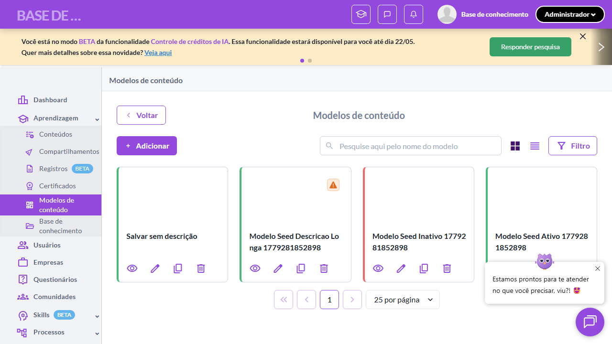

- 🎬 [Vídeo da execução (video.webm)](artifacts/projects-modelos-tests-fea-ed4ce-isualização-padrão-em-Cards-chromium/video.webm)

- 📦 **Trace** — [`trace.zip`](artifacts/projects-modelos-tests-fea-ed4ce-isualização-padrão-em-Cards-chromium/trace.zip)

  ```bash
  npx playwright show-trace outputs/modelos/reports/regression_20260521-180745/artifacts/projects-modelos-tests-fea-ed4ce-isualização-padrão-em-Cards-chromium/trace.zip
  ```

- 🎥 **Vídeo** — [`video.webm`](artifacts/projects-modelos-tests-fea-ed4ce-isualização-padrão-em-Cards-chromium/video.webm)


---

### ✅ Aprovado · TC3 · Alternância entre visualização Cards e Lista · 🔴 Crítico

<a id="alternancia-entre-visualizacao-cards-e-lista"></a>_Arquivo:_ `tc03-alternancia-visualizacao-cards-lista.spec.ts` · _Duração:_ 13.53s · _Browser:_ chromium

**Sumário (objetivo do caso):** Validar alternância de visualização entre Cards e Lista, conforme RN 2.

**Pré-condições:**

```
Ambiente Stage configurado
Feature flag `modelos_de_conteudo` ativa na organização do teste
Pelo menos 2 modelos cadastrados (1 ativo, 1 inativo) para validar visualizações
Usuário logado como Admin
```

**Passos do caso (XML/TestLink + execução Playwright):**

_Cada linha reproduz um passo do XML; a coluna **Status** traz o resultado da execução (do step Allure correspondente). Linhas com "Pré-condição" são da execução automatizada (login, navegação inicial) — não fazem parte do roteiro do XML._

| # | Ação do passo | Resultado esperado | Status | Notas | Duração |
|---|---|---|:---:|---|---:|
| 1 | Acessar a URL "/o/{orgId}/content_models" | Listagem é exibida em formato Cards. | ✅ | — | 10.02s |
| 2 | Clicar no botão de alternância para visualização "Lista" | Listagem alterna para formato Lista exibindo colunas: "Nome", "Descrição", "Provedor", "Designs", "Aplicação", "Situação", "Atualizado em". | ✅ | — | 1.32s |
| 3 | Clicar no botão de alternância para visualização "Cards" | Listagem retorna para formato Cards. | ✅ | — | 1.02s |

**Evidências:**

📁 _Pasta:_ [`artifacts/projects-modelos-tests-fea-36c4f--visualização-Cards-e-Lista-chromium/`](artifacts/projects-modelos-tests-fea-36c4f--visualização-Cards-e-Lista-chromium/)

- 📸 **Screenshot (screenshot)** — [`test-finished-1.png`](artifacts/projects-modelos-tests-fea-36c4f--visualização-Cards-e-Lista-chromium/test-finished-1.png)

  

- 🎬 [Vídeo da execução (video.webm)](artifacts/projects-modelos-tests-fea-36c4f--visualização-Cards-e-Lista-chromium/video.webm)

- 📦 **Trace** — [`trace.zip`](artifacts/projects-modelos-tests-fea-36c4f--visualização-Cards-e-Lista-chromium/trace.zip)

  ```bash
  npx playwright show-trace outputs/modelos/reports/regression_20260521-180745/artifacts/projects-modelos-tests-fea-36c4f--visualização-Cards-e-Lista-chromium/trace.zip
  ```

- 🎥 **Vídeo** — [`video.webm`](artifacts/projects-modelos-tests-fea-36c4f--visualização-Cards-e-Lista-chromium/video.webm)


---

### ✅ Aprovado · TC4 · Coluna Descrição truncada com tooltip completo (visão Lista) · 🟡 Normal

<a id="coluna-descricao-truncada-com-tooltip-completo-visao-lista"></a>_Arquivo:_ `tc04-descricao-truncada-tooltip.spec.ts` · _Duração:_ 14.12s · _Browser:_ chromium

**Sumário (objetivo do caso):** Validar que a Descrição na visão Lista é truncada em 50 caracteres com tooltip exibindo o texto completo (RN 4.1.2).

**Pré-condições:**

```
Ambiente Stage configurado
Feature flag `modelos_de_conteudo` ativa na organização do teste
Pelo menos 2 modelos cadastrados (1 ativo, 1 inativo) para validar visualizações
Usuário logado como Admin
```

**Passos do caso (XML/TestLink + execução Playwright):**

_Cada linha reproduz um passo do XML; a coluna **Status** traz o resultado da execução (do step Allure correspondente). Linhas com "Pré-condição" são da execução automatizada (login, navegação inicial) — não fazem parte do roteiro do XML._

| # | Ação do passo | Resultado esperado | Status | Notas | Duração |
|---|---|---|:---:|---|---:|
| — | _Pré-condição:_ 3. Hover na célula e validar tooltip com texto completo | — | ✅ | — | 0.17s |
| 1 | Acessar a listagem em formato Lista para um modelo com Descrição maior que 50 caracteres | Coluna "Descrição" exibe os primeiros 50 caracteres da descrição seguidos de reticências. | ✅ | — | 12.67s |
| 2 | Posicionar o mouse sobre a Descrição truncada | Tooltip exibido com o texto completo da Descrição. | ✅ | — | 0.04s |

**Evidências:**

📁 _Pasta:_ [`artifacts/projects-modelos-tests-fea-9f639-oltip-completo-visão-Lista--chromium/`](artifacts/projects-modelos-tests-fea-9f639-oltip-completo-visão-Lista--chromium/)

- 📸 **Screenshot (screenshot)** — [`test-finished-1.png`](artifacts/projects-modelos-tests-fea-9f639-oltip-completo-visão-Lista--chromium/test-finished-1.png)

  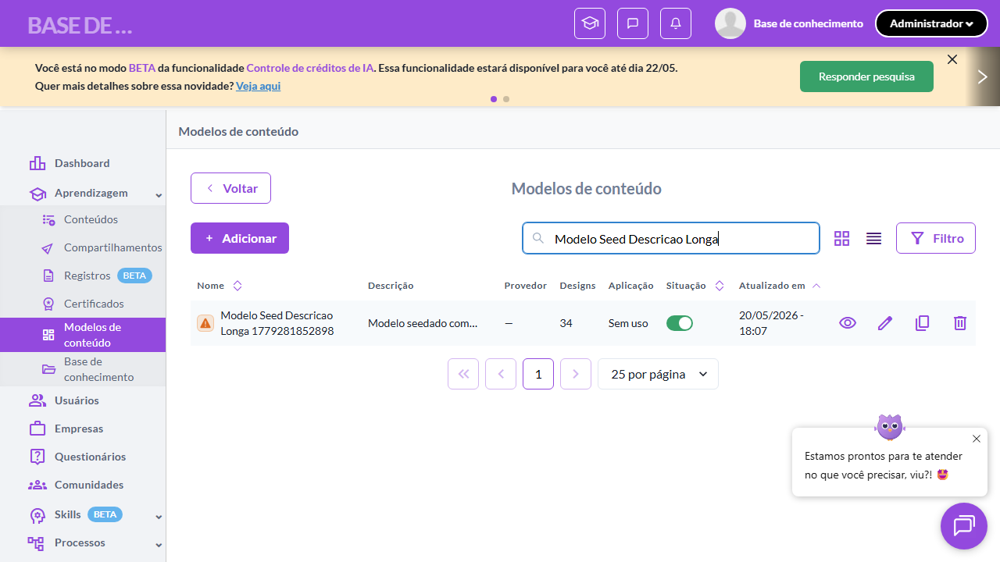

- 🎬 [Vídeo da execução (video.webm)](artifacts/projects-modelos-tests-fea-9f639-oltip-completo-visão-Lista--chromium/video.webm)

- 📦 **Trace** — [`trace.zip`](artifacts/projects-modelos-tests-fea-9f639-oltip-completo-visão-Lista--chromium/trace.zip)

  ```bash
  npx playwright show-trace outputs/modelos/reports/regression_20260521-180745/artifacts/projects-modelos-tests-fea-9f639-oltip-completo-visão-Lista--chromium/trace.zip
  ```

- 🎥 **Vídeo** — [`video.webm`](artifacts/projects-modelos-tests-fea-9f639-oltip-completo-visão-Lista--chromium/video.webm)


---

### ✅ Aprovado · TC5 · Botão Adicionar redireciona para criação · 🔴 Crítico

<a id="botao-adicionar-redireciona-para-criacao"></a>_Arquivo:_ `tc05-botao-adicionar-redireciona-criacao.spec.ts` · _Duração:_ 17.55s · _Browser:_ chromium

**Sumário (objetivo do caso):** Validar que o botão "Adicionar" inicia o fluxo de criação de modelo, conforme RN 2 e RN 7.

**Pré-condições:**

```
Ambiente Stage configurado
Feature flag `modelos_de_conteudo` ativa na organização do teste
Pelo menos 2 modelos cadastrados (1 ativo, 1 inativo) para validar visualizações
Usuário logado como Admin
```

**Passos do caso (XML/TestLink + execução Playwright):**

_Cada linha reproduz um passo do XML; a coluna **Status** traz o resultado da execução (do step Allure correspondente). Linhas com "Pré-condição" são da execução automatizada (login, navegação inicial) — não fazem parte do roteiro do XML._

| # | Ação do passo | Resultado esperado | Status | Notas | Duração |
|---|---|---|:---:|---|---:|
| — | _Pré-condição:_ 3. Validar aba Identificação ativa por default no form | — | ✅ | — | 3.82s |
| 1 | Acessar a listagem de modelos | Listagem é exibida. | ✅ | — | 10.16s |
| 2 | Clicar no botão "+ Adicionar" | Sistema redireciona para a tela de criação exibindo a aba "Identificação" como primeira aba. | ✅ | — | 1.88s |

**Evidências:**

📁 _Pasta:_ [`artifacts/projects-modelos-tests-fea-81907-ar-redireciona-para-criação-chromium/`](artifacts/projects-modelos-tests-fea-81907-ar-redireciona-para-criação-chromium/)

- 📸 **Screenshot (screenshot)** — [`test-finished-1.png`](artifacts/projects-modelos-tests-fea-81907-ar-redireciona-para-criação-chromium/test-finished-1.png)

  

- 🎬 [Vídeo da execução (video.webm)](artifacts/projects-modelos-tests-fea-81907-ar-redireciona-para-criação-chromium/video.webm)

- 📦 **Trace** — [`trace.zip`](artifacts/projects-modelos-tests-fea-81907-ar-redireciona-para-criação-chromium/trace.zip)

  ```bash
  npx playwright show-trace outputs/modelos/reports/regression_20260521-180745/artifacts/projects-modelos-tests-fea-81907-ar-redireciona-para-criação-chromium/trace.zip
  ```

- 🎥 **Vídeo** — [`video.webm`](artifacts/projects-modelos-tests-fea-81907-ar-redireciona-para-criação-chromium/video.webm)


---

### ✅ Aprovado · TC6 · Indicador de cor lateral reflete status ativo/inativo no card · 🟡 Normal

<a id="indicador-de-cor-lateral-reflete-status-ativo-inativo-no-card"></a>_Arquivo:_ `tc06-indicador-cor-status-card.spec.ts` · _Duração:_ 14.70s · _Browser:_ chromium

**Sumário (objetivo do caso):** Validar que o indicador de cor lateral dos cards reflete o status ativo/inativo do modelo (RN 5).

**Pré-condições:**

```
Ambiente Stage configurado
Feature flag `modelos_de_conteudo` ativa na organização do teste
Pelo menos 2 modelos cadastrados (1 ativo, 1 inativo) para validar visualizações
Usuário logado como Admin
```

**Passos do caso (XML/TestLink + execução Playwright):**

_Cada linha reproduz um passo do XML; a coluna **Status** traz o resultado da execução (do step Allure correspondente). Linhas com "Pré-condição" são da execução automatizada (login, navegação inicial) — não fazem parte do roteiro do XML._

| # | Ação do passo | Resultado esperado | Status | Notas | Duração |
|---|---|---|:---:|---|---:|
| 1 | Acessar a listagem em formato Cards com modelos ativos e inativos | Listagem exibe cards com indicadores de cor lateral distintos para modelos ativos e inativos. | ✅ | — | 10.42s |
| 2 | Aguardar o card de um modelo ativo ser exibido | Card exibe indicador de cor lateral indicando estado "Ativo". | ✅ | — | 1.08s |
| 3 | Aguardar o card de um modelo inativo ser exibido | Card exibe indicador de cor lateral indicando estado "Inativo". | ✅ | — | 1.88s |

**Evidências:**

📁 _Pasta:_ [`artifacts/projects-modelos-tests-fea-83c1a-tatus-ativo-inativo-no-card-chromium/`](artifacts/projects-modelos-tests-fea-83c1a-tatus-ativo-inativo-no-card-chromium/)

- 📸 **Screenshot (screenshot)** — [`test-finished-1.png`](artifacts/projects-modelos-tests-fea-83c1a-tatus-ativo-inativo-no-card-chromium/test-finished-1.png)

  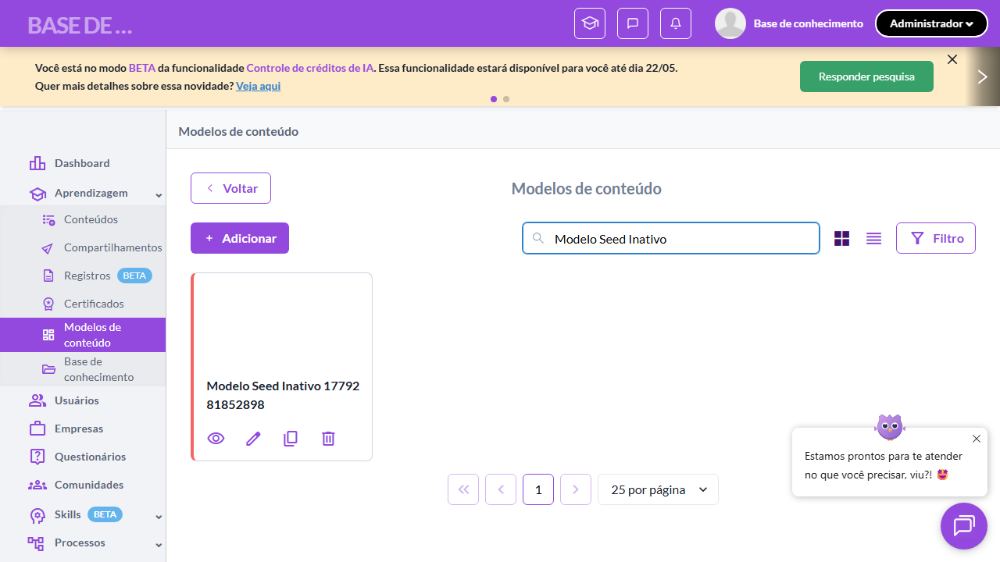

- 🎬 [Vídeo da execução (video.webm)](artifacts/projects-modelos-tests-fea-83c1a-tatus-ativo-inativo-no-card-chromium/video.webm)

- 📦 **Trace** — [`trace.zip`](artifacts/projects-modelos-tests-fea-83c1a-tatus-ativo-inativo-no-card-chromium/trace.zip)

  ```bash
  npx playwright show-trace outputs/modelos/reports/regression_20260521-180745/artifacts/projects-modelos-tests-fea-83c1a-tatus-ativo-inativo-no-card-chromium/trace.zip
  ```

- 🎥 **Vídeo** — [`video.webm`](artifacts/projects-modelos-tests-fea-83c1a-tatus-ativo-inativo-no-card-chromium/video.webm)


---

## Filtros e Busca - Modelos

_4 caso(s) — 3 aprovado(s), 1 falha(s)_

### ✅ Aprovado · TC1 · Buscar modelo por nome · 🔴 Crítico

<a id="buscar-modelo-por-nome"></a>_Arquivo:_ `tc01-buscar-modelo-por-nome.spec.ts` · _Duração:_ 10.55s · _Browser:_ chromium

**Sumário (objetivo do caso):** Validar busca textual por nome do modelo na listagem.

**Pré-condições:**

```
Ambiente Stage configurado
Feature flag `modelos_de_conteudo` ativa
Pelo menos 4 modelos cadastrados (ativos, inativos, próprios e de terceiros) para validar filtros
Usuário logado como Admin
```

**Passos do caso (XML/TestLink + execução Playwright):**

_Cada linha reproduz um passo do XML; a coluna **Status** traz o resultado da execução (do step Allure correspondente). Linhas com "Pré-condição" são da execução automatizada (login, navegação inicial) — não fazem parte do roteiro do XML._

| # | Ação do passo | Resultado esperado | Status | Notas | Duração |
|---|---|---|:---:|---|---:|
| 1 | Acessar a URL "/o/{orgId}/content_models" | Listagem é exibida com múltiplos modelos. | ✅ | — | 7.78s |
| 2 | Preencher o campo "Buscar" com "Modelo TC1" | Listagem filtra exibindo apenas modelos cujo nome contém "Modelo TC1". | ✅ | — | 0.89s |
| 3 | Limpar o campo "Buscar" | Listagem volta a exibir todos os modelos cadastrados. | ✅ | — | 0.88s |

**Evidências:**

📁 _Pasta:_ [`artifacts/projects-modelos-tests-fea-58924-elos-Buscar-modelo-por-nome-chromium/`](artifacts/projects-modelos-tests-fea-58924-elos-Buscar-modelo-por-nome-chromium/)

- 📸 **Screenshot (screenshot)** — [`test-finished-1.png`](artifacts/projects-modelos-tests-fea-58924-elos-Buscar-modelo-por-nome-chromium/test-finished-1.png)

  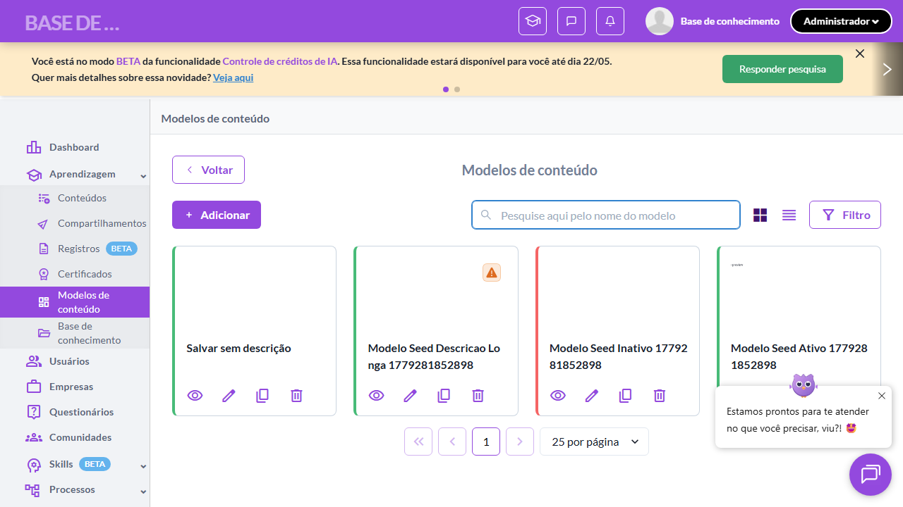

- 🎬 [Vídeo da execução (video.webm)](artifacts/projects-modelos-tests-fea-58924-elos-Buscar-modelo-por-nome-chromium/video.webm)

- 📦 **Trace** — [`trace.zip`](artifacts/projects-modelos-tests-fea-58924-elos-Buscar-modelo-por-nome-chromium/trace.zip)

  ```bash
  npx playwright show-trace outputs/modelos/reports/regression_20260521-180745/artifacts/projects-modelos-tests-fea-58924-elos-Buscar-modelo-por-nome-chromium/trace.zip
  ```

- 🎥 **Vídeo** — [`video.webm`](artifacts/projects-modelos-tests-fea-58924-elos-Buscar-modelo-por-nome-chromium/video.webm)


---

### ❌ Falhou · TC2 · Filtrar modelos por Situação via drawer · 🔴 Crítico

<a id="filtrar-modelos-por-situacao-via-drawer"></a>_Arquivo:_ `tc02-filtrar-por-situacao-via-drawer.spec.ts` · _Duração:_ 10.07s · _Browser:_ chromium

> **❌ Por que falhou:** Error: esperava ao menos 1 cards, encontrei 0
> _Step impactado:_ **3. Validar drawer fechou e #clear-filter ficou visível**

**Sumário (objetivo do caso):** Validar filtragem por Situação (Ativo/Inativo) via drawer de filtros, conforme RN 60.

**Pré-condições:**

```
Ambiente Stage configurado
Feature flag `modelos_de_conteudo` ativa
Pelo menos 4 modelos cadastrados (ativos, inativos, próprios e de terceiros) para validar filtros
Usuário logado como Admin
```

**Passos do caso (XML/TestLink + execução Playwright):**

_Cada linha reproduz um passo do XML; a coluna **Status** traz o resultado da execução (do step Allure correspondente). Linhas com "Pré-condição" são da execução automatizada (login, navegação inicial) — não fazem parte do roteiro do XML._

| # | Ação do passo | Resultado esperado | Status | Notas | Duração |
|---|---|---|:---:|---|---:|
| 1 | Clicar no botão "Filtrar" | Drawer "Filtros" é exibido à direita. | ✅ | — | 7.92s |
| 2 | Selecionar a opção "Ativo" no filtro "Situação" | Filtro "Situação" exibe a opção "Ativo" selecionada. | ✅ | — | 1.05s |
| 3 | Aplicar o filtro | Drawer fecha. Listagem exibe apenas modelos com Situação "Ativo". | ❌ | Error: esperava ao menos 1 cards, encontrei 0 | 0.04s |

**Evidências:**

📁 _Pasta:_ [`artifacts/projects-modelos-tests-fea-40575-los-por-Situação-via-drawer-chromium/`](artifacts/projects-modelos-tests-fea-40575-los-por-Situação-via-drawer-chromium/)

- 📸 **Screenshot (screenshot)** — [`test-failed-1.png`](artifacts/projects-modelos-tests-fea-40575-los-por-Situação-via-drawer-chromium/test-failed-1.png)

  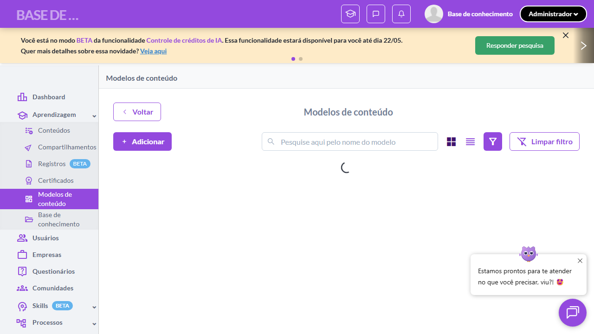

- 🎬 [Vídeo da execução (video.webm)](artifacts/projects-modelos-tests-fea-40575-los-por-Situação-via-drawer-chromium/video.webm)

- 📦 **Trace** — [`trace.zip`](artifacts/projects-modelos-tests-fea-40575-los-por-Situação-via-drawer-chromium/trace.zip)

  ```bash
  npx playwright show-trace outputs/modelos/reports/regression_20260521-180745/artifacts/projects-modelos-tests-fea-40575-los-por-Situação-via-drawer-chromium/trace.zip
  ```

- 🎥 **Vídeo** — [`video.webm`](artifacts/projects-modelos-tests-fea-40575-los-por-Situação-via-drawer-chromium/video.webm)

- 📄 **DOM no momento da falha** — [`error-context.md`](artifacts/projects-modelos-tests-fea-40575-los-por-Situação-via-drawer-chromium/error-context.md)

#### 🐛 Pronto para registro de bug

**Descrição do BUG:** [Crítico] Filtrar modelos por Situação via drawer — Error: esperava ao menos 1 cards, encontrei 0

**Passo a passo para reprodução:**
1. Pré: Ambiente Stage configurado
1. Pré: Feature flag `modelos_de_conteudo` ativa
1. Pré: Pelo menos 4 modelos cadastrados (ativos, inativos, próprios e de terceiros) para validar filtros
1. Pré: Usuário logado como Admin
1. 1. Clicar no botão "Filtrar"
1. 2. Selecionar a opção "Ativo" no filtro "Situação"
1. 3. Aplicar o filtro

**Comportamento esperado:** Drawer fecha. Listagem exibe apenas modelos com Situação "Ativo".

**Comportamento atual:** Error: esperava ao menos 1 cards, encontrei 0

**Informações:**

| Campo | Valor |
|---|---|
| URL | `https://basedeconhecimento.stage.twygoead.com/` |
| Login | ${TWYGO_STAGING_BASE_DE_CONHECIMENTO_EMAIL} |
| Senha | ${TWYGO_STAGING_BASE_DE_CONHECIMENTO_PASSWORD} |
| orgId | 37007 |
| Outros | Browser: chromium |
| Outros | runId: regression_20260521-180745 |
| Outros | Duração até a falha: 10.07s |
| Outros | Step impactado: 3. 3. Validar drawer fechou e #clear-filter ficou visível |

**Evidências:**

- Screenshot capturado pelo Playwright (screenshot): artifacts/projects-modelos-tests-fea-40575-los-por-Situação-via-drawer-chromium/test-failed-1.png
- Vídeo da execução (video.webm): artifacts/projects-modelos-tests-fea-40575-los-por-Situação-via-drawer-chromium/video.webm
- Snapshot do DOM/contexto da página (error-context.md): artifacts/projects-modelos-tests-fea-40575-los-por-Situação-via-drawer-chromium/error-context.md
- Trace completo do Playwright (.zip) — `npx playwright show-trace`: artifacts/projects-modelos-tests-fea-40575-los-por-Situação-via-drawer-chromium/trace.zip

<details><summary>📋 Ver texto agregado para copiar (Jira/GitHub/Linear)</summary>

```
Descrição do BUG
[Crítico] Filtrar modelos por Situação via drawer — Error: esperava ao menos 1 cards, encontrei 0

Passo a passo para reprodução
  Pré: Ambiente Stage configurado
  Pré: Feature flag `modelos_de_conteudo` ativa
  Pré: Pelo menos 4 modelos cadastrados (ativos, inativos, próprios e de terceiros) para validar filtros
  Pré: Usuário logado como Admin
  1. Clicar no botão "Filtrar"
  2. Selecionar a opção "Ativo" no filtro "Situação"
  3. Aplicar o filtro

Comportamento esperado
Drawer fecha. Listagem exibe apenas modelos com Situação "Ativo".

Comportamento atual
Error: esperava ao menos 1 cards, encontrei 0

Informações
- URL: https://basedeconhecimento.stage.twygoead.com/
- Login: ${TWYGO_STAGING_BASE_DE_CONHECIMENTO_EMAIL}
- Senha: ${TWYGO_STAGING_BASE_DE_CONHECIMENTO_PASSWORD}
- ID do ambiente (orgId): 37007
- Outros:
  - Browser: chromium
  - runId: regression_20260521-180745
  - Duração até a falha: 10.07s
  - Step impactado: 3. 3. Validar drawer fechou e #clear-filter ficou visível

Evidências
- Screenshot capturado pelo Playwright (screenshot): artifacts/projects-modelos-tests-fea-40575-los-por-Situação-via-drawer-chromium/test-failed-1.png
- Vídeo da execução (video.webm): artifacts/projects-modelos-tests-fea-40575-los-por-Situação-via-drawer-chromium/video.webm
- Snapshot do DOM/contexto da página (error-context.md): artifacts/projects-modelos-tests-fea-40575-los-por-Situação-via-drawer-chromium/error-context.md
- Trace completo do Playwright (.zip) — `npx playwright show-trace`: artifacts/projects-modelos-tests-fea-40575-los-por-Situação-via-drawer-chromium/trace.zip

Execução
- runId: regression_20260521-180745
- environment.json: staging-base-de-conhecimento
- testsuite: Filtros e Busca - Modelos
- testcase: Filtrar modelos por Situação via drawer

```

</details>

<details><summary>🔧 Stack trace técnica completa (para desenvolvedor)</summary>

```
Error: esperava ao menos 1 cards, encontrei 0

expect(received).toBeGreaterThanOrEqual(expected)

Expected: >= 1
Received:    0
```

</details>

---

### ✅ Aprovado · Aplicar filtro padrão Modelos próprios 

<a id="aplicar-filtro-padrao-modelos-proprios"></a>_Arquivo:_ `tc03-aplicar-filtro-padrao-modelos-proprios.spec.ts` · _Duração:_ 10.47s · _Browser:_ chromium

**Passos do caso (XML/TestLink + execução Playwright):**

_Cada linha reproduz um passo do XML; a coluna **Status** traz o resultado da execução (do step Allure correspondente). Linhas com "Pré-condição" são da execução automatizada (login, navegação inicial) — não fazem parte do roteiro do XML._

| # | Ação do passo | Resultado esperado | Status | Notas | Duração |
|---|---|---|:---:|---|---:|
| — | _Pré-condição:_ 1. Acessar listagem e abrir drawer com 4 filtros padrão visíveis | — | ✅ | — | 8.24s |
| — | _Pré-condição:_ 2. Aplicar filtro padrão "Modelos próprios" | — | ✅ | — | 0.54s |
| — | _Pré-condição:_ 3. Validar filtro aplicado (drawer fechou, #clear-filter visível) | — | ✅ | — | 0.13s |
| — | _Pré-condição:_ cleanup: limpar filtro | — | ✅ | — | 0.45s |

**Evidências:**

📁 _Pasta:_ [`artifacts/projects-modelos-tests-fea-5260f-tro-padrão-Modelos-próprios-chromium/`](artifacts/projects-modelos-tests-fea-5260f-tro-padrão-Modelos-próprios-chromium/)

- 📸 **Screenshot (screenshot)** — [`test-finished-1.png`](artifacts/projects-modelos-tests-fea-5260f-tro-padrão-Modelos-próprios-chromium/test-finished-1.png)

  

- 🎬 [Vídeo da execução (video.webm)](artifacts/projects-modelos-tests-fea-5260f-tro-padrão-Modelos-próprios-chromium/video.webm)

- 📦 **Trace** — [`trace.zip`](artifacts/projects-modelos-tests-fea-5260f-tro-padrão-Modelos-próprios-chromium/trace.zip)

  ```bash
  npx playwright show-trace outputs/modelos/reports/regression_20260521-180745/artifacts/projects-modelos-tests-fea-5260f-tro-padrão-Modelos-próprios-chromium/trace.zip
  ```

- 🎥 **Vídeo** — [`video.webm`](artifacts/projects-modelos-tests-fea-5260f-tro-padrão-Modelos-próprios-chromium/video.webm)


---

### ✅ Aprovado · TC4 · Limpar filtros aplicados · 🟡 Normal

<a id="limpar-filtros-aplicados"></a>_Arquivo:_ `tc04-limpar-filtros-aplicados.spec.ts` · _Duração:_ 10.11s · _Browser:_ chromium

**Sumário (objetivo do caso):** Validar limpeza dos filtros aplicados.

**Pré-condições:**

```
Ambiente Stage configurado
Feature flag `modelos_de_conteudo` ativa
Pelo menos 4 modelos cadastrados (ativos, inativos, próprios e de terceiros) para validar filtros
Usuário logado como Admin
```

**Passos do caso (XML/TestLink + execução Playwright):**

_Cada linha reproduz um passo do XML; a coluna **Status** traz o resultado da execução (do step Allure correspondente). Linhas com "Pré-condição" são da execução automatizada (login, navegação inicial) — não fazem parte do roteiro do XML._

| # | Ação do passo | Resultado esperado | Status | Notas | Duração |
|---|---|---|:---:|---|---:|
| 1 | Aplicar o filtro padrão "Modelos ativos" | Listagem é filtrada exibindo apenas modelos ativos. | ✅ | — | 8.79s |
| 2 | Clicar no botão "Limpar filtros" | Listagem volta a exibir todos os modelos cadastrados sem filtros aplicados. | ✅ | — | 0.24s |

**Evidências:**

📁 _Pasta:_ [`artifacts/projects-modelos-tests-fea-7b8fa-os-Limpar-filtros-aplicados-chromium/`](artifacts/projects-modelos-tests-fea-7b8fa-os-Limpar-filtros-aplicados-chromium/)

- 📸 **Screenshot (screenshot)** — [`test-finished-1.png`](artifacts/projects-modelos-tests-fea-7b8fa-os-Limpar-filtros-aplicados-chromium/test-finished-1.png)

  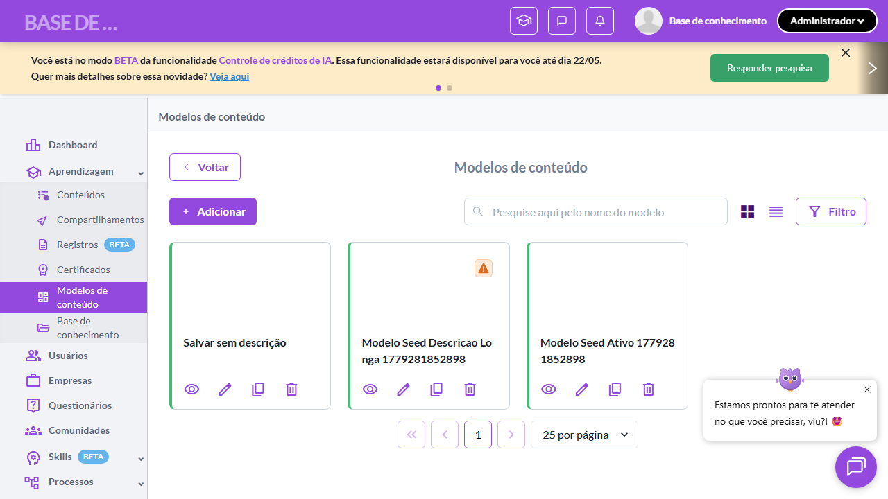

- 🎬 [Vídeo da execução (video.webm)](artifacts/projects-modelos-tests-fea-7b8fa-os-Limpar-filtros-aplicados-chromium/video.webm)

- 📦 **Trace** — [`trace.zip`](artifacts/projects-modelos-tests-fea-7b8fa-os-Limpar-filtros-aplicados-chromium/trace.zip)

  ```bash
  npx playwright show-trace outputs/modelos/reports/regression_20260521-180745/artifacts/projects-modelos-tests-fea-7b8fa-os-Limpar-filtros-aplicados-chromium/trace.zip
  ```

- 🎥 **Vídeo** — [`video.webm`](artifacts/projects-modelos-tests-fea-7b8fa-os-Limpar-filtros-aplicados-chromium/video.webm)


---

## Criação de Modelo - Aba Identificação

_8 caso(s) — 7 aprovado(s), 0 falha(s), 1 ignorado(s)_

### ✅ Aprovado · TC1 · Criar modelo com dados válidos · 🔴 Crítico

<a id="criar-modelo-com-dados-validos"></a>_Arquivo:_ `tc01-criar-modelo-com-dados-validos.spec.ts` · _Duração:_ 14.71s · _Browser:_ chromium

**Sumário (objetivo do caso):** Validar criação de modelo (happy path) preenchendo todos os campos da aba Identificação (RN 7, RN 8).

**Pré-condições:**

```
Ambiente Stage configurado
Feature flag `modelos_de_conteudo` ativa
Pelo menos 1 kit de marca cadastrado na organização
Usuário logado como Admin
```

**Passos do caso (XML/TestLink + execução Playwright):**

_Cada linha reproduz um passo do XML; a coluna **Status** traz o resultado da execução (do step Allure correspondente). Linhas com "Pré-condição" são da execução automatizada (login, navegação inicial) — não fazem parte do roteiro do XML._

| # | Ação do passo | Resultado esperado | Status | Notas | Duração |
|---|---|---|:---:|---|---:|
| — | _Pré-condição:_ 2-5. Preencher Nome + Descrição + Kit de marca | — | ✅ | — | 0.88s |
| 1 | Acessar a URL "/o/{orgId}/content_models" | Listagem é exibida. | ✅ | — | 7.63s |
| 2 | Clicar no botão "+ Adicionar" | Sistema redireciona para a tela de criação exibindo a aba "Identificação". | ✅ | — | — |
| 3 | Preencher o campo "Nome" com "Modelo TC1 w{workerIndex}-{timestamp}" | Campo "Nome" exibe o texto digitado. | ✅ | — | — |
| 4 | Preencher o campo "Descrição" com "Modelo de teste automatizado" | Campo "Descrição" exibe o texto digitado. | ✅ | — | — |
| 5 | Selecionar "Kit padrão da organização" no dropdown "Kit de marca" | Dropdown "Kit de marca" exibe a opção selecionada. | ✅ | — | — |
| 6 | Clicar no botão "Salvar" | Toast exibida: "Modelo de conteúdo criado com sucesso.". Sistema permanece na tela de edição ou redireciona para listagem. | ✅ | — | 5.20s |

**Evidências:**

📁 _Pasta:_ [`artifacts/projects-modelos-tests-fea-bd73d-ar-modelo-com-dados-válidos-chromium/`](artifacts/projects-modelos-tests-fea-bd73d-ar-modelo-com-dados-válidos-chromium/)

- 📸 **Screenshot (screenshot)** — [`test-finished-1.png`](artifacts/projects-modelos-tests-fea-bd73d-ar-modelo-com-dados-válidos-chromium/test-finished-1.png)

  

- 📸 **Screenshot (screenshot)** — [`test-finished-2.png`](artifacts/projects-modelos-tests-fea-bd73d-ar-modelo-com-dados-válidos-chromium/test-finished-2.png)

  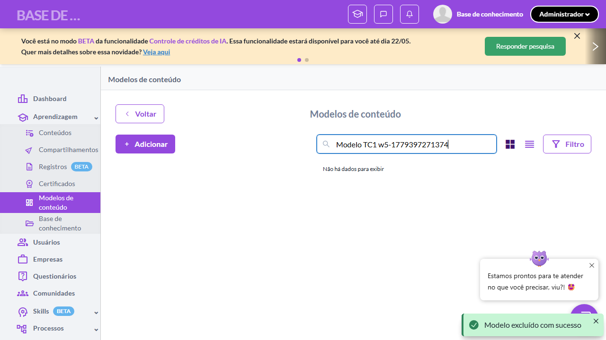

- 🎬 [Vídeo da execução (video.webm)](artifacts/projects-modelos-tests-fea-bd73d-ar-modelo-com-dados-válidos-chromium/video.webm)

- 📦 **Trace** — [`trace.zip`](artifacts/projects-modelos-tests-fea-bd73d-ar-modelo-com-dados-válidos-chromium/trace.zip)

  ```bash
  npx playwright show-trace outputs/modelos/reports/regression_20260521-180745/artifacts/projects-modelos-tests-fea-bd73d-ar-modelo-com-dados-válidos-chromium/trace.zip
  ```

- 🎥 **Vídeo** — [`video.webm`](artifacts/projects-modelos-tests-fea-bd73d-ar-modelo-com-dados-válidos-chromium/video.webm)


---

### ✅ Aprovado · TC2 · Badge "Dica" aparece somente na criação · 🔴 Crítico

<a id="badge-dica-aparece-somente-na-criacao"></a>_Arquivo:_ `tc02-badge-dica-aparece-na-criacao.spec.ts` · _Duração:_ 8.26s · _Browser:_ chromium

**Sumário (objetivo do caso):** Validar que a badge "Dica: Para um resultado mais rápido..." aparece apenas na criação de novo modelo (RN 9).

**Pré-condições:**

```
Ambiente Stage configurado
Feature flag `modelos_de_conteudo` ativa
Pelo menos 1 kit de marca cadastrado na organização
Usuário logado como Admin
```

**Passos do caso (XML/TestLink + execução Playwright):**

_Cada linha reproduz um passo do XML; a coluna **Status** traz o resultado da execução (do step Allure correspondente). Linhas com "Pré-condição" são da execução automatizada (login, navegação inicial) — não fazem parte do roteiro do XML._

| # | Ação do passo | Resultado esperado | Status | Notas | Duração |
|---|---|---|:---:|---|---:|
| 1 | Acessar a tela de criação de modelo | Aba "Identificação" é exibida. | ✅ | — | 7.31s |
| 2 | Aguardar a badge "Dica" ser renderizada | Badge exibida com o texto: "Dica: Para um resultado mais rápido, recomendamos duplicar um modelo existente e editar a cópia ao invés de criar um do zero.". | ✅ | — | 0.14s |

**Evidências:**

📁 _Pasta:_ [`artifacts/projects-modelos-tests-fea-29bba--aparece-somente-na-criação-chromium/`](artifacts/projects-modelos-tests-fea-29bba--aparece-somente-na-criação-chromium/)

- 📸 **Screenshot (screenshot)** — [`test-finished-1.png`](artifacts/projects-modelos-tests-fea-29bba--aparece-somente-na-criação-chromium/test-finished-1.png)

  

- 🎬 [Vídeo da execução (video.webm)](artifacts/projects-modelos-tests-fea-29bba--aparece-somente-na-criação-chromium/video.webm)

- 📦 **Trace** — [`trace.zip`](artifacts/projects-modelos-tests-fea-29bba--aparece-somente-na-criação-chromium/trace.zip)

  ```bash
  npx playwright show-trace outputs/modelos/reports/regression_20260521-180745/artifacts/projects-modelos-tests-fea-29bba--aparece-somente-na-criação-chromium/trace.zip
  ```

- 🎥 **Vídeo** — [`video.webm`](artifacts/projects-modelos-tests-fea-29bba--aparece-somente-na-criação-chromium/video.webm)


---

### ✅ Aprovado · TC3 · Badge "Dica" NÃO aparece na edição · 🔴 Crítico

<a id="badge-dica-nao-aparece-na-edicao"></a>_Arquivo:_ `tc03-badge-dica-nao-aparece-na-edicao.spec.ts` · _Duração:_ 14.25s · _Browser:_ chromium

**Sumário (objetivo do caso):** Validar que a badge "Dica" NÃO é exibida em modo edição (RN 9).

**Pré-condições:**

```
Ambiente Stage configurado
Feature flag `modelos_de_conteudo` ativa
Pelo menos 1 kit de marca cadastrado na organização
Usuário logado como Admin
```

**Passos do caso (XML/TestLink + execução Playwright):**

_Cada linha reproduz um passo do XML; a coluna **Status** traz o resultado da execução (do step Allure correspondente). Linhas com "Pré-condição" são da execução automatizada (login, navegação inicial) — não fazem parte do roteiro do XML._

| # | Ação do passo | Resultado esperado | Status | Notas | Duração |
|---|---|---|:---:|---|---:|
| 1 | Acessar a listagem com pelo menos 1 modelo cadastrado | Listagem é exibida. | ✅ | — | 7.75s |
| 2 | Clicar na ação "Editar" do modelo alvo | Sistema redireciona para a tela de edição exibindo a aba "Identificação". | ✅ | — | 4.07s |
| 3 | Aguardar a tela de edição carregar completamente | Badge "Dica" NÃO é exibida na tela de edição. | ✅ | — | 1.58s |

**Evidências:**

📁 _Pasta:_ [`artifacts/projects-modelos-tests-fea-218f9--Dica-NÃO-aparece-na-edição-chromium/`](artifacts/projects-modelos-tests-fea-218f9--Dica-NÃO-aparece-na-edição-chromium/)

- 📸 **Screenshot (screenshot)** — [`test-finished-1.png`](artifacts/projects-modelos-tests-fea-218f9--Dica-NÃO-aparece-na-edição-chromium/test-finished-1.png)

  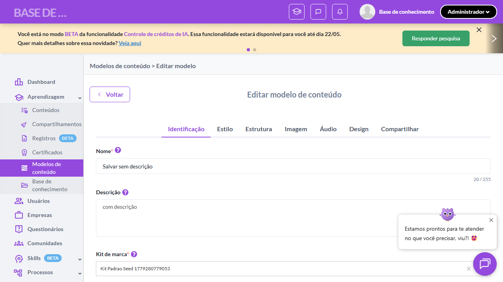

- 🎬 [Vídeo da execução (video.webm)](artifacts/projects-modelos-tests-fea-218f9--Dica-NÃO-aparece-na-edição-chromium/video.webm)

- 📦 **Trace** — [`trace.zip`](artifacts/projects-modelos-tests-fea-218f9--Dica-NÃO-aparece-na-edição-chromium/trace.zip)

  ```bash
  npx playwright show-trace outputs/modelos/reports/regression_20260521-180745/artifacts/projects-modelos-tests-fea-218f9--Dica-NÃO-aparece-na-edição-chromium/trace.zip
  ```

- 🎥 **Vídeo** — [`video.webm`](artifacts/projects-modelos-tests-fea-218f9--Dica-NÃO-aparece-na-edição-chromium/video.webm)


---

### ✅ Aprovado · TC4 · Validar campo Nome obrigatório · 🔴 Crítico

<a id="validar-campo-nome-obrigatorio"></a>_Arquivo:_ `tc04-validar-nome-obrigatorio.spec.ts` · _Duração:_ 10.85s · _Browser:_ chromium

**Sumário (objetivo do caso):** Validar que o campo "Nome" é obrigatório (RN 8).

**Pré-condições:**

```
Ambiente Stage configurado
Feature flag `modelos_de_conteudo` ativa
Pelo menos 1 kit de marca cadastrado na organização
Usuário logado como Admin
```

**Passos do caso (XML/TestLink + execução Playwright):**

_Cada linha reproduz um passo do XML; a coluna **Status** traz o resultado da execução (do step Allure correspondente). Linhas com "Pré-condição" são da execução automatizada (login, navegação inicial) — não fazem parte do roteiro do XML._

| # | Ação do passo | Resultado esperado | Status | Notas | Duração |
|---|---|---|:---:|---|---:|
| 1 | Acessar a tela de criação de modelo | Aba "Identificação" é exibida. | ✅ | — | 7.73s |
| 2 | Preencher o campo "Descrição" com "Teste sem nome" | Campo "Descrição" exibe o texto digitado. | ✅ | — | 0.06s |
| 3 | Clicar no botão "Salvar" | Mensagem de validação exibida: "Nome é obrigatório". Modelo NÃO é criado. | ✅ | — | 2.28s |

**Evidências:**

📁 _Pasta:_ [`artifacts/projects-modelos-tests-fea-1e774-idar-campo-Nome-obrigatório-chromium/`](artifacts/projects-modelos-tests-fea-1e774-idar-campo-Nome-obrigatório-chromium/)

- 📸 **Screenshot (screenshot)** — [`test-finished-1.png`](artifacts/projects-modelos-tests-fea-1e774-idar-campo-Nome-obrigatório-chromium/test-finished-1.png)

  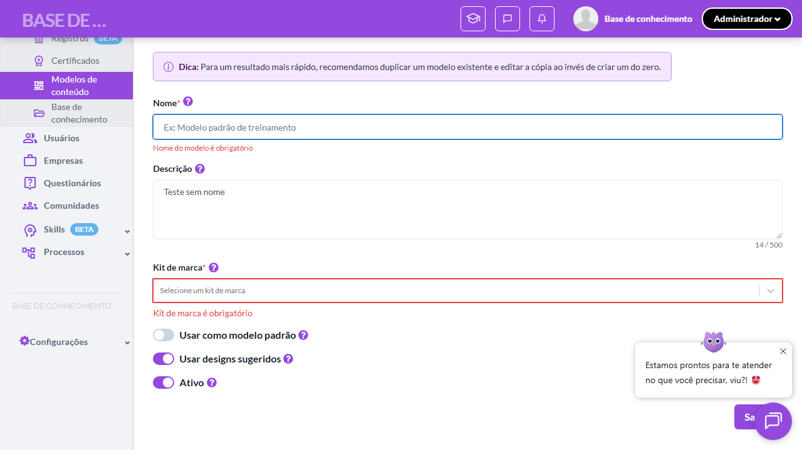

- 🎬 [Vídeo da execução (video.webm)](artifacts/projects-modelos-tests-fea-1e774-idar-campo-Nome-obrigatório-chromium/video.webm)

- 📦 **Trace** — [`trace.zip`](artifacts/projects-modelos-tests-fea-1e774-idar-campo-Nome-obrigatório-chromium/trace.zip)

  ```bash
  npx playwright show-trace outputs/modelos/reports/regression_20260521-180745/artifacts/projects-modelos-tests-fea-1e774-idar-campo-Nome-obrigatório-chromium/trace.zip
  ```

- 🎥 **Vídeo** — [`video.webm`](artifacts/projects-modelos-tests-fea-1e774-idar-campo-Nome-obrigatório-chromium/video.webm)


---

### ✅ Aprovado · TC5 · Validar limite de 500 caracteres da Descrição · 🟡 Normal

<a id="validar-limite-de-500-caracteres-da-descricao"></a>_Arquivo:_ `tc05-limite-500-chars-descricao.spec.ts` · _Duração:_ 8.52s · _Browser:_ chromium

**Sumário (objetivo do caso):** Validar limite máximo de 500 caracteres no campo "Descrição".

**Pré-condições:**

```
Ambiente Stage configurado
Feature flag `modelos_de_conteudo` ativa
Pelo menos 1 kit de marca cadastrado na organização
Usuário logado como Admin
```

**Passos do caso (XML/TestLink + execução Playwright):**

_Cada linha reproduz um passo do XML; a coluna **Status** traz o resultado da execução (do step Allure correspondente). Linhas com "Pré-condição" são da execução automatizada (login, navegação inicial) — não fazem parte do roteiro do XML._

| # | Ação do passo | Resultado esperado | Status | Notas | Duração |
|---|---|---|:---:|---|---:|
| — | _Pré-condição:_ 3. Validar truncamento OU mensagem de limite | — | ✅ | — | 0.03s |
| 1 | Acessar a tela de criação de modelo | Aba "Identificação" é exibida. | ✅ | — | 7.54s |
| 2 | Preencher o campo "Descrição" com uma string de 501 caracteres | Campo "Descrição" trunca o input em 500 caracteres OU exibe mensagem de limite atingido. | ✅ | — | 0.13s |

**Evidências:**

📁 _Pasta:_ [`artifacts/projects-modelos-tests-fea-77046-500-caracteres-da-Descrição-chromium/`](artifacts/projects-modelos-tests-fea-77046-500-caracteres-da-Descrição-chromium/)

- 📸 **Screenshot (screenshot)** — [`test-finished-1.png`](artifacts/projects-modelos-tests-fea-77046-500-caracteres-da-Descrição-chromium/test-finished-1.png)

  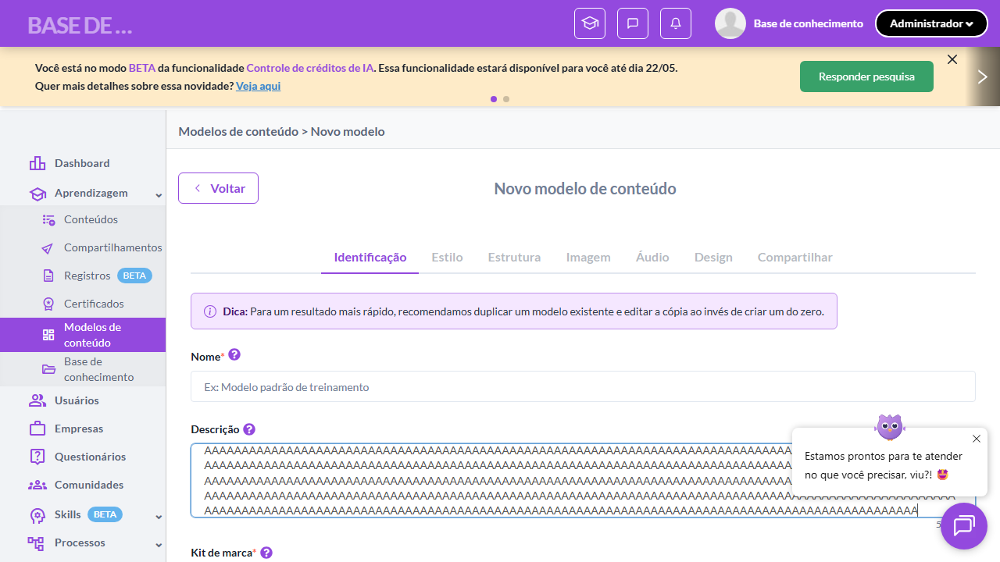

- 🎬 [Vídeo da execução (video.webm)](artifacts/projects-modelos-tests-fea-77046-500-caracteres-da-Descrição-chromium/video.webm)

- 📦 **Trace** — [`trace.zip`](artifacts/projects-modelos-tests-fea-77046-500-caracteres-da-Descrição-chromium/trace.zip)

  ```bash
  npx playwright show-trace outputs/modelos/reports/regression_20260521-180745/artifacts/projects-modelos-tests-fea-77046-500-caracteres-da-Descrição-chromium/trace.zip
  ```

- 🎥 **Vídeo** — [`video.webm`](artifacts/projects-modelos-tests-fea-77046-500-caracteres-da-Descrição-chromium/video.webm)


---

### ✅ Aprovado · TC6 · Switch "Usar designs sugeridos" exibido somente na criação · 🔴 Crítico

<a id="switch-usar-designs-sugeridos-exibido-somente-na-criacao"></a>_Arquivo:_ `tc06-switch-usar-designs-somente-criacao.spec.ts` · _Duração:_ 8.08s · _Browser:_ chromium

**Sumário (objetivo do caso):** Validar que o switch "Usar designs sugeridos" só aparece na criação (RN 8).

**Pré-condições:**

```
Ambiente Stage configurado
Feature flag `modelos_de_conteudo` ativa
Pelo menos 1 kit de marca cadastrado na organização
Usuário logado como Admin
```

**Passos do caso (XML/TestLink + execução Playwright):**

_Cada linha reproduz um passo do XML; a coluna **Status** traz o resultado da execução (do step Allure correspondente). Linhas com "Pré-condição" são da execução automatizada (login, navegação inicial) — não fazem parte do roteiro do XML._

| # | Ação do passo | Resultado esperado | Status | Notas | Duração |
|---|---|---|:---:|---|---:|
| 1 | Acessar a tela de criação de modelo | Aba "Identificação" é exibida com o switch "Usar designs sugeridos" visível, marcado como ativo por padrão. | ✅ | — | 7.29s |
| 2 | Aguardar a tooltip do switch ser exibida ao posicionar o mouse | Tooltip exibida: "Quando ativo, a IA utilizará designs pré-definidos como sugestão ao gerar o conteúdo do curso". | ✅ | — | — |

**Evidências:**

📁 _Pasta:_ [`artifacts/projects-modelos-tests-fea-383a1--exibido-somente-na-criação-chromium/`](artifacts/projects-modelos-tests-fea-383a1--exibido-somente-na-criação-chromium/)

- 📸 **Screenshot (screenshot)** — [`test-finished-1.png`](artifacts/projects-modelos-tests-fea-383a1--exibido-somente-na-criação-chromium/test-finished-1.png)

  

- 🎬 [Vídeo da execução (video.webm)](artifacts/projects-modelos-tests-fea-383a1--exibido-somente-na-criação-chromium/video.webm)

- 📦 **Trace** — [`trace.zip`](artifacts/projects-modelos-tests-fea-383a1--exibido-somente-na-criação-chromium/trace.zip)

  ```bash
  npx playwright show-trace outputs/modelos/reports/regression_20260521-180745/artifacts/projects-modelos-tests-fea-383a1--exibido-somente-na-criação-chromium/trace.zip
  ```

- 🎥 **Vídeo** — [`video.webm`](artifacts/projects-modelos-tests-fea-383a1--exibido-somente-na-criação-chromium/video.webm)


---

### ✅ Aprovado · TC7 · Defaults dos switches na criação · 🔴 Crítico

<a id="defaults-dos-switches-na-criacao"></a>_Arquivo:_ `tc07-defaults-switches-criacao.spec.ts` · _Duração:_ 8.25s · _Browser:_ chromium

**Sumário (objetivo do caso):** Validar valores default dos switches: "Usar como modelo padrão" = false, "Usar designs sugeridos" = true, "Ativo" = true (RN 8).

**Pré-condições:**

```
Ambiente Stage configurado
Feature flag `modelos_de_conteudo` ativa
Pelo menos 1 kit de marca cadastrado na organização
Usuário logado como Admin
```

**Passos do caso (XML/TestLink + execução Playwright):**

_Cada linha reproduz um passo do XML; a coluna **Status** traz o resultado da execução (do step Allure correspondente). Linhas com "Pré-condição" são da execução automatizada (login, navegação inicial) — não fazem parte do roteiro do XML._

| # | Ação do passo | Resultado esperado | Status | Notas | Duração |
|---|---|---|:---:|---|---:|
| 1 | Acessar a tela de criação de modelo | Aba "Identificação" é exibida. | ✅ | — | 7.33s |
| 2 | Aguardar os switches serem renderizados | Switch "Usar como modelo padrão" exibido desativado, switch "Usar designs sugeridos" exibido ativado, switch "Ativo" exibido ativado. | ✅ | — | 0.12s |

**Evidências:**

📁 _Pasta:_ [`artifacts/projects-modelos-tests-fea-9e86f-lts-dos-switches-na-criação-chromium/`](artifacts/projects-modelos-tests-fea-9e86f-lts-dos-switches-na-criação-chromium/)

- 📸 **Screenshot (screenshot)** — [`test-finished-1.png`](artifacts/projects-modelos-tests-fea-9e86f-lts-dos-switches-na-criação-chromium/test-finished-1.png)

  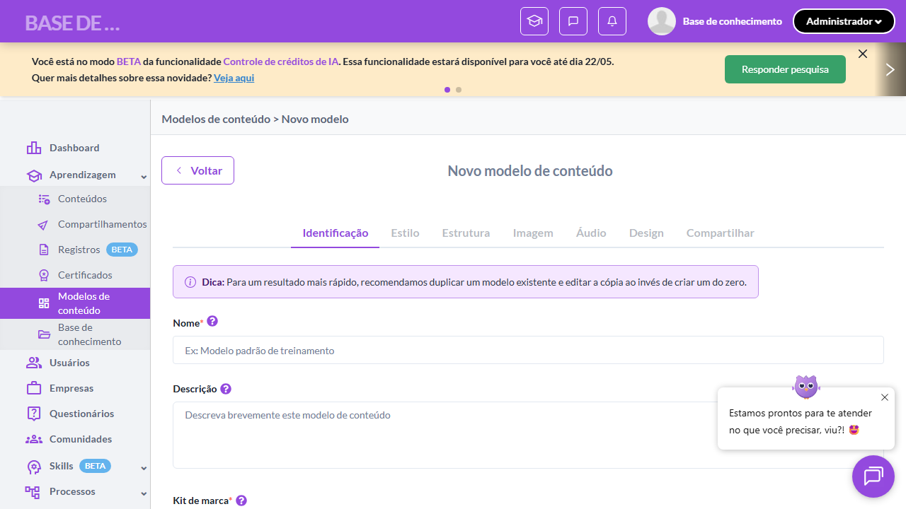

- 🎬 [Vídeo da execução (video.webm)](artifacts/projects-modelos-tests-fea-9e86f-lts-dos-switches-na-criação-chromium/video.webm)

- 📦 **Trace** — [`trace.zip`](artifacts/projects-modelos-tests-fea-9e86f-lts-dos-switches-na-criação-chromium/trace.zip)

  ```bash
  npx playwright show-trace outputs/modelos/reports/regression_20260521-180745/artifacts/projects-modelos-tests-fea-9e86f-lts-dos-switches-na-criação-chromium/trace.zip
  ```

- 🎥 **Vídeo** — [`video.webm`](artifacts/projects-modelos-tests-fea-9e86f-lts-dos-switches-na-criação-chromium/video.webm)


---

### ⊘ Ignorado · TC8 · Cancelar criação com alterações pendentes · 🟡 Normal

<a id="cancelar-criacao-com-alteracoes-pendentes"></a>_Arquivo:_ `tc08-cancelar-criacao-com-alteracoes.spec.ts` · _Duração:_ 0.00s · _Browser:_ chromium

> **⊘ Por que foi ignorado:** Caso ignorado pelo Playwright sem justificativa registrada (test.skip/fixme sem mensagem).

**Sumário (objetivo do caso):** Validar diálogo nativo de saída com alterações não salvas.

**Pré-condições:**

```
Ambiente Stage configurado
Feature flag `modelos_de_conteudo` ativa
Pelo menos 1 kit de marca cadastrado na organização
Usuário logado como Admin
```

**Passos do caso (XML/TestLink + execução Playwright):**

_Cada linha reproduz um passo do XML; a coluna **Status** traz o resultado da execução (do step Allure correspondente). Linhas com "Pré-condição" são da execução automatizada (login, navegação inicial) — não fazem parte do roteiro do XML._

| # | Ação do passo | Resultado esperado | Status | Notas | Duração |
|---|---|---|:---:|---|---:|
| 1 | Acessar a tela de criação de modelo | Aba "Identificação" é exibida. | ⊘ | Step não executado — Caso ignorado pelo Playwright sem justificativa registrada (test.skip/fixme sem mensagem). | — |
| 2 | Preencher o campo "Nome" com "Teste cancelamento" | Campo "Nome" exibe o texto digitado e o estado do form fica "sujo". | ⊘ | Step não executado — Caso ignorado pelo Playwright sem justificativa registrada (test.skip/fixme sem mensagem). | — |
| 3 | Clicar no botão "Cancelar" | Diálogo nativo do browser é exibido perguntando se o usuário deseja sair sem salvar. | ⊘ | Step não executado — Caso ignorado pelo Playwright sem justificativa registrada (test.skip/fixme sem mensagem). | — |
| 4 | Confirmar manter na página no diálogo | Usuário permanece na tela de criação com os dados preenchidos. | ⊘ | Step não executado — Caso ignorado pelo Playwright sem justificativa registrada (test.skip/fixme sem mensagem). | — |

**Evidências:**

_Sem evidências anexadas._

#### ⏳ Pendente — execução automatizada não realizada

- **Severidade do caso (XML):** Normal
- **Motivo do skip / fixme:** Sem motivo registrado.

**Roteiro do XML (para validação manual):**
1. Pré: Ambiente Stage configurado
1. Pré: Feature flag `modelos_de_conteudo` ativa
1. Pré: Pelo menos 1 kit de marca cadastrado na organização
1. Pré: Usuário logado como Admin
1. 1. Acessar a tela de criação de modelo
1. 2. Preencher o campo "Nome" com "Teste cancelamento"
1. 3. Clicar no botão "Cancelar"
1. 4. Confirmar manter na página no diálogo

> Esse caso não bloqueia a build, mas precisa de validação manual ou ajuste no agente.


---

## Criação de Modelo - Aba Estilo do Conteúdo

_2 caso(s) — 0 aprovado(s), 2 falha(s)_

### ❌ Falhou · TC1 · Botão "Adicionar mais dados" exibe menu com 6 opções · 🔴 Crítico

<a id="botao-adicionar-mais-dados-exibe-menu-com-6-opcoes"></a>_Arquivo:_ `tc01-adicionar-mais-dados-menu-6-opcoes.spec.ts` · _Duração:_ 45.09s · _Browser:_ chromium

> **❌ Por que falhou:** Não foi possível clicar o elemento — ele não ficou disponível em 30s (locator: locator('[data-test-id="content-models-style-add-more-data-button"]')).
> _Step impactado:_ **2. Clicar "Adicionar mais dados" e validar 6 opções no menu**

**Sumário (objetivo do caso):** Validar que o botão exibe menu com as 6 opções de estilo (RN 12, RN 13).

**Pré-condições:**

```
Ambiente Stage configurado
Feature flag `modelos_de_conteudo` ativa
Modelo de teste cadastrado no setup do spec (via beforeAll)
Usuário logado como Admin
```

**Passos do caso (XML/TestLink + execução Playwright):**

_Cada linha reproduz um passo do XML; a coluna **Status** traz o resultado da execução (do step Allure correspondente). Linhas com "Pré-condição" são da execução automatizada (login, navegação inicial) — não fazem parte do roteiro do XML._

| # | Ação do passo | Resultado esperado | Status | Notas | Duração |
|---|---|---|:---:|---|---:|
| 1 | Acessar a aba "Estilo do conteúdo" do modelo de teste | Aba "Estilo do conteúdo" fica selecionada. | ✅ | — | 13.49s |
| 2 | Clicar no botão "Adicionar mais dados" | Menu suspenso é exibido contendo as opções: "Idade", "Dificuldade", "Tom de voz", "Perfil do público", "Idioma", "Informações adicionais". | ❌ | Não foi possível clicar o elemento — ele não ficou disponível em 30s (locator: locator('[data-test-id="content-models-style-add-more-data-button"]')). | 30.05s |

**Evidências:**

📁 _Pasta:_ [`artifacts/projects-modelos-tests-fea-eff58-dos-exibe-menu-com-6-opções-chromium/`](artifacts/projects-modelos-tests-fea-eff58-dos-exibe-menu-com-6-opções-chromium/)

- 📸 **Screenshot (screenshot)** — [`test-failed-1.png`](artifacts/projects-modelos-tests-fea-eff58-dos-exibe-menu-com-6-opções-chromium/test-failed-1.png)

  

- 🎬 [Vídeo da execução (video.webm)](artifacts/projects-modelos-tests-fea-eff58-dos-exibe-menu-com-6-opções-chromium/video.webm)

- 📦 **Trace** — [`trace.zip`](artifacts/projects-modelos-tests-fea-eff58-dos-exibe-menu-com-6-opções-chromium/trace.zip)

  ```bash
  npx playwright show-trace outputs/modelos/reports/regression_20260521-180745/artifacts/projects-modelos-tests-fea-eff58-dos-exibe-menu-com-6-opções-chromium/trace.zip
  ```

- 🎥 **Vídeo** — [`video.webm`](artifacts/projects-modelos-tests-fea-eff58-dos-exibe-menu-com-6-opções-chromium/video.webm)

- 📄 **DOM no momento da falha** — [`error-context.md`](artifacts/projects-modelos-tests-fea-eff58-dos-exibe-menu-com-6-opções-chromium/error-context.md)

#### 🐛 Pronto para registro de bug

**Descrição do BUG:** [Crítico] Botão "Adicionar mais dados" exibe menu com 6 opções — Não foi possível clicar o elemento — ele não ficou disponível em 30s (locator: locator('[data-test-id="content-models-style-add-more-data-button"]')).

**Passo a passo para reprodução:**
1. Pré: Ambiente Stage configurado
1. Pré: Feature flag `modelos_de_conteudo` ativa
1. Pré: Modelo de teste cadastrado no setup do spec (via beforeAll)
1. Pré: Usuário logado como Admin
1. 1. Acessar a aba "Estilo do conteúdo" do modelo de teste
1. 2. Clicar no botão "Adicionar mais dados"

**Comportamento esperado:** Menu suspenso é exibido contendo as opções: "Idade", "Dificuldade", "Tom de voz", "Perfil do público", "Idioma", "Informações adicionais".

**Comportamento atual:** Não foi possível clicar o elemento — ele não ficou disponível em 30s (locator: locator('[data-test-id="content-models-style-add-more-data-button"]')).

**Informações:**

| Campo | Valor |
|---|---|
| URL | `https://basedeconhecimento.stage.twygoead.com/` |
| Login | ${TWYGO_STAGING_BASE_DE_CONHECIMENTO_EMAIL} |
| Senha | ${TWYGO_STAGING_BASE_DE_CONHECIMENTO_PASSWORD} |
| orgId | 37007 |
| Outros | Browser: chromium |
| Outros | runId: regression_20260521-180745 |
| Outros | Duração até a falha: 45.09s |
| Outros | Step impactado: 2. 2. Clicar "Adicionar mais dados" e validar 6 opções no menu |

**Evidências:**

- Screenshot capturado pelo Playwright (screenshot): artifacts/projects-modelos-tests-fea-eff58-dos-exibe-menu-com-6-opções-chromium/test-failed-1.png
- Vídeo da execução (video.webm): artifacts/projects-modelos-tests-fea-eff58-dos-exibe-menu-com-6-opções-chromium/video.webm
- Snapshot do DOM/contexto da página (error-context.md): artifacts/projects-modelos-tests-fea-eff58-dos-exibe-menu-com-6-opções-chromium/error-context.md
- Trace completo do Playwright (.zip) — `npx playwright show-trace`: artifacts/projects-modelos-tests-fea-eff58-dos-exibe-menu-com-6-opções-chromium/trace.zip

<details><summary>📋 Ver texto agregado para copiar (Jira/GitHub/Linear)</summary>

```
Descrição do BUG
[Crítico] Botão "Adicionar mais dados" exibe menu com 6 opções — Não foi possível clicar o elemento — ele não ficou disponível em 30s (locator: locator('[data-test-id="content-models-style-add-more-data-button"]')).

Passo a passo para reprodução
  Pré: Ambiente Stage configurado
  Pré: Feature flag `modelos_de_conteudo` ativa
  Pré: Modelo de teste cadastrado no setup do spec (via beforeAll)
  Pré: Usuário logado como Admin
  1. Acessar a aba "Estilo do conteúdo" do modelo de teste
  2. Clicar no botão "Adicionar mais dados"

Comportamento esperado
Menu suspenso é exibido contendo as opções: "Idade", "Dificuldade", "Tom de voz", "Perfil do público", "Idioma", "Informações adicionais".

Comportamento atual
Não foi possível clicar o elemento — ele não ficou disponível em 30s (locator: locator('[data-test-id="content-models-style-add-more-data-button"]')).

Informações
- URL: https://basedeconhecimento.stage.twygoead.com/
- Login: ${TWYGO_STAGING_BASE_DE_CONHECIMENTO_EMAIL}
- Senha: ${TWYGO_STAGING_BASE_DE_CONHECIMENTO_PASSWORD}
- ID do ambiente (orgId): 37007
- Outros:
  - Browser: chromium
  - runId: regression_20260521-180745
  - Duração até a falha: 45.09s
  - Step impactado: 2. 2. Clicar "Adicionar mais dados" e validar 6 opções no menu

Evidências
- Screenshot capturado pelo Playwright (screenshot): artifacts/projects-modelos-tests-fea-eff58-dos-exibe-menu-com-6-opções-chromium/test-failed-1.png
- Vídeo da execução (video.webm): artifacts/projects-modelos-tests-fea-eff58-dos-exibe-menu-com-6-opções-chromium/video.webm
- Snapshot do DOM/contexto da página (error-context.md): artifacts/projects-modelos-tests-fea-eff58-dos-exibe-menu-com-6-opções-chromium/error-context.md
- Trace completo do Playwright (.zip) — `npx playwright show-trace`: artifacts/projects-modelos-tests-fea-eff58-dos-exibe-menu-com-6-opções-chromium/trace.zip

Execução
- runId: regression_20260521-180745
- environment.json: staging-base-de-conhecimento
- testsuite: Criação de Modelo - Aba Estilo do Conteúdo
- testcase: Botão "Adicionar mais dados" exibe menu com 6 opções

```

</details>

<details><summary>🔧 Stack trace técnica completa (para desenvolvedor)</summary>

```
TimeoutError: locator.click: Timeout 30000ms exceeded.
Call log:
  - waiting for locator('[data-test-id="content-models-style-add-more-data-button"]')
    - locator resolved to <button disabled type="button" aria-haspopup="menu" aria-expanded="false" id="menu-button-:r1j:" aria-controls="menu-list-:r1j:" data-test-id="content-models-style-add-more-data-button" class="chakra-button chakra-menu__menu-button css-7vf75e">…</button>
  - attempting click action
    2 × waiting for element to be visible, enabled and stable
      - element is not enabled
    - retrying click action
    - waiting 20ms
    2 × waiting for element to be visible, enabled and stable
      - element is not enabled
    - retrying click action
      - waiting 100ms
    57 × waiting for element to be visible, enabled and stable
       - element is not enabled
     - retrying click action
       - waiting 500ms

```

</details>

---

### ❌ Falhou · TC2 · Adicionar campo Idade via menu · 🔴 Crítico

<a id="adicionar-campo-idade-via-menu"></a>_Arquivo:_ `tc02-adicionar-campo-idade.spec.ts` · _Duração:_ 45.05s · _Browser:_ chromium

> **❌ Por que falhou:** Não foi possível clicar o elemento — ele não ficou disponível em 30s (locator: locator('[data-test-id="content-models-style-add-more-data-button"]')).
> _Step impactado:_ **2. Abrir menu "Adicionar mais dados"**

**Sumário (objetivo do caso):** Validar adição de campo via menu (RN 13, RN 13.1).

**Pré-condições:**

```
Ambiente Stage configurado
Feature flag `modelos_de_conteudo` ativa
Modelo de teste cadastrado no setup do spec (via beforeAll)
Usuário logado como Admin
```

**Passos do caso (XML/TestLink + execução Playwright):**

_Cada linha reproduz um passo do XML; a coluna **Status** traz o resultado da execução (do step Allure correspondente). Linhas com "Pré-condição" são da execução automatizada (login, navegação inicial) — não fazem parte do roteiro do XML._

| # | Ação do passo | Resultado esperado | Status | Notas | Duração |
|---|---|---|:---:|---|---:|
| 1 | Acessar a aba "Estilo do conteúdo" do modelo de teste | Aba "Estilo do conteúdo" é exibida. | ✅ | — | 13.33s |
| 2 | Clicar no botão "Adicionar mais dados" | Menu suspenso é exibido. | ❌ | Não foi possível clicar o elemento — ele não ficou disponível em 30s (locator: locator('[data-test-id="content-models-style-add-more-data-button"]')). | 30.04s |
| 3 | Clicar na opção "Idade" no menu | Menu fecha e novo campo "Idade" é inserido na seção de estilo, seguindo o mesmo padrão do Estúdio de Criação. | ⊘ | Step não executado: o teste foi interrompido antes. Causa: Não foi possível clicar o elemento — ele não ficou disponível em 30s (locator: locator('[data-test-id="content-models-style-add-more-data-button"]')).. | — |

**Evidências:**

📁 _Pasta:_ [`artifacts/projects-modelos-tests-fea-d9836-cionar-campo-Idade-via-menu-chromium/`](artifacts/projects-modelos-tests-fea-d9836-cionar-campo-Idade-via-menu-chromium/)

- 📸 **Screenshot (screenshot)** — [`test-failed-1.png`](artifacts/projects-modelos-tests-fea-d9836-cionar-campo-Idade-via-menu-chromium/test-failed-1.png)

  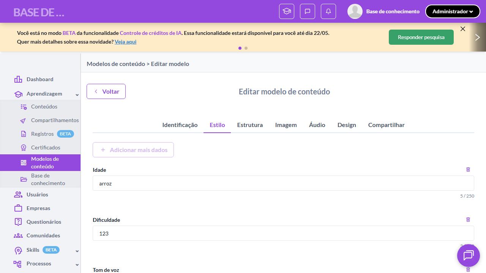

- 🎬 [Vídeo da execução (video.webm)](artifacts/projects-modelos-tests-fea-d9836-cionar-campo-Idade-via-menu-chromium/video.webm)

- 📦 **Trace** — [`trace.zip`](artifacts/projects-modelos-tests-fea-d9836-cionar-campo-Idade-via-menu-chromium/trace.zip)

  ```bash
  npx playwright show-trace outputs/modelos/reports/regression_20260521-180745/artifacts/projects-modelos-tests-fea-d9836-cionar-campo-Idade-via-menu-chromium/trace.zip
  ```

- 🎥 **Vídeo** — [`video.webm`](artifacts/projects-modelos-tests-fea-d9836-cionar-campo-Idade-via-menu-chromium/video.webm)

- 📄 **DOM no momento da falha** — [`error-context.md`](artifacts/projects-modelos-tests-fea-d9836-cionar-campo-Idade-via-menu-chromium/error-context.md)

#### 🐛 Pronto para registro de bug

**Descrição do BUG:** [Crítico] Adicionar campo Idade via menu — Não foi possível clicar o elemento — ele não ficou disponível em 30s (locator: locator('[data-test-id="content-models-style-add-more-data-button"]')).

**Passo a passo para reprodução:**
1. Pré: Ambiente Stage configurado
1. Pré: Feature flag `modelos_de_conteudo` ativa
1. Pré: Modelo de teste cadastrado no setup do spec (via beforeAll)
1. Pré: Usuário logado como Admin
1. 1. Acessar a aba "Estilo do conteúdo" do modelo de teste
1. 2. Clicar no botão "Adicionar mais dados"
1. 3. Clicar na opção "Idade" no menu

**Comportamento esperado:** Menu suspenso é exibido.

**Comportamento atual:** Não foi possível clicar o elemento — ele não ficou disponível em 30s (locator: locator('[data-test-id="content-models-style-add-more-data-button"]')).

**Informações:**

| Campo | Valor |
|---|---|
| URL | `https://basedeconhecimento.stage.twygoead.com/` |
| Login | ${TWYGO_STAGING_BASE_DE_CONHECIMENTO_EMAIL} |
| Senha | ${TWYGO_STAGING_BASE_DE_CONHECIMENTO_PASSWORD} |
| orgId | 37007 |
| Outros | Browser: chromium |
| Outros | runId: regression_20260521-180745 |
| Outros | Duração até a falha: 45.05s |
| Outros | Step impactado: 2. 2. Abrir menu "Adicionar mais dados" |

**Evidências:**

- Screenshot capturado pelo Playwright (screenshot): artifacts/projects-modelos-tests-fea-d9836-cionar-campo-Idade-via-menu-chromium/test-failed-1.png
- Vídeo da execução (video.webm): artifacts/projects-modelos-tests-fea-d9836-cionar-campo-Idade-via-menu-chromium/video.webm
- Snapshot do DOM/contexto da página (error-context.md): artifacts/projects-modelos-tests-fea-d9836-cionar-campo-Idade-via-menu-chromium/error-context.md
- Trace completo do Playwright (.zip) — `npx playwright show-trace`: artifacts/projects-modelos-tests-fea-d9836-cionar-campo-Idade-via-menu-chromium/trace.zip

<details><summary>📋 Ver texto agregado para copiar (Jira/GitHub/Linear)</summary>

```
Descrição do BUG
[Crítico] Adicionar campo Idade via menu — Não foi possível clicar o elemento — ele não ficou disponível em 30s (locator: locator('[data-test-id="content-models-style-add-more-data-button"]')).

Passo a passo para reprodução
  Pré: Ambiente Stage configurado
  Pré: Feature flag `modelos_de_conteudo` ativa
  Pré: Modelo de teste cadastrado no setup do spec (via beforeAll)
  Pré: Usuário logado como Admin
  1. Acessar a aba "Estilo do conteúdo" do modelo de teste
  2. Clicar no botão "Adicionar mais dados"
  3. Clicar na opção "Idade" no menu

Comportamento esperado
Menu suspenso é exibido.

Comportamento atual
Não foi possível clicar o elemento — ele não ficou disponível em 30s (locator: locator('[data-test-id="content-models-style-add-more-data-button"]')).

Informações
- URL: https://basedeconhecimento.stage.twygoead.com/
- Login: ${TWYGO_STAGING_BASE_DE_CONHECIMENTO_EMAIL}
- Senha: ${TWYGO_STAGING_BASE_DE_CONHECIMENTO_PASSWORD}
- ID do ambiente (orgId): 37007
- Outros:
  - Browser: chromium
  - runId: regression_20260521-180745
  - Duração até a falha: 45.05s
  - Step impactado: 2. 2. Abrir menu "Adicionar mais dados"

Evidências
- Screenshot capturado pelo Playwright (screenshot): artifacts/projects-modelos-tests-fea-d9836-cionar-campo-Idade-via-menu-chromium/test-failed-1.png
- Vídeo da execução (video.webm): artifacts/projects-modelos-tests-fea-d9836-cionar-campo-Idade-via-menu-chromium/video.webm
- Snapshot do DOM/contexto da página (error-context.md): artifacts/projects-modelos-tests-fea-d9836-cionar-campo-Idade-via-menu-chromium/error-context.md
- Trace completo do Playwright (.zip) — `npx playwright show-trace`: artifacts/projects-modelos-tests-fea-d9836-cionar-campo-Idade-via-menu-chromium/trace.zip

Execução
- runId: regression_20260521-180745
- environment.json: staging-base-de-conhecimento
- testsuite: Criação de Modelo - Aba Estilo do Conteúdo
- testcase: Adicionar campo Idade via menu

```

</details>

<details><summary>🔧 Stack trace técnica completa (para desenvolvedor)</summary>

```
TimeoutError: locator.click: Timeout 30000ms exceeded.
Call log:
  - waiting for locator('[data-test-id="content-models-style-add-more-data-button"]')
    - locator resolved to <button disabled type="button" aria-haspopup="menu" aria-expanded="false" id="menu-button-:r1j:" aria-controls="menu-list-:r1j:" data-test-id="content-models-style-add-more-data-button" class="chakra-button chakra-menu__menu-button css-7vf75e">…</button>
  - attempting click action
    2 × waiting for element to be visible, enabled and stable
      - element is not enabled
    - retrying click action
    - waiting 20ms
    2 × waiting for element to be visible, enabled and stable
      - element is not enabled
    - retrying click action
      - waiting 100ms
    57 × waiting for element to be visible, enabled and stable
       - element is not enabled
     - retrying click action
       - waiting 500ms

```

</details>

---

## Criação de Modelo - Aba Estrutura do Conteúdo

_8 caso(s) — 6 aprovado(s), 2 falha(s)_

### ✅ Aprovado · TC1 · Tipo de estrutura exibe 2 opções · 🔴 Crítico

<a id="tipo-de-estrutura-exibe-2-opcoes"></a>_Arquivo:_ `tc01-tipo-estrutura-exibe-2-opcoes.spec.ts` · _Duração:_ 14.45s · _Browser:_ chromium

**Sumário (objetivo do caso):** Validar opções do dropdown "Tipo de estrutura" (RN 15, RN 16).

**Pré-condições:**

```
Ambiente Stage configurado
Feature flag `modelos_de_conteudo` ativa
Modelo de teste cadastrado no setup do spec (via beforeAll)
Usuário logado como Admin
```

**Passos do caso (XML/TestLink + execução Playwright):**

_Cada linha reproduz um passo do XML; a coluna **Status** traz o resultado da execução (do step Allure correspondente). Linhas com "Pré-condição" são da execução automatizada (login, navegação inicial) — não fazem parte do roteiro do XML._

| # | Ação do passo | Resultado esperado | Status | Notas | Duração |
|---|---|---|:---:|---|---:|
| 1 | Acessar a aba "Estrutura do conteúdo" do modelo de teste | Aba "Estrutura do conteúdo" fica selecionada. | ✅ | — | 13.26s |
| 2 | Clicar no dropdown "Tipo de estrutura" | Dropdown exibe as opções "Atividades sequenciais (1 nível)" e "Atividades agrupadas por módulos (2 níveis)". | ✅ | — | 0.03s |

**Evidências:**

📁 _Pasta:_ [`artifacts/projects-modelos-tests-fea-436b3-de-estrutura-exibe-2-opções-chromium/`](artifacts/projects-modelos-tests-fea-436b3-de-estrutura-exibe-2-opções-chromium/)

- 📸 **Screenshot (screenshot)** — [`test-finished-1.png`](artifacts/projects-modelos-tests-fea-436b3-de-estrutura-exibe-2-opções-chromium/test-finished-1.png)

  

- 🎬 [Vídeo da execução (video.webm)](artifacts/projects-modelos-tests-fea-436b3-de-estrutura-exibe-2-opções-chromium/video.webm)

- 📦 **Trace** — [`trace.zip`](artifacts/projects-modelos-tests-fea-436b3-de-estrutura-exibe-2-opções-chromium/trace.zip)

  ```bash
  npx playwright show-trace outputs/modelos/reports/regression_20260521-180745/artifacts/projects-modelos-tests-fea-436b3-de-estrutura-exibe-2-opções-chromium/trace.zip
  ```

- 🎥 **Vídeo** — [`video.webm`](artifacts/projects-modelos-tests-fea-436b3-de-estrutura-exibe-2-opções-chromium/video.webm)


---

### ✅ Aprovado · TC2 · Tooltip do Tipo de estrutura · 🔴 Crítico

<a id="tooltip-do-tipo-de-estrutura"></a>_Arquivo:_ `tc02-tooltip-tipo-estrutura.spec.ts` · _Duração:_ 14.78s · _Browser:_ chromium

**Sumário (objetivo do caso):** Validar texto literal da tooltip (RN 15).

**Pré-condições:**

```
Ambiente Stage configurado
Feature flag `modelos_de_conteudo` ativa
Modelo de teste cadastrado no setup do spec (via beforeAll)
Usuário logado como Admin
```

**Passos do caso (XML/TestLink + execução Playwright):**

_Cada linha reproduz um passo do XML; a coluna **Status** traz o resultado da execução (do step Allure correspondente). Linhas com "Pré-condição" são da execução automatizada (login, navegação inicial) — não fazem parte do roteiro do XML._

| # | Ação do passo | Resultado esperado | Status | Notas | Duração |
|---|---|---|:---:|---|---:|
| 1 | Acessar a aba "Estrutura do conteúdo" | Aba é exibida. | ✅ | — | 13.58s |
| 2 | Aguardar a tooltip do campo "Tipo de estrutura" ser exibida ao posicionar o mouse | Tooltip exibida: "Define se o curso possui apenas atividades sequenciais ou se elas são organizadas em módulos.". | ✅ | — | 0.22s |

**Evidências:**

📁 _Pasta:_ [`artifacts/projects-modelos-tests-fea-5ae19-ooltip-do-Tipo-de-estrutura-chromium/`](artifacts/projects-modelos-tests-fea-5ae19-ooltip-do-Tipo-de-estrutura-chromium/)

- 📸 **Screenshot (screenshot)** — [`test-finished-1.png`](artifacts/projects-modelos-tests-fea-5ae19-ooltip-do-Tipo-de-estrutura-chromium/test-finished-1.png)

  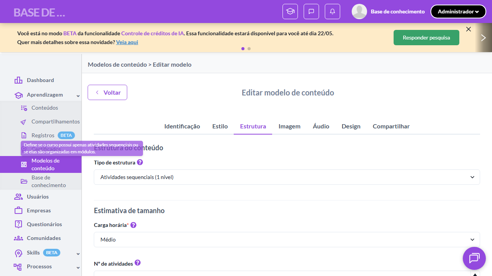

- 🎬 [Vídeo da execução (video.webm)](artifacts/projects-modelos-tests-fea-5ae19-ooltip-do-Tipo-de-estrutura-chromium/video.webm)

- 📦 **Trace** — [`trace.zip`](artifacts/projects-modelos-tests-fea-5ae19-ooltip-do-Tipo-de-estrutura-chromium/trace.zip)

  ```bash
  npx playwright show-trace outputs/modelos/reports/regression_20260521-180745/artifacts/projects-modelos-tests-fea-5ae19-ooltip-do-Tipo-de-estrutura-chromium/trace.zip
  ```

- 🎥 **Vídeo** — [`video.webm`](artifacts/projects-modelos-tests-fea-5ae19-ooltip-do-Tipo-de-estrutura-chromium/video.webm)


---

### ✅ Aprovado · TC3 · Selecionar "2 níveis" exibe campo de atividades por módulo · 🔴 Crítico

<a id="selecionar-2-niveis-exibe-campo-de-atividades-por-modulo"></a>_Arquivo:_ `tc03-2-niveis-exibe-atividades-por-modulo.spec.ts` · _Duração:_ 16.14s · _Browser:_ chromium

**Sumário (objetivo do caso):** Validar comportamento condicional ao selecionar 2 níveis (RN 16.1).

**Pré-condições:**

```
Ambiente Stage configurado
Feature flag `modelos_de_conteudo` ativa
Modelo de teste cadastrado no setup do spec (via beforeAll)
Usuário logado como Admin
```

**Passos do caso (XML/TestLink + execução Playwright):**

_Cada linha reproduz um passo do XML; a coluna **Status** traz o resultado da execução (do step Allure correspondente). Linhas com "Pré-condição" são da execução automatizada (login, navegação inicial) — não fazem parte do roteiro do XML._

| # | Ação do passo | Resultado esperado | Status | Notas | Duração |
|---|---|---|:---:|---|---:|
| — | _Pré-condição:_ cleanup: voltar para "1 nível" | — | ✅ | — | 0.58s |
| 1 | Acessar a aba "Estrutura do conteúdo" | Aba é exibida. | ✅ | — | 14.02s |
| 2 | Selecionar "Atividades agrupadas por módulos (2 níveis)" no dropdown "Tipo de estrutura" | Dropdown exibe a opção selecionada. | ✅ | — | 0.65s |
| 3 | Aguardar o campo "Número de atividades por módulo" ser exibido | Campo numérico "Número de atividades por módulo" é exibido com tooltip: "Número sugerido de atividades que a IA irá criar dentro de cada módulo do curso.". | ✅ | — | 0.02s |

**Evidências:**

📁 _Pasta:_ [`artifacts/projects-modelos-tests-fea-10eb6-po-de-atividades-por-módulo-chromium/`](artifacts/projects-modelos-tests-fea-10eb6-po-de-atividades-por-módulo-chromium/)

- 📸 **Screenshot (screenshot)** — [`test-finished-1.png`](artifacts/projects-modelos-tests-fea-10eb6-po-de-atividades-por-módulo-chromium/test-finished-1.png)

  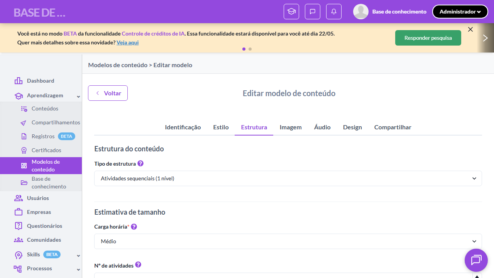

- 🎬 [Vídeo da execução (video.webm)](artifacts/projects-modelos-tests-fea-10eb6-po-de-atividades-por-módulo-chromium/video.webm)

- 📦 **Trace** — [`trace.zip`](artifacts/projects-modelos-tests-fea-10eb6-po-de-atividades-por-módulo-chromium/trace.zip)

  ```bash
  npx playwright show-trace outputs/modelos/reports/regression_20260521-180745/artifacts/projects-modelos-tests-fea-10eb6-po-de-atividades-por-módulo-chromium/trace.zip
  ```

- 🎥 **Vídeo** — [`video.webm`](artifacts/projects-modelos-tests-fea-10eb6-po-de-atividades-por-módulo-chromium/video.webm)


---

### ❌ Falhou · TC4 · Carga horária obrigatória bloqueia salvamento · 🔴 Crítico

<a id="carga-horaria-obrigatoria-bloqueia-salvamento"></a>_Arquivo:_ `tc04-carga-horaria-obrigatoria-bloqueia-save.spec.ts` · _Duração:_ 20.43s · _Browser:_ chromium

> **❌ Por que falhou:** Error: expect(locator).toHaveCount(expected) failed
> _Step impactado:_ **2. Clicar Salvar e validar bloqueio (sem redirect/sem toast sucesso)**

**Sumário (objetivo do caso):** Validar que sem "Carga horária sugerida" o salvamento é bloqueado (RN 18).

**Pré-condições:**

```
Ambiente Stage configurado
Feature flag `modelos_de_conteudo` ativa
Modelo de teste cadastrado no setup do spec (via beforeAll)
Usuário logado como Admin
```

**Passos do caso (XML/TestLink + execução Playwright):**

_Cada linha reproduz um passo do XML; a coluna **Status** traz o resultado da execução (do step Allure correspondente). Linhas com "Pré-condição" são da execução automatizada (login, navegação inicial) — não fazem parte do roteiro do XML._

| # | Ação do passo | Resultado esperado | Status | Notas | Duração |
|---|---|---|:---:|---|---:|
| 1 | Acessar a aba "Estrutura do conteúdo" do modelo de teste sem carga horária preenchida | Aba é exibida. | ✅ | — | 14.04s |
| 2 | Clicar no botão "Salvar" | Mensagem de validação exibida: "Carga horária sugerida é obrigatória". Modelo NÃO é salvo. | ❌ | Error: expect(locator).toHaveCount(expected) failed | 5.31s |

**Evidências:**

📁 _Pasta:_ [`artifacts/projects-modelos-tests-fea-26232-gatória-bloqueia-salvamento-chromium/`](artifacts/projects-modelos-tests-fea-26232-gatória-bloqueia-salvamento-chromium/)

- 📸 **Screenshot (screenshot)** — [`test-failed-1.png`](artifacts/projects-modelos-tests-fea-26232-gatória-bloqueia-salvamento-chromium/test-failed-1.png)

  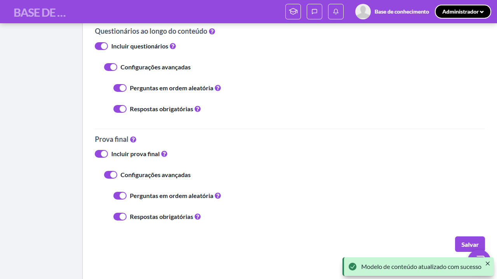

- 🎬 [Vídeo da execução (video.webm)](artifacts/projects-modelos-tests-fea-26232-gatória-bloqueia-salvamento-chromium/video.webm)

- 📦 **Trace** — [`trace.zip`](artifacts/projects-modelos-tests-fea-26232-gatória-bloqueia-salvamento-chromium/trace.zip)

  ```bash
  npx playwright show-trace outputs/modelos/reports/regression_20260521-180745/artifacts/projects-modelos-tests-fea-26232-gatória-bloqueia-salvamento-chromium/trace.zip
  ```

- 🎥 **Vídeo** — [`video.webm`](artifacts/projects-modelos-tests-fea-26232-gatória-bloqueia-salvamento-chromium/video.webm)

- 📄 **DOM no momento da falha** — [`error-context.md`](artifacts/projects-modelos-tests-fea-26232-gatória-bloqueia-salvamento-chromium/error-context.md)

#### 🐛 Pronto para registro de bug

**Descrição do BUG:** [Crítico] Carga horária obrigatória bloqueia salvamento — Error: expect(locator).toHaveCount(expected) failed

**Passo a passo para reprodução:**
1. Pré: Ambiente Stage configurado
1. Pré: Feature flag `modelos_de_conteudo` ativa
1. Pré: Modelo de teste cadastrado no setup do spec (via beforeAll)
1. Pré: Usuário logado como Admin
1. 1. Acessar a aba "Estrutura do conteúdo" do modelo de teste sem carga horária preenchida
1. 2. Clicar no botão "Salvar"

**Comportamento esperado:** Mensagem de validação exibida: "Carga horária sugerida é obrigatória". Modelo NÃO é salvo.

**Comportamento atual:** Error: expect(locator).toHaveCount(expected) failed

**Informações:**

| Campo | Valor |
|---|---|
| URL | `https://basedeconhecimento.stage.twygoead.com/` |
| Login | ${TWYGO_STAGING_BASE_DE_CONHECIMENTO_EMAIL} |
| Senha | ${TWYGO_STAGING_BASE_DE_CONHECIMENTO_PASSWORD} |
| orgId | 37007 |
| Outros | Browser: chromium |
| Outros | runId: regression_20260521-180745 |
| Outros | Duração até a falha: 20.43s |
| Outros | Step impactado: 2. 2. Clicar Salvar e validar bloqueio (sem redirect/sem toast sucesso) |

**Evidências:**

- Screenshot capturado pelo Playwright (screenshot): artifacts/projects-modelos-tests-fea-26232-gatória-bloqueia-salvamento-chromium/test-failed-1.png
- Vídeo da execução (video.webm): artifacts/projects-modelos-tests-fea-26232-gatória-bloqueia-salvamento-chromium/video.webm
- Snapshot do DOM/contexto da página (error-context.md): artifacts/projects-modelos-tests-fea-26232-gatória-bloqueia-salvamento-chromium/error-context.md
- Trace completo do Playwright (.zip) — `npx playwright show-trace`: artifacts/projects-modelos-tests-fea-26232-gatória-bloqueia-salvamento-chromium/trace.zip

<details><summary>📋 Ver texto agregado para copiar (Jira/GitHub/Linear)</summary>

```
Descrição do BUG
[Crítico] Carga horária obrigatória bloqueia salvamento — Error: expect(locator).toHaveCount(expected) failed

Passo a passo para reprodução
  Pré: Ambiente Stage configurado
  Pré: Feature flag `modelos_de_conteudo` ativa
  Pré: Modelo de teste cadastrado no setup do spec (via beforeAll)
  Pré: Usuário logado como Admin
  1. Acessar a aba "Estrutura do conteúdo" do modelo de teste sem carga horária preenchida
  2. Clicar no botão "Salvar"

Comportamento esperado
Mensagem de validação exibida: "Carga horária sugerida é obrigatória". Modelo NÃO é salvo.

Comportamento atual
Error: expect(locator).toHaveCount(expected) failed

Informações
- URL: https://basedeconhecimento.stage.twygoead.com/
- Login: ${TWYGO_STAGING_BASE_DE_CONHECIMENTO_EMAIL}
- Senha: ${TWYGO_STAGING_BASE_DE_CONHECIMENTO_PASSWORD}
- ID do ambiente (orgId): 37007
- Outros:
  - Browser: chromium
  - runId: regression_20260521-180745
  - Duração até a falha: 20.43s
  - Step impactado: 2. 2. Clicar Salvar e validar bloqueio (sem redirect/sem toast sucesso)

Evidências
- Screenshot capturado pelo Playwright (screenshot): artifacts/projects-modelos-tests-fea-26232-gatória-bloqueia-salvamento-chromium/test-failed-1.png
- Vídeo da execução (video.webm): artifacts/projects-modelos-tests-fea-26232-gatória-bloqueia-salvamento-chromium/video.webm
- Snapshot do DOM/contexto da página (error-context.md): artifacts/projects-modelos-tests-fea-26232-gatória-bloqueia-salvamento-chromium/error-context.md
- Trace completo do Playwright (.zip) — `npx playwright show-trace`: artifacts/projects-modelos-tests-fea-26232-gatória-bloqueia-salvamento-chromium/trace.zip

Execução
- runId: regression_20260521-180745
- environment.json: staging-base-de-conhecimento
- testsuite: Criação de Modelo - Aba Estrutura do Conteúdo
- testcase: Carga horária obrigatória bloqueia salvamento

```

</details>

<details><summary>🔧 Stack trace técnica completa (para desenvolvedor)</summary>

```
Error: expect(locator).toHaveCount(expected) failed

Locator:  locator('.chakra-toast').filter({ hasText: /sucesso/i })
Expected: 0
Received: 3
Timeout:  3000ms

Call log:
  - Expect "toHaveCount" with timeout 3000ms
  - waiting for locator('.chakra-toast').filter({ hasText: /sucesso/i })
    7 × locator resolved to 3 elements
      - unexpected value "3"

```

</details>

---

### ✅ Aprovado · TC5 · Carga horária exibe 5 opções literais · 🔴 Crítico

<a id="carga-horaria-exibe-5-opcoes-literais"></a>_Arquivo:_ `tc05-carga-horaria-5-opcoes.spec.ts` · _Duração:_ 14.93s · _Browser:_ chromium

**Sumário (objetivo do caso):** Validar as 5 opções literais de carga horária (RN 18).

**Pré-condições:**

```
Ambiente Stage configurado
Feature flag `modelos_de_conteudo` ativa
Modelo de teste cadastrado no setup do spec (via beforeAll)
Usuário logado como Admin
```

**Passos do caso (XML/TestLink + execução Playwright):**

_Cada linha reproduz um passo do XML; a coluna **Status** traz o resultado da execução (do step Allure correspondente). Linhas com "Pré-condição" são da execução automatizada (login, navegação inicial) — não fazem parte do roteiro do XML._

| # | Ação do passo | Resultado esperado | Status | Notas | Duração |
|---|---|---|:---:|---|---:|
| 1 | Acessar a aba "Estrutura do conteúdo" | Aba é exibida. | ✅ | — | 13.80s |
| 2 | Clicar no dropdown "Carga horária sugerida" | Dropdown exibe as opções "Micro (30 segundos a 5 minutos)", "Curto (5 a 15 minutos)", "Médio (15 a 30 minutos)", "Estendido (30 a 60 minutos)", "Longo (1 a 2 horas)". | ✅ | — | 0.04s |

**Evidências:**

📁 _Pasta:_ [`artifacts/projects-modelos-tests-fea-62b2e-ria-exibe-5-opções-literais-chromium/`](artifacts/projects-modelos-tests-fea-62b2e-ria-exibe-5-opções-literais-chromium/)

- 📸 **Screenshot (screenshot)** — [`test-finished-1.png`](artifacts/projects-modelos-tests-fea-62b2e-ria-exibe-5-opções-literais-chromium/test-finished-1.png)

  

- 🎬 [Vídeo da execução (video.webm)](artifacts/projects-modelos-tests-fea-62b2e-ria-exibe-5-opções-literais-chromium/video.webm)

- 📦 **Trace** — [`trace.zip`](artifacts/projects-modelos-tests-fea-62b2e-ria-exibe-5-opções-literais-chromium/trace.zip)

  ```bash
  npx playwright show-trace outputs/modelos/reports/regression_20260521-180745/artifacts/projects-modelos-tests-fea-62b2e-ria-exibe-5-opções-literais-chromium/trace.zip
  ```

- 🎥 **Vídeo** — [`video.webm`](artifacts/projects-modelos-tests-fea-62b2e-ria-exibe-5-opções-literais-chromium/video.webm)


---

### ❌ Falhou · TC6 · Switch "Incluir questionários" exibe configurações básicas · 🔴 Crítico

<a id="switch-incluir-questionarios-exibe-configuracoes-basicas"></a>_Arquivo:_ `tc06-switch-incluir-questionarios.spec.ts` · _Duração:_ 15.52s · _Browser:_ chromium

> **❌ Por que falhou:** O elemento esperado não apareceu na tela (locator: getByText('Configurações avançadas', { exact: true })).
> _Step impactado:_ **2. Ativar switch "Incluir questionários" e validar configurações expostas**

**Sumário (objetivo do caso):** Validar que ativar o switch exibe os campos básicos de questionário (RN 21, RN 22).

**Pré-condições:**

```
Ambiente Stage configurado
Feature flag `modelos_de_conteudo` ativa
Modelo de teste cadastrado no setup do spec (via beforeAll)
Usuário logado como Admin
```

**Passos do caso (XML/TestLink + execução Playwright):**

_Cada linha reproduz um passo do XML; a coluna **Status** traz o resultado da execução (do step Allure correspondente). Linhas com "Pré-condição" são da execução automatizada (login, navegação inicial) — não fazem parte do roteiro do XML._

| # | Ação do passo | Resultado esperado | Status | Notas | Duração |
|---|---|---|:---:|---|---:|
| 1 | Acessar a aba "Estrutura do conteúdo" | Aba é exibida com a seção "Questionários ao longo do conteúdo". | ✅ | — | 14.41s |
| 2 | Ativar o switch "Incluir questionários no conteúdo" | Seção expande exibindo os campos básicos de configuração de questionário. | ❌ | O elemento esperado não apareceu na tela (locator: getByText('Configurações avançadas', { exact: true })). | 0.12s |

**Evidências:**

📁 _Pasta:_ [`artifacts/projects-modelos-tests-fea-ca9a9-exibe-configurações-básicas-chromium/`](artifacts/projects-modelos-tests-fea-ca9a9-exibe-configurações-básicas-chromium/)

- 📸 **Screenshot (screenshot)** — [`test-failed-1.png`](artifacts/projects-modelos-tests-fea-ca9a9-exibe-configurações-básicas-chromium/test-failed-1.png)

  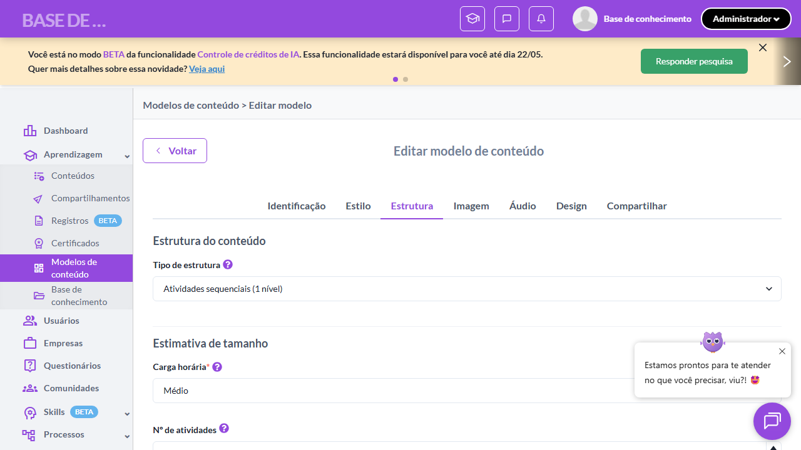

- 🎬 [Vídeo da execução (video.webm)](artifacts/projects-modelos-tests-fea-ca9a9-exibe-configurações-básicas-chromium/video.webm)

- 📦 **Trace** — [`trace.zip`](artifacts/projects-modelos-tests-fea-ca9a9-exibe-configurações-básicas-chromium/trace.zip)

  ```bash
  npx playwright show-trace outputs/modelos/reports/regression_20260521-180745/artifacts/projects-modelos-tests-fea-ca9a9-exibe-configurações-básicas-chromium/trace.zip
  ```

- 🎥 **Vídeo** — [`video.webm`](artifacts/projects-modelos-tests-fea-ca9a9-exibe-configurações-básicas-chromium/video.webm)

- 📄 **DOM no momento da falha** — [`error-context.md`](artifacts/projects-modelos-tests-fea-ca9a9-exibe-configurações-básicas-chromium/error-context.md)

#### 🐛 Pronto para registro de bug

**Descrição do BUG:** [Crítico] Switch "Incluir questionários" exibe configurações básicas — O elemento esperado não apareceu na tela (locator: getByText('Configurações avançadas', { exact: true })).

**Passo a passo para reprodução:**
1. Pré: Ambiente Stage configurado
1. Pré: Feature flag `modelos_de_conteudo` ativa
1. Pré: Modelo de teste cadastrado no setup do spec (via beforeAll)
1. Pré: Usuário logado como Admin
1. 1. Acessar a aba "Estrutura do conteúdo"
1. 2. Ativar o switch "Incluir questionários no conteúdo"

**Comportamento esperado:** Seção expande exibindo os campos básicos de configuração de questionário.

**Comportamento atual:** O elemento esperado não apareceu na tela (locator: getByText('Configurações avançadas', { exact: true })).

**Informações:**

| Campo | Valor |
|---|---|
| URL | `https://basedeconhecimento.stage.twygoead.com/` |
| Login | ${TWYGO_STAGING_BASE_DE_CONHECIMENTO_EMAIL} |
| Senha | ${TWYGO_STAGING_BASE_DE_CONHECIMENTO_PASSWORD} |
| orgId | 37007 |
| Outros | Browser: chromium |
| Outros | runId: regression_20260521-180745 |
| Outros | Duração até a falha: 15.52s |
| Outros | Step impactado: 2. 2. Ativar switch "Incluir questionários" e validar configurações expostas |

**Evidências:**

- Screenshot capturado pelo Playwright (screenshot): artifacts/projects-modelos-tests-fea-ca9a9-exibe-configurações-básicas-chromium/test-failed-1.png
- Vídeo da execução (video.webm): artifacts/projects-modelos-tests-fea-ca9a9-exibe-configurações-básicas-chromium/video.webm
- Snapshot do DOM/contexto da página (error-context.md): artifacts/projects-modelos-tests-fea-ca9a9-exibe-configurações-básicas-chromium/error-context.md
- Trace completo do Playwright (.zip) — `npx playwright show-trace`: artifacts/projects-modelos-tests-fea-ca9a9-exibe-configurações-básicas-chromium/trace.zip

<details><summary>📋 Ver texto agregado para copiar (Jira/GitHub/Linear)</summary>

```
Descrição do BUG
[Crítico] Switch "Incluir questionários" exibe configurações básicas — O elemento esperado não apareceu na tela (locator: getByText('Configurações avançadas', { exact: true })).

Passo a passo para reprodução
  Pré: Ambiente Stage configurado
  Pré: Feature flag `modelos_de_conteudo` ativa
  Pré: Modelo de teste cadastrado no setup do spec (via beforeAll)
  Pré: Usuário logado como Admin
  1. Acessar a aba "Estrutura do conteúdo"
  2. Ativar o switch "Incluir questionários no conteúdo"

Comportamento esperado
Seção expande exibindo os campos básicos de configuração de questionário.

Comportamento atual
O elemento esperado não apareceu na tela (locator: getByText('Configurações avançadas', { exact: true })).

Informações
- URL: https://basedeconhecimento.stage.twygoead.com/
- Login: ${TWYGO_STAGING_BASE_DE_CONHECIMENTO_EMAIL}
- Senha: ${TWYGO_STAGING_BASE_DE_CONHECIMENTO_PASSWORD}
- ID do ambiente (orgId): 37007
- Outros:
  - Browser: chromium
  - runId: regression_20260521-180745
  - Duração até a falha: 15.52s
  - Step impactado: 2. 2. Ativar switch "Incluir questionários" e validar configurações expostas

Evidências
- Screenshot capturado pelo Playwright (screenshot): artifacts/projects-modelos-tests-fea-ca9a9-exibe-configurações-básicas-chromium/test-failed-1.png
- Vídeo da execução (video.webm): artifacts/projects-modelos-tests-fea-ca9a9-exibe-configurações-básicas-chromium/video.webm
- Snapshot do DOM/contexto da página (error-context.md): artifacts/projects-modelos-tests-fea-ca9a9-exibe-configurações-básicas-chromium/error-context.md
- Trace completo do Playwright (.zip) — `npx playwright show-trace`: artifacts/projects-modelos-tests-fea-ca9a9-exibe-configurações-básicas-chromium/trace.zip

Execução
- runId: regression_20260521-180745
- environment.json: staging-base-de-conhecimento
- testsuite: Criação de Modelo - Aba Estrutura do Conteúdo
- testcase: Switch "Incluir questionários" exibe configurações básicas

```

</details>

<details><summary>🔧 Stack trace técnica completa (para desenvolvedor)</summary>

```
Error: expect(locator).toBeVisible() failed

Locator: getByText('Configurações avançadas', { exact: true })
Expected: visible
Error: strict mode violation: getByText('Configurações avançadas', { exact: true }) resolved to 2 elements:
    1) <div class="css-yljlks">Configurações avançadas</div> aka getByText('Configurações avançadas').first()
    2) <div class="css-yljlks">Configurações avançadas</div> aka getByText('Configurações avançadas').nth(1)

Call log:
  - Expect "toBeVisible" with timeout 5000ms
  - waiting for getByText('Configurações avançadas', { exact: true })

```

</details>

---

### ✅ Aprovado · TC7 · Switch "Configurações avançadas" exibe campos adicionais · 🔴 Crítico

<a id="switch-configuracoes-avancadas-exibe-campos-adicionais"></a>_Arquivo:_ `tc07-switch-configuracoes-avancadas.spec.ts` · _Duração:_ 16.20s · _Browser:_ chromium

**Sumário (objetivo do caso):** Validar que ativar configurações avançadas exibe campos adicionais (RN 22.1).

**Pré-condições:**

```
Ambiente Stage configurado
Feature flag `modelos_de_conteudo` ativa
Modelo de teste cadastrado no setup do spec (via beforeAll)
Usuário logado como Admin
```

**Passos do caso (XML/TestLink + execução Playwright):**

_Cada linha reproduz um passo do XML; a coluna **Status** traz o resultado da execução (do step Allure correspondente). Linhas com "Pré-condição" são da execução automatizada (login, navegação inicial) — não fazem parte do roteiro do XML._

| # | Ação do passo | Resultado esperado | Status | Notas | Duração |
|---|---|---|:---:|---|---:|
| — | _Pré-condição:_ 3. Ativar "Configurações avançadas" e validar campos adicionais | — | ✅ | — | 1.00s |
| — | _Pré-condição:_ cleanup: desligar switches | — | ✅ | — | 0.61s |
| 1 | Ativar o switch "Incluir questionários no conteúdo" | Campos básicos de questionário são exibidos. | ✅ | — | 13.54s |
| 2 | Ativar o switch "Configurações avançadas" | Campos adicionais de configuração são exibidos. | ✅ | — | 0.05s |

**Evidências:**

📁 _Pasta:_ [`artifacts/projects-modelos-tests-fea-8c90b-das-exibe-campos-adicionais-chromium/`](artifacts/projects-modelos-tests-fea-8c90b-das-exibe-campos-adicionais-chromium/)

- 📸 **Screenshot (screenshot)** — [`test-finished-1.png`](artifacts/projects-modelos-tests-fea-8c90b-das-exibe-campos-adicionais-chromium/test-finished-1.png)

  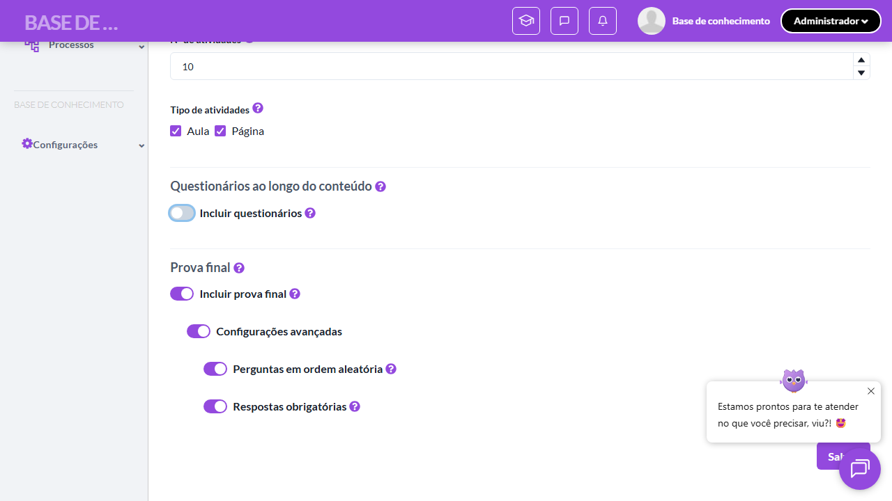

- 🎬 [Vídeo da execução (video.webm)](artifacts/projects-modelos-tests-fea-8c90b-das-exibe-campos-adicionais-chromium/video.webm)

- 📦 **Trace** — [`trace.zip`](artifacts/projects-modelos-tests-fea-8c90b-das-exibe-campos-adicionais-chromium/trace.zip)

  ```bash
  npx playwright show-trace outputs/modelos/reports/regression_20260521-180745/artifacts/projects-modelos-tests-fea-8c90b-das-exibe-campos-adicionais-chromium/trace.zip
  ```

- 🎥 **Vídeo** — [`video.webm`](artifacts/projects-modelos-tests-fea-8c90b-das-exibe-campos-adicionais-chromium/video.webm)


---

### ✅ Aprovado · TC8 · Switch "Incluir prova final" · 🔴 Crítico

<a id="switch-incluir-prova-final"></a>_Arquivo:_ `tc08-switch-incluir-prova-final.spec.ts` · _Duração:_ 15.19s · _Browser:_ chromium

**Sumário (objetivo do caso):** Validar exibição da seção "Prova final" e campos básicos (RN 25, RN 26).

**Pré-condições:**

```
Ambiente Stage configurado
Feature flag `modelos_de_conteudo` ativa
Modelo de teste cadastrado no setup do spec (via beforeAll)
Usuário logado como Admin
```

**Passos do caso (XML/TestLink + execução Playwright):**

_Cada linha reproduz um passo do XML; a coluna **Status** traz o resultado da execução (do step Allure correspondente). Linhas com "Pré-condição" são da execução automatizada (login, navegação inicial) — não fazem parte do roteiro do XML._

| # | Ação do passo | Resultado esperado | Status | Notas | Duração |
|---|---|---|:---:|---|---:|
| — | _Pré-condição:_ cleanup: desligar switch | — | ✅ | — | 0.68s |
| 1 | Acessar a aba "Estrutura do conteúdo" | Aba é exibida com a seção "Prova final". | ✅ | — | 13.50s |
| 2 | Aguardar a tooltip da seção "Prova final" ser exibida ao posicionar o mouse | Tooltip exibida: "Avaliação aplicada ao final do curso, cobrindo todo o conteúdo.". | ✅ | — | 0.12s |
| 3 | Ativar o switch "Incluir prova final" | Seção expande exibindo os campos básicos de configuração de prova final. | ✅ | — | — |

**Evidências:**

📁 _Pasta:_ [`artifacts/projects-modelos-tests-fea-27d82-Switch-Incluir-prova-final--chromium/`](artifacts/projects-modelos-tests-fea-27d82-Switch-Incluir-prova-final--chromium/)

- 📸 **Screenshot (screenshot)** — [`test-finished-1.png`](artifacts/projects-modelos-tests-fea-27d82-Switch-Incluir-prova-final--chromium/test-finished-1.png)

  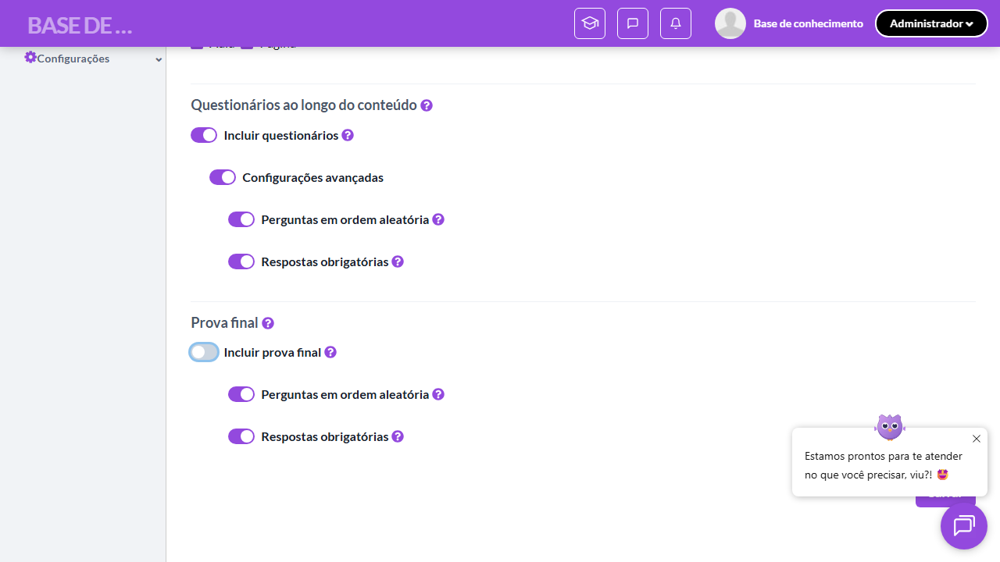

- 🎬 [Vídeo da execução (video.webm)](artifacts/projects-modelos-tests-fea-27d82-Switch-Incluir-prova-final--chromium/video.webm)

- 📦 **Trace** — [`trace.zip`](artifacts/projects-modelos-tests-fea-27d82-Switch-Incluir-prova-final--chromium/trace.zip)

  ```bash
  npx playwright show-trace outputs/modelos/reports/regression_20260521-180745/artifacts/projects-modelos-tests-fea-27d82-Switch-Incluir-prova-final--chromium/trace.zip
  ```

- 🎥 **Vídeo** — [`video.webm`](artifacts/projects-modelos-tests-fea-27d82-Switch-Incluir-prova-final--chromium/video.webm)


---

## Criação de Modelo - Aba Imagem

_3 caso(s) — 2 aprovado(s), 1 falha(s)_

### ✅ Aprovado · TC1 · Aba Imagem exibe título e subtítulo literais · 🔴 Crítico

<a id="aba-imagem-exibe-titulo-e-subtitulo-literais"></a>_Arquivo:_ `tc01-aba-imagem-titulo-subtitulo.spec.ts` · _Duração:_ 13.75s · _Browser:_ chromium

**Sumário (objetivo do caso):** Validar textos literais da aba Imagem (RN 57.1, RN 57.2).

**Pré-condições:**

```
Ambiente Stage configurado
Feature flag `modelos_de_conteudo` ativa
Modelo de teste cadastrado no setup do spec (via beforeAll)
Usuário logado como Admin
```

**Passos do caso (XML/TestLink + execução Playwright):**

_Cada linha reproduz um passo do XML; a coluna **Status** traz o resultado da execução (do step Allure correspondente). Linhas com "Pré-condição" são da execução automatizada (login, navegação inicial) — não fazem parte do roteiro do XML._

| # | Ação do passo | Resultado esperado | Status | Notas | Duração |
|---|---|---|:---:|---|---:|
| 1 | Acessar a aba "Imagem" do modelo de teste | Aba "Imagem" fica selecionada. | ✅ | — | 12.75s |
| 2 | Aguardar a renderização da seção | Título exibido: "Escolha o padrão de imagens para o modelo". Subtítulo exibido: "Selecione como as imagens serão incluídas nos cursos gerados com este modelo. Cada opção oferece diferentes benefícios para a experiência de aprendizado.". | ✅ | — | 0.06s |

**Evidências:**

📁 _Pasta:_ [`artifacts/projects-modelos-tests-fea-2ff59-título-e-subtítulo-literais-chromium/`](artifacts/projects-modelos-tests-fea-2ff59-título-e-subtítulo-literais-chromium/)

- 📸 **Screenshot (screenshot)** — [`test-finished-1.png`](artifacts/projects-modelos-tests-fea-2ff59-título-e-subtítulo-literais-chromium/test-finished-1.png)

  

- 🎬 [Vídeo da execução (video.webm)](artifacts/projects-modelos-tests-fea-2ff59-título-e-subtítulo-literais-chromium/video.webm)

- 📦 **Trace** — [`trace.zip`](artifacts/projects-modelos-tests-fea-2ff59-título-e-subtítulo-literais-chromium/trace.zip)

  ```bash
  npx playwright show-trace outputs/modelos/reports/regression_20260521-180745/artifacts/projects-modelos-tests-fea-2ff59-título-e-subtítulo-literais-chromium/trace.zip
  ```

- 🎥 **Vídeo** — [`video.webm`](artifacts/projects-modelos-tests-fea-2ff59-título-e-subtítulo-literais-chromium/video.webm)


---

### ✅ Aprovado · TC2 · Opções de padrão de imagem disponíveis · 🔴 Crítico

<a id="opcoes-de-padrao-de-imagem-disponiveis"></a>_Arquivo:_ `tc02-opcoes-padrao-imagem.spec.ts` · _Duração:_ 14.96s · _Browser:_ chromium

**Sumário (objetivo do caso):** Validar 4 opções de padrão de imagem (RN 57).

**Pré-condições:**

```
Ambiente Stage configurado
Feature flag `modelos_de_conteudo` ativa
Modelo de teste cadastrado no setup do spec (via beforeAll)
Usuário logado como Admin
```

**Passos do caso (XML/TestLink + execução Playwright):**

_Cada linha reproduz um passo do XML; a coluna **Status** traz o resultado da execução (do step Allure correspondente). Linhas com "Pré-condição" são da execução automatizada (login, navegação inicial) — não fazem parte do roteiro do XML._

| # | Ação do passo | Resultado esperado | Status | Notas | Duração |
|---|---|---|:---:|---|---:|
| 1 | Acessar a aba "Imagem" | Aba é exibida. | ✅ | — | 13.89s |
| 2 | Aguardar as opções serem renderizadas | Opções exibidas: "Sem imagens, somente textos", "Banco de imagens aberto", "Gerador DALL-E (OpenAI)", "Gerador Imagen 4 (Google)". | ✅ | — | 0.14s |

**Evidências:**

📁 _Pasta:_ [`artifacts/projects-modelos-tests-fea-ad913-adrão-de-imagem-disponíveis-chromium/`](artifacts/projects-modelos-tests-fea-ad913-adrão-de-imagem-disponíveis-chromium/)

- 📸 **Screenshot (screenshot)** — [`test-finished-1.png`](artifacts/projects-modelos-tests-fea-ad913-adrão-de-imagem-disponíveis-chromium/test-finished-1.png)

  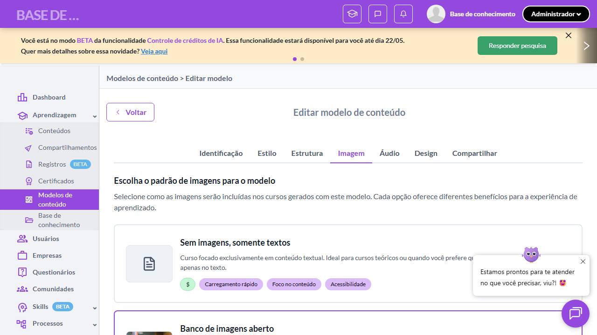

- 🎬 [Vídeo da execução (video.webm)](artifacts/projects-modelos-tests-fea-ad913-adrão-de-imagem-disponíveis-chromium/video.webm)

- 📦 **Trace** — [`trace.zip`](artifacts/projects-modelos-tests-fea-ad913-adrão-de-imagem-disponíveis-chromium/trace.zip)

  ```bash
  npx playwright show-trace outputs/modelos/reports/regression_20260521-180745/artifacts/projects-modelos-tests-fea-ad913-adrão-de-imagem-disponíveis-chromium/trace.zip
  ```

- 🎥 **Vídeo** — [`video.webm`](artifacts/projects-modelos-tests-fea-ad913-adrão-de-imagem-disponíveis-chromium/video.webm)


---

### ❌ Falhou · TC3 · Default "Sem imagens, somente textos" · 🔴 Crítico

<a id="default-sem-imagens-somente-textos"></a>_Arquivo:_ `tc03-default-sem-imagens.spec.ts` · _Duração:_ 14.13s · _Browser:_ chromium

> **❌ Por que falhou:** Error: expect(received).toBe(expected) // Object.is equality
> _Step impactado:_ **2. Validar radio-0 ("Sem imagens, somente textos") marcado por padrão**

**Sumário (objetivo do caso):** Validar que o padrão selecionado por default é "Sem imagens, somente textos" (RN 57.4).

**Pré-condições:**

```
Ambiente Stage configurado
Feature flag `modelos_de_conteudo` ativa
Modelo de teste cadastrado no setup do spec (via beforeAll)
Usuário logado como Admin
```

**Passos do caso (XML/TestLink + execução Playwright):**

_Cada linha reproduz um passo do XML; a coluna **Status** traz o resultado da execução (do step Allure correspondente). Linhas com "Pré-condição" são da execução automatizada (login, navegação inicial) — não fazem parte do roteiro do XML._

| # | Ação do passo | Resultado esperado | Status | Notas | Duração |
|---|---|---|:---:|---|---:|
| 1 | Acessar a aba "Imagem" em um novo modelo recém-criado | Aba é exibida. | ✅ | — | 13.13s |
| 2 | Aguardar a seleção default ser renderizada | Opção "Sem imagens, somente textos" é exibida como selecionada por padrão. | ❌ | Error: expect(received).toBe(expected) // Object.is equality | 0.03s |

**Evidências:**

📁 _Pasta:_ [`artifacts/projects-modelos-tests-fea-fb2c4-Sem-imagens-somente-textos--chromium/`](artifacts/projects-modelos-tests-fea-fb2c4-Sem-imagens-somente-textos--chromium/)

- 📸 **Screenshot (screenshot)** — [`test-failed-1.png`](artifacts/projects-modelos-tests-fea-fb2c4-Sem-imagens-somente-textos--chromium/test-failed-1.png)

  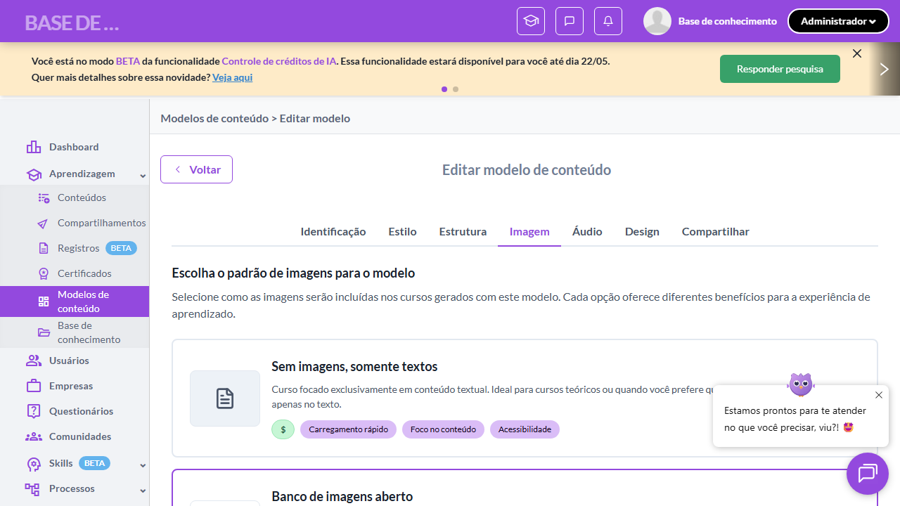

- 🎬 [Vídeo da execução (video.webm)](artifacts/projects-modelos-tests-fea-fb2c4-Sem-imagens-somente-textos--chromium/video.webm)

- 📦 **Trace** — [`trace.zip`](artifacts/projects-modelos-tests-fea-fb2c4-Sem-imagens-somente-textos--chromium/trace.zip)

  ```bash
  npx playwright show-trace outputs/modelos/reports/regression_20260521-180745/artifacts/projects-modelos-tests-fea-fb2c4-Sem-imagens-somente-textos--chromium/trace.zip
  ```

- 🎥 **Vídeo** — [`video.webm`](artifacts/projects-modelos-tests-fea-fb2c4-Sem-imagens-somente-textos--chromium/video.webm)

- 📄 **DOM no momento da falha** — [`error-context.md`](artifacts/projects-modelos-tests-fea-fb2c4-Sem-imagens-somente-textos--chromium/error-context.md)

#### 🐛 Pronto para registro de bug

**Descrição do BUG:** [Crítico] Default "Sem imagens, somente textos" — Error: expect(received).toBe(expected) // Object.is equality

**Passo a passo para reprodução:**
1. Pré: Ambiente Stage configurado
1. Pré: Feature flag `modelos_de_conteudo` ativa
1. Pré: Modelo de teste cadastrado no setup do spec (via beforeAll)
1. Pré: Usuário logado como Admin
1. 1. Acessar a aba "Imagem" em um novo modelo recém-criado
1. 2. Aguardar a seleção default ser renderizada

**Comportamento esperado:** Opção "Sem imagens, somente textos" é exibida como selecionada por padrão.

**Comportamento atual:** Error: expect(received).toBe(expected) // Object.is equality

**Informações:**

| Campo | Valor |
|---|---|
| URL | `https://basedeconhecimento.stage.twygoead.com/` |
| Login | ${TWYGO_STAGING_BASE_DE_CONHECIMENTO_EMAIL} |
| Senha | ${TWYGO_STAGING_BASE_DE_CONHECIMENTO_PASSWORD} |
| orgId | 37007 |
| Outros | Browser: chromium |
| Outros | runId: regression_20260521-180745 |
| Outros | Duração até a falha: 14.13s |
| Outros | Step impactado: 2. 2. Validar radio-0 ("Sem imagens, somente textos") marcado por padrão |

**Evidências:**

- Screenshot capturado pelo Playwright (screenshot): artifacts/projects-modelos-tests-fea-fb2c4-Sem-imagens-somente-textos--chromium/test-failed-1.png
- Vídeo da execução (video.webm): artifacts/projects-modelos-tests-fea-fb2c4-Sem-imagens-somente-textos--chromium/video.webm
- Snapshot do DOM/contexto da página (error-context.md): artifacts/projects-modelos-tests-fea-fb2c4-Sem-imagens-somente-textos--chromium/error-context.md
- Trace completo do Playwright (.zip) — `npx playwright show-trace`: artifacts/projects-modelos-tests-fea-fb2c4-Sem-imagens-somente-textos--chromium/trace.zip

<details><summary>📋 Ver texto agregado para copiar (Jira/GitHub/Linear)</summary>

```
Descrição do BUG
[Crítico] Default "Sem imagens, somente textos" — Error: expect(received).toBe(expected) // Object.is equality

Passo a passo para reprodução
  Pré: Ambiente Stage configurado
  Pré: Feature flag `modelos_de_conteudo` ativa
  Pré: Modelo de teste cadastrado no setup do spec (via beforeAll)
  Pré: Usuário logado como Admin
  1. Acessar a aba "Imagem" em um novo modelo recém-criado
  2. Aguardar a seleção default ser renderizada

Comportamento esperado
Opção "Sem imagens, somente textos" é exibida como selecionada por padrão.

Comportamento atual
Error: expect(received).toBe(expected) // Object.is equality

Informações
- URL: https://basedeconhecimento.stage.twygoead.com/
- Login: ${TWYGO_STAGING_BASE_DE_CONHECIMENTO_EMAIL}
- Senha: ${TWYGO_STAGING_BASE_DE_CONHECIMENTO_PASSWORD}
- ID do ambiente (orgId): 37007
- Outros:
  - Browser: chromium
  - runId: regression_20260521-180745
  - Duração até a falha: 14.13s
  - Step impactado: 2. 2. Validar radio-0 ("Sem imagens, somente textos") marcado por padrão

Evidências
- Screenshot capturado pelo Playwright (screenshot): artifacts/projects-modelos-tests-fea-fb2c4-Sem-imagens-somente-textos--chromium/test-failed-1.png
- Vídeo da execução (video.webm): artifacts/projects-modelos-tests-fea-fb2c4-Sem-imagens-somente-textos--chromium/video.webm
- Snapshot do DOM/contexto da página (error-context.md): artifacts/projects-modelos-tests-fea-fb2c4-Sem-imagens-somente-textos--chromium/error-context.md
- Trace completo do Playwright (.zip) — `npx playwright show-trace`: artifacts/projects-modelos-tests-fea-fb2c4-Sem-imagens-somente-textos--chromium/trace.zip

Execução
- runId: regression_20260521-180745
- environment.json: staging-base-de-conhecimento
- testsuite: Criação de Modelo - Aba Imagem
- testcase: Default "Sem imagens, somente textos"

```

</details>

<details><summary>🔧 Stack trace técnica completa (para desenvolvedor)</summary>

```
Error: expect(received).toBe(expected) // Object.is equality

Expected: true
Received: false
```

</details>

---

## Criação de Modelo - Aba Áudio

_4 caso(s) — 4 aprovado(s), 0 falha(s)_

### ✅ Aprovado · TC1 · Aba Áudio exibe título e subtítulo literais · 🔴 Crítico

<a id="aba-audio-exibe-titulo-e-subtitulo-literais"></a>_Arquivo:_ `tc01-aba-audio-titulo-subtitulo.spec.ts` · _Duração:_ 14.79s · _Browser:_ chromium

**Sumário (objetivo do caso):** Validar textos literais da aba Áudio (RN 58.1, RN 58.2).

**Pré-condições:**

```
Ambiente Stage configurado
Feature flag `modelos_de_conteudo` ativa
Modelo de teste cadastrado no setup do spec (via beforeAll)
Usuário logado como Admin
```

**Passos do caso (XML/TestLink + execução Playwright):**

_Cada linha reproduz um passo do XML; a coluna **Status** traz o resultado da execução (do step Allure correspondente). Linhas com "Pré-condição" são da execução automatizada (login, navegação inicial) — não fazem parte do roteiro do XML._

| # | Ação do passo | Resultado esperado | Status | Notas | Duração |
|---|---|---|:---:|---|---:|
| 1 | Acessar a aba "Áudio" do modelo de teste | Aba "Áudio" fica selecionada. | ✅ | — | 13.77s |
| 2 | Aguardar a renderização da seção | Título exibido: "Escolha a voz padrão para narrar as aulas". Subtítulo exibido: "Selecione a voz que melhor se adequa ao tom deste modelo. Você pode ouvir uma amostra de cada voz antes de escolher.". | ✅ | — | 0.10s |

**Evidências:**

📁 _Pasta:_ [`artifacts/projects-modelos-tests-fea-d8ce1-título-e-subtítulo-literais-chromium/`](artifacts/projects-modelos-tests-fea-d8ce1-título-e-subtítulo-literais-chromium/)

- 📸 **Screenshot (screenshot)** — [`test-finished-1.png`](artifacts/projects-modelos-tests-fea-d8ce1-título-e-subtítulo-literais-chromium/test-finished-1.png)

  

- 🎬 [Vídeo da execução (video.webm)](artifacts/projects-modelos-tests-fea-d8ce1-título-e-subtítulo-literais-chromium/video.webm)

- 📦 **Trace** — [`trace.zip`](artifacts/projects-modelos-tests-fea-d8ce1-título-e-subtítulo-literais-chromium/trace.zip)

  ```bash
  npx playwright show-trace outputs/modelos/reports/regression_20260521-180745/artifacts/projects-modelos-tests-fea-d8ce1-título-e-subtítulo-literais-chromium/trace.zip
  ```

- 🎥 **Vídeo** — [`video.webm`](artifacts/projects-modelos-tests-fea-d8ce1-título-e-subtítulo-literais-chromium/video.webm)


---

### ✅ Aprovado · TC2 · Opções de voz disponíveis · 🔴 Crítico

<a id="opcoes-de-voz-disponiveis"></a>_Arquivo:_ `tc02-opcoes-voz.spec.ts` · _Duração:_ 14.38s · _Browser:_ chromium

**Sumário (objetivo do caso):** Validar 4 opções de voz (RN 58).

**Pré-condições:**

```
Ambiente Stage configurado
Feature flag `modelos_de_conteudo` ativa
Modelo de teste cadastrado no setup do spec (via beforeAll)
Usuário logado como Admin
```

**Passos do caso (XML/TestLink + execução Playwright):**

_Cada linha reproduz um passo do XML; a coluna **Status** traz o resultado da execução (do step Allure correspondente). Linhas com "Pré-condição" são da execução automatizada (login, navegação inicial) — não fazem parte do roteiro do XML._

| # | Ação do passo | Resultado esperado | Status | Notas | Duração |
|---|---|---|:---:|---|---:|
| 1 | Acessar a aba "Áudio" | Aba é exibida. | ✅ | — | 13.22s |
| 2 | Aguardar as opções de voz serem renderizadas | Opções exibidas: "Ana", "Cris", "Carlos", "Morgan". | ✅ | — | 0.13s |

**Evidências:**

📁 _Pasta:_ [`artifacts/projects-modelos-tests-fea-36075-o-Opções-de-voz-disponíveis-chromium/`](artifacts/projects-modelos-tests-fea-36075-o-Opções-de-voz-disponíveis-chromium/)

- 📸 **Screenshot (screenshot)** — [`test-finished-1.png`](artifacts/projects-modelos-tests-fea-36075-o-Opções-de-voz-disponíveis-chromium/test-finished-1.png)

  

- 🎬 [Vídeo da execução (video.webm)](artifacts/projects-modelos-tests-fea-36075-o-Opções-de-voz-disponíveis-chromium/video.webm)

- 📦 **Trace** — [`trace.zip`](artifacts/projects-modelos-tests-fea-36075-o-Opções-de-voz-disponíveis-chromium/trace.zip)

  ```bash
  npx playwright show-trace outputs/modelos/reports/regression_20260521-180745/artifacts/projects-modelos-tests-fea-36075-o-Opções-de-voz-disponíveis-chromium/trace.zip
  ```

- 🎥 **Vídeo** — [`video.webm`](artifacts/projects-modelos-tests-fea-36075-o-Opções-de-voz-disponíveis-chromium/video.webm)


---

### ✅ Aprovado · TC3 · Default voz "Ana" · 🔴 Crítico

<a id="default-voz-ana"></a>_Arquivo:_ `tc03-default-voz-ana.spec.ts` · _Duração:_ 14.24s · _Browser:_ chromium

**Sumário (objetivo do caso):** Validar que a voz default selecionada é "Ana" (RN 58.4).

**Pré-condições:**

```
Ambiente Stage configurado
Feature flag `modelos_de_conteudo` ativa
Modelo de teste cadastrado no setup do spec (via beforeAll)
Usuário logado como Admin
```

**Passos do caso (XML/TestLink + execução Playwright):**

_Cada linha reproduz um passo do XML; a coluna **Status** traz o resultado da execução (do step Allure correspondente). Linhas com "Pré-condição" são da execução automatizada (login, navegação inicial) — não fazem parte do roteiro do XML._

| # | Ação do passo | Resultado esperado | Status | Notas | Duração |
|---|---|---|:---:|---|---:|
| 1 | Acessar a aba "Áudio" em um novo modelo recém-criado | Aba é exibida. | ✅ | — | 13.21s |
| 2 | Aguardar a seleção default ser renderizada | Opção "Ana" é exibida como selecionada por padrão. | ✅ | — | 0.16s |

**Evidências:**

📁 _Pasta:_ [`artifacts/projects-modelos-tests-fea-a5dd1--Aba-Áudio-Default-voz-Ana--chromium/`](artifacts/projects-modelos-tests-fea-a5dd1--Aba-Áudio-Default-voz-Ana--chromium/)

- 📸 **Screenshot (screenshot)** — [`test-finished-1.png`](artifacts/projects-modelos-tests-fea-a5dd1--Aba-Áudio-Default-voz-Ana--chromium/test-finished-1.png)

  

- 🎬 [Vídeo da execução (video.webm)](artifacts/projects-modelos-tests-fea-a5dd1--Aba-Áudio-Default-voz-Ana--chromium/video.webm)

- 📦 **Trace** — [`trace.zip`](artifacts/projects-modelos-tests-fea-a5dd1--Aba-Áudio-Default-voz-Ana--chromium/trace.zip)

  ```bash
  npx playwright show-trace outputs/modelos/reports/regression_20260521-180745/artifacts/projects-modelos-tests-fea-a5dd1--Aba-Áudio-Default-voz-Ana--chromium/trace.zip
  ```

- 🎥 **Vídeo** — [`video.webm`](artifacts/projects-modelos-tests-fea-a5dd1--Aba-Áudio-Default-voz-Ana--chromium/video.webm)


---

### ✅ Aprovado · TC4 · Botão de preview de voz funcional · 🟡 Normal

<a id="botao-de-preview-de-voz-funcional"></a>_Arquivo:_ `tc04-botao-preview-voz.spec.ts` · _Duração:_ 14.24s · _Browser:_ chromium

**Sumário (objetivo do caso):** Validar que o botão de preview/ouvir amostra está disponível para cada voz (RN 58 — quebra QA 1.5).

**Pré-condições:**

```
Ambiente Stage configurado
Feature flag `modelos_de_conteudo` ativa
Modelo de teste cadastrado no setup do spec (via beforeAll)
Usuário logado como Admin
```

**Passos do caso (XML/TestLink + execução Playwright):**

_Cada linha reproduz um passo do XML; a coluna **Status** traz o resultado da execução (do step Allure correspondente). Linhas com "Pré-condição" são da execução automatizada (login, navegação inicial) — não fazem parte do roteiro do XML._

| # | Ação do passo | Resultado esperado | Status | Notas | Duração |
|---|---|---|:---:|---|---:|
| 1 | Acessar a aba "Áudio" | Aba é exibida com as 4 opções de voz. | ✅ | — | 13.30s |
| 2 | Clicar no botão de preview da voz "Cris" | Sistema inicia reprodução da amostra de áudio da voz "Cris". | ✅ | — | 0.07s |

**Evidências:**

📁 _Pasta:_ [`artifacts/projects-modelos-tests-fea-10e36-de-preview-de-voz-funcional-chromium/`](artifacts/projects-modelos-tests-fea-10e36-de-preview-de-voz-funcional-chromium/)

- 📸 **Screenshot (screenshot)** — [`test-finished-1.png`](artifacts/projects-modelos-tests-fea-10e36-de-preview-de-voz-funcional-chromium/test-finished-1.png)

  

- 🎬 [Vídeo da execução (video.webm)](artifacts/projects-modelos-tests-fea-10e36-de-preview-de-voz-funcional-chromium/video.webm)

- 📦 **Trace** — [`trace.zip`](artifacts/projects-modelos-tests-fea-10e36-de-preview-de-voz-funcional-chromium/trace.zip)

  ```bash
  npx playwright show-trace outputs/modelos/reports/regression_20260521-180745/artifacts/projects-modelos-tests-fea-10e36-de-preview-de-voz-funcional-chromium/trace.zip
  ```

- 🎥 **Vídeo** — [`video.webm`](artifacts/projects-modelos-tests-fea-10e36-de-preview-de-voz-funcional-chromium/video.webm)


---

## Criação de Design de Página

_7 caso(s) — 7 aprovado(s), 0 falha(s)_

### ✅ Aprovado · TC1 · Acessar criação de Página via menu Adicionar · 🔴 Crítico

<a id="acessar-criacao-de-pagina-via-menu-adicionar"></a>_Arquivo:_ `tc01-acessar-criacao-pagina-via-menu.spec.ts` · _Duração:_ 21.93s · _Browser:_ chromium

**Sumário (objetivo do caso):** Validar fluxo de criação de Página (RN 30, RN 31, RN 32).

**Pré-condições:**

```
Ambiente Stage configurado
Feature flag `modelos_de_conteudo` ativa
Modelo de teste cadastrado no setup do spec, com pelo menos 1 kit de marca selecionado
Usuário logado como Admin
```

**Passos do caso (XML/TestLink + execução Playwright):**

_Cada linha reproduz um passo do XML; a coluna **Status** traz o resultado da execução (do step Allure correspondente). Linhas com "Pré-condição" são da execução automatizada (login, navegação inicial) — não fazem parte do roteiro do XML._

| # | Ação do passo | Resultado esperado | Status | Notas | Duração |
|---|---|---|:---:|---|---:|
| 1 | Acessar a aba "Design" do modelo de teste | Aba "Design" exibe a listagem de designs (vazia ou com designs cadastrados). | ✅ | — | 18.58s |
| 2 | Clicar no botão "Adicionar" | Menu suspenso é exibido com as opções "Aula" e "Página". | ✅ | — | 0.34s |
| 3 | Clicar na opção "Página" | Sistema redireciona para a tela de criação de Página exibindo a aba "Identificação". | ✅ | — | 1.53s |

**Evidências:**

📁 _Pasta:_ [`artifacts/projects-modelos-tests-fea-20009-e-Página-via-menu-Adicionar-chromium/`](artifacts/projects-modelos-tests-fea-20009-e-Página-via-menu-Adicionar-chromium/)

- 📸 **Screenshot (screenshot)** — [`test-finished-1.png`](artifacts/projects-modelos-tests-fea-20009-e-Página-via-menu-Adicionar-chromium/test-finished-1.png)

  

- 🎬 [Vídeo da execução (video.webm)](artifacts/projects-modelos-tests-fea-20009-e-Página-via-menu-Adicionar-chromium/video.webm)

- 📦 **Trace** — [`trace.zip`](artifacts/projects-modelos-tests-fea-20009-e-Página-via-menu-Adicionar-chromium/trace.zip)

  ```bash
  npx playwright show-trace outputs/modelos/reports/regression_20260521-180745/artifacts/projects-modelos-tests-fea-20009-e-Página-via-menu-Adicionar-chromium/trace.zip
  ```

- 🎥 **Vídeo** — [`video.webm`](artifacts/projects-modelos-tests-fea-20009-e-Página-via-menu-Adicionar-chromium/video.webm)


---

### ✅ Aprovado · Validar campos obrigatórios da aba Identificação 

<a id="validar-campos-obrigatorios-da-aba-identificacao"></a>_Arquivo:_ `tc02-validar-campos-obrigatorios.spec.ts` · _Duração:_ 28.78s · _Browser:_ chromium

**Passos do caso (XML/TestLink + execução Playwright):**

_Cada linha reproduz um passo do XML; a coluna **Status** traz o resultado da execução (do step Allure correspondente). Linhas com "Pré-condição" são da execução automatizada (login, navegação inicial) — não fazem parte do roteiro do XML._

| # | Ação do passo | Resultado esperado | Status | Notas | Duração |
|---|---|---|:---:|---|---:|
| — | _Pré-condição:_ 1. Abrir tela de criação Página | — | ✅ | — | 21.69s |
| — | _Pré-condição:_ 2. Clicar Salvar sem preencher nada | — | ✅ | — | 5.46s |
| — | _Pré-condição:_ 3. Validar bloqueio (URL permanece em /new) | — | ✅ | — | 0.05s |

**Evidências:**

📁 _Pasta:_ [`artifacts/projects-modelos-tests-fea-49207-tórios-da-aba-Identificação-chromium/`](artifacts/projects-modelos-tests-fea-49207-tórios-da-aba-Identificação-chromium/)

- 📸 **Screenshot (screenshot)** — [`test-finished-1.png`](artifacts/projects-modelos-tests-fea-49207-tórios-da-aba-Identificação-chromium/test-finished-1.png)

  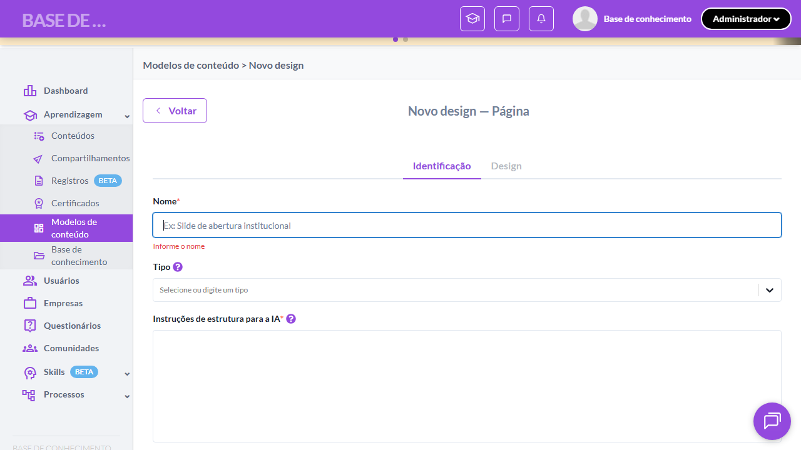

- 🎬 [Vídeo da execução (video.webm)](artifacts/projects-modelos-tests-fea-49207-tórios-da-aba-Identificação-chromium/video.webm)

- 📦 **Trace** — [`trace.zip`](artifacts/projects-modelos-tests-fea-49207-tórios-da-aba-Identificação-chromium/trace.zip)

  ```bash
  npx playwright show-trace outputs/modelos/reports/regression_20260521-180745/artifacts/projects-modelos-tests-fea-49207-tórios-da-aba-Identificação-chromium/trace.zip
  ```

- 🎥 **Vídeo** — [`video.webm`](artifacts/projects-modelos-tests-fea-49207-tórios-da-aba-Identificação-chromium/video.webm)


---

### ✅ Aprovado · TC3 · Auto-preenchimento ao selecionar tipo "Capa" · 🔴 Crítico

<a id="auto-preenchimento-ao-selecionar-tipo-capa"></a>_Arquivo:_ `tc03-autofill-tipo-capa.spec.ts` · _Duração:_ 28.89s · _Browser:_ chromium

**Sumário (objetivo do caso):** Validar auto-preenchimento dos campos de instruções ao selecionar o tipo "Capa" (RN 33.1).

**Pré-condições:**

```
Ambiente Stage configurado
Feature flag `modelos_de_conteudo` ativa
Modelo de teste cadastrado no setup do spec, com pelo menos 1 kit de marca selecionado
Usuário logado como Admin
```

**Passos do caso (XML/TestLink + execução Playwright):**

_Cada linha reproduz um passo do XML; a coluna **Status** traz o resultado da execução (do step Allure correspondente). Linhas com "Pré-condição" são da execução automatizada (login, navegação inicial) — não fazem parte do roteiro do XML._

| # | Ação do passo | Resultado esperado | Status | Notas | Duração |
|---|---|---|:---:|---|---:|
| — | _Pré-condição:_ 4. Validar auto-fill via contadores Plate (49/500 estrutura + 225/500 conteúdo) | — | ✅ | — | 0.12s |
| 1 | Acessar a tela de criação de Página com a aba "Identificação" | Aba "Identificação" é exibida. | ✅ | — | 21.61s |
| 2 | Selecionar "Capa" no campo "Tipo" | Campo "Tipo" exibe "Capa" selecionado. | ✅ | — | 3.01s |
| 3 | Aguardar o auto-preenchimento dos campos de instruções | Campo "Instruções de estrutura para a IA" é preenchido automaticamente com: "Usar sempre como primeira parte de qualquer aula.". Campo "Instruções de conteúdo para a IA" é preenchido automaticamente com texto canônico da Capa. | ✅ | — | 2.48s |

**Evidências:**

📁 _Pasta:_ [`artifacts/projects-modelos-tests-fea-8db40-to-ao-selecionar-tipo-Capa--chromium/`](artifacts/projects-modelos-tests-fea-8db40-to-ao-selecionar-tipo-Capa--chromium/)

- 📸 **Screenshot (screenshot)** — [`test-finished-1.png`](artifacts/projects-modelos-tests-fea-8db40-to-ao-selecionar-tipo-Capa--chromium/test-finished-1.png)

  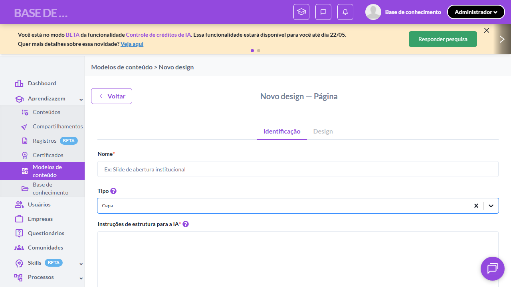

- 🎬 [Vídeo da execução (video.webm)](artifacts/projects-modelos-tests-fea-8db40-to-ao-selecionar-tipo-Capa--chromium/video.webm)

- 📦 **Trace** — [`trace.zip`](artifacts/projects-modelos-tests-fea-8db40-to-ao-selecionar-tipo-Capa--chromium/trace.zip)

  ```bash
  npx playwright show-trace outputs/modelos/reports/regression_20260521-180745/artifacts/projects-modelos-tests-fea-8db40-to-ao-selecionar-tipo-Capa--chromium/trace.zip
  ```

- 🎥 **Vídeo** — [`video.webm`](artifacts/projects-modelos-tests-fea-8db40-to-ao-selecionar-tipo-Capa--chromium/video.webm)


---

### ✅ Aprovado · TC4 · Tooltip do campo Tipo · 🟡 Normal

<a id="tooltip-do-campo-tipo"></a>_Arquivo:_ `tc04-tooltip-campo-tipo.spec.ts` · _Duração:_ 27.94s · _Browser:_ chromium

**Sumário (objetivo do caso):** Validar texto da tooltip do campo Tipo (RN 33).

**Pré-condições:**

```
Ambiente Stage configurado
Feature flag `modelos_de_conteudo` ativa
Modelo de teste cadastrado no setup do spec, com pelo menos 1 kit de marca selecionado
Usuário logado como Admin
```

**Passos do caso (XML/TestLink + execução Playwright):**

_Cada linha reproduz um passo do XML; a coluna **Status** traz o resultado da execução (do step Allure correspondente). Linhas com "Pré-condição" são da execução automatizada (login, navegação inicial) — não fazem parte do roteiro do XML._

| # | Ação do passo | Resultado esperado | Status | Notas | Duração |
|---|---|---|:---:|---|---:|
| 1 | Acessar a tela de criação de Página com a aba "Identificação" | Aba é exibida. | ✅ | — | 22.13s |
| 2 | Aguardar a tooltip do campo "Tipo" ser exibida ao posicionar o mouse | Tooltip exibida: "Classifique este design por tipo de parte (ex: Capa, Corpo, Encerramento). Essa informação será utilizada para filtrar e organizar seus designs.". | ✅ | — | 3.73s |

**Evidências:**

📁 _Pasta:_ [`artifacts/projects-modelos-tests-fea-8d1bd-ágina-Tooltip-do-campo-Tipo-chromium/`](artifacts/projects-modelos-tests-fea-8d1bd-ágina-Tooltip-do-campo-Tipo-chromium/)

- 📸 **Screenshot (screenshot)** — [`test-finished-1.png`](artifacts/projects-modelos-tests-fea-8d1bd-ágina-Tooltip-do-campo-Tipo-chromium/test-finished-1.png)

  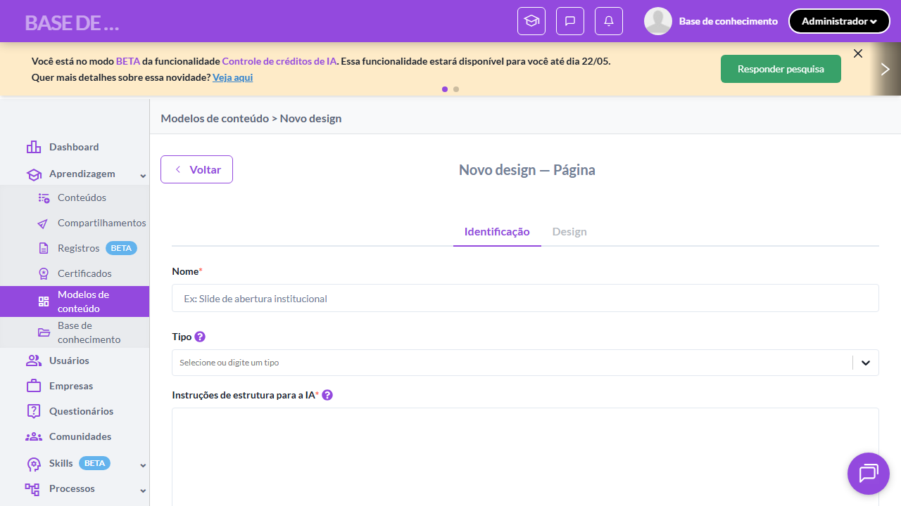

- 🎬 [Vídeo da execução (video.webm)](artifacts/projects-modelos-tests-fea-8d1bd-ágina-Tooltip-do-campo-Tipo-chromium/video.webm)

- 📦 **Trace** — [`trace.zip`](artifacts/projects-modelos-tests-fea-8d1bd-ágina-Tooltip-do-campo-Tipo-chromium/trace.zip)

  ```bash
  npx playwright show-trace outputs/modelos/reports/regression_20260521-180745/artifacts/projects-modelos-tests-fea-8d1bd-ágina-Tooltip-do-campo-Tipo-chromium/trace.zip
  ```

- 🎥 **Vídeo** — [`video.webm`](artifacts/projects-modelos-tests-fea-8d1bd-ágina-Tooltip-do-campo-Tipo-chromium/video.webm)


---

### ✅ Aprovado · TC5 · Salvar Identificação redireciona para aba Design · 🔴 Crítico

<a id="salvar-identificacao-redireciona-para-aba-design"></a>_Arquivo:_ `tc05-salvar-identificacao-redireciona.spec.ts` · _Duração:_ 23.02s · _Browser:_ chromium

**Sumário (objetivo do caso):** Validar redirecionamento automático após salvar Identificação (RN 34).

**Pré-condições:**

```
Ambiente Stage configurado
Feature flag `modelos_de_conteudo` ativa
Modelo de teste cadastrado no setup do spec, com pelo menos 1 kit de marca selecionado
Usuário logado como Admin
```

**Passos do caso (XML/TestLink + execução Playwright):**

_Cada linha reproduz um passo do XML; a coluna **Status** traz o resultado da execução (do step Allure correspondente). Linhas com "Pré-condição" são da execução automatizada (login, navegação inicial) — não fazem parte do roteiro do XML._

| # | Ação do passo | Resultado esperado | Status | Notas | Duração |
|---|---|---|:---:|---|---:|
| — | _Pré-condição:_ 2-3. Preencher Nome + Tipo "Corpo" | — | ✅ | — | 3.27s |
| 1 | Acessar a tela de criação de Página com a aba "Identificação" | Aba "Identificação" é exibida. | ✅ | — | 17.68s |
| 2 | Preencher o campo "Nome" com "Design TC5 w{workerIndex}-{timestamp}" | Campo "Nome" exibe o texto digitado. | ✅ | — | — |
| 3 | Selecionar "Corpo" no campo "Tipo" | Campos de instrução são auto-preenchidos. | ✅ | — | — |
| 4 | Preencher o campo "Sequência" com "1" | Campo "Sequência" exibe o valor digitado. | ✅ | — | 0.05s |
| 5 | Clicar no botão "Salvar" | Toast exibida: "Design criado com sucesso.". Sistema redireciona automaticamente para a aba "Design" da própria Página. | ✅ | — | 0.71s |

**Evidências:**

📁 _Pasta:_ [`artifacts/projects-modelos-tests-fea-a430e-redireciona-para-aba-Design-chromium/`](artifacts/projects-modelos-tests-fea-a430e-redireciona-para-aba-Design-chromium/)

- 📸 **Screenshot (screenshot)** — [`test-finished-1.png`](artifacts/projects-modelos-tests-fea-a430e-redireciona-para-aba-Design-chromium/test-finished-1.png)

  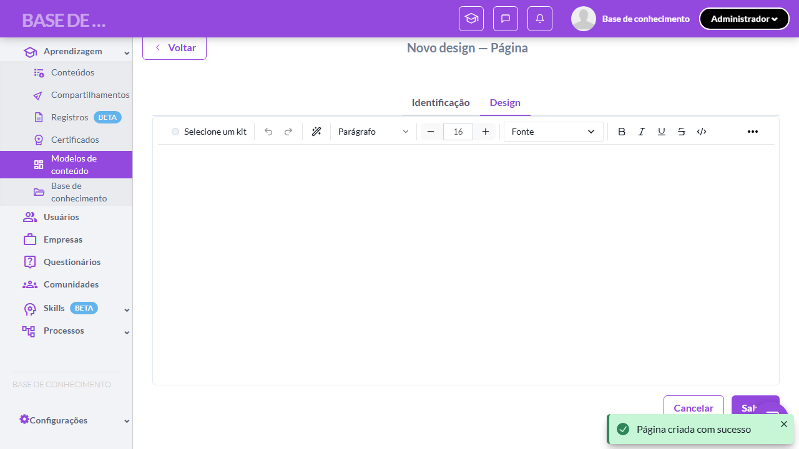

- 🎬 [Vídeo da execução (video.webm)](artifacts/projects-modelos-tests-fea-a430e-redireciona-para-aba-Design-chromium/video.webm)

- 📦 **Trace** — [`trace.zip`](artifacts/projects-modelos-tests-fea-a430e-redireciona-para-aba-Design-chromium/trace.zip)

  ```bash
  npx playwright show-trace outputs/modelos/reports/regression_20260521-180745/artifacts/projects-modelos-tests-fea-a430e-redireciona-para-aba-Design-chromium/trace.zip
  ```

- 🎥 **Vídeo** — [`video.webm`](artifacts/projects-modelos-tests-fea-a430e-redireciona-para-aba-Design-chromium/video.webm)


---

### ✅ Aprovado · Aba Design exibe Plate Editor com Kit de Marca 

<a id="aba-design-exibe-plate-editor-com-kit-de-marca"></a>_Arquivo:_ `tc06-aba-design-plate-editor-kit.spec.ts` · _Duração:_ 22.53s · _Browser:_ chromium

**Passos do caso (XML/TestLink + execução Playwright):**

_Cada linha reproduz um passo do XML; a coluna **Status** traz o resultado da execução (do step Allure correspondente). Linhas com "Pré-condição" são da execução automatizada (login, navegação inicial) — não fazem parte do roteiro do XML._

| # | Ação do passo | Resultado esperado | Status | Notas | Duração |
|---|---|---|:---:|---|---:|
| — | _Pré-condição:_ 1. Criar Design via Identificação e chegar na aba Design | — | ✅ | — | 20.98s |
| — | _Pré-condição:_ 2. Validar Plate Editor renderizado (testId canônico) | — | ✅ | — | 0.42s |
| — | _Pré-condição:_ 3. Validar botão de Kit de Marca presente | — | ✅ | — | 0.06s |

**Evidências:**

📁 _Pasta:_ [`artifacts/projects-modelos-tests-fea-4e05e-ate-Editor-com-Kit-de-Marca-chromium/`](artifacts/projects-modelos-tests-fea-4e05e-ate-Editor-com-Kit-de-Marca-chromium/)

- 📸 **Screenshot (screenshot)** — [`test-finished-1.png`](artifacts/projects-modelos-tests-fea-4e05e-ate-Editor-com-Kit-de-Marca-chromium/test-finished-1.png)

  

- 🎬 [Vídeo da execução (video.webm)](artifacts/projects-modelos-tests-fea-4e05e-ate-Editor-com-Kit-de-Marca-chromium/video.webm)

- 📦 **Trace** — [`trace.zip`](artifacts/projects-modelos-tests-fea-4e05e-ate-Editor-com-Kit-de-Marca-chromium/trace.zip)

  ```bash
  npx playwright show-trace outputs/modelos/reports/regression_20260521-180745/artifacts/projects-modelos-tests-fea-4e05e-ate-Editor-com-Kit-de-Marca-chromium/trace.zip
  ```

- 🎥 **Vídeo** — [`video.webm`](artifacts/projects-modelos-tests-fea-4e05e-ate-Editor-com-Kit-de-Marca-chromium/video.webm)


---

### ✅ Aprovado · TC7 · Salvar Página retorna para aba Design do Modelo · 🔴 Crítico

<a id="salvar-pagina-retorna-para-aba-design-do-modelo"></a>_Arquivo:_ `tc07-salvar-pagina-retorna-design-modelo.spec.ts` · _Duração:_ 31.64s · _Browser:_ chromium

**Sumário (objetivo do caso):** Validar retorno à aba Design do Modelo com listagem atualizada (RN 37).

**Pré-condições:**

```
Ambiente Stage configurado
Feature flag `modelos_de_conteudo` ativa
Modelo de teste cadastrado no setup do spec, com pelo menos 1 kit de marca selecionado
Usuário logado como Admin
```

**Passos do caso (XML/TestLink + execução Playwright):**

_Cada linha reproduz um passo do XML; a coluna **Status** traz o resultado da execução (do step Allure correspondente). Linhas com "Pré-condição" são da execução automatizada (login, navegação inicial) — não fazem parte do roteiro do XML._

| # | Ação do passo | Resultado esperado | Status | Notas | Duração |
|---|---|---|:---:|---|---:|
| 1 | Acessar a aba "Design" da Página em criação | Plate Editor é exibido. | ✅ | — | 23.15s |
| 2 | Clicar no botão "Salvar" da Página | Sistema retorna para a aba "Design" do Modelo de conteúdo. | ✅ | — | 7.09s |
| 3 | Aguardar a listagem de designs do Modelo carregar | Listagem exibe a nova Página criada na lista de designs. | ✅ | — | 0.09s |

**Evidências:**

📁 _Pasta:_ [`artifacts/projects-modelos-tests-fea-7970b-a-para-aba-Design-do-Modelo-chromium/`](artifacts/projects-modelos-tests-fea-7970b-a-para-aba-Design-do-Modelo-chromium/)

- 📸 **Screenshot (screenshot)** — [`test-finished-1.png`](artifacts/projects-modelos-tests-fea-7970b-a-para-aba-Design-do-Modelo-chromium/test-finished-1.png)

  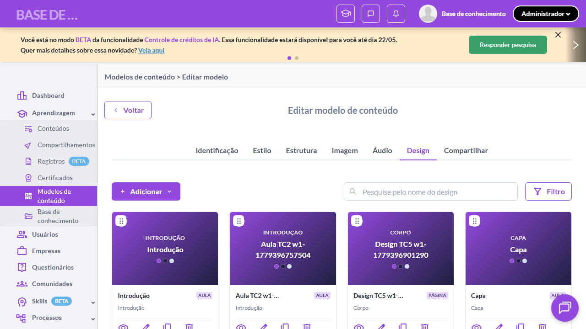

- 🎬 [Vídeo da execução (video.webm)](artifacts/projects-modelos-tests-fea-7970b-a-para-aba-Design-do-Modelo-chromium/video.webm)

- 📦 **Trace** — [`trace.zip`](artifacts/projects-modelos-tests-fea-7970b-a-para-aba-Design-do-Modelo-chromium/trace.zip)

  ```bash
  npx playwright show-trace outputs/modelos/reports/regression_20260521-180745/artifacts/projects-modelos-tests-fea-7970b-a-para-aba-Design-do-Modelo-chromium/trace.zip
  ```

- 🎥 **Vídeo** — [`video.webm`](artifacts/projects-modelos-tests-fea-7970b-a-para-aba-Design-do-Modelo-chromium/video.webm)


---

## Criação de Design de Aula

_4 caso(s) — 2 aprovado(s), 0 falha(s), 2 ignorado(s)_

### ✅ Aprovado · TC1 · Acessar criação de Aula via menu Adicionar · 🔴 Crítico

<a id="acessar-criacao-de-aula-via-menu-adicionar"></a>_Arquivo:_ `tc01-acessar-criacao-aula-via-menu.spec.ts` · _Duração:_ 21.91s · _Browser:_ chromium

**Sumário (objetivo do caso):** Validar fluxo de criação de Aula (RN 30, RN 31, RN 38).

**Pré-condições:**

```
Ambiente Stage configurado
Feature flag `modelos_de_conteudo` ativa
Modelo de teste cadastrado no setup do spec, com pelo menos 1 kit de marca selecionado
Usuário logado como Admin
```

**Passos do caso (XML/TestLink + execução Playwright):**

_Cada linha reproduz um passo do XML; a coluna **Status** traz o resultado da execução (do step Allure correspondente). Linhas com "Pré-condição" são da execução automatizada (login, navegação inicial) — não fazem parte do roteiro do XML._

| # | Ação do passo | Resultado esperado | Status | Notas | Duração |
|---|---|---|:---:|---|---:|
| 1 | Acessar a aba "Design" do modelo de teste | Aba "Design" exibe a listagem de designs. | ✅ | — | 18.28s |
| 2 | Clicar no botão "Adicionar" | Menu suspenso é exibido com as opções "Aula" e "Página". | ✅ | — | 0.33s |
| 3 | Clicar na opção "Aula" | Sistema redireciona para a tela de criação de Aula exibindo a aba "Identificação". | ✅ | — | 1.70s |

**Evidências:**

📁 _Pasta:_ [`artifacts/projects-modelos-tests-fea-56d34--de-Aula-via-menu-Adicionar-chromium/`](artifacts/projects-modelos-tests-fea-56d34--de-Aula-via-menu-Adicionar-chromium/)

- 📸 **Screenshot (screenshot)** — [`test-finished-1.png`](artifacts/projects-modelos-tests-fea-56d34--de-Aula-via-menu-Adicionar-chromium/test-finished-1.png)

  

- 🎬 [Vídeo da execução (video.webm)](artifacts/projects-modelos-tests-fea-56d34--de-Aula-via-menu-Adicionar-chromium/video.webm)

- 📦 **Trace** — [`trace.zip`](artifacts/projects-modelos-tests-fea-56d34--de-Aula-via-menu-Adicionar-chromium/trace.zip)

  ```bash
  npx playwright show-trace outputs/modelos/reports/regression_20260521-180745/artifacts/projects-modelos-tests-fea-56d34--de-Aula-via-menu-Adicionar-chromium/trace.zip
  ```

- 🎥 **Vídeo** — [`video.webm`](artifacts/projects-modelos-tests-fea-56d34--de-Aula-via-menu-Adicionar-chromium/video.webm)


---

### ✅ Aprovado · TC2 · Salvar Aula com dados válidos · 🔴 Crítico

<a id="salvar-aula-com-dados-validos"></a>_Arquivo:_ `tc02-salvar-aula-dados-validos.spec.ts` · _Duração:_ 30.01s · _Browser:_ chromium

**Sumário (objetivo do caso):** Validar criação de Aula com campos da Identificação (RN 39, RN 40).

**Pré-condições:**

```
Ambiente Stage configurado
Feature flag `modelos_de_conteudo` ativa
Modelo de teste cadastrado no setup do spec, com pelo menos 1 kit de marca selecionado
Usuário logado como Admin
```

**Passos do caso (XML/TestLink + execução Playwright):**

_Cada linha reproduz um passo do XML; a coluna **Status** traz o resultado da execução (do step Allure correspondente). Linhas com "Pré-condição" são da execução automatizada (login, navegação inicial) — não fazem parte do roteiro do XML._

| # | Ação do passo | Resultado esperado | Status | Notas | Duração |
|---|---|---|:---:|---|---:|
| — | _Pré-condição:_ 2-4. Preencher Nome + Tipo "Introdução" + Sequência | — | ✅ | — | 5.30s |
| 1 | Acessar a tela de criação de Aula com a aba "Identificação" | Aba "Identificação" é exibida. | ✅ | — | 21.71s |
| 2 | Preencher o campo "Nome" com "Aula TC2 w{workerIndex}-{timestamp}" | Campo "Nome" exibe o texto digitado. | ✅ | — | — |
| 3 | Selecionar "Introdução" no campo "Tipo" | Campos de instruções são auto-preenchidos com textos canônicos de Introdução. | ✅ | — | — |
| 4 | Preencher o campo "Sequência" com "1" | Campo "Sequência" exibe o valor digitado. | ✅ | — | — |
| 5 | Clicar no botão "Salvar" | Sistema redireciona automaticamente para a aba "Design" da Aula. | ✅ | — | 0.94s |

**Evidências:**

📁 _Pasta:_ [`artifacts/projects-modelos-tests-fea-f0989-lvar-Aula-com-dados-válidos-chromium/`](artifacts/projects-modelos-tests-fea-f0989-lvar-Aula-com-dados-válidos-chromium/)

- 📸 **Screenshot (screenshot)** — [`test-finished-1.png`](artifacts/projects-modelos-tests-fea-f0989-lvar-Aula-com-dados-válidos-chromium/test-finished-1.png)

  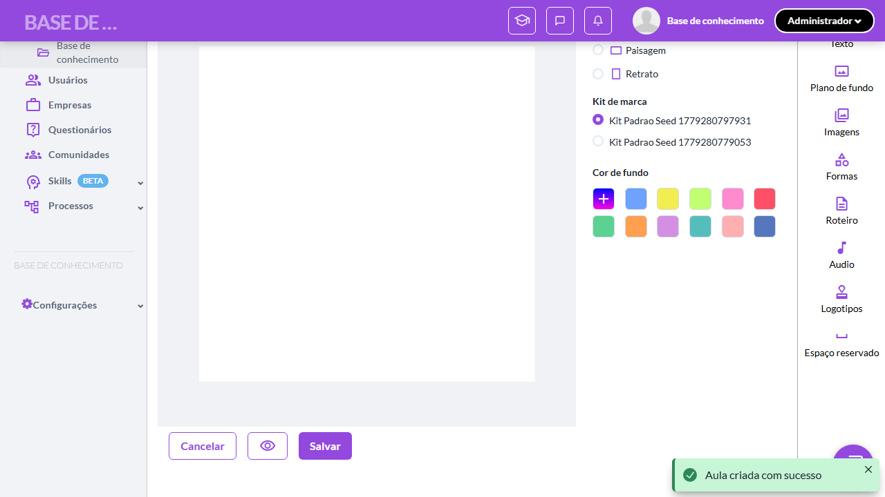

- 🎬 [Vídeo da execução (video.webm)](artifacts/projects-modelos-tests-fea-f0989-lvar-Aula-com-dados-válidos-chromium/video.webm)

- 📦 **Trace** — [`trace.zip`](artifacts/projects-modelos-tests-fea-f0989-lvar-Aula-com-dados-válidos-chromium/trace.zip)

  ```bash
  npx playwright show-trace outputs/modelos/reports/regression_20260521-180745/artifacts/projects-modelos-tests-fea-f0989-lvar-Aula-com-dados-válidos-chromium/trace.zip
  ```

- 🎥 **Vídeo** — [`video.webm`](artifacts/projects-modelos-tests-fea-f0989-lvar-Aula-com-dados-válidos-chromium/video.webm)


---

### ⊘ Ignorado · TC3 · Aba Design da Aula exibe editor padrão com customizações · 🔴 Crítico

<a id="aba-design-da-aula-exibe-editor-padrao-com-customizacoes"></a>_Arquivo:_ `tc03-aba-design-aula-editor-customizacoes.spec.ts` · _Duração:_ 0.00s · _Browser:_ chromium

> **⊘ Por que foi ignorado:** Caso ignorado pelo Playwright sem justificativa registrada (test.skip/fixme sem mensagem).

**Sumário (objetivo do caso):** Validar que a aba Design exibe o editor de Aula padrão com customizações de kit de marca (RN 41, RN 42).

**Pré-condições:**

```
Ambiente Stage configurado
Feature flag `modelos_de_conteudo` ativa
Modelo de teste cadastrado no setup do spec, com pelo menos 1 kit de marca selecionado
Usuário logado como Admin
```

**Passos do caso (XML/TestLink + execução Playwright):**

_Cada linha reproduz um passo do XML; a coluna **Status** traz o resultado da execução (do step Allure correspondente). Linhas com "Pré-condição" são da execução automatizada (login, navegação inicial) — não fazem parte do roteiro do XML._

| # | Ação do passo | Resultado esperado | Status | Notas | Duração |
|---|---|---|:---:|---|---:|
| 1 | Acessar a aba "Design" de uma Aula recém-salva | Editor de Aula padrão da plataforma é exibido. | ⊘ | Step não executado — Caso ignorado pelo Playwright sem justificativa registrada (test.skip/fixme sem mensagem). | — |
| 2 | Aguardar a ferramenta de layout com seleção de kit de marca ser renderizada | Ferramenta de layout exibe os 3 primeiros kits de marca cadastrados, com possibilidade de scroll para acessar os demais. | ⊘ | Step não executado — Caso ignorado pelo Playwright sem justificativa registrada (test.skip/fixme sem mensagem). | — |

**Evidências:**

_Sem evidências anexadas._

#### ⏳ Pendente — execução automatizada não realizada

- **Severidade do caso (XML):** Crítico
- **Motivo do skip / fixme:** Sem motivo registrado.

**Roteiro do XML (para validação manual):**
1. Pré: Ambiente Stage configurado
1. Pré: Feature flag `modelos_de_conteudo` ativa
1. Pré: Modelo de teste cadastrado no setup do spec, com pelo menos 1 kit de marca selecionado
1. Pré: Usuário logado como Admin
1. 1. Acessar a aba "Design" de uma Aula recém-salva
1. 2. Aguardar a ferramenta de layout com seleção de kit de marca ser renderizada

> Esse caso não bloqueia a build, mas precisa de validação manual ou ajuste no agente.


---

### ⊘ Ignorado · TC4 · Salvar Aula retorna para aba Design do Modelo · 🔴 Crítico

<a id="salvar-aula-retorna-para-aba-design-do-modelo"></a>_Arquivo:_ `tc04-salvar-aula-retorna-design-modelo.spec.ts` · _Duração:_ 0.00s · _Browser:_ chromium

> **⊘ Por que foi ignorado:** Caso ignorado pelo Playwright sem justificativa registrada (test.skip/fixme sem mensagem).

**Sumário (objetivo do caso):** Validar retorno à aba Design do Modelo (RN 43).

**Pré-condições:**

```
Ambiente Stage configurado
Feature flag `modelos_de_conteudo` ativa
Modelo de teste cadastrado no setup do spec, com pelo menos 1 kit de marca selecionado
Usuário logado como Admin
```

**Passos do caso (XML/TestLink + execução Playwright):**

_Cada linha reproduz um passo do XML; a coluna **Status** traz o resultado da execução (do step Allure correspondente). Linhas com "Pré-condição" são da execução automatizada (login, navegação inicial) — não fazem parte do roteiro do XML._

| # | Ação do passo | Resultado esperado | Status | Notas | Duração |
|---|---|---|:---:|---|---:|
| 1 | Acessar a aba "Design" da Aula em criação | Editor é exibido. | ⊘ | Step não executado — Caso ignorado pelo Playwright sem justificativa registrada (test.skip/fixme sem mensagem). | — |
| 2 | Clicar no botão "Salvar" da Aula | Sistema retorna para a aba "Design" do Modelo de conteúdo. | ⊘ | Step não executado — Caso ignorado pelo Playwright sem justificativa registrada (test.skip/fixme sem mensagem). | — |
| 3 | Aguardar a listagem de designs do Modelo carregar | Listagem exibe a nova Aula criada na lista de designs. | ⊘ | Step não executado — Caso ignorado pelo Playwright sem justificativa registrada (test.skip/fixme sem mensagem). | — |

**Evidências:**

_Sem evidências anexadas._

#### ⏳ Pendente — execução automatizada não realizada

- **Severidade do caso (XML):** Crítico
- **Motivo do skip / fixme:** Sem motivo registrado.

**Roteiro do XML (para validação manual):**
1. Pré: Ambiente Stage configurado
1. Pré: Feature flag `modelos_de_conteudo` ativa
1. Pré: Modelo de teste cadastrado no setup do spec, com pelo menos 1 kit de marca selecionado
1. Pré: Usuário logado como Admin
1. 1. Acessar a aba "Design" da Aula em criação
1. 2. Clicar no botão "Salvar" da Aula
1. 3. Aguardar a listagem de designs do Modelo carregar

> Esse caso não bloqueia a build, mas precisa de validação manual ou ajuste no agente.


---

## Listagem de Designs (aba Design do Modelo)

_3 caso(s) — 3 aprovado(s), 0 falha(s)_

### ✅ Aprovado · Listagem exibe elementos obrigatórios por design 

<a id="listagem-exibe-elementos-obrigatorios-por-design"></a>_Arquivo:_ `tc01-colunas-obrigatorias.spec.ts` · _Duração:_ 15.40s · _Browser:_ chromium

**Passos do caso (XML/TestLink + execução Playwright):**

_Cada linha reproduz um passo do XML; a coluna **Status** traz o resultado da execução (do step Allure correspondente). Linhas com "Pré-condição" são da execução automatizada (login, navegação inicial) — não fazem parte do roteiro do XML._

| # | Ação do passo | Resultado esperado | Status | Notas | Duração |
|---|---|---|:---:|---|---:|
| — | _Pré-condição:_ 1. Abrir aba Design do modelo | — | ✅ | — | 13.94s |
| — | _Pré-condição:_ 2. Validar que listagem renderiza pelo menos 1 design | — | ✅ | — | 0.43s |
| — | _Pré-condição:_ 3. Validar que cada card exibe os 4 elementos canônicos | — | ✅ | — | 0.02s |

**Evidências:**

📁 _Pasta:_ [`artifacts/projects-modelos-tests-fea-aaf1b-tos-obrigatórios-por-design-chromium/`](artifacts/projects-modelos-tests-fea-aaf1b-tos-obrigatórios-por-design-chromium/)

- 📸 **Screenshot (screenshot)** — [`test-finished-1.png`](artifacts/projects-modelos-tests-fea-aaf1b-tos-obrigatórios-por-design-chromium/test-finished-1.png)

  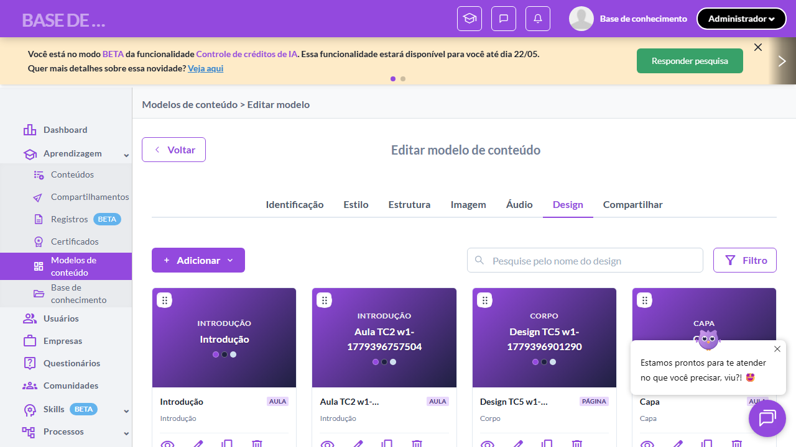

- 🎬 [Vídeo da execução (video.webm)](artifacts/projects-modelos-tests-fea-aaf1b-tos-obrigatórios-por-design-chromium/video.webm)

- 📦 **Trace** — [`trace.zip`](artifacts/projects-modelos-tests-fea-aaf1b-tos-obrigatórios-por-design-chromium/trace.zip)

  ```bash
  npx playwright show-trace outputs/modelos/reports/regression_20260521-180745/artifacts/projects-modelos-tests-fea-aaf1b-tos-obrigatórios-por-design-chromium/trace.zip
  ```

- 🎥 **Vídeo** — [`video.webm`](artifacts/projects-modelos-tests-fea-aaf1b-tos-obrigatórios-por-design-chromium/video.webm)


---

### ✅ Aprovado · TC2 · Ações da listagem de designs · 🔴 Crítico

<a id="acoes-da-listagem-de-designs"></a>_Arquivo:_ `tc02-acoes-listagem.spec.ts` · _Duração:_ 15.05s · _Browser:_ chromium

**Sumário (objetivo do caso):** Validar ações disponíveis em cada linha da listagem de designs (RN 46).

**Pré-condições:**

```
Ambiente Stage configurado
Feature flag `modelos_de_conteudo` ativa
Modelo de teste cadastrado com pelo menos 3 designs (mix de Aula e Página)
Usuário logado como Admin
```

**Passos do caso (XML/TestLink + execução Playwright):**

_Cada linha reproduz um passo do XML; a coluna **Status** traz o resultado da execução (do step Allure correspondente). Linhas com "Pré-condição" são da execução automatizada (login, navegação inicial) — não fazem parte do roteiro do XML._

| # | Ação do passo | Resultado esperado | Status | Notas | Duração |
|---|---|---|:---:|---|---:|
| 1 | Acessar a aba "Design" do modelo de teste | Listagem é exibida. | ✅ | — | 13.66s |
| 2 | Aguardar a coluna "Ações" de cada linha ser renderizada | Cada linha da listagem exibe os botões "Editar", "Duplicar" e "Excluir". | ✅ | — | 0.50s |

**Evidências:**

📁 _Pasta:_ [`artifacts/projects-modelos-tests-fea-d7a33-ções-da-listagem-de-designs-chromium/`](artifacts/projects-modelos-tests-fea-d7a33-ções-da-listagem-de-designs-chromium/)

- 📸 **Screenshot (screenshot)** — [`test-finished-1.png`](artifacts/projects-modelos-tests-fea-d7a33-ções-da-listagem-de-designs-chromium/test-finished-1.png)

  

- 🎬 [Vídeo da execução (video.webm)](artifacts/projects-modelos-tests-fea-d7a33-ções-da-listagem-de-designs-chromium/video.webm)

- 📦 **Trace** — [`trace.zip`](artifacts/projects-modelos-tests-fea-d7a33-ções-da-listagem-de-designs-chromium/trace.zip)

  ```bash
  npx playwright show-trace outputs/modelos/reports/regression_20260521-180745/artifacts/projects-modelos-tests-fea-d7a33-ções-da-listagem-de-designs-chromium/trace.zip
  ```

- 🎥 **Vídeo** — [`video.webm`](artifacts/projects-modelos-tests-fea-d7a33-ções-da-listagem-de-designs-chromium/video.webm)


---

### ✅ Aprovado · TC3 · Filtrar designs por Tipo (Aula/Página) · 🔴 Crítico

<a id="filtrar-designs-por-tipo-aula-pagina"></a>_Arquivo:_ `tc03-filtrar-designs-por-tipo.spec.ts` · _Duração:_ 15.39s · _Browser:_ chromium

**Sumário (objetivo do caso):** Validar filtro padrão "Somente aulas" (RN 50).

**Pré-condições:**

```
Ambiente Stage configurado
Feature flag `modelos_de_conteudo` ativa
Modelo de teste cadastrado com pelo menos 3 designs (mix de Aula e Página)
Usuário logado como Admin
```

**Passos do caso (XML/TestLink + execução Playwright):**

_Cada linha reproduz um passo do XML; a coluna **Status** traz o resultado da execução (do step Allure correspondente). Linhas com "Pré-condição" são da execução automatizada (login, navegação inicial) — não fazem parte do roteiro do XML._

| # | Ação do passo | Resultado esperado | Status | Notas | Duração |
|---|---|---|:---:|---|---:|
| — | _Pré-condição:_ cleanup: limpar filtro | — | ✅ | — | 0.18s |
| 1 | Clicar no botão "Filtrar" | Drawer "Filtros" é exibido com os filtros padrão "Somente páginas" e "Somente aulas". | ✅ | — | 13.06s |
| 2 | Selecionar o filtro padrão "Somente aulas" | Filtro fica marcado. | ✅ | — | 0.49s |
| 3 | Aplicar o filtro | Drawer fecha. Listagem exibe apenas designs do Tipo "Aula". | ✅ | — | 0.61s |

**Evidências:**

📁 _Pasta:_ [`artifacts/projects-modelos-tests-fea-0ec35-signs-por-Tipo-Aula-Página--chromium/`](artifacts/projects-modelos-tests-fea-0ec35-signs-por-Tipo-Aula-Página--chromium/)

- 📸 **Screenshot (screenshot)** — [`test-finished-1.png`](artifacts/projects-modelos-tests-fea-0ec35-signs-por-Tipo-Aula-Página--chromium/test-finished-1.png)

  

- 🎬 [Vídeo da execução (video.webm)](artifacts/projects-modelos-tests-fea-0ec35-signs-por-Tipo-Aula-Página--chromium/video.webm)

- 📦 **Trace** — [`trace.zip`](artifacts/projects-modelos-tests-fea-0ec35-signs-por-Tipo-Aula-Página--chromium/trace.zip)

  ```bash
  npx playwright show-trace outputs/modelos/reports/regression_20260521-180745/artifacts/projects-modelos-tests-fea-0ec35-signs-por-Tipo-Aula-Página--chromium/trace.zip
  ```

- 🎥 **Vídeo** — [`video.webm`](artifacts/projects-modelos-tests-fea-0ec35-signs-por-Tipo-Aula-Página--chromium/video.webm)


---

## Ações Duplicar e Drag and Drop

_4 caso(s) — 3 aprovado(s), 1 falha(s)_

### ❌ Falhou · TC1 · Duplicar modelo com cópia profunda · 🔴 Crítico

<a id="duplicar-modelo-com-copia-profunda"></a>_Arquivo:_ `tc01-duplicar-modelo-copia-profunda.spec.ts` · _Duração:_ 28.50s · _Browser:_ chromium

> **❌ Por que falhou:** O elemento esperado não apareceu na tela (locator: locator('.chakra-toast').filter({ hasText: 'duplicado com sucesso' }).first()).
> _Step impactado:_ **2. Clicar Duplicar (icon content_copy) do 1º modelo**

**Sumário (objetivo do caso):** Validar que duplicar modelo cria cópia profunda com nome "[Cópia] <original>" (RN 6.1).

**Pré-condições:**

```
Ambiente Stage configurado
Feature flag `modelos_de_conteudo` ativa
Modelo de teste cadastrado com pelo menos 3 designs cadastrados
Usuário logado como Admin
```

**Passos do caso (XML/TestLink + execução Playwright):**

_Cada linha reproduz um passo do XML; a coluna **Status** traz o resultado da execução (do step Allure correspondente). Linhas com "Pré-condição" são da execução automatizada (login, navegação inicial) — não fazem parte do roteiro do XML._

| # | Ação do passo | Resultado esperado | Status | Notas | Duração |
|---|---|---|:---:|---|---:|
| 1 | Acessar a listagem de modelos com o modelo de teste | Listagem é exibida. | ✅ | — | 11.64s |
| 2 | Clicar na ação "Duplicar" do modelo de teste | Toast exibida: "Modelo de conteúdo duplicado com sucesso.". | ❌ | O elemento esperado não apareceu na tela (locator: locator('.chakra-toast').filter({ hasText: 'duplicado com sucesso' }).first()). | 15.12s |
| 3 | Aguardar a listagem ser atualizada | Listagem exibe novo modelo com nome no formato "[Cópia] {nome original do modelo}", listado imediatamente. | ⊘ | Step não executado: o teste foi interrompido antes. Causa: O elemento esperado não apareceu na tela (locator: locator('.chakra-toast').filter({ hasText: 'duplicado com sucesso' }).first()).. | — |

**Evidências:**

📁 _Pasta:_ [`artifacts/projects-modelos-tests-fea-81805-r-modelo-com-cópia-profunda-chromium/`](artifacts/projects-modelos-tests-fea-81805-r-modelo-com-cópia-profunda-chromium/)

- 📸 **Screenshot (screenshot)** — [`test-failed-1.png`](artifacts/projects-modelos-tests-fea-81805-r-modelo-com-cópia-profunda-chromium/test-failed-1.png)

  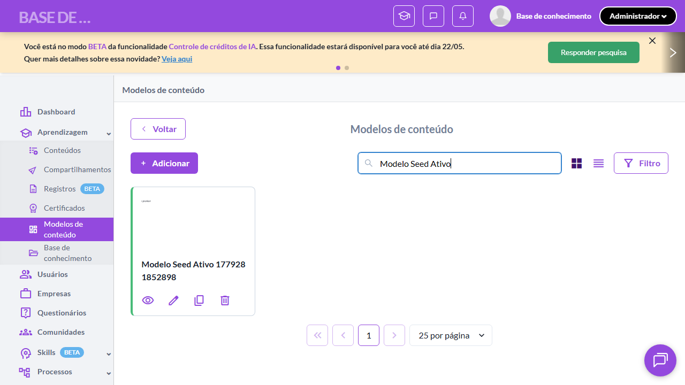

- 📸 **Screenshot (screenshot)** — [`test-failed-2.png`](artifacts/projects-modelos-tests-fea-81805-r-modelo-com-cópia-profunda-chromium/test-failed-2.png)

  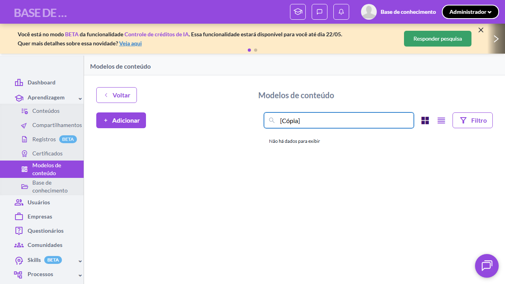

- 🎬 [Vídeo da execução (video.webm)](artifacts/projects-modelos-tests-fea-81805-r-modelo-com-cópia-profunda-chromium/video.webm)

- 📦 **Trace** — [`trace.zip`](artifacts/projects-modelos-tests-fea-81805-r-modelo-com-cópia-profunda-chromium/trace.zip)

  ```bash
  npx playwright show-trace outputs/modelos/reports/regression_20260521-180745/artifacts/projects-modelos-tests-fea-81805-r-modelo-com-cópia-profunda-chromium/trace.zip
  ```

- 🎥 **Vídeo** — [`video.webm`](artifacts/projects-modelos-tests-fea-81805-r-modelo-com-cópia-profunda-chromium/video.webm)

- 📄 **DOM no momento da falha** — [`error-context.md`](artifacts/projects-modelos-tests-fea-81805-r-modelo-com-cópia-profunda-chromium/error-context.md)

#### 🐛 Pronto para registro de bug

**Descrição do BUG:** [Crítico] Duplicar modelo com cópia profunda — O elemento esperado não apareceu na tela (locator: locator('.chakra-toast').filter({ hasText: 'duplicado com sucesso' }).first()).

**Passo a passo para reprodução:**
1. Pré: Ambiente Stage configurado
1. Pré: Feature flag `modelos_de_conteudo` ativa
1. Pré: Modelo de teste cadastrado com pelo menos 3 designs cadastrados
1. Pré: Usuário logado como Admin
1. 1. Acessar a listagem de modelos com o modelo de teste
1. 2. Clicar na ação "Duplicar" do modelo de teste
1. 3. Aguardar a listagem ser atualizada

**Comportamento esperado:** Toast exibida: "Modelo de conteúdo duplicado com sucesso.".

**Comportamento atual:** O elemento esperado não apareceu na tela (locator: locator('.chakra-toast').filter({ hasText: 'duplicado com sucesso' }).first()).

**Informações:**

| Campo | Valor |
|---|---|
| URL | `https://basedeconhecimento.stage.twygoead.com/` |
| Login | ${TWYGO_STAGING_BASE_DE_CONHECIMENTO_EMAIL} |
| Senha | ${TWYGO_STAGING_BASE_DE_CONHECIMENTO_PASSWORD} |
| orgId | 37007 |
| Outros | Browser: chromium |
| Outros | runId: regression_20260521-180745 |
| Outros | Duração até a falha: 28.50s |
| Outros | Step impactado: 2. 2. Clicar Duplicar (icon content_copy) do 1º modelo |

**Evidências:**

- Screenshot capturado pelo Playwright (screenshot): artifacts/projects-modelos-tests-fea-81805-r-modelo-com-cópia-profunda-chromium/test-failed-1.png
- Vídeo da execução (video.webm): artifacts/projects-modelos-tests-fea-81805-r-modelo-com-cópia-profunda-chromium/video.webm
- Snapshot do DOM/contexto da página (error-context.md): artifacts/projects-modelos-tests-fea-81805-r-modelo-com-cópia-profunda-chromium/error-context.md
- Screenshot capturado pelo Playwright (screenshot): artifacts/projects-modelos-tests-fea-81805-r-modelo-com-cópia-profunda-chromium/test-failed-2.png
- Snapshot do DOM/contexto da página (error-context.md): artifacts/projects-modelos-tests-fea-81805-r-modelo-com-cópia-profunda-chromium/error-context.md
- Trace completo do Playwright (.zip) — `npx playwright show-trace`: artifacts/projects-modelos-tests-fea-81805-r-modelo-com-cópia-profunda-chromium/trace.zip

<details><summary>📋 Ver texto agregado para copiar (Jira/GitHub/Linear)</summary>

```
Descrição do BUG
[Crítico] Duplicar modelo com cópia profunda — O elemento esperado não apareceu na tela (locator: locator('.chakra-toast').filter({ hasText: 'duplicado com sucesso' }).first()).

Passo a passo para reprodução
  Pré: Ambiente Stage configurado
  Pré: Feature flag `modelos_de_conteudo` ativa
  Pré: Modelo de teste cadastrado com pelo menos 3 designs cadastrados
  Pré: Usuário logado como Admin
  1. Acessar a listagem de modelos com o modelo de teste
  2. Clicar na ação "Duplicar" do modelo de teste
  3. Aguardar a listagem ser atualizada

Comportamento esperado
Toast exibida: "Modelo de conteúdo duplicado com sucesso.".

Comportamento atual
O elemento esperado não apareceu na tela (locator: locator('.chakra-toast').filter({ hasText: 'duplicado com sucesso' }).first()).

Informações
- URL: https://basedeconhecimento.stage.twygoead.com/
- Login: ${TWYGO_STAGING_BASE_DE_CONHECIMENTO_EMAIL}
- Senha: ${TWYGO_STAGING_BASE_DE_CONHECIMENTO_PASSWORD}
- ID do ambiente (orgId): 37007
- Outros:
  - Browser: chromium
  - runId: regression_20260521-180745
  - Duração até a falha: 28.50s
  - Step impactado: 2. 2. Clicar Duplicar (icon content_copy) do 1º modelo

Evidências
- Screenshot capturado pelo Playwright (screenshot): artifacts/projects-modelos-tests-fea-81805-r-modelo-com-cópia-profunda-chromium/test-failed-1.png
- Vídeo da execução (video.webm): artifacts/projects-modelos-tests-fea-81805-r-modelo-com-cópia-profunda-chromium/video.webm
- Snapshot do DOM/contexto da página (error-context.md): artifacts/projects-modelos-tests-fea-81805-r-modelo-com-cópia-profunda-chromium/error-context.md
- Screenshot capturado pelo Playwright (screenshot): artifacts/projects-modelos-tests-fea-81805-r-modelo-com-cópia-profunda-chromium/test-failed-2.png
- Snapshot do DOM/contexto da página (error-context.md): artifacts/projects-modelos-tests-fea-81805-r-modelo-com-cópia-profunda-chromium/error-context.md
- Trace completo do Playwright (.zip) — `npx playwright show-trace`: artifacts/projects-modelos-tests-fea-81805-r-modelo-com-cópia-profunda-chromium/trace.zip

Execução
- runId: regression_20260521-180745
- environment.json: staging-base-de-conhecimento
- testsuite: Ações Duplicar e Drag and Drop
- testcase: Duplicar modelo com cópia profunda

```

</details>

<details><summary>🔧 Stack trace técnica completa (para desenvolvedor)</summary>

```
Error: expect(locator).toBeVisible() failed

Locator: locator('.chakra-toast').filter({ hasText: 'duplicado com sucesso' }).first()
Expected: visible
Timeout: 15000ms
Error: element(s) not found

Call log:
  - Expect "toBeVisible" with timeout 15000ms
  - waiting for locator('.chakra-toast').filter({ hasText: 'duplicado com sucesso' }).first()

```

</details>

---

### ✅ Aprovado · TC2 · Duplicar design individual · 🔴 Crítico

<a id="duplicar-design-individual"></a>_Arquivo:_ `tc02-duplicar-design-individual.spec.ts` · _Duração:_ 20.91s · _Browser:_ chromium

**Sumário (objetivo do caso):** Validar duplicação individual de design (RN 6.1 estendido pela QA 2.2).

**Pré-condições:**

```
Ambiente Stage configurado
Feature flag `modelos_de_conteudo` ativa
Modelo de teste cadastrado com pelo menos 3 designs cadastrados
Usuário logado como Admin
```

**Passos do caso (XML/TestLink + execução Playwright):**

_Cada linha reproduz um passo do XML; a coluna **Status** traz o resultado da execução (do step Allure correspondente). Linhas com "Pré-condição" são da execução automatizada (login, navegação inicial) — não fazem parte do roteiro do XML._

| # | Ação do passo | Resultado esperado | Status | Notas | Duração |
|---|---|---|:---:|---|---:|
| 1 | Acessar a aba "Design" do modelo de teste | Listagem de designs é exibida. | ✅ | — | 18.42s |
| 2 | Clicar na ação "Duplicar" de um design existente | Listagem atualiza exibindo cópia do design com nome no formato "[Cópia] {nome original do design}". | ✅ | — | 0.90s |

**Evidências:**

📁 _Pasta:_ [`artifacts/projects-modelos-tests-fea-58f7a--Duplicar-design-individual-chromium/`](artifacts/projects-modelos-tests-fea-58f7a--Duplicar-design-individual-chromium/)

- 📸 **Screenshot (screenshot)** — [`test-finished-1.png`](artifacts/projects-modelos-tests-fea-58f7a--Duplicar-design-individual-chromium/test-finished-1.png)

  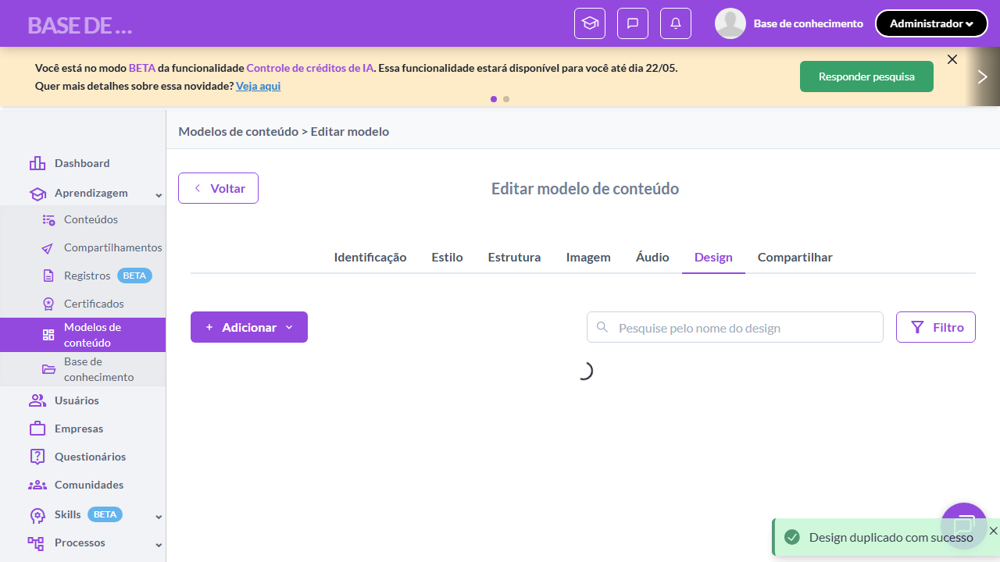

- 🎬 [Vídeo da execução (video.webm)](artifacts/projects-modelos-tests-fea-58f7a--Duplicar-design-individual-chromium/video.webm)

- 📦 **Trace** — [`trace.zip`](artifacts/projects-modelos-tests-fea-58f7a--Duplicar-design-individual-chromium/trace.zip)

  ```bash
  npx playwright show-trace outputs/modelos/reports/regression_20260521-180745/artifacts/projects-modelos-tests-fea-58f7a--Duplicar-design-individual-chromium/trace.zip
  ```

- 🎥 **Vídeo** — [`video.webm`](artifacts/projects-modelos-tests-fea-58f7a--Duplicar-design-individual-chromium/video.webm)


---

### ✅ Aprovado · Drag and drop reorder designs 

<a id="drag-and-drop-reorder-designs"></a>_Arquivo:_ `tc03-drag-drop-reorder-designs.spec.ts` · _Duração:_ 24.58s · _Browser:_ chromium

**Passos do caso (XML/TestLink + execução Playwright):**

_Cada linha reproduz um passo do XML; a coluna **Status** traz o resultado da execução (do step Allure correspondente). Linhas com "Pré-condição" são da execução automatizada (login, navegação inicial) — não fazem parte do roteiro do XML._

| # | Ação do passo | Resultado esperado | Status | Notas | Duração |
|---|---|---|:---:|---|---:|
| — | _Pré-condição:_ 1. Acessar aba Design com pelo menos 2 designs | — | ✅ | — | 20.52s |
| — | _Pré-condição:_ 2. Arrastar 2º design pra primeira posição via drag handle | — | ✅ | — | 2.44s |

**Evidências:**

📁 _Pasta:_ [`artifacts/projects-modelos-tests-fea-39e1a-ag-and-drop-reorder-designs-chromium/`](artifacts/projects-modelos-tests-fea-39e1a-ag-and-drop-reorder-designs-chromium/)

- 📸 **Screenshot (screenshot)** — [`test-finished-1.png`](artifacts/projects-modelos-tests-fea-39e1a-ag-and-drop-reorder-designs-chromium/test-finished-1.png)

  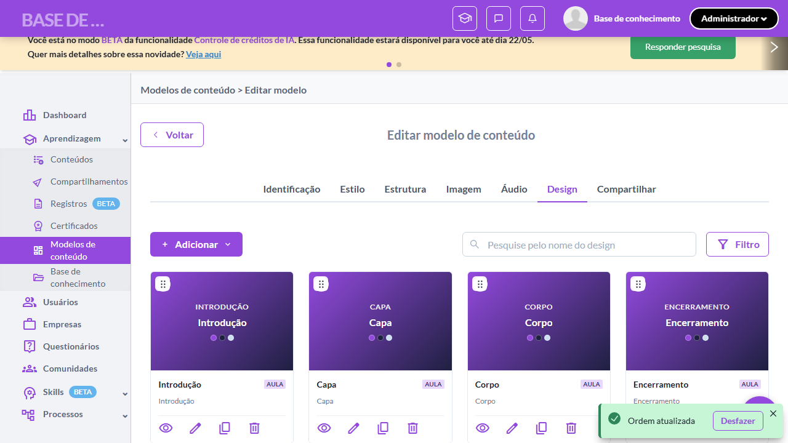

- 🎬 [Vídeo da execução (video.webm)](artifacts/projects-modelos-tests-fea-39e1a-ag-and-drop-reorder-designs-chromium/video.webm)

- 📦 **Trace** — [`trace.zip`](artifacts/projects-modelos-tests-fea-39e1a-ag-and-drop-reorder-designs-chromium/trace.zip)

  ```bash
  npx playwright show-trace outputs/modelos/reports/regression_20260521-180745/artifacts/projects-modelos-tests-fea-39e1a-ag-and-drop-reorder-designs-chromium/trace.zip
  ```

- 🎥 **Vídeo** — [`video.webm`](artifacts/projects-modelos-tests-fea-39e1a-ag-and-drop-reorder-designs-chromium/video.webm)


---

### ✅ Aprovado · TC4 · Drag and drop desabilitado quando filtro ativo · 🔴 Crítico

<a id="drag-and-drop-desabilitado-quando-filtro-ativo"></a>_Arquivo:_ `tc04-drag-drop-desabilitado-com-filtro.spec.ts` · _Duração:_ 22.98s · _Browser:_ chromium

**Sumário (objetivo do caso):** Validar que drag and drop fica desabilitado com filtro ativo (RN 63.1).

**Pré-condições:**

```
Ambiente Stage configurado
Feature flag `modelos_de_conteudo` ativa
Modelo de teste cadastrado com pelo menos 3 designs cadastrados
Usuário logado como Admin
```

**Passos do caso (XML/TestLink + execução Playwright):**

_Cada linha reproduz um passo do XML; a coluna **Status** traz o resultado da execução (do step Allure correspondente). Linhas com "Pré-condição" são da execução automatizada (login, navegação inicial) — não fazem parte do roteiro do XML._

| # | Ação do passo | Resultado esperado | Status | Notas | Duração |
|---|---|---|:---:|---|---:|
| — | _Pré-condição:_ cleanup: limpar filtro | — | ✅ | — | 0.10s |
| 1 | Acessar a aba "Design" do modelo de teste | Listagem é exibida. | ✅ | — | 21.23s |
| 2 | Aplicar o filtro padrão "Somente páginas" | Listagem exibe apenas designs do Tipo Página. | ✅ | — | 0.04s |
| 3 | Aguardar o ícone de drag ser renderizado | Ícone de drag exibido em estado desabilitado nas linhas/cards da listagem filtrada. | ✅ | — | — |

**Evidências:**

📁 _Pasta:_ [`artifacts/projects-modelos-tests-fea-0eadb-ilitado-quando-filtro-ativo-chromium/`](artifacts/projects-modelos-tests-fea-0eadb-ilitado-quando-filtro-ativo-chromium/)

- 📸 **Screenshot (screenshot)** — [`test-finished-1.png`](artifacts/projects-modelos-tests-fea-0eadb-ilitado-quando-filtro-ativo-chromium/test-finished-1.png)

  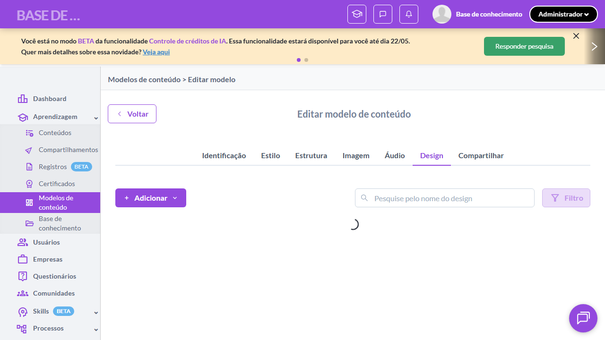

- 🎬 [Vídeo da execução (video.webm)](artifacts/projects-modelos-tests-fea-0eadb-ilitado-quando-filtro-ativo-chromium/video.webm)

- 📦 **Trace** — [`trace.zip`](artifacts/projects-modelos-tests-fea-0eadb-ilitado-quando-filtro-ativo-chromium/trace.zip)

  ```bash
  npx playwright show-trace outputs/modelos/reports/regression_20260521-180745/artifacts/projects-modelos-tests-fea-0eadb-ilitado-quando-filtro-ativo-chromium/trace.zip
  ```

- 🎥 **Vídeo** — [`video.webm`](artifacts/projects-modelos-tests-fea-0eadb-ilitado-quando-filtro-ativo-chromium/video.webm)


---

## Preview de Modelos e Designs

_4 caso(s) — 3 aprovado(s), 1 falha(s)_

### ✅ Aprovado · TC1 · Abrir Preview de Modelo via card · 🔴 Crítico

<a id="abrir-preview-de-modelo-via-card"></a>_Arquivo:_ `tc01-abrir-preview-modelo-via-card.spec.ts` · _Duração:_ 13.02s · _Browser:_ chromium

**Sumário (objetivo do caso):** Validar abertura do modal carrossel de preview do modelo (RN 5.2).

**Pré-condições:**

```
Ambiente Stage configurado
Feature flag `modelos_de_conteudo` ativa
Modelo de teste cadastrado com pelo menos 2 designs com previews gerados (1 Aula e 1 Página)
Usuário logado como Admin
```

**Passos do caso (XML/TestLink + execução Playwright):**

_Cada linha reproduz um passo do XML; a coluna **Status** traz o resultado da execução (do step Allure correspondente). Linhas com "Pré-condição" são da execução automatizada (login, navegação inicial) — não fazem parte do roteiro do XML._

| # | Ação do passo | Resultado esperado | Status | Notas | Duração |
|---|---|---|:---:|---|---:|
| 1 | Acessar a listagem de modelos em visualização Cards | Listagem é exibida. | ✅ | — | 10.37s |
| 2 | Clicar na ação "Preview" do modelo de teste | Modal de preview é exibido com carrossel contendo o primeiro design. | ✅ | — | 1.44s |

**Evidências:**

📁 _Pasta:_ [`artifacts/projects-modelos-tests-fea-b2a65--Preview-de-Modelo-via-card-chromium/`](artifacts/projects-modelos-tests-fea-b2a65--Preview-de-Modelo-via-card-chromium/)

- 📸 **Screenshot (screenshot)** — [`test-finished-1.png`](artifacts/projects-modelos-tests-fea-b2a65--Preview-de-Modelo-via-card-chromium/test-finished-1.png)

  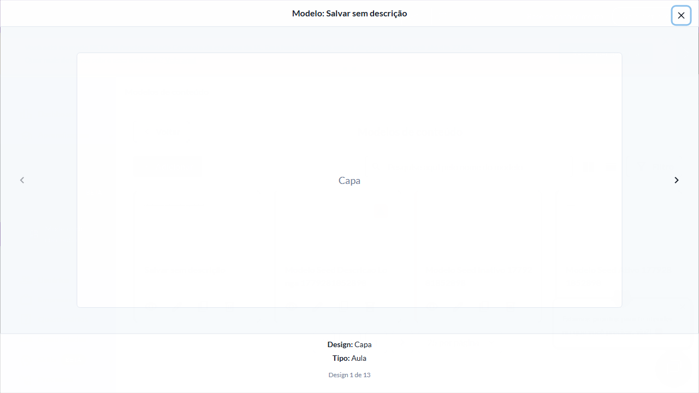

- 🎬 [Vídeo da execução (video.webm)](artifacts/projects-modelos-tests-fea-b2a65--Preview-de-Modelo-via-card-chromium/video.webm)

- 📦 **Trace** — [`trace.zip`](artifacts/projects-modelos-tests-fea-b2a65--Preview-de-Modelo-via-card-chromium/trace.zip)

  ```bash
  npx playwright show-trace outputs/modelos/reports/regression_20260521-180745/artifacts/projects-modelos-tests-fea-b2a65--Preview-de-Modelo-via-card-chromium/trace.zip
  ```

- 🎥 **Vídeo** — [`video.webm`](artifacts/projects-modelos-tests-fea-b2a65--Preview-de-Modelo-via-card-chromium/video.webm)


---

### ❌ Falhou · TC2 · Conteúdo de cada item do carrossel · 🔴 Crítico

<a id="conteudo-de-cada-item-do-carrossel"></a>_Arquivo:_ `tc02-conteudo-carrossel.spec.ts` · _Duração:_ 23.35s · _Browser:_ chromium

> **❌ Por que falhou:** O elemento esperado não apareceu na tela (locator: locator('[data-test-id="content-models-preview-modal-image"]')).
> _Step impactado:_ **2. Validar elementos do slide: Modelo:, Design:, Tipo:, indicador X de Y**

**Sumário (objetivo do caso):** Validar campos exibidos em cada slide do carrossel (RN 5.2).

**Pré-condições:**

```
Ambiente Stage configurado
Feature flag `modelos_de_conteudo` ativa
Modelo de teste cadastrado com pelo menos 2 designs com previews gerados (1 Aula e 1 Página)
Usuário logado como Admin
```

**Passos do caso (XML/TestLink + execução Playwright):**

_Cada linha reproduz um passo do XML; a coluna **Status** traz o resultado da execução (do step Allure correspondente). Linhas com "Pré-condição" são da execução automatizada (login, navegação inicial) — não fazem parte do roteiro do XML._

| # | Ação do passo | Resultado esperado | Status | Notas | Duração |
|---|---|---|:---:|---|---:|
| 1 | Abrir o modal de Preview do modelo de teste | Modal exibe o primeiro slide do carrossel. | ✅ | — | 11.80s |
| 2 | Aguardar a renderização do slide | Slide exibe: texto "Modelo: {nome do modelo}", Thumb do design, texto "Design: {nome do design}", texto "Tipo: {Aula ou Página}", texto "Prompt: {prosa de instruções}", indicador "Design 1 de 2". | ❌ | O elemento esperado não apareceu na tela (locator: locator('[data-test-id="content-models-preview-modal-image"]')). | 10.16s |

**Evidências:**

📁 _Pasta:_ [`artifacts/projects-modelos-tests-fea-4071c-o-de-cada-item-do-carrossel-chromium/`](artifacts/projects-modelos-tests-fea-4071c-o-de-cada-item-do-carrossel-chromium/)

- 📸 **Screenshot (screenshot)** — [`test-failed-1.png`](artifacts/projects-modelos-tests-fea-4071c-o-de-cada-item-do-carrossel-chromium/test-failed-1.png)

  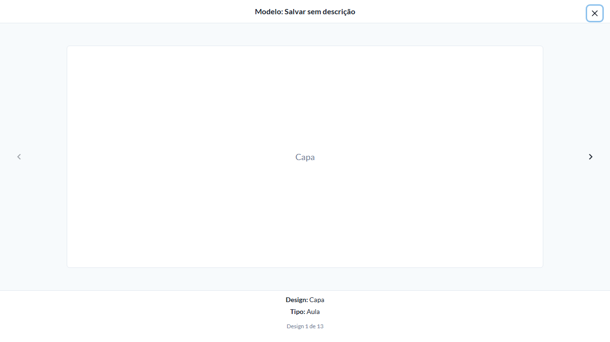

- 🎬 [Vídeo da execução (video.webm)](artifacts/projects-modelos-tests-fea-4071c-o-de-cada-item-do-carrossel-chromium/video.webm)

- 📦 **Trace** — [`trace.zip`](artifacts/projects-modelos-tests-fea-4071c-o-de-cada-item-do-carrossel-chromium/trace.zip)

  ```bash
  npx playwright show-trace outputs/modelos/reports/regression_20260521-180745/artifacts/projects-modelos-tests-fea-4071c-o-de-cada-item-do-carrossel-chromium/trace.zip
  ```

- 🎥 **Vídeo** — [`video.webm`](artifacts/projects-modelos-tests-fea-4071c-o-de-cada-item-do-carrossel-chromium/video.webm)

- 📄 **DOM no momento da falha** — [`error-context.md`](artifacts/projects-modelos-tests-fea-4071c-o-de-cada-item-do-carrossel-chromium/error-context.md)

#### 🐛 Pronto para registro de bug

**Descrição do BUG:** [Crítico] Conteúdo de cada item do carrossel — O elemento esperado não apareceu na tela (locator: locator('[data-test-id="content-models-preview-modal-image"]')).

**Passo a passo para reprodução:**
1. Pré: Ambiente Stage configurado
1. Pré: Feature flag `modelos_de_conteudo` ativa
1. Pré: Modelo de teste cadastrado com pelo menos 2 designs com previews gerados (1 Aula e 1 Página)
1. Pré: Usuário logado como Admin
1. 1. Abrir o modal de Preview do modelo de teste
1. 2. Aguardar a renderização do slide

**Comportamento esperado:** Slide exibe: texto "Modelo: {nome do modelo}", Thumb do design, texto "Design: {nome do design}", texto "Tipo: {Aula ou Página}", texto "Prompt: {prosa de instruções}", indicador "Design 1 de 2".

**Comportamento atual:** O elemento esperado não apareceu na tela (locator: locator('[data-test-id="content-models-preview-modal-image"]')).

**Informações:**

| Campo | Valor |
|---|---|
| URL | `https://basedeconhecimento.stage.twygoead.com/` |
| Login | ${TWYGO_STAGING_BASE_DE_CONHECIMENTO_EMAIL} |
| Senha | ${TWYGO_STAGING_BASE_DE_CONHECIMENTO_PASSWORD} |
| orgId | 37007 |
| Outros | Browser: chromium |
| Outros | runId: regression_20260521-180745 |
| Outros | Duração até a falha: 23.35s |
| Outros | Step impactado: 2. 2. Validar elementos do slide: Modelo:, Design:, Tipo:, indicador X de Y |

**Evidências:**

- Screenshot capturado pelo Playwright (screenshot): artifacts/projects-modelos-tests-fea-4071c-o-de-cada-item-do-carrossel-chromium/test-failed-1.png
- Vídeo da execução (video.webm): artifacts/projects-modelos-tests-fea-4071c-o-de-cada-item-do-carrossel-chromium/video.webm
- Snapshot do DOM/contexto da página (error-context.md): artifacts/projects-modelos-tests-fea-4071c-o-de-cada-item-do-carrossel-chromium/error-context.md
- Trace completo do Playwright (.zip) — `npx playwright show-trace`: artifacts/projects-modelos-tests-fea-4071c-o-de-cada-item-do-carrossel-chromium/trace.zip

<details><summary>📋 Ver texto agregado para copiar (Jira/GitHub/Linear)</summary>

```
Descrição do BUG
[Crítico] Conteúdo de cada item do carrossel — O elemento esperado não apareceu na tela (locator: locator('[data-test-id="content-models-preview-modal-image"]')).

Passo a passo para reprodução
  Pré: Ambiente Stage configurado
  Pré: Feature flag `modelos_de_conteudo` ativa
  Pré: Modelo de teste cadastrado com pelo menos 2 designs com previews gerados (1 Aula e 1 Página)
  Pré: Usuário logado como Admin
  1. Abrir o modal de Preview do modelo de teste
  2. Aguardar a renderização do slide

Comportamento esperado
Slide exibe: texto "Modelo: {nome do modelo}", Thumb do design, texto "Design: {nome do design}", texto "Tipo: {Aula ou Página}", texto "Prompt: {prosa de instruções}", indicador "Design 1 de 2".

Comportamento atual
O elemento esperado não apareceu na tela (locator: locator('[data-test-id="content-models-preview-modal-image"]')).

Informações
- URL: https://basedeconhecimento.stage.twygoead.com/
- Login: ${TWYGO_STAGING_BASE_DE_CONHECIMENTO_EMAIL}
- Senha: ${TWYGO_STAGING_BASE_DE_CONHECIMENTO_PASSWORD}
- ID do ambiente (orgId): 37007
- Outros:
  - Browser: chromium
  - runId: regression_20260521-180745
  - Duração até a falha: 23.35s
  - Step impactado: 2. 2. Validar elementos do slide: Modelo:, Design:, Tipo:, indicador X de Y

Evidências
- Screenshot capturado pelo Playwright (screenshot): artifacts/projects-modelos-tests-fea-4071c-o-de-cada-item-do-carrossel-chromium/test-failed-1.png
- Vídeo da execução (video.webm): artifacts/projects-modelos-tests-fea-4071c-o-de-cada-item-do-carrossel-chromium/video.webm
- Snapshot do DOM/contexto da página (error-context.md): artifacts/projects-modelos-tests-fea-4071c-o-de-cada-item-do-carrossel-chromium/error-context.md
- Trace completo do Playwright (.zip) — `npx playwright show-trace`: artifacts/projects-modelos-tests-fea-4071c-o-de-cada-item-do-carrossel-chromium/trace.zip

Execução
- runId: regression_20260521-180745
- environment.json: staging-base-de-conhecimento
- testsuite: Preview de Modelos e Designs
- testcase: Conteúdo de cada item do carrossel

```

</details>

<details><summary>🔧 Stack trace técnica completa (para desenvolvedor)</summary>

```
Error: expect(locator).toBeVisible() failed

Locator: locator('[data-test-id="content-models-preview-modal-image"]')
Expected: visible
Timeout: 10000ms
Error: element(s) not found

Call log:
  - Expect "toBeVisible" with timeout 10000ms
  - waiting for locator('[data-test-id="content-models-preview-modal-image"]')

```

</details>

---

### ✅ Aprovado · TC3 · Navegar entre slides no carrossel · 🔴 Crítico

<a id="navegar-entre-slides-no-carrossel"></a>_Arquivo:_ `tc03-navegar-entre-slides.spec.ts` · _Duração:_ 13.89s · _Browser:_ chromium

**Sumário (objetivo do caso):** Validar navegação entre slides (RN 5.2).

**Pré-condições:**

```
Ambiente Stage configurado
Feature flag `modelos_de_conteudo` ativa
Modelo de teste cadastrado com pelo menos 2 designs com previews gerados (1 Aula e 1 Página)
Usuário logado como Admin
```

**Passos do caso (XML/TestLink + execução Playwright):**

_Cada linha reproduz um passo do XML; a coluna **Status** traz o resultado da execução (do step Allure correspondente). Linhas com "Pré-condição" são da execução automatizada (login, navegação inicial) — não fazem parte do roteiro do XML._

| # | Ação do passo | Resultado esperado | Status | Notas | Duração |
|---|---|---|:---:|---|---:|
| 1 | Abrir o modal de Preview do modelo de teste | Modal exibe "Design 1 de 2". | ✅ | — | 11.40s |
| 2 | Clicar no botão de navegação "Próximo" do carrossel | Modal exibe o slide seguinte com indicador "Design 2 de 2". | ✅ | — | 1.14s |

**Evidências:**

📁 _Pasta:_ [`artifacts/projects-modelos-tests-fea-dda88-r-entre-slides-no-carrossel-chromium/`](artifacts/projects-modelos-tests-fea-dda88-r-entre-slides-no-carrossel-chromium/)

- 📸 **Screenshot (screenshot)** — [`test-finished-1.png`](artifacts/projects-modelos-tests-fea-dda88-r-entre-slides-no-carrossel-chromium/test-finished-1.png)

  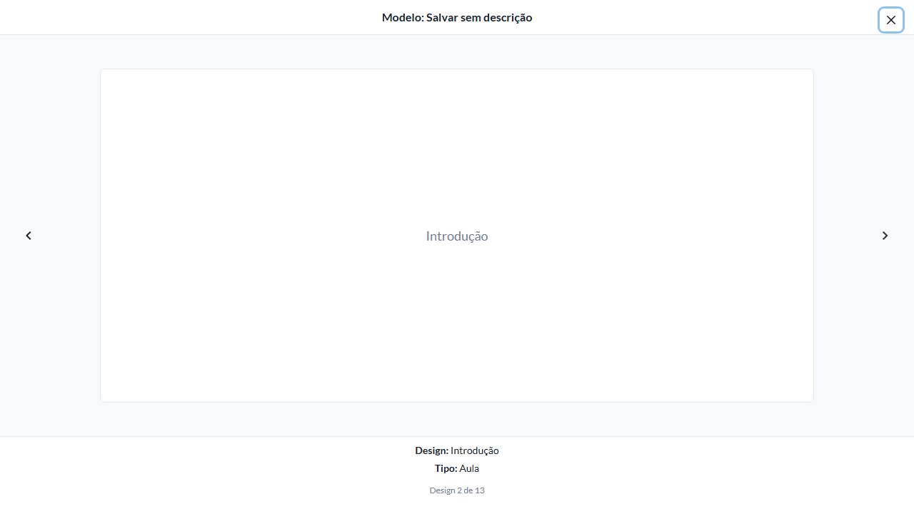

- 🎬 [Vídeo da execução (video.webm)](artifacts/projects-modelos-tests-fea-dda88-r-entre-slides-no-carrossel-chromium/video.webm)

- 📦 **Trace** — [`trace.zip`](artifacts/projects-modelos-tests-fea-dda88-r-entre-slides-no-carrossel-chromium/trace.zip)

  ```bash
  npx playwright show-trace outputs/modelos/reports/regression_20260521-180745/artifacts/projects-modelos-tests-fea-dda88-r-entre-slides-no-carrossel-chromium/trace.zip
  ```

- 🎥 **Vídeo** — [`video.webm`](artifacts/projects-modelos-tests-fea-dda88-r-entre-slides-no-carrossel-chromium/video.webm)


---

### ✅ Aprovado · TC4 · Preview de Design tipo Página tem zoom com scroll · 🟡 Normal

<a id="preview-de-design-tipo-pagina-tem-zoom-com-scroll"></a>_Arquivo:_ `tc04-preview-pagina-zoom-scroll.spec.ts` · _Duração:_ 14.37s · _Browser:_ chromium

**Sumário (objetivo do caso):** Validar opção de zoom com scroll apenas em designs do tipo Página (RN 5.2).

**Pré-condições:**

```
Ambiente Stage configurado
Feature flag `modelos_de_conteudo` ativa
Modelo de teste cadastrado com pelo menos 2 designs com previews gerados (1 Aula e 1 Página)
Usuário logado como Admin
```

**Passos do caso (XML/TestLink + execução Playwright):**

_Cada linha reproduz um passo do XML; a coluna **Status** traz o resultado da execução (do step Allure correspondente). Linhas com "Pré-condição" são da execução automatizada (login, navegação inicial) — não fazem parte do roteiro do XML._

| # | Ação do passo | Resultado esperado | Status | Notas | Duração |
|---|---|---|:---:|---|---:|
| — | _Pré-condição:_ 3. Validar controles de zoom (aria-label Aumentar/Diminuir) | — | ✅ | — | 0.07s |
| 1 | Abrir o modal de Preview de um design tipo Página | Modal exibe o preview da Página. | ✅ | — | 10.91s |
| 2 | Aguardar a opção de zoom ser renderizada | Componente de zoom com scroll é exibido sobre o preview da Página. | ✅ | — | 2.18s |

**Evidências:**

📁 _Pasta:_ [`artifacts/projects-modelos-tests-fea-57886--Página-tem-zoom-com-scroll-chromium/`](artifacts/projects-modelos-tests-fea-57886--Página-tem-zoom-com-scroll-chromium/)

- 📸 **Screenshot (screenshot)** — [`test-finished-1.png`](artifacts/projects-modelos-tests-fea-57886--Página-tem-zoom-com-scroll-chromium/test-finished-1.png)

  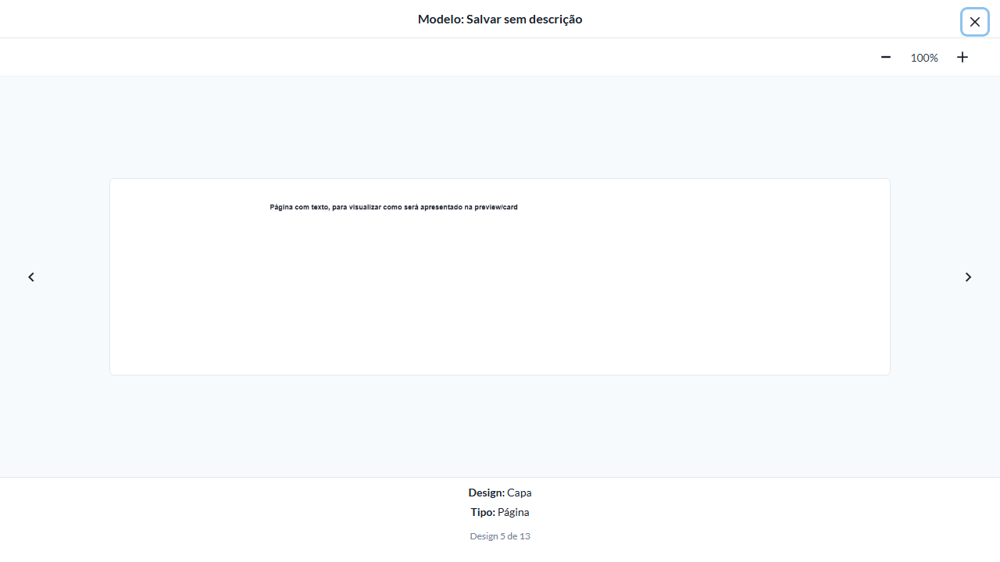

- 🎬 [Vídeo da execução (video.webm)](artifacts/projects-modelos-tests-fea-57886--Página-tem-zoom-com-scroll-chromium/video.webm)

- 📦 **Trace** — [`trace.zip`](artifacts/projects-modelos-tests-fea-57886--Página-tem-zoom-com-scroll-chromium/trace.zip)

  ```bash
  npx playwright show-trace outputs/modelos/reports/regression_20260521-180745/artifacts/projects-modelos-tests-fea-57886--Página-tem-zoom-com-scroll-chromium/trace.zip
  ```

- 🎥 **Vídeo** — [`video.webm`](artifacts/projects-modelos-tests-fea-57886--Página-tem-zoom-com-scroll-chromium/video.webm)


---

## Sincronização e Regeração de Previews

_3 caso(s) — 0 aprovado(s), 0 falha(s), 3 ignorado(s)_

### ⊘ Ignorado · Alterar Kit de Marca exibe ícone de alerta nos designs 

<a id="alterar-kit-de-marca-exibe-icone-de-alerta-nos-designs"></a>_Arquivo:_ `tc01-alterar-kit-exibe-alerta.spec.ts` · _Duração:_ 0.00s · _Browser:_ chromium

> **⊘ Por que foi ignorado:** Caso ignorado pelo Playwright sem justificativa registrada (test.skip/fixme sem mensagem).

**Passos do caso (XML/TestLink + execução Playwright):**

_Cada linha reproduz um passo do XML; a coluna **Status** traz o resultado da execução (do step Allure correspondente). Linhas com "Pré-condição" são da execução automatizada (login, navegação inicial) — não fazem parte do roteiro do XML._

_Sem steps Allure ou metadata XML para este testcase._

**Evidências:**

_Sem evidências anexadas._

#### ⏳ Pendente — execução automatizada não realizada

- **Severidade do caso (XML):** —
- **Motivo do skip / fixme:** Sem motivo registrado.

**Roteiro do XML (para validação manual):**
1. — (sem steps documentados no XML)

> Esse caso não bloqueia a build, mas precisa de validação manual ou ajuste no agente.


---

### ⊘ Ignorado · TC2 · Botão "Regerar todos" exibe tooltip correto · 🔴 Crítico

<a id="botao-regerar-todos-exibe-tooltip-correto"></a>_Arquivo:_ `tc02-botao-regerar-todos-tooltip.spec.ts` · _Duração:_ 0.00s · _Browser:_ chromium

> **⊘ Por que foi ignorado:** Caso ignorado pelo Playwright sem justificativa registrada (test.skip/fixme sem mensagem).

**Sumário (objetivo do caso):** Validar exibição do botão "Regerar todos" na aba Design com tooltip literal (RN 59.2, RN 59.3).

**Pré-condições:**

```
Ambiente Stage configurado
Feature flag `modelos_de_conteudo` ativa
Modelo de teste cadastrado com pelo menos 1 design e Kit de Marca selecionado
Pelo menos 2 kits de marca distintos cadastrados na organização
Usuário logado como Admin
```

**Passos do caso (XML/TestLink + execução Playwright):**

_Cada linha reproduz um passo do XML; a coluna **Status** traz o resultado da execução (do step Allure correspondente). Linhas com "Pré-condição" são da execução automatizada (login, navegação inicial) — não fazem parte do roteiro do XML._

| # | Ação do passo | Resultado esperado | Status | Notas | Duração |
|---|---|---|:---:|---|---:|
| 1 | Acessar a aba "Design" do modelo após alteração de kit de marca | Aba "Design" exibe a listagem de designs e o botão "Regerar todos". | ⊘ | Step não executado — Caso ignorado pelo Playwright sem justificativa registrada (test.skip/fixme sem mensagem). | — |
| 2 | Aguardar a tooltip do botão "Regerar todos" ser exibida ao posicionar o mouse | Tooltip exibida: "O kit de marca foi alterado. Clique em 'Regerar todos' para atualizar todos os designs com as novas configurações de cores e fontes.". | ⊘ | Step não executado — Caso ignorado pelo Playwright sem justificativa registrada (test.skip/fixme sem mensagem). | — |

**Evidências:**

_Sem evidências anexadas._

#### ⏳ Pendente — execução automatizada não realizada

- **Severidade do caso (XML):** Crítico
- **Motivo do skip / fixme:** Sem motivo registrado.

**Roteiro do XML (para validação manual):**
1. Pré: Ambiente Stage configurado
1. Pré: Feature flag `modelos_de_conteudo` ativa
1. Pré: Modelo de teste cadastrado com pelo menos 1 design e Kit de Marca selecionado
1. Pré: Pelo menos 2 kits de marca distintos cadastrados na organização
1. Pré: Usuário logado como Admin
1. 1. Acessar a aba "Design" do modelo após alteração de kit de marca
1. 2. Aguardar a tooltip do botão "Regerar todos" ser exibida ao posicionar o mouse

> Esse caso não bloqueia a build, mas precisa de validação manual ou ajuste no agente.


---

### ⊘ Ignorado · TC3 · Clicar "Regerar todos" inicia processo assíncrono · 🔴 Crítico

<a id="clicar-regerar-todos-inicia-processo-assincrono"></a>_Arquivo:_ `tc03-clicar-regerar-todos-toast.spec.ts` · _Duração:_ 0.00s · _Browser:_ chromium

> **⊘ Por que foi ignorado:** Caso ignorado pelo Playwright sem justificativa registrada (test.skip/fixme sem mensagem).

**Sumário (objetivo do caso):** Validar inicio do processo de regeração com toast (RN 59.4).

**Pré-condições:**

```
Ambiente Stage configurado
Feature flag `modelos_de_conteudo` ativa
Modelo de teste cadastrado com pelo menos 1 design e Kit de Marca selecionado
Pelo menos 2 kits de marca distintos cadastrados na organização
Usuário logado como Admin
```

**Passos do caso (XML/TestLink + execução Playwright):**

_Cada linha reproduz um passo do XML; a coluna **Status** traz o resultado da execução (do step Allure correspondente). Linhas com "Pré-condição" são da execução automatizada (login, navegação inicial) — não fazem parte do roteiro do XML._

| # | Ação do passo | Resultado esperado | Status | Notas | Duração |
|---|---|---|:---:|---|---:|
| 1 | Acessar a aba "Design" do modelo após alteração de kit de marca | Botão "Regerar todos" é exibido. | ⊘ | Step não executado — Caso ignorado pelo Playwright sem justificativa registrada (test.skip/fixme sem mensagem). | — |
| 2 | Clicar no botão "Regerar todos" | Toast exibida: "A regeração dos designs foi iniciada. Você será notificado quando for concluída.". | ⊘ | Step não executado — Caso ignorado pelo Playwright sem justificativa registrada (test.skip/fixme sem mensagem). | — |

**Evidências:**

_Sem evidências anexadas._

#### ⏳ Pendente — execução automatizada não realizada

- **Severidade do caso (XML):** Crítico
- **Motivo do skip / fixme:** Sem motivo registrado.

**Roteiro do XML (para validação manual):**
1. Pré: Ambiente Stage configurado
1. Pré: Feature flag `modelos_de_conteudo` ativa
1. Pré: Modelo de teste cadastrado com pelo menos 1 design e Kit de Marca selecionado
1. Pré: Pelo menos 2 kits de marca distintos cadastrados na organização
1. Pré: Usuário logado como Admin
1. 1. Acessar a aba "Design" do modelo após alteração de kit de marca
1. 2. Clicar no botão "Regerar todos"

> Esse caso não bloqueia a build, mas precisa de validação manual ou ajuste no agente.


---

## Bloqueio Exclusão Cores Kit de Marca

_2 caso(s) — 2 aprovado(s), 0 falha(s)_

### ✅ Aprovado · TC1 · Bloqueio de exclusão de cor em uso por modelo · 🔴 Crítico

<a id="bloqueio-de-exclusao-de-cor-em-uso-por-modelo"></a>_Arquivo:_ `tc01-bloqueio-cor-em-uso.spec.ts` · _Duração:_ 25.23s · _Browser:_ chromium

**Sumário (objetivo do caso):** Validar que cor de kit de marca em uso por modelo não pode ser excluída (RN 64).

**Pré-condições:**

```
Ambiente Stage configurado
Feature flag `modelos_de_conteudo` ativa
Kit de marca cadastrado e associado a pelo menos 1 modelo de conteúdo
Usuário logado como Admin
```

**Passos do caso (XML/TestLink + execução Playwright):**

_Cada linha reproduz um passo do XML; a coluna **Status** traz o resultado da execução (do step Allure correspondente). Linhas com "Pré-condição" são da execução automatizada (login, navegação inicial) — não fazem parte do roteiro do XML._

| # | Ação do passo | Resultado esperado | Status | Notas | Duração |
|---|---|---|:---:|---|---:|
| 1 | Acessar a tela de edição do kit de marca utilizado pelo modelo de teste | Tela de edição é exibida com as cores cadastradas. | ✅ | — | 18.91s |
| 2 | Clicar no botão de excluir da cor que está em uso pelo modelo | Mensagem de bloqueio exibida indicando que a cor está em uso por um ou mais modelos de conteúdo. Cor NÃO é excluída. | ✅ | — | 4.89s |

**Evidências:**

📁 _Pasta:_ [`artifacts/projects-modelos-tests-fea-c7334-ão-de-cor-em-uso-por-modelo-chromium/`](artifacts/projects-modelos-tests-fea-c7334-ão-de-cor-em-uso-por-modelo-chromium/)

- 📸 **Screenshot (screenshot)** — [`test-finished-1.png`](artifacts/projects-modelos-tests-fea-c7334-ão-de-cor-em-uso-por-modelo-chromium/test-finished-1.png)

  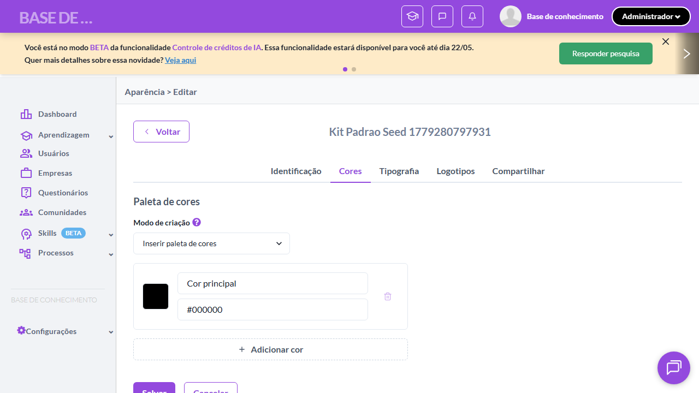

- 🎬 [Vídeo da execução (video.webm)](artifacts/projects-modelos-tests-fea-c7334-ão-de-cor-em-uso-por-modelo-chromium/video.webm)

- 📦 **Trace** — [`trace.zip`](artifacts/projects-modelos-tests-fea-c7334-ão-de-cor-em-uso-por-modelo-chromium/trace.zip)

  ```bash
  npx playwright show-trace outputs/modelos/reports/regression_20260521-180745/artifacts/projects-modelos-tests-fea-c7334-ão-de-cor-em-uso-por-modelo-chromium/trace.zip
  ```

- 🎥 **Vídeo** — [`video.webm`](artifacts/projects-modelos-tests-fea-c7334-ão-de-cor-em-uso-por-modelo-chromium/video.webm)


---

### ✅ Aprovado · TC2 · Exclusão permitida de cor sem modelos associados · 🔴 Crítico

<a id="exclusao-permitida-de-cor-sem-modelos-associados"></a>_Arquivo:_ `tc02-exclusao-cor-sem-modelos.spec.ts` · _Duração:_ 25.96s · _Browser:_ chromium

**Sumário (objetivo do caso):** Validar que cor sem modelos associados pode ser excluída normalmente (RN 64).

**Pré-condições:**

```
Ambiente Stage configurado
Feature flag `modelos_de_conteudo` ativa
Kit de marca cadastrado e associado a pelo menos 1 modelo de conteúdo
Usuário logado como Admin
```

**Passos do caso (XML/TestLink + execução Playwright):**

_Cada linha reproduz um passo do XML; a coluna **Status** traz o resultado da execução (do step Allure correspondente). Linhas com "Pré-condição" são da execução automatizada (login, navegação inicial) — não fazem parte do roteiro do XML._

| # | Ação do passo | Resultado esperado | Status | Notas | Duração |
|---|---|---|:---:|---|---:|
| — | _Pré-condição:_ 3. Adicionar cor extra (não-única) e validar que pode ser removida | — | ✅ | — | 1.06s |
| — | _Pré-condição:_ 4. Remover a cor adicionada e validar que sumiu do DOM | — | ✅ | — | 1.01s |
| 1 | Acessar a tela de edição de um kit de marca com cor não utilizada por nenhum modelo | Tela de edição é exibida. | ✅ | — | 19.37s |
| 2 | Clicar no botão de excluir da cor não utilizada | Cor é excluída e Toast de sucesso é exibida (REVISAR-FIGMA: texto exato). | ✅ | — | 3.19s |

**Evidências:**

📁 _Pasta:_ [`artifacts/projects-modelos-tests-fea-4775d--cor-sem-modelos-associados-chromium/`](artifacts/projects-modelos-tests-fea-4775d--cor-sem-modelos-associados-chromium/)

- 📸 **Screenshot (screenshot)** — [`test-finished-1.png`](artifacts/projects-modelos-tests-fea-4775d--cor-sem-modelos-associados-chromium/test-finished-1.png)

  

- 🎬 [Vídeo da execução (video.webm)](artifacts/projects-modelos-tests-fea-4775d--cor-sem-modelos-associados-chromium/video.webm)

- 📦 **Trace** — [`trace.zip`](artifacts/projects-modelos-tests-fea-4775d--cor-sem-modelos-associados-chromium/trace.zip)

  ```bash
  npx playwright show-trace outputs/modelos/reports/regression_20260521-180745/artifacts/projects-modelos-tests-fea-4775d--cor-sem-modelos-associados-chromium/trace.zip
  ```

- 🎥 **Vídeo** — [`video.webm`](artifacts/projects-modelos-tests-fea-4775d--cor-sem-modelos-associados-chromium/video.webm)


---

## Feature flag modelos_de_conteudo

_3 caso(s) — 0 aprovado(s), 0 falha(s), 3 ignorado(s)_

### ⊘ Ignorado · TC1 · Acesso bloqueado com flag desabilitada · 🔴 Crítico

<a id="acesso-bloqueado-com-flag-desabilitada"></a>_Arquivo:_ `tc01-acesso-bloqueado-flag-off.spec.ts` · _Duração:_ 0.00s · _Browser:_ chromium

> **⊘ Por que foi ignorado:** Caso ignorado pelo Playwright sem justificativa registrada (test.skip/fixme sem mensagem).

**Sumário (objetivo do caso):** Validar que o submenu "Modelos de conteúdo" não aparece quando a flag está desabilitada (RN 1.2).

**Pré-condições:**

```
Ambiente Stage configurado
Usuário logado como Admin com flag elevada para Flipper-UI
Feature flag `modelos_de_conteudo` controlável via Super Admin
```

**Passos do caso (XML/TestLink + execução Playwright):**

_Cada linha reproduz um passo do XML; a coluna **Status** traz o resultado da execução (do step Allure correspondente). Linhas com "Pré-condição" são da execução automatizada (login, navegação inicial) — não fazem parte do roteiro do XML._

| # | Ação do passo | Resultado esperado | Status | Notas | Duração |
|---|---|---|:---:|---|---:|
| 1 | Desabilitar a feature flag `modelos_de_conteudo` para a organização do teste via Flipper-UI | Flag fica como "Conditionally enabled" sem actor `Organization;{orgId}`. | ⊘ | Step não executado — Caso ignorado pelo Playwright sem justificativa registrada (test.skip/fixme sem mensagem). | — |
| 2 | Acessar a URL "/o/{orgId}/dashboard" | Dashboard padrão é exibido. | ⊘ | Step não executado — Caso ignorado pelo Playwright sem justificativa registrada (test.skip/fixme sem mensagem). | — |
| 3 | Clicar no menu lateral "Aprendizagem" | Submenu lateral é exibido SEM o item "Modelos de conteúdo". | ⊘ | Step não executado — Caso ignorado pelo Playwright sem justificativa registrada (test.skip/fixme sem mensagem). | — |

**Evidências:**

_Sem evidências anexadas._

#### ⏳ Pendente — execução automatizada não realizada

- **Severidade do caso (XML):** Crítico
- **Motivo do skip / fixme:** Sem motivo registrado.

**Roteiro do XML (para validação manual):**
1. Pré: Ambiente Stage configurado
1. Pré: Usuário logado como Admin com flag elevada para Flipper-UI
1. Pré: Feature flag `modelos_de_conteudo` controlável via Super Admin
1. 1. Desabilitar a feature flag `modelos_de_conteudo` para a organização do teste via Flipper-UI
1. 2. Acessar a URL "/o/{orgId}/dashboard"
1. 3. Clicar no menu lateral "Aprendizagem"

> Esse caso não bloqueia a build, mas precisa de validação manual ou ajuste no agente.


---

### ⊘ Ignorado · TC2 · Acesso liberado com flag habilitada · 🔴 Crítico

<a id="acesso-liberado-com-flag-habilitada"></a>_Arquivo:_ `tc02-acesso-liberado-flag-on.spec.ts` · _Duração:_ 0.00s · _Browser:_ chromium

> **⊘ Por que foi ignorado:** Caso ignorado pelo Playwright sem justificativa registrada (test.skip/fixme sem mensagem).

**Sumário (objetivo do caso):** Validar que a funcionalidade fica acessível quando a flag está habilitada (RN 1.2).

**Pré-condições:**

```
Ambiente Stage configurado
Usuário logado como Admin com flag elevada para Flipper-UI
Feature flag `modelos_de_conteudo` controlável via Super Admin
```

**Passos do caso (XML/TestLink + execução Playwright):**

_Cada linha reproduz um passo do XML; a coluna **Status** traz o resultado da execução (do step Allure correspondente). Linhas com "Pré-condição" são da execução automatizada (login, navegação inicial) — não fazem parte do roteiro do XML._

| # | Ação do passo | Resultado esperado | Status | Notas | Duração |
|---|---|---|:---:|---|---:|
| 1 | Habilitar a feature flag `modelos_de_conteudo` para a organização do teste via Flipper-UI | Flag fica como "Conditionally enabled" com actor `Organization;{orgId}`. | ⊘ | Step não executado — Caso ignorado pelo Playwright sem justificativa registrada (test.skip/fixme sem mensagem). | — |
| 2 | Acessar a URL "/o/{orgId}/dashboard" | Dashboard padrão é exibido. | ⊘ | Step não executado — Caso ignorado pelo Playwright sem justificativa registrada (test.skip/fixme sem mensagem). | — |
| 3 | Clicar no menu lateral "Aprendizagem" | Submenu lateral é exibido COM o item "Modelos de conteúdo". | ⊘ | Step não executado — Caso ignorado pelo Playwright sem justificativa registrada (test.skip/fixme sem mensagem). | — |
| 4 | Clicar no submenu "Modelos de conteúdo" | Sistema redireciona para a listagem de modelos de conteúdo. | ⊘ | Step não executado — Caso ignorado pelo Playwright sem justificativa registrada (test.skip/fixme sem mensagem). | — |

**Evidências:**

_Sem evidências anexadas._

#### ⏳ Pendente — execução automatizada não realizada

- **Severidade do caso (XML):** Crítico
- **Motivo do skip / fixme:** Sem motivo registrado.

**Roteiro do XML (para validação manual):**
1. Pré: Ambiente Stage configurado
1. Pré: Usuário logado como Admin com flag elevada para Flipper-UI
1. Pré: Feature flag `modelos_de_conteudo` controlável via Super Admin
1. 1. Habilitar a feature flag `modelos_de_conteudo` para a organização do teste via Flipper-UI
1. 2. Acessar a URL "/o/{orgId}/dashboard"
1. 3. Clicar no menu lateral "Aprendizagem"
1. 4. Clicar no submenu "Modelos de conteúdo"

> Esse caso não bloqueia a build, mas precisa de validação manual ou ajuste no agente.


---

### ⊘ Ignorado · TC3 · Transição off → on durante a sessão · 🟡 Normal

<a id="transicao-off-on-durante-a-sessao"></a>_Arquivo:_ `tc03-transicao-off-on-sessao.spec.ts` · _Duração:_ 0.00s · _Browser:_ chromium

> **⊘ Por que foi ignorado:** Caso ignorado pelo Playwright sem justificativa registrada (test.skip/fixme sem mensagem).

**Sumário (objetivo do caso):** Validar que ativar a flag durante uma sessão libera a funcionalidade após refresh.

**Pré-condições:**

```
Ambiente Stage configurado
Usuário logado como Admin com flag elevada para Flipper-UI
Feature flag `modelos_de_conteudo` controlável via Super Admin
```

**Passos do caso (XML/TestLink + execução Playwright):**

_Cada linha reproduz um passo do XML; a coluna **Status** traz o resultado da execução (do step Allure correspondente). Linhas com "Pré-condição" são da execução automatizada (login, navegação inicial) — não fazem parte do roteiro do XML._

| # | Ação do passo | Resultado esperado | Status | Notas | Duração |
|---|---|---|:---:|---|---:|
| 1 | Iniciar sessão com a flag desabilitada para a organização do teste | Submenu "Modelos de conteúdo" NÃO é exibido. | ⊘ | Step não executado — Caso ignorado pelo Playwright sem justificativa registrada (test.skip/fixme sem mensagem). | — |
| 2 | Habilitar a flag `modelos_de_conteudo` para a organização via Flipper-UI | Flag fica como "Conditionally enabled" com actor `Organization;{orgId}`. | ⊘ | Step não executado — Caso ignorado pelo Playwright sem justificativa registrada (test.skip/fixme sem mensagem). | — |
| 3 | Recarregar a página "/o/{orgId}/dashboard" | Dashboard é exibido novamente. | ⊘ | Step não executado — Caso ignorado pelo Playwright sem justificativa registrada (test.skip/fixme sem mensagem). | — |
| 4 | Clicar no menu lateral "Aprendizagem" | Submenu lateral agora exibe o item "Modelos de conteúdo". | ⊘ | Step não executado — Caso ignorado pelo Playwright sem justificativa registrada (test.skip/fixme sem mensagem). | — |

**Evidências:**

_Sem evidências anexadas._

#### ⏳ Pendente — execução automatizada não realizada

- **Severidade do caso (XML):** Normal
- **Motivo do skip / fixme:** Sem motivo registrado.

**Roteiro do XML (para validação manual):**
1. Pré: Ambiente Stage configurado
1. Pré: Usuário logado como Admin com flag elevada para Flipper-UI
1. Pré: Feature flag `modelos_de_conteudo` controlável via Super Admin
1. 1. Iniciar sessão com a flag desabilitada para a organização do teste
1. 2. Habilitar a flag `modelos_de_conteudo` para a organização via Flipper-UI
1. 3. Recarregar a página "/o/{orgId}/dashboard"
1. 4. Clicar no menu lateral "Aprendizagem"

> Esse caso não bloqueia a build, mas precisa de validação manual ou ajuste no agente.


---

## Ambientes adicionais - Modelos

_2 caso(s) — 0 aprovado(s), 0 falha(s), 2 ignorado(s)_

### ⊘ Ignorado · TC1 · Modelos criados no principal não aparecem no adicional · 🔴 Crítico

<a id="modelos-criados-no-principal-nao-aparecem-no-adicional"></a>_Arquivo:_ `tc01-isolamento-principal-para-adicional.spec.ts` · _Duração:_ 0.00s · _Browser:_ chromium

> **⊘ Por que foi ignorado:** Caso ignorado pelo Playwright sem justificativa registrada (test.skip/fixme sem mensagem).

**Sumário (objetivo do caso):** Validar isolamento de dados de modelos entre tenants pareados.

**Pré-condições:**

```
Ambiente Stage configurado com env adicional pareado
Feature flag `modelos_de_conteudo` ativa em ambas as orgs (principal e adicional)
Usuário logado como Admin
```

**Passos do caso (XML/TestLink + execução Playwright):**

_Cada linha reproduz um passo do XML; a coluna **Status** traz o resultado da execução (do step Allure correspondente). Linhas com "Pré-condição" são da execução automatizada (login, navegação inicial) — não fazem parte do roteiro do XML._

| # | Ação do passo | Resultado esperado | Status | Notas | Duração |
|---|---|---|:---:|---|---:|
| 1 | Criar modelo "Modelo TC1 isolamento w{workerIndex}-{timestamp}" no ambiente principal | Toast exibida: "Modelo de conteúdo criado com sucesso.". Listagem do principal exibe o novo modelo. | ⊘ | Step não executado — Caso ignorado pelo Playwright sem justificativa registrada (test.skip/fixme sem mensagem). | — |
| 2 | Acessar a listagem de modelos no ambiente adicional pareado | Listagem do ambiente adicional NÃO exibe o modelo criado no principal. | ⊘ | Step não executado — Caso ignorado pelo Playwright sem justificativa registrada (test.skip/fixme sem mensagem). | — |

**Evidências:**

_Sem evidências anexadas._

#### ⏳ Pendente — execução automatizada não realizada

- **Severidade do caso (XML):** Crítico
- **Motivo do skip / fixme:** Sem motivo registrado.

**Roteiro do XML (para validação manual):**
1. Pré: Ambiente Stage configurado com env adicional pareado
1. Pré: Feature flag `modelos_de_conteudo` ativa em ambas as orgs (principal e adicional)
1. Pré: Usuário logado como Admin
1. 1. Criar modelo "Modelo TC1 isolamento w{workerIndex}-{timestamp}" no ambiente principal
1. 2. Acessar a listagem de modelos no ambiente adicional pareado

> Esse caso não bloqueia a build, mas precisa de validação manual ou ajuste no agente.


---

### ⊘ Ignorado · TC2 · Modelos criados no adicional não aparecem no principal · 🔴 Crítico

<a id="modelos-criados-no-adicional-nao-aparecem-no-principal"></a>_Arquivo:_ `tc02-isolamento-adicional-para-principal.spec.ts` · _Duração:_ 0.00s · _Browser:_ chromium

> **⊘ Por que foi ignorado:** Caso ignorado pelo Playwright sem justificativa registrada (test.skip/fixme sem mensagem).

**Sumário (objetivo do caso):** Validar isolamento bidirecional.

**Pré-condições:**

```
Ambiente Stage configurado com env adicional pareado
Feature flag `modelos_de_conteudo` ativa em ambas as orgs (principal e adicional)
Usuário logado como Admin
```

**Passos do caso (XML/TestLink + execução Playwright):**

_Cada linha reproduz um passo do XML; a coluna **Status** traz o resultado da execução (do step Allure correspondente). Linhas com "Pré-condição" são da execução automatizada (login, navegação inicial) — não fazem parte do roteiro do XML._

| # | Ação do passo | Resultado esperado | Status | Notas | Duração |
|---|---|---|:---:|---|---:|
| 1 | Criar modelo "Modelo TC2 isolamento w{workerIndex}-{timestamp}" no ambiente adicional | Toast exibida: "Modelo de conteúdo criado com sucesso.". Listagem do adicional exibe o novo modelo. | ⊘ | Step não executado — Caso ignorado pelo Playwright sem justificativa registrada (test.skip/fixme sem mensagem). | — |
| 2 | Acessar a listagem de modelos no ambiente principal | Listagem do ambiente principal NÃO exibe o modelo criado no adicional. | ⊘ | Step não executado — Caso ignorado pelo Playwright sem justificativa registrada (test.skip/fixme sem mensagem). | — |

**Evidências:**

_Sem evidências anexadas._

#### ⏳ Pendente — execução automatizada não realizada

- **Severidade do caso (XML):** Crítico
- **Motivo do skip / fixme:** Sem motivo registrado.

**Roteiro do XML (para validação manual):**
1. Pré: Ambiente Stage configurado com env adicional pareado
1. Pré: Feature flag `modelos_de_conteudo` ativa em ambas as orgs (principal e adicional)
1. Pré: Usuário logado como Admin
1. 1. Criar modelo "Modelo TC2 isolamento w{workerIndex}-{timestamp}" no ambiente adicional
1. 2. Acessar a listagem de modelos no ambiente principal

> Esse caso não bloqueia a build, mas precisa de validação manual ou ajuste no agente.


---
