# Casos de teste — Modelos de conteúdo

[← Voltar ao dashboard](index.md)

Lista detalhada por testsuite. Cada caso traz: o que era esperado pelo XML, quais steps foram executados, evidências (screenshots/trace), texto pronto pra registro de bug e — quando houver falha — uma explicação em PT-BR do motivo.

## Listagem e Menu de Modelos

_6 caso(s) — 0 aprovado(s), 6 falha(s)_

### ❌ Falhou · TC1 · Acessar listagem via submenu Aprendizagem · 🔴 Crítico

<a id="acessar-listagem-via-submenu-aprendizagem"></a>_Arquivo:_ `tc01-acessar-listagem-via-submenu-aprendizagem.spec.ts` · _Duração:_ 68.67s · _Browser:_ chromium

> **❌ Por que falhou:** A URL não bateu com a esperada (esperada: /dashboard/) — atual: "https://basedeconhecimento.stage.twygoead.com/users/login".
> _Step impactado:_ **1. Navegar para dashboard admin e aguardar carregado**

**Sumário (objetivo do caso):** Validar acesso à listagem via menu lateral, conforme RN 1, 1.1.

**Pré-condições:**

```
Ambiente Stage configurado
Feature flag `modelos_de_conteudo` ativa na organização do teste
Pelo menos 2 modelos cadastrados (1 ativo, 1 inativo) para validar visualizações
Usuário logado como Admin
```

**Passos do caso (XML/TestLink + execução Playwright):**

_Cada linha reproduz um passo do XML; a coluna **Status** traz o resultado da execução (do step Allure correspondente). Linhas com "Pré-condição" são da execução automatizada (login, navegação inicial) — não fazem parte do roteiro do XML._

| # | Ação do passo | Resultado esperado | Status | Notas | Duração |
|---|---|---|:---:|---|---:|
| 1 | Acessar a URL "/o/{orgId}/dashboard" | Dashboard padrão é exibido contendo o menu lateral. | ❌ | A URL não bateu com a esperada (esperada: /dashboard/) — atual: "https://basedeconhecimento.stage.twygoead.com/users/login". | 64.20s |
| 2 | Clicar no menu lateral "Aprendizagem" | Submenu lateral é exibido contendo o item "Modelos de conteúdo" com ícone Material "browse". | ⊘ | Step não executado: o teste foi interrompido antes. Causa: A URL não bateu com a esperada (esperada: /dashboard/) — atual: "https://basedeconhecimento.stage.twygoead.com/users/login".. | — |
| 3 | Clicar no submenu "Modelos de conteúdo" | Sistema redireciona para a listagem e exibe breadcrumb "Aprendizagem > Modelos de conteúdo". | ⊘ | Step não executado: o teste foi interrompido antes. Causa: A URL não bateu com a esperada (esperada: /dashboard/) — atual: "https://basedeconhecimento.stage.twygoead.com/users/login".. | — |

**Evidências:**

📁 _Pasta:_ [`artifacts/projects-modelos-tests-fea-3d814-em-via-submenu-Aprendizagem-chromium/`](artifacts/projects-modelos-tests-fea-3d814-em-via-submenu-Aprendizagem-chromium/)

- 📸 **Screenshot (screenshot)** — [`test-failed-1.png`](artifacts/projects-modelos-tests-fea-3d814-em-via-submenu-Aprendizagem-chromium/test-failed-1.png)

  

- 🎬 [Vídeo da execução (video.webm)](artifacts/projects-modelos-tests-fea-3d814-em-via-submenu-Aprendizagem-chromium/video.webm)

- 📦 **Trace** — [`trace.zip`](artifacts/projects-modelos-tests-fea-3d814-em-via-submenu-Aprendizagem-chromium/trace.zip)

  ```bash
  npx playwright show-trace outputs/modelos/reports/regression_20260525-111454/artifacts/projects-modelos-tests-fea-3d814-em-via-submenu-Aprendizagem-chromium/trace.zip
  ```

- 🎥 **Vídeo** — [`video.webm`](artifacts/projects-modelos-tests-fea-3d814-em-via-submenu-Aprendizagem-chromium/video.webm)

- 📄 **DOM no momento da falha** — [`error-context.md`](artifacts/projects-modelos-tests-fea-3d814-em-via-submenu-Aprendizagem-chromium/error-context.md)

#### 🐛 Pronto para registro de bug

> ❓ **Análise automática:** Inconclusivo (precisa investigação manual) · Confiança 🔴 baixa
> _Por quê:_ Sem sinal Network in-scope ou padrão de erro conhecido — revisar trace
> _Bug-report estruturado:_ [`bug-reports/listagem-e-menu-de-modelos__acessar-listagem-via-submenu-aprendizagem.md`](bug-reports/listagem-e-menu-de-modelos__acessar-listagem-via-submenu-aprendizagem.md)

**Próximas ações sugeridas:**
- Sem evidência suficiente para classificar — abrir `trace.zip` (`npx playwright show-trace`) para ver passo a passo da execução.
- Reabrir o agente com o trace em mãos para reclassificar manualmente em uma das 4 categorias.

**Descrição do BUG:** [Crítico] Acessar listagem via submenu Aprendizagem — A URL não bateu com a esperada (esperada: /dashboard/) — atual: "https://basedeconhecimento.stage.twygoead.com/users/login".

**Passo a passo para reprodução:**
1. Pré: Ambiente Stage configurado
1. Pré: Feature flag `modelos_de_conteudo` ativa na organização do teste
1. Pré: Pelo menos 2 modelos cadastrados (1 ativo, 1 inativo) para validar visualizações
1. Pré: Usuário logado como Admin
1. 1. Acessar a URL "/o/{orgId}/dashboard"
1. 2. Clicar no menu lateral "Aprendizagem"
1. 3. Clicar no submenu "Modelos de conteúdo"

**Comportamento esperado:** Dashboard padrão é exibido contendo o menu lateral.

**Comportamento atual:** A URL não bateu com a esperada (esperada: /dashboard/) — atual: "https://basedeconhecimento.stage.twygoead.com/users/login". (falha aconteceu no passo 1: "Navegar para dashboard admin e aguardar carregado", que deveria resultar em: Dashboard padrão é exibido contendo o menu lateral.)

**Informações:**

| Campo | Valor |
|---|---|
| URL | `https://basedeconhecimento.stage.twygoead.com/users/login` |
| Login | Credenciais via env: `TWYGO_STAGING_BASE_DE_CONHECIMENTO_EMAIL` (consulte `.env`) |
| Senha | Credenciais via env: `TWYGO_STAGING_BASE_DE_CONHECIMENTO_PASSWORD` (consulte `.env`) |
| orgId | — |
| Outros | Browser: chromium |
| Outros | runId: regression_20260525-111454 |
| Outros | Duração até a falha: 68.67s |
| Outros | Step impactado: 1. Navegar para dashboard admin e aguardar carregado |

**Evidências:**

- Screenshot capturado pelo Playwright (screenshot): artifacts/projects-modelos-tests-fea-3d814-em-via-submenu-Aprendizagem-chromium/test-failed-1.png
- Vídeo da execução (video.webm): artifacts/projects-modelos-tests-fea-3d814-em-via-submenu-Aprendizagem-chromium/video.webm
- Snapshot do DOM/contexto da página (error-context.md): artifacts/projects-modelos-tests-fea-3d814-em-via-submenu-Aprendizagem-chromium/error-context.md
- Trace completo do Playwright (.zip) — `npx playwright show-trace`: artifacts/projects-modelos-tests-fea-3d814-em-via-submenu-Aprendizagem-chromium/trace.zip

<details><summary>📋 Ver texto agregado para copiar (Jira/GitHub/Linear)</summary>

```
Descrição do BUG
[Crítico] Acessar listagem via submenu Aprendizagem — A URL não bateu com a esperada (esperada: /dashboard/) — atual: "https://basedeconhecimento.stage.twygoead.com/users/login".

Passo a passo para reprodução
  Pré: Ambiente Stage configurado
  Pré: Feature flag `modelos_de_conteudo` ativa na organização do teste
  Pré: Pelo menos 2 modelos cadastrados (1 ativo, 1 inativo) para validar visualizações
  Pré: Usuário logado como Admin
  1. Acessar a URL "/o/{orgId}/dashboard"
  2. Clicar no menu lateral "Aprendizagem"
  3. Clicar no submenu "Modelos de conteúdo"

Comportamento esperado
Dashboard padrão é exibido contendo o menu lateral.

Comportamento atual
A URL não bateu com a esperada (esperada: /dashboard/) — atual: "https://basedeconhecimento.stage.twygoead.com/users/login". (falha aconteceu no passo 1: "Navegar para dashboard admin e aguardar carregado", que deveria resultar em: Dashboard padrão é exibido contendo o menu lateral.)

Informações
- URL: https://basedeconhecimento.stage.twygoead.com/users/login
- Login: Credenciais via env: `TWYGO_STAGING_BASE_DE_CONHECIMENTO_EMAIL` (consulte `.env`)
- Senha: Credenciais via env: `TWYGO_STAGING_BASE_DE_CONHECIMENTO_PASSWORD` (consulte `.env`)
- ID do ambiente (orgId): —
- Outros:
  - Browser: chromium
  - runId: regression_20260525-111454
  - Duração até a falha: 68.67s
  - Step impactado: 1. Navegar para dashboard admin e aguardar carregado

Evidências
- Screenshot capturado pelo Playwright (screenshot): artifacts/projects-modelos-tests-fea-3d814-em-via-submenu-Aprendizagem-chromium/test-failed-1.png
- Vídeo da execução (video.webm): artifacts/projects-modelos-tests-fea-3d814-em-via-submenu-Aprendizagem-chromium/video.webm
- Snapshot do DOM/contexto da página (error-context.md): artifacts/projects-modelos-tests-fea-3d814-em-via-submenu-Aprendizagem-chromium/error-context.md
- Trace completo do Playwright (.zip) — `npx playwright show-trace`: artifacts/projects-modelos-tests-fea-3d814-em-via-submenu-Aprendizagem-chromium/trace.zip

Execução
- runId: regression_20260525-111454
- environment.json: staging-base-de-conhecimento
- testsuite: Listagem e Menu de Modelos
- testcase: Acessar listagem via submenu Aprendizagem

```

</details>

<details><summary>🔧 Stack trace técnica completa (para desenvolvedor)</summary>

```
Error: expect(page).toHaveURL(expected) failed

Expected pattern: /dashboard/
Received string:  "https://basedeconhecimento.stage.twygoead.com/users/login"
Timeout: 60000ms

Call log:
  - Expect "toHaveURL" with timeout 60000ms
    63 × unexpected value "https://basedeconhecimento.stage.twygoead.com/users/login"

```

</details>

---

### ❌ Falhou · TC2 · Visualização padrão em Cards · 🔴 Crítico

<a id="visualizacao-padrao-em-cards"></a>_Arquivo:_ `tc02-visualizacao-padrao-em-cards.spec.ts` · _Duração:_ 68.32s · _Browser:_ chromium

> **❌ Por que falhou:** O elemento esperado não apareceu na tela (locator: getByTestId('content-models-page')).
> _Step impactado:_ **1. Acessar listagem e aguardar Cards renderizados**

**Sumário (objetivo do caso):** Validar que a visualização padrão da listagem é em formato Cards, conforme RN 3. Inclui validação visual do carregamento das imagens dos cards via `expectImageLoaded`.

**Pré-condições:**

```
Ambiente Stage configurado
Feature flag `modelos_de_conteudo` ativa na organização do teste
Pelo menos 2 modelos cadastrados (1 ativo, 1 inativo) para validar visualizações
Usuário logado como Admin
```

**Passos do caso (XML/TestLink + execução Playwright):**

_Cada linha reproduz um passo do XML; a coluna **Status** traz o resultado da execução (do step Allure correspondente). Linhas com "Pré-condição" são da execução automatizada (login, navegação inicial) — não fazem parte do roteiro do XML._

| # | Ação do passo | Resultado esperado | Status | Notas | Duração |
|---|---|---|:---:|---|---:|
| 1 | Acessar a URL "/o/{orgId}/content_models" | Listagem é exibida em formato Cards por padrão. | ❌ | O elemento esperado não apareceu na tela (locator: getByTestId('content-models-page')). | 64.21s |
| 2 | Aguardar a renderização dos cards | Cada card exibe imagem principal, nome do modelo, ações (List Control) e indicador de cor lateral para status. | ⊘ | Step não executado: o teste foi interrompido antes. Causa: O elemento esperado não apareceu na tela (locator: getByTestId('content-models-page')).. | — |
| 3 | Executar o helper `expectImageLoaded` sobre cada "imagem principal" do card | Para cada card, helper retorna true (img.complete === true && naturalWidth >= 32). | ⊘ | Step não executado: o teste foi interrompido antes. Causa: O elemento esperado não apareceu na tela (locator: getByTestId('content-models-page')).. | — |

**Evidências:**

📁 _Pasta:_ [`artifacts/projects-modelos-tests-fea-ed4ce-isualização-padrão-em-Cards-chromium/`](artifacts/projects-modelos-tests-fea-ed4ce-isualização-padrão-em-Cards-chromium/)

- 📸 **Screenshot (screenshot)** — [`test-failed-1.png`](artifacts/projects-modelos-tests-fea-ed4ce-isualização-padrão-em-Cards-chromium/test-failed-1.png)

  

- 🎬 [Vídeo da execução (video.webm)](artifacts/projects-modelos-tests-fea-ed4ce-isualização-padrão-em-Cards-chromium/video.webm)

- 📦 **Trace** — [`trace.zip`](artifacts/projects-modelos-tests-fea-ed4ce-isualização-padrão-em-Cards-chromium/trace.zip)

  ```bash
  npx playwright show-trace outputs/modelos/reports/regression_20260525-111454/artifacts/projects-modelos-tests-fea-ed4ce-isualização-padrão-em-Cards-chromium/trace.zip
  ```

- 🎥 **Vídeo** — [`video.webm`](artifacts/projects-modelos-tests-fea-ed4ce-isualização-padrão-em-Cards-chromium/video.webm)

- 📄 **DOM no momento da falha** — [`error-context.md`](artifacts/projects-modelos-tests-fea-ed4ce-isualização-padrão-em-Cards-chromium/error-context.md)

#### 🐛 Pronto para registro de bug

> ❓ **Análise automática:** Inconclusivo (precisa investigação manual) · Confiança 🔴 baixa
> _Por quê:_ Sem sinal Network in-scope ou padrão de erro conhecido — revisar trace
> _Bug-report estruturado:_ [`bug-reports/listagem-e-menu-de-modelos__visualizacao-padrao-em-cards.md`](bug-reports/listagem-e-menu-de-modelos__visualizacao-padrao-em-cards.md)

**Próximas ações sugeridas:**
- Sem evidência suficiente para classificar — abrir `trace.zip` (`npx playwright show-trace`) para ver passo a passo da execução.
- Reabrir o agente com o trace em mãos para reclassificar manualmente em uma das 4 categorias.

**Descrição do BUG:** [Crítico] Visualização padrão em Cards — O elemento esperado não apareceu na tela (locator: getByTestId('content-models-page')).

**Passo a passo para reprodução:**
1. Pré: Ambiente Stage configurado
1. Pré: Feature flag `modelos_de_conteudo` ativa na organização do teste
1. Pré: Pelo menos 2 modelos cadastrados (1 ativo, 1 inativo) para validar visualizações
1. Pré: Usuário logado como Admin
1. 1. Acessar a URL "/o/{orgId}/content_models"
1. 2. Aguardar a renderização dos cards
1. 3. Executar o helper `expectImageLoaded` sobre cada "imagem principal" do card

**Comportamento esperado:** Listagem é exibida em formato Cards por padrão.

**Comportamento atual:** O elemento esperado não apareceu na tela (locator: getByTestId('content-models-page')). (falha aconteceu no passo 1: "Acessar listagem e aguardar Cards renderizados", que deveria resultar em: Listagem é exibida em formato Cards por padrão.)

**Informações:**

| Campo | Valor |
|---|---|
| URL | `https://basedeconhecimento.stage.twygoead.com/` |
| Login | Credenciais via env: `TWYGO_STAGING_BASE_DE_CONHECIMENTO_EMAIL` (consulte `.env`) |
| Senha | Credenciais via env: `TWYGO_STAGING_BASE_DE_CONHECIMENTO_PASSWORD` (consulte `.env`) |
| orgId | — |
| Outros | Browser: chromium |
| Outros | runId: regression_20260525-111454 |
| Outros | Duração até a falha: 68.32s |
| Outros | Step impactado: 1. Acessar listagem e aguardar Cards renderizados |

**Evidências:**

- Screenshot capturado pelo Playwright (screenshot): artifacts/projects-modelos-tests-fea-ed4ce-isualização-padrão-em-Cards-chromium/test-failed-1.png
- Vídeo da execução (video.webm): artifacts/projects-modelos-tests-fea-ed4ce-isualização-padrão-em-Cards-chromium/video.webm
- Snapshot do DOM/contexto da página (error-context.md): artifacts/projects-modelos-tests-fea-ed4ce-isualização-padrão-em-Cards-chromium/error-context.md
- Trace completo do Playwright (.zip) — `npx playwright show-trace`: artifacts/projects-modelos-tests-fea-ed4ce-isualização-padrão-em-Cards-chromium/trace.zip

<details><summary>📋 Ver texto agregado para copiar (Jira/GitHub/Linear)</summary>

```
Descrição do BUG
[Crítico] Visualização padrão em Cards — O elemento esperado não apareceu na tela (locator: getByTestId('content-models-page')).

Passo a passo para reprodução
  Pré: Ambiente Stage configurado
  Pré: Feature flag `modelos_de_conteudo` ativa na organização do teste
  Pré: Pelo menos 2 modelos cadastrados (1 ativo, 1 inativo) para validar visualizações
  Pré: Usuário logado como Admin
  1. Acessar a URL "/o/{orgId}/content_models"
  2. Aguardar a renderização dos cards
  3. Executar o helper `expectImageLoaded` sobre cada "imagem principal" do card

Comportamento esperado
Listagem é exibida em formato Cards por padrão.

Comportamento atual
O elemento esperado não apareceu na tela (locator: getByTestId('content-models-page')). (falha aconteceu no passo 1: "Acessar listagem e aguardar Cards renderizados", que deveria resultar em: Listagem é exibida em formato Cards por padrão.)

Informações
- URL: https://basedeconhecimento.stage.twygoead.com/
- Login: Credenciais via env: `TWYGO_STAGING_BASE_DE_CONHECIMENTO_EMAIL` (consulte `.env`)
- Senha: Credenciais via env: `TWYGO_STAGING_BASE_DE_CONHECIMENTO_PASSWORD` (consulte `.env`)
- ID do ambiente (orgId): —
- Outros:
  - Browser: chromium
  - runId: regression_20260525-111454
  - Duração até a falha: 68.32s
  - Step impactado: 1. Acessar listagem e aguardar Cards renderizados

Evidências
- Screenshot capturado pelo Playwright (screenshot): artifacts/projects-modelos-tests-fea-ed4ce-isualização-padrão-em-Cards-chromium/test-failed-1.png
- Vídeo da execução (video.webm): artifacts/projects-modelos-tests-fea-ed4ce-isualização-padrão-em-Cards-chromium/video.webm
- Snapshot do DOM/contexto da página (error-context.md): artifacts/projects-modelos-tests-fea-ed4ce-isualização-padrão-em-Cards-chromium/error-context.md
- Trace completo do Playwright (.zip) — `npx playwright show-trace`: artifacts/projects-modelos-tests-fea-ed4ce-isualização-padrão-em-Cards-chromium/trace.zip

Execução
- runId: regression_20260525-111454
- environment.json: staging-base-de-conhecimento
- testsuite: Listagem e Menu de Modelos
- testcase: Visualização padrão em Cards

```

</details>

<details><summary>🔧 Stack trace técnica completa (para desenvolvedor)</summary>

```
Error: expect(locator).toBeVisible() failed

Locator: getByTestId('content-models-page')
Expected: visible
Timeout: 60000ms
Error: element(s) not found

Call log:
  - Expect "toBeVisible" with timeout 60000ms
  - waiting for getByTestId('content-models-page')

```

</details>

---

### ❌ Falhou · TC3 · Alternância entre visualização Cards e Lista · 🔴 Crítico

<a id="alternancia-entre-visualizacao-cards-e-lista"></a>_Arquivo:_ `tc03-alternancia-visualizacao-cards-lista.spec.ts` · _Duração:_ 68.69s · _Browser:_ chromium

> **❌ Por que falhou:** O elemento esperado não apareceu na tela (locator: getByTestId('content-models-page')).
> _Step impactado:_ **1. Acessar listagem em formato Cards**

**Sumário (objetivo do caso):** Validar alternância de visualização entre Cards e Lista, conforme RN 2.

**Pré-condições:**

```
Ambiente Stage configurado
Feature flag `modelos_de_conteudo` ativa na organização do teste
Pelo menos 2 modelos cadastrados (1 ativo, 1 inativo) para validar visualizações
Usuário logado como Admin
```

**Passos do caso (XML/TestLink + execução Playwright):**

_Cada linha reproduz um passo do XML; a coluna **Status** traz o resultado da execução (do step Allure correspondente). Linhas com "Pré-condição" são da execução automatizada (login, navegação inicial) — não fazem parte do roteiro do XML._

| # | Ação do passo | Resultado esperado | Status | Notas | Duração |
|---|---|---|:---:|---|---:|
| 1 | Acessar a URL "/o/{orgId}/content_models" | Listagem é exibida em formato Cards. | ❌ | O elemento esperado não apareceu na tela (locator: getByTestId('content-models-page')). | 64.04s |
| 2 | Clicar no botão de alternância para visualização "Lista" | Listagem alterna para formato Lista exibindo colunas: "Nome", "Descrição", "Provedor", "Designs", "Aplicação", "Situação", "Atualizado em". | ⊘ | Step não executado: o teste foi interrompido antes. Causa: O elemento esperado não apareceu na tela (locator: getByTestId('content-models-page')).. | — |
| 3 | Clicar no botão de alternância para visualização "Cards" | Listagem retorna para formato Cards. | ⊘ | Step não executado: o teste foi interrompido antes. Causa: O elemento esperado não apareceu na tela (locator: getByTestId('content-models-page')).. | — |

**Evidências:**

📁 _Pasta:_ [`artifacts/projects-modelos-tests-fea-36c4f--visualização-Cards-e-Lista-chromium/`](artifacts/projects-modelos-tests-fea-36c4f--visualização-Cards-e-Lista-chromium/)

- 📸 **Screenshot (screenshot)** — [`test-failed-1.png`](artifacts/projects-modelos-tests-fea-36c4f--visualização-Cards-e-Lista-chromium/test-failed-1.png)

  

- 🎬 [Vídeo da execução (video.webm)](artifacts/projects-modelos-tests-fea-36c4f--visualização-Cards-e-Lista-chromium/video.webm)

- 📦 **Trace** — [`trace.zip`](artifacts/projects-modelos-tests-fea-36c4f--visualização-Cards-e-Lista-chromium/trace.zip)

  ```bash
  npx playwright show-trace outputs/modelos/reports/regression_20260525-111454/artifacts/projects-modelos-tests-fea-36c4f--visualização-Cards-e-Lista-chromium/trace.zip
  ```

- 🎥 **Vídeo** — [`video.webm`](artifacts/projects-modelos-tests-fea-36c4f--visualização-Cards-e-Lista-chromium/video.webm)

- 📄 **DOM no momento da falha** — [`error-context.md`](artifacts/projects-modelos-tests-fea-36c4f--visualização-Cards-e-Lista-chromium/error-context.md)

#### 🐛 Pronto para registro de bug

> ❓ **Análise automática:** Inconclusivo (precisa investigação manual) · Confiança 🔴 baixa
> _Por quê:_ Sem sinal Network in-scope ou padrão de erro conhecido — revisar trace
> _Bug-report estruturado:_ [`bug-reports/listagem-e-menu-de-modelos__alternancia-entre-visualizacao-cards-e-lista.md`](bug-reports/listagem-e-menu-de-modelos__alternancia-entre-visualizacao-cards-e-lista.md)

**Próximas ações sugeridas:**
- Sem evidência suficiente para classificar — abrir `trace.zip` (`npx playwright show-trace`) para ver passo a passo da execução.
- Reabrir o agente com o trace em mãos para reclassificar manualmente em uma das 4 categorias.

**Descrição do BUG:** [Crítico] Alternância entre visualização Cards e Lista — O elemento esperado não apareceu na tela (locator: getByTestId('content-models-page')).

**Passo a passo para reprodução:**
1. Pré: Ambiente Stage configurado
1. Pré: Feature flag `modelos_de_conteudo` ativa na organização do teste
1. Pré: Pelo menos 2 modelos cadastrados (1 ativo, 1 inativo) para validar visualizações
1. Pré: Usuário logado como Admin
1. 1. Acessar a URL "/o/{orgId}/content_models"
1. 2. Clicar no botão de alternância para visualização "Lista"
1. 3. Clicar no botão de alternância para visualização "Cards"

**Comportamento esperado:** Listagem é exibida em formato Cards.

**Comportamento atual:** O elemento esperado não apareceu na tela (locator: getByTestId('content-models-page')). (falha aconteceu no passo 1: "Acessar listagem em formato Cards", que deveria resultar em: Listagem é exibida em formato Cards.)

**Informações:**

| Campo | Valor |
|---|---|
| URL | `https://basedeconhecimento.stage.twygoead.com/` |
| Login | Credenciais via env: `TWYGO_STAGING_BASE_DE_CONHECIMENTO_EMAIL` (consulte `.env`) |
| Senha | Credenciais via env: `TWYGO_STAGING_BASE_DE_CONHECIMENTO_PASSWORD` (consulte `.env`) |
| orgId | — |
| Outros | Browser: chromium |
| Outros | runId: regression_20260525-111454 |
| Outros | Duração até a falha: 68.69s |
| Outros | Step impactado: 1. Acessar listagem em formato Cards |

**Evidências:**

- Screenshot capturado pelo Playwright (screenshot): artifacts/projects-modelos-tests-fea-36c4f--visualização-Cards-e-Lista-chromium/test-failed-1.png
- Vídeo da execução (video.webm): artifacts/projects-modelos-tests-fea-36c4f--visualização-Cards-e-Lista-chromium/video.webm
- Snapshot do DOM/contexto da página (error-context.md): artifacts/projects-modelos-tests-fea-36c4f--visualização-Cards-e-Lista-chromium/error-context.md
- Trace completo do Playwright (.zip) — `npx playwright show-trace`: artifacts/projects-modelos-tests-fea-36c4f--visualização-Cards-e-Lista-chromium/trace.zip

<details><summary>📋 Ver texto agregado para copiar (Jira/GitHub/Linear)</summary>

```
Descrição do BUG
[Crítico] Alternância entre visualização Cards e Lista — O elemento esperado não apareceu na tela (locator: getByTestId('content-models-page')).

Passo a passo para reprodução
  Pré: Ambiente Stage configurado
  Pré: Feature flag `modelos_de_conteudo` ativa na organização do teste
  Pré: Pelo menos 2 modelos cadastrados (1 ativo, 1 inativo) para validar visualizações
  Pré: Usuário logado como Admin
  1. Acessar a URL "/o/{orgId}/content_models"
  2. Clicar no botão de alternância para visualização "Lista"
  3. Clicar no botão de alternância para visualização "Cards"

Comportamento esperado
Listagem é exibida em formato Cards.

Comportamento atual
O elemento esperado não apareceu na tela (locator: getByTestId('content-models-page')). (falha aconteceu no passo 1: "Acessar listagem em formato Cards", que deveria resultar em: Listagem é exibida em formato Cards.)

Informações
- URL: https://basedeconhecimento.stage.twygoead.com/
- Login: Credenciais via env: `TWYGO_STAGING_BASE_DE_CONHECIMENTO_EMAIL` (consulte `.env`)
- Senha: Credenciais via env: `TWYGO_STAGING_BASE_DE_CONHECIMENTO_PASSWORD` (consulte `.env`)
- ID do ambiente (orgId): —
- Outros:
  - Browser: chromium
  - runId: regression_20260525-111454
  - Duração até a falha: 68.69s
  - Step impactado: 1. Acessar listagem em formato Cards

Evidências
- Screenshot capturado pelo Playwright (screenshot): artifacts/projects-modelos-tests-fea-36c4f--visualização-Cards-e-Lista-chromium/test-failed-1.png
- Vídeo da execução (video.webm): artifacts/projects-modelos-tests-fea-36c4f--visualização-Cards-e-Lista-chromium/video.webm
- Snapshot do DOM/contexto da página (error-context.md): artifacts/projects-modelos-tests-fea-36c4f--visualização-Cards-e-Lista-chromium/error-context.md
- Trace completo do Playwright (.zip) — `npx playwright show-trace`: artifacts/projects-modelos-tests-fea-36c4f--visualização-Cards-e-Lista-chromium/trace.zip

Execução
- runId: regression_20260525-111454
- environment.json: staging-base-de-conhecimento
- testsuite: Listagem e Menu de Modelos
- testcase: Alternância entre visualização Cards e Lista

```

</details>

<details><summary>🔧 Stack trace técnica completa (para desenvolvedor)</summary>

```
Error: expect(locator).toBeVisible() failed

Locator: getByTestId('content-models-page')
Expected: visible
Timeout: 60000ms
Error: element(s) not found

Call log:
  - Expect "toBeVisible" with timeout 60000ms
  - waiting for getByTestId('content-models-page')

```

</details>

---

### ❌ Falhou · TC4 · Coluna Descrição truncada com tooltip completo (visão Lista) · 🟡 Normal

<a id="coluna-descricao-truncada-com-tooltip-completo-visao-lista"></a>_Arquivo:_ `tc04-descricao-truncada-tooltip.spec.ts` · _Duração:_ 68.20s · _Browser:_ chromium

> **❌ Por que falhou:** O elemento esperado não apareceu na tela (locator: getByTestId('content-models-page')).
> _Step impactado:_ **1. Acessar listagem em formato Lista e filtrar por modelo com descrição longa**

**Sumário (objetivo do caso):** Validar que a Descrição na visão Lista é truncada em 50 caracteres com tooltip exibindo o texto completo (RN 4.1.2).

**Pré-condições:**

```
Ambiente Stage configurado
Feature flag `modelos_de_conteudo` ativa na organização do teste
Pelo menos 2 modelos cadastrados (1 ativo, 1 inativo) para validar visualizações
Usuário logado como Admin
```

**Passos do caso (XML/TestLink + execução Playwright):**

_Cada linha reproduz um passo do XML; a coluna **Status** traz o resultado da execução (do step Allure correspondente). Linhas com "Pré-condição" são da execução automatizada (login, navegação inicial) — não fazem parte do roteiro do XML._

| # | Ação do passo | Resultado esperado | Status | Notas | Duração |
|---|---|---|:---:|---|---:|
| 1 | Acessar a listagem em formato Lista para um modelo com Descrição maior que 50 caracteres | Coluna "Descrição" exibe os primeiros 50 caracteres da descrição seguidos de reticências. | ❌ | O elemento esperado não apareceu na tela (locator: getByTestId('content-models-page')). | 64.24s |
| 2 | Posicionar o mouse sobre a Descrição truncada | Tooltip exibido com o texto completo da Descrição. | ⊘ | Step não executado: o teste foi interrompido antes. Causa: O elemento esperado não apareceu na tela (locator: getByTestId('content-models-page')).. | — |

**Evidências:**

📁 _Pasta:_ [`artifacts/projects-modelos-tests-fea-9f639-oltip-completo-visão-Lista--chromium/`](artifacts/projects-modelos-tests-fea-9f639-oltip-completo-visão-Lista--chromium/)

- 📸 **Screenshot (screenshot)** — [`test-failed-1.png`](artifacts/projects-modelos-tests-fea-9f639-oltip-completo-visão-Lista--chromium/test-failed-1.png)

  

- 🎬 [Vídeo da execução (video.webm)](artifacts/projects-modelos-tests-fea-9f639-oltip-completo-visão-Lista--chromium/video.webm)

- 📦 **Trace** — [`trace.zip`](artifacts/projects-modelos-tests-fea-9f639-oltip-completo-visão-Lista--chromium/trace.zip)

  ```bash
  npx playwright show-trace outputs/modelos/reports/regression_20260525-111454/artifacts/projects-modelos-tests-fea-9f639-oltip-completo-visão-Lista--chromium/trace.zip
  ```

- 🎥 **Vídeo** — [`video.webm`](artifacts/projects-modelos-tests-fea-9f639-oltip-completo-visão-Lista--chromium/video.webm)

- 📄 **DOM no momento da falha** — [`error-context.md`](artifacts/projects-modelos-tests-fea-9f639-oltip-completo-visão-Lista--chromium/error-context.md)

#### 🐛 Pronto para registro de bug

> ❓ **Análise automática:** Inconclusivo (precisa investigação manual) · Confiança 🔴 baixa
> _Por quê:_ Sem sinal Network in-scope ou padrão de erro conhecido — revisar trace
> _Bug-report estruturado:_ [`bug-reports/listagem-e-menu-de-modelos__coluna-descricao-truncada-com-tooltip-completo-visao-lista.md`](bug-reports/listagem-e-menu-de-modelos__coluna-descricao-truncada-com-tooltip-completo-visao-lista.md)

**Próximas ações sugeridas:**
- Sem evidência suficiente para classificar — abrir `trace.zip` (`npx playwright show-trace`) para ver passo a passo da execução.
- Reabrir o agente com o trace em mãos para reclassificar manualmente em uma das 4 categorias.

**Descrição do BUG:** [Normal] Coluna Descrição truncada com tooltip completo (visão Lista) — O elemento esperado não apareceu na tela (locator: getByTestId('content-models-page')).

**Passo a passo para reprodução:**
1. Pré: Ambiente Stage configurado
1. Pré: Feature flag `modelos_de_conteudo` ativa na organização do teste
1. Pré: Pelo menos 2 modelos cadastrados (1 ativo, 1 inativo) para validar visualizações
1. Pré: Usuário logado como Admin
1. 1. Acessar a listagem em formato Lista para um modelo com Descrição maior que 50 caracteres
1. 2. Posicionar o mouse sobre a Descrição truncada

**Comportamento esperado:** Coluna "Descrição" exibe os primeiros 50 caracteres da descrição seguidos de reticências.

**Comportamento atual:** O elemento esperado não apareceu na tela (locator: getByTestId('content-models-page')). (falha aconteceu no passo 1: "Acessar listagem em formato Lista e filtrar por modelo com descrição longa", que deveria resultar em: Coluna "Descrição" exibe os primeiros 50 caracteres da descrição seguidos de reticências.)

**Informações:**

| Campo | Valor |
|---|---|
| URL | `https://basedeconhecimento.stage.twygoead.com/` |
| Login | Credenciais via env: `TWYGO_STAGING_BASE_DE_CONHECIMENTO_EMAIL` (consulte `.env`) |
| Senha | Credenciais via env: `TWYGO_STAGING_BASE_DE_CONHECIMENTO_PASSWORD` (consulte `.env`) |
| orgId | — |
| Outros | Browser: chromium |
| Outros | runId: regression_20260525-111454 |
| Outros | Duração até a falha: 68.20s |
| Outros | Step impactado: 1. Acessar listagem em formato Lista e filtrar por modelo com descrição longa |

**Evidências:**

- Screenshot capturado pelo Playwright (screenshot): artifacts/projects-modelos-tests-fea-9f639-oltip-completo-visão-Lista--chromium/test-failed-1.png
- Vídeo da execução (video.webm): artifacts/projects-modelos-tests-fea-9f639-oltip-completo-visão-Lista--chromium/video.webm
- Snapshot do DOM/contexto da página (error-context.md): artifacts/projects-modelos-tests-fea-9f639-oltip-completo-visão-Lista--chromium/error-context.md
- Trace completo do Playwright (.zip) — `npx playwright show-trace`: artifacts/projects-modelos-tests-fea-9f639-oltip-completo-visão-Lista--chromium/trace.zip

<details><summary>📋 Ver texto agregado para copiar (Jira/GitHub/Linear)</summary>

```
Descrição do BUG
[Normal] Coluna Descrição truncada com tooltip completo (visão Lista) — O elemento esperado não apareceu na tela (locator: getByTestId('content-models-page')).

Passo a passo para reprodução
  Pré: Ambiente Stage configurado
  Pré: Feature flag `modelos_de_conteudo` ativa na organização do teste
  Pré: Pelo menos 2 modelos cadastrados (1 ativo, 1 inativo) para validar visualizações
  Pré: Usuário logado como Admin
  1. Acessar a listagem em formato Lista para um modelo com Descrição maior que 50 caracteres
  2. Posicionar o mouse sobre a Descrição truncada

Comportamento esperado
Coluna "Descrição" exibe os primeiros 50 caracteres da descrição seguidos de reticências.

Comportamento atual
O elemento esperado não apareceu na tela (locator: getByTestId('content-models-page')). (falha aconteceu no passo 1: "Acessar listagem em formato Lista e filtrar por modelo com descrição longa", que deveria resultar em: Coluna "Descrição" exibe os primeiros 50 caracteres da descrição seguidos de reticências.)

Informações
- URL: https://basedeconhecimento.stage.twygoead.com/
- Login: Credenciais via env: `TWYGO_STAGING_BASE_DE_CONHECIMENTO_EMAIL` (consulte `.env`)
- Senha: Credenciais via env: `TWYGO_STAGING_BASE_DE_CONHECIMENTO_PASSWORD` (consulte `.env`)
- ID do ambiente (orgId): —
- Outros:
  - Browser: chromium
  - runId: regression_20260525-111454
  - Duração até a falha: 68.20s
  - Step impactado: 1. Acessar listagem em formato Lista e filtrar por modelo com descrição longa

Evidências
- Screenshot capturado pelo Playwright (screenshot): artifacts/projects-modelos-tests-fea-9f639-oltip-completo-visão-Lista--chromium/test-failed-1.png
- Vídeo da execução (video.webm): artifacts/projects-modelos-tests-fea-9f639-oltip-completo-visão-Lista--chromium/video.webm
- Snapshot do DOM/contexto da página (error-context.md): artifacts/projects-modelos-tests-fea-9f639-oltip-completo-visão-Lista--chromium/error-context.md
- Trace completo do Playwright (.zip) — `npx playwright show-trace`: artifacts/projects-modelos-tests-fea-9f639-oltip-completo-visão-Lista--chromium/trace.zip

Execução
- runId: regression_20260525-111454
- environment.json: staging-base-de-conhecimento
- testsuite: Listagem e Menu de Modelos
- testcase: Coluna Descrição truncada com tooltip completo (visão Lista)

```

</details>

<details><summary>🔧 Stack trace técnica completa (para desenvolvedor)</summary>

```
Error: expect(locator).toBeVisible() failed

Locator: getByTestId('content-models-page')
Expected: visible
Timeout: 60000ms
Error: element(s) not found

Call log:
  - Expect "toBeVisible" with timeout 60000ms
  - waiting for getByTestId('content-models-page')

```

</details>

---

### ❌ Falhou · TC5 · Botão Adicionar redireciona para criação · 🔴 Crítico

<a id="botao-adicionar-redireciona-para-criacao"></a>_Arquivo:_ `tc05-botao-adicionar-redireciona-criacao.spec.ts` · _Duração:_ 65.98s · _Browser:_ chromium

> **❌ Por que falhou:** O elemento esperado não apareceu na tela (locator: locator('#content-models-add-button')).
> _Step impactado:_ **1. Acessar listagem e validar botão Adicionar visível**

**Sumário (objetivo do caso):** Validar que o botão "Adicionar" inicia o fluxo de criação de modelo, conforme RN 2 e RN 7.

**Pré-condições:**

```
Ambiente Stage configurado
Feature flag `modelos_de_conteudo` ativa na organização do teste
Pelo menos 2 modelos cadastrados (1 ativo, 1 inativo) para validar visualizações
Usuário logado como Admin
```

**Passos do caso (XML/TestLink + execução Playwright):**

_Cada linha reproduz um passo do XML; a coluna **Status** traz o resultado da execução (do step Allure correspondente). Linhas com "Pré-condição" são da execução automatizada (login, navegação inicial) — não fazem parte do roteiro do XML._

| # | Ação do passo | Resultado esperado | Status | Notas | Duração |
|---|---|---|:---:|---|---:|
| 1 | Acessar a listagem de modelos | Listagem é exibida. | ❌ | O elemento esperado não apareceu na tela (locator: locator('#content-models-add-button')). | 62.03s |
| 2 | Clicar no botão "+ Adicionar" | Sistema redireciona para a tela de criação exibindo a aba "Identificação" como primeira aba. | ⊘ | Step não executado: o teste foi interrompido antes. Causa: O elemento esperado não apareceu na tela (locator: locator('#content-models-add-button')).. | — |

**Evidências:**

📁 _Pasta:_ [`artifacts/projects-modelos-tests-fea-81907-ar-redireciona-para-criação-chromium/`](artifacts/projects-modelos-tests-fea-81907-ar-redireciona-para-criação-chromium/)

- 📸 **Screenshot (screenshot)** — [`test-failed-1.png`](artifacts/projects-modelos-tests-fea-81907-ar-redireciona-para-criação-chromium/test-failed-1.png)

  

- 🎬 [Vídeo da execução (video.webm)](artifacts/projects-modelos-tests-fea-81907-ar-redireciona-para-criação-chromium/video.webm)

- 📦 **Trace** — [`trace.zip`](artifacts/projects-modelos-tests-fea-81907-ar-redireciona-para-criação-chromium/trace.zip)

  ```bash
  npx playwright show-trace outputs/modelos/reports/regression_20260525-111454/artifacts/projects-modelos-tests-fea-81907-ar-redireciona-para-criação-chromium/trace.zip
  ```

- 🎥 **Vídeo** — [`video.webm`](artifacts/projects-modelos-tests-fea-81907-ar-redireciona-para-criação-chromium/video.webm)

- 📄 **DOM no momento da falha** — [`error-context.md`](artifacts/projects-modelos-tests-fea-81907-ar-redireciona-para-criação-chromium/error-context.md)

#### 🐛 Pronto para registro de bug

> ❓ **Análise automática:** Inconclusivo (precisa investigação manual) · Confiança 🔴 baixa
> _Por quê:_ Sem sinal Network in-scope ou padrão de erro conhecido — revisar trace
> _Bug-report estruturado:_ [`bug-reports/listagem-e-menu-de-modelos__botao-adicionar-redireciona-para-criacao.md`](bug-reports/listagem-e-menu-de-modelos__botao-adicionar-redireciona-para-criacao.md)

**Próximas ações sugeridas:**
- Sem evidência suficiente para classificar — abrir `trace.zip` (`npx playwright show-trace`) para ver passo a passo da execução.
- Reabrir o agente com o trace em mãos para reclassificar manualmente em uma das 4 categorias.

**Descrição do BUG:** [Crítico] Botão Adicionar redireciona para criação — O elemento esperado não apareceu na tela (locator: locator('#content-models-add-button')).

**Passo a passo para reprodução:**
1. Pré: Ambiente Stage configurado
1. Pré: Feature flag `modelos_de_conteudo` ativa na organização do teste
1. Pré: Pelo menos 2 modelos cadastrados (1 ativo, 1 inativo) para validar visualizações
1. Pré: Usuário logado como Admin
1. 1. Acessar a listagem de modelos
1. 2. Clicar no botão "+ Adicionar"

**Comportamento esperado:** Listagem é exibida.

**Comportamento atual:** O elemento esperado não apareceu na tela (locator: locator('#content-models-add-button')). (falha aconteceu no passo 1: "Acessar listagem e validar botão Adicionar visível", que deveria resultar em: Listagem é exibida.)

**Informações:**

| Campo | Valor |
|---|---|
| URL | `https://basedeconhecimento.stage.twygoead.com/` |
| Login | Credenciais via env: `TWYGO_STAGING_BASE_DE_CONHECIMENTO_EMAIL` (consulte `.env`) |
| Senha | Credenciais via env: `TWYGO_STAGING_BASE_DE_CONHECIMENTO_PASSWORD` (consulte `.env`) |
| orgId | — |
| Outros | Browser: chromium |
| Outros | runId: regression_20260525-111454 |
| Outros | Duração até a falha: 65.98s |
| Outros | Step impactado: 1. Acessar listagem e validar botão Adicionar visível |

**Evidências:**

- Screenshot capturado pelo Playwright (screenshot): artifacts/projects-modelos-tests-fea-81907-ar-redireciona-para-criação-chromium/test-failed-1.png
- Vídeo da execução (video.webm): artifacts/projects-modelos-tests-fea-81907-ar-redireciona-para-criação-chromium/video.webm
- Snapshot do DOM/contexto da página (error-context.md): artifacts/projects-modelos-tests-fea-81907-ar-redireciona-para-criação-chromium/error-context.md
- Trace completo do Playwright (.zip) — `npx playwright show-trace`: artifacts/projects-modelos-tests-fea-81907-ar-redireciona-para-criação-chromium/trace.zip

<details><summary>📋 Ver texto agregado para copiar (Jira/GitHub/Linear)</summary>

```
Descrição do BUG
[Crítico] Botão Adicionar redireciona para criação — O elemento esperado não apareceu na tela (locator: locator('#content-models-add-button')).

Passo a passo para reprodução
  Pré: Ambiente Stage configurado
  Pré: Feature flag `modelos_de_conteudo` ativa na organização do teste
  Pré: Pelo menos 2 modelos cadastrados (1 ativo, 1 inativo) para validar visualizações
  Pré: Usuário logado como Admin
  1. Acessar a listagem de modelos
  2. Clicar no botão "+ Adicionar"

Comportamento esperado
Listagem é exibida.

Comportamento atual
O elemento esperado não apareceu na tela (locator: locator('#content-models-add-button')). (falha aconteceu no passo 1: "Acessar listagem e validar botão Adicionar visível", que deveria resultar em: Listagem é exibida.)

Informações
- URL: https://basedeconhecimento.stage.twygoead.com/
- Login: Credenciais via env: `TWYGO_STAGING_BASE_DE_CONHECIMENTO_EMAIL` (consulte `.env`)
- Senha: Credenciais via env: `TWYGO_STAGING_BASE_DE_CONHECIMENTO_PASSWORD` (consulte `.env`)
- ID do ambiente (orgId): —
- Outros:
  - Browser: chromium
  - runId: regression_20260525-111454
  - Duração até a falha: 65.98s
  - Step impactado: 1. Acessar listagem e validar botão Adicionar visível

Evidências
- Screenshot capturado pelo Playwright (screenshot): artifacts/projects-modelos-tests-fea-81907-ar-redireciona-para-criação-chromium/test-failed-1.png
- Vídeo da execução (video.webm): artifacts/projects-modelos-tests-fea-81907-ar-redireciona-para-criação-chromium/video.webm
- Snapshot do DOM/contexto da página (error-context.md): artifacts/projects-modelos-tests-fea-81907-ar-redireciona-para-criação-chromium/error-context.md
- Trace completo do Playwright (.zip) — `npx playwright show-trace`: artifacts/projects-modelos-tests-fea-81907-ar-redireciona-para-criação-chromium/trace.zip

Execução
- runId: regression_20260525-111454
- environment.json: staging-base-de-conhecimento
- testsuite: Listagem e Menu de Modelos
- testcase: Botão Adicionar redireciona para criação

```

</details>

<details><summary>🔧 Stack trace técnica completa (para desenvolvedor)</summary>

```
Error: expect(locator).toBeVisible() failed

Locator: locator('#content-models-add-button')
Expected: visible
Timeout: 60000ms
Error: element(s) not found

Call log:
  - Expect "toBeVisible" with timeout 60000ms
  - waiting for locator('#content-models-add-button')

```

</details>

---

### ❌ Falhou · TC6 · Indicador de cor lateral reflete status ativo/inativo no card · 🟡 Normal

<a id="indicador-de-cor-lateral-reflete-status-ativo-inativo-no-card"></a>_Arquivo:_ `tc06-indicador-cor-status-card.spec.ts` · _Duração:_ 66.68s · _Browser:_ chromium

> **❌ Por que falhou:** O elemento esperado não apareceu na tela (locator: getByTestId('content-models-page')).
> _Step impactado:_ **1. Acessar listagem em Cards**

**Sumário (objetivo do caso):** Validar que o indicador de cor lateral dos cards reflete o status ativo/inativo do modelo (RN 5).

**Pré-condições:**

```
Ambiente Stage configurado
Feature flag `modelos_de_conteudo` ativa na organização do teste
Pelo menos 2 modelos cadastrados (1 ativo, 1 inativo) para validar visualizações
Usuário logado como Admin
```

**Passos do caso (XML/TestLink + execução Playwright):**

_Cada linha reproduz um passo do XML; a coluna **Status** traz o resultado da execução (do step Allure correspondente). Linhas com "Pré-condição" são da execução automatizada (login, navegação inicial) — não fazem parte do roteiro do XML._

| # | Ação do passo | Resultado esperado | Status | Notas | Duração |
|---|---|---|:---:|---|---:|
| 1 | Acessar a listagem em formato Cards com modelos ativos e inativos | Listagem exibe cards com indicadores de cor lateral distintos para modelos ativos e inativos. | ❌ | O elemento esperado não apareceu na tela (locator: getByTestId('content-models-page')). | 62.04s |
| 2 | Aguardar o card de um modelo ativo ser exibido | Card exibe indicador de cor lateral indicando estado "Ativo". | ⊘ | Step não executado: o teste foi interrompido antes. Causa: O elemento esperado não apareceu na tela (locator: getByTestId('content-models-page')).. | — |
| 3 | Aguardar o card de um modelo inativo ser exibido | Card exibe indicador de cor lateral indicando estado "Inativo". | ⊘ | Step não executado: o teste foi interrompido antes. Causa: O elemento esperado não apareceu na tela (locator: getByTestId('content-models-page')).. | — |

**Evidências:**

📁 _Pasta:_ [`artifacts/projects-modelos-tests-fea-83c1a-tatus-ativo-inativo-no-card-chromium/`](artifacts/projects-modelos-tests-fea-83c1a-tatus-ativo-inativo-no-card-chromium/)

- 📸 **Screenshot (screenshot)** — [`test-failed-1.png`](artifacts/projects-modelos-tests-fea-83c1a-tatus-ativo-inativo-no-card-chromium/test-failed-1.png)

  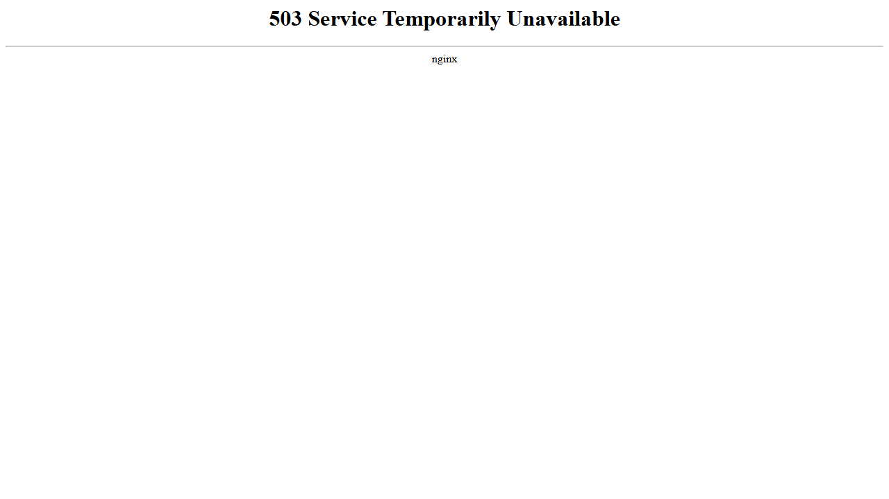

- 🎬 [Vídeo da execução (video.webm)](artifacts/projects-modelos-tests-fea-83c1a-tatus-ativo-inativo-no-card-chromium/video.webm)

- 📦 **Trace** — [`trace.zip`](artifacts/projects-modelos-tests-fea-83c1a-tatus-ativo-inativo-no-card-chromium/trace.zip)

  ```bash
  npx playwright show-trace outputs/modelos/reports/regression_20260525-111454/artifacts/projects-modelos-tests-fea-83c1a-tatus-ativo-inativo-no-card-chromium/trace.zip
  ```

- 🎥 **Vídeo** — [`video.webm`](artifacts/projects-modelos-tests-fea-83c1a-tatus-ativo-inativo-no-card-chromium/video.webm)

- 📄 **DOM no momento da falha** — [`error-context.md`](artifacts/projects-modelos-tests-fea-83c1a-tatus-ativo-inativo-no-card-chromium/error-context.md)

#### 🐛 Pronto para registro de bug

> ❓ **Análise automática:** Inconclusivo (precisa investigação manual) · Confiança 🔴 baixa
> _Por quê:_ Sem sinal Network in-scope ou padrão de erro conhecido — revisar trace
> _Bug-report estruturado:_ [`bug-reports/listagem-e-menu-de-modelos__indicador-de-cor-lateral-reflete-status-ativo-inativo-no-card.md`](bug-reports/listagem-e-menu-de-modelos__indicador-de-cor-lateral-reflete-status-ativo-inativo-no-card.md)

**Próximas ações sugeridas:**
- Sem evidência suficiente para classificar — abrir `trace.zip` (`npx playwright show-trace`) para ver passo a passo da execução.
- Reabrir o agente com o trace em mãos para reclassificar manualmente em uma das 4 categorias.

**Descrição do BUG:** [Normal] Indicador de cor lateral reflete status ativo/inativo no card — O elemento esperado não apareceu na tela (locator: getByTestId('content-models-page')).

**Passo a passo para reprodução:**
1. Pré: Ambiente Stage configurado
1. Pré: Feature flag `modelos_de_conteudo` ativa na organização do teste
1. Pré: Pelo menos 2 modelos cadastrados (1 ativo, 1 inativo) para validar visualizações
1. Pré: Usuário logado como Admin
1. 1. Acessar a listagem em formato Cards com modelos ativos e inativos
1. 2. Aguardar o card de um modelo ativo ser exibido
1. 3. Aguardar o card de um modelo inativo ser exibido

**Comportamento esperado:** Listagem exibe cards com indicadores de cor lateral distintos para modelos ativos e inativos.

**Comportamento atual:** O elemento esperado não apareceu na tela (locator: getByTestId('content-models-page')). (falha aconteceu no passo 1: "Acessar listagem em Cards", que deveria resultar em: Listagem exibe cards com indicadores de cor lateral distintos para modelos ativos e inativos.)

**Informações:**

| Campo | Valor |
|---|---|
| URL | `https://basedeconhecimento.stage.twygoead.com/` |
| Login | Credenciais via env: `TWYGO_STAGING_BASE_DE_CONHECIMENTO_EMAIL` (consulte `.env`) |
| Senha | Credenciais via env: `TWYGO_STAGING_BASE_DE_CONHECIMENTO_PASSWORD` (consulte `.env`) |
| orgId | — |
| Outros | Browser: chromium |
| Outros | runId: regression_20260525-111454 |
| Outros | Duração até a falha: 66.68s |
| Outros | Step impactado: 1. Acessar listagem em Cards |

**Evidências:**

- Screenshot capturado pelo Playwright (screenshot): artifacts/projects-modelos-tests-fea-83c1a-tatus-ativo-inativo-no-card-chromium/test-failed-1.png
- Vídeo da execução (video.webm): artifacts/projects-modelos-tests-fea-83c1a-tatus-ativo-inativo-no-card-chromium/video.webm
- Snapshot do DOM/contexto da página (error-context.md): artifacts/projects-modelos-tests-fea-83c1a-tatus-ativo-inativo-no-card-chromium/error-context.md
- Trace completo do Playwright (.zip) — `npx playwright show-trace`: artifacts/projects-modelos-tests-fea-83c1a-tatus-ativo-inativo-no-card-chromium/trace.zip

<details><summary>📋 Ver texto agregado para copiar (Jira/GitHub/Linear)</summary>

```
Descrição do BUG
[Normal] Indicador de cor lateral reflete status ativo/inativo no card — O elemento esperado não apareceu na tela (locator: getByTestId('content-models-page')).

Passo a passo para reprodução
  Pré: Ambiente Stage configurado
  Pré: Feature flag `modelos_de_conteudo` ativa na organização do teste
  Pré: Pelo menos 2 modelos cadastrados (1 ativo, 1 inativo) para validar visualizações
  Pré: Usuário logado como Admin
  1. Acessar a listagem em formato Cards com modelos ativos e inativos
  2. Aguardar o card de um modelo ativo ser exibido
  3. Aguardar o card de um modelo inativo ser exibido

Comportamento esperado
Listagem exibe cards com indicadores de cor lateral distintos para modelos ativos e inativos.

Comportamento atual
O elemento esperado não apareceu na tela (locator: getByTestId('content-models-page')). (falha aconteceu no passo 1: "Acessar listagem em Cards", que deveria resultar em: Listagem exibe cards com indicadores de cor lateral distintos para modelos ativos e inativos.)

Informações
- URL: https://basedeconhecimento.stage.twygoead.com/
- Login: Credenciais via env: `TWYGO_STAGING_BASE_DE_CONHECIMENTO_EMAIL` (consulte `.env`)
- Senha: Credenciais via env: `TWYGO_STAGING_BASE_DE_CONHECIMENTO_PASSWORD` (consulte `.env`)
- ID do ambiente (orgId): —
- Outros:
  - Browser: chromium
  - runId: regression_20260525-111454
  - Duração até a falha: 66.68s
  - Step impactado: 1. Acessar listagem em Cards

Evidências
- Screenshot capturado pelo Playwright (screenshot): artifacts/projects-modelos-tests-fea-83c1a-tatus-ativo-inativo-no-card-chromium/test-failed-1.png
- Vídeo da execução (video.webm): artifacts/projects-modelos-tests-fea-83c1a-tatus-ativo-inativo-no-card-chromium/video.webm
- Snapshot do DOM/contexto da página (error-context.md): artifacts/projects-modelos-tests-fea-83c1a-tatus-ativo-inativo-no-card-chromium/error-context.md
- Trace completo do Playwright (.zip) — `npx playwright show-trace`: artifacts/projects-modelos-tests-fea-83c1a-tatus-ativo-inativo-no-card-chromium/trace.zip

Execução
- runId: regression_20260525-111454
- environment.json: staging-base-de-conhecimento
- testsuite: Listagem e Menu de Modelos
- testcase: Indicador de cor lateral reflete status ativo/inativo no card

```

</details>

<details><summary>🔧 Stack trace técnica completa (para desenvolvedor)</summary>

```
Error: expect(locator).toBeVisible() failed

Locator: getByTestId('content-models-page')
Expected: visible
Timeout: 60000ms
Error: element(s) not found

Call log:
  - Expect "toBeVisible" with timeout 60000ms
  - waiting for getByTestId('content-models-page')

```

</details>

---

## Filtros e Busca - Modelos

_5 caso(s) — 0 aprovado(s), 5 falha(s)_

### ❌ Falhou · TC1 · Buscar modelo por nome · 🔴 Crítico

<a id="buscar-modelo-por-nome"></a>_Arquivo:_ `tc01-buscar-modelo-por-nome.spec.ts` · _Duração:_ 67.90s · _Browser:_ chromium

> **❌ Por que falhou:** O elemento esperado não apareceu na tela (locator: getByTestId('content-models-page')).
> _Step impactado:_ **1. Acessar listagem com múltiplos modelos**

**Sumário (objetivo do caso):** Validar busca textual por nome do modelo na listagem.

**Pré-condições:**

```
Ambiente Stage configurado
Feature flag `modelos_de_conteudo` ativa
Pelo menos 4 modelos cadastrados (ativos, inativos, próprios e de terceiros) para validar filtros
Usuário logado como Admin
```

**Passos do caso (XML/TestLink + execução Playwright):**

_Cada linha reproduz um passo do XML; a coluna **Status** traz o resultado da execução (do step Allure correspondente). Linhas com "Pré-condição" são da execução automatizada (login, navegação inicial) — não fazem parte do roteiro do XML._

| # | Ação do passo | Resultado esperado | Status | Notas | Duração |
|---|---|---|:---:|---|---:|
| 1 | Acessar a URL "/o/{orgId}/content_models" | Listagem é exibida com múltiplos modelos. | ❌ | O elemento esperado não apareceu na tela (locator: getByTestId('content-models-page')). | 64.14s |
| 2 | Preencher o campo "Buscar" com "Modelo TC1" | Listagem filtra exibindo apenas modelos cujo nome contém "Modelo TC1". | ⊘ | Step não executado: o teste foi interrompido antes. Causa: O elemento esperado não apareceu na tela (locator: getByTestId('content-models-page')).. | — |
| 3 | Limpar o campo "Buscar" | Listagem volta a exibir todos os modelos cadastrados. | ⊘ | Step não executado: o teste foi interrompido antes. Causa: O elemento esperado não apareceu na tela (locator: getByTestId('content-models-page')).. | — |

**Evidências:**

📁 _Pasta:_ [`artifacts/projects-modelos-tests-fea-58924-elos-Buscar-modelo-por-nome-chromium/`](artifacts/projects-modelos-tests-fea-58924-elos-Buscar-modelo-por-nome-chromium/)

- 📸 **Screenshot (screenshot)** — [`test-failed-1.png`](artifacts/projects-modelos-tests-fea-58924-elos-Buscar-modelo-por-nome-chromium/test-failed-1.png)

  

- 🎬 [Vídeo da execução (video.webm)](artifacts/projects-modelos-tests-fea-58924-elos-Buscar-modelo-por-nome-chromium/video.webm)

- 📦 **Trace** — [`trace.zip`](artifacts/projects-modelos-tests-fea-58924-elos-Buscar-modelo-por-nome-chromium/trace.zip)

  ```bash
  npx playwright show-trace outputs/modelos/reports/regression_20260525-111454/artifacts/projects-modelos-tests-fea-58924-elos-Buscar-modelo-por-nome-chromium/trace.zip
  ```

- 🎥 **Vídeo** — [`video.webm`](artifacts/projects-modelos-tests-fea-58924-elos-Buscar-modelo-por-nome-chromium/video.webm)

- 📄 **DOM no momento da falha** — [`error-context.md`](artifacts/projects-modelos-tests-fea-58924-elos-Buscar-modelo-por-nome-chromium/error-context.md)

#### 🐛 Pronto para registro de bug

> ❓ **Análise automática:** Inconclusivo (precisa investigação manual) · Confiança 🔴 baixa
> _Por quê:_ Sem sinal Network in-scope ou padrão de erro conhecido — revisar trace
> _Bug-report estruturado:_ [`bug-reports/filtros-e-busca-modelos__buscar-modelo-por-nome.md`](bug-reports/filtros-e-busca-modelos__buscar-modelo-por-nome.md)

**Próximas ações sugeridas:**
- Sem evidência suficiente para classificar — abrir `trace.zip` (`npx playwright show-trace`) para ver passo a passo da execução.
- Reabrir o agente com o trace em mãos para reclassificar manualmente em uma das 4 categorias.

**Descrição do BUG:** [Crítico] Buscar modelo por nome — O elemento esperado não apareceu na tela (locator: getByTestId('content-models-page')).

**Passo a passo para reprodução:**
1. Pré: Ambiente Stage configurado
1. Pré: Feature flag `modelos_de_conteudo` ativa
1. Pré: Pelo menos 4 modelos cadastrados (ativos, inativos, próprios e de terceiros) para validar filtros
1. Pré: Usuário logado como Admin
1. 1. Acessar a URL "/o/{orgId}/content_models"
1. 2. Preencher o campo "Buscar" com "Modelo TC1"
1. 3. Limpar o campo "Buscar"

**Comportamento esperado:** Listagem é exibida com múltiplos modelos.

**Comportamento atual:** O elemento esperado não apareceu na tela (locator: getByTestId('content-models-page')). (falha aconteceu no passo 1: "Acessar listagem com múltiplos modelos", que deveria resultar em: Listagem é exibida com múltiplos modelos.)

**Informações:**

| Campo | Valor |
|---|---|
| URL | `https://basedeconhecimento.stage.twygoead.com/` |
| Login | Credenciais via env: `TWYGO_STAGING_BASE_DE_CONHECIMENTO_EMAIL` (consulte `.env`) |
| Senha | Credenciais via env: `TWYGO_STAGING_BASE_DE_CONHECIMENTO_PASSWORD` (consulte `.env`) |
| orgId | — |
| Outros | Browser: chromium |
| Outros | runId: regression_20260525-111454 |
| Outros | Duração até a falha: 67.90s |
| Outros | Step impactado: 1. Acessar listagem com múltiplos modelos |

**Evidências:**

- Screenshot capturado pelo Playwright (screenshot): artifacts/projects-modelos-tests-fea-58924-elos-Buscar-modelo-por-nome-chromium/test-failed-1.png
- Vídeo da execução (video.webm): artifacts/projects-modelos-tests-fea-58924-elos-Buscar-modelo-por-nome-chromium/video.webm
- Snapshot do DOM/contexto da página (error-context.md): artifacts/projects-modelos-tests-fea-58924-elos-Buscar-modelo-por-nome-chromium/error-context.md
- Trace completo do Playwright (.zip) — `npx playwright show-trace`: artifacts/projects-modelos-tests-fea-58924-elos-Buscar-modelo-por-nome-chromium/trace.zip

<details><summary>📋 Ver texto agregado para copiar (Jira/GitHub/Linear)</summary>

```
Descrição do BUG
[Crítico] Buscar modelo por nome — O elemento esperado não apareceu na tela (locator: getByTestId('content-models-page')).

Passo a passo para reprodução
  Pré: Ambiente Stage configurado
  Pré: Feature flag `modelos_de_conteudo` ativa
  Pré: Pelo menos 4 modelos cadastrados (ativos, inativos, próprios e de terceiros) para validar filtros
  Pré: Usuário logado como Admin
  1. Acessar a URL "/o/{orgId}/content_models"
  2. Preencher o campo "Buscar" com "Modelo TC1"
  3. Limpar o campo "Buscar"

Comportamento esperado
Listagem é exibida com múltiplos modelos.

Comportamento atual
O elemento esperado não apareceu na tela (locator: getByTestId('content-models-page')). (falha aconteceu no passo 1: "Acessar listagem com múltiplos modelos", que deveria resultar em: Listagem é exibida com múltiplos modelos.)

Informações
- URL: https://basedeconhecimento.stage.twygoead.com/
- Login: Credenciais via env: `TWYGO_STAGING_BASE_DE_CONHECIMENTO_EMAIL` (consulte `.env`)
- Senha: Credenciais via env: `TWYGO_STAGING_BASE_DE_CONHECIMENTO_PASSWORD` (consulte `.env`)
- ID do ambiente (orgId): —
- Outros:
  - Browser: chromium
  - runId: regression_20260525-111454
  - Duração até a falha: 67.90s
  - Step impactado: 1. Acessar listagem com múltiplos modelos

Evidências
- Screenshot capturado pelo Playwright (screenshot): artifacts/projects-modelos-tests-fea-58924-elos-Buscar-modelo-por-nome-chromium/test-failed-1.png
- Vídeo da execução (video.webm): artifacts/projects-modelos-tests-fea-58924-elos-Buscar-modelo-por-nome-chromium/video.webm
- Snapshot do DOM/contexto da página (error-context.md): artifacts/projects-modelos-tests-fea-58924-elos-Buscar-modelo-por-nome-chromium/error-context.md
- Trace completo do Playwright (.zip) — `npx playwright show-trace`: artifacts/projects-modelos-tests-fea-58924-elos-Buscar-modelo-por-nome-chromium/trace.zip

Execução
- runId: regression_20260525-111454
- environment.json: staging-base-de-conhecimento
- testsuite: Filtros e Busca - Modelos
- testcase: Buscar modelo por nome

```

</details>

<details><summary>🔧 Stack trace técnica completa (para desenvolvedor)</summary>

```
Error: expect(locator).toBeVisible() failed

Locator: getByTestId('content-models-page')
Expected: visible
Timeout: 60000ms
Error: element(s) not found

Call log:
  - Expect "toBeVisible" with timeout 60000ms
  - waiting for getByTestId('content-models-page')

```

</details>

---

### ❌ Falhou · TC2 · Filtrar modelos por Situação via drawer · 🔴 Crítico

<a id="filtrar-modelos-por-situacao-via-drawer"></a>_Arquivo:_ `tc02-filtrar-por-situacao-via-drawer.spec.ts` · _Duração:_ 70.28s · _Browser:_ chromium

> **❌ Por que falhou:** O elemento esperado não apareceu na tela (locator: getByTestId('content-models-page')).
> _Step impactado:_ **1. Acessar listagem e abrir drawer de filtros**

**Sumário (objetivo do caso):** Validar filtragem por Situação (Ativo/Inativo) via drawer de filtros, conforme RN 60.

**Pré-condições:**

```
Ambiente Stage configurado
Feature flag `modelos_de_conteudo` ativa
Pelo menos 4 modelos cadastrados (ativos, inativos, próprios e de terceiros) para validar filtros
Usuário logado como Admin
```

**Passos do caso (XML/TestLink + execução Playwright):**

_Cada linha reproduz um passo do XML; a coluna **Status** traz o resultado da execução (do step Allure correspondente). Linhas com "Pré-condição" são da execução automatizada (login, navegação inicial) — não fazem parte do roteiro do XML._

| # | Ação do passo | Resultado esperado | Status | Notas | Duração |
|---|---|---|:---:|---|---:|
| 1 | Clicar no botão "Filtrar" | Drawer "Filtros" é exibido à direita. | ❌ | O elemento esperado não apareceu na tela (locator: getByTestId('content-models-page')). | 64.53s |
| 2 | Selecionar a opção "Ativo" no filtro "Situação" | Filtro "Situação" exibe a opção "Ativo" selecionada. | ⊘ | Step não executado: o teste foi interrompido antes. Causa: O elemento esperado não apareceu na tela (locator: getByTestId('content-models-page')).. | — |
| 3 | Aplicar o filtro | Drawer fecha. Listagem exibe apenas modelos com Situação "Ativo". | ⊘ | Step não executado: o teste foi interrompido antes. Causa: O elemento esperado não apareceu na tela (locator: getByTestId('content-models-page')).. | — |

**Evidências:**

📁 _Pasta:_ [`artifacts/projects-modelos-tests-fea-40575-los-por-Situação-via-drawer-chromium/`](artifacts/projects-modelos-tests-fea-40575-los-por-Situação-via-drawer-chromium/)

- 📸 **Screenshot (screenshot)** — [`test-failed-1.png`](artifacts/projects-modelos-tests-fea-40575-los-por-Situação-via-drawer-chromium/test-failed-1.png)

  

- 🎬 [Vídeo da execução (video.webm)](artifacts/projects-modelos-tests-fea-40575-los-por-Situação-via-drawer-chromium/video.webm)

- 📦 **Trace** — [`trace.zip`](artifacts/projects-modelos-tests-fea-40575-los-por-Situação-via-drawer-chromium/trace.zip)

  ```bash
  npx playwright show-trace outputs/modelos/reports/regression_20260525-111454/artifacts/projects-modelos-tests-fea-40575-los-por-Situação-via-drawer-chromium/trace.zip
  ```

- 🎥 **Vídeo** — [`video.webm`](artifacts/projects-modelos-tests-fea-40575-los-por-Situação-via-drawer-chromium/video.webm)

- 📄 **DOM no momento da falha** — [`error-context.md`](artifacts/projects-modelos-tests-fea-40575-los-por-Situação-via-drawer-chromium/error-context.md)

#### 🐛 Pronto para registro de bug

> ❓ **Análise automática:** Inconclusivo (precisa investigação manual) · Confiança 🔴 baixa
> _Por quê:_ Sem sinal Network in-scope ou padrão de erro conhecido — revisar trace
> _Bug-report estruturado:_ [`bug-reports/filtros-e-busca-modelos__filtrar-modelos-por-situacao-via-drawer.md`](bug-reports/filtros-e-busca-modelos__filtrar-modelos-por-situacao-via-drawer.md)

**Próximas ações sugeridas:**
- Sem evidência suficiente para classificar — abrir `trace.zip` (`npx playwright show-trace`) para ver passo a passo da execução.
- Reabrir o agente com o trace em mãos para reclassificar manualmente em uma das 4 categorias.

**Descrição do BUG:** [Crítico] Filtrar modelos por Situação via drawer — O elemento esperado não apareceu na tela (locator: getByTestId('content-models-page')).

**Passo a passo para reprodução:**
1. Pré: Ambiente Stage configurado
1. Pré: Feature flag `modelos_de_conteudo` ativa
1. Pré: Pelo menos 4 modelos cadastrados (ativos, inativos, próprios e de terceiros) para validar filtros
1. Pré: Usuário logado como Admin
1. 1. Clicar no botão "Filtrar"
1. 2. Selecionar a opção "Ativo" no filtro "Situação"
1. 3. Aplicar o filtro

**Comportamento esperado:** Drawer "Filtros" é exibido à direita.

**Comportamento atual:** O elemento esperado não apareceu na tela (locator: getByTestId('content-models-page')). (falha aconteceu no passo 1: "Acessar listagem e abrir drawer de filtros", que deveria resultar em: Drawer "Filtros" é exibido à direita.)

**Informações:**

| Campo | Valor |
|---|---|
| URL | `https://basedeconhecimento.stage.twygoead.com/` |
| Login | Credenciais via env: `TWYGO_STAGING_BASE_DE_CONHECIMENTO_EMAIL` (consulte `.env`) |
| Senha | Credenciais via env: `TWYGO_STAGING_BASE_DE_CONHECIMENTO_PASSWORD` (consulte `.env`) |
| orgId | — |
| Outros | Browser: chromium |
| Outros | runId: regression_20260525-111454 |
| Outros | Duração até a falha: 70.28s |
| Outros | Step impactado: 1. Acessar listagem e abrir drawer de filtros |

**Evidências:**

- Screenshot capturado pelo Playwright (screenshot): artifacts/projects-modelos-tests-fea-40575-los-por-Situação-via-drawer-chromium/test-failed-1.png
- Vídeo da execução (video.webm): artifacts/projects-modelos-tests-fea-40575-los-por-Situação-via-drawer-chromium/video.webm
- Snapshot do DOM/contexto da página (error-context.md): artifacts/projects-modelos-tests-fea-40575-los-por-Situação-via-drawer-chromium/error-context.md
- Trace completo do Playwright (.zip) — `npx playwright show-trace`: artifacts/projects-modelos-tests-fea-40575-los-por-Situação-via-drawer-chromium/trace.zip

<details><summary>📋 Ver texto agregado para copiar (Jira/GitHub/Linear)</summary>

```
Descrição do BUG
[Crítico] Filtrar modelos por Situação via drawer — O elemento esperado não apareceu na tela (locator: getByTestId('content-models-page')).

Passo a passo para reprodução
  Pré: Ambiente Stage configurado
  Pré: Feature flag `modelos_de_conteudo` ativa
  Pré: Pelo menos 4 modelos cadastrados (ativos, inativos, próprios e de terceiros) para validar filtros
  Pré: Usuário logado como Admin
  1. Clicar no botão "Filtrar"
  2. Selecionar a opção "Ativo" no filtro "Situação"
  3. Aplicar o filtro

Comportamento esperado
Drawer "Filtros" é exibido à direita.

Comportamento atual
O elemento esperado não apareceu na tela (locator: getByTestId('content-models-page')). (falha aconteceu no passo 1: "Acessar listagem e abrir drawer de filtros", que deveria resultar em: Drawer "Filtros" é exibido à direita.)

Informações
- URL: https://basedeconhecimento.stage.twygoead.com/
- Login: Credenciais via env: `TWYGO_STAGING_BASE_DE_CONHECIMENTO_EMAIL` (consulte `.env`)
- Senha: Credenciais via env: `TWYGO_STAGING_BASE_DE_CONHECIMENTO_PASSWORD` (consulte `.env`)
- ID do ambiente (orgId): —
- Outros:
  - Browser: chromium
  - runId: regression_20260525-111454
  - Duração até a falha: 70.28s
  - Step impactado: 1. Acessar listagem e abrir drawer de filtros

Evidências
- Screenshot capturado pelo Playwright (screenshot): artifacts/projects-modelos-tests-fea-40575-los-por-Situação-via-drawer-chromium/test-failed-1.png
- Vídeo da execução (video.webm): artifacts/projects-modelos-tests-fea-40575-los-por-Situação-via-drawer-chromium/video.webm
- Snapshot do DOM/contexto da página (error-context.md): artifacts/projects-modelos-tests-fea-40575-los-por-Situação-via-drawer-chromium/error-context.md
- Trace completo do Playwright (.zip) — `npx playwright show-trace`: artifacts/projects-modelos-tests-fea-40575-los-por-Situação-via-drawer-chromium/trace.zip

Execução
- runId: regression_20260525-111454
- environment.json: staging-base-de-conhecimento
- testsuite: Filtros e Busca - Modelos
- testcase: Filtrar modelos por Situação via drawer

```

</details>

<details><summary>🔧 Stack trace técnica completa (para desenvolvedor)</summary>

```
Error: expect(locator).toBeVisible() failed

Locator: getByTestId('content-models-page')
Expected: visible
Timeout: 60000ms
Error: element(s) not found

Call log:
  - Expect "toBeVisible" with timeout 60000ms
  - waiting for getByTestId('content-models-page')

```

</details>

---

### ❌ Falhou · Aplicar filtro padrão Modelos próprios 

<a id="aplicar-filtro-padrao-modelos-proprios"></a>_Arquivo:_ `tc03-aplicar-filtro-padrao-modelos-proprios.spec.ts` · _Duração:_ 68.39s · _Browser:_ chromium

> **❌ Por que falhou:** O elemento esperado não apareceu na tela (locator: getByTestId('content-models-page')).
> _Step impactado:_ **1. Acessar listagem e abrir drawer com 4 filtros padrão visíveis**

**Passos do caso (XML/TestLink + execução Playwright):**

_Cada linha reproduz um passo do XML; a coluna **Status** traz o resultado da execução (do step Allure correspondente). Linhas com "Pré-condição" são da execução automatizada (login, navegação inicial) — não fazem parte do roteiro do XML._

| # | Ação do passo | Resultado esperado | Status | Notas | Duração |
|---|---|---|:---:|---|---:|
| — | _Pré-condição:_ 1. Acessar listagem e abrir drawer com 4 filtros padrão visíveis | — | ❌ | O elemento esperado não apareceu na tela (locator: getByTestId('content-models-page')). | 63.86s |

**Evidências:**

📁 _Pasta:_ [`artifacts/projects-modelos-tests-fea-5260f-tro-padrão-Modelos-próprios-chromium/`](artifacts/projects-modelos-tests-fea-5260f-tro-padrão-Modelos-próprios-chromium/)

- 📸 **Screenshot (screenshot)** — [`test-failed-1.png`](artifacts/projects-modelos-tests-fea-5260f-tro-padrão-Modelos-próprios-chromium/test-failed-1.png)

  

- 🎬 [Vídeo da execução (video.webm)](artifacts/projects-modelos-tests-fea-5260f-tro-padrão-Modelos-próprios-chromium/video.webm)

- 📦 **Trace** — [`trace.zip`](artifacts/projects-modelos-tests-fea-5260f-tro-padrão-Modelos-próprios-chromium/trace.zip)

  ```bash
  npx playwright show-trace outputs/modelos/reports/regression_20260525-111454/artifacts/projects-modelos-tests-fea-5260f-tro-padrão-Modelos-próprios-chromium/trace.zip
  ```

- 🎥 **Vídeo** — [`video.webm`](artifacts/projects-modelos-tests-fea-5260f-tro-padrão-Modelos-próprios-chromium/video.webm)

- 📄 **DOM no momento da falha** — [`error-context.md`](artifacts/projects-modelos-tests-fea-5260f-tro-padrão-Modelos-próprios-chromium/error-context.md)

#### 🐛 Pronto para registro de bug

> ❓ **Análise automática:** Inconclusivo (precisa investigação manual) · Confiança 🔴 baixa
> _Por quê:_ Sem sinal Network in-scope ou padrão de erro conhecido — revisar trace
> _Bug-report estruturado:_ [`bug-reports/filtros-e-busca-modelos__aplicar-filtro-padrao-modelos-proprios.md`](bug-reports/filtros-e-busca-modelos__aplicar-filtro-padrao-modelos-proprios.md)

**Próximas ações sugeridas:**
- Sem evidência suficiente para classificar — abrir `trace.zip` (`npx playwright show-trace`) para ver passo a passo da execução.
- Reabrir o agente com o trace em mãos para reclassificar manualmente em uma das 4 categorias.

**Descrição do BUG:** [—] Aplicar filtro padrão Modelos próprios — O elemento esperado não apareceu na tela (locator: getByTestId('content-models-page')).

**Passo a passo para reprodução:**
1. — (sem steps documentados no XML)

**Comportamento esperado:** —

**Comportamento atual:** O elemento esperado não apareceu na tela (locator: getByTestId('content-models-page')). (falha aconteceu no passo 1: "Acessar listagem e abrir drawer com 4 filtros padrão visíveis")

**Informações:**

| Campo | Valor |
|---|---|
| URL | `https://basedeconhecimento.stage.twygoead.com/` |
| Login | Credenciais via env: `TWYGO_STAGING_BASE_DE_CONHECIMENTO_EMAIL` (consulte `.env`) |
| Senha | Credenciais via env: `TWYGO_STAGING_BASE_DE_CONHECIMENTO_PASSWORD` (consulte `.env`) |
| orgId | — |
| Outros | Browser: chromium |
| Outros | runId: regression_20260525-111454 |
| Outros | Duração até a falha: 68.39s |
| Outros | Step impactado: 1. Acessar listagem e abrir drawer com 4 filtros padrão visíveis |

**Evidências:**

- Screenshot capturado pelo Playwright (screenshot): artifacts/projects-modelos-tests-fea-5260f-tro-padrão-Modelos-próprios-chromium/test-failed-1.png
- Vídeo da execução (video.webm): artifacts/projects-modelos-tests-fea-5260f-tro-padrão-Modelos-próprios-chromium/video.webm
- Snapshot do DOM/contexto da página (error-context.md): artifacts/projects-modelos-tests-fea-5260f-tro-padrão-Modelos-próprios-chromium/error-context.md
- Trace completo do Playwright (.zip) — `npx playwright show-trace`: artifacts/projects-modelos-tests-fea-5260f-tro-padrão-Modelos-próprios-chromium/trace.zip

<details><summary>📋 Ver texto agregado para copiar (Jira/GitHub/Linear)</summary>

```
Descrição do BUG
[—] Aplicar filtro padrão Modelos próprios — O elemento esperado não apareceu na tela (locator: getByTestId('content-models-page')).

Passo a passo para reprodução
  — (sem steps documentados no XML)

Comportamento esperado
—

Comportamento atual
O elemento esperado não apareceu na tela (locator: getByTestId('content-models-page')). (falha aconteceu no passo 1: "Acessar listagem e abrir drawer com 4 filtros padrão visíveis")

Informações
- URL: https://basedeconhecimento.stage.twygoead.com/
- Login: Credenciais via env: `TWYGO_STAGING_BASE_DE_CONHECIMENTO_EMAIL` (consulte `.env`)
- Senha: Credenciais via env: `TWYGO_STAGING_BASE_DE_CONHECIMENTO_PASSWORD` (consulte `.env`)
- ID do ambiente (orgId): —
- Outros:
  - Browser: chromium
  - runId: regression_20260525-111454
  - Duração até a falha: 68.39s
  - Step impactado: 1. Acessar listagem e abrir drawer com 4 filtros padrão visíveis

Evidências
- Screenshot capturado pelo Playwright (screenshot): artifacts/projects-modelos-tests-fea-5260f-tro-padrão-Modelos-próprios-chromium/test-failed-1.png
- Vídeo da execução (video.webm): artifacts/projects-modelos-tests-fea-5260f-tro-padrão-Modelos-próprios-chromium/video.webm
- Snapshot do DOM/contexto da página (error-context.md): artifacts/projects-modelos-tests-fea-5260f-tro-padrão-Modelos-próprios-chromium/error-context.md
- Trace completo do Playwright (.zip) — `npx playwright show-trace`: artifacts/projects-modelos-tests-fea-5260f-tro-padrão-Modelos-próprios-chromium/trace.zip

Execução
- runId: regression_20260525-111454
- environment.json: staging-base-de-conhecimento
- testsuite: Filtros e Busca - Modelos
- testcase: Aplicar filtro padrão Modelos próprios

```

</details>

<details><summary>🔧 Stack trace técnica completa (para desenvolvedor)</summary>

```
Error: expect(locator).toBeVisible() failed

Locator: getByTestId('content-models-page')
Expected: visible
Timeout: 60000ms
Error: element(s) not found

Call log:
  - Expect "toBeVisible" with timeout 60000ms
  - waiting for getByTestId('content-models-page')

```

</details>

---

### ❌ Falhou · TC4 · Limpar filtros aplicados · 🟡 Normal

<a id="limpar-filtros-aplicados"></a>_Arquivo:_ `tc04-limpar-filtros-aplicados.spec.ts` · _Duração:_ 73.17s · _Browser:_ chromium

> **❌ Por que falhou:** O elemento esperado não apareceu na tela (locator: getByTestId('content-models-page')).
> _Step impactado:_ **1. Aplicar filtro padrão Modelos ativos**

**Sumário (objetivo do caso):** Validar limpeza dos filtros aplicados.

**Pré-condições:**

```
Ambiente Stage configurado
Feature flag `modelos_de_conteudo` ativa
Pelo menos 4 modelos cadastrados (ativos, inativos, próprios e de terceiros) para validar filtros
Usuário logado como Admin
```

**Passos do caso (XML/TestLink + execução Playwright):**

_Cada linha reproduz um passo do XML; a coluna **Status** traz o resultado da execução (do step Allure correspondente). Linhas com "Pré-condição" são da execução automatizada (login, navegação inicial) — não fazem parte do roteiro do XML._

| # | Ação do passo | Resultado esperado | Status | Notas | Duração |
|---|---|---|:---:|---|---:|
| 1 | Aplicar o filtro padrão "Modelos ativos" | Listagem é filtrada exibindo apenas modelos ativos. | ❌ | O elemento esperado não apareceu na tela (locator: getByTestId('content-models-page')). | 64.00s |
| 2 | Clicar no botão "Limpar filtros" | Listagem volta a exibir todos os modelos cadastrados sem filtros aplicados. | ⊘ | Step não executado: o teste foi interrompido antes. Causa: O elemento esperado não apareceu na tela (locator: getByTestId('content-models-page')).. | — |

**Evidências:**

📁 _Pasta:_ [`artifacts/projects-modelos-tests-fea-7b8fa-os-Limpar-filtros-aplicados-chromium/`](artifacts/projects-modelos-tests-fea-7b8fa-os-Limpar-filtros-aplicados-chromium/)

- 📸 **Screenshot (screenshot)** — [`test-failed-1.png`](artifacts/projects-modelos-tests-fea-7b8fa-os-Limpar-filtros-aplicados-chromium/test-failed-1.png)

  

- 🎬 [Vídeo da execução (video.webm)](artifacts/projects-modelos-tests-fea-7b8fa-os-Limpar-filtros-aplicados-chromium/video.webm)

- 📦 **Trace** — [`trace.zip`](artifacts/projects-modelos-tests-fea-7b8fa-os-Limpar-filtros-aplicados-chromium/trace.zip)

  ```bash
  npx playwright show-trace outputs/modelos/reports/regression_20260525-111454/artifacts/projects-modelos-tests-fea-7b8fa-os-Limpar-filtros-aplicados-chromium/trace.zip
  ```

- 🎥 **Vídeo** — [`video.webm`](artifacts/projects-modelos-tests-fea-7b8fa-os-Limpar-filtros-aplicados-chromium/video.webm)

- 📄 **DOM no momento da falha** — [`error-context.md`](artifacts/projects-modelos-tests-fea-7b8fa-os-Limpar-filtros-aplicados-chromium/error-context.md)

#### 🐛 Pronto para registro de bug

> ❓ **Análise automática:** Inconclusivo (precisa investigação manual) · Confiança 🔴 baixa
> _Por quê:_ Sem sinal Network in-scope ou padrão de erro conhecido — revisar trace
> _Bug-report estruturado:_ [`bug-reports/filtros-e-busca-modelos__limpar-filtros-aplicados.md`](bug-reports/filtros-e-busca-modelos__limpar-filtros-aplicados.md)

**Próximas ações sugeridas:**
- Sem evidência suficiente para classificar — abrir `trace.zip` (`npx playwright show-trace`) para ver passo a passo da execução.
- Reabrir o agente com o trace em mãos para reclassificar manualmente em uma das 4 categorias.

**Descrição do BUG:** [Normal] Limpar filtros aplicados — O elemento esperado não apareceu na tela (locator: getByTestId('content-models-page')).

**Passo a passo para reprodução:**
1. Pré: Ambiente Stage configurado
1. Pré: Feature flag `modelos_de_conteudo` ativa
1. Pré: Pelo menos 4 modelos cadastrados (ativos, inativos, próprios e de terceiros) para validar filtros
1. Pré: Usuário logado como Admin
1. 1. Aplicar o filtro padrão "Modelos ativos"
1. 2. Clicar no botão "Limpar filtros"

**Comportamento esperado:** Listagem é filtrada exibindo apenas modelos ativos.

**Comportamento atual:** O elemento esperado não apareceu na tela (locator: getByTestId('content-models-page')). (falha aconteceu no passo 1: "Aplicar filtro padrão Modelos ativos", que deveria resultar em: Listagem é filtrada exibindo apenas modelos ativos.)

**Informações:**

| Campo | Valor |
|---|---|
| URL | `https://basedeconhecimento.stage.twygoead.com/` |
| Login | Credenciais via env: `TWYGO_STAGING_BASE_DE_CONHECIMENTO_EMAIL` (consulte `.env`) |
| Senha | Credenciais via env: `TWYGO_STAGING_BASE_DE_CONHECIMENTO_PASSWORD` (consulte `.env`) |
| orgId | — |
| Outros | Browser: chromium |
| Outros | runId: regression_20260525-111454 |
| Outros | Duração até a falha: 73.17s |
| Outros | Step impactado: 1. Aplicar filtro padrão Modelos ativos |

**Evidências:**

- Screenshot capturado pelo Playwright (screenshot): artifacts/projects-modelos-tests-fea-7b8fa-os-Limpar-filtros-aplicados-chromium/test-failed-1.png
- Vídeo da execução (video.webm): artifacts/projects-modelos-tests-fea-7b8fa-os-Limpar-filtros-aplicados-chromium/video.webm
- Snapshot do DOM/contexto da página (error-context.md): artifacts/projects-modelos-tests-fea-7b8fa-os-Limpar-filtros-aplicados-chromium/error-context.md
- Trace completo do Playwright (.zip) — `npx playwright show-trace`: artifacts/projects-modelos-tests-fea-7b8fa-os-Limpar-filtros-aplicados-chromium/trace.zip

<details><summary>📋 Ver texto agregado para copiar (Jira/GitHub/Linear)</summary>

```
Descrição do BUG
[Normal] Limpar filtros aplicados — O elemento esperado não apareceu na tela (locator: getByTestId('content-models-page')).

Passo a passo para reprodução
  Pré: Ambiente Stage configurado
  Pré: Feature flag `modelos_de_conteudo` ativa
  Pré: Pelo menos 4 modelos cadastrados (ativos, inativos, próprios e de terceiros) para validar filtros
  Pré: Usuário logado como Admin
  1. Aplicar o filtro padrão "Modelos ativos"
  2. Clicar no botão "Limpar filtros"

Comportamento esperado
Listagem é filtrada exibindo apenas modelos ativos.

Comportamento atual
O elemento esperado não apareceu na tela (locator: getByTestId('content-models-page')). (falha aconteceu no passo 1: "Aplicar filtro padrão Modelos ativos", que deveria resultar em: Listagem é filtrada exibindo apenas modelos ativos.)

Informações
- URL: https://basedeconhecimento.stage.twygoead.com/
- Login: Credenciais via env: `TWYGO_STAGING_BASE_DE_CONHECIMENTO_EMAIL` (consulte `.env`)
- Senha: Credenciais via env: `TWYGO_STAGING_BASE_DE_CONHECIMENTO_PASSWORD` (consulte `.env`)
- ID do ambiente (orgId): —
- Outros:
  - Browser: chromium
  - runId: regression_20260525-111454
  - Duração até a falha: 73.17s
  - Step impactado: 1. Aplicar filtro padrão Modelos ativos

Evidências
- Screenshot capturado pelo Playwright (screenshot): artifacts/projects-modelos-tests-fea-7b8fa-os-Limpar-filtros-aplicados-chromium/test-failed-1.png
- Vídeo da execução (video.webm): artifacts/projects-modelos-tests-fea-7b8fa-os-Limpar-filtros-aplicados-chromium/video.webm
- Snapshot do DOM/contexto da página (error-context.md): artifacts/projects-modelos-tests-fea-7b8fa-os-Limpar-filtros-aplicados-chromium/error-context.md
- Trace completo do Playwright (.zip) — `npx playwright show-trace`: artifacts/projects-modelos-tests-fea-7b8fa-os-Limpar-filtros-aplicados-chromium/trace.zip

Execução
- runId: regression_20260525-111454
- environment.json: staging-base-de-conhecimento
- testsuite: Filtros e Busca - Modelos
- testcase: Limpar filtros aplicados

```

</details>

<details><summary>🔧 Stack trace técnica completa (para desenvolvedor)</summary>

```
Error: expect(locator).toBeVisible() failed

Locator: getByTestId('content-models-page')
Expected: visible
Timeout: 60000ms
Error: element(s) not found

Call log:
  - Expect "toBeVisible" with timeout 60000ms
  - waiting for getByTestId('content-models-page')

```

</details>

---

### ❌ Falhou · TC5 · Combinação de filtros + busca textual · 🔴 Crítico

<a id="combinacao-de-filtros-busca-textual"></a>_Arquivo:_ `tc05-combinar-filtros-busca-textual.spec.ts` · _Duração:_ 69.68s · _Browser:_ chromium

> **❌ Por que falhou:** O elemento esperado não apareceu na tela (locator: getByTestId('content-models-page')).
> _Step impactado:_ **1. Acessar listagem com múltiplos modelos**

**Sumário (objetivo do caso):** Validar aplicação simultânea de busca textual + filtrar por situação + filtrar por origem (combinatório). Atende §1.5 do CONTRACT.md v1.1.

**Pré-condições:**

```
Ambiente Stage configurado
Feature flag `modelos_de_conteudo` ativa
Pelo menos 4 modelos cadastrados (ativos, inativos, próprios e de terceiros) para validar filtros
Usuário logado como Admin
```

**Passos do caso (XML/TestLink + execução Playwright):**

_Cada linha reproduz um passo do XML; a coluna **Status** traz o resultado da execução (do step Allure correspondente). Linhas com "Pré-condição" são da execução automatizada (login, navegação inicial) — não fazem parte do roteiro do XML._

| # | Ação do passo | Resultado esperado | Status | Notas | Duração |
|---|---|---|:---:|---|---:|
| 1 | Acessar a URL "/o/{orgId}/content_models" | Listagem é exibida com múltiplos modelos. | ❌ | O elemento esperado não apareceu na tela (locator: getByTestId('content-models-page')). | 64.30s |
| 2 | Preencher o campo "Buscar" com "Modelo TC" | Listagem aplica busca textual e filtra exibindo apenas modelos cujo nome contém "Modelo TC". | ⊘ | Step não executado: o teste foi interrompido antes. Causa: O elemento esperado não apareceu na tela (locator: getByTestId('content-models-page')).. | — |
| 3 | Clicar no botão "Filtrar" | Drawer "Filtros" é exibido para filtrar por critérios adicionais. | ⊘ | Step não executado: o teste foi interrompido antes. Causa: O elemento esperado não apareceu na tela (locator: getByTestId('content-models-page')).. | — |
| 4 | Selecionar o filtro padrão "Modelos ativos" para filtrar por situação | Critério para filtrar por situação fica marcado. | ⊘ | Step não executado: o teste foi interrompido antes. Causa: O elemento esperado não apareceu na tela (locator: getByTestId('content-models-page')).. | — |
| 5 | Selecionar o filtro padrão "Modelos próprios" para filtrar por origem | Critério para filtrar por origem fica marcado. | ⊘ | Step não executado: o teste foi interrompido antes. Causa: O elemento esperado não apareceu na tela (locator: getByTestId('content-models-page')).. | — |
| 6 | Clicar no botão "Aplicar" para aplicar os filtros simultaneamente | Drawer fecha. Listagem exibe apenas modelos que: (a) contêm "Modelo TC" no nome, (b) estão ativos, (c) são próprios da organização. Resultado é a interseção das 3 condições. | ⊘ | Step não executado: o teste foi interrompido antes. Causa: O elemento esperado não apareceu na tela (locator: getByTestId('content-models-page')).. | — |
| 7 | Clicar no botão "Limpar filtros" para limpar todos os filtros aplicados | Listagem volta a exibir todos os modelos cadastrados. | ⊘ | Step não executado: o teste foi interrompido antes. Causa: O elemento esperado não apareceu na tela (locator: getByTestId('content-models-page')).. | — |

**Evidências:**

📁 _Pasta:_ [`artifacts/projects-modelos-tests-fea-bfc66-ão-de-filtros-busca-textual-chromium/`](artifacts/projects-modelos-tests-fea-bfc66-ão-de-filtros-busca-textual-chromium/)

- 📸 **Screenshot (screenshot)** — [`test-failed-1.png`](artifacts/projects-modelos-tests-fea-bfc66-ão-de-filtros-busca-textual-chromium/test-failed-1.png)

  

- 🎬 [Vídeo da execução (video.webm)](artifacts/projects-modelos-tests-fea-bfc66-ão-de-filtros-busca-textual-chromium/video.webm)

- 📦 **Trace** — [`trace.zip`](artifacts/projects-modelos-tests-fea-bfc66-ão-de-filtros-busca-textual-chromium/trace.zip)

  ```bash
  npx playwright show-trace outputs/modelos/reports/regression_20260525-111454/artifacts/projects-modelos-tests-fea-bfc66-ão-de-filtros-busca-textual-chromium/trace.zip
  ```

- 🎥 **Vídeo** — [`video.webm`](artifacts/projects-modelos-tests-fea-bfc66-ão-de-filtros-busca-textual-chromium/video.webm)

- 📄 **DOM no momento da falha** — [`error-context.md`](artifacts/projects-modelos-tests-fea-bfc66-ão-de-filtros-busca-textual-chromium/error-context.md)

#### 🐛 Pronto para registro de bug

> ❓ **Análise automática:** Inconclusivo (precisa investigação manual) · Confiança 🔴 baixa
> _Por quê:_ Sem sinal Network in-scope ou padrão de erro conhecido — revisar trace
> _Bug-report estruturado:_ [`bug-reports/filtros-e-busca-modelos__combinacao-de-filtros-busca-textual.md`](bug-reports/filtros-e-busca-modelos__combinacao-de-filtros-busca-textual.md)

**Próximas ações sugeridas:**
- Sem evidência suficiente para classificar — abrir `trace.zip` (`npx playwright show-trace`) para ver passo a passo da execução.
- Reabrir o agente com o trace em mãos para reclassificar manualmente em uma das 4 categorias.

**Descrição do BUG:** [Crítico] Combinação de filtros + busca textual — O elemento esperado não apareceu na tela (locator: getByTestId('content-models-page')).

**Passo a passo para reprodução:**
1. Pré: Ambiente Stage configurado
1. Pré: Feature flag `modelos_de_conteudo` ativa
1. Pré: Pelo menos 4 modelos cadastrados (ativos, inativos, próprios e de terceiros) para validar filtros
1. Pré: Usuário logado como Admin
1. 1. Acessar a URL "/o/{orgId}/content_models"
1. 2. Preencher o campo "Buscar" com "Modelo TC"
1. 3. Clicar no botão "Filtrar"
1. 4. Selecionar o filtro padrão "Modelos ativos" para filtrar por situação
1. 5. Selecionar o filtro padrão "Modelos próprios" para filtrar por origem
1. 6. Clicar no botão "Aplicar" para aplicar os filtros simultaneamente
1. 7. Clicar no botão "Limpar filtros" para limpar todos os filtros aplicados

**Comportamento esperado:** Listagem é exibida com múltiplos modelos.

**Comportamento atual:** O elemento esperado não apareceu na tela (locator: getByTestId('content-models-page')). (falha aconteceu no passo 1: "Acessar listagem com múltiplos modelos", que deveria resultar em: Listagem é exibida com múltiplos modelos.)

**Informações:**

| Campo | Valor |
|---|---|
| URL | `https://basedeconhecimento.stage.twygoead.com/` |
| Login | Credenciais via env: `TWYGO_STAGING_BASE_DE_CONHECIMENTO_EMAIL` (consulte `.env`) |
| Senha | Credenciais via env: `TWYGO_STAGING_BASE_DE_CONHECIMENTO_PASSWORD` (consulte `.env`) |
| orgId | — |
| Outros | Browser: chromium |
| Outros | runId: regression_20260525-111454 |
| Outros | Duração até a falha: 69.68s |
| Outros | Step impactado: 1. Acessar listagem com múltiplos modelos |

**Evidências:**

- Screenshot capturado pelo Playwright (screenshot): artifacts/projects-modelos-tests-fea-bfc66-ão-de-filtros-busca-textual-chromium/test-failed-1.png
- Vídeo da execução (video.webm): artifacts/projects-modelos-tests-fea-bfc66-ão-de-filtros-busca-textual-chromium/video.webm
- Snapshot do DOM/contexto da página (error-context.md): artifacts/projects-modelos-tests-fea-bfc66-ão-de-filtros-busca-textual-chromium/error-context.md
- Trace completo do Playwright (.zip) — `npx playwright show-trace`: artifacts/projects-modelos-tests-fea-bfc66-ão-de-filtros-busca-textual-chromium/trace.zip

<details><summary>📋 Ver texto agregado para copiar (Jira/GitHub/Linear)</summary>

```
Descrição do BUG
[Crítico] Combinação de filtros + busca textual — O elemento esperado não apareceu na tela (locator: getByTestId('content-models-page')).

Passo a passo para reprodução
  Pré: Ambiente Stage configurado
  Pré: Feature flag `modelos_de_conteudo` ativa
  Pré: Pelo menos 4 modelos cadastrados (ativos, inativos, próprios e de terceiros) para validar filtros
  Pré: Usuário logado como Admin
  1. Acessar a URL "/o/{orgId}/content_models"
  2. Preencher o campo "Buscar" com "Modelo TC"
  3. Clicar no botão "Filtrar"
  4. Selecionar o filtro padrão "Modelos ativos" para filtrar por situação
  5. Selecionar o filtro padrão "Modelos próprios" para filtrar por origem
  6. Clicar no botão "Aplicar" para aplicar os filtros simultaneamente
  7. Clicar no botão "Limpar filtros" para limpar todos os filtros aplicados

Comportamento esperado
Listagem é exibida com múltiplos modelos.

Comportamento atual
O elemento esperado não apareceu na tela (locator: getByTestId('content-models-page')). (falha aconteceu no passo 1: "Acessar listagem com múltiplos modelos", que deveria resultar em: Listagem é exibida com múltiplos modelos.)

Informações
- URL: https://basedeconhecimento.stage.twygoead.com/
- Login: Credenciais via env: `TWYGO_STAGING_BASE_DE_CONHECIMENTO_EMAIL` (consulte `.env`)
- Senha: Credenciais via env: `TWYGO_STAGING_BASE_DE_CONHECIMENTO_PASSWORD` (consulte `.env`)
- ID do ambiente (orgId): —
- Outros:
  - Browser: chromium
  - runId: regression_20260525-111454
  - Duração até a falha: 69.68s
  - Step impactado: 1. Acessar listagem com múltiplos modelos

Evidências
- Screenshot capturado pelo Playwright (screenshot): artifacts/projects-modelos-tests-fea-bfc66-ão-de-filtros-busca-textual-chromium/test-failed-1.png
- Vídeo da execução (video.webm): artifacts/projects-modelos-tests-fea-bfc66-ão-de-filtros-busca-textual-chromium/video.webm
- Snapshot do DOM/contexto da página (error-context.md): artifacts/projects-modelos-tests-fea-bfc66-ão-de-filtros-busca-textual-chromium/error-context.md
- Trace completo do Playwright (.zip) — `npx playwright show-trace`: artifacts/projects-modelos-tests-fea-bfc66-ão-de-filtros-busca-textual-chromium/trace.zip

Execução
- runId: regression_20260525-111454
- environment.json: staging-base-de-conhecimento
- testsuite: Filtros e Busca - Modelos
- testcase: Combinação de filtros + busca textual

```

</details>

<details><summary>🔧 Stack trace técnica completa (para desenvolvedor)</summary>

```
Error: expect(locator).toBeVisible() failed

Locator: getByTestId('content-models-page')
Expected: visible
Timeout: 60000ms
Error: element(s) not found

Call log:
  - Expect "toBeVisible" with timeout 60000ms
  - waiting for getByTestId('content-models-page')

```

</details>

---

## Criação de Modelo - Aba Identificação

_9 caso(s) — 0 aprovado(s), 8 falha(s), 1 ignorado(s)_

### ❌ Falhou · TC1 · Criar modelo com dados válidos · 🔴 Crítico

<a id="criar-modelo-com-dados-validos"></a>_Arquivo:_ `tc01-criar-modelo-com-dados-validos.spec.ts` · _Duração:_ 36.08s · _Browser:_ chromium

> **❌ Por que falhou:** O elemento esperado não apareceu na tela (locator: getByRole('tab', { name: 'Identificação', exact: true })).
> _Step impactado:_ **1. Abrir tela de criação**

**Sumário (objetivo do caso):** Validar criação de modelo (happy path) preenchendo todos os campos da aba Identificação (RN 7, RN 8).

**Pré-condições:**

```
Ambiente Stage configurado
Feature flag `modelos_de_conteudo` ativa
Pelo menos 1 kit de marca cadastrado na organização
Usuário logado como Admin
```

**Passos do caso (XML/TestLink + execução Playwright):**

_Cada linha reproduz um passo do XML; a coluna **Status** traz o resultado da execução (do step Allure correspondente). Linhas com "Pré-condição" são da execução automatizada (login, navegação inicial) — não fazem parte do roteiro do XML._

| # | Ação do passo | Resultado esperado | Status | Notas | Duração |
|---|---|---|:---:|---|---:|
| 1 | Acessar a URL "/o/{orgId}/content_models" | Listagem é exibida. | ❌ | O elemento esperado não apareceu na tela (locator: getByRole('tab', { name: 'Identificação', exact: true })). | 33.92s |
| 2 | Clicar no botão "+ Adicionar" | Sistema redireciona para a tela de criação exibindo a aba "Identificação". | ⊘ | Step não executado: o teste foi interrompido antes. Causa: O elemento esperado não apareceu na tela (locator: getByRole('tab', { name: 'Identificação', exact: true })).. | — |
| 3 | Preencher o campo "Nome" com "Modelo TC1 w{workerIndex}-{timestamp}" | Campo "Nome" exibe o texto digitado. | ⊘ | Step não executado: o teste foi interrompido antes. Causa: O elemento esperado não apareceu na tela (locator: getByRole('tab', { name: 'Identificação', exact: true })).. | — |
| 4 | Preencher o campo "Descrição" com "Modelo de teste automatizado" | Campo "Descrição" exibe o texto digitado. | ⊘ | Step não executado: o teste foi interrompido antes. Causa: O elemento esperado não apareceu na tela (locator: getByRole('tab', { name: 'Identificação', exact: true })).. | — |
| 5 | Selecionar "Kit padrão da organização" no dropdown "Kit de marca" | Dropdown "Kit de marca" exibe a opção selecionada. | ⊘ | Step não executado: o teste foi interrompido antes. Causa: O elemento esperado não apareceu na tela (locator: getByRole('tab', { name: 'Identificação', exact: true })).. | — |
| 6 | Clicar no botão "Salvar" | Toast exibida: "Modelo de conteúdo criado com sucesso.". Sistema permanece na tela de edição ou redireciona para listagem. | ⊘ | Step não executado: o teste foi interrompido antes. Causa: O elemento esperado não apareceu na tela (locator: getByRole('tab', { name: 'Identificação', exact: true })).. | — |

**Evidências:**

📁 _Pasta:_ [`artifacts/projects-modelos-tests-fea-bd73d-ar-modelo-com-dados-válidos-chromium/`](artifacts/projects-modelos-tests-fea-bd73d-ar-modelo-com-dados-válidos-chromium/)

- 📸 **Screenshot (screenshot)** — [`test-failed-1.png`](artifacts/projects-modelos-tests-fea-bd73d-ar-modelo-com-dados-válidos-chromium/test-failed-1.png)

  

- 📸 **Screenshot (screenshot)** — [`test-failed-2.png`](artifacts/projects-modelos-tests-fea-bd73d-ar-modelo-com-dados-válidos-chromium/test-failed-2.png)

  

- 🎬 [Vídeo da execução (video.webm)](artifacts/projects-modelos-tests-fea-bd73d-ar-modelo-com-dados-válidos-chromium/video.webm)

- 📦 **Trace** — [`trace.zip`](artifacts/projects-modelos-tests-fea-bd73d-ar-modelo-com-dados-válidos-chromium/trace.zip)

  ```bash
  npx playwright show-trace outputs/modelos/reports/regression_20260525-111454/artifacts/projects-modelos-tests-fea-bd73d-ar-modelo-com-dados-válidos-chromium/trace.zip
  ```

- 🎥 **Vídeo** — [`video.webm`](artifacts/projects-modelos-tests-fea-bd73d-ar-modelo-com-dados-válidos-chromium/video.webm)

- 📄 **DOM no momento da falha** — [`error-context.md`](artifacts/projects-modelos-tests-fea-bd73d-ar-modelo-com-dados-válidos-chromium/error-context.md)

#### 🐛 Pronto para registro de bug

> ❓ **Análise automática:** Inconclusivo (precisa investigação manual) · Confiança 🔴 baixa
> _Por quê:_ Sem sinal Network in-scope ou padrão de erro conhecido — revisar trace
> _Bug-report estruturado:_ [`bug-reports/criacao-de-modelo-aba-identificacao__criar-modelo-com-dados-validos.md`](bug-reports/criacao-de-modelo-aba-identificacao__criar-modelo-com-dados-validos.md)

**Próximas ações sugeridas:**
- Sem evidência suficiente para classificar — abrir `trace.zip` (`npx playwright show-trace`) para ver passo a passo da execução.
- Reabrir o agente com o trace em mãos para reclassificar manualmente em uma das 4 categorias.

**Descrição do BUG:** [Crítico] Criar modelo com dados válidos — O elemento esperado não apareceu na tela (locator: getByRole('tab', { name: 'Identificação', exact: true })).

**Passo a passo para reprodução:**
1. Pré: Ambiente Stage configurado
1. Pré: Feature flag `modelos_de_conteudo` ativa
1. Pré: Pelo menos 1 kit de marca cadastrado na organização
1. Pré: Usuário logado como Admin
1. 1. Acessar a URL "/o/{orgId}/content_models"
1. 2. Clicar no botão "+ Adicionar"
1. 3. Preencher o campo "Nome" com "Modelo TC1 w{workerIndex}-{timestamp}"
1. 4. Preencher o campo "Descrição" com "Modelo de teste automatizado"
1. 5. Selecionar "Kit padrão da organização" no dropdown "Kit de marca"
1. 6. Clicar no botão "Salvar"

**Comportamento esperado:** Listagem é exibida.

**Comportamento atual:** O elemento esperado não apareceu na tela (locator: getByRole('tab', { name: 'Identificação', exact: true })). (falha aconteceu no passo 1: "Abrir tela de criação", que deveria resultar em: Listagem é exibida.)

**Informações:**

| Campo | Valor |
|---|---|
| URL | `https://basedeconhecimento.stage.twygoead.com/` |
| Login | Credenciais via env: `TWYGO_STAGING_BASE_DE_CONHECIMENTO_EMAIL` (consulte `.env`) |
| Senha | Credenciais via env: `TWYGO_STAGING_BASE_DE_CONHECIMENTO_PASSWORD` (consulte `.env`) |
| orgId | — |
| Outros | Browser: chromium |
| Outros | runId: regression_20260525-111454 |
| Outros | Duração até a falha: 36.08s |
| Outros | Step impactado: 1. Abrir tela de criação |

**Evidências:**

- Screenshot capturado pelo Playwright (screenshot): artifacts/projects-modelos-tests-fea-bd73d-ar-modelo-com-dados-válidos-chromium/test-failed-1.png
- Vídeo da execução (video.webm): artifacts/projects-modelos-tests-fea-bd73d-ar-modelo-com-dados-válidos-chromium/video.webm
- Snapshot do DOM/contexto da página (error-context.md): artifacts/projects-modelos-tests-fea-bd73d-ar-modelo-com-dados-válidos-chromium/error-context.md
- Screenshot capturado pelo Playwright (screenshot): artifacts/projects-modelos-tests-fea-bd73d-ar-modelo-com-dados-válidos-chromium/test-failed-2.png
- Snapshot do DOM/contexto da página (error-context.md): artifacts/projects-modelos-tests-fea-bd73d-ar-modelo-com-dados-válidos-chromium/error-context.md
- Trace completo do Playwright (.zip) — `npx playwright show-trace`: artifacts/projects-modelos-tests-fea-bd73d-ar-modelo-com-dados-válidos-chromium/trace.zip

<details><summary>📋 Ver texto agregado para copiar (Jira/GitHub/Linear)</summary>

```
Descrição do BUG
[Crítico] Criar modelo com dados válidos — O elemento esperado não apareceu na tela (locator: getByRole('tab', { name: 'Identificação', exact: true })).

Passo a passo para reprodução
  Pré: Ambiente Stage configurado
  Pré: Feature flag `modelos_de_conteudo` ativa
  Pré: Pelo menos 1 kit de marca cadastrado na organização
  Pré: Usuário logado como Admin
  1. Acessar a URL "/o/{orgId}/content_models"
  2. Clicar no botão "+ Adicionar"
  3. Preencher o campo "Nome" com "Modelo TC1 w{workerIndex}-{timestamp}"
  4. Preencher o campo "Descrição" com "Modelo de teste automatizado"
  5. Selecionar "Kit padrão da organização" no dropdown "Kit de marca"
  6. Clicar no botão "Salvar"

Comportamento esperado
Listagem é exibida.

Comportamento atual
O elemento esperado não apareceu na tela (locator: getByRole('tab', { name: 'Identificação', exact: true })). (falha aconteceu no passo 1: "Abrir tela de criação", que deveria resultar em: Listagem é exibida.)

Informações
- URL: https://basedeconhecimento.stage.twygoead.com/
- Login: Credenciais via env: `TWYGO_STAGING_BASE_DE_CONHECIMENTO_EMAIL` (consulte `.env`)
- Senha: Credenciais via env: `TWYGO_STAGING_BASE_DE_CONHECIMENTO_PASSWORD` (consulte `.env`)
- ID do ambiente (orgId): —
- Outros:
  - Browser: chromium
  - runId: regression_20260525-111454
  - Duração até a falha: 36.08s
  - Step impactado: 1. Abrir tela de criação

Evidências
- Screenshot capturado pelo Playwright (screenshot): artifacts/projects-modelos-tests-fea-bd73d-ar-modelo-com-dados-válidos-chromium/test-failed-1.png
- Vídeo da execução (video.webm): artifacts/projects-modelos-tests-fea-bd73d-ar-modelo-com-dados-válidos-chromium/video.webm
- Snapshot do DOM/contexto da página (error-context.md): artifacts/projects-modelos-tests-fea-bd73d-ar-modelo-com-dados-válidos-chromium/error-context.md
- Screenshot capturado pelo Playwright (screenshot): artifacts/projects-modelos-tests-fea-bd73d-ar-modelo-com-dados-válidos-chromium/test-failed-2.png
- Snapshot do DOM/contexto da página (error-context.md): artifacts/projects-modelos-tests-fea-bd73d-ar-modelo-com-dados-válidos-chromium/error-context.md
- Trace completo do Playwright (.zip) — `npx playwright show-trace`: artifacts/projects-modelos-tests-fea-bd73d-ar-modelo-com-dados-válidos-chromium/trace.zip

Execução
- runId: regression_20260525-111454
- environment.json: staging-base-de-conhecimento
- testsuite: Criação de Modelo - Aba Identificação
- testcase: Criar modelo com dados válidos

```

</details>

<details><summary>🔧 Stack trace técnica completa (para desenvolvedor)</summary>

```
Error: expect(locator).toBeVisible() failed

Locator: getByRole('tab', { name: 'Identificação', exact: true })
Expected: visible
Timeout: 30000ms
Error: element(s) not found

Call log:
  - Expect "toBeVisible" with timeout 30000ms
  - waiting for getByRole('tab', { name: 'Identificação', exact: true })

```

</details>

---

### ❌ Falhou · TC2 · Badge "Dica" aparece somente na criação · 🔴 Crítico

<a id="badge-dica-aparece-somente-na-criacao"></a>_Arquivo:_ `tc02-badge-dica-aparece-na-criacao.spec.ts` · _Duração:_ 39.08s · _Browser:_ chromium

> **❌ Por que falhou:** O elemento esperado não apareceu na tela (locator: getByRole('tab', { name: 'Identificação', exact: true })).
> _Step impactado:_ **1. Abrir tela de criação**

**Sumário (objetivo do caso):** Validar que a badge "Dica: Para um resultado mais rápido..." aparece apenas na criação de novo modelo (RN 9).

**Pré-condições:**

```
Ambiente Stage configurado
Feature flag `modelos_de_conteudo` ativa
Pelo menos 1 kit de marca cadastrado na organização
Usuário logado como Admin
```

**Passos do caso (XML/TestLink + execução Playwright):**

_Cada linha reproduz um passo do XML; a coluna **Status** traz o resultado da execução (do step Allure correspondente). Linhas com "Pré-condição" são da execução automatizada (login, navegação inicial) — não fazem parte do roteiro do XML._

| # | Ação do passo | Resultado esperado | Status | Notas | Duração |
|---|---|---|:---:|---|---:|
| 1 | Acessar a tela de criação de modelo | Aba "Identificação" é exibida. | ❌ | O elemento esperado não apareceu na tela (locator: getByRole('tab', { name: 'Identificação', exact: true })). | 36.73s |
| 2 | Aguardar a badge "Dica" ser renderizada | Badge exibida com o texto: "Dica: Para um resultado mais rápido, recomendamos duplicar um modelo existente e editar a cópia ao invés de criar um do zero.". | ⊘ | Step não executado: o teste foi interrompido antes. Causa: O elemento esperado não apareceu na tela (locator: getByRole('tab', { name: 'Identificação', exact: true })).. | — |

**Evidências:**

📁 _Pasta:_ [`artifacts/projects-modelos-tests-fea-29bba--aparece-somente-na-criação-chromium/`](artifacts/projects-modelos-tests-fea-29bba--aparece-somente-na-criação-chromium/)

- 📸 **Screenshot (screenshot)** — [`test-failed-1.png`](artifacts/projects-modelos-tests-fea-29bba--aparece-somente-na-criação-chromium/test-failed-1.png)

  

- 🎬 [Vídeo da execução (video.webm)](artifacts/projects-modelos-tests-fea-29bba--aparece-somente-na-criação-chromium/video.webm)

- 📦 **Trace** — [`trace.zip`](artifacts/projects-modelos-tests-fea-29bba--aparece-somente-na-criação-chromium/trace.zip)

  ```bash
  npx playwright show-trace outputs/modelos/reports/regression_20260525-111454/artifacts/projects-modelos-tests-fea-29bba--aparece-somente-na-criação-chromium/trace.zip
  ```

- 🎥 **Vídeo** — [`video.webm`](artifacts/projects-modelos-tests-fea-29bba--aparece-somente-na-criação-chromium/video.webm)

- 📄 **DOM no momento da falha** — [`error-context.md`](artifacts/projects-modelos-tests-fea-29bba--aparece-somente-na-criação-chromium/error-context.md)

#### 🐛 Pronto para registro de bug

> ❓ **Análise automática:** Inconclusivo (precisa investigação manual) · Confiança 🔴 baixa
> _Por quê:_ Sem sinal Network in-scope ou padrão de erro conhecido — revisar trace
> _Bug-report estruturado:_ [`bug-reports/criacao-de-modelo-aba-identificacao__badge-dica-aparece-somente-na-criacao.md`](bug-reports/criacao-de-modelo-aba-identificacao__badge-dica-aparece-somente-na-criacao.md)

**Próximas ações sugeridas:**
- Sem evidência suficiente para classificar — abrir `trace.zip` (`npx playwright show-trace`) para ver passo a passo da execução.
- Reabrir o agente com o trace em mãos para reclassificar manualmente em uma das 4 categorias.

**Descrição do BUG:** [Crítico] Badge "Dica" aparece somente na criação — O elemento esperado não apareceu na tela (locator: getByRole('tab', { name: 'Identificação', exact: true })).

**Passo a passo para reprodução:**
1. Pré: Ambiente Stage configurado
1. Pré: Feature flag `modelos_de_conteudo` ativa
1. Pré: Pelo menos 1 kit de marca cadastrado na organização
1. Pré: Usuário logado como Admin
1. 1. Acessar a tela de criação de modelo
1. 2. Aguardar a badge "Dica" ser renderizada

**Comportamento esperado:** Aba "Identificação" é exibida.

**Comportamento atual:** O elemento esperado não apareceu na tela (locator: getByRole('tab', { name: 'Identificação', exact: true })). (falha aconteceu no passo 1: "Abrir tela de criação", que deveria resultar em: Aba "Identificação" é exibida.)

**Informações:**

| Campo | Valor |
|---|---|
| URL | `https://basedeconhecimento.stage.twygoead.com/` |
| Login | Credenciais via env: `TWYGO_STAGING_BASE_DE_CONHECIMENTO_EMAIL` (consulte `.env`) |
| Senha | Credenciais via env: `TWYGO_STAGING_BASE_DE_CONHECIMENTO_PASSWORD` (consulte `.env`) |
| orgId | — |
| Outros | Browser: chromium |
| Outros | runId: regression_20260525-111454 |
| Outros | Duração até a falha: 39.08s |
| Outros | Step impactado: 1. Abrir tela de criação |

**Evidências:**

- Screenshot capturado pelo Playwright (screenshot): artifacts/projects-modelos-tests-fea-29bba--aparece-somente-na-criação-chromium/test-failed-1.png
- Vídeo da execução (video.webm): artifacts/projects-modelos-tests-fea-29bba--aparece-somente-na-criação-chromium/video.webm
- Snapshot do DOM/contexto da página (error-context.md): artifacts/projects-modelos-tests-fea-29bba--aparece-somente-na-criação-chromium/error-context.md
- Trace completo do Playwright (.zip) — `npx playwright show-trace`: artifacts/projects-modelos-tests-fea-29bba--aparece-somente-na-criação-chromium/trace.zip

<details><summary>📋 Ver texto agregado para copiar (Jira/GitHub/Linear)</summary>

```
Descrição do BUG
[Crítico] Badge "Dica" aparece somente na criação — O elemento esperado não apareceu na tela (locator: getByRole('tab', { name: 'Identificação', exact: true })).

Passo a passo para reprodução
  Pré: Ambiente Stage configurado
  Pré: Feature flag `modelos_de_conteudo` ativa
  Pré: Pelo menos 1 kit de marca cadastrado na organização
  Pré: Usuário logado como Admin
  1. Acessar a tela de criação de modelo
  2. Aguardar a badge "Dica" ser renderizada

Comportamento esperado
Aba "Identificação" é exibida.

Comportamento atual
O elemento esperado não apareceu na tela (locator: getByRole('tab', { name: 'Identificação', exact: true })). (falha aconteceu no passo 1: "Abrir tela de criação", que deveria resultar em: Aba "Identificação" é exibida.)

Informações
- URL: https://basedeconhecimento.stage.twygoead.com/
- Login: Credenciais via env: `TWYGO_STAGING_BASE_DE_CONHECIMENTO_EMAIL` (consulte `.env`)
- Senha: Credenciais via env: `TWYGO_STAGING_BASE_DE_CONHECIMENTO_PASSWORD` (consulte `.env`)
- ID do ambiente (orgId): —
- Outros:
  - Browser: chromium
  - runId: regression_20260525-111454
  - Duração até a falha: 39.08s
  - Step impactado: 1. Abrir tela de criação

Evidências
- Screenshot capturado pelo Playwright (screenshot): artifacts/projects-modelos-tests-fea-29bba--aparece-somente-na-criação-chromium/test-failed-1.png
- Vídeo da execução (video.webm): artifacts/projects-modelos-tests-fea-29bba--aparece-somente-na-criação-chromium/video.webm
- Snapshot do DOM/contexto da página (error-context.md): artifacts/projects-modelos-tests-fea-29bba--aparece-somente-na-criação-chromium/error-context.md
- Trace completo do Playwright (.zip) — `npx playwright show-trace`: artifacts/projects-modelos-tests-fea-29bba--aparece-somente-na-criação-chromium/trace.zip

Execução
- runId: regression_20260525-111454
- environment.json: staging-base-de-conhecimento
- testsuite: Criação de Modelo - Aba Identificação
- testcase: Badge "Dica" aparece somente na criação

```

</details>

<details><summary>🔧 Stack trace técnica completa (para desenvolvedor)</summary>

```
Error: expect(locator).toBeVisible() failed

Locator: getByRole('tab', { name: 'Identificação', exact: true })
Expected: visible
Timeout: 30000ms
Error: element(s) not found

Call log:
  - Expect "toBeVisible" with timeout 30000ms
  - waiting for getByRole('tab', { name: 'Identificação', exact: true })

```

</details>

---

### ❌ Falhou · TC3 · Badge "Dica" NÃO aparece na edição · 🔴 Crítico

<a id="badge-dica-nao-aparece-na-edicao"></a>_Arquivo:_ `tc03-badge-dica-nao-aparece-na-edicao.spec.ts` · _Duração:_ 67.82s · _Browser:_ chromium

> **❌ Por que falhou:** O elemento esperado não apareceu na tela (locator: getByTestId('content-models-page')).
> _Step impactado:_ **1. Acessar listagem com pelo menos 1 modelo seedado**

**Sumário (objetivo do caso):** Validar que a badge "Dica" NÃO é exibida em modo edição (RN 9).

**Pré-condições:**

```
Ambiente Stage configurado
Feature flag `modelos_de_conteudo` ativa
Pelo menos 1 kit de marca cadastrado na organização
Usuário logado como Admin
```

**Passos do caso (XML/TestLink + execução Playwright):**

_Cada linha reproduz um passo do XML; a coluna **Status** traz o resultado da execução (do step Allure correspondente). Linhas com "Pré-condição" são da execução automatizada (login, navegação inicial) — não fazem parte do roteiro do XML._

| # | Ação do passo | Resultado esperado | Status | Notas | Duração |
|---|---|---|:---:|---|---:|
| 1 | Acessar a listagem com pelo menos 1 modelo cadastrado | Listagem é exibida. | ❌ | O elemento esperado não apareceu na tela (locator: getByTestId('content-models-page')). | 63.97s |
| 2 | Clicar na ação "Editar" do modelo alvo | Sistema redireciona para a tela de edição exibindo a aba "Identificação". | ⊘ | Step não executado: o teste foi interrompido antes. Causa: O elemento esperado não apareceu na tela (locator: getByTestId('content-models-page')).. | — |
| 3 | Aguardar a tela de edição carregar completamente | Badge "Dica" NÃO é exibida na tela de edição. | ⊘ | Step não executado: o teste foi interrompido antes. Causa: O elemento esperado não apareceu na tela (locator: getByTestId('content-models-page')).. | — |

**Evidências:**

📁 _Pasta:_ [`artifacts/projects-modelos-tests-fea-218f9--Dica-NÃO-aparece-na-edição-chromium/`](artifacts/projects-modelos-tests-fea-218f9--Dica-NÃO-aparece-na-edição-chromium/)

- 📸 **Screenshot (screenshot)** — [`test-failed-1.png`](artifacts/projects-modelos-tests-fea-218f9--Dica-NÃO-aparece-na-edição-chromium/test-failed-1.png)

  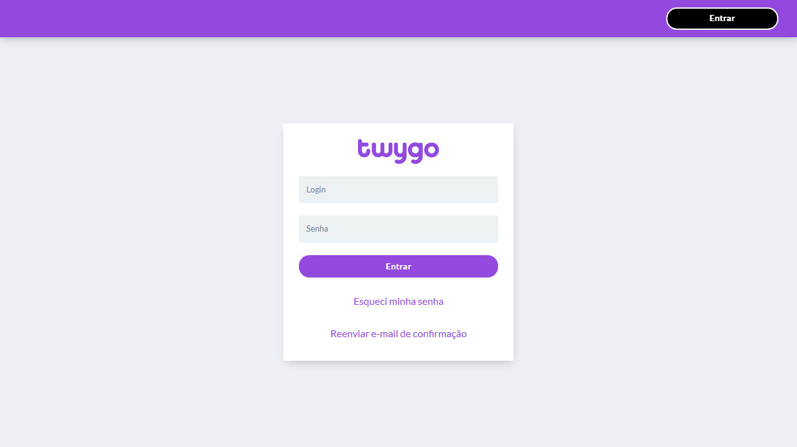

- 🎬 [Vídeo da execução (video.webm)](artifacts/projects-modelos-tests-fea-218f9--Dica-NÃO-aparece-na-edição-chromium/video.webm)

- 📦 **Trace** — [`trace.zip`](artifacts/projects-modelos-tests-fea-218f9--Dica-NÃO-aparece-na-edição-chromium/trace.zip)

  ```bash
  npx playwright show-trace outputs/modelos/reports/regression_20260525-111454/artifacts/projects-modelos-tests-fea-218f9--Dica-NÃO-aparece-na-edição-chromium/trace.zip
  ```

- 🎥 **Vídeo** — [`video.webm`](artifacts/projects-modelos-tests-fea-218f9--Dica-NÃO-aparece-na-edição-chromium/video.webm)

- 📄 **DOM no momento da falha** — [`error-context.md`](artifacts/projects-modelos-tests-fea-218f9--Dica-NÃO-aparece-na-edição-chromium/error-context.md)

#### 🐛 Pronto para registro de bug

> ❓ **Análise automática:** Inconclusivo (precisa investigação manual) · Confiança 🔴 baixa
> _Por quê:_ Sem sinal Network in-scope ou padrão de erro conhecido — revisar trace
> _Bug-report estruturado:_ [`bug-reports/criacao-de-modelo-aba-identificacao__badge-dica-nao-aparece-na-edicao.md`](bug-reports/criacao-de-modelo-aba-identificacao__badge-dica-nao-aparece-na-edicao.md)

**Próximas ações sugeridas:**
- Sem evidência suficiente para classificar — abrir `trace.zip` (`npx playwright show-trace`) para ver passo a passo da execução.
- Reabrir o agente com o trace em mãos para reclassificar manualmente em uma das 4 categorias.

**Descrição do BUG:** [Crítico] Badge "Dica" NÃO aparece na edição — O elemento esperado não apareceu na tela (locator: getByTestId('content-models-page')).

**Passo a passo para reprodução:**
1. Pré: Ambiente Stage configurado
1. Pré: Feature flag `modelos_de_conteudo` ativa
1. Pré: Pelo menos 1 kit de marca cadastrado na organização
1. Pré: Usuário logado como Admin
1. 1. Acessar a listagem com pelo menos 1 modelo cadastrado
1. 2. Clicar na ação "Editar" do modelo alvo
1. 3. Aguardar a tela de edição carregar completamente

**Comportamento esperado:** Listagem é exibida.

**Comportamento atual:** O elemento esperado não apareceu na tela (locator: getByTestId('content-models-page')). (falha aconteceu no passo 1: "Acessar listagem com pelo menos 1 modelo seedado", que deveria resultar em: Listagem é exibida.)

**Informações:**

| Campo | Valor |
|---|---|
| URL | `https://basedeconhecimento.stage.twygoead.com/` |
| Login | Credenciais via env: `TWYGO_STAGING_BASE_DE_CONHECIMENTO_EMAIL` (consulte `.env`) |
| Senha | Credenciais via env: `TWYGO_STAGING_BASE_DE_CONHECIMENTO_PASSWORD` (consulte `.env`) |
| orgId | — |
| Outros | Browser: chromium |
| Outros | runId: regression_20260525-111454 |
| Outros | Duração até a falha: 67.82s |
| Outros | Step impactado: 1. Acessar listagem com pelo menos 1 modelo seedado |

**Evidências:**

- Screenshot capturado pelo Playwright (screenshot): artifacts/projects-modelos-tests-fea-218f9--Dica-NÃO-aparece-na-edição-chromium/test-failed-1.png
- Vídeo da execução (video.webm): artifacts/projects-modelos-tests-fea-218f9--Dica-NÃO-aparece-na-edição-chromium/video.webm
- Snapshot do DOM/contexto da página (error-context.md): artifacts/projects-modelos-tests-fea-218f9--Dica-NÃO-aparece-na-edição-chromium/error-context.md
- Trace completo do Playwright (.zip) — `npx playwright show-trace`: artifacts/projects-modelos-tests-fea-218f9--Dica-NÃO-aparece-na-edição-chromium/trace.zip

<details><summary>📋 Ver texto agregado para copiar (Jira/GitHub/Linear)</summary>

```
Descrição do BUG
[Crítico] Badge "Dica" NÃO aparece na edição — O elemento esperado não apareceu na tela (locator: getByTestId('content-models-page')).

Passo a passo para reprodução
  Pré: Ambiente Stage configurado
  Pré: Feature flag `modelos_de_conteudo` ativa
  Pré: Pelo menos 1 kit de marca cadastrado na organização
  Pré: Usuário logado como Admin
  1. Acessar a listagem com pelo menos 1 modelo cadastrado
  2. Clicar na ação "Editar" do modelo alvo
  3. Aguardar a tela de edição carregar completamente

Comportamento esperado
Listagem é exibida.

Comportamento atual
O elemento esperado não apareceu na tela (locator: getByTestId('content-models-page')). (falha aconteceu no passo 1: "Acessar listagem com pelo menos 1 modelo seedado", que deveria resultar em: Listagem é exibida.)

Informações
- URL: https://basedeconhecimento.stage.twygoead.com/
- Login: Credenciais via env: `TWYGO_STAGING_BASE_DE_CONHECIMENTO_EMAIL` (consulte `.env`)
- Senha: Credenciais via env: `TWYGO_STAGING_BASE_DE_CONHECIMENTO_PASSWORD` (consulte `.env`)
- ID do ambiente (orgId): —
- Outros:
  - Browser: chromium
  - runId: regression_20260525-111454
  - Duração até a falha: 67.82s
  - Step impactado: 1. Acessar listagem com pelo menos 1 modelo seedado

Evidências
- Screenshot capturado pelo Playwright (screenshot): artifacts/projects-modelos-tests-fea-218f9--Dica-NÃO-aparece-na-edição-chromium/test-failed-1.png
- Vídeo da execução (video.webm): artifacts/projects-modelos-tests-fea-218f9--Dica-NÃO-aparece-na-edição-chromium/video.webm
- Snapshot do DOM/contexto da página (error-context.md): artifacts/projects-modelos-tests-fea-218f9--Dica-NÃO-aparece-na-edição-chromium/error-context.md
- Trace completo do Playwright (.zip) — `npx playwright show-trace`: artifacts/projects-modelos-tests-fea-218f9--Dica-NÃO-aparece-na-edição-chromium/trace.zip

Execução
- runId: regression_20260525-111454
- environment.json: staging-base-de-conhecimento
- testsuite: Criação de Modelo - Aba Identificação
- testcase: Badge "Dica" NÃO aparece na edição

```

</details>

<details><summary>🔧 Stack trace técnica completa (para desenvolvedor)</summary>

```
Error: expect(locator).toBeVisible() failed

Locator: getByTestId('content-models-page')
Expected: visible
Timeout: 60000ms
Error: element(s) not found

Call log:
  - Expect "toBeVisible" with timeout 60000ms
  - waiting for getByTestId('content-models-page')

```

</details>

---

### ❌ Falhou · TC4 · Validações negativas do campo Nome (matriz A-D) · 🔴 Crítico

<a id="validacoes-negativas-do-campo-nome-matriz-a-d"></a>_Arquivo:_ `tc04-validar-nome-obrigatorio.spec.ts` · _Duração:_ 40.61s · _Browser:_ chromium

> **❌ Por que falhou:** O elemento esperado não apareceu na tela (locator: getByRole('tab', { name: 'Identificação', exact: true })).
> _Step impactado:_ **1. [A] "(vazio) — Nome obrigatório"**

**Sumário (objetivo do caso):** Validar comportamento do campo "Nome" para entradas inválidas — obrigatoriedade, limites, caracteres especiais e tentativas de injeção. Cobertura conforme matriz A-D da skill `cenarios-negativos-twygo`.

**Pré-condições:**

```
Ambiente Stage configurado
Feature flag `modelos_de_conteudo` ativa
Pelo menos 1 kit de marca cadastrado na organização
Usuário logado como Admin
```

**Passos do caso (XML/TestLink + execução Playwright):**

_Cada linha reproduz um passo do XML; a coluna **Status** traz o resultado da execução (do step Allure correspondente). Linhas com "Pré-condição" são da execução automatizada (login, navegação inicial) — não fazem parte do roteiro do XML._

| # | Ação do passo | Resultado esperado | Status | Notas | Duração |
|---|---|---|:---:|---|---:|
| — | _Pré-condição:_ [A] "(vazio) — Nome obrigatório" | — | ❌ | O elemento esperado não apareceu na tela (locator: getByRole('tab', { name: 'Identificação', exact: true })). | 34.10s |
| 1 | Acessar a tela de criação de modelo | Aba "Identificação" é exibida. | ⊘ | Step não executado: o teste foi interrompido antes. Causa: O elemento esperado não apareceu na tela (locator: getByRole('tab', { name: 'Identificação', exact: true })).. | — |
| 2 | Para cada linha da `**Validation matrix**` abaixo, preencher "Nome" com `Entrada`, demais campos com defaults válidos, clicar "Salvar" | Sistema deve reagir conforme `Esperado` da linha. **Validation matrix**: \| Categoria \| Entrada \| Esperado \| \|---\|---\|---\| \| A \| (vazio) \| Mensagem "Nome é obrigatório" exibida. Modelo NÃO é criado. \| \| B \| "A" (1 caractere) \| Modelo criado com sucesso (sem mínimo declarado). \| \| B \| string de 255 caracteres \| Modelo criado com sucesso (limite máximo aceito). \| \| B \| string de 256 caracteres \| Input trunca em 255 caracteres OU mensagem de limite exibida. Modelo NÃO é criado com 256+. \| \| C \| "Modelo @çãõ#$%" (acentos + especiais) \| Modelo criado com sucesso preservando os caracteres. \| \| C \| " Modelo " (espaços) \| Modelo criado; espaços laterais podem ser preservados ou trimados conforme implementação. \| \| D \| "<script>alert(1)</script>" \| Modelo criado com o texto literal armazenado e exibido escapado (sem execução de script). \| \| D \| "'; DROP TABLE--" \| Modelo criado com o texto literal; nenhum efeito colateral no banco. \| | ⊘ | Step não executado: o teste foi interrompido antes. Causa: O elemento esperado não apareceu na tela (locator: getByRole('tab', { name: 'Identificação', exact: true })).. | — |

**Evidências:**

📁 _Pasta:_ [`artifacts/projects-modelos-tests-fea-b0887-s-do-campo-Nome-matriz-A-D--chromium/`](artifacts/projects-modelos-tests-fea-b0887-s-do-campo-Nome-matriz-A-D--chromium/)

- 📸 **Screenshot (screenshot)** — [`test-failed-1.png`](artifacts/projects-modelos-tests-fea-b0887-s-do-campo-Nome-matriz-A-D--chromium/test-failed-1.png)

  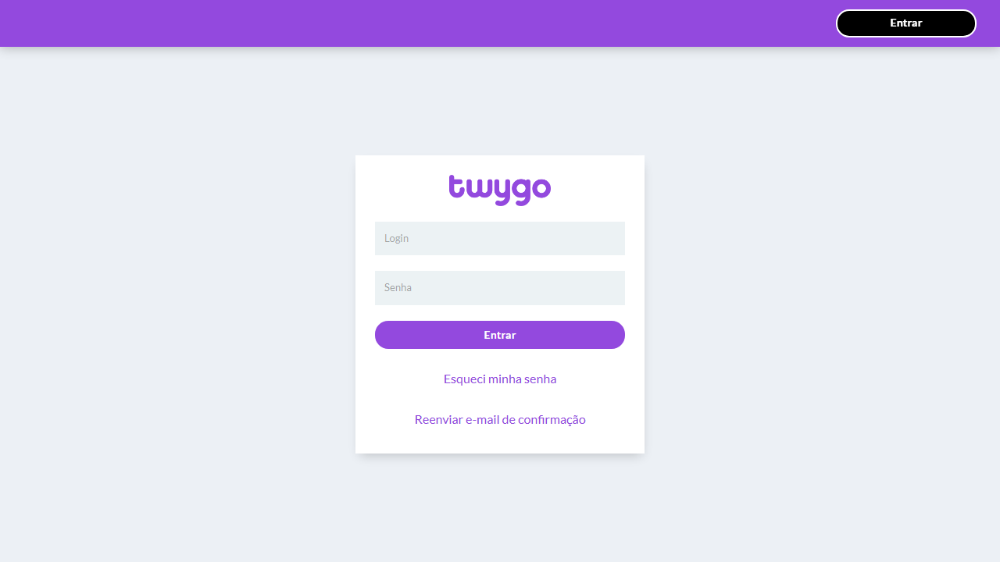

- 📸 **Screenshot (screenshot)** — [`test-failed-2.png`](artifacts/projects-modelos-tests-fea-b0887-s-do-campo-Nome-matriz-A-D--chromium/test-failed-2.png)

  

- 🎬 [Vídeo da execução (video.webm)](artifacts/projects-modelos-tests-fea-b0887-s-do-campo-Nome-matriz-A-D--chromium/video.webm)

- 📦 **Trace** — [`trace.zip`](artifacts/projects-modelos-tests-fea-b0887-s-do-campo-Nome-matriz-A-D--chromium/trace.zip)

  ```bash
  npx playwright show-trace outputs/modelos/reports/regression_20260525-111454/artifacts/projects-modelos-tests-fea-b0887-s-do-campo-Nome-matriz-A-D--chromium/trace.zip
  ```

- 🎥 **Vídeo** — [`video.webm`](artifacts/projects-modelos-tests-fea-b0887-s-do-campo-Nome-matriz-A-D--chromium/video.webm)

- 📄 **DOM no momento da falha** — [`error-context.md`](artifacts/projects-modelos-tests-fea-b0887-s-do-campo-Nome-matriz-A-D--chromium/error-context.md)

#### 🐛 Pronto para registro de bug

> ❓ **Análise automática:** Inconclusivo (precisa investigação manual) · Confiança 🔴 baixa
> _Por quê:_ Sem sinal Network in-scope ou padrão de erro conhecido — revisar trace
> _Bug-report estruturado:_ [`bug-reports/criacao-de-modelo-aba-identificacao__validacoes-negativas-do-campo-nome-matriz-a-d.md`](bug-reports/criacao-de-modelo-aba-identificacao__validacoes-negativas-do-campo-nome-matriz-a-d.md)

**Próximas ações sugeridas:**
- Sem evidência suficiente para classificar — abrir `trace.zip` (`npx playwright show-trace`) para ver passo a passo da execução.
- Reabrir o agente com o trace em mãos para reclassificar manualmente em uma das 4 categorias.

**Descrição do BUG:** [Crítico] Validações negativas do campo Nome (matriz A-D) — O elemento esperado não apareceu na tela (locator: getByRole('tab', { name: 'Identificação', exact: true })).

**Passo a passo para reprodução:**
1. Pré: Ambiente Stage configurado
1. Pré: Feature flag `modelos_de_conteudo` ativa
1. Pré: Pelo menos 1 kit de marca cadastrado na organização
1. Pré: Usuário logado como Admin
1. 1. Acessar a tela de criação de modelo
1. 2. Para cada linha da `**Validation matrix**` abaixo, preencher "Nome" com `Entrada`, demais campos com defaults válidos, clicar "Salvar"

**Comportamento esperado:** Aba "Identificação" é exibida.

**Comportamento atual:** O elemento esperado não apareceu na tela (locator: getByRole('tab', { name: 'Identificação', exact: true })). (falha aconteceu no passo 1: "[A] "(vazio) — Nome obrigatório"", que deveria resultar em: Aba "Identificação" é exibida.)

**Informações:**

| Campo | Valor |
|---|---|
| URL | `https://basedeconhecimento.stage.twygoead.com/` |
| Login | Credenciais via env: `TWYGO_STAGING_BASE_DE_CONHECIMENTO_EMAIL` (consulte `.env`) |
| Senha | Credenciais via env: `TWYGO_STAGING_BASE_DE_CONHECIMENTO_PASSWORD` (consulte `.env`) |
| orgId | — |
| Outros | Browser: chromium |
| Outros | runId: regression_20260525-111454 |
| Outros | Duração até a falha: 40.61s |
| Outros | Step impactado: 1. [A] "(vazio) — Nome obrigatório" |

**Evidências:**

- Screenshot capturado pelo Playwright (screenshot): artifacts/projects-modelos-tests-fea-b0887-s-do-campo-Nome-matriz-A-D--chromium/test-failed-1.png
- Vídeo da execução (video.webm): artifacts/projects-modelos-tests-fea-b0887-s-do-campo-Nome-matriz-A-D--chromium/video.webm
- Snapshot do DOM/contexto da página (error-context.md): artifacts/projects-modelos-tests-fea-b0887-s-do-campo-Nome-matriz-A-D--chromium/error-context.md
- Screenshot capturado pelo Playwright (screenshot): artifacts/projects-modelos-tests-fea-b0887-s-do-campo-Nome-matriz-A-D--chromium/test-failed-2.png
- Snapshot do DOM/contexto da página (error-context.md): artifacts/projects-modelos-tests-fea-b0887-s-do-campo-Nome-matriz-A-D--chromium/error-context.md
- Trace completo do Playwright (.zip) — `npx playwright show-trace`: artifacts/projects-modelos-tests-fea-b0887-s-do-campo-Nome-matriz-A-D--chromium/trace.zip

<details><summary>📋 Ver texto agregado para copiar (Jira/GitHub/Linear)</summary>

```
Descrição do BUG
[Crítico] Validações negativas do campo Nome (matriz A-D) — O elemento esperado não apareceu na tela (locator: getByRole('tab', { name: 'Identificação', exact: true })).

Passo a passo para reprodução
  Pré: Ambiente Stage configurado
  Pré: Feature flag `modelos_de_conteudo` ativa
  Pré: Pelo menos 1 kit de marca cadastrado na organização
  Pré: Usuário logado como Admin
  1. Acessar a tela de criação de modelo
  2. Para cada linha da `**Validation matrix**` abaixo, preencher "Nome" com `Entrada`, demais campos com defaults válidos, clicar "Salvar"

Comportamento esperado
Aba "Identificação" é exibida.

Comportamento atual
O elemento esperado não apareceu na tela (locator: getByRole('tab', { name: 'Identificação', exact: true })). (falha aconteceu no passo 1: "[A] "(vazio) — Nome obrigatório"", que deveria resultar em: Aba "Identificação" é exibida.)

Informações
- URL: https://basedeconhecimento.stage.twygoead.com/
- Login: Credenciais via env: `TWYGO_STAGING_BASE_DE_CONHECIMENTO_EMAIL` (consulte `.env`)
- Senha: Credenciais via env: `TWYGO_STAGING_BASE_DE_CONHECIMENTO_PASSWORD` (consulte `.env`)
- ID do ambiente (orgId): —
- Outros:
  - Browser: chromium
  - runId: regression_20260525-111454
  - Duração até a falha: 40.61s
  - Step impactado: 1. [A] "(vazio) — Nome obrigatório"

Evidências
- Screenshot capturado pelo Playwright (screenshot): artifacts/projects-modelos-tests-fea-b0887-s-do-campo-Nome-matriz-A-D--chromium/test-failed-1.png
- Vídeo da execução (video.webm): artifacts/projects-modelos-tests-fea-b0887-s-do-campo-Nome-matriz-A-D--chromium/video.webm
- Snapshot do DOM/contexto da página (error-context.md): artifacts/projects-modelos-tests-fea-b0887-s-do-campo-Nome-matriz-A-D--chromium/error-context.md
- Screenshot capturado pelo Playwright (screenshot): artifacts/projects-modelos-tests-fea-b0887-s-do-campo-Nome-matriz-A-D--chromium/test-failed-2.png
- Snapshot do DOM/contexto da página (error-context.md): artifacts/projects-modelos-tests-fea-b0887-s-do-campo-Nome-matriz-A-D--chromium/error-context.md
- Trace completo do Playwright (.zip) — `npx playwright show-trace`: artifacts/projects-modelos-tests-fea-b0887-s-do-campo-Nome-matriz-A-D--chromium/trace.zip

Execução
- runId: regression_20260525-111454
- environment.json: staging-base-de-conhecimento
- testsuite: Criação de Modelo - Aba Identificação
- testcase: Validações negativas do campo Nome (matriz A-D)

```

</details>

<details><summary>🔧 Stack trace técnica completa (para desenvolvedor)</summary>

```
Error: expect(locator).toBeVisible() failed

Locator: getByRole('tab', { name: 'Identificação', exact: true })
Expected: visible
Timeout: 30000ms
Error: element(s) not found

Call log:
  - Expect "toBeVisible" with timeout 30000ms
  - waiting for getByRole('tab', { name: 'Identificação', exact: true })

```

</details>

---

### ❌ Falhou · TC5 · Validações negativas do campo Descrição (matriz B-D) · 🟡 Normal

<a id="validacoes-negativas-do-campo-descricao-matriz-b-d"></a>_Arquivo:_ `tc05-limite-500-chars-descricao.spec.ts` · _Duração:_ 38.17s · _Browser:_ chromium

> **❌ Por que falhou:** O elemento esperado não apareceu na tela (locator: getByRole('tab', { name: 'Identificação', exact: true })).
> _Step impactado:_ **1. [B] 500 caracteres (limite máximo)**

**Sumário (objetivo do caso):** Validar comportamento do campo "Descrição" para entradas inválidas — limites, caracteres especiais e tentativas de injeção. Não inclui categoria A (campo opcional). Cobertura conforme matriz da skill `cenarios-negativos-twygo`.

**Pré-condições:**

```
Ambiente Stage configurado
Feature flag `modelos_de_conteudo` ativa
Pelo menos 1 kit de marca cadastrado na organização
Usuário logado como Admin
```

**Passos do caso (XML/TestLink + execução Playwright):**

_Cada linha reproduz um passo do XML; a coluna **Status** traz o resultado da execução (do step Allure correspondente). Linhas com "Pré-condição" são da execução automatizada (login, navegação inicial) — não fazem parte do roteiro do XML._

| # | Ação do passo | Resultado esperado | Status | Notas | Duração |
|---|---|---|:---:|---|---:|
| — | _Pré-condição:_ [B] 500 caracteres (limite máximo) | — | ❌ | O elemento esperado não apareceu na tela (locator: getByRole('tab', { name: 'Identificação', exact: true })). | 34.19s |
| 1 | Acessar a tela de criação de modelo | Aba "Identificação" é exibida. | ⊘ | Step não executado: o teste foi interrompido antes. Causa: O elemento esperado não apareceu na tela (locator: getByRole('tab', { name: 'Identificação', exact: true })).. | — |
| 2 | Para cada linha da `**Validation matrix**` abaixo, preencher "Nome" com valor válido, "Descrição" com `Entrada`, clicar "Salvar" | Sistema deve reagir conforme `Esperado` da linha. **Validation matrix**: \| Categoria \| Entrada \| Esperado \| \|---\|---\|---\| \| B \| string de 500 caracteres \| Modelo criado com sucesso (limite máximo). \| \| B \| string de 501 caracteres \| Input trunca em 500 caracteres OU mensagem de limite exibida. Modelo NÃO é criado com 501+. \| \| C \| "Descrição @çãõ#$%" \| Modelo criado preservando caracteres. \| \| C \| "linha 1\nlinha 2\nlinha 3" (com quebras) \| Modelo criado; quebras de linha preservadas conforme renderização textarea. \| \| D \| "" \| Modelo criado com o texto literal; payload exibido escapado. \| | ⊘ | Step não executado: o teste foi interrompido antes. Causa: O elemento esperado não apareceu na tela (locator: getByRole('tab', { name: 'Identificação', exact: true })).. | — |

**Evidências:**

📁 _Pasta:_ [`artifacts/projects-modelos-tests-fea-bb490-campo-Descrição-matriz-B-D--chromium/`](artifacts/projects-modelos-tests-fea-bb490-campo-Descrição-matriz-B-D--chromium/)

- 📸 **Screenshot (screenshot)** — [`test-failed-1.png`](artifacts/projects-modelos-tests-fea-bb490-campo-Descrição-matriz-B-D--chromium/test-failed-1.png)

  

- 🎬 [Vídeo da execução (video.webm)](artifacts/projects-modelos-tests-fea-bb490-campo-Descrição-matriz-B-D--chromium/video.webm)

- 📦 **Trace** — [`trace.zip`](artifacts/projects-modelos-tests-fea-bb490-campo-Descrição-matriz-B-D--chromium/trace.zip)

  ```bash
  npx playwright show-trace outputs/modelos/reports/regression_20260525-111454/artifacts/projects-modelos-tests-fea-bb490-campo-Descrição-matriz-B-D--chromium/trace.zip
  ```

- 🎥 **Vídeo** — [`video.webm`](artifacts/projects-modelos-tests-fea-bb490-campo-Descrição-matriz-B-D--chromium/video.webm)

- 📄 **DOM no momento da falha** — [`error-context.md`](artifacts/projects-modelos-tests-fea-bb490-campo-Descrição-matriz-B-D--chromium/error-context.md)

#### 🐛 Pronto para registro de bug

> ❓ **Análise automática:** Inconclusivo (precisa investigação manual) · Confiança 🔴 baixa
> _Por quê:_ Sem sinal Network in-scope ou padrão de erro conhecido — revisar trace
> _Bug-report estruturado:_ [`bug-reports/criacao-de-modelo-aba-identificacao__validacoes-negativas-do-campo-descricao-matriz-b-d.md`](bug-reports/criacao-de-modelo-aba-identificacao__validacoes-negativas-do-campo-descricao-matriz-b-d.md)

**Próximas ações sugeridas:**
- Sem evidência suficiente para classificar — abrir `trace.zip` (`npx playwright show-trace`) para ver passo a passo da execução.
- Reabrir o agente com o trace em mãos para reclassificar manualmente em uma das 4 categorias.

**Descrição do BUG:** [Normal] Validações negativas do campo Descrição (matriz B-D) — O elemento esperado não apareceu na tela (locator: getByRole('tab', { name: 'Identificação', exact: true })).

**Passo a passo para reprodução:**
1. Pré: Ambiente Stage configurado
1. Pré: Feature flag `modelos_de_conteudo` ativa
1. Pré: Pelo menos 1 kit de marca cadastrado na organização
1. Pré: Usuário logado como Admin
1. 1. Acessar a tela de criação de modelo
1. 2. Para cada linha da `**Validation matrix**` abaixo, preencher "Nome" com valor válido, "Descrição" com `Entrada`, clicar "Salvar"

**Comportamento esperado:** Aba "Identificação" é exibida.

**Comportamento atual:** O elemento esperado não apareceu na tela (locator: getByRole('tab', { name: 'Identificação', exact: true })). (falha aconteceu no passo 1: "[B] 500 caracteres (limite máximo)", que deveria resultar em: Aba "Identificação" é exibida.)

**Informações:**

| Campo | Valor |
|---|---|
| URL | `https://basedeconhecimento.stage.twygoead.com/` |
| Login | Credenciais via env: `TWYGO_STAGING_BASE_DE_CONHECIMENTO_EMAIL` (consulte `.env`) |
| Senha | Credenciais via env: `TWYGO_STAGING_BASE_DE_CONHECIMENTO_PASSWORD` (consulte `.env`) |
| orgId | — |
| Outros | Browser: chromium |
| Outros | runId: regression_20260525-111454 |
| Outros | Duração até a falha: 38.17s |
| Outros | Step impactado: 1. [B] 500 caracteres (limite máximo) |

**Evidências:**

- Screenshot capturado pelo Playwright (screenshot): artifacts/projects-modelos-tests-fea-bb490-campo-Descrição-matriz-B-D--chromium/test-failed-1.png
- Vídeo da execução (video.webm): artifacts/projects-modelos-tests-fea-bb490-campo-Descrição-matriz-B-D--chromium/video.webm
- Snapshot do DOM/contexto da página (error-context.md): artifacts/projects-modelos-tests-fea-bb490-campo-Descrição-matriz-B-D--chromium/error-context.md
- Trace completo do Playwright (.zip) — `npx playwright show-trace`: artifacts/projects-modelos-tests-fea-bb490-campo-Descrição-matriz-B-D--chromium/trace.zip

<details><summary>📋 Ver texto agregado para copiar (Jira/GitHub/Linear)</summary>

```
Descrição do BUG
[Normal] Validações negativas do campo Descrição (matriz B-D) — O elemento esperado não apareceu na tela (locator: getByRole('tab', { name: 'Identificação', exact: true })).

Passo a passo para reprodução
  Pré: Ambiente Stage configurado
  Pré: Feature flag `modelos_de_conteudo` ativa
  Pré: Pelo menos 1 kit de marca cadastrado na organização
  Pré: Usuário logado como Admin
  1. Acessar a tela de criação de modelo
  2. Para cada linha da `**Validation matrix**` abaixo, preencher "Nome" com valor válido, "Descrição" com `Entrada`, clicar "Salvar"

Comportamento esperado
Aba "Identificação" é exibida.

Comportamento atual
O elemento esperado não apareceu na tela (locator: getByRole('tab', { name: 'Identificação', exact: true })). (falha aconteceu no passo 1: "[B] 500 caracteres (limite máximo)", que deveria resultar em: Aba "Identificação" é exibida.)

Informações
- URL: https://basedeconhecimento.stage.twygoead.com/
- Login: Credenciais via env: `TWYGO_STAGING_BASE_DE_CONHECIMENTO_EMAIL` (consulte `.env`)
- Senha: Credenciais via env: `TWYGO_STAGING_BASE_DE_CONHECIMENTO_PASSWORD` (consulte `.env`)
- ID do ambiente (orgId): —
- Outros:
  - Browser: chromium
  - runId: regression_20260525-111454
  - Duração até a falha: 38.17s
  - Step impactado: 1. [B] 500 caracteres (limite máximo)

Evidências
- Screenshot capturado pelo Playwright (screenshot): artifacts/projects-modelos-tests-fea-bb490-campo-Descrição-matriz-B-D--chromium/test-failed-1.png
- Vídeo da execução (video.webm): artifacts/projects-modelos-tests-fea-bb490-campo-Descrição-matriz-B-D--chromium/video.webm
- Snapshot do DOM/contexto da página (error-context.md): artifacts/projects-modelos-tests-fea-bb490-campo-Descrição-matriz-B-D--chromium/error-context.md
- Trace completo do Playwright (.zip) — `npx playwright show-trace`: artifacts/projects-modelos-tests-fea-bb490-campo-Descrição-matriz-B-D--chromium/trace.zip

Execução
- runId: regression_20260525-111454
- environment.json: staging-base-de-conhecimento
- testsuite: Criação de Modelo - Aba Identificação
- testcase: Validações negativas do campo Descrição (matriz B-D)

```

</details>

<details><summary>🔧 Stack trace técnica completa (para desenvolvedor)</summary>

```
Error: expect(locator).toBeVisible() failed

Locator: getByRole('tab', { name: 'Identificação', exact: true })
Expected: visible
Timeout: 30000ms
Error: element(s) not found

Call log:
  - Expect "toBeVisible" with timeout 30000ms
  - waiting for getByRole('tab', { name: 'Identificação', exact: true })

```

</details>

---

### ❌ Falhou · TC6 · Switch "Usar designs sugeridos" exibido somente na criação · 🔴 Crítico

<a id="switch-usar-designs-sugeridos-exibido-somente-na-criacao"></a>_Arquivo:_ `tc06-switch-usar-designs-somente-criacao.spec.ts` · _Duração:_ 36.07s · _Browser:_ chromium

> **❌ Por que falhou:** O elemento esperado não apareceu na tela (locator: getByRole('tab', { name: 'Identificação', exact: true })).
> _Step impactado:_ **1. Abrir tela de criação e validar switch visível + ativo**

**Sumário (objetivo do caso):** Validar que o switch "Usar designs sugeridos" só aparece na criação (RN 8).

**Pré-condições:**

```
Ambiente Stage configurado
Feature flag `modelos_de_conteudo` ativa
Pelo menos 1 kit de marca cadastrado na organização
Usuário logado como Admin
```

**Passos do caso (XML/TestLink + execução Playwright):**

_Cada linha reproduz um passo do XML; a coluna **Status** traz o resultado da execução (do step Allure correspondente). Linhas com "Pré-condição" são da execução automatizada (login, navegação inicial) — não fazem parte do roteiro do XML._

| # | Ação do passo | Resultado esperado | Status | Notas | Duração |
|---|---|---|:---:|---|---:|
| 1 | Acessar a tela de criação de modelo | Aba "Identificação" é exibida com o switch "Usar designs sugeridos" visível, marcado como ativo por padrão. | ❌ | O elemento esperado não apareceu na tela (locator: getByRole('tab', { name: 'Identificação', exact: true })). | 33.84s |
| 2 | Aguardar a tooltip do switch ser exibida ao posicionar o mouse | Tooltip exibida: "Quando ativo, a IA utilizará designs pré-definidos como sugestão ao gerar o conteúdo do curso". | ⊘ | Step não executado: o teste foi interrompido antes. Causa: O elemento esperado não apareceu na tela (locator: getByRole('tab', { name: 'Identificação', exact: true })).. | — |

**Evidências:**

📁 _Pasta:_ [`artifacts/projects-modelos-tests-fea-383a1--exibido-somente-na-criação-chromium/`](artifacts/projects-modelos-tests-fea-383a1--exibido-somente-na-criação-chromium/)

- 📸 **Screenshot (screenshot)** — [`test-failed-1.png`](artifacts/projects-modelos-tests-fea-383a1--exibido-somente-na-criação-chromium/test-failed-1.png)

  

- 🎬 [Vídeo da execução (video.webm)](artifacts/projects-modelos-tests-fea-383a1--exibido-somente-na-criação-chromium/video.webm)

- 📦 **Trace** — [`trace.zip`](artifacts/projects-modelos-tests-fea-383a1--exibido-somente-na-criação-chromium/trace.zip)

  ```bash
  npx playwright show-trace outputs/modelos/reports/regression_20260525-111454/artifacts/projects-modelos-tests-fea-383a1--exibido-somente-na-criação-chromium/trace.zip
  ```

- 🎥 **Vídeo** — [`video.webm`](artifacts/projects-modelos-tests-fea-383a1--exibido-somente-na-criação-chromium/video.webm)

- 📄 **DOM no momento da falha** — [`error-context.md`](artifacts/projects-modelos-tests-fea-383a1--exibido-somente-na-criação-chromium/error-context.md)

#### 🐛 Pronto para registro de bug

> ❓ **Análise automática:** Inconclusivo (precisa investigação manual) · Confiança 🔴 baixa
> _Por quê:_ Sem sinal Network in-scope ou padrão de erro conhecido — revisar trace
> _Bug-report estruturado:_ [`bug-reports/criacao-de-modelo-aba-identificacao__switch-usar-designs-sugeridos-exibido-somente-na-criacao.md`](bug-reports/criacao-de-modelo-aba-identificacao__switch-usar-designs-sugeridos-exibido-somente-na-criacao.md)

**Próximas ações sugeridas:**
- Sem evidência suficiente para classificar — abrir `trace.zip` (`npx playwright show-trace`) para ver passo a passo da execução.
- Reabrir o agente com o trace em mãos para reclassificar manualmente em uma das 4 categorias.

**Descrição do BUG:** [Crítico] Switch "Usar designs sugeridos" exibido somente na criação — O elemento esperado não apareceu na tela (locator: getByRole('tab', { name: 'Identificação', exact: true })).

**Passo a passo para reprodução:**
1. Pré: Ambiente Stage configurado
1. Pré: Feature flag `modelos_de_conteudo` ativa
1. Pré: Pelo menos 1 kit de marca cadastrado na organização
1. Pré: Usuário logado como Admin
1. 1. Acessar a tela de criação de modelo
1. 2. Aguardar a tooltip do switch ser exibida ao posicionar o mouse

**Comportamento esperado:** Aba "Identificação" é exibida com o switch "Usar designs sugeridos" visível, marcado como ativo por padrão.

**Comportamento atual:** O elemento esperado não apareceu na tela (locator: getByRole('tab', { name: 'Identificação', exact: true })). (falha aconteceu no passo 1: "Abrir tela de criação e validar switch visível + ativo", que deveria resultar em: Aba "Identificação" é exibida com o switch "Usar designs sugeridos" visível, marcado como ativo por padrão.)

**Informações:**

| Campo | Valor |
|---|---|
| URL | `https://basedeconhecimento.stage.twygoead.com/` |
| Login | Credenciais via env: `TWYGO_STAGING_BASE_DE_CONHECIMENTO_EMAIL` (consulte `.env`) |
| Senha | Credenciais via env: `TWYGO_STAGING_BASE_DE_CONHECIMENTO_PASSWORD` (consulte `.env`) |
| orgId | — |
| Outros | Browser: chromium |
| Outros | runId: regression_20260525-111454 |
| Outros | Duração até a falha: 36.07s |
| Outros | Step impactado: 1. Abrir tela de criação e validar switch visível + ativo |

**Evidências:**

- Screenshot capturado pelo Playwright (screenshot): artifacts/projects-modelos-tests-fea-383a1--exibido-somente-na-criação-chromium/test-failed-1.png
- Vídeo da execução (video.webm): artifacts/projects-modelos-tests-fea-383a1--exibido-somente-na-criação-chromium/video.webm
- Snapshot do DOM/contexto da página (error-context.md): artifacts/projects-modelos-tests-fea-383a1--exibido-somente-na-criação-chromium/error-context.md
- Trace completo do Playwright (.zip) — `npx playwright show-trace`: artifacts/projects-modelos-tests-fea-383a1--exibido-somente-na-criação-chromium/trace.zip

<details><summary>📋 Ver texto agregado para copiar (Jira/GitHub/Linear)</summary>

```
Descrição do BUG
[Crítico] Switch "Usar designs sugeridos" exibido somente na criação — O elemento esperado não apareceu na tela (locator: getByRole('tab', { name: 'Identificação', exact: true })).

Passo a passo para reprodução
  Pré: Ambiente Stage configurado
  Pré: Feature flag `modelos_de_conteudo` ativa
  Pré: Pelo menos 1 kit de marca cadastrado na organização
  Pré: Usuário logado como Admin
  1. Acessar a tela de criação de modelo
  2. Aguardar a tooltip do switch ser exibida ao posicionar o mouse

Comportamento esperado
Aba "Identificação" é exibida com o switch "Usar designs sugeridos" visível, marcado como ativo por padrão.

Comportamento atual
O elemento esperado não apareceu na tela (locator: getByRole('tab', { name: 'Identificação', exact: true })). (falha aconteceu no passo 1: "Abrir tela de criação e validar switch visível + ativo", que deveria resultar em: Aba "Identificação" é exibida com o switch "Usar designs sugeridos" visível, marcado como ativo por padrão.)

Informações
- URL: https://basedeconhecimento.stage.twygoead.com/
- Login: Credenciais via env: `TWYGO_STAGING_BASE_DE_CONHECIMENTO_EMAIL` (consulte `.env`)
- Senha: Credenciais via env: `TWYGO_STAGING_BASE_DE_CONHECIMENTO_PASSWORD` (consulte `.env`)
- ID do ambiente (orgId): —
- Outros:
  - Browser: chromium
  - runId: regression_20260525-111454
  - Duração até a falha: 36.07s
  - Step impactado: 1. Abrir tela de criação e validar switch visível + ativo

Evidências
- Screenshot capturado pelo Playwright (screenshot): artifacts/projects-modelos-tests-fea-383a1--exibido-somente-na-criação-chromium/test-failed-1.png
- Vídeo da execução (video.webm): artifacts/projects-modelos-tests-fea-383a1--exibido-somente-na-criação-chromium/video.webm
- Snapshot do DOM/contexto da página (error-context.md): artifacts/projects-modelos-tests-fea-383a1--exibido-somente-na-criação-chromium/error-context.md
- Trace completo do Playwright (.zip) — `npx playwright show-trace`: artifacts/projects-modelos-tests-fea-383a1--exibido-somente-na-criação-chromium/trace.zip

Execução
- runId: regression_20260525-111454
- environment.json: staging-base-de-conhecimento
- testsuite: Criação de Modelo - Aba Identificação
- testcase: Switch "Usar designs sugeridos" exibido somente na criação

```

</details>

<details><summary>🔧 Stack trace técnica completa (para desenvolvedor)</summary>

```
Error: expect(locator).toBeVisible() failed

Locator: getByRole('tab', { name: 'Identificação', exact: true })
Expected: visible
Timeout: 30000ms
Error: element(s) not found

Call log:
  - Expect "toBeVisible" with timeout 30000ms
  - waiting for getByRole('tab', { name: 'Identificação', exact: true })

```

</details>

---

### ⏱️ Tempo esgotado · TC7 · Defaults dos switches na criação · 🔴 Crítico

<a id="defaults-dos-switches-na-criacao"></a>_Arquivo:_ `tc07-defaults-switches-criacao.spec.ts` · _Duração:_ 120.01s · _Browser:_ chromium

> **⏱️ Por que falhou:** O teste excedeu o tempo limite de 120s antes de concluir.

**Sumário (objetivo do caso):** Validar valores default dos switches: "Usar como modelo padrão" = false, "Usar designs sugeridos" = true, "Ativo" = true (RN 8).

**Pré-condições:**

```
Ambiente Stage configurado
Feature flag `modelos_de_conteudo` ativa
Pelo menos 1 kit de marca cadastrado na organização
Usuário logado como Admin
```

**Passos do caso (XML/TestLink + execução Playwright):**

_Cada linha reproduz um passo do XML; a coluna **Status** traz o resultado da execução (do step Allure correspondente). Linhas com "Pré-condição" são da execução automatizada (login, navegação inicial) — não fazem parte do roteiro do XML._

| # | Ação do passo | Resultado esperado | Status | Notas | Duração |
|---|---|---|:---:|---|---:|
| 1 | Acessar a tela de criação de modelo | Aba "Identificação" é exibida. | ⊘ | Step não executado: o teste foi interrompido antes. Causa: O teste excedeu o tempo limite de 120s antes de concluir.. | — |
| 2 | Aguardar os switches serem renderizados | Switch "Usar como modelo padrão" exibido desativado, switch "Usar designs sugeridos" exibido ativado, switch "Ativo" exibido ativado. | ⊘ | Step não executado: o teste foi interrompido antes. Causa: O teste excedeu o tempo limite de 120s antes de concluir.. | — |

**Evidências:**

📁 _Pasta:_ [`artifacts/projects-modelos-tests-fea-9e86f-lts-dos-switches-na-criação-chromium/`](artifacts/projects-modelos-tests-fea-9e86f-lts-dos-switches-na-criação-chromium/)

- 📦 **Trace** — [`trace.zip`](artifacts/projects-modelos-tests-fea-9e86f-lts-dos-switches-na-criação-chromium/trace.zip)

  ```bash
  npx playwright show-trace outputs/modelos/reports/regression_20260525-111454/artifacts/projects-modelos-tests-fea-9e86f-lts-dos-switches-na-criação-chromium/trace.zip
  ```

- 📄 **DOM no momento da falha** — [`error-context.md`](artifacts/projects-modelos-tests-fea-9e86f-lts-dos-switches-na-criação-chromium/error-context.md)

#### 🐛 Pronto para registro de bug

> 🧪 **Análise automática:** Spec frágil (problema no teste, não no produto) · Confiança 🟡 media
> _Por quê:_ Timeout sem HTTP error — possível wait/seletor frágil. Confirmar via chrome-mcp
> _Bug-report estruturado:_ [`bug-reports/criacao-de-modelo-aba-identificacao__defaults-dos-switches-na-criacao.md`](bug-reports/criacao-de-modelo-aba-identificacao__defaults-dos-switches-na-criacao.md)

**Próximas ações sugeridas:**
- Inspecionar o trace (`npx playwright show-trace`) para confirmar que o elemento existe mas o seletor/timing falhou.
- Avaliar se o spec viola algum dos 3 padrões da skill `criar-spec-resiliente-twygo` (count de seed, timing pós-hidratação, retry de rede).
- Disparar o healer (`playwright-test-healer`) para corrigir seletor/timing/asserção SEM alterar a intenção do teste.

**Descrição do BUG:** [Crítico] Defaults dos switches na criação — O teste excedeu o tempo limite de 120s antes de concluir.

**Passo a passo para reprodução:**
1. Pré: Ambiente Stage configurado
1. Pré: Feature flag `modelos_de_conteudo` ativa
1. Pré: Pelo menos 1 kit de marca cadastrado na organização
1. Pré: Usuário logado como Admin
1. 1. Acessar a tela de criação de modelo
1. 2. Aguardar os switches serem renderizados

**Comportamento esperado:** 1. Aba "Identificação" é exibida. | 2. Switch "Usar como modelo padrão" exibido desativado, switch "Usar designs sugeridos" exibido ativado, switch "Ativo" exibido ativado.

**Comportamento atual:** O teste excedeu o tempo limite de 120s antes de concluir.

**Informações:**

| Campo | Valor |
|---|---|
| URL | `https://basedeconhecimento.stage.twygoead.com/` |
| Login | Credenciais via env: `TWYGO_STAGING_BASE_DE_CONHECIMENTO_EMAIL` (consulte `.env`) |
| Senha | Credenciais via env: `TWYGO_STAGING_BASE_DE_CONHECIMENTO_PASSWORD` (consulte `.env`) |
| orgId | — |
| Outros | Browser: chromium |
| Outros | runId: regression_20260525-111454 |
| Outros | Duração até a falha: 120.01s |

**Evidências:**

- Snapshot do DOM/contexto da página (error-context.md): artifacts/projects-modelos-tests-fea-9e86f-lts-dos-switches-na-criação-chromium/error-context.md
- Trace completo do Playwright (.zip) — `npx playwright show-trace`: artifacts/projects-modelos-tests-fea-9e86f-lts-dos-switches-na-criação-chromium/trace.zip

<details><summary>📋 Ver texto agregado para copiar (Jira/GitHub/Linear)</summary>

```
Descrição do BUG
[Crítico] Defaults dos switches na criação — O teste excedeu o tempo limite de 120s antes de concluir.

Passo a passo para reprodução
  Pré: Ambiente Stage configurado
  Pré: Feature flag `modelos_de_conteudo` ativa
  Pré: Pelo menos 1 kit de marca cadastrado na organização
  Pré: Usuário logado como Admin
  1. Acessar a tela de criação de modelo
  2. Aguardar os switches serem renderizados

Comportamento esperado
1. Aba "Identificação" é exibida. | 2. Switch "Usar como modelo padrão" exibido desativado, switch "Usar designs sugeridos" exibido ativado, switch "Ativo" exibido ativado.

Comportamento atual
O teste excedeu o tempo limite de 120s antes de concluir.

Informações
- URL: https://basedeconhecimento.stage.twygoead.com/
- Login: Credenciais via env: `TWYGO_STAGING_BASE_DE_CONHECIMENTO_EMAIL` (consulte `.env`)
- Senha: Credenciais via env: `TWYGO_STAGING_BASE_DE_CONHECIMENTO_PASSWORD` (consulte `.env`)
- ID do ambiente (orgId): —
- Outros:
  - Browser: chromium
  - runId: regression_20260525-111454
  - Duração até a falha: 120.01s

Evidências
- Snapshot do DOM/contexto da página (error-context.md): artifacts/projects-modelos-tests-fea-9e86f-lts-dos-switches-na-criação-chromium/error-context.md
- Trace completo do Playwright (.zip) — `npx playwright show-trace`: artifacts/projects-modelos-tests-fea-9e86f-lts-dos-switches-na-criação-chromium/trace.zip

Execução
- runId: regression_20260525-111454
- environment.json: staging-base-de-conhecimento
- testsuite: Criação de Modelo - Aba Identificação
- testcase: Defaults dos switches na criação

```

</details>

<details><summary>🔧 Stack trace técnica completa (para desenvolvedor)</summary>

```
Test timeout of 120000ms exceeded while setting up "context".
```

</details>

---

### ⊘ Ignorado · TC8 · Cancelar criação com alterações pendentes · 🟡 Normal

<a id="cancelar-criacao-com-alteracoes-pendentes"></a>_Arquivo:_ `tc08-cancelar-criacao-com-alteracoes.spec.ts` · _Duração:_ 0.00s · _Browser:_ chromium

> **⊘ Por que foi ignorado:** [REVISAR] Motivo do skip não declarado no spec. Edite o `test.fixme(true, "[Categoria] motivo")` indicando uma das categorias canônicas: xml-desatualizado | seed-ausente | dep-externa | bloqueio-temporario.

**Sumário (objetivo do caso):** Validar diálogo nativo de saída com alterações não salvas.

**Pré-condições:**

```
Ambiente Stage configurado
Feature flag `modelos_de_conteudo` ativa
Pelo menos 1 kit de marca cadastrado na organização
Usuário logado como Admin
```

**Passos do caso (XML/TestLink + execução Playwright):**

_Cada linha reproduz um passo do XML; a coluna **Status** traz o resultado da execução (do step Allure correspondente). Linhas com "Pré-condição" são da execução automatizada (login, navegação inicial) — não fazem parte do roteiro do XML._

| # | Ação do passo | Resultado esperado | Status | Notas | Duração |
|---|---|---|:---:|---|---:|
| 1 | Acessar a tela de criação de modelo | Aba "Identificação" é exibida. | ⊘ | Step não executado — [REVISAR] Motivo do skip não declarado no spec. Edite o `test.fixme(true, "[Categoria] motivo")` indicando uma das categorias canônicas: xml-desatualizado \| seed-ausente \| dep-externa \| bloqueio-temporario. | — |
| 2 | Preencher o campo "Nome" com "Teste cancelamento" | Campo "Nome" exibe o texto digitado e o estado do form fica "sujo". | ⊘ | Step não executado — [REVISAR] Motivo do skip não declarado no spec. Edite o `test.fixme(true, "[Categoria] motivo")` indicando uma das categorias canônicas: xml-desatualizado \| seed-ausente \| dep-externa \| bloqueio-temporario. | — |
| 3 | Clicar no botão "Cancelar" | Diálogo nativo do browser é exibido perguntando se o usuário deseja sair sem salvar. | ⊘ | Step não executado — [REVISAR] Motivo do skip não declarado no spec. Edite o `test.fixme(true, "[Categoria] motivo")` indicando uma das categorias canônicas: xml-desatualizado \| seed-ausente \| dep-externa \| bloqueio-temporario. | — |
| 4 | Confirmar manter na página no diálogo | Usuário permanece na tela de criação com os dados preenchidos. | ⊘ | Step não executado — [REVISAR] Motivo do skip não declarado no spec. Edite o `test.fixme(true, "[Categoria] motivo")` indicando uma das categorias canônicas: xml-desatualizado \| seed-ausente \| dep-externa \| bloqueio-temporario. | — |

**Evidências:**

_Sem evidências anexadas._

#### ⏳ Pendente — execução automatizada não realizada

- **Severidade do caso (XML):** Normal
- **Categoria:** ⚠️ Não declarada
- **Motivo declarado pelo spec:** _ausente_
- **Próximo passo:** Editar o spec para declarar `test.fixme(true, '[Categoria] motivo')` com uma das categorias canônicas (xml-desatualizado | seed-ausente | dep-externa | bloqueio-temporario). Sem declaração, leitor leigo não sabe quem precisa agir.

**Roteiro do XML (para validação manual):**
1. Pré: Ambiente Stage configurado
1. Pré: Feature flag `modelos_de_conteudo` ativa
1. Pré: Pelo menos 1 kit de marca cadastrado na organização
1. Pré: Usuário logado como Admin
1. 1. Acessar a tela de criação de modelo
1. 2. Preencher o campo "Nome" com "Teste cancelamento"
1. 3. Clicar no botão "Cancelar"
1. 4. Confirmar manter na página no diálogo

> Esse caso não bloqueia a build, mas precisa de validação manual ou ajuste no agente.


---

### ⏱️ Tempo esgotado · TC9 · Validação do campo Kit de marca obrigatório (matriz A) · 🔴 Crítico

<a id="validacao-do-campo-kit-de-marca-obrigatorio-matriz-a"></a>_Arquivo:_ `tc09-validar-kit-de-marca-obrigatorio.spec.ts` · _Duração:_ 120.01s · _Browser:_ chromium

> **⏱️ Por que falhou:** O teste excedeu o tempo limite de 120s antes de concluir.

**Sumário (objetivo do caso):** Validar obrigatoriedade do campo "Kit de marca" no save. Cobertura conforme matriz da skill `cenarios-negativos-twygo` (select → categoria A).

**Pré-condições:**

```
Ambiente Stage configurado
Feature flag `modelos_de_conteudo` ativa
Pelo menos 1 kit de marca cadastrado na organização
Usuário logado como Admin
```

**Passos do caso (XML/TestLink + execução Playwright):**

_Cada linha reproduz um passo do XML; a coluna **Status** traz o resultado da execução (do step Allure correspondente). Linhas com "Pré-condição" são da execução automatizada (login, navegação inicial) — não fazem parte do roteiro do XML._

| # | Ação do passo | Resultado esperado | Status | Notas | Duração |
|---|---|---|:---:|---|---:|
| 1 | Acessar a tela de criação de modelo | Aba "Identificação" é exibida. | ⊘ | Step não executado: o teste foi interrompido antes. Causa: O teste excedeu o tempo limite de 120s antes de concluir.. | — |
| 2 | Para cada linha da `**Validation matrix**` abaixo, preencher "Nome" com valor válido, configurar "Kit de marca" conforme `Entrada`, clicar "Salvar" | Sistema deve reagir conforme `Esperado`. **Validation matrix**: \| Categoria \| Entrada \| Esperado \| \|---\|---\|---\| \| A \| Nenhum kit selecionado \| Mensagem de validação de obrigatoriedade exibida (REVISAR-FIGMA: texto exato). Modelo NÃO é criado. \| \| A \| "Kit padrão da organização" selecionado \| Modelo criado com sucesso. \| | ⊘ | Step não executado: o teste foi interrompido antes. Causa: O teste excedeu o tempo limite de 120s antes de concluir.. | — |

**Evidências:**

📁 _Pasta:_ [`artifacts/projects-modelos-tests-fea-c578d-marca-obrigatório-matriz-A--chromium/`](artifacts/projects-modelos-tests-fea-c578d-marca-obrigatório-matriz-A--chromium/)

- 📦 **Trace** — [`trace.zip`](artifacts/projects-modelos-tests-fea-c578d-marca-obrigatório-matriz-A--chromium/trace.zip)

  ```bash
  npx playwright show-trace outputs/modelos/reports/regression_20260525-111454/artifacts/projects-modelos-tests-fea-c578d-marca-obrigatório-matriz-A--chromium/trace.zip
  ```

- 📄 **DOM no momento da falha** — [`error-context.md`](artifacts/projects-modelos-tests-fea-c578d-marca-obrigatório-matriz-A--chromium/error-context.md)

#### 🐛 Pronto para registro de bug

> 🧪 **Análise automática:** Spec frágil (problema no teste, não no produto) · Confiança 🟡 media
> _Por quê:_ Timeout sem HTTP error — possível wait/seletor frágil. Confirmar via chrome-mcp
> _Bug-report estruturado:_ [`bug-reports/criacao-de-modelo-aba-identificacao__validacao-do-campo-kit-de-marca-obrigatorio-matriz-a.md`](bug-reports/criacao-de-modelo-aba-identificacao__validacao-do-campo-kit-de-marca-obrigatorio-matriz-a.md)

**Próximas ações sugeridas:**
- Inspecionar o trace (`npx playwright show-trace`) para confirmar que o elemento existe mas o seletor/timing falhou.
- Avaliar se o spec viola algum dos 3 padrões da skill `criar-spec-resiliente-twygo` (count de seed, timing pós-hidratação, retry de rede).
- Disparar o healer (`playwright-test-healer`) para corrigir seletor/timing/asserção SEM alterar a intenção do teste.

**Descrição do BUG:** [Crítico] Validação do campo Kit de marca obrigatório (matriz A) — O teste excedeu o tempo limite de 120s antes de concluir.

**Passo a passo para reprodução:**
1. Pré: Ambiente Stage configurado
1. Pré: Feature flag `modelos_de_conteudo` ativa
1. Pré: Pelo menos 1 kit de marca cadastrado na organização
1. Pré: Usuário logado como Admin
1. 1. Acessar a tela de criação de modelo
1. 2. Para cada linha da `**Validation matrix**` abaixo, preencher "Nome" com valor válido, configurar "Kit de marca" conforme `Entrada`, clicar "Salvar"

**Comportamento esperado:** 1. Aba "Identificação" é exibida. | 2. Sistema deve reagir conforme `Esperado`. **Validation matrix**: | Categoria | Entrada | Esperado | |---|---|---| | A | Nenhum kit selecionado | Mensagem de validação de obrigatoriedade exibida (REVISAR-FIGMA: texto exato). Modelo NÃO é criado. | | A | "Kit padrão da organização" selecionado | Modelo criado com sucesso. |

**Comportamento atual:** O teste excedeu o tempo limite de 120s antes de concluir.

**Informações:**

| Campo | Valor |
|---|---|
| URL | `https://basedeconhecimento.stage.twygoead.com/` |
| Login | Credenciais via env: `TWYGO_STAGING_BASE_DE_CONHECIMENTO_EMAIL` (consulte `.env`) |
| Senha | Credenciais via env: `TWYGO_STAGING_BASE_DE_CONHECIMENTO_PASSWORD` (consulte `.env`) |
| orgId | — |
| Outros | Browser: chromium |
| Outros | runId: regression_20260525-111454 |
| Outros | Duração até a falha: 120.01s |

**Evidências:**

- Snapshot do DOM/contexto da página (error-context.md): artifacts/projects-modelos-tests-fea-c578d-marca-obrigatório-matriz-A--chromium/error-context.md
- Trace completo do Playwright (.zip) — `npx playwright show-trace`: artifacts/projects-modelos-tests-fea-c578d-marca-obrigatório-matriz-A--chromium/trace.zip

<details><summary>📋 Ver texto agregado para copiar (Jira/GitHub/Linear)</summary>

```
Descrição do BUG
[Crítico] Validação do campo Kit de marca obrigatório (matriz A) — O teste excedeu o tempo limite de 120s antes de concluir.

Passo a passo para reprodução
  Pré: Ambiente Stage configurado
  Pré: Feature flag `modelos_de_conteudo` ativa
  Pré: Pelo menos 1 kit de marca cadastrado na organização
  Pré: Usuário logado como Admin
  1. Acessar a tela de criação de modelo
  2. Para cada linha da `**Validation matrix**` abaixo, preencher "Nome" com valor válido, configurar "Kit de marca" conforme `Entrada`, clicar "Salvar"

Comportamento esperado
1. Aba "Identificação" é exibida. | 2. Sistema deve reagir conforme `Esperado`. **Validation matrix**: | Categoria | Entrada | Esperado | |---|---|---| | A | Nenhum kit selecionado | Mensagem de validação de obrigatoriedade exibida (REVISAR-FIGMA: texto exato). Modelo NÃO é criado. | | A | "Kit padrão da organização" selecionado | Modelo criado com sucesso. |

Comportamento atual
O teste excedeu o tempo limite de 120s antes de concluir.

Informações
- URL: https://basedeconhecimento.stage.twygoead.com/
- Login: Credenciais via env: `TWYGO_STAGING_BASE_DE_CONHECIMENTO_EMAIL` (consulte `.env`)
- Senha: Credenciais via env: `TWYGO_STAGING_BASE_DE_CONHECIMENTO_PASSWORD` (consulte `.env`)
- ID do ambiente (orgId): —
- Outros:
  - Browser: chromium
  - runId: regression_20260525-111454
  - Duração até a falha: 120.01s

Evidências
- Snapshot do DOM/contexto da página (error-context.md): artifacts/projects-modelos-tests-fea-c578d-marca-obrigatório-matriz-A--chromium/error-context.md
- Trace completo do Playwright (.zip) — `npx playwright show-trace`: artifacts/projects-modelos-tests-fea-c578d-marca-obrigatório-matriz-A--chromium/trace.zip

Execução
- runId: regression_20260525-111454
- environment.json: staging-base-de-conhecimento
- testsuite: Criação de Modelo - Aba Identificação
- testcase: Validação do campo Kit de marca obrigatório (matriz A)

```

</details>

<details><summary>🔧 Stack trace técnica completa (para desenvolvedor)</summary>

```
Test timeout of 120000ms exceeded while setting up "context".
```

</details>

---

## Criação de Modelo - Aba Estilo do Conteúdo

_2 caso(s) — 2 aprovado(s), 0 falha(s)_

### ✅ Aprovado · TC1 · Botão "Adicionar mais dados" exibe menu com 6 opções · 🔴 Crítico

<a id="botao-adicionar-mais-dados-exibe-menu-com-6-opcoes"></a>_Arquivo:_ `tc01-adicionar-mais-dados-menu-6-opcoes.spec.ts` · _Duração:_ 20.35s · _Browser:_ chromium

**Sumário (objetivo do caso):** Validar que o botão exibe menu com as 6 opções de estilo (RN 12, RN 13).

**Pré-condições:**

```
Ambiente Stage configurado
Feature flag `modelos_de_conteudo` ativa
Modelo de teste cadastrado no setup do spec (via beforeAll)
Usuário logado como Admin
```

**Passos do caso (XML/TestLink + execução Playwright):**

_Cada linha reproduz um passo do XML; a coluna **Status** traz o resultado da execução (do step Allure correspondente). Linhas com "Pré-condição" são da execução automatizada (login, navegação inicial) — não fazem parte do roteiro do XML._

| # | Ação do passo | Resultado esperado | Status | Notas | Duração |
|---|---|---|:---:|---|---:|
| 1 | Acessar a aba "Estilo do conteúdo" do modelo de teste | Aba "Estilo do conteúdo" fica selecionada. | ✅ | — | 18.13s |
| 2 | Clicar no botão "Adicionar mais dados" | Menu suspenso é exibido contendo as opções: "Idade", "Dificuldade", "Tom de voz", "Perfil do público", "Idioma", "Informações adicionais". | ✅ | — | 0.59s |

**Evidências:**

📁 _Pasta:_ [`artifacts/projects-modelos-tests-fea-eff58-dos-exibe-menu-com-6-opções-chromium/`](artifacts/projects-modelos-tests-fea-eff58-dos-exibe-menu-com-6-opções-chromium/)

- 📸 **Screenshot (screenshot)** — [`test-finished-1.png`](artifacts/projects-modelos-tests-fea-eff58-dos-exibe-menu-com-6-opções-chromium/test-finished-1.png)

  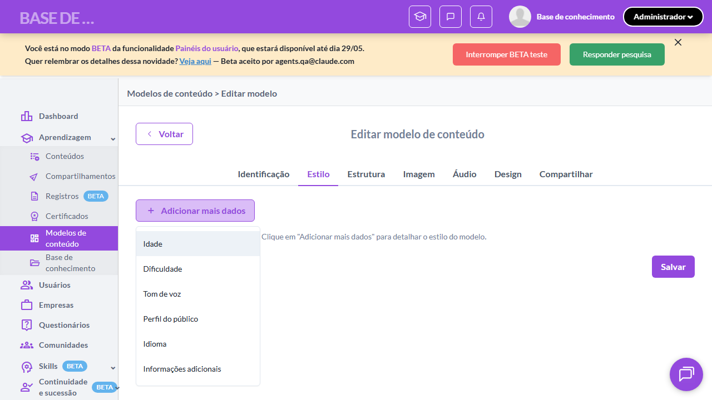

- 🎬 [Vídeo da execução (video.webm)](artifacts/projects-modelos-tests-fea-eff58-dos-exibe-menu-com-6-opções-chromium/video.webm)

- 📦 **Trace** — [`trace.zip`](artifacts/projects-modelos-tests-fea-eff58-dos-exibe-menu-com-6-opções-chromium/trace.zip)

  ```bash
  npx playwright show-trace outputs/modelos/reports/regression_20260525-111454/artifacts/projects-modelos-tests-fea-eff58-dos-exibe-menu-com-6-opções-chromium/trace.zip
  ```

- 🎥 **Vídeo** — [`video.webm`](artifacts/projects-modelos-tests-fea-eff58-dos-exibe-menu-com-6-opções-chromium/video.webm)


---

### ✅ Aprovado · TC2 · Adicionar campo Idade via menu · 🔴 Crítico

<a id="adicionar-campo-idade-via-menu"></a>_Arquivo:_ `tc02-adicionar-campo-idade.spec.ts` · _Duração:_ 19.80s · _Browser:_ chromium

**Sumário (objetivo do caso):** Validar adição de campo via menu (RN 13, RN 13.1).

**Pré-condições:**

```
Ambiente Stage configurado
Feature flag `modelos_de_conteudo` ativa
Modelo de teste cadastrado no setup do spec (via beforeAll)
Usuário logado como Admin
```

**Passos do caso (XML/TestLink + execução Playwright):**

_Cada linha reproduz um passo do XML; a coluna **Status** traz o resultado da execução (do step Allure correspondente). Linhas com "Pré-condição" são da execução automatizada (login, navegação inicial) — não fazem parte do roteiro do XML._

| # | Ação do passo | Resultado esperado | Status | Notas | Duração |
|---|---|---|:---:|---|---:|
| 1 | Acessar a aba "Estilo do conteúdo" do modelo de teste | Aba "Estilo do conteúdo" é exibida. | ✅ | — | 17.43s |
| 2 | Clicar no botão "Adicionar mais dados" | Menu suspenso é exibido. | ✅ | — | 0.67s |
| 3 | Clicar na opção "Idade" no menu | Menu fecha e novo campo "Idade" é inserido na seção de estilo, seguindo o mesmo padrão do Estúdio de Criação. | ✅ | — | 0.35s |

**Evidências:**

📁 _Pasta:_ [`artifacts/projects-modelos-tests-fea-d9836-cionar-campo-Idade-via-menu-chromium/`](artifacts/projects-modelos-tests-fea-d9836-cionar-campo-Idade-via-menu-chromium/)

- 📸 **Screenshot (screenshot)** — [`test-finished-1.png`](artifacts/projects-modelos-tests-fea-d9836-cionar-campo-Idade-via-menu-chromium/test-finished-1.png)

  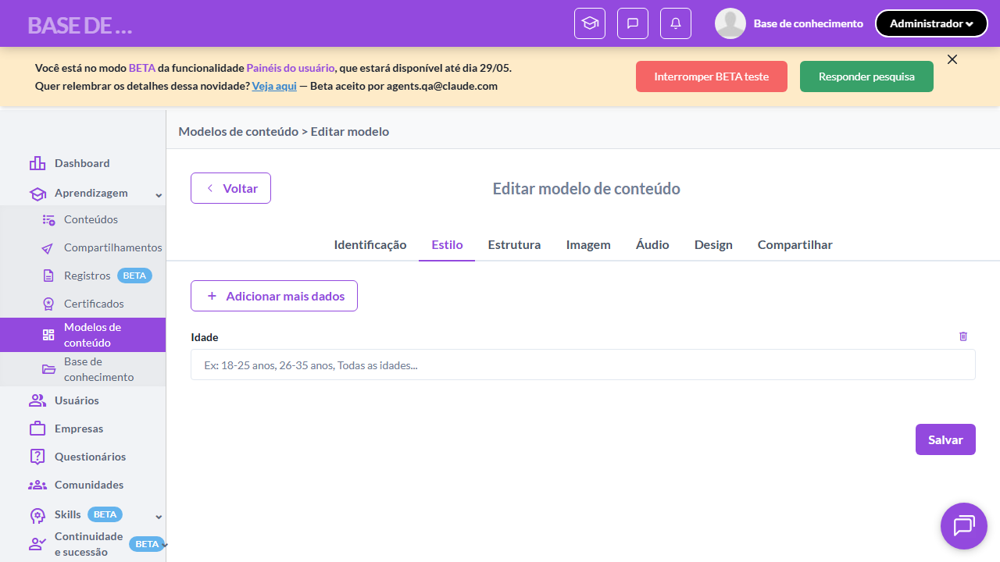

- 🎬 [Vídeo da execução (video.webm)](artifacts/projects-modelos-tests-fea-d9836-cionar-campo-Idade-via-menu-chromium/video.webm)

- 📦 **Trace** — [`trace.zip`](artifacts/projects-modelos-tests-fea-d9836-cionar-campo-Idade-via-menu-chromium/trace.zip)

  ```bash
  npx playwright show-trace outputs/modelos/reports/regression_20260525-111454/artifacts/projects-modelos-tests-fea-d9836-cionar-campo-Idade-via-menu-chromium/trace.zip
  ```

- 🎥 **Vídeo** — [`video.webm`](artifacts/projects-modelos-tests-fea-d9836-cionar-campo-Idade-via-menu-chromium/video.webm)


---

## Criação de Modelo - Aba Estrutura do Conteúdo

_8 caso(s) — 4 aprovado(s), 4 falha(s)_

### ✅ Aprovado · TC1 · Tipo de estrutura exibe 2 opções · 🔴 Crítico

<a id="tipo-de-estrutura-exibe-2-opcoes"></a>_Arquivo:_ `tc01-tipo-estrutura-exibe-2-opcoes.spec.ts` · _Duração:_ 20.88s · _Browser:_ chromium

**Sumário (objetivo do caso):** Validar opções do dropdown "Tipo de estrutura" (RN 15, RN 16).

**Pré-condições:**

```
Ambiente Stage configurado
Feature flag `modelos_de_conteudo` ativa
Modelo de teste cadastrado no setup do spec (via beforeAll)
Usuário logado como Admin
```

**Passos do caso (XML/TestLink + execução Playwright):**

_Cada linha reproduz um passo do XML; a coluna **Status** traz o resultado da execução (do step Allure correspondente). Linhas com "Pré-condição" são da execução automatizada (login, navegação inicial) — não fazem parte do roteiro do XML._

| # | Ação do passo | Resultado esperado | Status | Notas | Duração |
|---|---|---|:---:|---|---:|
| 1 | Acessar a aba "Estrutura do conteúdo" do modelo de teste | Aba "Estrutura do conteúdo" fica selecionada. | ✅ | — | 19.18s |
| 2 | Clicar no dropdown "Tipo de estrutura" | Dropdown exibe as opções "Atividades sequenciais (1 nível)" e "Atividades agrupadas por módulos (2 níveis)". | ✅ | — | 0.04s |

**Evidências:**

📁 _Pasta:_ [`artifacts/projects-modelos-tests-fea-436b3-de-estrutura-exibe-2-opções-chromium/`](artifacts/projects-modelos-tests-fea-436b3-de-estrutura-exibe-2-opções-chromium/)

- 📸 **Screenshot (screenshot)** — [`test-finished-1.png`](artifacts/projects-modelos-tests-fea-436b3-de-estrutura-exibe-2-opções-chromium/test-finished-1.png)

  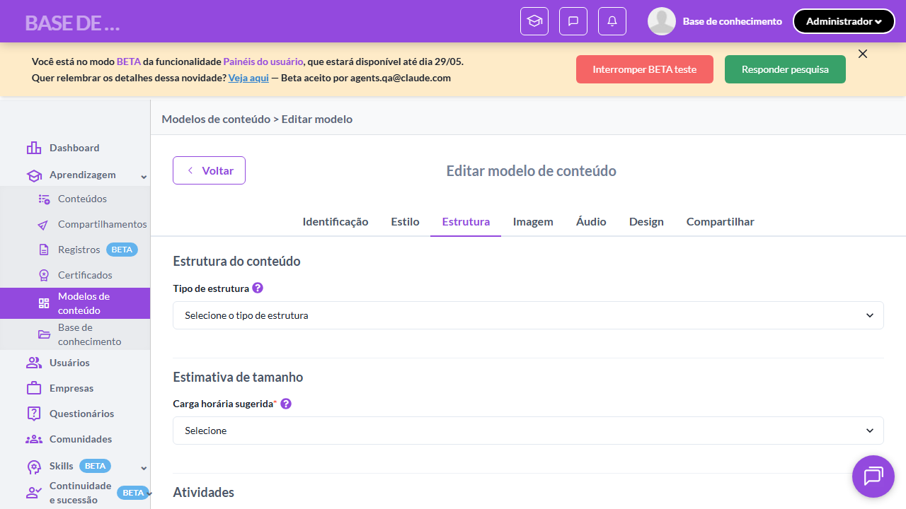

- 🎬 [Vídeo da execução (video.webm)](artifacts/projects-modelos-tests-fea-436b3-de-estrutura-exibe-2-opções-chromium/video.webm)

- 📦 **Trace** — [`trace.zip`](artifacts/projects-modelos-tests-fea-436b3-de-estrutura-exibe-2-opções-chromium/trace.zip)

  ```bash
  npx playwright show-trace outputs/modelos/reports/regression_20260525-111454/artifacts/projects-modelos-tests-fea-436b3-de-estrutura-exibe-2-opções-chromium/trace.zip
  ```

- 🎥 **Vídeo** — [`video.webm`](artifacts/projects-modelos-tests-fea-436b3-de-estrutura-exibe-2-opções-chromium/video.webm)


---

### ✅ Aprovado · TC2 · Tooltip do Tipo de estrutura · 🔴 Crítico

<a id="tooltip-do-tipo-de-estrutura"></a>_Arquivo:_ `tc02-tooltip-tipo-estrutura.spec.ts` · _Duração:_ 22.05s · _Browser:_ chromium

**Sumário (objetivo do caso):** Validar texto literal da tooltip (RN 15).

**Pré-condições:**

```
Ambiente Stage configurado
Feature flag `modelos_de_conteudo` ativa
Modelo de teste cadastrado no setup do spec (via beforeAll)
Usuário logado como Admin
```

**Passos do caso (XML/TestLink + execução Playwright):**

_Cada linha reproduz um passo do XML; a coluna **Status** traz o resultado da execução (do step Allure correspondente). Linhas com "Pré-condição" são da execução automatizada (login, navegação inicial) — não fazem parte do roteiro do XML._

| # | Ação do passo | Resultado esperado | Status | Notas | Duração |
|---|---|---|:---:|---|---:|
| 1 | Acessar a aba "Estrutura do conteúdo" | Aba é exibida. | ✅ | — | 20.28s |
| 2 | Aguardar a tooltip do campo "Tipo de estrutura" ser exibida ao posicionar o mouse | Tooltip exibida: "Define se o curso possui apenas atividades sequenciais ou se elas são organizadas em módulos.". | ✅ | — | 0.23s |

**Evidências:**

📁 _Pasta:_ [`artifacts/projects-modelos-tests-fea-5ae19-ooltip-do-Tipo-de-estrutura-chromium/`](artifacts/projects-modelos-tests-fea-5ae19-ooltip-do-Tipo-de-estrutura-chromium/)

- 📸 **Screenshot (screenshot)** — [`test-finished-1.png`](artifacts/projects-modelos-tests-fea-5ae19-ooltip-do-Tipo-de-estrutura-chromium/test-finished-1.png)

  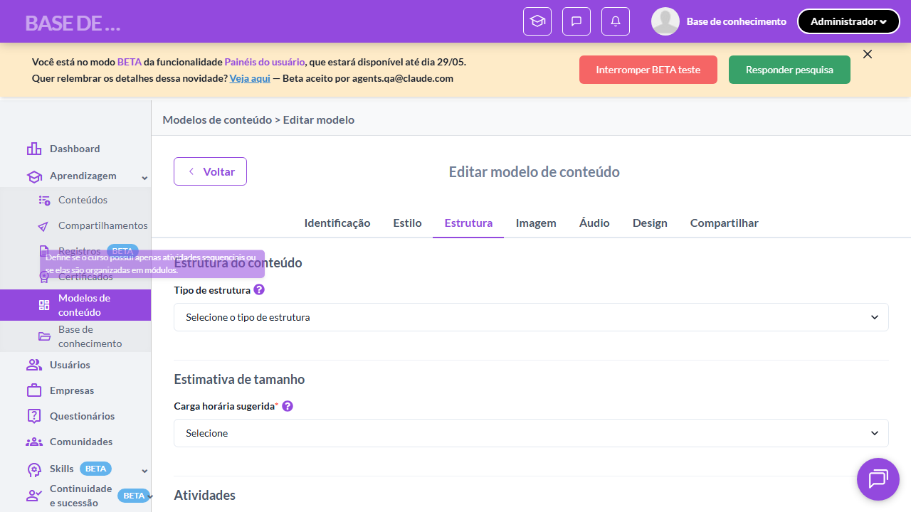

- 🎬 [Vídeo da execução (video.webm)](artifacts/projects-modelos-tests-fea-5ae19-ooltip-do-Tipo-de-estrutura-chromium/video.webm)

- 📦 **Trace** — [`trace.zip`](artifacts/projects-modelos-tests-fea-5ae19-ooltip-do-Tipo-de-estrutura-chromium/trace.zip)

  ```bash
  npx playwright show-trace outputs/modelos/reports/regression_20260525-111454/artifacts/projects-modelos-tests-fea-5ae19-ooltip-do-Tipo-de-estrutura-chromium/trace.zip
  ```

- 🎥 **Vídeo** — [`video.webm`](artifacts/projects-modelos-tests-fea-5ae19-ooltip-do-Tipo-de-estrutura-chromium/video.webm)


---

### ✅ Aprovado · TC3 · Selecionar "2 níveis" exibe campo de atividades por módulo · 🔴 Crítico

<a id="selecionar-2-niveis-exibe-campo-de-atividades-por-modulo"></a>_Arquivo:_ `tc03-2-niveis-exibe-atividades-por-modulo.spec.ts` · _Duração:_ 19.89s · _Browser:_ chromium

**Sumário (objetivo do caso):** Validar comportamento condicional ao selecionar 2 níveis (RN 16.1).

**Pré-condições:**

```
Ambiente Stage configurado
Feature flag `modelos_de_conteudo` ativa
Modelo de teste cadastrado no setup do spec (via beforeAll)
Usuário logado como Admin
```

**Passos do caso (XML/TestLink + execução Playwright):**

_Cada linha reproduz um passo do XML; a coluna **Status** traz o resultado da execução (do step Allure correspondente). Linhas com "Pré-condição" são da execução automatizada (login, navegação inicial) — não fazem parte do roteiro do XML._

| # | Ação do passo | Resultado esperado | Status | Notas | Duração |
|---|---|---|:---:|---|---:|
| — | _Pré-condição:_ cleanup: voltar para "1 nível" | — | ✅ | — | 0.62s |
| 1 | Acessar a aba "Estrutura do conteúdo" | Aba é exibida. | ✅ | — | 17.10s |
| 2 | Selecionar "Atividades agrupadas por módulos (2 níveis)" no dropdown "Tipo de estrutura" | Dropdown exibe a opção selecionada. | ✅ | — | 0.69s |
| 3 | Aguardar o campo "Número de atividades por módulo" ser exibido | Campo numérico "Número de atividades por módulo" é exibido com tooltip: "Número sugerido de atividades que a IA irá criar dentro de cada módulo do curso.". | ✅ | — | 0.03s |

**Evidências:**

📁 _Pasta:_ [`artifacts/projects-modelos-tests-fea-10eb6-po-de-atividades-por-módulo-chromium/`](artifacts/projects-modelos-tests-fea-10eb6-po-de-atividades-por-módulo-chromium/)

- 📸 **Screenshot (screenshot)** — [`test-finished-1.png`](artifacts/projects-modelos-tests-fea-10eb6-po-de-atividades-por-módulo-chromium/test-finished-1.png)

  

- 🎬 [Vídeo da execução (video.webm)](artifacts/projects-modelos-tests-fea-10eb6-po-de-atividades-por-módulo-chromium/video.webm)

- 📦 **Trace** — [`trace.zip`](artifacts/projects-modelos-tests-fea-10eb6-po-de-atividades-por-módulo-chromium/trace.zip)

  ```bash
  npx playwright show-trace outputs/modelos/reports/regression_20260525-111454/artifacts/projects-modelos-tests-fea-10eb6-po-de-atividades-por-módulo-chromium/trace.zip
  ```

- 🎥 **Vídeo** — [`video.webm`](artifacts/projects-modelos-tests-fea-10eb6-po-de-atividades-por-módulo-chromium/video.webm)


---

### ✅ Aprovado · TC4 · Validação obrigatoriedade da Carga horária (matriz A) · 🔴 Crítico

<a id="validacao-obrigatoriedade-da-carga-horaria-matriz-a"></a>_Arquivo:_ `tc04-carga-horaria-obrigatoria-bloqueia-save.spec.ts` · _Duração:_ 22.42s · _Browser:_ chromium

**Sumário (objetivo do caso):** Validar obrigatoriedade do campo "Carga horária sugerida" (select → categoria A). Cobertura conforme matriz da skill `cenarios-negativos-twygo`.

**Pré-condições:**

```
Ambiente Stage configurado
Feature flag `modelos_de_conteudo` ativa
Modelo de teste cadastrado no setup do spec (via beforeAll)
Usuário logado como Admin
```

**Passos do caso (XML/TestLink + execução Playwright):**

_Cada linha reproduz um passo do XML; a coluna **Status** traz o resultado da execução (do step Allure correspondente). Linhas com "Pré-condição" são da execução automatizada (login, navegação inicial) — não fazem parte do roteiro do XML._

| # | Ação do passo | Resultado esperado | Status | Notas | Duração |
|---|---|---|:---:|---|---:|
| — | _Pré-condição:_ [A] Sem carga horária → save bloqueado | — | ✅ | — | 20.60s |
| 1 | Acessar a aba "Estrutura do conteúdo" do modelo de teste | Aba é exibida. | ✅ | — | — |
| 2 | Para cada linha da `**Validation matrix**`, configurar "Carga horária" conforme `Entrada`, clicar "Salvar" | Sistema reage conforme `Esperado`. **Validation matrix**: \| Categoria \| Entrada \| Esperado \| \|---\|---\|---\| \| A \| Nenhuma opção selecionada \| Mensagem "Carga horária sugerida é obrigatória" exibida. Modelo NÃO é salvo. \| \| A \| "Médio" selecionado \| Salvamento permitido. \| | ✅ | — | — |

**Evidências:**

📁 _Pasta:_ [`artifacts/projects-modelos-tests-fea-c3b0f--da-Carga-horária-matriz-A--chromium/`](artifacts/projects-modelos-tests-fea-c3b0f--da-Carga-horária-matriz-A--chromium/)

- 📸 **Screenshot (screenshot)** — [`test-finished-1.png`](artifacts/projects-modelos-tests-fea-c3b0f--da-Carga-horária-matriz-A--chromium/test-finished-1.png)

  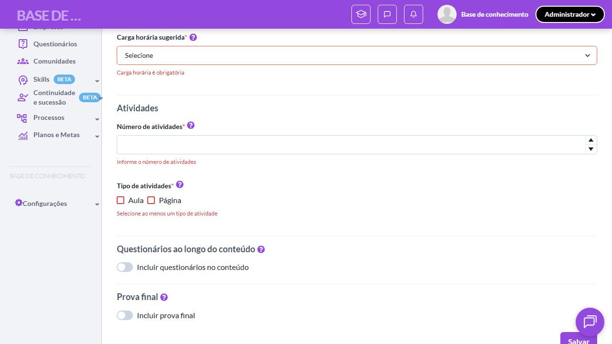

- 🎬 [Vídeo da execução (video.webm)](artifacts/projects-modelos-tests-fea-c3b0f--da-Carga-horária-matriz-A--chromium/video.webm)

- 📦 **Trace** — [`trace.zip`](artifacts/projects-modelos-tests-fea-c3b0f--da-Carga-horária-matriz-A--chromium/trace.zip)

  ```bash
  npx playwright show-trace outputs/modelos/reports/regression_20260525-111454/artifacts/projects-modelos-tests-fea-c3b0f--da-Carga-horária-matriz-A--chromium/trace.zip
  ```

- 🎥 **Vídeo** — [`video.webm`](artifacts/projects-modelos-tests-fea-c3b0f--da-Carga-horária-matriz-A--chromium/video.webm)


---

### ❌ Falhou · TC5 · Carga horária exibe 5 opções literais · 🔴 Crítico

<a id="carga-horaria-exibe-5-opcoes-literais"></a>_Arquivo:_ `tc05-carga-horaria-5-opcoes.spec.ts` · _Duração:_ 19.41s · _Browser:_ chromium

> **❌ Por que falhou:** O valor obtido não é igual ao esperado. Esperado: ArrayContaining ["Micro", "Curto", "Médio", "Estendido", "Longo"] · Atual: ["Selecione", "Micro (30 segundos a 5 minutos)", "Curto (5 a 15 minutos)", "Médi
... [truncado, 155 chars total].
> _Step impactado:_ **2. Ler options de "Carga horária" e validar as 5 esperadas**

**Sumário (objetivo do caso):** Validar as 5 opções literais de carga horária (RN 18).

**Pré-condições:**

```
Ambiente Stage configurado
Feature flag `modelos_de_conteudo` ativa
Modelo de teste cadastrado no setup do spec (via beforeAll)
Usuário logado como Admin
```

**Passos do caso (XML/TestLink + execução Playwright):**

_Cada linha reproduz um passo do XML; a coluna **Status** traz o resultado da execução (do step Allure correspondente). Linhas com "Pré-condição" são da execução automatizada (login, navegação inicial) — não fazem parte do roteiro do XML._

| # | Ação do passo | Resultado esperado | Status | Notas | Duração |
|---|---|---|:---:|---|---:|
| 1 | Acessar a aba "Estrutura do conteúdo" | Aba é exibida. | ✅ | — | 17.58s |
| 2 | Clicar no dropdown "Carga horária sugerida" | Dropdown exibe as opções "Micro", "Curto", "Médio", "Estendido", "Longo". | ❌ | O valor obtido não é igual ao esperado. Esperado: ArrayContaining ["Micro", "Curto", "Médio", "Estendido", "Longo"] · Atual: ["Selecione", "Micro (30 segundos a 5 minutos)", "Curto (5 a 15 minutos)", "Médi ... [truncado, 155 chars total]. | 0.04s |

**Evidências:**

📁 _Pasta:_ [`artifacts/projects-modelos-tests-fea-62b2e-ria-exibe-5-opções-literais-chromium/`](artifacts/projects-modelos-tests-fea-62b2e-ria-exibe-5-opções-literais-chromium/)

- 📸 **Screenshot (screenshot)** — [`test-failed-1.png`](artifacts/projects-modelos-tests-fea-62b2e-ria-exibe-5-opções-literais-chromium/test-failed-1.png)

  

- 🎬 [Vídeo da execução (video.webm)](artifacts/projects-modelos-tests-fea-62b2e-ria-exibe-5-opções-literais-chromium/video.webm)

- 📦 **Trace** — [`trace.zip`](artifacts/projects-modelos-tests-fea-62b2e-ria-exibe-5-opções-literais-chromium/trace.zip)

  ```bash
  npx playwright show-trace outputs/modelos/reports/regression_20260525-111454/artifacts/projects-modelos-tests-fea-62b2e-ria-exibe-5-opções-literais-chromium/trace.zip
  ```

- 🎥 **Vídeo** — [`video.webm`](artifacts/projects-modelos-tests-fea-62b2e-ria-exibe-5-opções-literais-chromium/video.webm)

- 📄 **DOM no momento da falha** — [`error-context.md`](artifacts/projects-modelos-tests-fea-62b2e-ria-exibe-5-opções-literais-chromium/error-context.md)

#### 🐛 Pronto para registro de bug

> ❓ **Análise automática:** Inconclusivo (precisa investigação manual) · Confiança 🔴 baixa
> _Por quê:_ Sem sinal Network in-scope ou padrão de erro conhecido — revisar trace
> _Bug-report estruturado:_ [`bug-reports/criacao-de-modelo-aba-estrutura-do-conteudo__carga-horaria-exibe-5-opcoes-literais.md`](bug-reports/criacao-de-modelo-aba-estrutura-do-conteudo__carga-horaria-exibe-5-opcoes-literais.md)

**Próximas ações sugeridas:**
- Sem evidência suficiente para classificar — abrir `trace.zip` (`npx playwright show-trace`) para ver passo a passo da execução.
- Reabrir o agente com o trace em mãos para reclassificar manualmente em uma das 4 categorias.

**Descrição do BUG:** [Crítico] Carga horária exibe 5 opções literais — O valor obtido não é igual ao esperado. Esperado: ArrayContaining ["Micro", "Curto", "Médio", "Estendido", "Longo"] · Atual: ["Selecione", "Micro (30 segundos a 5 minutos)", "Curto (5 a 15 minutos)", "Médi
... [truncado, 155 chars total].

**Passo a passo para reprodução:**
1. Pré: Ambiente Stage configurado
1. Pré: Feature flag `modelos_de_conteudo` ativa
1. Pré: Modelo de teste cadastrado no setup do spec (via beforeAll)
1. Pré: Usuário logado como Admin
1. 1. Acessar a aba "Estrutura do conteúdo"
1. 2. Clicar no dropdown "Carga horária sugerida"

**Comportamento esperado:** Dropdown exibe as opções "Micro", "Curto", "Médio", "Estendido", "Longo".

**Comportamento atual:** O valor obtido não é igual ao esperado. Esperado: ArrayContaining ["Micro", "Curto", "Médio", "Estendido", "Longo"] · Atual: ["Selecione", "Micro (30 segundos a 5 minutos)", "Curto (5 a 15 minutos)", "Médi
... [truncado, 155 chars total]. (falha aconteceu no passo 2: "Ler options de "Carga horária" e validar as 5 esperadas", que deveria resultar em: Dropdown exibe as opções "Micro", "Curto", "Médio", "Estendido", "Longo".)

**Informações:**

| Campo | Valor |
|---|---|
| URL | `https://basedeconhecimento.stage.twygoead.com/` |
| Login | Credenciais via env: `TWYGO_STAGING_BASE_DE_CONHECIMENTO_EMAIL` (consulte `.env`) |
| Senha | Credenciais via env: `TWYGO_STAGING_BASE_DE_CONHECIMENTO_PASSWORD` (consulte `.env`) |
| orgId | 37007 |
| Outros | Browser: chromium |
| Outros | runId: regression_20260525-111454 |
| Outros | Duração até a falha: 19.41s |
| Outros | Step impactado: 2. Ler options de "Carga horária" e validar as 5 esperadas |

**Evidências:**

- Screenshot capturado pelo Playwright (screenshot): artifacts/projects-modelos-tests-fea-62b2e-ria-exibe-5-opções-literais-chromium/test-failed-1.png
- Vídeo da execução (video.webm): artifacts/projects-modelos-tests-fea-62b2e-ria-exibe-5-opções-literais-chromium/video.webm
- Snapshot do DOM/contexto da página (error-context.md): artifacts/projects-modelos-tests-fea-62b2e-ria-exibe-5-opções-literais-chromium/error-context.md
- Trace completo do Playwright (.zip) — `npx playwright show-trace`: artifacts/projects-modelos-tests-fea-62b2e-ria-exibe-5-opções-literais-chromium/trace.zip

<details><summary>📋 Ver texto agregado para copiar (Jira/GitHub/Linear)</summary>

```
Descrição do BUG
[Crítico] Carga horária exibe 5 opções literais — O valor obtido não é igual ao esperado. Esperado: ArrayContaining ["Micro", "Curto", "Médio", "Estendido", "Longo"] · Atual: ["Selecione", "Micro (30 segundos a 5 minutos)", "Curto (5 a 15 minutos)", "Médi
... [truncado, 155 chars total].

Passo a passo para reprodução
  Pré: Ambiente Stage configurado
  Pré: Feature flag `modelos_de_conteudo` ativa
  Pré: Modelo de teste cadastrado no setup do spec (via beforeAll)
  Pré: Usuário logado como Admin
  1. Acessar a aba "Estrutura do conteúdo"
  2. Clicar no dropdown "Carga horária sugerida"

Comportamento esperado
Dropdown exibe as opções "Micro", "Curto", "Médio", "Estendido", "Longo".

Comportamento atual
O valor obtido não é igual ao esperado. Esperado: ArrayContaining ["Micro", "Curto", "Médio", "Estendido", "Longo"] · Atual: ["Selecione", "Micro (30 segundos a 5 minutos)", "Curto (5 a 15 minutos)", "Médi
... [truncado, 155 chars total]. (falha aconteceu no passo 2: "Ler options de "Carga horária" e validar as 5 esperadas", que deveria resultar em: Dropdown exibe as opções "Micro", "Curto", "Médio", "Estendido", "Longo".)

Informações
- URL: https://basedeconhecimento.stage.twygoead.com/
- Login: Credenciais via env: `TWYGO_STAGING_BASE_DE_CONHECIMENTO_EMAIL` (consulte `.env`)
- Senha: Credenciais via env: `TWYGO_STAGING_BASE_DE_CONHECIMENTO_PASSWORD` (consulte `.env`)
- ID do ambiente (orgId): 37007
- Outros:
  - Browser: chromium
  - runId: regression_20260525-111454
  - Duração até a falha: 19.41s
  - Step impactado: 2. Ler options de "Carga horária" e validar as 5 esperadas

Evidências
- Screenshot capturado pelo Playwright (screenshot): artifacts/projects-modelos-tests-fea-62b2e-ria-exibe-5-opções-literais-chromium/test-failed-1.png
- Vídeo da execução (video.webm): artifacts/projects-modelos-tests-fea-62b2e-ria-exibe-5-opções-literais-chromium/video.webm
- Snapshot do DOM/contexto da página (error-context.md): artifacts/projects-modelos-tests-fea-62b2e-ria-exibe-5-opções-literais-chromium/error-context.md
- Trace completo do Playwright (.zip) — `npx playwright show-trace`: artifacts/projects-modelos-tests-fea-62b2e-ria-exibe-5-opções-literais-chromium/trace.zip

Execução
- runId: regression_20260525-111454
- environment.json: staging-base-de-conhecimento
- testsuite: Criação de Modelo - Aba Estrutura do Conteúdo
- testcase: Carga horária exibe 5 opções literais

```

</details>

<details><summary>🔧 Stack trace técnica completa (para desenvolvedor)</summary>

```
Error: expect(received).toEqual(expected) // deep equality

Expected: ArrayContaining ["Micro", "Curto", "Médio", "Estendido", "Longo"]
Received: ["Selecione", "Micro (30 segundos a 5 minutos)", "Curto (5 a 15 minutos)", "Médio (15 a 30 minutos)", "Estendido (30 a 60 minutos)", "Longo (1 a 2 horas)"]
```

</details>

---

### ❌ Falhou · TC6 · Switch "Incluir questionários" exibe configurações básicas · 🔴 Crítico

<a id="switch-incluir-questionarios-exibe-configuracoes-basicas"></a>_Arquivo:_ `tc06-switch-incluir-questionarios.spec.ts` · _Duração:_ 39.37s · _Browser:_ chromium

> **❌ Por que falhou:** Não foi possível preencher o elemento — ele não ficou disponível em 30s (locator: locator('#play-interest-search')).
> _Step impactado:_ **1. Abrir aba Estrutura com seção "Questionários ao longo do conteúdo"**

**Sumário (objetivo do caso):** Validar que ativar o switch exibe os campos básicos de questionário (RN 21, RN 22).

**Pré-condições:**

```
Ambiente Stage configurado
Feature flag `modelos_de_conteudo` ativa
Modelo de teste cadastrado no setup do spec (via beforeAll)
Usuário logado como Admin
```

**Passos do caso (XML/TestLink + execução Playwright):**

_Cada linha reproduz um passo do XML; a coluna **Status** traz o resultado da execução (do step Allure correspondente). Linhas com "Pré-condição" são da execução automatizada (login, navegação inicial) — não fazem parte do roteiro do XML._

| # | Ação do passo | Resultado esperado | Status | Notas | Duração |
|---|---|---|:---:|---|---:|
| 1 | Acessar a aba "Estrutura do conteúdo" | Aba é exibida com a seção "Questionários ao longo do conteúdo". | ❌ | Não foi possível preencher o elemento — ele não ficou disponível em 30s (locator: locator('#play-interest-search')). | 35.54s |
| 2 | Ativar o switch "Incluir questionários no conteúdo" | Seção expande exibindo os campos básicos de configuração de questionário. | ⊘ | Step não executado: o teste foi interrompido antes. Causa: Não foi possível preencher o elemento — ele não ficou disponível em 30s (locator: locator('#play-interest-search')).. | — |

**Evidências:**

📁 _Pasta:_ [`artifacts/projects-modelos-tests-fea-ca9a9-exibe-configurações-básicas-chromium/`](artifacts/projects-modelos-tests-fea-ca9a9-exibe-configurações-básicas-chromium/)

- 📸 **Screenshot (screenshot)** — [`test-failed-1.png`](artifacts/projects-modelos-tests-fea-ca9a9-exibe-configurações-básicas-chromium/test-failed-1.png)

  

- 🎬 [Vídeo da execução (video.webm)](artifacts/projects-modelos-tests-fea-ca9a9-exibe-configurações-básicas-chromium/video.webm)

- 📦 **Trace** — [`trace.zip`](artifacts/projects-modelos-tests-fea-ca9a9-exibe-configurações-básicas-chromium/trace.zip)

  ```bash
  npx playwright show-trace outputs/modelos/reports/regression_20260525-111454/artifacts/projects-modelos-tests-fea-ca9a9-exibe-configurações-básicas-chromium/trace.zip
  ```

- 🎥 **Vídeo** — [`video.webm`](artifacts/projects-modelos-tests-fea-ca9a9-exibe-configurações-básicas-chromium/video.webm)

- 📄 **DOM no momento da falha** — [`error-context.md`](artifacts/projects-modelos-tests-fea-ca9a9-exibe-configurações-básicas-chromium/error-context.md)

#### 🐛 Pronto para registro de bug

> 🧪 **Análise automática:** Spec frágil (problema no teste, não no produto) · Confiança 🟡 media
> _Por quê:_ Timeout sem HTTP error — possível wait/seletor frágil. Confirmar via chrome-mcp
> _Bug-report estruturado:_ [`bug-reports/criacao-de-modelo-aba-estrutura-do-conteudo__switch-incluir-questionarios-exibe-configuracoes-basicas.md`](bug-reports/criacao-de-modelo-aba-estrutura-do-conteudo__switch-incluir-questionarios-exibe-configuracoes-basicas.md)

**Próximas ações sugeridas:**
- Inspecionar o trace (`npx playwright show-trace`) para confirmar que o elemento existe mas o seletor/timing falhou.
- Avaliar se o spec viola algum dos 3 padrões da skill `criar-spec-resiliente-twygo` (count de seed, timing pós-hidratação, retry de rede).
- Disparar o healer (`playwright-test-healer`) para corrigir seletor/timing/asserção SEM alterar a intenção do teste.

**Descrição do BUG:** [Crítico] Switch "Incluir questionários" exibe configurações básicas — Não foi possível preencher o elemento — ele não ficou disponível em 30s (locator: locator('#play-interest-search')).

**Passo a passo para reprodução:**
1. Pré: Ambiente Stage configurado
1. Pré: Feature flag `modelos_de_conteudo` ativa
1. Pré: Modelo de teste cadastrado no setup do spec (via beforeAll)
1. Pré: Usuário logado como Admin
1. 1. Acessar a aba "Estrutura do conteúdo"
1. 2. Ativar o switch "Incluir questionários no conteúdo"

**Comportamento esperado:** Aba é exibida com a seção "Questionários ao longo do conteúdo".

**Comportamento atual:** Não foi possível preencher o elemento — ele não ficou disponível em 30s (locator: locator('#play-interest-search')). (falha aconteceu no passo 1: "Abrir aba Estrutura com seção "Questionários ao longo do conteúdo"", que deveria resultar em: Aba é exibida com a seção "Questionários ao longo do conteúdo".)

**Informações:**

| Campo | Valor |
|---|---|
| URL | `https://basedeconhecimento.stage.twygoead.com/` |
| Login | Credenciais via env: `TWYGO_STAGING_BASE_DE_CONHECIMENTO_EMAIL` (consulte `.env`) |
| Senha | Credenciais via env: `TWYGO_STAGING_BASE_DE_CONHECIMENTO_PASSWORD` (consulte `.env`) |
| orgId | — |
| Outros | Browser: chromium |
| Outros | runId: regression_20260525-111454 |
| Outros | Duração até a falha: 39.37s |
| Outros | Step impactado: 1. Abrir aba Estrutura com seção "Questionários ao longo do conteúdo" |

**Evidências:**

- Screenshot capturado pelo Playwright (screenshot): artifacts/projects-modelos-tests-fea-ca9a9-exibe-configurações-básicas-chromium/test-failed-1.png
- Vídeo da execução (video.webm): artifacts/projects-modelos-tests-fea-ca9a9-exibe-configurações-básicas-chromium/video.webm
- Snapshot do DOM/contexto da página (error-context.md): artifacts/projects-modelos-tests-fea-ca9a9-exibe-configurações-básicas-chromium/error-context.md
- Trace completo do Playwright (.zip) — `npx playwright show-trace`: artifacts/projects-modelos-tests-fea-ca9a9-exibe-configurações-básicas-chromium/trace.zip

<details><summary>📋 Ver texto agregado para copiar (Jira/GitHub/Linear)</summary>

```
Descrição do BUG
[Crítico] Switch "Incluir questionários" exibe configurações básicas — Não foi possível preencher o elemento — ele não ficou disponível em 30s (locator: locator('#play-interest-search')).

Passo a passo para reprodução
  Pré: Ambiente Stage configurado
  Pré: Feature flag `modelos_de_conteudo` ativa
  Pré: Modelo de teste cadastrado no setup do spec (via beforeAll)
  Pré: Usuário logado como Admin
  1. Acessar a aba "Estrutura do conteúdo"
  2. Ativar o switch "Incluir questionários no conteúdo"

Comportamento esperado
Aba é exibida com a seção "Questionários ao longo do conteúdo".

Comportamento atual
Não foi possível preencher o elemento — ele não ficou disponível em 30s (locator: locator('#play-interest-search')). (falha aconteceu no passo 1: "Abrir aba Estrutura com seção "Questionários ao longo do conteúdo"", que deveria resultar em: Aba é exibida com a seção "Questionários ao longo do conteúdo".)

Informações
- URL: https://basedeconhecimento.stage.twygoead.com/
- Login: Credenciais via env: `TWYGO_STAGING_BASE_DE_CONHECIMENTO_EMAIL` (consulte `.env`)
- Senha: Credenciais via env: `TWYGO_STAGING_BASE_DE_CONHECIMENTO_PASSWORD` (consulte `.env`)
- ID do ambiente (orgId): —
- Outros:
  - Browser: chromium
  - runId: regression_20260525-111454
  - Duração até a falha: 39.37s
  - Step impactado: 1. Abrir aba Estrutura com seção "Questionários ao longo do conteúdo"

Evidências
- Screenshot capturado pelo Playwright (screenshot): artifacts/projects-modelos-tests-fea-ca9a9-exibe-configurações-básicas-chromium/test-failed-1.png
- Vídeo da execução (video.webm): artifacts/projects-modelos-tests-fea-ca9a9-exibe-configurações-básicas-chromium/video.webm
- Snapshot do DOM/contexto da página (error-context.md): artifacts/projects-modelos-tests-fea-ca9a9-exibe-configurações-básicas-chromium/error-context.md
- Trace completo do Playwright (.zip) — `npx playwright show-trace`: artifacts/projects-modelos-tests-fea-ca9a9-exibe-configurações-básicas-chromium/trace.zip

Execução
- runId: regression_20260525-111454
- environment.json: staging-base-de-conhecimento
- testsuite: Criação de Modelo - Aba Estrutura do Conteúdo
- testcase: Switch "Incluir questionários" exibe configurações básicas

```

</details>

<details><summary>🔧 Stack trace técnica completa (para desenvolvedor)</summary>

```
TimeoutError: locator.fill: Timeout 30000ms exceeded.
Call log:
  - waiting for locator('#play-interest-search')

```

</details>

---

### ❌ Falhou · TC7 · Switch "Configurações avançadas" exibe campos adicionais · 🔴 Crítico

<a id="switch-configuracoes-avancadas-exibe-campos-adicionais"></a>_Arquivo:_ `tc07-switch-configuracoes-avancadas.spec.ts` · _Duração:_ 38.13s · _Browser:_ chromium

> **❌ Por que falhou:** Não foi possível preencher o elemento — ele não ficou disponível em 30s (locator: locator('#play-interest-search')).
> _Step impactado:_ **1. Abrir aba Estrutura**

**Sumário (objetivo do caso):** Validar que ativar configurações avançadas exibe campos adicionais (RN 22.1).

**Pré-condições:**

```
Ambiente Stage configurado
Feature flag `modelos_de_conteudo` ativa
Modelo de teste cadastrado no setup do spec (via beforeAll)
Usuário logado como Admin
```

**Passos do caso (XML/TestLink + execução Playwright):**

_Cada linha reproduz um passo do XML; a coluna **Status** traz o resultado da execução (do step Allure correspondente). Linhas com "Pré-condição" são da execução automatizada (login, navegação inicial) — não fazem parte do roteiro do XML._

| # | Ação do passo | Resultado esperado | Status | Notas | Duração |
|---|---|---|:---:|---|---:|
| 1 | Ativar o switch "Incluir questionários no conteúdo" | Campos básicos de questionário são exibidos. | ❌ | Não foi possível preencher o elemento — ele não ficou disponível em 30s (locator: locator('#play-interest-search')). | 35.40s |
| 2 | Ativar o switch "Configurações avançadas" | Campos adicionais de configuração são exibidos. | ⊘ | Step não executado: o teste foi interrompido antes. Causa: Não foi possível preencher o elemento — ele não ficou disponível em 30s (locator: locator('#play-interest-search')).. | — |

**Evidências:**

📁 _Pasta:_ [`artifacts/projects-modelos-tests-fea-8c90b-das-exibe-campos-adicionais-chromium/`](artifacts/projects-modelos-tests-fea-8c90b-das-exibe-campos-adicionais-chromium/)

- 📸 **Screenshot (screenshot)** — [`test-failed-1.png`](artifacts/projects-modelos-tests-fea-8c90b-das-exibe-campos-adicionais-chromium/test-failed-1.png)

  

- 🎬 [Vídeo da execução (video.webm)](artifacts/projects-modelos-tests-fea-8c90b-das-exibe-campos-adicionais-chromium/video.webm)

- 📦 **Trace** — [`trace.zip`](artifacts/projects-modelos-tests-fea-8c90b-das-exibe-campos-adicionais-chromium/trace.zip)

  ```bash
  npx playwright show-trace outputs/modelos/reports/regression_20260525-111454/artifacts/projects-modelos-tests-fea-8c90b-das-exibe-campos-adicionais-chromium/trace.zip
  ```

- 🎥 **Vídeo** — [`video.webm`](artifacts/projects-modelos-tests-fea-8c90b-das-exibe-campos-adicionais-chromium/video.webm)

- 📄 **DOM no momento da falha** — [`error-context.md`](artifacts/projects-modelos-tests-fea-8c90b-das-exibe-campos-adicionais-chromium/error-context.md)

#### 🐛 Pronto para registro de bug

> 🧪 **Análise automática:** Spec frágil (problema no teste, não no produto) · Confiança 🟡 media
> _Por quê:_ Timeout sem HTTP error — possível wait/seletor frágil. Confirmar via chrome-mcp
> _Bug-report estruturado:_ [`bug-reports/criacao-de-modelo-aba-estrutura-do-conteudo__switch-configuracoes-avancadas-exibe-campos-adicionais.md`](bug-reports/criacao-de-modelo-aba-estrutura-do-conteudo__switch-configuracoes-avancadas-exibe-campos-adicionais.md)

**Próximas ações sugeridas:**
- Inspecionar o trace (`npx playwright show-trace`) para confirmar que o elemento existe mas o seletor/timing falhou.
- Avaliar se o spec viola algum dos 3 padrões da skill `criar-spec-resiliente-twygo` (count de seed, timing pós-hidratação, retry de rede).
- Disparar o healer (`playwright-test-healer`) para corrigir seletor/timing/asserção SEM alterar a intenção do teste.

**Descrição do BUG:** [Crítico] Switch "Configurações avançadas" exibe campos adicionais — Não foi possível preencher o elemento — ele não ficou disponível em 30s (locator: locator('#play-interest-search')).

**Passo a passo para reprodução:**
1. Pré: Ambiente Stage configurado
1. Pré: Feature flag `modelos_de_conteudo` ativa
1. Pré: Modelo de teste cadastrado no setup do spec (via beforeAll)
1. Pré: Usuário logado como Admin
1. 1. Ativar o switch "Incluir questionários no conteúdo"
1. 2. Ativar o switch "Configurações avançadas"

**Comportamento esperado:** Campos básicos de questionário são exibidos.

**Comportamento atual:** Não foi possível preencher o elemento — ele não ficou disponível em 30s (locator: locator('#play-interest-search')). (falha aconteceu no passo 1: "Abrir aba Estrutura", que deveria resultar em: Campos básicos de questionário são exibidos.)

**Informações:**

| Campo | Valor |
|---|---|
| URL | `https://basedeconhecimento.stage.twygoead.com/` |
| Login | Credenciais via env: `TWYGO_STAGING_BASE_DE_CONHECIMENTO_EMAIL` (consulte `.env`) |
| Senha | Credenciais via env: `TWYGO_STAGING_BASE_DE_CONHECIMENTO_PASSWORD` (consulte `.env`) |
| orgId | — |
| Outros | Browser: chromium |
| Outros | runId: regression_20260525-111454 |
| Outros | Duração até a falha: 38.13s |
| Outros | Step impactado: 1. Abrir aba Estrutura |

**Evidências:**

- Screenshot capturado pelo Playwright (screenshot): artifacts/projects-modelos-tests-fea-8c90b-das-exibe-campos-adicionais-chromium/test-failed-1.png
- Vídeo da execução (video.webm): artifacts/projects-modelos-tests-fea-8c90b-das-exibe-campos-adicionais-chromium/video.webm
- Snapshot do DOM/contexto da página (error-context.md): artifacts/projects-modelos-tests-fea-8c90b-das-exibe-campos-adicionais-chromium/error-context.md
- Trace completo do Playwright (.zip) — `npx playwright show-trace`: artifacts/projects-modelos-tests-fea-8c90b-das-exibe-campos-adicionais-chromium/trace.zip

<details><summary>📋 Ver texto agregado para copiar (Jira/GitHub/Linear)</summary>

```
Descrição do BUG
[Crítico] Switch "Configurações avançadas" exibe campos adicionais — Não foi possível preencher o elemento — ele não ficou disponível em 30s (locator: locator('#play-interest-search')).

Passo a passo para reprodução
  Pré: Ambiente Stage configurado
  Pré: Feature flag `modelos_de_conteudo` ativa
  Pré: Modelo de teste cadastrado no setup do spec (via beforeAll)
  Pré: Usuário logado como Admin
  1. Ativar o switch "Incluir questionários no conteúdo"
  2. Ativar o switch "Configurações avançadas"

Comportamento esperado
Campos básicos de questionário são exibidos.

Comportamento atual
Não foi possível preencher o elemento — ele não ficou disponível em 30s (locator: locator('#play-interest-search')). (falha aconteceu no passo 1: "Abrir aba Estrutura", que deveria resultar em: Campos básicos de questionário são exibidos.)

Informações
- URL: https://basedeconhecimento.stage.twygoead.com/
- Login: Credenciais via env: `TWYGO_STAGING_BASE_DE_CONHECIMENTO_EMAIL` (consulte `.env`)
- Senha: Credenciais via env: `TWYGO_STAGING_BASE_DE_CONHECIMENTO_PASSWORD` (consulte `.env`)
- ID do ambiente (orgId): —
- Outros:
  - Browser: chromium
  - runId: regression_20260525-111454
  - Duração até a falha: 38.13s
  - Step impactado: 1. Abrir aba Estrutura

Evidências
- Screenshot capturado pelo Playwright (screenshot): artifacts/projects-modelos-tests-fea-8c90b-das-exibe-campos-adicionais-chromium/test-failed-1.png
- Vídeo da execução (video.webm): artifacts/projects-modelos-tests-fea-8c90b-das-exibe-campos-adicionais-chromium/video.webm
- Snapshot do DOM/contexto da página (error-context.md): artifacts/projects-modelos-tests-fea-8c90b-das-exibe-campos-adicionais-chromium/error-context.md
- Trace completo do Playwright (.zip) — `npx playwright show-trace`: artifacts/projects-modelos-tests-fea-8c90b-das-exibe-campos-adicionais-chromium/trace.zip

Execução
- runId: regression_20260525-111454
- environment.json: staging-base-de-conhecimento
- testsuite: Criação de Modelo - Aba Estrutura do Conteúdo
- testcase: Switch "Configurações avançadas" exibe campos adicionais

```

</details>

<details><summary>🔧 Stack trace técnica completa (para desenvolvedor)</summary>

```
TimeoutError: locator.fill: Timeout 30000ms exceeded.
Call log:
  - waiting for locator('#play-interest-search')

```

</details>

---

### ❌ Falhou · TC8 · Switch "Incluir prova final" · 🔴 Crítico

<a id="switch-incluir-prova-final"></a>_Arquivo:_ `tc08-switch-incluir-prova-final.spec.ts` · _Duração:_ 41.16s · _Browser:_ chromium

> **❌ Por que falhou:** Não foi possível preencher o elemento — ele não ficou disponível em 30s (locator: locator('#play-interest-search')).
> _Step impactado:_ **1. Abrir aba Estrutura com seção "Prova final"**

**Sumário (objetivo do caso):** Validar exibição da seção "Prova final" e campos básicos (RN 25, RN 26).

**Pré-condições:**

```
Ambiente Stage configurado
Feature flag `modelos_de_conteudo` ativa
Modelo de teste cadastrado no setup do spec (via beforeAll)
Usuário logado como Admin
```

**Passos do caso (XML/TestLink + execução Playwright):**

_Cada linha reproduz um passo do XML; a coluna **Status** traz o resultado da execução (do step Allure correspondente). Linhas com "Pré-condição" são da execução automatizada (login, navegação inicial) — não fazem parte do roteiro do XML._

| # | Ação do passo | Resultado esperado | Status | Notas | Duração |
|---|---|---|:---:|---|---:|
| 1 | Acessar a aba "Estrutura do conteúdo" | Aba é exibida com a seção "Prova final". | ❌ | Não foi possível preencher o elemento — ele não ficou disponível em 30s (locator: locator('#play-interest-search')). | 35.37s |
| 2 | Aguardar a tooltip da seção "Prova final" ser exibida ao posicionar o mouse | Tooltip exibida: "Avaliação aplicada ao final do curso, cobrindo todo o conteúdo.". | ⊘ | Step não executado: o teste foi interrompido antes. Causa: Não foi possível preencher o elemento — ele não ficou disponível em 30s (locator: locator('#play-interest-search')).. | — |
| 3 | Ativar o switch "Incluir prova final" | Seção expande exibindo os campos básicos de configuração de prova final. | ⊘ | Step não executado: o teste foi interrompido antes. Causa: Não foi possível preencher o elemento — ele não ficou disponível em 30s (locator: locator('#play-interest-search')).. | — |

**Evidências:**

📁 _Pasta:_ [`artifacts/projects-modelos-tests-fea-27d82-Switch-Incluir-prova-final--chromium/`](artifacts/projects-modelos-tests-fea-27d82-Switch-Incluir-prova-final--chromium/)

- 📸 **Screenshot (screenshot)** — [`test-failed-1.png`](artifacts/projects-modelos-tests-fea-27d82-Switch-Incluir-prova-final--chromium/test-failed-1.png)

  

- 🎬 [Vídeo da execução (video.webm)](artifacts/projects-modelos-tests-fea-27d82-Switch-Incluir-prova-final--chromium/video.webm)

- 📦 **Trace** — [`trace.zip`](artifacts/projects-modelos-tests-fea-27d82-Switch-Incluir-prova-final--chromium/trace.zip)

  ```bash
  npx playwright show-trace outputs/modelos/reports/regression_20260525-111454/artifacts/projects-modelos-tests-fea-27d82-Switch-Incluir-prova-final--chromium/trace.zip
  ```

- 🎥 **Vídeo** — [`video.webm`](artifacts/projects-modelos-tests-fea-27d82-Switch-Incluir-prova-final--chromium/video.webm)

- 📄 **DOM no momento da falha** — [`error-context.md`](artifacts/projects-modelos-tests-fea-27d82-Switch-Incluir-prova-final--chromium/error-context.md)

#### 🐛 Pronto para registro de bug

> 🧪 **Análise automática:** Spec frágil (problema no teste, não no produto) · Confiança 🟡 media
> _Por quê:_ Timeout sem HTTP error — possível wait/seletor frágil. Confirmar via chrome-mcp
> _Bug-report estruturado:_ [`bug-reports/criacao-de-modelo-aba-estrutura-do-conteudo__switch-incluir-prova-final.md`](bug-reports/criacao-de-modelo-aba-estrutura-do-conteudo__switch-incluir-prova-final.md)

**Próximas ações sugeridas:**
- Inspecionar o trace (`npx playwright show-trace`) para confirmar que o elemento existe mas o seletor/timing falhou.
- Avaliar se o spec viola algum dos 3 padrões da skill `criar-spec-resiliente-twygo` (count de seed, timing pós-hidratação, retry de rede).
- Disparar o healer (`playwright-test-healer`) para corrigir seletor/timing/asserção SEM alterar a intenção do teste.

**Descrição do BUG:** [Crítico] Switch "Incluir prova final" — Não foi possível preencher o elemento — ele não ficou disponível em 30s (locator: locator('#play-interest-search')).

**Passo a passo para reprodução:**
1. Pré: Ambiente Stage configurado
1. Pré: Feature flag `modelos_de_conteudo` ativa
1. Pré: Modelo de teste cadastrado no setup do spec (via beforeAll)
1. Pré: Usuário logado como Admin
1. 1. Acessar a aba "Estrutura do conteúdo"
1. 2. Aguardar a tooltip da seção "Prova final" ser exibida ao posicionar o mouse
1. 3. Ativar o switch "Incluir prova final"

**Comportamento esperado:** Aba é exibida com a seção "Prova final".

**Comportamento atual:** Não foi possível preencher o elemento — ele não ficou disponível em 30s (locator: locator('#play-interest-search')). (falha aconteceu no passo 1: "Abrir aba Estrutura com seção "Prova final"", que deveria resultar em: Aba é exibida com a seção "Prova final".)

**Informações:**

| Campo | Valor |
|---|---|
| URL | `https://basedeconhecimento.stage.twygoead.com/` |
| Login | Credenciais via env: `TWYGO_STAGING_BASE_DE_CONHECIMENTO_EMAIL` (consulte `.env`) |
| Senha | Credenciais via env: `TWYGO_STAGING_BASE_DE_CONHECIMENTO_PASSWORD` (consulte `.env`) |
| orgId | — |
| Outros | Browser: chromium |
| Outros | runId: regression_20260525-111454 |
| Outros | Duração até a falha: 41.16s |
| Outros | Step impactado: 1. Abrir aba Estrutura com seção "Prova final" |

**Evidências:**

- Screenshot capturado pelo Playwright (screenshot): artifacts/projects-modelos-tests-fea-27d82-Switch-Incluir-prova-final--chromium/test-failed-1.png
- Vídeo da execução (video.webm): artifacts/projects-modelos-tests-fea-27d82-Switch-Incluir-prova-final--chromium/video.webm
- Snapshot do DOM/contexto da página (error-context.md): artifacts/projects-modelos-tests-fea-27d82-Switch-Incluir-prova-final--chromium/error-context.md
- Trace completo do Playwright (.zip) — `npx playwright show-trace`: artifacts/projects-modelos-tests-fea-27d82-Switch-Incluir-prova-final--chromium/trace.zip

<details><summary>📋 Ver texto agregado para copiar (Jira/GitHub/Linear)</summary>

```
Descrição do BUG
[Crítico] Switch "Incluir prova final" — Não foi possível preencher o elemento — ele não ficou disponível em 30s (locator: locator('#play-interest-search')).

Passo a passo para reprodução
  Pré: Ambiente Stage configurado
  Pré: Feature flag `modelos_de_conteudo` ativa
  Pré: Modelo de teste cadastrado no setup do spec (via beforeAll)
  Pré: Usuário logado como Admin
  1. Acessar a aba "Estrutura do conteúdo"
  2. Aguardar a tooltip da seção "Prova final" ser exibida ao posicionar o mouse
  3. Ativar o switch "Incluir prova final"

Comportamento esperado
Aba é exibida com a seção "Prova final".

Comportamento atual
Não foi possível preencher o elemento — ele não ficou disponível em 30s (locator: locator('#play-interest-search')). (falha aconteceu no passo 1: "Abrir aba Estrutura com seção "Prova final"", que deveria resultar em: Aba é exibida com a seção "Prova final".)

Informações
- URL: https://basedeconhecimento.stage.twygoead.com/
- Login: Credenciais via env: `TWYGO_STAGING_BASE_DE_CONHECIMENTO_EMAIL` (consulte `.env`)
- Senha: Credenciais via env: `TWYGO_STAGING_BASE_DE_CONHECIMENTO_PASSWORD` (consulte `.env`)
- ID do ambiente (orgId): —
- Outros:
  - Browser: chromium
  - runId: regression_20260525-111454
  - Duração até a falha: 41.16s
  - Step impactado: 1. Abrir aba Estrutura com seção "Prova final"

Evidências
- Screenshot capturado pelo Playwright (screenshot): artifacts/projects-modelos-tests-fea-27d82-Switch-Incluir-prova-final--chromium/test-failed-1.png
- Vídeo da execução (video.webm): artifacts/projects-modelos-tests-fea-27d82-Switch-Incluir-prova-final--chromium/video.webm
- Snapshot do DOM/contexto da página (error-context.md): artifacts/projects-modelos-tests-fea-27d82-Switch-Incluir-prova-final--chromium/error-context.md
- Trace completo do Playwright (.zip) — `npx playwright show-trace`: artifacts/projects-modelos-tests-fea-27d82-Switch-Incluir-prova-final--chromium/trace.zip

Execução
- runId: regression_20260525-111454
- environment.json: staging-base-de-conhecimento
- testsuite: Criação de Modelo - Aba Estrutura do Conteúdo
- testcase: Switch "Incluir prova final"

```

</details>

<details><summary>🔧 Stack trace técnica completa (para desenvolvedor)</summary>

```
TimeoutError: locator.fill: Timeout 30000ms exceeded.
Call log:
  - waiting for locator('#play-interest-search')

```

</details>

---

## Criação de Modelo - Aba Imagem

_3 caso(s) — 0 aprovado(s), 3 falha(s)_

### ❌ Falhou · TC1 · Aba Imagem exibe título e subtítulo literais · 🔴 Crítico

<a id="aba-imagem-exibe-titulo-e-subtitulo-literais"></a>_Arquivo:_ `tc01-aba-imagem-titulo-subtitulo.spec.ts` · _Duração:_ 45.99s · _Browser:_ chromium

> **❌ Por que falhou:** TimeoutError: locator.evaluate: Timeout 30000ms exceeded.
> _Step impactado:_ **1. Abrir modelo seedado na aba Imagem**

**Sumário (objetivo do caso):** Validar textos literais da aba Imagem (RN 57.1, RN 57.2).

**Pré-condições:**

```
Ambiente Stage configurado
Feature flag `modelos_de_conteudo` ativa
Modelo de teste cadastrado no setup do spec (via beforeAll)
Usuário logado como Admin
```

**Passos do caso (XML/TestLink + execução Playwright):**

_Cada linha reproduz um passo do XML; a coluna **Status** traz o resultado da execução (do step Allure correspondente). Linhas com "Pré-condição" são da execução automatizada (login, navegação inicial) — não fazem parte do roteiro do XML._

| # | Ação do passo | Resultado esperado | Status | Notas | Duração |
|---|---|---|:---:|---|---:|
| 1 | Acessar a aba "Imagem" do modelo de teste | Aba "Imagem" fica selecionada. | ❌ | TimeoutError: locator.evaluate: Timeout 30000ms exceeded. | 38.45s |
| 2 | Aguardar a renderização da seção | Título exibido: "Escolha o padrão de imagens para o modelo". Subtítulo exibido: "Selecione como as imagens serão incluídas nos cursos gerados com este modelo. Cada opção oferece diferentes benefícios para a experiência de aprendizado.". | ⊘ | Step não executado: o teste foi interrompido antes. Causa: TimeoutError: locator.evaluate: Timeout 30000ms exceeded.. | — |

**Evidências:**

📁 _Pasta:_ [`artifacts/projects-modelos-tests-fea-2ff59-título-e-subtítulo-literais-chromium/`](artifacts/projects-modelos-tests-fea-2ff59-título-e-subtítulo-literais-chromium/)

- 📸 **Screenshot (screenshot)** — [`test-failed-1.png`](artifacts/projects-modelos-tests-fea-2ff59-título-e-subtítulo-literais-chromium/test-failed-1.png)

  

- 🎬 [Vídeo da execução (video.webm)](artifacts/projects-modelos-tests-fea-2ff59-título-e-subtítulo-literais-chromium/video.webm)

- 📦 **Trace** — [`trace.zip`](artifacts/projects-modelos-tests-fea-2ff59-título-e-subtítulo-literais-chromium/trace.zip)

  ```bash
  npx playwright show-trace outputs/modelos/reports/regression_20260525-111454/artifacts/projects-modelos-tests-fea-2ff59-título-e-subtítulo-literais-chromium/trace.zip
  ```

- 🎥 **Vídeo** — [`video.webm`](artifacts/projects-modelos-tests-fea-2ff59-título-e-subtítulo-literais-chromium/video.webm)

- 📄 **DOM no momento da falha** — [`error-context.md`](artifacts/projects-modelos-tests-fea-2ff59-título-e-subtítulo-literais-chromium/error-context.md)

#### 🐛 Pronto para registro de bug

> 🧪 **Análise automática:** Spec frágil (problema no teste, não no produto) · Confiança 🟡 media
> _Por quê:_ Timeout sem HTTP error — possível wait/seletor frágil. Confirmar via chrome-mcp
> _Bug-report estruturado:_ [`bug-reports/criacao-de-modelo-aba-imagem__aba-imagem-exibe-titulo-e-subtitulo-literais.md`](bug-reports/criacao-de-modelo-aba-imagem__aba-imagem-exibe-titulo-e-subtitulo-literais.md)

**Próximas ações sugeridas:**
- Inspecionar o trace (`npx playwright show-trace`) para confirmar que o elemento existe mas o seletor/timing falhou.
- Avaliar se o spec viola algum dos 3 padrões da skill `criar-spec-resiliente-twygo` (count de seed, timing pós-hidratação, retry de rede).
- Disparar o healer (`playwright-test-healer`) para corrigir seletor/timing/asserção SEM alterar a intenção do teste.

**Descrição do BUG:** [Crítico] Aba Imagem exibe título e subtítulo literais — TimeoutError: locator.evaluate: Timeout 30000ms exceeded.

**Passo a passo para reprodução:**
1. Pré: Ambiente Stage configurado
1. Pré: Feature flag `modelos_de_conteudo` ativa
1. Pré: Modelo de teste cadastrado no setup do spec (via beforeAll)
1. Pré: Usuário logado como Admin
1. 1. Acessar a aba "Imagem" do modelo de teste
1. 2. Aguardar a renderização da seção

**Comportamento esperado:** Aba "Imagem" fica selecionada.

**Comportamento atual:** TimeoutError: locator.evaluate: Timeout 30000ms exceeded. (falha aconteceu no passo 1: "Abrir modelo seedado na aba Imagem", que deveria resultar em: Aba "Imagem" fica selecionada.)

**Informações:**

| Campo | Valor |
|---|---|
| URL | `https://basedeconhecimento.stage.twygoead.com/` |
| Login | Credenciais via env: `TWYGO_STAGING_BASE_DE_CONHECIMENTO_EMAIL` (consulte `.env`) |
| Senha | Credenciais via env: `TWYGO_STAGING_BASE_DE_CONHECIMENTO_PASSWORD` (consulte `.env`) |
| orgId | — |
| Outros | Browser: chromium |
| Outros | runId: regression_20260525-111454 |
| Outros | Duração até a falha: 45.99s |
| Outros | Step impactado: 1. Abrir modelo seedado na aba Imagem |

**Evidências:**

- Screenshot capturado pelo Playwright (screenshot): artifacts/projects-modelos-tests-fea-2ff59-título-e-subtítulo-literais-chromium/test-failed-1.png
- Vídeo da execução (video.webm): artifacts/projects-modelos-tests-fea-2ff59-título-e-subtítulo-literais-chromium/video.webm
- Snapshot do DOM/contexto da página (error-context.md): artifacts/projects-modelos-tests-fea-2ff59-título-e-subtítulo-literais-chromium/error-context.md
- Trace completo do Playwright (.zip) — `npx playwright show-trace`: artifacts/projects-modelos-tests-fea-2ff59-título-e-subtítulo-literais-chromium/trace.zip

<details><summary>📋 Ver texto agregado para copiar (Jira/GitHub/Linear)</summary>

```
Descrição do BUG
[Crítico] Aba Imagem exibe título e subtítulo literais — TimeoutError: locator.evaluate: Timeout 30000ms exceeded.

Passo a passo para reprodução
  Pré: Ambiente Stage configurado
  Pré: Feature flag `modelos_de_conteudo` ativa
  Pré: Modelo de teste cadastrado no setup do spec (via beforeAll)
  Pré: Usuário logado como Admin
  1. Acessar a aba "Imagem" do modelo de teste
  2. Aguardar a renderização da seção

Comportamento esperado
Aba "Imagem" fica selecionada.

Comportamento atual
TimeoutError: locator.evaluate: Timeout 30000ms exceeded. (falha aconteceu no passo 1: "Abrir modelo seedado na aba Imagem", que deveria resultar em: Aba "Imagem" fica selecionada.)

Informações
- URL: https://basedeconhecimento.stage.twygoead.com/
- Login: Credenciais via env: `TWYGO_STAGING_BASE_DE_CONHECIMENTO_EMAIL` (consulte `.env`)
- Senha: Credenciais via env: `TWYGO_STAGING_BASE_DE_CONHECIMENTO_PASSWORD` (consulte `.env`)
- ID do ambiente (orgId): —
- Outros:
  - Browser: chromium
  - runId: regression_20260525-111454
  - Duração até a falha: 45.99s
  - Step impactado: 1. Abrir modelo seedado na aba Imagem

Evidências
- Screenshot capturado pelo Playwright (screenshot): artifacts/projects-modelos-tests-fea-2ff59-título-e-subtítulo-literais-chromium/test-failed-1.png
- Vídeo da execução (video.webm): artifacts/projects-modelos-tests-fea-2ff59-título-e-subtítulo-literais-chromium/video.webm
- Snapshot do DOM/contexto da página (error-context.md): artifacts/projects-modelos-tests-fea-2ff59-título-e-subtítulo-literais-chromium/error-context.md
- Trace completo do Playwright (.zip) — `npx playwright show-trace`: artifacts/projects-modelos-tests-fea-2ff59-título-e-subtítulo-literais-chromium/trace.zip

Execução
- runId: regression_20260525-111454
- environment.json: staging-base-de-conhecimento
- testsuite: Criação de Modelo - Aba Imagem
- testcase: Aba Imagem exibe título e subtítulo literais

```

</details>

<details><summary>🔧 Stack trace técnica completa (para desenvolvedor)</summary>

```
TimeoutError: locator.evaluate: Timeout 30000ms exceeded.
Call log:
  - waiting for locator('[data-test-id="content-models-page"] [id*="-edit-element-"]').first()

```

</details>

---

### ❌ Falhou · TC2 · Opções de padrão de imagem disponíveis · 🔴 Crítico

<a id="opcoes-de-padrao-de-imagem-disponiveis"></a>_Arquivo:_ `tc02-opcoes-padrao-imagem.spec.ts` · _Duração:_ 44.70s · _Browser:_ chromium

> **❌ Por que falhou:** TimeoutError: locator.evaluate: Timeout 30000ms exceeded.
> _Step impactado:_ **1. Abrir aba Imagem**

**Sumário (objetivo do caso):** Validar 4 opções de padrão de imagem (RN 57).

**Pré-condições:**

```
Ambiente Stage configurado
Feature flag `modelos_de_conteudo` ativa
Modelo de teste cadastrado no setup do spec (via beforeAll)
Usuário logado como Admin
```

**Passos do caso (XML/TestLink + execução Playwright):**

_Cada linha reproduz um passo do XML; a coluna **Status** traz o resultado da execução (do step Allure correspondente). Linhas com "Pré-condição" são da execução automatizada (login, navegação inicial) — não fazem parte do roteiro do XML._

| # | Ação do passo | Resultado esperado | Status | Notas | Duração |
|---|---|---|:---:|---|---:|
| 1 | Acessar a aba "Imagem" | Aba é exibida. | ❌ | TimeoutError: locator.evaluate: Timeout 30000ms exceeded. | 35.59s |
| 2 | Aguardar as opções serem renderizadas | Opções exibidas: "Sem imagens, somente textos", "Banco de imagens aberto", "Gerador autoral por IA com DALL-E (OpenAI)", "Gerador autoral por IA com Imagen 4 (Google)". | ⊘ | Step não executado: o teste foi interrompido antes. Causa: TimeoutError: locator.evaluate: Timeout 30000ms exceeded.. | — |

**Evidências:**

📁 _Pasta:_ [`artifacts/projects-modelos-tests-fea-ad913-adrão-de-imagem-disponíveis-chromium/`](artifacts/projects-modelos-tests-fea-ad913-adrão-de-imagem-disponíveis-chromium/)

- 📸 **Screenshot (screenshot)** — [`test-failed-1.png`](artifacts/projects-modelos-tests-fea-ad913-adrão-de-imagem-disponíveis-chromium/test-failed-1.png)

  

- 🎬 [Vídeo da execução (video.webm)](artifacts/projects-modelos-tests-fea-ad913-adrão-de-imagem-disponíveis-chromium/video.webm)

- 📦 **Trace** — [`trace.zip`](artifacts/projects-modelos-tests-fea-ad913-adrão-de-imagem-disponíveis-chromium/trace.zip)

  ```bash
  npx playwright show-trace outputs/modelos/reports/regression_20260525-111454/artifacts/projects-modelos-tests-fea-ad913-adrão-de-imagem-disponíveis-chromium/trace.zip
  ```

- 🎥 **Vídeo** — [`video.webm`](artifacts/projects-modelos-tests-fea-ad913-adrão-de-imagem-disponíveis-chromium/video.webm)

- 📄 **DOM no momento da falha** — [`error-context.md`](artifacts/projects-modelos-tests-fea-ad913-adrão-de-imagem-disponíveis-chromium/error-context.md)

#### 🐛 Pronto para registro de bug

> 🧪 **Análise automática:** Spec frágil (problema no teste, não no produto) · Confiança 🟡 media
> _Por quê:_ Timeout sem HTTP error — possível wait/seletor frágil. Confirmar via chrome-mcp
> _Bug-report estruturado:_ [`bug-reports/criacao-de-modelo-aba-imagem__opcoes-de-padrao-de-imagem-disponiveis.md`](bug-reports/criacao-de-modelo-aba-imagem__opcoes-de-padrao-de-imagem-disponiveis.md)

**Próximas ações sugeridas:**
- Inspecionar o trace (`npx playwright show-trace`) para confirmar que o elemento existe mas o seletor/timing falhou.
- Avaliar se o spec viola algum dos 3 padrões da skill `criar-spec-resiliente-twygo` (count de seed, timing pós-hidratação, retry de rede).
- Disparar o healer (`playwright-test-healer`) para corrigir seletor/timing/asserção SEM alterar a intenção do teste.

**Descrição do BUG:** [Crítico] Opções de padrão de imagem disponíveis — TimeoutError: locator.evaluate: Timeout 30000ms exceeded.

**Passo a passo para reprodução:**
1. Pré: Ambiente Stage configurado
1. Pré: Feature flag `modelos_de_conteudo` ativa
1. Pré: Modelo de teste cadastrado no setup do spec (via beforeAll)
1. Pré: Usuário logado como Admin
1. 1. Acessar a aba "Imagem"
1. 2. Aguardar as opções serem renderizadas

**Comportamento esperado:** Aba é exibida.

**Comportamento atual:** TimeoutError: locator.evaluate: Timeout 30000ms exceeded. (falha aconteceu no passo 1: "Abrir aba Imagem", que deveria resultar em: Aba é exibida.)

**Informações:**

| Campo | Valor |
|---|---|
| URL | `https://basedeconhecimento.stage.twygoead.com/` |
| Login | Credenciais via env: `TWYGO_STAGING_BASE_DE_CONHECIMENTO_EMAIL` (consulte `.env`) |
| Senha | Credenciais via env: `TWYGO_STAGING_BASE_DE_CONHECIMENTO_PASSWORD` (consulte `.env`) |
| orgId | — |
| Outros | Browser: chromium |
| Outros | runId: regression_20260525-111454 |
| Outros | Duração até a falha: 44.70s |
| Outros | Step impactado: 1. Abrir aba Imagem |

**Evidências:**

- Screenshot capturado pelo Playwright (screenshot): artifacts/projects-modelos-tests-fea-ad913-adrão-de-imagem-disponíveis-chromium/test-failed-1.png
- Vídeo da execução (video.webm): artifacts/projects-modelos-tests-fea-ad913-adrão-de-imagem-disponíveis-chromium/video.webm
- Snapshot do DOM/contexto da página (error-context.md): artifacts/projects-modelos-tests-fea-ad913-adrão-de-imagem-disponíveis-chromium/error-context.md
- Trace completo do Playwright (.zip) — `npx playwright show-trace`: artifacts/projects-modelos-tests-fea-ad913-adrão-de-imagem-disponíveis-chromium/trace.zip

<details><summary>📋 Ver texto agregado para copiar (Jira/GitHub/Linear)</summary>

```
Descrição do BUG
[Crítico] Opções de padrão de imagem disponíveis — TimeoutError: locator.evaluate: Timeout 30000ms exceeded.

Passo a passo para reprodução
  Pré: Ambiente Stage configurado
  Pré: Feature flag `modelos_de_conteudo` ativa
  Pré: Modelo de teste cadastrado no setup do spec (via beforeAll)
  Pré: Usuário logado como Admin
  1. Acessar a aba "Imagem"
  2. Aguardar as opções serem renderizadas

Comportamento esperado
Aba é exibida.

Comportamento atual
TimeoutError: locator.evaluate: Timeout 30000ms exceeded. (falha aconteceu no passo 1: "Abrir aba Imagem", que deveria resultar em: Aba é exibida.)

Informações
- URL: https://basedeconhecimento.stage.twygoead.com/
- Login: Credenciais via env: `TWYGO_STAGING_BASE_DE_CONHECIMENTO_EMAIL` (consulte `.env`)
- Senha: Credenciais via env: `TWYGO_STAGING_BASE_DE_CONHECIMENTO_PASSWORD` (consulte `.env`)
- ID do ambiente (orgId): —
- Outros:
  - Browser: chromium
  - runId: regression_20260525-111454
  - Duração até a falha: 44.70s
  - Step impactado: 1. Abrir aba Imagem

Evidências
- Screenshot capturado pelo Playwright (screenshot): artifacts/projects-modelos-tests-fea-ad913-adrão-de-imagem-disponíveis-chromium/test-failed-1.png
- Vídeo da execução (video.webm): artifacts/projects-modelos-tests-fea-ad913-adrão-de-imagem-disponíveis-chromium/video.webm
- Snapshot do DOM/contexto da página (error-context.md): artifacts/projects-modelos-tests-fea-ad913-adrão-de-imagem-disponíveis-chromium/error-context.md
- Trace completo do Playwright (.zip) — `npx playwright show-trace`: artifacts/projects-modelos-tests-fea-ad913-adrão-de-imagem-disponíveis-chromium/trace.zip

Execução
- runId: regression_20260525-111454
- environment.json: staging-base-de-conhecimento
- testsuite: Criação de Modelo - Aba Imagem
- testcase: Opções de padrão de imagem disponíveis

```

</details>

<details><summary>🔧 Stack trace técnica completa (para desenvolvedor)</summary>

```
TimeoutError: locator.evaluate: Timeout 30000ms exceeded.
Call log:
  - waiting for locator('[data-test-id="content-models-page"] [id*="-edit-element-"]').first()

```

</details>

---

### ❌ Falhou · TC3 · Default "Sem imagens, somente textos" · 🔴 Crítico

<a id="default-sem-imagens-somente-textos"></a>_Arquivo:_ `tc03-default-sem-imagens.spec.ts` · _Duração:_ 38.71s · _Browser:_ chromium

> **❌ Por que falhou:** TimeoutError: locator.evaluate: Timeout 30000ms exceeded.
> _Step impactado:_ **1. Abrir aba Imagem em modelo seedado**

**Sumário (objetivo do caso):** Validar que o padrão selecionado por default é "Sem imagens, somente textos" (RN 57.4).

**Pré-condições:**

```
Ambiente Stage configurado
Feature flag `modelos_de_conteudo` ativa
Modelo de teste cadastrado no setup do spec (via beforeAll)
Usuário logado como Admin
```

**Passos do caso (XML/TestLink + execução Playwright):**

_Cada linha reproduz um passo do XML; a coluna **Status** traz o resultado da execução (do step Allure correspondente). Linhas com "Pré-condição" são da execução automatizada (login, navegação inicial) — não fazem parte do roteiro do XML._

| # | Ação do passo | Resultado esperado | Status | Notas | Duração |
|---|---|---|:---:|---|---:|
| 1 | Acessar a aba "Imagem" em um novo modelo recém-criado | Aba é exibida. | ❌ | TimeoutError: locator.evaluate: Timeout 30000ms exceeded. | 35.50s |
| 2 | Aguardar a seleção default ser renderizada | Opção "Sem imagens, somente textos" é exibida como selecionada por padrão. | ⊘ | Step não executado: o teste foi interrompido antes. Causa: TimeoutError: locator.evaluate: Timeout 30000ms exceeded.. | — |

**Evidências:**

📁 _Pasta:_ [`artifacts/projects-modelos-tests-fea-fb2c4-Sem-imagens-somente-textos--chromium/`](artifacts/projects-modelos-tests-fea-fb2c4-Sem-imagens-somente-textos--chromium/)

- 📸 **Screenshot (screenshot)** — [`test-failed-1.png`](artifacts/projects-modelos-tests-fea-fb2c4-Sem-imagens-somente-textos--chromium/test-failed-1.png)

  

- 🎬 [Vídeo da execução (video.webm)](artifacts/projects-modelos-tests-fea-fb2c4-Sem-imagens-somente-textos--chromium/video.webm)

- 📦 **Trace** — [`trace.zip`](artifacts/projects-modelos-tests-fea-fb2c4-Sem-imagens-somente-textos--chromium/trace.zip)

  ```bash
  npx playwright show-trace outputs/modelos/reports/regression_20260525-111454/artifacts/projects-modelos-tests-fea-fb2c4-Sem-imagens-somente-textos--chromium/trace.zip
  ```

- 🎥 **Vídeo** — [`video.webm`](artifacts/projects-modelos-tests-fea-fb2c4-Sem-imagens-somente-textos--chromium/video.webm)

- 📄 **DOM no momento da falha** — [`error-context.md`](artifacts/projects-modelos-tests-fea-fb2c4-Sem-imagens-somente-textos--chromium/error-context.md)

#### 🐛 Pronto para registro de bug

> 🧪 **Análise automática:** Spec frágil (problema no teste, não no produto) · Confiança 🟡 media
> _Por quê:_ Timeout sem HTTP error — possível wait/seletor frágil. Confirmar via chrome-mcp
> _Bug-report estruturado:_ [`bug-reports/criacao-de-modelo-aba-imagem__default-sem-imagens-somente-textos.md`](bug-reports/criacao-de-modelo-aba-imagem__default-sem-imagens-somente-textos.md)

**Próximas ações sugeridas:**
- Inspecionar o trace (`npx playwright show-trace`) para confirmar que o elemento existe mas o seletor/timing falhou.
- Avaliar se o spec viola algum dos 3 padrões da skill `criar-spec-resiliente-twygo` (count de seed, timing pós-hidratação, retry de rede).
- Disparar o healer (`playwright-test-healer`) para corrigir seletor/timing/asserção SEM alterar a intenção do teste.

**Descrição do BUG:** [Crítico] Default "Sem imagens, somente textos" — TimeoutError: locator.evaluate: Timeout 30000ms exceeded.

**Passo a passo para reprodução:**
1. Pré: Ambiente Stage configurado
1. Pré: Feature flag `modelos_de_conteudo` ativa
1. Pré: Modelo de teste cadastrado no setup do spec (via beforeAll)
1. Pré: Usuário logado como Admin
1. 1. Acessar a aba "Imagem" em um novo modelo recém-criado
1. 2. Aguardar a seleção default ser renderizada

**Comportamento esperado:** Aba é exibida.

**Comportamento atual:** TimeoutError: locator.evaluate: Timeout 30000ms exceeded. (falha aconteceu no passo 1: "Abrir aba Imagem em modelo seedado", que deveria resultar em: Aba é exibida.)

**Informações:**

| Campo | Valor |
|---|---|
| URL | `https://basedeconhecimento.stage.twygoead.com/` |
| Login | Credenciais via env: `TWYGO_STAGING_BASE_DE_CONHECIMENTO_EMAIL` (consulte `.env`) |
| Senha | Credenciais via env: `TWYGO_STAGING_BASE_DE_CONHECIMENTO_PASSWORD` (consulte `.env`) |
| orgId | — |
| Outros | Browser: chromium |
| Outros | runId: regression_20260525-111454 |
| Outros | Duração até a falha: 38.71s |
| Outros | Step impactado: 1. Abrir aba Imagem em modelo seedado |

**Evidências:**

- Screenshot capturado pelo Playwright (screenshot): artifacts/projects-modelos-tests-fea-fb2c4-Sem-imagens-somente-textos--chromium/test-failed-1.png
- Vídeo da execução (video.webm): artifacts/projects-modelos-tests-fea-fb2c4-Sem-imagens-somente-textos--chromium/video.webm
- Snapshot do DOM/contexto da página (error-context.md): artifacts/projects-modelos-tests-fea-fb2c4-Sem-imagens-somente-textos--chromium/error-context.md
- Trace completo do Playwright (.zip) — `npx playwright show-trace`: artifacts/projects-modelos-tests-fea-fb2c4-Sem-imagens-somente-textos--chromium/trace.zip

<details><summary>📋 Ver texto agregado para copiar (Jira/GitHub/Linear)</summary>

```
Descrição do BUG
[Crítico] Default "Sem imagens, somente textos" — TimeoutError: locator.evaluate: Timeout 30000ms exceeded.

Passo a passo para reprodução
  Pré: Ambiente Stage configurado
  Pré: Feature flag `modelos_de_conteudo` ativa
  Pré: Modelo de teste cadastrado no setup do spec (via beforeAll)
  Pré: Usuário logado como Admin
  1. Acessar a aba "Imagem" em um novo modelo recém-criado
  2. Aguardar a seleção default ser renderizada

Comportamento esperado
Aba é exibida.

Comportamento atual
TimeoutError: locator.evaluate: Timeout 30000ms exceeded. (falha aconteceu no passo 1: "Abrir aba Imagem em modelo seedado", que deveria resultar em: Aba é exibida.)

Informações
- URL: https://basedeconhecimento.stage.twygoead.com/
- Login: Credenciais via env: `TWYGO_STAGING_BASE_DE_CONHECIMENTO_EMAIL` (consulte `.env`)
- Senha: Credenciais via env: `TWYGO_STAGING_BASE_DE_CONHECIMENTO_PASSWORD` (consulte `.env`)
- ID do ambiente (orgId): —
- Outros:
  - Browser: chromium
  - runId: regression_20260525-111454
  - Duração até a falha: 38.71s
  - Step impactado: 1. Abrir aba Imagem em modelo seedado

Evidências
- Screenshot capturado pelo Playwright (screenshot): artifacts/projects-modelos-tests-fea-fb2c4-Sem-imagens-somente-textos--chromium/test-failed-1.png
- Vídeo da execução (video.webm): artifacts/projects-modelos-tests-fea-fb2c4-Sem-imagens-somente-textos--chromium/video.webm
- Snapshot do DOM/contexto da página (error-context.md): artifacts/projects-modelos-tests-fea-fb2c4-Sem-imagens-somente-textos--chromium/error-context.md
- Trace completo do Playwright (.zip) — `npx playwright show-trace`: artifacts/projects-modelos-tests-fea-fb2c4-Sem-imagens-somente-textos--chromium/trace.zip

Execução
- runId: regression_20260525-111454
- environment.json: staging-base-de-conhecimento
- testsuite: Criação de Modelo - Aba Imagem
- testcase: Default "Sem imagens, somente textos"

```

</details>

<details><summary>🔧 Stack trace técnica completa (para desenvolvedor)</summary>

```
TimeoutError: locator.evaluate: Timeout 30000ms exceeded.
Call log:
  - waiting for locator('[data-test-id="content-models-page"] [id*="-edit-element-"]').first()

```

</details>

---

## Criação de Modelo - Aba Áudio

_4 caso(s) — 4 aprovado(s), 0 falha(s)_

### ✅ Aprovado · TC1 · Aba Áudio exibe título e subtítulo literais · 🔴 Crítico

<a id="aba-audio-exibe-titulo-e-subtitulo-literais"></a>_Arquivo:_ `tc01-aba-audio-titulo-subtitulo.spec.ts` · _Duração:_ 19.77s · _Browser:_ chromium

**Sumário (objetivo do caso):** Validar textos literais da aba Áudio (RN 58.1, RN 58.2).

**Pré-condições:**

```
Ambiente Stage configurado
Feature flag `modelos_de_conteudo` ativa
Modelo de teste cadastrado no setup do spec (via beforeAll)
Usuário logado como Admin
```

**Passos do caso (XML/TestLink + execução Playwright):**

_Cada linha reproduz um passo do XML; a coluna **Status** traz o resultado da execução (do step Allure correspondente). Linhas com "Pré-condição" são da execução automatizada (login, navegação inicial) — não fazem parte do roteiro do XML._

| # | Ação do passo | Resultado esperado | Status | Notas | Duração |
|---|---|---|:---:|---|---:|
| 1 | Acessar a aba "Áudio" do modelo de teste | Aba "Áudio" fica selecionada. | ✅ | — | 18.14s |
| 2 | Aguardar a renderização da seção | Título exibido: "Escolha a voz padrão para narrar as aulas". Subtítulo exibido: "Selecione a voz que melhor se adequa ao tom deste modelo. Você pode ouvir uma amostra de cada voz antes de escolher.". | ✅ | — | 0.15s |

**Evidências:**

📁 _Pasta:_ [`artifacts/projects-modelos-tests-fea-d8ce1-título-e-subtítulo-literais-chromium/`](artifacts/projects-modelos-tests-fea-d8ce1-título-e-subtítulo-literais-chromium/)

- 📸 **Screenshot (screenshot)** — [`test-finished-1.png`](artifacts/projects-modelos-tests-fea-d8ce1-título-e-subtítulo-literais-chromium/test-finished-1.png)

  

- 🎬 [Vídeo da execução (video.webm)](artifacts/projects-modelos-tests-fea-d8ce1-título-e-subtítulo-literais-chromium/video.webm)

- 📦 **Trace** — [`trace.zip`](artifacts/projects-modelos-tests-fea-d8ce1-título-e-subtítulo-literais-chromium/trace.zip)

  ```bash
  npx playwright show-trace outputs/modelos/reports/regression_20260525-111454/artifacts/projects-modelos-tests-fea-d8ce1-título-e-subtítulo-literais-chromium/trace.zip
  ```

- 🎥 **Vídeo** — [`video.webm`](artifacts/projects-modelos-tests-fea-d8ce1-título-e-subtítulo-literais-chromium/video.webm)


---

### ✅ Aprovado · TC2 · Opções de voz disponíveis · 🔴 Crítico

<a id="opcoes-de-voz-disponiveis"></a>_Arquivo:_ `tc02-opcoes-voz.spec.ts` · _Duração:_ 19.31s · _Browser:_ chromium

**Sumário (objetivo do caso):** Validar 4 opções de voz (RN 58).

**Pré-condições:**

```
Ambiente Stage configurado
Feature flag `modelos_de_conteudo` ativa
Modelo de teste cadastrado no setup do spec (via beforeAll)
Usuário logado como Admin
```

**Passos do caso (XML/TestLink + execução Playwright):**

_Cada linha reproduz um passo do XML; a coluna **Status** traz o resultado da execução (do step Allure correspondente). Linhas com "Pré-condição" são da execução automatizada (login, navegação inicial) — não fazem parte do roteiro do XML._

| # | Ação do passo | Resultado esperado | Status | Notas | Duração |
|---|---|---|:---:|---|---:|
| 1 | Acessar a aba "Áudio" | Aba é exibida. | ✅ | — | 16.84s |
| 2 | Aguardar as opções de voz serem renderizadas | Opções exibidas: "Ana", "Cris", "Carlos", "Morgan". | ✅ | — | 1.04s |

**Evidências:**

📁 _Pasta:_ [`artifacts/projects-modelos-tests-fea-36075-o-Opções-de-voz-disponíveis-chromium/`](artifacts/projects-modelos-tests-fea-36075-o-Opções-de-voz-disponíveis-chromium/)

- 📸 **Screenshot (screenshot)** — [`test-finished-1.png`](artifacts/projects-modelos-tests-fea-36075-o-Opções-de-voz-disponíveis-chromium/test-finished-1.png)

  

- 🎬 [Vídeo da execução (video.webm)](artifacts/projects-modelos-tests-fea-36075-o-Opções-de-voz-disponíveis-chromium/video.webm)

- 📦 **Trace** — [`trace.zip`](artifacts/projects-modelos-tests-fea-36075-o-Opções-de-voz-disponíveis-chromium/trace.zip)

  ```bash
  npx playwright show-trace outputs/modelos/reports/regression_20260525-111454/artifacts/projects-modelos-tests-fea-36075-o-Opções-de-voz-disponíveis-chromium/trace.zip
  ```

- 🎥 **Vídeo** — [`video.webm`](artifacts/projects-modelos-tests-fea-36075-o-Opções-de-voz-disponíveis-chromium/video.webm)


---

### ✅ Aprovado · TC3 · Default voz "Ana" · 🔴 Crítico

<a id="default-voz-ana"></a>_Arquivo:_ `tc03-default-voz-ana.spec.ts` · _Duração:_ 19.95s · _Browser:_ chromium

**Sumário (objetivo do caso):** Validar que a voz default selecionada é "Ana" (RN 58.4).

**Pré-condições:**

```
Ambiente Stage configurado
Feature flag `modelos_de_conteudo` ativa
Modelo de teste cadastrado no setup do spec (via beforeAll)
Usuário logado como Admin
```

**Passos do caso (XML/TestLink + execução Playwright):**

_Cada linha reproduz um passo do XML; a coluna **Status** traz o resultado da execução (do step Allure correspondente). Linhas com "Pré-condição" são da execução automatizada (login, navegação inicial) — não fazem parte do roteiro do XML._

| # | Ação do passo | Resultado esperado | Status | Notas | Duração |
|---|---|---|:---:|---|---:|
| 1 | Acessar a aba "Áudio" em um novo modelo recém-criado | Aba é exibida. | ✅ | — | 18.52s |
| 2 | Aguardar a seleção default ser renderizada | Opção "Ana" é exibida como selecionada por padrão. | ✅ | — | 0.18s |

**Evidências:**

📁 _Pasta:_ [`artifacts/projects-modelos-tests-fea-a5dd1--Aba-Áudio-Default-voz-Ana--chromium/`](artifacts/projects-modelos-tests-fea-a5dd1--Aba-Áudio-Default-voz-Ana--chromium/)

- 📸 **Screenshot (screenshot)** — [`test-finished-1.png`](artifacts/projects-modelos-tests-fea-a5dd1--Aba-Áudio-Default-voz-Ana--chromium/test-finished-1.png)

  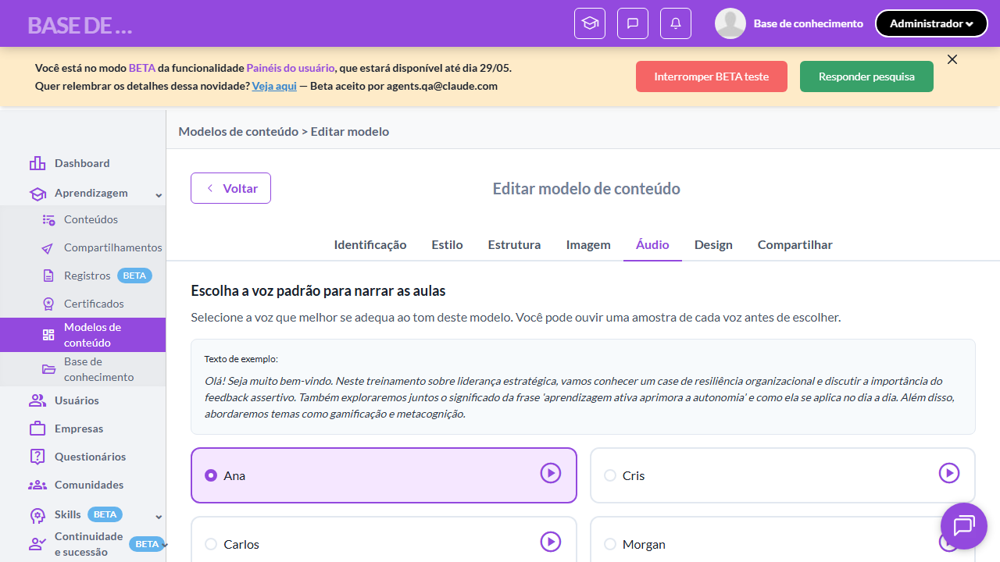

- 🎬 [Vídeo da execução (video.webm)](artifacts/projects-modelos-tests-fea-a5dd1--Aba-Áudio-Default-voz-Ana--chromium/video.webm)

- 📦 **Trace** — [`trace.zip`](artifacts/projects-modelos-tests-fea-a5dd1--Aba-Áudio-Default-voz-Ana--chromium/trace.zip)

  ```bash
  npx playwright show-trace outputs/modelos/reports/regression_20260525-111454/artifacts/projects-modelos-tests-fea-a5dd1--Aba-Áudio-Default-voz-Ana--chromium/trace.zip
  ```

- 🎥 **Vídeo** — [`video.webm`](artifacts/projects-modelos-tests-fea-a5dd1--Aba-Áudio-Default-voz-Ana--chromium/video.webm)


---

### ✅ Aprovado · TC4 · Botão de preview de voz funcional · 🟡 Normal

<a id="botao-de-preview-de-voz-funcional"></a>_Arquivo:_ `tc04-botao-preview-voz.spec.ts` · _Duração:_ 19.82s · _Browser:_ chromium

**Sumário (objetivo do caso):** Validar que o botão de preview/ouvir amostra está disponível para cada voz (RN 58 — quebra QA 1.5).

**Pré-condições:**

```
Ambiente Stage configurado
Feature flag `modelos_de_conteudo` ativa
Modelo de teste cadastrado no setup do spec (via beforeAll)
Usuário logado como Admin
```

**Passos do caso (XML/TestLink + execução Playwright):**

_Cada linha reproduz um passo do XML; a coluna **Status** traz o resultado da execução (do step Allure correspondente). Linhas com "Pré-condição" são da execução automatizada (login, navegação inicial) — não fazem parte do roteiro do XML._

| # | Ação do passo | Resultado esperado | Status | Notas | Duração |
|---|---|---|:---:|---|---:|
| 1 | Acessar a aba "Áudio" | Aba é exibida com as 4 opções de voz. | ✅ | — | 18.11s |
| 2 | Clicar no botão de preview da voz "Cris" | Sistema inicia reprodução da amostra de áudio da voz "Cris". | ✅ | — | 0.13s |

**Evidências:**

📁 _Pasta:_ [`artifacts/projects-modelos-tests-fea-10e36-de-preview-de-voz-funcional-chromium/`](artifacts/projects-modelos-tests-fea-10e36-de-preview-de-voz-funcional-chromium/)

- 📸 **Screenshot (screenshot)** — [`test-finished-1.png`](artifacts/projects-modelos-tests-fea-10e36-de-preview-de-voz-funcional-chromium/test-finished-1.png)

  

- 🎬 [Vídeo da execução (video.webm)](artifacts/projects-modelos-tests-fea-10e36-de-preview-de-voz-funcional-chromium/video.webm)

- 📦 **Trace** — [`trace.zip`](artifacts/projects-modelos-tests-fea-10e36-de-preview-de-voz-funcional-chromium/trace.zip)

  ```bash
  npx playwright show-trace outputs/modelos/reports/regression_20260525-111454/artifacts/projects-modelos-tests-fea-10e36-de-preview-de-voz-funcional-chromium/trace.zip
  ```

- 🎥 **Vídeo** — [`video.webm`](artifacts/projects-modelos-tests-fea-10e36-de-preview-de-voz-funcional-chromium/video.webm)


---

## Criação de Design de Página

_11 caso(s) — 7 aprovado(s), 1 falha(s), 3 ignorado(s)_

### ✅ Aprovado · TC1 · Acessar criação de Página via menu Adicionar · 🔴 Crítico

<a id="acessar-criacao-de-pagina-via-menu-adicionar"></a>_Arquivo:_ `tc01-acessar-criacao-pagina-via-menu.spec.ts` · _Duração:_ 22.93s · _Browser:_ chromium

**Sumário (objetivo do caso):** Validar fluxo de criação de Página (RN 30, RN 31, RN 32).

**Pré-condições:**

```
Ambiente Stage configurado
Feature flag `modelos_de_conteudo` ativa
Modelo de teste cadastrado no setup do spec, com pelo menos 1 kit de marca selecionado
Usuário logado como Admin
```

**Passos do caso (XML/TestLink + execução Playwright):**

_Cada linha reproduz um passo do XML; a coluna **Status** traz o resultado da execução (do step Allure correspondente). Linhas com "Pré-condição" são da execução automatizada (login, navegação inicial) — não fazem parte do roteiro do XML._

| # | Ação do passo | Resultado esperado | Status | Notas | Duração |
|---|---|---|:---:|---|---:|
| 1 | Acessar a aba "Design" do modelo de teste | Aba "Design" exibe a listagem de designs (vazia ou com designs cadastrados). | ✅ | — | 19.13s |
| 2 | Clicar no botão "Adicionar" | Menu suspenso é exibido com as opções "Aula" e "Página". | ✅ | — | 0.43s |
| 3 | Clicar na opção "Página" | Sistema redireciona para a tela de criação de Página exibindo a aba "Identificação". | ✅ | — | 1.68s |

**Evidências:**

📁 _Pasta:_ [`artifacts/projects-modelos-tests-fea-20009-e-Página-via-menu-Adicionar-chromium/`](artifacts/projects-modelos-tests-fea-20009-e-Página-via-menu-Adicionar-chromium/)

- 📸 **Screenshot (screenshot)** — [`test-finished-1.png`](artifacts/projects-modelos-tests-fea-20009-e-Página-via-menu-Adicionar-chromium/test-finished-1.png)

  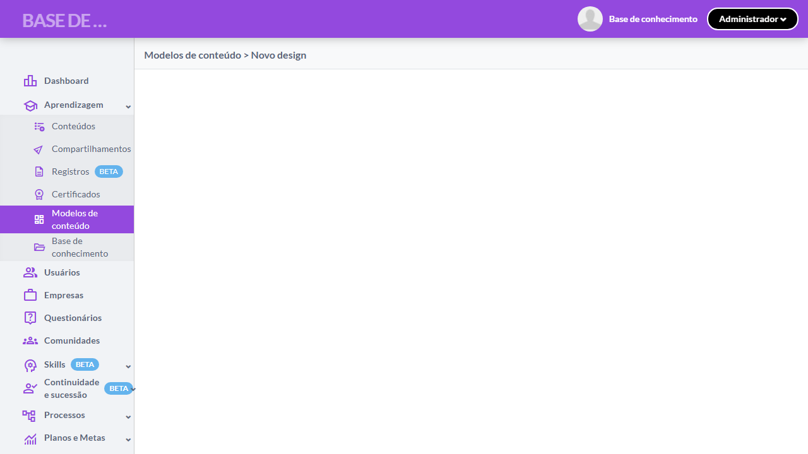

- 🎬 [Vídeo da execução (video.webm)](artifacts/projects-modelos-tests-fea-20009-e-Página-via-menu-Adicionar-chromium/video.webm)

- 📦 **Trace** — [`trace.zip`](artifacts/projects-modelos-tests-fea-20009-e-Página-via-menu-Adicionar-chromium/trace.zip)

  ```bash
  npx playwright show-trace outputs/modelos/reports/regression_20260525-111454/artifacts/projects-modelos-tests-fea-20009-e-Página-via-menu-Adicionar-chromium/trace.zip
  ```

- 🎥 **Vídeo** — [`video.webm`](artifacts/projects-modelos-tests-fea-20009-e-Página-via-menu-Adicionar-chromium/video.webm)


---

### ✅ Aprovado · TC2 · Validações negativas dos campos obrigatórios — Página (matriz A) · 🔴 Crítico

<a id="validacoes-negativas-dos-campos-obrigatorios-pagina-matriz-a"></a>_Arquivo:_ `tc02-validar-campos-obrigatorios.spec.ts` · _Duração:_ 75.77s · _Browser:_ chromium

**Sumário (objetivo do caso):** Validar obrigatoriedade dos 3 campos críticos (Nome, Instruções de estrutura, Sequência) na aba Identificação de Página. Cobertura conforme matriz da skill `cenarios-negativos-twygo`.

**Pré-condições:**

```
Ambiente Stage configurado
Feature flag `modelos_de_conteudo` ativa
Modelo de teste cadastrado no setup do spec, com pelo menos 1 kit de marca selecionado
Usuário logado como Admin
```

**Passos do caso (XML/TestLink + execução Playwright):**

_Cada linha reproduz um passo do XML; a coluna **Status** traz o resultado da execução (do step Allure correspondente). Linhas com "Pré-condição" são da execução automatizada (login, navegação inicial) — não fazem parte do roteiro do XML._

| # | Ação do passo | Resultado esperado | Status | Notas | Duração |
|---|---|---|:---:|---|---:|
| — | _Pré-condição:_ [A] Faltando Nome → save bloqueado | — | ✅ | — | 26.72s |
| — | _Pré-condição:_ [A] Faltando Sequência → save bloqueado | — | ✅ | — | 23.40s |
| — | _Pré-condição:_ [A] Faltando Tudo vazio → save bloqueado | — | ✅ | — | 23.23s |
| 1 | Acessar a tela de criação de Página com a aba "Identificação" | Aba "Identificação" é exibida com campos vazios. | ✅ | — | — |
| 2 | Para cada linha da `**Validation matrix**`, configurar campos conforme `Entrada` (demais defaults), clicar "Salvar" | Sistema reage conforme `Esperado`. **Validation matrix**: \| Categoria \| Entrada \| Esperado \| \|---\|---\|---\| \| A \| Todos os 3 campos vazios \| Mensagens de validação exibidas para "Nome", "Instruções de estrutura para a IA", "Sequência". Página NÃO criada. \| \| A \| "Nome" vazio (demais preenchidos) \| Validação só de Nome. Página NÃO criada. \| \| A \| "Instruções de estrutura" vazia (demais preenchidos) \| Validação só de Instruções. Página NÃO criada. \| \| A \| "Sequência" vazio (demais preenchidos) \| Validação só de Sequência. Página NÃO criada. \| \| A \| Todos os 3 preenchidos \| Sistema redireciona para aba Design (sem mensagens de validação). \| | ✅ | — | — |

**Evidências:**

📁 _Pasta:_ [`artifacts/projects-modelos-tests-fea-261eb-gatórios-—-Página-matriz-A--chromium/`](artifacts/projects-modelos-tests-fea-261eb-gatórios-—-Página-matriz-A--chromium/)

- 📸 **Screenshot (screenshot)** — [`test-finished-1.png`](artifacts/projects-modelos-tests-fea-261eb-gatórios-—-Página-matriz-A--chromium/test-finished-1.png)

  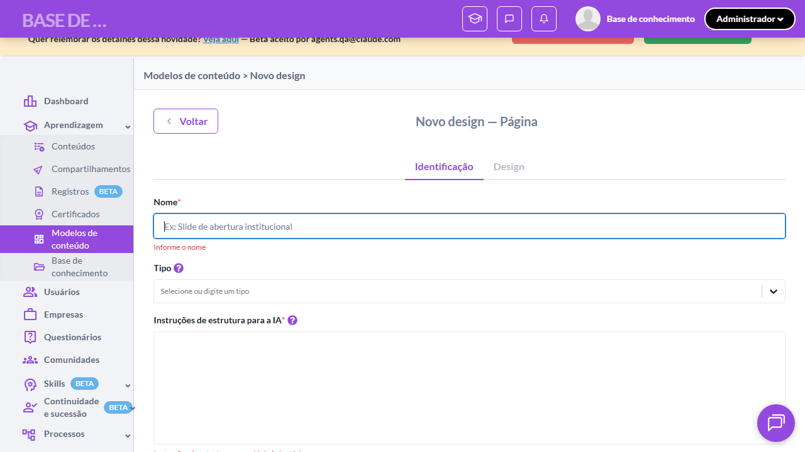

- 🎬 [Vídeo da execução (video.webm)](artifacts/projects-modelos-tests-fea-261eb-gatórios-—-Página-matriz-A--chromium/video.webm)

- 📦 **Trace** — [`trace.zip`](artifacts/projects-modelos-tests-fea-261eb-gatórios-—-Página-matriz-A--chromium/trace.zip)

  ```bash
  npx playwright show-trace outputs/modelos/reports/regression_20260525-111454/artifacts/projects-modelos-tests-fea-261eb-gatórios-—-Página-matriz-A--chromium/trace.zip
  ```

- 🎥 **Vídeo** — [`video.webm`](artifacts/projects-modelos-tests-fea-261eb-gatórios-—-Página-matriz-A--chromium/video.webm)


---

### ❌ Falhou · TC3 · Auto-preenchimento ao selecionar tipo "Capa" · 🔴 Crítico

<a id="auto-preenchimento-ao-selecionar-tipo-capa"></a>_Arquivo:_ `tc03-autofill-tipo-capa.spec.ts` · _Duração:_ 33.71s · _Browser:_ chromium

> **❌ Por que falhou:** O elemento esperado não apareceu na tela (locator: getByText('0 / 500').first()).
> _Step impactado:_ **2. Validar contadores zerados ANTES de selecionar Tipo**

**Sumário (objetivo do caso):** Validar auto-preenchimento dos campos de instruções ao selecionar o tipo "Capa" (RN 33.1).

**Pré-condições:**

```
Ambiente Stage configurado
Feature flag `modelos_de_conteudo` ativa
Modelo de teste cadastrado no setup do spec, com pelo menos 1 kit de marca selecionado
Usuário logado como Admin
```

**Passos do caso (XML/TestLink + execução Playwright):**

_Cada linha reproduz um passo do XML; a coluna **Status** traz o resultado da execução (do step Allure correspondente). Linhas com "Pré-condição" são da execução automatizada (login, navegação inicial) — não fazem parte do roteiro do XML._

| # | Ação do passo | Resultado esperado | Status | Notas | Duração |
|---|---|---|:---:|---|---:|
| 1 | Acessar a tela de criação de Página com a aba "Identificação" | Aba "Identificação" é exibida. | ✅ | — | 21.78s |
| 2 | Selecionar "Capa" no campo "Tipo" | Campo "Tipo" exibe "Capa" selecionado. | ❌ | O elemento esperado não apareceu na tela (locator: getByText('0 / 500').first()). | 10.16s |
| 3 | Aguardar o auto-preenchimento dos campos de instruções | Campo "Instruções de estrutura para a IA" é preenchido automaticamente com: "Usar sempre como primeira parte de qualquer aula.". Campo "Instruções de conteúdo para a IA" é preenchido automaticamente com texto canônico da Capa. | ⊘ | Step não executado: o teste foi interrompido antes. Causa: O elemento esperado não apareceu na tela (locator: getByText('0 / 500').first()).. | — |

**Evidências:**

📁 _Pasta:_ [`artifacts/projects-modelos-tests-fea-8db40-to-ao-selecionar-tipo-Capa--chromium/`](artifacts/projects-modelos-tests-fea-8db40-to-ao-selecionar-tipo-Capa--chromium/)

- 📸 **Screenshot (screenshot)** — [`test-failed-1.png`](artifacts/projects-modelos-tests-fea-8db40-to-ao-selecionar-tipo-Capa--chromium/test-failed-1.png)

  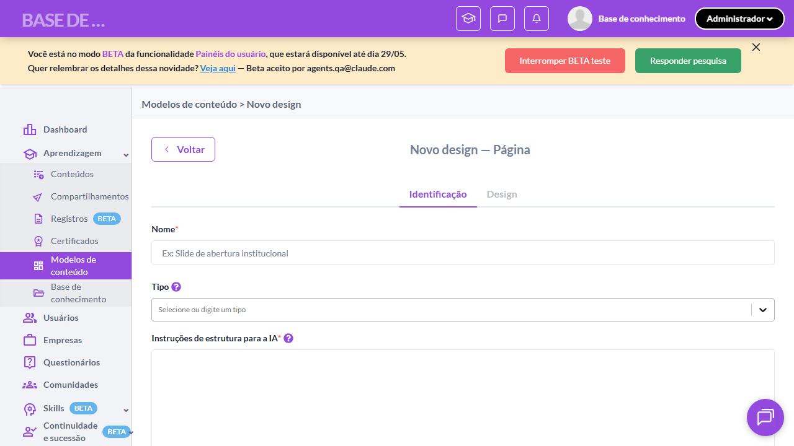

- 🎬 [Vídeo da execução (video.webm)](artifacts/projects-modelos-tests-fea-8db40-to-ao-selecionar-tipo-Capa--chromium/video.webm)

- 📦 **Trace** — [`trace.zip`](artifacts/projects-modelos-tests-fea-8db40-to-ao-selecionar-tipo-Capa--chromium/trace.zip)

  ```bash
  npx playwright show-trace outputs/modelos/reports/regression_20260525-111454/artifacts/projects-modelos-tests-fea-8db40-to-ao-selecionar-tipo-Capa--chromium/trace.zip
  ```

- 🎥 **Vídeo** — [`video.webm`](artifacts/projects-modelos-tests-fea-8db40-to-ao-selecionar-tipo-Capa--chromium/video.webm)

- 📄 **DOM no momento da falha** — [`error-context.md`](artifacts/projects-modelos-tests-fea-8db40-to-ao-selecionar-tipo-Capa--chromium/error-context.md)

#### 🐛 Pronto para registro de bug

> ❓ **Análise automática:** Inconclusivo (precisa investigação manual) · Confiança 🔴 baixa
> _Por quê:_ Sem sinal Network in-scope ou padrão de erro conhecido — revisar trace
> _Bug-report estruturado:_ [`bug-reports/criacao-de-design-de-pagina__auto-preenchimento-ao-selecionar-tipo-capa.md`](bug-reports/criacao-de-design-de-pagina__auto-preenchimento-ao-selecionar-tipo-capa.md)

**Próximas ações sugeridas:**
- Sem evidência suficiente para classificar — abrir `trace.zip` (`npx playwright show-trace`) para ver passo a passo da execução.
- Reabrir o agente com o trace em mãos para reclassificar manualmente em uma das 4 categorias.

**Descrição do BUG:** [Crítico] Auto-preenchimento ao selecionar tipo "Capa" — O elemento esperado não apareceu na tela (locator: getByText('0 / 500').first()).

**Passo a passo para reprodução:**
1. Pré: Ambiente Stage configurado
1. Pré: Feature flag `modelos_de_conteudo` ativa
1. Pré: Modelo de teste cadastrado no setup do spec, com pelo menos 1 kit de marca selecionado
1. Pré: Usuário logado como Admin
1. 1. Acessar a tela de criação de Página com a aba "Identificação"
1. 2. Selecionar "Capa" no campo "Tipo"
1. 3. Aguardar o auto-preenchimento dos campos de instruções

**Comportamento esperado:** Campo "Tipo" exibe "Capa" selecionado.

**Comportamento atual:** O elemento esperado não apareceu na tela (locator: getByText('0 / 500').first()). (falha aconteceu no passo 2: "Validar contadores zerados ANTES de selecionar Tipo", que deveria resultar em: Campo "Tipo" exibe "Capa" selecionado.)

**Informações:**

| Campo | Valor |
|---|---|
| URL | `https://basedeconhecimento.stage.twygoead.com/` |
| Login | Credenciais via env: `TWYGO_STAGING_BASE_DE_CONHECIMENTO_EMAIL` (consulte `.env`) |
| Senha | Credenciais via env: `TWYGO_STAGING_BASE_DE_CONHECIMENTO_PASSWORD` (consulte `.env`) |
| orgId | 37007 |
| Outros | Browser: chromium |
| Outros | runId: regression_20260525-111454 |
| Outros | Duração até a falha: 33.71s |
| Outros | Step impactado: 2. Validar contadores zerados ANTES de selecionar Tipo |

**Evidências:**

- Screenshot capturado pelo Playwright (screenshot): artifacts/projects-modelos-tests-fea-8db40-to-ao-selecionar-tipo-Capa--chromium/test-failed-1.png
- Vídeo da execução (video.webm): artifacts/projects-modelos-tests-fea-8db40-to-ao-selecionar-tipo-Capa--chromium/video.webm
- Snapshot do DOM/contexto da página (error-context.md): artifacts/projects-modelos-tests-fea-8db40-to-ao-selecionar-tipo-Capa--chromium/error-context.md
- Trace completo do Playwright (.zip) — `npx playwright show-trace`: artifacts/projects-modelos-tests-fea-8db40-to-ao-selecionar-tipo-Capa--chromium/trace.zip

<details><summary>📋 Ver texto agregado para copiar (Jira/GitHub/Linear)</summary>

```
Descrição do BUG
[Crítico] Auto-preenchimento ao selecionar tipo "Capa" — O elemento esperado não apareceu na tela (locator: getByText('0 / 500').first()).

Passo a passo para reprodução
  Pré: Ambiente Stage configurado
  Pré: Feature flag `modelos_de_conteudo` ativa
  Pré: Modelo de teste cadastrado no setup do spec, com pelo menos 1 kit de marca selecionado
  Pré: Usuário logado como Admin
  1. Acessar a tela de criação de Página com a aba "Identificação"
  2. Selecionar "Capa" no campo "Tipo"
  3. Aguardar o auto-preenchimento dos campos de instruções

Comportamento esperado
Campo "Tipo" exibe "Capa" selecionado.

Comportamento atual
O elemento esperado não apareceu na tela (locator: getByText('0 / 500').first()). (falha aconteceu no passo 2: "Validar contadores zerados ANTES de selecionar Tipo", que deveria resultar em: Campo "Tipo" exibe "Capa" selecionado.)

Informações
- URL: https://basedeconhecimento.stage.twygoead.com/
- Login: Credenciais via env: `TWYGO_STAGING_BASE_DE_CONHECIMENTO_EMAIL` (consulte `.env`)
- Senha: Credenciais via env: `TWYGO_STAGING_BASE_DE_CONHECIMENTO_PASSWORD` (consulte `.env`)
- ID do ambiente (orgId): 37007
- Outros:
  - Browser: chromium
  - runId: regression_20260525-111454
  - Duração até a falha: 33.71s
  - Step impactado: 2. Validar contadores zerados ANTES de selecionar Tipo

Evidências
- Screenshot capturado pelo Playwright (screenshot): artifacts/projects-modelos-tests-fea-8db40-to-ao-selecionar-tipo-Capa--chromium/test-failed-1.png
- Vídeo da execução (video.webm): artifacts/projects-modelos-tests-fea-8db40-to-ao-selecionar-tipo-Capa--chromium/video.webm
- Snapshot do DOM/contexto da página (error-context.md): artifacts/projects-modelos-tests-fea-8db40-to-ao-selecionar-tipo-Capa--chromium/error-context.md
- Trace completo do Playwright (.zip) — `npx playwright show-trace`: artifacts/projects-modelos-tests-fea-8db40-to-ao-selecionar-tipo-Capa--chromium/trace.zip

Execução
- runId: regression_20260525-111454
- environment.json: staging-base-de-conhecimento
- testsuite: Criação de Design de Página
- testcase: Auto-preenchimento ao selecionar tipo "Capa"

```

</details>

<details><summary>🔧 Stack trace técnica completa (para desenvolvedor)</summary>

```
Error: expect(locator).toBeVisible() failed

Locator: getByText('0 / 500').first()
Expected: visible
Timeout: 10000ms
Error: element(s) not found

Call log:
  - Expect "toBeVisible" with timeout 10000ms
  - waiting for getByText('0 / 500').first()

```

</details>

---

### ✅ Aprovado · TC4 · Tooltip do campo Tipo · 🟡 Normal

<a id="tooltip-do-campo-tipo"></a>_Arquivo:_ `tc04-tooltip-campo-tipo.spec.ts` · _Duração:_ 26.18s · _Browser:_ chromium

**Sumário (objetivo do caso):** Validar texto da tooltip do campo Tipo (RN 33).

**Pré-condições:**

```
Ambiente Stage configurado
Feature flag `modelos_de_conteudo` ativa
Modelo de teste cadastrado no setup do spec, com pelo menos 1 kit de marca selecionado
Usuário logado como Admin
```

**Passos do caso (XML/TestLink + execução Playwright):**

_Cada linha reproduz um passo do XML; a coluna **Status** traz o resultado da execução (do step Allure correspondente). Linhas com "Pré-condição" são da execução automatizada (login, navegação inicial) — não fazem parte do roteiro do XML._

| # | Ação do passo | Resultado esperado | Status | Notas | Duração |
|---|---|---|:---:|---|---:|
| 1 | Acessar a tela de criação de Página com a aba "Identificação" | Aba é exibida. | ✅ | — | 21.24s |
| 2 | Aguardar a tooltip do campo "Tipo" ser exibida ao posicionar o mouse | Tooltip exibida: "Classifique este design por tipo de parte (ex: Capa, Corpo, Encerramento). Essa informação será utilizada para filtrar e organizar seus designs.". | ✅ | — | 3.16s |

**Evidências:**

📁 _Pasta:_ [`artifacts/projects-modelos-tests-fea-8d1bd-ágina-Tooltip-do-campo-Tipo-chromium/`](artifacts/projects-modelos-tests-fea-8d1bd-ágina-Tooltip-do-campo-Tipo-chromium/)

- 📸 **Screenshot (screenshot)** — [`test-finished-1.png`](artifacts/projects-modelos-tests-fea-8d1bd-ágina-Tooltip-do-campo-Tipo-chromium/test-finished-1.png)

  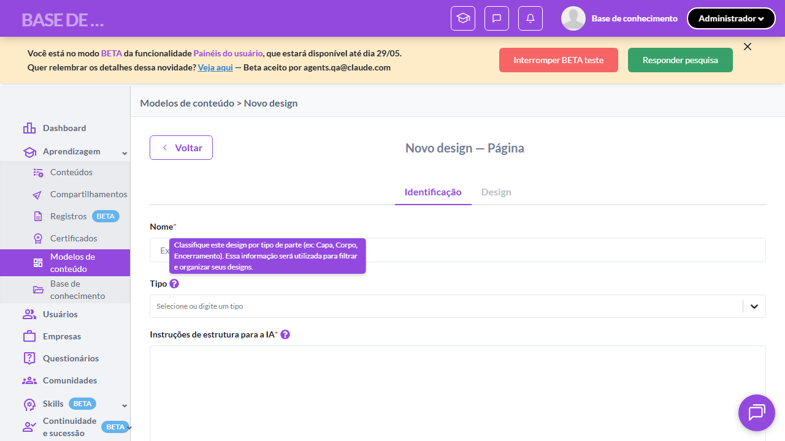

- 🎬 [Vídeo da execução (video.webm)](artifacts/projects-modelos-tests-fea-8d1bd-ágina-Tooltip-do-campo-Tipo-chromium/video.webm)

- 📦 **Trace** — [`trace.zip`](artifacts/projects-modelos-tests-fea-8d1bd-ágina-Tooltip-do-campo-Tipo-chromium/trace.zip)

  ```bash
  npx playwright show-trace outputs/modelos/reports/regression_20260525-111454/artifacts/projects-modelos-tests-fea-8d1bd-ágina-Tooltip-do-campo-Tipo-chromium/trace.zip
  ```

- 🎥 **Vídeo** — [`video.webm`](artifacts/projects-modelos-tests-fea-8d1bd-ágina-Tooltip-do-campo-Tipo-chromium/video.webm)


---

### ✅ Aprovado · TC5 · Salvar Identificação redireciona para aba Design · 🔴 Crítico

<a id="salvar-identificacao-redireciona-para-aba-design"></a>_Arquivo:_ `tc05-salvar-identificacao-redireciona.spec.ts` · _Duração:_ 29.30s · _Browser:_ chromium

**Sumário (objetivo do caso):** Validar redirecionamento automático após salvar Identificação (RN 34).

**Pré-condições:**

```
Ambiente Stage configurado
Feature flag `modelos_de_conteudo` ativa
Modelo de teste cadastrado no setup do spec, com pelo menos 1 kit de marca selecionado
Usuário logado como Admin
```

**Passos do caso (XML/TestLink + execução Playwright):**

_Cada linha reproduz um passo do XML; a coluna **Status** traz o resultado da execução (do step Allure correspondente). Linhas com "Pré-condição" são da execução automatizada (login, navegação inicial) — não fazem parte do roteiro do XML._

| # | Ação do passo | Resultado esperado | Status | Notas | Duração |
|---|---|---|:---:|---|---:|
| — | _Pré-condição:_ 2-3. Preencher Nome + Tipo "Corpo" | — | ✅ | — | 5.25s |
| 1 | Acessar a tela de criação de Página com a aba "Identificação" | Aba "Identificação" é exibida. | ✅ | — | 21.07s |
| 2 | Preencher o campo "Nome" com "Design TC5 w{workerIndex}-{timestamp}" | Campo "Nome" exibe o texto digitado. | ✅ | — | — |
| 3 | Selecionar "Corpo" no campo "Tipo" | Campos de instrução são auto-preenchidos. | ✅ | — | — |
| 4 | Preencher o campo "Sequência" com "1" | Campo "Sequência" exibe o valor digitado. | ✅ | — | 0.08s |
| 5 | Clicar no botão "Salvar" | Toast exibida: "Design criado com sucesso.". Sistema redireciona automaticamente para a aba "Design" da própria Página. | ✅ | — | 1.03s |

**Evidências:**

📁 _Pasta:_ [`artifacts/projects-modelos-tests-fea-a430e-redireciona-para-aba-Design-chromium/`](artifacts/projects-modelos-tests-fea-a430e-redireciona-para-aba-Design-chromium/)

- 📸 **Screenshot (screenshot)** — [`test-finished-1.png`](artifacts/projects-modelos-tests-fea-a430e-redireciona-para-aba-Design-chromium/test-finished-1.png)

  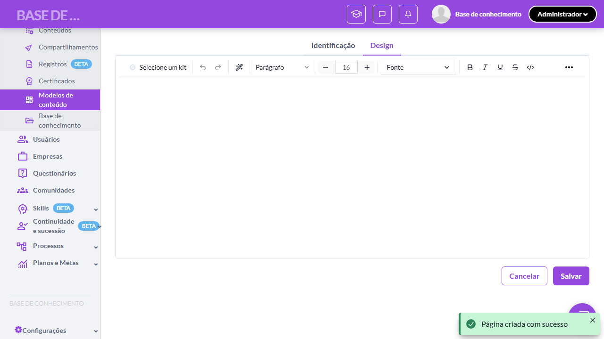

- 🎬 [Vídeo da execução (video.webm)](artifacts/projects-modelos-tests-fea-a430e-redireciona-para-aba-Design-chromium/video.webm)

- 📦 **Trace** — [`trace.zip`](artifacts/projects-modelos-tests-fea-a430e-redireciona-para-aba-Design-chromium/trace.zip)

  ```bash
  npx playwright show-trace outputs/modelos/reports/regression_20260525-111454/artifacts/projects-modelos-tests-fea-a430e-redireciona-para-aba-Design-chromium/trace.zip
  ```

- 🎥 **Vídeo** — [`video.webm`](artifacts/projects-modelos-tests-fea-a430e-redireciona-para-aba-Design-chromium/video.webm)


---

### ✅ Aprovado · Aba Design exibe Plate Editor com Kit de Marca 

<a id="aba-design-exibe-plate-editor-com-kit-de-marca"></a>_Arquivo:_ `tc06-aba-design-plate-editor-kit.spec.ts` · _Duração:_ 29.80s · _Browser:_ chromium

**Passos do caso (XML/TestLink + execução Playwright):**

_Cada linha reproduz um passo do XML; a coluna **Status** traz o resultado da execução (do step Allure correspondente). Linhas com "Pré-condição" são da execução automatizada (login, navegação inicial) — não fazem parte do roteiro do XML._

| # | Ação do passo | Resultado esperado | Status | Notas | Duração |
|---|---|---|:---:|---|---:|
| — | _Pré-condição:_ 1. Criar Design via Identificação e chegar na aba Design | — | ✅ | — | 27.27s |
| — | _Pré-condição:_ 2. Validar Plate Editor renderizado (testId canônico) | — | ✅ | — | 0.76s |
| — | _Pré-condição:_ 3. Validar botão de Kit de Marca presente | — | ✅ | — | 0.06s |

**Evidências:**

📁 _Pasta:_ [`artifacts/projects-modelos-tests-fea-4e05e-ate-Editor-com-Kit-de-Marca-chromium/`](artifacts/projects-modelos-tests-fea-4e05e-ate-Editor-com-Kit-de-Marca-chromium/)

- 📸 **Screenshot (screenshot)** — [`test-finished-1.png`](artifacts/projects-modelos-tests-fea-4e05e-ate-Editor-com-Kit-de-Marca-chromium/test-finished-1.png)

  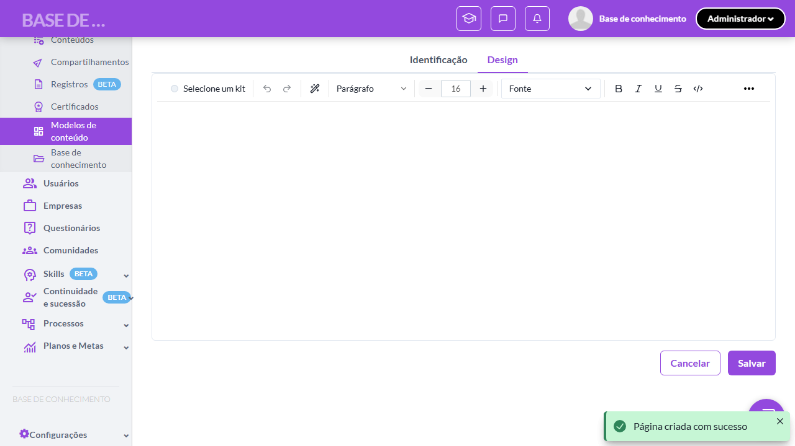

- 🎬 [Vídeo da execução (video.webm)](artifacts/projects-modelos-tests-fea-4e05e-ate-Editor-com-Kit-de-Marca-chromium/video.webm)

- 📦 **Trace** — [`trace.zip`](artifacts/projects-modelos-tests-fea-4e05e-ate-Editor-com-Kit-de-Marca-chromium/trace.zip)

  ```bash
  npx playwright show-trace outputs/modelos/reports/regression_20260525-111454/artifacts/projects-modelos-tests-fea-4e05e-ate-Editor-com-Kit-de-Marca-chromium/trace.zip
  ```

- 🎥 **Vídeo** — [`video.webm`](artifacts/projects-modelos-tests-fea-4e05e-ate-Editor-com-Kit-de-Marca-chromium/video.webm)


---

### ✅ Aprovado · TC7 · Salvar Página retorna para aba Design do Modelo · 🔴 Crítico

<a id="salvar-pagina-retorna-para-aba-design-do-modelo"></a>_Arquivo:_ `tc07-salvar-pagina-retorna-design-modelo.spec.ts` · _Duração:_ 39.63s · _Browser:_ chromium

**Sumário (objetivo do caso):** Validar retorno à aba Design do Modelo com listagem atualizada (RN 37).

**Pré-condições:**

```
Ambiente Stage configurado
Feature flag `modelos_de_conteudo` ativa
Modelo de teste cadastrado no setup do spec, com pelo menos 1 kit de marca selecionado
Usuário logado como Admin
```

**Passos do caso (XML/TestLink + execução Playwright):**

_Cada linha reproduz um passo do XML; a coluna **Status** traz o resultado da execução (do step Allure correspondente). Linhas com "Pré-condição" são da execução automatizada (login, navegação inicial) — não fazem parte do roteiro do XML._

| # | Ação do passo | Resultado esperado | Status | Notas | Duração |
|---|---|---|:---:|---|---:|
| 1 | Acessar a aba "Design" da Página em criação | Plate Editor é exibido. | ✅ | — | 28.66s |
| 2 | Clicar no botão "Salvar" da Página | Sistema retorna para a aba "Design" do Modelo de conteúdo. | ✅ | — | 8.23s |
| 3 | Aguardar a listagem de designs do Modelo carregar | Listagem exibe a nova Página criada na lista de designs. | ✅ | — | 0.63s |

**Evidências:**

📁 _Pasta:_ [`artifacts/projects-modelos-tests-fea-7970b-a-para-aba-Design-do-Modelo-chromium/`](artifacts/projects-modelos-tests-fea-7970b-a-para-aba-Design-do-Modelo-chromium/)

- 📸 **Screenshot (screenshot)** — [`test-finished-1.png`](artifacts/projects-modelos-tests-fea-7970b-a-para-aba-Design-do-Modelo-chromium/test-finished-1.png)

  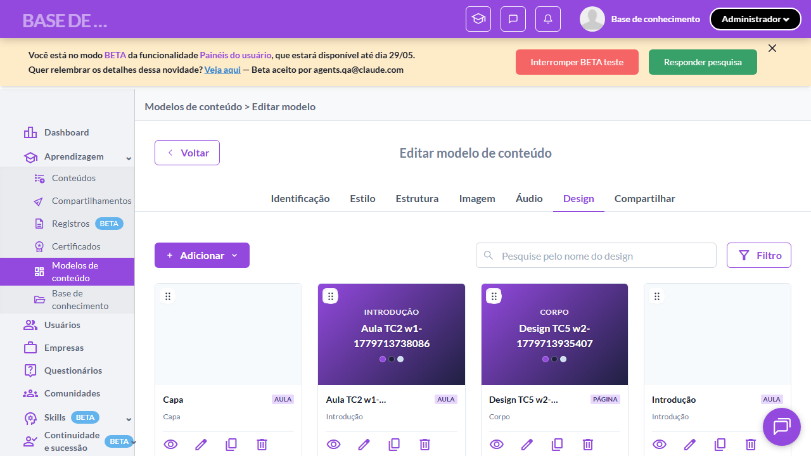

- 🎬 [Vídeo da execução (video.webm)](artifacts/projects-modelos-tests-fea-7970b-a-para-aba-Design-do-Modelo-chromium/video.webm)

- 📦 **Trace** — [`trace.zip`](artifacts/projects-modelos-tests-fea-7970b-a-para-aba-Design-do-Modelo-chromium/trace.zip)

  ```bash
  npx playwright show-trace outputs/modelos/reports/regression_20260525-111454/artifacts/projects-modelos-tests-fea-7970b-a-para-aba-Design-do-Modelo-chromium/trace.zip
  ```

- 🎥 **Vídeo** — [`video.webm`](artifacts/projects-modelos-tests-fea-7970b-a-para-aba-Design-do-Modelo-chromium/video.webm)


---

### ✅ Aprovado · TC8 · Plate Editor — inserir texto via teclado · 🔴 Crítico

<a id="plate-editor-inserir-texto-via-teclado"></a>_Arquivo:_ `tc08-plate-editor-inserir-texto.spec.ts` · _Duração:_ 33.91s · _Browser:_ chromium

**Sumário (objetivo do caso):** Validar input básico de texto no Plate Editor. Atende mínimo da skill `testar-plate-editor-twygo`.

**Pré-condições:**

```
Ambiente Stage configurado
Feature flag `modelos_de_conteudo` ativa
Modelo de teste cadastrado no setup do spec, com pelo menos 1 kit de marca selecionado
Usuário logado como Admin
```

**Passos do caso (XML/TestLink + execução Playwright):**

_Cada linha reproduz um passo do XML; a coluna **Status** traz o resultado da execução (do step Allure correspondente). Linhas com "Pré-condição" são da execução automatizada (login, navegação inicial) — não fazem parte do roteiro do XML._

| # | Ação do passo | Resultado esperado | Status | Notas | Duração |
|---|---|---|:---:|---|---:|
| — | _Pré-condição:_ 2-3. Clicar no editor e digitar texto via keyboard | — | ✅ | — | 2.75s |
| 1 | Acessar a aba "Design" de uma Página recém-salva | Plate Editor é exibido com seletor `[data-slate-editor="true"]` visível e focável. | ✅ | — | 29.39s |
| 2 | Clicar dentro da área do editor | Cursor de texto fica posicionado dentro do editor. | ✅ | — | — |
| 3 | Digitar "Texto inserido pelo TC8" | Editor exibe o texto digitado em tempo real. | ✅ | — | — |
| 4 | Salvar o design | Texto persistido. Ao recarregar, o conteúdo do editor exibe "Texto inserido pelo TC8". | ✅ | — | 0.11s |

**Evidências:**

📁 _Pasta:_ [`artifacts/projects-modelos-tests-fea-34261-—-inserir-texto-via-teclado-chromium/`](artifacts/projects-modelos-tests-fea-34261-—-inserir-texto-via-teclado-chromium/)

- 📸 **Screenshot (screenshot)** — [`test-finished-1.png`](artifacts/projects-modelos-tests-fea-34261-—-inserir-texto-via-teclado-chromium/test-finished-1.png)

  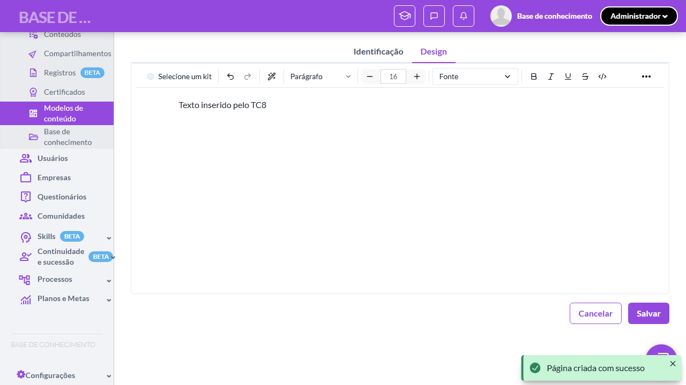

- 🎬 [Vídeo da execução (video.webm)](artifacts/projects-modelos-tests-fea-34261-—-inserir-texto-via-teclado-chromium/video.webm)

- 📦 **Trace** — [`trace.zip`](artifacts/projects-modelos-tests-fea-34261-—-inserir-texto-via-teclado-chromium/trace.zip)

  ```bash
  npx playwright show-trace outputs/modelos/reports/regression_20260525-111454/artifacts/projects-modelos-tests-fea-34261-—-inserir-texto-via-teclado-chromium/trace.zip
  ```

- 🎥 **Vídeo** — [`video.webm`](artifacts/projects-modelos-tests-fea-34261-—-inserir-texto-via-teclado-chromium/video.webm)


---

### ⊘ Ignorado · TC9 · Plate Editor — inserir espaço reservado para IA · 🔴 Crítico

<a id="plate-editor-inserir-espaco-reservado-para-ia"></a>_Arquivo:_ `tc09-plate-editor-espaco-ia.spec.ts` · _Duração:_ 0.00s · _Browser:_ chromium

> **⊘ Por que foi ignorado:** [REVISAR] Motivo do skip não declarado no spec. Edite o `test.fixme(true, "[Categoria] motivo")` indicando uma das categorias canônicas: xml-desatualizado | seed-ausente | dep-externa | bloqueio-temporario.

**Sumário (objetivo do caso):** Validar inserção de espaço reservado para IA via Plate Editor (RN 36.4.x). Atende mínimo da skill `testar-plate-editor-twygo`.

**Pré-condições:**

```
Ambiente Stage configurado
Feature flag `modelos_de_conteudo` ativa
Modelo de teste cadastrado no setup do spec, com pelo menos 1 kit de marca selecionado
Usuário logado como Admin
```

**Passos do caso (XML/TestLink + execução Playwright):**

_Cada linha reproduz um passo do XML; a coluna **Status** traz o resultado da execução (do step Allure correspondente). Linhas com "Pré-condição" são da execução automatizada (login, navegação inicial) — não fazem parte do roteiro do XML._

| # | Ação do passo | Resultado esperado | Status | Notas | Duração |
|---|---|---|:---:|---|---:|
| 1 | Acessar a aba "Design" de uma Página recém-salva | Plate Editor é exibido. | ⊘ | Step não executado — [REVISAR] Motivo do skip não declarado no spec. Edite o `test.fixme(true, "[Categoria] motivo")` indicando uma das categorias canônicas: xml-desatualizado \| seed-ausente \| dep-externa \| bloqueio-temporario. | — |
| 2 | Clicar no botão de inserir espaço reservado para IA (toolbar do editor) | Modal "Inserir espaço reservado para IA" é exibido com textarea de instruções. | ⊘ | Step não executado — [REVISAR] Motivo do skip não declarado no spec. Edite o `test.fixme(true, "[Categoria] motivo")` indicando uma das categorias canônicas: xml-desatualizado \| seed-ausente \| dep-externa \| bloqueio-temporario. | — |
| 3 | Preencher o textarea com "Inserir conteúdo IA para validação automatizada" | Textarea exibe o texto digitado. | ⊘ | Step não executado — [REVISAR] Motivo do skip não declarado no spec. Edite o `test.fixme(true, "[Categoria] motivo")` indicando uma das categorias canônicas: xml-desatualizado \| seed-ausente \| dep-externa \| bloqueio-temporario. | — |
| 4 | Clicar no botão "Confirmar" | Modal fecha. Editor exibe o nó de espaço reservado renderizado inline com o prompt. | ⊘ | Step não executado — [REVISAR] Motivo do skip não declarado no spec. Edite o `test.fixme(true, "[Categoria] motivo")` indicando uma das categorias canônicas: xml-desatualizado \| seed-ausente \| dep-externa \| bloqueio-temporario. | — |

**Evidências:**

_Sem evidências anexadas._

#### ⏳ Pendente — execução automatizada não realizada

- **Severidade do caso (XML):** Crítico
- **Categoria:** ⚠️ Não declarada
- **Motivo declarado pelo spec:** _ausente_
- **Próximo passo:** Editar o spec para declarar `test.fixme(true, '[Categoria] motivo')` com uma das categorias canônicas (xml-desatualizado | seed-ausente | dep-externa | bloqueio-temporario). Sem declaração, leitor leigo não sabe quem precisa agir.

**Roteiro do XML (para validação manual):**
1. Pré: Ambiente Stage configurado
1. Pré: Feature flag `modelos_de_conteudo` ativa
1. Pré: Modelo de teste cadastrado no setup do spec, com pelo menos 1 kit de marca selecionado
1. Pré: Usuário logado como Admin
1. 1. Acessar a aba "Design" de uma Página recém-salva
1. 2. Clicar no botão de inserir espaço reservado para IA (toolbar do editor)
1. 3. Preencher o textarea com "Inserir conteúdo IA para validação automatizada"
1. 4. Clicar no botão "Confirmar"

> Esse caso não bloqueia a build, mas precisa de validação manual ou ajuste no agente.


---

### ⊘ Ignorado · TC10 · Plate Editor — inserir logo via toolbar · 🔴 Crítico

<a id="plate-editor-inserir-logo-via-toolbar"></a>_Arquivo:_ `tc10-plate-editor-inserir-logo.spec.ts` · _Duração:_ 0.00s · _Browser:_ chromium

> **⊘ Por que foi ignorado:** [REVISAR] Motivo do skip não declarado no spec. Edite o `test.fixme(true, "[Categoria] motivo")` indicando uma das categorias canônicas: xml-desatualizado | seed-ausente | dep-externa | bloqueio-temporario.

**Sumário (objetivo do caso):** Validar inserção de logo no Plate Editor (suporta upload no editor). Atende mínimo da skill `testar-plate-editor-twygo` e endereça o padrão de bug "upload tratado como caixa preta".

**Pré-condições:**

```
Ambiente Stage configurado
Feature flag `modelos_de_conteudo` ativa
Modelo de teste cadastrado no setup do spec, com pelo menos 1 kit de marca selecionado
Usuário logado como Admin
```

**Passos do caso (XML/TestLink + execução Playwright):**

_Cada linha reproduz um passo do XML; a coluna **Status** traz o resultado da execução (do step Allure correspondente). Linhas com "Pré-condição" são da execução automatizada (login, navegação inicial) — não fazem parte do roteiro do XML._

| # | Ação do passo | Resultado esperado | Status | Notas | Duração |
|---|---|---|:---:|---|---:|
| 1 | Acessar a aba "Design" de uma Página recém-salva | Plate Editor é exibido. | ⊘ | Step não executado — [REVISAR] Motivo do skip não declarado no spec. Edite o `test.fixme(true, "[Categoria] motivo")` indicando uma das categorias canônicas: xml-desatualizado \| seed-ausente \| dep-externa \| bloqueio-temporario. | — |
| 2 | Clicar no botão de inserir logo (toolbar do editor) | Dialog de seleção/upload de logo é exibido. | ⊘ | Step não executado — [REVISAR] Motivo do skip não declarado no spec. Edite o `test.fixme(true, "[Categoria] motivo")` indicando uma das categorias canônicas: xml-desatualizado \| seed-ausente \| dep-externa \| bloqueio-temporario. | — |
| 3 | Selecionar a opção de logo padrão da organização | Dialog fecha. Editor exibe o elemento de logo renderizado. | ⊘ | Step não executado — [REVISAR] Motivo do skip não declarado no spec. Edite o `test.fixme(true, "[Categoria] motivo")` indicando uma das categorias canônicas: xml-desatualizado \| seed-ausente \| dep-externa \| bloqueio-temporario. | — |
| 4 | Executar o helper `expectImageLoaded` sobre o elemento "logo inserido" | Helper retorna true para a `` do logo (img.complete === true && naturalWidth >= 16). | ⊘ | Step não executado — [REVISAR] Motivo do skip não declarado no spec. Edite o `test.fixme(true, "[Categoria] motivo")` indicando uma das categorias canônicas: xml-desatualizado \| seed-ausente \| dep-externa \| bloqueio-temporario. | — |

**Evidências:**

_Sem evidências anexadas._

#### ⏳ Pendente — execução automatizada não realizada

- **Severidade do caso (XML):** Crítico
- **Categoria:** ⚠️ Não declarada
- **Motivo declarado pelo spec:** _ausente_
- **Próximo passo:** Editar o spec para declarar `test.fixme(true, '[Categoria] motivo')` com uma das categorias canônicas (xml-desatualizado | seed-ausente | dep-externa | bloqueio-temporario). Sem declaração, leitor leigo não sabe quem precisa agir.

**Roteiro do XML (para validação manual):**
1. Pré: Ambiente Stage configurado
1. Pré: Feature flag `modelos_de_conteudo` ativa
1. Pré: Modelo de teste cadastrado no setup do spec, com pelo menos 1 kit de marca selecionado
1. Pré: Usuário logado como Admin
1. 1. Acessar a aba "Design" de uma Página recém-salva
1. 2. Clicar no botão de inserir logo (toolbar do editor)
1. 3. Selecionar a opção de logo padrão da organização
1. 4. Executar o helper `expectImageLoaded` sobre o elemento "logo inserido"

> Esse caso não bloqueia a build, mas precisa de validação manual ou ajuste no agente.


---

### ⊘ Ignorado · TC11 · Plate Editor — drag and drop de bloco para reordenar · 🔴 Crítico

<a id="plate-editor-drag-and-drop-de-bloco-para-reordenar"></a>_Arquivo:_ `tc11-plate-editor-drag-drop-bloco.spec.ts` · _Duração:_ 0.00s · _Browser:_ chromium

> **⊘ Por que foi ignorado:** [REVISAR] Motivo do skip não declarado no spec. Edite o `test.fixme(true, "[Categoria] motivo")` indicando uma das categorias canônicas: xml-desatualizado | seed-ausente | dep-externa | bloqueio-temporario.

**Sumário (objetivo do caso):** Validar reordenação de blocos via drag and drop no Plate Editor.

**Pré-condições:**

```
Ambiente Stage configurado
Feature flag `modelos_de_conteudo` ativa
Modelo de teste cadastrado no setup do spec, com pelo menos 1 kit de marca selecionado
Usuário logado como Admin
```

**Passos do caso (XML/TestLink + execução Playwright):**

_Cada linha reproduz um passo do XML; a coluna **Status** traz o resultado da execução (do step Allure correspondente). Linhas com "Pré-condição" são da execução automatizada (login, navegação inicial) — não fazem parte do roteiro do XML._

| # | Ação do passo | Resultado esperado | Status | Notas | Duração |
|---|---|---|:---:|---|---:|
| 1 | Acessar a aba "Design" de uma Página com pelo menos 2 blocos inseridos | Plate Editor exibe os blocos em sequência. | ⊘ | Step não executado — [REVISAR] Motivo do skip não declarado no spec. Edite o `test.fixme(true, "[Categoria] motivo")` indicando uma das categorias canônicas: xml-desatualizado \| seed-ausente \| dep-externa \| bloqueio-temporario. | — |
| 2 | Arrastar o segundo bloco para a posição do primeiro | Editor reflete a nova ordem. | ⊘ | Step não executado — [REVISAR] Motivo do skip não declarado no spec. Edite o `test.fixme(true, "[Categoria] motivo")` indicando uma das categorias canônicas: xml-desatualizado \| seed-ausente \| dep-externa \| bloqueio-temporario. | — |
| 3 | Salvar o design e recarregar | Nova ordem persistida. | ⊘ | Step não executado — [REVISAR] Motivo do skip não declarado no spec. Edite o `test.fixme(true, "[Categoria] motivo")` indicando uma das categorias canônicas: xml-desatualizado \| seed-ausente \| dep-externa \| bloqueio-temporario. | — |

**Evidências:**

_Sem evidências anexadas._

#### ⏳ Pendente — execução automatizada não realizada

- **Severidade do caso (XML):** Crítico
- **Categoria:** ⚠️ Não declarada
- **Motivo declarado pelo spec:** _ausente_
- **Próximo passo:** Editar o spec para declarar `test.fixme(true, '[Categoria] motivo')` com uma das categorias canônicas (xml-desatualizado | seed-ausente | dep-externa | bloqueio-temporario). Sem declaração, leitor leigo não sabe quem precisa agir.

**Roteiro do XML (para validação manual):**
1. Pré: Ambiente Stage configurado
1. Pré: Feature flag `modelos_de_conteudo` ativa
1. Pré: Modelo de teste cadastrado no setup do spec, com pelo menos 1 kit de marca selecionado
1. Pré: Usuário logado como Admin
1. 1. Acessar a aba "Design" de uma Página com pelo menos 2 blocos inseridos
1. 2. Arrastar o segundo bloco para a posição do primeiro
1. 3. Salvar o design e recarregar

> Esse caso não bloqueia a build, mas precisa de validação manual ou ajuste no agente.


---

## Criação de Design de Aula

_6 caso(s) — 2 aprovado(s), 0 falha(s), 4 ignorado(s)_

### ✅ Aprovado · TC1 · Acessar criação de Aula via menu Adicionar · 🔴 Crítico

<a id="acessar-criacao-de-aula-via-menu-adicionar"></a>_Arquivo:_ `tc01-acessar-criacao-aula-via-menu.spec.ts` · _Duração:_ 22.98s · _Browser:_ chromium

**Sumário (objetivo do caso):** Validar fluxo de criação de Aula (RN 30, RN 31, RN 38).

**Pré-condições:**

```
Ambiente Stage configurado
Feature flag `modelos_de_conteudo` ativa
Modelo de teste cadastrado no setup do spec, com pelo menos 1 kit de marca selecionado
Usuário logado como Admin
```

**Passos do caso (XML/TestLink + execução Playwright):**

_Cada linha reproduz um passo do XML; a coluna **Status** traz o resultado da execução (do step Allure correspondente). Linhas com "Pré-condição" são da execução automatizada (login, navegação inicial) — não fazem parte do roteiro do XML._

| # | Ação do passo | Resultado esperado | Status | Notas | Duração |
|---|---|---|:---:|---|---:|
| 1 | Acessar a aba "Design" do modelo de teste | Aba "Design" exibe a listagem de designs. | ✅ | — | 19.35s |
| 2 | Clicar no botão "Adicionar" | Menu suspenso é exibido com as opções "Aula" e "Página". | ✅ | — | 0.35s |
| 3 | Clicar na opção "Aula" | Sistema redireciona para a tela de criação de Aula exibindo a aba "Identificação". | ✅ | — | 1.60s |

**Evidências:**

📁 _Pasta:_ [`artifacts/projects-modelos-tests-fea-56d34--de-Aula-via-menu-Adicionar-chromium/`](artifacts/projects-modelos-tests-fea-56d34--de-Aula-via-menu-Adicionar-chromium/)

- 📸 **Screenshot (screenshot)** — [`test-finished-1.png`](artifacts/projects-modelos-tests-fea-56d34--de-Aula-via-menu-Adicionar-chromium/test-finished-1.png)

  

- 🎬 [Vídeo da execução (video.webm)](artifacts/projects-modelos-tests-fea-56d34--de-Aula-via-menu-Adicionar-chromium/video.webm)

- 📦 **Trace** — [`trace.zip`](artifacts/projects-modelos-tests-fea-56d34--de-Aula-via-menu-Adicionar-chromium/trace.zip)

  ```bash
  npx playwright show-trace outputs/modelos/reports/regression_20260525-111454/artifacts/projects-modelos-tests-fea-56d34--de-Aula-via-menu-Adicionar-chromium/trace.zip
  ```

- 🎥 **Vídeo** — [`video.webm`](artifacts/projects-modelos-tests-fea-56d34--de-Aula-via-menu-Adicionar-chromium/video.webm)


---

### ✅ Aprovado · TC2 · Salvar Aula com dados válidos · 🔴 Crítico

<a id="salvar-aula-com-dados-validos"></a>_Arquivo:_ `tc02-salvar-aula-dados-validos.spec.ts` · _Duração:_ 29.77s · _Browser:_ chromium

**Sumário (objetivo do caso):** Validar criação de Aula com campos da Identificação (RN 39, RN 40).

**Pré-condições:**

```
Ambiente Stage configurado
Feature flag `modelos_de_conteudo` ativa
Modelo de teste cadastrado no setup do spec, com pelo menos 1 kit de marca selecionado
Usuário logado como Admin
```

**Passos do caso (XML/TestLink + execução Playwright):**

_Cada linha reproduz um passo do XML; a coluna **Status** traz o resultado da execução (do step Allure correspondente). Linhas com "Pré-condição" são da execução automatizada (login, navegação inicial) — não fazem parte do roteiro do XML._

| # | Ação do passo | Resultado esperado | Status | Notas | Duração |
|---|---|---|:---:|---|---:|
| — | _Pré-condição:_ 2-4. Preencher Nome + Tipo "Introdução" + Sequência | — | ✅ | — | 5.26s |
| 1 | Acessar a tela de criação de Aula com a aba "Identificação" | Aba "Identificação" é exibida. | ✅ | — | 21.82s |
| 2 | Preencher o campo "Nome" com "Aula TC2 w{workerIndex}-{timestamp}" | Campo "Nome" exibe o texto digitado. | ✅ | — | — |
| 3 | Selecionar "Introdução" no campo "Tipo" | Campos de instruções são auto-preenchidos com textos canônicos de Introdução. | ✅ | — | — |
| 4 | Preencher o campo "Sequência" com "1" | Campo "Sequência" exibe o valor digitado. | ✅ | — | — |
| 5 | Clicar no botão "Salvar" | Sistema redireciona automaticamente para a aba "Design" da Aula. | ✅ | — | 0.81s |

**Evidências:**

📁 _Pasta:_ [`artifacts/projects-modelos-tests-fea-f0989-lvar-Aula-com-dados-válidos-chromium/`](artifacts/projects-modelos-tests-fea-f0989-lvar-Aula-com-dados-válidos-chromium/)

- 📸 **Screenshot (screenshot)** — [`test-finished-1.png`](artifacts/projects-modelos-tests-fea-f0989-lvar-Aula-com-dados-válidos-chromium/test-finished-1.png)

  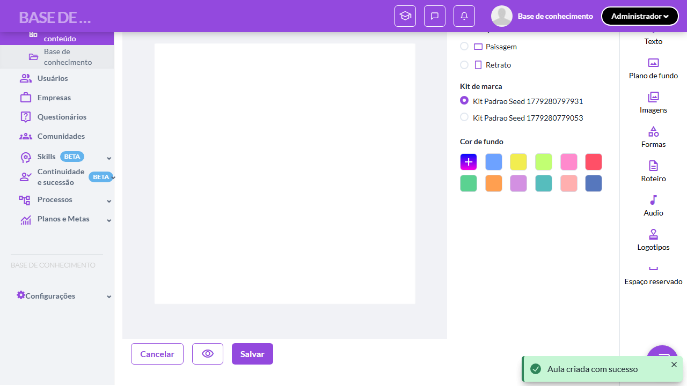

- 🎬 [Vídeo da execução (video.webm)](artifacts/projects-modelos-tests-fea-f0989-lvar-Aula-com-dados-válidos-chromium/video.webm)

- 📦 **Trace** — [`trace.zip`](artifacts/projects-modelos-tests-fea-f0989-lvar-Aula-com-dados-válidos-chromium/trace.zip)

  ```bash
  npx playwright show-trace outputs/modelos/reports/regression_20260525-111454/artifacts/projects-modelos-tests-fea-f0989-lvar-Aula-com-dados-válidos-chromium/trace.zip
  ```

- 🎥 **Vídeo** — [`video.webm`](artifacts/projects-modelos-tests-fea-f0989-lvar-Aula-com-dados-válidos-chromium/video.webm)


---

### ⊘ Ignorado · TC3 · Aba Design da Aula exibe editor padrão com customizações · 🔴 Crítico

<a id="aba-design-da-aula-exibe-editor-padrao-com-customizacoes"></a>_Arquivo:_ `tc03-aba-design-aula-editor-customizacoes.spec.ts` · _Duração:_ 0.00s · _Browser:_ chromium

> **⊘ Por que foi ignorado:** [REVISAR] Motivo do skip não declarado no spec. Edite o `test.fixme(true, "[Categoria] motivo")` indicando uma das categorias canônicas: xml-desatualizado | seed-ausente | dep-externa | bloqueio-temporario.

**Sumário (objetivo do caso):** Validar que a aba Design exibe o editor de Aula padrão com customizações de kit de marca (RN 41, RN 42).

**Pré-condições:**

```
Ambiente Stage configurado
Feature flag `modelos_de_conteudo` ativa
Modelo de teste cadastrado no setup do spec, com pelo menos 1 kit de marca selecionado
Usuário logado como Admin
```

**Passos do caso (XML/TestLink + execução Playwright):**

_Cada linha reproduz um passo do XML; a coluna **Status** traz o resultado da execução (do step Allure correspondente). Linhas com "Pré-condição" são da execução automatizada (login, navegação inicial) — não fazem parte do roteiro do XML._

| # | Ação do passo | Resultado esperado | Status | Notas | Duração |
|---|---|---|:---:|---|---:|
| 1 | Acessar a aba "Design" de uma Aula recém-salva | Editor de Aula padrão da plataforma é exibido. | ⊘ | Step não executado — [REVISAR] Motivo do skip não declarado no spec. Edite o `test.fixme(true, "[Categoria] motivo")` indicando uma das categorias canônicas: xml-desatualizado \| seed-ausente \| dep-externa \| bloqueio-temporario. | — |
| 2 | Aguardar a ferramenta de layout com seleção de kit de marca ser renderizada | Ferramenta de layout exibe os 3 primeiros kits de marca cadastrados, com possibilidade de scroll para acessar os demais. | ⊘ | Step não executado — [REVISAR] Motivo do skip não declarado no spec. Edite o `test.fixme(true, "[Categoria] motivo")` indicando uma das categorias canônicas: xml-desatualizado \| seed-ausente \| dep-externa \| bloqueio-temporario. | — |

**Evidências:**

_Sem evidências anexadas._

#### ⏳ Pendente — execução automatizada não realizada

- **Severidade do caso (XML):** Crítico
- **Categoria:** ⚠️ Não declarada
- **Motivo declarado pelo spec:** _ausente_
- **Próximo passo:** Editar o spec para declarar `test.fixme(true, '[Categoria] motivo')` com uma das categorias canônicas (xml-desatualizado | seed-ausente | dep-externa | bloqueio-temporario). Sem declaração, leitor leigo não sabe quem precisa agir.

**Roteiro do XML (para validação manual):**
1. Pré: Ambiente Stage configurado
1. Pré: Feature flag `modelos_de_conteudo` ativa
1. Pré: Modelo de teste cadastrado no setup do spec, com pelo menos 1 kit de marca selecionado
1. Pré: Usuário logado como Admin
1. 1. Acessar a aba "Design" de uma Aula recém-salva
1. 2. Aguardar a ferramenta de layout com seleção de kit de marca ser renderizada

> Esse caso não bloqueia a build, mas precisa de validação manual ou ajuste no agente.


---

### ⊘ Ignorado · TC4 · Salvar Aula retorna para aba Design do Modelo · 🔴 Crítico

<a id="salvar-aula-retorna-para-aba-design-do-modelo"></a>_Arquivo:_ `tc04-salvar-aula-retorna-design-modelo.spec.ts` · _Duração:_ 0.00s · _Browser:_ chromium

> **⊘ Por que foi ignorado:** [REVISAR] Motivo do skip não declarado no spec. Edite o `test.fixme(true, "[Categoria] motivo")` indicando uma das categorias canônicas: xml-desatualizado | seed-ausente | dep-externa | bloqueio-temporario.

**Sumário (objetivo do caso):** Validar retorno à aba Design do Modelo (RN 43).

**Pré-condições:**

```
Ambiente Stage configurado
Feature flag `modelos_de_conteudo` ativa
Modelo de teste cadastrado no setup do spec, com pelo menos 1 kit de marca selecionado
Usuário logado como Admin
```

**Passos do caso (XML/TestLink + execução Playwright):**

_Cada linha reproduz um passo do XML; a coluna **Status** traz o resultado da execução (do step Allure correspondente). Linhas com "Pré-condição" são da execução automatizada (login, navegação inicial) — não fazem parte do roteiro do XML._

| # | Ação do passo | Resultado esperado | Status | Notas | Duração |
|---|---|---|:---:|---|---:|
| 1 | Acessar a aba "Design" da Aula em criação | Editor é exibido. | ⊘ | Step não executado — [REVISAR] Motivo do skip não declarado no spec. Edite o `test.fixme(true, "[Categoria] motivo")` indicando uma das categorias canônicas: xml-desatualizado \| seed-ausente \| dep-externa \| bloqueio-temporario. | — |
| 2 | Clicar no botão "Salvar" da Aula | Sistema retorna para a aba "Design" do Modelo de conteúdo. | ⊘ | Step não executado — [REVISAR] Motivo do skip não declarado no spec. Edite o `test.fixme(true, "[Categoria] motivo")` indicando uma das categorias canônicas: xml-desatualizado \| seed-ausente \| dep-externa \| bloqueio-temporario. | — |
| 3 | Aguardar a listagem de designs do Modelo carregar | Listagem exibe a nova Aula criada na lista de designs. | ⊘ | Step não executado — [REVISAR] Motivo do skip não declarado no spec. Edite o `test.fixme(true, "[Categoria] motivo")` indicando uma das categorias canônicas: xml-desatualizado \| seed-ausente \| dep-externa \| bloqueio-temporario. | — |

**Evidências:**

_Sem evidências anexadas._

#### ⏳ Pendente — execução automatizada não realizada

- **Severidade do caso (XML):** Crítico
- **Categoria:** ⚠️ Não declarada
- **Motivo declarado pelo spec:** _ausente_
- **Próximo passo:** Editar o spec para declarar `test.fixme(true, '[Categoria] motivo')` com uma das categorias canônicas (xml-desatualizado | seed-ausente | dep-externa | bloqueio-temporario). Sem declaração, leitor leigo não sabe quem precisa agir.

**Roteiro do XML (para validação manual):**
1. Pré: Ambiente Stage configurado
1. Pré: Feature flag `modelos_de_conteudo` ativa
1. Pré: Modelo de teste cadastrado no setup do spec, com pelo menos 1 kit de marca selecionado
1. Pré: Usuário logado como Admin
1. 1. Acessar a aba "Design" da Aula em criação
1. 2. Clicar no botão "Salvar" da Aula
1. 3. Aguardar a listagem de designs do Modelo carregar

> Esse caso não bloqueia a build, mas precisa de validação manual ou ajuste no agente.


---

### ⊘ Ignorado · TC5 · Editor Aula — inserir texto via teclado · 🔴 Crítico

<a id="editor-aula-inserir-texto-via-teclado"></a>_Arquivo:_ `tc05-editor-aula-inserir-texto.spec.ts` · _Duração:_ 0.00s · _Browser:_ chromium

> **⊘ Por que foi ignorado:** [REVISAR] Motivo do skip não declarado no spec. Edite o `test.fixme(true, "[Categoria] motivo")` indicando uma das categorias canônicas: xml-desatualizado | seed-ausente | dep-externa | bloqueio-temporario.

**Sumário (objetivo do caso):** Validar input básico de texto no editor de Aula. Atende mínimo da skill `testar-plate-editor-twygo`.

**Pré-condições:**

```
Ambiente Stage configurado
Feature flag `modelos_de_conteudo` ativa
Modelo de teste cadastrado no setup do spec, com pelo menos 1 kit de marca selecionado
Usuário logado como Admin
```

**Passos do caso (XML/TestLink + execução Playwright):**

_Cada linha reproduz um passo do XML; a coluna **Status** traz o resultado da execução (do step Allure correspondente). Linhas com "Pré-condição" são da execução automatizada (login, navegação inicial) — não fazem parte do roteiro do XML._

| # | Ação do passo | Resultado esperado | Status | Notas | Duração |
|---|---|---|:---:|---|---:|
| 1 | Acessar a aba "Design" de uma Aula recém-salva | Editor de Aula é exibido com áreas editáveis. | ⊘ | Step não executado — [REVISAR] Motivo do skip não declarado no spec. Edite o `test.fixme(true, "[Categoria] motivo")` indicando uma das categorias canônicas: xml-desatualizado \| seed-ausente \| dep-externa \| bloqueio-temporario. | — |
| 2 | Clicar dentro de uma área de texto editável | Cursor de texto fica posicionado dentro da área. | ⊘ | Step não executado — [REVISAR] Motivo do skip não declarado no spec. Edite o `test.fixme(true, "[Categoria] motivo")` indicando uma das categorias canônicas: xml-desatualizado \| seed-ausente \| dep-externa \| bloqueio-temporario. | — |
| 3 | Digitar "Conteúdo da aula TC5" | Editor exibe o texto digitado em tempo real. | ⊘ | Step não executado — [REVISAR] Motivo do skip não declarado no spec. Edite o `test.fixme(true, "[Categoria] motivo")` indicando uma das categorias canônicas: xml-desatualizado \| seed-ausente \| dep-externa \| bloqueio-temporario. | — |
| 4 | Salvar a Aula | Texto persistido. Ao recarregar, o conteúdo do editor exibe "Conteúdo da aula TC5". | ⊘ | Step não executado — [REVISAR] Motivo do skip não declarado no spec. Edite o `test.fixme(true, "[Categoria] motivo")` indicando uma das categorias canônicas: xml-desatualizado \| seed-ausente \| dep-externa \| bloqueio-temporario. | — |

**Evidências:**

_Sem evidências anexadas._

#### ⏳ Pendente — execução automatizada não realizada

- **Severidade do caso (XML):** Crítico
- **Categoria:** ⚠️ Não declarada
- **Motivo declarado pelo spec:** _ausente_
- **Próximo passo:** Editar o spec para declarar `test.fixme(true, '[Categoria] motivo')` com uma das categorias canônicas (xml-desatualizado | seed-ausente | dep-externa | bloqueio-temporario). Sem declaração, leitor leigo não sabe quem precisa agir.

**Roteiro do XML (para validação manual):**
1. Pré: Ambiente Stage configurado
1. Pré: Feature flag `modelos_de_conteudo` ativa
1. Pré: Modelo de teste cadastrado no setup do spec, com pelo menos 1 kit de marca selecionado
1. Pré: Usuário logado como Admin
1. 1. Acessar a aba "Design" de uma Aula recém-salva
1. 2. Clicar dentro de uma área de texto editável
1. 3. Digitar "Conteúdo da aula TC5"
1. 4. Salvar a Aula

> Esse caso não bloqueia a build, mas precisa de validação manual ou ajuste no agente.


---

### ⊘ Ignorado · TC6 · Editor Aula — alternar kit de marca via ferramenta de layout · 🔴 Crítico

<a id="editor-aula-alternar-kit-de-marca-via-ferramenta-de-layout"></a>_Arquivo:_ `tc06-editor-aula-alternar-kit.spec.ts` · _Duração:_ 0.00s · _Browser:_ chromium

> **⊘ Por que foi ignorado:** [REVISAR] Motivo do skip não declarado no spec. Edite o `test.fixme(true, "[Categoria] motivo")` indicando uma das categorias canônicas: xml-desatualizado | seed-ausente | dep-externa | bloqueio-temporario.

**Sumário (objetivo do caso):** Validar que a alteração do kit de marca via ferramenta de layout reflete no editor.

**Pré-condições:**

```
Ambiente Stage configurado
Feature flag `modelos_de_conteudo` ativa
Modelo de teste cadastrado no setup do spec, com pelo menos 1 kit de marca selecionado
Usuário logado como Admin
```

**Passos do caso (XML/TestLink + execução Playwright):**

_Cada linha reproduz um passo do XML; a coluna **Status** traz o resultado da execução (do step Allure correspondente). Linhas com "Pré-condição" são da execução automatizada (login, navegação inicial) — não fazem parte do roteiro do XML._

| # | Ação do passo | Resultado esperado | Status | Notas | Duração |
|---|---|---|:---:|---|---:|
| 1 | Acessar a aba "Design" de uma Aula com kit padrão da organização | Editor exibe o slide com cores/fontes do kit padrão. | ⊘ | Step não executado — [REVISAR] Motivo do skip não declarado no spec. Edite o `test.fixme(true, "[Categoria] motivo")` indicando uma das categorias canônicas: xml-desatualizado \| seed-ausente \| dep-externa \| bloqueio-temporario. | — |
| 2 | Clicar em um kit de marca alternativo na ferramenta de layout | Editor atualiza cores/fontes refletindo o novo kit selecionado. | ⊘ | Step não executado — [REVISAR] Motivo do skip não declarado no spec. Edite o `test.fixme(true, "[Categoria] motivo")` indicando uma das categorias canônicas: xml-desatualizado \| seed-ausente \| dep-externa \| bloqueio-temporario. | — |

**Evidências:**

_Sem evidências anexadas._

#### ⏳ Pendente — execução automatizada não realizada

- **Severidade do caso (XML):** Crítico
- **Categoria:** ⚠️ Não declarada
- **Motivo declarado pelo spec:** _ausente_
- **Próximo passo:** Editar o spec para declarar `test.fixme(true, '[Categoria] motivo')` com uma das categorias canônicas (xml-desatualizado | seed-ausente | dep-externa | bloqueio-temporario). Sem declaração, leitor leigo não sabe quem precisa agir.

**Roteiro do XML (para validação manual):**
1. Pré: Ambiente Stage configurado
1. Pré: Feature flag `modelos_de_conteudo` ativa
1. Pré: Modelo de teste cadastrado no setup do spec, com pelo menos 1 kit de marca selecionado
1. Pré: Usuário logado como Admin
1. 1. Acessar a aba "Design" de uma Aula com kit padrão da organização
1. 2. Clicar em um kit de marca alternativo na ferramenta de layout

> Esse caso não bloqueia a build, mas precisa de validação manual ou ajuste no agente.


---

## Listagem de Designs (aba Design do Modelo)

_4 caso(s) — 0 aprovado(s), 4 falha(s)_

### ❌ Falhou · Listagem exibe elementos obrigatórios por design 

<a id="listagem-exibe-elementos-obrigatorios-por-design"></a>_Arquivo:_ `tc01-colunas-obrigatorias.spec.ts` · _Duração:_ 38.80s · _Browser:_ chromium

> **❌ Por que falhou:** Não foi possível preencher o elemento — ele não ficou disponível em 30s (locator: locator('#play-interest-search')).
> _Step impactado:_ **1. Abrir aba Design do modelo**

**Passos do caso (XML/TestLink + execução Playwright):**

_Cada linha reproduz um passo do XML; a coluna **Status** traz o resultado da execução (do step Allure correspondente). Linhas com "Pré-condição" são da execução automatizada (login, navegação inicial) — não fazem parte do roteiro do XML._

| # | Ação do passo | Resultado esperado | Status | Notas | Duração |
|---|---|---|:---:|---|---:|
| — | _Pré-condição:_ 1. Abrir aba Design do modelo | — | ❌ | Não foi possível preencher o elemento — ele não ficou disponível em 30s (locator: locator('#play-interest-search')). | 35.86s |

**Evidências:**

📁 _Pasta:_ [`artifacts/projects-modelos-tests-fea-aaf1b-tos-obrigatórios-por-design-chromium/`](artifacts/projects-modelos-tests-fea-aaf1b-tos-obrigatórios-por-design-chromium/)

- 📸 **Screenshot (screenshot)** — [`test-failed-1.png`](artifacts/projects-modelos-tests-fea-aaf1b-tos-obrigatórios-por-design-chromium/test-failed-1.png)

  

- 🎬 [Vídeo da execução (video.webm)](artifacts/projects-modelos-tests-fea-aaf1b-tos-obrigatórios-por-design-chromium/video.webm)

- 📦 **Trace** — [`trace.zip`](artifacts/projects-modelos-tests-fea-aaf1b-tos-obrigatórios-por-design-chromium/trace.zip)

  ```bash
  npx playwright show-trace outputs/modelos/reports/regression_20260525-111454/artifacts/projects-modelos-tests-fea-aaf1b-tos-obrigatórios-por-design-chromium/trace.zip
  ```

- 🎥 **Vídeo** — [`video.webm`](artifacts/projects-modelos-tests-fea-aaf1b-tos-obrigatórios-por-design-chromium/video.webm)

- 📄 **DOM no momento da falha** — [`error-context.md`](artifacts/projects-modelos-tests-fea-aaf1b-tos-obrigatórios-por-design-chromium/error-context.md)

#### 🐛 Pronto para registro de bug

> 🧪 **Análise automática:** Spec frágil (problema no teste, não no produto) · Confiança 🟡 media
> _Por quê:_ Timeout sem HTTP error — possível wait/seletor frágil. Confirmar via chrome-mcp
> _Bug-report estruturado:_ [`bug-reports/listagem-de-designs-aba-design-do-modelo__listagem-exibe-elementos-obrigatorios-por-design.md`](bug-reports/listagem-de-designs-aba-design-do-modelo__listagem-exibe-elementos-obrigatorios-por-design.md)

**Próximas ações sugeridas:**
- Inspecionar o trace (`npx playwright show-trace`) para confirmar que o elemento existe mas o seletor/timing falhou.
- Avaliar se o spec viola algum dos 3 padrões da skill `criar-spec-resiliente-twygo` (count de seed, timing pós-hidratação, retry de rede).
- Disparar o healer (`playwright-test-healer`) para corrigir seletor/timing/asserção SEM alterar a intenção do teste.

**Descrição do BUG:** [—] Listagem exibe elementos obrigatórios por design — Não foi possível preencher o elemento — ele não ficou disponível em 30s (locator: locator('#play-interest-search')).

**Passo a passo para reprodução:**
1. — (sem steps documentados no XML)

**Comportamento esperado:** —

**Comportamento atual:** Não foi possível preencher o elemento — ele não ficou disponível em 30s (locator: locator('#play-interest-search')). (falha aconteceu no passo 1: "Abrir aba Design do modelo")

**Informações:**

| Campo | Valor |
|---|---|
| URL | `https://basedeconhecimento.stage.twygoead.com/` |
| Login | Credenciais via env: `TWYGO_STAGING_BASE_DE_CONHECIMENTO_EMAIL` (consulte `.env`) |
| Senha | Credenciais via env: `TWYGO_STAGING_BASE_DE_CONHECIMENTO_PASSWORD` (consulte `.env`) |
| orgId | — |
| Outros | Browser: chromium |
| Outros | runId: regression_20260525-111454 |
| Outros | Duração até a falha: 38.80s |
| Outros | Step impactado: 1. Abrir aba Design do modelo |

**Evidências:**

- Screenshot capturado pelo Playwright (screenshot): artifacts/projects-modelos-tests-fea-aaf1b-tos-obrigatórios-por-design-chromium/test-failed-1.png
- Vídeo da execução (video.webm): artifacts/projects-modelos-tests-fea-aaf1b-tos-obrigatórios-por-design-chromium/video.webm
- Snapshot do DOM/contexto da página (error-context.md): artifacts/projects-modelos-tests-fea-aaf1b-tos-obrigatórios-por-design-chromium/error-context.md
- Trace completo do Playwright (.zip) — `npx playwright show-trace`: artifacts/projects-modelos-tests-fea-aaf1b-tos-obrigatórios-por-design-chromium/trace.zip

<details><summary>📋 Ver texto agregado para copiar (Jira/GitHub/Linear)</summary>

```
Descrição do BUG
[—] Listagem exibe elementos obrigatórios por design — Não foi possível preencher o elemento — ele não ficou disponível em 30s (locator: locator('#play-interest-search')).

Passo a passo para reprodução
  — (sem steps documentados no XML)

Comportamento esperado
—

Comportamento atual
Não foi possível preencher o elemento — ele não ficou disponível em 30s (locator: locator('#play-interest-search')). (falha aconteceu no passo 1: "Abrir aba Design do modelo")

Informações
- URL: https://basedeconhecimento.stage.twygoead.com/
- Login: Credenciais via env: `TWYGO_STAGING_BASE_DE_CONHECIMENTO_EMAIL` (consulte `.env`)
- Senha: Credenciais via env: `TWYGO_STAGING_BASE_DE_CONHECIMENTO_PASSWORD` (consulte `.env`)
- ID do ambiente (orgId): —
- Outros:
  - Browser: chromium
  - runId: regression_20260525-111454
  - Duração até a falha: 38.80s
  - Step impactado: 1. Abrir aba Design do modelo

Evidências
- Screenshot capturado pelo Playwright (screenshot): artifacts/projects-modelos-tests-fea-aaf1b-tos-obrigatórios-por-design-chromium/test-failed-1.png
- Vídeo da execução (video.webm): artifacts/projects-modelos-tests-fea-aaf1b-tos-obrigatórios-por-design-chromium/video.webm
- Snapshot do DOM/contexto da página (error-context.md): artifacts/projects-modelos-tests-fea-aaf1b-tos-obrigatórios-por-design-chromium/error-context.md
- Trace completo do Playwright (.zip) — `npx playwright show-trace`: artifacts/projects-modelos-tests-fea-aaf1b-tos-obrigatórios-por-design-chromium/trace.zip

Execução
- runId: regression_20260525-111454
- environment.json: staging-base-de-conhecimento
- testsuite: Listagem de Designs (aba Design do Modelo)
- testcase: Listagem exibe elementos obrigatórios por design

```

</details>

<details><summary>🔧 Stack trace técnica completa (para desenvolvedor)</summary>

```
TimeoutError: locator.fill: Timeout 30000ms exceeded.
Call log:
  - waiting for locator('#play-interest-search')

```

</details>

---

### ❌ Falhou · TC2 · Ações da listagem de designs · 🔴 Crítico

<a id="acoes-da-listagem-de-designs"></a>_Arquivo:_ `tc02-acoes-listagem.spec.ts` · _Duração:_ 40.02s · _Browser:_ chromium

> **❌ Por que falhou:** Não foi possível preencher o elemento — ele não ficou disponível em 30s (locator: locator('#play-interest-search')).
> _Step impactado:_ **1. Abrir aba Design do modelo**

**Sumário (objetivo do caso):** Validar ações disponíveis em cada linha da listagem de designs (RN 46).

**Pré-condições:**

```
Ambiente Stage configurado
Feature flag `modelos_de_conteudo` ativa
Modelo de teste cadastrado com pelo menos 3 designs (mix de Aula e Página)
Usuário logado como Admin
```

**Passos do caso (XML/TestLink + execução Playwright):**

_Cada linha reproduz um passo do XML; a coluna **Status** traz o resultado da execução (do step Allure correspondente). Linhas com "Pré-condição" são da execução automatizada (login, navegação inicial) — não fazem parte do roteiro do XML._

| # | Ação do passo | Resultado esperado | Status | Notas | Duração |
|---|---|---|:---:|---|---:|
| 1 | Acessar a aba "Design" do modelo de teste | Listagem é exibida. | ❌ | Não foi possível preencher o elemento — ele não ficou disponível em 30s (locator: locator('#play-interest-search')). | 35.77s |
| 2 | Aguardar a coluna "Ações" de cada linha ser renderizada | Cada linha da listagem exibe os botões "Editar", "Duplicar" e "Excluir". | ⊘ | Step não executado: o teste foi interrompido antes. Causa: Não foi possível preencher o elemento — ele não ficou disponível em 30s (locator: locator('#play-interest-search')).. | — |

**Evidências:**

📁 _Pasta:_ [`artifacts/projects-modelos-tests-fea-d7a33-ções-da-listagem-de-designs-chromium/`](artifacts/projects-modelos-tests-fea-d7a33-ções-da-listagem-de-designs-chromium/)

- 📸 **Screenshot (screenshot)** — [`test-failed-1.png`](artifacts/projects-modelos-tests-fea-d7a33-ções-da-listagem-de-designs-chromium/test-failed-1.png)

  

- 🎬 [Vídeo da execução (video.webm)](artifacts/projects-modelos-tests-fea-d7a33-ções-da-listagem-de-designs-chromium/video.webm)

- 📦 **Trace** — [`trace.zip`](artifacts/projects-modelos-tests-fea-d7a33-ções-da-listagem-de-designs-chromium/trace.zip)

  ```bash
  npx playwright show-trace outputs/modelos/reports/regression_20260525-111454/artifacts/projects-modelos-tests-fea-d7a33-ções-da-listagem-de-designs-chromium/trace.zip
  ```

- 🎥 **Vídeo** — [`video.webm`](artifacts/projects-modelos-tests-fea-d7a33-ções-da-listagem-de-designs-chromium/video.webm)

- 📄 **DOM no momento da falha** — [`error-context.md`](artifacts/projects-modelos-tests-fea-d7a33-ções-da-listagem-de-designs-chromium/error-context.md)

#### 🐛 Pronto para registro de bug

> 🧪 **Análise automática:** Spec frágil (problema no teste, não no produto) · Confiança 🟡 media
> _Por quê:_ Timeout sem HTTP error — possível wait/seletor frágil. Confirmar via chrome-mcp
> _Bug-report estruturado:_ [`bug-reports/listagem-de-designs-aba-design-do-modelo__acoes-da-listagem-de-designs.md`](bug-reports/listagem-de-designs-aba-design-do-modelo__acoes-da-listagem-de-designs.md)

**Próximas ações sugeridas:**
- Inspecionar o trace (`npx playwright show-trace`) para confirmar que o elemento existe mas o seletor/timing falhou.
- Avaliar se o spec viola algum dos 3 padrões da skill `criar-spec-resiliente-twygo` (count de seed, timing pós-hidratação, retry de rede).
- Disparar o healer (`playwright-test-healer`) para corrigir seletor/timing/asserção SEM alterar a intenção do teste.

**Descrição do BUG:** [Crítico] Ações da listagem de designs — Não foi possível preencher o elemento — ele não ficou disponível em 30s (locator: locator('#play-interest-search')).

**Passo a passo para reprodução:**
1. Pré: Ambiente Stage configurado
1. Pré: Feature flag `modelos_de_conteudo` ativa
1. Pré: Modelo de teste cadastrado com pelo menos 3 designs (mix de Aula e Página)
1. Pré: Usuário logado como Admin
1. 1. Acessar a aba "Design" do modelo de teste
1. 2. Aguardar a coluna "Ações" de cada linha ser renderizada

**Comportamento esperado:** Listagem é exibida.

**Comportamento atual:** Não foi possível preencher o elemento — ele não ficou disponível em 30s (locator: locator('#play-interest-search')). (falha aconteceu no passo 1: "Abrir aba Design do modelo", que deveria resultar em: Listagem é exibida.)

**Informações:**

| Campo | Valor |
|---|---|
| URL | `https://basedeconhecimento.stage.twygoead.com/` |
| Login | Credenciais via env: `TWYGO_STAGING_BASE_DE_CONHECIMENTO_EMAIL` (consulte `.env`) |
| Senha | Credenciais via env: `TWYGO_STAGING_BASE_DE_CONHECIMENTO_PASSWORD` (consulte `.env`) |
| orgId | — |
| Outros | Browser: chromium |
| Outros | runId: regression_20260525-111454 |
| Outros | Duração até a falha: 40.02s |
| Outros | Step impactado: 1. Abrir aba Design do modelo |

**Evidências:**

- Screenshot capturado pelo Playwright (screenshot): artifacts/projects-modelos-tests-fea-d7a33-ções-da-listagem-de-designs-chromium/test-failed-1.png
- Vídeo da execução (video.webm): artifacts/projects-modelos-tests-fea-d7a33-ções-da-listagem-de-designs-chromium/video.webm
- Snapshot do DOM/contexto da página (error-context.md): artifacts/projects-modelos-tests-fea-d7a33-ções-da-listagem-de-designs-chromium/error-context.md
- Trace completo do Playwright (.zip) — `npx playwright show-trace`: artifacts/projects-modelos-tests-fea-d7a33-ções-da-listagem-de-designs-chromium/trace.zip

<details><summary>📋 Ver texto agregado para copiar (Jira/GitHub/Linear)</summary>

```
Descrição do BUG
[Crítico] Ações da listagem de designs — Não foi possível preencher o elemento — ele não ficou disponível em 30s (locator: locator('#play-interest-search')).

Passo a passo para reprodução
  Pré: Ambiente Stage configurado
  Pré: Feature flag `modelos_de_conteudo` ativa
  Pré: Modelo de teste cadastrado com pelo menos 3 designs (mix de Aula e Página)
  Pré: Usuário logado como Admin
  1. Acessar a aba "Design" do modelo de teste
  2. Aguardar a coluna "Ações" de cada linha ser renderizada

Comportamento esperado
Listagem é exibida.

Comportamento atual
Não foi possível preencher o elemento — ele não ficou disponível em 30s (locator: locator('#play-interest-search')). (falha aconteceu no passo 1: "Abrir aba Design do modelo", que deveria resultar em: Listagem é exibida.)

Informações
- URL: https://basedeconhecimento.stage.twygoead.com/
- Login: Credenciais via env: `TWYGO_STAGING_BASE_DE_CONHECIMENTO_EMAIL` (consulte `.env`)
- Senha: Credenciais via env: `TWYGO_STAGING_BASE_DE_CONHECIMENTO_PASSWORD` (consulte `.env`)
- ID do ambiente (orgId): —
- Outros:
  - Browser: chromium
  - runId: regression_20260525-111454
  - Duração até a falha: 40.02s
  - Step impactado: 1. Abrir aba Design do modelo

Evidências
- Screenshot capturado pelo Playwright (screenshot): artifacts/projects-modelos-tests-fea-d7a33-ções-da-listagem-de-designs-chromium/test-failed-1.png
- Vídeo da execução (video.webm): artifacts/projects-modelos-tests-fea-d7a33-ções-da-listagem-de-designs-chromium/video.webm
- Snapshot do DOM/contexto da página (error-context.md): artifacts/projects-modelos-tests-fea-d7a33-ções-da-listagem-de-designs-chromium/error-context.md
- Trace completo do Playwright (.zip) — `npx playwright show-trace`: artifacts/projects-modelos-tests-fea-d7a33-ções-da-listagem-de-designs-chromium/trace.zip

Execução
- runId: regression_20260525-111454
- environment.json: staging-base-de-conhecimento
- testsuite: Listagem de Designs (aba Design do Modelo)
- testcase: Ações da listagem de designs

```

</details>

<details><summary>🔧 Stack trace técnica completa (para desenvolvedor)</summary>

```
TimeoutError: locator.fill: Timeout 30000ms exceeded.
Call log:
  - waiting for locator('#play-interest-search')

```

</details>

---

### ❌ Falhou · TC3 · Filtrar designs por Tipo (Aula/Página) · 🔴 Crítico

<a id="filtrar-designs-por-tipo-aula-pagina"></a>_Arquivo:_ `tc03-filtrar-designs-por-tipo.spec.ts` · _Duração:_ 57.81s · _Browser:_ chromium

> **❌ Por que falhou:** Não foi possível preencher o elemento — ele não ficou disponível em 30s (locator: locator('#play-interest-search')).
> _Step impactado:_ **1. Abrir aba Design do modelo**

**Sumário (objetivo do caso):** Validar filtro padrão "Só aulas" (RN 50).

**Pré-condições:**

```
Ambiente Stage configurado
Feature flag `modelos_de_conteudo` ativa
Modelo de teste cadastrado com pelo menos 3 designs (mix de Aula e Página)
Usuário logado como Admin
```

**Passos do caso (XML/TestLink + execução Playwright):**

_Cada linha reproduz um passo do XML; a coluna **Status** traz o resultado da execução (do step Allure correspondente). Linhas com "Pré-condição" são da execução automatizada (login, navegação inicial) — não fazem parte do roteiro do XML._

| # | Ação do passo | Resultado esperado | Status | Notas | Duração |
|---|---|---|:---:|---|---:|
| 1 | Clicar no botão "Filtrar" | Drawer "Filtros" é exibido com os filtros padrão "Só páginas" e "Só aulas". | ❌ | Não foi possível preencher o elemento — ele não ficou disponível em 30s (locator: locator('#play-interest-search')). | 44.65s |
| 2 | Selecionar o filtro padrão "Só aulas" | Filtro fica marcado. | ⊘ | Step não executado: o teste foi interrompido antes. Causa: Não foi possível preencher o elemento — ele não ficou disponível em 30s (locator: locator('#play-interest-search')).. | — |
| 3 | Aplicar o filtro | Drawer fecha. Listagem exibe apenas designs do Tipo "Aula". | ⊘ | Step não executado: o teste foi interrompido antes. Causa: Não foi possível preencher o elemento — ele não ficou disponível em 30s (locator: locator('#play-interest-search')).. | — |

**Evidências:**

📁 _Pasta:_ [`artifacts/projects-modelos-tests-fea-0ec35-signs-por-Tipo-Aula-Página--chromium/`](artifacts/projects-modelos-tests-fea-0ec35-signs-por-Tipo-Aula-Página--chromium/)

- 🎬 [Vídeo da execução (video.webm)](artifacts/projects-modelos-tests-fea-0ec35-signs-por-Tipo-Aula-Página--chromium/video.webm)

- 📦 **Trace** — [`trace.zip`](artifacts/projects-modelos-tests-fea-0ec35-signs-por-Tipo-Aula-Página--chromium/trace.zip)

  ```bash
  npx playwright show-trace outputs/modelos/reports/regression_20260525-111454/artifacts/projects-modelos-tests-fea-0ec35-signs-por-Tipo-Aula-Página--chromium/trace.zip
  ```

- 🎥 **Vídeo** — [`video.webm`](artifacts/projects-modelos-tests-fea-0ec35-signs-por-Tipo-Aula-Página--chromium/video.webm)

- 📄 **DOM no momento da falha** — [`error-context.md`](artifacts/projects-modelos-tests-fea-0ec35-signs-por-Tipo-Aula-Página--chromium/error-context.md)

#### 🐛 Pronto para registro de bug

> 🧪 **Análise automática:** Spec frágil (problema no teste, não no produto) · Confiança 🟡 media
> _Por quê:_ Timeout sem HTTP error — possível wait/seletor frágil. Confirmar via chrome-mcp
> _Bug-report estruturado:_ [`bug-reports/listagem-de-designs-aba-design-do-modelo__filtrar-designs-por-tipo-aula-pagina.md`](bug-reports/listagem-de-designs-aba-design-do-modelo__filtrar-designs-por-tipo-aula-pagina.md)

**Próximas ações sugeridas:**
- Inspecionar o trace (`npx playwright show-trace`) para confirmar que o elemento existe mas o seletor/timing falhou.
- Avaliar se o spec viola algum dos 3 padrões da skill `criar-spec-resiliente-twygo` (count de seed, timing pós-hidratação, retry de rede).
- Disparar o healer (`playwright-test-healer`) para corrigir seletor/timing/asserção SEM alterar a intenção do teste.

**Descrição do BUG:** [Crítico] Filtrar designs por Tipo (Aula/Página) — Não foi possível preencher o elemento — ele não ficou disponível em 30s (locator: locator('#play-interest-search')).

**Passo a passo para reprodução:**
1. Pré: Ambiente Stage configurado
1. Pré: Feature flag `modelos_de_conteudo` ativa
1. Pré: Modelo de teste cadastrado com pelo menos 3 designs (mix de Aula e Página)
1. Pré: Usuário logado como Admin
1. 1. Clicar no botão "Filtrar"
1. 2. Selecionar o filtro padrão "Só aulas"
1. 3. Aplicar o filtro

**Comportamento esperado:** Drawer "Filtros" é exibido com os filtros padrão "Só páginas" e "Só aulas".

**Comportamento atual:** Não foi possível preencher o elemento — ele não ficou disponível em 30s (locator: locator('#play-interest-search')). (falha aconteceu no passo 1: "Abrir aba Design do modelo", que deveria resultar em: Drawer "Filtros" é exibido com os filtros padrão "Só páginas" e "Só aulas".)

**Informações:**

| Campo | Valor |
|---|---|
| URL | `https://basedeconhecimento.stage.twygoead.com/` |
| Login | Credenciais via env: `TWYGO_STAGING_BASE_DE_CONHECIMENTO_EMAIL` (consulte `.env`) |
| Senha | Credenciais via env: `TWYGO_STAGING_BASE_DE_CONHECIMENTO_PASSWORD` (consulte `.env`) |
| orgId | — |
| Outros | Browser: chromium |
| Outros | runId: regression_20260525-111454 |
| Outros | Duração até a falha: 57.81s |
| Outros | Step impactado: 1. Abrir aba Design do modelo |

**Evidências:**

- Vídeo da execução (video.webm): artifacts/projects-modelos-tests-fea-0ec35-signs-por-Tipo-Aula-Página--chromium/video.webm
- Snapshot do DOM/contexto da página (error-context.md): artifacts/projects-modelos-tests-fea-0ec35-signs-por-Tipo-Aula-Página--chromium/error-context.md
- Trace completo do Playwright (.zip) — `npx playwright show-trace`: artifacts/projects-modelos-tests-fea-0ec35-signs-por-Tipo-Aula-Página--chromium/trace.zip

<details><summary>📋 Ver texto agregado para copiar (Jira/GitHub/Linear)</summary>

```
Descrição do BUG
[Crítico] Filtrar designs por Tipo (Aula/Página) — Não foi possível preencher o elemento — ele não ficou disponível em 30s (locator: locator('#play-interest-search')).

Passo a passo para reprodução
  Pré: Ambiente Stage configurado
  Pré: Feature flag `modelos_de_conteudo` ativa
  Pré: Modelo de teste cadastrado com pelo menos 3 designs (mix de Aula e Página)
  Pré: Usuário logado como Admin
  1. Clicar no botão "Filtrar"
  2. Selecionar o filtro padrão "Só aulas"
  3. Aplicar o filtro

Comportamento esperado
Drawer "Filtros" é exibido com os filtros padrão "Só páginas" e "Só aulas".

Comportamento atual
Não foi possível preencher o elemento — ele não ficou disponível em 30s (locator: locator('#play-interest-search')). (falha aconteceu no passo 1: "Abrir aba Design do modelo", que deveria resultar em: Drawer "Filtros" é exibido com os filtros padrão "Só páginas" e "Só aulas".)

Informações
- URL: https://basedeconhecimento.stage.twygoead.com/
- Login: Credenciais via env: `TWYGO_STAGING_BASE_DE_CONHECIMENTO_EMAIL` (consulte `.env`)
- Senha: Credenciais via env: `TWYGO_STAGING_BASE_DE_CONHECIMENTO_PASSWORD` (consulte `.env`)
- ID do ambiente (orgId): —
- Outros:
  - Browser: chromium
  - runId: regression_20260525-111454
  - Duração até a falha: 57.81s
  - Step impactado: 1. Abrir aba Design do modelo

Evidências
- Vídeo da execução (video.webm): artifacts/projects-modelos-tests-fea-0ec35-signs-por-Tipo-Aula-Página--chromium/video.webm
- Snapshot do DOM/contexto da página (error-context.md): artifacts/projects-modelos-tests-fea-0ec35-signs-por-Tipo-Aula-Página--chromium/error-context.md
- Trace completo do Playwright (.zip) — `npx playwright show-trace`: artifacts/projects-modelos-tests-fea-0ec35-signs-por-Tipo-Aula-Página--chromium/trace.zip

Execução
- runId: regression_20260525-111454
- environment.json: staging-base-de-conhecimento
- testsuite: Listagem de Designs (aba Design do Modelo)
- testcase: Filtrar designs por Tipo (Aula/Página)

```

</details>

<details><summary>🔧 Stack trace técnica completa (para desenvolvedor)</summary>

```
TimeoutError: locator.fill: Timeout 30000ms exceeded.
Call log:
  - waiting for locator('#play-interest-search')

```

</details>

---

### ❌ Falhou · TC4 · Combinação de filtros + busca textual na listagem de designs · 🔴 Crítico

<a id="combinacao-de-filtros-busca-textual-na-listagem-de-designs"></a>_Arquivo:_ `tc04-combinar-filtros-busca-designs.spec.ts` · _Duração:_ 38.48s · _Browser:_ chromium

> **❌ Por que falhou:** Não foi possível preencher o elemento — ele não ficou disponível em 30s (locator: locator('#play-interest-search')).
> _Step impactado:_ **1. Abrir aba Design do modelo**

**Sumário (objetivo do caso):** Validar aplicação simultânea de busca textual + filtrar por tipo na listagem de designs (combinatório). Atende §1.5 do CONTRACT.md v1.1.

**Pré-condições:**

```
Ambiente Stage configurado
Feature flag `modelos_de_conteudo` ativa
Modelo de teste cadastrado com pelo menos 3 designs (mix de Aula e Página)
Usuário logado como Admin
```

**Passos do caso (XML/TestLink + execução Playwright):**

_Cada linha reproduz um passo do XML; a coluna **Status** traz o resultado da execução (do step Allure correspondente). Linhas com "Pré-condição" são da execução automatizada (login, navegação inicial) — não fazem parte do roteiro do XML._

| # | Ação do passo | Resultado esperado | Status | Notas | Duração |
|---|---|---|:---:|---|---:|
| 1 | Acessar a aba "Design" do modelo de teste | Listagem é exibida com múltiplos designs (mix de Aula e Página). | ❌ | Não foi possível preencher o elemento — ele não ficou disponível em 30s (locator: locator('#play-interest-search')). | 35.63s |
| 2 | Preencher o campo "Buscar" com "Design TC" | Listagem aplica busca textual e filtra exibindo apenas designs cujo nome contém "Design TC". | ⊘ | Step não executado: o teste foi interrompido antes. Causa: Não foi possível preencher o elemento — ele não ficou disponível em 30s (locator: locator('#play-interest-search')).. | — |
| 3 | Clicar no botão "Filtrar" | Drawer "Filtros" é exibido para filtrar por critérios adicionais. | ⊘ | Step não executado: o teste foi interrompido antes. Causa: Não foi possível preencher o elemento — ele não ficou disponível em 30s (locator: locator('#play-interest-search')).. | — |
| 4 | Selecionar o filtro padrão "Só páginas" para filtrar por tipo | Critério para filtrar por tipo fica marcado. | ⊘ | Step não executado: o teste foi interrompido antes. Causa: Não foi possível preencher o elemento — ele não ficou disponível em 30s (locator: locator('#play-interest-search')).. | — |
| 5 | Clicar em "Aplicar" para aplicar os filtros simultaneamente | Drawer fecha. Listagem exibe apenas designs que: (a) contêm "Design TC" no nome, (b) são do tipo Página. Resultado é a interseção das 2 condições. | ⊘ | Step não executado: o teste foi interrompido antes. Causa: Não foi possível preencher o elemento — ele não ficou disponível em 30s (locator: locator('#play-interest-search')).. | — |
| 6 | Clicar no botão "Limpar filtros" para limpar todos os filtros aplicados | Listagem volta a exibir todos os designs do modelo. | ⊘ | Step não executado: o teste foi interrompido antes. Causa: Não foi possível preencher o elemento — ele não ficou disponível em 30s (locator: locator('#play-interest-search')).. | — |

**Evidências:**

📁 _Pasta:_ [`artifacts/projects-modelos-tests-fea-1d070-tual-na-listagem-de-designs-chromium/`](artifacts/projects-modelos-tests-fea-1d070-tual-na-listagem-de-designs-chromium/)

- 📸 **Screenshot (screenshot)** — [`test-failed-1.png`](artifacts/projects-modelos-tests-fea-1d070-tual-na-listagem-de-designs-chromium/test-failed-1.png)

  

- 🎬 [Vídeo da execução (video.webm)](artifacts/projects-modelos-tests-fea-1d070-tual-na-listagem-de-designs-chromium/video.webm)

- 📦 **Trace** — [`trace.zip`](artifacts/projects-modelos-tests-fea-1d070-tual-na-listagem-de-designs-chromium/trace.zip)

  ```bash
  npx playwright show-trace outputs/modelos/reports/regression_20260525-111454/artifacts/projects-modelos-tests-fea-1d070-tual-na-listagem-de-designs-chromium/trace.zip
  ```

- 🎥 **Vídeo** — [`video.webm`](artifacts/projects-modelos-tests-fea-1d070-tual-na-listagem-de-designs-chromium/video.webm)

- 📄 **DOM no momento da falha** — [`error-context.md`](artifacts/projects-modelos-tests-fea-1d070-tual-na-listagem-de-designs-chromium/error-context.md)

#### 🐛 Pronto para registro de bug

> 🧪 **Análise automática:** Spec frágil (problema no teste, não no produto) · Confiança 🟡 media
> _Por quê:_ Timeout sem HTTP error — possível wait/seletor frágil. Confirmar via chrome-mcp
> _Bug-report estruturado:_ [`bug-reports/listagem-de-designs-aba-design-do-modelo__combinacao-de-filtros-busca-textual-na-listagem-de-designs.md`](bug-reports/listagem-de-designs-aba-design-do-modelo__combinacao-de-filtros-busca-textual-na-listagem-de-designs.md)

**Próximas ações sugeridas:**
- Inspecionar o trace (`npx playwright show-trace`) para confirmar que o elemento existe mas o seletor/timing falhou.
- Avaliar se o spec viola algum dos 3 padrões da skill `criar-spec-resiliente-twygo` (count de seed, timing pós-hidratação, retry de rede).
- Disparar o healer (`playwright-test-healer`) para corrigir seletor/timing/asserção SEM alterar a intenção do teste.

**Descrição do BUG:** [Crítico] Combinação de filtros + busca textual na listagem de designs — Não foi possível preencher o elemento — ele não ficou disponível em 30s (locator: locator('#play-interest-search')).

**Passo a passo para reprodução:**
1. Pré: Ambiente Stage configurado
1. Pré: Feature flag `modelos_de_conteudo` ativa
1. Pré: Modelo de teste cadastrado com pelo menos 3 designs (mix de Aula e Página)
1. Pré: Usuário logado como Admin
1. 1. Acessar a aba "Design" do modelo de teste
1. 2. Preencher o campo "Buscar" com "Design TC"
1. 3. Clicar no botão "Filtrar"
1. 4. Selecionar o filtro padrão "Só páginas" para filtrar por tipo
1. 5. Clicar em "Aplicar" para aplicar os filtros simultaneamente
1. 6. Clicar no botão "Limpar filtros" para limpar todos os filtros aplicados

**Comportamento esperado:** Listagem é exibida com múltiplos designs (mix de Aula e Página).

**Comportamento atual:** Não foi possível preencher o elemento — ele não ficou disponível em 30s (locator: locator('#play-interest-search')). (falha aconteceu no passo 1: "Abrir aba Design do modelo", que deveria resultar em: Listagem é exibida com múltiplos designs (mix de Aula e Página).)

**Informações:**

| Campo | Valor |
|---|---|
| URL | `https://basedeconhecimento.stage.twygoead.com/` |
| Login | Credenciais via env: `TWYGO_STAGING_BASE_DE_CONHECIMENTO_EMAIL` (consulte `.env`) |
| Senha | Credenciais via env: `TWYGO_STAGING_BASE_DE_CONHECIMENTO_PASSWORD` (consulte `.env`) |
| orgId | — |
| Outros | Browser: chromium |
| Outros | runId: regression_20260525-111454 |
| Outros | Duração até a falha: 38.48s |
| Outros | Step impactado: 1. Abrir aba Design do modelo |

**Evidências:**

- Screenshot capturado pelo Playwright (screenshot): artifacts/projects-modelos-tests-fea-1d070-tual-na-listagem-de-designs-chromium/test-failed-1.png
- Vídeo da execução (video.webm): artifacts/projects-modelos-tests-fea-1d070-tual-na-listagem-de-designs-chromium/video.webm
- Snapshot do DOM/contexto da página (error-context.md): artifacts/projects-modelos-tests-fea-1d070-tual-na-listagem-de-designs-chromium/error-context.md
- Trace completo do Playwright (.zip) — `npx playwright show-trace`: artifacts/projects-modelos-tests-fea-1d070-tual-na-listagem-de-designs-chromium/trace.zip

<details><summary>📋 Ver texto agregado para copiar (Jira/GitHub/Linear)</summary>

```
Descrição do BUG
[Crítico] Combinação de filtros + busca textual na listagem de designs — Não foi possível preencher o elemento — ele não ficou disponível em 30s (locator: locator('#play-interest-search')).

Passo a passo para reprodução
  Pré: Ambiente Stage configurado
  Pré: Feature flag `modelos_de_conteudo` ativa
  Pré: Modelo de teste cadastrado com pelo menos 3 designs (mix de Aula e Página)
  Pré: Usuário logado como Admin
  1. Acessar a aba "Design" do modelo de teste
  2. Preencher o campo "Buscar" com "Design TC"
  3. Clicar no botão "Filtrar"
  4. Selecionar o filtro padrão "Só páginas" para filtrar por tipo
  5. Clicar em "Aplicar" para aplicar os filtros simultaneamente
  6. Clicar no botão "Limpar filtros" para limpar todos os filtros aplicados

Comportamento esperado
Listagem é exibida com múltiplos designs (mix de Aula e Página).

Comportamento atual
Não foi possível preencher o elemento — ele não ficou disponível em 30s (locator: locator('#play-interest-search')). (falha aconteceu no passo 1: "Abrir aba Design do modelo", que deveria resultar em: Listagem é exibida com múltiplos designs (mix de Aula e Página).)

Informações
- URL: https://basedeconhecimento.stage.twygoead.com/
- Login: Credenciais via env: `TWYGO_STAGING_BASE_DE_CONHECIMENTO_EMAIL` (consulte `.env`)
- Senha: Credenciais via env: `TWYGO_STAGING_BASE_DE_CONHECIMENTO_PASSWORD` (consulte `.env`)
- ID do ambiente (orgId): —
- Outros:
  - Browser: chromium
  - runId: regression_20260525-111454
  - Duração até a falha: 38.48s
  - Step impactado: 1. Abrir aba Design do modelo

Evidências
- Screenshot capturado pelo Playwright (screenshot): artifacts/projects-modelos-tests-fea-1d070-tual-na-listagem-de-designs-chromium/test-failed-1.png
- Vídeo da execução (video.webm): artifacts/projects-modelos-tests-fea-1d070-tual-na-listagem-de-designs-chromium/video.webm
- Snapshot do DOM/contexto da página (error-context.md): artifacts/projects-modelos-tests-fea-1d070-tual-na-listagem-de-designs-chromium/error-context.md
- Trace completo do Playwright (.zip) — `npx playwright show-trace`: artifacts/projects-modelos-tests-fea-1d070-tual-na-listagem-de-designs-chromium/trace.zip

Execução
- runId: regression_20260525-111454
- environment.json: staging-base-de-conhecimento
- testsuite: Listagem de Designs (aba Design do Modelo)
- testcase: Combinação de filtros + busca textual na listagem de designs

```

</details>

<details><summary>🔧 Stack trace técnica completa (para desenvolvedor)</summary>

```
TimeoutError: locator.fill: Timeout 30000ms exceeded.
Call log:
  - waiting for locator('#play-interest-search')

```

</details>

---

## Ações Duplicar e Drag and Drop

_4 caso(s) — 3 aprovado(s), 1 falha(s)_

### ❌ Falhou · TC1 · Duplicar modelo com cópia profunda · 🔴 Crítico

<a id="duplicar-modelo-com-copia-profunda"></a>_Arquivo:_ `tc01-duplicar-modelo-copia-profunda.spec.ts` · _Duração:_ 22.76s · _Browser:_ chromium

> **❌ Por que falhou:** O elemento esperado não apareceu na tela (locator: locator('[data-test-id="content-models-page"] p.css-1mjnzuf').filter({ hasText: 'Modelo Seed Ativo' }).locator('xpath=ancestor::div[contains(@class, "css-fuvrtk")][1]').first()).
> _Step impactado:_ **1. Acessar listagem de modelos**

**Sumário (objetivo do caso):** Validar que duplicar modelo cria cópia profunda com nome "[Cópia] <original>" (RN 6.1).

**Pré-condições:**

```
Ambiente Stage configurado
Feature flag `modelos_de_conteudo` ativa
Modelo de teste cadastrado com pelo menos 3 designs cadastrados
Usuário logado como Admin
```

**Passos do caso (XML/TestLink + execução Playwright):**

_Cada linha reproduz um passo do XML; a coluna **Status** traz o resultado da execução (do step Allure correspondente). Linhas com "Pré-condição" são da execução automatizada (login, navegação inicial) — não fazem parte do roteiro do XML._

| # | Ação do passo | Resultado esperado | Status | Notas | Duração |
|---|---|---|:---:|---|---:|
| 1 | Acessar a listagem de modelos com o modelo de teste | Listagem é exibida. | ❌ | O elemento esperado não apareceu na tela (locator: locator('[data-test-id="content-models-page"] p.css-1mjnzuf').filter({ hasText: 'Modelo Seed Ativo' }).locator('xpath=ancestor::div[contains(@class, "css-fuvrtk")][1]').first()). | 21.09s |
| 2 | Clicar na ação "Duplicar" do modelo de teste | Toast exibida: "Modelo duplicado com sucesso.". | ⊘ | Step não executado: o teste foi interrompido antes. Causa: O elemento esperado não apareceu na tela (locator: locator('[data-test-id="content-models-page"] p.css-1mjnzuf').filter({ hasText: 'Modelo Seed Ativo' }).locator('xpath=ancestor::div[contains(@class, "css-fuvrtk")][1]').first()).. | — |
| 3 | Aguardar a listagem ser atualizada | Listagem exibe novo modelo com nome no formato "[Cópia] {nome original do modelo}", listado imediatamente. | ⊘ | Step não executado: o teste foi interrompido antes. Causa: O elemento esperado não apareceu na tela (locator: locator('[data-test-id="content-models-page"] p.css-1mjnzuf').filter({ hasText: 'Modelo Seed Ativo' }).locator('xpath=ancestor::div[contains(@class, "css-fuvrtk")][1]').first()).. | — |

**Evidências:**

📁 _Pasta:_ [`artifacts/projects-modelos-tests-fea-81805-r-modelo-com-cópia-profunda-chromium/`](artifacts/projects-modelos-tests-fea-81805-r-modelo-com-cópia-profunda-chromium/)

- 📸 **Screenshot (screenshot)** — [`test-failed-1.png`](artifacts/projects-modelos-tests-fea-81805-r-modelo-com-cópia-profunda-chromium/test-failed-1.png)

  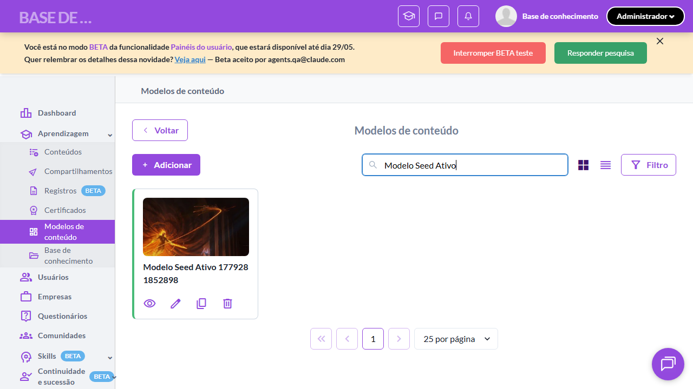

- 📸 **Screenshot (screenshot)** — [`test-failed-2.png`](artifacts/projects-modelos-tests-fea-81805-r-modelo-com-cópia-profunda-chromium/test-failed-2.png)

  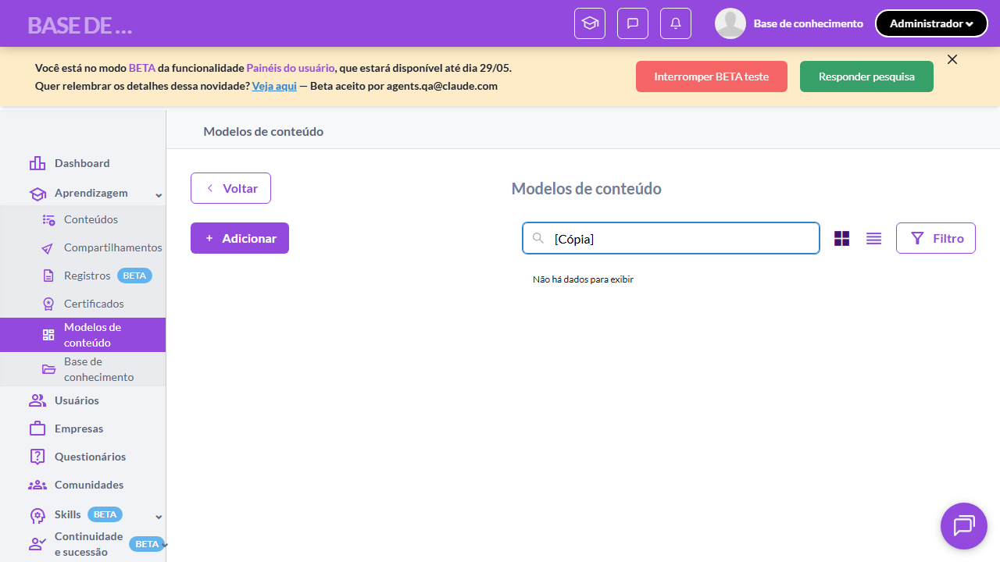

- 🎬 [Vídeo da execução (video.webm)](artifacts/projects-modelos-tests-fea-81805-r-modelo-com-cópia-profunda-chromium/video.webm)

- 📦 **Trace** — [`trace.zip`](artifacts/projects-modelos-tests-fea-81805-r-modelo-com-cópia-profunda-chromium/trace.zip)

  ```bash
  npx playwright show-trace outputs/modelos/reports/regression_20260525-111454/artifacts/projects-modelos-tests-fea-81805-r-modelo-com-cópia-profunda-chromium/trace.zip
  ```

- 🎥 **Vídeo** — [`video.webm`](artifacts/projects-modelos-tests-fea-81805-r-modelo-com-cópia-profunda-chromium/video.webm)

- 📄 **DOM no momento da falha** — [`error-context.md`](artifacts/projects-modelos-tests-fea-81805-r-modelo-com-cópia-profunda-chromium/error-context.md)

#### 🐛 Pronto para registro de bug

> ❓ **Análise automática:** Inconclusivo (precisa investigação manual) · Confiança 🔴 baixa
> _Por quê:_ Sem sinal Network in-scope ou padrão de erro conhecido — revisar trace
> _Bug-report estruturado:_ [`bug-reports/acoes-duplicar-e-drag-and-drop__duplicar-modelo-com-copia-profunda.md`](bug-reports/acoes-duplicar-e-drag-and-drop__duplicar-modelo-com-copia-profunda.md)

**Próximas ações sugeridas:**
- Sem evidência suficiente para classificar — abrir `trace.zip` (`npx playwright show-trace`) para ver passo a passo da execução.
- Reabrir o agente com o trace em mãos para reclassificar manualmente em uma das 4 categorias.

**Descrição do BUG:** [Crítico] Duplicar modelo com cópia profunda — O elemento esperado não apareceu na tela (locator: locator('[data-test-id="content-models-page"] p.css-1mjnzuf').filter({ hasText: 'Modelo Seed Ativo' }).locator('xpath=ancestor::div[contains(@class, "css-fuvrtk")][1]').first()).

**Passo a passo para reprodução:**
1. Pré: Ambiente Stage configurado
1. Pré: Feature flag `modelos_de_conteudo` ativa
1. Pré: Modelo de teste cadastrado com pelo menos 3 designs cadastrados
1. Pré: Usuário logado como Admin
1. 1. Acessar a listagem de modelos com o modelo de teste
1. 2. Clicar na ação "Duplicar" do modelo de teste
1. 3. Aguardar a listagem ser atualizada

**Comportamento esperado:** Listagem é exibida.

**Comportamento atual:** O elemento esperado não apareceu na tela (locator: locator('[data-test-id="content-models-page"] p.css-1mjnzuf').filter({ hasText: 'Modelo Seed Ativo' }).locator('xpath=ancestor::div[contains(@class, "css-fuvrtk")][1]').first()). (falha aconteceu no passo 1: "Acessar listagem de modelos", que deveria resultar em: Listagem é exibida.)

**Informações:**

| Campo | Valor |
|---|---|
| URL | `https://basedeconhecimento.stage.twygoead.com/` |
| Login | Credenciais via env: `TWYGO_STAGING_BASE_DE_CONHECIMENTO_EMAIL` (consulte `.env`) |
| Senha | Credenciais via env: `TWYGO_STAGING_BASE_DE_CONHECIMENTO_PASSWORD` (consulte `.env`) |
| orgId | 37007 |
| Outros | Browser: chromium |
| Outros | runId: regression_20260525-111454 |
| Outros | Duração até a falha: 22.76s |
| Outros | Step impactado: 1. Acessar listagem de modelos |

**Evidências:**

- Screenshot capturado pelo Playwright (screenshot): artifacts/projects-modelos-tests-fea-81805-r-modelo-com-cópia-profunda-chromium/test-failed-1.png
- Vídeo da execução (video.webm): artifacts/projects-modelos-tests-fea-81805-r-modelo-com-cópia-profunda-chromium/video.webm
- Snapshot do DOM/contexto da página (error-context.md): artifacts/projects-modelos-tests-fea-81805-r-modelo-com-cópia-profunda-chromium/error-context.md
- Screenshot capturado pelo Playwright (screenshot): artifacts/projects-modelos-tests-fea-81805-r-modelo-com-cópia-profunda-chromium/test-failed-2.png
- Snapshot do DOM/contexto da página (error-context.md): artifacts/projects-modelos-tests-fea-81805-r-modelo-com-cópia-profunda-chromium/error-context.md
- Trace completo do Playwright (.zip) — `npx playwright show-trace`: artifacts/projects-modelos-tests-fea-81805-r-modelo-com-cópia-profunda-chromium/trace.zip

<details><summary>📋 Ver texto agregado para copiar (Jira/GitHub/Linear)</summary>

```
Descrição do BUG
[Crítico] Duplicar modelo com cópia profunda — O elemento esperado não apareceu na tela (locator: locator('[data-test-id="content-models-page"] p.css-1mjnzuf').filter({ hasText: 'Modelo Seed Ativo' }).locator('xpath=ancestor::div[contains(@class, "css-fuvrtk")][1]').first()).

Passo a passo para reprodução
  Pré: Ambiente Stage configurado
  Pré: Feature flag `modelos_de_conteudo` ativa
  Pré: Modelo de teste cadastrado com pelo menos 3 designs cadastrados
  Pré: Usuário logado como Admin
  1. Acessar a listagem de modelos com o modelo de teste
  2. Clicar na ação "Duplicar" do modelo de teste
  3. Aguardar a listagem ser atualizada

Comportamento esperado
Listagem é exibida.

Comportamento atual
O elemento esperado não apareceu na tela (locator: locator('[data-test-id="content-models-page"] p.css-1mjnzuf').filter({ hasText: 'Modelo Seed Ativo' }).locator('xpath=ancestor::div[contains(@class, "css-fuvrtk")][1]').first()). (falha aconteceu no passo 1: "Acessar listagem de modelos", que deveria resultar em: Listagem é exibida.)

Informações
- URL: https://basedeconhecimento.stage.twygoead.com/
- Login: Credenciais via env: `TWYGO_STAGING_BASE_DE_CONHECIMENTO_EMAIL` (consulte `.env`)
- Senha: Credenciais via env: `TWYGO_STAGING_BASE_DE_CONHECIMENTO_PASSWORD` (consulte `.env`)
- ID do ambiente (orgId): 37007
- Outros:
  - Browser: chromium
  - runId: regression_20260525-111454
  - Duração até a falha: 22.76s
  - Step impactado: 1. Acessar listagem de modelos

Evidências
- Screenshot capturado pelo Playwright (screenshot): artifacts/projects-modelos-tests-fea-81805-r-modelo-com-cópia-profunda-chromium/test-failed-1.png
- Vídeo da execução (video.webm): artifacts/projects-modelos-tests-fea-81805-r-modelo-com-cópia-profunda-chromium/video.webm
- Snapshot do DOM/contexto da página (error-context.md): artifacts/projects-modelos-tests-fea-81805-r-modelo-com-cópia-profunda-chromium/error-context.md
- Screenshot capturado pelo Playwright (screenshot): artifacts/projects-modelos-tests-fea-81805-r-modelo-com-cópia-profunda-chromium/test-failed-2.png
- Snapshot do DOM/contexto da página (error-context.md): artifacts/projects-modelos-tests-fea-81805-r-modelo-com-cópia-profunda-chromium/error-context.md
- Trace completo do Playwright (.zip) — `npx playwright show-trace`: artifacts/projects-modelos-tests-fea-81805-r-modelo-com-cópia-profunda-chromium/trace.zip

Execução
- runId: regression_20260525-111454
- environment.json: staging-base-de-conhecimento
- testsuite: Ações Duplicar e Drag and Drop
- testcase: Duplicar modelo com cópia profunda

```

</details>

<details><summary>🔧 Stack trace técnica completa (para desenvolvedor)</summary>

```
Error: expect(locator).toBeVisible() failed

Locator: locator('[data-test-id="content-models-page"] p.css-1mjnzuf').filter({ hasText: 'Modelo Seed Ativo' }).locator('xpath=ancestor::div[contains(@class, "css-fuvrtk")][1]').first()
Expected: visible
Timeout: 10000ms
Error: element(s) not found

Call log:
  - Expect "toBeVisible" with timeout 10000ms
  - waiting for locator('[data-test-id="content-models-page"] p.css-1mjnzuf').filter({ hasText: 'Modelo Seed Ativo' }).locator('xpath=ancestor::div[contains(@class, "css-fuvrtk")][1]').first()

```

</details>

---

### ✅ Aprovado · TC2 · Duplicar design individual · 🔴 Crítico

<a id="duplicar-design-individual"></a>_Arquivo:_ `tc02-duplicar-design-individual.spec.ts` · _Duração:_ 22.31s · _Browser:_ chromium

**Sumário (objetivo do caso):** Validar duplicação individual de design (RN 6.1 estendido pela QA 2.2).

**Pré-condições:**

```
Ambiente Stage configurado
Feature flag `modelos_de_conteudo` ativa
Modelo de teste cadastrado com pelo menos 3 designs cadastrados
Usuário logado como Admin
```

**Passos do caso (XML/TestLink + execução Playwright):**

_Cada linha reproduz um passo do XML; a coluna **Status** traz o resultado da execução (do step Allure correspondente). Linhas com "Pré-condição" são da execução automatizada (login, navegação inicial) — não fazem parte do roteiro do XML._

| # | Ação do passo | Resultado esperado | Status | Notas | Duração |
|---|---|---|:---:|---|---:|
| 1 | Acessar a aba "Design" do modelo de teste | Listagem de designs é exibida. | ✅ | — | 19.48s |
| 2 | Clicar na ação "Duplicar" de um design existente | Listagem atualiza exibindo cópia do design com nome no formato "[Cópia] {nome original do design}". | ✅ | — | 0.91s |

**Evidências:**

📁 _Pasta:_ [`artifacts/projects-modelos-tests-fea-58f7a--Duplicar-design-individual-chromium/`](artifacts/projects-modelos-tests-fea-58f7a--Duplicar-design-individual-chromium/)

- 📸 **Screenshot (screenshot)** — [`test-finished-1.png`](artifacts/projects-modelos-tests-fea-58f7a--Duplicar-design-individual-chromium/test-finished-1.png)

  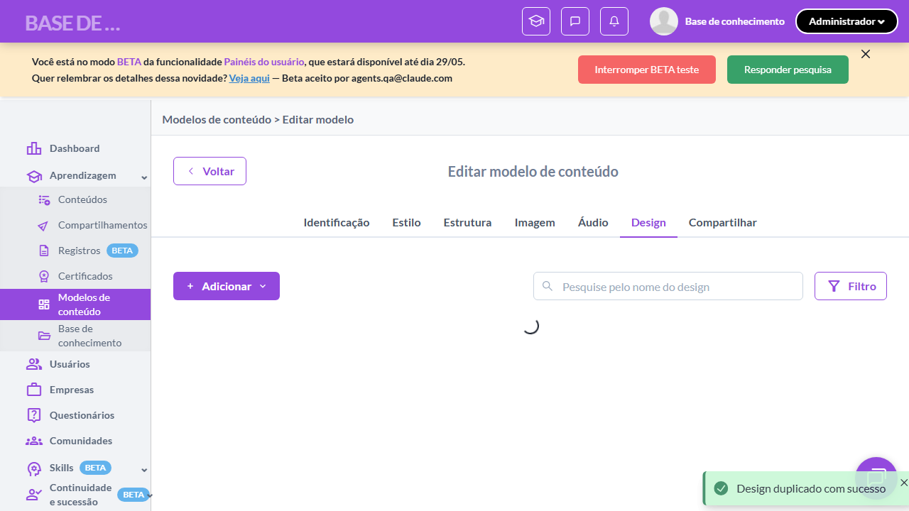

- 🎬 [Vídeo da execução (video.webm)](artifacts/projects-modelos-tests-fea-58f7a--Duplicar-design-individual-chromium/video.webm)

- 📦 **Trace** — [`trace.zip`](artifacts/projects-modelos-tests-fea-58f7a--Duplicar-design-individual-chromium/trace.zip)

  ```bash
  npx playwright show-trace outputs/modelos/reports/regression_20260525-111454/artifacts/projects-modelos-tests-fea-58f7a--Duplicar-design-individual-chromium/trace.zip
  ```

- 🎥 **Vídeo** — [`video.webm`](artifacts/projects-modelos-tests-fea-58f7a--Duplicar-design-individual-chromium/video.webm)


---

### ✅ Aprovado · Drag and drop reorder designs 

<a id="drag-and-drop-reorder-designs"></a>_Arquivo:_ `tc03-drag-drop-reorder-designs.spec.ts` · _Duração:_ 26.03s · _Browser:_ chromium

**Passos do caso (XML/TestLink + execução Playwright):**

_Cada linha reproduz um passo do XML; a coluna **Status** traz o resultado da execução (do step Allure correspondente). Linhas com "Pré-condição" são da execução automatizada (login, navegação inicial) — não fazem parte do roteiro do XML._

| # | Ação do passo | Resultado esperado | Status | Notas | Duração |
|---|---|---|:---:|---|---:|
| — | _Pré-condição:_ 1. Acessar aba Design com pelo menos 2 designs | — | ✅ | — | 21.72s |
| — | _Pré-condição:_ 2. Arrastar 2º design pra primeira posição via drag handle | — | ✅ | — | 2.50s |

**Evidências:**

📁 _Pasta:_ [`artifacts/projects-modelos-tests-fea-39e1a-ag-and-drop-reorder-designs-chromium/`](artifacts/projects-modelos-tests-fea-39e1a-ag-and-drop-reorder-designs-chromium/)

- 📸 **Screenshot (screenshot)** — [`test-finished-1.png`](artifacts/projects-modelos-tests-fea-39e1a-ag-and-drop-reorder-designs-chromium/test-finished-1.png)

  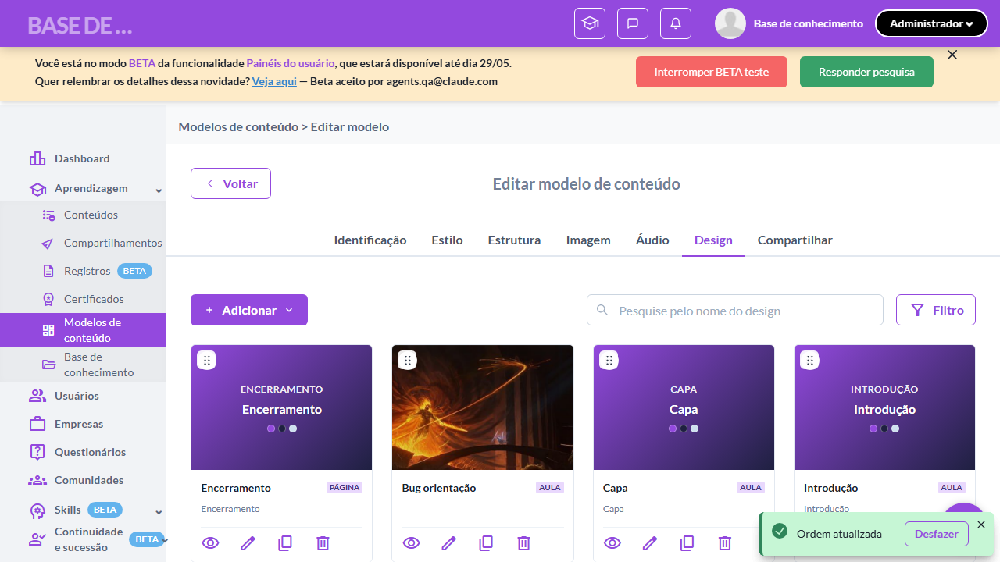

- 🎬 [Vídeo da execução (video.webm)](artifacts/projects-modelos-tests-fea-39e1a-ag-and-drop-reorder-designs-chromium/video.webm)

- 📦 **Trace** — [`trace.zip`](artifacts/projects-modelos-tests-fea-39e1a-ag-and-drop-reorder-designs-chromium/trace.zip)

  ```bash
  npx playwright show-trace outputs/modelos/reports/regression_20260525-111454/artifacts/projects-modelos-tests-fea-39e1a-ag-and-drop-reorder-designs-chromium/trace.zip
  ```

- 🎥 **Vídeo** — [`video.webm`](artifacts/projects-modelos-tests-fea-39e1a-ag-and-drop-reorder-designs-chromium/video.webm)


---

### ✅ Aprovado · TC4 · Drag and drop desabilitado quando filtro ativo · 🔴 Crítico

<a id="drag-and-drop-desabilitado-quando-filtro-ativo"></a>_Arquivo:_ `tc04-drag-drop-desabilitado-com-filtro.spec.ts` · _Duração:_ 24.79s · _Browser:_ chromium

**Sumário (objetivo do caso):** Validar que drag and drop fica desabilitado com filtro ativo (RN 63.1).

**Pré-condições:**

```
Ambiente Stage configurado
Feature flag `modelos_de_conteudo` ativa
Modelo de teste cadastrado com pelo menos 3 designs cadastrados
Usuário logado como Admin
```

**Passos do caso (XML/TestLink + execução Playwright):**

_Cada linha reproduz um passo do XML; a coluna **Status** traz o resultado da execução (do step Allure correspondente). Linhas com "Pré-condição" são da execução automatizada (login, navegação inicial) — não fazem parte do roteiro do XML._

| # | Ação do passo | Resultado esperado | Status | Notas | Duração |
|---|---|---|:---:|---|---:|
| — | _Pré-condição:_ cleanup: limpar filtro | — | ✅ | — | 0.17s |
| 1 | Acessar a aba "Design" do modelo de teste | Listagem é exibida. | ✅ | — | 22.70s |
| 2 | Aplicar o filtro padrão "Só páginas" | Listagem exibe apenas designs do Tipo Página. | ✅ | — | 0.11s |
| 3 | Aguardar o ícone de drag ser renderizado | Ícone de drag exibido em estado desabilitado nas linhas/cards da listagem filtrada. | ✅ | — | — |

**Evidências:**

📁 _Pasta:_ [`artifacts/projects-modelos-tests-fea-0eadb-ilitado-quando-filtro-ativo-chromium/`](artifacts/projects-modelos-tests-fea-0eadb-ilitado-quando-filtro-ativo-chromium/)

- 📸 **Screenshot (screenshot)** — [`test-finished-1.png`](artifacts/projects-modelos-tests-fea-0eadb-ilitado-quando-filtro-ativo-chromium/test-finished-1.png)

  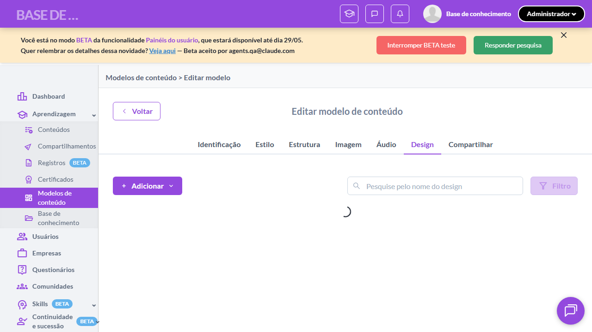

- 🎬 [Vídeo da execução (video.webm)](artifacts/projects-modelos-tests-fea-0eadb-ilitado-quando-filtro-ativo-chromium/video.webm)

- 📦 **Trace** — [`trace.zip`](artifacts/projects-modelos-tests-fea-0eadb-ilitado-quando-filtro-ativo-chromium/trace.zip)

  ```bash
  npx playwright show-trace outputs/modelos/reports/regression_20260525-111454/artifacts/projects-modelos-tests-fea-0eadb-ilitado-quando-filtro-ativo-chromium/trace.zip
  ```

- 🎥 **Vídeo** — [`video.webm`](artifacts/projects-modelos-tests-fea-0eadb-ilitado-quando-filtro-ativo-chromium/video.webm)


---

## Preview de Modelos e Designs

_5 caso(s) — 0 aprovado(s), 5 falha(s)_

### ❌ Falhou · TC1 · Abrir Preview de Modelo via card · 🔴 Crítico

<a id="abrir-preview-de-modelo-via-card"></a>_Arquivo:_ `tc01-abrir-preview-modelo-via-card.spec.ts` · _Duração:_ 66.45s · _Browser:_ chromium

> **❌ Por que falhou:** O elemento esperado não apareceu na tela (locator: getByTestId('content-models-page')).
> _Step impactado:_ **1. Acessar listagem de modelos em Cards**

**Sumário (objetivo do caso):** Validar abertura do modal carrossel de preview do modelo (RN 5.2).

**Pré-condições:**

```
Ambiente Stage configurado
Feature flag `modelos_de_conteudo` ativa
Modelo de teste cadastrado com pelo menos 2 designs com previews gerados (1 Aula e 1 Página)
Usuário logado como Admin
```

**Passos do caso (XML/TestLink + execução Playwright):**

_Cada linha reproduz um passo do XML; a coluna **Status** traz o resultado da execução (do step Allure correspondente). Linhas com "Pré-condição" são da execução automatizada (login, navegação inicial) — não fazem parte do roteiro do XML._

| # | Ação do passo | Resultado esperado | Status | Notas | Duração |
|---|---|---|:---:|---|---:|
| 1 | Acessar a listagem de modelos em visualização Cards | Listagem é exibida. | ❌ | O elemento esperado não apareceu na tela (locator: getByTestId('content-models-page')). | 62.05s |
| 2 | Clicar na ação "Preview" do modelo de teste | Modal de preview é exibido com carrossel contendo o primeiro design. | ⊘ | Step não executado: o teste foi interrompido antes. Causa: O elemento esperado não apareceu na tela (locator: getByTestId('content-models-page')).. | — |

**Evidências:**

📁 _Pasta:_ [`artifacts/projects-modelos-tests-fea-b2a65--Preview-de-Modelo-via-card-chromium/`](artifacts/projects-modelos-tests-fea-b2a65--Preview-de-Modelo-via-card-chromium/)

- 📸 **Screenshot (screenshot)** — [`test-failed-1.png`](artifacts/projects-modelos-tests-fea-b2a65--Preview-de-Modelo-via-card-chromium/test-failed-1.png)

  

- 🎬 [Vídeo da execução (video.webm)](artifacts/projects-modelos-tests-fea-b2a65--Preview-de-Modelo-via-card-chromium/video.webm)

- 📦 **Trace** — [`trace.zip`](artifacts/projects-modelos-tests-fea-b2a65--Preview-de-Modelo-via-card-chromium/trace.zip)

  ```bash
  npx playwright show-trace outputs/modelos/reports/regression_20260525-111454/artifacts/projects-modelos-tests-fea-b2a65--Preview-de-Modelo-via-card-chromium/trace.zip
  ```

- 🎥 **Vídeo** — [`video.webm`](artifacts/projects-modelos-tests-fea-b2a65--Preview-de-Modelo-via-card-chromium/video.webm)

- 📄 **DOM no momento da falha** — [`error-context.md`](artifacts/projects-modelos-tests-fea-b2a65--Preview-de-Modelo-via-card-chromium/error-context.md)

#### 🐛 Pronto para registro de bug

> ❓ **Análise automática:** Inconclusivo (precisa investigação manual) · Confiança 🔴 baixa
> _Por quê:_ Sem sinal Network in-scope ou padrão de erro conhecido — revisar trace
> _Bug-report estruturado:_ [`bug-reports/preview-de-modelos-e-designs__abrir-preview-de-modelo-via-card.md`](bug-reports/preview-de-modelos-e-designs__abrir-preview-de-modelo-via-card.md)

**Próximas ações sugeridas:**
- Sem evidência suficiente para classificar — abrir `trace.zip` (`npx playwright show-trace`) para ver passo a passo da execução.
- Reabrir o agente com o trace em mãos para reclassificar manualmente em uma das 4 categorias.

**Descrição do BUG:** [Crítico] Abrir Preview de Modelo via card — O elemento esperado não apareceu na tela (locator: getByTestId('content-models-page')).

**Passo a passo para reprodução:**
1. Pré: Ambiente Stage configurado
1. Pré: Feature flag `modelos_de_conteudo` ativa
1. Pré: Modelo de teste cadastrado com pelo menos 2 designs com previews gerados (1 Aula e 1 Página)
1. Pré: Usuário logado como Admin
1. 1. Acessar a listagem de modelos em visualização Cards
1. 2. Clicar na ação "Preview" do modelo de teste

**Comportamento esperado:** Listagem é exibida.

**Comportamento atual:** O elemento esperado não apareceu na tela (locator: getByTestId('content-models-page')). (falha aconteceu no passo 1: "Acessar listagem de modelos em Cards", que deveria resultar em: Listagem é exibida.)

**Informações:**

| Campo | Valor |
|---|---|
| URL | `https://basedeconhecimento.stage.twygoead.com/` |
| Login | Credenciais via env: `TWYGO_STAGING_BASE_DE_CONHECIMENTO_EMAIL` (consulte `.env`) |
| Senha | Credenciais via env: `TWYGO_STAGING_BASE_DE_CONHECIMENTO_PASSWORD` (consulte `.env`) |
| orgId | — |
| Outros | Browser: chromium |
| Outros | runId: regression_20260525-111454 |
| Outros | Duração até a falha: 66.45s |
| Outros | Step impactado: 1. Acessar listagem de modelos em Cards |

**Evidências:**

- Screenshot capturado pelo Playwright (screenshot): artifacts/projects-modelos-tests-fea-b2a65--Preview-de-Modelo-via-card-chromium/test-failed-1.png
- Vídeo da execução (video.webm): artifacts/projects-modelos-tests-fea-b2a65--Preview-de-Modelo-via-card-chromium/video.webm
- Snapshot do DOM/contexto da página (error-context.md): artifacts/projects-modelos-tests-fea-b2a65--Preview-de-Modelo-via-card-chromium/error-context.md
- Trace completo do Playwright (.zip) — `npx playwright show-trace`: artifacts/projects-modelos-tests-fea-b2a65--Preview-de-Modelo-via-card-chromium/trace.zip

<details><summary>📋 Ver texto agregado para copiar (Jira/GitHub/Linear)</summary>

```
Descrição do BUG
[Crítico] Abrir Preview de Modelo via card — O elemento esperado não apareceu na tela (locator: getByTestId('content-models-page')).

Passo a passo para reprodução
  Pré: Ambiente Stage configurado
  Pré: Feature flag `modelos_de_conteudo` ativa
  Pré: Modelo de teste cadastrado com pelo menos 2 designs com previews gerados (1 Aula e 1 Página)
  Pré: Usuário logado como Admin
  1. Acessar a listagem de modelos em visualização Cards
  2. Clicar na ação "Preview" do modelo de teste

Comportamento esperado
Listagem é exibida.

Comportamento atual
O elemento esperado não apareceu na tela (locator: getByTestId('content-models-page')). (falha aconteceu no passo 1: "Acessar listagem de modelos em Cards", que deveria resultar em: Listagem é exibida.)

Informações
- URL: https://basedeconhecimento.stage.twygoead.com/
- Login: Credenciais via env: `TWYGO_STAGING_BASE_DE_CONHECIMENTO_EMAIL` (consulte `.env`)
- Senha: Credenciais via env: `TWYGO_STAGING_BASE_DE_CONHECIMENTO_PASSWORD` (consulte `.env`)
- ID do ambiente (orgId): —
- Outros:
  - Browser: chromium
  - runId: regression_20260525-111454
  - Duração até a falha: 66.45s
  - Step impactado: 1. Acessar listagem de modelos em Cards

Evidências
- Screenshot capturado pelo Playwright (screenshot): artifacts/projects-modelos-tests-fea-b2a65--Preview-de-Modelo-via-card-chromium/test-failed-1.png
- Vídeo da execução (video.webm): artifacts/projects-modelos-tests-fea-b2a65--Preview-de-Modelo-via-card-chromium/video.webm
- Snapshot do DOM/contexto da página (error-context.md): artifacts/projects-modelos-tests-fea-b2a65--Preview-de-Modelo-via-card-chromium/error-context.md
- Trace completo do Playwright (.zip) — `npx playwright show-trace`: artifacts/projects-modelos-tests-fea-b2a65--Preview-de-Modelo-via-card-chromium/trace.zip

Execução
- runId: regression_20260525-111454
- environment.json: staging-base-de-conhecimento
- testsuite: Preview de Modelos e Designs
- testcase: Abrir Preview de Modelo via card

```

</details>

<details><summary>🔧 Stack trace técnica completa (para desenvolvedor)</summary>

```
Error: expect(locator).toBeVisible() failed

Locator: getByTestId('content-models-page')
Expected: visible
Timeout: 60000ms
Error: element(s) not found

Call log:
  - Expect "toBeVisible" with timeout 60000ms
  - waiting for getByTestId('content-models-page')

```

</details>

---

### ❌ Falhou · TC2 · Conteúdo de cada item do carrossel · 🔴 Crítico

<a id="conteudo-de-cada-item-do-carrossel"></a>_Arquivo:_ `tc02-conteudo-carrossel.spec.ts` · _Duração:_ 66.45s · _Browser:_ chromium

> **❌ Por que falhou:** O elemento esperado não apareceu na tela (locator: getByTestId('content-models-page')).
> _Step impactado:_ **1. Acessar listagem e abrir Preview**

**Sumário (objetivo do caso):** Validar campos exibidos em cada slide do carrossel (RN 5.2). Inclui validação visual do carregamento da thumb via `expectImageLoaded`.

**Pré-condições:**

```
Ambiente Stage configurado
Feature flag `modelos_de_conteudo` ativa
Modelo de teste cadastrado com pelo menos 2 designs com previews gerados (1 Aula e 1 Página)
Usuário logado como Admin
```

**Passos do caso (XML/TestLink + execução Playwright):**

_Cada linha reproduz um passo do XML; a coluna **Status** traz o resultado da execução (do step Allure correspondente). Linhas com "Pré-condição" são da execução automatizada (login, navegação inicial) — não fazem parte do roteiro do XML._

| # | Ação do passo | Resultado esperado | Status | Notas | Duração |
|---|---|---|:---:|---|---:|
| 1 | Abrir o modal de Preview do modelo de teste | Modal exibe o primeiro slide do carrossel. | ❌ | O elemento esperado não apareceu na tela (locator: getByTestId('content-models-page')). | 62.06s |
| 2 | Aguardar a renderização do slide | Slide exibe: texto "Modelo: {nome do modelo}", Thumb do design, texto "Design: {nome do design}", texto "Tipo: {Aula ou Página}", texto "Prompt: {prosa de instruções}", indicador "Design 1 de 2". | ⊘ | Step não executado: o teste foi interrompido antes. Causa: O elemento esperado não apareceu na tela (locator: getByTestId('content-models-page')).. | — |
| 3 | Executar o helper `expectImageLoaded` sobre o elemento "thumb do design" | Helper retorna true para a `` da thumb (img.complete && naturalWidth >= 64). | ⊘ | Step não executado: o teste foi interrompido antes. Causa: O elemento esperado não apareceu na tela (locator: getByTestId('content-models-page')).. | — |

**Evidências:**

📁 _Pasta:_ [`artifacts/projects-modelos-tests-fea-4071c-o-de-cada-item-do-carrossel-chromium/`](artifacts/projects-modelos-tests-fea-4071c-o-de-cada-item-do-carrossel-chromium/)

- 📸 **Screenshot (screenshot)** — [`test-failed-1.png`](artifacts/projects-modelos-tests-fea-4071c-o-de-cada-item-do-carrossel-chromium/test-failed-1.png)

  

- 🎬 [Vídeo da execução (video.webm)](artifacts/projects-modelos-tests-fea-4071c-o-de-cada-item-do-carrossel-chromium/video.webm)

- 📦 **Trace** — [`trace.zip`](artifacts/projects-modelos-tests-fea-4071c-o-de-cada-item-do-carrossel-chromium/trace.zip)

  ```bash
  npx playwright show-trace outputs/modelos/reports/regression_20260525-111454/artifacts/projects-modelos-tests-fea-4071c-o-de-cada-item-do-carrossel-chromium/trace.zip
  ```

- 🎥 **Vídeo** — [`video.webm`](artifacts/projects-modelos-tests-fea-4071c-o-de-cada-item-do-carrossel-chromium/video.webm)

- 📄 **DOM no momento da falha** — [`error-context.md`](artifacts/projects-modelos-tests-fea-4071c-o-de-cada-item-do-carrossel-chromium/error-context.md)

#### 🐛 Pronto para registro de bug

> ❓ **Análise automática:** Inconclusivo (precisa investigação manual) · Confiança 🔴 baixa
> _Por quê:_ Sem sinal Network in-scope ou padrão de erro conhecido — revisar trace
> _Bug-report estruturado:_ [`bug-reports/preview-de-modelos-e-designs__conteudo-de-cada-item-do-carrossel.md`](bug-reports/preview-de-modelos-e-designs__conteudo-de-cada-item-do-carrossel.md)

**Próximas ações sugeridas:**
- Sem evidência suficiente para classificar — abrir `trace.zip` (`npx playwright show-trace`) para ver passo a passo da execução.
- Reabrir o agente com o trace em mãos para reclassificar manualmente em uma das 4 categorias.

**Descrição do BUG:** [Crítico] Conteúdo de cada item do carrossel — O elemento esperado não apareceu na tela (locator: getByTestId('content-models-page')).

**Passo a passo para reprodução:**
1. Pré: Ambiente Stage configurado
1. Pré: Feature flag `modelos_de_conteudo` ativa
1. Pré: Modelo de teste cadastrado com pelo menos 2 designs com previews gerados (1 Aula e 1 Página)
1. Pré: Usuário logado como Admin
1. 1. Abrir o modal de Preview do modelo de teste
1. 2. Aguardar a renderização do slide
1. 3. Executar o helper `expectImageLoaded` sobre o elemento "thumb do design"

**Comportamento esperado:** Modal exibe o primeiro slide do carrossel.

**Comportamento atual:** O elemento esperado não apareceu na tela (locator: getByTestId('content-models-page')). (falha aconteceu no passo 1: "Acessar listagem e abrir Preview", que deveria resultar em: Modal exibe o primeiro slide do carrossel.)

**Informações:**

| Campo | Valor |
|---|---|
| URL | `https://basedeconhecimento.stage.twygoead.com/` |
| Login | Credenciais via env: `TWYGO_STAGING_BASE_DE_CONHECIMENTO_EMAIL` (consulte `.env`) |
| Senha | Credenciais via env: `TWYGO_STAGING_BASE_DE_CONHECIMENTO_PASSWORD` (consulte `.env`) |
| orgId | — |
| Outros | Browser: chromium |
| Outros | runId: regression_20260525-111454 |
| Outros | Duração até a falha: 66.45s |
| Outros | Step impactado: 1. Acessar listagem e abrir Preview |

**Evidências:**

- Screenshot capturado pelo Playwright (screenshot): artifacts/projects-modelos-tests-fea-4071c-o-de-cada-item-do-carrossel-chromium/test-failed-1.png
- Vídeo da execução (video.webm): artifacts/projects-modelos-tests-fea-4071c-o-de-cada-item-do-carrossel-chromium/video.webm
- Snapshot do DOM/contexto da página (error-context.md): artifacts/projects-modelos-tests-fea-4071c-o-de-cada-item-do-carrossel-chromium/error-context.md
- Trace completo do Playwright (.zip) — `npx playwright show-trace`: artifacts/projects-modelos-tests-fea-4071c-o-de-cada-item-do-carrossel-chromium/trace.zip

<details><summary>📋 Ver texto agregado para copiar (Jira/GitHub/Linear)</summary>

```
Descrição do BUG
[Crítico] Conteúdo de cada item do carrossel — O elemento esperado não apareceu na tela (locator: getByTestId('content-models-page')).

Passo a passo para reprodução
  Pré: Ambiente Stage configurado
  Pré: Feature flag `modelos_de_conteudo` ativa
  Pré: Modelo de teste cadastrado com pelo menos 2 designs com previews gerados (1 Aula e 1 Página)
  Pré: Usuário logado como Admin
  1. Abrir o modal de Preview do modelo de teste
  2. Aguardar a renderização do slide
  3. Executar o helper `expectImageLoaded` sobre o elemento "thumb do design"

Comportamento esperado
Modal exibe o primeiro slide do carrossel.

Comportamento atual
O elemento esperado não apareceu na tela (locator: getByTestId('content-models-page')). (falha aconteceu no passo 1: "Acessar listagem e abrir Preview", que deveria resultar em: Modal exibe o primeiro slide do carrossel.)

Informações
- URL: https://basedeconhecimento.stage.twygoead.com/
- Login: Credenciais via env: `TWYGO_STAGING_BASE_DE_CONHECIMENTO_EMAIL` (consulte `.env`)
- Senha: Credenciais via env: `TWYGO_STAGING_BASE_DE_CONHECIMENTO_PASSWORD` (consulte `.env`)
- ID do ambiente (orgId): —
- Outros:
  - Browser: chromium
  - runId: regression_20260525-111454
  - Duração até a falha: 66.45s
  - Step impactado: 1. Acessar listagem e abrir Preview

Evidências
- Screenshot capturado pelo Playwright (screenshot): artifacts/projects-modelos-tests-fea-4071c-o-de-cada-item-do-carrossel-chromium/test-failed-1.png
- Vídeo da execução (video.webm): artifacts/projects-modelos-tests-fea-4071c-o-de-cada-item-do-carrossel-chromium/video.webm
- Snapshot do DOM/contexto da página (error-context.md): artifacts/projects-modelos-tests-fea-4071c-o-de-cada-item-do-carrossel-chromium/error-context.md
- Trace completo do Playwright (.zip) — `npx playwright show-trace`: artifacts/projects-modelos-tests-fea-4071c-o-de-cada-item-do-carrossel-chromium/trace.zip

Execução
- runId: regression_20260525-111454
- environment.json: staging-base-de-conhecimento
- testsuite: Preview de Modelos e Designs
- testcase: Conteúdo de cada item do carrossel

```

</details>

<details><summary>🔧 Stack trace técnica completa (para desenvolvedor)</summary>

```
Error: expect(locator).toBeVisible() failed

Locator: getByTestId('content-models-page')
Expected: visible
Timeout: 60000ms
Error: element(s) not found

Call log:
  - Expect "toBeVisible" with timeout 60000ms
  - waiting for getByTestId('content-models-page')

```

</details>

---

### ❌ Falhou · TC3 · Navegar entre slides no carrossel · 🔴 Crítico

<a id="navegar-entre-slides-no-carrossel"></a>_Arquivo:_ `tc03-navegar-entre-slides.spec.ts` · _Duração:_ 66.63s · _Browser:_ chromium

> **❌ Por que falhou:** O elemento esperado não apareceu na tela (locator: getByTestId('content-models-page')).
> _Step impactado:_ **1. Abrir Preview do modelo**

**Sumário (objetivo do caso):** Validar navegação entre slides (RN 5.2).

**Pré-condições:**

```
Ambiente Stage configurado
Feature flag `modelos_de_conteudo` ativa
Modelo de teste cadastrado com pelo menos 2 designs com previews gerados (1 Aula e 1 Página)
Usuário logado como Admin
```

**Passos do caso (XML/TestLink + execução Playwright):**

_Cada linha reproduz um passo do XML; a coluna **Status** traz o resultado da execução (do step Allure correspondente). Linhas com "Pré-condição" são da execução automatizada (login, navegação inicial) — não fazem parte do roteiro do XML._

| # | Ação do passo | Resultado esperado | Status | Notas | Duração |
|---|---|---|:---:|---|---:|
| 1 | Abrir o modal de Preview do modelo de teste | Modal exibe "Design 1 de 2". | ❌ | O elemento esperado não apareceu na tela (locator: getByTestId('content-models-page')). | 62.03s |
| 2 | Clicar no botão de navegação "Próximo" do carrossel | Modal exibe o slide seguinte com indicador "Design 2 de 2". | ⊘ | Step não executado: o teste foi interrompido antes. Causa: O elemento esperado não apareceu na tela (locator: getByTestId('content-models-page')).. | — |

**Evidências:**

📁 _Pasta:_ [`artifacts/projects-modelos-tests-fea-dda88-r-entre-slides-no-carrossel-chromium/`](artifacts/projects-modelos-tests-fea-dda88-r-entre-slides-no-carrossel-chromium/)

- 📸 **Screenshot (screenshot)** — [`test-failed-1.png`](artifacts/projects-modelos-tests-fea-dda88-r-entre-slides-no-carrossel-chromium/test-failed-1.png)

  

- 🎬 [Vídeo da execução (video.webm)](artifacts/projects-modelos-tests-fea-dda88-r-entre-slides-no-carrossel-chromium/video.webm)

- 📦 **Trace** — [`trace.zip`](artifacts/projects-modelos-tests-fea-dda88-r-entre-slides-no-carrossel-chromium/trace.zip)

  ```bash
  npx playwright show-trace outputs/modelos/reports/regression_20260525-111454/artifacts/projects-modelos-tests-fea-dda88-r-entre-slides-no-carrossel-chromium/trace.zip
  ```

- 🎥 **Vídeo** — [`video.webm`](artifacts/projects-modelos-tests-fea-dda88-r-entre-slides-no-carrossel-chromium/video.webm)

- 📄 **DOM no momento da falha** — [`error-context.md`](artifacts/projects-modelos-tests-fea-dda88-r-entre-slides-no-carrossel-chromium/error-context.md)

#### 🐛 Pronto para registro de bug

> ❓ **Análise automática:** Inconclusivo (precisa investigação manual) · Confiança 🔴 baixa
> _Por quê:_ Sem sinal Network in-scope ou padrão de erro conhecido — revisar trace
> _Bug-report estruturado:_ [`bug-reports/preview-de-modelos-e-designs__navegar-entre-slides-no-carrossel.md`](bug-reports/preview-de-modelos-e-designs__navegar-entre-slides-no-carrossel.md)

**Próximas ações sugeridas:**
- Sem evidência suficiente para classificar — abrir `trace.zip` (`npx playwright show-trace`) para ver passo a passo da execução.
- Reabrir o agente com o trace em mãos para reclassificar manualmente em uma das 4 categorias.

**Descrição do BUG:** [Crítico] Navegar entre slides no carrossel — O elemento esperado não apareceu na tela (locator: getByTestId('content-models-page')).

**Passo a passo para reprodução:**
1. Pré: Ambiente Stage configurado
1. Pré: Feature flag `modelos_de_conteudo` ativa
1. Pré: Modelo de teste cadastrado com pelo menos 2 designs com previews gerados (1 Aula e 1 Página)
1. Pré: Usuário logado como Admin
1. 1. Abrir o modal de Preview do modelo de teste
1. 2. Clicar no botão de navegação "Próximo" do carrossel

**Comportamento esperado:** Modal exibe "Design 1 de 2".

**Comportamento atual:** O elemento esperado não apareceu na tela (locator: getByTestId('content-models-page')). (falha aconteceu no passo 1: "Abrir Preview do modelo", que deveria resultar em: Modal exibe "Design 1 de 2".)

**Informações:**

| Campo | Valor |
|---|---|
| URL | `https://basedeconhecimento.stage.twygoead.com/` |
| Login | Credenciais via env: `TWYGO_STAGING_BASE_DE_CONHECIMENTO_EMAIL` (consulte `.env`) |
| Senha | Credenciais via env: `TWYGO_STAGING_BASE_DE_CONHECIMENTO_PASSWORD` (consulte `.env`) |
| orgId | — |
| Outros | Browser: chromium |
| Outros | runId: regression_20260525-111454 |
| Outros | Duração até a falha: 66.63s |
| Outros | Step impactado: 1. Abrir Preview do modelo |

**Evidências:**

- Screenshot capturado pelo Playwright (screenshot): artifacts/projects-modelos-tests-fea-dda88-r-entre-slides-no-carrossel-chromium/test-failed-1.png
- Vídeo da execução (video.webm): artifacts/projects-modelos-tests-fea-dda88-r-entre-slides-no-carrossel-chromium/video.webm
- Snapshot do DOM/contexto da página (error-context.md): artifacts/projects-modelos-tests-fea-dda88-r-entre-slides-no-carrossel-chromium/error-context.md
- Trace completo do Playwright (.zip) — `npx playwright show-trace`: artifacts/projects-modelos-tests-fea-dda88-r-entre-slides-no-carrossel-chromium/trace.zip

<details><summary>📋 Ver texto agregado para copiar (Jira/GitHub/Linear)</summary>

```
Descrição do BUG
[Crítico] Navegar entre slides no carrossel — O elemento esperado não apareceu na tela (locator: getByTestId('content-models-page')).

Passo a passo para reprodução
  Pré: Ambiente Stage configurado
  Pré: Feature flag `modelos_de_conteudo` ativa
  Pré: Modelo de teste cadastrado com pelo menos 2 designs com previews gerados (1 Aula e 1 Página)
  Pré: Usuário logado como Admin
  1. Abrir o modal de Preview do modelo de teste
  2. Clicar no botão de navegação "Próximo" do carrossel

Comportamento esperado
Modal exibe "Design 1 de 2".

Comportamento atual
O elemento esperado não apareceu na tela (locator: getByTestId('content-models-page')). (falha aconteceu no passo 1: "Abrir Preview do modelo", que deveria resultar em: Modal exibe "Design 1 de 2".)

Informações
- URL: https://basedeconhecimento.stage.twygoead.com/
- Login: Credenciais via env: `TWYGO_STAGING_BASE_DE_CONHECIMENTO_EMAIL` (consulte `.env`)
- Senha: Credenciais via env: `TWYGO_STAGING_BASE_DE_CONHECIMENTO_PASSWORD` (consulte `.env`)
- ID do ambiente (orgId): —
- Outros:
  - Browser: chromium
  - runId: regression_20260525-111454
  - Duração até a falha: 66.63s
  - Step impactado: 1. Abrir Preview do modelo

Evidências
- Screenshot capturado pelo Playwright (screenshot): artifacts/projects-modelos-tests-fea-dda88-r-entre-slides-no-carrossel-chromium/test-failed-1.png
- Vídeo da execução (video.webm): artifacts/projects-modelos-tests-fea-dda88-r-entre-slides-no-carrossel-chromium/video.webm
- Snapshot do DOM/contexto da página (error-context.md): artifacts/projects-modelos-tests-fea-dda88-r-entre-slides-no-carrossel-chromium/error-context.md
- Trace completo do Playwright (.zip) — `npx playwright show-trace`: artifacts/projects-modelos-tests-fea-dda88-r-entre-slides-no-carrossel-chromium/trace.zip

Execução
- runId: regression_20260525-111454
- environment.json: staging-base-de-conhecimento
- testsuite: Preview de Modelos e Designs
- testcase: Navegar entre slides no carrossel

```

</details>

<details><summary>🔧 Stack trace técnica completa (para desenvolvedor)</summary>

```
Error: expect(locator).toBeVisible() failed

Locator: getByTestId('content-models-page')
Expected: visible
Timeout: 60000ms
Error: element(s) not found

Call log:
  - Expect "toBeVisible" with timeout 60000ms
  - waiting for getByTestId('content-models-page')

```

</details>

---

### ❌ Falhou · TC4 · Preview de Design tipo Página tem zoom com scroll · 🟡 Normal

<a id="preview-de-design-tipo-pagina-tem-zoom-com-scroll"></a>_Arquivo:_ `tc04-preview-pagina-zoom-scroll.spec.ts` · _Duração:_ 66.45s · _Browser:_ chromium

> **❌ Por que falhou:** O elemento esperado não apareceu na tela (locator: getByTestId('content-models-page')).
> _Step impactado:_ **1. Abrir Preview do modelo**

**Sumário (objetivo do caso):** Validar opção de zoom com scroll apenas em designs do tipo Página (RN 5.2). Inclui validação visual do preview da Página.

**Pré-condições:**

```
Ambiente Stage configurado
Feature flag `modelos_de_conteudo` ativa
Modelo de teste cadastrado com pelo menos 2 designs com previews gerados (1 Aula e 1 Página)
Usuário logado como Admin
```

**Passos do caso (XML/TestLink + execução Playwright):**

_Cada linha reproduz um passo do XML; a coluna **Status** traz o resultado da execução (do step Allure correspondente). Linhas com "Pré-condição" são da execução automatizada (login, navegação inicial) — não fazem parte do roteiro do XML._

| # | Ação do passo | Resultado esperado | Status | Notas | Duração |
|---|---|---|:---:|---|---:|
| 1 | Abrir o modal de Preview de um design tipo Página | Modal exibe o preview da Página. | ❌ | O elemento esperado não apareceu na tela (locator: getByTestId('content-models-page')). | 62.05s |
| 2 | Aguardar a opção de zoom ser renderizada | Componente de zoom com scroll é exibido sobre o preview da Página. | ⊘ | Step não executado: o teste foi interrompido antes. Causa: O elemento esperado não apareceu na tela (locator: getByTestId('content-models-page')).. | — |
| 3 | Executar o helper `expectImageLoaded` sobre o elemento "preview da Página" | Helper retorna true para a `` do preview (img.complete === true && naturalWidth >= 128). | ⊘ | Step não executado: o teste foi interrompido antes. Causa: O elemento esperado não apareceu na tela (locator: getByTestId('content-models-page')).. | — |

**Evidências:**

📁 _Pasta:_ [`artifacts/projects-modelos-tests-fea-57886--Página-tem-zoom-com-scroll-chromium/`](artifacts/projects-modelos-tests-fea-57886--Página-tem-zoom-com-scroll-chromium/)

- 📸 **Screenshot (screenshot)** — [`test-failed-1.png`](artifacts/projects-modelos-tests-fea-57886--Página-tem-zoom-com-scroll-chromium/test-failed-1.png)

  

- 🎬 [Vídeo da execução (video.webm)](artifacts/projects-modelos-tests-fea-57886--Página-tem-zoom-com-scroll-chromium/video.webm)

- 📦 **Trace** — [`trace.zip`](artifacts/projects-modelos-tests-fea-57886--Página-tem-zoom-com-scroll-chromium/trace.zip)

  ```bash
  npx playwright show-trace outputs/modelos/reports/regression_20260525-111454/artifacts/projects-modelos-tests-fea-57886--Página-tem-zoom-com-scroll-chromium/trace.zip
  ```

- 🎥 **Vídeo** — [`video.webm`](artifacts/projects-modelos-tests-fea-57886--Página-tem-zoom-com-scroll-chromium/video.webm)

- 📄 **DOM no momento da falha** — [`error-context.md`](artifacts/projects-modelos-tests-fea-57886--Página-tem-zoom-com-scroll-chromium/error-context.md)

#### 🐛 Pronto para registro de bug

> ❓ **Análise automática:** Inconclusivo (precisa investigação manual) · Confiança 🔴 baixa
> _Por quê:_ Sem sinal Network in-scope ou padrão de erro conhecido — revisar trace
> _Bug-report estruturado:_ [`bug-reports/preview-de-modelos-e-designs__preview-de-design-tipo-pagina-tem-zoom-com-scroll.md`](bug-reports/preview-de-modelos-e-designs__preview-de-design-tipo-pagina-tem-zoom-com-scroll.md)

**Próximas ações sugeridas:**
- Sem evidência suficiente para classificar — abrir `trace.zip` (`npx playwright show-trace`) para ver passo a passo da execução.
- Reabrir o agente com o trace em mãos para reclassificar manualmente em uma das 4 categorias.

**Descrição do BUG:** [Normal] Preview de Design tipo Página tem zoom com scroll — O elemento esperado não apareceu na tela (locator: getByTestId('content-models-page')).

**Passo a passo para reprodução:**
1. Pré: Ambiente Stage configurado
1. Pré: Feature flag `modelos_de_conteudo` ativa
1. Pré: Modelo de teste cadastrado com pelo menos 2 designs com previews gerados (1 Aula e 1 Página)
1. Pré: Usuário logado como Admin
1. 1. Abrir o modal de Preview de um design tipo Página
1. 2. Aguardar a opção de zoom ser renderizada
1. 3. Executar o helper `expectImageLoaded` sobre o elemento "preview da Página"

**Comportamento esperado:** Modal exibe o preview da Página.

**Comportamento atual:** O elemento esperado não apareceu na tela (locator: getByTestId('content-models-page')). (falha aconteceu no passo 1: "Abrir Preview do modelo", que deveria resultar em: Modal exibe o preview da Página.)

**Informações:**

| Campo | Valor |
|---|---|
| URL | `https://basedeconhecimento.stage.twygoead.com/` |
| Login | Credenciais via env: `TWYGO_STAGING_BASE_DE_CONHECIMENTO_EMAIL` (consulte `.env`) |
| Senha | Credenciais via env: `TWYGO_STAGING_BASE_DE_CONHECIMENTO_PASSWORD` (consulte `.env`) |
| orgId | — |
| Outros | Browser: chromium |
| Outros | runId: regression_20260525-111454 |
| Outros | Duração até a falha: 66.45s |
| Outros | Step impactado: 1. Abrir Preview do modelo |

**Evidências:**

- Screenshot capturado pelo Playwright (screenshot): artifacts/projects-modelos-tests-fea-57886--Página-tem-zoom-com-scroll-chromium/test-failed-1.png
- Vídeo da execução (video.webm): artifacts/projects-modelos-tests-fea-57886--Página-tem-zoom-com-scroll-chromium/video.webm
- Snapshot do DOM/contexto da página (error-context.md): artifacts/projects-modelos-tests-fea-57886--Página-tem-zoom-com-scroll-chromium/error-context.md
- Trace completo do Playwright (.zip) — `npx playwright show-trace`: artifacts/projects-modelos-tests-fea-57886--Página-tem-zoom-com-scroll-chromium/trace.zip

<details><summary>📋 Ver texto agregado para copiar (Jira/GitHub/Linear)</summary>

```
Descrição do BUG
[Normal] Preview de Design tipo Página tem zoom com scroll — O elemento esperado não apareceu na tela (locator: getByTestId('content-models-page')).

Passo a passo para reprodução
  Pré: Ambiente Stage configurado
  Pré: Feature flag `modelos_de_conteudo` ativa
  Pré: Modelo de teste cadastrado com pelo menos 2 designs com previews gerados (1 Aula e 1 Página)
  Pré: Usuário logado como Admin
  1. Abrir o modal de Preview de um design tipo Página
  2. Aguardar a opção de zoom ser renderizada
  3. Executar o helper `expectImageLoaded` sobre o elemento "preview da Página"

Comportamento esperado
Modal exibe o preview da Página.

Comportamento atual
O elemento esperado não apareceu na tela (locator: getByTestId('content-models-page')). (falha aconteceu no passo 1: "Abrir Preview do modelo", que deveria resultar em: Modal exibe o preview da Página.)

Informações
- URL: https://basedeconhecimento.stage.twygoead.com/
- Login: Credenciais via env: `TWYGO_STAGING_BASE_DE_CONHECIMENTO_EMAIL` (consulte `.env`)
- Senha: Credenciais via env: `TWYGO_STAGING_BASE_DE_CONHECIMENTO_PASSWORD` (consulte `.env`)
- ID do ambiente (orgId): —
- Outros:
  - Browser: chromium
  - runId: regression_20260525-111454
  - Duração até a falha: 66.45s
  - Step impactado: 1. Abrir Preview do modelo

Evidências
- Screenshot capturado pelo Playwright (screenshot): artifacts/projects-modelos-tests-fea-57886--Página-tem-zoom-com-scroll-chromium/test-failed-1.png
- Vídeo da execução (video.webm): artifacts/projects-modelos-tests-fea-57886--Página-tem-zoom-com-scroll-chromium/video.webm
- Snapshot do DOM/contexto da página (error-context.md): artifacts/projects-modelos-tests-fea-57886--Página-tem-zoom-com-scroll-chromium/error-context.md
- Trace completo do Playwright (.zip) — `npx playwright show-trace`: artifacts/projects-modelos-tests-fea-57886--Página-tem-zoom-com-scroll-chromium/trace.zip

Execução
- runId: regression_20260525-111454
- environment.json: staging-base-de-conhecimento
- testsuite: Preview de Modelos e Designs
- testcase: Preview de Design tipo Página tem zoom com scroll

```

</details>

<details><summary>🔧 Stack trace técnica completa (para desenvolvedor)</summary>

```
Error: expect(locator).toBeVisible() failed

Locator: getByTestId('content-models-page')
Expected: visible
Timeout: 60000ms
Error: element(s) not found

Call log:
  - Expect "toBeVisible" with timeout 60000ms
  - waiting for getByTestId('content-models-page')

```

</details>

---

### ❌ Falhou · TC5 · Preview falha graciosamente quando imagem do design não carrega · 🔴 Crítico

<a id="preview-falha-graciosamente-quando-imagem-do-design-nao-carrega"></a>_Arquivo:_ `tc05-preview-falha-graciosamente-broken-img.spec.ts` · _Duração:_ 66.82s · _Browser:_ chromium

> **❌ Por que falhou:** O elemento esperado não apareceu na tela (locator: getByTestId('content-models-page')).
> _Step impactado:_ **1. Acessar listagem e abrir Preview**

**Sumário (objetivo do caso):** Validar que `expectImageLoaded` DETECTA imagem broken e marca o teste como failed — endereça o padrão de bug "toBeVisible passa em img com src inválido". Atende §1.2 do CONTRACT.md v1.1.

**Pré-condições:**

```
Ambiente Stage configurado
Feature flag `modelos_de_conteudo` ativa
Modelo de teste cadastrado com pelo menos 2 designs com previews gerados (1 Aula e 1 Página)
Usuário logado como Admin
```

**Passos do caso (XML/TestLink + execução Playwright):**

_Cada linha reproduz um passo do XML; a coluna **Status** traz o resultado da execução (do step Allure correspondente). Linhas com "Pré-condição" são da execução automatizada (login, navegação inicial) — não fazem parte do roteiro do XML._

| # | Ação do passo | Resultado esperado | Status | Notas | Duração |
|---|---|---|:---:|---|---:|
| 1 | Abrir o modal de Preview do modelo de teste | Modal exibe o primeiro slide. | ❌ | O elemento esperado não apareceu na tela (locator: getByTestId('content-models-page')). | 62.05s |
| 2 | Inspecionar o elemento `` da thumb do design | Elemento `` exibe atributo `src` apontando para o asset gerado. | ⊘ | Step não executado: o teste foi interrompido antes. Causa: O elemento esperado não apareceu na tela (locator: getByTestId('content-models-page')).. | — |
| 3 | Executar o helper `expectImageLoaded` sobre o elemento "thumb do design" | Helper retorna true quando img.complete === true && naturalWidth >= 64. Se a imagem está broken (src inválido, 404, naturalWidth === 0): helper falha com mensagem "image not visually loaded — possibly broken src or 0x0 natural size". | ⊘ | Step não executado: o teste foi interrompido antes. Causa: O elemento esperado não apareceu na tela (locator: getByTestId('content-models-page')).. | — |

**Evidências:**

📁 _Pasta:_ [`artifacts/projects-modelos-tests-fea-c289b-magem-do-design-não-carrega-chromium/`](artifacts/projects-modelos-tests-fea-c289b-magem-do-design-não-carrega-chromium/)

- 📸 **Screenshot (screenshot)** — [`test-failed-1.png`](artifacts/projects-modelos-tests-fea-c289b-magem-do-design-não-carrega-chromium/test-failed-1.png)

  

- 🎬 [Vídeo da execução (video.webm)](artifacts/projects-modelos-tests-fea-c289b-magem-do-design-não-carrega-chromium/video.webm)

- 📦 **Trace** — [`trace.zip`](artifacts/projects-modelos-tests-fea-c289b-magem-do-design-não-carrega-chromium/trace.zip)

  ```bash
  npx playwright show-trace outputs/modelos/reports/regression_20260525-111454/artifacts/projects-modelos-tests-fea-c289b-magem-do-design-não-carrega-chromium/trace.zip
  ```

- 🎥 **Vídeo** — [`video.webm`](artifacts/projects-modelos-tests-fea-c289b-magem-do-design-não-carrega-chromium/video.webm)

- 📄 **DOM no momento da falha** — [`error-context.md`](artifacts/projects-modelos-tests-fea-c289b-magem-do-design-não-carrega-chromium/error-context.md)

#### 🐛 Pronto para registro de bug

> ❓ **Análise automática:** Inconclusivo (precisa investigação manual) · Confiança 🔴 baixa
> _Por quê:_ Sem sinal Network in-scope ou padrão de erro conhecido — revisar trace
> _Bug-report estruturado:_ [`bug-reports/preview-de-modelos-e-designs__preview-falha-graciosamente-quando-imagem-do-design-nao-carrega.md`](bug-reports/preview-de-modelos-e-designs__preview-falha-graciosamente-quando-imagem-do-design-nao-carrega.md)

**Próximas ações sugeridas:**
- Sem evidência suficiente para classificar — abrir `trace.zip` (`npx playwright show-trace`) para ver passo a passo da execução.
- Reabrir o agente com o trace em mãos para reclassificar manualmente em uma das 4 categorias.

**Descrição do BUG:** [Crítico] Preview falha graciosamente quando imagem do design não carrega — O elemento esperado não apareceu na tela (locator: getByTestId('content-models-page')).

**Passo a passo para reprodução:**
1. Pré: Ambiente Stage configurado
1. Pré: Feature flag `modelos_de_conteudo` ativa
1. Pré: Modelo de teste cadastrado com pelo menos 2 designs com previews gerados (1 Aula e 1 Página)
1. Pré: Usuário logado como Admin
1. 1. Abrir o modal de Preview do modelo de teste
1. 2. Inspecionar o elemento `` da thumb do design
1. 3. Executar o helper `expectImageLoaded` sobre o elemento "thumb do design"

**Comportamento esperado:** Modal exibe o primeiro slide.

**Comportamento atual:** O elemento esperado não apareceu na tela (locator: getByTestId('content-models-page')). (falha aconteceu no passo 1: "Acessar listagem e abrir Preview", que deveria resultar em: Modal exibe o primeiro slide.)

**Informações:**

| Campo | Valor |
|---|---|
| URL | `https://basedeconhecimento.stage.twygoead.com/` |
| Login | Credenciais via env: `TWYGO_STAGING_BASE_DE_CONHECIMENTO_EMAIL` (consulte `.env`) |
| Senha | Credenciais via env: `TWYGO_STAGING_BASE_DE_CONHECIMENTO_PASSWORD` (consulte `.env`) |
| orgId | — |
| Outros | Browser: chromium |
| Outros | runId: regression_20260525-111454 |
| Outros | Duração até a falha: 66.82s |
| Outros | Step impactado: 1. Acessar listagem e abrir Preview |

**Evidências:**

- Screenshot capturado pelo Playwright (screenshot): artifacts/projects-modelos-tests-fea-c289b-magem-do-design-não-carrega-chromium/test-failed-1.png
- Vídeo da execução (video.webm): artifacts/projects-modelos-tests-fea-c289b-magem-do-design-não-carrega-chromium/video.webm
- Snapshot do DOM/contexto da página (error-context.md): artifacts/projects-modelos-tests-fea-c289b-magem-do-design-não-carrega-chromium/error-context.md
- Trace completo do Playwright (.zip) — `npx playwright show-trace`: artifacts/projects-modelos-tests-fea-c289b-magem-do-design-não-carrega-chromium/trace.zip

<details><summary>📋 Ver texto agregado para copiar (Jira/GitHub/Linear)</summary>

```
Descrição do BUG
[Crítico] Preview falha graciosamente quando imagem do design não carrega — O elemento esperado não apareceu na tela (locator: getByTestId('content-models-page')).

Passo a passo para reprodução
  Pré: Ambiente Stage configurado
  Pré: Feature flag `modelos_de_conteudo` ativa
  Pré: Modelo de teste cadastrado com pelo menos 2 designs com previews gerados (1 Aula e 1 Página)
  Pré: Usuário logado como Admin
  1. Abrir o modal de Preview do modelo de teste
  2. Inspecionar o elemento `` da thumb do design
  3. Executar o helper `expectImageLoaded` sobre o elemento "thumb do design"

Comportamento esperado
Modal exibe o primeiro slide.

Comportamento atual
O elemento esperado não apareceu na tela (locator: getByTestId('content-models-page')). (falha aconteceu no passo 1: "Acessar listagem e abrir Preview", que deveria resultar em: Modal exibe o primeiro slide.)

Informações
- URL: https://basedeconhecimento.stage.twygoead.com/
- Login: Credenciais via env: `TWYGO_STAGING_BASE_DE_CONHECIMENTO_EMAIL` (consulte `.env`)
- Senha: Credenciais via env: `TWYGO_STAGING_BASE_DE_CONHECIMENTO_PASSWORD` (consulte `.env`)
- ID do ambiente (orgId): —
- Outros:
  - Browser: chromium
  - runId: regression_20260525-111454
  - Duração até a falha: 66.82s
  - Step impactado: 1. Acessar listagem e abrir Preview

Evidências
- Screenshot capturado pelo Playwright (screenshot): artifacts/projects-modelos-tests-fea-c289b-magem-do-design-não-carrega-chromium/test-failed-1.png
- Vídeo da execução (video.webm): artifacts/projects-modelos-tests-fea-c289b-magem-do-design-não-carrega-chromium/video.webm
- Snapshot do DOM/contexto da página (error-context.md): artifacts/projects-modelos-tests-fea-c289b-magem-do-design-não-carrega-chromium/error-context.md
- Trace completo do Playwright (.zip) — `npx playwright show-trace`: artifacts/projects-modelos-tests-fea-c289b-magem-do-design-não-carrega-chromium/trace.zip

Execução
- runId: regression_20260525-111454
- environment.json: staging-base-de-conhecimento
- testsuite: Preview de Modelos e Designs
- testcase: Preview falha graciosamente quando imagem do design não carrega

```

</details>

<details><summary>🔧 Stack trace técnica completa (para desenvolvedor)</summary>

```
Error: expect(locator).toBeVisible() failed

Locator: getByTestId('content-models-page')
Expected: visible
Timeout: 60000ms
Error: element(s) not found

Call log:
  - Expect "toBeVisible" with timeout 60000ms
  - waiting for getByTestId('content-models-page')

```

</details>

---

## Sincronização e Regeração de Previews

_4 caso(s) — 0 aprovado(s), 0 falha(s), 4 ignorado(s)_

### ⊘ Ignorado · Alterar Kit de Marca exibe ícone de alerta nos designs 

<a id="alterar-kit-de-marca-exibe-icone-de-alerta-nos-designs"></a>_Arquivo:_ `tc01-alterar-kit-exibe-alerta.spec.ts` · _Duração:_ 0.00s · _Browser:_ chromium

> **⊘ Por que foi ignorado:** [REVISAR] Motivo do skip não declarado no spec. Edite o `test.fixme(true, "[Categoria] motivo")` indicando uma das categorias canônicas: xml-desatualizado | seed-ausente | dep-externa | bloqueio-temporario.

**Passos do caso (XML/TestLink + execução Playwright):**

_Cada linha reproduz um passo do XML; a coluna **Status** traz o resultado da execução (do step Allure correspondente). Linhas com "Pré-condição" são da execução automatizada (login, navegação inicial) — não fazem parte do roteiro do XML._

_Sem steps Allure ou metadata XML para este testcase._

**Evidências:**

_Sem evidências anexadas._

#### ⏳ Pendente — execução automatizada não realizada

- **Severidade do caso (XML):** —
- **Categoria:** ⚠️ Não declarada
- **Motivo declarado pelo spec:** _ausente_
- **Próximo passo:** Editar o spec para declarar `test.fixme(true, '[Categoria] motivo')` com uma das categorias canônicas (xml-desatualizado | seed-ausente | dep-externa | bloqueio-temporario). Sem declaração, leitor leigo não sabe quem precisa agir.

**Roteiro do XML (para validação manual):**
1. — (sem steps documentados no XML)

> Esse caso não bloqueia a build, mas precisa de validação manual ou ajuste no agente.


---

### ⊘ Ignorado · TC2 · Botão "Regerar todos" exibe tooltip correto · 🔴 Crítico

<a id="botao-regerar-todos-exibe-tooltip-correto"></a>_Arquivo:_ `tc02-botao-regerar-todos-tooltip.spec.ts` · _Duração:_ 0.00s · _Browser:_ chromium

> **⊘ Por que foi ignorado:** [REVISAR] Motivo do skip não declarado no spec. Edite o `test.fixme(true, "[Categoria] motivo")` indicando uma das categorias canônicas: xml-desatualizado | seed-ausente | dep-externa | bloqueio-temporario.

**Sumário (objetivo do caso):** Validar exibição do botão "Regerar todos" na aba Design com tooltip literal (RN 59.2, RN 59.3).

**Pré-condições:**

```
Ambiente Stage configurado
Feature flag `modelos_de_conteudo` ativa
Modelo de teste cadastrado com pelo menos 1 design e Kit de Marca selecionado
Pelo menos 2 kits de marca distintos cadastrados na organização
Usuário logado como Admin
```

**Passos do caso (XML/TestLink + execução Playwright):**

_Cada linha reproduz um passo do XML; a coluna **Status** traz o resultado da execução (do step Allure correspondente). Linhas com "Pré-condição" são da execução automatizada (login, navegação inicial) — não fazem parte do roteiro do XML._

| # | Ação do passo | Resultado esperado | Status | Notas | Duração |
|---|---|---|:---:|---|---:|
| 1 | Acessar a aba "Design" do modelo após alteração de kit de marca | Aba "Design" exibe a listagem de designs e o botão "Regerar todos". | ⊘ | Step não executado — [REVISAR] Motivo do skip não declarado no spec. Edite o `test.fixme(true, "[Categoria] motivo")` indicando uma das categorias canônicas: xml-desatualizado \| seed-ausente \| dep-externa \| bloqueio-temporario. | — |
| 2 | Aguardar a tooltip do botão "Regerar todos" ser exibida ao posicionar o mouse | Tooltip exibida: "O kit de marca foi alterado. Clique em 'Regerar todos' para atualizar todos os designs com as novas configurações de cores e fontes.". | ⊘ | Step não executado — [REVISAR] Motivo do skip não declarado no spec. Edite o `test.fixme(true, "[Categoria] motivo")` indicando uma das categorias canônicas: xml-desatualizado \| seed-ausente \| dep-externa \| bloqueio-temporario. | — |

**Evidências:**

_Sem evidências anexadas._

#### ⏳ Pendente — execução automatizada não realizada

- **Severidade do caso (XML):** Crítico
- **Categoria:** ⚠️ Não declarada
- **Motivo declarado pelo spec:** _ausente_
- **Próximo passo:** Editar o spec para declarar `test.fixme(true, '[Categoria] motivo')` com uma das categorias canônicas (xml-desatualizado | seed-ausente | dep-externa | bloqueio-temporario). Sem declaração, leitor leigo não sabe quem precisa agir.

**Roteiro do XML (para validação manual):**
1. Pré: Ambiente Stage configurado
1. Pré: Feature flag `modelos_de_conteudo` ativa
1. Pré: Modelo de teste cadastrado com pelo menos 1 design e Kit de Marca selecionado
1. Pré: Pelo menos 2 kits de marca distintos cadastrados na organização
1. Pré: Usuário logado como Admin
1. 1. Acessar a aba "Design" do modelo após alteração de kit de marca
1. 2. Aguardar a tooltip do botão "Regerar todos" ser exibida ao posicionar o mouse

> Esse caso não bloqueia a build, mas precisa de validação manual ou ajuste no agente.


---

### ⊘ Ignorado · TC3 · Clicar "Regerar todos" inicia processo assíncrono · 🔴 Crítico

<a id="clicar-regerar-todos-inicia-processo-assincrono"></a>_Arquivo:_ `tc03-clicar-regerar-todos-toast.spec.ts` · _Duração:_ 0.00s · _Browser:_ chromium

> **⊘ Por que foi ignorado:** [REVISAR] Motivo do skip não declarado no spec. Edite o `test.fixme(true, "[Categoria] motivo")` indicando uma das categorias canônicas: xml-desatualizado | seed-ausente | dep-externa | bloqueio-temporario.

**Sumário (objetivo do caso):** Validar inicio do processo de regeração com toast (RN 59.4).

**Pré-condições:**

```
Ambiente Stage configurado
Feature flag `modelos_de_conteudo` ativa
Modelo de teste cadastrado com pelo menos 1 design e Kit de Marca selecionado
Pelo menos 2 kits de marca distintos cadastrados na organização
Usuário logado como Admin
```

**Passos do caso (XML/TestLink + execução Playwright):**

_Cada linha reproduz um passo do XML; a coluna **Status** traz o resultado da execução (do step Allure correspondente). Linhas com "Pré-condição" são da execução automatizada (login, navegação inicial) — não fazem parte do roteiro do XML._

| # | Ação do passo | Resultado esperado | Status | Notas | Duração |
|---|---|---|:---:|---|---:|
| 1 | Acessar a aba "Design" do modelo após alteração de kit de marca | Botão "Regerar todos" é exibido. | ⊘ | Step não executado — [REVISAR] Motivo do skip não declarado no spec. Edite o `test.fixme(true, "[Categoria] motivo")` indicando uma das categorias canônicas: xml-desatualizado \| seed-ausente \| dep-externa \| bloqueio-temporario. | — |
| 2 | Clicar no botão "Regerar todos" | Toast exibida: "A regeração dos designs foi iniciada. Você será notificado quando for concluída.". | ⊘ | Step não executado — [REVISAR] Motivo do skip não declarado no spec. Edite o `test.fixme(true, "[Categoria] motivo")` indicando uma das categorias canônicas: xml-desatualizado \| seed-ausente \| dep-externa \| bloqueio-temporario. | — |

**Evidências:**

_Sem evidências anexadas._

#### ⏳ Pendente — execução automatizada não realizada

- **Severidade do caso (XML):** Crítico
- **Categoria:** ⚠️ Não declarada
- **Motivo declarado pelo spec:** _ausente_
- **Próximo passo:** Editar o spec para declarar `test.fixme(true, '[Categoria] motivo')` com uma das categorias canônicas (xml-desatualizado | seed-ausente | dep-externa | bloqueio-temporario). Sem declaração, leitor leigo não sabe quem precisa agir.

**Roteiro do XML (para validação manual):**
1. Pré: Ambiente Stage configurado
1. Pré: Feature flag `modelos_de_conteudo` ativa
1. Pré: Modelo de teste cadastrado com pelo menos 1 design e Kit de Marca selecionado
1. Pré: Pelo menos 2 kits de marca distintos cadastrados na organização
1. Pré: Usuário logado como Admin
1. 1. Acessar a aba "Design" do modelo após alteração de kit de marca
1. 2. Clicar no botão "Regerar todos"

> Esse caso não bloqueia a build, mas precisa de validação manual ou ajuste no agente.


---

### ⊘ Ignorado · TC4 · Previews regerados carregam visualmente após processo assíncrono · 🔴 Crítico

<a id="previews-regerados-carregam-visualmente-apos-processo-assincrono"></a>_Arquivo:_ `tc04-previews-regerados-carregam.spec.ts` · _Duração:_ 0.00s · _Browser:_ chromium

> **⊘ Por que foi ignorado:** [REVISAR] Motivo do skip não declarado no spec. Edite o `test.fixme(true, "[Categoria] motivo")` indicando uma das categorias canônicas: xml-desatualizado | seed-ausente | dep-externa | bloqueio-temporario.

**Sumário (objetivo do caso):** Validar que após o processo assíncrono concluir, os previews dos designs carregam visualmente (sem broken-img). Atende §1.2 do CONTRACT.md v1.1.

**Pré-condições:**

```
Ambiente Stage configurado
Feature flag `modelos_de_conteudo` ativa
Modelo de teste cadastrado com pelo menos 1 design e Kit de Marca selecionado
Pelo menos 2 kits de marca distintos cadastrados na organização
Usuário logado como Admin
```

**Passos do caso (XML/TestLink + execução Playwright):**

_Cada linha reproduz um passo do XML; a coluna **Status** traz o resultado da execução (do step Allure correspondente). Linhas com "Pré-condição" são da execução automatizada (login, navegação inicial) — não fazem parte do roteiro do XML._

| # | Ação do passo | Resultado esperado | Status | Notas | Duração |
|---|---|---|:---:|---|---:|
| 1 | Disparar o processo de regeração via "Regerar todos" | Toast de início é exibida. | ⊘ | Step não executado — [REVISAR] Motivo do skip não declarado no spec. Edite o `test.fixme(true, "[Categoria] motivo")` indicando uma das categorias canônicas: xml-desatualizado \| seed-ausente \| dep-externa \| bloqueio-temporario. | — |
| 2 | Aguardar a notificação assíncrona "Regerações concluídas" | Notificação é exibida com header "Regerações concluídas" e body "As regerações dos designs do modelo {nome} foram concluídas.". | ⊘ | Step não executado — [REVISAR] Motivo do skip não declarado no spec. Edite o `test.fixme(true, "[Categoria] motivo")` indicando uma das categorias canônicas: xml-desatualizado \| seed-ausente \| dep-externa \| bloqueio-temporario. | — |
| 3 | Abrir o modal de Preview do modelo | Modal exibe os slides com as thumbs regeradas. | ⊘ | Step não executado — [REVISAR] Motivo do skip não declarado no spec. Edite o `test.fixme(true, "[Categoria] motivo")` indicando uma das categorias canônicas: xml-desatualizado \| seed-ausente \| dep-externa \| bloqueio-temporario. | — |
| 4 | Executar o helper `expectImageLoaded` sobre cada "thumb do carrossel" | Para cada slide, helper retorna true (img.complete === true && naturalWidth >= 64). Nenhuma broken-img detectada após regeração. | ⊘ | Step não executado — [REVISAR] Motivo do skip não declarado no spec. Edite o `test.fixme(true, "[Categoria] motivo")` indicando uma das categorias canônicas: xml-desatualizado \| seed-ausente \| dep-externa \| bloqueio-temporario. | — |

**Evidências:**

_Sem evidências anexadas._

#### ⏳ Pendente — execução automatizada não realizada

- **Severidade do caso (XML):** Crítico
- **Categoria:** ⚠️ Não declarada
- **Motivo declarado pelo spec:** _ausente_
- **Próximo passo:** Editar o spec para declarar `test.fixme(true, '[Categoria] motivo')` com uma das categorias canônicas (xml-desatualizado | seed-ausente | dep-externa | bloqueio-temporario). Sem declaração, leitor leigo não sabe quem precisa agir.

**Roteiro do XML (para validação manual):**
1. Pré: Ambiente Stage configurado
1. Pré: Feature flag `modelos_de_conteudo` ativa
1. Pré: Modelo de teste cadastrado com pelo menos 1 design e Kit de Marca selecionado
1. Pré: Pelo menos 2 kits de marca distintos cadastrados na organização
1. Pré: Usuário logado como Admin
1. 1. Disparar o processo de regeração via "Regerar todos"
1. 2. Aguardar a notificação assíncrona "Regerações concluídas"
1. 3. Abrir o modal de Preview do modelo
1. 4. Executar o helper `expectImageLoaded` sobre cada "thumb do carrossel"

> Esse caso não bloqueia a build, mas precisa de validação manual ou ajuste no agente.


---

## Bloqueio Exclusão Cores Kit de Marca

_2 caso(s) — 2 aprovado(s), 0 falha(s)_

### ✅ Aprovado · TC1 · Bloqueio de exclusão de cor em uso por modelo · 🔴 Crítico

<a id="bloqueio-de-exclusao-de-cor-em-uso-por-modelo"></a>_Arquivo:_ `tc01-bloqueio-cor-em-uso.spec.ts` · _Duração:_ 24.13s · _Browser:_ chromium

**Sumário (objetivo do caso):** Validar que cor de kit de marca em uso por modelo não pode ser excluída (RN 64).

**Pré-condições:**

```
Ambiente Stage configurado
Feature flag `modelos_de_conteudo` ativa
Kit de marca cadastrado e associado a pelo menos 1 modelo de conteúdo
Usuário logado como Admin
```

**Passos do caso (XML/TestLink + execução Playwright):**

_Cada linha reproduz um passo do XML; a coluna **Status** traz o resultado da execução (do step Allure correspondente). Linhas com "Pré-condição" são da execução automatizada (login, navegação inicial) — não fazem parte do roteiro do XML._

| # | Ação do passo | Resultado esperado | Status | Notas | Duração |
|---|---|---|:---:|---|---:|
| 1 | Acessar a tela de edição do kit de marca utilizado pelo modelo de teste | Tela de edição é exibida com as cores cadastradas. | ✅ | — | 19.19s |
| 2 | Clicar no botão de excluir da cor que está em uso pelo modelo | Mensagem de bloqueio exibida indicando que a cor está em uso por um ou mais modelos de conteúdo. Cor NÃO é excluída. | ✅ | — | 3.70s |

**Evidências:**

📁 _Pasta:_ [`artifacts/projects-modelos-tests-fea-c7334-ão-de-cor-em-uso-por-modelo-chromium/`](artifacts/projects-modelos-tests-fea-c7334-ão-de-cor-em-uso-por-modelo-chromium/)

- 📸 **Screenshot (screenshot)** — [`test-finished-1.png`](artifacts/projects-modelos-tests-fea-c7334-ão-de-cor-em-uso-por-modelo-chromium/test-finished-1.png)

  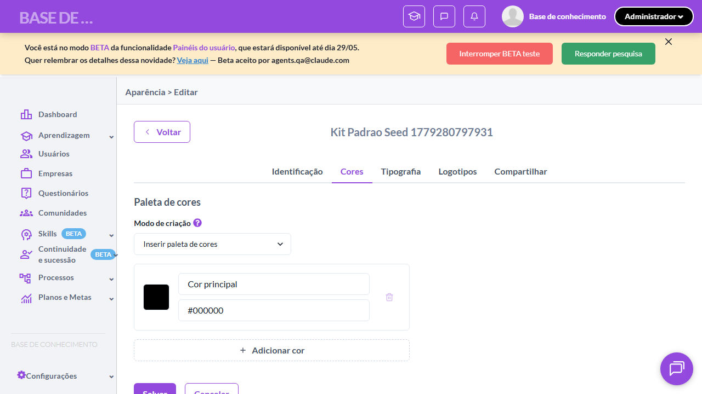

- 🎬 [Vídeo da execução (video.webm)](artifacts/projects-modelos-tests-fea-c7334-ão-de-cor-em-uso-por-modelo-chromium/video.webm)

- 📦 **Trace** — [`trace.zip`](artifacts/projects-modelos-tests-fea-c7334-ão-de-cor-em-uso-por-modelo-chromium/trace.zip)

  ```bash
  npx playwright show-trace outputs/modelos/reports/regression_20260525-111454/artifacts/projects-modelos-tests-fea-c7334-ão-de-cor-em-uso-por-modelo-chromium/trace.zip
  ```

- 🎥 **Vídeo** — [`video.webm`](artifacts/projects-modelos-tests-fea-c7334-ão-de-cor-em-uso-por-modelo-chromium/video.webm)


---

### ✅ Aprovado · TC2 · Exclusão permitida de cor sem modelos associados · 🔴 Crítico

<a id="exclusao-permitida-de-cor-sem-modelos-associados"></a>_Arquivo:_ `tc02-exclusao-cor-sem-modelos.spec.ts` · _Duração:_ 25.86s · _Browser:_ chromium

**Sumário (objetivo do caso):** Validar que cor sem modelos associados pode ser excluída normalmente (RN 64).

**Pré-condições:**

```
Ambiente Stage configurado
Feature flag `modelos_de_conteudo` ativa
Kit de marca cadastrado e associado a pelo menos 1 modelo de conteúdo
Usuário logado como Admin
```

**Passos do caso (XML/TestLink + execução Playwright):**

_Cada linha reproduz um passo do XML; a coluna **Status** traz o resultado da execução (do step Allure correspondente). Linhas com "Pré-condição" são da execução automatizada (login, navegação inicial) — não fazem parte do roteiro do XML._

| # | Ação do passo | Resultado esperado | Status | Notas | Duração |
|---|---|---|:---:|---|---:|
| — | _Pré-condição:_ 3. Adicionar cor extra (não-única) e validar que pode ser removida | — | ✅ | — | 1.13s |
| — | _Pré-condição:_ 4. Remover a cor adicionada e validar que sumiu do DOM | — | ✅ | — | 1.03s |
| 1 | Acessar a tela de edição de um kit de marca com cor não utilizada por nenhum modelo | Tela de edição é exibida. | ✅ | — | 19.21s |
| 2 | Clicar no botão de excluir da cor não utilizada | Cor é excluída e Toast de sucesso é exibida (REVISAR-FIGMA: texto exato). | ✅ | — | 3.03s |

**Evidências:**

📁 _Pasta:_ [`artifacts/projects-modelos-tests-fea-4775d--cor-sem-modelos-associados-chromium/`](artifacts/projects-modelos-tests-fea-4775d--cor-sem-modelos-associados-chromium/)

- 📸 **Screenshot (screenshot)** — [`test-finished-1.png`](artifacts/projects-modelos-tests-fea-4775d--cor-sem-modelos-associados-chromium/test-finished-1.png)

  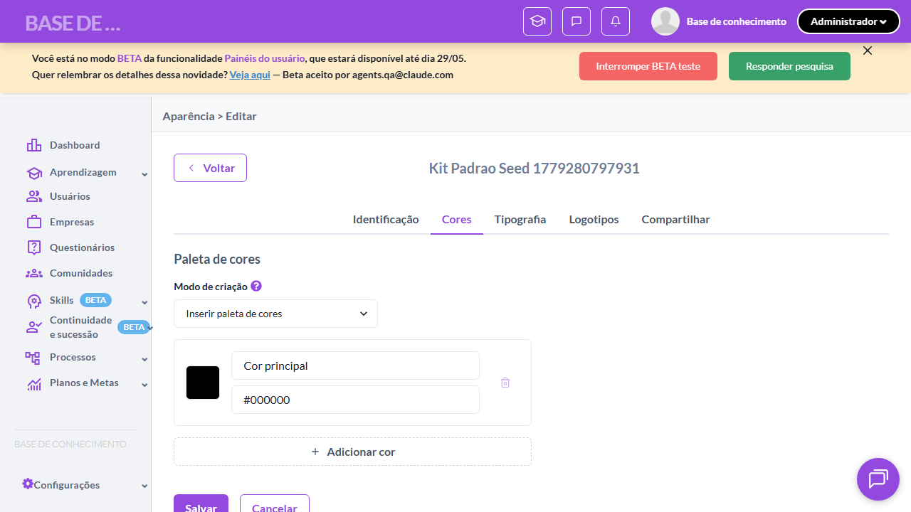

- 🎬 [Vídeo da execução (video.webm)](artifacts/projects-modelos-tests-fea-4775d--cor-sem-modelos-associados-chromium/video.webm)

- 📦 **Trace** — [`trace.zip`](artifacts/projects-modelos-tests-fea-4775d--cor-sem-modelos-associados-chromium/trace.zip)

  ```bash
  npx playwright show-trace outputs/modelos/reports/regression_20260525-111454/artifacts/projects-modelos-tests-fea-4775d--cor-sem-modelos-associados-chromium/trace.zip
  ```

- 🎥 **Vídeo** — [`video.webm`](artifacts/projects-modelos-tests-fea-4775d--cor-sem-modelos-associados-chromium/video.webm)


---

## Feature flag modelos_de_conteudo

_3 caso(s) — 0 aprovado(s), 0 falha(s), 3 ignorado(s)_

### ⊘ Ignorado · TC1 · Acesso bloqueado com flag desabilitada · 🔴 Crítico

<a id="acesso-bloqueado-com-flag-desabilitada"></a>_Arquivo:_ `tc01-acesso-bloqueado-flag-off.spec.ts` · _Duração:_ 0.00s · _Browser:_ chromium

> **⊘ Por que foi ignorado:** [REVISAR] Motivo do skip não declarado no spec. Edite o `test.fixme(true, "[Categoria] motivo")` indicando uma das categorias canônicas: xml-desatualizado | seed-ausente | dep-externa | bloqueio-temporario.

**Sumário (objetivo do caso):** Validar que o submenu "Modelos de conteúdo" não aparece quando a flag está desabilitada (RN 1.2).

**Pré-condições:**

```
Ambiente Stage configurado
Usuário logado como Admin com flag elevada para Flipper-UI
Feature flag `modelos_de_conteudo` controlável via Super Admin
```

**Passos do caso (XML/TestLink + execução Playwright):**

_Cada linha reproduz um passo do XML; a coluna **Status** traz o resultado da execução (do step Allure correspondente). Linhas com "Pré-condição" são da execução automatizada (login, navegação inicial) — não fazem parte do roteiro do XML._

| # | Ação do passo | Resultado esperado | Status | Notas | Duração |
|---|---|---|:---:|---|---:|
| 1 | Desabilitar a feature flag `modelos_de_conteudo` para a organização do teste via Flipper-UI | Flag fica como "Conditionally enabled" sem actor `Organization;{orgId}`. | ⊘ | Step não executado — [REVISAR] Motivo do skip não declarado no spec. Edite o `test.fixme(true, "[Categoria] motivo")` indicando uma das categorias canônicas: xml-desatualizado \| seed-ausente \| dep-externa \| bloqueio-temporario. | — |
| 2 | Acessar a URL "/o/{orgId}/dashboard" | Dashboard padrão é exibido. | ⊘ | Step não executado — [REVISAR] Motivo do skip não declarado no spec. Edite o `test.fixme(true, "[Categoria] motivo")` indicando uma das categorias canônicas: xml-desatualizado \| seed-ausente \| dep-externa \| bloqueio-temporario. | — |
| 3 | Clicar no menu lateral "Aprendizagem" | Submenu lateral é exibido SEM o item "Modelos de conteúdo". | ⊘ | Step não executado — [REVISAR] Motivo do skip não declarado no spec. Edite o `test.fixme(true, "[Categoria] motivo")` indicando uma das categorias canônicas: xml-desatualizado \| seed-ausente \| dep-externa \| bloqueio-temporario. | — |

**Evidências:**

_Sem evidências anexadas._

#### ⏳ Pendente — execução automatizada não realizada

- **Severidade do caso (XML):** Crítico
- **Categoria:** ⚠️ Não declarada
- **Motivo declarado pelo spec:** _ausente_
- **Próximo passo:** Editar o spec para declarar `test.fixme(true, '[Categoria] motivo')` com uma das categorias canônicas (xml-desatualizado | seed-ausente | dep-externa | bloqueio-temporario). Sem declaração, leitor leigo não sabe quem precisa agir.

**Roteiro do XML (para validação manual):**
1. Pré: Ambiente Stage configurado
1. Pré: Usuário logado como Admin com flag elevada para Flipper-UI
1. Pré: Feature flag `modelos_de_conteudo` controlável via Super Admin
1. 1. Desabilitar a feature flag `modelos_de_conteudo` para a organização do teste via Flipper-UI
1. 2. Acessar a URL "/o/{orgId}/dashboard"
1. 3. Clicar no menu lateral "Aprendizagem"

> Esse caso não bloqueia a build, mas precisa de validação manual ou ajuste no agente.


---

### ⊘ Ignorado · TC2 · Acesso liberado com flag habilitada · 🔴 Crítico

<a id="acesso-liberado-com-flag-habilitada"></a>_Arquivo:_ `tc02-acesso-liberado-flag-on.spec.ts` · _Duração:_ 0.00s · _Browser:_ chromium

> **⊘ Por que foi ignorado:** [REVISAR] Motivo do skip não declarado no spec. Edite o `test.fixme(true, "[Categoria] motivo")` indicando uma das categorias canônicas: xml-desatualizado | seed-ausente | dep-externa | bloqueio-temporario.

**Sumário (objetivo do caso):** Validar que a funcionalidade fica acessível quando a flag está habilitada (RN 1.2).

**Pré-condições:**

```
Ambiente Stage configurado
Usuário logado como Admin com flag elevada para Flipper-UI
Feature flag `modelos_de_conteudo` controlável via Super Admin
```

**Passos do caso (XML/TestLink + execução Playwright):**

_Cada linha reproduz um passo do XML; a coluna **Status** traz o resultado da execução (do step Allure correspondente). Linhas com "Pré-condição" são da execução automatizada (login, navegação inicial) — não fazem parte do roteiro do XML._

| # | Ação do passo | Resultado esperado | Status | Notas | Duração |
|---|---|---|:---:|---|---:|
| 1 | Habilitar a feature flag `modelos_de_conteudo` para a organização do teste via Flipper-UI | Flag fica como "Conditionally enabled" com actor `Organization;{orgId}`. | ⊘ | Step não executado — [REVISAR] Motivo do skip não declarado no spec. Edite o `test.fixme(true, "[Categoria] motivo")` indicando uma das categorias canônicas: xml-desatualizado \| seed-ausente \| dep-externa \| bloqueio-temporario. | — |
| 2 | Acessar a URL "/o/{orgId}/dashboard" | Dashboard padrão é exibido. | ⊘ | Step não executado — [REVISAR] Motivo do skip não declarado no spec. Edite o `test.fixme(true, "[Categoria] motivo")` indicando uma das categorias canônicas: xml-desatualizado \| seed-ausente \| dep-externa \| bloqueio-temporario. | — |
| 3 | Clicar no menu lateral "Aprendizagem" | Submenu lateral é exibido COM o item "Modelos de conteúdo". | ⊘ | Step não executado — [REVISAR] Motivo do skip não declarado no spec. Edite o `test.fixme(true, "[Categoria] motivo")` indicando uma das categorias canônicas: xml-desatualizado \| seed-ausente \| dep-externa \| bloqueio-temporario. | — |
| 4 | Clicar no submenu "Modelos de conteúdo" | Sistema redireciona para a listagem de modelos de conteúdo. | ⊘ | Step não executado — [REVISAR] Motivo do skip não declarado no spec. Edite o `test.fixme(true, "[Categoria] motivo")` indicando uma das categorias canônicas: xml-desatualizado \| seed-ausente \| dep-externa \| bloqueio-temporario. | — |

**Evidências:**

_Sem evidências anexadas._

#### ⏳ Pendente — execução automatizada não realizada

- **Severidade do caso (XML):** Crítico
- **Categoria:** ⚠️ Não declarada
- **Motivo declarado pelo spec:** _ausente_
- **Próximo passo:** Editar o spec para declarar `test.fixme(true, '[Categoria] motivo')` com uma das categorias canônicas (xml-desatualizado | seed-ausente | dep-externa | bloqueio-temporario). Sem declaração, leitor leigo não sabe quem precisa agir.

**Roteiro do XML (para validação manual):**
1. Pré: Ambiente Stage configurado
1. Pré: Usuário logado como Admin com flag elevada para Flipper-UI
1. Pré: Feature flag `modelos_de_conteudo` controlável via Super Admin
1. 1. Habilitar a feature flag `modelos_de_conteudo` para a organização do teste via Flipper-UI
1. 2. Acessar a URL "/o/{orgId}/dashboard"
1. 3. Clicar no menu lateral "Aprendizagem"
1. 4. Clicar no submenu "Modelos de conteúdo"

> Esse caso não bloqueia a build, mas precisa de validação manual ou ajuste no agente.


---

### ⊘ Ignorado · TC3 · Transição off → on durante a sessão · 🟡 Normal

<a id="transicao-off-on-durante-a-sessao"></a>_Arquivo:_ `tc03-transicao-off-on-sessao.spec.ts` · _Duração:_ 0.00s · _Browser:_ chromium

> **⊘ Por que foi ignorado:** [REVISAR] Motivo do skip não declarado no spec. Edite o `test.fixme(true, "[Categoria] motivo")` indicando uma das categorias canônicas: xml-desatualizado | seed-ausente | dep-externa | bloqueio-temporario.

**Sumário (objetivo do caso):** Validar que ativar a flag durante uma sessão libera a funcionalidade após refresh.

**Pré-condições:**

```
Ambiente Stage configurado
Usuário logado como Admin com flag elevada para Flipper-UI
Feature flag `modelos_de_conteudo` controlável via Super Admin
```

**Passos do caso (XML/TestLink + execução Playwright):**

_Cada linha reproduz um passo do XML; a coluna **Status** traz o resultado da execução (do step Allure correspondente). Linhas com "Pré-condição" são da execução automatizada (login, navegação inicial) — não fazem parte do roteiro do XML._

| # | Ação do passo | Resultado esperado | Status | Notas | Duração |
|---|---|---|:---:|---|---:|
| 1 | Iniciar sessão com a flag desabilitada para a organização do teste | Submenu "Modelos de conteúdo" NÃO é exibido. | ⊘ | Step não executado — [REVISAR] Motivo do skip não declarado no spec. Edite o `test.fixme(true, "[Categoria] motivo")` indicando uma das categorias canônicas: xml-desatualizado \| seed-ausente \| dep-externa \| bloqueio-temporario. | — |
| 2 | Habilitar a flag `modelos_de_conteudo` para a organização via Flipper-UI | Flag fica como "Conditionally enabled" com actor `Organization;{orgId}`. | ⊘ | Step não executado — [REVISAR] Motivo do skip não declarado no spec. Edite o `test.fixme(true, "[Categoria] motivo")` indicando uma das categorias canônicas: xml-desatualizado \| seed-ausente \| dep-externa \| bloqueio-temporario. | — |
| 3 | Recarregar a página "/o/{orgId}/dashboard" | Dashboard é exibido novamente. | ⊘ | Step não executado — [REVISAR] Motivo do skip não declarado no spec. Edite o `test.fixme(true, "[Categoria] motivo")` indicando uma das categorias canônicas: xml-desatualizado \| seed-ausente \| dep-externa \| bloqueio-temporario. | — |
| 4 | Clicar no menu lateral "Aprendizagem" | Submenu lateral agora exibe o item "Modelos de conteúdo". | ⊘ | Step não executado — [REVISAR] Motivo do skip não declarado no spec. Edite o `test.fixme(true, "[Categoria] motivo")` indicando uma das categorias canônicas: xml-desatualizado \| seed-ausente \| dep-externa \| bloqueio-temporario. | — |

**Evidências:**

_Sem evidências anexadas._

#### ⏳ Pendente — execução automatizada não realizada

- **Severidade do caso (XML):** Normal
- **Categoria:** ⚠️ Não declarada
- **Motivo declarado pelo spec:** _ausente_
- **Próximo passo:** Editar o spec para declarar `test.fixme(true, '[Categoria] motivo')` com uma das categorias canônicas (xml-desatualizado | seed-ausente | dep-externa | bloqueio-temporario). Sem declaração, leitor leigo não sabe quem precisa agir.

**Roteiro do XML (para validação manual):**
1. Pré: Ambiente Stage configurado
1. Pré: Usuário logado como Admin com flag elevada para Flipper-UI
1. Pré: Feature flag `modelos_de_conteudo` controlável via Super Admin
1. 1. Iniciar sessão com a flag desabilitada para a organização do teste
1. 2. Habilitar a flag `modelos_de_conteudo` para a organização via Flipper-UI
1. 3. Recarregar a página "/o/{orgId}/dashboard"
1. 4. Clicar no menu lateral "Aprendizagem"

> Esse caso não bloqueia a build, mas precisa de validação manual ou ajuste no agente.


---

## Ambientes adicionais - Modelos

_2 caso(s) — 0 aprovado(s), 0 falha(s), 2 ignorado(s)_

### ⊘ Ignorado · TC1 · Modelos criados no principal não aparecem no adicional · 🔴 Crítico

<a id="modelos-criados-no-principal-nao-aparecem-no-adicional"></a>_Arquivo:_ `tc01-isolamento-principal-para-adicional.spec.ts` · _Duração:_ 0.00s · _Browser:_ chromium

> **⊘ Por que foi ignorado:** [REVISAR] Motivo do skip não declarado no spec. Edite o `test.fixme(true, "[Categoria] motivo")` indicando uma das categorias canônicas: xml-desatualizado | seed-ausente | dep-externa | bloqueio-temporario.

**Sumário (objetivo do caso):** Validar isolamento de dados de modelos entre tenants pareados.

**Pré-condições:**

```
Ambiente Stage configurado com env adicional pareado
Feature flag `modelos_de_conteudo` ativa em ambas as orgs (principal e adicional)
Usuário logado como Admin
```

**Passos do caso (XML/TestLink + execução Playwright):**

_Cada linha reproduz um passo do XML; a coluna **Status** traz o resultado da execução (do step Allure correspondente). Linhas com "Pré-condição" são da execução automatizada (login, navegação inicial) — não fazem parte do roteiro do XML._

| # | Ação do passo | Resultado esperado | Status | Notas | Duração |
|---|---|---|:---:|---|---:|
| 1 | Criar modelo "Modelo TC1 isolamento w{workerIndex}-{timestamp}" no ambiente principal | Toast exibida: "Modelo de conteúdo criado com sucesso.". Listagem do principal exibe o novo modelo. | ⊘ | Step não executado — [REVISAR] Motivo do skip não declarado no spec. Edite o `test.fixme(true, "[Categoria] motivo")` indicando uma das categorias canônicas: xml-desatualizado \| seed-ausente \| dep-externa \| bloqueio-temporario. | — |
| 2 | Acessar a listagem de modelos no ambiente adicional pareado | Listagem do ambiente adicional NÃO exibe o modelo criado no principal. | ⊘ | Step não executado — [REVISAR] Motivo do skip não declarado no spec. Edite o `test.fixme(true, "[Categoria] motivo")` indicando uma das categorias canônicas: xml-desatualizado \| seed-ausente \| dep-externa \| bloqueio-temporario. | — |

**Evidências:**

_Sem evidências anexadas._

#### ⏳ Pendente — execução automatizada não realizada

- **Severidade do caso (XML):** Crítico
- **Categoria:** ⚠️ Não declarada
- **Motivo declarado pelo spec:** _ausente_
- **Próximo passo:** Editar o spec para declarar `test.fixme(true, '[Categoria] motivo')` com uma das categorias canônicas (xml-desatualizado | seed-ausente | dep-externa | bloqueio-temporario). Sem declaração, leitor leigo não sabe quem precisa agir.

**Roteiro do XML (para validação manual):**
1. Pré: Ambiente Stage configurado com env adicional pareado
1. Pré: Feature flag `modelos_de_conteudo` ativa em ambas as orgs (principal e adicional)
1. Pré: Usuário logado como Admin
1. 1. Criar modelo "Modelo TC1 isolamento w{workerIndex}-{timestamp}" no ambiente principal
1. 2. Acessar a listagem de modelos no ambiente adicional pareado

> Esse caso não bloqueia a build, mas precisa de validação manual ou ajuste no agente.


---

### ⊘ Ignorado · TC2 · Modelos criados no adicional não aparecem no principal · 🔴 Crítico

<a id="modelos-criados-no-adicional-nao-aparecem-no-principal"></a>_Arquivo:_ `tc02-isolamento-adicional-para-principal.spec.ts` · _Duração:_ 0.00s · _Browser:_ chromium

> **⊘ Por que foi ignorado:** [REVISAR] Motivo do skip não declarado no spec. Edite o `test.fixme(true, "[Categoria] motivo")` indicando uma das categorias canônicas: xml-desatualizado | seed-ausente | dep-externa | bloqueio-temporario.

**Sumário (objetivo do caso):** Validar isolamento bidirecional.

**Pré-condições:**

```
Ambiente Stage configurado com env adicional pareado
Feature flag `modelos_de_conteudo` ativa em ambas as orgs (principal e adicional)
Usuário logado como Admin
```

**Passos do caso (XML/TestLink + execução Playwright):**

_Cada linha reproduz um passo do XML; a coluna **Status** traz o resultado da execução (do step Allure correspondente). Linhas com "Pré-condição" são da execução automatizada (login, navegação inicial) — não fazem parte do roteiro do XML._

| # | Ação do passo | Resultado esperado | Status | Notas | Duração |
|---|---|---|:---:|---|---:|
| 1 | Criar modelo "Modelo TC2 isolamento w{workerIndex}-{timestamp}" no ambiente adicional | Toast exibida: "Modelo de conteúdo criado com sucesso.". Listagem do adicional exibe o novo modelo. | ⊘ | Step não executado — [REVISAR] Motivo do skip não declarado no spec. Edite o `test.fixme(true, "[Categoria] motivo")` indicando uma das categorias canônicas: xml-desatualizado \| seed-ausente \| dep-externa \| bloqueio-temporario. | — |
| 2 | Acessar a listagem de modelos no ambiente principal | Listagem do ambiente principal NÃO exibe o modelo criado no adicional. | ⊘ | Step não executado — [REVISAR] Motivo do skip não declarado no spec. Edite o `test.fixme(true, "[Categoria] motivo")` indicando uma das categorias canônicas: xml-desatualizado \| seed-ausente \| dep-externa \| bloqueio-temporario. | — |

**Evidências:**

_Sem evidências anexadas._

#### ⏳ Pendente — execução automatizada não realizada

- **Severidade do caso (XML):** Crítico
- **Categoria:** ⚠️ Não declarada
- **Motivo declarado pelo spec:** _ausente_
- **Próximo passo:** Editar o spec para declarar `test.fixme(true, '[Categoria] motivo')` com uma das categorias canônicas (xml-desatualizado | seed-ausente | dep-externa | bloqueio-temporario). Sem declaração, leitor leigo não sabe quem precisa agir.

**Roteiro do XML (para validação manual):**
1. Pré: Ambiente Stage configurado com env adicional pareado
1. Pré: Feature flag `modelos_de_conteudo` ativa em ambas as orgs (principal e adicional)
1. Pré: Usuário logado como Admin
1. 1. Criar modelo "Modelo TC2 isolamento w{workerIndex}-{timestamp}" no ambiente adicional
1. 2. Acessar a listagem de modelos no ambiente principal

> Esse caso não bloqueia a build, mas precisa de validação manual ou ajuste no agente.


---
