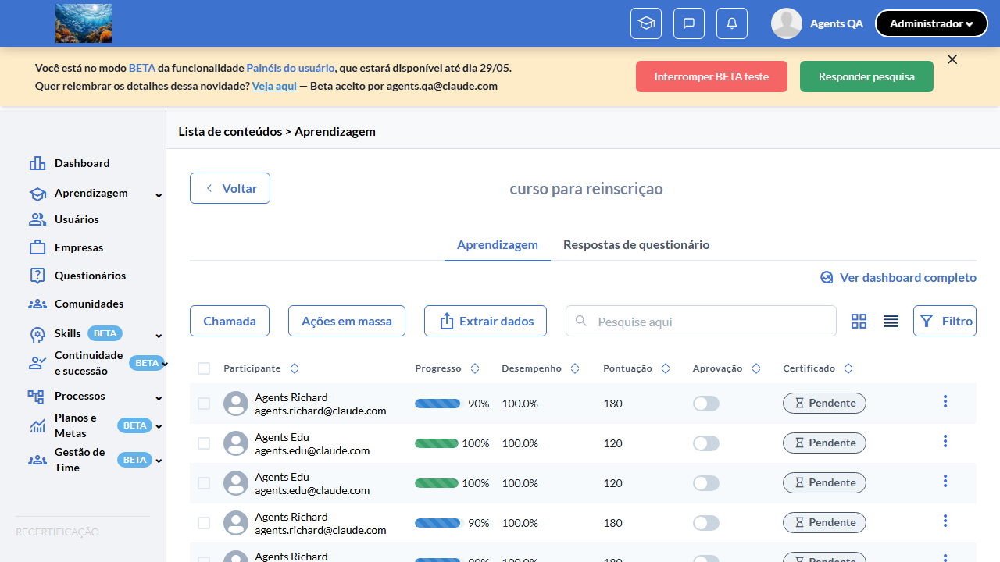
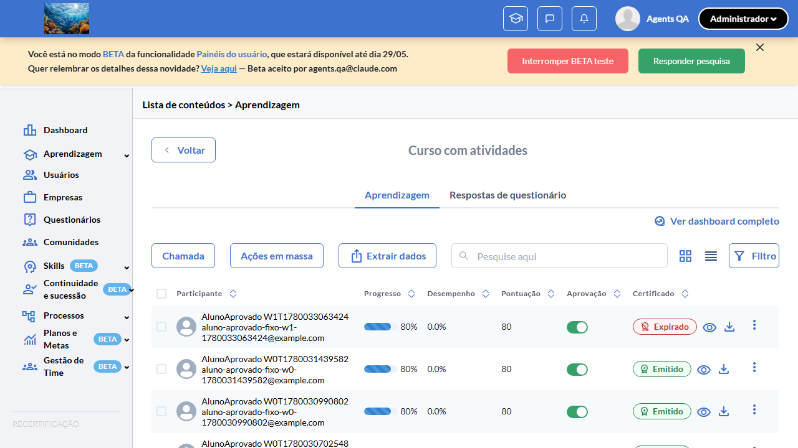
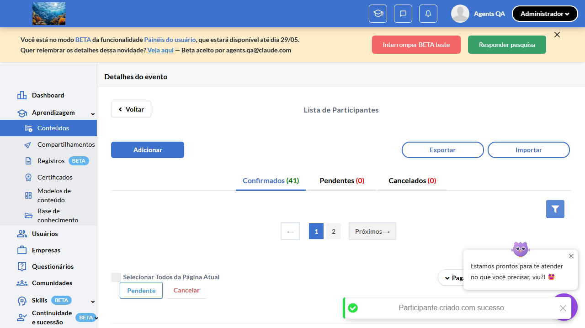
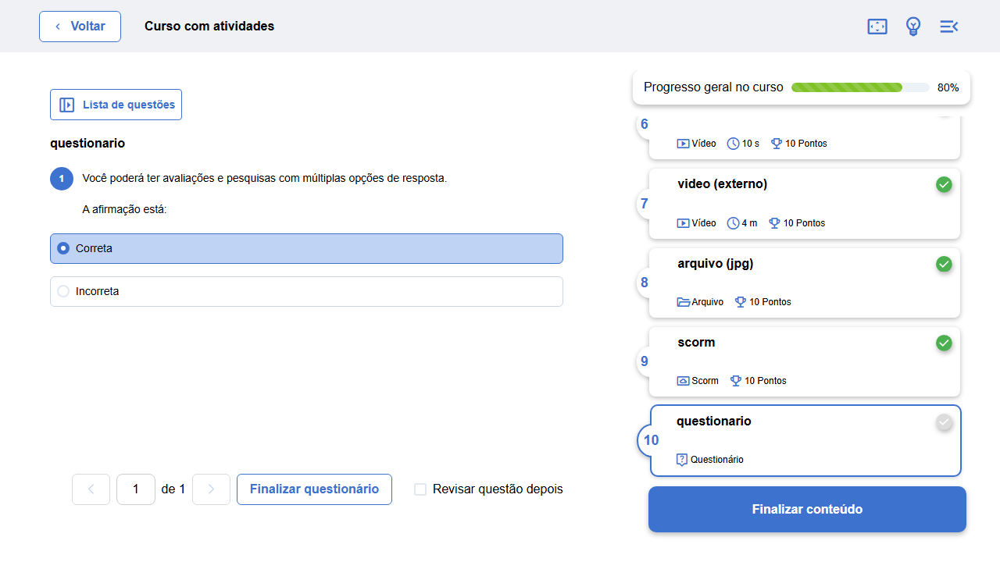
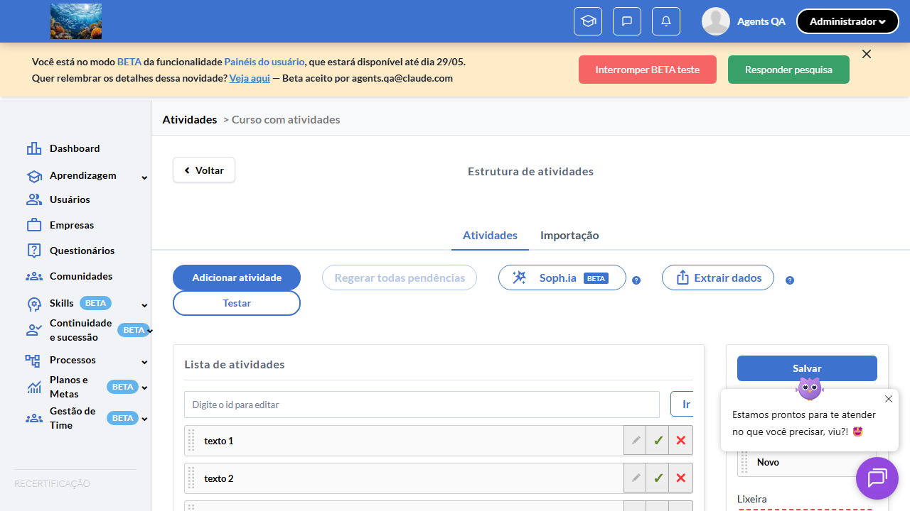
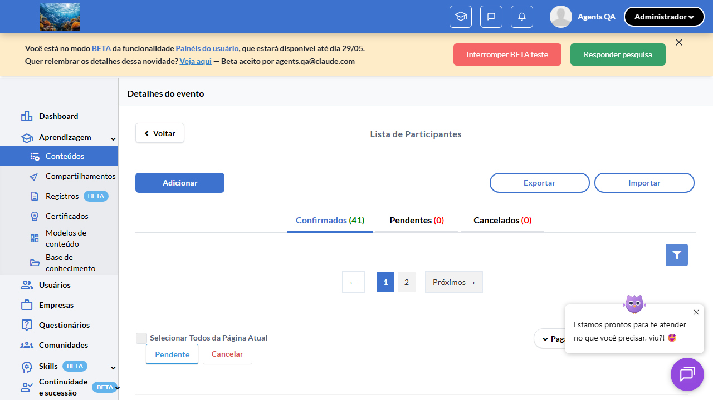
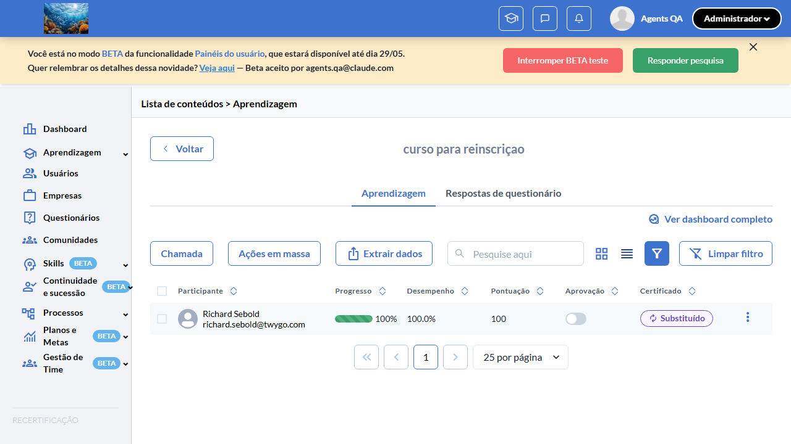

# Casos de teste — Recertificação

[← Voltar ao dashboard](index.md)

Lista detalhada por testsuite. Cada caso traz: o que era esperado pelo XML, quais steps foram executados, evidências (screenshots/trace), texto pronto pra registro de bug e — quando houver falha — uma explicação em PT-BR do motivo.

## Ciclo de Vida do Certificado Substituído

_4 caso(s) — 3 aprovado(s), 0 falha(s), 1 ignorado(s)_

### ✅ Aprovado · TC1 · Após emitir novo certificado, anteriores são marcados em lote como REPLACED · 🔴 Crítico

<a id="tc1-apos-emitir-novo-certificado-anteriores-sao-marcados-em-lote-como-replaced"></a>_Arquivo:_ `tc1-novo-certificado-anteriores-replaced.spec.ts` · _Duração:_ 22.40s · _Browser:_ chromium

**Sumário (objetivo do caso):** Validar `CertificateGenerationService#replace_previous_certificates_bulk`: ao emitir certificado VALID para participant reinscrito (`recertification_number > 0`), todos os certificados VALID anteriores do mesmo par `(user_id, event_id)` viram REPLACED em uma única query `update_all` (RN 20, 21).

**Pré-condições:**

```
Feature flag `:recertificacao` ATIVA
Curso "Curso Certificado Reinscrição w{workerIndex}" com `has_recertification = true`
Aluno com `recertification_number = 0` aprovado e certificado emitido (`CERTIFICATE_VALID = 2`)
Cron `ExpiresCertificates` configurado para staging
```

**Passos do caso (XML/TestLink + execução Playwright):**

_Cada linha reproduz um passo do XML; a coluna **Status** traz o resultado da execução (do step Allure correspondente). Linhas com "Pré-condição" são da execução automatizada (login, navegação inicial) — não fazem parte do roteiro do XML._

| # | Ação do passo | Resultado esperado | Status | Notas | Duração |
|---|---|---|:---:|---|---:|
| 1 | Pré-condição: aluno aprovado com `recertification_number = 0` e certificado `VALID` emitido. | Estado validado no banco: 1 row em `certificates` com `situation = 2 (VALID)`. | ✅ | — | 11.69s |
| 2 | Reinscrever o aluno individualmente pelo fluxo da suíte 2 TC3 | Novo participant criado com `recertification_number = 1`. | ✅ | — | 0.32s |
| 3 | Simular conclusão do conteúdo pelo novo participant: `progress_score = 100` | Certificado novo é emitido (queue de geração de certificados). | ✅ | — | 0.56s |
| 4 | Aguardar até 60 segundos e consultar tabela `certificates` para o par `(user_id, event_id)` | 2 rows: certificado anterior com `situation = 4 (REPLACED)` e certificado novo com `situation = 2 (VALID)`. | ✅ | — | 0.09s |

**Evidências:**

📁 _Pasta:_ [`artifacts/projects-recertificacao-te-87ef1-cados-em-lote-como-REPLACED-chromium/`](artifacts/projects-recertificacao-te-87ef1-cados-em-lote-como-REPLACED-chromium/)

- 📸 **Screenshot (screenshot)** — [`test-finished-1.png`](artifacts/projects-recertificacao-te-87ef1-cados-em-lote-como-REPLACED-chromium/test-finished-1.png)

  

- 🎬 [Vídeo da execução (video.webm)](artifacts/projects-recertificacao-te-87ef1-cados-em-lote-como-REPLACED-chromium/video.webm)

- 🎬 [Vídeo da execução (video-1.webm)](artifacts/projects-recertificacao-te-87ef1-cados-em-lote-como-REPLACED-chromium/video-1.webm)

- 📦 **Trace** — [`trace.zip`](artifacts/projects-recertificacao-te-87ef1-cados-em-lote-como-REPLACED-chromium/trace.zip)

  ```bash
  npx playwright show-trace outputs/recertificacao/reports/ciclo-de-vida-do-certificado-substituido_20260529-024117/artifacts/projects-recertificacao-te-87ef1-cados-em-lote-como-REPLACED-chromium/trace.zip
  ```

- 🎥 **Vídeo** — [`video.webm`](artifacts/projects-recertificacao-te-87ef1-cados-em-lote-como-REPLACED-chromium/video.webm)

- 🎥 **Vídeo** — [`video-1.webm`](artifacts/projects-recertificacao-te-87ef1-cados-em-lote-como-REPLACED-chromium/video-1.webm)


---

### ✅ Aprovado · TC2 — Worker ExpiresCertificates expira VALID e propaga para REPLACED do mesmo par 

<a id="tc2-worker-expirescertificates-expira-valid-e-propaga-para-replaced-do-mesmo-par"></a>_Arquivo:_ `tc2-worker-expires-certificates-propaga.spec.ts` · _Duração:_ 198.00s · _Browser:_ chromium

**Passos do caso (XML/TestLink + execução Playwright):**

_Cada linha reproduz um passo do XML; a coluna **Status** traz o resultado da execução (do step Allure correspondente). Linhas com "Pré-condição" são da execução automatizada (login, navegação inicial) — não fazem parte do roteiro do XML._

| # | Ação do passo | Resultado esperado | Status | Notas | Duração |
|---|---|---|:---:|---|---:|
| — | _Pré-condição:_ 1. Pré-condição: aluno aprovado com cert Emitido (fixture) — linha visível na Aprendizagem | — | ✅ | — | 10.76s |
| — | _Pré-condição:_ 2. Expirar certificado do aluno via menu kebab "Expirar certificado" → RN 22: expire_replaced_certificates processa o cert VALID e propaga REPLACED do par | — | ✅ | — | 1.30s |
| — | _Pré-condição:_ 3. Verificar na Aprendizagem que a linha do aluno agora exibe badge "Expirado" | — | ✅ | — | 15.41s |

**Evidências:**

📁 _Pasta:_ [`artifacts/projects-recertificacao-te-66afe--para-REPLACED-do-mesmo-par-chromium/`](artifacts/projects-recertificacao-te-66afe--para-REPLACED-do-mesmo-par-chromium/)

- 📸 **Screenshot (screenshot)** — [`test-finished-1.png`](artifacts/projects-recertificacao-te-66afe--para-REPLACED-do-mesmo-par-chromium/test-finished-1.png)

  

- 📸 **Screenshot (screenshot)** — [`test-finished-2.png`](artifacts/projects-recertificacao-te-66afe--para-REPLACED-do-mesmo-par-chromium/test-finished-2.png)

  

- 📸 **Screenshot (screenshot)** — [`test-finished-3.png`](artifacts/projects-recertificacao-te-66afe--para-REPLACED-do-mesmo-par-chromium/test-finished-3.png)

  

- 📸 **Screenshot (screenshot)** — [`test-finished-4.png`](artifacts/projects-recertificacao-te-66afe--para-REPLACED-do-mesmo-par-chromium/test-finished-4.png)

  

- 📸 **Screenshot (screenshot)** — [`test-finished-5.png`](artifacts/projects-recertificacao-te-66afe--para-REPLACED-do-mesmo-par-chromium/test-finished-5.png)

  

- 🎬 [Vídeo da execução (video.webm)](artifacts/projects-recertificacao-te-66afe--para-REPLACED-do-mesmo-par-chromium/video.webm)

- 🎬 [Vídeo da execução (video-1.webm)](artifacts/projects-recertificacao-te-66afe--para-REPLACED-do-mesmo-par-chromium/video-1.webm)

- 📦 **Trace** — [`trace.zip`](artifacts/projects-recertificacao-te-66afe--para-REPLACED-do-mesmo-par-chromium/trace.zip)

  ```bash
  npx playwright show-trace outputs/recertificacao/reports/ciclo-de-vida-do-certificado-substituido_20260529-024117/artifacts/projects-recertificacao-te-66afe--para-REPLACED-do-mesmo-par-chromium/trace.zip
  ```

- 🎥 **Vídeo** — [`video.webm`](artifacts/projects-recertificacao-te-66afe--para-REPLACED-do-mesmo-par-chromium/video.webm)

- 🎥 **Vídeo** — [`video-1.webm`](artifacts/projects-recertificacao-te-66afe--para-REPLACED-do-mesmo-par-chromium/video-1.webm)


---

### ⊘ Ignorado · TC3 — Constante CERTIFICATE_REPLACED = 4 espelhada em EventParticipant::REPLACED 

<a id="tc3-constante-certificate-replaced-4-espelhada-em-eventparticipant-replaced"></a>_Arquivo:_ `tc3-constante-certificate-replaced-4.spec.ts` · _Duração:_ 0.00s · _Browser:_ chromium

> **⊘ Por que foi ignorado:** Marcado para revisão (test.fixme): TC declarado Tipo: db no MD canônico (test-analysis.md §TC3). Validação de constantes Rails (Certificate::CERTIFICATE_REPLACED, EventParticipant::REPLACED) exige Rails console em staging — fora do escopo Playwright. Executor futuro: agent-db (CONTRACT.md V2).

**Passos do caso (XML/TestLink + execução Playwright):**

_Cada linha reproduz um passo do XML; a coluna **Status** traz o resultado da execução (do step Allure correspondente). Linhas com "Pré-condição" são da execução automatizada (login, navegação inicial) — não fazem parte do roteiro do XML._

_Sem steps Allure ou metadata XML para este testcase._

**Evidências:**

_Sem evidências anexadas._

#### ⏳ Pendente — execução automatizada não realizada

- **Severidade do caso (XML):** —
- **Motivo declarado pelo spec:** TC declarado Tipo: db no MD canônico (test-analysis.md §TC3). Validação de constantes Rails (Certificate::CERTIFICATE_REPLACED, EventParticipant::REPLACED) exige Rails console em staging — fora do escopo Playwright. Executor futuro: agent-db (CONTRACT.md V2).
- **Categoria:** _não declarada_ — pra próxima revisão, ajustar o spec para `test.fixme(true, '[Categoria] motivo')` com uma das categorias canônicas (xml-desatualizado | seed-ausente | dep-externa | bloqueio-temporario).

**Roteiro do XML (para validação manual):**
1. — (sem steps documentados no XML)

> Esse caso não bloqueia a build, mas precisa de validação manual ou ajuste no agente.


---

### ✅ Aprovado · TC4 · Certificados emitidos no fluxo legado (sem reinscrição) permanecem VALID indefinidamente · 🔴 Crítico

<a id="tc4-certificados-emitidos-no-fluxo-legado-sem-reinscricao-permanecem-valid-indefinidamente"></a>_Arquivo:_ `tc4-certificados-legado-permanecem-valid.spec.ts` · _Duração:_ 29.65s · _Browser:_ chromium

**Sumário (objetivo do caso):** Validar comportamento regressivo: aluno com `recertification_number = 0` que concluiu o curso e recebeu VALID NÃO tem o certificado marcado como REPLACED sem reinscrição (RN 20, 21).

**Pré-condições:**

```
Feature flag `:recertificacao` ATIVA
Curso "Curso Certificado Reinscrição w{workerIndex}" com `has_recertification = true`
Aluno com `recertification_number = 0` aprovado e certificado emitido (`CERTIFICATE_VALID = 2`)
Cron `ExpiresCertificates` configurado para staging
```

**Passos do caso (XML/TestLink + execução Playwright):**

_Cada linha reproduz um passo do XML; a coluna **Status** traz o resultado da execução (do step Allure correspondente). Linhas com "Pré-condição" são da execução automatizada (login, navegação inicial) — não fazem parte do roteiro do XML._

| # | Ação do passo | Resultado esperado | Status | Notas | Duração |
|---|---|---|:---:|---|---:|
| 1 | Pré-condição: aluno com `recertification_number = 0` aprovado e VALID emitido. | Estado preparado. | ✅ | — | 11.96s |
| 2 | Esperar 1 hora (ou re-rodar cron de geração de certificados) sem disparar reinscrição. | Cron de geração processa outros casos. | ✅ | — | 0.61s |
| 3 | Consultar tabela `certificates` | Certificado do aluno continua com `situation = 2 (VALID)`. Não foi marcado como REPLACED. | ✅ | — | 5.40s |

**Evidências:**

📁 _Pasta:_ [`artifacts/projects-recertificacao-te-8b492-necem-VALID-indefinidamente-chromium/`](artifacts/projects-recertificacao-te-8b492-necem-VALID-indefinidamente-chromium/)

- 📸 **Screenshot (screenshot)** — [`test-finished-1.png`](artifacts/projects-recertificacao-te-8b492-necem-VALID-indefinidamente-chromium/test-finished-1.png)

  

- 🎬 [Vídeo da execução (video.webm)](artifacts/projects-recertificacao-te-8b492-necem-VALID-indefinidamente-chromium/video.webm)

- 🎬 [Vídeo da execução (video-1.webm)](artifacts/projects-recertificacao-te-8b492-necem-VALID-indefinidamente-chromium/video-1.webm)

- 📦 **Trace** — [`trace.zip`](artifacts/projects-recertificacao-te-8b492-necem-VALID-indefinidamente-chromium/trace.zip)

  ```bash
  npx playwright show-trace outputs/recertificacao/reports/ciclo-de-vida-do-certificado-substituido_20260529-024117/artifacts/projects-recertificacao-te-8b492-necem-VALID-indefinidamente-chromium/trace.zip
  ```

- 🎥 **Vídeo** — [`video.webm`](artifacts/projects-recertificacao-te-8b492-necem-VALID-indefinidamente-chromium/video.webm)

- 🎥 **Vídeo** — [`video-1.webm`](artifacts/projects-recertificacao-te-8b492-necem-VALID-indefinidamente-chromium/video-1.webm)


---
