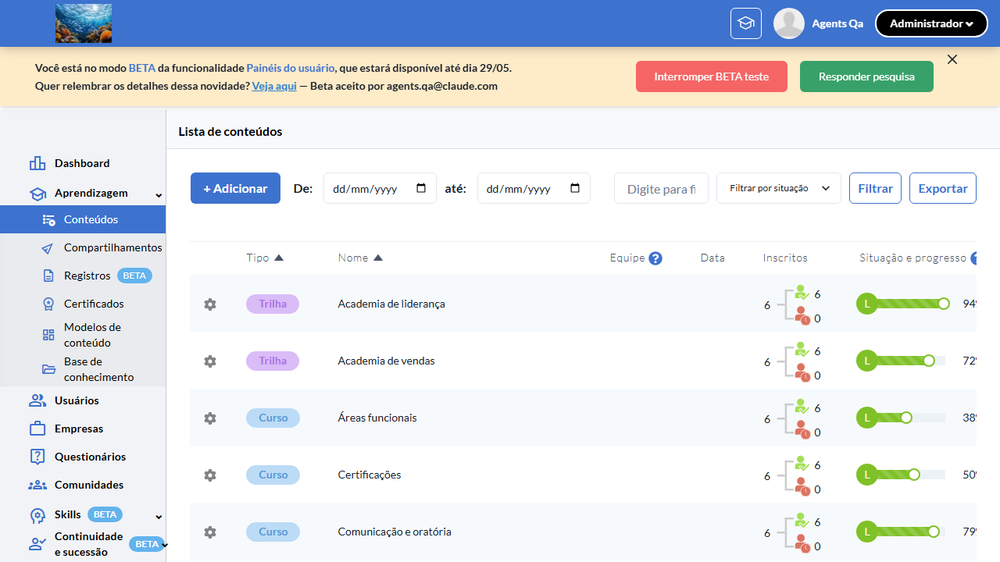
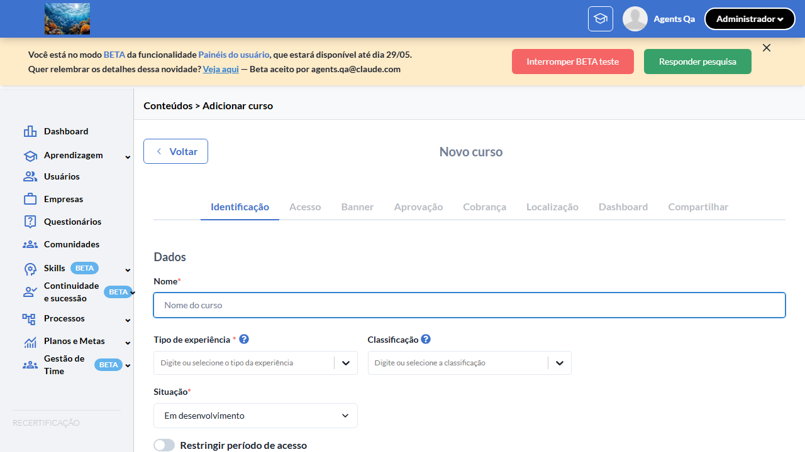
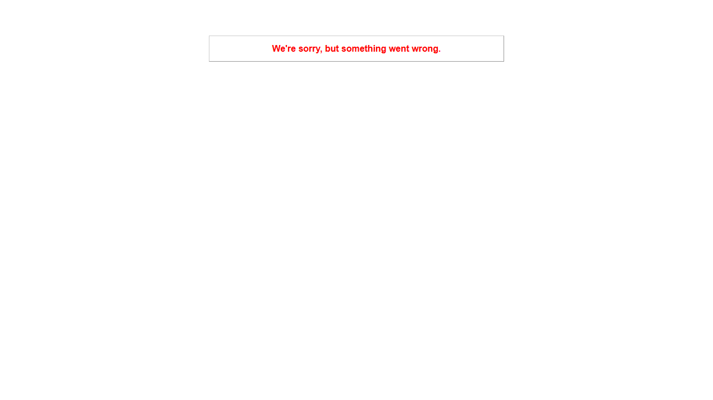

# Casos de teste — Recertificação

[← Voltar ao dashboard](index.md)

Lista detalhada por testsuite. Cada caso traz: o que era esperado pelo XML, quais steps foram executados, evidências (screenshots/trace), texto pronto pra registro de bug e — quando houver falha — uma explicação em PT-BR do motivo.

## Configuração de Conteúdo (Switch "Habilitar reinscrição")

_5 caso(s) — 0 aprovado(s), 4 falha(s), 1 ignorado(s)_

### ❌ Falhou · TC1 — Switch "Habilitar reinscrição" aparece com flag ON na edição de curso 

<a id="tc1-switch-habilitar-reinscricao-aparece-com-flag-on-na-edicao-de-curso"></a>_Arquivo:_ `tc1-switch-aparece-com-flag-on.spec.ts` · _Duração:_ 41.92s · _Browser:_ chromium

> **❌ Por que falhou:** A condição esperada não se tornou verdadeira dentro do tempo limite — a UI não chegou ao estado aguardado.
> _Step impactado:_ **3. Clicar em "Editar" no menu de ações do curso → página de edição é exibida**

**Passos do caso (XML/TestLink + execução Playwright):**

_Cada linha reproduz um passo do XML; a coluna **Status** traz o resultado da execução (do step Allure correspondente). Linhas com "Pré-condição" são da execução automatizada (login, navegação inicial) — não fazem parte do roteiro do XML._

| # | Ação do passo | Resultado esperado | Status | Notas | Duração |
|---|---|---|:---:|---|---:|
| — | _Pré-condição:_ 1. Acessar a URL "/o/{orgId}/dashboard" | — | ✅ | — | 8.39s |
| — | _Pré-condição:_ 2. Navegar até a listagem de cursos da organização | — | ✅ | — | 9.31s |
| — | _Pré-condição:_ 3. Clicar em "Editar" no menu de ações do curso → página de edição é exibida | — | ❌ | A condição esperada não se tornou verdadeira dentro do tempo limite — a UI não chegou ao estado aguardado. | 13.38s |

**Evidências:**

📁 _Pasta:_ [`artifacts/projects-recertificacao-te-d835b--flag-ON-na-edição-de-curso-chromium/`](artifacts/projects-recertificacao-te-d835b--flag-ON-na-edição-de-curso-chromium/)

- 📸 **Screenshot (screenshot)** — [`test-finished-1.png`](artifacts/projects-recertificacao-te-d835b--flag-ON-na-edição-de-curso-chromium/test-finished-1.png)

  

- 📸 **Screenshot (screenshot)** — [`test-failed-2.png`](artifacts/projects-recertificacao-te-d835b--flag-ON-na-edição-de-curso-chromium/test-failed-2.png)

  

- 📸 **Screenshot (screenshot)** — [`test-failed-3.png`](artifacts/projects-recertificacao-te-d835b--flag-ON-na-edição-de-curso-chromium/test-failed-3.png)

  

- 🎬 [Vídeo da execução (video.webm)](artifacts/projects-recertificacao-te-d835b--flag-ON-na-edição-de-curso-chromium/video.webm)

- 🎬 [Vídeo da execução (video-1.webm)](artifacts/projects-recertificacao-te-d835b--flag-ON-na-edição-de-curso-chromium/video-1.webm)

- 📦 **Trace** — [`trace.zip`](artifacts/projects-recertificacao-te-d835b--flag-ON-na-edição-de-curso-chromium/trace.zip)

  ```bash
  npx playwright show-trace outputs/recertificacao/reports/configuracao-de-conteudo-switch-habilitar-reinscricao_20260526-155233/artifacts/projects-recertificacao-te-d835b--flag-ON-na-edição-de-curso-chromium/trace.zip
  ```

- 🎥 **Vídeo** — [`video.webm`](artifacts/projects-recertificacao-te-d835b--flag-ON-na-edição-de-curso-chromium/video.webm)

- 🎥 **Vídeo** — [`video-1.webm`](artifacts/projects-recertificacao-te-d835b--flag-ON-na-edição-de-curso-chromium/video-1.webm)

- 📄 **DOM no momento da falha** — [`error-context.md`](artifacts/projects-recertificacao-te-d835b--flag-ON-na-edição-de-curso-chromium/error-context.md)

#### 🐛 Pronto para registro de bug

> 🧪 **Análise automática:** Spec frágil (problema no teste, não no produto) · Confiança 🟡 media
> _Por quê:_ Timeout sem HTTP error — possível wait/seletor frágil. Confirmar via chrome-mcp
> _Bug-report estruturado:_ [`bug-reports/configuracao-de-conteudo-switch-habilitar-reinscricao__tc1-switch-habilitar-reinscricao-aparece-com-flag-on-na-edicao-de-curso.md`](bug-reports/configuracao-de-conteudo-switch-habilitar-reinscricao__tc1-switch-habilitar-reinscricao-aparece-com-flag-on-na-edicao-de-curso.md)

**Próximas ações sugeridas:**
- Inspecionar o trace (`npx playwright show-trace`) para confirmar que o elemento existe mas o seletor/timing falhou.
- Avaliar se o spec viola algum dos 3 padrões da skill `criar-spec-resiliente-twygo` (count de seed, timing pós-hidratação, retry de rede).
- Disparar o healer (`playwright-test-healer`) para corrigir seletor/timing/asserção SEM alterar a intenção do teste.

**Descrição do BUG:** [—] TC1 — Switch "Habilitar reinscrição" aparece com flag ON na edição de curso — A condição esperada não se tornou verdadeira dentro do tempo limite — a UI não chegou ao estado aguardado.

**Passo a passo para reprodução:**
1. — (sem steps documentados no XML)

**Comportamento esperado:** —

**Comportamento atual:** A condição esperada não se tornou verdadeira dentro do tempo limite — a UI não chegou ao estado aguardado. (falha aconteceu no passo 3: "Clicar em "Editar" no menu de ações do curso → página de edição é exibida")

**Informações:**

| Campo | Valor |
|---|---|
| URL | `https://recertificacao-testeqa.stage.twygoead.com/` |
| Login | Credenciais via env: `TWYGO_STAGING_RECERTIFICACAO_EMAIL` (consulte `.env`) |
| Senha | Credenciais via env: `TWYGO_STAGING_RECERTIFICACAO_PASSWORD` (consulte `.env`) |
| orgId | — |
| Outros | Browser: chromium |
| Outros | runId: configuracao-de-conteudo-switch-habilitar-reinscricao_20260526-155233 |
| Outros | Duração até a falha: 41.92s |
| Outros | Step impactado: 3. Clicar em "Editar" no menu de ações do curso → página de edição é exibida |

**Evidências:**

- Screenshot capturado pelo Playwright (screenshot): artifacts/projects-recertificacao-te-d835b--flag-ON-na-edição-de-curso-chromium/test-finished-1.png
- Screenshot capturado pelo Playwright (screenshot): artifacts/projects-recertificacao-te-d835b--flag-ON-na-edição-de-curso-chromium/test-failed-2.png
- Vídeo da execução (video-1.webm): artifacts/projects-recertificacao-te-d835b--flag-ON-na-edição-de-curso-chromium/video-1.webm
- Vídeo da execução (video.webm): artifacts/projects-recertificacao-te-d835b--flag-ON-na-edição-de-curso-chromium/video.webm
- Snapshot do DOM/contexto da página (error-context.md): artifacts/projects-recertificacao-te-d835b--flag-ON-na-edição-de-curso-chromium/error-context.md
- Screenshot capturado pelo Playwright (screenshot): artifacts/projects-recertificacao-te-d835b--flag-ON-na-edição-de-curso-chromium/test-failed-3.png
- Snapshot do DOM/contexto da página (error-context.md): artifacts/projects-recertificacao-te-d835b--flag-ON-na-edição-de-curso-chromium/error-context.md
- Trace completo do Playwright (.zip) — `npx playwright show-trace`: artifacts/projects-recertificacao-te-d835b--flag-ON-na-edição-de-curso-chromium/trace.zip

<details><summary>📋 Ver texto agregado para copiar (Jira/GitHub/Linear)</summary>

```
Descrição do BUG
[—] TC1 — Switch "Habilitar reinscrição" aparece com flag ON na edição de curso — A condição esperada não se tornou verdadeira dentro do tempo limite — a UI não chegou ao estado aguardado.

Passo a passo para reprodução
  — (sem steps documentados no XML)

Comportamento esperado
—

Comportamento atual
A condição esperada não se tornou verdadeira dentro do tempo limite — a UI não chegou ao estado aguardado. (falha aconteceu no passo 3: "Clicar em "Editar" no menu de ações do curso → página de edição é exibida")

Informações
- URL: https://recertificacao-testeqa.stage.twygoead.com/
- Login: Credenciais via env: `TWYGO_STAGING_RECERTIFICACAO_EMAIL` (consulte `.env`)
- Senha: Credenciais via env: `TWYGO_STAGING_RECERTIFICACAO_PASSWORD` (consulte `.env`)
- ID do ambiente (orgId): —
- Outros:
  - Browser: chromium
  - runId: configuracao-de-conteudo-switch-habilitar-reinscricao_20260526-155233
  - Duração até a falha: 41.92s
  - Step impactado: 3. Clicar em "Editar" no menu de ações do curso → página de edição é exibida

Evidências
- Screenshot capturado pelo Playwright (screenshot): artifacts/projects-recertificacao-te-d835b--flag-ON-na-edição-de-curso-chromium/test-finished-1.png
- Screenshot capturado pelo Playwright (screenshot): artifacts/projects-recertificacao-te-d835b--flag-ON-na-edição-de-curso-chromium/test-failed-2.png
- Vídeo da execução (video-1.webm): artifacts/projects-recertificacao-te-d835b--flag-ON-na-edição-de-curso-chromium/video-1.webm
- Vídeo da execução (video.webm): artifacts/projects-recertificacao-te-d835b--flag-ON-na-edição-de-curso-chromium/video.webm
- Snapshot do DOM/contexto da página (error-context.md): artifacts/projects-recertificacao-te-d835b--flag-ON-na-edição-de-curso-chromium/error-context.md
- Screenshot capturado pelo Playwright (screenshot): artifacts/projects-recertificacao-te-d835b--flag-ON-na-edição-de-curso-chromium/test-failed-3.png
- Snapshot do DOM/contexto da página (error-context.md): artifacts/projects-recertificacao-te-d835b--flag-ON-na-edição-de-curso-chromium/error-context.md
- Trace completo do Playwright (.zip) — `npx playwright show-trace`: artifacts/projects-recertificacao-te-d835b--flag-ON-na-edição-de-curso-chromium/trace.zip

Execução
- runId: configuracao-de-conteudo-switch-habilitar-reinscricao_20260526-155233
- environment.json: staging-recertificacao
- testsuite: Configuração de Conteúdo (Switch "Habilitar reinscrição")
- testcase: TC1 — Switch "Habilitar reinscrição" aparece com flag ON na edição de curso

```

</details>

<details><summary>🔧 Stack trace técnica completa (para desenvolvedor)</summary>

```
TimeoutError: locator.waitFor: Timeout 5000ms exceeded.
Call log:
  - waiting for getByRole('row', { name: /Curso Recertificação TC1 w0-1779821457369/i }).first().locator('img[alt="Options" i], [role="button"][aria-label*="Options" i], [role="button"][aria-label*="Opções" i]').first() to be visible

```

</details>

---

### ⊘ Ignorado · TC2 — Switch "Habilitar reinscrição" NÃO aparece com flag OFF (regressão) 

<a id="tc2-switch-habilitar-reinscricao-nao-aparece-com-flag-off-regressao"></a>_Arquivo:_ `tc2-switch-nao-aparece-com-flag-off.spec.ts` · _Duração:_ 0.00s · _Browser:_ chromium

> **⊘ Por que foi ignorado:** Marcado para revisão (test.fixme): requer toggle runtime da flag :recertificacao — assumido ON em staging-base-de-conhecimento. Validar manualmente OFF.

**Passos do caso (XML/TestLink + execução Playwright):**

_Cada linha reproduz um passo do XML; a coluna **Status** traz o resultado da execução (do step Allure correspondente). Linhas com "Pré-condição" são da execução automatizada (login, navegação inicial) — não fazem parte do roteiro do XML._

_Sem steps Allure ou metadata XML para este testcase._

**Evidências:**

_Sem evidências anexadas._

#### ⏳ Pendente — execução automatizada não realizada

- **Severidade do caso (XML):** —
- **Motivo declarado pelo spec:** requer toggle runtime da flag :recertificacao — assumido ON em staging-base-de-conhecimento. Validar manualmente OFF.
- **Categoria:** _não declarada_ — pra próxima revisão, ajustar o spec para `test.fixme(true, '[Categoria] motivo')` com uma das categorias canônicas (xml-desatualizado | seed-ausente | dep-externa | bloqueio-temporario).

**Roteiro do XML (para validação manual):**
1. — (sem steps documentados no XML)

> Esse caso não bloqueia a build, mas precisa de validação manual ou ajuste no agente.


---

### ❌ Falhou · TC3 — Ativar e salvar o switch persiste `has_recertification = true` 

<a id="tc3-ativar-e-salvar-o-switch-persiste-has-recertification-true"></a>_Arquivo:_ `tc3-ativar-e-salvar-persiste.spec.ts` · _Duração:_ 0.00s · _Browser:_ chromium

> **❌ Por que falhou:** A condição esperada não se tornou verdadeira dentro do tempo limite — a UI não chegou ao estado aguardado.

**Passos do caso (XML/TestLink + execução Playwright):**

_Cada linha reproduz um passo do XML; a coluna **Status** traz o resultado da execução (do step Allure correspondente). Linhas com "Pré-condição" são da execução automatizada (login, navegação inicial) — não fazem parte do roteiro do XML._

_Sem steps Allure ou metadata XML para este testcase._

**Evidências:**

📁 _Pasta:_ [`artifacts/projects-recertificacao-te-ccb33-e-has-recertification-true--chromium/`](artifacts/projects-recertificacao-te-ccb33-e-has-recertification-true--chromium/)

- 📸 **Screenshot (screenshot)** — [`test-failed-1.png`](artifacts/projects-recertificacao-te-ccb33-e-has-recertification-true--chromium/test-failed-1.png)

  

- 📦 **Trace** — [`trace.zip`](artifacts/projects-recertificacao-te-ccb33-e-has-recertification-true--chromium/trace.zip)

  ```bash
  npx playwright show-trace outputs/recertificacao/reports/configuracao-de-conteudo-switch-habilitar-reinscricao_20260526-155233/artifacts/projects-recertificacao-te-ccb33-e-has-recertification-true--chromium/trace.zip
  ```

- 📄 **DOM no momento da falha** — [`error-context.md`](artifacts/projects-recertificacao-te-ccb33-e-has-recertification-true--chromium/error-context.md)

#### 🐛 Pronto para registro de bug

> 🧪 **Análise automática:** Spec frágil (problema no teste, não no produto) · Confiança 🟡 media
> _Por quê:_ Timeout sem HTTP error — possível wait/seletor frágil. Confirmar via chrome-mcp
> _Bug-report estruturado:_ [`bug-reports/configuracao-de-conteudo-switch-habilitar-reinscricao__tc3-ativar-e-salvar-o-switch-persiste-has-recertification-true.md`](bug-reports/configuracao-de-conteudo-switch-habilitar-reinscricao__tc3-ativar-e-salvar-o-switch-persiste-has-recertification-true.md)

**Próximas ações sugeridas:**
- Inspecionar o trace (`npx playwright show-trace`) para confirmar que o elemento existe mas o seletor/timing falhou.
- Avaliar se o spec viola algum dos 3 padrões da skill `criar-spec-resiliente-twygo` (count de seed, timing pós-hidratação, retry de rede).
- Disparar o healer (`playwright-test-healer`) para corrigir seletor/timing/asserção SEM alterar a intenção do teste.

**Descrição do BUG:** [—] TC3 — Ativar e salvar o switch persiste `has_recertification = true` — A condição esperada não se tornou verdadeira dentro do tempo limite — a UI não chegou ao estado aguardado.

**Passo a passo para reprodução:**
1. — (sem steps documentados no XML)

**Comportamento esperado:** —

**Comportamento atual:** A condição esperada não se tornou verdadeira dentro do tempo limite — a UI não chegou ao estado aguardado.

**Informações:**

| Campo | Valor |
|---|---|
| URL | `https://recertificacao-testeqa.stage.twygoead.com/` |
| Login | Credenciais via env: `TWYGO_STAGING_RECERTIFICACAO_EMAIL` (consulte `.env`) |
| Senha | Credenciais via env: `TWYGO_STAGING_RECERTIFICACAO_PASSWORD` (consulte `.env`) |
| orgId | — |
| Outros | Browser: chromium |
| Outros | runId: configuracao-de-conteudo-switch-habilitar-reinscricao_20260526-155233 |
| Outros | Duração até a falha: 0.00s |

**Evidências:**

- Screenshot capturado pelo Playwright (screenshot): artifacts/projects-recertificacao-te-ccb33-e-has-recertification-true--chromium/test-failed-1.png
- Snapshot do DOM/contexto da página (error-context.md): artifacts/projects-recertificacao-te-ccb33-e-has-recertification-true--chromium/error-context.md
- Snapshot do DOM/contexto da página (error-context.md): artifacts/projects-recertificacao-te-ccb33-e-has-recertification-true--chromium/error-context.md
- Trace completo do Playwright (.zip) — `npx playwright show-trace`: artifacts/projects-recertificacao-te-ccb33-e-has-recertification-true--chromium/trace.zip

<details><summary>📋 Ver texto agregado para copiar (Jira/GitHub/Linear)</summary>

```
Descrição do BUG
[—] TC3 — Ativar e salvar o switch persiste `has_recertification = true` — A condição esperada não se tornou verdadeira dentro do tempo limite — a UI não chegou ao estado aguardado.

Passo a passo para reprodução
  — (sem steps documentados no XML)

Comportamento esperado
—

Comportamento atual
A condição esperada não se tornou verdadeira dentro do tempo limite — a UI não chegou ao estado aguardado.

Informações
- URL: https://recertificacao-testeqa.stage.twygoead.com/
- Login: Credenciais via env: `TWYGO_STAGING_RECERTIFICACAO_EMAIL` (consulte `.env`)
- Senha: Credenciais via env: `TWYGO_STAGING_RECERTIFICACAO_PASSWORD` (consulte `.env`)
- ID do ambiente (orgId): —
- Outros:
  - Browser: chromium
  - runId: configuracao-de-conteudo-switch-habilitar-reinscricao_20260526-155233
  - Duração até a falha: 0.00s

Evidências
- Screenshot capturado pelo Playwright (screenshot): artifacts/projects-recertificacao-te-ccb33-e-has-recertification-true--chromium/test-failed-1.png
- Snapshot do DOM/contexto da página (error-context.md): artifacts/projects-recertificacao-te-ccb33-e-has-recertification-true--chromium/error-context.md
- Snapshot do DOM/contexto da página (error-context.md): artifacts/projects-recertificacao-te-ccb33-e-has-recertification-true--chromium/error-context.md
- Trace completo do Playwright (.zip) — `npx playwright show-trace`: artifacts/projects-recertificacao-te-ccb33-e-has-recertification-true--chromium/trace.zip

Execução
- runId: configuracao-de-conteudo-switch-habilitar-reinscricao_20260526-155233
- environment.json: staging-recertificacao
- testsuite: Configuração de Conteúdo (Switch "Habilitar reinscrição")
- testcase: TC3 — Ativar e salvar o switch persiste `has_recertification = true`

```

</details>

<details><summary>🔧 Stack trace técnica completa (para desenvolvedor)</summary>

```
TimeoutError: locator.waitFor: Timeout 15000ms exceeded.
Call log:
  - waiting for getByRole('textbox', { name: /^Nome \*/ }) to be visible

```

</details>

---

### ❌ Falhou · TC4 — Desativar o switch em curso com participants reinscritos é permitido sem aviso 

<a id="tc4-desativar-o-switch-em-curso-com-participants-reinscritos-e-permitido-sem-aviso"></a>_Arquivo:_ `tc4-desativar-com-participants.spec.ts` · _Duração:_ 0.00s · _Browser:_ chromium

> **❌ Por que falhou:** A condição esperada não se tornou verdadeira dentro do tempo limite — a UI não chegou ao estado aguardado.

**Passos do caso (XML/TestLink + execução Playwright):**

_Cada linha reproduz um passo do XML; a coluna **Status** traz o resultado da execução (do step Allure correspondente). Linhas com "Pré-condição" são da execução automatizada (login, navegação inicial) — não fazem parte do roteiro do XML._

_Sem steps Allure ou metadata XML para este testcase._

**Evidências:**

📁 _Pasta:_ [`artifacts/projects-recertificacao-te-ad265-ritos-é-permitido-sem-aviso-chromium/`](artifacts/projects-recertificacao-te-ad265-ritos-é-permitido-sem-aviso-chromium/)

- 📸 **Screenshot (screenshot)** — [`test-failed-1.png`](artifacts/projects-recertificacao-te-ad265-ritos-é-permitido-sem-aviso-chromium/test-failed-1.png)

  

- 📸 **Screenshot (screenshot)** — [`test-failed-2.png`](artifacts/projects-recertificacao-te-ad265-ritos-é-permitido-sem-aviso-chromium/test-failed-2.png)

  

- 📦 **Trace** — [`trace.zip`](artifacts/projects-recertificacao-te-ad265-ritos-é-permitido-sem-aviso-chromium/trace.zip)

  ```bash
  npx playwright show-trace outputs/recertificacao/reports/configuracao-de-conteudo-switch-habilitar-reinscricao_20260526-155233/artifacts/projects-recertificacao-te-ad265-ritos-é-permitido-sem-aviso-chromium/trace.zip
  ```

- 📄 **DOM no momento da falha** — [`error-context.md`](artifacts/projects-recertificacao-te-ad265-ritos-é-permitido-sem-aviso-chromium/error-context.md)

#### 🐛 Pronto para registro de bug

> 🧪 **Análise automática:** Spec frágil (problema no teste, não no produto) · Confiança 🟡 media
> _Por quê:_ Timeout sem HTTP error — possível wait/seletor frágil. Confirmar via chrome-mcp
> _Bug-report estruturado:_ [`bug-reports/configuracao-de-conteudo-switch-habilitar-reinscricao__tc4-desativar-o-switch-em-curso-com-participants-reinscritos-e-permitido-sem-aviso.md`](bug-reports/configuracao-de-conteudo-switch-habilitar-reinscricao__tc4-desativar-o-switch-em-curso-com-participants-reinscritos-e-permitido-sem-aviso.md)

**Próximas ações sugeridas:**
- Inspecionar o trace (`npx playwright show-trace`) para confirmar que o elemento existe mas o seletor/timing falhou.
- Avaliar se o spec viola algum dos 3 padrões da skill `criar-spec-resiliente-twygo` (count de seed, timing pós-hidratação, retry de rede).
- Disparar o healer (`playwright-test-healer`) para corrigir seletor/timing/asserção SEM alterar a intenção do teste.

**Descrição do BUG:** [—] TC4 — Desativar o switch em curso com participants reinscritos é permitido sem aviso — A condição esperada não se tornou verdadeira dentro do tempo limite — a UI não chegou ao estado aguardado.

**Passo a passo para reprodução:**
1. — (sem steps documentados no XML)

**Comportamento esperado:** —

**Comportamento atual:** A condição esperada não se tornou verdadeira dentro do tempo limite — a UI não chegou ao estado aguardado.

**Informações:**

| Campo | Valor |
|---|---|
| URL | `https://recertificacao-testeqa.stage.twygoead.com/` |
| Login | Credenciais via env: `TWYGO_STAGING_RECERTIFICACAO_EMAIL` (consulte `.env`) |
| Senha | Credenciais via env: `TWYGO_STAGING_RECERTIFICACAO_PASSWORD` (consulte `.env`) |
| orgId | — |
| Outros | Browser: chromium |
| Outros | runId: configuracao-de-conteudo-switch-habilitar-reinscricao_20260526-155233 |
| Outros | Duração até a falha: 0.00s |

**Evidências:**

- Screenshot capturado pelo Playwright (screenshot): artifacts/projects-recertificacao-te-ad265-ritos-é-permitido-sem-aviso-chromium/test-failed-1.png
- Snapshot do DOM/contexto da página (error-context.md): artifacts/projects-recertificacao-te-ad265-ritos-é-permitido-sem-aviso-chromium/error-context.md
- Screenshot capturado pelo Playwright (screenshot): artifacts/projects-recertificacao-te-ad265-ritos-é-permitido-sem-aviso-chromium/test-failed-2.png
- Snapshot do DOM/contexto da página (error-context.md): artifacts/projects-recertificacao-te-ad265-ritos-é-permitido-sem-aviso-chromium/error-context.md
- Trace completo do Playwright (.zip) — `npx playwright show-trace`: artifacts/projects-recertificacao-te-ad265-ritos-é-permitido-sem-aviso-chromium/trace.zip

<details><summary>📋 Ver texto agregado para copiar (Jira/GitHub/Linear)</summary>

```
Descrição do BUG
[—] TC4 — Desativar o switch em curso com participants reinscritos é permitido sem aviso — A condição esperada não se tornou verdadeira dentro do tempo limite — a UI não chegou ao estado aguardado.

Passo a passo para reprodução
  — (sem steps documentados no XML)

Comportamento esperado
—

Comportamento atual
A condição esperada não se tornou verdadeira dentro do tempo limite — a UI não chegou ao estado aguardado.

Informações
- URL: https://recertificacao-testeqa.stage.twygoead.com/
- Login: Credenciais via env: `TWYGO_STAGING_RECERTIFICACAO_EMAIL` (consulte `.env`)
- Senha: Credenciais via env: `TWYGO_STAGING_RECERTIFICACAO_PASSWORD` (consulte `.env`)
- ID do ambiente (orgId): —
- Outros:
  - Browser: chromium
  - runId: configuracao-de-conteudo-switch-habilitar-reinscricao_20260526-155233
  - Duração até a falha: 0.00s

Evidências
- Screenshot capturado pelo Playwright (screenshot): artifacts/projects-recertificacao-te-ad265-ritos-é-permitido-sem-aviso-chromium/test-failed-1.png
- Snapshot do DOM/contexto da página (error-context.md): artifacts/projects-recertificacao-te-ad265-ritos-é-permitido-sem-aviso-chromium/error-context.md
- Screenshot capturado pelo Playwright (screenshot): artifacts/projects-recertificacao-te-ad265-ritos-é-permitido-sem-aviso-chromium/test-failed-2.png
- Snapshot do DOM/contexto da página (error-context.md): artifacts/projects-recertificacao-te-ad265-ritos-é-permitido-sem-aviso-chromium/error-context.md
- Trace completo do Playwright (.zip) — `npx playwright show-trace`: artifacts/projects-recertificacao-te-ad265-ritos-é-permitido-sem-aviso-chromium/trace.zip

Execução
- runId: configuracao-de-conteudo-switch-habilitar-reinscricao_20260526-155233
- environment.json: staging-recertificacao
- testsuite: Configuração de Conteúdo (Switch "Habilitar reinscrição")
- testcase: TC4 — Desativar o switch em curso com participants reinscritos é permitido sem aviso

```

</details>

<details><summary>🔧 Stack trace técnica completa (para desenvolvedor)</summary>

```
TimeoutError: locator.waitFor: Timeout 30000ms exceeded.
Call log:
  - waiting for locator('label.chakra-switch').filter({ has: getByRole('checkbox', { name: /Habilitar reinscrição/i }) }) to be visible

```

</details>

---

### ❌ Falhou · TC5 — Paridade do switch entre formulário HAML e formulário React (facelift) 

<a id="tc5-paridade-do-switch-entre-formulario-haml-e-formulario-react-facelift"></a>_Arquivo:_ `tc5-paridade-haml-react.spec.ts` · _Duração:_ 14.00s · _Browser:_ chromium

> **❌ Por que falhou:** O elemento esperado não apareceu na tela (locator: getByRole('checkbox', { name: /Habilitar reinscrição/i })).
> _Step impactado:_ **1. Editar o curso na tela HAML, ativar o switch e salvar → has_recertification = true**

**Passos do caso (XML/TestLink + execução Playwright):**

_Cada linha reproduz um passo do XML; a coluna **Status** traz o resultado da execução (do step Allure correspondente). Linhas com "Pré-condição" são da execução automatizada (login, navegação inicial) — não fazem parte do roteiro do XML._

| # | Ação do passo | Resultado esperado | Status | Notas | Duração |
|---|---|---|:---:|---|---:|
| — | _Pré-condição:_ 1. Editar o curso na tela HAML, ativar o switch e salvar → has_recertification = true | — | ❌ | O elemento esperado não apareceu na tela (locator: getByRole('checkbox', { name: /Habilitar reinscrição/i })). | 12.20s |

**Evidências:**

📁 _Pasta:_ [`artifacts/projects-recertificacao-te-254b9--formulário-React-facelift--chromium/`](artifacts/projects-recertificacao-te-254b9--formulário-React-facelift--chromium/)

- 📸 **Screenshot (screenshot)** — [`test-finished-1.png`](artifacts/projects-recertificacao-te-254b9--formulário-React-facelift--chromium/test-finished-1.png)

  

- 📸 **Screenshot (screenshot)** — [`test-failed-2.png`](artifacts/projects-recertificacao-te-254b9--formulário-React-facelift--chromium/test-failed-2.png)

  

- 📸 **Screenshot (screenshot)** — [`test-failed-3.png`](artifacts/projects-recertificacao-te-254b9--formulário-React-facelift--chromium/test-failed-3.png)

  

- 🎬 [Vídeo da execução (video.webm)](artifacts/projects-recertificacao-te-254b9--formulário-React-facelift--chromium/video.webm)

- 🎬 [Vídeo da execução (video-1.webm)](artifacts/projects-recertificacao-te-254b9--formulário-React-facelift--chromium/video-1.webm)

- 📦 **Trace** — [`trace.zip`](artifacts/projects-recertificacao-te-254b9--formulário-React-facelift--chromium/trace.zip)

  ```bash
  npx playwright show-trace outputs/recertificacao/reports/configuracao-de-conteudo-switch-habilitar-reinscricao_20260526-155233/artifacts/projects-recertificacao-te-254b9--formulário-React-facelift--chromium/trace.zip
  ```

- 🎥 **Vídeo** — [`video.webm`](artifacts/projects-recertificacao-te-254b9--formulário-React-facelift--chromium/video.webm)

- 🎥 **Vídeo** — [`video-1.webm`](artifacts/projects-recertificacao-te-254b9--formulário-React-facelift--chromium/video-1.webm)

- 📄 **DOM no momento da falha** — [`error-context.md`](artifacts/projects-recertificacao-te-254b9--formulário-React-facelift--chromium/error-context.md)

#### 🐛 Pronto para registro de bug

> ❓ **Análise automática:** Inconclusivo (precisa investigação manual) · Confiança 🔴 baixa
> _Por quê:_ Sem sinal Network in-scope ou padrão de erro conhecido — revisar trace
> _Bug-report estruturado:_ [`bug-reports/configuracao-de-conteudo-switch-habilitar-reinscricao__tc5-paridade-do-switch-entre-formulario-haml-e-formulario-react-facelift.md`](bug-reports/configuracao-de-conteudo-switch-habilitar-reinscricao__tc5-paridade-do-switch-entre-formulario-haml-e-formulario-react-facelift.md)

**Próximas ações sugeridas:**
- Sem evidência suficiente para classificar — abrir `trace.zip` (`npx playwright show-trace`) para ver passo a passo da execução.
- Reabrir o agente com o trace em mãos para reclassificar manualmente em uma das 4 categorias.

**Descrição do BUG:** [—] TC5 — Paridade do switch entre formulário HAML e formulário React (facelift) — O elemento esperado não apareceu na tela (locator: getByRole('checkbox', { name: /Habilitar reinscrição/i })).

**Passo a passo para reprodução:**
1. — (sem steps documentados no XML)

**Comportamento esperado:** —

**Comportamento atual:** O elemento esperado não apareceu na tela (locator: getByRole('checkbox', { name: /Habilitar reinscrição/i })). (falha aconteceu no passo 1: "Editar o curso na tela HAML, ativar o switch e salvar → has_recertification = true")

**Informações:**

| Campo | Valor |
|---|---|
| URL | `https://recertificacao-testeqa.stage.twygoead.com/` |
| Login | Credenciais via env: `TWYGO_STAGING_RECERTIFICACAO_EMAIL` (consulte `.env`) |
| Senha | Credenciais via env: `TWYGO_STAGING_RECERTIFICACAO_PASSWORD` (consulte `.env`) |
| orgId | — |
| Outros | Browser: chromium |
| Outros | runId: configuracao-de-conteudo-switch-habilitar-reinscricao_20260526-155233 |
| Outros | Duração até a falha: 14.00s |
| Outros | Step impactado: 1. Editar o curso na tela HAML, ativar o switch e salvar → has_recertification = true |

**Evidências:**

- Screenshot capturado pelo Playwright (screenshot): artifacts/projects-recertificacao-te-254b9--formulário-React-facelift--chromium/test-finished-1.png
- Screenshot capturado pelo Playwright (screenshot): artifacts/projects-recertificacao-te-254b9--formulário-React-facelift--chromium/test-failed-2.png
- Vídeo da execução (video.webm): artifacts/projects-recertificacao-te-254b9--formulário-React-facelift--chromium/video.webm
- Vídeo da execução (video-1.webm): artifacts/projects-recertificacao-te-254b9--formulário-React-facelift--chromium/video-1.webm
- Snapshot do DOM/contexto da página (error-context.md): artifacts/projects-recertificacao-te-254b9--formulário-React-facelift--chromium/error-context.md
- Screenshot capturado pelo Playwright (screenshot): artifacts/projects-recertificacao-te-254b9--formulário-React-facelift--chromium/test-failed-3.png
- Snapshot do DOM/contexto da página (error-context.md): artifacts/projects-recertificacao-te-254b9--formulário-React-facelift--chromium/error-context.md
- Trace completo do Playwright (.zip) — `npx playwright show-trace`: artifacts/projects-recertificacao-te-254b9--formulário-React-facelift--chromium/trace.zip

<details><summary>📋 Ver texto agregado para copiar (Jira/GitHub/Linear)</summary>

```
Descrição do BUG
[—] TC5 — Paridade do switch entre formulário HAML e formulário React (facelift) — O elemento esperado não apareceu na tela (locator: getByRole('checkbox', { name: /Habilitar reinscrição/i })).

Passo a passo para reprodução
  — (sem steps documentados no XML)

Comportamento esperado
—

Comportamento atual
O elemento esperado não apareceu na tela (locator: getByRole('checkbox', { name: /Habilitar reinscrição/i })). (falha aconteceu no passo 1: "Editar o curso na tela HAML, ativar o switch e salvar → has_recertification = true")

Informações
- URL: https://recertificacao-testeqa.stage.twygoead.com/
- Login: Credenciais via env: `TWYGO_STAGING_RECERTIFICACAO_EMAIL` (consulte `.env`)
- Senha: Credenciais via env: `TWYGO_STAGING_RECERTIFICACAO_PASSWORD` (consulte `.env`)
- ID do ambiente (orgId): —
- Outros:
  - Browser: chromium
  - runId: configuracao-de-conteudo-switch-habilitar-reinscricao_20260526-155233
  - Duração até a falha: 14.00s
  - Step impactado: 1. Editar o curso na tela HAML, ativar o switch e salvar → has_recertification = true

Evidências
- Screenshot capturado pelo Playwright (screenshot): artifacts/projects-recertificacao-te-254b9--formulário-React-facelift--chromium/test-finished-1.png
- Screenshot capturado pelo Playwright (screenshot): artifacts/projects-recertificacao-te-254b9--formulário-React-facelift--chromium/test-failed-2.png
- Vídeo da execução (video.webm): artifacts/projects-recertificacao-te-254b9--formulário-React-facelift--chromium/video.webm
- Vídeo da execução (video-1.webm): artifacts/projects-recertificacao-te-254b9--formulário-React-facelift--chromium/video-1.webm
- Snapshot do DOM/contexto da página (error-context.md): artifacts/projects-recertificacao-te-254b9--formulário-React-facelift--chromium/error-context.md
- Screenshot capturado pelo Playwright (screenshot): artifacts/projects-recertificacao-te-254b9--formulário-React-facelift--chromium/test-failed-3.png
- Snapshot do DOM/contexto da página (error-context.md): artifacts/projects-recertificacao-te-254b9--formulário-React-facelift--chromium/error-context.md
- Trace completo do Playwright (.zip) — `npx playwright show-trace`: artifacts/projects-recertificacao-te-254b9--formulário-React-facelift--chromium/trace.zip

Execução
- runId: configuracao-de-conteudo-switch-habilitar-reinscricao_20260526-155233
- environment.json: staging-recertificacao
- testsuite: Configuração de Conteúdo (Switch "Habilitar reinscrição")
- testcase: TC5 — Paridade do switch entre formulário HAML e formulário React (facelift)

```

</details>

<details><summary>🔧 Stack trace técnica completa (para desenvolvedor)</summary>

```
Error: expect(locator).toBeVisible() failed

Locator: getByRole('checkbox', { name: /Habilitar reinscrição/i })
Expected: visible
Timeout: 10000ms
Error: element(s) not found

Call log:
  - Expect "toBeVisible" with timeout 10000ms
  - waiting for getByRole('checkbox', { name: /Habilitar reinscrição/i })

```

</details>

---
