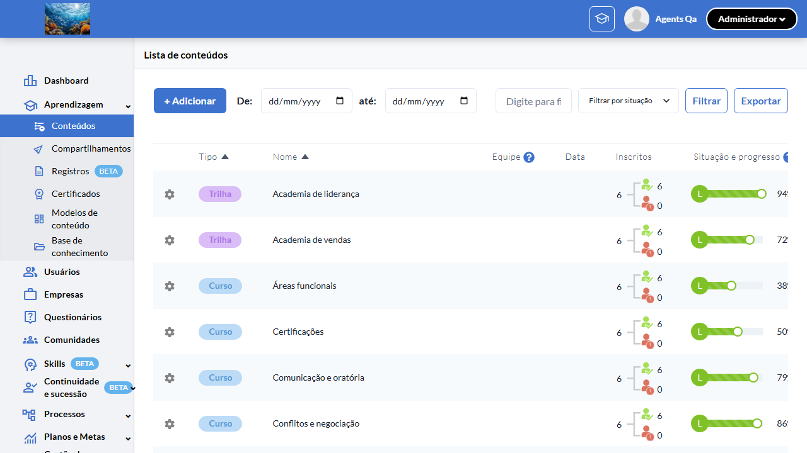
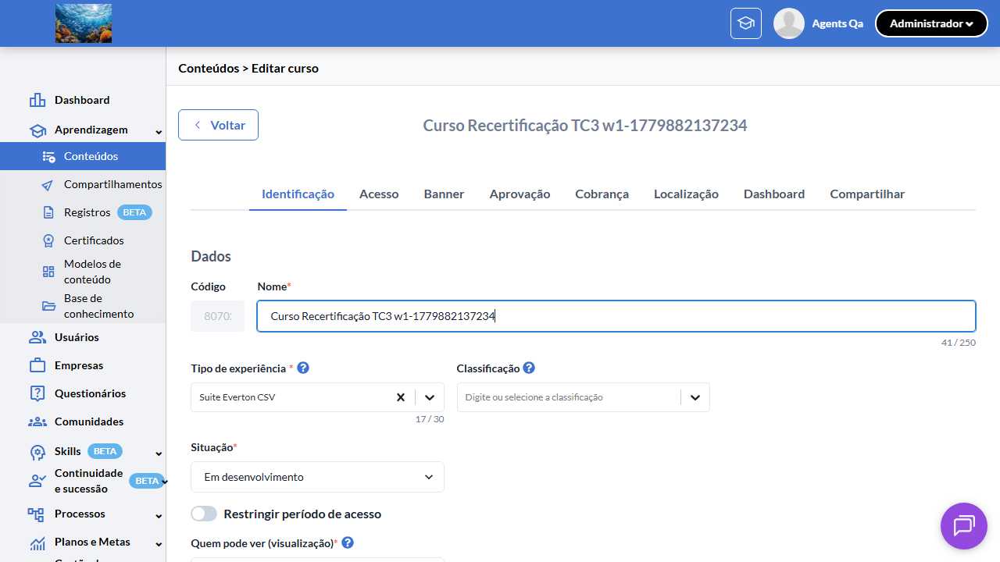
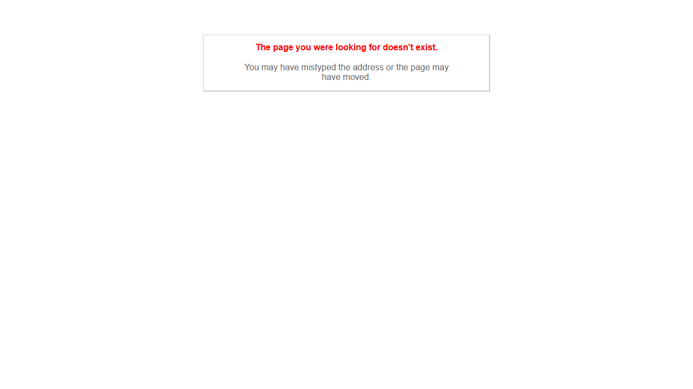
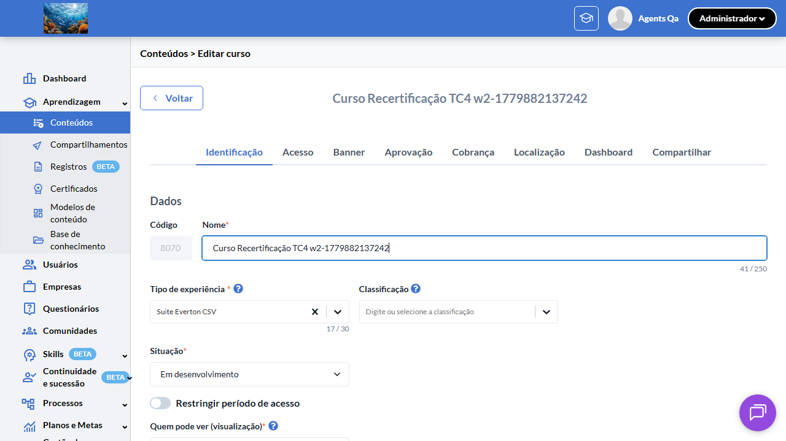
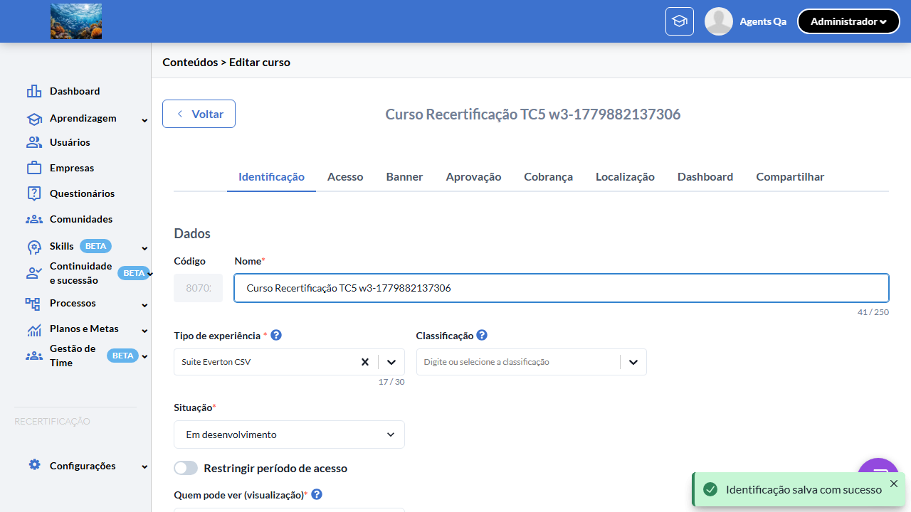
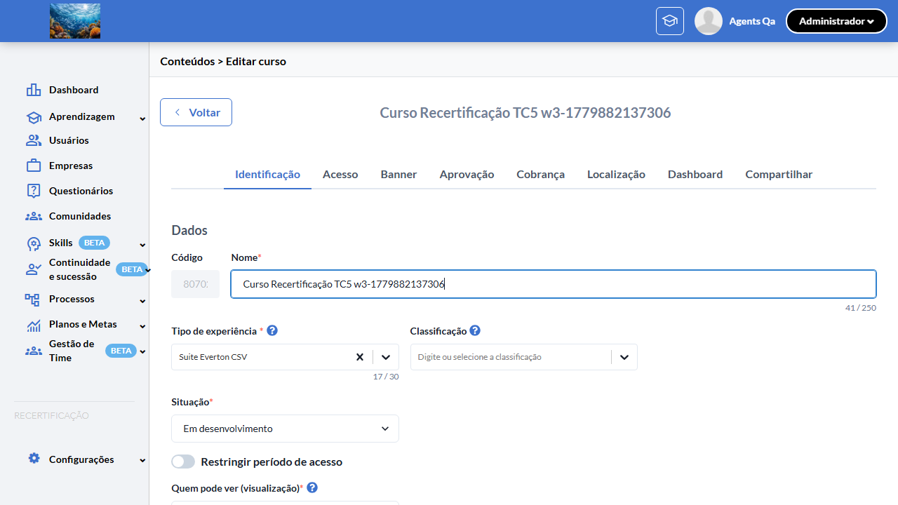

# Casos de teste — Recertificação

[← Voltar ao dashboard](index.md)

Lista detalhada por testsuite. Cada caso traz: o que era esperado pelo XML, quais steps foram executados, evidências (screenshots/trace), texto pronto pra registro de bug e — quando houver falha — uma explicação em PT-BR do motivo.

## Configuração de Conteúdo (Switch "Habilitar reinscrição")

_5 caso(s) — 0 aprovado(s), 4 falha(s), 1 ignorado(s)_

### ❌ Falhou · TC1 · Switch "Habilitar reinscrição" aparece com flag ON na edição de curso · 🔴 Crítico

<a id="tc1-switch-habilitar-reinscricao-aparece-com-flag-on-na-edicao-de-curso"></a>_Arquivo:_ `tc1-switch-aparece-com-flag-on.spec.ts` · _Duração:_ 35.32s · _Browser:_ chromium

> **❌ Por que falhou:** A condição esperada não se tornou verdadeira dentro do tempo limite — a UI não chegou ao estado aguardado.
> _Step impactado:_ **3. Clicar em "Gerenciar" no menu de ações do curso → página de edição é exibida**

**Sumário (objetivo do caso):** Validar que o switch "Habilitar reinscrição" é exibido na tela de edição do curso quando a feature flag `:recertificacao` está habilitada para a organização (RN 1, 1.1, 1.2, 2).

**Pré-condições:**

```
Feature flag `:recertificacao` ATIVA na organização do teste
Usuário logado como Admin
Pelo menos 1 curso pré-existente (para validar default `has_recertification = false`)
Pelo menos 1 trilha pré-existente (para validar paridade do switch)
```

**Passos do caso (XML/TestLink + execução Playwright):**

_Cada linha reproduz um passo do XML; a coluna **Status** traz o resultado da execução (do step Allure correspondente). Linhas com "Pré-condição" são da execução automatizada (login, navegação inicial) — não fazem parte do roteiro do XML._

| # | Ação do passo | Resultado esperado | Status | Notas | Duração |
|---|---|---|:---:|---|---:|
| 1 | Acessar a URL "/o/{orgId}/dashboard" | Dashboard padrão é exibido contendo o menu lateral. | ✅ | — | 6.99s |
| 2 | Navegar até a listagem de cursos da organização | Listagem de cursos é exibida com pelo menos 1 curso pré-existente. | ✅ | — | 6.17s |
| 3 | Clicar em "Editar" no menu de ações do curso | Página de edição do curso é exibida na rota "/e/:id/edit" (HAML) ou "/contents/:id/edit" (React facelift). | ❌ | A condição esperada não se tornou verdadeira dentro do tempo limite — a UI não chegou ao estado aguardado. | 12.44s |
| 4 | Localizar a seção "Detalhes" ou seção principal do formulário | Switch "Habilitar reinscrição" está visível no formulário. | ⊘ | Step não executado: o teste foi interrompido antes. Causa: A condição esperada não se tornou verdadeira dentro do tempo limite — a UI não chegou ao estado aguardado.. | — |
| 5 | Posicionar o cursor sobre o ícone de ajuda do switch "Habilitar reinscrição" | Tooltip de ajuda é exibido com o texto da chave I18n "activerecord.attributes.event.has_recertification_tooltip". | ⊘ | Step não executado: o teste foi interrompido antes. Causa: A condição esperada não se tornou verdadeira dentro do tempo limite — a UI não chegou ao estado aguardado.. | — |

**Evidências:**

📁 _Pasta:_ [`artifacts/projects-recertificacao-te-d835b--flag-ON-na-edição-de-curso-chromium/`](artifacts/projects-recertificacao-te-d835b--flag-ON-na-edição-de-curso-chromium/)

- 📸 **Screenshot (screenshot)** — [`test-finished-1.png`](artifacts/projects-recertificacao-te-d835b--flag-ON-na-edição-de-curso-chromium/test-finished-1.png)

  

- 📸 **Screenshot (screenshot)** — [`test-failed-2.png`](artifacts/projects-recertificacao-te-d835b--flag-ON-na-edição-de-curso-chromium/test-failed-2.png)

  

- 📸 **Screenshot (screenshot)** — [`test-failed-3.png`](artifacts/projects-recertificacao-te-d835b--flag-ON-na-edição-de-curso-chromium/test-failed-3.png)

  

- 🎬 [Vídeo da execução (video.webm)](artifacts/projects-recertificacao-te-d835b--flag-ON-na-edição-de-curso-chromium/video.webm)

- 🎬 [Vídeo da execução (video-1.webm)](artifacts/projects-recertificacao-te-d835b--flag-ON-na-edição-de-curso-chromium/video-1.webm)

- 📦 **Trace** — [`trace.zip`](artifacts/projects-recertificacao-te-d835b--flag-ON-na-edição-de-curso-chromium/trace.zip)

  ```bash
  npx playwright show-trace outputs/recertificacao/reports/configuracao-de-conteudo-switch-habilitar-reinscricao_20260527-084339/artifacts/projects-recertificacao-te-d835b--flag-ON-na-edição-de-curso-chromium/trace.zip
  ```

- 🎥 **Vídeo** — [`video.webm`](artifacts/projects-recertificacao-te-d835b--flag-ON-na-edição-de-curso-chromium/video.webm)

- 🎥 **Vídeo** — [`video-1.webm`](artifacts/projects-recertificacao-te-d835b--flag-ON-na-edição-de-curso-chromium/video-1.webm)

- 📄 **DOM no momento da falha** — [`error-context.md`](artifacts/projects-recertificacao-te-d835b--flag-ON-na-edição-de-curso-chromium/error-context.md)

#### 🐛 Pronto para registro de bug

> 🧪 **Análise automática:** Spec frágil (problema no teste, não no produto) · Confiança 🟡 media
> _Por quê:_ Timeout sem HTTP error — possível wait/seletor frágil. Confirmar via chrome-mcp
> _Bug-report estruturado:_ [`bug-reports/configuracao-de-conteudo-switch-habilitar-reinscricao__tc1-switch-habilitar-reinscricao-aparece-com-flag-on-na-edicao-de-curso.md`](bug-reports/configuracao-de-conteudo-switch-habilitar-reinscricao__tc1-switch-habilitar-reinscricao-aparece-com-flag-on-na-edicao-de-curso.md)

**Próximas ações sugeridas:**
- Inspecionar o trace (`npx playwright show-trace`) para confirmar que o elemento existe mas o seletor/timing falhou.
- Avaliar se o spec viola algum dos 3 padrões da skill `criar-spec-resiliente-twygo` (count de seed, timing pós-hidratação, retry de rede).
- Disparar o healer (`playwright-test-healer`) para corrigir seletor/timing/asserção SEM alterar a intenção do teste.

**Descrição do BUG:** [Crítico] TC1 — Switch "Habilitar reinscrição" aparece com flag ON na edição de curso — A condição esperada não se tornou verdadeira dentro do tempo limite — a UI não chegou ao estado aguardado.

**Passo a passo para reprodução:**
1. Pré: Feature flag `:recertificacao` ATIVA na organização do teste
1. Pré: Usuário logado como Admin
1. Pré: Pelo menos 1 curso pré-existente (para validar default `has_recertification = false`)
1. Pré: Pelo menos 1 trilha pré-existente (para validar paridade do switch)
1. 1. Acessar a URL "/o/{orgId}/dashboard"
1. 2. Navegar até a listagem de cursos da organização
1. 3. Clicar em "Editar" no menu de ações do curso
1. 4. Localizar a seção "Detalhes" ou seção principal do formulário
1. 5. Posicionar o cursor sobre o ícone de ajuda do switch "Habilitar reinscrição"

**Comportamento esperado:** Página de edição do curso é exibida na rota "/e/:id/edit" (HAML) ou "/contents/:id/edit" (React facelift).

**Comportamento atual:** A condição esperada não se tornou verdadeira dentro do tempo limite — a UI não chegou ao estado aguardado. (falha aconteceu no passo 3: "Clicar em "Gerenciar" no menu de ações do curso → página de edição é exibida", que deveria resultar em: Página de edição do curso é exibida na rota "/e/:id/edit" (HAML) ou "/contents/:id/edit" (React facelift).)

**Informações:**

| Campo | Valor |
|---|---|
| URL | `https://recertificacao-testeqa.stage.twygoead.com/` |
| Login | Credenciais via env: `TWYGO_STAGING_RECERTIFICACAO_EMAIL` (consulte `.env`) |
| Senha | Credenciais via env: `TWYGO_STAGING_RECERTIFICACAO_PASSWORD` (consulte `.env`) |
| orgId | 37048 |
| Outros | Browser: chromium |
| Outros | runId: configuracao-de-conteudo-switch-habilitar-reinscricao_20260527-084339 |
| Outros | Duração até a falha: 35.32s |
| Outros | Step impactado: 3. Clicar em "Gerenciar" no menu de ações do curso → página de edição é exibida |

**Evidências:**

- Screenshot capturado pelo Playwright (screenshot): artifacts/projects-recertificacao-te-d835b--flag-ON-na-edição-de-curso-chromium/test-finished-1.png
- Screenshot capturado pelo Playwright (screenshot): artifacts/projects-recertificacao-te-d835b--flag-ON-na-edição-de-curso-chromium/test-failed-2.png
- Vídeo da execução (video-1.webm): artifacts/projects-recertificacao-te-d835b--flag-ON-na-edição-de-curso-chromium/video-1.webm
- Vídeo da execução (video.webm): artifacts/projects-recertificacao-te-d835b--flag-ON-na-edição-de-curso-chromium/video.webm
- Snapshot do DOM/contexto da página (error-context.md): artifacts/projects-recertificacao-te-d835b--flag-ON-na-edição-de-curso-chromium/error-context.md
- Screenshot capturado pelo Playwright (screenshot): artifacts/projects-recertificacao-te-d835b--flag-ON-na-edição-de-curso-chromium/test-failed-3.png
- Snapshot do DOM/contexto da página (error-context.md): artifacts/projects-recertificacao-te-d835b--flag-ON-na-edição-de-curso-chromium/error-context.md
- Trace completo do Playwright (.zip) — `npx playwright show-trace`: artifacts/projects-recertificacao-te-d835b--flag-ON-na-edição-de-curso-chromium/trace.zip

<details><summary>📋 Ver texto agregado para copiar (Jira/GitHub/Linear)</summary>

```
Descrição do BUG
[Crítico] TC1 — Switch "Habilitar reinscrição" aparece com flag ON na edição de curso — A condição esperada não se tornou verdadeira dentro do tempo limite — a UI não chegou ao estado aguardado.

Passo a passo para reprodução
  Pré: Feature flag `:recertificacao` ATIVA na organização do teste
  Pré: Usuário logado como Admin
  Pré: Pelo menos 1 curso pré-existente (para validar default `has_recertification = false`)
  Pré: Pelo menos 1 trilha pré-existente (para validar paridade do switch)
  1. Acessar a URL "/o/{orgId}/dashboard"
  2. Navegar até a listagem de cursos da organização
  3. Clicar em "Editar" no menu de ações do curso
  4. Localizar a seção "Detalhes" ou seção principal do formulário
  5. Posicionar o cursor sobre o ícone de ajuda do switch "Habilitar reinscrição"

Comportamento esperado
Página de edição do curso é exibida na rota "/e/:id/edit" (HAML) ou "/contents/:id/edit" (React facelift).

Comportamento atual
A condição esperada não se tornou verdadeira dentro do tempo limite — a UI não chegou ao estado aguardado. (falha aconteceu no passo 3: "Clicar em "Gerenciar" no menu de ações do curso → página de edição é exibida", que deveria resultar em: Página de edição do curso é exibida na rota "/e/:id/edit" (HAML) ou "/contents/:id/edit" (React facelift).)

Informações
- URL: https://recertificacao-testeqa.stage.twygoead.com/
- Login: Credenciais via env: `TWYGO_STAGING_RECERTIFICACAO_EMAIL` (consulte `.env`)
- Senha: Credenciais via env: `TWYGO_STAGING_RECERTIFICACAO_PASSWORD` (consulte `.env`)
- ID do ambiente (orgId): 37048
- Outros:
  - Browser: chromium
  - runId: configuracao-de-conteudo-switch-habilitar-reinscricao_20260527-084339
  - Duração até a falha: 35.32s
  - Step impactado: 3. Clicar em "Gerenciar" no menu de ações do curso → página de edição é exibida

Evidências
- Screenshot capturado pelo Playwright (screenshot): artifacts/projects-recertificacao-te-d835b--flag-ON-na-edição-de-curso-chromium/test-finished-1.png
- Screenshot capturado pelo Playwright (screenshot): artifacts/projects-recertificacao-te-d835b--flag-ON-na-edição-de-curso-chromium/test-failed-2.png
- Vídeo da execução (video-1.webm): artifacts/projects-recertificacao-te-d835b--flag-ON-na-edição-de-curso-chromium/video-1.webm
- Vídeo da execução (video.webm): artifacts/projects-recertificacao-te-d835b--flag-ON-na-edição-de-curso-chromium/video.webm
- Snapshot do DOM/contexto da página (error-context.md): artifacts/projects-recertificacao-te-d835b--flag-ON-na-edição-de-curso-chromium/error-context.md
- Screenshot capturado pelo Playwright (screenshot): artifacts/projects-recertificacao-te-d835b--flag-ON-na-edição-de-curso-chromium/test-failed-3.png
- Snapshot do DOM/contexto da página (error-context.md): artifacts/projects-recertificacao-te-d835b--flag-ON-na-edição-de-curso-chromium/error-context.md
- Trace completo do Playwright (.zip) — `npx playwright show-trace`: artifacts/projects-recertificacao-te-d835b--flag-ON-na-edição-de-curso-chromium/trace.zip

Execução
- runId: configuracao-de-conteudo-switch-habilitar-reinscricao_20260527-084339
- environment.json: staging-recertificacao
- testsuite: Configuração de Conteúdo (Switch "Habilitar reinscrição")
- testcase: TC1 — Switch "Habilitar reinscrição" aparece com flag ON na edição de curso

```

</details>

<details><summary>🔧 Stack trace técnica completa (para desenvolvedor)</summary>

```
TimeoutError: locator.waitFor: Timeout 5000ms exceeded.
Call log:
  - waiting for getByRole('row', { name: /Curso Recertificação TC1 w0-1779882137235/i }).first().locator('img[alt="Options" i], [role="button"][aria-label*="Options" i], [role="button"][aria-label*="Opções" i]').first() to be visible

```

</details>

---

### ⊘ Ignorado · TC2 · Switch "Habilitar reinscrição" NÃO aparece com flag OFF (regressão) · 🔴 Crítico

<a id="tc2-switch-habilitar-reinscricao-nao-aparece-com-flag-off-regressao"></a>_Arquivo:_ `tc2-switch-nao-aparece-com-flag-off.spec.ts` · _Duração:_ 0.00s · _Browser:_ chromium

> **⊘ Por que foi ignorado:** Marcado para revisão (test.fixme): requer toggle runtime da flag :recertificacao — assumido ON em staging-base-de-conhecimento. Validar manualmente OFF.

**Sumário (objetivo do caso):** Validar comportamento regressivo: com a feature flag desativada, o switch "Habilitar reinscrição" não é exibido na edição do conteúdo (RN 1 — kill switch global).

**Pré-condições:**

```
Feature flag `:recertificacao` ATIVA na organização do teste
Usuário logado como Admin
Pelo menos 1 curso pré-existente (para validar default `has_recertification = false`)
Pelo menos 1 trilha pré-existente (para validar paridade do switch)
```

**Passos do caso (XML/TestLink + execução Playwright):**

_Cada linha reproduz um passo do XML; a coluna **Status** traz o resultado da execução (do step Allure correspondente). Linhas com "Pré-condição" são da execução automatizada (login, navegação inicial) — não fazem parte do roteiro do XML._

| # | Ação do passo | Resultado esperado | Status | Notas | Duração |
|---|---|---|:---:|---|---:|
| 1 | Desativar a feature flag `:recertificacao` para a organização via Flipper Admin | Feature flag fica desativada na organização atual. | ⊘ | Step não executado — Marcado para revisão (test.fixme): requer toggle runtime da flag :recertificacao — assumido ON em staging-base-de-conhecimento. Validar manualmente OFF. | — |
| 2 | Acessar a tela de edição de um curso existente em "/e/{eventId}/edit" | Página de edição do curso é exibida normalmente. | ⊘ | Step não executado — Marcado para revisão (test.fixme): requer toggle runtime da flag :recertificacao — assumido ON em staging-base-de-conhecimento. Validar manualmente OFF. | — |
| 3 | Inspecionar o formulário em busca do label "Habilitar reinscrição" | Label "Habilitar reinscrição" NÃO está presente em nenhum lugar do formulário. | ⊘ | Step não executado — Marcado para revisão (test.fixme): requer toggle runtime da flag :recertificacao — assumido ON em staging-base-de-conhecimento. Validar manualmente OFF. | — |
| 4 | Salvar o curso sem alterações | Curso é salvo com sucesso e atributo `events.has_recertification` permanece `false` (default). | ⊘ | Step não executado — Marcado para revisão (test.fixme): requer toggle runtime da flag :recertificacao — assumido ON em staging-base-de-conhecimento. Validar manualmente OFF. | — |

**Evidências:**

_Sem evidências anexadas._

#### ⏳ Pendente — execução automatizada não realizada

- **Severidade do caso (XML):** Crítico
- **Motivo declarado pelo spec:** requer toggle runtime da flag :recertificacao — assumido ON em staging-base-de-conhecimento. Validar manualmente OFF.
- **Categoria:** _não declarada_ — pra próxima revisão, ajustar o spec para `test.fixme(true, '[Categoria] motivo')` com uma das categorias canônicas (xml-desatualizado | seed-ausente | dep-externa | bloqueio-temporario).

**Roteiro do XML (para validação manual):**
1. Pré: Feature flag `:recertificacao` ATIVA na organização do teste
1. Pré: Usuário logado como Admin
1. Pré: Pelo menos 1 curso pré-existente (para validar default `has_recertification = false`)
1. Pré: Pelo menos 1 trilha pré-existente (para validar paridade do switch)
1. 1. Desativar a feature flag `:recertificacao` para a organização via Flipper Admin
1. 2. Acessar a tela de edição de um curso existente em "/e/{eventId}/edit"
1. 3. Inspecionar o formulário em busca do label "Habilitar reinscrição"
1. 4. Salvar o curso sem alterações

> Esse caso não bloqueia a build, mas precisa de validação manual ou ajuste no agente.


---

### ❌ Falhou · TC3 · Ativar e salvar o switch persiste `has_recertification = true` · 🔴 Crítico

<a id="tc3-ativar-e-salvar-o-switch-persiste-has-recertification-true"></a>_Arquivo:_ `tc3-ativar-e-salvar-persiste.spec.ts` · _Duração:_ 13.62s · _Browser:_ chromium

> **❌ Por que falhou:** O elemento esperado não apareceu na tela (locator: getByRole('checkbox', { name: /Habilitar reinscrição/i })).
> _Step impactado:_ **1. Acessar a edição de um curso com `has_recertification = false` (tab "Acesso")**

**Sumário (objetivo do caso):** Validar persistência: ao ativar o switch e salvar, o atributo `events.has_recertification` é atualizado para `true` no backend (RN 2, 2.1).

**Pré-condições:**

```
Feature flag `:recertificacao` ATIVA na organização do teste
Usuário logado como Admin
Pelo menos 1 curso pré-existente (para validar default `has_recertification = false`)
Pelo menos 1 trilha pré-existente (para validar paridade do switch)
```

**Passos do caso (XML/TestLink + execução Playwright):**

_Cada linha reproduz um passo do XML; a coluna **Status** traz o resultado da execução (do step Allure correspondente). Linhas com "Pré-condição" são da execução automatizada (login, navegação inicial) — não fazem parte do roteiro do XML._

| # | Ação do passo | Resultado esperado | Status | Notas | Duração |
|---|---|---|:---:|---|---:|
| 1 | Acessar a edição de um curso com `has_recertification = false` | Página de edição é exibida e switch "Habilitar reinscrição" está visível e desligado. | ❌ | O elemento esperado não apareceu na tela (locator: getByRole('checkbox', { name: /Habilitar reinscrição/i })). | 12.07s |
| 2 | Clicar no switch "Habilitar reinscrição" | Switch transita para o estado ligado (ON). | ⊘ | Step não executado: o teste foi interrompido antes. Causa: O elemento esperado não apareceu na tela (locator: getByRole('checkbox', { name: /Habilitar reinscrição/i })).. | — |
| 3 | Clicar no botão "Salvar" | Toast de sucesso é exibido (REVISAR-FIGMA: texto exato do toast). | ⊘ | Step não executado: o teste foi interrompido antes. Causa: O elemento esperado não apareceu na tela (locator: getByRole('checkbox', { name: /Habilitar reinscrição/i })).. | — |
| 4 | Recarregar a página de edição do mesmo curso | Switch "Habilitar reinscrição" continua no estado ligado, refletindo o valor persistido `has_recertification = true`. | ⊘ | Step não executado: o teste foi interrompido antes. Causa: O elemento esperado não apareceu na tela (locator: getByRole('checkbox', { name: /Habilitar reinscrição/i })).. | — |

**Evidências:**

📁 _Pasta:_ [`artifacts/projects-recertificacao-te-ccb33-e-has-recertification-true--chromium/`](artifacts/projects-recertificacao-te-ccb33-e-has-recertification-true--chromium/)

- 📸 **Screenshot (screenshot)** — [`test-finished-1.png`](artifacts/projects-recertificacao-te-ccb33-e-has-recertification-true--chromium/test-finished-1.png)

  

- 📸 **Screenshot (screenshot)** — [`test-failed-2.png`](artifacts/projects-recertificacao-te-ccb33-e-has-recertification-true--chromium/test-failed-2.png)

  

- 📸 **Screenshot (screenshot)** — [`test-failed-3.png`](artifacts/projects-recertificacao-te-ccb33-e-has-recertification-true--chromium/test-failed-3.png)

  

- 🎬 [Vídeo da execução (video.webm)](artifacts/projects-recertificacao-te-ccb33-e-has-recertification-true--chromium/video.webm)

- 🎬 [Vídeo da execução (video-1.webm)](artifacts/projects-recertificacao-te-ccb33-e-has-recertification-true--chromium/video-1.webm)

- 📦 **Trace** — [`trace.zip`](artifacts/projects-recertificacao-te-ccb33-e-has-recertification-true--chromium/trace.zip)

  ```bash
  npx playwright show-trace outputs/recertificacao/reports/configuracao-de-conteudo-switch-habilitar-reinscricao_20260527-084339/artifacts/projects-recertificacao-te-ccb33-e-has-recertification-true--chromium/trace.zip
  ```

- 🎥 **Vídeo** — [`video.webm`](artifacts/projects-recertificacao-te-ccb33-e-has-recertification-true--chromium/video.webm)

- 🎥 **Vídeo** — [`video-1.webm`](artifacts/projects-recertificacao-te-ccb33-e-has-recertification-true--chromium/video-1.webm)

- 📄 **DOM no momento da falha** — [`error-context.md`](artifacts/projects-recertificacao-te-ccb33-e-has-recertification-true--chromium/error-context.md)

#### 🐛 Pronto para registro de bug

> ❓ **Análise automática:** Inconclusivo (precisa investigação manual) · Confiança 🔴 baixa
> _Por quê:_ Sem sinal Network in-scope ou padrão de erro conhecido — revisar trace
> _Bug-report estruturado:_ [`bug-reports/configuracao-de-conteudo-switch-habilitar-reinscricao__tc3-ativar-e-salvar-o-switch-persiste-has-recertification-true.md`](bug-reports/configuracao-de-conteudo-switch-habilitar-reinscricao__tc3-ativar-e-salvar-o-switch-persiste-has-recertification-true.md)

**Próximas ações sugeridas:**
- Sem evidência suficiente para classificar — abrir `trace.zip` (`npx playwright show-trace`) para ver passo a passo da execução.
- Reabrir o agente com o trace em mãos para reclassificar manualmente em uma das 4 categorias.

**Descrição do BUG:** [Crítico] TC3 — Ativar e salvar o switch persiste `has_recertification = true` — O elemento esperado não apareceu na tela (locator: getByRole('checkbox', { name: /Habilitar reinscrição/i })).

**Passo a passo para reprodução:**
1. Pré: Feature flag `:recertificacao` ATIVA na organização do teste
1. Pré: Usuário logado como Admin
1. Pré: Pelo menos 1 curso pré-existente (para validar default `has_recertification = false`)
1. Pré: Pelo menos 1 trilha pré-existente (para validar paridade do switch)
1. 1. Acessar a edição de um curso com `has_recertification = false`
1. 2. Clicar no switch "Habilitar reinscrição"
1. 3. Clicar no botão "Salvar"
1. 4. Recarregar a página de edição do mesmo curso

**Comportamento esperado:** Página de edição é exibida e switch "Habilitar reinscrição" está visível e desligado.

**Comportamento atual:** O elemento esperado não apareceu na tela (locator: getByRole('checkbox', { name: /Habilitar reinscrição/i })). (falha aconteceu no passo 1: "Acessar a edição de um curso com `has_recertification = false` (tab "Acesso")", que deveria resultar em: Página de edição é exibida e switch "Habilitar reinscrição" está visível e desligado.)

**Informações:**

| Campo | Valor |
|---|---|
| URL | `https://recertificacao-testeqa.stage.twygoead.com/` |
| Login | Credenciais via env: `TWYGO_STAGING_RECERTIFICACAO_EMAIL` (consulte `.env`) |
| Senha | Credenciais via env: `TWYGO_STAGING_RECERTIFICACAO_PASSWORD` (consulte `.env`) |
| orgId | 37048 |
| Outros | Browser: chromium |
| Outros | runId: configuracao-de-conteudo-switch-habilitar-reinscricao_20260527-084339 |
| Outros | Duração até a falha: 13.62s |
| Outros | Step impactado: 1. Acessar a edição de um curso com `has_recertification = false` (tab "Acesso") |

**Evidências:**

- Screenshot capturado pelo Playwright (screenshot): artifacts/projects-recertificacao-te-ccb33-e-has-recertification-true--chromium/test-finished-1.png
- Screenshot capturado pelo Playwright (screenshot): artifacts/projects-recertificacao-te-ccb33-e-has-recertification-true--chromium/test-failed-2.png
- Vídeo da execução (video-1.webm): artifacts/projects-recertificacao-te-ccb33-e-has-recertification-true--chromium/video-1.webm
- Vídeo da execução (video.webm): artifacts/projects-recertificacao-te-ccb33-e-has-recertification-true--chromium/video.webm
- Snapshot do DOM/contexto da página (error-context.md): artifacts/projects-recertificacao-te-ccb33-e-has-recertification-true--chromium/error-context.md
- Screenshot capturado pelo Playwright (screenshot): artifacts/projects-recertificacao-te-ccb33-e-has-recertification-true--chromium/test-failed-3.png
- Snapshot do DOM/contexto da página (error-context.md): artifacts/projects-recertificacao-te-ccb33-e-has-recertification-true--chromium/error-context.md
- Trace completo do Playwright (.zip) — `npx playwright show-trace`: artifacts/projects-recertificacao-te-ccb33-e-has-recertification-true--chromium/trace.zip

<details><summary>📋 Ver texto agregado para copiar (Jira/GitHub/Linear)</summary>

```
Descrição do BUG
[Crítico] TC3 — Ativar e salvar o switch persiste `has_recertification = true` — O elemento esperado não apareceu na tela (locator: getByRole('checkbox', { name: /Habilitar reinscrição/i })).

Passo a passo para reprodução
  Pré: Feature flag `:recertificacao` ATIVA na organização do teste
  Pré: Usuário logado como Admin
  Pré: Pelo menos 1 curso pré-existente (para validar default `has_recertification = false`)
  Pré: Pelo menos 1 trilha pré-existente (para validar paridade do switch)
  1. Acessar a edição de um curso com `has_recertification = false`
  2. Clicar no switch "Habilitar reinscrição"
  3. Clicar no botão "Salvar"
  4. Recarregar a página de edição do mesmo curso

Comportamento esperado
Página de edição é exibida e switch "Habilitar reinscrição" está visível e desligado.

Comportamento atual
O elemento esperado não apareceu na tela (locator: getByRole('checkbox', { name: /Habilitar reinscrição/i })). (falha aconteceu no passo 1: "Acessar a edição de um curso com `has_recertification = false` (tab "Acesso")", que deveria resultar em: Página de edição é exibida e switch "Habilitar reinscrição" está visível e desligado.)

Informações
- URL: https://recertificacao-testeqa.stage.twygoead.com/
- Login: Credenciais via env: `TWYGO_STAGING_RECERTIFICACAO_EMAIL` (consulte `.env`)
- Senha: Credenciais via env: `TWYGO_STAGING_RECERTIFICACAO_PASSWORD` (consulte `.env`)
- ID do ambiente (orgId): 37048
- Outros:
  - Browser: chromium
  - runId: configuracao-de-conteudo-switch-habilitar-reinscricao_20260527-084339
  - Duração até a falha: 13.62s
  - Step impactado: 1. Acessar a edição de um curso com `has_recertification = false` (tab "Acesso")

Evidências
- Screenshot capturado pelo Playwright (screenshot): artifacts/projects-recertificacao-te-ccb33-e-has-recertification-true--chromium/test-finished-1.png
- Screenshot capturado pelo Playwright (screenshot): artifacts/projects-recertificacao-te-ccb33-e-has-recertification-true--chromium/test-failed-2.png
- Vídeo da execução (video-1.webm): artifacts/projects-recertificacao-te-ccb33-e-has-recertification-true--chromium/video-1.webm
- Vídeo da execução (video.webm): artifacts/projects-recertificacao-te-ccb33-e-has-recertification-true--chromium/video.webm
- Snapshot do DOM/contexto da página (error-context.md): artifacts/projects-recertificacao-te-ccb33-e-has-recertification-true--chromium/error-context.md
- Screenshot capturado pelo Playwright (screenshot): artifacts/projects-recertificacao-te-ccb33-e-has-recertification-true--chromium/test-failed-3.png
- Snapshot do DOM/contexto da página (error-context.md): artifacts/projects-recertificacao-te-ccb33-e-has-recertification-true--chromium/error-context.md
- Trace completo do Playwright (.zip) — `npx playwright show-trace`: artifacts/projects-recertificacao-te-ccb33-e-has-recertification-true--chromium/trace.zip

Execução
- runId: configuracao-de-conteudo-switch-habilitar-reinscricao_20260527-084339
- environment.json: staging-recertificacao
- testsuite: Configuração de Conteúdo (Switch "Habilitar reinscrição")
- testcase: TC3 — Ativar e salvar o switch persiste `has_recertification = true`

```

</details>

<details><summary>🔧 Stack trace técnica completa (para desenvolvedor)</summary>

```
Error: expect(locator).toBeVisible() failed

Locator: getByRole('checkbox', { name: /Habilitar reinscrição/i })
Expected: visible
Timeout: 10000ms
Error: element(s) not found

Call log:
  - Expect "toBeVisible" with timeout 10000ms
  - waiting for getByRole('checkbox', { name: /Habilitar reinscrição/i })

```

</details>

---

### ❌ Falhou · TC4 · Desativar o switch em curso com participants reinscritos é permitido sem aviso · 🔴 Crítico

<a id="tc4-desativar-o-switch-em-curso-com-participants-reinscritos-e-permitido-sem-aviso"></a>_Arquivo:_ `tc4-desativar-com-participants.spec.ts` · _Duração:_ 0.00s · _Browser:_ chromium

> **❌ Por que falhou:** A condição esperada não se tornou verdadeira dentro do tempo limite — a UI não chegou ao estado aguardado.

**Sumário (objetivo do caso):** Validar que desativar o switch num curso que já possui participants reinscritos é permitido sem qualquer modal/aviso de bloqueio, preservando o histórico (RN 2.3).

**Pré-condições:**

```
Feature flag `:recertificacao` ATIVA na organização do teste
Usuário logado como Admin
Pelo menos 1 curso pré-existente (para validar default `has_recertification = false`)
Pelo menos 1 trilha pré-existente (para validar paridade do switch)
```

**Passos do caso (XML/TestLink + execução Playwright):**

_Cada linha reproduz um passo do XML; a coluna **Status** traz o resultado da execução (do step Allure correspondente). Linhas com "Pré-condição" são da execução automatizada (login, navegação inicial) — não fazem parte do roteiro do XML._

| # | Ação do passo | Resultado esperado | Status | Notas | Duração |
|---|---|---|:---:|---|---:|
| 1 | Pré-condição: curso "Curso com Reinscritos w{workerIndex}" com `has_recertification = true` e ao menos 1 participant com `recertification_number > 0`. | Curso e participants pré-existem no env. | ⊘ | Step não executado: o teste foi interrompido antes. Causa: A condição esperada não se tornou verdadeira dentro do tempo limite — a UI não chegou ao estado aguardado.. | — |
| 2 | Acessar a edição deste curso em "/e/{eventId}/edit" | Página de edição é exibida com switch ligado. | ⊘ | Step não executado: o teste foi interrompido antes. Causa: A condição esperada não se tornou verdadeira dentro do tempo limite — a UI não chegou ao estado aguardado.. | — |
| 3 | Clicar no switch "Habilitar reinscrição" para desligá-lo | Switch transita para o estado desligado. Nenhum modal de confirmação ou aviso é exibido. | ⊘ | Step não executado: o teste foi interrompido antes. Causa: A condição esperada não se tornou verdadeira dentro do tempo limite — a UI não chegou ao estado aguardado.. | — |
| 4 | Clicar em "Salvar" | Curso é salvo. `events.has_recertification` passa para `false`. Participants existentes mantêm seu `recertification_number > 0` no banco (histórico preservado). | ⊘ | Step não executado: o teste foi interrompido antes. Causa: A condição esperada não se tornou verdadeira dentro do tempo limite — a UI não chegou ao estado aguardado.. | — |

**Evidências:**

📁 _Pasta:_ [`artifacts/projects-recertificacao-te-ad265-ritos-é-permitido-sem-aviso-chromium/`](artifacts/projects-recertificacao-te-ad265-ritos-é-permitido-sem-aviso-chromium/)

- 📸 **Screenshot (screenshot)** — [`test-failed-1.png`](artifacts/projects-recertificacao-te-ad265-ritos-é-permitido-sem-aviso-chromium/test-failed-1.png)

  

- 📸 **Screenshot (screenshot)** — [`test-failed-2.png`](artifacts/projects-recertificacao-te-ad265-ritos-é-permitido-sem-aviso-chromium/test-failed-2.png)

  

- 📦 **Trace** — [`trace.zip`](artifacts/projects-recertificacao-te-ad265-ritos-é-permitido-sem-aviso-chromium/trace.zip)

  ```bash
  npx playwright show-trace outputs/recertificacao/reports/configuracao-de-conteudo-switch-habilitar-reinscricao_20260527-084339/artifacts/projects-recertificacao-te-ad265-ritos-é-permitido-sem-aviso-chromium/trace.zip
  ```

- 📄 **DOM no momento da falha** — [`error-context.md`](artifacts/projects-recertificacao-te-ad265-ritos-é-permitido-sem-aviso-chromium/error-context.md)

#### 🐛 Pronto para registro de bug

> 🧪 **Análise automática:** Spec frágil (problema no teste, não no produto) · Confiança 🟡 media
> _Por quê:_ Timeout sem HTTP error — possível wait/seletor frágil. Confirmar via chrome-mcp
> _Bug-report estruturado:_ [`bug-reports/configuracao-de-conteudo-switch-habilitar-reinscricao__tc4-desativar-o-switch-em-curso-com-participants-reinscritos-e-permitido-sem-aviso.md`](bug-reports/configuracao-de-conteudo-switch-habilitar-reinscricao__tc4-desativar-o-switch-em-curso-com-participants-reinscritos-e-permitido-sem-aviso.md)

**Próximas ações sugeridas:**
- Inspecionar o trace (`npx playwright show-trace`) para confirmar que o elemento existe mas o seletor/timing falhou.
- Avaliar se o spec viola algum dos 3 padrões da skill `criar-spec-resiliente-twygo` (count de seed, timing pós-hidratação, retry de rede).
- Disparar o healer (`playwright-test-healer`) para corrigir seletor/timing/asserção SEM alterar a intenção do teste.

**Descrição do BUG:** [Crítico] TC4 — Desativar o switch em curso com participants reinscritos é permitido sem aviso — A condição esperada não se tornou verdadeira dentro do tempo limite — a UI não chegou ao estado aguardado.

**Passo a passo para reprodução:**
1. Pré: Feature flag `:recertificacao` ATIVA na organização do teste
1. Pré: Usuário logado como Admin
1. Pré: Pelo menos 1 curso pré-existente (para validar default `has_recertification = false`)
1. Pré: Pelo menos 1 trilha pré-existente (para validar paridade do switch)
1. 1. Pré-condição: curso "Curso com Reinscritos w{workerIndex}" com `has_recertification = true` e ao menos 1 participant com `recertification_number > 0`.
1. 2. Acessar a edição deste curso em "/e/{eventId}/edit"
1. 3. Clicar no switch "Habilitar reinscrição" para desligá-lo
1. 4. Clicar em "Salvar"

**Comportamento esperado:** 1. Curso e participants pré-existem no env. | 2. Página de edição é exibida com switch ligado. | 3. Switch transita para o estado desligado. Nenhum modal de confirmação ou aviso é exibido. | 4. Curso é salvo. `events.has_recertification` passa para `false`. Participants existentes mantêm seu `recertification_number > 0` no banco (histórico preservado).

**Comportamento atual:** A condição esperada não se tornou verdadeira dentro do tempo limite — a UI não chegou ao estado aguardado.

**Informações:**

| Campo | Valor |
|---|---|
| URL | `https://recertificacao-testeqa.stage.twygoead.com/` |
| Login | Credenciais via env: `TWYGO_STAGING_RECERTIFICACAO_EMAIL` (consulte `.env`) |
| Senha | Credenciais via env: `TWYGO_STAGING_RECERTIFICACAO_PASSWORD` (consulte `.env`) |
| orgId | 37048 |
| Outros | Browser: chromium |
| Outros | runId: configuracao-de-conteudo-switch-habilitar-reinscricao_20260527-084339 |
| Outros | Duração até a falha: 0.00s |

**Evidências:**

- Screenshot capturado pelo Playwright (screenshot): artifacts/projects-recertificacao-te-ad265-ritos-é-permitido-sem-aviso-chromium/test-failed-1.png
- Snapshot do DOM/contexto da página (error-context.md): artifacts/projects-recertificacao-te-ad265-ritos-é-permitido-sem-aviso-chromium/error-context.md
- Screenshot capturado pelo Playwright (screenshot): artifacts/projects-recertificacao-te-ad265-ritos-é-permitido-sem-aviso-chromium/test-failed-2.png
- Snapshot do DOM/contexto da página (error-context.md): artifacts/projects-recertificacao-te-ad265-ritos-é-permitido-sem-aviso-chromium/error-context.md
- Trace completo do Playwright (.zip) — `npx playwright show-trace`: artifacts/projects-recertificacao-te-ad265-ritos-é-permitido-sem-aviso-chromium/trace.zip

<details><summary>📋 Ver texto agregado para copiar (Jira/GitHub/Linear)</summary>

```
Descrição do BUG
[Crítico] TC4 — Desativar o switch em curso com participants reinscritos é permitido sem aviso — A condição esperada não se tornou verdadeira dentro do tempo limite — a UI não chegou ao estado aguardado.

Passo a passo para reprodução
  Pré: Feature flag `:recertificacao` ATIVA na organização do teste
  Pré: Usuário logado como Admin
  Pré: Pelo menos 1 curso pré-existente (para validar default `has_recertification = false`)
  Pré: Pelo menos 1 trilha pré-existente (para validar paridade do switch)
  1. Pré-condição: curso "Curso com Reinscritos w{workerIndex}" com `has_recertification = true` e ao menos 1 participant com `recertification_number > 0`.
  2. Acessar a edição deste curso em "/e/{eventId}/edit"
  3. Clicar no switch "Habilitar reinscrição" para desligá-lo
  4. Clicar em "Salvar"

Comportamento esperado
1. Curso e participants pré-existem no env. | 2. Página de edição é exibida com switch ligado. | 3. Switch transita para o estado desligado. Nenhum modal de confirmação ou aviso é exibido. | 4. Curso é salvo. `events.has_recertification` passa para `false`. Participants existentes mantêm seu `recertification_number > 0` no banco (histórico preservado).

Comportamento atual
A condição esperada não se tornou verdadeira dentro do tempo limite — a UI não chegou ao estado aguardado.

Informações
- URL: https://recertificacao-testeqa.stage.twygoead.com/
- Login: Credenciais via env: `TWYGO_STAGING_RECERTIFICACAO_EMAIL` (consulte `.env`)
- Senha: Credenciais via env: `TWYGO_STAGING_RECERTIFICACAO_PASSWORD` (consulte `.env`)
- ID do ambiente (orgId): 37048
- Outros:
  - Browser: chromium
  - runId: configuracao-de-conteudo-switch-habilitar-reinscricao_20260527-084339
  - Duração até a falha: 0.00s

Evidências
- Screenshot capturado pelo Playwright (screenshot): artifacts/projects-recertificacao-te-ad265-ritos-é-permitido-sem-aviso-chromium/test-failed-1.png
- Snapshot do DOM/contexto da página (error-context.md): artifacts/projects-recertificacao-te-ad265-ritos-é-permitido-sem-aviso-chromium/error-context.md
- Screenshot capturado pelo Playwright (screenshot): artifacts/projects-recertificacao-te-ad265-ritos-é-permitido-sem-aviso-chromium/test-failed-2.png
- Snapshot do DOM/contexto da página (error-context.md): artifacts/projects-recertificacao-te-ad265-ritos-é-permitido-sem-aviso-chromium/error-context.md
- Trace completo do Playwright (.zip) — `npx playwright show-trace`: artifacts/projects-recertificacao-te-ad265-ritos-é-permitido-sem-aviso-chromium/trace.zip

Execução
- runId: configuracao-de-conteudo-switch-habilitar-reinscricao_20260527-084339
- environment.json: staging-recertificacao
- testsuite: Configuração de Conteúdo (Switch "Habilitar reinscrição")
- testcase: TC4 — Desativar o switch em curso com participants reinscritos é permitido sem aviso

```

</details>

<details><summary>🔧 Stack trace técnica completa (para desenvolvedor)</summary>

```
TimeoutError: locator.waitFor: Timeout 10000ms exceeded.
Call log:
  - waiting for getByRole('checkbox', { name: /Habilitar reinscrição/i }) to be visible

```

</details>

---

### ❌ Falhou · TC5 · Paridade do switch entre formulário HAML e formulário React (facelift) · 🟡 Normal

<a id="tc5-paridade-do-switch-entre-formulario-haml-e-formulario-react-facelift"></a>_Arquivo:_ `tc5-paridade-haml-react.spec.ts` · _Duração:_ 23.93s · _Browser:_ chromium

> **❌ Por que falhou:** O elemento esperado não apareceu na tela (locator: getByRole('checkbox', { name: /Habilitar reinscrição/i })).
> _Step impactado:_ **1. Editar o curso na tela HAML, ativar o switch e salvar → has_recertification = true**

**Sumário (objetivo do caso):** Validar que o switch tem comportamento equivalente nas duas telas (`_form_details.haml` e `event-form.tsx`), gravando na mesma coluna (RN 2.1).

**Pré-condições:**

```
Feature flag `:recertificacao` ATIVA na organização do teste
Usuário logado como Admin
Pelo menos 1 curso pré-existente (para validar default `has_recertification = false`)
Pelo menos 1 trilha pré-existente (para validar paridade do switch)
```

**Passos do caso (XML/TestLink + execução Playwright):**

_Cada linha reproduz um passo do XML; a coluna **Status** traz o resultado da execução (do step Allure correspondente). Linhas com "Pré-condição" são da execução automatizada (login, navegação inicial) — não fazem parte do roteiro do XML._

| # | Ação do passo | Resultado esperado | Status | Notas | Duração |
|---|---|---|:---:|---|---:|
| 1 | Editar um curso na tela HAML em "/e/{eventId}/edit", ativar o switch e salvar | Switch ativado, salvo com sucesso, `has_recertification = true` persiste. | ❌ | O elemento esperado não apareceu na tela (locator: getByRole('checkbox', { name: /Habilitar reinscrição/i })). | 17.99s |
| 2 | Acessar o MESMO curso pela tela React em "/contents/{eventId}/edit" | Tela facelift carrega com switch "Habilitar reinscrição" no estado ligado. | ⊘ | Step não executado: o teste foi interrompido antes. Causa: O elemento esperado não apareceu na tela (locator: getByRole('checkbox', { name: /Habilitar reinscrição/i })).. | — |
| 3 | Desativar o switch na tela React e salvar | Switch desativado, salvo com sucesso. | ⊘ | Step não executado: o teste foi interrompido antes. Causa: O elemento esperado não apareceu na tela (locator: getByRole('checkbox', { name: /Habilitar reinscrição/i })).. | — |
| 4 | Recarregar a edição na tela HAML | Switch aparece desligado, confirmando que ambas escrevem em `events.has_recertification`. | ⊘ | Step não executado: o teste foi interrompido antes. Causa: O elemento esperado não apareceu na tela (locator: getByRole('checkbox', { name: /Habilitar reinscrição/i })).. | — |

**Evidências:**

📁 _Pasta:_ [`artifacts/projects-recertificacao-te-254b9--formulário-React-facelift--chromium/`](artifacts/projects-recertificacao-te-254b9--formulário-React-facelift--chromium/)

- 📸 **Screenshot (screenshot)** — [`test-finished-1.png`](artifacts/projects-recertificacao-te-254b9--formulário-React-facelift--chromium/test-finished-1.png)

  

- 📸 **Screenshot (screenshot)** — [`test-failed-2.png`](artifacts/projects-recertificacao-te-254b9--formulário-React-facelift--chromium/test-failed-2.png)

  

- 📸 **Screenshot (screenshot)** — [`test-failed-3.png`](artifacts/projects-recertificacao-te-254b9--formulário-React-facelift--chromium/test-failed-3.png)

  

- 🎬 [Vídeo da execução (video.webm)](artifacts/projects-recertificacao-te-254b9--formulário-React-facelift--chromium/video.webm)

- 🎬 [Vídeo da execução (video-1.webm)](artifacts/projects-recertificacao-te-254b9--formulário-React-facelift--chromium/video-1.webm)

- 📦 **Trace** — [`trace.zip`](artifacts/projects-recertificacao-te-254b9--formulário-React-facelift--chromium/trace.zip)

  ```bash
  npx playwright show-trace outputs/recertificacao/reports/configuracao-de-conteudo-switch-habilitar-reinscricao_20260527-084339/artifacts/projects-recertificacao-te-254b9--formulário-React-facelift--chromium/trace.zip
  ```

- 🎥 **Vídeo** — [`video.webm`](artifacts/projects-recertificacao-te-254b9--formulário-React-facelift--chromium/video.webm)

- 🎥 **Vídeo** — [`video-1.webm`](artifacts/projects-recertificacao-te-254b9--formulário-React-facelift--chromium/video-1.webm)

- 📄 **DOM no momento da falha** — [`error-context.md`](artifacts/projects-recertificacao-te-254b9--formulário-React-facelift--chromium/error-context.md)

#### 🐛 Pronto para registro de bug

> ❓ **Análise automática:** Inconclusivo (precisa investigação manual) · Confiança 🔴 baixa
> _Por quê:_ Sem sinal Network in-scope ou padrão de erro conhecido — revisar trace
> _Bug-report estruturado:_ [`bug-reports/configuracao-de-conteudo-switch-habilitar-reinscricao__tc5-paridade-do-switch-entre-formulario-haml-e-formulario-react-facelift.md`](bug-reports/configuracao-de-conteudo-switch-habilitar-reinscricao__tc5-paridade-do-switch-entre-formulario-haml-e-formulario-react-facelift.md)

**Próximas ações sugeridas:**
- Sem evidência suficiente para classificar — abrir `trace.zip` (`npx playwright show-trace`) para ver passo a passo da execução.
- Reabrir o agente com o trace em mãos para reclassificar manualmente em uma das 4 categorias.

**Descrição do BUG:** [Normal] TC5 — Paridade do switch entre formulário HAML e formulário React (facelift) — O elemento esperado não apareceu na tela (locator: getByRole('checkbox', { name: /Habilitar reinscrição/i })).

**Passo a passo para reprodução:**
1. Pré: Feature flag `:recertificacao` ATIVA na organização do teste
1. Pré: Usuário logado como Admin
1. Pré: Pelo menos 1 curso pré-existente (para validar default `has_recertification = false`)
1. Pré: Pelo menos 1 trilha pré-existente (para validar paridade do switch)
1. 1. Editar um curso na tela HAML em "/e/{eventId}/edit", ativar o switch e salvar
1. 2. Acessar o MESMO curso pela tela React em "/contents/{eventId}/edit"
1. 3. Desativar o switch na tela React e salvar
1. 4. Recarregar a edição na tela HAML

**Comportamento esperado:** Switch ativado, salvo com sucesso, `has_recertification = true` persiste.

**Comportamento atual:** O elemento esperado não apareceu na tela (locator: getByRole('checkbox', { name: /Habilitar reinscrição/i })). (falha aconteceu no passo 1: "Editar o curso na tela HAML, ativar o switch e salvar → has_recertification = true", que deveria resultar em: Switch ativado, salvo com sucesso, `has_recertification = true` persiste.)

**Informações:**

| Campo | Valor |
|---|---|
| URL | `https://recertificacao-testeqa.stage.twygoead.com/` |
| Login | Credenciais via env: `TWYGO_STAGING_RECERTIFICACAO_EMAIL` (consulte `.env`) |
| Senha | Credenciais via env: `TWYGO_STAGING_RECERTIFICACAO_PASSWORD` (consulte `.env`) |
| orgId | 37048 |
| Outros | Browser: chromium |
| Outros | runId: configuracao-de-conteudo-switch-habilitar-reinscricao_20260527-084339 |
| Outros | Duração até a falha: 23.93s |
| Outros | Step impactado: 1. Editar o curso na tela HAML, ativar o switch e salvar → has_recertification = true |

**Evidências:**

- Screenshot capturado pelo Playwright (screenshot): artifacts/projects-recertificacao-te-254b9--formulário-React-facelift--chromium/test-finished-1.png
- Screenshot capturado pelo Playwright (screenshot): artifacts/projects-recertificacao-te-254b9--formulário-React-facelift--chromium/test-failed-2.png
- Vídeo da execução (video-1.webm): artifacts/projects-recertificacao-te-254b9--formulário-React-facelift--chromium/video-1.webm
- Vídeo da execução (video.webm): artifacts/projects-recertificacao-te-254b9--formulário-React-facelift--chromium/video.webm
- Snapshot do DOM/contexto da página (error-context.md): artifacts/projects-recertificacao-te-254b9--formulário-React-facelift--chromium/error-context.md
- Screenshot capturado pelo Playwright (screenshot): artifacts/projects-recertificacao-te-254b9--formulário-React-facelift--chromium/test-failed-3.png
- Snapshot do DOM/contexto da página (error-context.md): artifacts/projects-recertificacao-te-254b9--formulário-React-facelift--chromium/error-context.md
- Trace completo do Playwright (.zip) — `npx playwright show-trace`: artifacts/projects-recertificacao-te-254b9--formulário-React-facelift--chromium/trace.zip

<details><summary>📋 Ver texto agregado para copiar (Jira/GitHub/Linear)</summary>

```
Descrição do BUG
[Normal] TC5 — Paridade do switch entre formulário HAML e formulário React (facelift) — O elemento esperado não apareceu na tela (locator: getByRole('checkbox', { name: /Habilitar reinscrição/i })).

Passo a passo para reprodução
  Pré: Feature flag `:recertificacao` ATIVA na organização do teste
  Pré: Usuário logado como Admin
  Pré: Pelo menos 1 curso pré-existente (para validar default `has_recertification = false`)
  Pré: Pelo menos 1 trilha pré-existente (para validar paridade do switch)
  1. Editar um curso na tela HAML em "/e/{eventId}/edit", ativar o switch e salvar
  2. Acessar o MESMO curso pela tela React em "/contents/{eventId}/edit"
  3. Desativar o switch na tela React e salvar
  4. Recarregar a edição na tela HAML

Comportamento esperado
Switch ativado, salvo com sucesso, `has_recertification = true` persiste.

Comportamento atual
O elemento esperado não apareceu na tela (locator: getByRole('checkbox', { name: /Habilitar reinscrição/i })). (falha aconteceu no passo 1: "Editar o curso na tela HAML, ativar o switch e salvar → has_recertification = true", que deveria resultar em: Switch ativado, salvo com sucesso, `has_recertification = true` persiste.)

Informações
- URL: https://recertificacao-testeqa.stage.twygoead.com/
- Login: Credenciais via env: `TWYGO_STAGING_RECERTIFICACAO_EMAIL` (consulte `.env`)
- Senha: Credenciais via env: `TWYGO_STAGING_RECERTIFICACAO_PASSWORD` (consulte `.env`)
- ID do ambiente (orgId): 37048
- Outros:
  - Browser: chromium
  - runId: configuracao-de-conteudo-switch-habilitar-reinscricao_20260527-084339
  - Duração até a falha: 23.93s
  - Step impactado: 1. Editar o curso na tela HAML, ativar o switch e salvar → has_recertification = true

Evidências
- Screenshot capturado pelo Playwright (screenshot): artifacts/projects-recertificacao-te-254b9--formulário-React-facelift--chromium/test-finished-1.png
- Screenshot capturado pelo Playwright (screenshot): artifacts/projects-recertificacao-te-254b9--formulário-React-facelift--chromium/test-failed-2.png
- Vídeo da execução (video-1.webm): artifacts/projects-recertificacao-te-254b9--formulário-React-facelift--chromium/video-1.webm
- Vídeo da execução (video.webm): artifacts/projects-recertificacao-te-254b9--formulário-React-facelift--chromium/video.webm
- Snapshot do DOM/contexto da página (error-context.md): artifacts/projects-recertificacao-te-254b9--formulário-React-facelift--chromium/error-context.md
- Screenshot capturado pelo Playwright (screenshot): artifacts/projects-recertificacao-te-254b9--formulário-React-facelift--chromium/test-failed-3.png
- Snapshot do DOM/contexto da página (error-context.md): artifacts/projects-recertificacao-te-254b9--formulário-React-facelift--chromium/error-context.md
- Trace completo do Playwright (.zip) — `npx playwright show-trace`: artifacts/projects-recertificacao-te-254b9--formulário-React-facelift--chromium/trace.zip

Execução
- runId: configuracao-de-conteudo-switch-habilitar-reinscricao_20260527-084339
- environment.json: staging-recertificacao
- testsuite: Configuração de Conteúdo (Switch "Habilitar reinscrição")
- testcase: TC5 — Paridade do switch entre formulário HAML e formulário React (facelift)

```

</details>

<details><summary>🔧 Stack trace técnica completa (para desenvolvedor)</summary>

```
Error: expect(locator).toBeVisible() failed

Locator: getByRole('checkbox', { name: /Habilitar reinscrição/i })
Expected: visible
Timeout: 10000ms
Error: element(s) not found

Call log:
  - Expect "toBeVisible" with timeout 10000ms
  - waiting for getByRole('checkbox', { name: /Habilitar reinscrição/i })

```

</details>

---
