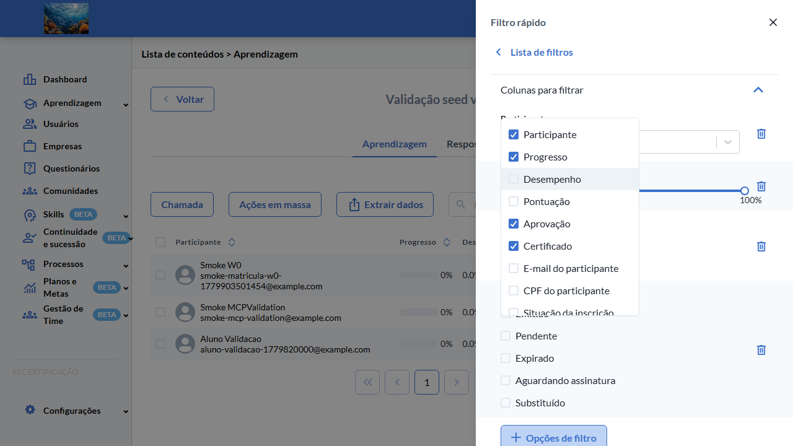
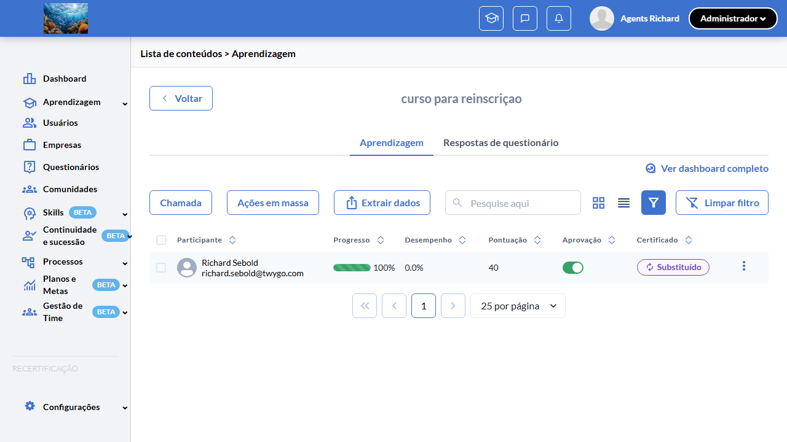
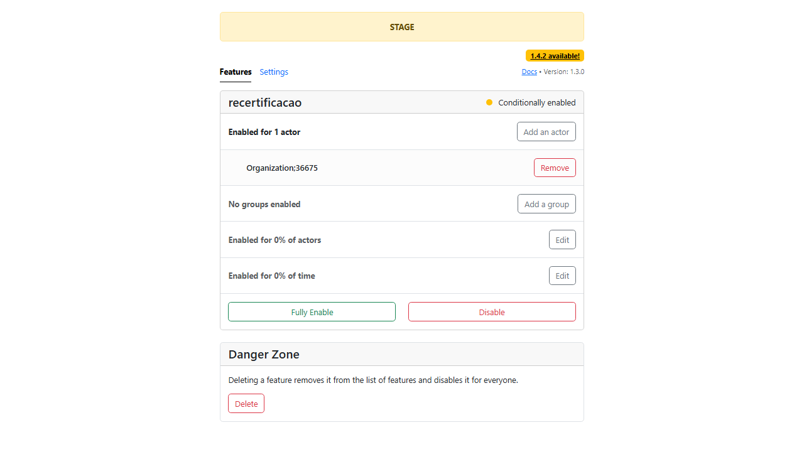

# Casos de teste — Recertificação

[← Voltar ao dashboard](index.md)

Lista detalhada por testsuite. Cada caso traz: o que era esperado pelo XML, quais steps foram executados, evidências (screenshots/trace), texto pronto pra registro de bug e — quando houver falha — uma explicação em PT-BR do motivo.

## Filtro Avançado Status Substituído

_4 caso(s) — 4 aprovado(s), 0 falha(s), 0 ignorado(s)_

### ✅ Aprovado · TC1 · Opção "Substituído" aparece no filtro avançado de Status do certificado com flag ON · 🔴 Crítico

<a id="tc1-opcao-substituido-aparece-no-filtro-avancado-de-status-do-certificado-com-flag-on"></a>_Arquivo:_ `tc1-opcao-substituido-aparece-no-filtro-flag-on.spec.ts` · _Duração:_ 10.40s · _Browser:_ chromium

**Sumário (objetivo do caso):** Validar visibilidade condicional: opção "Substituído" no filtro avançado de Status do certificado aparece apenas com flag ativa (RN 23).

**Pré-condições:**

```
Feature flag `:recertificacao` ATIVA
Pelo menos 1 aluno com certificado VALID, 1 com REPLACED, 1 com EXPIRED, 1 com PENDING
Lista de aprendizagem com filtro avançado disponível em "/learning_students"
```

**Passos do caso (XML/TestLink + execução Playwright):**

_Cada linha reproduz um passo do XML; a coluna **Status** traz o resultado da execução (do step Allure correspondente). Linhas com "Pré-condição" são da execução automatizada (login, navegação inicial) — não fazem parte do roteiro do XML._

| # | Ação do passo | Resultado esperado | Status | Notas | Duração |
|---|---|---|:---:|---|---:|
| 1 | Acessar a lista de aprendizagem em "/learning_students" | Lista é exibida com colunas Nome, Status do certificado, etc. | ✅ | — | 5.80s |
| 2 | Clicar no ícone de filtro da coluna "Status do certificado" | Drawer de filtro avançado é exibido com lista de opções. | ✅ | — | 0.45s |
| 3 | Inspecionar as opções do filtro | Lista contém: Emitido, Pendente, Expirado, Aguardando assinatura, **Substituído**. | ✅ | — | 1.61s |

**Evidências:**

📁 _Pasta:_ [`artifacts/projects-recertificacao-te-d67a4--do-certificado-com-flag-ON-chromium/`](artifacts/projects-recertificacao-te-d67a4--do-certificado-com-flag-ON-chromium/)

- 📸 **Screenshot (screenshot)** — [`test-finished-1.png`](artifacts/projects-recertificacao-te-d67a4--do-certificado-com-flag-ON-chromium/test-finished-1.png)

  

- 🎬 [Vídeo da execução (video.webm)](artifacts/projects-recertificacao-te-d67a4--do-certificado-com-flag-ON-chromium/video.webm)

- 🎬 [Vídeo da execução (video-1.webm)](artifacts/projects-recertificacao-te-d67a4--do-certificado-com-flag-ON-chromium/video-1.webm)

- 📦 **Trace** — [`trace.zip`](artifacts/projects-recertificacao-te-d67a4--do-certificado-com-flag-ON-chromium/trace.zip)

  ```bash
  npx playwright show-trace outputs/recertificacao/reports/filtro-avancado-status-substituido_20260527-154711/artifacts/projects-recertificacao-te-d67a4--do-certificado-com-flag-ON-chromium/trace.zip
  ```

- 🎥 **Vídeo** — [`video.webm`](artifacts/projects-recertificacao-te-d67a4--do-certificado-com-flag-ON-chromium/video.webm)

- 🎥 **Vídeo** — [`video-1.webm`](artifacts/projects-recertificacao-te-d67a4--do-certificado-com-flag-ON-chromium/video-1.webm)


---

### ✅ Aprovado · TC2 — Filtrar por "Substituído" exibe apenas alunos com certificate_status = 4 

<a id="tc2-filtrar-por-substituido-exibe-apenas-alunos-com-certificate-status-4"></a>_Arquivo:_ `tc2-filtrar-por-substituido-exibe-status-4.spec.ts` · _Duração:_ 42.99s · _Browser:_ chromium · _Rerun:_ 2026-05-28 (seed REPLACED criada no curso 807287)

**Passos do caso (XML/TestLink + execução Playwright):**

_Cada linha reproduz um passo do XML; a coluna **Status** traz o resultado da execução (do step Allure correspondente). Linhas com "Pré-condição" são da execução automatizada (login, navegação inicial) — não fazem parte do roteiro do XML._

| # | Ação do passo | Resultado esperado | Status | Notas | Duração |
|---|---|---|:---:|---|---:|
| 1 | Acessar a lista de aprendizagem em "/learning_students" | Lista exibe todos os alunos | ✅ | — | 5.98s |
| 2 | Abrir o filtro avançado de "Status do certificado", marcar APENAS a opção "Substituído" e aplicar | Drawer fecha, listagem refilra | ✅ | — | 3.43s |
| 3 | Inspecionar as linhas listadas | Apenas alunos com certificate_status = 4 aparecem; demais (VALID, EXPIRED, PENDING) ficam ocultos | ✅ | — | 30.07s |

**Evidências:**

📁 _Pasta:_ [`artifacts/projects-recertificacao-te-f6b62-os-com-certificate-status-4-chromium/`](artifacts/projects-recertificacao-te-f6b62-os-com-certificate-status-4-chromium/)

- 📸 **Screenshot (screenshot)** — [`test-finished-1.png`](artifacts/projects-recertificacao-te-f6b62-os-com-certificate-status-4-chromium/test-finished-1.png)

  

- 🎬 [Vídeo da execução (video.webm)](artifacts/projects-recertificacao-te-f6b62-os-com-certificate-status-4-chromium/video.webm)

- 🎬 [Vídeo da execução (video-1.webm)](artifacts/projects-recertificacao-te-f6b62-os-com-certificate-status-4-chromium/video-1.webm)

- 📦 **Trace** — [`trace.zip`](artifacts/projects-recertificacao-te-f6b62-os-com-certificate-status-4-chromium/trace.zip)

  ```bash
  npx playwright show-trace outputs/recertificacao/reports/filtro-avancado-status-substituido_20260527-154711/artifacts/projects-recertificacao-te-f6b62-os-com-certificate-status-4-chromium/trace.zip
  ```


---

### ✅ Aprovado · TC3 — Badge "Substituído" é exibido na coluna de Status para participants com certificate_status = 4 

<a id="tc3-badge-substituido-e-exibido-na-coluna-de-status-para-participants-com-certificate-status-4"></a>_Arquivo:_ `tc3-badge-substituido-coluna-status.spec.ts` · _Duração:_ 14.67s · _Browser:_ chromium · _Rerun:_ 2026-05-28 (seed REPLACED + badge `data-test-id="certificate-student-badge-replaced"`)

**Passos do caso (XML/TestLink + execução Playwright):**

_Cada linha reproduz um passo do XML; a coluna **Status** traz o resultado da execução (do step Allure correspondente). Linhas com "Pré-condição" são da execução automatizada (login, navegação inicial) — não fazem parte do roteiro do XML._

| # | Ação do passo | Resultado esperado | Status | Notas | Duração |
|---|---|---|:---:|---|---:|
| 1 | Acessar a lista de aprendizagem sem filtros aplicados | Lista é exibida | ✅ | — | 7.08s |
| 2 | Localizar a linha de um aluno com certificado REPLACED (certificate_status = 4) | Coluna "Status do certificado" exibe badge com label "Substituído" | ✅ | — | 3.42s |
| 3 | Posicionar o cursor sobre o badge | Tooltip explicativo é exibido (validado via atributo `title="Certificado substituído por uma nova versão"`) | ✅ | — | 0.03s |

**Evidências:**

📁 _Pasta:_ [`artifacts/projects-recertificacao-te-c99a9-ts-com-certificate-status-4-chromium/`](artifacts/projects-recertificacao-te-c99a9-ts-com-certificate-status-4-chromium/)

- 📸 **Screenshot (screenshot)** — [`test-finished-1.png`](artifacts/projects-recertificacao-te-c99a9-ts-com-certificate-status-4-chromium/test-finished-1.png)

  

- 🎬 [Vídeo da execução (video.webm)](artifacts/projects-recertificacao-te-c99a9-ts-com-certificate-status-4-chromium/video.webm)

- 🎬 [Vídeo da execução (video-1.webm)](artifacts/projects-recertificacao-te-c99a9-ts-com-certificate-status-4-chromium/video-1.webm)

- 📦 **Trace** — [`trace.zip`](artifacts/projects-recertificacao-te-c99a9-ts-com-certificate-status-4-chromium/trace.zip)

  ```bash
  npx playwright show-trace outputs/recertificacao/reports/filtro-avancado-status-substituido_20260527-154711/artifacts/projects-recertificacao-te-c99a9-ts-com-certificate-status-4-chromium/trace.zip
  ```


---

### ✅ Aprovado · TC4 · Opção "Substituído" NÃO aparece no filtro com flag OFF (regressão) · 🔴 Crítico

<a id="tc4-opcao-substituido-nao-aparece-no-filtro-com-flag-off-regressao"></a>_Arquivo:_ `tc4-opcao-substituido-nao-aparece-flag-off-regressao.spec.ts` · _Duração:_ 10.82s · _Browser:_ chromium · _Rerun:_ 2026-05-28 (toggle Flipper automatizado via `ensureFlipperActor(enabled:false)`)

**Sumário (objetivo do caso):** Validar regressão: com flag OFF, opção "Substituído" não aparece no filtro (RN 23).

> ⚠️ **Estado compartilhado:** este TC desliga/religa `:recertificacao` na org 37048 durante a execução. Rodar **apenas com `--workers=1` isolando esta suite** — em paralelo com TC1 / Isolamento / outras suites flag-ON, vai dar conflito. Revert do `afterAll` é idempotente.

**Pré-condições:**

```
Feature flag `:recertificacao` ATIVA antes do teste (revert religa)
Pelo menos 1 aluno com certificado VALID, 1 com REPLACED, 1 com EXPIRED, 1 com PENDING
Lista de aprendizagem com filtro avançado disponível em "/learning_students"
```

**Passos do caso (XML/TestLink + execução Playwright):**

_Cada linha reproduz um passo do XML; a coluna **Status** traz o resultado da execução (do step Allure correspondente). Linhas com "Pré-condição" são da execução automatizada (login, navegação inicial) — não fazem parte do roteiro do XML._

| # | Ação do passo | Resultado esperado | Status | Notas | Duração |
|---|---|---|:---:|---|---:|
| 1 | Desativar a feature flag `:recertificacao` | Flag OFF | ✅ | Feito no `beforeAll` via `ensureFlipperActor(enabled:false)` | 0.00s |
| 2 | Acessar a lista de aprendizagem e abrir o filtro avançado de Status do certificado | Drawer de filtro é exibido | ✅ | — | 7.26s |
| 3 | Inspecionar as opções | Lista contém apenas: Emitido, Pendente, Expirado, Aguardando assinatura. Opção "Substituído" NÃO está presente | ✅ | — | 0.23s |

**Evidências:**

📁 _Pasta:_ [`artifacts/projects-recertificacao-te-2dce4-tro-com-flag-OFF-regressão--chromium/`](artifacts/projects-recertificacao-te-2dce4-tro-com-flag-OFF-regressão--chromium/)

- 📸 **Screenshot (screenshot)** — [`test-finished-1.png`](artifacts/projects-recertificacao-te-2dce4-tro-com-flag-OFF-regressão--chromium/test-finished-1.png)

  

- 🎬 [Vídeo da execução (video.webm)](artifacts/projects-recertificacao-te-2dce4-tro-com-flag-OFF-regressão--chromium/video.webm)

- 🎬 [Vídeo da execução (video-1.webm)](artifacts/projects-recertificacao-te-2dce4-tro-com-flag-OFF-regressão--chromium/video-1.webm)

- 📦 **Trace** — [`trace.zip`](artifacts/projects-recertificacao-te-2dce4-tro-com-flag-OFF-regressão--chromium/trace.zip)

  ```bash
  npx playwright show-trace outputs/recertificacao/reports/filtro-avancado-status-substituido_20260527-154711/artifacts/projects-recertificacao-te-2dce4-tro-com-flag-OFF-regressão--chromium/trace.zip
  ```


---
