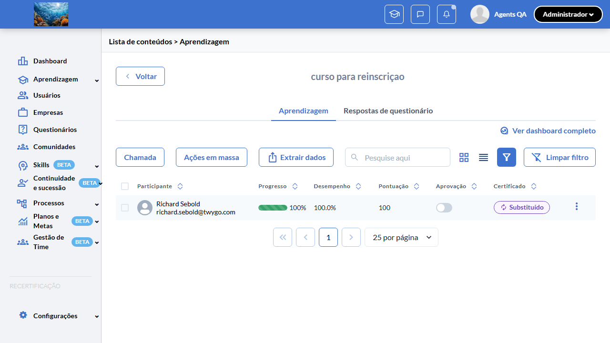
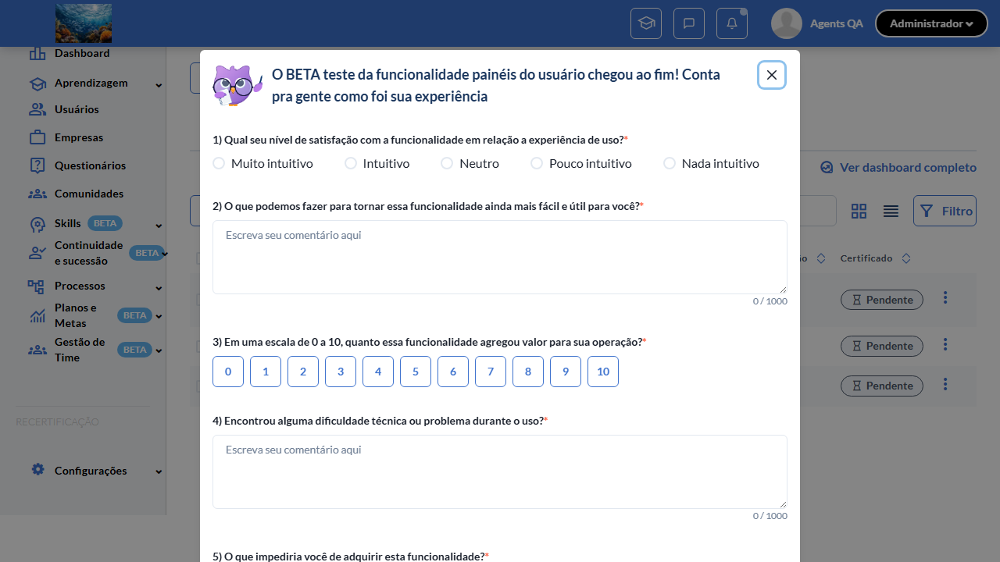

# Casos de teste — Recertificação

[← Voltar ao dashboard](index.md)

Lista detalhada por testsuite. Cada caso traz: o que era esperado pelo XML, quais steps foram executados, evidências (screenshots/trace), texto pronto pra registro de bug e — quando houver falha — uma explicação em PT-BR do motivo.

## Filtro Avançado Status Substituído

_4 caso(s) — 3 aprovado(s), 1 falha(s)_

### ✅ Aprovado · TC1 · Opção "Substituído" aparece no filtro avançado de Status do certificado com flag ON · 🔴 Crítico

<a id="tc1-opcao-substituido-aparece-no-filtro-avancado-de-status-do-certificado-com-flag-on"></a>_Arquivo:_ `tc1-opcao-substituido-aparece-no-filtro-flag-on.spec.ts` · _Duração:_ 52.44s · _Browser:_ chromium

**Sumário (objetivo do caso):** Validar visibilidade condicional: opção "Substituído" no filtro avançado de Status do certificado aparece apenas com flag ativa (RN 23).

**Pré-condições:**

```
Feature flag `:recertificacao` ATIVA
Pelo menos 1 aluno com certificado VALID, 1 com REPLACED, 1 com EXPIRED, 1 com PENDING
Lista de aprendizagem com filtro avançado disponível em "/learning_students"
```

**Passos do caso (XML/TestLink + execução Playwright):**

_Cada linha reproduz um passo do XML; a coluna **Status** traz o resultado da execução (do step Allure correspondente). Linhas com "Pré-condição" são da execução automatizada (login, navegação inicial) — não fazem parte do roteiro do XML._

| # | Ação do passo | Resultado esperado | Status | Notas | Duração |
|---|---|---|:---:|---|---:|
| 1 | Acessar a lista de aprendizagem em "/learning_students" | Lista é exibida com colunas Nome, Status do certificado, etc. | ✅ | — | 18.91s |
| 2 | Clicar no ícone de filtro da coluna "Status do certificado" | Drawer de filtro avançado é exibido com lista de opções. | ✅ | — | 3.42s |
| 3 | Inspecionar as opções do filtro | Lista contém: Emitido, Pendente, Expirado, Aguardando assinatura, **Substituído**. | ✅ | — | 9.15s |

**Evidências:**

📁 _Pasta:_ [`artifacts/projects-recertificacao-te-d67a4--do-certificado-com-flag-ON-chromium/`](artifacts/projects-recertificacao-te-d67a4--do-certificado-com-flag-ON-chromium/)

- 📸 **Screenshot (screenshot)** — [`test-finished-1.png`](artifacts/projects-recertificacao-te-d67a4--do-certificado-com-flag-ON-chromium/test-finished-1.png)

  

- 🎬 [Vídeo da execução (video.webm)](artifacts/projects-recertificacao-te-d67a4--do-certificado-com-flag-ON-chromium/video.webm)

- 🎬 [Vídeo da execução (video-1.webm)](artifacts/projects-recertificacao-te-d67a4--do-certificado-com-flag-ON-chromium/video-1.webm)

- 📦 **Trace** — [`trace.zip`](artifacts/projects-recertificacao-te-d67a4--do-certificado-com-flag-ON-chromium/trace.zip)

  ```bash
  npx playwright show-trace outputs/recertificacao/reports/filtro-avancado-status-substituido_20260601-090533/artifacts/projects-recertificacao-te-d67a4--do-certificado-com-flag-ON-chromium/trace.zip
  ```

- 🎥 **Vídeo** — [`video.webm`](artifacts/projects-recertificacao-te-d67a4--do-certificado-com-flag-ON-chromium/video.webm)

- 🎥 **Vídeo** — [`video-1.webm`](artifacts/projects-recertificacao-te-d67a4--do-certificado-com-flag-ON-chromium/video-1.webm)


---

### ✅ Aprovado · TC2 — Filtrar por "Substituído" exibe apenas alunos com certificate_status = 4 

<a id="tc2-filtrar-por-substituido-exibe-apenas-alunos-com-certificate-status-4"></a>_Arquivo:_ `tc2-filtrar-por-substituido-exibe-status-4.spec.ts` · _Duração:_ 78.93s · _Browser:_ chromium

**Passos do caso (XML/TestLink + execução Playwright):**

_Cada linha reproduz um passo do XML; a coluna **Status** traz o resultado da execução (do step Allure correspondente). Linhas com "Pré-condição" são da execução automatizada (login, navegação inicial) — não fazem parte do roteiro do XML._

| # | Ação do passo | Resultado esperado | Status | Notas | Duração |
|---|---|---|:---:|---|---:|
| — | _Pré-condição:_ 1. Acessar a lista de aprendizagem em "/learning_students" → Lista exibe todos os alunos | — | ✅ | — | 22.52s |
| — | _Pré-condição:_ 2. Abrir o filtro avançado de "Status do certificado", marcar APENAS a opção "Substituído" e aplicar → Drawer fecha, listagem refilra | — | ✅ | — | 13.80s |
| — | _Pré-condição:_ 3. Inspecionar as linhas listadas → Apenas alunos com certificate_status = 4 aparecem; demais (VALID, EXPIRED, PENDING) ficam ocultos | — | ✅ | — | 30.99s |

**Evidências:**

📁 _Pasta:_ [`artifacts/projects-recertificacao-te-f6b62-os-com-certificate-status-4-chromium/`](artifacts/projects-recertificacao-te-f6b62-os-com-certificate-status-4-chromium/)

- 📸 **Screenshot (screenshot)** — [`test-finished-1.png`](artifacts/projects-recertificacao-te-f6b62-os-com-certificate-status-4-chromium/test-finished-1.png)

  

- 🎬 [Vídeo da execução (video.webm)](artifacts/projects-recertificacao-te-f6b62-os-com-certificate-status-4-chromium/video.webm)

- 🎬 [Vídeo da execução (video-1.webm)](artifacts/projects-recertificacao-te-f6b62-os-com-certificate-status-4-chromium/video-1.webm)

- 📦 **Trace** — [`trace.zip`](artifacts/projects-recertificacao-te-f6b62-os-com-certificate-status-4-chromium/trace.zip)

  ```bash
  npx playwright show-trace outputs/recertificacao/reports/filtro-avancado-status-substituido_20260601-090533/artifacts/projects-recertificacao-te-f6b62-os-com-certificate-status-4-chromium/trace.zip
  ```

- 🎥 **Vídeo** — [`video.webm`](artifacts/projects-recertificacao-te-f6b62-os-com-certificate-status-4-chromium/video.webm)

- 🎥 **Vídeo** — [`video-1.webm`](artifacts/projects-recertificacao-te-f6b62-os-com-certificate-status-4-chromium/video-1.webm)


---

### ✅ Aprovado · TC3 — Badge "Substituído" é exibido na coluna de Status para participants com certificate_status = 4 

<a id="tc3-badge-substituido-e-exibido-na-coluna-de-status-para-participants-com-certificate-status-4"></a>_Arquivo:_ `tc3-badge-substituido-coluna-status.spec.ts` · _Duração:_ 62.01s · _Browser:_ chromium

**Passos do caso (XML/TestLink + execução Playwright):**

_Cada linha reproduz um passo do XML; a coluna **Status** traz o resultado da execução (do step Allure correspondente). Linhas com "Pré-condição" são da execução automatizada (login, navegação inicial) — não fazem parte do roteiro do XML._

| # | Ação do passo | Resultado esperado | Status | Notas | Duração |
|---|---|---|:---:|---|---:|
| — | _Pré-condição:_ 1. Acessar a lista de aprendizagem sem filtros aplicados → Lista é exibida | — | ✅ | — | 22.08s |
| — | _Pré-condição:_ 2. Localizar a linha de um aluno com certificado REPLACED (certificate_status = 4) → Coluna "Status do certificado" exibe badge com label "Substituído" | — | ✅ | — | 15.46s |
| — | _Pré-condição:_ 3. Posicionar o cursor sobre o badge → Tooltip explicativo é exibido | — | ✅ | — | 0.38s |

**Evidências:**

📁 _Pasta:_ [`artifacts/projects-recertificacao-te-c99a9-ts-com-certificate-status-4-chromium/`](artifacts/projects-recertificacao-te-c99a9-ts-com-certificate-status-4-chromium/)

- 📸 **Screenshot (screenshot)** — [`test-finished-1.png`](artifacts/projects-recertificacao-te-c99a9-ts-com-certificate-status-4-chromium/test-finished-1.png)

  

- 🎬 [Vídeo da execução (video.webm)](artifacts/projects-recertificacao-te-c99a9-ts-com-certificate-status-4-chromium/video.webm)

- 🎬 [Vídeo da execução (video-1.webm)](artifacts/projects-recertificacao-te-c99a9-ts-com-certificate-status-4-chromium/video-1.webm)

- 📦 **Trace** — [`trace.zip`](artifacts/projects-recertificacao-te-c99a9-ts-com-certificate-status-4-chromium/trace.zip)

  ```bash
  npx playwright show-trace outputs/recertificacao/reports/filtro-avancado-status-substituido_20260601-090533/artifacts/projects-recertificacao-te-c99a9-ts-com-certificate-status-4-chromium/trace.zip
  ```

- 🎥 **Vídeo** — [`video.webm`](artifacts/projects-recertificacao-te-c99a9-ts-com-certificate-status-4-chromium/video.webm)

- 🎥 **Vídeo** — [`video-1.webm`](artifacts/projects-recertificacao-te-c99a9-ts-com-certificate-status-4-chromium/video-1.webm)


---

### ❌ Falhou · TC4 · Opção "Substituído" NÃO aparece no filtro com flag OFF (regressão) · 🔴 Crítico

<a id="tc4-opcao-substituido-nao-aparece-no-filtro-com-flag-off-regressao"></a>_Arquivo:_ `tc4-opcao-substituido-nao-aparece-flag-off-regressao.spec.ts` · _Duração:_ 52.14s · _Browser:_ chromium

> **❌ Por que falhou:** Não foi possível clicar o elemento — ele não ficou disponível em 30s (locator: locator('#open-filter')).
> _Step impactado:_ **2. Acessar a lista de aprendizagem e abrir o filtro avançado de Status do certificado → Drawer de filtro é exibido**

**Sumário (objetivo do caso):** Validar regressão: com flag OFF, opção "Substituído" não aparece no filtro (RN 23).

**Pré-condições:**

```
Feature flag `:recertificacao` ATIVA
Pelo menos 1 aluno com certificado VALID, 1 com REPLACED, 1 com EXPIRED, 1 com PENDING
Lista de aprendizagem com filtro avançado disponível em "/learning_students"
```

**Passos do caso (XML/TestLink + execução Playwright):**

_Cada linha reproduz um passo do XML; a coluna **Status** traz o resultado da execução (do step Allure correspondente). Linhas com "Pré-condição" são da execução automatizada (login, navegação inicial) — não fazem parte do roteiro do XML._

| # | Ação do passo | Resultado esperado | Status | Notas | Duração |
|---|---|---|:---:|---|---:|
| 1 | Desativar a feature flag `:recertificacao` | Flag OFF. | ✅ | — | 0.01s |
| 2 | Acessar a lista de aprendizagem e abrir o filtro avançado de Status do certificado | Drawer de filtro é exibido. | ❌ | Não foi possível clicar o elemento — ele não ficou disponível em 30s (locator: locator('#open-filter')). | 39.30s |
| 3 | Inspecionar as opções | Lista contém apenas: Emitido, Pendente, Expirado, Aguardando assinatura. Opção "Substituído" NÃO está presente. | ⊘ | Step não executado: o teste foi interrompido antes. Causa: Não foi possível clicar o elemento — ele não ficou disponível em 30s (locator: locator('#open-filter')).. | — |

**Evidências:**

📁 _Pasta:_ [`artifacts/projects-recertificacao-te-2dce4-tro-com-flag-OFF-regressão--chromium/`](artifacts/projects-recertificacao-te-2dce4-tro-com-flag-OFF-regressão--chromium/)

- 📸 **Screenshot (screenshot)** — [`test-finished-1.png`](artifacts/projects-recertificacao-te-2dce4-tro-com-flag-OFF-regressão--chromium/test-finished-1.png)

  

- 📸 **Screenshot (screenshot)** — [`test-failed-2.png`](artifacts/projects-recertificacao-te-2dce4-tro-com-flag-OFF-regressão--chromium/test-failed-2.png)

  

- 🎬 [Vídeo da execução (video.webm)](artifacts/projects-recertificacao-te-2dce4-tro-com-flag-OFF-regressão--chromium/video.webm)

- 🎬 [Vídeo da execução (video-1.webm)](artifacts/projects-recertificacao-te-2dce4-tro-com-flag-OFF-regressão--chromium/video-1.webm)

- 📦 **Trace** — [`trace.zip`](artifacts/projects-recertificacao-te-2dce4-tro-com-flag-OFF-regressão--chromium/trace.zip)

  ```bash
  npx playwright show-trace outputs/recertificacao/reports/filtro-avancado-status-substituido_20260601-090533/artifacts/projects-recertificacao-te-2dce4-tro-com-flag-OFF-regressão--chromium/trace.zip
  ```

- 🎥 **Vídeo** — [`video.webm`](artifacts/projects-recertificacao-te-2dce4-tro-com-flag-OFF-regressão--chromium/video.webm)

- 🎥 **Vídeo** — [`video-1.webm`](artifacts/projects-recertificacao-te-2dce4-tro-com-flag-OFF-regressão--chromium/video-1.webm)

- 📄 **DOM no momento da falha** — [`error-context.md`](artifacts/projects-recertificacao-te-2dce4-tro-com-flag-OFF-regressão--chromium/error-context.md)

#### 🐛 Pronto para registro de bug

> 🪟 **Análise automática:** Modal não tratado (bloqueio de UI) · Confiança 🟢 alta
> _Por quê:_ Click interceptado — overlay/modal por cima do alvo
> _Bug-report estruturado:_ [`bug-reports/filtro-avancado-status-substituido__tc4-opcao-substituido-nao-aparece-no-filtro-com-flag-off-regressao.md`](bug-reports/filtro-avancado-status-substituido__tc4-opcao-substituido-nao-aparece-no-filtro-com-flag-off-regressao.md)

**Próximas ações sugeridas:**
- Verificar `error-context.md` ou screenshot — se há modal NPS Sofia, "Modelo de página duplicado" ou similar bloqueando o fluxo.
- Confirmar que o spec usa `safeGoto` em vez de `page.goto` direto (CLAUDE.md raiz §"page.goto + dismissCommonModals obrigatórios").
- Atualizar `src/utils/modals.ts` `dismissCommonModals()` se o modal não estiver coberto.

**Descrição do BUG:** [Crítico] TC4 — Opção "Substituído" NÃO aparece no filtro com flag OFF (regressão) — Não foi possível clicar o elemento — ele não ficou disponível em 30s (locator: locator('#open-filter')).

**Passo a passo para reprodução:**
1. Pré: Feature flag `:recertificacao` ATIVA
1. Pré: Pelo menos 1 aluno com certificado VALID, 1 com REPLACED, 1 com EXPIRED, 1 com PENDING
1. Pré: Lista de aprendizagem com filtro avançado disponível em "/learning_students"
1. 1. Desativar a feature flag `:recertificacao`
1. 2. Acessar a lista de aprendizagem e abrir o filtro avançado de Status do certificado
1. 3. Inspecionar as opções

**Comportamento esperado:** Drawer de filtro é exibido.

**Comportamento atual:** Não foi possível clicar o elemento — ele não ficou disponível em 30s (locator: locator('#open-filter')). (falha aconteceu no passo 2: "Acessar a lista de aprendizagem e abrir o filtro avançado de Status do certificado → Drawer de filtro é exibido", que deveria resultar em: Drawer de filtro é exibido.)

**Informações:**

| Campo | Valor |
|---|---|
| URL | `https://recertificacao-testeqa.stage.twygoead.com/` |
| Login | Credenciais via env: `TWYGO_STAGING_RECERTIFICACAO_EMAIL` (consulte `.env`) |
| Senha | Credenciais via env: `TWYGO_STAGING_RECERTIFICACAO_PASSWORD` (consulte `.env`) |
| orgId | — |
| Outros | Browser: chromium |
| Outros | runId: filtro-avancado-status-substituido_20260601-090533 |
| Outros | Duração até a falha: 52.14s |
| Outros | Step impactado: 2. Acessar a lista de aprendizagem e abrir o filtro avançado de Status do certificado → Drawer de filtro é exibido |

**Evidências:**

- Screenshot capturado pelo Playwright (screenshot): artifacts/projects-recertificacao-te-2dce4-tro-com-flag-OFF-regressão--chromium/test-finished-1.png
- Screenshot capturado pelo Playwright (screenshot): artifacts/projects-recertificacao-te-2dce4-tro-com-flag-OFF-regressão--chromium/test-failed-2.png
- Vídeo da execução (video-1.webm): artifacts/projects-recertificacao-te-2dce4-tro-com-flag-OFF-regressão--chromium/video-1.webm
- Vídeo da execução (video.webm): artifacts/projects-recertificacao-te-2dce4-tro-com-flag-OFF-regressão--chromium/video.webm
- Snapshot do DOM/contexto da página (error-context.md): artifacts/projects-recertificacao-te-2dce4-tro-com-flag-OFF-regressão--chromium/error-context.md
- Snapshot do DOM/contexto da página (error-context.md): artifacts/projects-recertificacao-te-2dce4-tro-com-flag-OFF-regressão--chromium/error-context.md
- Trace completo do Playwright (.zip) — `npx playwright show-trace`: artifacts/projects-recertificacao-te-2dce4-tro-com-flag-OFF-regressão--chromium/trace.zip

<details><summary>📋 Ver texto agregado para copiar (Jira/GitHub/Linear)</summary>

```
Descrição do BUG
[Crítico] TC4 — Opção "Substituído" NÃO aparece no filtro com flag OFF (regressão) — Não foi possível clicar o elemento — ele não ficou disponível em 30s (locator: locator('#open-filter')).

Passo a passo para reprodução
  Pré: Feature flag `:recertificacao` ATIVA
  Pré: Pelo menos 1 aluno com certificado VALID, 1 com REPLACED, 1 com EXPIRED, 1 com PENDING
  Pré: Lista de aprendizagem com filtro avançado disponível em "/learning_students"
  1. Desativar a feature flag `:recertificacao`
  2. Acessar a lista de aprendizagem e abrir o filtro avançado de Status do certificado
  3. Inspecionar as opções

Comportamento esperado
Drawer de filtro é exibido.

Comportamento atual
Não foi possível clicar o elemento — ele não ficou disponível em 30s (locator: locator('#open-filter')). (falha aconteceu no passo 2: "Acessar a lista de aprendizagem e abrir o filtro avançado de Status do certificado → Drawer de filtro é exibido", que deveria resultar em: Drawer de filtro é exibido.)

Informações
- URL: https://recertificacao-testeqa.stage.twygoead.com/
- Login: Credenciais via env: `TWYGO_STAGING_RECERTIFICACAO_EMAIL` (consulte `.env`)
- Senha: Credenciais via env: `TWYGO_STAGING_RECERTIFICACAO_PASSWORD` (consulte `.env`)
- ID do ambiente (orgId): —
- Outros:
  - Browser: chromium
  - runId: filtro-avancado-status-substituido_20260601-090533
  - Duração até a falha: 52.14s
  - Step impactado: 2. Acessar a lista de aprendizagem e abrir o filtro avançado de Status do certificado → Drawer de filtro é exibido

Evidências
- Screenshot capturado pelo Playwright (screenshot): artifacts/projects-recertificacao-te-2dce4-tro-com-flag-OFF-regressão--chromium/test-finished-1.png
- Screenshot capturado pelo Playwright (screenshot): artifacts/projects-recertificacao-te-2dce4-tro-com-flag-OFF-regressão--chromium/test-failed-2.png
- Vídeo da execução (video-1.webm): artifacts/projects-recertificacao-te-2dce4-tro-com-flag-OFF-regressão--chromium/video-1.webm
- Vídeo da execução (video.webm): artifacts/projects-recertificacao-te-2dce4-tro-com-flag-OFF-regressão--chromium/video.webm
- Snapshot do DOM/contexto da página (error-context.md): artifacts/projects-recertificacao-te-2dce4-tro-com-flag-OFF-regressão--chromium/error-context.md
- Snapshot do DOM/contexto da página (error-context.md): artifacts/projects-recertificacao-te-2dce4-tro-com-flag-OFF-regressão--chromium/error-context.md
- Trace completo do Playwright (.zip) — `npx playwright show-trace`: artifacts/projects-recertificacao-te-2dce4-tro-com-flag-OFF-regressão--chromium/trace.zip

Execução
- runId: filtro-avancado-status-substituido_20260601-090533
- environment.json: staging-recertificacao
- testsuite: Filtro Avançado Status Substituído
- testcase: TC4 — Opção "Substituído" NÃO aparece no filtro com flag OFF (regressão)

```

</details>

<details><summary>🔧 Stack trace técnica completa (para desenvolvedor)</summary>

```
TimeoutError: locator.click: Timeout 30000ms exceeded.
Call log:
  - waiting for locator('#open-filter')
    - locator resolved to <button type="button" id="open-filter" class="chakra-button css-it72td" data-test-id="filter-control-open-button">…</button>
  - attempting click action
    2 × waiting for element to be visible, enabled and stable
      - element is visible, enabled and stable
      - scrolling into view if needed
      - done scrolling
      - <div tabindex="-1" class="chakra-modal__content-container css-1u2cvaz">…</div> from <div class="chakra-portal">…</div> subtree intercepts pointer events
    - retrying click action
    - waiting 20ms
    2 × waiting for element to be visible, enabled and stable
      - element is visible, enabled and stable
      - scrolling into view if needed
      - done scrolling
      - <div tabindex="-1" class="chakra-modal__content-container css-1u2cvaz">…</div> from <div class="chakra-portal">…</div> subtree intercepts pointer events
    - retrying click action
      - waiting 100ms
    27 × waiting for element to be visible, enabled and stable
       - element is visible, enabled and stable
       - scrolling into view if needed
       - done scrolling
       - <div tabindex="-1" class="chakra-modal__content-container css-1u2cvaz">…</div> from <div class="chakra-portal">…</div> subtree intercepts pointer events
     - retrying click action
       - waiting 500ms

```

</details>

---
