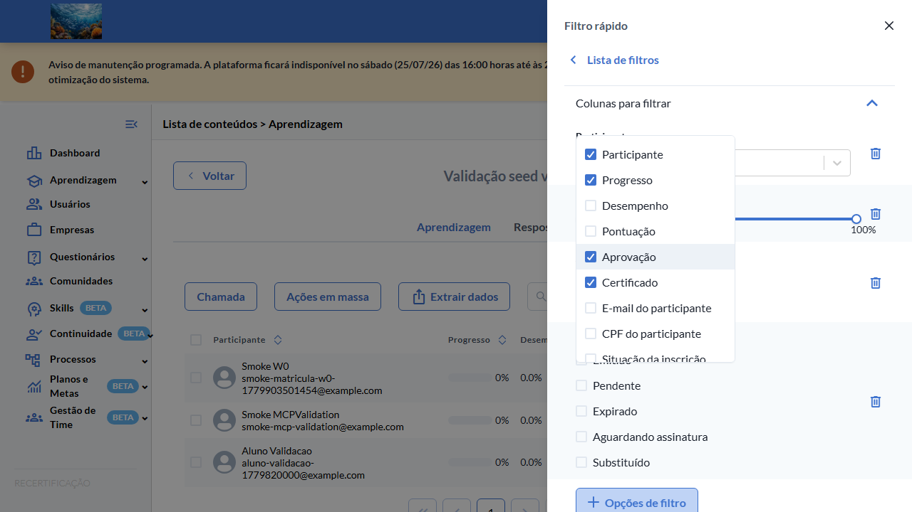
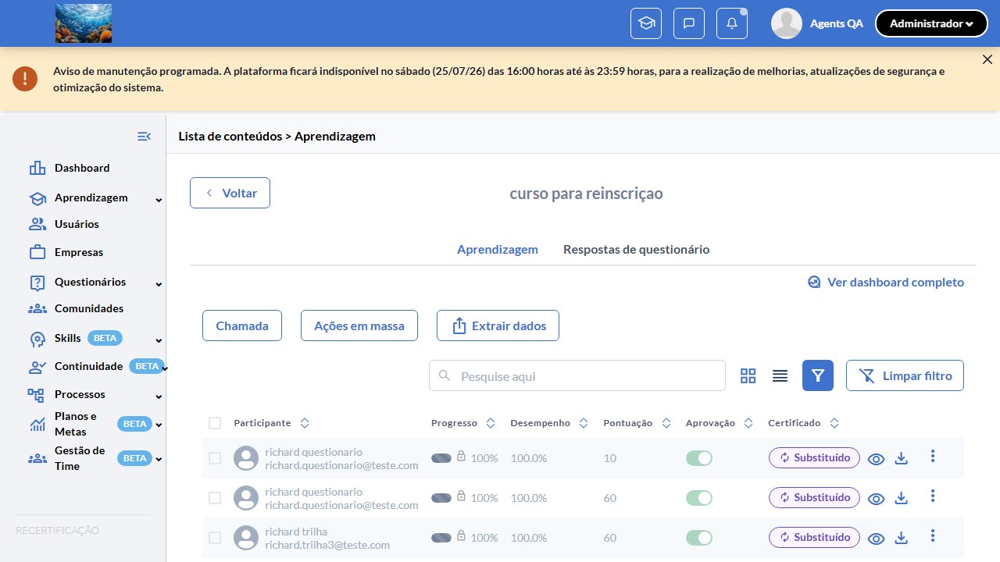
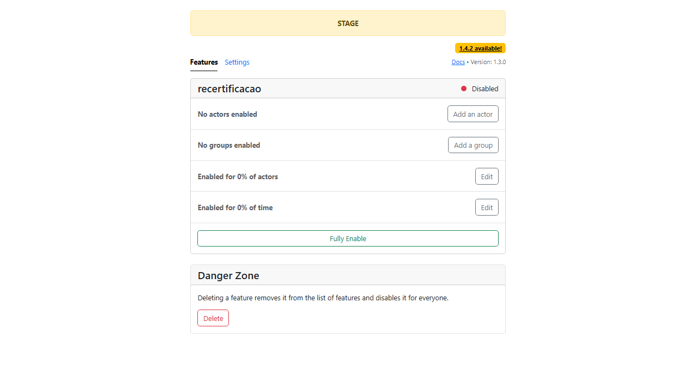

# Casos de teste — Recertificação

[← Voltar ao dashboard](index.md)

Lista detalhada por testsuite. Cada caso traz: o que era esperado pelo XML, quais steps foram executados, evidências (screenshots/trace), texto pronto pra registro de bug e — quando houver falha — uma explicação em PT-BR do motivo.

## Filtro Avançado Status Substituído

_4 caso(s) — 3 aprovado(s), 1 falha(s)_

### ✅ Aprovado · TC1 · Opção "Substituído" aparece no filtro avançado de Status do certificado com flag ON · 🔴 Crítico

<a id="tc1-opcao-substituido-aparece-no-filtro-avancado-de-status-do-certificado-com-flag-on"></a>_Arquivo:_ `tc1-opcao-substituido-aparece-no-filtro-flag-on.spec.ts` · _Duração:_ 16.23s · _Browser:_ chromium

**Sumário (objetivo do caso):** Validar visibilidade condicional: opção "Substituído" no filtro avançado de Status do certificado aparece apenas com flag ativa (RN 23).

**Pré-condições:**

```
Feature flag `:recertificacao` ATIVA
Pelo menos 1 aluno com certificado VALID, 1 com REPLACED, 1 com EXPIRED, 1 com PENDING
Lista de aprendizagem com filtro avançado disponível em "/learning_students"
```

**Passos do caso (XML/TestLink + execução Playwright):**

_Cada linha reproduz um passo do XML; a coluna **Status** traz o resultado da execução (do step Allure correspondente). Linhas com "Pré-condição" são da execução automatizada (login, navegação inicial) — não fazem parte do roteiro do XML._

| # | Ação do passo | Resultado esperado | Status | Notas | Duração |
|---|---|---|:---:|---|---:|
| 1 | Acessar a lista de aprendizagem em "/learning_students" | Lista é exibida com colunas Nome, Status do certificado, etc. | ✅ | — | 7.77s |
| 2 | Clicar no ícone de filtro da coluna "Status do certificado" | Drawer de filtro avançado é exibido com lista de opções. | ✅ | — | 0.67s |
| 3 | Inspecionar as opções do filtro | Lista contém: Emitido, Pendente, Expirado, Aguardando assinatura, **Substituído**. | ✅ | — | 2.04s |

**Evidências:**

📁 _Pasta:_ [`artifacts/projects-recertificacao-te-d67a4--do-certificado-com-flag-ON-chromium/`](artifacts/projects-recertificacao-te-d67a4--do-certificado-com-flag-ON-chromium/)

- 📸 **Screenshot (screenshot)** — [`test-finished-1.png`](artifacts/projects-recertificacao-te-d67a4--do-certificado-com-flag-ON-chromium/test-finished-1.png)

  

- 🎬 [Vídeo da execução (video.webm)](artifacts/projects-recertificacao-te-d67a4--do-certificado-com-flag-ON-chromium/video.webm)

- 🎬 [Vídeo da execução (video-1.webm)](artifacts/projects-recertificacao-te-d67a4--do-certificado-com-flag-ON-chromium/video-1.webm)

- 📦 **Trace** — [`trace.zip`](artifacts/projects-recertificacao-te-d67a4--do-certificado-com-flag-ON-chromium/trace.zip)

  ```bash
  npx playwright show-trace outputs/recertificacao/reports/filtro-avancado-status-substituido_20260727-135650/artifacts/projects-recertificacao-te-d67a4--do-certificado-com-flag-ON-chromium/trace.zip
  ```

- 🎥 **Vídeo** — [`video.webm`](artifacts/projects-recertificacao-te-d67a4--do-certificado-com-flag-ON-chromium/video.webm)

- 🎥 **Vídeo** — [`video-1.webm`](artifacts/projects-recertificacao-te-d67a4--do-certificado-com-flag-ON-chromium/video-1.webm)


---

### ⏱️ Tempo esgotado · TC2 — Filtrar por "Substituído" exibe apenas alunos com certificate_status = 4 

<a id="tc2-filtrar-por-substituido-exibe-apenas-alunos-com-certificate-status-4"></a>_Arquivo:_ `tc2-filtrar-por-substituido-exibe-status-4.spec.ts` · _Duração:_ 128.85s · _Browser:_ chromium

> **⏱️ Por que falhou:** O teste excedeu o tempo limite de 120s antes de concluir.
> _Step impactado:_ **3. Inspecionar as linhas listadas → Apenas alunos com certificate_status = 4 aparecem; demais (VALID, EXPIRED, PENDING) ficam ocultos**

**Passos do caso (XML/TestLink + execução Playwright):**

_Cada linha reproduz um passo do XML; a coluna **Status** traz o resultado da execução (do step Allure correspondente). Linhas com "Pré-condição" são da execução automatizada (login, navegação inicial) — não fazem parte do roteiro do XML._

| # | Ação do passo | Resultado esperado | Status | Notas | Duração |
|---|---|---|:---:|---|---:|
| — | _Pré-condição:_ 1. Acessar a lista de aprendizagem em "/learning_students" → Lista exibe todos os alunos | — | ✅ | — | 9.20s |
| — | _Pré-condição:_ 2. Abrir o filtro avançado de "Status do certificado", marcar APENAS a opção "Substituído" e aplicar → Drawer fecha, listagem refilra | — | ✅ | — | 18.03s |
| — | _Pré-condição:_ 3. Inspecionar as linhas listadas → Apenas alunos com certificate_status = 4 aparecem; demais (VALID, EXPIRED, PENDING) ficam ocultos | — | ❌ | Error: expect(received).toContain(expected) // indexOf | 101.36s |

**Evidências:**

📁 _Pasta:_ [`artifacts/projects-recertificacao-te-f6b62-os-com-certificate-status-4-chromium/`](artifacts/projects-recertificacao-te-f6b62-os-com-certificate-status-4-chromium/)

- 📸 **Screenshot (screenshot)** — [`test-failed-1.png`](artifacts/projects-recertificacao-te-f6b62-os-com-certificate-status-4-chromium/test-failed-1.png)

  

- 🎬 [Vídeo da execução (video.webm)](artifacts/projects-recertificacao-te-f6b62-os-com-certificate-status-4-chromium/video.webm)

- 🎬 [Vídeo da execução (video-1.webm)](artifacts/projects-recertificacao-te-f6b62-os-com-certificate-status-4-chromium/video-1.webm)

- 📦 **Trace** — [`trace.zip`](artifacts/projects-recertificacao-te-f6b62-os-com-certificate-status-4-chromium/trace.zip)

  ```bash
  npx playwright show-trace outputs/recertificacao/reports/filtro-avancado-status-substituido_20260727-135650/artifacts/projects-recertificacao-te-f6b62-os-com-certificate-status-4-chromium/trace.zip
  ```

- 🎥 **Vídeo** — [`video.webm`](artifacts/projects-recertificacao-te-f6b62-os-com-certificate-status-4-chromium/video.webm)

- 🎥 **Vídeo** — [`video-1.webm`](artifacts/projects-recertificacao-te-f6b62-os-com-certificate-status-4-chromium/video-1.webm)

- 📄 **DOM no momento da falha** — [`error-context.md`](artifacts/projects-recertificacao-te-f6b62-os-com-certificate-status-4-chromium/error-context.md)

#### 🐛 Pronto para registro de bug

> 🧪 **Análise automática:** Spec frágil (problema no teste, não no produto) · Confiança 🟡 media
> _Por quê:_ Timeout sem HTTP error — possível wait/seletor frágil. Confirmar via chrome-mcp
> _Bug-report estruturado:_ [`bug-reports/filtro-avancado-status-substituido__tc2-filtrar-por-substituido-exibe-apenas-alunos-com-certificate-status-4.md`](bug-reports/filtro-avancado-status-substituido__tc2-filtrar-por-substituido-exibe-apenas-alunos-com-certificate-status-4.md)

**Próximas ações sugeridas:**
- Inspecionar o trace (`npx playwright show-trace`) para confirmar que o elemento existe mas o seletor/timing falhou.
- Avaliar se o spec viola algum dos 3 padrões da skill `criar-spec-resiliente-twygo` (count de seed, timing pós-hidratação, retry de rede).
- Disparar o healer (`playwright-test-healer`) para corrigir seletor/timing/asserção SEM alterar a intenção do teste.

**Descrição do BUG:** [—] TC2 — Filtrar por "Substituído" exibe apenas alunos com certificate_status = 4 — O teste excedeu o tempo limite de 120s antes de concluir.

**Passo a passo para reprodução:**
1. — (sem steps documentados no XML)

**Comportamento esperado:** —

**Comportamento atual:** O teste excedeu o tempo limite de 120s antes de concluir. (falha aconteceu no passo 3: "Inspecionar as linhas listadas → Apenas alunos com certificate_status = 4 aparecem; demais (VALID, EXPIRED, PENDING) ficam ocultos")

**Informações:**

| Campo | Valor |
|---|---|
| URL | `https://recertificacao-testeqa.stage.twygoead.com/` |
| Login | Credenciais via env: `TWYGO_STAGING_RECERTIFICACAO_EMAIL` (consulte `.env`) |
| Senha | Credenciais via env: `TWYGO_STAGING_RECERTIFICACAO_PASSWORD` (consulte `.env`) |
| orgId | 37048 |
| Outros | Browser: chromium |
| Outros | runId: filtro-avancado-status-substituido_20260727-135650 |
| Outros | Duração até a falha: 128.85s |
| Outros | Step impactado: 3. Inspecionar as linhas listadas → Apenas alunos com certificate_status = 4 aparecem; demais (VALID, EXPIRED, PENDING) ficam ocultos |

**Evidências:**

- Screenshot capturado pelo Playwright (screenshot): artifacts/projects-recertificacao-te-f6b62-os-com-certificate-status-4-chromium/test-failed-1.png
- Vídeo da execução (video-1.webm): artifacts/projects-recertificacao-te-f6b62-os-com-certificate-status-4-chromium/video-1.webm
- Vídeo da execução (video.webm): artifacts/projects-recertificacao-te-f6b62-os-com-certificate-status-4-chromium/video.webm
- Snapshot do DOM/contexto da página (error-context.md): artifacts/projects-recertificacao-te-f6b62-os-com-certificate-status-4-chromium/error-context.md
- Trace completo do Playwright (.zip) — `npx playwright show-trace`: artifacts/projects-recertificacao-te-f6b62-os-com-certificate-status-4-chromium/trace.zip

<details><summary>📋 Ver texto agregado para copiar (Jira/GitHub/Linear)</summary>

```
Descrição do BUG
[—] TC2 — Filtrar por "Substituído" exibe apenas alunos com certificate_status = 4 — O teste excedeu o tempo limite de 120s antes de concluir.

Passo a passo para reprodução
  — (sem steps documentados no XML)

Comportamento esperado
—

Comportamento atual
O teste excedeu o tempo limite de 120s antes de concluir. (falha aconteceu no passo 3: "Inspecionar as linhas listadas → Apenas alunos com certificate_status = 4 aparecem; demais (VALID, EXPIRED, PENDING) ficam ocultos")

Informações
- URL: https://recertificacao-testeqa.stage.twygoead.com/
- Login: Credenciais via env: `TWYGO_STAGING_RECERTIFICACAO_EMAIL` (consulte `.env`)
- Senha: Credenciais via env: `TWYGO_STAGING_RECERTIFICACAO_PASSWORD` (consulte `.env`)
- ID do ambiente (orgId): 37048
- Outros:
  - Browser: chromium
  - runId: filtro-avancado-status-substituido_20260727-135650
  - Duração até a falha: 128.85s
  - Step impactado: 3. Inspecionar as linhas listadas → Apenas alunos com certificate_status = 4 aparecem; demais (VALID, EXPIRED, PENDING) ficam ocultos

Evidências
- Screenshot capturado pelo Playwright (screenshot): artifacts/projects-recertificacao-te-f6b62-os-com-certificate-status-4-chromium/test-failed-1.png
- Vídeo da execução (video-1.webm): artifacts/projects-recertificacao-te-f6b62-os-com-certificate-status-4-chromium/video-1.webm
- Vídeo da execução (video.webm): artifacts/projects-recertificacao-te-f6b62-os-com-certificate-status-4-chromium/video.webm
- Snapshot do DOM/contexto da página (error-context.md): artifacts/projects-recertificacao-te-f6b62-os-com-certificate-status-4-chromium/error-context.md
- Trace completo do Playwright (.zip) — `npx playwright show-trace`: artifacts/projects-recertificacao-te-f6b62-os-com-certificate-status-4-chromium/trace.zip

Execução
- runId: filtro-avancado-status-substituido_20260727-135650
- environment.json: staging-recertificacao
- testsuite: Filtro Avançado Status Substituído
- testcase: TC2 — Filtrar por "Substituído" exibe apenas alunos com certificate_status = 4

```

</details>

<details><summary>🔧 Stack trace técnica completa (para desenvolvedor)</summary>

```
Test timeout of 120000ms exceeded.
```

</details>

---

### ✅ Aprovado · TC3 — Badge "Substituído" é exibido na coluna de Status para participants com certificate_status = 4 

<a id="tc3-badge-substituido-e-exibido-na-coluna-de-status-para-participants-com-certificate-status-4"></a>_Arquivo:_ `tc3-badge-substituido-coluna-status.spec.ts` · _Duração:_ 37.15s · _Browser:_ chromium

**Passos do caso (XML/TestLink + execução Playwright):**

_Cada linha reproduz um passo do XML; a coluna **Status** traz o resultado da execução (do step Allure correspondente). Linhas com "Pré-condição" são da execução automatizada (login, navegação inicial) — não fazem parte do roteiro do XML._

| # | Ação do passo | Resultado esperado | Status | Notas | Duração |
|---|---|---|:---:|---|---:|
| — | _Pré-condição:_ 1. Acessar a lista de aprendizagem sem filtros aplicados → Lista é exibida | — | ✅ | — | 9.39s |
| — | _Pré-condição:_ 2. Localizar a linha de um aluno com certificado REPLACED (certificate_status = 4) → Coluna "Status do certificado" exibe badge com label "Substituído" | — | ✅ | — | 19.90s |
| — | _Pré-condição:_ 3. Posicionar o cursor sobre o badge → Tooltip explicativo é exibido | — | ✅ | — | 0.07s |

**Evidências:**

📁 _Pasta:_ [`artifacts/projects-recertificacao-te-c99a9-ts-com-certificate-status-4-chromium/`](artifacts/projects-recertificacao-te-c99a9-ts-com-certificate-status-4-chromium/)

- 📸 **Screenshot (screenshot)** — [`test-finished-1.png`](artifacts/projects-recertificacao-te-c99a9-ts-com-certificate-status-4-chromium/test-finished-1.png)

  

- 🎬 [Vídeo da execução (video.webm)](artifacts/projects-recertificacao-te-c99a9-ts-com-certificate-status-4-chromium/video.webm)

- 🎬 [Vídeo da execução (video-1.webm)](artifacts/projects-recertificacao-te-c99a9-ts-com-certificate-status-4-chromium/video-1.webm)

- 📦 **Trace** — [`trace.zip`](artifacts/projects-recertificacao-te-c99a9-ts-com-certificate-status-4-chromium/trace.zip)

  ```bash
  npx playwright show-trace outputs/recertificacao/reports/filtro-avancado-status-substituido_20260727-135650/artifacts/projects-recertificacao-te-c99a9-ts-com-certificate-status-4-chromium/trace.zip
  ```

- 🎥 **Vídeo** — [`video.webm`](artifacts/projects-recertificacao-te-c99a9-ts-com-certificate-status-4-chromium/video.webm)

- 🎥 **Vídeo** — [`video-1.webm`](artifacts/projects-recertificacao-te-c99a9-ts-com-certificate-status-4-chromium/video-1.webm)


---

### ✅ Aprovado · TC4 · Opção "Substituído" NÃO aparece no filtro com flag OFF (regressão) · 🔴 Crítico

<a id="tc4-opcao-substituido-nao-aparece-no-filtro-com-flag-off-regressao"></a>_Arquivo:_ `tc4-opcao-substituido-nao-aparece-flag-off-regressao.spec.ts` · _Duração:_ 15.33s · _Browser:_ chromium

**Sumário (objetivo do caso):** Validar regressão: com flag OFF, opção "Substituído" não aparece no filtro (RN 23).

**Pré-condições:**

```
Feature flag `:recertificacao` ATIVA
Pelo menos 1 aluno com certificado VALID, 1 com REPLACED, 1 com EXPIRED, 1 com PENDING
Lista de aprendizagem com filtro avançado disponível em "/learning_students"
```

**Passos do caso (XML/TestLink + execução Playwright):**

_Cada linha reproduz um passo do XML; a coluna **Status** traz o resultado da execução (do step Allure correspondente). Linhas com "Pré-condição" são da execução automatizada (login, navegação inicial) — não fazem parte do roteiro do XML._

| # | Ação do passo | Resultado esperado | Status | Notas | Duração |
|---|---|---|:---:|---|---:|
| 1 | Desativar a feature flag `:recertificacao` | Flag OFF. | ✅ | — | 0.00s |
| 2 | Acessar a lista de aprendizagem e abrir o filtro avançado de Status do certificado | Drawer de filtro é exibido. | ✅ | — | 10.32s |
| 3 | Inspecionar as opções | Lista contém apenas: Emitido, Pendente, Expirado, Aguardando assinatura. Opção "Substituído" NÃO está presente. | ✅ | — | 0.32s |

**Evidências:**

📁 _Pasta:_ [`artifacts/projects-recertificacao-te-2dce4-tro-com-flag-OFF-regressão--chromium/`](artifacts/projects-recertificacao-te-2dce4-tro-com-flag-OFF-regressão--chromium/)

- 📸 **Screenshot (screenshot)** — [`test-finished-1.png`](artifacts/projects-recertificacao-te-2dce4-tro-com-flag-OFF-regressão--chromium/test-finished-1.png)

  

- 📸 **Screenshot (screenshot)** — [`test-finished-2.png`](artifacts/projects-recertificacao-te-2dce4-tro-com-flag-OFF-regressão--chromium/test-finished-2.png)

  

- 🎬 [Vídeo da execução (video.webm)](artifacts/projects-recertificacao-te-2dce4-tro-com-flag-OFF-regressão--chromium/video.webm)

- 🎬 [Vídeo da execução (video-1.webm)](artifacts/projects-recertificacao-te-2dce4-tro-com-flag-OFF-regressão--chromium/video-1.webm)

- 📦 **Trace** — [`trace.zip`](artifacts/projects-recertificacao-te-2dce4-tro-com-flag-OFF-regressão--chromium/trace.zip)

  ```bash
  npx playwright show-trace outputs/recertificacao/reports/filtro-avancado-status-substituido_20260727-135650/artifacts/projects-recertificacao-te-2dce4-tro-com-flag-OFF-regressão--chromium/trace.zip
  ```

- 🎥 **Vídeo** — [`video.webm`](artifacts/projects-recertificacao-te-2dce4-tro-com-flag-OFF-regressão--chromium/video.webm)

- 🎥 **Vídeo** — [`video-1.webm`](artifacts/projects-recertificacao-te-2dce4-tro-com-flag-OFF-regressão--chromium/video-1.webm)


---
