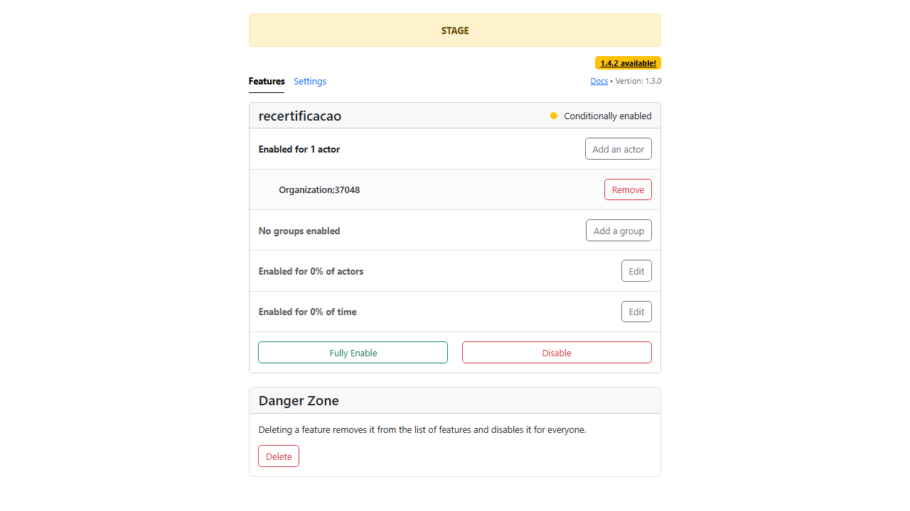
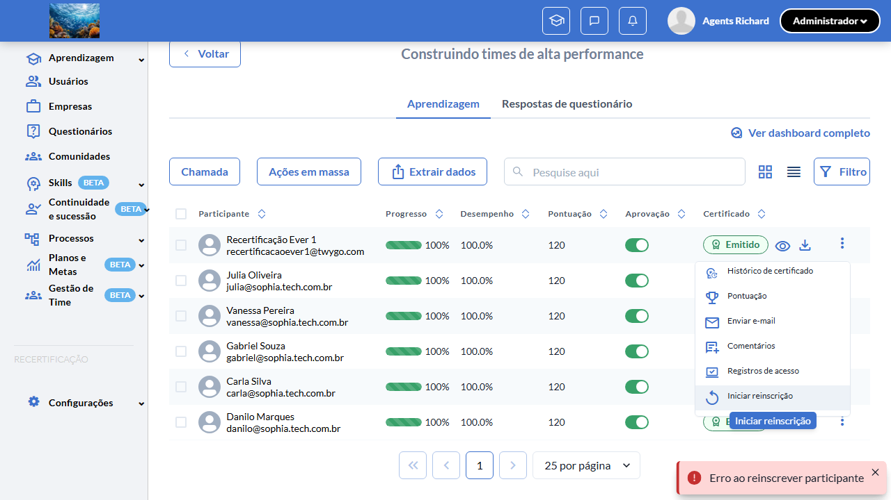

# Casos de teste — Recertificação

[← Voltar ao dashboard](index.md)

Lista detalhada por testsuite. Cada caso traz: o que era esperado pelo XML, quais steps foram executados, evidências (screenshots/trace), texto pronto pra registro de bug e — quando houver falha — uma explicação em PT-BR do motivo.

## Isolamento de Progresso, Score e Attendance por Inscrição

_4 caso(s) — 0 aprovado(s), 1 falha(s), 3 ignorado(s)_

### ❌ Falhou · TC1 · Aluno reinscrito tem progress/score/attendance zerados na nova inscrição · 🔴 Crítico

<a id="tc1-aluno-reinscrito-tem-progress-score-attendance-zerados-na-nova-inscricao"></a>_Arquivo:_ `tc1-progresso-score-attendance-zerados.spec.ts` · _Duração:_ 13.29s · _Browser:_ chromium

> **❌ Por que falhou:** Quantidade fora do esperado: deveria ser menor a < 400, mas obteve 422. Isso geralmente indica que a ação que deveria popular a tela (listagem/filtro/busca) ficou vazia ou retornou menos itens que o necessário.
> _Step impactado:_ **1. Reinscrever o aluno aprovado (progress=100, cert Emitido, recertification_number=0) → novo participant com recertification_number=1**

**Sumário (objetivo do caso):** Validar que `event_content_users` criados após reinscrição são vinculados ao novo `event_participant_id` e ficam isolados do histórico (RN 27, 28).

**Pré-condições:**

```
Feature flag `:recertificacao` ATIVA
Curso "Curso Isolamento w{workerIndex}" com `has_recertification = true`
Aluno aprovado com `recertification_number = 0`, `progress_score = 100`, certificado VALID
Banco com índice `unique_participant(user_id, event_id, partner_rel, recertification_number)` aplicado
```

**Passos do caso (XML/TestLink + execução Playwright):**

_Cada linha reproduz um passo do XML; a coluna **Status** traz o resultado da execução (do step Allure correspondente). Linhas com "Pré-condição" são da execução automatizada (login, navegação inicial) — não fazem parte do roteiro do XML._

| # | Ação do passo | Resultado esperado | Status | Notas | Duração |
|---|---|---|:---:|---|---:|
| 1 | Reinscrever o aluno aprovado pelo fluxo da suíte 2 TC3 | Novo participant criado com `recertification_number = 1`. | ❌ | Quantidade fora do esperado: deveria ser menor a < 400, mas obteve 422. Isso geralmente indica que a ação que deveria popular a tela (listagem/filtro/busca) ficou vazia ou retornou menos itens que o necessário. | 8.32s |
| 2 | Login com o aluno e acessar a página do curso no Play | Banner do curso exibe progresso `0%` (NÃO 100% do anterior). Status "Pendente". | ⊘ | Step não executado: o teste foi interrompido antes. Causa: Quantidade fora do esperado: deveria ser menor a < 400, mas obteve 422. Isso geralmente indica que a ação que deveria popular a tela (listagem/filtro/busca) ficou vazia ou retornou menos itens que o necessário.. | — |
| 3 | Avançar uma aula até `progress_score = 25` no novo participant | Progresso atualiza para 25% na UI do Play. | ⊘ | Step não executado: o teste foi interrompido antes. Causa: Quantidade fora do esperado: deveria ser menor a < 400, mas obteve 422. Isso geralmente indica que a ação que deveria popular a tela (listagem/filtro/busca) ficou vazia ou retornou menos itens que o necessário.. | — |
| 4 | Acessar como admin a lista de aprendizagem | Listagem padrão exibe apenas o participant atual com `progress_score = 25`. Histórico (recertification_number = 0, progress_score = 100) preservado em banco mas oculto do listing default (`is_latest_recertification = 1` filtra). | ⊘ | Step não executado: o teste foi interrompido antes. Causa: Quantidade fora do esperado: deveria ser menor a < 400, mas obteve 422. Isso geralmente indica que a ação que deveria popular a tela (listagem/filtro/busca) ficou vazia ou retornou menos itens que o necessário.. | — |

**Evidências:**

📁 _Pasta:_ [`artifacts/projects-recertificacao-te-490eb-e-zerados-na-nova-inscrição-chromium/`](artifacts/projects-recertificacao-te-490eb-e-zerados-na-nova-inscrição-chromium/)

- 📸 **Screenshot (screenshot)** — [`test-finished-1.png`](artifacts/projects-recertificacao-te-490eb-e-zerados-na-nova-inscrição-chromium/test-finished-1.png)

  

- 📸 **Screenshot (screenshot)** — [`test-failed-2.png`](artifacts/projects-recertificacao-te-490eb-e-zerados-na-nova-inscrição-chromium/test-failed-2.png)

  

- 🎬 [Vídeo da execução (video.webm)](artifacts/projects-recertificacao-te-490eb-e-zerados-na-nova-inscrição-chromium/video.webm)

- 🎬 [Vídeo da execução (video-1.webm)](artifacts/projects-recertificacao-te-490eb-e-zerados-na-nova-inscrição-chromium/video-1.webm)

- 📦 **Trace** — [`trace.zip`](artifacts/projects-recertificacao-te-490eb-e-zerados-na-nova-inscrição-chromium/trace.zip)

  ```bash
  npx playwright show-trace outputs/recertificacao/reports/isolamento-de-progresso-score-e-attendance-por-inscricao_20260527-153038/artifacts/projects-recertificacao-te-490eb-e-zerados-na-nova-inscrição-chromium/trace.zip
  ```

- 🎥 **Vídeo** — [`video.webm`](artifacts/projects-recertificacao-te-490eb-e-zerados-na-nova-inscrição-chromium/video.webm)

- 🎥 **Vídeo** — [`video-1.webm`](artifacts/projects-recertificacao-te-490eb-e-zerados-na-nova-inscrição-chromium/video-1.webm)

- 📄 **DOM no momento da falha** — [`error-context.md`](artifacts/projects-recertificacao-te-490eb-e-zerados-na-nova-inscrição-chromium/error-context.md)

#### 🐛 Pronto para registro de bug

> ❓ **Análise automática:** Inconclusivo (precisa investigação manual) · Confiança 🔴 baixa
> _Por quê:_ Sem sinal Network in-scope ou padrão de erro conhecido — revisar trace
> _Bug-report estruturado:_ [`bug-reports/isolamento-de-progresso-score-e-attendance-por-inscricao__tc1-aluno-reinscrito-tem-progress-score-attendance-zerados-na-nova-inscricao.md`](bug-reports/isolamento-de-progresso-score-e-attendance-por-inscricao__tc1-aluno-reinscrito-tem-progress-score-attendance-zerados-na-nova-inscricao.md)

**Próximas ações sugeridas:**
- Sem evidência suficiente para classificar — abrir `trace.zip` (`npx playwright show-trace`) para ver passo a passo da execução.
- Reabrir o agente com o trace em mãos para reclassificar manualmente em uma das 4 categorias.

**Descrição do BUG:** [Crítico] TC1 — Aluno reinscrito tem progress/score/attendance zerados na nova inscrição — Quantidade fora do esperado: deveria ser menor a < 400, mas obteve 422. Isso geralmente indica que a ação que deveria popular a tela (listagem/filtro/busca) ficou vazia ou retornou menos itens que o necessário.

**Passo a passo para reprodução:**
1. Pré: Feature flag `:recertificacao` ATIVA
1. Pré: Curso "Curso Isolamento w{workerIndex}" com `has_recertification = true`
1. Pré: Aluno aprovado com `recertification_number = 0`, `progress_score = 100`, certificado VALID
1. Pré: Banco com índice `unique_participant(user_id, event_id, partner_rel, recertification_number)` aplicado
1. 1. Reinscrever o aluno aprovado pelo fluxo da suíte 2 TC3
1. 2. Login com o aluno e acessar a página do curso no Play
1. 3. Avançar uma aula até `progress_score = 25` no novo participant
1. 4. Acessar como admin a lista de aprendizagem

**Comportamento esperado:** Novo participant criado com `recertification_number = 1`.

**Comportamento atual:** Quantidade fora do esperado: deveria ser menor a < 400, mas obteve 422. Isso geralmente indica que a ação que deveria popular a tela (listagem/filtro/busca) ficou vazia ou retornou menos itens que o necessário. (falha aconteceu no passo 1: "Reinscrever o aluno aprovado (progress=100, cert Emitido, recertification_number=0) → novo participant com recertification_number=1", que deveria resultar em: Novo participant criado com `recertification_number = 1`.)

**Informações:**

| Campo | Valor |
|---|---|
| URL | `https://recertificacao-testeqa.stage.twygoead.com/` |
| Login | Credenciais via env: `TWYGO_STAGING_RECERTIFICACAO_EMAIL` (consulte `.env`) |
| Senha | Credenciais via env: `TWYGO_STAGING_RECERTIFICACAO_PASSWORD` (consulte `.env`) |
| orgId | 37048 |
| Outros | Browser: chromium |
| Outros | runId: isolamento-de-progresso-score-e-attendance-por-inscricao_20260527-153038 |
| Outros | Duração até a falha: 13.29s |
| Outros | Step impactado: 1. Reinscrever o aluno aprovado (progress=100, cert Emitido, recertification_number=0) → novo participant com recertification_number=1 |

**Evidências:**

- Screenshot capturado pelo Playwright (screenshot): artifacts/projects-recertificacao-te-490eb-e-zerados-na-nova-inscrição-chromium/test-finished-1.png
- Screenshot capturado pelo Playwright (screenshot): artifacts/projects-recertificacao-te-490eb-e-zerados-na-nova-inscrição-chromium/test-failed-2.png
- Vídeo da execução (video-1.webm): artifacts/projects-recertificacao-te-490eb-e-zerados-na-nova-inscrição-chromium/video-1.webm
- Vídeo da execução (video.webm): artifacts/projects-recertificacao-te-490eb-e-zerados-na-nova-inscrição-chromium/video.webm
- Snapshot do DOM/contexto da página (error-context.md): artifacts/projects-recertificacao-te-490eb-e-zerados-na-nova-inscrição-chromium/error-context.md
- Trace completo do Playwright (.zip) — `npx playwright show-trace`: artifacts/projects-recertificacao-te-490eb-e-zerados-na-nova-inscrição-chromium/trace.zip

<details><summary>📋 Ver texto agregado para copiar (Jira/GitHub/Linear)</summary>

```
Descrição do BUG
[Crítico] TC1 — Aluno reinscrito tem progress/score/attendance zerados na nova inscrição — Quantidade fora do esperado: deveria ser menor a < 400, mas obteve 422. Isso geralmente indica que a ação que deveria popular a tela (listagem/filtro/busca) ficou vazia ou retornou menos itens que o necessário.

Passo a passo para reprodução
  Pré: Feature flag `:recertificacao` ATIVA
  Pré: Curso "Curso Isolamento w{workerIndex}" com `has_recertification = true`
  Pré: Aluno aprovado com `recertification_number = 0`, `progress_score = 100`, certificado VALID
  Pré: Banco com índice `unique_participant(user_id, event_id, partner_rel, recertification_number)` aplicado
  1. Reinscrever o aluno aprovado pelo fluxo da suíte 2 TC3
  2. Login com o aluno e acessar a página do curso no Play
  3. Avançar uma aula até `progress_score = 25` no novo participant
  4. Acessar como admin a lista de aprendizagem

Comportamento esperado
Novo participant criado com `recertification_number = 1`.

Comportamento atual
Quantidade fora do esperado: deveria ser menor a < 400, mas obteve 422. Isso geralmente indica que a ação que deveria popular a tela (listagem/filtro/busca) ficou vazia ou retornou menos itens que o necessário. (falha aconteceu no passo 1: "Reinscrever o aluno aprovado (progress=100, cert Emitido, recertification_number=0) → novo participant com recertification_number=1", que deveria resultar em: Novo participant criado com `recertification_number = 1`.)

Informações
- URL: https://recertificacao-testeqa.stage.twygoead.com/
- Login: Credenciais via env: `TWYGO_STAGING_RECERTIFICACAO_EMAIL` (consulte `.env`)
- Senha: Credenciais via env: `TWYGO_STAGING_RECERTIFICACAO_PASSWORD` (consulte `.env`)
- ID do ambiente (orgId): 37048
- Outros:
  - Browser: chromium
  - runId: isolamento-de-progresso-score-e-attendance-por-inscricao_20260527-153038
  - Duração até a falha: 13.29s
  - Step impactado: 1. Reinscrever o aluno aprovado (progress=100, cert Emitido, recertification_number=0) → novo participant com recertification_number=1

Evidências
- Screenshot capturado pelo Playwright (screenshot): artifacts/projects-recertificacao-te-490eb-e-zerados-na-nova-inscrição-chromium/test-finished-1.png
- Screenshot capturado pelo Playwright (screenshot): artifacts/projects-recertificacao-te-490eb-e-zerados-na-nova-inscrição-chromium/test-failed-2.png
- Vídeo da execução (video-1.webm): artifacts/projects-recertificacao-te-490eb-e-zerados-na-nova-inscrição-chromium/video-1.webm
- Vídeo da execução (video.webm): artifacts/projects-recertificacao-te-490eb-e-zerados-na-nova-inscrição-chromium/video.webm
- Snapshot do DOM/contexto da página (error-context.md): artifacts/projects-recertificacao-te-490eb-e-zerados-na-nova-inscrição-chromium/error-context.md
- Trace completo do Playwright (.zip) — `npx playwright show-trace`: artifacts/projects-recertificacao-te-490eb-e-zerados-na-nova-inscrição-chromium/trace.zip

Execução
- runId: isolamento-de-progresso-score-e-attendance-por-inscricao_20260527-153038
- environment.json: staging-recertificacao
- testsuite: Isolamento de Progresso, Score e Attendance por Inscrição
- testcase: TC1 — Aluno reinscrito tem progress/score/attendance zerados na nova inscrição

```

</details>

<details><summary>🔧 Stack trace técnica completa (para desenvolvedor)</summary>

```
Error: BUG DE PRODUTO: POST /api/v1/o/37048/contents/806755/event_participants retornou 422 ao reinscrever aluno elegível (aprovado, 100%, cert Emitido, recertification_number=0) com a flag :recertificacao ON e o switch has_recertification ON. Body: {"data":null,"message":"Error Inesperado","status":422}. Reinscrição individual quebrada no env 37048 — corrigir o endpoint.

expect(received).toBeLessThan(expected)

Expected: < 400
Received:   422
```

</details>

---

### ⊘ Ignorado · TC2 — Aluno NÃO reinscrito (recertification_number = 0) mantém progresso histórico após deploy 

<a id="tc2-aluno-nao-reinscrito-recertification-number-0-mantem-progresso-historico-apos-deploy"></a>_Arquivo:_ `tc2-progresso-historico-mantido-recertification-zero.spec.ts` · _Duração:_ 15.55s · _Browser:_ chromium

> **⊘ Por que foi ignorado:** Marcado para revisão (test.fixme): DB-only: requer aluno pré-deploy com event_content_users.event_participant_id IS NULL — artefato de backfill da migration, não provisionável via UI. Validar via psql/Rails console no env 37048 (agent-db V2).

**Passos do caso (XML/TestLink + execução Playwright):**

_Cada linha reproduz um passo do XML; a coluna **Status** traz o resultado da execução (do step Allure correspondente). Linhas com "Pré-condição" são da execução automatizada (login, navegação inicial) — não fazem parte do roteiro do XML._

_Sem steps Allure ou metadata XML para este testcase._

**Evidências:**

📁 _Pasta:_ [`artifacts/projects-recertificacao-te-53d5c-resso-histórico-após-deploy-chromium/`](artifacts/projects-recertificacao-te-53d5c-resso-histórico-após-deploy-chromium/)

- 📸 **Screenshot (screenshot)** — [`test-finished-1.png`](artifacts/projects-recertificacao-te-53d5c-resso-histórico-após-deploy-chromium/test-finished-1.png)

  

- 🎬 [Vídeo da execução (video.webm)](artifacts/projects-recertificacao-te-53d5c-resso-histórico-após-deploy-chromium/video.webm)

- 🎬 [Vídeo da execução (video-1.webm)](artifacts/projects-recertificacao-te-53d5c-resso-histórico-após-deploy-chromium/video-1.webm)

- 📦 **Trace** — [`trace.zip`](artifacts/projects-recertificacao-te-53d5c-resso-histórico-após-deploy-chromium/trace.zip)

  ```bash
  npx playwright show-trace outputs/recertificacao/reports/isolamento-de-progresso-score-e-attendance-por-inscricao_20260527-153038/artifacts/projects-recertificacao-te-53d5c-resso-histórico-após-deploy-chromium/trace.zip
  ```

- 🎥 **Vídeo** — [`video.webm`](artifacts/projects-recertificacao-te-53d5c-resso-histórico-após-deploy-chromium/video.webm)

- 🎥 **Vídeo** — [`video-1.webm`](artifacts/projects-recertificacao-te-53d5c-resso-histórico-após-deploy-chromium/video-1.webm)

#### ⏳ Pendente — execução automatizada não realizada

- **Severidade do caso (XML):** —
- **Motivo declarado pelo spec:** DB-only: requer aluno pré-deploy com event_content_users.event_participant_id IS NULL — artefato de backfill da migration, não provisionável via UI. Validar via psql/Rails console no env 37048 (agent-db V2).
- **Categoria:** _não declarada_ — pra próxima revisão, ajustar o spec para `test.fixme(true, '[Categoria] motivo')` com uma das categorias canônicas (xml-desatualizado | seed-ausente | dep-externa | bloqueio-temporario).

**Roteiro do XML (para validação manual):**
1. — (sem steps documentados no XML)

> Esse caso não bloqueia a build, mas precisa de validação manual ou ajuste no agente.


---

### ⊘ Ignorado · TC3 · Índice único `unique_participant` rejeita duplicata `(user_id, event_id, partner_rel, recertification_number)` · 🔴 Crítico

<a id="tc3-indice-unico-unique-participant-rejeita-duplicata-user-id-event-id-partner-rel-recertification-number"></a>_Arquivo:_ `tc3-indice-unique-participant-rejeita-duplicata.spec.ts` · _Duração:_ 0.00s · _Browser:_ chromium

> **⊘ Por que foi ignorado:** Marcado para revisão (test.fixme): requer validação direta no banco — DB-pure fora do escopo Playwright. Validar manualmente via psql tentando INSERT duplicado e capturando 23505 unique_violation.

**Sumário (objetivo do caso):** Validar nova unicidade composta: tentativa de inserir 2 participants idênticos (mesmo user, event, partner_rel e recertification_number) falha com violação (RN 29).

**Pré-condições:**

```
Feature flag `:recertificacao` ATIVA
Curso "Curso Isolamento w{workerIndex}" com `has_recertification = true`
Aluno aprovado com `recertification_number = 0`, `progress_score = 100`, certificado VALID
Banco com índice `unique_participant(user_id, event_id, partner_rel, recertification_number)` aplicado
```

**Passos do caso (XML/TestLink + execução Playwright):**

_Cada linha reproduz um passo do XML; a coluna **Status** traz o resultado da execução (do step Allure correspondente). Linhas com "Pré-condição" são da execução automatizada (login, navegação inicial) — não fazem parte do roteiro do XML._

| # | Ação do passo | Resultado esperado | Status | Notas | Duração |
|---|---|---|:---:|---|---:|
| 1 | Pré-condição: 1 participant existente com `recertification_number = 1` para par `(user_id, event_id)`. | Estado preparado. | ⊘ | Step não executado — Marcado para revisão (test.fixme): requer validação direta no banco — DB-pure fora do escopo Playwright. Validar manualmente via psql tentando INSERT duplicado e capturando 23505 unique_violation. | — |
| 2 | Via Rails console em staging, tentar `EventParticipant.create!(user_id: X, event_id: Y, partner_rel: P, recertification_number: 1, ...)` | Execução lança `ActiveRecord::RecordNotUnique` ou validação Rails de uniqueness. | ⊘ | Step não executado — Marcado para revisão (test.fixme): requer validação direta no banco — DB-pure fora do escopo Playwright. Validar manualmente via psql tentando INSERT duplicado e capturando 23505 unique_violation. | — |
| 3 | Consultar a tabela "event_participants" via Rails console com "EventParticipant.where(user_id: X, event_id: Y, partner_rel: P, recertification_number: 1).count" | Contagem retorna `1` — apenas 1 row para o par `(user_id, event_id, partner_rel, recertification_number = 1)`. | ⊘ | Step não executado — Marcado para revisão (test.fixme): requer validação direta no banco — DB-pure fora do escopo Playwright. Validar manualmente via psql tentando INSERT duplicado e capturando 23505 unique_violation. | — |

**Evidências:**

_Sem evidências anexadas._

#### ⏳ Pendente — execução automatizada não realizada

- **Severidade do caso (XML):** Crítico
- **Motivo declarado pelo spec:** requer validação direta no banco — DB-pure fora do escopo Playwright. Validar manualmente via psql tentando INSERT duplicado e capturando 23505 unique_violation.
- **Categoria:** _não declarada_ — pra próxima revisão, ajustar o spec para `test.fixme(true, '[Categoria] motivo')` com uma das categorias canônicas (xml-desatualizado | seed-ausente | dep-externa | bloqueio-temporario).

**Roteiro do XML (para validação manual):**
1. Pré: Feature flag `:recertificacao` ATIVA
1. Pré: Curso "Curso Isolamento w{workerIndex}" com `has_recertification = true`
1. Pré: Aluno aprovado com `recertification_number = 0`, `progress_score = 100`, certificado VALID
1. Pré: Banco com índice `unique_participant(user_id, event_id, partner_rel, recertification_number)` aplicado
1. 1. Pré-condição: 1 participant existente com `recertification_number = 1` para par `(user_id, event_id)`.
1. 2. Via Rails console em staging, tentar `EventParticipant.create!(user_id: X, event_id: Y, partner_rel: P, recertification_number: 1, ...)`
1. 3. Consultar a tabela "event_participants" via Rails console com "EventParticipant.where(user_id: X, event_id: Y, partner_rel: P, recertification_number: 1).count"

> Esse caso não bloqueia a build, mas precisa de validação manual ou ajuste no agente.


---

### ⊘ Ignorado · TC4 · Validações Rails de email/cpf escopam por `[:event_id, :recertification_number]` · 🟡 Normal

<a id="tc4-validacoes-rails-de-email-cpf-escopam-por-event-id-recertification-number"></a>_Arquivo:_ `tc4-uniqueness-email-cpf-escopa-por-recertification.spec.ts` · _Duração:_ 0.00s · _Browser:_ chromium

> **⊘ Por que foi ignorado:** Marcado para revisão (test.fixme): requer validação direta no banco + Rails uniqueness validator — DB-pure. Validar manualmente via Rails console executando EventParticipant.create! em sequência.

**Sumário (objetivo do caso):** Validar que validators de uniqueness de email/cpf no modelo `EventParticipant` aceitam o mesmo email/cpf em diferentes valores de `recertification_number` (RN 29.1).

**Pré-condições:**

```
Feature flag `:recertificacao` ATIVA
Curso "Curso Isolamento w{workerIndex}" com `has_recertification = true`
Aluno aprovado com `recertification_number = 0`, `progress_score = 100`, certificado VALID
Banco com índice `unique_participant(user_id, event_id, partner_rel, recertification_number)` aplicado
```

**Passos do caso (XML/TestLink + execução Playwright):**

_Cada linha reproduz um passo do XML; a coluna **Status** traz o resultado da execução (do step Allure correspondente). Linhas com "Pré-condição" são da execução automatizada (login, navegação inicial) — não fazem parte do roteiro do XML._

| # | Ação do passo | Resultado esperado | Status | Notas | Duração |
|---|---|---|:---:|---|---:|
| 1 | Via Rails console, criar participant com email "teste@example.com" e `recertification_number = 0` no curso X. | Participant criado com sucesso. | ⊘ | Step não executado — Marcado para revisão (test.fixme): requer validação direta no banco + Rails uniqueness validator — DB-pure. Validar manualmente via Rails console executando EventParticipant.create! em sequência. | — |
| 2 | Criar segundo participant com mesmo email e `recertification_number = 1` no MESMO curso. | Participant criado com sucesso (validação aceita porque scope inclui `recertification_number`). | ⊘ | Step não executado — Marcado para revisão (test.fixme): requer validação direta no banco + Rails uniqueness validator — DB-pure. Validar manualmente via Rails console executando EventParticipant.create! em sequência. | — |
| 3 | Tentar criar terceiro participant com mesmo email e `recertification_number = 1` no mesmo curso (duplicata exata). | Falha com validação de uniqueness. | ⊘ | Step não executado — Marcado para revisão (test.fixme): requer validação direta no banco + Rails uniqueness validator — DB-pure. Validar manualmente via Rails console executando EventParticipant.create! em sequência. | — |

**Evidências:**

_Sem evidências anexadas._

#### ⏳ Pendente — execução automatizada não realizada

- **Severidade do caso (XML):** Normal
- **Motivo declarado pelo spec:** requer validação direta no banco + Rails uniqueness validator — DB-pure. Validar manualmente via Rails console executando EventParticipant.create! em sequência.
- **Categoria:** _não declarada_ — pra próxima revisão, ajustar o spec para `test.fixme(true, '[Categoria] motivo')` com uma das categorias canônicas (xml-desatualizado | seed-ausente | dep-externa | bloqueio-temporario).

**Roteiro do XML (para validação manual):**
1. Pré: Feature flag `:recertificacao` ATIVA
1. Pré: Curso "Curso Isolamento w{workerIndex}" com `has_recertification = true`
1. Pré: Aluno aprovado com `recertification_number = 0`, `progress_score = 100`, certificado VALID
1. Pré: Banco com índice `unique_participant(user_id, event_id, partner_rel, recertification_number)` aplicado
1. 1. Via Rails console, criar participant com email "teste@example.com" e `recertification_number = 0` no curso X.
1. 2. Criar segundo participant com mesmo email e `recertification_number = 1` no MESMO curso.
1. 3. Tentar criar terceiro participant com mesmo email e `recertification_number = 1` no mesmo curso (duplicata exata).

> Esse caso não bloqueia a build, mas precisa de validação manual ou ajuste no agente.


---
