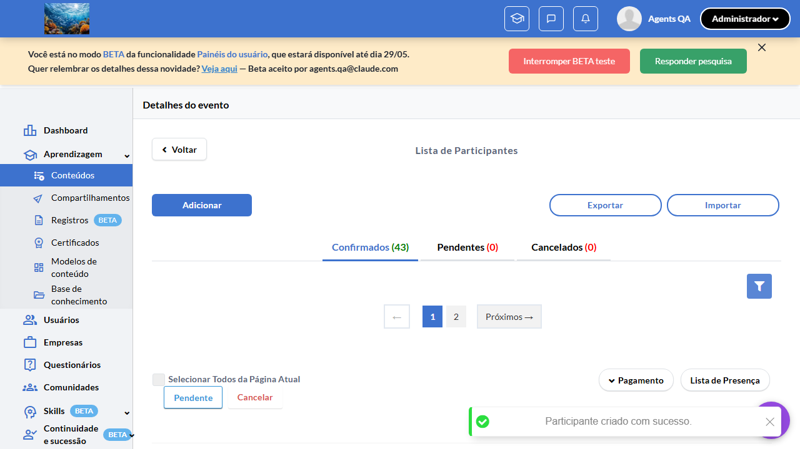
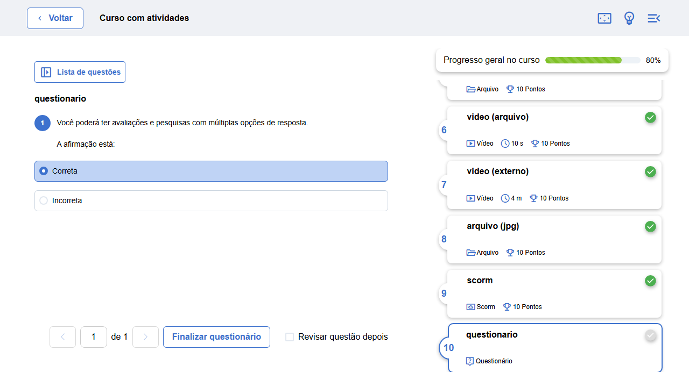
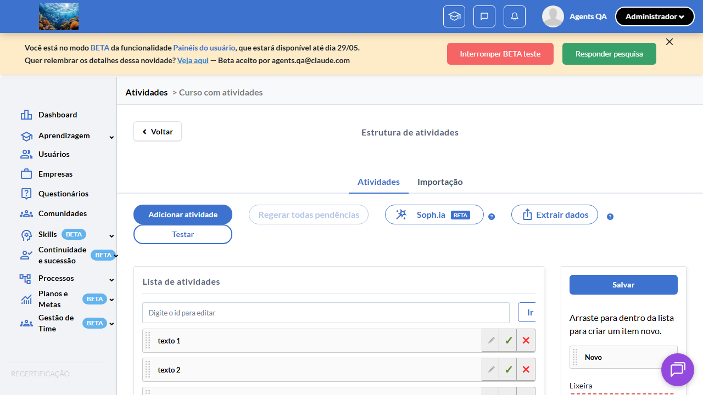
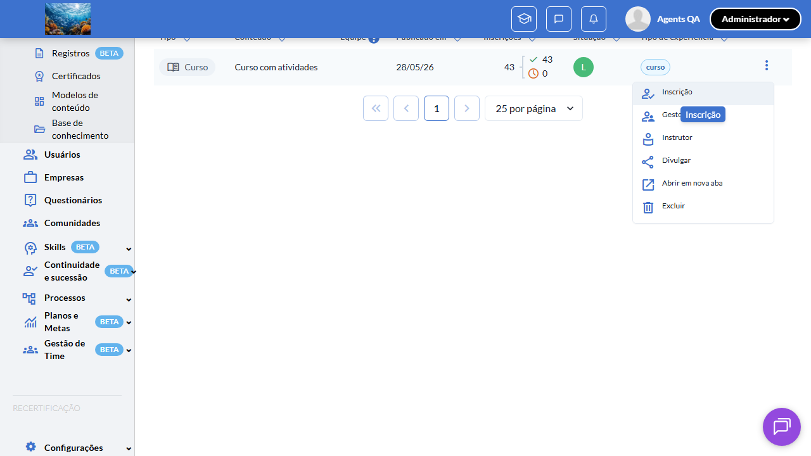

# Casos de teste — Recertificação

[← Voltar ao dashboard](index.md)

Lista detalhada por testsuite. Cada caso traz: o que era esperado pelo XML, quais steps foram executados, evidências (screenshots/trace), texto pronto pra registro de bug e — quando houver falha — uma explicação em PT-BR do motivo.

## Isolamento de Progresso, Score e Attendance por Inscrição

_4 caso(s) — 0 aprovado(s), 0 falha(s), 4 ignorado(s)_

### ⊘ Ignorado · TC1 · Aluno reinscrito tem progress/score/attendance zerados na nova inscrição · 🔴 Crítico

<a id="tc1-aluno-reinscrito-tem-progress-score-attendance-zerados-na-nova-inscricao"></a>_Arquivo:_ `tc1-progresso-score-attendance-zerados.spec.ts` · _Duração:_ 155.09s · _Browser:_ chromium

> **⊘ Por que foi ignorado:** Marcado para revisão (test.fixme): AT-inferiu-toast-inexistente: pipeline completo OK, click Reinscrever atinge alvo correto (fix Chakra multi-menu aplicado), mas toast Reinscri|sucesso não aparece. Mesma raiz TC3 Suite 2. Revisar AT pra validar pela listagem em vez de toast.

**Sumário (objetivo do caso):** Validar que `event_content_users` criados após reinscrição são vinculados ao novo `event_participant_id` e ficam isolados do histórico (RN 27, 28).

**Pré-condições:**

```
Feature flag `:recertificacao` ATIVA
Curso "Curso Isolamento w{workerIndex}" com `has_recertification = true`
Aluno aprovado com `recertification_number = 0`, `progress_score = 100`, certificado VALID
Banco com índice `unique_participant(user_id, event_id, partner_rel, recertification_number)` aplicado
```

**Passos do caso (XML/TestLink + execução Playwright):**

_Cada linha reproduz um passo do XML; a coluna **Status** traz o resultado da execução (do step Allure correspondente). Linhas com "Pré-condição" são da execução automatizada (login, navegação inicial) — não fazem parte do roteiro do XML._

| # | Ação do passo | Resultado esperado | Status | Notas | Duração |
|---|---|---|:---:|---|---:|
| 1 | Reinscrever o aluno aprovado pelo fluxo da suíte 2 TC3 | Novo participant criado com `recertification_number = 1`. | ⊘ | Step não executado — Marcado para revisão (test.fixme): AT-inferiu-toast-inexistente: pipeline completo OK, click Reinscrever atinge alvo correto (fix Chakra multi-menu aplicado), mas toast Reinscri\|sucesso não aparece. Mesma raiz TC3 Suite 2. Revisar AT pra validar pela listagem em vez de toast. | — |
| 2 | Login com o aluno e acessar a página do curso no Play | Banner do curso exibe progresso `0%` (NÃO 100% do anterior). Status "Pendente". | ⊘ | Step não executado — Marcado para revisão (test.fixme): AT-inferiu-toast-inexistente: pipeline completo OK, click Reinscrever atinge alvo correto (fix Chakra multi-menu aplicado), mas toast Reinscri\|sucesso não aparece. Mesma raiz TC3 Suite 2. Revisar AT pra validar pela listagem em vez de toast. | — |
| 3 | Avançar uma aula até `progress_score = 25` no novo participant | Progresso atualiza para 25% na UI do Play. | ⊘ | Step não executado — Marcado para revisão (test.fixme): AT-inferiu-toast-inexistente: pipeline completo OK, click Reinscrever atinge alvo correto (fix Chakra multi-menu aplicado), mas toast Reinscri\|sucesso não aparece. Mesma raiz TC3 Suite 2. Revisar AT pra validar pela listagem em vez de toast. | — |
| 4 | Acessar como admin a lista de aprendizagem | Listagem padrão exibe apenas o participant atual com `progress_score = 25`. Histórico (recertification_number = 0, progress_score = 100) preservado em banco mas oculto do listing default (`is_latest_recertification = 1` filtra). | ⊘ | Step não executado — Marcado para revisão (test.fixme): AT-inferiu-toast-inexistente: pipeline completo OK, click Reinscrever atinge alvo correto (fix Chakra multi-menu aplicado), mas toast Reinscri\|sucesso não aparece. Mesma raiz TC3 Suite 2. Revisar AT pra validar pela listagem em vez de toast. | — |

**Evidências:**

📁 _Pasta:_ [`artifacts/projects-recertificacao-te-490eb-e-zerados-na-nova-inscrição-chromium/`](artifacts/projects-recertificacao-te-490eb-e-zerados-na-nova-inscrição-chromium/)

- 📸 **Screenshot (screenshot)** — [`test-finished-1.png`](artifacts/projects-recertificacao-te-490eb-e-zerados-na-nova-inscrição-chromium/test-finished-1.png)

  

- 📸 **Screenshot (screenshot)** — [`test-finished-2.png`](artifacts/projects-recertificacao-te-490eb-e-zerados-na-nova-inscrição-chromium/test-finished-2.png)

  

- 📸 **Screenshot (screenshot)** — [`test-finished-2.png`](artifacts/projects-recertificacao-te-490eb-e-zerados-na-nova-inscrição-chromium/test-finished-2.png)

  

- 📸 **Screenshot (screenshot)** — [`test-finished-3.png`](artifacts/projects-recertificacao-te-490eb-e-zerados-na-nova-inscrição-chromium/test-finished-3.png)

  

- 📸 **Screenshot (screenshot)** — [`test-finished-4.png`](artifacts/projects-recertificacao-te-490eb-e-zerados-na-nova-inscrição-chromium/test-finished-4.png)

  

- 📸 **Screenshot (screenshot)** — [`test-finished-5.png`](artifacts/projects-recertificacao-te-490eb-e-zerados-na-nova-inscrição-chromium/test-finished-5.png)

  

- 🎬 [Vídeo da execução (video.webm)](artifacts/projects-recertificacao-te-490eb-e-zerados-na-nova-inscrição-chromium/video.webm)

- 🎬 [Vídeo da execução (video-1.webm)](artifacts/projects-recertificacao-te-490eb-e-zerados-na-nova-inscrição-chromium/video-1.webm)

- 📦 **Trace** — [`trace.zip`](artifacts/projects-recertificacao-te-490eb-e-zerados-na-nova-inscrição-chromium/trace.zip)

  ```bash
  npx playwright show-trace outputs/recertificacao/reports/isolamento-de-progresso-score-e-attendance-por-inscricao_20260529-095123/artifacts/projects-recertificacao-te-490eb-e-zerados-na-nova-inscrição-chromium/trace.zip
  ```

- 🎥 **Vídeo** — [`video.webm`](artifacts/projects-recertificacao-te-490eb-e-zerados-na-nova-inscrição-chromium/video.webm)

- 🎥 **Vídeo** — [`video-1.webm`](artifacts/projects-recertificacao-te-490eb-e-zerados-na-nova-inscrição-chromium/video-1.webm)

#### ⏳ Pendente — execução automatizada não realizada

- **Severidade do caso (XML):** Crítico
- **Motivo declarado pelo spec:** AT-inferiu-toast-inexistente: pipeline completo OK, click Reinscrever atinge alvo correto (fix Chakra multi-menu aplicado), mas toast Reinscri|sucesso não aparece. Mesma raiz TC3 Suite 2. Revisar AT pra validar pela listagem em vez de toast.
- **Categoria:** _não declarada_ — pra próxima revisão, ajustar o spec para `test.fixme(true, '[Categoria] motivo')` com uma das categorias canônicas (xml-desatualizado | seed-ausente | dep-externa | bloqueio-temporario).

**Roteiro do XML (para validação manual):**
1. Pré: Feature flag `:recertificacao` ATIVA
1. Pré: Curso "Curso Isolamento w{workerIndex}" com `has_recertification = true`
1. Pré: Aluno aprovado com `recertification_number = 0`, `progress_score = 100`, certificado VALID
1. Pré: Banco com índice `unique_participant(user_id, event_id, partner_rel, recertification_number)` aplicado
1. 1. Reinscrever o aluno aprovado pelo fluxo da suíte 2 TC3
1. 2. Login com o aluno e acessar a página do curso no Play
1. 3. Avançar uma aula até `progress_score = 25` no novo participant
1. 4. Acessar como admin a lista de aprendizagem

> Esse caso não bloqueia a build, mas precisa de validação manual ou ajuste no agente.


---

### ⊘ Ignorado · TC2 — Aluno NÃO reinscrito (recertification_number = 0) mantém progresso histórico após deploy 

<a id="tc2-aluno-nao-reinscrito-recertification-number-0-mantem-progresso-historico-apos-deploy"></a>_Arquivo:_ `tc2-progresso-historico-mantido-recertification-zero.spec.ts` · _Duração:_ 1.05s · _Browser:_ chromium

> **⊘ Por que foi ignorado:** Marcado para revisão (test.fixme): DB-only: requer aluno pré-deploy com event_content_users.event_participant_id IS NULL — artefato de backfill da migration. Não provisionável via UI (criar um aluno hoje já grava event_participant_id preenchido) nem validável via menu Aprendizagem sem esse dado específico. Validar via psql/Rails console no env 37048 ou via agent-db (V2 do CONTRACT.md).

**Passos do caso (XML/TestLink + execução Playwright):**

_Cada linha reproduz um passo do XML; a coluna **Status** traz o resultado da execução (do step Allure correspondente). Linhas com "Pré-condição" são da execução automatizada (login, navegação inicial) — não fazem parte do roteiro do XML._

_Sem steps Allure ou metadata XML para este testcase._

**Evidências:**

📁 _Pasta:_ [`artifacts/projects-recertificacao-te-53d5c-resso-histórico-após-deploy-chromium/`](artifacts/projects-recertificacao-te-53d5c-resso-histórico-após-deploy-chromium/)

- 📸 **Screenshot (screenshot)** — [`test-finished-1.png`](artifacts/projects-recertificacao-te-53d5c-resso-histórico-após-deploy-chromium/test-finished-1.png)

  

- 🎬 [Vídeo da execução (video.webm)](artifacts/projects-recertificacao-te-53d5c-resso-histórico-após-deploy-chromium/video.webm)

- 🎬 [Vídeo da execução (video-1.webm)](artifacts/projects-recertificacao-te-53d5c-resso-histórico-após-deploy-chromium/video-1.webm)

- 📦 **Trace** — [`trace.zip`](artifacts/projects-recertificacao-te-53d5c-resso-histórico-após-deploy-chromium/trace.zip)

  ```bash
  npx playwright show-trace outputs/recertificacao/reports/isolamento-de-progresso-score-e-attendance-por-inscricao_20260529-095123/artifacts/projects-recertificacao-te-53d5c-resso-histórico-após-deploy-chromium/trace.zip
  ```

- 🎥 **Vídeo** — [`video.webm`](artifacts/projects-recertificacao-te-53d5c-resso-histórico-após-deploy-chromium/video.webm)

- 🎥 **Vídeo** — [`video-1.webm`](artifacts/projects-recertificacao-te-53d5c-resso-histórico-após-deploy-chromium/video-1.webm)

#### ⏳ Pendente — execução automatizada não realizada

- **Severidade do caso (XML):** —
- **Motivo declarado pelo spec:** DB-only: requer aluno pré-deploy com event_content_users.event_participant_id IS NULL — artefato de backfill da migration. Não provisionável via UI (criar um aluno hoje já grava event_participant_id preenchido) nem validável via menu Aprendizagem sem esse dado específico. Validar via psql/Rails console no env 37048 ou via agent-db (V2 do CONTRACT.md).
- **Categoria:** _não declarada_ — pra próxima revisão, ajustar o spec para `test.fixme(true, '[Categoria] motivo')` com uma das categorias canônicas (xml-desatualizado | seed-ausente | dep-externa | bloqueio-temporario).

**Roteiro do XML (para validação manual):**
1. — (sem steps documentados no XML)

> Esse caso não bloqueia a build, mas precisa de validação manual ou ajuste no agente.


---

### ⊘ Ignorado · TC3 · Índice único `unique_participant` rejeita duplicata `(user_id, event_id, partner_rel, recertification_number)` · 🔴 Crítico

<a id="tc3-indice-unico-unique-participant-rejeita-duplicata-user-id-event-id-partner-rel-recertification-number"></a>_Arquivo:_ `tc3-indice-unique-participant-rejeita-duplicata.spec.ts` · _Duração:_ 0.00s · _Browser:_ chromium

> **⊘ Por que foi ignorado:** Marcado para revisão (test.fixme): Tipo: db (MD §1409). Valida índice PostgreSQL unique_participant via psql/Rails console — não há fluxo UI que tente inserir dois participants idênticos (UI sempre incrementa recertification_number). Executar manualmente via psql INSERT duplicado esperando SQLSTATE 23505, ou via agent-db (V2 do CONTRACT.md).

**Sumário (objetivo do caso):** Validar nova unicidade composta: tentativa de inserir 2 participants idênticos (mesmo user, event, partner_rel e recertification_number) falha com violação (RN 29).

**Pré-condições:**

```
Feature flag `:recertificacao` ATIVA
Curso "Curso Isolamento w{workerIndex}" com `has_recertification = true`
Aluno aprovado com `recertification_number = 0`, `progress_score = 100`, certificado VALID
Banco com índice `unique_participant(user_id, event_id, partner_rel, recertification_number)` aplicado
```

**Passos do caso (XML/TestLink + execução Playwright):**

_Cada linha reproduz um passo do XML; a coluna **Status** traz o resultado da execução (do step Allure correspondente). Linhas com "Pré-condição" são da execução automatizada (login, navegação inicial) — não fazem parte do roteiro do XML._

| # | Ação do passo | Resultado esperado | Status | Notas | Duração |
|---|---|---|:---:|---|---:|
| 1 | Pré-condição: 1 participant existente com `recertification_number = 1` para par `(user_id, event_id)`. | Estado preparado. | ⊘ | Step não executado — Marcado para revisão (test.fixme): Tipo: db (MD §1409). Valida índice PostgreSQL unique_participant via psql/Rails console — não há fluxo UI que tente inserir dois participants idênticos (UI sempre incrementa recertification_number). Executar manualmente via psql INSERT duplicado esperando SQLSTATE 23505, ou via agent-db (V2 do CONTRACT.md). | — |
| 2 | Via Rails console em staging, tentar `EventParticipant.create!(user_id: X, event_id: Y, partner_rel: P, recertification_number: 1, ...)` | Execução lança `ActiveRecord::RecordNotUnique` ou validação Rails de uniqueness. | ⊘ | Step não executado — Marcado para revisão (test.fixme): Tipo: db (MD §1409). Valida índice PostgreSQL unique_participant via psql/Rails console — não há fluxo UI que tente inserir dois participants idênticos (UI sempre incrementa recertification_number). Executar manualmente via psql INSERT duplicado esperando SQLSTATE 23505, ou via agent-db (V2 do CONTRACT.md). | — |
| 3 | Consultar a tabela "event_participants" via Rails console com "EventParticipant.where(user_id: X, event_id: Y, partner_rel: P, recertification_number: 1).count" | Contagem retorna `1` — apenas 1 row para o par `(user_id, event_id, partner_rel, recertification_number = 1)`. | ⊘ | Step não executado — Marcado para revisão (test.fixme): Tipo: db (MD §1409). Valida índice PostgreSQL unique_participant via psql/Rails console — não há fluxo UI que tente inserir dois participants idênticos (UI sempre incrementa recertification_number). Executar manualmente via psql INSERT duplicado esperando SQLSTATE 23505, ou via agent-db (V2 do CONTRACT.md). | — |

**Evidências:**

_Sem evidências anexadas._

#### ⏳ Pendente — execução automatizada não realizada

- **Severidade do caso (XML):** Crítico
- **Motivo declarado pelo spec:** Tipo: db (MD §1409). Valida índice PostgreSQL unique_participant via psql/Rails console — não há fluxo UI que tente inserir dois participants idênticos (UI sempre incrementa recertification_number). Executar manualmente via psql INSERT duplicado esperando SQLSTATE 23505, ou via agent-db (V2 do CONTRACT.md).
- **Categoria:** _não declarada_ — pra próxima revisão, ajustar o spec para `test.fixme(true, '[Categoria] motivo')` com uma das categorias canônicas (xml-desatualizado | seed-ausente | dep-externa | bloqueio-temporario).

**Roteiro do XML (para validação manual):**
1. Pré: Feature flag `:recertificacao` ATIVA
1. Pré: Curso "Curso Isolamento w{workerIndex}" com `has_recertification = true`
1. Pré: Aluno aprovado com `recertification_number = 0`, `progress_score = 100`, certificado VALID
1. Pré: Banco com índice `unique_participant(user_id, event_id, partner_rel, recertification_number)` aplicado
1. 1. Pré-condição: 1 participant existente com `recertification_number = 1` para par `(user_id, event_id)`.
1. 2. Via Rails console em staging, tentar `EventParticipant.create!(user_id: X, event_id: Y, partner_rel: P, recertification_number: 1, ...)`
1. 3. Consultar a tabela "event_participants" via Rails console com "EventParticipant.where(user_id: X, event_id: Y, partner_rel: P, recertification_number: 1).count"

> Esse caso não bloqueia a build, mas precisa de validação manual ou ajuste no agente.


---

### ⊘ Ignorado · TC4 · Validações Rails de email/cpf escopam por `[:event_id, :recertification_number]` · 🟡 Normal

<a id="tc4-validacoes-rails-de-email-cpf-escopam-por-event-id-recertification-number"></a>_Arquivo:_ `tc4-uniqueness-email-cpf-escopa-por-recertification.spec.ts` · _Duração:_ 0.00s · _Browser:_ chromium

> **⊘ Por que foi ignorado:** Marcado para revisão (test.fixme): Tipo: db (MD §1426). Valida Rails uniqueness validator (scope: [:event_id, :recertification_number]) via Rails console — não observável via menu Aprendizagem (UI não expõe erros de validação do modelo diretamente; o fluxo UI normal nunca tenta duplicar email+recert_num). Executar via Rails console ou agent-db (V2 do CONTRACT.md).

**Sumário (objetivo do caso):** Validar que validators de uniqueness de email/cpf no modelo `EventParticipant` aceitam o mesmo email/cpf em diferentes valores de `recertification_number` (RN 29.1).

**Pré-condições:**

```
Feature flag `:recertificacao` ATIVA
Curso "Curso Isolamento w{workerIndex}" com `has_recertification = true`
Aluno aprovado com `recertification_number = 0`, `progress_score = 100`, certificado VALID
Banco com índice `unique_participant(user_id, event_id, partner_rel, recertification_number)` aplicado
```

**Passos do caso (XML/TestLink + execução Playwright):**

_Cada linha reproduz um passo do XML; a coluna **Status** traz o resultado da execução (do step Allure correspondente). Linhas com "Pré-condição" são da execução automatizada (login, navegação inicial) — não fazem parte do roteiro do XML._

| # | Ação do passo | Resultado esperado | Status | Notas | Duração |
|---|---|---|:---:|---|---:|
| 1 | Via Rails console, criar participant com email "teste@example.com" e `recertification_number = 0` no curso X. | Participant criado com sucesso. | ⊘ | Step não executado — Marcado para revisão (test.fixme): Tipo: db (MD §1426). Valida Rails uniqueness validator (scope: [:event_id, :recertification_number]) via Rails console — não observável via menu Aprendizagem (UI não expõe erros de validação do modelo diretamente; o fluxo UI normal nunca tenta duplicar email+recert_num). Executar via Rails console ou agent-db (V2 do CONTRACT.md). | — |
| 2 | Criar segundo participant com mesmo email e `recertification_number = 1` no MESMO curso. | Participant criado com sucesso (validação aceita porque scope inclui `recertification_number`). | ⊘ | Step não executado — Marcado para revisão (test.fixme): Tipo: db (MD §1426). Valida Rails uniqueness validator (scope: [:event_id, :recertification_number]) via Rails console — não observável via menu Aprendizagem (UI não expõe erros de validação do modelo diretamente; o fluxo UI normal nunca tenta duplicar email+recert_num). Executar via Rails console ou agent-db (V2 do CONTRACT.md). | — |
| 3 | Tentar criar terceiro participant com mesmo email e `recertification_number = 1` no mesmo curso (duplicata exata). | Falha com validação de uniqueness. | ⊘ | Step não executado — Marcado para revisão (test.fixme): Tipo: db (MD §1426). Valida Rails uniqueness validator (scope: [:event_id, :recertification_number]) via Rails console — não observável via menu Aprendizagem (UI não expõe erros de validação do modelo diretamente; o fluxo UI normal nunca tenta duplicar email+recert_num). Executar via Rails console ou agent-db (V2 do CONTRACT.md). | — |

**Evidências:**

_Sem evidências anexadas._

#### ⏳ Pendente — execução automatizada não realizada

- **Severidade do caso (XML):** Normal
- **Motivo declarado pelo spec:** Tipo: db (MD §1426). Valida Rails uniqueness validator (scope: [:event_id, :recertification_number]) via Rails console — não observável via menu Aprendizagem (UI não expõe erros de validação do modelo diretamente; o fluxo UI normal nunca tenta duplicar email+recert_num). Executar via Rails console ou agent-db (V2 do CONTRACT.md).
- **Categoria:** _não declarada_ — pra próxima revisão, ajustar o spec para `test.fixme(true, '[Categoria] motivo')` com uma das categorias canônicas (xml-desatualizado | seed-ausente | dep-externa | bloqueio-temporario).

**Roteiro do XML (para validação manual):**
1. Pré: Feature flag `:recertificacao` ATIVA
1. Pré: Curso "Curso Isolamento w{workerIndex}" com `has_recertification = true`
1. Pré: Aluno aprovado com `recertification_number = 0`, `progress_score = 100`, certificado VALID
1. Pré: Banco com índice `unique_participant(user_id, event_id, partner_rel, recertification_number)` aplicado
1. 1. Via Rails console, criar participant com email "teste@example.com" e `recertification_number = 0` no curso X.
1. 2. Criar segundo participant com mesmo email e `recertification_number = 1` no MESMO curso.
1. 3. Tentar criar terceiro participant com mesmo email e `recertification_number = 1` no mesmo curso (duplicata exata).

> Esse caso não bloqueia a build, mas precisa de validação manual ou ajuste no agente.


---
