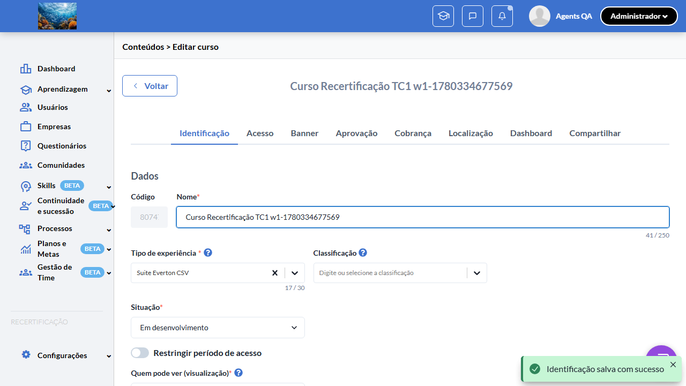
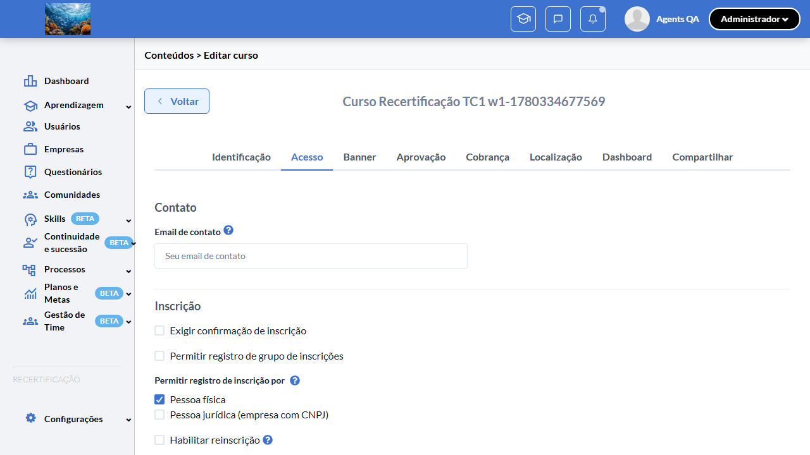
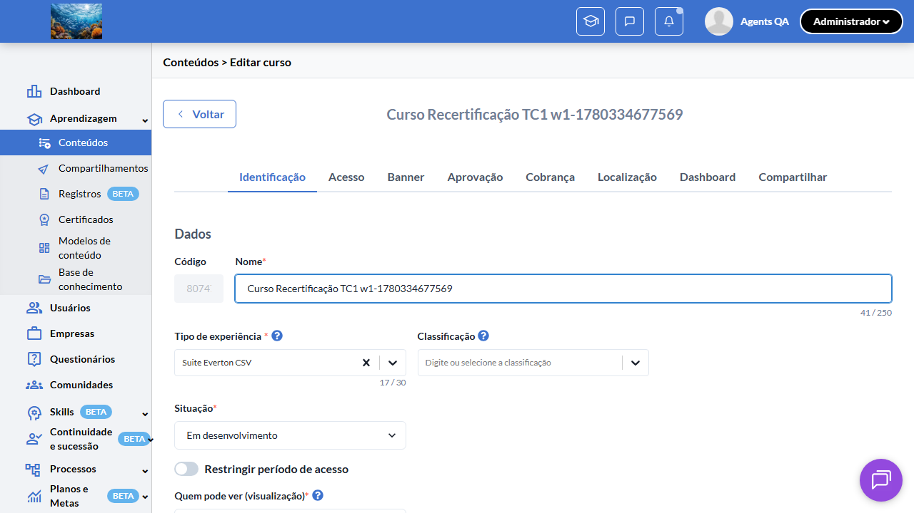
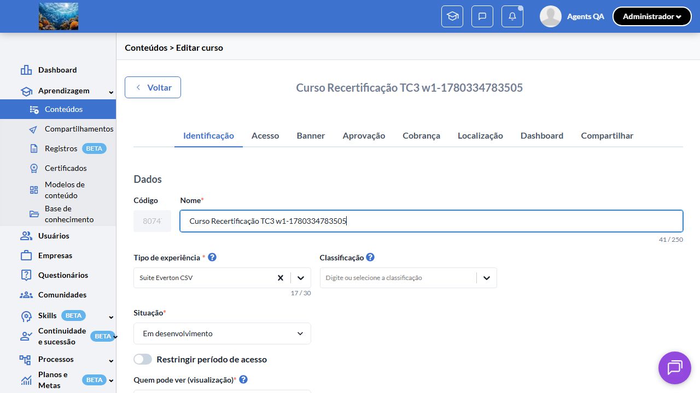
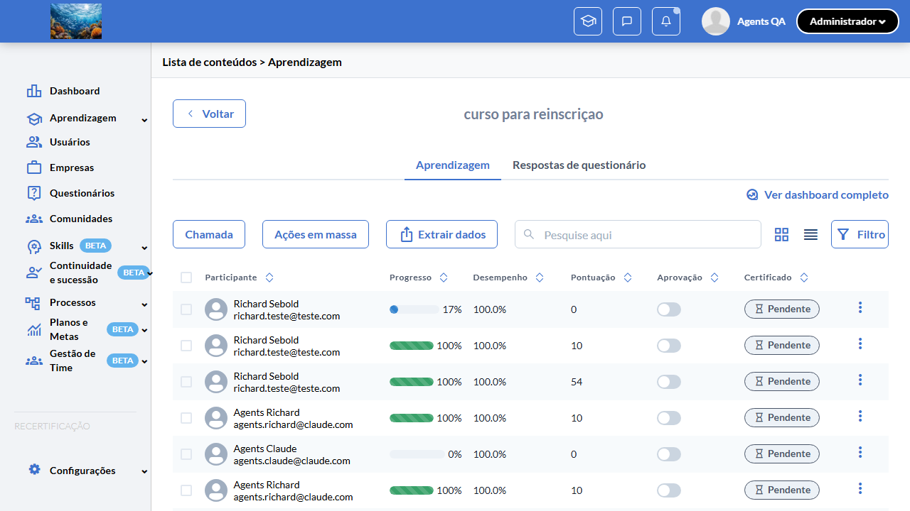
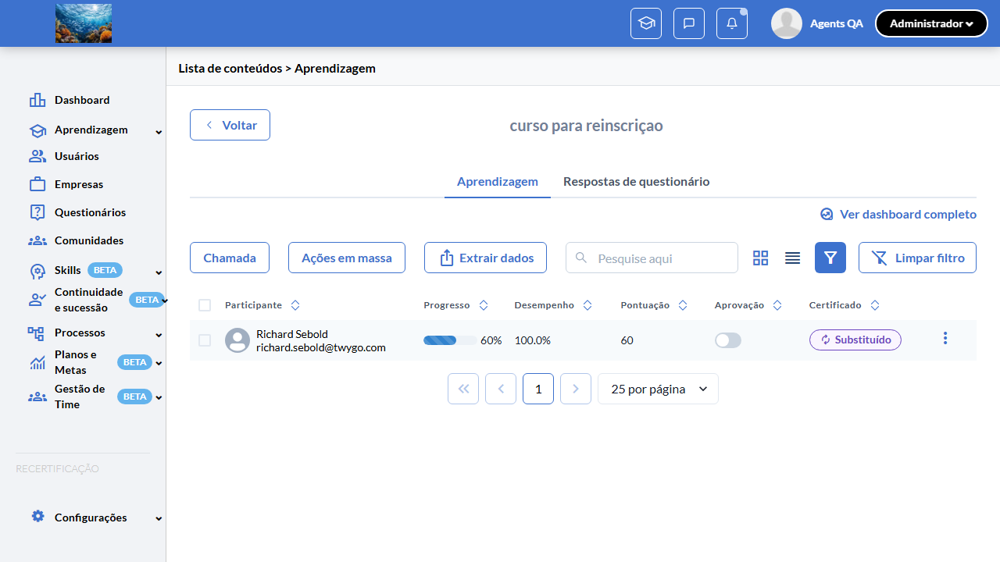
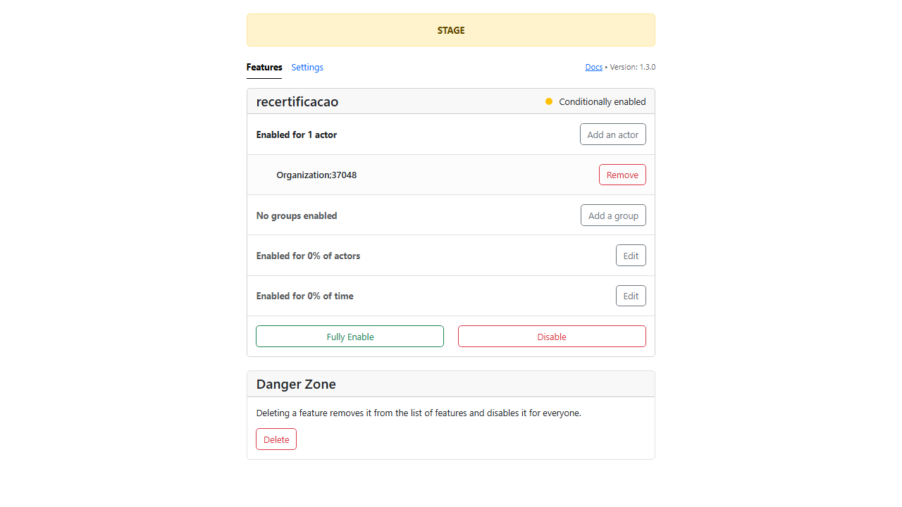
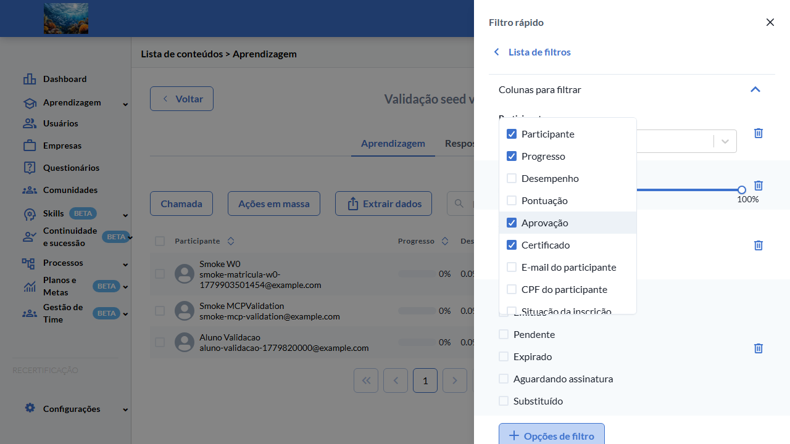
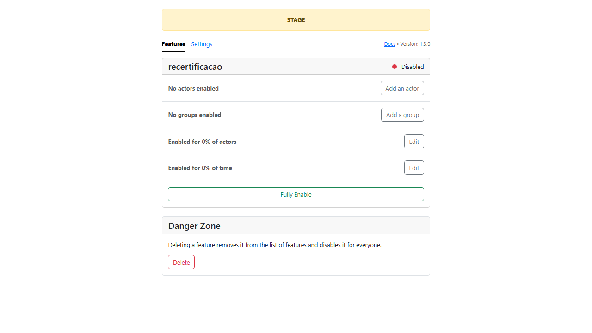

# Casos de teste — Recertificação

[← Voltar ao dashboard](index.md)

Lista detalhada por testsuite. Cada caso traz: o que era esperado pelo XML, quais steps foram executados, evidências (screenshots/trace), texto pronto pra registro de bug e — quando houver falha — uma explicação em PT-BR do motivo.

## Configuração de Conteúdo (Switch "Habilitar reinscrição")

_5 caso(s) — 1 aprovado(s), 2 falha(s), 2 ignorado(s)_

### ✅ Aprovado · TC1 · Switch "Habilitar reinscrição" aparece com flag ON na edição de curso · 🔴 Crítico

<a id="tc1-switch-habilitar-reinscricao-aparece-com-flag-on-na-edicao-de-curso"></a>_Arquivo:_ `tc1-switch-aparece-com-flag-on.spec.ts` · _Duração:_ 47.71s · _Browser:_ chromium

**Sumário (objetivo do caso):** Validar que o switch "Habilitar reinscrição" é exibido na tela de edição do curso quando a feature flag `:recertificacao` está habilitada para a organização (RN 1, 1.1, 1.2, 2).

**Pré-condições:**

```
Feature flag `:recertificacao` ATIVA na organização do teste
Usuário logado como Admin
Pelo menos 1 curso pré-existente (para validar default `has_recertification = false`)
Pelo menos 1 trilha pré-existente (para validar paridade do switch)
```

**Passos do caso (XML/TestLink + execução Playwright):**

_Cada linha reproduz um passo do XML; a coluna **Status** traz o resultado da execução (do step Allure correspondente). Linhas com "Pré-condição" são da execução automatizada (login, navegação inicial) — não fazem parte do roteiro do XML._

| # | Ação do passo | Resultado esperado | Status | Notas | Duração |
|---|---|---|:---:|---|---:|
| 1 | Acessar a URL "/o/{orgId}/dashboard" | Dashboard padrão é exibido contendo o menu lateral. | ✅ | — | 9.78s |
| 2 | Navegar até a listagem de cursos da organização | Listagem de cursos é exibida com pelo menos 1 curso pré-existente. | ✅ | — | 9.63s |
| 3 | Clicar no botão `more_vert` da linha do curso → "Gerenciar" | Página de edição do curso é exibida na rota `/o/{orgId}/contents/{id}/edit?tab=identification` (aba "Identificação" ativa por default). | ✅ | — | 18.11s |
| 4 | Clicar na aba "Acesso" do formulário de edição | URL atualiza para `?tab=access` e tabpanel "Acesso" renderiza, contendo a seção "Inscrição" → "Permitir registro de inscrição por". | ✅ | — | 3.87s |
| 5 | Localizar o checkbox "Habilitar reinscrição" dentro da seção "Permitir registro de inscrição por" | Checkbox "Habilitar reinscrição" está visível no formulário (controle HTML padrão, não Chakra switch). | ✅ | — | 0.30s |
| 6 | Posicionar o cursor sobre o ícone de ajuda do checkbox "Habilitar reinscrição" | Tooltip de ajuda é exibido com o texto da chave I18n "activerecord.attributes.event.has_recertification_tooltip". | ✅ | — | — |

**Evidências:**

📁 _Pasta:_ [`artifacts/projects-recertificacao-te-d835b--flag-ON-na-edição-de-curso-chromium/`](artifacts/projects-recertificacao-te-d835b--flag-ON-na-edição-de-curso-chromium/)

- 📸 **Screenshot (screenshot)** — [`test-finished-1.png`](artifacts/projects-recertificacao-te-d835b--flag-ON-na-edição-de-curso-chromium/test-finished-1.png)

  

- 📸 **Screenshot (screenshot)** — [`test-finished-2.png`](artifacts/projects-recertificacao-te-d835b--flag-ON-na-edição-de-curso-chromium/test-finished-2.png)

  

- 📸 **Screenshot (screenshot)** — [`test-finished-3.png`](artifacts/projects-recertificacao-te-d835b--flag-ON-na-edição-de-curso-chromium/test-finished-3.png)

  

- 🎬 [Vídeo da execução (video.webm)](artifacts/projects-recertificacao-te-d835b--flag-ON-na-edição-de-curso-chromium/video.webm)

- 🎬 [Vídeo da execução (video-1.webm)](artifacts/projects-recertificacao-te-d835b--flag-ON-na-edição-de-curso-chromium/video-1.webm)

- 📦 **Trace** — [`trace.zip`](artifacts/projects-recertificacao-te-d835b--flag-ON-na-edição-de-curso-chromium/trace.zip)

  ```bash
  npx playwright show-trace outputs/recertificacao/reports/regression_20260601-143141/artifacts/projects-recertificacao-te-d835b--flag-ON-na-edição-de-curso-chromium/trace.zip
  ```

- 🎥 **Vídeo** — [`video.webm`](artifacts/projects-recertificacao-te-d835b--flag-ON-na-edição-de-curso-chromium/video.webm)

- 🎥 **Vídeo** — [`video-1.webm`](artifacts/projects-recertificacao-te-d835b--flag-ON-na-edição-de-curso-chromium/video-1.webm)


---

### ⊘ Ignorado · TC2 · Switch "Habilitar reinscrição" NÃO aparece com flag OFF (regressão) · 🔴 Crítico

<a id="tc2-switch-habilitar-reinscricao-nao-aparece-com-flag-off-regressao"></a>_Arquivo:_ `tc2-switch-nao-aparece-com-flag-off.spec.ts` · _Duração:_ 0.00s · _Browser:_ chromium

> **⊘ Por que foi ignorado:** Marcado para revisão (test.fixme): requer toggle runtime da flag :recertificacao — assumido ON em staging-base-de-conhecimento. Validar manualmente OFF.

**Sumário (objetivo do caso):** Validar comportamento regressivo: com a feature flag desativada, o switch "Habilitar reinscrição" não é exibido na edição do conteúdo (RN 1 — kill switch global).

**Pré-condições:**

```
Feature flag `:recertificacao` ATIVA na organização do teste
Usuário logado como Admin
Pelo menos 1 curso pré-existente (para validar default `has_recertification = false`)
Pelo menos 1 trilha pré-existente (para validar paridade do switch)
```

**Passos do caso (XML/TestLink + execução Playwright):**

_Cada linha reproduz um passo do XML; a coluna **Status** traz o resultado da execução (do step Allure correspondente). Linhas com "Pré-condição" são da execução automatizada (login, navegação inicial) — não fazem parte do roteiro do XML._

| # | Ação do passo | Resultado esperado | Status | Notas | Duração |
|---|---|---|:---:|---|---:|
| 1 | Desativar a feature flag `:recertificacao` para a organização via Flipper Admin | Feature flag fica desativada na organização atual. | ⊘ | Step não executado — Marcado para revisão (test.fixme): requer toggle runtime da flag :recertificacao — assumido ON em staging-base-de-conhecimento. Validar manualmente OFF. | — |
| 2 | Acessar a tela de edição de um curso existente em `/o/{orgId}/contents/{eventId}/edit?tab=access` | Página de edição do curso é exibida normalmente na aba "Acesso". | ⊘ | Step não executado — Marcado para revisão (test.fixme): requer toggle runtime da flag :recertificacao — assumido ON em staging-base-de-conhecimento. Validar manualmente OFF. | — |
| 3 | Inspecionar o formulário em busca do label "Habilitar reinscrição" | Label "Habilitar reinscrição" NÃO está presente em nenhum lugar do formulário. | ⊘ | Step não executado — Marcado para revisão (test.fixme): requer toggle runtime da flag :recertificacao — assumido ON em staging-base-de-conhecimento. Validar manualmente OFF. | — |
| 4 | Salvar o curso sem alterações | Curso é salvo com sucesso e atributo `events.has_recertification` permanece `false` (default). | ⊘ | Step não executado — Marcado para revisão (test.fixme): requer toggle runtime da flag :recertificacao — assumido ON em staging-base-de-conhecimento. Validar manualmente OFF. | — |

**Evidências:**

_Sem evidências anexadas._

#### ⏳ Pendente — execução automatizada não realizada

- **Severidade do caso (XML):** Crítico
- **Motivo declarado pelo spec:** requer toggle runtime da flag :recertificacao — assumido ON em staging-base-de-conhecimento. Validar manualmente OFF.
- **Categoria:** _não declarada_ — pra próxima revisão, ajustar o spec para `test.fixme(true, '[Categoria] motivo')` com uma das categorias canônicas (xml-desatualizado | seed-ausente | dep-externa | bloqueio-temporario).

**Roteiro do XML (para validação manual):**
1. Pré: Feature flag `:recertificacao` ATIVA na organização do teste
1. Pré: Usuário logado como Admin
1. Pré: Pelo menos 1 curso pré-existente (para validar default `has_recertification = false`)
1. Pré: Pelo menos 1 trilha pré-existente (para validar paridade do switch)
1. 1. Desativar a feature flag `:recertificacao` para a organização via Flipper Admin
1. 2. Acessar a tela de edição de um curso existente em `/o/{orgId}/contents/{eventId}/edit?tab=access`
1. 3. Inspecionar o formulário em busca do label "Habilitar reinscrição"
1. 4. Salvar o curso sem alterações

> Esse caso não bloqueia a build, mas precisa de validação manual ou ajuste no agente.


---

### ❌ Falhou · TC3 · Ativar e salvar o switch persiste `has_recertification = true` · 🔴 Crítico

<a id="tc3-ativar-e-salvar-o-switch-persiste-has-recertification-true"></a>_Arquivo:_ `tc3-ativar-e-salvar-persiste.spec.ts` · _Duração:_ 24.02s · _Browser:_ chromium

> **❌ Por que falhou:** A condição esperada não se tornou verdadeira dentro do tempo limite — a UI não chegou ao estado aguardado.
> _Step impactado:_ **1. Acessar a edição de um curso com `has_recertification = false` (tab "Acesso")**

**Sumário (objetivo do caso):** Validar persistência: ao ativar o switch e salvar, o atributo `events.has_recertification` é atualizado para `true` no backend (RN 2, 2.1).

**Pré-condições:**

```
Feature flag `:recertificacao` ATIVA na organização do teste
Usuário logado como Admin
Pelo menos 1 curso pré-existente (para validar default `has_recertification = false`)
Pelo menos 1 trilha pré-existente (para validar paridade do switch)
```

**Passos do caso (XML/TestLink + execução Playwright):**

_Cada linha reproduz um passo do XML; a coluna **Status** traz o resultado da execução (do step Allure correspondente). Linhas com "Pré-condição" são da execução automatizada (login, navegação inicial) — não fazem parte do roteiro do XML._

| # | Ação do passo | Resultado esperado | Status | Notas | Duração |
|---|---|---|:---:|---|---:|
| 1 | Acessar a edição de um curso com `has_recertification = false` | Página de edição é exibida e switch "Habilitar reinscrição" está visível e desligado. | ❌ | A condição esperada não se tornou verdadeira dentro do tempo limite — a UI não chegou ao estado aguardado. | 22.05s |
| 2 | Clicar no switch "Habilitar reinscrição" | Switch transita para o estado ligado (ON). | ⊘ | Step não executado: o teste foi interrompido antes. Causa: A condição esperada não se tornou verdadeira dentro do tempo limite — a UI não chegou ao estado aguardado.. | — |
| 3 | Clicar no botão "Salvar" | Toast de sucesso é exibido (REVISAR-FIGMA: texto exato do toast). | ⊘ | Step não executado: o teste foi interrompido antes. Causa: A condição esperada não se tornou verdadeira dentro do tempo limite — a UI não chegou ao estado aguardado.. | — |
| 4 | Recarregar a página de edição do mesmo curso | Switch "Habilitar reinscrição" continua no estado ligado, refletindo o valor persistido `has_recertification = true`. | ⊘ | Step não executado: o teste foi interrompido antes. Causa: A condição esperada não se tornou verdadeira dentro do tempo limite — a UI não chegou ao estado aguardado.. | — |

**Evidências:**

📁 _Pasta:_ [`artifacts/projects-recertificacao-te-ccb33-e-has-recertification-true--chromium/`](artifacts/projects-recertificacao-te-ccb33-e-has-recertification-true--chromium/)

- 📸 **Screenshot (screenshot)** — [`test-finished-1.png`](artifacts/projects-recertificacao-te-ccb33-e-has-recertification-true--chromium/test-finished-1.png)

  

- 📸 **Screenshot (screenshot)** — [`test-failed-2.png`](artifacts/projects-recertificacao-te-ccb33-e-has-recertification-true--chromium/test-failed-2.png)

  

- 📸 **Screenshot (screenshot)** — [`test-failed-3.png`](artifacts/projects-recertificacao-te-ccb33-e-has-recertification-true--chromium/test-failed-3.png)

  

- 🎬 [Vídeo da execução (video.webm)](artifacts/projects-recertificacao-te-ccb33-e-has-recertification-true--chromium/video.webm)

- 🎬 [Vídeo da execução (video-1.webm)](artifacts/projects-recertificacao-te-ccb33-e-has-recertification-true--chromium/video-1.webm)

- 📦 **Trace** — [`trace.zip`](artifacts/projects-recertificacao-te-ccb33-e-has-recertification-true--chromium/trace.zip)

  ```bash
  npx playwright show-trace outputs/recertificacao/reports/regression_20260601-143141/artifacts/projects-recertificacao-te-ccb33-e-has-recertification-true--chromium/trace.zip
  ```

- 🎥 **Vídeo** — [`video.webm`](artifacts/projects-recertificacao-te-ccb33-e-has-recertification-true--chromium/video.webm)

- 🎥 **Vídeo** — [`video-1.webm`](artifacts/projects-recertificacao-te-ccb33-e-has-recertification-true--chromium/video-1.webm)

- 📄 **DOM no momento da falha** — [`error-context.md`](artifacts/projects-recertificacao-te-ccb33-e-has-recertification-true--chromium/error-context.md)

#### 🐛 Pronto para registro de bug

> 🧪 **Análise automática:** Spec frágil (problema no teste, não no produto) · Confiança 🟡 media
> _Por quê:_ Timeout sem HTTP error — possível wait/seletor frágil. Confirmar via chrome-mcp
> _Bug-report estruturado:_ [`bug-reports/configuracao-de-conteudo-switch-habilitar-reinscricao__tc3-ativar-e-salvar-o-switch-persiste-has-recertification-true.md`](bug-reports/configuracao-de-conteudo-switch-habilitar-reinscricao__tc3-ativar-e-salvar-o-switch-persiste-has-recertification-true.md)

**Próximas ações sugeridas:**
- Inspecionar o trace (`npx playwright show-trace`) para confirmar que o elemento existe mas o seletor/timing falhou.
- Avaliar se o spec viola algum dos 3 padrões da skill `criar-spec-resiliente-twygo` (count de seed, timing pós-hidratação, retry de rede).
- Disparar o healer (`playwright-test-healer`) para corrigir seletor/timing/asserção SEM alterar a intenção do teste.

**Descrição do BUG:** [Crítico] TC3 — Ativar e salvar o switch persiste `has_recertification = true` — A condição esperada não se tornou verdadeira dentro do tempo limite — a UI não chegou ao estado aguardado.

**Passo a passo para reprodução:**
1. Pré: Feature flag `:recertificacao` ATIVA na organização do teste
1. Pré: Usuário logado como Admin
1. Pré: Pelo menos 1 curso pré-existente (para validar default `has_recertification = false`)
1. Pré: Pelo menos 1 trilha pré-existente (para validar paridade do switch)
1. 1. Acessar a edição de um curso com `has_recertification = false`
1. 2. Clicar no switch "Habilitar reinscrição"
1. 3. Clicar no botão "Salvar"
1. 4. Recarregar a página de edição do mesmo curso

**Comportamento esperado:** Página de edição é exibida e switch "Habilitar reinscrição" está visível e desligado.

**Comportamento atual:** A condição esperada não se tornou verdadeira dentro do tempo limite — a UI não chegou ao estado aguardado. (falha aconteceu no passo 1: "Acessar a edição de um curso com `has_recertification = false` (tab "Acesso")", que deveria resultar em: Página de edição é exibida e switch "Habilitar reinscrição" está visível e desligado.)

**Informações:**

| Campo | Valor |
|---|---|
| URL | `https://recertificacao-testeqa.stage.twygoead.com/` |
| Login | Credenciais via env: `TWYGO_STAGING_RECERTIFICACAO_EMAIL` (consulte `.env`) |
| Senha | Credenciais via env: `TWYGO_STAGING_RECERTIFICACAO_PASSWORD` (consulte `.env`) |
| orgId | 37048 |
| Outros | Browser: chromium |
| Outros | runId: regression_20260601-143141 |
| Outros | Duração até a falha: 24.02s |
| Outros | Step impactado: 1. Acessar a edição de um curso com `has_recertification = false` (tab "Acesso") |

**Evidências:**

- Screenshot capturado pelo Playwright (screenshot): artifacts/projects-recertificacao-te-ccb33-e-has-recertification-true--chromium/test-finished-1.png
- Screenshot capturado pelo Playwright (screenshot): artifacts/projects-recertificacao-te-ccb33-e-has-recertification-true--chromium/test-failed-2.png
- Vídeo da execução (video-1.webm): artifacts/projects-recertificacao-te-ccb33-e-has-recertification-true--chromium/video-1.webm
- Vídeo da execução (video.webm): artifacts/projects-recertificacao-te-ccb33-e-has-recertification-true--chromium/video.webm
- Snapshot do DOM/contexto da página (error-context.md): artifacts/projects-recertificacao-te-ccb33-e-has-recertification-true--chromium/error-context.md
- Screenshot capturado pelo Playwright (screenshot): artifacts/projects-recertificacao-te-ccb33-e-has-recertification-true--chromium/test-failed-3.png
- Snapshot do DOM/contexto da página (error-context.md): artifacts/projects-recertificacao-te-ccb33-e-has-recertification-true--chromium/error-context.md
- Trace completo do Playwright (.zip) — `npx playwright show-trace`: artifacts/projects-recertificacao-te-ccb33-e-has-recertification-true--chromium/trace.zip

<details><summary>📋 Ver texto agregado para copiar (Jira/GitHub/Linear)</summary>

```
Descrição do BUG
[Crítico] TC3 — Ativar e salvar o switch persiste `has_recertification = true` — A condição esperada não se tornou verdadeira dentro do tempo limite — a UI não chegou ao estado aguardado.

Passo a passo para reprodução
  Pré: Feature flag `:recertificacao` ATIVA na organização do teste
  Pré: Usuário logado como Admin
  Pré: Pelo menos 1 curso pré-existente (para validar default `has_recertification = false`)
  Pré: Pelo menos 1 trilha pré-existente (para validar paridade do switch)
  1. Acessar a edição de um curso com `has_recertification = false`
  2. Clicar no switch "Habilitar reinscrição"
  3. Clicar no botão "Salvar"
  4. Recarregar a página de edição do mesmo curso

Comportamento esperado
Página de edição é exibida e switch "Habilitar reinscrição" está visível e desligado.

Comportamento atual
A condição esperada não se tornou verdadeira dentro do tempo limite — a UI não chegou ao estado aguardado. (falha aconteceu no passo 1: "Acessar a edição de um curso com `has_recertification = false` (tab "Acesso")", que deveria resultar em: Página de edição é exibida e switch "Habilitar reinscrição" está visível e desligado.)

Informações
- URL: https://recertificacao-testeqa.stage.twygoead.com/
- Login: Credenciais via env: `TWYGO_STAGING_RECERTIFICACAO_EMAIL` (consulte `.env`)
- Senha: Credenciais via env: `TWYGO_STAGING_RECERTIFICACAO_PASSWORD` (consulte `.env`)
- ID do ambiente (orgId): 37048
- Outros:
  - Browser: chromium
  - runId: regression_20260601-143141
  - Duração até a falha: 24.02s
  - Step impactado: 1. Acessar a edição de um curso com `has_recertification = false` (tab "Acesso")

Evidências
- Screenshot capturado pelo Playwright (screenshot): artifacts/projects-recertificacao-te-ccb33-e-has-recertification-true--chromium/test-finished-1.png
- Screenshot capturado pelo Playwright (screenshot): artifacts/projects-recertificacao-te-ccb33-e-has-recertification-true--chromium/test-failed-2.png
- Vídeo da execução (video-1.webm): artifacts/projects-recertificacao-te-ccb33-e-has-recertification-true--chromium/video-1.webm
- Vídeo da execução (video.webm): artifacts/projects-recertificacao-te-ccb33-e-has-recertification-true--chromium/video.webm
- Snapshot do DOM/contexto da página (error-context.md): artifacts/projects-recertificacao-te-ccb33-e-has-recertification-true--chromium/error-context.md
- Screenshot capturado pelo Playwright (screenshot): artifacts/projects-recertificacao-te-ccb33-e-has-recertification-true--chromium/test-failed-3.png
- Snapshot do DOM/contexto da página (error-context.md): artifacts/projects-recertificacao-te-ccb33-e-has-recertification-true--chromium/error-context.md
- Trace completo do Playwright (.zip) — `npx playwright show-trace`: artifacts/projects-recertificacao-te-ccb33-e-has-recertification-true--chromium/trace.zip

Execução
- runId: regression_20260601-143141
- environment.json: staging-recertificacao
- testsuite: Configuração de Conteúdo (Switch "Habilitar reinscrição")
- testcase: TC3 — Ativar e salvar o switch persiste `has_recertification = true`

```

</details>

<details><summary>🔧 Stack trace técnica completa (para desenvolvedor)</summary>

```
TimeoutError: locator.waitFor: Timeout 20000ms exceeded.
Call log:
  - waiting for getByRole('tab', { name: /^Acesso$/i }).or(locator('[data-test-id="tab-access"]')).first() to be visible

```

</details>

---

### ❌ Falhou · TC4 · Desativar o switch em curso com participants reinscritos é permitido sem aviso · 🔴 Crítico

<a id="tc4-desativar-o-switch-em-curso-com-participants-reinscritos-e-permitido-sem-aviso"></a>_Arquivo:_ `tc4-desativar-com-participants.spec.ts` · _Duração:_ 0.00s · _Browser:_ chromium

> **❌ Por que falhou:** A condição esperada não se tornou verdadeira dentro do tempo limite — a UI não chegou ao estado aguardado.

**Sumário (objetivo do caso):** Validar que desativar o switch num curso que já possui participants reinscritos é permitido sem qualquer modal/aviso de bloqueio, preservando o histórico (RN 2.3).

**Pré-condições:**

```
Feature flag `:recertificacao` ATIVA na organização do teste
Usuário logado como Admin
Pelo menos 1 curso pré-existente (para validar default `has_recertification = false`)
Pelo menos 1 trilha pré-existente (para validar paridade do switch)
```

**Passos do caso (XML/TestLink + execução Playwright):**

_Cada linha reproduz um passo do XML; a coluna **Status** traz o resultado da execução (do step Allure correspondente). Linhas com "Pré-condição" são da execução automatizada (login, navegação inicial) — não fazem parte do roteiro do XML._

| # | Ação do passo | Resultado esperado | Status | Notas | Duração |
|---|---|---|:---:|---|---:|
| 1 | Pré-condição: curso "Curso com Reinscritos w{workerIndex}" com `has_recertification = true` e ao menos 1 participant com `recertification_number > 0`. | Curso e participants pré-existem no env. | ⊘ | Step não executado: o teste foi interrompido antes. Causa: A condição esperada não se tornou verdadeira dentro do tempo limite — a UI não chegou ao estado aguardado.. | — |
| 2 | Acessar a edição deste curso em "/e/{eventId}/edit" | Página de edição é exibida com switch ligado. | ⊘ | Step não executado: o teste foi interrompido antes. Causa: A condição esperada não se tornou verdadeira dentro do tempo limite — a UI não chegou ao estado aguardado.. | — |
| 3 | Clicar no switch "Habilitar reinscrição" para desligá-lo | Switch transita para o estado desligado. Nenhum modal de confirmação ou aviso é exibido. | ⊘ | Step não executado: o teste foi interrompido antes. Causa: A condição esperada não se tornou verdadeira dentro do tempo limite — a UI não chegou ao estado aguardado.. | — |
| 4 | Clicar em "Salvar" | Curso é salvo. `events.has_recertification` passa para `false`. Participants existentes mantêm seu `recertification_number > 0` no banco (histórico preservado). | ⊘ | Step não executado: o teste foi interrompido antes. Causa: A condição esperada não se tornou verdadeira dentro do tempo limite — a UI não chegou ao estado aguardado.. | — |

**Evidências:**

📁 _Pasta:_ [`artifacts/projects-recertificacao-te-ad265-ritos-é-permitido-sem-aviso-chromium/`](artifacts/projects-recertificacao-te-ad265-ritos-é-permitido-sem-aviso-chromium/)

- 📸 **Screenshot (screenshot)** — [`test-failed-1.png`](artifacts/projects-recertificacao-te-ad265-ritos-é-permitido-sem-aviso-chromium/test-failed-1.png)

  

- 📸 **Screenshot (screenshot)** — [`test-failed-2.png`](artifacts/projects-recertificacao-te-ad265-ritos-é-permitido-sem-aviso-chromium/test-failed-2.png)

  

- 📦 **Trace** — [`trace.zip`](artifacts/projects-recertificacao-te-ad265-ritos-é-permitido-sem-aviso-chromium/trace.zip)

  ```bash
  npx playwright show-trace outputs/recertificacao/reports/regression_20260601-143141/artifacts/projects-recertificacao-te-ad265-ritos-é-permitido-sem-aviso-chromium/trace.zip
  ```

- 📄 **DOM no momento da falha** — [`error-context.md`](artifacts/projects-recertificacao-te-ad265-ritos-é-permitido-sem-aviso-chromium/error-context.md)

#### 🐛 Pronto para registro de bug

> 🧪 **Análise automática:** Spec frágil (problema no teste, não no produto) · Confiança 🟡 media
> _Por quê:_ Timeout sem HTTP error — possível wait/seletor frágil. Confirmar via chrome-mcp
> _Bug-report estruturado:_ [`bug-reports/configuracao-de-conteudo-switch-habilitar-reinscricao__tc4-desativar-o-switch-em-curso-com-participants-reinscritos-e-permitido-sem-aviso.md`](bug-reports/configuracao-de-conteudo-switch-habilitar-reinscricao__tc4-desativar-o-switch-em-curso-com-participants-reinscritos-e-permitido-sem-aviso.md)

**Próximas ações sugeridas:**
- Inspecionar o trace (`npx playwright show-trace`) para confirmar que o elemento existe mas o seletor/timing falhou.
- Avaliar se o spec viola algum dos 3 padrões da skill `criar-spec-resiliente-twygo` (count de seed, timing pós-hidratação, retry de rede).
- Disparar o healer (`playwright-test-healer`) para corrigir seletor/timing/asserção SEM alterar a intenção do teste.

**Descrição do BUG:** [Crítico] TC4 — Desativar o switch em curso com participants reinscritos é permitido sem aviso — A condição esperada não se tornou verdadeira dentro do tempo limite — a UI não chegou ao estado aguardado.

**Passo a passo para reprodução:**
1. Pré: Feature flag `:recertificacao` ATIVA na organização do teste
1. Pré: Usuário logado como Admin
1. Pré: Pelo menos 1 curso pré-existente (para validar default `has_recertification = false`)
1. Pré: Pelo menos 1 trilha pré-existente (para validar paridade do switch)
1. 1. Pré-condição: curso "Curso com Reinscritos w{workerIndex}" com `has_recertification = true` e ao menos 1 participant com `recertification_number > 0`.
1. 2. Acessar a edição deste curso em "/e/{eventId}/edit"
1. 3. Clicar no switch "Habilitar reinscrição" para desligá-lo
1. 4. Clicar em "Salvar"

**Comportamento esperado:** 1. Curso e participants pré-existem no env. | 2. Página de edição é exibida com switch ligado. | 3. Switch transita para o estado desligado. Nenhum modal de confirmação ou aviso é exibido. | 4. Curso é salvo. `events.has_recertification` passa para `false`. Participants existentes mantêm seu `recertification_number > 0` no banco (histórico preservado).

**Comportamento atual:** A condição esperada não se tornou verdadeira dentro do tempo limite — a UI não chegou ao estado aguardado.

**Informações:**

| Campo | Valor |
|---|---|
| URL | `https://recertificacao-testeqa.stage.twygoead.com/` |
| Login | Credenciais via env: `TWYGO_STAGING_RECERTIFICACAO_EMAIL` (consulte `.env`) |
| Senha | Credenciais via env: `TWYGO_STAGING_RECERTIFICACAO_PASSWORD` (consulte `.env`) |
| orgId | 37048 |
| Outros | Browser: chromium |
| Outros | runId: regression_20260601-143141 |
| Outros | Duração até a falha: 0.00s |

**Evidências:**

- Screenshot capturado pelo Playwright (screenshot): artifacts/projects-recertificacao-te-ad265-ritos-é-permitido-sem-aviso-chromium/test-failed-1.png
- Snapshot do DOM/contexto da página (error-context.md): artifacts/projects-recertificacao-te-ad265-ritos-é-permitido-sem-aviso-chromium/error-context.md
- Screenshot capturado pelo Playwright (screenshot): artifacts/projects-recertificacao-te-ad265-ritos-é-permitido-sem-aviso-chromium/test-failed-2.png
- Snapshot do DOM/contexto da página (error-context.md): artifacts/projects-recertificacao-te-ad265-ritos-é-permitido-sem-aviso-chromium/error-context.md
- Trace completo do Playwright (.zip) — `npx playwright show-trace`: artifacts/projects-recertificacao-te-ad265-ritos-é-permitido-sem-aviso-chromium/trace.zip

<details><summary>📋 Ver texto agregado para copiar (Jira/GitHub/Linear)</summary>

```
Descrição do BUG
[Crítico] TC4 — Desativar o switch em curso com participants reinscritos é permitido sem aviso — A condição esperada não se tornou verdadeira dentro do tempo limite — a UI não chegou ao estado aguardado.

Passo a passo para reprodução
  Pré: Feature flag `:recertificacao` ATIVA na organização do teste
  Pré: Usuário logado como Admin
  Pré: Pelo menos 1 curso pré-existente (para validar default `has_recertification = false`)
  Pré: Pelo menos 1 trilha pré-existente (para validar paridade do switch)
  1. Pré-condição: curso "Curso com Reinscritos w{workerIndex}" com `has_recertification = true` e ao menos 1 participant com `recertification_number > 0`.
  2. Acessar a edição deste curso em "/e/{eventId}/edit"
  3. Clicar no switch "Habilitar reinscrição" para desligá-lo
  4. Clicar em "Salvar"

Comportamento esperado
1. Curso e participants pré-existem no env. | 2. Página de edição é exibida com switch ligado. | 3. Switch transita para o estado desligado. Nenhum modal de confirmação ou aviso é exibido. | 4. Curso é salvo. `events.has_recertification` passa para `false`. Participants existentes mantêm seu `recertification_number > 0` no banco (histórico preservado).

Comportamento atual
A condição esperada não se tornou verdadeira dentro do tempo limite — a UI não chegou ao estado aguardado.

Informações
- URL: https://recertificacao-testeqa.stage.twygoead.com/
- Login: Credenciais via env: `TWYGO_STAGING_RECERTIFICACAO_EMAIL` (consulte `.env`)
- Senha: Credenciais via env: `TWYGO_STAGING_RECERTIFICACAO_PASSWORD` (consulte `.env`)
- ID do ambiente (orgId): 37048
- Outros:
  - Browser: chromium
  - runId: regression_20260601-143141
  - Duração até a falha: 0.00s

Evidências
- Screenshot capturado pelo Playwright (screenshot): artifacts/projects-recertificacao-te-ad265-ritos-é-permitido-sem-aviso-chromium/test-failed-1.png
- Snapshot do DOM/contexto da página (error-context.md): artifacts/projects-recertificacao-te-ad265-ritos-é-permitido-sem-aviso-chromium/error-context.md
- Screenshot capturado pelo Playwright (screenshot): artifacts/projects-recertificacao-te-ad265-ritos-é-permitido-sem-aviso-chromium/test-failed-2.png
- Snapshot do DOM/contexto da página (error-context.md): artifacts/projects-recertificacao-te-ad265-ritos-é-permitido-sem-aviso-chromium/error-context.md
- Trace completo do Playwright (.zip) — `npx playwright show-trace`: artifacts/projects-recertificacao-te-ad265-ritos-é-permitido-sem-aviso-chromium/trace.zip

Execução
- runId: regression_20260601-143141
- environment.json: staging-recertificacao
- testsuite: Configuração de Conteúdo (Switch "Habilitar reinscrição")
- testcase: TC4 — Desativar o switch em curso com participants reinscritos é permitido sem aviso

```

</details>

<details><summary>🔧 Stack trace técnica completa (para desenvolvedor)</summary>

```
TimeoutError: locator.waitFor: Timeout 10000ms exceeded.
Call log:
  - waiting for locator('label.chakra-checkbox').filter({ has: locator('#has_recertification') }).first() to be visible

```

</details>

---

### ⊘ Ignorado · TC5 · Paridade do switch entre formulário HAML e formulário React (facelift) · 🟡 Normal

<a id="tc5-paridade-do-switch-entre-formulario-haml-e-formulario-react-facelift"></a>_Arquivo:_ `tc5-paridade-haml-react.spec.ts` · _Duração:_ 0.00s · _Browser:_ chromium

> **⊘ Por que foi ignorado:** [REVISAR] Motivo do skip não declarado no spec. Edite o `test.fixme(true, "[Categoria] motivo")` indicando uma das categorias canônicas: xml-desatualizado | seed-ausente | dep-externa | bloqueio-temporario.

**Sumário (objetivo do caso):** Validar que o switch tem comportamento equivalente nas duas telas (`_form_details.haml` e `event-form.tsx`), gravando na mesma coluna (RN 2.1).

**Pré-condições:**

```
Feature flag `:recertificacao` ATIVA na organização do teste
Usuário logado como Admin
Pelo menos 1 curso pré-existente (para validar default `has_recertification = false`)
Pelo menos 1 trilha pré-existente (para validar paridade do switch)
```

**Passos do caso (XML/TestLink + execução Playwright):**

_Cada linha reproduz um passo do XML; a coluna **Status** traz o resultado da execução (do step Allure correspondente). Linhas com "Pré-condição" são da execução automatizada (login, navegação inicial) — não fazem parte do roteiro do XML._

| # | Ação do passo | Resultado esperado | Status | Notas | Duração |
|---|---|---|:---:|---|---:|
| 1 | Editar um curso na tela HAML em "/e/{eventId}/edit", ativar o switch e salvar | Switch ativado, salvo com sucesso, `has_recertification = true` persiste. | ⊘ | Step não executado — [REVISAR] Motivo do skip não declarado no spec. Edite o `test.fixme(true, "[Categoria] motivo")` indicando uma das categorias canônicas: xml-desatualizado \| seed-ausente \| dep-externa \| bloqueio-temporario. | — |
| 2 | Acessar o MESMO curso pela tela React em "/contents/{eventId}/edit" | Tela facelift carrega com switch "Habilitar reinscrição" no estado ligado. | ⊘ | Step não executado — [REVISAR] Motivo do skip não declarado no spec. Edite o `test.fixme(true, "[Categoria] motivo")` indicando uma das categorias canônicas: xml-desatualizado \| seed-ausente \| dep-externa \| bloqueio-temporario. | — |
| 3 | Desativar o switch na tela React e salvar | Switch desativado, salvo com sucesso. | ⊘ | Step não executado — [REVISAR] Motivo do skip não declarado no spec. Edite o `test.fixme(true, "[Categoria] motivo")` indicando uma das categorias canônicas: xml-desatualizado \| seed-ausente \| dep-externa \| bloqueio-temporario. | — |
| 4 | Recarregar a edição na tela HAML | Switch aparece desligado, confirmando que ambas escrevem em `events.has_recertification`. | ⊘ | Step não executado — [REVISAR] Motivo do skip não declarado no spec. Edite o `test.fixme(true, "[Categoria] motivo")` indicando uma das categorias canônicas: xml-desatualizado \| seed-ausente \| dep-externa \| bloqueio-temporario. | — |

**Evidências:**

_Sem evidências anexadas._

#### ⏳ Pendente — execução automatizada não realizada

- **Severidade do caso (XML):** Normal
- **Categoria:** ⚠️ Não declarada
- **Motivo declarado pelo spec:** _ausente_
- **Próximo passo:** Editar o spec para declarar `test.fixme(true, '[Categoria] motivo')` com uma das categorias canônicas (xml-desatualizado | seed-ausente | dep-externa | bloqueio-temporario). Sem declaração, leitor leigo não sabe quem precisa agir.

**Roteiro do XML (para validação manual):**
1. Pré: Feature flag `:recertificacao` ATIVA na organização do teste
1. Pré: Usuário logado como Admin
1. Pré: Pelo menos 1 curso pré-existente (para validar default `has_recertification = false`)
1. Pré: Pelo menos 1 trilha pré-existente (para validar paridade do switch)
1. 1. Editar um curso na tela HAML em "/e/{eventId}/edit", ativar o switch e salvar
1. 2. Acessar o MESMO curso pela tela React em "/contents/{eventId}/edit"
1. 3. Desativar o switch na tela React e salvar
1. 4. Recarregar a edição na tela HAML

> Esse caso não bloqueia a build, mas precisa de validação manual ou ajuste no agente.


---

## Reinscrição Individual pelo Admin

_6 caso(s) — 0 aprovado(s), 0 falha(s), 6 ignorado(s)_

### ⊘ Ignorado · TC1 · Botão "Reinscrever" visível e habilitado apenas para aluno elegível · 🔴 Crítico

<a id="tc1-botao-reinscrever-visivel-e-habilitado-apenas-para-aluno-elegivel"></a>_Arquivo:_ `tc1-botao-reinscrever-visivel-aluno-elegivel.spec.ts` · _Duração:_ 0.00s · _Browser:_ chromium

> **⊘ Por que foi ignorado:** Marcado para revisão (test.fixme): seed-roadmap-fixture-composta-3-alunos: TC1 exige 3 alunos no mesmo curso em estados distintos (a) progresso 100% (b) cert expirado (c) em andamento. v1.7.0 tem cada estado coberto individualmente, mas falta fixture composta que provisione os 3 simultaneamente. Ver skill provisionar-seed v1.7.0 §"Catálogo".

**Sumário (objetivo do caso):** Validar visibilidade e habilitação do botão "Reinscrever" no menu de ação da linha do aluno, conforme regras de elegibilidade (RN 4, 4.1, 6).

**Pré-condições:**

```
Feature flag `:recertificacao` ATIVA na organização
Curso com `has_recertification = true`
Usuário logado como Admin
[object Object]
```

**Passos do caso (XML/TestLink + execução Playwright):**

_Cada linha reproduz um passo do XML; a coluna **Status** traz o resultado da execução (do step Allure correspondente). Linhas com "Pré-condição" são da execução automatizada (login, navegação inicial) — não fazem parte do roteiro do XML._

| # | Ação do passo | Resultado esperado | Status | Notas | Duração |
|---|---|---|:---:|---|---:|
| 1 | Acessar a lista de aprendizagem do curso em "/learning_students?event_id={eventId}" | Lista de alunos é exibida com pelo menos os 3 alunos pré-condicionados. | ⊘ | Step não executado — Marcado para revisão (test.fixme): seed-roadmap-fixture-composta-3-alunos: TC1 exige 3 alunos no mesmo curso em estados distintos (a) progresso 100% (b) cert expirado (c) em andamento. v1.7.0 tem cada estado coberto individualmente, mas falta fixture composta que provisione os 3 simultaneamente. Ver skill provisionar-seed v1.7.0 §"Catálogo". | — |
| 2 | Abrir o menu de ações da linha do aluno "(a) elegível por progresso 100%" | Menu de ações é exibido contendo o item "Reinscrever" habilitado (sem tooltip de bloqueio). | ⊘ | Step não executado — Marcado para revisão (test.fixme): seed-roadmap-fixture-composta-3-alunos: TC1 exige 3 alunos no mesmo curso em estados distintos (a) progresso 100% (b) cert expirado (c) em andamento. v1.7.0 tem cada estado coberto individualmente, mas falta fixture composta que provisione os 3 simultaneamente. Ver skill provisionar-seed v1.7.0 §"Catálogo". | — |
| 3 | Clicar fora para fechar o menu e abrir o menu da linha do aluno "(b) elegível por certificado expirado" | Menu exibe o item "Reinscrever" habilitado. | ⊘ | Step não executado — Marcado para revisão (test.fixme): seed-roadmap-fixture-composta-3-alunos: TC1 exige 3 alunos no mesmo curso em estados distintos (a) progresso 100% (b) cert expirado (c) em andamento. v1.7.0 tem cada estado coberto individualmente, mas falta fixture composta que provisione os 3 simultaneamente. Ver skill provisionar-seed v1.7.0 §"Catálogo". | — |
| 4 | Abrir o menu da linha do aluno "(c) inelegível em andamento" | Item "Reinscrever" é exibido mas DESABILITADO; ao posicionar o cursor sobre o item, tooltip explicativo de inelegibilidade é exibido (REVISAR-FIGMA: confirmar texto). | ⊘ | Step não executado — Marcado para revisão (test.fixme): seed-roadmap-fixture-composta-3-alunos: TC1 exige 3 alunos no mesmo curso em estados distintos (a) progresso 100% (b) cert expirado (c) em andamento. v1.7.0 tem cada estado coberto individualmente, mas falta fixture composta que provisione os 3 simultaneamente. Ver skill provisionar-seed v1.7.0 §"Catálogo". | — |

**Evidências:**

_Sem evidências anexadas._

#### ⏳ Pendente — execução automatizada não realizada

- **Severidade do caso (XML):** Crítico
- **Motivo declarado pelo spec:** seed-roadmap-fixture-composta-3-alunos: TC1 exige 3 alunos no mesmo curso em estados distintos (a) progresso 100% (b) cert expirado (c) em andamento. v1.7.0 tem cada estado coberto individualmente, mas falta fixture composta que provisione os 3 simultaneamente. Ver skill provisionar-seed v1.7.0 §"Catálogo".
- **Categoria:** _não declarada_ — pra próxima revisão, ajustar o spec para `test.fixme(true, '[Categoria] motivo')` com uma das categorias canônicas (xml-desatualizado | seed-ausente | dep-externa | bloqueio-temporario).

**Roteiro do XML (para validação manual):**
1. Pré: Feature flag `:recertificacao` ATIVA na organização
1. Pré: Curso com `has_recertification = true`
1. Pré: Usuário logado como Admin
1. Pré: [object Object]
1. 1. Acessar a lista de aprendizagem do curso em "/learning_students?event_id={eventId}"
1. 2. Abrir o menu de ações da linha do aluno "(a) elegível por progresso 100%"
1. 3. Clicar fora para fechar o menu e abrir o menu da linha do aluno "(b) elegível por certificado expirado"
1. 4. Abrir o menu da linha do aluno "(c) inelegível em andamento"

> Esse caso não bloqueia a build, mas precisa de validação manual ou ajuste no agente.


---

### ⊘ Ignorado · TC2 — Botão "Reinscrever" visível apenas na linha do participant com maior recertification_number 

<a id="tc2-botao-reinscrever-visivel-apenas-na-linha-do-participant-com-maior-recertification-number"></a>_Arquivo:_ `tc2-botao-reinscrever-apenas-maior-recertification-number.spec.ts` · _Duração:_ 0.00s · _Browser:_ chromium

> **⊘ Por que foi ignorado:** Marcado para revisão (test.fixme): seed-roadmap-tc2-aluno-multi-recert-controlado: TC2 valida que botão Reinscrever aparece SÓ na linha mais recente com cert ativo. Richard Sebold (807287) tinha esse estado em 2026-05-28, mas state mudou após runs. Precisa fixture worker-isolated dedicada que reproduza multi-recert sem auto-recertification pendente.

**Passos do caso (XML/TestLink + execução Playwright):**

_Cada linha reproduz um passo do XML; a coluna **Status** traz o resultado da execução (do step Allure correspondente). Linhas com "Pré-condição" são da execução automatizada (login, navegação inicial) — não fazem parte do roteiro do XML._

_Sem steps Allure ou metadata XML para este testcase._

**Evidências:**

_Sem evidências anexadas._

#### ⏳ Pendente — execução automatizada não realizada

- **Severidade do caso (XML):** —
- **Motivo declarado pelo spec:** seed-roadmap-tc2-aluno-multi-recert-controlado: TC2 valida que botão Reinscrever aparece SÓ na linha mais recente com cert ativo. Richard Sebold (807287) tinha esse estado em 2026-05-28, mas state mudou após runs. Precisa fixture worker-isolated dedicada que reproduza multi-recert sem auto-recertification pendente.
- **Categoria:** _não declarada_ — pra próxima revisão, ajustar o spec para `test.fixme(true, '[Categoria] motivo')` com uma das categorias canônicas (xml-desatualizado | seed-ausente | dep-externa | bloqueio-temporario).

**Roteiro do XML (para validação manual):**
1. — (sem steps documentados no XML)

> Esse caso não bloqueia a build, mas precisa de validação manual ou ajuste no agente.


---

### ⊘ Ignorado · TC3 · Reinscrever aluno individualmente cria novo participant zerado · 🔴 Crítico

<a id="tc3-reinscrever-aluno-individualmente-cria-novo-participant-zerado"></a>_Arquivo:_ `tc3-reinscrever-aluno-cria-novo-participant-zerado.spec.ts` · _Duração:_ 0.00s · _Browser:_ chromium

> **⊘ Por que foi ignorado:** Marcado para revisão (test.fixme): AT inferiu modal "Confirmar reinscrição" (REVISAR-FIGMA) que NÃO existe no produto. Validado live 2026-05-29 com bug Chakra menu já corrigido: click "Iniciar reinscrição" dispara POST imediato sem modal. AT/QA Lead deve revisar a AT pra remover step do modal e substituir por assert de toast.

**Sumário (objetivo do caso):** Validar criação de novo `EventParticipant` com campos zerados após reinscrição individual (RN 5, 7).

**Pré-condições:**

```
Feature flag `:recertificacao` ATIVA na organização
Curso com `has_recertification = true`
Usuário logado como Admin
[object Object]
```

**Passos do caso (XML/TestLink + execução Playwright):**

_Cada linha reproduz um passo do XML; a coluna **Status** traz o resultado da execução (do step Allure correspondente). Linhas com "Pré-condição" são da execução automatizada (login, navegação inicial) — não fazem parte do roteiro do XML._

| # | Ação do passo | Resultado esperado | Status | Notas | Duração |
|---|---|---|:---:|---|---:|
| 1 | Acessar a lista de aprendizagem do curso em "/learning_students?event_id={eventId}" | Lista exibe aluno "(a) elegível" com `recertification_number = N`. | ⊘ | Step não executado — Marcado para revisão (test.fixme): AT inferiu modal "Confirmar reinscrição" (REVISAR-FIGMA) que NÃO existe no produto. Validado live 2026-05-29 com bug Chakra menu já corrigido: click "Iniciar reinscrição" dispara POST imediato sem modal. AT/QA Lead deve revisar a AT pra remover step do modal e substituir por assert de toast. | — |
| 2 | Clicar no item "Reinscrever" no menu da linha | Modal de confirmação "Confirmar reinscrição" é exibido (REVISAR-FIGMA: header e body exatos). | ⊘ | Step não executado — Marcado para revisão (test.fixme): AT inferiu modal "Confirmar reinscrição" (REVISAR-FIGMA) que NÃO existe no produto. Validado live 2026-05-29 com bug Chakra menu já corrigido: click "Iniciar reinscrição" dispara POST imediato sem modal. AT/QA Lead deve revisar a AT pra remover step do modal e substituir por assert de toast. | — |
| 3 | Clicar em "Confirmar" | Modal fecha, toast de sucesso é exibido (REVISAR-FIGMA: texto exato); tabela faz refetch automático. | ⊘ | Step não executado — Marcado para revisão (test.fixme): AT inferiu modal "Confirmar reinscrição" (REVISAR-FIGMA) que NÃO existe no produto. Validado live 2026-05-29 com bug Chakra menu já corrigido: click "Iniciar reinscrição" dispara POST imediato sem modal. AT/QA Lead deve revisar a AT pra remover step do modal e substituir por assert de toast. | — |
| 4 | Localizar a linha do aluno na listagem | Aluno aparece com `recertification_number = N+1`, `progress_score = 0`, badge de status "Pendente" (REVISAR-FIGMA: texto exato), sem nota e sem certificado. | ⊘ | Step não executado — Marcado para revisão (test.fixme): AT inferiu modal "Confirmar reinscrição" (REVISAR-FIGMA) que NÃO existe no produto. Validado live 2026-05-29 com bug Chakra menu já corrigido: click "Iniciar reinscrição" dispara POST imediato sem modal. AT/QA Lead deve revisar a AT pra remover step do modal e substituir por assert de toast. | — |

**Evidências:**

_Sem evidências anexadas._

#### ⏳ Pendente — execução automatizada não realizada

- **Severidade do caso (XML):** Crítico
- **Motivo declarado pelo spec:** AT inferiu modal "Confirmar reinscrição" (REVISAR-FIGMA) que NÃO existe no produto. Validado live 2026-05-29 com bug Chakra menu já corrigido: click "Iniciar reinscrição" dispara POST imediato sem modal. AT/QA Lead deve revisar a AT pra remover step do modal e substituir por assert de toast.
- **Categoria:** _não declarada_ — pra próxima revisão, ajustar o spec para `test.fixme(true, '[Categoria] motivo')` com uma das categorias canônicas (xml-desatualizado | seed-ausente | dep-externa | bloqueio-temporario).

**Roteiro do XML (para validação manual):**
1. Pré: Feature flag `:recertificacao` ATIVA na organização
1. Pré: Curso com `has_recertification = true`
1. Pré: Usuário logado como Admin
1. Pré: [object Object]
1. 1. Acessar a lista de aprendizagem do curso em "/learning_students?event_id={eventId}"
1. 2. Clicar no item "Reinscrever" no menu da linha
1. 3. Clicar em "Confirmar"
1. 4. Localizar a linha do aluno na listagem

> Esse caso não bloqueia a build, mas precisa de validação manual ou ajuste no agente.


---

### ⊘ Ignorado · TC4 — Botão "Reinscrever" fica visível mas DESABILITADO quando event.has_recertification = false 

<a id="tc4-botao-reinscrever-fica-visivel-mas-desabilitado-quando-event-has-recertification-false"></a>_Arquivo:_ `tc4-botao-reinscrever-disabled-has-recertification-false.spec.ts` · _Duração:_ 0.00s · _Browser:_ chromium

> **⊘ Por que foi ignorado:** Marcado para revisão (test.fixme): seed-roadmap-atividade-aula-1: pré-condição "aluno elegível por progresso 100%" exige curso com atividades pra completar — helper de criação de atividades ainda não implementado. cursoSeed default (has_recertification=false) cobre o curso mas alunoMatriculadoSeed cru não cobre o aluno. Ver skill provisionar-seed v1.6.1.

**Passos do caso (XML/TestLink + execução Playwright):**

_Cada linha reproduz um passo do XML; a coluna **Status** traz o resultado da execução (do step Allure correspondente). Linhas com "Pré-condição" são da execução automatizada (login, navegação inicial) — não fazem parte do roteiro do XML._

_Sem steps Allure ou metadata XML para este testcase._

**Evidências:**

_Sem evidências anexadas._

#### ⏳ Pendente — execução automatizada não realizada

- **Severidade do caso (XML):** —
- **Motivo declarado pelo spec:** seed-roadmap-atividade-aula-1: pré-condição "aluno elegível por progresso 100%" exige curso com atividades pra completar — helper de criação de atividades ainda não implementado. cursoSeed default (has_recertification=false) cobre o curso mas alunoMatriculadoSeed cru não cobre o aluno. Ver skill provisionar-seed v1.6.1.
- **Categoria:** _não declarada_ — pra próxima revisão, ajustar o spec para `test.fixme(true, '[Categoria] motivo')` com uma das categorias canônicas (xml-desatualizado | seed-ausente | dep-externa | bloqueio-temporario).

**Roteiro do XML (para validação manual):**
1. — (sem steps documentados no XML)

> Esse caso não bloqueia a build, mas precisa de validação manual ou ajuste no agente.


---

### ⊘ Ignorado · TC5 — Reinscrição com flag OFF retorna HTTP 422 feature_disabled 

<a id="tc5-reinscricao-com-flag-off-retorna-http-422-feature-disabled"></a>_Arquivo:_ `tc5-flag-off-retorna-422-feature-disabled.spec.ts` · _Duração:_ 0.00s · _Browser:_ chromium

> **⊘ Por que foi ignorado:** Marcado para revisão (test.fixme): requer toggle runtime da flag :recertificacao OFF — assumido ON em staging-base-de-conhecimento. Validar manualmente HTTP 422 feature_disabled.

**Passos do caso (XML/TestLink + execução Playwright):**

_Cada linha reproduz um passo do XML; a coluna **Status** traz o resultado da execução (do step Allure correspondente). Linhas com "Pré-condição" são da execução automatizada (login, navegação inicial) — não fazem parte do roteiro do XML._

_Sem steps Allure ou metadata XML para este testcase._

**Evidências:**

_Sem evidências anexadas._

#### ⏳ Pendente — execução automatizada não realizada

- **Severidade do caso (XML):** —
- **Motivo declarado pelo spec:** requer toggle runtime da flag :recertificacao OFF — assumido ON em staging-base-de-conhecimento. Validar manualmente HTTP 422 feature_disabled.
- **Categoria:** _não declarada_ — pra próxima revisão, ajustar o spec para `test.fixme(true, '[Categoria] motivo')` com uma das categorias canônicas (xml-desatualizado | seed-ausente | dep-externa | bloqueio-temporario).

**Roteiro do XML (para validação manual):**
1. — (sem steps documentados no XML)

> Esse caso não bloqueia a build, mas precisa de validação manual ou ajuste no agente.


---

### ⊘ Ignorado · TC6 · Após reinscrição, e-mail diferenciado é disparado (validação cross-suite) · 🟡 Normal

<a id="tc6-apos-reinscricao-e-mail-diferenciado-e-disparado-validacao-cross-suite"></a>_Arquivo:_ `tc6-pos-reinscricao-email-diferenciado.spec.ts` · _Duração:_ 0.00s · _Browser:_ chromium

> **⊘ Por que foi ignorado:** Marcado para revisão (test.fixme): cross-suite com Suite 10 (Mailer) — requer infra de captura de e-mail não configurada. Validar manualmente que e-mail de reinscrição foi disparado.

**Sumário (objetivo do caso):** Validar que ao concluir reinscrição individual, o `RecertificationMailer#student_email` é disparado com template `reenrollment_mail` (RN 7, 24.1). Validação detalhada em suíte 10.

**Pré-condições:**

```
Feature flag `:recertificacao` ATIVA na organização
Curso com `has_recertification = true`
Usuário logado como Admin
[object Object]
```

**Passos do caso (XML/TestLink + execução Playwright):**

_Cada linha reproduz um passo do XML; a coluna **Status** traz o resultado da execução (do step Allure correspondente). Linhas com "Pré-condição" são da execução automatizada (login, navegação inicial) — não fazem parte do roteiro do XML._

| # | Ação do passo | Resultado esperado | Status | Notas | Duração |
|---|---|---|:---:|---|---:|
| 1 | Acessar a lista de aprendizagem com a inbox de teste aberta em paralelo (REVISAR-FIGMA: tooling de inbox em staging) | Lista de aprendizagem é exibida. | ⊘ | Step não executado — Marcado para revisão (test.fixme): cross-suite com Suite 10 (Mailer) — requer infra de captura de e-mail não configurada. Validar manualmente que e-mail de reinscrição foi disparado. | — |
| 2 | Reinscrever um aluno elegível pelo fluxo do TC3 | Toast de sucesso é exibido. | ⊘ | Step não executado — Marcado para revisão (test.fixme): cross-suite com Suite 10 (Mailer) — requer infra de captura de e-mail não configurada. Validar manualmente que e-mail de reinscrição foi disparado. | — |
| 3 | Aguardar até 30 segundos pelo e-mail na inbox do aluno | E-mail é recebido na caixa de entrada. | ⊘ | Step não executado — Marcado para revisão (test.fixme): cross-suite com Suite 10 (Mailer) — requer infra de captura de e-mail não configurada. Validar manualmente que e-mail de reinscrição foi disparado. | — |
| 4 | Inspecionar o assunto e o corpo do e-mail | Assunto corresponde à chave I18n `recertification_mailer.reenrollment.subject`; corpo corresponde ao template `reenrollment_mail` (não ao `recertification_mail` legado). | ⊘ | Step não executado — Marcado para revisão (test.fixme): cross-suite com Suite 10 (Mailer) — requer infra de captura de e-mail não configurada. Validar manualmente que e-mail de reinscrição foi disparado. | — |

**Evidências:**

_Sem evidências anexadas._

#### ⏳ Pendente — execução automatizada não realizada

- **Severidade do caso (XML):** Normal
- **Motivo declarado pelo spec:** cross-suite com Suite 10 (Mailer) — requer infra de captura de e-mail não configurada. Validar manualmente que e-mail de reinscrição foi disparado.
- **Categoria:** _não declarada_ — pra próxima revisão, ajustar o spec para `test.fixme(true, '[Categoria] motivo')` com uma das categorias canônicas (xml-desatualizado | seed-ausente | dep-externa | bloqueio-temporario).

**Roteiro do XML (para validação manual):**
1. Pré: Feature flag `:recertificacao` ATIVA na organização
1. Pré: Curso com `has_recertification = true`
1. Pré: Usuário logado como Admin
1. Pré: [object Object]
1. 1. Acessar a lista de aprendizagem com a inbox de teste aberta em paralelo (REVISAR-FIGMA: tooling de inbox em staging)
1. 2. Reinscrever um aluno elegível pelo fluxo do TC3
1. 3. Aguardar até 30 segundos pelo e-mail na inbox do aluno
1. 4. Inspecionar o assunto e o corpo do e-mail

> Esse caso não bloqueia a build, mas precisa de validação manual ou ajuste no agente.


---

## Reinscrição em Massa pelo Admin

_6 caso(s) — 0 aprovado(s), 0 falha(s), 6 ignorado(s)_

### ⊘ Ignorado · TC1 · Ação "Reinscrição em massa" aparece no drawer quando todas as condições atendidas · 🔴 Crítico

<a id="tc1-acao-reinscricao-em-massa-aparece-no-drawer-quando-todas-as-condicoes-atendidas"></a>_Arquivo:_ `tc1-acao-aparece-drawer-condicoes-atendidas.spec.ts` · _Duração:_ 0.00s · _Browser:_ chromium

> **⊘ Por que foi ignorado:** Marcado para revisão (test.fixme): seed inválido — cursoIdRecertOn=3 não existe (404). Validar no env staging-base-de-conhecimento e atualizar tc1-acao-aparece-drawer-condicoes-atendidas.data.ts.

**Sumário (objetivo do caso):** Validar visibilidade condicional da ação "Reinscrição em massa" no drawer de ações em massa: flag ON, `has_recertification = true` e tipo do evento ≠ pacote (RN 8).

**Pré-condições:**

```
Feature flag `:recertificacao` ATIVA
Curso com `has_recertification = true`
Pelo menos 5 alunos elegíveis selecionáveis na lista de aprendizagem
Sidekiq operacional (worker `MassReenrollParticipantsWorker`)
```

**Passos do caso (XML/TestLink + execução Playwright):**

_Cada linha reproduz um passo do XML; a coluna **Status** traz o resultado da execução (do step Allure correspondente). Linhas com "Pré-condição" são da execução automatizada (login, navegação inicial) — não fazem parte do roteiro do XML._

| # | Ação do passo | Resultado esperado | Status | Notas | Duração |
|---|---|---|:---:|---|---:|
| 1 | Acessar a lista de aprendizagem do curso em "/learning_students?event_id={eventId}" | Lista de alunos é exibida. | ⊘ | Step não executado — Marcado para revisão (test.fixme): seed inválido — cursoIdRecertOn=3 não existe (404). Validar no env staging-base-de-conhecimento e atualizar tc1-acao-aparece-drawer-condicoes-atendidas.data.ts. | — |
| 2 | Selecionar 3 alunos clicando nos checkboxes correspondentes | Drawer de ações em massa é exibido na lateral com a contagem "3 selecionados". | ⊘ | Step não executado — Marcado para revisão (test.fixme): seed inválido — cursoIdRecertOn=3 não existe (404). Validar no env staging-base-de-conhecimento e atualizar tc1-acao-aparece-drawer-condicoes-atendidas.data.ts. | — |
| 3 | Inspecionar as opções do drawer | Opção "Reinscrição em massa" está visível e habilitada. | ⊘ | Step não executado — Marcado para revisão (test.fixme): seed inválido — cursoIdRecertOn=3 não existe (404). Validar no env staging-base-de-conhecimento e atualizar tc1-acao-aparece-drawer-condicoes-atendidas.data.ts. | — |

**Evidências:**

_Sem evidências anexadas._

#### ⏳ Pendente — execução automatizada não realizada

- **Severidade do caso (XML):** Crítico
- **Motivo declarado pelo spec:** seed inválido — cursoIdRecertOn=3 não existe (404). Validar no env staging-base-de-conhecimento e atualizar tc1-acao-aparece-drawer-condicoes-atendidas.data.ts.
- **Categoria:** _não declarada_ — pra próxima revisão, ajustar o spec para `test.fixme(true, '[Categoria] motivo')` com uma das categorias canônicas (xml-desatualizado | seed-ausente | dep-externa | bloqueio-temporario).

**Roteiro do XML (para validação manual):**
1. Pré: Feature flag `:recertificacao` ATIVA
1. Pré: Curso com `has_recertification = true`
1. Pré: Pelo menos 5 alunos elegíveis selecionáveis na lista de aprendizagem
1. Pré: Sidekiq operacional (worker `MassReenrollParticipantsWorker`)
1. 1. Acessar a lista de aprendizagem do curso em "/learning_students?event_id={eventId}"
1. 2. Selecionar 3 alunos clicando nos checkboxes correspondentes
1. 3. Inspecionar as opções do drawer

> Esse caso não bloqueia a build, mas precisa de validação manual ou ajuste no agente.


---

### ⊘ Ignorado · TC2 · Ação "Reinscrição em massa" NÃO aparece em evento do tipo pacote · 🔴 Crítico

<a id="tc2-acao-reinscricao-em-massa-nao-aparece-em-evento-do-tipo-pacote"></a>_Arquivo:_ `tc2-acao-nao-aparece-evento-pacote.spec.ts` · _Duração:_ 0.00s · _Browser:_ chromium

> **⊘ Por que foi ignorado:** Marcado para revisão (test.fixme): seed inválido — pacoteIdRecertOn=4 não existe (404). Validar no env staging-base-de-conhecimento e atualizar tc2-acao-nao-aparece-evento-pacote.data.ts.

**Sumário (objetivo do caso):** Validar regra de visibilidade: ação não aparece se o evento for do tipo pacote (`ContentKind.package`), mesmo com flag e gate ON (RN 8).

**Pré-condições:**

```
Feature flag `:recertificacao` ATIVA
Curso com `has_recertification = true`
Pelo menos 5 alunos elegíveis selecionáveis na lista de aprendizagem
Sidekiq operacional (worker `MassReenrollParticipantsWorker`)
```

**Passos do caso (XML/TestLink + execução Playwright):**

_Cada linha reproduz um passo do XML; a coluna **Status** traz o resultado da execução (do step Allure correspondente). Linhas com "Pré-condição" são da execução automatizada (login, navegação inicial) — não fazem parte do roteiro do XML._

| # | Ação do passo | Resultado esperado | Status | Notas | Duração |
|---|---|---|:---:|---|---:|
| 1 | Pré-condição: pacote "Pacote Recertificação w{workerIndex}" com `has_recertification = true` e ao menos 3 alunos | Pacote pré-existe no env. | ⊘ | Step não executado — Marcado para revisão (test.fixme): seed inválido — pacoteIdRecertOn=4 não existe (404). Validar no env staging-base-de-conhecimento e atualizar tc2-acao-nao-aparece-evento-pacote.data.ts. | — |
| 2 | Acessar a lista de aprendizagem do pacote em "/learning_students?event_id={packageId}" | Lista de alunos do pacote é exibida. | ⊘ | Step não executado — Marcado para revisão (test.fixme): seed inválido — pacoteIdRecertOn=4 não existe (404). Validar no env staging-base-de-conhecimento e atualizar tc2-acao-nao-aparece-evento-pacote.data.ts. | — |
| 3 | Selecionar 3 alunos | Drawer de ações em massa é exibido. | ⊘ | Step não executado — Marcado para revisão (test.fixme): seed inválido — pacoteIdRecertOn=4 não existe (404). Validar no env staging-base-de-conhecimento e atualizar tc2-acao-nao-aparece-evento-pacote.data.ts. | — |
| 4 | Inspecionar as opções do drawer | Opção "Reinscrição em massa" NÃO está presente. | ⊘ | Step não executado — Marcado para revisão (test.fixme): seed inválido — pacoteIdRecertOn=4 não existe (404). Validar no env staging-base-de-conhecimento e atualizar tc2-acao-nao-aparece-evento-pacote.data.ts. | — |

**Evidências:**

_Sem evidências anexadas._

#### ⏳ Pendente — execução automatizada não realizada

- **Severidade do caso (XML):** Crítico
- **Motivo declarado pelo spec:** seed inválido — pacoteIdRecertOn=4 não existe (404). Validar no env staging-base-de-conhecimento e atualizar tc2-acao-nao-aparece-evento-pacote.data.ts.
- **Categoria:** _não declarada_ — pra próxima revisão, ajustar o spec para `test.fixme(true, '[Categoria] motivo')` com uma das categorias canônicas (xml-desatualizado | seed-ausente | dep-externa | bloqueio-temporario).

**Roteiro do XML (para validação manual):**
1. Pré: Feature flag `:recertificacao` ATIVA
1. Pré: Curso com `has_recertification = true`
1. Pré: Pelo menos 5 alunos elegíveis selecionáveis na lista de aprendizagem
1. Pré: Sidekiq operacional (worker `MassReenrollParticipantsWorker`)
1. 1. Pré-condição: pacote "Pacote Recertificação w{workerIndex}" com `has_recertification = true` e ao menos 3 alunos
1. 2. Acessar a lista de aprendizagem do pacote em "/learning_students?event_id={packageId}"
1. 3. Selecionar 3 alunos
1. 4. Inspecionar as opções do drawer

> Esse caso não bloqueia a build, mas precisa de validação manual ou ajuste no agente.


---

### ⊘ Ignorado · TC3 · Disparar reinscrição em massa enfileira worker e processa todos os alunos elegíveis · 🔴 Crítico

<a id="tc3-disparar-reinscricao-em-massa-enfileira-worker-e-processa-todos-os-alunos-elegiveis"></a>_Arquivo:_ `tc3-disparar-reinscricao-massa-enfileira-worker.spec.ts` · _Duração:_ 0.00s · _Browser:_ chromium

> **⊘ Por que foi ignorado:** Marcado para revisão (test.fixme): seed inválido — cursoIdRecertOn=3 não existe (404). Validar no env staging-base-de-conhecimento e atualizar tc3-disparar-reinscricao-massa-enfileira-worker.data.ts.

**Sumário (objetivo do caso):** Validar que ao confirmar reinscrição em massa, o worker `MassReenrollParticipantsWorker` é enfileirado e processa todos os alunos selecionados criando participants reinscritos (RN 9).

**Pré-condições:**

```
Feature flag `:recertificacao` ATIVA
Curso com `has_recertification = true`
Pelo menos 5 alunos elegíveis selecionáveis na lista de aprendizagem
Sidekiq operacional (worker `MassReenrollParticipantsWorker`)
```

**Passos do caso (XML/TestLink + execução Playwright):**

_Cada linha reproduz um passo do XML; a coluna **Status** traz o resultado da execução (do step Allure correspondente). Linhas com "Pré-condição" são da execução automatizada (login, navegação inicial) — não fazem parte do roteiro do XML._

| # | Ação do passo | Resultado esperado | Status | Notas | Duração |
|---|---|---|:---:|---|---:|
| 1 | Acessar a lista de aprendizagem do curso em "/learning_students?event_id={eventId}" | Lista de alunos é exibida com pelo menos 5 alunos elegíveis. | ⊘ | Step não executado — Marcado para revisão (test.fixme): seed inválido — cursoIdRecertOn=3 não existe (404). Validar no env staging-base-de-conhecimento e atualizar tc3-disparar-reinscricao-massa-enfileira-worker.data.ts. | — |
| 2 | Selecionar 5 alunos elegíveis nos checkboxes | Drawer exibe contagem "5 selecionados". | ⊘ | Step não executado — Marcado para revisão (test.fixme): seed inválido — cursoIdRecertOn=3 não existe (404). Validar no env staging-base-de-conhecimento e atualizar tc3-disparar-reinscricao-massa-enfileira-worker.data.ts. | — |
| 3 | Clicar em "Reinscrição em massa" no drawer | Modal de confirmação é exibido (REVISAR-FIGMA: texto exato do modal). | ⊘ | Step não executado — Marcado para revisão (test.fixme): seed inválido — cursoIdRecertOn=3 não existe (404). Validar no env staging-base-de-conhecimento e atualizar tc3-disparar-reinscricao-massa-enfileira-worker.data.ts. | — |
| 4 | Clicar em "Confirmar" | Modal fecha, toast "Reinscrição em massa iniciada" é exibido (REVISAR-FIGMA texto exato). | ⊘ | Step não executado — Marcado para revisão (test.fixme): seed inválido — cursoIdRecertOn=3 não existe (404). Validar no env staging-base-de-conhecimento e atualizar tc3-disparar-reinscricao-massa-enfileira-worker.data.ts. | — |
| 5 | Aguardar até 60 segundos e recarregar a lista | Os 5 alunos aparecem com `recertification_number = N+1`, `progress_score = 0`, status "Pendente". | ⊘ | Step não executado — Marcado para revisão (test.fixme): seed inválido — cursoIdRecertOn=3 não existe (404). Validar no env staging-base-de-conhecimento e atualizar tc3-disparar-reinscricao-massa-enfileira-worker.data.ts. | — |

**Evidências:**

_Sem evidências anexadas._

#### ⏳ Pendente — execução automatizada não realizada

- **Severidade do caso (XML):** Crítico
- **Motivo declarado pelo spec:** seed inválido — cursoIdRecertOn=3 não existe (404). Validar no env staging-base-de-conhecimento e atualizar tc3-disparar-reinscricao-massa-enfileira-worker.data.ts.
- **Categoria:** _não declarada_ — pra próxima revisão, ajustar o spec para `test.fixme(true, '[Categoria] motivo')` com uma das categorias canônicas (xml-desatualizado | seed-ausente | dep-externa | bloqueio-temporario).

**Roteiro do XML (para validação manual):**
1. Pré: Feature flag `:recertificacao` ATIVA
1. Pré: Curso com `has_recertification = true`
1. Pré: Pelo menos 5 alunos elegíveis selecionáveis na lista de aprendizagem
1. Pré: Sidekiq operacional (worker `MassReenrollParticipantsWorker`)
1. 1. Acessar a lista de aprendizagem do curso em "/learning_students?event_id={eventId}"
1. 2. Selecionar 5 alunos elegíveis nos checkboxes
1. 3. Clicar em "Reinscrição em massa" no drawer
1. 4. Clicar em "Confirmar"
1. 5. Aguardar até 60 segundos e recarregar a lista

> Esse caso não bloqueia a build, mas precisa de validação manual ou ajuste no agente.


---

### ⊘ Ignorado · TC4 · Worker é idempotente: alunos já reinscritos na mesma janela são pulados · 🔴 Crítico

<a id="tc4-worker-e-idempotente-alunos-ja-reinscritos-na-mesma-janela-sao-pulados"></a>_Arquivo:_ `tc4-worker-idempotente-pulam-ja-reinscritos.spec.ts` · _Duração:_ 0.00s · _Browser:_ chromium

> **⊘ Por que foi ignorado:** Marcado para revisão (test.fixme): requer execução do worker Sidekiq + validação direta no banco. Cobertura UI cobre dispatch; idempotência é DB-pure. Validar manualmente.

**Sumário (objetivo do caso):** Validar idempotência: re-disparar reinscrição em massa para alunos já reinscritos no mesmo curso não cria participants duplicados nem retorna erro (RN 9.1).

**Pré-condições:**

```
Feature flag `:recertificacao` ATIVA
Curso com `has_recertification = true`
Pelo menos 5 alunos elegíveis selecionáveis na lista de aprendizagem
Sidekiq operacional (worker `MassReenrollParticipantsWorker`)
```

**Passos do caso (XML/TestLink + execução Playwright):**

_Cada linha reproduz um passo do XML; a coluna **Status** traz o resultado da execução (do step Allure correspondente). Linhas com "Pré-condição" são da execução automatizada (login, navegação inicial) — não fazem parte do roteiro do XML._

| # | Ação do passo | Resultado esperado | Status | Notas | Duração |
|---|---|---|:---:|---|---:|
| 1 | Executar o fluxo do TC3 reinscrevendo 5 alunos (estado: todos com `recertification_number = N+1`) | 5 participants reinscritos criados. | ⊘ | Step não executado — Marcado para revisão (test.fixme): requer execução do worker Sidekiq + validação direta no banco. Cobertura UI cobre dispatch; idempotência é DB-pure. Validar manualmente. | — |
| 2 | Selecionar os mesmos 5 alunos novamente na listagem | Drawer exibe "5 selecionados". | ⊘ | Step não executado — Marcado para revisão (test.fixme): requer execução do worker Sidekiq + validação direta no banco. Cobertura UI cobre dispatch; idempotência é DB-pure. Validar manualmente. | — |
| 3 | Clicar em "Reinscrição em massa" e confirmar | Toast de sucesso/processamento é exibido sem erro visível. | ⊘ | Step não executado — Marcado para revisão (test.fixme): requer execução do worker Sidekiq + validação direta no banco. Cobertura UI cobre dispatch; idempotência é DB-pure. Validar manualmente. | — |
| 4 | Aguardar até 60 segundos e recarregar a lista | Cada um dos 5 alunos continua com `recertification_number = N+1` (nenhum incremento adicional). Worker pulou silenciosamente. | ⊘ | Step não executado — Marcado para revisão (test.fixme): requer execução do worker Sidekiq + validação direta no banco. Cobertura UI cobre dispatch; idempotência é DB-pure. Validar manualmente. | — |

**Evidências:**

_Sem evidências anexadas._

#### ⏳ Pendente — execução automatizada não realizada

- **Severidade do caso (XML):** Crítico
- **Motivo declarado pelo spec:** requer execução do worker Sidekiq + validação direta no banco. Cobertura UI cobre dispatch; idempotência é DB-pure. Validar manualmente.
- **Categoria:** _não declarada_ — pra próxima revisão, ajustar o spec para `test.fixme(true, '[Categoria] motivo')` com uma das categorias canônicas (xml-desatualizado | seed-ausente | dep-externa | bloqueio-temporario).

**Roteiro do XML (para validação manual):**
1. Pré: Feature flag `:recertificacao` ATIVA
1. Pré: Curso com `has_recertification = true`
1. Pré: Pelo menos 5 alunos elegíveis selecionáveis na lista de aprendizagem
1. Pré: Sidekiq operacional (worker `MassReenrollParticipantsWorker`)
1. 1. Executar o fluxo do TC3 reinscrevendo 5 alunos (estado: todos com `recertification_number = N+1`)
1. 2. Selecionar os mesmos 5 alunos novamente na listagem
1. 3. Clicar em "Reinscrição em massa" e confirmar
1. 4. Aguardar até 60 segundos e recarregar a lista

> Esse caso não bloqueia a build, mas precisa de validação manual ou ajuste no agente.


---

### ⊘ Ignorado · TC5 · Erro em aluno individual não interrompe o lote · 🟡 Normal

<a id="tc5-erro-em-aluno-individual-nao-interrompe-o-lote"></a>_Arquivo:_ `tc5-erro-aluno-individual-nao-interrompe-lote.spec.ts` · _Duração:_ 0.00s · _Browser:_ chromium

> **⊘ Por que foi ignorado:** Marcado para revisão (test.fixme): requer monitoramento do worker + validação de DLQ/logs. Validar manualmente.

**Sumário (objetivo do caso):** Validar que erro de processamento em 1 aluno (ex: aluno desativado entre seleção e processamento) não impede a criação dos demais participants do mesmo lote (RN 9.2).

**Pré-condições:**

```
Feature flag `:recertificacao` ATIVA
Curso com `has_recertification = true`
Pelo menos 5 alunos elegíveis selecionáveis na lista de aprendizagem
Sidekiq operacional (worker `MassReenrollParticipantsWorker`)
```

**Passos do caso (XML/TestLink + execução Playwright):**

_Cada linha reproduz um passo do XML; a coluna **Status** traz o resultado da execução (do step Allure correspondente). Linhas com "Pré-condição" são da execução automatizada (login, navegação inicial) — não fazem parte do roteiro do XML._

| # | Ação do passo | Resultado esperado | Status | Notas | Duração |
|---|---|---|:---:|---|---:|
| 1 | Pré-condição: 4 alunos elegíveis + 1 aluno marcado como `deleted_at` recente. | 5 alunos selecionáveis aparecem na lista. | ⊘ | Step não executado — Marcado para revisão (test.fixme): requer monitoramento do worker + validação de DLQ/logs. Validar manualmente. | — |
| 2 | Selecionar os 5 alunos e disparar reinscrição em massa pelo fluxo do TC3 | Toast de processamento é exibido. | ⊘ | Step não executado — Marcado para revisão (test.fixme): requer monitoramento do worker + validação de DLQ/logs. Validar manualmente. | — |
| 3 | Aguardar até 60 segundos e recarregar a lista | 4 alunos aparecem com `recertification_number = N+1`. O aluno deletado não aparece na listagem padrão e seu erro foi reportado ao Datadog/NewRelic (verificar fora do teste). | ⊘ | Step não executado — Marcado para revisão (test.fixme): requer monitoramento do worker + validação de DLQ/logs. Validar manualmente. | — |

**Evidências:**

_Sem evidências anexadas._

#### ⏳ Pendente — execução automatizada não realizada

- **Severidade do caso (XML):** Normal
- **Motivo declarado pelo spec:** requer monitoramento do worker + validação de DLQ/logs. Validar manualmente.
- **Categoria:** _não declarada_ — pra próxima revisão, ajustar o spec para `test.fixme(true, '[Categoria] motivo')` com uma das categorias canônicas (xml-desatualizado | seed-ausente | dep-externa | bloqueio-temporario).

**Roteiro do XML (para validação manual):**
1. Pré: Feature flag `:recertificacao` ATIVA
1. Pré: Curso com `has_recertification = true`
1. Pré: Pelo menos 5 alunos elegíveis selecionáveis na lista de aprendizagem
1. Pré: Sidekiq operacional (worker `MassReenrollParticipantsWorker`)
1. 1. Pré-condição: 4 alunos elegíveis + 1 aluno marcado como `deleted_at` recente.
1. 2. Selecionar os 5 alunos e disparar reinscrição em massa pelo fluxo do TC3
1. 3. Aguardar até 60 segundos e recarregar a lista

> Esse caso não bloqueia a build, mas precisa de validação manual ou ajuste no agente.


---

### ⊘ Ignorado · TC6 · Disparo de reinscrição em massa com flag OFF retorna HTTP 422 `feature_disabled` · 🔴 Crítico

<a id="tc6-disparo-de-reinscricao-em-massa-com-flag-off-retorna-http-422-feature-disabled"></a>_Arquivo:_ `tc6-flag-off-retorna-422-feature-disabled.spec.ts` · _Duração:_ 0.00s · _Browser:_ chromium

> **⊘ Por que foi ignorado:** Marcado para revisão (test.fixme): requer toggle runtime da flag :recertificacao OFF — assumido ON em staging-base-de-conhecimento. Validar manualmente HTTP 422.

**Sumário (objetivo do caso):** Validar bloqueio defensivo do controller `Api::V1::LearningStudentsController#action_mass` quando flag OFF (RN 10).

**Pré-condições:**

```
Feature flag `:recertificacao` ATIVA
Curso com `has_recertification = true`
Pelo menos 5 alunos elegíveis selecionáveis na lista de aprendizagem
Sidekiq operacional (worker `MassReenrollParticipantsWorker`)
```

**Passos do caso (XML/TestLink + execução Playwright):**

_Cada linha reproduz um passo do XML; a coluna **Status** traz o resultado da execução (do step Allure correspondente). Linhas com "Pré-condição" são da execução automatizada (login, navegação inicial) — não fazem parte do roteiro do XML._

| # | Ação do passo | Resultado esperado | Status | Notas | Duração |
|---|---|---|:---:|---|---:|
| 1 | Desativar a feature flag `:recertificacao` para a organização | Flag fica desativada. | ⊘ | Step não executado — Marcado para revisão (test.fixme): requer toggle runtime da flag :recertificacao OFF — assumido ON em staging-base-de-conhecimento. Validar manualmente HTTP 422. | — |
| 2 | Disparar via API um `POST /api/v1/learning_students/action_mass` com `action_type=mass_reenroll_participants` e array de `participant_ids` | Response retorna status HTTP 422. | ⊘ | Step não executado — Marcado para revisão (test.fixme): requer toggle runtime da flag :recertificacao OFF — assumido ON em staging-base-de-conhecimento. Validar manualmente HTTP 422. | — |
| 3 | Inspecionar o corpo da resposta | Body contém chave de erro `reenroll_participant.errors.feature_disabled`. | ⊘ | Step não executado — Marcado para revisão (test.fixme): requer toggle runtime da flag :recertificacao OFF — assumido ON em staging-base-de-conhecimento. Validar manualmente HTTP 422. | — |
| 4 | Consultar a tabela "event_participants" via Rails console com "EventParticipant.where(id: participant_ids).count" | Contagem permanece a anterior — nenhum novo participant foi criado para os IDs enviados. | ⊘ | Step não executado — Marcado para revisão (test.fixme): requer toggle runtime da flag :recertificacao OFF — assumido ON em staging-base-de-conhecimento. Validar manualmente HTTP 422. | — |

**Evidências:**

_Sem evidências anexadas._

#### ⏳ Pendente — execução automatizada não realizada

- **Severidade do caso (XML):** Crítico
- **Motivo declarado pelo spec:** requer toggle runtime da flag :recertificacao OFF — assumido ON em staging-base-de-conhecimento. Validar manualmente HTTP 422.
- **Categoria:** _não declarada_ — pra próxima revisão, ajustar o spec para `test.fixme(true, '[Categoria] motivo')` com uma das categorias canônicas (xml-desatualizado | seed-ausente | dep-externa | bloqueio-temporario).

**Roteiro do XML (para validação manual):**
1. Pré: Feature flag `:recertificacao` ATIVA
1. Pré: Curso com `has_recertification = true`
1. Pré: Pelo menos 5 alunos elegíveis selecionáveis na lista de aprendizagem
1. Pré: Sidekiq operacional (worker `MassReenrollParticipantsWorker`)
1. 1. Desativar a feature flag `:recertificacao` para a organização
1. 2. Disparar via API um `POST /api/v1/learning_students/action_mass` com `action_type=mass_reenroll_participants` e array de `participant_ids`
1. 3. Inspecionar o corpo da resposta
1. 4. Consultar a tabela "event_participants" via Rails console com "EventParticipant.where(id: participant_ids).count"

> Esse caso não bloqueia a build, mas precisa de validação manual ou ajuste no agente.


---

## Reinscrição via Importação CSV

_7 caso(s) — 0 aprovado(s), 0 falha(s), 7 ignorado(s)_

### ⊘ Ignorado · TC1 · Coluna "Reinscrever" aparece no template CSV com flag ON · 🔴 Crítico

<a id="tc1-coluna-reinscrever-aparece-no-template-csv-com-flag-on"></a>_Arquivo:_ `tc1-coluna-reinscrever-template-csv-flag-on.spec.ts` · _Duração:_ 0.00s · _Browser:_ chromium

> **⊘ Por que foi ignorado:** Marcado para revisão (test.fixme): seed-roadmap-bloqueio-canonical: refactor pra fixture cursoComRecertificacaoSeed (válida em si) bloqueado por bug state-dependent em SeedAdminPage.setHasRecertification → openEditReactAccessById (tab Acesso não fica visible em 20s após save com toast pendente). Reverte ao fixme até bug canonical do helper ser corrigido.

**Sumário (objetivo do caso):** Validar que o template CSV baixado pelo admin contém a coluna "Reinscrever" quando a flag `:recertificacao` está ativa na organização (RN 11).

**Pré-condições:**

```
Feature flag `:recertificacao` ATIVA
Curso com `has_recertification = true`
Usuário logado como Admin
Pelo menos 3 alunos elegíveis pré-cadastrados (para reinscrição via CSV)
```

**Passos do caso (XML/TestLink + execução Playwright):**

_Cada linha reproduz um passo do XML; a coluna **Status** traz o resultado da execução (do step Allure correspondente). Linhas com "Pré-condição" são da execução automatizada (login, navegação inicial) — não fazem parte do roteiro do XML._

| # | Ação do passo | Resultado esperado | Status | Notas | Duração |
|---|---|---|:---:|---|---:|
| 1 | Acessar a página de importação de participantes em "/o/{orgId}/events/{eventId}/import_participants" (REVISAR-FIGMA: confirmar URL) | Página de importação é exibida com link "Baixar template CSV". | ⊘ | Step não executado — Marcado para revisão (test.fixme): seed-roadmap-bloqueio-canonical: refactor pra fixture cursoComRecertificacaoSeed (válida em si) bloqueado por bug state-dependent em SeedAdminPage.setHasRecertification → openEditReactAccessById (tab Acesso não fica visible em 20s após save com toast pendente). Reverte ao fixme até bug canonical do helper ser corrigido. | — |
| 2 | Clicar em "Baixar template CSV" | Download do arquivo template.csv inicia. | ⊘ | Step não executado — Marcado para revisão (test.fixme): seed-roadmap-bloqueio-canonical: refactor pra fixture cursoComRecertificacaoSeed (válida em si) bloqueado por bug state-dependent em SeedAdminPage.setHasRecertification → openEditReactAccessById (tab Acesso não fica visible em 20s após save com toast pendente). Reverte ao fixme até bug canonical do helper ser corrigido. | — |
| 3 | Abrir o arquivo template.csv baixado | Header da planilha contém a coluna "Reinscrever" (entre as colunas existentes). | ⊘ | Step não executado — Marcado para revisão (test.fixme): seed-roadmap-bloqueio-canonical: refactor pra fixture cursoComRecertificacaoSeed (válida em si) bloqueado por bug state-dependent em SeedAdminPage.setHasRecertification → openEditReactAccessById (tab Acesso não fica visible em 20s após save com toast pendente). Reverte ao fixme até bug canonical do helper ser corrigido. | — |

**Evidências:**

_Sem evidências anexadas._

#### ⏳ Pendente — execução automatizada não realizada

- **Severidade do caso (XML):** Crítico
- **Motivo declarado pelo spec:** seed-roadmap-bloqueio-canonical: refactor pra fixture cursoComRecertificacaoSeed (válida em si) bloqueado por bug state-dependent em SeedAdminPage.setHasRecertification → openEditReactAccessById (tab Acesso não fica visible em 20s após save com toast pendente). Reverte ao fixme até bug canonical do helper ser corrigido.
- **Categoria:** _não declarada_ — pra próxima revisão, ajustar o spec para `test.fixme(true, '[Categoria] motivo')` com uma das categorias canônicas (xml-desatualizado | seed-ausente | dep-externa | bloqueio-temporario).

**Roteiro do XML (para validação manual):**
1. Pré: Feature flag `:recertificacao` ATIVA
1. Pré: Curso com `has_recertification = true`
1. Pré: Usuário logado como Admin
1. Pré: Pelo menos 3 alunos elegíveis pré-cadastrados (para reinscrição via CSV)
1. 1. Acessar a página de importação de participantes em "/o/{orgId}/events/{eventId}/import_participants" (REVISAR-FIGMA: confirmar URL)
1. 2. Clicar em "Baixar template CSV"
1. 3. Abrir o arquivo template.csv baixado

> Esse caso não bloqueia a build, mas precisa de validação manual ou ajuste no agente.


---

### ⊘ Ignorado · TC2 · Coluna "Reinscrever" NÃO aparece no template CSV com flag OFF (regressão) · 🔴 Crítico

<a id="tc2-coluna-reinscrever-nao-aparece-no-template-csv-com-flag-off-regressao"></a>_Arquivo:_ `tc2-coluna-reinscrever-nao-aparece-flag-off.spec.ts` · _Duração:_ 0.00s · _Browser:_ chromium

> **⊘ Por que foi ignorado:** Marcado para revisão (test.fixme): requer toggle runtime da flag :recertificacao OFF. Validar manualmente.

**Sumário (objetivo do caso):** Validar comportamento regressivo: com flag OFF, template CSV não contém a coluna nova (RN 11).

**Pré-condições:**

```
Feature flag `:recertificacao` ATIVA
Curso com `has_recertification = true`
Usuário logado como Admin
Pelo menos 3 alunos elegíveis pré-cadastrados (para reinscrição via CSV)
```

**Passos do caso (XML/TestLink + execução Playwright):**

_Cada linha reproduz um passo do XML; a coluna **Status** traz o resultado da execução (do step Allure correspondente). Linhas com "Pré-condição" são da execução automatizada (login, navegação inicial) — não fazem parte do roteiro do XML._

| # | Ação do passo | Resultado esperado | Status | Notas | Duração |
|---|---|---|:---:|---|---:|
| 1 | Desativar a feature flag `:recertificacao` para a organização | Flag fica desativada. | ⊘ | Step não executado — Marcado para revisão (test.fixme): requer toggle runtime da flag :recertificacao OFF. Validar manualmente. | — |
| 2 | Acessar a página de importação e baixar o template CSV | Download conclui. | ⊘ | Step não executado — Marcado para revisão (test.fixme): requer toggle runtime da flag :recertificacao OFF. Validar manualmente. | — |
| 3 | Abrir o arquivo template.csv | Header NÃO contém a coluna "Reinscrever". Todas as demais colunas (Nome, Email, CPF, etc.) presentes. | ⊘ | Step não executado — Marcado para revisão (test.fixme): requer toggle runtime da flag :recertificacao OFF. Validar manualmente. | — |

**Evidências:**

_Sem evidências anexadas._

#### ⏳ Pendente — execução automatizada não realizada

- **Severidade do caso (XML):** Crítico
- **Motivo declarado pelo spec:** requer toggle runtime da flag :recertificacao OFF. Validar manualmente.
- **Categoria:** _não declarada_ — pra próxima revisão, ajustar o spec para `test.fixme(true, '[Categoria] motivo')` com uma das categorias canônicas (xml-desatualizado | seed-ausente | dep-externa | bloqueio-temporario).

**Roteiro do XML (para validação manual):**
1. Pré: Feature flag `:recertificacao` ATIVA
1. Pré: Curso com `has_recertification = true`
1. Pré: Usuário logado como Admin
1. Pré: Pelo menos 3 alunos elegíveis pré-cadastrados (para reinscrição via CSV)
1. 1. Desativar a feature flag `:recertificacao` para a organização
1. 2. Acessar a página de importação e baixar o template CSV
1. 3. Abrir o arquivo template.csv

> Esse caso não bloqueia a build, mas precisa de validação manual ou ajuste no agente.


---

### ⊘ Ignorado · TC3 · Upload de CSV com `Reinscrever=SIM` para usuário existente cria participant reinscrito · 🔴 Crítico

<a id="tc3-upload-de-csv-com-reinscrever-sim-para-usuario-existente-cria-participant-reinscrito"></a>_Arquivo:_ `tc3-upload-csv-reinscrever-sim-cria-participant-reinscrito.spec.ts` · _Duração:_ 0.00s · _Browser:_ chromium

> **⊘ Por que foi ignorado:** Marcado para revisão (test.fixme): seed inválido — eventId placeholder. Validar curso com import CSV habilitado no env staging-base-de-conhecimento.

**Sumário (objetivo do caso):** Validar fluxo principal: linha com `Reinscrever=SIM` para usuário já cadastrado e elegível cria novo participant com `recertification_number` incrementado, bypassando o erro `:in_use` (RN 12, 13).

**Pré-condições:**

```
Feature flag `:recertificacao` ATIVA
Curso com `has_recertification = true`
Usuário logado como Admin
Pelo menos 3 alunos elegíveis pré-cadastrados (para reinscrição via CSV)
```

**Passos do caso (XML/TestLink + execução Playwright):**

_Cada linha reproduz um passo do XML; a coluna **Status** traz o resultado da execução (do step Allure correspondente). Linhas com "Pré-condição" são da execução automatizada (login, navegação inicial) — não fazem parte do roteiro do XML._

| # | Ação do passo | Resultado esperado | Status | Notas | Duração |
|---|---|---|:---:|---|---:|
| 1 | Preparar arquivo "participants-reenroll.csv" com 1 linha contendo o email do "Aluno Elegível w{workerIndex}" e `Reinscrever=SIM` | Arquivo CSV criado no disco do executor. | ⊘ | Step não executado — Marcado para revisão (test.fixme): seed inválido — eventId placeholder. Validar curso com import CSV habilitado no env staging-base-de-conhecimento. | — |
| 2 | Acessar a página de importação de participantes em "/o/{orgId}/events/{eventId}/import_participants" | Página exibida com upload de arquivo. | ⊘ | Step não executado — Marcado para revisão (test.fixme): seed inválido — eventId placeholder. Validar curso com import CSV habilitado no env staging-base-de-conhecimento. | — |
| 3 | Fazer upload do arquivo "participants-reenroll.csv" | Upload é aceito. Toast "Importação iniciada" é exibido (REVISAR-FIGMA texto exato). | ⊘ | Step não executado — Marcado para revisão (test.fixme): seed inválido — eventId placeholder. Validar curso com import CSV habilitado no env staging-base-de-conhecimento. | — |
| 4 | Aguardar até 30 segundos pelo processamento do worker `CsvImportEventParticipantWorker` | Worker conclui. | ⊘ | Step não executado — Marcado para revisão (test.fixme): seed inválido — eventId placeholder. Validar curso com import CSV habilitado no env staging-base-de-conhecimento. | — |
| 5 | Acessar a lista de aprendizagem do curso | "Aluno Elegível w{workerIndex}" aparece com `recertification_number = N+1`, `progress_score = 0`, status "Pendente". Aluno também recebe e-mail de reinscrição. | ⊘ | Step não executado — Marcado para revisão (test.fixme): seed inválido — eventId placeholder. Validar curso com import CSV habilitado no env staging-base-de-conhecimento. | — |

**Evidências:**

_Sem evidências anexadas._

#### ⏳ Pendente — execução automatizada não realizada

- **Severidade do caso (XML):** Crítico
- **Motivo declarado pelo spec:** seed inválido — eventId placeholder. Validar curso com import CSV habilitado no env staging-base-de-conhecimento.
- **Categoria:** _não declarada_ — pra próxima revisão, ajustar o spec para `test.fixme(true, '[Categoria] motivo')` com uma das categorias canônicas (xml-desatualizado | seed-ausente | dep-externa | bloqueio-temporario).

**Roteiro do XML (para validação manual):**
1. Pré: Feature flag `:recertificacao` ATIVA
1. Pré: Curso com `has_recertification = true`
1. Pré: Usuário logado como Admin
1. Pré: Pelo menos 3 alunos elegíveis pré-cadastrados (para reinscrição via CSV)
1. 1. Preparar arquivo "participants-reenroll.csv" com 1 linha contendo o email do "Aluno Elegível w{workerIndex}" e `Reinscrever=SIM`
1. 2. Acessar a página de importação de participantes em "/o/{orgId}/events/{eventId}/import_participants"
1. 3. Fazer upload do arquivo "participants-reenroll.csv"
1. 4. Aguardar até 30 segundos pelo processamento do worker `CsvImportEventParticipantWorker`
1. 5. Acessar a lista de aprendizagem do curso

> Esse caso não bloqueia a build, mas precisa de validação manual ou ajuste no agente.


---

### ⊘ Ignorado · TC4 · Valores de `Reinscrever` aceitos (case-insensitive: SIM/sim/true/1) · 🟡 Normal

<a id="tc4-valores-de-reinscrever-aceitos-case-insensitive-sim-sim-true-1"></a>_Arquivo:_ `tc4-valores-aceitos-case-insensitive.spec.ts` · _Duração:_ 0.00s · _Browser:_ chromium

> **⊘ Por que foi ignorado:** Marcado para revisão (test.fixme): seed inválido — eventId placeholder. Validar curso com import CSV habilitado no env staging-base-de-conhecimento.

**Sumário (objetivo do caso):** Validar matriz de valores aceitos na coluna "Reinscrever" — todos resultam em reinscrição (RN 11.1).

**Validation matrix**:
| Cenário | Categoria | Input | Esperado |
|---|---|---|---|
| Valor "SIM" maiúsculo | aceito | "SIM" | Reinscrição criada |
| Valor "sim" minúsculo | aceito | "sim" | Reinscrição criada |
| Valor "true" | aceito | "true" | Reinscrição criada |
| Valor "1" | aceito | "1" | Reinscrição criada |
| Valor "NÃO" | ignorado | "NÃO" | Fluxo normal sem reinscrição |
| Valor vazio | ignorado | "" | Fluxo normal sem reinscrição |
| Valor inválido | ignorado | "talvez" | Fluxo normal sem reinscrição |

**Pré-condições:**

```
Feature flag `:recertificacao` ATIVA
Curso com `has_recertification = true`
Usuário logado como Admin
Pelo menos 3 alunos elegíveis pré-cadastrados (para reinscrição via CSV)
```

**Passos do caso (XML/TestLink + execução Playwright):**

_Cada linha reproduz um passo do XML; a coluna **Status** traz o resultado da execução (do step Allure correspondente). Linhas com "Pré-condição" são da execução automatizada (login, navegação inicial) — não fazem parte do roteiro do XML._

| # | Ação do passo | Resultado esperado | Status | Notas | Duração |
|---|---|---|:---:|---|---:|
| 1 | Preparar arquivo CSV contendo 7 linhas com os 7 valores da matriz acima para 7 alunos distintos | Arquivo CSV criado. | ⊘ | Step não executado — Marcado para revisão (test.fixme): seed inválido — eventId placeholder. Validar curso com import CSV habilitado no env staging-base-de-conhecimento. | — |
| 2 | Fazer upload pela página de importação | Worker processa. | ⊘ | Step não executado — Marcado para revisão (test.fixme): seed inválido — eventId placeholder. Validar curso com import CSV habilitado no env staging-base-de-conhecimento. | — |
| 3 | Aguardar processamento e abrir lista de aprendizagem | 4 alunos (SIM/sim/true/1) aparecem com `recertification_number > 0`. Os 3 alunos com valor "NÃO", vazio ou inválido NÃO aparecem como reinscritos (fluxo normal de inscrição). | ⊘ | Step não executado — Marcado para revisão (test.fixme): seed inválido — eventId placeholder. Validar curso com import CSV habilitado no env staging-base-de-conhecimento. | — |

**Evidências:**

_Sem evidências anexadas._

#### ⏳ Pendente — execução automatizada não realizada

- **Severidade do caso (XML):** Normal
- **Motivo declarado pelo spec:** seed inválido — eventId placeholder. Validar curso com import CSV habilitado no env staging-base-de-conhecimento.
- **Categoria:** _não declarada_ — pra próxima revisão, ajustar o spec para `test.fixme(true, '[Categoria] motivo')` com uma das categorias canônicas (xml-desatualizado | seed-ausente | dep-externa | bloqueio-temporario).

**Roteiro do XML (para validação manual):**
1. Pré: Feature flag `:recertificacao` ATIVA
1. Pré: Curso com `has_recertification = true`
1. Pré: Usuário logado como Admin
1. Pré: Pelo menos 3 alunos elegíveis pré-cadastrados (para reinscrição via CSV)
1. 1. Preparar arquivo CSV contendo 7 linhas com os 7 valores da matriz acima para 7 alunos distintos
1. 2. Fazer upload pela página de importação
1. 3. Aguardar processamento e abrir lista de aprendizagem

> Esse caso não bloqueia a build, mas precisa de validação manual ou ajuste no agente.


---

### ⊘ Ignorado · TC5 · Linha com `Reinscrever=SIM` em conteúdo com `has_recertification=false` registra erro estruturado · 🔴 Crítico

<a id="tc5-linha-com-reinscrever-sim-em-conteudo-com-has-recertification-false-registra-erro-estruturado"></a>_Arquivo:_ `tc5-linha-sim-conteudo-sem-has-recertification-erro.spec.ts` · _Duração:_ 0.00s · _Browser:_ chromium

> **⊘ Por que foi ignorado:** Marcado para revisão (test.fixme): seed inválido — eventId placeholder. Validar curso com import CSV habilitado no env staging-base-de-conhecimento.

**Sumário (objetivo do caso):** Validar erro por linha quando o conteúdo de destino não permite reinscrição (RN 12).

**Pré-condições:**

```
Feature flag `:recertificacao` ATIVA
Curso com `has_recertification = true`
Usuário logado como Admin
Pelo menos 3 alunos elegíveis pré-cadastrados (para reinscrição via CSV)
```

**Passos do caso (XML/TestLink + execução Playwright):**

_Cada linha reproduz um passo do XML; a coluna **Status** traz o resultado da execução (do step Allure correspondente). Linhas com "Pré-condição" são da execução automatizada (login, navegação inicial) — não fazem parte do roteiro do XML._

| # | Ação do passo | Resultado esperado | Status | Notas | Duração |
|---|---|---|:---:|---|---:|
| 1 | Pré-condição: curso "Curso sem Reinscrição w{workerIndex}" com `has_recertification = false`. | Curso pré-existe. | ⊘ | Step não executado — Marcado para revisão (test.fixme): seed inválido — eventId placeholder. Validar curso com import CSV habilitado no env staging-base-de-conhecimento. | — |
| 2 | Preparar CSV com 1 linha contendo email de aluno existente, curso destino "Curso sem Reinscrição" e `Reinscrever=SIM` | Arquivo CSV criado. | ⊘ | Step não executado — Marcado para revisão (test.fixme): seed inválido — eventId placeholder. Validar curso com import CSV habilitado no env staging-base-de-conhecimento. | — |
| 3 | Fazer upload na página de importação | Upload aceito; worker processa. | ⊘ | Step não executado — Marcado para revisão (test.fixme): seed inválido — eventId placeholder. Validar curso com import CSV habilitado no env staging-base-de-conhecimento. | — |
| 4 | Aguardar processamento e acessar a tela de "Resultado da importação" (REVISAR-FIGMA: URL exata) | Linha aparece como erro com mensagem da chave `reenroll_participant.errors.recertification_disabled_for_event`. Nenhum participant criado para esta linha. | ⊘ | Step não executado — Marcado para revisão (test.fixme): seed inválido — eventId placeholder. Validar curso com import CSV habilitado no env staging-base-de-conhecimento. | — |

**Evidências:**

_Sem evidências anexadas._

#### ⏳ Pendente — execução automatizada não realizada

- **Severidade do caso (XML):** Crítico
- **Motivo declarado pelo spec:** seed inválido — eventId placeholder. Validar curso com import CSV habilitado no env staging-base-de-conhecimento.
- **Categoria:** _não declarada_ — pra próxima revisão, ajustar o spec para `test.fixme(true, '[Categoria] motivo')` com uma das categorias canônicas (xml-desatualizado | seed-ausente | dep-externa | bloqueio-temporario).

**Roteiro do XML (para validação manual):**
1. Pré: Feature flag `:recertificacao` ATIVA
1. Pré: Curso com `has_recertification = true`
1. Pré: Usuário logado como Admin
1. Pré: Pelo menos 3 alunos elegíveis pré-cadastrados (para reinscrição via CSV)
1. 1. Pré-condição: curso "Curso sem Reinscrição w{workerIndex}" com `has_recertification = false`.
1. 2. Preparar CSV com 1 linha contendo email de aluno existente, curso destino "Curso sem Reinscrição" e `Reinscrever=SIM`
1. 3. Fazer upload na página de importação
1. 4. Aguardar processamento e acessar a tela de "Resultado da importação" (REVISAR-FIGMA: URL exata)

> Esse caso não bloqueia a build, mas precisa de validação manual ou ajuste no agente.


---

### ⊘ Ignorado · TC6 · Linha com `Reinscrever=SIM` para usuário INEXISTENTE cai no fluxo normal de criação (sem reinscrição) · 🟡 Normal

<a id="tc6-linha-com-reinscrever-sim-para-usuario-inexistente-cai-no-fluxo-normal-de-criacao-sem-reinscricao"></a>_Arquivo:_ `tc6-linha-sim-usuario-inexistente-fluxo-criacao.spec.ts` · _Duração:_ 0.00s · _Browser:_ chromium

> **⊘ Por que foi ignorado:** Marcado para revisão (test.fixme): seed inválido — eventId placeholder. Validar curso com import CSV habilitado no env staging-base-de-conhecimento.

**Sumário (objetivo do caso):** Validar que reinscrição via CSV requer usuário pré-existente. Linha com `Reinscrever=SIM` para email novo cria participant com `recertification_number = 0` (fluxo legado) (RN 12).

**Pré-condições:**

```
Feature flag `:recertificacao` ATIVA
Curso com `has_recertification = true`
Usuário logado como Admin
Pelo menos 3 alunos elegíveis pré-cadastrados (para reinscrição via CSV)
```

**Passos do caso (XML/TestLink + execução Playwright):**

_Cada linha reproduz um passo do XML; a coluna **Status** traz o resultado da execução (do step Allure correspondente). Linhas com "Pré-condição" são da execução automatizada (login, navegação inicial) — não fazem parte do roteiro do XML._

| # | Ação do passo | Resultado esperado | Status | Notas | Duração |
|---|---|---|:---:|---|---:|
| 1 | Preparar CSV com 1 linha contendo email "novo-aluno-w{workerIndex}-{ts}@example.com" e `Reinscrever=SIM` | CSV criado. | ⊘ | Step não executado — Marcado para revisão (test.fixme): seed inválido — eventId placeholder. Validar curso com import CSV habilitado no env staging-base-de-conhecimento. | — |
| 2 | Fazer upload do CSV | Upload aceito; worker processa. | ⊘ | Step não executado — Marcado para revisão (test.fixme): seed inválido — eventId placeholder. Validar curso com import CSV habilitado no env staging-base-de-conhecimento. | — |
| 3 | Aguardar e verificar a lista de aprendizagem em "/learning_students?event_id={eventId}" | Novo usuário foi criado. Aparece no curso com `recertification_number = 0` (não como reinscrição — fluxo de criação original). | ⊘ | Step não executado — Marcado para revisão (test.fixme): seed inválido — eventId placeholder. Validar curso com import CSV habilitado no env staging-base-de-conhecimento. | — |
| 4 | Inspecionar a caixa de entrada "inbox" do novo aluno em busca do e-mail "Bem-vindo ao curso" | E-mail recebido é o de inscrição original (assunto da chave "events.welcome_subject", NÃO o template `reenrollment_mail`). | ⊘ | Step não executado — Marcado para revisão (test.fixme): seed inválido — eventId placeholder. Validar curso com import CSV habilitado no env staging-base-de-conhecimento. | — |

**Evidências:**

_Sem evidências anexadas._

#### ⏳ Pendente — execução automatizada não realizada

- **Severidade do caso (XML):** Normal
- **Motivo declarado pelo spec:** seed inválido — eventId placeholder. Validar curso com import CSV habilitado no env staging-base-de-conhecimento.
- **Categoria:** _não declarada_ — pra próxima revisão, ajustar o spec para `test.fixme(true, '[Categoria] motivo')` com uma das categorias canônicas (xml-desatualizado | seed-ausente | dep-externa | bloqueio-temporario).

**Roteiro do XML (para validação manual):**
1. Pré: Feature flag `:recertificacao` ATIVA
1. Pré: Curso com `has_recertification = true`
1. Pré: Usuário logado como Admin
1. Pré: Pelo menos 3 alunos elegíveis pré-cadastrados (para reinscrição via CSV)
1. 1. Preparar CSV com 1 linha contendo email "novo-aluno-w{workerIndex}-{ts}@example.com" e `Reinscrever=SIM`
1. 2. Fazer upload do CSV
1. 3. Aguardar e verificar a lista de aprendizagem em "/learning_students?event_id={eventId}"
1. 4. Inspecionar a caixa de entrada "inbox" do novo aluno em busca do e-mail "Bem-vindo ao curso"

> Esse caso não bloqueia a build, mas precisa de validação manual ou ajuste no agente.


---

### ⊘ Ignorado · TC7 · Pós-importação, e-mails são enviados APENAS para participants com `recertification_number > 0` criados nesta execução · 🟡 Normal

<a id="tc7-pos-importacao-e-mails-sao-enviados-apenas-para-participants-com-recertification-number-0-criados-nesta-execucao"></a>_Arquivo:_ `tc7-pos-import-emails-recertification-only.spec.ts` · _Duração:_ 0.00s · _Browser:_ chromium

> **⊘ Por que foi ignorado:** Marcado para revisão (test.fixme): cross-suite com Suite 10 (Mailer) — requer infra de captura de e-mail. Validar manualmente.

**Sumário (objetivo do caso):** Validar escopo do disparo de e-mails: apenas os recém-criados como reinscritos recebem o e-mail diferenciado (RN 13).

**Pré-condições:**

```
Feature flag `:recertificacao` ATIVA
Curso com `has_recertification = true`
Usuário logado como Admin
Pelo menos 3 alunos elegíveis pré-cadastrados (para reinscrição via CSV)
```

**Passos do caso (XML/TestLink + execução Playwright):**

_Cada linha reproduz um passo do XML; a coluna **Status** traz o resultado da execução (do step Allure correspondente). Linhas com "Pré-condição" são da execução automatizada (login, navegação inicial) — não fazem parte do roteiro do XML._

| # | Ação do passo | Resultado esperado | Status | Notas | Duração |
|---|---|---|:---:|---|---:|
| 1 | Preparar CSV com 3 linhas: linha A (`Reinscrever=SIM` user existente — cria reinscrito), linha B (`Reinscrever=NÃO` user existente — não cria nada porque já está inscrito), linha C (`Reinscrever=SIM` user novo — cria com `recertification_number = 0`) | CSV criado. | ⊘ | Step não executado — Marcado para revisão (test.fixme): cross-suite com Suite 10 (Mailer) — requer infra de captura de e-mail. Validar manualmente. | — |
| 2 | Fazer upload e aguardar processamento | Worker processa as 3 linhas. | ⊘ | Step não executado — Marcado para revisão (test.fixme): cross-suite com Suite 10 (Mailer) — requer infra de captura de e-mail. Validar manualmente. | — |
| 3 | Inspecionar inboxes dos 3 alunos | Apenas o aluno A recebe e-mail com assunto `recertification_mailer.reenrollment.subject` (template `reenrollment_mail`). Alunos B e C não recebem este e-mail diferenciado. | ⊘ | Step não executado — Marcado para revisão (test.fixme): cross-suite com Suite 10 (Mailer) — requer infra de captura de e-mail. Validar manualmente. | — |

**Evidências:**

_Sem evidências anexadas._

#### ⏳ Pendente — execução automatizada não realizada

- **Severidade do caso (XML):** Normal
- **Motivo declarado pelo spec:** cross-suite com Suite 10 (Mailer) — requer infra de captura de e-mail. Validar manualmente.
- **Categoria:** _não declarada_ — pra próxima revisão, ajustar o spec para `test.fixme(true, '[Categoria] motivo')` com uma das categorias canônicas (xml-desatualizado | seed-ausente | dep-externa | bloqueio-temporario).

**Roteiro do XML (para validação manual):**
1. Pré: Feature flag `:recertificacao` ATIVA
1. Pré: Curso com `has_recertification = true`
1. Pré: Usuário logado como Admin
1. Pré: Pelo menos 3 alunos elegíveis pré-cadastrados (para reinscrição via CSV)
1. 1. Preparar CSV com 3 linhas: linha A (`Reinscrever=SIM` user existente — cria reinscrito), linha B (`Reinscrever=NÃO` user existente — não cria nada porque já está inscrito), linha C (`Reinscrever=SIM` user novo — cria com `recertification_number = 0`)
1. 2. Fazer upload e aguardar processamento
1. 3. Inspecionar inboxes dos 3 alunos

> Esse caso não bloqueia a build, mas precisa de validação manual ou ajuste no agente.


---

## Reinscrição via API V2

_7 caso(s) — 2 aprovado(s), 0 falha(s), 5 ignorado(s)_

### ⊘ Ignorado · TC1 — POST /api/v2/users/mass com `recertification=true` cria participants reinscritos 

<a id="tc1-post-api-v2-users-mass-com-recertification-true-cria-participants-reinscritos"></a>_Arquivo:_ `tc1-post-users-mass-recertification-true.spec.ts` · _Duração:_ 0.00s · _Browser:_ chromium

> **⊘ Por que foi ignorado:** Marcado para revisão (test.fixme): requer autenticação API V2 (token Bearer/API key) não configurada para o projeto Recertificação em config/environment.json. Validar manualmente via Postman/cURL ou habilitar quando o env tiver token API V2.

**Passos do caso (XML/TestLink + execução Playwright):**

_Cada linha reproduz um passo do XML; a coluna **Status** traz o resultado da execução (do step Allure correspondente). Linhas com "Pré-condição" são da execução automatizada (login, navegação inicial) — não fazem parte do roteiro do XML._

_Sem steps Allure ou metadata XML para este testcase._

**Evidências:**

_Sem evidências anexadas._

#### ⏳ Pendente — execução automatizada não realizada

- **Severidade do caso (XML):** —
- **Motivo declarado pelo spec:** requer autenticação API V2 (token Bearer/API key) não configurada para o projeto Recertificação em config/environment.json. Validar manualmente via Postman/cURL ou habilitar quando o env tiver token API V2.
- **Categoria:** _não declarada_ — pra próxima revisão, ajustar o spec para `test.fixme(true, '[Categoria] motivo')` com uma das categorias canônicas (xml-desatualizado | seed-ausente | dep-externa | bloqueio-temporario).

**Roteiro do XML (para validação manual):**
1. — (sem steps documentados no XML)

> Esse caso não bloqueia a build, mas precisa de validação manual ou ajuste no agente.


---

### ⊘ Ignorado · TC2 — Item com `recertification=true` em curso com `has_recertification=false` retorna erro por item (HTTP 207) 

<a id="tc2-item-com-recertification-true-em-curso-com-has-recertification-false-retorna-erro-por-item-http-207"></a>_Arquivo:_ `tc2-recertification-true-em-conteudo-sem-has-recertification.spec.ts` · _Duração:_ 0.00s · _Browser:_ chromium

> **⊘ Por que foi ignorado:** Marcado para revisão (test.fixme): requer autenticação API V2 (token Bearer/API key) não configurada para o projeto Recertificação em config/environment.json. Validar manualmente via Postman/cURL ou habilitar quando o env tiver token API V2.

**Passos do caso (XML/TestLink + execução Playwright):**

_Cada linha reproduz um passo do XML; a coluna **Status** traz o resultado da execução (do step Allure correspondente). Linhas com "Pré-condição" são da execução automatizada (login, navegação inicial) — não fazem parte do roteiro do XML._

_Sem steps Allure ou metadata XML para este testcase._

**Evidências:**

_Sem evidências anexadas._

#### ⏳ Pendente — execução automatizada não realizada

- **Severidade do caso (XML):** —
- **Motivo declarado pelo spec:** requer autenticação API V2 (token Bearer/API key) não configurada para o projeto Recertificação em config/environment.json. Validar manualmente via Postman/cURL ou habilitar quando o env tiver token API V2.
- **Categoria:** _não declarada_ — pra próxima revisão, ajustar o spec para `test.fixme(true, '[Categoria] motivo')` com uma das categorias canônicas (xml-desatualizado | seed-ausente | dep-externa | bloqueio-temporario).

**Roteiro do XML (para validação manual):**
1. — (sem steps documentados no XML)

> Esse caso não bloqueia a build, mas precisa de validação manual ou ajuste no agente.


---

### ⊘ Ignorado · TC3 — Payload sem `recertification` segue fluxo legado (regressão) 

<a id="tc3-payload-sem-recertification-segue-fluxo-legado-regressao"></a>_Arquivo:_ `tc3-payload-sem-recertification-fluxo-legado.spec.ts` · _Duração:_ 0.00s · _Browser:_ chromium

> **⊘ Por que foi ignorado:** Marcado para revisão (test.fixme): requer autenticação API V2 (token Bearer/API key) não configurada para o projeto Recertificação em config/environment.json. Validar manualmente via Postman/cURL ou habilitar quando o env tiver token API V2.

**Passos do caso (XML/TestLink + execução Playwright):**

_Cada linha reproduz um passo do XML; a coluna **Status** traz o resultado da execução (do step Allure correspondente). Linhas com "Pré-condição" são da execução automatizada (login, navegação inicial) — não fazem parte do roteiro do XML._

_Sem steps Allure ou metadata XML para este testcase._

**Evidências:**

_Sem evidências anexadas._

#### ⏳ Pendente — execução automatizada não realizada

- **Severidade do caso (XML):** —
- **Motivo declarado pelo spec:** requer autenticação API V2 (token Bearer/API key) não configurada para o projeto Recertificação em config/environment.json. Validar manualmente via Postman/cURL ou habilitar quando o env tiver token API V2.
- **Categoria:** _não declarada_ — pra próxima revisão, ajustar o spec para `test.fixme(true, '[Categoria] motivo')` com uma das categorias canônicas (xml-desatualizado | seed-ausente | dep-externa | bloqueio-temporario).

**Roteiro do XML (para validação manual):**
1. — (sem steps documentados no XML)

> Esse caso não bloqueia a build, mas precisa de validação manual ou ajuste no agente.


---

### ⊘ Ignorado · TC4 — Com flag OFF, parâmetro `recertification` é ignorado silenciosamente 

<a id="tc4-com-flag-off-parametro-recertification-e-ignorado-silenciosamente"></a>_Arquivo:_ `tc4-flag-off-recertification-ignorado.spec.ts` · _Duração:_ 0.00s · _Browser:_ chromium

> **⊘ Por que foi ignorado:** Marcado para revisão (test.fixme): requer autenticação API V2 (token Bearer/API key) não configurada para o projeto Recertificação em config/environment.json. Validar manualmente via Postman/cURL ou habilitar quando o env tiver token API V2.

**Passos do caso (XML/TestLink + execução Playwright):**

_Cada linha reproduz um passo do XML; a coluna **Status** traz o resultado da execução (do step Allure correspondente). Linhas com "Pré-condição" são da execução automatizada (login, navegação inicial) — não fazem parte do roteiro do XML._

_Sem steps Allure ou metadata XML para este testcase._

**Evidências:**

_Sem evidências anexadas._

#### ⏳ Pendente — execução automatizada não realizada

- **Severidade do caso (XML):** —
- **Motivo declarado pelo spec:** requer autenticação API V2 (token Bearer/API key) não configurada para o projeto Recertificação em config/environment.json. Validar manualmente via Postman/cURL ou habilitar quando o env tiver token API V2.
- **Categoria:** _não declarada_ — pra próxima revisão, ajustar o spec para `test.fixme(true, '[Categoria] motivo')` com uma das categorias canônicas (xml-desatualizado | seed-ausente | dep-externa | bloqueio-temporario).

**Roteiro do XML (para validação manual):**
1. — (sem steps documentados no XML)

> Esse caso não bloqueia a build, mas precisa de validação manual ou ajuste no agente.


---

### ✅ Aprovado · TC1 — POST /api/v2/attendees com recertification=true responde 200 e cria attendee 

<a id="tc1-post-api-v2-attendees-com-recertification-true-responde-200-e-cria-attendee"></a>_Arquivo:_ `reinscricao-via-api-v2.spec.ts` · _Duração:_ 0.78s · _Browser:_ api

**Passos do caso (XML/TestLink + execução Playwright):**

_Cada linha reproduz um passo do XML; a coluna **Status** traz o resultado da execução (do step Allure correspondente). Linhas com "Pré-condição" são da execução automatizada (login, navegação inicial) — não fazem parte do roteiro do XML._

_Sem steps Allure ou metadata XML para este testcase._

**Evidências:**

📁 _Pasta:_ [`artifacts/projects-recertificacao-te-f253e-esponde-200-e-cria-attendee-api/`](artifacts/projects-recertificacao-te-f253e-esponde-200-e-cria-attendee-api/)

- 📦 **Trace** — [`trace.zip`](artifacts/projects-recertificacao-te-f253e-esponde-200-e-cria-attendee-api/trace.zip)

  ```bash
  npx playwright show-trace outputs/recertificacao/reports/regression_20260601-143141/artifacts/projects-recertificacao-te-f253e-esponde-200-e-cria-attendee-api/trace.zip
  ```


---

### ⊘ Ignorado · TC2 — Recertificação de user não-aprovado retorna 422 com mensagem descritiva 

<a id="tc2-recertificacao-de-user-nao-aprovado-retorna-422-com-mensagem-descritiva"></a>_Arquivo:_ `reinscricao-via-api-v2.spec.ts` · _Duração:_ 0.01s · _Browser:_ api

> **⊘ Por que foi ignorado:** Marcado para revisão (test.fixme): dep-externa: backend API V2 Beta aceita recertification:true silenciosamente — retorna 422 mas sem populate de participants.error[content_id] e sem a mensagem "Aluno já inscrito mas não aprovado — recertificação não criada". Aguarda backend publicar feature recertification por item. Destinatário: dev de backend.

**Passos do caso (XML/TestLink + execução Playwright):**

_Cada linha reproduz um passo do XML; a coluna **Status** traz o resultado da execução (do step Allure correspondente). Linhas com "Pré-condição" são da execução automatizada (login, navegação inicial) — não fazem parte do roteiro do XML._

_Sem steps Allure ou metadata XML para este testcase._

**Evidências:**

📁 _Pasta:_ [`artifacts/projects-recertificacao-te-60f85-422-com-mensagem-descritiva-api/`](artifacts/projects-recertificacao-te-60f85-422-com-mensagem-descritiva-api/)

- 📦 **Trace** — [`trace.zip`](artifacts/projects-recertificacao-te-60f85-422-com-mensagem-descritiva-api/trace.zip)

  ```bash
  npx playwright show-trace outputs/recertificacao/reports/regression_20260601-143141/artifacts/projects-recertificacao-te-60f85-422-com-mensagem-descritiva-api/trace.zip
  ```

#### ⏳ Pendente — execução automatizada não realizada

- **Severidade do caso (XML):** —
- **Motivo declarado pelo spec:** dep-externa: backend API V2 Beta aceita recertification:true silenciosamente — retorna 422 mas sem populate de participants.error[content_id] e sem a mensagem "Aluno já inscrito mas não aprovado — recertificação não criada". Aguarda backend publicar feature recertification por item. Destinatário: dev de backend.
- **Categoria:** _não declarada_ — pra próxima revisão, ajustar o spec para `test.fixme(true, '[Categoria] motivo')` com uma das categorias canônicas (xml-desatualizado | seed-ausente | dep-externa | bloqueio-temporario).

**Roteiro do XML (para validação manual):**
1. — (sem steps documentados no XML)

> Esse caso não bloqueia a build, mas precisa de validação manual ou ajuste no agente.


---

### ✅ Aprovado · TC3 — Payload sem recertification segue fluxo legado (regressão) 

<a id="tc3-payload-sem-recertification-segue-fluxo-legado-regressao"></a>_Arquivo:_ `reinscricao-via-api-v2.spec.ts` · _Duração:_ 0.34s · _Browser:_ api

**Passos do caso (XML/TestLink + execução Playwright):**

_Cada linha reproduz um passo do XML; a coluna **Status** traz o resultado da execução (do step Allure correspondente). Linhas com "Pré-condição" são da execução automatizada (login, navegação inicial) — não fazem parte do roteiro do XML._

_Sem steps Allure ou metadata XML para este testcase._

**Evidências:**

📁 _Pasta:_ [`artifacts/projects-recertificacao-te-07911-gue-fluxo-legado-regressão--api/`](artifacts/projects-recertificacao-te-07911-gue-fluxo-legado-regressão--api/)

- 📦 **Trace** — [`trace.zip`](artifacts/projects-recertificacao-te-07911-gue-fluxo-legado-regressão--api/trace.zip)

  ```bash
  npx playwright show-trace outputs/recertificacao/reports/regression_20260601-143141/artifacts/projects-recertificacao-te-07911-gue-fluxo-legado-regressão--api/trace.zip
  ```


---

## Reinscrição pelo Aluno (Play e Link Público)

_7 caso(s) — 0 aprovado(s), 0 falha(s), 7 ignorado(s)_

### ⊘ Ignorado · TC1 · Botão "Reinscreva-se" aparece no banner do Play para aluno elegível · 🔴 Crítico

<a id="tc1-botao-reinscreva-se-aparece-no-banner-do-play-para-aluno-elegivel"></a>_Arquivo:_ `tc1-banner-reinscreva-se-aluno-elegivel.spec.ts` · _Duração:_ 1.12s · _Browser:_ chromium

> **⊘ Por que foi ignorado:** Marcado para revisão (test.fixme): seed inválido — eventIdCursoElegivel=1 retorna 404. NEEDS_SEED (curso com has_recertification=true + participant elegível).

**Sumário (objetivo do caso):** Validar exibição do botão "Reinscreva-se" no banner do Play, abaixo do botão original, para aluno elegível com flag e gate ON (RN 16, 16.1).

**Pré-condições:**

```
Feature flag `:recertificacao` ATIVA
Curso com `has_recertification = true`
Aluno "Aluno Play Reinscrição w{workerIndex}" cadastrado e elegível (progresso 100% ou expirado)
Aluno "Aluno Play Inelegível w{workerIndex}" cadastrado mas em andamento
Pacote com link público gerado em "/play/.../course_registrations"
```

**Passos do caso (XML/TestLink + execução Playwright):**

_Cada linha reproduz um passo do XML; a coluna **Status** traz o resultado da execução (do step Allure correspondente). Linhas com "Pré-condição" são da execução automatizada (login, navegação inicial) — não fazem parte do roteiro do XML._

| # | Ação do passo | Resultado esperado | Status | Notas | Duração |
|---|---|---|:---:|---|---:|
| 1 | Login com o aluno "Aluno Play Reinscrição w{workerIndex}" | Aluno autenticado e redirecionado ao Play. | ⊘ | Step não executado — Marcado para revisão (test.fixme): seed inválido — eventIdCursoElegivel=1 retorna 404. NEEDS_SEED (curso com has_recertification=true + participant elegível). | — |
| 2 | Acessar a página do curso elegível no Play em "/play/event/{eventId}" | Página do curso é exibida; banner principal contém o botão original (acesso/inscrição). | ⊘ | Step não executado — Marcado para revisão (test.fixme): seed inválido — eventIdCursoElegivel=1 retorna 404. NEEDS_SEED (curso com has_recertification=true + participant elegível). | — |
| 3 | Inspecionar o banner do Play | Banner exibe DOIS botões empilhados: botão original em cima + botão "Reinscreva-se" abaixo. | ⊘ | Step não executado — Marcado para revisão (test.fixme): seed inválido — eventIdCursoElegivel=1 retorna 404. NEEDS_SEED (curso com has_recertification=true + participant elegível). | — |

**Evidências:**

📁 _Pasta:_ [`artifacts/projects-recertificacao-te-7fd30-do-Play-para-aluno-elegível-chromium/`](artifacts/projects-recertificacao-te-7fd30-do-Play-para-aluno-elegível-chromium/)

- 📸 **Screenshot (screenshot)** — [`test-finished-1.png`](artifacts/projects-recertificacao-te-7fd30-do-Play-para-aluno-elegível-chromium/test-finished-1.png)

  

- 🎬 [Vídeo da execução (video.webm)](artifacts/projects-recertificacao-te-7fd30-do-Play-para-aluno-elegível-chromium/video.webm)

- 🎬 [Vídeo da execução (video-1.webm)](artifacts/projects-recertificacao-te-7fd30-do-Play-para-aluno-elegível-chromium/video-1.webm)

- 📦 **Trace** — [`trace.zip`](artifacts/projects-recertificacao-te-7fd30-do-Play-para-aluno-elegível-chromium/trace.zip)

  ```bash
  npx playwright show-trace outputs/recertificacao/reports/regression_20260601-143141/artifacts/projects-recertificacao-te-7fd30-do-Play-para-aluno-elegível-chromium/trace.zip
  ```

- 🎥 **Vídeo** — [`video.webm`](artifacts/projects-recertificacao-te-7fd30-do-Play-para-aluno-elegível-chromium/video.webm)

- 🎥 **Vídeo** — [`video-1.webm`](artifacts/projects-recertificacao-te-7fd30-do-Play-para-aluno-elegível-chromium/video-1.webm)

#### ⏳ Pendente — execução automatizada não realizada

- **Severidade do caso (XML):** Crítico
- **Motivo declarado pelo spec:** seed inválido — eventIdCursoElegivel=1 retorna 404. NEEDS_SEED (curso com has_recertification=true + participant elegível).
- **Categoria:** _não declarada_ — pra próxima revisão, ajustar o spec para `test.fixme(true, '[Categoria] motivo')` com uma das categorias canônicas (xml-desatualizado | seed-ausente | dep-externa | bloqueio-temporario).

**Roteiro do XML (para validação manual):**
1. Pré: Feature flag `:recertificacao` ATIVA
1. Pré: Curso com `has_recertification = true`
1. Pré: Aluno "Aluno Play Reinscrição w{workerIndex}" cadastrado e elegível (progresso 100% ou expirado)
1. Pré: Aluno "Aluno Play Inelegível w{workerIndex}" cadastrado mas em andamento
1. Pré: Pacote com link público gerado em "/play/.../course_registrations"
1. 1. Login com o aluno "Aluno Play Reinscrição w{workerIndex}"
1. 2. Acessar a página do curso elegível no Play em "/play/event/{eventId}"
1. 3. Inspecionar o banner do Play

> Esse caso não bloqueia a build, mas precisa de validação manual ou ajuste no agente.


---

### ⊘ Ignorado · TC2 · Botão "Reinscreva-se" NÃO aparece para aluno inelegível (sem disabled visível) · 🔴 Crítico

<a id="tc2-botao-reinscreva-se-nao-aparece-para-aluno-inelegivel-sem-disabled-visivel"></a>_Arquivo:_ `tc2-banner-nao-aparece-aluno-inelegivel.spec.ts` · _Duração:_ 1.20s · _Browser:_ chromium

> **⊘ Por que foi ignorado:** Marcado para revisão (test.fixme): seed inválido — eventIdCursoInelegivel=1 retorna 404. NEEDS_SEED (curso + participant em andamento sem expiração).

**Sumário (objetivo do caso):** Validar que aluno inelegível NÃO vê o botão (não é exibido como disabled — simplesmente sumido) (RN 16.2).

**Pré-condições:**

```
Feature flag `:recertificacao` ATIVA
Curso com `has_recertification = true`
Aluno "Aluno Play Reinscrição w{workerIndex}" cadastrado e elegível (progresso 100% ou expirado)
Aluno "Aluno Play Inelegível w{workerIndex}" cadastrado mas em andamento
Pacote com link público gerado em "/play/.../course_registrations"
```

**Passos do caso (XML/TestLink + execução Playwright):**

_Cada linha reproduz um passo do XML; a coluna **Status** traz o resultado da execução (do step Allure correspondente). Linhas com "Pré-condição" são da execução automatizada (login, navegação inicial) — não fazem parte do roteiro do XML._

| # | Ação do passo | Resultado esperado | Status | Notas | Duração |
|---|---|---|:---:|---|---:|
| 1 | Login com o aluno "Aluno Play Inelegível w{workerIndex}" | Aluno autenticado. | ⊘ | Step não executado — Marcado para revisão (test.fixme): seed inválido — eventIdCursoInelegivel=1 retorna 404. NEEDS_SEED (curso + participant em andamento sem expiração). | — |
| 2 | Acessar a página do curso no Play em "/play/event/{eventId}" | Página do curso é exibida. | ⊘ | Step não executado — Marcado para revisão (test.fixme): seed inválido — eventIdCursoInelegivel=1 retorna 404. NEEDS_SEED (curso + participant em andamento sem expiração). | — |
| 3 | Inspecionar o banner do Play | Apenas o botão original (acesso/inscrição) é exibido. Botão "Reinscreva-se" NÃO está presente nem como disabled. | ⊘ | Step não executado — Marcado para revisão (test.fixme): seed inválido — eventIdCursoInelegivel=1 retorna 404. NEEDS_SEED (curso + participant em andamento sem expiração). | — |

**Evidências:**

📁 _Pasta:_ [`artifacts/projects-recertificacao-te-79407-gível-sem-disabled-visível--chromium/`](artifacts/projects-recertificacao-te-79407-gível-sem-disabled-visível--chromium/)

- 📸 **Screenshot (screenshot)** — [`test-finished-1.png`](artifacts/projects-recertificacao-te-79407-gível-sem-disabled-visível--chromium/test-finished-1.png)

  

- 🎬 [Vídeo da execução (video.webm)](artifacts/projects-recertificacao-te-79407-gível-sem-disabled-visível--chromium/video.webm)

- 🎬 [Vídeo da execução (video-1.webm)](artifacts/projects-recertificacao-te-79407-gível-sem-disabled-visível--chromium/video-1.webm)

- 📦 **Trace** — [`trace.zip`](artifacts/projects-recertificacao-te-79407-gível-sem-disabled-visível--chromium/trace.zip)

  ```bash
  npx playwright show-trace outputs/recertificacao/reports/regression_20260601-143141/artifacts/projects-recertificacao-te-79407-gível-sem-disabled-visível--chromium/trace.zip
  ```

- 🎥 **Vídeo** — [`video.webm`](artifacts/projects-recertificacao-te-79407-gível-sem-disabled-visível--chromium/video.webm)

- 🎥 **Vídeo** — [`video-1.webm`](artifacts/projects-recertificacao-te-79407-gível-sem-disabled-visível--chromium/video-1.webm)

#### ⏳ Pendente — execução automatizada não realizada

- **Severidade do caso (XML):** Crítico
- **Motivo declarado pelo spec:** seed inválido — eventIdCursoInelegivel=1 retorna 404. NEEDS_SEED (curso + participant em andamento sem expiração).
- **Categoria:** _não declarada_ — pra próxima revisão, ajustar o spec para `test.fixme(true, '[Categoria] motivo')` com uma das categorias canônicas (xml-desatualizado | seed-ausente | dep-externa | bloqueio-temporario).

**Roteiro do XML (para validação manual):**
1. Pré: Feature flag `:recertificacao` ATIVA
1. Pré: Curso com `has_recertification = true`
1. Pré: Aluno "Aluno Play Reinscrição w{workerIndex}" cadastrado e elegível (progresso 100% ou expirado)
1. Pré: Aluno "Aluno Play Inelegível w{workerIndex}" cadastrado mas em andamento
1. Pré: Pacote com link público gerado em "/play/.../course_registrations"
1. 1. Login com o aluno "Aluno Play Inelegível w{workerIndex}"
1. 2. Acessar a página do curso no Play em "/play/event/{eventId}"
1. 3. Inspecionar o banner do Play

> Esse caso não bloqueia a build, mas precisa de validação manual ou ajuste no agente.


---

### ⊘ Ignorado · TC3 · Click em "Reinscreva-se" dispara subscribe com `recertification=true` e cria novo participant · 🔴 Crítico

<a id="tc3-click-em-reinscreva-se-dispara-subscribe-com-recertification-true-e-cria-novo-participant"></a>_Arquivo:_ `tc3-click-reinscreva-se-dispara-subscribe.spec.ts` · _Duração:_ 1.13s · _Browser:_ chromium

> **⊘ Por que foi ignorado:** Marcado para revisão (test.fixme): seed inválido — eventIdCursoElegivel=1 retorna 404. NEEDS_SEED (mesmo seed do TC1).

**Sumário (objetivo do caso):** Validar fluxo de auto-reinscrição: click no botão dispara `POST /api/v1/play/.../subscribe` com `recertification=true` e o backend cria novo participant (RN 17).

**Pré-condições:**

```
Feature flag `:recertificacao` ATIVA
Curso com `has_recertification = true`
Aluno "Aluno Play Reinscrição w{workerIndex}" cadastrado e elegível (progresso 100% ou expirado)
Aluno "Aluno Play Inelegível w{workerIndex}" cadastrado mas em andamento
Pacote com link público gerado em "/play/.../course_registrations"
```

**Passos do caso (XML/TestLink + execução Playwright):**

_Cada linha reproduz um passo do XML; a coluna **Status** traz o resultado da execução (do step Allure correspondente). Linhas com "Pré-condição" são da execução automatizada (login, navegação inicial) — não fazem parte do roteiro do XML._

| # | Ação do passo | Resultado esperado | Status | Notas | Duração |
|---|---|---|:---:|---|---:|
| 1 | Login com "Aluno Play Reinscrição w{workerIndex}" e acessar a página do curso | Botão "Reinscreva-se" está visível. | ⊘ | Step não executado — Marcado para revisão (test.fixme): seed inválido — eventIdCursoElegivel=1 retorna 404. NEEDS_SEED (mesmo seed do TC1). | — |
| 2 | Clicar no botão "Reinscreva-se" | Request `POST /api/v1/play/.../subscribe` é enviada com body contendo `recertification: true`. Response retorna HTTP 201 com o objeto `participant` criado. | ⊘ | Step não executado — Marcado para revisão (test.fixme): seed inválido — eventIdCursoElegivel=1 retorna 404. NEEDS_SEED (mesmo seed do TC1). | — |
| 3 | Aguardar refresh do contexto `PlaySubscriptionContext` | Banner do Play é atualizado refletindo o novo participant (`recertification_number = N+1`, `progress_score = 0`). | ⊘ | Step não executado — Marcado para revisão (test.fixme): seed inválido — eventIdCursoElegivel=1 retorna 404. NEEDS_SEED (mesmo seed do TC1). | — |
| 4 | Em sessão separada como admin, acessar a lista de aprendizagem do curso em "/learning_students?event_id={eventId}" | Novo participant aparece para o aluno com `recertification_number = N+1`. | ⊘ | Step não executado — Marcado para revisão (test.fixme): seed inválido — eventIdCursoElegivel=1 retorna 404. NEEDS_SEED (mesmo seed do TC1). | — |

**Evidências:**

📁 _Pasta:_ [`artifacts/projects-recertificacao-te-7fa9d-rue-e-cria-novo-participant-chromium/`](artifacts/projects-recertificacao-te-7fa9d-rue-e-cria-novo-participant-chromium/)

- 📸 **Screenshot (screenshot)** — [`test-finished-1.png`](artifacts/projects-recertificacao-te-7fa9d-rue-e-cria-novo-participant-chromium/test-finished-1.png)

  

- 🎬 [Vídeo da execução (video.webm)](artifacts/projects-recertificacao-te-7fa9d-rue-e-cria-novo-participant-chromium/video.webm)

- 🎬 [Vídeo da execução (video-1.webm)](artifacts/projects-recertificacao-te-7fa9d-rue-e-cria-novo-participant-chromium/video-1.webm)

- 📦 **Trace** — [`trace.zip`](artifacts/projects-recertificacao-te-7fa9d-rue-e-cria-novo-participant-chromium/trace.zip)

  ```bash
  npx playwright show-trace outputs/recertificacao/reports/regression_20260601-143141/artifacts/projects-recertificacao-te-7fa9d-rue-e-cria-novo-participant-chromium/trace.zip
  ```

- 🎥 **Vídeo** — [`video.webm`](artifacts/projects-recertificacao-te-7fa9d-rue-e-cria-novo-participant-chromium/video.webm)

- 🎥 **Vídeo** — [`video-1.webm`](artifacts/projects-recertificacao-te-7fa9d-rue-e-cria-novo-participant-chromium/video-1.webm)

#### ⏳ Pendente — execução automatizada não realizada

- **Severidade do caso (XML):** Crítico
- **Motivo declarado pelo spec:** seed inválido — eventIdCursoElegivel=1 retorna 404. NEEDS_SEED (mesmo seed do TC1).
- **Categoria:** _não declarada_ — pra próxima revisão, ajustar o spec para `test.fixme(true, '[Categoria] motivo')` com uma das categorias canônicas (xml-desatualizado | seed-ausente | dep-externa | bloqueio-temporario).

**Roteiro do XML (para validação manual):**
1. Pré: Feature flag `:recertificacao` ATIVA
1. Pré: Curso com `has_recertification = true`
1. Pré: Aluno "Aluno Play Reinscrição w{workerIndex}" cadastrado e elegível (progresso 100% ou expirado)
1. Pré: Aluno "Aluno Play Inelegível w{workerIndex}" cadastrado mas em andamento
1. Pré: Pacote com link público gerado em "/play/.../course_registrations"
1. 1. Login com "Aluno Play Reinscrição w{workerIndex}" e acessar a página do curso
1. 2. Clicar no botão "Reinscreva-se"
1. 3. Aguardar refresh do contexto `PlaySubscriptionContext`
1. 4. Em sessão separada como admin, acessar a lista de aprendizagem do curso em "/learning_students?event_id={eventId}"

> Esse caso não bloqueia a build, mas precisa de validação manual ou ajuste no agente.


---

### ⊘ Ignorado · TC4 — Flag OFF na org: banner do Play NÃO exibe "Reinscreva-se" (regressão) 

<a id="tc4-flag-off-na-org-banner-do-play-nao-exibe-reinscreva-se-regressao"></a>_Arquivo:_ `tc4-flag-off-banner-nao-aparece.spec.ts` · _Duração:_ 0.00s · _Browser:_ chromium

> **⊘ Por que foi ignorado:** Marcado para revisão (test.fixme): requer toggle runtime da flag :recertificacao OFF — assumido ON em staging-base-de-conhecimento. Validar manualmente.

**Passos do caso (XML/TestLink + execução Playwright):**

_Cada linha reproduz um passo do XML; a coluna **Status** traz o resultado da execução (do step Allure correspondente). Linhas com "Pré-condição" são da execução automatizada (login, navegação inicial) — não fazem parte do roteiro do XML._

_Sem steps Allure ou metadata XML para este testcase._

**Evidências:**

_Sem evidências anexadas._

#### ⏳ Pendente — execução automatizada não realizada

- **Severidade do caso (XML):** —
- **Motivo declarado pelo spec:** requer toggle runtime da flag :recertificacao OFF — assumido ON em staging-base-de-conhecimento. Validar manualmente.
- **Categoria:** _não declarada_ — pra próxima revisão, ajustar o spec para `test.fixme(true, '[Categoria] motivo')` com uma das categorias canônicas (xml-desatualizado | seed-ausente | dep-externa | bloqueio-temporario).

**Roteiro do XML (para validação manual):**
1. — (sem steps documentados no XML)

> Esse caso não bloqueia a build, mas precisa de validação manual ou ajuste no agente.


---

### ⊘ Ignorado · TC5 · POST em link público com `?recertification=true` para aluno elegível cria participant · 🔴 Crítico

<a id="tc5-post-em-link-publico-com-recertification-true-para-aluno-elegivel-cria-participant"></a>_Arquivo:_ `tc5-post-link-publico-aluno-elegivel-cria-participant.spec.ts` · _Duração:_ 0.90s · _Browser:_ chromium

> **⊘ Por que foi ignorado:** Marcado para revisão (test.fixme): seed inválido — packageSlug=pacote-recertificacao-staging retorna 404 e eligibleStudent é placeholder. NEEDS_SEED (pacote com link público + aluno com histórico elegível).

**Sumário (objetivo do caso):** Validar fluxo de link público de pacote: POST com `recertification=true` valida elegibilidade e cria participant se elegível (RN 15).

**Pré-condições:**

```
Feature flag `:recertificacao` ATIVA
Curso com `has_recertification = true`
Aluno "Aluno Play Reinscrição w{workerIndex}" cadastrado e elegível (progresso 100% ou expirado)
Aluno "Aluno Play Inelegível w{workerIndex}" cadastrado mas em andamento
Pacote com link público gerado em "/play/.../course_registrations"
```

**Passos do caso (XML/TestLink + execução Playwright):**

_Cada linha reproduz um passo do XML; a coluna **Status** traz o resultado da execução (do step Allure correspondente). Linhas com "Pré-condição" são da execução automatizada (login, navegação inicial) — não fazem parte do roteiro do XML._

| # | Ação do passo | Resultado esperado | Status | Notas | Duração |
|---|---|---|:---:|---|---:|
| 1 | Preparar URL do pacote público com query `?recertification=true` | URL pronta: `/play/{packageSlug}/course_registrations?recertification=true`. | ⊘ | Step não executado — Marcado para revisão (test.fixme): seed inválido — packageSlug=pacote-recertificacao-staging retorna 404 e eligibleStudent é placeholder. NEEDS_SEED (pacote com link público + aluno com histórico elegível). | — |
| 2 | Disparar `POST` na URL acima com payload do aluno elegível (email, nome, cpf) | Response retorna HTTP 201 com o participant criado contendo `recertification_number = N+1`. | ⊘ | Step não executado — Marcado para revisão (test.fixme): seed inválido — packageSlug=pacote-recertificacao-staging retorna 404 e eligibleStudent é placeholder. NEEDS_SEED (pacote com link público + aluno com histórico elegível). | — |
| 3 | Acessar a lista de aprendizagem como admin | Aluno aparece reinscrito no curso correspondente ao pacote. | ⊘ | Step não executado — Marcado para revisão (test.fixme): seed inválido — packageSlug=pacote-recertificacao-staging retorna 404 e eligibleStudent é placeholder. NEEDS_SEED (pacote com link público + aluno com histórico elegível). | — |

**Evidências:**

📁 _Pasta:_ [`artifacts/projects-recertificacao-te-6bff7-o-elegível-cria-participant-chromium/`](artifacts/projects-recertificacao-te-6bff7-o-elegível-cria-participant-chromium/)

- 📸 **Screenshot (screenshot)** — [`test-finished-1.png`](artifacts/projects-recertificacao-te-6bff7-o-elegível-cria-participant-chromium/test-finished-1.png)

  

- 🎬 [Vídeo da execução (video.webm)](artifacts/projects-recertificacao-te-6bff7-o-elegível-cria-participant-chromium/video.webm)

- 🎬 [Vídeo da execução (video-1.webm)](artifacts/projects-recertificacao-te-6bff7-o-elegível-cria-participant-chromium/video-1.webm)

- 📦 **Trace** — [`trace.zip`](artifacts/projects-recertificacao-te-6bff7-o-elegível-cria-participant-chromium/trace.zip)

  ```bash
  npx playwright show-trace outputs/recertificacao/reports/regression_20260601-143141/artifacts/projects-recertificacao-te-6bff7-o-elegível-cria-participant-chromium/trace.zip
  ```

- 🎥 **Vídeo** — [`video.webm`](artifacts/projects-recertificacao-te-6bff7-o-elegível-cria-participant-chromium/video.webm)

- 🎥 **Vídeo** — [`video-1.webm`](artifacts/projects-recertificacao-te-6bff7-o-elegível-cria-participant-chromium/video-1.webm)

#### ⏳ Pendente — execução automatizada não realizada

- **Severidade do caso (XML):** Crítico
- **Motivo declarado pelo spec:** seed inválido — packageSlug=pacote-recertificacao-staging retorna 404 e eligibleStudent é placeholder. NEEDS_SEED (pacote com link público + aluno com histórico elegível).
- **Categoria:** _não declarada_ — pra próxima revisão, ajustar o spec para `test.fixme(true, '[Categoria] motivo')` com uma das categorias canônicas (xml-desatualizado | seed-ausente | dep-externa | bloqueio-temporario).

**Roteiro do XML (para validação manual):**
1. Pré: Feature flag `:recertificacao` ATIVA
1. Pré: Curso com `has_recertification = true`
1. Pré: Aluno "Aluno Play Reinscrição w{workerIndex}" cadastrado e elegível (progresso 100% ou expirado)
1. Pré: Aluno "Aluno Play Inelegível w{workerIndex}" cadastrado mas em andamento
1. Pré: Pacote com link público gerado em "/play/.../course_registrations"
1. 1. Preparar URL do pacote público com query `?recertification=true`
1. 2. Disparar `POST` na URL acima com payload do aluno elegível (email, nome, cpf)
1. 3. Acessar a lista de aprendizagem como admin

> Esse caso não bloqueia a build, mas precisa de validação manual ou ajuste no agente.


---

### ⊘ Ignorado · TC6 · POST em link público com `recertification=true` para aluno inelegível retorna erro sem criar participant · 🟡 Normal

<a id="tc6-post-em-link-publico-com-recertification-true-para-aluno-inelegivel-retorna-erro-sem-criar-participant"></a>_Arquivo:_ `tc6-post-link-publico-aluno-inelegivel-erro.spec.ts` · _Duração:_ 1.00s · _Browser:_ chromium

> **⊘ Por que foi ignorado:** Marcado para revisão (test.fixme): seed inválido — packageSlug=pacote-recertificacao-staging retorna 404 e ineligibleStudent é placeholder. NEEDS_SEED (mesmo pacote do TC5 + aluno em andamento).

**Sumário (objetivo do caso):** Validar resposta de erro para aluno inelegível via link público (RN 15).

**Pré-condições:**

```
Feature flag `:recertificacao` ATIVA
Curso com `has_recertification = true`
Aluno "Aluno Play Reinscrição w{workerIndex}" cadastrado e elegível (progresso 100% ou expirado)
Aluno "Aluno Play Inelegível w{workerIndex}" cadastrado mas em andamento
Pacote com link público gerado em "/play/.../course_registrations"
```

**Passos do caso (XML/TestLink + execução Playwright):**

_Cada linha reproduz um passo do XML; a coluna **Status** traz o resultado da execução (do step Allure correspondente). Linhas com "Pré-condição" são da execução automatizada (login, navegação inicial) — não fazem parte do roteiro do XML._

| # | Ação do passo | Resultado esperado | Status | Notas | Duração |
|---|---|---|:---:|---|---:|
| 1 | Preparar payload de aluno inelegível (em andamento, sem expiração) no POST com `?recertification=true` | Payload pronto. | ⊘ | Step não executado — Marcado para revisão (test.fixme): seed inválido — packageSlug=pacote-recertificacao-staging retorna 404 e ineligibleStudent é placeholder. NEEDS_SEED (mesmo pacote do TC5 + aluno em andamento). | — |
| 2 | Disparar `POST /play/{packageSlug}/course_registrations?recertification=true` | Response retorna HTTP 422 com mensagem de erro do `CheckReenrollmentEligibilityUseCase`. | ⊘ | Step não executado — Marcado para revisão (test.fixme): seed inválido — packageSlug=pacote-recertificacao-staging retorna 404 e ineligibleStudent é placeholder. NEEDS_SEED (mesmo pacote do TC5 + aluno em andamento). | — |
| 3 | Consultar a tabela "event_participants" via Rails console com "EventParticipant.where(user_id: X, event_id: Y).count" | Contagem permanece a anterior — nenhum novo participant criado para o par `(user_id, event_id)`. | ⊘ | Step não executado — Marcado para revisão (test.fixme): seed inválido — packageSlug=pacote-recertificacao-staging retorna 404 e ineligibleStudent é placeholder. NEEDS_SEED (mesmo pacote do TC5 + aluno em andamento). | — |

**Evidências:**

📁 _Pasta:_ [`artifacts/projects-recertificacao-te-7b9af--erro-sem-criar-participant-chromium/`](artifacts/projects-recertificacao-te-7b9af--erro-sem-criar-participant-chromium/)

- 📸 **Screenshot (screenshot)** — [`test-finished-1.png`](artifacts/projects-recertificacao-te-7b9af--erro-sem-criar-participant-chromium/test-finished-1.png)

  

- 🎬 [Vídeo da execução (video.webm)](artifacts/projects-recertificacao-te-7b9af--erro-sem-criar-participant-chromium/video.webm)

- 🎬 [Vídeo da execução (video-1.webm)](artifacts/projects-recertificacao-te-7b9af--erro-sem-criar-participant-chromium/video-1.webm)

- 📦 **Trace** — [`trace.zip`](artifacts/projects-recertificacao-te-7b9af--erro-sem-criar-participant-chromium/trace.zip)

  ```bash
  npx playwright show-trace outputs/recertificacao/reports/regression_20260601-143141/artifacts/projects-recertificacao-te-7b9af--erro-sem-criar-participant-chromium/trace.zip
  ```

- 🎥 **Vídeo** — [`video.webm`](artifacts/projects-recertificacao-te-7b9af--erro-sem-criar-participant-chromium/video.webm)

- 🎥 **Vídeo** — [`video-1.webm`](artifacts/projects-recertificacao-te-7b9af--erro-sem-criar-participant-chromium/video-1.webm)

#### ⏳ Pendente — execução automatizada não realizada

- **Severidade do caso (XML):** Normal
- **Motivo declarado pelo spec:** seed inválido — packageSlug=pacote-recertificacao-staging retorna 404 e ineligibleStudent é placeholder. NEEDS_SEED (mesmo pacote do TC5 + aluno em andamento).
- **Categoria:** _não declarada_ — pra próxima revisão, ajustar o spec para `test.fixme(true, '[Categoria] motivo')` com uma das categorias canônicas (xml-desatualizado | seed-ausente | dep-externa | bloqueio-temporario).

**Roteiro do XML (para validação manual):**
1. Pré: Feature flag `:recertificacao` ATIVA
1. Pré: Curso com `has_recertification = true`
1. Pré: Aluno "Aluno Play Reinscrição w{workerIndex}" cadastrado e elegível (progresso 100% ou expirado)
1. Pré: Aluno "Aluno Play Inelegível w{workerIndex}" cadastrado mas em andamento
1. Pré: Pacote com link público gerado em "/play/.../course_registrations"
1. 1. Preparar payload de aluno inelegível (em andamento, sem expiração) no POST com `?recertification=true`
1. 2. Disparar `POST /play/{packageSlug}/course_registrations?recertification=true`
1. 3. Consultar a tabela "event_participants" via Rails console com "EventParticipant.where(user_id: X, event_id: Y).count"

> Esse caso não bloqueia a build, mas precisa de validação manual ou ajuste no agente.


---

### ⊘ Ignorado · TC7 — POST em link público com flag OFF retorna HTTP 404 com payload vazio (regressão) 

<a id="tc7-post-em-link-publico-com-flag-off-retorna-http-404-com-payload-vazio-regressao"></a>_Arquivo:_ `tc7-post-link-publico-flag-off-404.spec.ts` · _Duração:_ 0.00s · _Browser:_ chromium

> **⊘ Por que foi ignorado:** Marcado para revisão (test.fixme): requer toggle runtime da flag :recertificacao OFF. Validar manualmente HTTP 404.

**Passos do caso (XML/TestLink + execução Playwright):**

_Cada linha reproduz um passo do XML; a coluna **Status** traz o resultado da execução (do step Allure correspondente). Linhas com "Pré-condição" são da execução automatizada (login, navegação inicial) — não fazem parte do roteiro do XML._

_Sem steps Allure ou metadata XML para este testcase._

**Evidências:**

_Sem evidências anexadas._

#### ⏳ Pendente — execução automatizada não realizada

- **Severidade do caso (XML):** —
- **Motivo declarado pelo spec:** requer toggle runtime da flag :recertificacao OFF. Validar manualmente HTTP 404.
- **Categoria:** _não declarada_ — pra próxima revisão, ajustar o spec para `test.fixme(true, '[Categoria] motivo')` com uma das categorias canônicas (xml-desatualizado | seed-ausente | dep-externa | bloqueio-temporario).

**Roteiro do XML (para validação manual):**
1. — (sem steps documentados no XML)

> Esse caso não bloqueia a build, mas precisa de validação manual ou ajuste no agente.


---

## Cascade de Reinscrição em Trilhas

_4 caso(s) — 0 aprovado(s), 0 falha(s), 4 ignorado(s)_

### ⊘ Ignorado · TC1 — Reinscrever trilha individualmente cria participants nos cursos filhos com recertification_number correto por curso 

<a id="tc1-reinscrever-trilha-individualmente-cria-participants-nos-cursos-filhos-com-recertification-number-correto-por-curso"></a>_Arquivo:_ `tc1-reinscrever-trilha-cria-participants-filhos.spec.ts` · _Duração:_ 0.00s · _Browser:_ chromium

> **⊘ Por que foi ignorado:** Marcado para revisão (test.fixme): requer validação de worker AddParticipantToLearningPath + DB-pure de recertification_number por curso filho. UI cobre só dispatch. Validar manualmente via Sidekiq monitor + psql.

**Passos do caso (XML/TestLink + execução Playwright):**

_Cada linha reproduz um passo do XML; a coluna **Status** traz o resultado da execução (do step Allure correspondente). Linhas com "Pré-condição" são da execução automatizada (login, navegação inicial) — não fazem parte do roteiro do XML._

_Sem steps Allure ou metadata XML para este testcase._

**Evidências:**

_Sem evidências anexadas._

#### ⏳ Pendente — execução automatizada não realizada

- **Severidade do caso (XML):** —
- **Motivo declarado pelo spec:** requer validação de worker AddParticipantToLearningPath + DB-pure de recertification_number por curso filho. UI cobre só dispatch. Validar manualmente via Sidekiq monitor + psql.
- **Categoria:** _não declarada_ — pra próxima revisão, ajustar o spec para `test.fixme(true, '[Categoria] motivo')` com uma das categorias canônicas (xml-desatualizado | seed-ausente | dep-externa | bloqueio-temporario).

**Roteiro do XML (para validação manual):**
1. — (sem steps documentados no XML)

> Esse caso não bloqueia a build, mas precisa de validação manual ou ajuste no agente.


---

### ⊘ Ignorado · TC2 · Filtro "já inscrito" é bypassado em fluxos de reinscrição (cria segunda/N-ésima inscrição) · 🔴 Crítico

<a id="tc2-filtro-ja-inscrito-e-bypassado-em-fluxos-de-reinscricao-cria-segunda-n-esima-inscricao"></a>_Arquivo:_ `tc2-filtro-ja-inscrito-bypassado-fluxo-reinscricao.spec.ts` · _Duração:_ 0.00s · _Browser:_ chromium

> **⊘ Por que foi ignorado:** Marcado para revisão (test.fixme): requer validação DB-pure de filter bypass + presença de N inscrições com recertification_number distintos. Validar manualmente.

**Sumário (objetivo do caso):** Validar que cascade não bloqueia o aluno mesmo que ele já tenha participant em algum curso filho (RN 18.2).

**Pré-condições:**

```
Feature flag `:recertificacao` ATIVA
Trilha "Trilha Reinscrição w{workerIndex}" com `has_recertification = true` e 3 cursos filhos vinculados
Pelo menos 2 alunos elegíveis na trilha
Sidekiq operacional (worker `AddParticipantToLearningPath`)
```

**Passos do caso (XML/TestLink + execução Playwright):**

_Cada linha reproduz um passo do XML; a coluna **Status** traz o resultado da execução (do step Allure correspondente). Linhas com "Pré-condição" são da execução automatizada (login, navegação inicial) — não fazem parte do roteiro do XML._

| # | Ação do passo | Resultado esperado | Status | Notas | Duração |
|---|---|---|:---:|---|---:|
| 1 | Pré-condição: aluno com participant ativo em 2 dos 3 cursos filhos da trilha, e sem participant no 3º. | Estado preparado. | ⊘ | Step não executado — Marcado para revisão (test.fixme): requer validação DB-pure de filter bypass + presença de N inscrições com recertification_number distintos. Validar manualmente. | — |
| 2 | Reinscrever o aluno na trilha pelo fluxo do TC1 | Worker processa. | ⊘ | Step não executado — Marcado para revisão (test.fixme): requer validação DB-pure de filter bypass + presença de N inscrições com recertification_number distintos. Validar manualmente. | — |
| 3 | Acessar a lista de aprendizagem de cada um dos 3 cursos filhos em "/learning_students?event_id={cursoFilhoId}" | Aluno aparece nos 3 cursos com `recertification_number > 0` (mesmo nos 2 onde já estava inscrito antes — filtro `event_and_user_id_subscribed` bypassado). | ⊘ | Step não executado — Marcado para revisão (test.fixme): requer validação DB-pure de filter bypass + presença de N inscrições com recertification_number distintos. Validar manualmente. | — |

**Evidências:**

_Sem evidências anexadas._

#### ⏳ Pendente — execução automatizada não realizada

- **Severidade do caso (XML):** Crítico
- **Motivo declarado pelo spec:** requer validação DB-pure de filter bypass + presença de N inscrições com recertification_number distintos. Validar manualmente.
- **Categoria:** _não declarada_ — pra próxima revisão, ajustar o spec para `test.fixme(true, '[Categoria] motivo')` com uma das categorias canônicas (xml-desatualizado | seed-ausente | dep-externa | bloqueio-temporario).

**Roteiro do XML (para validação manual):**
1. Pré: Feature flag `:recertificacao` ATIVA
1. Pré: Trilha "Trilha Reinscrição w{workerIndex}" com `has_recertification = true` e 3 cursos filhos vinculados
1. Pré: Pelo menos 2 alunos elegíveis na trilha
1. Pré: Sidekiq operacional (worker `AddParticipantToLearningPath`)
1. 1. Pré-condição: aluno com participant ativo em 2 dos 3 cursos filhos da trilha, e sem participant no 3º.
1. 2. Reinscrever o aluno na trilha pelo fluxo do TC1
1. 3. Acessar a lista de aprendizagem de cada um dos 3 cursos filhos em "/learning_students?event_id={cursoFilhoId}"

> Esse caso não bloqueia a build, mas precisa de validação manual ou ajuste no agente.


---

### ⊘ Ignorado · TC3 — Cascade NÃO acontece em inscrição original (sem recertification) — regressão crítica 

<a id="tc3-cascade-nao-acontece-em-inscricao-original-sem-recertification-regressao-critica"></a>_Arquivo:_ `tc3-cascade-nao-acontece-inscricao-original-regressao.spec.ts` · _Duração:_ 0.00s · _Browser:_ chromium

> **⊘ Por que foi ignorado:** Marcado para revisão (test.fixme): regressão DB-pure — exige validação direta no banco que recertification_number=0 nos filhos. Validar manualmente.

**Passos do caso (XML/TestLink + execução Playwright):**

_Cada linha reproduz um passo do XML; a coluna **Status** traz o resultado da execução (do step Allure correspondente). Linhas com "Pré-condição" são da execução automatizada (login, navegação inicial) — não fazem parte do roteiro do XML._

_Sem steps Allure ou metadata XML para este testcase._

**Evidências:**

_Sem evidências anexadas._

#### ⏳ Pendente — execução automatizada não realizada

- **Severidade do caso (XML):** —
- **Motivo declarado pelo spec:** regressão DB-pure — exige validação direta no banco que recertification_number=0 nos filhos. Validar manualmente.
- **Categoria:** _não declarada_ — pra próxima revisão, ajustar o spec para `test.fixme(true, '[Categoria] motivo')` com uma das categorias canônicas (xml-desatualizado | seed-ausente | dep-externa | bloqueio-temporario).

**Roteiro do XML (para validação manual):**
1. — (sem steps documentados no XML)

> Esse caso não bloqueia a build, mas precisa de validação manual ou ajuste no agente.


---

### ⊘ Ignorado · TC4 · Cascade síncrona inline no fluxo CSV · 🟡 Normal

<a id="tc4-cascade-sincrona-inline-no-fluxo-csv"></a>_Arquivo:_ `tc4-cascade-sincrona-inline-fluxo-csv.spec.ts` · _Duração:_ 0.00s · _Browser:_ chromium

> **⊘ Por que foi ignorado:** Marcado para revisão (test.fixme): cross-suite com Suite 04 (CSV) + cascade DB. Compound test — validar manualmente após Suite 04 estar verde + DB checks.

**Sumário (objetivo do caso):** Validar que para importação CSV em trilha, o cascade para cursos filhos é executado SÍNCRONO inline dentro do worker do CSV (RN 18 — `LearningPathActionMassService#create_course_participants`).

**Pré-condições:**

```
Feature flag `:recertificacao` ATIVA
Trilha "Trilha Reinscrição w{workerIndex}" com `has_recertification = true` e 3 cursos filhos vinculados
Pelo menos 2 alunos elegíveis na trilha
Sidekiq operacional (worker `AddParticipantToLearningPath`)
```

**Passos do caso (XML/TestLink + execução Playwright):**

_Cada linha reproduz um passo do XML; a coluna **Status** traz o resultado da execução (do step Allure correspondente). Linhas com "Pré-condição" são da execução automatizada (login, navegação inicial) — não fazem parte do roteiro do XML._

| # | Ação do passo | Resultado esperado | Status | Notas | Duração |
|---|---|---|:---:|---|---:|
| 1 | Preparar CSV com 1 linha contendo email de aluno existente, trilha destino e `Reinscrever=SIM` | CSV criado. | ⊘ | Step não executado — Marcado para revisão (test.fixme): cross-suite com Suite 04 (CSV) + cascade DB. Compound test — validar manualmente após Suite 04 estar verde + DB checks. | — |
| 2 | Fazer upload do CSV pela tela de importação da trilha | Worker `CsvImportEventParticipantWorker` processa. | ⊘ | Step não executado — Marcado para revisão (test.fixme): cross-suite com Suite 04 (CSV) + cascade DB. Compound test — validar manualmente após Suite 04 estar verde + DB checks. | — |
| 3 | Inspecionar listagem dos 3 cursos filhos IMEDIATAMENTE após o worker concluir | Aluno aparece nos 3 cursos filhos com `recertification_number > 0` (cascade já completou — síncrono inline, sem job adicional). | ⊘ | Step não executado — Marcado para revisão (test.fixme): cross-suite com Suite 04 (CSV) + cascade DB. Compound test — validar manualmente após Suite 04 estar verde + DB checks. | — |

**Evidências:**

_Sem evidências anexadas._

#### ⏳ Pendente — execução automatizada não realizada

- **Severidade do caso (XML):** Normal
- **Motivo declarado pelo spec:** cross-suite com Suite 04 (CSV) + cascade DB. Compound test — validar manualmente após Suite 04 estar verde + DB checks.
- **Categoria:** _não declarada_ — pra próxima revisão, ajustar o spec para `test.fixme(true, '[Categoria] motivo')` com uma das categorias canônicas (xml-desatualizado | seed-ausente | dep-externa | bloqueio-temporario).

**Roteiro do XML (para validação manual):**
1. Pré: Feature flag `:recertificacao` ATIVA
1. Pré: Trilha "Trilha Reinscrição w{workerIndex}" com `has_recertification = true` e 3 cursos filhos vinculados
1. Pré: Pelo menos 2 alunos elegíveis na trilha
1. Pré: Sidekiq operacional (worker `AddParticipantToLearningPath`)
1. 1. Preparar CSV com 1 linha contendo email de aluno existente, trilha destino e `Reinscrever=SIM`
1. 2. Fazer upload do CSV pela tela de importação da trilha
1. 3. Inspecionar listagem dos 3 cursos filhos IMEDIATAMENTE após o worker concluir

> Esse caso não bloqueia a build, mas precisa de validação manual ou ajuste no agente.


---

## Ciclo de Vida do Certificado Substituído

_4 caso(s) — 0 aprovado(s), 1 falha(s), 3 ignorado(s)_

### ⊘ Ignorado · TC1 · Após emitir novo certificado, anteriores são marcados em lote como REPLACED · 🔴 Crítico

<a id="tc1-apos-emitir-novo-certificado-anteriores-sao-marcados-em-lote-como-replaced"></a>_Arquivo:_ `tc1-novo-certificado-anteriores-replaced.spec.ts` · _Duração:_ 0.97s · _Browser:_ chromium

> **⊘ Por que foi ignorado:** Marcado para revisão (test.fixme): state-dependent: refatorado de DB-pure pra UI esperando seed manual de 2026-05-28 (Richard Sebold no curso 807287 com recert_num=0/1). Quando o env não tem o par exato em REPLACED+Emitido, a linha com badge "Substituído" não aparece e o teste falha em 28s. Fix proposto: criar fixture participantReplacedSeed que provisione o estado (emitir cert + reinscrever) — ou marcar Tipo: db no MD e validar via psql/Rails console.

**Sumário (objetivo do caso):** Validar `CertificateGenerationService#replace_previous_certificates_bulk`: ao emitir certificado VALID para participant reinscrito (`recertification_number > 0`), todos os certificados VALID anteriores do mesmo par `(user_id, event_id)` viram REPLACED em uma única query `update_all` (RN 20, 21).

**Pré-condições:**

```
Feature flag `:recertificacao` ATIVA
Curso "Curso Certificado Reinscrição w{workerIndex}" com `has_recertification = true`
Aluno com `recertification_number = 0` aprovado e certificado emitido (`CERTIFICATE_VALID = 2`)
Cron `ExpiresCertificates` configurado para staging
```

**Passos do caso (XML/TestLink + execução Playwright):**

_Cada linha reproduz um passo do XML; a coluna **Status** traz o resultado da execução (do step Allure correspondente). Linhas com "Pré-condição" são da execução automatizada (login, navegação inicial) — não fazem parte do roteiro do XML._

| # | Ação do passo | Resultado esperado | Status | Notas | Duração |
|---|---|---|:---:|---|---:|
| 1 | Pré-condição: aluno aprovado com `recertification_number = 0` e certificado `VALID` emitido. | Estado validado no banco: 1 row em `certificates` com `situation = 2 (VALID)`. | ⊘ | Step não executado — Marcado para revisão (test.fixme): state-dependent: refatorado de DB-pure pra UI esperando seed manual de 2026-05-28 (Richard Sebold no curso 807287 com recert_num=0/1). Quando o env não tem o par exato em REPLACED+Emitido, a linha com badge "Substituído" não aparece e o teste falha em 28s. Fix proposto: criar fixture participantReplacedSeed que provisione o estado (emitir cert + reinscrever) — ou marcar Tipo: db no MD e validar via psql/Rails console. | — |
| 2 | Reinscrever o aluno individualmente pelo fluxo da suíte 2 TC3 | Novo participant criado com `recertification_number = 1`. | ⊘ | Step não executado — Marcado para revisão (test.fixme): state-dependent: refatorado de DB-pure pra UI esperando seed manual de 2026-05-28 (Richard Sebold no curso 807287 com recert_num=0/1). Quando o env não tem o par exato em REPLACED+Emitido, a linha com badge "Substituído" não aparece e o teste falha em 28s. Fix proposto: criar fixture participantReplacedSeed que provisione o estado (emitir cert + reinscrever) — ou marcar Tipo: db no MD e validar via psql/Rails console. | — |
| 3 | Simular conclusão do conteúdo pelo novo participant: `progress_score = 100` | Certificado novo é emitido (queue de geração de certificados). | ⊘ | Step não executado — Marcado para revisão (test.fixme): state-dependent: refatorado de DB-pure pra UI esperando seed manual de 2026-05-28 (Richard Sebold no curso 807287 com recert_num=0/1). Quando o env não tem o par exato em REPLACED+Emitido, a linha com badge "Substituído" não aparece e o teste falha em 28s. Fix proposto: criar fixture participantReplacedSeed que provisione o estado (emitir cert + reinscrever) — ou marcar Tipo: db no MD e validar via psql/Rails console. | — |
| 4 | Aguardar até 60 segundos e consultar tabela `certificates` para o par `(user_id, event_id)` | 2 rows: certificado anterior com `situation = 4 (REPLACED)` e certificado novo com `situation = 2 (VALID)`. | ⊘ | Step não executado — Marcado para revisão (test.fixme): state-dependent: refatorado de DB-pure pra UI esperando seed manual de 2026-05-28 (Richard Sebold no curso 807287 com recert_num=0/1). Quando o env não tem o par exato em REPLACED+Emitido, a linha com badge "Substituído" não aparece e o teste falha em 28s. Fix proposto: criar fixture participantReplacedSeed que provisione o estado (emitir cert + reinscrever) — ou marcar Tipo: db no MD e validar via psql/Rails console. | — |

**Evidências:**

📁 _Pasta:_ [`artifacts/projects-recertificacao-te-87ef1-cados-em-lote-como-REPLACED-chromium/`](artifacts/projects-recertificacao-te-87ef1-cados-em-lote-como-REPLACED-chromium/)

- 📸 **Screenshot (screenshot)** — [`test-finished-1.png`](artifacts/projects-recertificacao-te-87ef1-cados-em-lote-como-REPLACED-chromium/test-finished-1.png)

  

- 🎬 [Vídeo da execução (video.webm)](artifacts/projects-recertificacao-te-87ef1-cados-em-lote-como-REPLACED-chromium/video.webm)

- 🎬 [Vídeo da execução (video-1.webm)](artifacts/projects-recertificacao-te-87ef1-cados-em-lote-como-REPLACED-chromium/video-1.webm)

- 📦 **Trace** — [`trace.zip`](artifacts/projects-recertificacao-te-87ef1-cados-em-lote-como-REPLACED-chromium/trace.zip)

  ```bash
  npx playwright show-trace outputs/recertificacao/reports/regression_20260601-143141/artifacts/projects-recertificacao-te-87ef1-cados-em-lote-como-REPLACED-chromium/trace.zip
  ```

- 🎥 **Vídeo** — [`video.webm`](artifacts/projects-recertificacao-te-87ef1-cados-em-lote-como-REPLACED-chromium/video.webm)

- 🎥 **Vídeo** — [`video-1.webm`](artifacts/projects-recertificacao-te-87ef1-cados-em-lote-como-REPLACED-chromium/video-1.webm)

#### ⏳ Pendente — execução automatizada não realizada

- **Severidade do caso (XML):** Crítico
- **Motivo declarado pelo spec:** state-dependent: refatorado de DB-pure pra UI esperando seed manual de 2026-05-28 (Richard Sebold no curso 807287 com recert_num=0/1). Quando o env não tem o par exato em REPLACED+Emitido, a linha com badge "Substituído" não aparece e o teste falha em 28s. Fix proposto: criar fixture participantReplacedSeed que provisione o estado (emitir cert + reinscrever) — ou marcar Tipo: db no MD e validar via psql/Rails console.
- **Categoria:** _não declarada_ — pra próxima revisão, ajustar o spec para `test.fixme(true, '[Categoria] motivo')` com uma das categorias canônicas (xml-desatualizado | seed-ausente | dep-externa | bloqueio-temporario).

**Roteiro do XML (para validação manual):**
1. Pré: Feature flag `:recertificacao` ATIVA
1. Pré: Curso "Curso Certificado Reinscrição w{workerIndex}" com `has_recertification = true`
1. Pré: Aluno com `recertification_number = 0` aprovado e certificado emitido (`CERTIFICATE_VALID = 2`)
1. Pré: Cron `ExpiresCertificates` configurado para staging
1. 1. Pré-condição: aluno aprovado com `recertification_number = 0` e certificado `VALID` emitido.
1. 2. Reinscrever o aluno individualmente pelo fluxo da suíte 2 TC3
1. 3. Simular conclusão do conteúdo pelo novo participant: `progress_score = 100`
1. 4. Aguardar até 60 segundos e consultar tabela `certificates` para o par `(user_id, event_id)`

> Esse caso não bloqueia a build, mas precisa de validação manual ou ajuste no agente.


---

### ⊘ Ignorado · TC2 — Worker ExpiresCertificates expira VALID e propaga para REPLACED do mesmo par 

<a id="tc2-worker-expirescertificates-expira-valid-e-propaga-para-replaced-do-mesmo-par"></a>_Arquivo:_ `tc2-worker-expires-certificates-propaga.spec.ts` · _Duração:_ 0.00s · _Browser:_ chromium

> **⊘ Por que foi ignorado:** [REVISAR] Motivo do skip não declarado no spec. Edite o `test.fixme(true, "[Categoria] motivo")` indicando uma das categorias canônicas: xml-desatualizado | seed-ausente | dep-externa | bloqueio-temporario.

**Passos do caso (XML/TestLink + execução Playwright):**

_Cada linha reproduz um passo do XML; a coluna **Status** traz o resultado da execução (do step Allure correspondente). Linhas com "Pré-condição" são da execução automatizada (login, navegação inicial) — não fazem parte do roteiro do XML._

_Sem steps Allure ou metadata XML para este testcase._

**Evidências:**

_Sem evidências anexadas._

#### ⏳ Pendente — execução automatizada não realizada

- **Severidade do caso (XML):** —
- **Categoria:** ⚠️ Não declarada
- **Motivo declarado pelo spec:** _ausente_
- **Próximo passo:** Editar o spec para declarar `test.fixme(true, '[Categoria] motivo')` com uma das categorias canônicas (xml-desatualizado | seed-ausente | dep-externa | bloqueio-temporario). Sem declaração, leitor leigo não sabe quem precisa agir.

**Roteiro do XML (para validação manual):**
1. — (sem steps documentados no XML)

> Esse caso não bloqueia a build, mas precisa de validação manual ou ajuste no agente.


---

### ⊘ Ignorado · TC3 — Constante CERTIFICATE_REPLACED = 4 espelhada em EventParticipant::REPLACED 

<a id="tc3-constante-certificate-replaced-4-espelhada-em-eventparticipant-replaced"></a>_Arquivo:_ `tc3-constante-certificate-replaced-4.spec.ts` · _Duração:_ 0.00s · _Browser:_ chromium

> **⊘ Por que foi ignorado:** Marcado para revisão (test.fixme): TC declarado Tipo: db no MD canônico (test-analysis.md §TC3). Validação de constantes Rails (Certificate::CERTIFICATE_REPLACED, EventParticipant::REPLACED) exige Rails console em staging — fora do escopo Playwright. Executor futuro: agent-db (CONTRACT.md V2).

**Passos do caso (XML/TestLink + execução Playwright):**

_Cada linha reproduz um passo do XML; a coluna **Status** traz o resultado da execução (do step Allure correspondente). Linhas com "Pré-condição" são da execução automatizada (login, navegação inicial) — não fazem parte do roteiro do XML._

_Sem steps Allure ou metadata XML para este testcase._

**Evidências:**

_Sem evidências anexadas._

#### ⏳ Pendente — execução automatizada não realizada

- **Severidade do caso (XML):** —
- **Motivo declarado pelo spec:** TC declarado Tipo: db no MD canônico (test-analysis.md §TC3). Validação de constantes Rails (Certificate::CERTIFICATE_REPLACED, EventParticipant::REPLACED) exige Rails console em staging — fora do escopo Playwright. Executor futuro: agent-db (CONTRACT.md V2).
- **Categoria:** _não declarada_ — pra próxima revisão, ajustar o spec para `test.fixme(true, '[Categoria] motivo')` com uma das categorias canônicas (xml-desatualizado | seed-ausente | dep-externa | bloqueio-temporario).

**Roteiro do XML (para validação manual):**
1. — (sem steps documentados no XML)

> Esse caso não bloqueia a build, mas precisa de validação manual ou ajuste no agente.


---

### ❌ Falhou · TC4 · Certificados emitidos no fluxo legado (sem reinscrição) permanecem VALID indefinidamente · 🔴 Crítico

<a id="tc4-certificados-emitidos-no-fluxo-legado-sem-reinscricao-permanecem-valid-indefinidamente"></a>_Arquivo:_ `tc4-certificados-legado-permanecem-valid.spec.ts` · _Duração:_ 30.01s · _Browser:_ chromium

> **❌ Por que falhou:** O elemento esperado não apareceu na tela (locator: locator('tbody tr').filter({ hasText: 'richard.sebold@twygo.com' }).filter({ hasText: /Emitido/i }).first()).
> _Step impactado:_ **2. Verificar que a linha do aluno legado exibe badge "Emitido" (VALID) → RN 20/21: sem reinscrição, o cert original permanece situation=2 (VALID); replace_previous_certificates_bulk não foi acionado**

**Sumário (objetivo do caso):** Validar comportamento regressivo: aluno com `recertification_number = 0` que concluiu o curso e recebeu VALID NÃO tem o certificado marcado como REPLACED sem reinscrição (RN 20, 21).

**Pré-condições:**

```
Feature flag `:recertificacao` ATIVA
Curso "Curso Certificado Reinscrição w{workerIndex}" com `has_recertification = true`
Aluno com `recertification_number = 0` aprovado e certificado emitido (`CERTIFICATE_VALID = 2`)
Cron `ExpiresCertificates` configurado para staging
```

**Passos do caso (XML/TestLink + execução Playwright):**

_Cada linha reproduz um passo do XML; a coluna **Status** traz o resultado da execução (do step Allure correspondente). Linhas com "Pré-condição" são da execução automatizada (login, navegação inicial) — não fazem parte do roteiro do XML._

| # | Ação do passo | Resultado esperado | Status | Notas | Duração |
|---|---|---|:---:|---|---:|
| 1 | Pré-condição: aluno com `recertification_number = 0` aprovado e VALID emitido. | Estado preparado. | ✅ | — | 10.95s |
| 2 | Esperar 1 hora (ou re-rodar cron de geração de certificados) sem disparar reinscrição. | Cron de geração processa outros casos. | ❌ | O elemento esperado não apareceu na tela (locator: locator('tbody tr').filter({ hasText: 'richard.sebold@twygo.com' }).filter({ hasText: /Emitido/i }).first()). | 10.07s |
| 3 | Consultar tabela `certificates` | Certificado do aluno continua com `situation = 2 (VALID)`. Não foi marcado como REPLACED. | ⊘ | Step não executado: o teste foi interrompido antes. Causa: O elemento esperado não apareceu na tela (locator: locator('tbody tr').filter({ hasText: 'richard.sebold@twygo.com' }).filter({ hasText: /Emitido/i }).first()).. | — |

**Evidências:**

📁 _Pasta:_ [`artifacts/projects-recertificacao-te-8b492-necem-VALID-indefinidamente-chromium/`](artifacts/projects-recertificacao-te-8b492-necem-VALID-indefinidamente-chromium/)

- 📸 **Screenshot (screenshot)** — [`test-failed-1.png`](artifacts/projects-recertificacao-te-8b492-necem-VALID-indefinidamente-chromium/test-failed-1.png)

  

- 🎬 [Vídeo da execução (video.webm)](artifacts/projects-recertificacao-te-8b492-necem-VALID-indefinidamente-chromium/video.webm)

- 🎬 [Vídeo da execução (video-1.webm)](artifacts/projects-recertificacao-te-8b492-necem-VALID-indefinidamente-chromium/video-1.webm)

- 📦 **Trace** — [`trace.zip`](artifacts/projects-recertificacao-te-8b492-necem-VALID-indefinidamente-chromium/trace.zip)

  ```bash
  npx playwright show-trace outputs/recertificacao/reports/regression_20260601-143141/artifacts/projects-recertificacao-te-8b492-necem-VALID-indefinidamente-chromium/trace.zip
  ```

- 🎥 **Vídeo** — [`video.webm`](artifacts/projects-recertificacao-te-8b492-necem-VALID-indefinidamente-chromium/video.webm)

- 🎥 **Vídeo** — [`video-1.webm`](artifacts/projects-recertificacao-te-8b492-necem-VALID-indefinidamente-chromium/video-1.webm)

- 📄 **DOM no momento da falha** — [`error-context.md`](artifacts/projects-recertificacao-te-8b492-necem-VALID-indefinidamente-chromium/error-context.md)

#### 🐛 Pronto para registro de bug

> ❓ **Análise automática:** Inconclusivo (precisa investigação manual) · Confiança 🔴 baixa
> _Por quê:_ Sem sinal Network in-scope ou padrão de erro conhecido — revisar trace
> _Bug-report estruturado:_ [`bug-reports/ciclo-de-vida-do-certificado-substituido__tc4-certificados-emitidos-no-fluxo-legado-sem-reinscricao-permanecem-valid-indefinidamente.md`](bug-reports/ciclo-de-vida-do-certificado-substituido__tc4-certificados-emitidos-no-fluxo-legado-sem-reinscricao-permanecem-valid-indefinidamente.md)

**Próximas ações sugeridas:**
- Sem evidência suficiente para classificar — abrir `trace.zip` (`npx playwright show-trace`) para ver passo a passo da execução.
- Reabrir o agente com o trace em mãos para reclassificar manualmente em uma das 4 categorias.

**Descrição do BUG:** [Crítico] TC4 — Certificados emitidos no fluxo legado (sem reinscrição) permanecem VALID indefinidamente — O elemento esperado não apareceu na tela (locator: locator('tbody tr').filter({ hasText: 'richard.sebold@twygo.com' }).filter({ hasText: /Emitido/i }).first()).

**Passo a passo para reprodução:**
1. Pré: Feature flag `:recertificacao` ATIVA
1. Pré: Curso "Curso Certificado Reinscrição w{workerIndex}" com `has_recertification = true`
1. Pré: Aluno com `recertification_number = 0` aprovado e certificado emitido (`CERTIFICATE_VALID = 2`)
1. Pré: Cron `ExpiresCertificates` configurado para staging
1. 1. Pré-condição: aluno com `recertification_number = 0` aprovado e VALID emitido.
1. 2. Esperar 1 hora (ou re-rodar cron de geração de certificados) sem disparar reinscrição.
1. 3. Consultar tabela `certificates`

**Comportamento esperado:** Cron de geração processa outros casos.

**Comportamento atual:** O elemento esperado não apareceu na tela (locator: locator('tbody tr').filter({ hasText: 'richard.sebold@twygo.com' }).filter({ hasText: /Emitido/i }).first()). (falha aconteceu no passo 2: "Verificar que a linha do aluno legado exibe badge "Emitido" (VALID) → RN 20/21: sem reinscrição, o cert original permanece situation=2 (VALID); replace_previous_certificates_bulk não foi acionado", que deveria resultar em: Cron de geração processa outros casos.)

**Informações:**

| Campo | Valor |
|---|---|
| URL | `https://recertificacao-testeqa.stage.twygoead.com/` |
| Login | Credenciais via env: `TWYGO_STAGING_RECERTIFICACAO_EMAIL` (consulte `.env`) |
| Senha | Credenciais via env: `TWYGO_STAGING_RECERTIFICACAO_PASSWORD` (consulte `.env`) |
| orgId | 37048 |
| Outros | Browser: chromium |
| Outros | runId: regression_20260601-143141 |
| Outros | Duração até a falha: 30.01s |
| Outros | Step impactado: 2. Verificar que a linha do aluno legado exibe badge "Emitido" (VALID) → RN 20/21: sem reinscrição, o cert original permanece situation=2 (VALID); replace_previous_certificates_bulk não foi acionado |

**Evidências:**

- Screenshot capturado pelo Playwright (screenshot): artifacts/projects-recertificacao-te-8b492-necem-VALID-indefinidamente-chromium/test-failed-1.png
- Vídeo da execução (video-1.webm): artifacts/projects-recertificacao-te-8b492-necem-VALID-indefinidamente-chromium/video-1.webm
- Vídeo da execução (video.webm): artifacts/projects-recertificacao-te-8b492-necem-VALID-indefinidamente-chromium/video.webm
- Snapshot do DOM/contexto da página (error-context.md): artifacts/projects-recertificacao-te-8b492-necem-VALID-indefinidamente-chromium/error-context.md
- Trace completo do Playwright (.zip) — `npx playwright show-trace`: artifacts/projects-recertificacao-te-8b492-necem-VALID-indefinidamente-chromium/trace.zip

<details><summary>📋 Ver texto agregado para copiar (Jira/GitHub/Linear)</summary>

```
Descrição do BUG
[Crítico] TC4 — Certificados emitidos no fluxo legado (sem reinscrição) permanecem VALID indefinidamente — O elemento esperado não apareceu na tela (locator: locator('tbody tr').filter({ hasText: 'richard.sebold@twygo.com' }).filter({ hasText: /Emitido/i }).first()).

Passo a passo para reprodução
  Pré: Feature flag `:recertificacao` ATIVA
  Pré: Curso "Curso Certificado Reinscrição w{workerIndex}" com `has_recertification = true`
  Pré: Aluno com `recertification_number = 0` aprovado e certificado emitido (`CERTIFICATE_VALID = 2`)
  Pré: Cron `ExpiresCertificates` configurado para staging
  1. Pré-condição: aluno com `recertification_number = 0` aprovado e VALID emitido.
  2. Esperar 1 hora (ou re-rodar cron de geração de certificados) sem disparar reinscrição.
  3. Consultar tabela `certificates`

Comportamento esperado
Cron de geração processa outros casos.

Comportamento atual
O elemento esperado não apareceu na tela (locator: locator('tbody tr').filter({ hasText: 'richard.sebold@twygo.com' }).filter({ hasText: /Emitido/i }).first()). (falha aconteceu no passo 2: "Verificar que a linha do aluno legado exibe badge "Emitido" (VALID) → RN 20/21: sem reinscrição, o cert original permanece situation=2 (VALID); replace_previous_certificates_bulk não foi acionado", que deveria resultar em: Cron de geração processa outros casos.)

Informações
- URL: https://recertificacao-testeqa.stage.twygoead.com/
- Login: Credenciais via env: `TWYGO_STAGING_RECERTIFICACAO_EMAIL` (consulte `.env`)
- Senha: Credenciais via env: `TWYGO_STAGING_RECERTIFICACAO_PASSWORD` (consulte `.env`)
- ID do ambiente (orgId): 37048
- Outros:
  - Browser: chromium
  - runId: regression_20260601-143141
  - Duração até a falha: 30.01s
  - Step impactado: 2. Verificar que a linha do aluno legado exibe badge "Emitido" (VALID) → RN 20/21: sem reinscrição, o cert original permanece situation=2 (VALID); replace_previous_certificates_bulk não foi acionado

Evidências
- Screenshot capturado pelo Playwright (screenshot): artifacts/projects-recertificacao-te-8b492-necem-VALID-indefinidamente-chromium/test-failed-1.png
- Vídeo da execução (video-1.webm): artifacts/projects-recertificacao-te-8b492-necem-VALID-indefinidamente-chromium/video-1.webm
- Vídeo da execução (video.webm): artifacts/projects-recertificacao-te-8b492-necem-VALID-indefinidamente-chromium/video.webm
- Snapshot do DOM/contexto da página (error-context.md): artifacts/projects-recertificacao-te-8b492-necem-VALID-indefinidamente-chromium/error-context.md
- Trace completo do Playwright (.zip) — `npx playwright show-trace`: artifacts/projects-recertificacao-te-8b492-necem-VALID-indefinidamente-chromium/trace.zip

Execução
- runId: regression_20260601-143141
- environment.json: staging-recertificacao
- testsuite: Ciclo de Vida do Certificado Substituído
- testcase: TC4 — Certificados emitidos no fluxo legado (sem reinscrição) permanecem VALID indefinidamente

```

</details>

<details><summary>🔧 Stack trace técnica completa (para desenvolvedor)</summary>

```
Error: expect(locator).toBeVisible() failed

Locator: locator('tbody tr').filter({ hasText: 'richard.sebold@twygo.com' }).filter({ hasText: /Emitido/i }).first()
Expected: visible
Timeout: 10000ms
Error: element(s) not found

Call log:
  - Expect "toBeVisible" with timeout 10000ms
  - waiting for locator('tbody tr').filter({ hasText: 'richard.sebold@twygo.com' }).filter({ hasText: /Emitido/i }).first()

```

</details>

---

## Filtro Avançado Status Substituído

_4 caso(s) — 4 aprovado(s), 0 falha(s)_

### ✅ Aprovado · TC1 · Opção "Substituído" aparece no filtro avançado de Status do certificado com flag ON · 🔴 Crítico

<a id="tc1-opcao-substituido-aparece-no-filtro-avancado-de-status-do-certificado-com-flag-on"></a>_Arquivo:_ `tc1-opcao-substituido-aparece-no-filtro-flag-on.spec.ts` · _Duração:_ 18.67s · _Browser:_ chromium

**Sumário (objetivo do caso):** Validar visibilidade condicional: opção "Substituído" no filtro avançado de Status do certificado aparece apenas com flag ativa (RN 23).

**Pré-condições:**

```
Feature flag `:recertificacao` ATIVA
Pelo menos 1 aluno com certificado VALID, 1 com REPLACED, 1 com EXPIRED, 1 com PENDING
Lista de aprendizagem com filtro avançado disponível em "/learning_students"
```

**Passos do caso (XML/TestLink + execução Playwright):**

_Cada linha reproduz um passo do XML; a coluna **Status** traz o resultado da execução (do step Allure correspondente). Linhas com "Pré-condição" são da execução automatizada (login, navegação inicial) — não fazem parte do roteiro do XML._

| # | Ação do passo | Resultado esperado | Status | Notas | Duração |
|---|---|---|:---:|---|---:|
| 1 | Acessar a lista de aprendizagem em "/learning_students" | Lista é exibida com colunas Nome, Status do certificado, etc. | ✅ | — | 9.60s |
| 2 | Clicar no ícone de filtro da coluna "Status do certificado" | Drawer de filtro avançado é exibido com lista de opções. | ✅ | — | 1.03s |
| 3 | Inspecionar as opções do filtro | Lista contém: Emitido, Pendente, Expirado, Aguardando assinatura, **Substituído**. | ✅ | — | 2.02s |

**Evidências:**

📁 _Pasta:_ [`artifacts/projects-recertificacao-te-d67a4--do-certificado-com-flag-ON-chromium/`](artifacts/projects-recertificacao-te-d67a4--do-certificado-com-flag-ON-chromium/)

- 📸 **Screenshot (screenshot)** — [`test-finished-1.png`](artifacts/projects-recertificacao-te-d67a4--do-certificado-com-flag-ON-chromium/test-finished-1.png)

  

- 🎬 [Vídeo da execução (video.webm)](artifacts/projects-recertificacao-te-d67a4--do-certificado-com-flag-ON-chromium/video.webm)

- 🎬 [Vídeo da execução (video-1.webm)](artifacts/projects-recertificacao-te-d67a4--do-certificado-com-flag-ON-chromium/video-1.webm)

- 📦 **Trace** — [`trace.zip`](artifacts/projects-recertificacao-te-d67a4--do-certificado-com-flag-ON-chromium/trace.zip)

  ```bash
  npx playwright show-trace outputs/recertificacao/reports/regression_20260601-143141/artifacts/projects-recertificacao-te-d67a4--do-certificado-com-flag-ON-chromium/trace.zip
  ```

- 🎥 **Vídeo** — [`video.webm`](artifacts/projects-recertificacao-te-d67a4--do-certificado-com-flag-ON-chromium/video.webm)

- 🎥 **Vídeo** — [`video-1.webm`](artifacts/projects-recertificacao-te-d67a4--do-certificado-com-flag-ON-chromium/video-1.webm)


---

### ✅ Aprovado · TC2 — Filtrar por "Substituído" exibe apenas alunos com certificate_status = 4 

<a id="tc2-filtrar-por-substituido-exibe-apenas-alunos-com-certificate-status-4"></a>_Arquivo:_ `tc2-filtrar-por-substituido-exibe-status-4.spec.ts` · _Duração:_ 60.37s · _Browser:_ chromium

**Passos do caso (XML/TestLink + execução Playwright):**

_Cada linha reproduz um passo do XML; a coluna **Status** traz o resultado da execução (do step Allure correspondente). Linhas com "Pré-condição" são da execução automatizada (login, navegação inicial) — não fazem parte do roteiro do XML._

| # | Ação do passo | Resultado esperado | Status | Notas | Duração |
|---|---|---|:---:|---|---:|
| — | _Pré-condição:_ 1. Acessar a lista de aprendizagem em "/learning_students" → Lista exibe todos os alunos | — | ✅ | — | 11.58s |
| — | _Pré-condição:_ 2. Abrir o filtro avançado de "Status do certificado", marcar APENAS a opção "Substituído" e aplicar → Drawer fecha, listagem refilra | — | ✅ | — | 7.41s |
| — | _Pré-condição:_ 3. Inspecionar as linhas listadas → Apenas alunos com certificate_status = 4 aparecem; demais (VALID, EXPIRED, PENDING) ficam ocultos | — | ✅ | — | 30.17s |

**Evidências:**

📁 _Pasta:_ [`artifacts/projects-recertificacao-te-f6b62-os-com-certificate-status-4-chromium/`](artifacts/projects-recertificacao-te-f6b62-os-com-certificate-status-4-chromium/)

- 📸 **Screenshot (screenshot)** — [`test-finished-1.png`](artifacts/projects-recertificacao-te-f6b62-os-com-certificate-status-4-chromium/test-finished-1.png)

  

- 🎬 [Vídeo da execução (video.webm)](artifacts/projects-recertificacao-te-f6b62-os-com-certificate-status-4-chromium/video.webm)

- 🎬 [Vídeo da execução (video-1.webm)](artifacts/projects-recertificacao-te-f6b62-os-com-certificate-status-4-chromium/video-1.webm)

- 📦 **Trace** — [`trace.zip`](artifacts/projects-recertificacao-te-f6b62-os-com-certificate-status-4-chromium/trace.zip)

  ```bash
  npx playwright show-trace outputs/recertificacao/reports/regression_20260601-143141/artifacts/projects-recertificacao-te-f6b62-os-com-certificate-status-4-chromium/trace.zip
  ```

- 🎥 **Vídeo** — [`video.webm`](artifacts/projects-recertificacao-te-f6b62-os-com-certificate-status-4-chromium/video.webm)

- 🎥 **Vídeo** — [`video-1.webm`](artifacts/projects-recertificacao-te-f6b62-os-com-certificate-status-4-chromium/video-1.webm)


---

### ✅ Aprovado · TC3 — Badge "Substituído" é exibido na coluna de Status para participants com certificate_status = 4 

<a id="tc3-badge-substituido-e-exibido-na-coluna-de-status-para-participants-com-certificate-status-4"></a>_Arquivo:_ `tc3-badge-substituido-coluna-status.spec.ts` · _Duração:_ 28.41s · _Browser:_ chromium

**Passos do caso (XML/TestLink + execução Playwright):**

_Cada linha reproduz um passo do XML; a coluna **Status** traz o resultado da execução (do step Allure correspondente). Linhas com "Pré-condição" são da execução automatizada (login, navegação inicial) — não fazem parte do roteiro do XML._

| # | Ação do passo | Resultado esperado | Status | Notas | Duração |
|---|---|---|:---:|---|---:|
| — | _Pré-condição:_ 1. Acessar a lista de aprendizagem sem filtros aplicados → Lista é exibida | — | ✅ | — | 11.14s |
| — | _Pré-condição:_ 2. Localizar a linha de um aluno com certificado REPLACED (certificate_status = 4) → Coluna "Status do certificado" exibe badge com label "Substituído" | — | ✅ | — | 6.33s |
| — | _Pré-condição:_ 3. Posicionar o cursor sobre o badge → Tooltip explicativo é exibido | — | ✅ | — | 0.10s |

**Evidências:**

📁 _Pasta:_ [`artifacts/projects-recertificacao-te-c99a9-ts-com-certificate-status-4-chromium/`](artifacts/projects-recertificacao-te-c99a9-ts-com-certificate-status-4-chromium/)

- 📸 **Screenshot (screenshot)** — [`test-finished-1.png`](artifacts/projects-recertificacao-te-c99a9-ts-com-certificate-status-4-chromium/test-finished-1.png)

  

- 🎬 [Vídeo da execução (video.webm)](artifacts/projects-recertificacao-te-c99a9-ts-com-certificate-status-4-chromium/video.webm)

- 🎬 [Vídeo da execução (video-1.webm)](artifacts/projects-recertificacao-te-c99a9-ts-com-certificate-status-4-chromium/video-1.webm)

- 📦 **Trace** — [`trace.zip`](artifacts/projects-recertificacao-te-c99a9-ts-com-certificate-status-4-chromium/trace.zip)

  ```bash
  npx playwright show-trace outputs/recertificacao/reports/regression_20260601-143141/artifacts/projects-recertificacao-te-c99a9-ts-com-certificate-status-4-chromium/trace.zip
  ```

- 🎥 **Vídeo** — [`video.webm`](artifacts/projects-recertificacao-te-c99a9-ts-com-certificate-status-4-chromium/video.webm)

- 🎥 **Vídeo** — [`video-1.webm`](artifacts/projects-recertificacao-te-c99a9-ts-com-certificate-status-4-chromium/video-1.webm)


---

### ✅ Aprovado · TC4 · Opção "Substituído" NÃO aparece no filtro com flag OFF (regressão) · 🔴 Crítico

<a id="tc4-opcao-substituido-nao-aparece-no-filtro-com-flag-off-regressao"></a>_Arquivo:_ `tc4-opcao-substituido-nao-aparece-flag-off-regressao.spec.ts` · _Duração:_ 17.41s · _Browser:_ chromium

**Sumário (objetivo do caso):** Validar regressão: com flag OFF, opção "Substituído" não aparece no filtro (RN 23).

**Pré-condições:**

```
Feature flag `:recertificacao` ATIVA
Pelo menos 1 aluno com certificado VALID, 1 com REPLACED, 1 com EXPIRED, 1 com PENDING
Lista de aprendizagem com filtro avançado disponível em "/learning_students"
```

**Passos do caso (XML/TestLink + execução Playwright):**

_Cada linha reproduz um passo do XML; a coluna **Status** traz o resultado da execução (do step Allure correspondente). Linhas com "Pré-condição" são da execução automatizada (login, navegação inicial) — não fazem parte do roteiro do XML._

| # | Ação do passo | Resultado esperado | Status | Notas | Duração |
|---|---|---|:---:|---|---:|
| 1 | Desativar a feature flag `:recertificacao` | Flag OFF. | ✅ | — | 0.00s |
| 2 | Acessar a lista de aprendizagem e abrir o filtro avançado de Status do certificado | Drawer de filtro é exibido. | ✅ | — | 11.59s |
| 3 | Inspecionar as opções | Lista contém apenas: Emitido, Pendente, Expirado, Aguardando assinatura. Opção "Substituído" NÃO está presente. | ✅ | — | 0.36s |

**Evidências:**

📁 _Pasta:_ [`artifacts/projects-recertificacao-te-2dce4-tro-com-flag-OFF-regressão--chromium/`](artifacts/projects-recertificacao-te-2dce4-tro-com-flag-OFF-regressão--chromium/)

- 📸 **Screenshot (screenshot)** — [`test-finished-1.png`](artifacts/projects-recertificacao-te-2dce4-tro-com-flag-OFF-regressão--chromium/test-finished-1.png)

  

- 📸 **Screenshot (screenshot)** — [`test-finished-2.png`](artifacts/projects-recertificacao-te-2dce4-tro-com-flag-OFF-regressão--chromium/test-finished-2.png)

  

- 📸 **Screenshot (screenshot)** — [`test-finished-3.png`](artifacts/projects-recertificacao-te-2dce4-tro-com-flag-OFF-regressão--chromium/test-finished-3.png)

  

- 🎬 [Vídeo da execução (video.webm)](artifacts/projects-recertificacao-te-2dce4-tro-com-flag-OFF-regressão--chromium/video.webm)

- 🎬 [Vídeo da execução (video-1.webm)](artifacts/projects-recertificacao-te-2dce4-tro-com-flag-OFF-regressão--chromium/video-1.webm)

- 📦 **Trace** — [`trace.zip`](artifacts/projects-recertificacao-te-2dce4-tro-com-flag-OFF-regressão--chromium/trace.zip)

  ```bash
  npx playwright show-trace outputs/recertificacao/reports/regression_20260601-143141/artifacts/projects-recertificacao-te-2dce4-tro-com-flag-OFF-regressão--chromium/trace.zip
  ```

- 🎥 **Vídeo** — [`video.webm`](artifacts/projects-recertificacao-te-2dce4-tro-com-flag-OFF-regressão--chromium/video.webm)

- 🎥 **Vídeo** — [`video-1.webm`](artifacts/projects-recertificacao-te-2dce4-tro-com-flag-OFF-regressão--chromium/video-1.webm)


---

## E-mail Diferenciado de Reinscrição

_4 caso(s) — 0 aprovado(s), 0 falha(s), 4 ignorado(s)_

### ⊘ Ignorado · TC1 · Criação de participant com `recertification_number > 0` dispara `RecertificationMailer#student_email` · 🔴 Crítico

<a id="tc1-criacao-de-participant-com-recertification-number-0-dispara-recertificationmailer-student-email"></a>_Arquivo:_ `tc1-recertification-number-positivo-dispara-recertification-mailer.spec.ts` · _Duração:_ 0.00s · _Browser:_ chromium

> **⊘ Por que foi ignorado:** Marcado para revisão (test.fixme): requer infra de captura de e-mail (Mailpit/MailHog/letter_opener_web) não configurada para o projeto Recertificação. Validar manualmente via inbox de teste ou observabilidade do RecertificationMailer.

**Sumário (objetivo do caso):** Validar disparo do mailer com template `reenrollment_mail` para participants com `recertification_number > 0` (RN 24, 24.1).

**Pré-condições:**

```
Feature flag `:recertificacao` ATIVA
Mailer ativo em staging (inbox de teste acessível)
Curso com `has_recertification = true`
Aluno cadastrado com e-mail real testável
```

**Passos do caso (XML/TestLink + execução Playwright):**

_Cada linha reproduz um passo do XML; a coluna **Status** traz o resultado da execução (do step Allure correspondente). Linhas com "Pré-condição" são da execução automatizada (login, navegação inicial) — não fazem parte do roteiro do XML._

| # | Ação do passo | Resultado esperado | Status | Notas | Duração |
|---|---|---|:---:|---|---:|
| 1 | Reinscrever um aluno individualmente pelo fluxo da suíte 2 TC3 | Toast de sucesso é exibido. | ⊘ | Step não executado — Marcado para revisão (test.fixme): requer infra de captura de e-mail (Mailpit/MailHog/letter_opener_web) não configurada para o projeto Recertificação. Validar manualmente via inbox de teste ou observabilidade do RecertificationMailer. | — |
| 2 | Aguardar até 30 segundos pelo e-mail | E-mail chega na inbox do aluno. | ⊘ | Step não executado — Marcado para revisão (test.fixme): requer infra de captura de e-mail (Mailpit/MailHog/letter_opener_web) não configurada para o projeto Recertificação. Validar manualmente via inbox de teste ou observabilidade do RecertificationMailer. | — |
| 3 | Inspecionar o assunto do e-mail | Assunto corresponde à chave I18n `recertification_mailer.reenrollment.subject` (texto traduzido conforme locale do aluno). | ⊘ | Step não executado — Marcado para revisão (test.fixme): requer infra de captura de e-mail (Mailpit/MailHog/letter_opener_web) não configurada para o projeto Recertificação. Validar manualmente via inbox de teste ou observabilidade do RecertificationMailer. | — |
| 4 | Inspecionar o corpo do e-mail | Corpo é renderizado a partir do template `reenrollment_mail` (NÃO `recertification_mail` legado). | ⊘ | Step não executado — Marcado para revisão (test.fixme): requer infra de captura de e-mail (Mailpit/MailHog/letter_opener_web) não configurada para o projeto Recertificação. Validar manualmente via inbox de teste ou observabilidade do RecertificationMailer. | — |

**Evidências:**

_Sem evidências anexadas._

#### ⏳ Pendente — execução automatizada não realizada

- **Severidade do caso (XML):** Crítico
- **Motivo declarado pelo spec:** requer infra de captura de e-mail (Mailpit/MailHog/letter_opener_web) não configurada para o projeto Recertificação. Validar manualmente via inbox de teste ou observabilidade do RecertificationMailer.
- **Categoria:** _não declarada_ — pra próxima revisão, ajustar o spec para `test.fixme(true, '[Categoria] motivo')` com uma das categorias canônicas (xml-desatualizado | seed-ausente | dep-externa | bloqueio-temporario).

**Roteiro do XML (para validação manual):**
1. Pré: Feature flag `:recertificacao` ATIVA
1. Pré: Mailer ativo em staging (inbox de teste acessível)
1. Pré: Curso com `has_recertification = true`
1. Pré: Aluno cadastrado com e-mail real testável
1. 1. Reinscrever um aluno individualmente pelo fluxo da suíte 2 TC3
1. 2. Aguardar até 30 segundos pelo e-mail
1. 3. Inspecionar o assunto do e-mail
1. 4. Inspecionar o corpo do e-mail

> Esse caso não bloqueia a build, mas precisa de validação manual ou ajuste no agente.


---

### ⊘ Ignorado · TC2 · Participant com `recertification_number = 0` em fluxo de aviso de expiração usa template legado · 🔴 Crítico

<a id="tc2-participant-com-recertification-number-0-em-fluxo-de-aviso-de-expiracao-usa-template-legado"></a>_Arquivo:_ `tc2-recertification-number-zero-usa-template-legado.spec.ts` · _Duração:_ 0.00s · _Browser:_ chromium

> **⊘ Por que foi ignorado:** Marcado para revisão (test.fixme): requer infra de captura de e-mail (Mailpit/MailHog/letter_opener_web) não configurada para o projeto Recertificação. Validar manualmente via inbox de teste ou observabilidade do RecertificationMailer.

**Sumário (objetivo do caso):** Validar que mailer mantém compatibilidade com fluxo legado de aviso de expiração próxima (RN 24, 24.2).

**Pré-condições:**

```
Feature flag `:recertificacao` ATIVA
Mailer ativo em staging (inbox de teste acessível)
Curso com `has_recertification = true`
Aluno cadastrado com e-mail real testável
```

**Passos do caso (XML/TestLink + execução Playwright):**

_Cada linha reproduz um passo do XML; a coluna **Status** traz o resultado da execução (do step Allure correspondente). Linhas com "Pré-condição" são da execução automatizada (login, navegação inicial) — não fazem parte do roteiro do XML._

| # | Ação do passo | Resultado esperado | Status | Notas | Duração |
|---|---|---|:---:|---|---:|
| 1 | Pré-condição: aluno com `recertification_number = 0` e certificado VALID com `expires_at = hoje + 7 dias` (próximo do vencimento). | Estado preparado. | ⊘ | Step não executado — Marcado para revisão (test.fixme): requer infra de captura de e-mail (Mailpit/MailHog/letter_opener_web) não configurada para o projeto Recertificação. Validar manualmente via inbox de teste ou observabilidade do RecertificationMailer. | — |
| 2 | Disparar manualmente o cron de aviso de expiração que chama `RecertificationMailer#student_email` | Worker processa. | ⊘ | Step não executado — Marcado para revisão (test.fixme): requer infra de captura de e-mail (Mailpit/MailHog/letter_opener_web) não configurada para o projeto Recertificação. Validar manualmente via inbox de teste ou observabilidade do RecertificationMailer. | — |
| 3 | Inspecionar inbox do aluno | E-mail recebido com assunto da chave `recertification_mailer.expiration_reminder.subject` e corpo do template legado `recertification_mail`. | ⊘ | Step não executado — Marcado para revisão (test.fixme): requer infra de captura de e-mail (Mailpit/MailHog/letter_opener_web) não configurada para o projeto Recertificação. Validar manualmente via inbox de teste ou observabilidade do RecertificationMailer. | — |

**Evidências:**

_Sem evidências anexadas._

#### ⏳ Pendente — execução automatizada não realizada

- **Severidade do caso (XML):** Crítico
- **Motivo declarado pelo spec:** requer infra de captura de e-mail (Mailpit/MailHog/letter_opener_web) não configurada para o projeto Recertificação. Validar manualmente via inbox de teste ou observabilidade do RecertificationMailer.
- **Categoria:** _não declarada_ — pra próxima revisão, ajustar o spec para `test.fixme(true, '[Categoria] motivo')` com uma das categorias canônicas (xml-desatualizado | seed-ausente | dep-externa | bloqueio-temporario).

**Roteiro do XML (para validação manual):**
1. Pré: Feature flag `:recertificacao` ATIVA
1. Pré: Mailer ativo em staging (inbox de teste acessível)
1. Pré: Curso com `has_recertification = true`
1. Pré: Aluno cadastrado com e-mail real testável
1. 1. Pré-condição: aluno com `recertification_number = 0` e certificado VALID com `expires_at = hoje + 7 dias` (próximo do vencimento).
1. 2. Disparar manualmente o cron de aviso de expiração que chama `RecertificationMailer#student_email`
1. 3. Inspecionar inbox do aluno

> Esse caso não bloqueia a build, mas precisa de validação manual ou ajuste no agente.


---

### ⊘ Ignorado · TC3 · E-mail respeita bloqueio de `organization.mailer_block?` · 🟡 Normal

<a id="tc3-e-mail-respeita-bloqueio-de-organization-mailer-block"></a>_Arquivo:_ `tc3-respeita-bloqueio-mailer-block.spec.ts` · _Duração:_ 0.00s · _Browser:_ chromium

> **⊘ Por que foi ignorado:** Marcado para revisão (test.fixme): requer infra de captura de e-mail (Mailpit/MailHog/letter_opener_web) não configurada para o projeto Recertificação. Validar manualmente via inbox de teste ou observabilidade do RecertificationMailer.

**Sumário (objetivo do caso):** Validar que mailer não envia e-mail quando organização tem `mailer_block? = true` (RN 25).

**Pré-condições:**

```
Feature flag `:recertificacao` ATIVA
Mailer ativo em staging (inbox de teste acessível)
Curso com `has_recertification = true`
Aluno cadastrado com e-mail real testável
```

**Passos do caso (XML/TestLink + execução Playwright):**

_Cada linha reproduz um passo do XML; a coluna **Status** traz o resultado da execução (do step Allure correspondente). Linhas com "Pré-condição" são da execução automatizada (login, navegação inicial) — não fazem parte do roteiro do XML._

| # | Ação do passo | Resultado esperado | Status | Notas | Duração |
|---|---|---|:---:|---|---:|
| 1 | Pré-condição: organização com `mailer_block = true` (REVISAR: como definir em staging). | Estado preparado. | ⊘ | Step não executado — Marcado para revisão (test.fixme): requer infra de captura de e-mail (Mailpit/MailHog/letter_opener_web) não configurada para o projeto Recertificação. Validar manualmente via inbox de teste ou observabilidade do RecertificationMailer. | — |
| 2 | Reinscrever um aluno individualmente pelo fluxo da suíte 2 TC3 | Toast de sucesso é exibido (criação ocorre normalmente). | ⊘ | Step não executado — Marcado para revisão (test.fixme): requer infra de captura de e-mail (Mailpit/MailHog/letter_opener_web) não configurada para o projeto Recertificação. Validar manualmente via inbox de teste ou observabilidade do RecertificationMailer. | — |
| 3 | Aguardar 60 segundos pelo e-mail | Nenhum e-mail é recebido na inbox do aluno. | ⊘ | Step não executado — Marcado para revisão (test.fixme): requer infra de captura de e-mail (Mailpit/MailHog/letter_opener_web) não configurada para o projeto Recertificação. Validar manualmente via inbox de teste ou observabilidade do RecertificationMailer. | — |
| 4 | Inspecionar os logs do mailer no Sidekiq UI em "/sidekiq" filtrando por "RecertificationMailer" | Job aparece como completed sem envio efetivo — registro com tag "skipped: mailer_block?". | ⊘ | Step não executado — Marcado para revisão (test.fixme): requer infra de captura de e-mail (Mailpit/MailHog/letter_opener_web) não configurada para o projeto Recertificação. Validar manualmente via inbox de teste ou observabilidade do RecertificationMailer. | — |

**Evidências:**

_Sem evidências anexadas._

#### ⏳ Pendente — execução automatizada não realizada

- **Severidade do caso (XML):** Normal
- **Motivo declarado pelo spec:** requer infra de captura de e-mail (Mailpit/MailHog/letter_opener_web) não configurada para o projeto Recertificação. Validar manualmente via inbox de teste ou observabilidade do RecertificationMailer.
- **Categoria:** _não declarada_ — pra próxima revisão, ajustar o spec para `test.fixme(true, '[Categoria] motivo')` com uma das categorias canônicas (xml-desatualizado | seed-ausente | dep-externa | bloqueio-temporario).

**Roteiro do XML (para validação manual):**
1. Pré: Feature flag `:recertificacao` ATIVA
1. Pré: Mailer ativo em staging (inbox de teste acessível)
1. Pré: Curso com `has_recertification = true`
1. Pré: Aluno cadastrado com e-mail real testável
1. 1. Pré-condição: organização com `mailer_block = true` (REVISAR: como definir em staging).
1. 2. Reinscrever um aluno individualmente pelo fluxo da suíte 2 TC3
1. 3. Aguardar 60 segundos pelo e-mail
1. 4. Inspecionar os logs do mailer no Sidekiq UI em "/sidekiq" filtrando por "RecertificationMailer"

> Esse caso não bloqueia a build, mas precisa de validação manual ou ajuste no agente.


---

### ⊘ Ignorado · TC4 · E-mail respeita locale do aluno (pt-BR/en/es) · 🟡 Normal

<a id="tc4-e-mail-respeita-locale-do-aluno-pt-br-en-es"></a>_Arquivo:_ `tc4-respeita-locale-do-aluno.spec.ts` · _Duração:_ 0.00s · _Browser:_ chromium

> **⊘ Por que foi ignorado:** Marcado para revisão (test.fixme): requer infra de captura de e-mail (Mailpit/MailHog/letter_opener_web) não configurada para o projeto Recertificação. Validar manualmente via inbox de teste ou observabilidade do RecertificationMailer.

**Sumário (objetivo do caso):** Validar internacionalização do mailer: assunto e corpo no locale configurado para o aluno (RN 24.1).

**Validation matrix**:
| Cenário | Categoria | Input | Esperado |
|---|---|---|---|
| Locale pt-BR | aceito | locale="pt-BR" | Assunto e corpo em português brasileiro |
| Locale en | aceito | locale="en" | Assunto e corpo em inglês |
| Locale es | aceito | locale="es" | Assunto e corpo em espanhol |
| Locale fr (não suportado) | fallback | locale="fr" | Fallback para "en" |

**Pré-condições:**

```
Feature flag `:recertificacao` ATIVA
Mailer ativo em staging (inbox de teste acessível)
Curso com `has_recertification = true`
Aluno cadastrado com e-mail real testável
```

**Passos do caso (XML/TestLink + execução Playwright):**

_Cada linha reproduz um passo do XML; a coluna **Status** traz o resultado da execução (do step Allure correspondente). Linhas com "Pré-condição" são da execução automatizada (login, navegação inicial) — não fazem parte do roteiro do XML._

| # | Ação do passo | Resultado esperado | Status | Notas | Duração |
|---|---|---|:---:|---|---:|
| 1 | Configurar locale do aluno para "pt-BR" (perfil do usuário) | Estado preparado. | ⊘ | Step não executado — Marcado para revisão (test.fixme): requer infra de captura de e-mail (Mailpit/MailHog/letter_opener_web) não configurada para o projeto Recertificação. Validar manualmente via inbox de teste ou observabilidade do RecertificationMailer. | — |
| 2 | Reinscrever o aluno e aguardar e-mail | E-mail recebido com texto em português brasileiro. | ⊘ | Step não executado — Marcado para revisão (test.fixme): requer infra de captura de e-mail (Mailpit/MailHog/letter_opener_web) não configurada para o projeto Recertificação. Validar manualmente via inbox de teste ou observabilidade do RecertificationMailer. | — |
| 3 | Repetir para "en" e "es" usando alunos com locales correspondentes | E-mail recebido nos idiomas respectivos. | ⊘ | Step não executado — Marcado para revisão (test.fixme): requer infra de captura de e-mail (Mailpit/MailHog/letter_opener_web) não configurada para o projeto Recertificação. Validar manualmente via inbox de teste ou observabilidade do RecertificationMailer. | — |
| 4 | Configurar locale "fr" (não oficialmente suportado) e reinscrever | E-mail recebido em inglês (fallback `en` do Rails). | ⊘ | Step não executado — Marcado para revisão (test.fixme): requer infra de captura de e-mail (Mailpit/MailHog/letter_opener_web) não configurada para o projeto Recertificação. Validar manualmente via inbox de teste ou observabilidade do RecertificationMailer. | — |

**Evidências:**

_Sem evidências anexadas._

#### ⏳ Pendente — execução automatizada não realizada

- **Severidade do caso (XML):** Normal
- **Motivo declarado pelo spec:** requer infra de captura de e-mail (Mailpit/MailHog/letter_opener_web) não configurada para o projeto Recertificação. Validar manualmente via inbox de teste ou observabilidade do RecertificationMailer.
- **Categoria:** _não declarada_ — pra próxima revisão, ajustar o spec para `test.fixme(true, '[Categoria] motivo')` com uma das categorias canônicas (xml-desatualizado | seed-ausente | dep-externa | bloqueio-temporario).

**Roteiro do XML (para validação manual):**
1. Pré: Feature flag `:recertificacao` ATIVA
1. Pré: Mailer ativo em staging (inbox de teste acessível)
1. Pré: Curso com `has_recertification = true`
1. Pré: Aluno cadastrado com e-mail real testável
1. 1. Configurar locale do aluno para "pt-BR" (perfil do usuário)
1. 2. Reinscrever o aluno e aguardar e-mail
1. 3. Repetir para "en" e "es" usando alunos com locales correspondentes
1. 4. Configurar locale "fr" (não oficialmente suportado) e reinscrever

> Esse caso não bloqueia a build, mas precisa de validação manual ou ajuste no agente.


---

## Isolamento de Progresso, Score e Attendance por Inscrição

_4 caso(s) — 0 aprovado(s), 0 falha(s), 4 ignorado(s)_

### ⊘ Ignorado · TC1 · Aluno reinscrito tem progress/score/attendance zerados na nova inscrição · 🔴 Crítico

<a id="tc1-aluno-reinscrito-tem-progress-score-attendance-zerados-na-nova-inscricao"></a>_Arquivo:_ `tc1-progresso-score-attendance-zerados.spec.ts` · _Duração:_ 0.00s · _Browser:_ chromium

> **⊘ Por que foi ignorado:** [REVISAR] Motivo do skip não declarado no spec. Edite o `test.fixme(true, "[Categoria] motivo")` indicando uma das categorias canônicas: xml-desatualizado | seed-ausente | dep-externa | bloqueio-temporario.

**Sumário (objetivo do caso):** Validar que `event_content_users` criados após reinscrição são vinculados ao novo `event_participant_id` e ficam isolados do histórico (RN 27, 28).

**Pré-condições:**

```
Feature flag `:recertificacao` ATIVA
Curso "Curso Isolamento w{workerIndex}" com `has_recertification = true`
Aluno aprovado com `recertification_number = 0`, `progress_score = 100`, certificado VALID
Banco com índice `unique_participant(user_id, event_id, partner_rel, recertification_number)` aplicado
```

**Passos do caso (XML/TestLink + execução Playwright):**

_Cada linha reproduz um passo do XML; a coluna **Status** traz o resultado da execução (do step Allure correspondente). Linhas com "Pré-condição" são da execução automatizada (login, navegação inicial) — não fazem parte do roteiro do XML._

| # | Ação do passo | Resultado esperado | Status | Notas | Duração |
|---|---|---|:---:|---|---:|
| 1 | Reinscrever o aluno aprovado pelo fluxo da suíte 2 TC3 | Novo participant criado com `recertification_number = 1`. | ⊘ | Step não executado — [REVISAR] Motivo do skip não declarado no spec. Edite o `test.fixme(true, "[Categoria] motivo")` indicando uma das categorias canônicas: xml-desatualizado \| seed-ausente \| dep-externa \| bloqueio-temporario. | — |
| 2 | Login com o aluno e acessar a página do curso no Play | Banner do curso exibe progresso `0%` (NÃO 100% do anterior). Status "Pendente". | ⊘ | Step não executado — [REVISAR] Motivo do skip não declarado no spec. Edite o `test.fixme(true, "[Categoria] motivo")` indicando uma das categorias canônicas: xml-desatualizado \| seed-ausente \| dep-externa \| bloqueio-temporario. | — |
| 3 | Avançar uma aula até `progress_score = 25` no novo participant | Progresso atualiza para 25% na UI do Play. | ⊘ | Step não executado — [REVISAR] Motivo do skip não declarado no spec. Edite o `test.fixme(true, "[Categoria] motivo")` indicando uma das categorias canônicas: xml-desatualizado \| seed-ausente \| dep-externa \| bloqueio-temporario. | — |
| 4 | Acessar como admin a lista de aprendizagem | Listagem padrão exibe apenas o participant atual com `progress_score = 25`. Histórico (recertification_number = 0, progress_score = 100) preservado em banco mas oculto do listing default (`is_latest_recertification = 1` filtra). | ⊘ | Step não executado — [REVISAR] Motivo do skip não declarado no spec. Edite o `test.fixme(true, "[Categoria] motivo")` indicando uma das categorias canônicas: xml-desatualizado \| seed-ausente \| dep-externa \| bloqueio-temporario. | — |

**Evidências:**

_Sem evidências anexadas._

#### ⏳ Pendente — execução automatizada não realizada

- **Severidade do caso (XML):** Crítico
- **Categoria:** ⚠️ Não declarada
- **Motivo declarado pelo spec:** _ausente_
- **Próximo passo:** Editar o spec para declarar `test.fixme(true, '[Categoria] motivo')` com uma das categorias canônicas (xml-desatualizado | seed-ausente | dep-externa | bloqueio-temporario). Sem declaração, leitor leigo não sabe quem precisa agir.

**Roteiro do XML (para validação manual):**
1. Pré: Feature flag `:recertificacao` ATIVA
1. Pré: Curso "Curso Isolamento w{workerIndex}" com `has_recertification = true`
1. Pré: Aluno aprovado com `recertification_number = 0`, `progress_score = 100`, certificado VALID
1. Pré: Banco com índice `unique_participant(user_id, event_id, partner_rel, recertification_number)` aplicado
1. 1. Reinscrever o aluno aprovado pelo fluxo da suíte 2 TC3
1. 2. Login com o aluno e acessar a página do curso no Play
1. 3. Avançar uma aula até `progress_score = 25` no novo participant
1. 4. Acessar como admin a lista de aprendizagem

> Esse caso não bloqueia a build, mas precisa de validação manual ou ajuste no agente.


---

### ⊘ Ignorado · TC2 — Aluno NÃO reinscrito (recertification_number = 0) mantém progresso histórico após deploy 

<a id="tc2-aluno-nao-reinscrito-recertification-number-0-mantem-progresso-historico-apos-deploy"></a>_Arquivo:_ `tc2-progresso-historico-mantido-recertification-zero.spec.ts` · _Duração:_ 1.07s · _Browser:_ chromium

> **⊘ Por que foi ignorado:** Marcado para revisão (test.fixme): DB-only: requer aluno pré-deploy com event_content_users.event_participant_id IS NULL — artefato de backfill da migration. Não provisionável via UI (criar um aluno hoje já grava event_participant_id preenchido) nem validável via menu Aprendizagem sem esse dado específico. Validar via psql/Rails console no env 37048 ou via agent-db (V2 do CONTRACT.md).

**Passos do caso (XML/TestLink + execução Playwright):**

_Cada linha reproduz um passo do XML; a coluna **Status** traz o resultado da execução (do step Allure correspondente). Linhas com "Pré-condição" são da execução automatizada (login, navegação inicial) — não fazem parte do roteiro do XML._

_Sem steps Allure ou metadata XML para este testcase._

**Evidências:**

📁 _Pasta:_ [`artifacts/projects-recertificacao-te-53d5c-resso-histórico-após-deploy-chromium/`](artifacts/projects-recertificacao-te-53d5c-resso-histórico-após-deploy-chromium/)

- 📸 **Screenshot (screenshot)** — [`test-finished-1.png`](artifacts/projects-recertificacao-te-53d5c-resso-histórico-após-deploy-chromium/test-finished-1.png)

  

- 🎬 [Vídeo da execução (video.webm)](artifacts/projects-recertificacao-te-53d5c-resso-histórico-após-deploy-chromium/video.webm)

- 🎬 [Vídeo da execução (video-1.webm)](artifacts/projects-recertificacao-te-53d5c-resso-histórico-após-deploy-chromium/video-1.webm)

- 📦 **Trace** — [`trace.zip`](artifacts/projects-recertificacao-te-53d5c-resso-histórico-após-deploy-chromium/trace.zip)

  ```bash
  npx playwright show-trace outputs/recertificacao/reports/regression_20260601-143141/artifacts/projects-recertificacao-te-53d5c-resso-histórico-após-deploy-chromium/trace.zip
  ```

- 🎥 **Vídeo** — [`video.webm`](artifacts/projects-recertificacao-te-53d5c-resso-histórico-após-deploy-chromium/video.webm)

- 🎥 **Vídeo** — [`video-1.webm`](artifacts/projects-recertificacao-te-53d5c-resso-histórico-após-deploy-chromium/video-1.webm)

#### ⏳ Pendente — execução automatizada não realizada

- **Severidade do caso (XML):** —
- **Motivo declarado pelo spec:** DB-only: requer aluno pré-deploy com event_content_users.event_participant_id IS NULL — artefato de backfill da migration. Não provisionável via UI (criar um aluno hoje já grava event_participant_id preenchido) nem validável via menu Aprendizagem sem esse dado específico. Validar via psql/Rails console no env 37048 ou via agent-db (V2 do CONTRACT.md).
- **Categoria:** _não declarada_ — pra próxima revisão, ajustar o spec para `test.fixme(true, '[Categoria] motivo')` com uma das categorias canônicas (xml-desatualizado | seed-ausente | dep-externa | bloqueio-temporario).

**Roteiro do XML (para validação manual):**
1. — (sem steps documentados no XML)

> Esse caso não bloqueia a build, mas precisa de validação manual ou ajuste no agente.


---

### ⊘ Ignorado · TC3 · Índice único `unique_participant` rejeita duplicata `(user_id, event_id, partner_rel, recertification_number)` · 🔴 Crítico

<a id="tc3-indice-unico-unique-participant-rejeita-duplicata-user-id-event-id-partner-rel-recertification-number"></a>_Arquivo:_ `tc3-indice-unique-participant-rejeita-duplicata.spec.ts` · _Duração:_ 0.00s · _Browser:_ chromium

> **⊘ Por que foi ignorado:** Marcado para revisão (test.fixme): Tipo: db (MD §1409). Valida índice PostgreSQL unique_participant via psql/Rails console — não há fluxo UI que tente inserir dois participants idênticos (UI sempre incrementa recertification_number). Executar manualmente via psql INSERT duplicado esperando SQLSTATE 23505, ou via agent-db (V2 do CONTRACT.md).

**Sumário (objetivo do caso):** Validar nova unicidade composta: tentativa de inserir 2 participants idênticos (mesmo user, event, partner_rel e recertification_number) falha com violação (RN 29).

**Pré-condições:**

```
Feature flag `:recertificacao` ATIVA
Curso "Curso Isolamento w{workerIndex}" com `has_recertification = true`
Aluno aprovado com `recertification_number = 0`, `progress_score = 100`, certificado VALID
Banco com índice `unique_participant(user_id, event_id, partner_rel, recertification_number)` aplicado
```

**Passos do caso (XML/TestLink + execução Playwright):**

_Cada linha reproduz um passo do XML; a coluna **Status** traz o resultado da execução (do step Allure correspondente). Linhas com "Pré-condição" são da execução automatizada (login, navegação inicial) — não fazem parte do roteiro do XML._

| # | Ação do passo | Resultado esperado | Status | Notas | Duração |
|---|---|---|:---:|---|---:|
| 1 | Pré-condição: 1 participant existente com `recertification_number = 1` para par `(user_id, event_id)`. | Estado preparado. | ⊘ | Step não executado — Marcado para revisão (test.fixme): Tipo: db (MD §1409). Valida índice PostgreSQL unique_participant via psql/Rails console — não há fluxo UI que tente inserir dois participants idênticos (UI sempre incrementa recertification_number). Executar manualmente via psql INSERT duplicado esperando SQLSTATE 23505, ou via agent-db (V2 do CONTRACT.md). | — |
| 2 | Via Rails console em staging, tentar `EventParticipant.create!(user_id: X, event_id: Y, partner_rel: P, recertification_number: 1, ...)` | Execução lança `ActiveRecord::RecordNotUnique` ou validação Rails de uniqueness. | ⊘ | Step não executado — Marcado para revisão (test.fixme): Tipo: db (MD §1409). Valida índice PostgreSQL unique_participant via psql/Rails console — não há fluxo UI que tente inserir dois participants idênticos (UI sempre incrementa recertification_number). Executar manualmente via psql INSERT duplicado esperando SQLSTATE 23505, ou via agent-db (V2 do CONTRACT.md). | — |
| 3 | Consultar a tabela "event_participants" via Rails console com "EventParticipant.where(user_id: X, event_id: Y, partner_rel: P, recertification_number: 1).count" | Contagem retorna `1` — apenas 1 row para o par `(user_id, event_id, partner_rel, recertification_number = 1)`. | ⊘ | Step não executado — Marcado para revisão (test.fixme): Tipo: db (MD §1409). Valida índice PostgreSQL unique_participant via psql/Rails console — não há fluxo UI que tente inserir dois participants idênticos (UI sempre incrementa recertification_number). Executar manualmente via psql INSERT duplicado esperando SQLSTATE 23505, ou via agent-db (V2 do CONTRACT.md). | — |

**Evidências:**

_Sem evidências anexadas._

#### ⏳ Pendente — execução automatizada não realizada

- **Severidade do caso (XML):** Crítico
- **Motivo declarado pelo spec:** Tipo: db (MD §1409). Valida índice PostgreSQL unique_participant via psql/Rails console — não há fluxo UI que tente inserir dois participants idênticos (UI sempre incrementa recertification_number). Executar manualmente via psql INSERT duplicado esperando SQLSTATE 23505, ou via agent-db (V2 do CONTRACT.md).
- **Categoria:** _não declarada_ — pra próxima revisão, ajustar o spec para `test.fixme(true, '[Categoria] motivo')` com uma das categorias canônicas (xml-desatualizado | seed-ausente | dep-externa | bloqueio-temporario).

**Roteiro do XML (para validação manual):**
1. Pré: Feature flag `:recertificacao` ATIVA
1. Pré: Curso "Curso Isolamento w{workerIndex}" com `has_recertification = true`
1. Pré: Aluno aprovado com `recertification_number = 0`, `progress_score = 100`, certificado VALID
1. Pré: Banco com índice `unique_participant(user_id, event_id, partner_rel, recertification_number)` aplicado
1. 1. Pré-condição: 1 participant existente com `recertification_number = 1` para par `(user_id, event_id)`.
1. 2. Via Rails console em staging, tentar `EventParticipant.create!(user_id: X, event_id: Y, partner_rel: P, recertification_number: 1, ...)`
1. 3. Consultar a tabela "event_participants" via Rails console com "EventParticipant.where(user_id: X, event_id: Y, partner_rel: P, recertification_number: 1).count"

> Esse caso não bloqueia a build, mas precisa de validação manual ou ajuste no agente.


---

### ⊘ Ignorado · TC4 · Validações Rails de email/cpf escopam por `[:event_id, :recertification_number]` · 🟡 Normal

<a id="tc4-validacoes-rails-de-email-cpf-escopam-por-event-id-recertification-number"></a>_Arquivo:_ `tc4-uniqueness-email-cpf-escopa-por-recertification.spec.ts` · _Duração:_ 0.00s · _Browser:_ chromium

> **⊘ Por que foi ignorado:** Marcado para revisão (test.fixme): Tipo: db (MD §1426). Valida Rails uniqueness validator (scope: [:event_id, :recertification_number]) via Rails console — não observável via menu Aprendizagem (UI não expõe erros de validação do modelo diretamente; o fluxo UI normal nunca tenta duplicar email+recert_num). Executar via Rails console ou agent-db (V2 do CONTRACT.md).

**Sumário (objetivo do caso):** Validar que validators de uniqueness de email/cpf no modelo `EventParticipant` aceitam o mesmo email/cpf em diferentes valores de `recertification_number` (RN 29.1).

**Pré-condições:**

```
Feature flag `:recertificacao` ATIVA
Curso "Curso Isolamento w{workerIndex}" com `has_recertification = true`
Aluno aprovado com `recertification_number = 0`, `progress_score = 100`, certificado VALID
Banco com índice `unique_participant(user_id, event_id, partner_rel, recertification_number)` aplicado
```

**Passos do caso (XML/TestLink + execução Playwright):**

_Cada linha reproduz um passo do XML; a coluna **Status** traz o resultado da execução (do step Allure correspondente). Linhas com "Pré-condição" são da execução automatizada (login, navegação inicial) — não fazem parte do roteiro do XML._

| # | Ação do passo | Resultado esperado | Status | Notas | Duração |
|---|---|---|:---:|---|---:|
| 1 | Via Rails console, criar participant com email "teste@example.com" e `recertification_number = 0` no curso X. | Participant criado com sucesso. | ⊘ | Step não executado — Marcado para revisão (test.fixme): Tipo: db (MD §1426). Valida Rails uniqueness validator (scope: [:event_id, :recertification_number]) via Rails console — não observável via menu Aprendizagem (UI não expõe erros de validação do modelo diretamente; o fluxo UI normal nunca tenta duplicar email+recert_num). Executar via Rails console ou agent-db (V2 do CONTRACT.md). | — |
| 2 | Criar segundo participant com mesmo email e `recertification_number = 1` no MESMO curso. | Participant criado com sucesso (validação aceita porque scope inclui `recertification_number`). | ⊘ | Step não executado — Marcado para revisão (test.fixme): Tipo: db (MD §1426). Valida Rails uniqueness validator (scope: [:event_id, :recertification_number]) via Rails console — não observável via menu Aprendizagem (UI não expõe erros de validação do modelo diretamente; o fluxo UI normal nunca tenta duplicar email+recert_num). Executar via Rails console ou agent-db (V2 do CONTRACT.md). | — |
| 3 | Tentar criar terceiro participant com mesmo email e `recertification_number = 1` no mesmo curso (duplicata exata). | Falha com validação de uniqueness. | ⊘ | Step não executado — Marcado para revisão (test.fixme): Tipo: db (MD §1426). Valida Rails uniqueness validator (scope: [:event_id, :recertification_number]) via Rails console — não observável via menu Aprendizagem (UI não expõe erros de validação do modelo diretamente; o fluxo UI normal nunca tenta duplicar email+recert_num). Executar via Rails console ou agent-db (V2 do CONTRACT.md). | — |

**Evidências:**

_Sem evidências anexadas._

#### ⏳ Pendente — execução automatizada não realizada

- **Severidade do caso (XML):** Normal
- **Motivo declarado pelo spec:** Tipo: db (MD §1426). Valida Rails uniqueness validator (scope: [:event_id, :recertification_number]) via Rails console — não observável via menu Aprendizagem (UI não expõe erros de validação do modelo diretamente; o fluxo UI normal nunca tenta duplicar email+recert_num). Executar via Rails console ou agent-db (V2 do CONTRACT.md).
- **Categoria:** _não declarada_ — pra próxima revisão, ajustar o spec para `test.fixme(true, '[Categoria] motivo')` com uma das categorias canônicas (xml-desatualizado | seed-ausente | dep-externa | bloqueio-temporario).

**Roteiro do XML (para validação manual):**
1. Pré: Feature flag `:recertificacao` ATIVA
1. Pré: Curso "Curso Isolamento w{workerIndex}" com `has_recertification = true`
1. Pré: Aluno aprovado com `recertification_number = 0`, `progress_score = 100`, certificado VALID
1. Pré: Banco com índice `unique_participant(user_id, event_id, partner_rel, recertification_number)` aplicado
1. 1. Via Rails console, criar participant com email "teste@example.com" e `recertification_number = 0` no curso X.
1. 2. Criar segundo participant com mesmo email e `recertification_number = 1` no MESMO curso.
1. 3. Tentar criar terceiro participant com mesmo email e `recertification_number = 1` no mesmo curso (duplicata exata).

> Esse caso não bloqueia a build, mas precisa de validação manual ou ajuste no agente.


---

## Comportamento da Feature Flag :recertificacao

_4 caso(s) — 0 aprovado(s), 0 falha(s), 4 ignorado(s)_

### ⊘ Ignorado · TC1 · Habilitar flag exibe switch "Habilitar reinscrição" em conteúdos · 🔴 Crítico

<a id="tc1-habilitar-flag-exibe-switch-habilitar-reinscricao-em-conteudos"></a>_Arquivo:_ `tc1-habilitar-flag-exibe-switch.spec.ts` · _Duração:_ 0.00s · _Browser:_ chromium

> **⊘ Por que foi ignorado:** Marcado para revisão (test.fixme): requer toggle runtime da flag :recertificacao via /admin/manage/features/recertificacao — assumido ON em staging-base-de-conhecimento. Validar manualmente o cenário OFF/ON descrito.

**Sumário (objetivo do caso):** Validar gating UI: habilitar a flag para a organização exibe o switch "Habilitar reinscrição" nas telas de edição de conteúdo (RN 1, 1.1).

**Pré-condições:**

```
Acesso à página de Flipper Admin "/admin/manage/features/recertificacao"
Curso com `has_recertification = true` (estado preparado quando flag estava ON)
Usuário Admin com permissão para gerenciar features
```

**Passos do caso (XML/TestLink + execução Playwright):**

_Cada linha reproduz um passo do XML; a coluna **Status** traz o resultado da execução (do step Allure correspondente). Linhas com "Pré-condição" são da execução automatizada (login, navegação inicial) — não fazem parte do roteiro do XML._

| # | Ação do passo | Resultado esperado | Status | Notas | Duração |
|---|---|---|:---:|---|---:|
| 1 | Acessar Flipper Admin em "/admin/manage/features/recertificacao" | Página da feature `recertificacao` é exibida. | ⊘ | Step não executado — Marcado para revisão (test.fixme): requer toggle runtime da flag :recertificacao via /admin/manage/features/recertificacao — assumido ON em staging-base-de-conhecimento. Validar manualmente o cenário OFF/ON descrito. | — |
| 2 | Adicionar a organização atual ao actor da flag via "Add" → tipo "Organization" → "Organization;{orgId}" | Actor "Organization;{orgId}" aparece na lista de actors com flag ON. | ⊘ | Step não executado — Marcado para revisão (test.fixme): requer toggle runtime da flag :recertificacao via /admin/manage/features/recertificacao — assumido ON em staging-base-de-conhecimento. Validar manualmente o cenário OFF/ON descrito. | — |
| 3 | Acessar a edição de um curso em "/e/{eventId}/edit" (em nova aba ou janela limpa) | Switch "Habilitar reinscrição" está visível no formulário (validado em detalhe na suíte 1). | ⊘ | Step não executado — Marcado para revisão (test.fixme): requer toggle runtime da flag :recertificacao via /admin/manage/features/recertificacao — assumido ON em staging-base-de-conhecimento. Validar manualmente o cenário OFF/ON descrito. | — |

**Evidências:**

_Sem evidências anexadas._

#### ⏳ Pendente — execução automatizada não realizada

- **Severidade do caso (XML):** Crítico
- **Motivo declarado pelo spec:** requer toggle runtime da flag :recertificacao via /admin/manage/features/recertificacao — assumido ON em staging-base-de-conhecimento. Validar manualmente o cenário OFF/ON descrito.
- **Categoria:** _não declarada_ — pra próxima revisão, ajustar o spec para `test.fixme(true, '[Categoria] motivo')` com uma das categorias canônicas (xml-desatualizado | seed-ausente | dep-externa | bloqueio-temporario).

**Roteiro do XML (para validação manual):**
1. Pré: Acesso à página de Flipper Admin "/admin/manage/features/recertificacao"
1. Pré: Curso com `has_recertification = true` (estado preparado quando flag estava ON)
1. Pré: Usuário Admin com permissão para gerenciar features
1. 1. Acessar Flipper Admin em "/admin/manage/features/recertificacao"
1. 2. Adicionar a organização atual ao actor da flag via "Add" → tipo "Organization" → "Organization;{orgId}"
1. 3. Acessar a edição de um curso em "/e/{eventId}/edit" (em nova aba ou janela limpa)

> Esse caso não bloqueia a build, mas precisa de validação manual ou ajuste no agente.


---

### ⊘ Ignorado · TC2 · Desabilitar flag oculta switch e desativa fluxos (cenário de rollback) · 🔴 Crítico

<a id="tc2-desabilitar-flag-oculta-switch-e-desativa-fluxos-cenario-de-rollback"></a>_Arquivo:_ `tc2-desabilitar-flag-oculta-switch-rollback.spec.ts` · _Duração:_ 0.00s · _Browser:_ chromium

> **⊘ Por que foi ignorado:** Marcado para revisão (test.fixme): requer toggle runtime da flag :recertificacao via /admin/manage/features/recertificacao — assumido ON em staging-base-de-conhecimento. Validar manualmente o cenário OFF/ON descrito.

**Sumário (objetivo do caso):** Validar gating UI e funcional: remover a organização do actor da flag deve esconder o switch, esconder ações de reinscrição na lista de aprendizagem, esconder filtro "Substituído", e fazer backends rejeitarem reinscrição via API (RN 1, 10).

**Pré-condições:**

```
Acesso à página de Flipper Admin "/admin/manage/features/recertificacao"
Curso com `has_recertification = true` (estado preparado quando flag estava ON)
Usuário Admin com permissão para gerenciar features
```

**Passos do caso (XML/TestLink + execução Playwright):**

_Cada linha reproduz um passo do XML; a coluna **Status** traz o resultado da execução (do step Allure correspondente). Linhas com "Pré-condição" são da execução automatizada (login, navegação inicial) — não fazem parte do roteiro do XML._

| # | Ação do passo | Resultado esperado | Status | Notas | Duração |
|---|---|---|:---:|---|---:|
| 1 | Pré-condição: organização com flag ON, curso com `has_recertification = true` e ao menos 1 aluno reinscrito (`recertification_number > 0`). | Estado preparado. | ⊘ | Step não executado — Marcado para revisão (test.fixme): requer toggle runtime da flag :recertificacao via /admin/manage/features/recertificacao — assumido ON em staging-base-de-conhecimento. Validar manualmente o cenário OFF/ON descrito. | — |
| 2 | Acessar Flipper Admin e remover a organização do actor da flag (Remove actor "Organization;{orgId}") | Actor removido da lista. | ⊘ | Step não executado — Marcado para revisão (test.fixme): requer toggle runtime da flag :recertificacao via /admin/manage/features/recertificacao — assumido ON em staging-base-de-conhecimento. Validar manualmente o cenário OFF/ON descrito. | — |
| 3 | Acessar a edição do mesmo curso em "/e/{eventId}/edit" | Switch "Habilitar reinscrição" NÃO está visível no formulário. | ⊘ | Step não executado — Marcado para revisão (test.fixme): requer toggle runtime da flag :recertificacao via /admin/manage/features/recertificacao — assumido ON em staging-base-de-conhecimento. Validar manualmente o cenário OFF/ON descrito. | — |
| 4 | Acessar a lista de aprendizagem em "/learning_students?event_id={eventId}" | Lista é exibida mas SEM os elementos de reinscrição: filtro "Substituído" some, item "Reinscrever" some do menu, ação "Reinscrição em massa" some do drawer. | ⊘ | Step não executado — Marcado para revisão (test.fixme): requer toggle runtime da flag :recertificacao via /admin/manage/features/recertificacao — assumido ON em staging-base-de-conhecimento. Validar manualmente o cenário OFF/ON descrito. | — |
| 5 | Disparar `POST /api/v1/contents/{eventId}/event_participants` com `recertification: true` autenticado | Response retorna HTTP 422 com `reenroll_participant.errors.feature_disabled`. | ⊘ | Step não executado — Marcado para revisão (test.fixme): requer toggle runtime da flag :recertificacao via /admin/manage/features/recertificacao — assumido ON em staging-base-de-conhecimento. Validar manualmente o cenário OFF/ON descrito. | — |

**Evidências:**

_Sem evidências anexadas._

#### ⏳ Pendente — execução automatizada não realizada

- **Severidade do caso (XML):** Crítico
- **Motivo declarado pelo spec:** requer toggle runtime da flag :recertificacao via /admin/manage/features/recertificacao — assumido ON em staging-base-de-conhecimento. Validar manualmente o cenário OFF/ON descrito.
- **Categoria:** _não declarada_ — pra próxima revisão, ajustar o spec para `test.fixme(true, '[Categoria] motivo')` com uma das categorias canônicas (xml-desatualizado | seed-ausente | dep-externa | bloqueio-temporario).

**Roteiro do XML (para validação manual):**
1. Pré: Acesso à página de Flipper Admin "/admin/manage/features/recertificacao"
1. Pré: Curso com `has_recertification = true` (estado preparado quando flag estava ON)
1. Pré: Usuário Admin com permissão para gerenciar features
1. 1. Pré-condição: organização com flag ON, curso com `has_recertification = true` e ao menos 1 aluno reinscrito (`recertification_number > 0`).
1. 2. Acessar Flipper Admin e remover a organização do actor da flag (Remove actor "Organization;{orgId}")
1. 3. Acessar a edição do mesmo curso em "/e/{eventId}/edit"
1. 4. Acessar a lista de aprendizagem em "/learning_students?event_id={eventId}"
1. 5. Disparar `POST /api/v1/contents/{eventId}/event_participants` com `recertification: true` autenticado

> Esse caso não bloqueia a build, mas precisa de validação manual ou ajuste no agente.


---

### ⊘ Ignorado · TC3 · Re-habilitar flag restaura todos os fluxos (sem perda de dados) · 🔴 Crítico

<a id="tc3-re-habilitar-flag-restaura-todos-os-fluxos-sem-perda-de-dados"></a>_Arquivo:_ `tc3-rehabilitar-flag-restaura-fluxos.spec.ts` · _Duração:_ 0.00s · _Browser:_ chromium

> **⊘ Por que foi ignorado:** Marcado para revisão (test.fixme): requer toggle runtime da flag :recertificacao via /admin/manage/features/recertificacao — assumido ON em staging-base-de-conhecimento. Validar manualmente o cenário OFF/ON descrito.

**Sumário (objetivo do caso):** Validar idempotência de toggle: re-habilitar a flag restaura os fluxos UI e backend, com participants reinscritos pré-existentes intactos.

**Pré-condições:**

```
Acesso à página de Flipper Admin "/admin/manage/features/recertificacao"
Curso com `has_recertification = true` (estado preparado quando flag estava ON)
Usuário Admin com permissão para gerenciar features
```

**Passos do caso (XML/TestLink + execução Playwright):**

_Cada linha reproduz um passo do XML; a coluna **Status** traz o resultado da execução (do step Allure correspondente). Linhas com "Pré-condição" são da execução automatizada (login, navegação inicial) — não fazem parte do roteiro do XML._

| # | Ação do passo | Resultado esperado | Status | Notas | Duração |
|---|---|---|:---:|---|---:|
| 1 | Pré-condição: organização com flag OFF após o TC2, mantendo 1 participant com `recertification_number > 0` no banco. | Estado preparado. | ⊘ | Step não executado — Marcado para revisão (test.fixme): requer toggle runtime da flag :recertificacao via /admin/manage/features/recertificacao — assumido ON em staging-base-de-conhecimento. Validar manualmente o cenário OFF/ON descrito. | — |
| 2 | Acessar Flipper Admin e adicionar a organização novamente como actor da flag | Actor "Organization;{orgId}" volta a aparecer com ON. | ⊘ | Step não executado — Marcado para revisão (test.fixme): requer toggle runtime da flag :recertificacao via /admin/manage/features/recertificacao — assumido ON em staging-base-de-conhecimento. Validar manualmente o cenário OFF/ON descrito. | — |
| 3 | Acessar a lista de aprendizagem | Filtro "Substituído", item "Reinscrever" e ação "Reinscrição em massa" voltam a aparecer. | ⊘ | Step não executado — Marcado para revisão (test.fixme): requer toggle runtime da flag :recertificacao via /admin/manage/features/recertificacao — assumido ON em staging-base-de-conhecimento. Validar manualmente o cenário OFF/ON descrito. | — |
| 4 | Inspecionar o participant reinscrito pré-existente | Aluno aparece com `recertification_number > 0` intacto (dado preservado durante OFF). | ⊘ | Step não executado — Marcado para revisão (test.fixme): requer toggle runtime da flag :recertificacao via /admin/manage/features/recertificacao — assumido ON em staging-base-de-conhecimento. Validar manualmente o cenário OFF/ON descrito. | — |

**Evidências:**

_Sem evidências anexadas._

#### ⏳ Pendente — execução automatizada não realizada

- **Severidade do caso (XML):** Crítico
- **Motivo declarado pelo spec:** requer toggle runtime da flag :recertificacao via /admin/manage/features/recertificacao — assumido ON em staging-base-de-conhecimento. Validar manualmente o cenário OFF/ON descrito.
- **Categoria:** _não declarada_ — pra próxima revisão, ajustar o spec para `test.fixme(true, '[Categoria] motivo')` com uma das categorias canônicas (xml-desatualizado | seed-ausente | dep-externa | bloqueio-temporario).

**Roteiro do XML (para validação manual):**
1. Pré: Acesso à página de Flipper Admin "/admin/manage/features/recertificacao"
1. Pré: Curso com `has_recertification = true` (estado preparado quando flag estava ON)
1. Pré: Usuário Admin com permissão para gerenciar features
1. 1. Pré-condição: organização com flag OFF após o TC2, mantendo 1 participant com `recertification_number > 0` no banco.
1. 2. Acessar Flipper Admin e adicionar a organização novamente como actor da flag
1. 3. Acessar a lista de aprendizagem
1. 4. Inspecionar o participant reinscrito pré-existente

> Esse caso não bloqueia a build, mas precisa de validação manual ou ajuste no agente.


---

### ⊘ Ignorado · TC4 · Flag OFF: comportamento legado completo de inscrição/listagem mantido (regressão geral) · 🔴 Crítico

<a id="tc4-flag-off-comportamento-legado-completo-de-inscricao-listagem-mantido-regressao-geral"></a>_Arquivo:_ `tc4-flag-off-comportamento-legado-regressao.spec.ts` · _Duração:_ 0.00s · _Browser:_ chromium

> **⊘ Por que foi ignorado:** Marcado para revisão (test.fixme): requer toggle runtime da flag :recertificacao via /admin/manage/features/recertificacao — assumido ON em staging-base-de-conhecimento. Validar manualmente o cenário OFF/ON descrito.

**Sumário (objetivo do caso):** Smoke regressivo geral: com flag OFF, todos os fluxos legados funcionam (inscrição original, listagem, edição, certificado VALID, expiração).

**Pré-condições:**

```
Acesso à página de Flipper Admin "/admin/manage/features/recertificacao"
Curso com `has_recertification = true` (estado preparado quando flag estava ON)
Usuário Admin com permissão para gerenciar features
```

**Passos do caso (XML/TestLink + execução Playwright):**

_Cada linha reproduz um passo do XML; a coluna **Status** traz o resultado da execução (do step Allure correspondente). Linhas com "Pré-condição" são da execução automatizada (login, navegação inicial) — não fazem parte do roteiro do XML._

| # | Ação do passo | Resultado esperado | Status | Notas | Duração |
|---|---|---|:---:|---|---:|
| 1 | Garantir que a flag `:recertificacao` está OFF para a organização | Flag desativada. | ⊘ | Step não executado — Marcado para revisão (test.fixme): requer toggle runtime da flag :recertificacao via /admin/manage/features/recertificacao — assumido ON em staging-base-de-conhecimento. Validar manualmente o cenário OFF/ON descrito. | — |
| 2 | Criar curso novo, vincular aluno via inscrição original (sem `recertification`) | Aluno aparece com `recertification_number = 0` na lista de aprendizagem. | ⊘ | Step não executado — Marcado para revisão (test.fixme): requer toggle runtime da flag :recertificacao via /admin/manage/features/recertificacao — assumido ON em staging-base-de-conhecimento. Validar manualmente o cenário OFF/ON descrito. | — |
| 3 | Editar o curso e salvar sem alterações | Curso salvo. `events.has_recertification` permanece `false` (default). | ⊘ | Step não executado — Marcado para revisão (test.fixme): requer toggle runtime da flag :recertificacao via /admin/manage/features/recertificacao — assumido ON em staging-base-de-conhecimento. Validar manualmente o cenário OFF/ON descrito. | — |
| 4 | Acessar a lista de aprendizagem em "/learning_students?event_id={eventId}" | Aluno listado normalmente. Sem badge "Substituído", sem filtro adicional, sem item "Reinscrever". | ⊘ | Step não executado — Marcado para revisão (test.fixme): requer toggle runtime da flag :recertificacao via /admin/manage/features/recertificacao — assumido ON em staging-base-de-conhecimento. Validar manualmente o cenário OFF/ON descrito. | — |

**Evidências:**

_Sem evidências anexadas._

#### ⏳ Pendente — execução automatizada não realizada

- **Severidade do caso (XML):** Crítico
- **Motivo declarado pelo spec:** requer toggle runtime da flag :recertificacao via /admin/manage/features/recertificacao — assumido ON em staging-base-de-conhecimento. Validar manualmente o cenário OFF/ON descrito.
- **Categoria:** _não declarada_ — pra próxima revisão, ajustar o spec para `test.fixme(true, '[Categoria] motivo')` com uma das categorias canônicas (xml-desatualizado | seed-ausente | dep-externa | bloqueio-temporario).

**Roteiro do XML (para validação manual):**
1. Pré: Acesso à página de Flipper Admin "/admin/manage/features/recertificacao"
1. Pré: Curso com `has_recertification = true` (estado preparado quando flag estava ON)
1. Pré: Usuário Admin com permissão para gerenciar features
1. 1. Garantir que a flag `:recertificacao` está OFF para a organização
1. 2. Criar curso novo, vincular aluno via inscrição original (sem `recertification`)
1. 3. Editar o curso e salvar sem alterações
1. 4. Acessar a lista de aprendizagem em "/learning_students?event_id={eventId}"

> Esse caso não bloqueia a build, mas precisa de validação manual ou ajuste no agente.


---

## Auditoria via Triggers PostgreSQL

_4 caso(s) — 0 aprovado(s), 0 falha(s), 4 ignorado(s)_

### ⊘ Ignorado · TC1 — Insert em event_participants propaga recertification_number para event_participant_info_logs 

<a id="tc1-insert-em-event-participants-propaga-recertification-number-para-event-participant-info-logs"></a>_Arquivo:_ `tc1-insert-event-participants-propaga-recertification-number.spec.ts` · _Duração:_ 0.00s · _Browser:_ chromium

> **⊘ Por que foi ignorado:** Marcado para revisão (test.fixme): requer acesso direto ao banco PostgreSQL — validação DB-pure fora do escopo Playwright. agent-db ainda não implementado (V2 do CONTRACT.md). Validar manualmente via psql ou DBeaver.

**Passos do caso (XML/TestLink + execução Playwright):**

_Cada linha reproduz um passo do XML; a coluna **Status** traz o resultado da execução (do step Allure correspondente). Linhas com "Pré-condição" são da execução automatizada (login, navegação inicial) — não fazem parte do roteiro do XML._

_Sem steps Allure ou metadata XML para este testcase._

**Evidências:**

_Sem evidências anexadas._

#### ⏳ Pendente — execução automatizada não realizada

- **Severidade do caso (XML):** —
- **Motivo declarado pelo spec:** requer acesso direto ao banco PostgreSQL — validação DB-pure fora do escopo Playwright. agent-db ainda não implementado (V2 do CONTRACT.md). Validar manualmente via psql ou DBeaver.
- **Categoria:** _não declarada_ — pra próxima revisão, ajustar o spec para `test.fixme(true, '[Categoria] motivo')` com uma das categorias canônicas (xml-desatualizado | seed-ausente | dep-externa | bloqueio-temporario).

**Roteiro do XML (para validação manual):**
1. — (sem steps documentados no XML)

> Esse caso não bloqueia a build, mas precisa de validação manual ou ajuste no agente.


---

### ⊘ Ignorado · TC2 — Update em events.has_recertification propaga para event_logs 

<a id="tc2-update-em-events-has-recertification-propaga-para-event-logs"></a>_Arquivo:_ `tc2-update-events-has-recertification-propaga-event-logs.spec.ts` · _Duração:_ 0.00s · _Browser:_ chromium

> **⊘ Por que foi ignorado:** Marcado para revisão (test.fixme): requer acesso direto ao banco PostgreSQL — validação DB-pure fora do escopo Playwright. agent-db ainda não implementado (V2 do CONTRACT.md). Validar manualmente via psql ou DBeaver.

**Passos do caso (XML/TestLink + execução Playwright):**

_Cada linha reproduz um passo do XML; a coluna **Status** traz o resultado da execução (do step Allure correspondente). Linhas com "Pré-condição" são da execução automatizada (login, navegação inicial) — não fazem parte do roteiro do XML._

_Sem steps Allure ou metadata XML para este testcase._

**Evidências:**

_Sem evidências anexadas._

#### ⏳ Pendente — execução automatizada não realizada

- **Severidade do caso (XML):** —
- **Motivo declarado pelo spec:** requer acesso direto ao banco PostgreSQL — validação DB-pure fora do escopo Playwright. agent-db ainda não implementado (V2 do CONTRACT.md). Validar manualmente via psql ou DBeaver.
- **Categoria:** _não declarada_ — pra próxima revisão, ajustar o spec para `test.fixme(true, '[Categoria] motivo')` com uma das categorias canônicas (xml-desatualizado | seed-ausente | dep-externa | bloqueio-temporario).

**Roteiro do XML (para validação manual):**
1. — (sem steps documentados no XML)

> Esse caso não bloqueia a build, mas precisa de validação manual ou ajuste no agente.


---

### ⊘ Ignorado · TC3 — Triggers são reversíveis (migration down restaura comportamento) 

<a id="tc3-triggers-sao-reversiveis-migration-down-restaura-comportamento"></a>_Arquivo:_ `tc3-triggers-reversibles-migration-down.spec.ts` · _Duração:_ 0.00s · _Browser:_ chromium

> **⊘ Por que foi ignorado:** Marcado para revisão (test.fixme): requer acesso direto ao banco PostgreSQL — validação DB-pure fora do escopo Playwright. agent-db ainda não implementado (V2 do CONTRACT.md). Validar manualmente via psql ou DBeaver.

**Passos do caso (XML/TestLink + execução Playwright):**

_Cada linha reproduz um passo do XML; a coluna **Status** traz o resultado da execução (do step Allure correspondente). Linhas com "Pré-condição" são da execução automatizada (login, navegação inicial) — não fazem parte do roteiro do XML._

_Sem steps Allure ou metadata XML para este testcase._

**Evidências:**

_Sem evidências anexadas._

#### ⏳ Pendente — execução automatizada não realizada

- **Severidade do caso (XML):** —
- **Motivo declarado pelo spec:** requer acesso direto ao banco PostgreSQL — validação DB-pure fora do escopo Playwright. agent-db ainda não implementado (V2 do CONTRACT.md). Validar manualmente via psql ou DBeaver.
- **Categoria:** _não declarada_ — pra próxima revisão, ajustar o spec para `test.fixme(true, '[Categoria] motivo')` com uma das categorias canônicas (xml-desatualizado | seed-ausente | dep-externa | bloqueio-temporario).

**Roteiro do XML (para validação manual):**
1. — (sem steps documentados no XML)

> Esse caso não bloqueia a build, mas precisa de validação manual ou ajuste no agente.


---

### ⊘ Ignorado · TC4 · Logs antigos (pré-deploy) consultáveis com COALESCE para nova coluna · 🟡 Normal

<a id="tc4-logs-antigos-pre-deploy-consultaveis-com-coalesce-para-nova-coluna"></a>_Arquivo:_ `tc4-logs-antigos-consultaveis-com-coalesce.spec.ts` · _Duração:_ 0.00s · _Browser:_ chromium

> **⊘ Por que foi ignorado:** Marcado para revisão (test.fixme): requer acesso direto ao banco PostgreSQL — validação DB-pure fora do escopo Playwright. agent-db ainda não implementado (V2 do CONTRACT.md). Validar manualmente via psql ou DBeaver.

**Sumário (objetivo do caso):** Validar compatibilidade retroativa: rows antigas têm `recertification_number = NULL` mas consultas continuam executáveis (RN 26.2).

**Pré-condições:**

```
Feature flag `:recertificacao` ATIVA
Banco `postgres_logs` (TimescaleDB) acessível
Migrations de triggers aplicadas (`update_event_participant_info_logs_trigger_for_recertification`, `update_event_logs_trigger_with_has_recertification`)
Curso com `has_recertification = true`
```

**Passos do caso (XML/TestLink + execução Playwright):**

_Cada linha reproduz um passo do XML; a coluna **Status** traz o resultado da execução (do step Allure correspondente). Linhas com "Pré-condição" são da execução automatizada (login, navegação inicial) — não fazem parte do roteiro do XML._

| # | Ação do passo | Resultado esperado | Status | Notas | Duração |
|---|---|---|:---:|---|---:|
| 1 | Pré-condição: tabela `event_participant_info_logs` com rows pré-deploy (sem coluna `recertification_number`) e rows pós-deploy (com a coluna). | Estado típico de staging com histórico. | ⊘ | Step não executado — Marcado para revisão (test.fixme): requer acesso direto ao banco PostgreSQL — validação DB-pure fora do escopo Playwright. agent-db ainda não implementado (V2 do CONTRACT.md). Validar manualmente via psql ou DBeaver. | — |
| 2 | Executar query `SELECT COALESCE(recertification_number, 0) AS rn, COUNT(*) FROM event_participant_info_logs GROUP BY rn` | Query executa sem erro retornando agrupamento por `rn` (rows antigas com `0`, rows novas com seu valor). | ⊘ | Step não executado — Marcado para revisão (test.fixme): requer acesso direto ao banco PostgreSQL — validação DB-pure fora do escopo Playwright. agent-db ainda não implementado (V2 do CONTRACT.md). Validar manualmente via psql ou DBeaver. | — |
| 3 | Executar `SELECT * FROM event_participant_info_logs ORDER BY created_at DESC LIMIT 100` | 100 rows mais recentes retornadas, mesclando rows com e sem `recertification_number` preenchido. | ⊘ | Step não executado — Marcado para revisão (test.fixme): requer acesso direto ao banco PostgreSQL — validação DB-pure fora do escopo Playwright. agent-db ainda não implementado (V2 do CONTRACT.md). Validar manualmente via psql ou DBeaver. | — |

**Evidências:**

_Sem evidências anexadas._

#### ⏳ Pendente — execução automatizada não realizada

- **Severidade do caso (XML):** Normal
- **Motivo declarado pelo spec:** requer acesso direto ao banco PostgreSQL — validação DB-pure fora do escopo Playwright. agent-db ainda não implementado (V2 do CONTRACT.md). Validar manualmente via psql ou DBeaver.
- **Categoria:** _não declarada_ — pra próxima revisão, ajustar o spec para `test.fixme(true, '[Categoria] motivo')` com uma das categorias canônicas (xml-desatualizado | seed-ausente | dep-externa | bloqueio-temporario).

**Roteiro do XML (para validação manual):**
1. Pré: Feature flag `:recertificacao` ATIVA
1. Pré: Banco `postgres_logs` (TimescaleDB) acessível
1. Pré: Migrations de triggers aplicadas (`update_event_participant_info_logs_trigger_for_recertification`, `update_event_logs_trigger_with_has_recertification`)
1. Pré: Curso com `has_recertification = true`
1. 1. Pré-condição: tabela `event_participant_info_logs` com rows pré-deploy (sem coluna `recertification_number`) e rows pós-deploy (com a coluna).
1. 2. Executar query `SELECT COALESCE(recertification_number, 0) AS rn, COUNT(*) FROM event_participant_info_logs GROUP BY rn`
1. 3. Executar `SELECT * FROM event_participant_info_logs ORDER BY created_at DESC LIMIT 100`

> Esse caso não bloqueia a build, mas precisa de validação manual ou ajuste no agente.


---

## Isolamento em Ambientes Adicionais

_2 caso(s) — 0 aprovado(s), 0 falha(s), 2 ignorado(s)_

### ⊘ Ignorado · TC1 · Reinscrição num env não afeta participants no env pareado · 🔴 Crítico

<a id="tc1-reinscricao-num-env-nao-afeta-participants-no-env-pareado"></a>_Arquivo:_ `tc1-reinscricao-num-env-nao-afeta-pareado.spec.ts` · _Duração:_ 0.00s · _Browser:_ chromium

> **⊘ Por que foi ignorado:** Marcado para revisão (test.fixme): Passos 1 e 3 são DB-pura cross-tenant (SELECT COUNT em 2 bancos). Fora do escopo Playwright — aguarda agent-db. Env aditional já configurado.

**Sumário (objetivo do caso):** Validar isolamento multi-tenant: criar participant reinscrito no env principal NÃO cria ou altera registros no env secundário pareado.

**Pré-condições:**

```
Feature flag `:recertificacao` ATIVA no env principal (`staging-base-de-conhecimento`)
[object Object]
Cursos com `has_recertification = true` em ambos os envs
Aluno cadastrado em ambos os envs com mesmo e-mail (para validar isolamento)
```

**Passos do caso (XML/TestLink + execução Playwright):**

_Cada linha reproduz um passo do XML; a coluna **Status** traz o resultado da execução (do step Allure correspondente). Linhas com "Pré-condição" são da execução automatizada (login, navegação inicial) — não fazem parte do roteiro do XML._

| # | Ação do passo | Resultado esperado | Status | Notas | Duração |
|---|---|---|:---:|---|---:|
| 1 | Capturar contagem atual de participants em ambos os envs para o mesmo aluno (`SELECT COUNT(*) FROM event_participants WHERE user_id = X`). | Contagem inicial registrada por env. | ⊘ | Step não executado — Marcado para revisão (test.fixme): Passos 1 e 3 são DB-pura cross-tenant (SELECT COUNT em 2 bancos). Fora do escopo Playwright — aguarda agent-db. Env aditional já configurado. | — |
| 2 | Reinscrever o aluno no env principal pelo fluxo da suíte 2 TC3 | Novo participant criado APENAS no env principal. | ⊘ | Step não executado — Marcado para revisão (test.fixme): Passos 1 e 3 são DB-pura cross-tenant (SELECT COUNT em 2 bancos). Fora do escopo Playwright — aguarda agent-db. Env aditional já configurado. | — |
| 3 | Re-capturar a contagem em ambos os envs | Env principal: contagem aumentou em 1. Env secundário: contagem inalterada. | ⊘ | Step não executado — Marcado para revisão (test.fixme): Passos 1 e 3 são DB-pura cross-tenant (SELECT COUNT em 2 bancos). Fora do escopo Playwright — aguarda agent-db. Env aditional já configurado. | — |

**Evidências:**

_Sem evidências anexadas._

#### ⏳ Pendente — execução automatizada não realizada

- **Severidade do caso (XML):** Crítico
- **Motivo declarado pelo spec:** Passos 1 e 3 são DB-pura cross-tenant (SELECT COUNT em 2 bancos). Fora do escopo Playwright — aguarda agent-db. Env aditional já configurado.
- **Categoria:** _não declarada_ — pra próxima revisão, ajustar o spec para `test.fixme(true, '[Categoria] motivo')` com uma das categorias canônicas (xml-desatualizado | seed-ausente | dep-externa | bloqueio-temporario).

**Roteiro do XML (para validação manual):**
1. Pré: Feature flag `:recertificacao` ATIVA no env principal (`staging-base-de-conhecimento`)
1. Pré: [object Object]
1. Pré: Cursos com `has_recertification = true` em ambos os envs
1. Pré: Aluno cadastrado em ambos os envs com mesmo e-mail (para validar isolamento)
1. 1. Capturar contagem atual de participants em ambos os envs para o mesmo aluno (`SELECT COUNT(*) FROM event_participants WHERE user_id = X`).
1. 2. Reinscrever o aluno no env principal pelo fluxo da suíte 2 TC3
1. 3. Re-capturar a contagem em ambos os envs

> Esse caso não bloqueia a build, mas precisa de validação manual ou ajuste no agente.


---

### ⊘ Ignorado · TC2 · Toggle da flag :recertificacao no env principal NÃO afeta env secundário · 🟡 Normal

<a id="tc2-toggle-da-flag-recertificacao-no-env-principal-nao-afeta-env-secundario"></a>_Arquivo:_ `tc2-toggle-flag-env-principal-nao-afeta-secundario.spec.ts` · _Duração:_ 0.00s · _Browser:_ chromium

> **⊘ Por que foi ignorado:** Marcado para revisão (test.fixme): Exige toggle runtime da flag :recertificacao no Flipper Admin escopado por orgId + assertion cross-tenant (2 contextos com storage/baseURL distintos). Bloqueado por FlipperAdminPage não implementado + complexidade cross-tenant.

**Sumário (objetivo do caso):** Validar escopo por organização da flag Flipper: desativar a flag para a organização do env principal não desativa no env secundário (organização distinta).

**Pré-condições:**

```
Feature flag `:recertificacao` ATIVA no env principal (`staging-base-de-conhecimento`)
[object Object]
Cursos com `has_recertification = true` em ambos os envs
Aluno cadastrado em ambos os envs com mesmo e-mail (para validar isolamento)
```

**Passos do caso (XML/TestLink + execução Playwright):**

_Cada linha reproduz um passo do XML; a coluna **Status** traz o resultado da execução (do step Allure correspondente). Linhas com "Pré-condição" são da execução automatizada (login, navegação inicial) — não fazem parte do roteiro do XML._

| # | Ação do passo | Resultado esperado | Status | Notas | Duração |
|---|---|---|:---:|---|---:|
| 1 | Pré-condição: flag ON em ambas as organizações (env principal e secundário). | Estado preparado. | ⊘ | Step não executado — Marcado para revisão (test.fixme): Exige toggle runtime da flag :recertificacao no Flipper Admin escopado por orgId + assertion cross-tenant (2 contextos com storage/baseURL distintos). Bloqueado por FlipperAdminPage não implementado + complexidade cross-tenant. | — |
| 2 | Acessar Flipper Admin e remover APENAS a organização do env principal do actor da flag | Actor da org do env principal removido. | ⊘ | Step não executado — Marcado para revisão (test.fixme): Exige toggle runtime da flag :recertificacao no Flipper Admin escopado por orgId + assertion cross-tenant (2 contextos com storage/baseURL distintos). Bloqueado por FlipperAdminPage não implementado + complexidade cross-tenant. | — |
| 3 | Acessar a edição de curso no env principal | Switch "Habilitar reinscrição" NÃO está visível. | ⊘ | Step não executado — Marcado para revisão (test.fixme): Exige toggle runtime da flag :recertificacao no Flipper Admin escopado por orgId + assertion cross-tenant (2 contextos com storage/baseURL distintos). Bloqueado por FlipperAdminPage não implementado + complexidade cross-tenant. | — |
| 4 | Acessar a edição de curso no env secundário | Switch "Habilitar reinscrição" CONTINUA visível (flag ainda ON para a organização do env secundário). --- | ⊘ | Step não executado — Marcado para revisão (test.fixme): Exige toggle runtime da flag :recertificacao no Flipper Admin escopado por orgId + assertion cross-tenant (2 contextos com storage/baseURL distintos). Bloqueado por FlipperAdminPage não implementado + complexidade cross-tenant. | — |

**Evidências:**

_Sem evidências anexadas._

#### ⏳ Pendente — execução automatizada não realizada

- **Severidade do caso (XML):** Normal
- **Motivo declarado pelo spec:** Exige toggle runtime da flag :recertificacao no Flipper Admin escopado por orgId + assertion cross-tenant (2 contextos com storage/baseURL distintos). Bloqueado por FlipperAdminPage não implementado + complexidade cross-tenant.
- **Categoria:** _não declarada_ — pra próxima revisão, ajustar o spec para `test.fixme(true, '[Categoria] motivo')` com uma das categorias canônicas (xml-desatualizado | seed-ausente | dep-externa | bloqueio-temporario).

**Roteiro do XML (para validação manual):**
1. Pré: Feature flag `:recertificacao` ATIVA no env principal (`staging-base-de-conhecimento`)
1. Pré: [object Object]
1. Pré: Cursos com `has_recertification = true` em ambos os envs
1. Pré: Aluno cadastrado em ambos os envs com mesmo e-mail (para validar isolamento)
1. 1. Pré-condição: flag ON em ambas as organizações (env principal e secundário).
1. 2. Acessar Flipper Admin e remover APENAS a organização do env principal do actor da flag
1. 3. Acessar a edição de curso no env principal
1. 4. Acessar a edição de curso no env secundário

> Esse caso não bloqueia a build, mas precisa de validação manual ou ajuste no agente.


---
