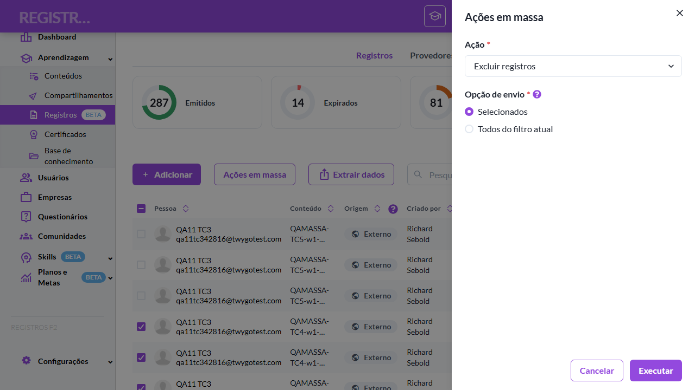
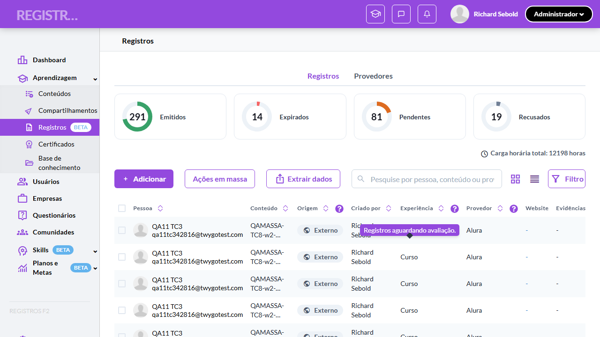
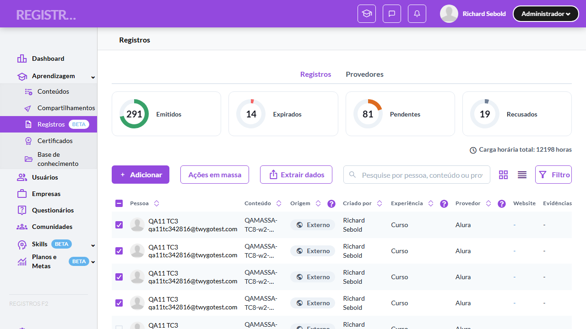

# Casos de teste — Registros de Aprendizagem

[← Voltar ao dashboard](index.md)

Lista detalhada por testsuite. Cada caso traz: o que era esperado pelo XML, quais steps foram executados, evidências (screenshots/trace), texto pronto pra registro de bug e — quando houver falha — uma explicação em PT-BR do motivo.

## Ações em massa (elegibilidade, escopos e toasts com ratio)

_10 caso(s) — 10 aprovado(s), 0 falha(s)_

### ✅ Aprovado · TC1 · Validar disponibilidade do botão e abertura sem seleção · 🔴 Crítico

<a id="validar-disponibilidade-do-botao-e-abertura-sem-selecao"></a>_Arquivo:_ `tc1-disponibilidade-botao-e-abertura-sem-selecao.spec.ts` · _Duração:_ 15.96s · _Browser:_ chromium

**Sumário (objetivo do caso):** Garantir que "Ações em massa" é exclusivo do Admin/Líder e fica habilitado mesmo sem linhas marcadas (RN 71).

**Pré-condições:**

```
Ambiente Stage configurado e acessível
Funcionalidade "Registros de Aprendizagem" habilitada no contrato da organização
Usuário logado como Admin
Usuário Líder disponível com liderados diretos
Registros Externos Pendentes em volume suficiente (mínimo 7) e registros Emitidos/Recusados/Expirados para a matriz de elegibilidade
Registros afetados pelos testes são restaurados ao final (cleanup)
```

**Passos do caso (XML/TestLink + execução Playwright):**

_Cada linha reproduz um passo do XML; a coluna **Status** traz o resultado da execução (do step Allure correspondente). Linhas com "Pré-condição" são da execução automatizada (login, navegação inicial) — não fazem parte do roteiro do XML._

| # | Ação do passo | Resultado esperado | Status | Notas | Duração |
|---|---|---|:---:|---|---:|
| 1 | Acessar a tela "Meu histórico" como Aluno | Botão "Ações em massa" NÃO é exibido na toolbar. | ✅ | — | 6.12s |
| 2 | Acessar a tela "Aprendizagem > Registros" como Admin sem nenhuma linha marcada | Botão "Ações em massa" é exibido habilitado. | ✅ | — | 6.39s |
| 3 | Clicar no botão "Ações em massa" | Drawer "Ações em massa" abre à direita. | ✅ | — | 0.35s |

**Evidências:**

_Sem evidências anexadas._


---

### ✅ Aprovado · TC10 · Validar escopo vazio com aviso de orientação · 🟡 Normal

<a id="validar-escopo-vazio-com-aviso-de-orientacao"></a>_Arquivo:_ `tc10-escopo-vazio-com-aviso-de-orientacao.spec.ts` · _Duração:_ 14.20s · _Browser:_ chromium

**Sumário (objetivo do caso):** Garantir o toast de orientação quando o escopo total é vazio (edge case de h13).

**Pré-condições:**

```
Ambiente Stage configurado e acessível
Funcionalidade "Registros de Aprendizagem" habilitada no contrato da organização
Usuário logado como Admin
Usuário Líder disponível com liderados diretos
Registros Externos Pendentes em volume suficiente (mínimo 7) e registros Emitidos/Recusados/Expirados para a matriz de elegibilidade
Registros afetados pelos testes são restaurados ao final (cleanup)
```

**Passos do caso (XML/TestLink + execução Playwright):**

_Cada linha reproduz um passo do XML; a coluna **Status** traz o resultado da execução (do step Allure correspondente). Linhas com "Pré-condição" são da execução automatizada (login, navegação inicial) — não fazem parte do roteiro do XML._

| # | Ação do passo | Resultado esperado | Status | Notas | Duração |
|---|---|---|:---:|---|---:|
| 1 | Acessar a tela "Aprendizagem > Registros" como Admin com filtro aplicado que retorna 0 registros e nenhuma linha marcada | Lista vazia ("Nenhum registro encontrado"). | ✅ | — | 8.13s |
| 2 | Clicar no botão "Ações em massa" e tentar aplicar uma ação | Aviso exibido orientando: "Marque registros na tabela ou troque pra 'Todos do filtro atual'." Nenhum processamento ocorre. | ✅ | — | 3.49s |

**Evidências:**

_Sem evidências anexadas._


---

### ✅ Aprovado · TC2 · Validar estrutura do drawer e defaults de escopo · 🔴 Crítico

<a id="validar-estrutura-do-drawer-e-defaults-de-escopo"></a>_Arquivo:_ `tc2-estrutura-do-drawer-e-defaults-de-escopo.spec.ts` · _Duração:_ 12.94s · _Browser:_ chromium

**Sumário (objetivo do caso):** Garantir campos do drawer, radio "Selecionados" desabilitado com 0 marcados e defaults corretos (RN 72).

**Pré-condições:**

```
Ambiente Stage configurado e acessível
Funcionalidade "Registros de Aprendizagem" habilitada no contrato da organização
Usuário logado como Admin
Usuário Líder disponível com liderados diretos
Registros Externos Pendentes em volume suficiente (mínimo 7) e registros Emitidos/Recusados/Expirados para a matriz de elegibilidade
Registros afetados pelos testes são restaurados ao final (cleanup)
```

**Passos do caso (XML/TestLink + execução Playwright):**

_Cada linha reproduz um passo do XML; a coluna **Status** traz o resultado da execução (do step Allure correspondente). Linhas com "Pré-condição" são da execução automatizada (login, navegação inicial) — não fazem parte do roteiro do XML._

| # | Ação do passo | Resultado esperado | Status | Notas | Duração |
|---|---|---|:---:|---|---:|
| 1 | Acessar a tela "Aprendizagem > Registros" como Admin sem seleção e clicar no botão "Ações em massa" | Drawer exibe select "Ação" com as opções "Aprovar registros", "Recusar registros" e "Excluir registros"; grupo "Opções" com radios "Selecionados" e "Todos do filtro atual ({M})". | ✅ | — | 8.05s |
| 2 | Verificar o radio "Selecionados" com 0 marcados | Radio aparece desabilitado; tooltip exibida ao passar o mouse: "Marque registros na tabela pra ativar"; default selecionado é "Todos do filtro atual". | ✅ | — | 0.06s |
| 3 | Fechar o drawer, marcar 3 linhas na tabela e reabrir o drawer | Radio "Selecionados (3)" aparece habilitado e selecionado por default. | ✅ | — | 1.77s |
| 4 | Verificar o footer com os botões "Cancelar" e "Aplicar" | Botões "Cancelar" e "Aplicar". | ✅ | — | 0.06s |

**Evidências:**

_Sem evidências anexadas._


---

### ✅ Aprovado · TC3 · Validar aprovação em massa de selecionados com toast de sucesso · 🔴 Crítico

<a id="validar-aprovacao-em-massa-de-selecionados-com-toast-de-sucesso"></a>_Arquivo:_ `tc3-aprovacao-em-massa-com-toast-de-sucesso.spec.ts` · _Duração:_ 25.32s · _Browser:_ chromium

**Sumário (objetivo do caso):** Garantir o fluxo direto de Aprovar em massa sobre registros elegíveis (RN 74).

**Pré-condições:**

```
Ambiente Stage configurado e acessível
Funcionalidade "Registros de Aprendizagem" habilitada no contrato da organização
Usuário logado como Admin
Usuário Líder disponível com liderados diretos
Registros Externos Pendentes em volume suficiente (mínimo 7) e registros Emitidos/Recusados/Expirados para a matriz de elegibilidade
Registros afetados pelos testes são restaurados ao final (cleanup)
```

**Passos do caso (XML/TestLink + execução Playwright):**

_Cada linha reproduz um passo do XML; a coluna **Status** traz o resultado da execução (do step Allure correspondente). Linhas com "Pré-condição" são da execução automatizada (login, navegação inicial) — não fazem parte do roteiro do XML._

| # | Ação do passo | Resultado esperado | Status | Notas | Duração |
|---|---|---|:---:|---|---:|
| — | _Pré-condição:_ Pré: criar 5 registros Externos Pendentes via API | — | ✅ | — | 1.26s |
| — | _Pré-condição:_ 2-3. Abrir drawer → Aprovar registros → Executar → Confirmar | — | ✅ | — | 2.56s |
| — | _Pré-condição:_ 4. Lista reflete os 5 agora Aprovados (Pendentes -5, Emitidos +5) | — | ✅ | — | 6.34s |
| 1 | Acessar a tela "Aprendizagem > Registros" como Admin e marcar 5 registros Externos Pendentes | 5 linhas selecionadas. | ✅ | — | 9.72s |
| 2 | Clicar no botão "Ações em massa" | Drawer abre com "Aprovar registros" e "Selecionados (5)". | ✅ | — | — |
| 3 | Clicar no botão "Aplicar" | Toast exibida: "5 registros aprovados". Lista atualiza com os 5 registros agora Aprovados. | ✅ | — | — |

**Evidências:**

_Sem evidências anexadas._


---

### ✅ Aprovado · TC4 · Validar toast com ratio quando há inelegíveis no escopo · 🔴 Crítico

<a id="validar-toast-com-ratio-quando-ha-inelegiveis-no-escopo"></a>_Arquivo:_ `tc4-toast-com-ratio-quando-ha-inelegiveis.spec.ts` · _Duração:_ 24.07s · _Browser:_ chromium

**Sumário (objetivo do caso):** Garantir a elegibilidade espelhando o menu por linha e o toast com contagem de ignorados (RN 73, RN 74).

**Pré-condições:**

```
Ambiente Stage configurado e acessível
Funcionalidade "Registros de Aprendizagem" habilitada no contrato da organização
Usuário logado como Admin
Usuário Líder disponível com liderados diretos
Registros Externos Pendentes em volume suficiente (mínimo 7) e registros Emitidos/Recusados/Expirados para a matriz de elegibilidade
Registros afetados pelos testes são restaurados ao final (cleanup)
```

**Passos do caso (XML/TestLink + execução Playwright):**

_Cada linha reproduz um passo do XML; a coluna **Status** traz o resultado da execução (do step Allure correspondente). Linhas com "Pré-condição" são da execução automatizada (login, navegação inicial) — não fazem parte do roteiro do XML._

| # | Ação do passo | Resultado esperado | Status | Notas | Duração |
|---|---|---|:---:|---|---:|
| — | _Pré-condição:_ Pré: criar 4 registros Externos Pendentes via API | — | ✅ | — | 1.01s |
| — | _Pré-condição:_ 2-3. Aprovar registros → Executar → modal de elegibilidade → Confirmar | — | ✅ | — | 1.20s |
| — | _Pré-condição:_ 4. Apenas os 4 Pendentes mudam (Pendentes -4, Emitidos +4) | — | ✅ | — | 6.56s |
| 1 | Acessar a tela "Aprendizagem > Registros" como Admin e marcar 7 registros (4 Externos Pendentes + 3 Emitidos) | 7 linhas selecionadas. | ✅ | — | 10.43s |
| 2 | Abrir o drawer "Ações em massa" com a ação "Aprovar registros" selecionada no dropdown "Ação" | Drawer com escopo "Selecionados (7)". | ✅ | — | — |
| 3 | Clicar no botão "Aplicar" | Toast exibida: "4 registros aprovados (3 ignorados por não atender aos critérios da ação)". Apenas os 4 Pendentes mudam para Aprovado. | ✅ | — | — |

**Evidências:**

_Sem evidências anexadas._


---

### ✅ Aprovado · TC5 · Validar recusa em massa com modal de justificativa única · 🔴 Crítico

<a id="validar-recusa-em-massa-com-modal-de-justificativa-unica"></a>_Arquivo:_ `tc5-recusa-em-massa-com-justificativa-unica.spec.ts` · _Duração:_ 24.83s · _Browser:_ chromium

**Sumário (objetivo do caso):** Garantir o modal de justificativa obrigatória aplicada a todo o batch de recusa (RN 74).

**Pré-condições:**

```
Ambiente Stage configurado e acessível
Funcionalidade "Registros de Aprendizagem" habilitada no contrato da organização
Usuário logado como Admin
Usuário Líder disponível com liderados diretos
Registros Externos Pendentes em volume suficiente (mínimo 7) e registros Emitidos/Recusados/Expirados para a matriz de elegibilidade
Registros afetados pelos testes são restaurados ao final (cleanup)
```

**Passos do caso (XML/TestLink + execução Playwright):**

_Cada linha reproduz um passo do XML; a coluna **Status** traz o resultado da execução (do step Allure correspondente). Linhas com "Pré-condição" são da execução automatizada (login, navegação inicial) — não fazem parte do roteiro do XML._

| # | Ação do passo | Resultado esperado | Status | Notas | Duração |
|---|---|---|:---:|---|---:|
| — | _Pré-condição:_ Pré: criar 3 registros Externos Pendentes via API | — | ✅ | — | 0.73s |
| — | _Pré-condição:_ 2-3. Justificativa obrigatória (inline) habilita a execução | — | ✅ | — | 0.12s |
| 1 | Acessar a tela "Aprendizagem > Registros" como Admin, aplicar o filtro padrão "Pendentes" e abrir o drawer "Ações em massa" sem marcar linhas | Drawer abre com escopo default "Todos do filtro atual ({M})". | ✅ | — | 10.12s |
| 2 | Aplicar a ação "Recusar registros" pelo botão "Aplicar" do drawer | Modal de justificativa abre com Textarea obrigatória; botão "Recusar registros" desabilitado. | ✅ | — | — |
| 3 | Preencher o campo "Justificativa" com "Plano de desenvolvimento não cobre essa formação." | Botão "Recusar registros" fica habilitado. | ✅ | — | — |
| 4 | Clicar no botão "Recusar registros" | Modal fecha. Toast exibida: "{M} registros recusados". | ✅ | — | 8.23s |
| 5 | Abrir o drawer "Histórico" de um dos registros recusados | Evento de recusa exibe a justificativa "Plano de desenvolvimento não cobre essa formação." (mesma para todo o batch). | ✅ | — | — |

**Evidências:**

_Sem evidências anexadas._


---

### ✅ Aprovado · TC6 · Validar exclusão em massa com AlertDialog de contagem · 🔴 Crítico

<a id="validar-exclusao-em-massa-com-alertdialog-de-contagem"></a>_Arquivo:_ `tc6-exclusao-em-massa-com-alertdialog-de-contagem.spec.ts` · _Duração:_ 34.03s · _Browser:_ chromium

**Sumário (objetivo do caso):** Garantir o AlertDialog destrutivo com contagem em destaque antes da exclusão em massa (RN 74).

**Pré-condições:**

```
Ambiente Stage configurado e acessível
Funcionalidade "Registros de Aprendizagem" habilitada no contrato da organização
Usuário logado como Admin
Usuário Líder disponível com liderados diretos
Registros Externos Pendentes em volume suficiente (mínimo 7) e registros Emitidos/Recusados/Expirados para a matriz de elegibilidade
Registros afetados pelos testes são restaurados ao final (cleanup)
```

**Passos do caso (XML/TestLink + execução Playwright):**

_Cada linha reproduz um passo do XML; a coluna **Status** traz o resultado da execução (do step Allure correspondente). Linhas com "Pré-condição" são da execução automatizada (login, navegação inicial) — não fazem parte do roteiro do XML._

| # | Ação do passo | Resultado esperado | Status | Notas | Duração |
|---|---|---|:---:|---|---:|
| — | _Pré-condição:_ Pré: criar 3 Pendentes e aprová-los (ficam Emitidos, elegíveis a exclusão) | — | ✅ | — | 19.22s |
| 1 | Acessar a tela "Aprendizagem > Registros" como Admin e marcar 3 registros Externos Emitidos | 3 linhas selecionadas. | ✅ | — | 1.41s |
| 2 | Aplicar a ação "Excluir registros" pelo botão "Aplicar" do drawer "Ações em massa" | AlertDialog destrutivo abre com alerta vermelho "Esta ação não pode ser desfeita." e a pergunta "Você está excluindo **3 registros**." com a contagem em destaque. | ✅ | — | 1.11s |
| 3 | Clicar no botão de confirmação da exclusão | Toast exibida: "3 registros excluídos". As 3 linhas somem da lista. | ✅ | — | 6.55s |

**Evidências:**

_Sem evidências anexadas._


---

### ✅ Aprovado · TC7 · Validar banner amarelo de escopo sem elegíveis · 🔴 Crítico

<a id="validar-banner-amarelo-de-escopo-sem-elegiveis"></a>_Arquivo:_ `tc7-banner-amarelo-de-escopo-sem-elegiveis.spec.ts` · _Duração:_ 15.16s · _Browser:_ chromium

**Sumário (objetivo do caso):** Garantir o banner informativo quando o escopo escolhido não tem registro elegível para a ação (RN 72).

**Pré-condições:**

```
Ambiente Stage configurado e acessível
Funcionalidade "Registros de Aprendizagem" habilitada no contrato da organização
Usuário logado como Admin
Usuário Líder disponível com liderados diretos
Registros Externos Pendentes em volume suficiente (mínimo 7) e registros Emitidos/Recusados/Expirados para a matriz de elegibilidade
Registros afetados pelos testes são restaurados ao final (cleanup)
```

**Passos do caso (XML/TestLink + execução Playwright):**

_Cada linha reproduz um passo do XML; a coluna **Status** traz o resultado da execução (do step Allure correspondente). Linhas com "Pré-condição" são da execução automatizada (login, navegação inicial) — não fazem parte do roteiro do XML._

| # | Ação do passo | Resultado esperado | Status | Notas | Duração |
|---|---|---|:---:|---|---:|
| 1 | Acessar a tela "Aprendizagem > Registros" como Admin e marcar 3 registros Emitidos (nenhum Pendente) | 3 linhas selecionadas. | ✅ | — | 10.72s |
| 2 | Abrir o drawer "Ações em massa" com a ação "Aprovar registros" e o escopo "Selecionados (3)" | Banner amarelo exibido no drawer: "Nenhum registro no escopo atende aos critérios pra essa ação." | ✅ | — | 0.72s |
| 3 | Selecionar "Excluir registros" no dropdown "Ação" | Banner amarelo some (Emitidos são elegíveis a exclusão). | ✅ | — | 0.10s |

**Evidências:**

📁 _Pasta:_ [`artifacts/projects-registros-externo-b6bc3-elo-de-escopo-sem-elegíveis-chromium-retry1/`](artifacts/projects-registros-externo-b6bc3-elo-de-escopo-sem-elegíveis-chromium-retry1/)

- 📸 **Screenshot (screenshot)** — [`test-finished-1.png`](artifacts/projects-registros-externo-b6bc3-elo-de-escopo-sem-elegíveis-chromium-retry1/test-finished-1.png)

  

- 🎬 [Vídeo da execução (video.webm)](artifacts/projects-registros-externo-b6bc3-elo-de-escopo-sem-elegíveis-chromium-retry1/video.webm)

- 🎬 [Vídeo da execução (video-1.webm)](artifacts/projects-registros-externo-b6bc3-elo-de-escopo-sem-elegíveis-chromium-retry1/video-1.webm)

- 📦 **Trace** — [`trace.zip`](artifacts/projects-registros-externo-b6bc3-elo-de-escopo-sem-elegíveis-chromium-retry1/trace.zip)

  ```bash
  npx playwright show-trace outputs/registros-externos/reports/acoes-em-massa-elegibilidade-escopos-e-toasts-com-ratio_20260623-163425/artifacts/projects-registros-externo-b6bc3-elo-de-escopo-sem-elegíveis-chromium-retry1/trace.zip
  ```

- 🎥 **Vídeo** — [`video.webm`](artifacts/projects-registros-externo-b6bc3-elo-de-escopo-sem-elegíveis-chromium-retry1/video.webm)

- 🎥 **Vídeo** — [`video-1.webm`](artifacts/projects-registros-externo-b6bc3-elo-de-escopo-sem-elegíveis-chromium-retry1/video-1.webm)


---

### ✅ Aprovado · TC8 · Validar pós-aplicação: limpeza da seleção e refresh único do KPI · 🔴 Crítico

<a id="validar-pos-aplicacao-limpeza-da-selecao-e-refresh-unico-do-kpi"></a>_Arquivo:_ `tc8-pos-aplicacao-limpeza-selecao-e-refresh-kpi.spec.ts` · _Duração:_ 25.41s · _Browser:_ chromium

**Sumário (objetivo do caso):** Garantir que após o batch a seleção é limpa e o KPI atualiza uma única vez (RN 75).

**Pré-condições:**

```
Ambiente Stage configurado e acessível
Funcionalidade "Registros de Aprendizagem" habilitada no contrato da organização
Usuário logado como Admin
Usuário Líder disponível com liderados diretos
Registros Externos Pendentes em volume suficiente (mínimo 7) e registros Emitidos/Recusados/Expirados para a matriz de elegibilidade
Registros afetados pelos testes são restaurados ao final (cleanup)
```

**Passos do caso (XML/TestLink + execução Playwright):**

_Cada linha reproduz um passo do XML; a coluna **Status** traz o resultado da execução (do step Allure correspondente). Linhas com "Pré-condição" são da execução automatizada (login, navegação inicial) — não fazem parte do roteiro do XML._

| # | Ação do passo | Resultado esperado | Status | Notas | Duração |
|---|---|---|:---:|---|---:|
| — | _Pré-condição:_ Pré: criar 4 registros Externos Pendentes via API | — | ✅ | — | 0.96s |
| — | _Pré-condição:_ 3-4. Após o refresh único: seleção limpa + KPIs -/+N | — | ✅ | — | 7.02s |
| 1 | Acessar a tela "Aprendizagem > Registros" como Admin, anotar os KPIs e marcar 4 registros Externos Pendentes | 4 linhas selecionadas; checkbox do header em tri-state. | ✅ | — | 10.78s |
| 2 | Executar "Aprovar registros" em massa sobre os selecionados | Toast de sucesso exibida. | ✅ | — | 1.77s |
| 3 | Verificar os checkboxes da tabela e o estado do checkbox "selecionar todos" | Todos desmarcados (seleção limpa); checkbox do header volta ao estado vazio. | ✅ | — | — |
| 4 | Verificar os KPIs "Pendentes" e "Emitidos" | "Pendentes" -4 e "Emitidos" +4 aplicados de uma só vez. | ✅ | — | — |

**Evidências:**

📁 _Pasta:_ [`artifacts/projects-registros-externo-00e5e-eção-e-refresh-único-do-KPI-chromium/`](artifacts/projects-registros-externo-00e5e-eção-e-refresh-único-do-KPI-chromium/)

- 📸 **Screenshot (screenshot)** — [`test-finished-1.png`](artifacts/projects-registros-externo-00e5e-eção-e-refresh-único-do-KPI-chromium/test-finished-1.png)

  

- 🎬 [Vídeo da execução (video.webm)](artifacts/projects-registros-externo-00e5e-eção-e-refresh-único-do-KPI-chromium/video.webm)

- 🎬 [Vídeo da execução (video-1.webm)](artifacts/projects-registros-externo-00e5e-eção-e-refresh-único-do-KPI-chromium/video-1.webm)

- 📦 **Trace** — [`trace.zip`](artifacts/projects-registros-externo-00e5e-eção-e-refresh-único-do-KPI-chromium/trace.zip)

  ```bash
  npx playwright show-trace outputs/registros-externos/reports/acoes-em-massa-elegibilidade-escopos-e-toasts-com-ratio_20260623-163425/artifacts/projects-registros-externo-00e5e-eção-e-refresh-único-do-KPI-chromium/trace.zip
  ```

- 🎥 **Vídeo** — [`video.webm`](artifacts/projects-registros-externo-00e5e-eção-e-refresh-único-do-KPI-chromium/video.webm)

- 🎥 **Vídeo** — [`video-1.webm`](artifacts/projects-registros-externo-00e5e-eção-e-refresh-único-do-KPI-chromium/video-1.webm)


---

### ✅ Aprovado · TC9 · Validar fechamento do drawer preservando a seleção · 🟡 Normal

<a id="validar-fechamento-do-drawer-preservando-a-selecao"></a>_Arquivo:_ `tc9-fechamento-do-drawer-preservando-selecao.spec.ts` · _Duração:_ 16.56s · _Browser:_ chromium

**Sumário (objetivo do caso):** Garantir que fechar o drawer sem aplicar mantém os checkboxes marcados (h13 cenário 05).

**Pré-condições:**

```
Ambiente Stage configurado e acessível
Funcionalidade "Registros de Aprendizagem" habilitada no contrato da organização
Usuário logado como Admin
Usuário Líder disponível com liderados diretos
Registros Externos Pendentes em volume suficiente (mínimo 7) e registros Emitidos/Recusados/Expirados para a matriz de elegibilidade
Registros afetados pelos testes são restaurados ao final (cleanup)
```

**Passos do caso (XML/TestLink + execução Playwright):**

_Cada linha reproduz um passo do XML; a coluna **Status** traz o resultado da execução (do step Allure correspondente). Linhas com "Pré-condição" são da execução automatizada (login, navegação inicial) — não fazem parte do roteiro do XML._

| # | Ação do passo | Resultado esperado | Status | Notas | Duração |
|---|---|---|:---:|---|---:|
| — | _Pré-condição:_ 2-3. Abrir o drawer e fechar pelo X | — | ✅ | — | 1.04s |
| — | _Pré-condição:_ As 4 linhas permanecem selecionadas | — | ✅ | — | 0.78s |
| 1 | Acessar a tela "Aprendizagem > Registros" como Admin e marcar 4 linhas | 4 linhas selecionadas. | ✅ | — | 9.38s |
| 2 | Clicar no botão "Ações em massa" | Drawer abre. | ✅ | — | — |
| 3 | Clicar no botão de fechar (X) do drawer | Drawer fecha; as 4 linhas permanecem selecionadas na tabela. | ✅ | — | — |

**Evidências:**

📁 _Pasta:_ [`artifacts/projects-registros-externo-6c5d2-rawer-preservando-a-seleção-chromium/`](artifacts/projects-registros-externo-6c5d2-rawer-preservando-a-seleção-chromium/)

- 📸 **Screenshot (screenshot)** — [`test-finished-1.png`](artifacts/projects-registros-externo-6c5d2-rawer-preservando-a-seleção-chromium/test-finished-1.png)

  

- 🎬 [Vídeo da execução (video.webm)](artifacts/projects-registros-externo-6c5d2-rawer-preservando-a-seleção-chromium/video.webm)

- 🎬 [Vídeo da execução (video-1.webm)](artifacts/projects-registros-externo-6c5d2-rawer-preservando-a-seleção-chromium/video-1.webm)

- 📦 **Trace** — [`trace.zip`](artifacts/projects-registros-externo-6c5d2-rawer-preservando-a-seleção-chromium/trace.zip)

  ```bash
  npx playwright show-trace outputs/registros-externos/reports/acoes-em-massa-elegibilidade-escopos-e-toasts-com-ratio_20260623-163425/artifacts/projects-registros-externo-6c5d2-rawer-preservando-a-seleção-chromium/trace.zip
  ```

- 🎥 **Vídeo** — [`video.webm`](artifacts/projects-registros-externo-6c5d2-rawer-preservando-a-seleção-chromium/video.webm)

- 🎥 **Vídeo** — [`video-1.webm`](artifacts/projects-registros-externo-6c5d2-rawer-preservando-a-seleção-chromium/video-1.webm)


---
