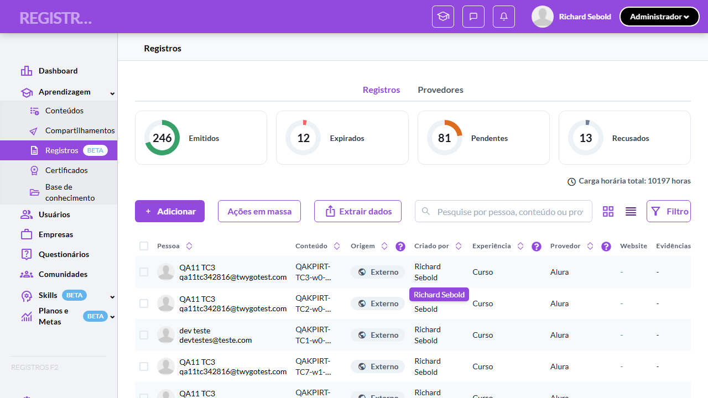
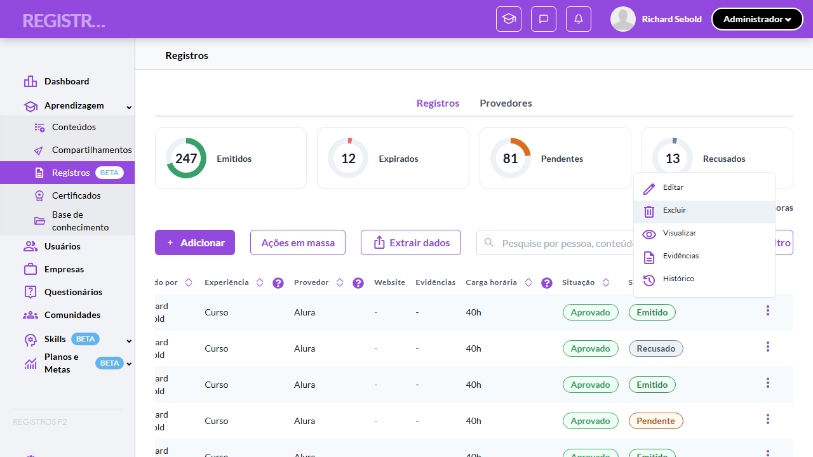
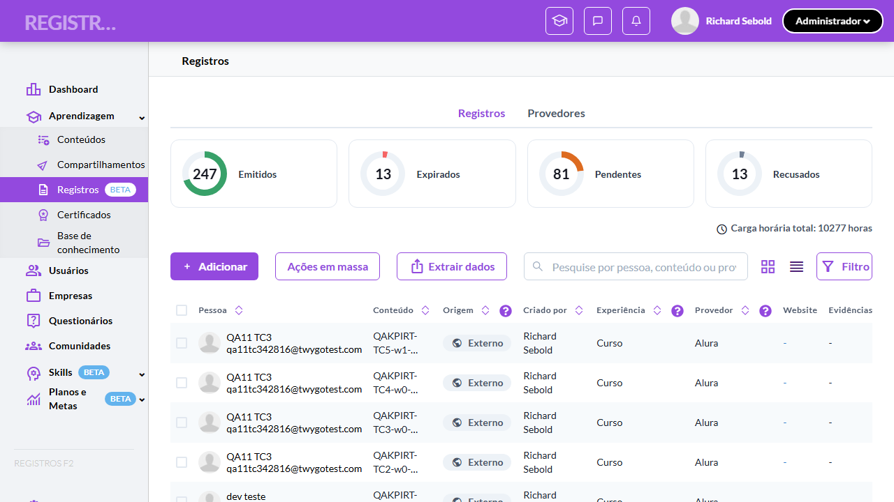
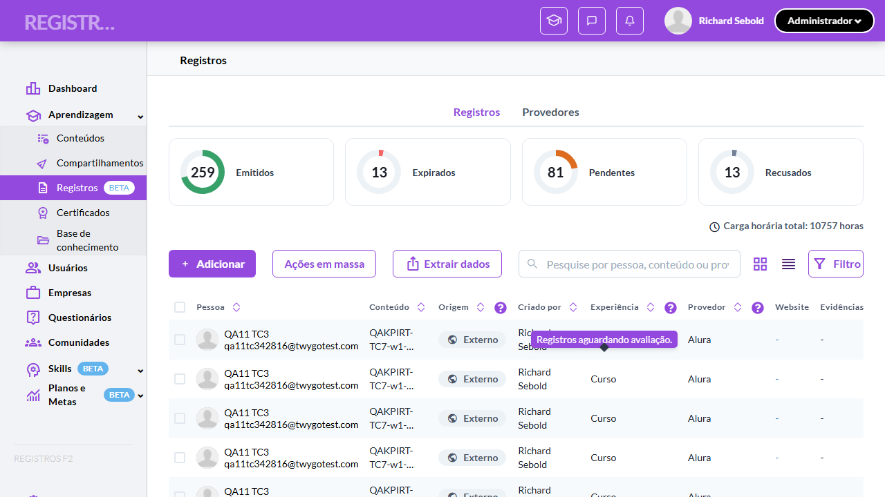

# Casos de teste — Registros de Aprendizagem

[← Voltar ao dashboard](index.md)

Lista detalhada por testsuite. Cada caso traz: o que era esperado pelo XML, quais steps foram executados, evidências (screenshots/trace), texto pronto pra registro de bug e — quando houver falha — uma explicação em PT-BR do motivo.

## Atualização de KPIs em tempo real (ações, expiração e batch)

_9 caso(s) — 6 aprovado(s), 1 falha(s), 2 ignorado(s)_

### ✅ Aprovado · Validar incremento imediato do KPI após Adicionar 

<a id="validar-incremento-imediato-do-kpi-apos-adicionar"></a>_Arquivo:_ `tc1-incremento-kpi-apos-adicionar.spec.ts` · _Duração:_ 22.98s · _Browser:_ chromium

**Passos do caso (XML/TestLink + execução Playwright):**

_Cada linha reproduz um passo do XML; a coluna **Status** traz o resultado da execução (do step Allure correspondente). Linhas com "Pré-condição" são da execução automatizada (login, navegação inicial) — não fazem parte do roteiro do XML._

| # | Ação do passo | Resultado esperado | Status | Notas | Duração |
|---|---|---|:---:|---|---:|
| — | _Pré-condição:_ 1. Acessar Registros e anotar o número do card "Pendentes" | — | ✅ | — | 6.52s |
| — | _Pré-condição:_ 2-6. Abrir "Adicionar" e preencher o registro externo | — | ✅ | — | 7.42s |
| — | _Pré-condição:_ 7. Salvar/enviar o registro → volta para a lista | — | ✅ | — | 4.94s |
| — | _Pré-condição:_ 8. Verificar o card "Pendentes" incrementou em 1 sem reload | — | ✅ | — | 0.02s |

**Evidências:**

📁 _Pasta:_ [`artifacts/projects-registros-externo-ba4dc-diato-do-KPI-após-Adicionar-chromium/`](artifacts/projects-registros-externo-ba4dc-diato-do-KPI-após-Adicionar-chromium/)

- 📸 **Screenshot (screenshot)** — [`test-finished-1.png`](artifacts/projects-registros-externo-ba4dc-diato-do-KPI-após-Adicionar-chromium/test-finished-1.png)

  

- 🎬 [Vídeo da execução (video.webm)](artifacts/projects-registros-externo-ba4dc-diato-do-KPI-após-Adicionar-chromium/video.webm)

- 🎬 [Vídeo da execução (video-1.webm)](artifacts/projects-registros-externo-ba4dc-diato-do-KPI-após-Adicionar-chromium/video-1.webm)

- 📦 **Trace** — [`trace.zip`](artifacts/projects-registros-externo-ba4dc-diato-do-KPI-após-Adicionar-chromium/trace.zip)

  ```bash
  npx playwright show-trace outputs/registros-externos/reports/atualizacao-de-kpis-em-tempo-real-acoes-expiracao-e-batch_20260622-172949/artifacts/projects-registros-externo-ba4dc-diato-do-KPI-após-Adicionar-chromium/trace.zip
  ```

- 🎥 **Vídeo** — [`video.webm`](artifacts/projects-registros-externo-ba4dc-diato-do-KPI-após-Adicionar-chromium/video.webm)

- 🎥 **Vídeo** — [`video-1.webm`](artifacts/projects-registros-externo-ba4dc-diato-do-KPI-após-Adicionar-chromium/video-1.webm)


---

### ✅ Aprovado · TC2 · Validar transição de KPI após Aprovar (-1 Pendentes, +1 Emitidos) · 🔴 Crítico

<a id="validar-transicao-de-kpi-apos-aprovar-1-pendentes-1-emitidos"></a>_Arquivo:_ `tc2-transicao-kpi-apos-aprovar.spec.ts` · _Duração:_ 20.12s · _Browser:_ chromium

**Sumário (objetivo do caso):** Garantir a transição imediata entre cards após aprovação individual (RN 32.1).

**Pré-condições:**

```
Ambiente Stage configurado e acessível
Funcionalidade "Registros de Aprendizagem" habilitada no contrato da organização
Usuário logado como Admin (cenários de avaliação/exclusão/massa) e usuário Aluno disponível (cenário de criação)
Registros Externos Pendentes disponíveis para aprovar/recusar (mínimo 5 para o cenário de batch)
Registros Externos elegíveis a exclusão (Emitido, Recusado ou Expirado)
Registro Emitido com data de validade no dia corrente (cenário de expiração)
Dados criados pelos testes são removidos ao final (cleanup)
```

**Passos do caso (XML/TestLink + execução Playwright):**

_Cada linha reproduz um passo do XML; a coluna **Status** traz o resultado da execução (do step Allure correspondente). Linhas com "Pré-condição" são da execução automatizada (login, navegação inicial) — não fazem parte do roteiro do XML._

| # | Ação do passo | Resultado esperado | Status | Notas | Duração |
|---|---|---|:---:|---|---:|
| — | _Pré-condição:_ Pré: criar 1 registro Externo Pendente via API | — | ✅ | — | 0.26s |
| — | _Pré-condição:_ 2-5. Abrir "Avaliar" do registro Pendente e clicar "Aprovar" | — | ✅ | — | 10.44s |
| 1 | Acessar a tela "Aprendizagem > Registros" como Admin e anotar os números de "Pendentes" e "Emitidos" | Cards exibem as contagens atuais (ex: 12 Pendentes, 312 Emitidos). | ✅ | — | 5.72s |
| 2 | Clicar no menu 3 pontos de um registro Externo Pendente | Menu exibe o item "Avaliar" em destaque. | ✅ | — | — |
| 3 | Clicar no item "Avaliar" | Form "Avaliar registro" é exibido. | ✅ | — | — |
| 4 | Selecionar "Curso" no dropdown "Tipo de experiência" | Opção fica selecionada. | ✅ | — | — |
| 5 | Clicar no botão "Aprovar" | Toast exibida: "Registro aprovado". Sistema retorna para a lista. | ✅ | — | — |
| 6 | Verificar os números dos cards "Pendentes" e "Emitidos" | "Pendentes" decrementou 1 e "Emitidos" incrementou 1 (ex: 11 e 313), no mesmo instante, sem reload. | ✅ | — | 0.04s |

**Evidências:**

📁 _Pasta:_ [`artifacts/projects-registros-externo-a6e44-ar--1-Pendentes-1-Emitidos--chromium/`](artifacts/projects-registros-externo-a6e44-ar--1-Pendentes-1-Emitidos--chromium/)

- 📸 **Screenshot (screenshot)** — [`test-finished-1.png`](artifacts/projects-registros-externo-a6e44-ar--1-Pendentes-1-Emitidos--chromium/test-finished-1.png)

  

- 🎬 [Vídeo da execução (video.webm)](artifacts/projects-registros-externo-a6e44-ar--1-Pendentes-1-Emitidos--chromium/video.webm)

- 🎬 [Vídeo da execução (video-1.webm)](artifacts/projects-registros-externo-a6e44-ar--1-Pendentes-1-Emitidos--chromium/video-1.webm)

- 📦 **Trace** — [`trace.zip`](artifacts/projects-registros-externo-a6e44-ar--1-Pendentes-1-Emitidos--chromium/trace.zip)

  ```bash
  npx playwright show-trace outputs/registros-externos/reports/atualizacao-de-kpis-em-tempo-real-acoes-expiracao-e-batch_20260622-172949/artifacts/projects-registros-externo-a6e44-ar--1-Pendentes-1-Emitidos--chromium/trace.zip
  ```

- 🎥 **Vídeo** — [`video.webm`](artifacts/projects-registros-externo-a6e44-ar--1-Pendentes-1-Emitidos--chromium/video.webm)

- 🎥 **Vídeo** — [`video-1.webm`](artifacts/projects-registros-externo-a6e44-ar--1-Pendentes-1-Emitidos--chromium/video-1.webm)


---

### ✅ Aprovado · TC3 · Validar transição de KPI após Recusar (-1 Pendentes, +1 Recusados) · 🔴 Crítico

<a id="validar-transicao-de-kpi-apos-recusar-1-pendentes-1-recusados"></a>_Arquivo:_ `tc3-transicao-kpi-apos-recusar.spec.ts` · _Duração:_ 20.35s · _Browser:_ chromium

**Sumário (objetivo do caso):** Garantir a transição imediata após recusa individual (RN 32.1).

**Pré-condições:**

```
Ambiente Stage configurado e acessível
Funcionalidade "Registros de Aprendizagem" habilitada no contrato da organização
Usuário logado como Admin (cenários de avaliação/exclusão/massa) e usuário Aluno disponível (cenário de criação)
Registros Externos Pendentes disponíveis para aprovar/recusar (mínimo 5 para o cenário de batch)
Registros Externos elegíveis a exclusão (Emitido, Recusado ou Expirado)
Registro Emitido com data de validade no dia corrente (cenário de expiração)
Dados criados pelos testes são removidos ao final (cleanup)
```

**Passos do caso (XML/TestLink + execução Playwright):**

_Cada linha reproduz um passo do XML; a coluna **Status** traz o resultado da execução (do step Allure correspondente). Linhas com "Pré-condição" são da execução automatizada (login, navegação inicial) — não fazem parte do roteiro do XML._

| # | Ação do passo | Resultado esperado | Status | Notas | Duração |
|---|---|---|:---:|---|---:|
| — | _Pré-condição:_ Pré: criar 1 registro Externo Pendente via API | — | ✅ | — | 0.23s |
| — | _Pré-condição:_ 2-6. Avaliar → Recusar com justificativa | — | ✅ | — | 9.98s |
| 1 | Acessar a tela "Aprendizagem > Registros" como Admin e anotar "Pendentes" e "Recusados" | Cards exibem as contagens atuais. | ✅ | — | 6.42s |
| 2 | Clicar no menu 3 pontos de um registro Externo Pendente | Menu exibe "Avaliar". | ✅ | — | — |
| 3 | Clicar no item "Avaliar" | Form "Avaliar registro" é exibido. | ✅ | — | — |
| 4 | Clicar no botão "Recusar" | Modal "Recusar registro" é exibido. | ✅ | — | — |
| 5 | Preencher o campo "Justificativa" com "Evidências não comprovam a carga horária declarada" | Botão "Recusar registro" fica habilitado. | ✅ | — | — |
| 6 | Clicar no botão "Recusar registro" | Modal fecha. Toast exibida: "Registro recusado". | ✅ | — | — |
| 7 | Verificar os números dos cards "Pendentes" e "Recusados" | "Pendentes" decrementou 1 e "Recusados" incrementou 1, sem reload. | ✅ | — | 0.05s |

**Evidências:**

📁 _Pasta:_ [`artifacts/projects-registros-externo-76bea-r--1-Pendentes-1-Recusados--chromium/`](artifacts/projects-registros-externo-76bea-r--1-Pendentes-1-Recusados--chromium/)

- 📸 **Screenshot (screenshot)** — [`test-finished-1.png`](artifacts/projects-registros-externo-76bea-r--1-Pendentes-1-Recusados--chromium/test-finished-1.png)

  

- 🎬 [Vídeo da execução (video.webm)](artifacts/projects-registros-externo-76bea-r--1-Pendentes-1-Recusados--chromium/video.webm)

- 🎬 [Vídeo da execução (video-1.webm)](artifacts/projects-registros-externo-76bea-r--1-Pendentes-1-Recusados--chromium/video-1.webm)

- 📦 **Trace** — [`trace.zip`](artifacts/projects-registros-externo-76bea-r--1-Pendentes-1-Recusados--chromium/trace.zip)

  ```bash
  npx playwright show-trace outputs/registros-externos/reports/atualizacao-de-kpis-em-tempo-real-acoes-expiracao-e-batch_20260622-172949/artifacts/projects-registros-externo-76bea-r--1-Pendentes-1-Recusados--chromium/trace.zip
  ```

- 🎥 **Vídeo** — [`video.webm`](artifacts/projects-registros-externo-76bea-r--1-Pendentes-1-Recusados--chromium/video.webm)

- 🎥 **Vídeo** — [`video-1.webm`](artifacts/projects-registros-externo-76bea-r--1-Pendentes-1-Recusados--chromium/video-1.webm)


---

### ❌ Falhou · TC4 · Validar decremento do KPI após Excluir · 🔴 Crítico

<a id="validar-decremento-do-kpi-apos-excluir"></a>_Arquivo:_ `tc4-decremento-kpi-apos-excluir.spec.ts` · _Duração:_ 30.54s · _Browser:_ chromium

> **❌ Por que falhou:** O elemento esperado não apareceu na tela (locator: locator('[role="alertdialog"], [role="dialog"], .chakra-modal__content').filter({ hasText: /Excluir registro|desfeita|Tem certeza|Confirmação/i }).first()).
> _Step impactado:_ **3. 2-4. Menu 3 pontos → Excluir → confirmar no modal**

**Sumário (objetivo do caso):** Garantir que excluir registro decrementa o card do status atual imediatamente (RN 32).

**Pré-condições:**

```
Ambiente Stage configurado e acessível
Funcionalidade "Registros de Aprendizagem" habilitada no contrato da organização
Usuário logado como Admin (cenários de avaliação/exclusão/massa) e usuário Aluno disponível (cenário de criação)
Registros Externos Pendentes disponíveis para aprovar/recusar (mínimo 5 para o cenário de batch)
Registros Externos elegíveis a exclusão (Emitido, Recusado ou Expirado)
Registro Emitido com data de validade no dia corrente (cenário de expiração)
Dados criados pelos testes são removidos ao final (cleanup)
```

**Passos do caso (XML/TestLink + execução Playwright):**

_Cada linha reproduz um passo do XML; a coluna **Status** traz o resultado da execução (do step Allure correspondente). Linhas com "Pré-condição" são da execução automatizada (login, navegação inicial) — não fazem parte do roteiro do XML._

| # | Ação do passo | Resultado esperado | Status | Notas | Duração |
|---|---|---|:---:|---|---:|
| — | _Pré-condição:_ Pré: criar Pendente e aprovar (→ Emitido, elegível a exclusão) | — | ✅ | — | 15.94s |
| — | _Pré-condição:_ 2-4. Menu 3 pontos → Excluir → confirmar no modal | — | ❌ | O elemento esperado não apareceu na tela (locator: locator('[role="alertdialog"], [role="dialog"], .chakra-modal__content').filter({ hasText: /Excluir registro\|desfeita\|Tem certeza\|Confirmação/i }).first()). | 10.56s |
| 1 | Acessar a tela "Aprendizagem > Registros" como Admin e anotar o número do card "Recusados" | Card exibe a contagem atual. | ✅ | — | 0.04s |
| 2 | Clicar no menu 3 pontos de um registro Externo Recusado | Menu exibe o item "Excluir". | ⊘ | Step não executado: o teste foi interrompido antes. Causa: O elemento esperado não apareceu na tela (locator: locator('[role="alertdialog"], [role="dialog"], .chakra-modal__content').filter({ hasText: /Excluir registro\|desfeita\|Tem certeza\|Confirmação/i }).first()).. | — |
| 3 | Clicar no item "Excluir" | Modal "Excluir registro?" é exibido com alerta "Esta ação não pode ser desfeita.". | ⊘ | Step não executado: o teste foi interrompido antes. Causa: O elemento esperado não apareceu na tela (locator: locator('[role="alertdialog"], [role="dialog"], .chakra-modal__content').filter({ hasText: /Excluir registro\|desfeita\|Tem certeza\|Confirmação/i }).first()).. | — |
| 4 | Clicar no botão "Excluir" | Toast exibida: "Registro excluído". Lista atualiza removendo a linha. | ⊘ | Step não executado: o teste foi interrompido antes. Causa: O elemento esperado não apareceu na tela (locator: locator('[role="alertdialog"], [role="dialog"], .chakra-modal__content').filter({ hasText: /Excluir registro\|desfeita\|Tem certeza\|Confirmação/i }).first()).. | — |
| 5 | Verificar o número do card "Recusados" | Decrementou 1; total geral do donut também caiu em 1. | ⊘ | Step não executado: o teste foi interrompido antes. Causa: O elemento esperado não apareceu na tela (locator: locator('[role="alertdialog"], [role="dialog"], .chakra-modal__content').filter({ hasText: /Excluir registro\|desfeita\|Tem certeza\|Confirmação/i }).first()).. | — |

**Evidências:**

📁 _Pasta:_ [`artifacts/projects-registros-externo-edf6b-remento-do-KPI-após-Excluir-chromium/`](artifacts/projects-registros-externo-edf6b-remento-do-KPI-após-Excluir-chromium/)

- 📸 **Screenshot (screenshot)** — [`test-failed-1.png`](artifacts/projects-registros-externo-edf6b-remento-do-KPI-após-Excluir-chromium/test-failed-1.png)

  

- 🎬 [Vídeo da execução (video.webm)](artifacts/projects-registros-externo-edf6b-remento-do-KPI-após-Excluir-chromium/video.webm)

- 🎬 [Vídeo da execução (video-1.webm)](artifacts/projects-registros-externo-edf6b-remento-do-KPI-após-Excluir-chromium/video-1.webm)

- 📦 **Trace** — [`trace.zip`](artifacts/projects-registros-externo-edf6b-remento-do-KPI-após-Excluir-chromium/trace.zip)

  ```bash
  npx playwright show-trace outputs/registros-externos/reports/atualizacao-de-kpis-em-tempo-real-acoes-expiracao-e-batch_20260622-172949/artifacts/projects-registros-externo-edf6b-remento-do-KPI-após-Excluir-chromium/trace.zip
  ```

- 🎥 **Vídeo** — [`video.webm`](artifacts/projects-registros-externo-edf6b-remento-do-KPI-após-Excluir-chromium/video.webm)

- 🎥 **Vídeo** — [`video-1.webm`](artifacts/projects-registros-externo-edf6b-remento-do-KPI-após-Excluir-chromium/video-1.webm)

- 📄 **DOM no momento da falha** — [`error-context.md`](artifacts/projects-registros-externo-edf6b-remento-do-KPI-após-Excluir-chromium/error-context.md)

#### 🐛 Pronto para registro de bug

**Descrição do BUG:** [Crítico] Validar decremento do KPI após Excluir — O elemento esperado não apareceu na tela (locator: locator('[role="alertdialog"], [role="dialog"], .chakra-modal__content').filter({ hasText: /Excluir registro|desfeita|Tem certeza|Confirmação/i }).first()).

**Passo a passo para reprodução:**
1. Pré: Ambiente Stage configurado e acessível
1. Pré: Funcionalidade "Registros de Aprendizagem" habilitada no contrato da organização
1. Pré: Usuário logado como Admin (cenários de avaliação/exclusão/massa) e usuário Aluno disponível (cenário de criação)
1. Pré: Registros Externos Pendentes disponíveis para aprovar/recusar (mínimo 5 para o cenário de batch)
1. Pré: Registros Externos elegíveis a exclusão (Emitido, Recusado ou Expirado)
1. Pré: Registro Emitido com data de validade no dia corrente (cenário de expiração)
1. Pré: Dados criados pelos testes são removidos ao final (cleanup)
1. 1. Acessar a tela "Aprendizagem > Registros" como Admin e anotar o número do card "Recusados"
1. 2. Clicar no menu 3 pontos de um registro Externo Recusado
1. 3. Clicar no item "Excluir"
1. 4. Clicar no botão "Excluir"
1. 5. Verificar o número do card "Recusados"

**Comportamento esperado:** Modal "Excluir registro?" é exibido com alerta "Esta ação não pode ser desfeita.".

**Comportamento atual:** O elemento esperado não apareceu na tela (locator: locator('[role="alertdialog"], [role="dialog"], .chakra-modal__content').filter({ hasText: /Excluir registro|desfeita|Tem certeza|Confirmação/i }).first()). (falha aconteceu no passo 3: "2-4. Menu 3 pontos → Excluir → confirmar no modal", que deveria resultar em: Modal "Excluir registro?" é exibido com alerta "Esta ação não pode ser desfeita.".)

**Informações:**

| Campo | Valor |
|---|---|
| URL | `https://registrosf2.stage.twygoead.com/` |
| Login | Credenciais via env: `TWYGO_STAGING_REGISTROS_EXTERNOS_EMAIL` (consulte `.env`) |
| Senha | Credenciais via env: `TWYGO_STAGING_REGISTROS_EXTERNOS_PASSWORD` (consulte `.env`) |
| orgId | 37079 |
| Outros | Browser: chromium |
| Outros | runId: atualizacao-de-kpis-em-tempo-real-acoes-expiracao-e-batch_20260622-172949 |
| Outros | Duração até a falha: 30.54s |
| Outros | Step impactado: 3. 2-4. Menu 3 pontos → Excluir → confirmar no modal |

**Evidências:**

- Screenshot capturado pelo Playwright (screenshot): artifacts/projects-registros-externo-edf6b-remento-do-KPI-após-Excluir-chromium/test-failed-1.png
- Vídeo da execução (video-1.webm): artifacts/projects-registros-externo-edf6b-remento-do-KPI-após-Excluir-chromium/video-1.webm
- Vídeo da execução (video.webm): artifacts/projects-registros-externo-edf6b-remento-do-KPI-após-Excluir-chromium/video.webm
- Snapshot do DOM/contexto da página (error-context.md): artifacts/projects-registros-externo-edf6b-remento-do-KPI-após-Excluir-chromium/error-context.md
- Trace completo do Playwright (.zip) — `npx playwright show-trace`: artifacts/projects-registros-externo-edf6b-remento-do-KPI-após-Excluir-chromium/trace.zip

<details><summary>📋 Ver texto agregado para copiar (Jira/GitHub/Linear)</summary>

```
Descrição do BUG
[Crítico] Validar decremento do KPI após Excluir — O elemento esperado não apareceu na tela (locator: locator('[role="alertdialog"], [role="dialog"], .chakra-modal__content').filter({ hasText: /Excluir registro|desfeita|Tem certeza|Confirmação/i }).first()).

Passo a passo para reprodução
  Pré: Ambiente Stage configurado e acessível
  Pré: Funcionalidade "Registros de Aprendizagem" habilitada no contrato da organização
  Pré: Usuário logado como Admin (cenários de avaliação/exclusão/massa) e usuário Aluno disponível (cenário de criação)
  Pré: Registros Externos Pendentes disponíveis para aprovar/recusar (mínimo 5 para o cenário de batch)
  Pré: Registros Externos elegíveis a exclusão (Emitido, Recusado ou Expirado)
  Pré: Registro Emitido com data de validade no dia corrente (cenário de expiração)
  Pré: Dados criados pelos testes são removidos ao final (cleanup)
  1. Acessar a tela "Aprendizagem > Registros" como Admin e anotar o número do card "Recusados"
  2. Clicar no menu 3 pontos de um registro Externo Recusado
  3. Clicar no item "Excluir"
  4. Clicar no botão "Excluir"
  5. Verificar o número do card "Recusados"

Comportamento esperado
Modal "Excluir registro?" é exibido com alerta "Esta ação não pode ser desfeita.".

Comportamento atual
O elemento esperado não apareceu na tela (locator: locator('[role="alertdialog"], [role="dialog"], .chakra-modal__content').filter({ hasText: /Excluir registro|desfeita|Tem certeza|Confirmação/i }).first()). (falha aconteceu no passo 3: "2-4. Menu 3 pontos → Excluir → confirmar no modal", que deveria resultar em: Modal "Excluir registro?" é exibido com alerta "Esta ação não pode ser desfeita.".)

Informações
- URL: https://registrosf2.stage.twygoead.com/
- Login: Credenciais via env: `TWYGO_STAGING_REGISTROS_EXTERNOS_EMAIL` (consulte `.env`)
- Senha: Credenciais via env: `TWYGO_STAGING_REGISTROS_EXTERNOS_PASSWORD` (consulte `.env`)
- ID do ambiente (orgId): 37079
- Outros:
  - Browser: chromium
  - runId: atualizacao-de-kpis-em-tempo-real-acoes-expiracao-e-batch_20260622-172949
  - Duração até a falha: 30.54s
  - Step impactado: 3. 2-4. Menu 3 pontos → Excluir → confirmar no modal

Evidências
- Screenshot capturado pelo Playwright (screenshot): artifacts/projects-registros-externo-edf6b-remento-do-KPI-após-Excluir-chromium/test-failed-1.png
- Vídeo da execução (video-1.webm): artifacts/projects-registros-externo-edf6b-remento-do-KPI-após-Excluir-chromium/video-1.webm
- Vídeo da execução (video.webm): artifacts/projects-registros-externo-edf6b-remento-do-KPI-após-Excluir-chromium/video.webm
- Snapshot do DOM/contexto da página (error-context.md): artifacts/projects-registros-externo-edf6b-remento-do-KPI-após-Excluir-chromium/error-context.md
- Trace completo do Playwright (.zip) — `npx playwright show-trace`: artifacts/projects-registros-externo-edf6b-remento-do-KPI-após-Excluir-chromium/trace.zip

Execução
- runId: atualizacao-de-kpis-em-tempo-real-acoes-expiracao-e-batch_20260622-172949
- environment.json: staging-registros-externos
- testsuite: Atualização de KPIs em tempo real (ações, expiração e batch)
- testcase: Validar decremento do KPI após Excluir

```

</details>

<details><summary>🔧 Stack trace técnica completa (para desenvolvedor)</summary>

```
Error: expect(locator).toBeVisible() failed

Locator: locator('[role="alertdialog"], [role="dialog"], .chakra-modal__content').filter({ hasText: /Excluir registro|desfeita|Tem certeza|Confirmação/i }).first()
Expected: visible
Timeout: 10000ms
Error: element(s) not found

Call log:
  - Expect "toBeVisible" with timeout 10000ms
  - waiting for locator('[role="alertdialog"], [role="dialog"], .chakra-modal__content').filter({ hasText: /Excluir registro|desfeita|Tem certeza|Confirmação/i }).first()

```

</details>

---

### ✅ Aprovado · TC5 · Validar atualização do KPI após Editar com mudança de status · 🔴 Crítico

<a id="validar-atualizacao-do-kpi-apos-editar-com-mudanca-de-status"></a>_Arquivo:_ `tc5-kpi-apos-editar-com-mudanca-status.spec.ts` · _Duração:_ 30.46s · _Browser:_ chromium

**Sumário (objetivo do caso):** Garantir que edição que altera status decrementa o card antigo e incrementa o novo (RN 32 — h05).

**Pré-condições:**

```
Ambiente Stage configurado e acessível
Funcionalidade "Registros de Aprendizagem" habilitada no contrato da organização
Usuário logado como Admin (cenários de avaliação/exclusão/massa) e usuário Aluno disponível (cenário de criação)
Registros Externos Pendentes disponíveis para aprovar/recusar (mínimo 5 para o cenário de batch)
Registros Externos elegíveis a exclusão (Emitido, Recusado ou Expirado)
Registro Emitido com data de validade no dia corrente (cenário de expiração)
Dados criados pelos testes são removidos ao final (cleanup)
```

**Passos do caso (XML/TestLink + execução Playwright):**

_Cada linha reproduz um passo do XML; a coluna **Status** traz o resultado da execução (do step Allure correspondente). Linhas com "Pré-condição" são da execução automatizada (login, navegação inicial) — não fazem parte do roteiro do XML._

| # | Ação do passo | Resultado esperado | Status | Notas | Duração |
|---|---|---|:---:|---|---:|
| — | _Pré-condição:_ Pré: criar Pendente e aprovar (→ Emitido) via UI | — | ✅ | — | 16.64s |
| — | _Pré-condição:_ 2-4. Editar o registro Emitido com Data de validade passada e Salvar | — | ✅ | — | 9.43s |
| 1 | Acessar a tela "Aprendizagem > Registros" como Admin e anotar os números dos cards | Cards exibem as contagens atuais. | ✅ | — | 0.04s |
| 2 | Clicar no item "Editar" do menu 3 pontos de um registro Externo Emitido | Form "Editar registro" é exibido pré-populado. | ✅ | — | — |
| 3 | Preencher o campo "Data de validade" com data passada (ex: ontem) | Campo exibe a data. | ✅ | — | — |
| 4 | Clicar no botão "Salvar" | Toast exibida: "Registro salvo". | ✅ | — | — |
| 5 | Verificar os números dos cards "Emitidos" e "Expirados" | Card do status anterior decrementa e o do novo status incrementa conforme a transição efetiva. | ✅ | — | 0.04s |

**Evidências:**

📁 _Pasta:_ [`artifacts/projects-registros-externo-dbd96-ditar-com-mudança-de-status-chromium/`](artifacts/projects-registros-externo-dbd96-ditar-com-mudança-de-status-chromium/)

- 📸 **Screenshot (screenshot)** — [`test-finished-1.png`](artifacts/projects-registros-externo-dbd96-ditar-com-mudança-de-status-chromium/test-finished-1.png)

  

- 🎬 [Vídeo da execução (video.webm)](artifacts/projects-registros-externo-dbd96-ditar-com-mudança-de-status-chromium/video.webm)

- 🎬 [Vídeo da execução (video-1.webm)](artifacts/projects-registros-externo-dbd96-ditar-com-mudança-de-status-chromium/video-1.webm)

- 📦 **Trace** — [`trace.zip`](artifacts/projects-registros-externo-dbd96-ditar-com-mudança-de-status-chromium/trace.zip)

  ```bash
  npx playwright show-trace outputs/registros-externos/reports/atualizacao-de-kpis-em-tempo-real-acoes-expiracao-e-batch_20260622-172949/artifacts/projects-registros-externo-dbd96-ditar-com-mudança-de-status-chromium/trace.zip
  ```

- 🎥 **Vídeo** — [`video.webm`](artifacts/projects-registros-externo-dbd96-ditar-com-mudança-de-status-chromium/video.webm)

- 🎥 **Vídeo** — [`video-1.webm`](artifacts/projects-registros-externo-dbd96-ditar-com-mudança-de-status-chromium/video-1.webm)


---

### ✅ Aprovado · TC6 · Validar refresh único do KPI após ações em massa · 🔴 Crítico

<a id="validar-refresh-unico-do-kpi-apos-acoes-em-massa"></a>_Arquivo:_ `tc6-refresh-unico-apos-acoes-em-massa.spec.ts` · _Duração:_ 20.40s · _Browser:_ chromium

**Sumário (objetivo do caso):** Garantir que batch de N registros gera UM único refresh do KPI com todos os deltas, e não N refreshes (RN 32.3).

**Pré-condições:**

```
Ambiente Stage configurado e acessível
Funcionalidade "Registros de Aprendizagem" habilitada no contrato da organização
Usuário logado como Admin (cenários de avaliação/exclusão/massa) e usuário Aluno disponível (cenário de criação)
Registros Externos Pendentes disponíveis para aprovar/recusar (mínimo 5 para o cenário de batch)
Registros Externos elegíveis a exclusão (Emitido, Recusado ou Expirado)
Registro Emitido com data de validade no dia corrente (cenário de expiração)
Dados criados pelos testes são removidos ao final (cleanup)
```

**Passos do caso (XML/TestLink + execução Playwright):**

_Cada linha reproduz um passo do XML; a coluna **Status** traz o resultado da execução (do step Allure correspondente). Linhas com "Pré-condição" são da execução automatizada (login, navegação inicial) — não fazem parte do roteiro do XML._

| # | Ação do passo | Resultado esperado | Status | Notas | Duração |
|---|---|---|:---:|---|---:|
| — | _Pré-condição:_ Pré: criar 5 registros Externos Pendentes via API | — | ✅ | — | 1.19s |
| — | _Pré-condição:_ 3-4. Abrir "Ações em massa" → Aprovar registros → Executar | — | ✅ | — | 1.61s |
| 1 | Acessar a tela "Aprendizagem > Registros" como Admin com 5 registros Externos Pendentes e anotar "Pendentes" e "Emitidos" | Cards exibem as contagens atuais (ex: 12 e 312). | ✅ | — | 6.44s |
| 2 | Marcar o checkbox de 5 registros Pendentes | 5 linhas selecionadas. | ✅ | — | 1.86s |
| 3 | Clicar no botão "Ações em massa" | Drawer "Ações em massa" abre com ação "Aprovar registros" e escopo "Selecionados (5)". | ✅ | — | — |
| 4 | Clicar no botão "Aplicar" | Toast exibida: "5 registros aprovados". | ✅ | — | — |
| 5 | Verificar os números dos cards "Pendentes" e "Emitidos" | "Pendentes" caiu 5 e "Emitidos" subiu 5 em uma única atualização (ex: 7 e 317), sem refreshes intermediários por registro. | ✅ | — | 5.23s |

**Evidências:**

📁 _Pasta:_ [`artifacts/projects-registros-externo-d6ac5--do-KPI-após-ações-em-massa-chromium/`](artifacts/projects-registros-externo-d6ac5--do-KPI-após-ações-em-massa-chromium/)

- 📸 **Screenshot (screenshot)** — [`test-finished-1.png`](artifacts/projects-registros-externo-d6ac5--do-KPI-após-ações-em-massa-chromium/test-finished-1.png)

  

- 🎬 [Vídeo da execução (video.webm)](artifacts/projects-registros-externo-d6ac5--do-KPI-após-ações-em-massa-chromium/video.webm)

- 🎬 [Vídeo da execução (video-1.webm)](artifacts/projects-registros-externo-d6ac5--do-KPI-após-ações-em-massa-chromium/video-1.webm)

- 📦 **Trace** — [`trace.zip`](artifacts/projects-registros-externo-d6ac5--do-KPI-após-ações-em-massa-chromium/trace.zip)

  ```bash
  npx playwright show-trace outputs/registros-externos/reports/atualizacao-de-kpis-em-tempo-real-acoes-expiracao-e-batch_20260622-172949/artifacts/projects-registros-externo-d6ac5--do-KPI-após-ações-em-massa-chromium/trace.zip
  ```

- 🎥 **Vídeo** — [`video.webm`](artifacts/projects-registros-externo-d6ac5--do-KPI-após-ações-em-massa-chromium/video.webm)

- 🎥 **Vídeo** — [`video-1.webm`](artifacts/projects-registros-externo-d6ac5--do-KPI-após-ações-em-massa-chromium/video-1.webm)


---

### ✅ Aprovado · TC7 · Validar KPI refletindo apenas o processado em batch parcial · 🔴 Crítico

<a id="validar-kpi-refletindo-apenas-o-processado-em-batch-parcial"></a>_Arquivo:_ `tc7-kpi-batch-parcial.spec.ts` · _Duração:_ 49.01s · _Browser:_ chromium

**Sumário (objetivo do caso):** Garantir que em batch com itens inelegíveis o KPI reflete apenas os efetivamente processados (h05 + RN 74).

**Pré-condições:**

```
Ambiente Stage configurado e acessível
Funcionalidade "Registros de Aprendizagem" habilitada no contrato da organização
Usuário logado como Admin (cenários de avaliação/exclusão/massa) e usuário Aluno disponível (cenário de criação)
Registros Externos Pendentes disponíveis para aprovar/recusar (mínimo 5 para o cenário de batch)
Registros Externos elegíveis a exclusão (Emitido, Recusado ou Expirado)
Registro Emitido com data de validade no dia corrente (cenário de expiração)
Dados criados pelos testes são removidos ao final (cleanup)
```

**Passos do caso (XML/TestLink + execução Playwright):**

_Cada linha reproduz um passo do XML; a coluna **Status** traz o resultado da execução (do step Allure correspondente). Linhas com "Pré-condição" são da execução automatizada (login, navegação inicial) — não fazem parte do roteiro do XML._

| # | Ação do passo | Resultado esperado | Status | Notas | Duração |
|---|---|---|:---:|---|---:|
| — | _Pré-condição:_ Pré: criar 7 registros Pendentes e aprovar 3 (→ Emitidos inelegíveis) | — | ✅ | — | 35.88s |
| — | _Pré-condição:_ 2-3. Ações em massa → Aprovar registros → Executar | — | ✅ | — | 1.76s |
| 1 | Acessar a tela "Aprendizagem > Registros" como Admin e marcar 7 registros (4 Pendentes + 3 Emitidos) | 7 linhas selecionadas. | ✅ | — | 2.40s |
| 2 | Clicar no botão "Ações em massa" | Drawer abre com escopo "Selecionados (7)". | ✅ | — | — |
| 3 | Aplicar a ação "Aprovar registros" pelo botão "Aplicar" do drawer | Toast exibida: "4 registros aprovados (3 ignorados por não atender aos critérios da ação)". | ✅ | — | — |
| 4 | Verificar os números dos cards "Pendentes" e "Emitidos" | "Pendentes" caiu exatamente 4 e "Emitidos" subiu exatamente 4 (os 3 Emitidos ignorados não geram delta). | ✅ | — | 4.48s |

**Evidências:**

📁 _Pasta:_ [`artifacts/projects-registros-externo-dc770-processado-em-batch-parcial-chromium/`](artifacts/projects-registros-externo-dc770-processado-em-batch-parcial-chromium/)

- 📸 **Screenshot (screenshot)** — [`test-finished-1.png`](artifacts/projects-registros-externo-dc770-processado-em-batch-parcial-chromium/test-finished-1.png)

  

- 🎬 [Vídeo da execução (video.webm)](artifacts/projects-registros-externo-dc770-processado-em-batch-parcial-chromium/video.webm)

- 🎬 [Vídeo da execução (video-1.webm)](artifacts/projects-registros-externo-dc770-processado-em-batch-parcial-chromium/video-1.webm)

- 📦 **Trace** — [`trace.zip`](artifacts/projects-registros-externo-dc770-processado-em-batch-parcial-chromium/trace.zip)

  ```bash
  npx playwright show-trace outputs/registros-externos/reports/atualizacao-de-kpis-em-tempo-real-acoes-expiracao-e-batch_20260622-172949/artifacts/projects-registros-externo-dc770-processado-em-batch-parcial-chromium/trace.zip
  ```

- 🎥 **Vídeo** — [`video.webm`](artifacts/projects-registros-externo-dc770-processado-em-batch-parcial-chromium/video.webm)

- 🎥 **Vídeo** — [`video-1.webm`](artifacts/projects-registros-externo-dc770-processado-em-batch-parcial-chromium/video-1.webm)


---

### ⊘ Ignorado · TC8 · Validar transição automática Emitido → Expirado com tela aberta · 🔴 Crítico

<a id="validar-transicao-automatica-emitido-expirado-com-tela-aberta"></a>_Arquivo:_ `tc8-transicao-automatica-emitido-expirado.spec.ts` · _Duração:_ 0.77s · _Browser:_ chromium

> **⊘ Por que foi ignorado:** Marcado para revisão (test.fixme): seed/massa ausente: requer registro com validade cruzando durante a sessão + ciclo de refresh do produto (RN 33, Spike S1)

**Sumário (objetivo do caso):** Garantir que registro cruzando a data de validade durante sessão aberta migra de Emitidos para Expirados sem reload (RN 33 — Spike S1).

**Pré-condições:**

```
Ambiente Stage configurado e acessível
Funcionalidade "Registros de Aprendizagem" habilitada no contrato da organização
Usuário logado como Admin (cenários de avaliação/exclusão/massa) e usuário Aluno disponível (cenário de criação)
Registros Externos Pendentes disponíveis para aprovar/recusar (mínimo 5 para o cenário de batch)
Registros Externos elegíveis a exclusão (Emitido, Recusado ou Expirado)
Registro Emitido com data de validade no dia corrente (cenário de expiração)
Dados criados pelos testes são removidos ao final (cleanup)
```

**Passos do caso (XML/TestLink + execução Playwright):**

_Cada linha reproduz um passo do XML; a coluna **Status** traz o resultado da execução (do step Allure correspondente). Linhas com "Pré-condição" são da execução automatizada (login, navegação inicial) — não fazem parte do roteiro do XML._

| # | Ação do passo | Resultado esperado | Status | Notas | Duração |
|---|---|---|:---:|---|---:|
| 1 | Acessar a tela "Meu histórico" como Aluno com 1 registro Emitido cuja validade expira durante o teste (massa manipulada) | Card "Emitidos" inclui o registro. | ⊘ | Step não executado — Marcado para revisão (test.fixme): seed/massa ausente: requer registro com validade cruzando durante a sessão + ciclo de refresh do produto (RN 33, Spike S1) | — |
| 2 | Manter a tela aberta até o registro cruzar a data de validade (próximo ciclo de refresh) | Card "Emitidos" decrementa 1 e "Expirados" incrementa 1 sem reload manual; donut redistribui. | ⊘ | Step não executado — Marcado para revisão (test.fixme): seed/massa ausente: requer registro com validade cruzando durante a sessão + ciclo de refresh do produto (RN 33, Spike S1) | — |

**Evidências:**

📁 _Pasta:_ [`artifacts/projects-registros-externo-0f35c--→-Expirado-com-tela-aberta-chromium/`](artifacts/projects-registros-externo-0f35c--→-Expirado-com-tela-aberta-chromium/)

- 📸 **Screenshot (screenshot)** — [`test-finished-1.png`](artifacts/projects-registros-externo-0f35c--→-Expirado-com-tela-aberta-chromium/test-finished-1.png)

  

- 🎬 [Vídeo da execução (video.webm)](artifacts/projects-registros-externo-0f35c--→-Expirado-com-tela-aberta-chromium/video.webm)

- 🎬 [Vídeo da execução (video-1.webm)](artifacts/projects-registros-externo-0f35c--→-Expirado-com-tela-aberta-chromium/video-1.webm)

- 📦 **Trace** — [`trace.zip`](artifacts/projects-registros-externo-0f35c--→-Expirado-com-tela-aberta-chromium/trace.zip)

  ```bash
  npx playwright show-trace outputs/registros-externos/reports/atualizacao-de-kpis-em-tempo-real-acoes-expiracao-e-batch_20260622-172949/artifacts/projects-registros-externo-0f35c--→-Expirado-com-tela-aberta-chromium/trace.zip
  ```

- 🎥 **Vídeo** — [`video.webm`](artifacts/projects-registros-externo-0f35c--→-Expirado-com-tela-aberta-chromium/video.webm)

- 🎥 **Vídeo** — [`video-1.webm`](artifacts/projects-registros-externo-0f35c--→-Expirado-com-tela-aberta-chromium/video-1.webm)

#### ⏳ Pendente — execução automatizada não realizada

- **Severidade do caso (XML):** Crítico
- **Motivo declarado pelo spec:** seed/massa ausente: requer registro com validade cruzando durante a sessão + ciclo de refresh do produto (RN 33, Spike S1)
- **Categoria:** _não declarada_ — pra próxima revisão, ajustar o spec para `test.fixme(true, '[Categoria] motivo')` com uma das categorias canônicas (xml-desatualizado | seed-ausente | dep-externa | bloqueio-temporario).

**Roteiro do XML (para validação manual):**
1. Pré: Ambiente Stage configurado e acessível
1. Pré: Funcionalidade "Registros de Aprendizagem" habilitada no contrato da organização
1. Pré: Usuário logado como Admin (cenários de avaliação/exclusão/massa) e usuário Aluno disponível (cenário de criação)
1. Pré: Registros Externos Pendentes disponíveis para aprovar/recusar (mínimo 5 para o cenário de batch)
1. Pré: Registros Externos elegíveis a exclusão (Emitido, Recusado ou Expirado)
1. Pré: Registro Emitido com data de validade no dia corrente (cenário de expiração)
1. Pré: Dados criados pelos testes são removidos ao final (cleanup)
1. 1. Acessar a tela "Meu histórico" como Aluno com 1 registro Emitido cuja validade expira durante o teste (massa manipulada)
1. 2. Manter a tela aberta até o registro cruzar a data de validade (próximo ciclo de refresh)

> Esse caso não bloqueia a build, mas precisa de validação manual ou ajuste no agente.


---

### ⊘ Ignorado · TC9 · Validar refresh do KPI do Líder após mudança de hierarquia · 🟡 Normal

<a id="validar-refresh-do-kpi-do-lider-apos-mudanca-de-hierarquia"></a>_Arquivo:_ `tc9-refresh-kpi-lider-apos-hierarquia.spec.ts` · _Duração:_ 0.75s · _Browser:_ chromium

> **⊘ Por que foi ignorado:** Marcado para revisão (test.fixme): dependência externa: persona Líder + liderados + remoção via estrutura organizacional (RN 34, Spike S4)

**Sumário (objetivo do caso):** Garantir que adição/remoção de liderado reflete no KPI do Líder no próximo refresh natural (RN 34 — Spike S4; política exata é decisão do dev).

**Pré-condições:**

```
Ambiente Stage configurado e acessível
Funcionalidade "Registros de Aprendizagem" habilitada no contrato da organização
Usuário logado como Admin (cenários de avaliação/exclusão/massa) e usuário Aluno disponível (cenário de criação)
Registros Externos Pendentes disponíveis para aprovar/recusar (mínimo 5 para o cenário de batch)
Registros Externos elegíveis a exclusão (Emitido, Recusado ou Expirado)
Registro Emitido com data de validade no dia corrente (cenário de expiração)
Dados criados pelos testes são removidos ao final (cleanup)
```

**Passos do caso (XML/TestLink + execução Playwright):**

_Cada linha reproduz um passo do XML; a coluna **Status** traz o resultado da execução (do step Allure correspondente). Linhas com "Pré-condição" são da execução automatizada (login, navegação inicial) — não fazem parte do roteiro do XML._

| # | Ação do passo | Resultado esperado | Status | Notas | Duração |
|---|---|---|:---:|---|---:|
| 1 | Acessar a tela "Aprendizagem > Registros" como Líder e anotar os números dos cards | Cards refletem os liderados atuais. | ⊘ | Step não executado — Marcado para revisão (test.fixme): dependência externa: persona Líder + liderados + remoção via estrutura organizacional (RN 34, Spike S4) | — |
| 2 | Remover um liderado (com 3 Emitidos e 1 Pendente) da equipe do Líder via estrutura organizacional (operação administrativa externa) | Operação concluída no sistema de estrutura organizacional. | ⊘ | Step não executado — Marcado para revisão (test.fixme): dependência externa: persona Líder + liderados + remoção via estrutura organizacional (RN 34, Spike S4) | — |
| 3 | Aguardar o próximo refresh natural da tela do Líder (ou recarregar a página) | KPI do Líder reduz: -3 Emitidos, -1 Pendente; lista não exibe mais os registros daquela pessoa. | ⊘ | Step não executado — Marcado para revisão (test.fixme): dependência externa: persona Líder + liderados + remoção via estrutura organizacional (RN 34, Spike S4) | — |

**Evidências:**

📁 _Pasta:_ [`artifacts/projects-registros-externo-6594c--após-mudança-de-hierarquia-chromium/`](artifacts/projects-registros-externo-6594c--após-mudança-de-hierarquia-chromium/)

- 📸 **Screenshot (screenshot)** — [`test-finished-1.png`](artifacts/projects-registros-externo-6594c--após-mudança-de-hierarquia-chromium/test-finished-1.png)

  

- 🎬 [Vídeo da execução (video.webm)](artifacts/projects-registros-externo-6594c--após-mudança-de-hierarquia-chromium/video.webm)

- 🎬 [Vídeo da execução (video-1.webm)](artifacts/projects-registros-externo-6594c--após-mudança-de-hierarquia-chromium/video-1.webm)

- 📦 **Trace** — [`trace.zip`](artifacts/projects-registros-externo-6594c--após-mudança-de-hierarquia-chromium/trace.zip)

  ```bash
  npx playwright show-trace outputs/registros-externos/reports/atualizacao-de-kpis-em-tempo-real-acoes-expiracao-e-batch_20260622-172949/artifacts/projects-registros-externo-6594c--após-mudança-de-hierarquia-chromium/trace.zip
  ```

- 🎥 **Vídeo** — [`video.webm`](artifacts/projects-registros-externo-6594c--após-mudança-de-hierarquia-chromium/video.webm)

- 🎥 **Vídeo** — [`video-1.webm`](artifacts/projects-registros-externo-6594c--após-mudança-de-hierarquia-chromium/video-1.webm)

#### ⏳ Pendente — execução automatizada não realizada

- **Severidade do caso (XML):** Normal
- **Motivo declarado pelo spec:** dependência externa: persona Líder + liderados + remoção via estrutura organizacional (RN 34, Spike S4)
- **Categoria:** _não declarada_ — pra próxima revisão, ajustar o spec para `test.fixme(true, '[Categoria] motivo')` com uma das categorias canônicas (xml-desatualizado | seed-ausente | dep-externa | bloqueio-temporario).

**Roteiro do XML (para validação manual):**
1. Pré: Ambiente Stage configurado e acessível
1. Pré: Funcionalidade "Registros de Aprendizagem" habilitada no contrato da organização
1. Pré: Usuário logado como Admin (cenários de avaliação/exclusão/massa) e usuário Aluno disponível (cenário de criação)
1. Pré: Registros Externos Pendentes disponíveis para aprovar/recusar (mínimo 5 para o cenário de batch)
1. Pré: Registros Externos elegíveis a exclusão (Emitido, Recusado ou Expirado)
1. Pré: Registro Emitido com data de validade no dia corrente (cenário de expiração)
1. Pré: Dados criados pelos testes são removidos ao final (cleanup)
1. 1. Acessar a tela "Aprendizagem > Registros" como Líder e anotar os números dos cards
1. 2. Remover um liderado (com 3 Emitidos e 1 Pendente) da equipe do Líder via estrutura organizacional (operação administrativa externa)
1. 3. Aguardar o próximo refresh natural da tela do Líder (ou recarregar a página)

> Esse caso não bloqueia a build, mas precisa de validação manual ou ajuste no agente.


---
