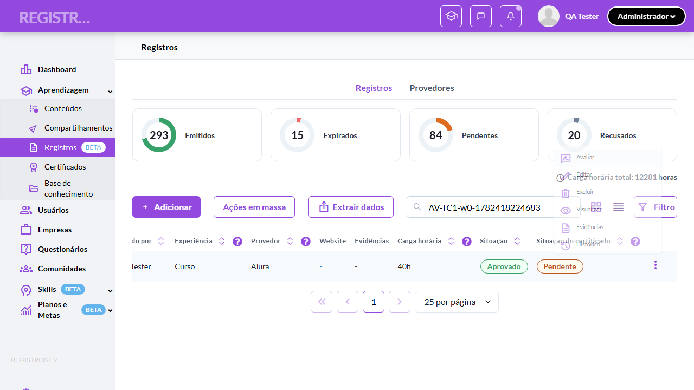
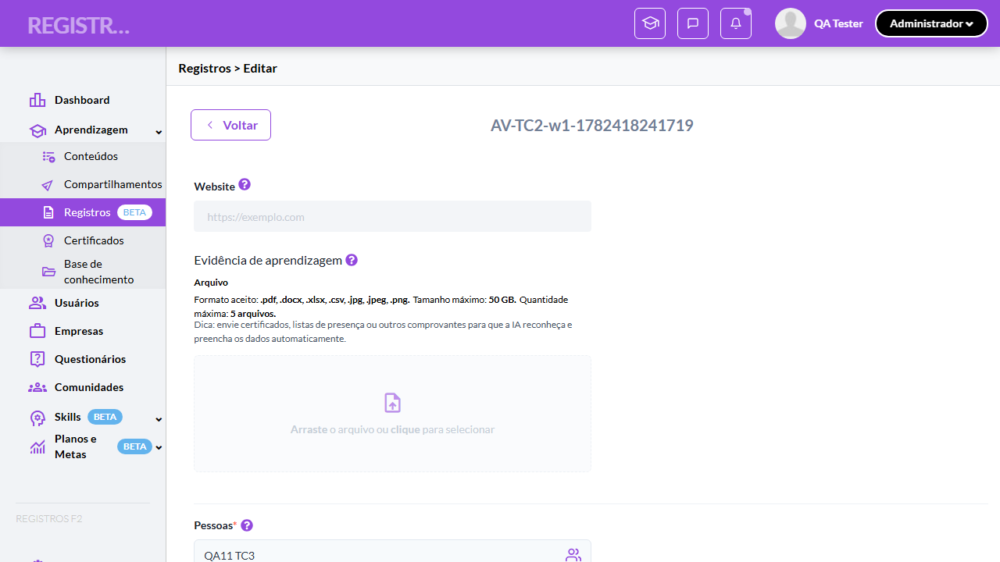
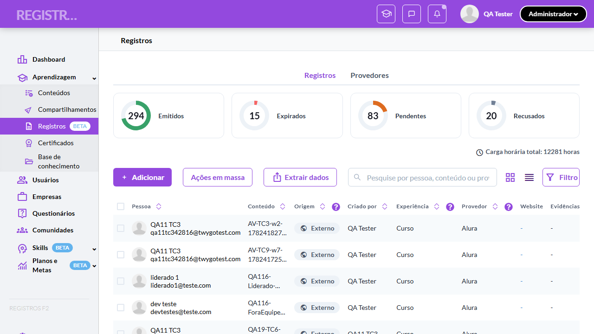
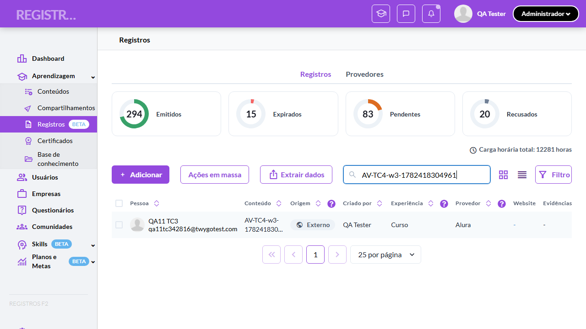
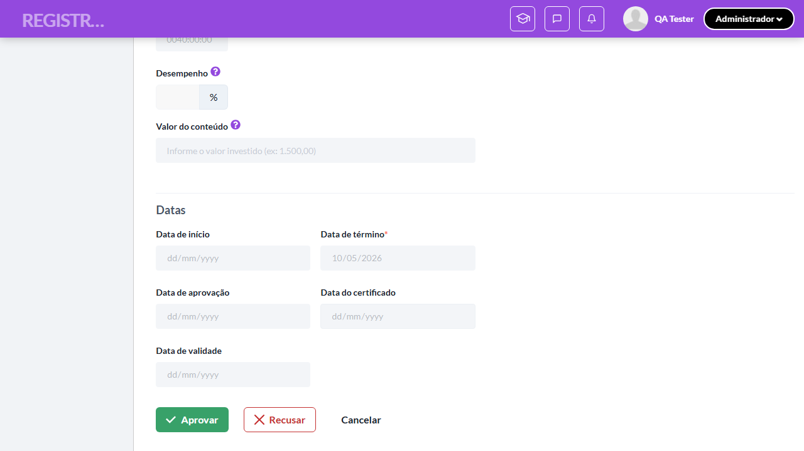
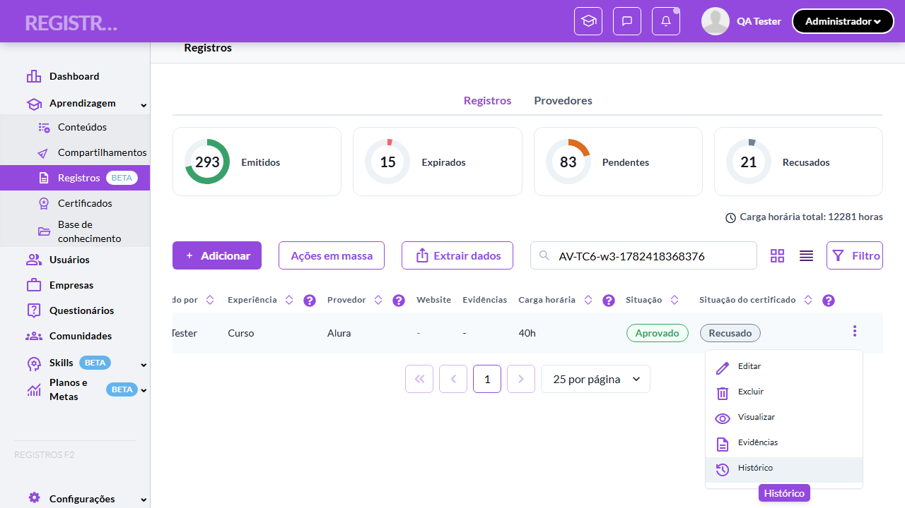
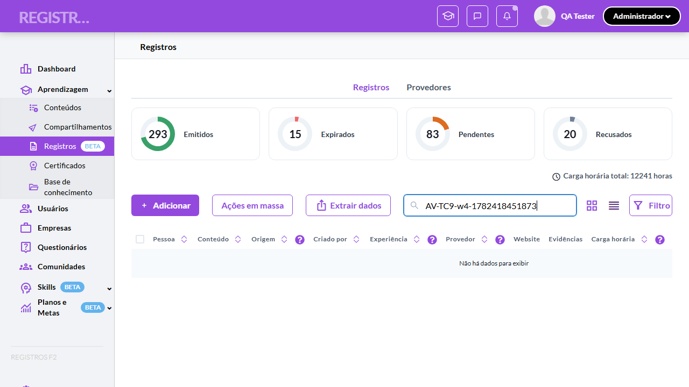

# Casos de teste — Registros de Aprendizagem

[← Voltar ao dashboard](index.md)

Lista detalhada por testsuite. Cada caso traz: o que era esperado pelo XML, quais steps foram executados, evidências (screenshots/trace), texto pronto pra registro de bug e — quando houver falha — uma explicação em PT-BR do motivo.

## Avaliar registro externo pendente (Aprovar/Recusar com justificativa)

_9 caso(s) — 4 aprovado(s), 4 falha(s), 1 ignorado(s)_

### ❌ Falhou · TC1 · Validar disponibilidade do "Avaliar" como item primário do menu · 🔴 Crítico

<a id="validar-disponibilidade-do-avaliar-como-item-primario-do-menu"></a>_Arquivo:_ `tc1-disponibilidade-avaliar-no-menu.spec.ts` · _Duração:_ 13.54s · _Browser:_ chromium

> **❌ Por que falhou:** Error: RN50: Externo Pendente não deve ter Editar/Excluir (achou: edit
> _Step impactado:_ **2. 1. Menu do Externo Pendente: "Avaliar" primário, sem Editar/Excluir (RN50)**

**Sumário (objetivo do caso):** Garantir que "Avaliar" aparece em destaque no topo do menu apenas para Externo + Pendente no perfil Admin/Líder (RN 50).

**Pré-condições:**

```
Ambiente Stage configurado e acessível
Funcionalidade "Registros de Aprendizagem" habilitada no contrato da organização
Usuário logado como Admin
Usuário Líder disponível com liderados diretos (e registro pendente de pessoa fora da equipe para o cenário negativo)
Registros Externos Pendentes disponíveis (criados por aluno, com evidências anexadas e campos preenchidos)
Registros usados nos testes são restaurados/removidos ao final (cleanup)
```

**Passos do caso (XML/TestLink + execução Playwright):**

_Cada linha reproduz um passo do XML; a coluna **Status** traz o resultado da execução (do step Allure correspondente). Linhas com "Pré-condição" são da execução automatizada (login, navegação inicial) — não fazem parte do roteiro do XML._

| # | Ação do passo | Resultado esperado | Status | Notas | Duração |
|---|---|---|:---:|---|---:|
| — | _Pré-condição:_ Pré: criar registro Externo Pendente | — | ✅ | — | 10.04s |
| 1 | Acessar a tela "Aprendizagem > Registros" como Admin e clicar no menu 3 pontos de um registro Externo Pendente | Item "Avaliar" é exibido como primeiro item do menu, em destaque com ícone na cor roxa; itens "Visualizar", "Evidências" e "Histórico" aparecem abaixo; "Editar" e "Excluir" NÃO aparecem. | ❌ | Error: RN50: Externo Pendente não deve ter Editar/Excluir (achou: edit | 0.29s |
| 2 | Clicar no menu 3 pontos de um registro Externo Emitido | Item "Avaliar" NÃO é exibido. | ⊘ | Step não executado: o teste foi interrompido antes. Causa: Error: RN50: Externo Pendente não deve ter Editar/Excluir (achou: edit. | — |
| 3 | Clicar no menu 3 pontos de um registro Interno Pendente | Item "Avaliar" NÃO é exibido (não é Externo). | ⊘ | Step não executado: o teste foi interrompido antes. Causa: Error: RN50: Externo Pendente não deve ter Editar/Excluir (achou: edit. | — |
| 4 | Acessar a tela "Meu histórico" como Aluno e clicar no menu 3 pontos de um registro Externo Pendente | Item "Avaliar" NÃO é exibido (exclusivo Admin/Líder). | ⊘ | Step não executado: o teste foi interrompido antes. Causa: Error: RN50: Externo Pendente não deve ter Editar/Excluir (achou: edit. | — |

**Evidências:**

📁 _Pasta:_ [`artifacts/projects-registros-externo-804be--como-item-primário-do-menu-chromium/`](artifacts/projects-registros-externo-804be--como-item-primário-do-menu-chromium/)

- 📸 **Screenshot (screenshot)** — [`test-failed-1.png`](artifacts/projects-registros-externo-804be--como-item-primário-do-menu-chromium/test-failed-1.png)

  

- 📸 **Screenshot (screenshot)** — [`test-failed-2.png`](artifacts/projects-registros-externo-804be--como-item-primário-do-menu-chromium/test-failed-2.png)

  

- 🎬 [Vídeo da execução (video.webm)](artifacts/projects-registros-externo-804be--como-item-primário-do-menu-chromium/video.webm)

- 🎬 [Vídeo da execução (video-1.webm)](artifacts/projects-registros-externo-804be--como-item-primário-do-menu-chromium/video-1.webm)

- 📦 **Trace** — [`trace.zip`](artifacts/projects-registros-externo-804be--como-item-primário-do-menu-chromium/trace.zip)

  ```bash
  npx playwright show-trace outputs/registros-externos/reports/avaliar-registro-externo-pendente-aprovar-recusar-com-justificativa_20260625-171501/artifacts/projects-registros-externo-804be--como-item-primário-do-menu-chromium/trace.zip
  ```

- 🎥 **Vídeo** — [`video.webm`](artifacts/projects-registros-externo-804be--como-item-primário-do-menu-chromium/video.webm)

- 🎥 **Vídeo** — [`video-1.webm`](artifacts/projects-registros-externo-804be--como-item-primário-do-menu-chromium/video-1.webm)

- 📄 **DOM no momento da falha** — [`error-context.md`](artifacts/projects-registros-externo-804be--como-item-primário-do-menu-chromium/error-context.md)

#### 🐛 Pronto para registro de bug

> ❓ **Análise automática:** Inconclusivo (precisa investigação manual) · Confiança 🔴 baixa
> _Por quê:_ Sem sinal Network in-scope ou padrão de erro conhecido — revisar trace
> _Bug-report estruturado:_ [`bug-reports/avaliar-registro-externo-pendente-aprovar-recusar-com-justificativa__validar-disponibilidade-do-avaliar-como-item-primario-do-menu.md`](bug-reports/avaliar-registro-externo-pendente-aprovar-recusar-com-justificativa__validar-disponibilidade-do-avaliar-como-item-primario-do-menu.md)

**Próximas ações sugeridas:**
- Sem evidência suficiente para classificar — abrir `trace.zip` (`npx playwright show-trace`) para ver passo a passo da execução.
- Reabrir o agente com o trace em mãos para reclassificar manualmente em uma das 4 categorias.

**Descrição do BUG:** [Crítico] Validar disponibilidade do "Avaliar" como item primário do menu — Error: RN50: Externo Pendente não deve ter Editar/Excluir (achou: edit

**Passo a passo para reprodução:**
1. Pré: Ambiente Stage configurado e acessível
1. Pré: Funcionalidade "Registros de Aprendizagem" habilitada no contrato da organização
1. Pré: Usuário logado como Admin
1. Pré: Usuário Líder disponível com liderados diretos (e registro pendente de pessoa fora da equipe para o cenário negativo)
1. Pré: Registros Externos Pendentes disponíveis (criados por aluno, com evidências anexadas e campos preenchidos)
1. Pré: Registros usados nos testes são restaurados/removidos ao final (cleanup)
1. 1. Acessar a tela "Aprendizagem > Registros" como Admin e clicar no menu 3 pontos de um registro Externo Pendente
1. 2. Clicar no menu 3 pontos de um registro Externo Emitido
1. 3. Clicar no menu 3 pontos de um registro Interno Pendente
1. 4. Acessar a tela "Meu histórico" como Aluno e clicar no menu 3 pontos de um registro Externo Pendente

**Comportamento esperado:** Item "Avaliar" NÃO é exibido.

**Comportamento atual:** Error: RN50: Externo Pendente não deve ter Editar/Excluir (achou: edit (falha aconteceu no passo 2: "1. Menu do Externo Pendente: "Avaliar" primário, sem Editar/Excluir (RN50)", que deveria resultar em: Item "Avaliar" NÃO é exibido.)

**Informações:**

| Campo | Valor |
|---|---|
| URL | `https://registrosf2.stage.twygoead.com/` |
| Login | Credenciais via env: `TWYGO_STAGING_REGISTROS_EXTERNOS_EMAIL` (consulte `.env`) |
| Senha | Credenciais via env: `TWYGO_STAGING_REGISTROS_EXTERNOS_PASSWORD` (consulte `.env`) |
| orgId | — |
| Outros | Browser: chromium |
| Outros | runId: avaliar-registro-externo-pendente-aprovar-recusar-com-justificativa_20260625-171501 |
| Outros | Duração até a falha: 13.54s |
| Outros | Step impactado: 2. 1. Menu do Externo Pendente: "Avaliar" primário, sem Editar/Excluir (RN50) |

**Evidências:**

- Screenshot capturado pelo Playwright (screenshot): artifacts/projects-registros-externo-804be--como-item-primário-do-menu-chromium/test-failed-1.png
- Vídeo da execução (video-1.webm): artifacts/projects-registros-externo-804be--como-item-primário-do-menu-chromium/video-1.webm
- Vídeo da execução (video.webm): artifacts/projects-registros-externo-804be--como-item-primário-do-menu-chromium/video.webm
- Snapshot do DOM/contexto da página (error-context.md): artifacts/projects-registros-externo-804be--como-item-primário-do-menu-chromium/error-context.md
- Screenshot capturado pelo Playwright (screenshot): artifacts/projects-registros-externo-804be--como-item-primário-do-menu-chromium/test-failed-2.png
- Snapshot do DOM/contexto da página (error-context.md): artifacts/projects-registros-externo-804be--como-item-primário-do-menu-chromium/error-context.md
- Trace completo do Playwright (.zip) — `npx playwright show-trace`: artifacts/projects-registros-externo-804be--como-item-primário-do-menu-chromium/trace.zip

<details><summary>📋 Ver texto agregado para copiar (Jira/GitHub/Linear)</summary>

```
Descrição do BUG
[Crítico] Validar disponibilidade do "Avaliar" como item primário do menu — Error: RN50: Externo Pendente não deve ter Editar/Excluir (achou: edit

Passo a passo para reprodução
  Pré: Ambiente Stage configurado e acessível
  Pré: Funcionalidade "Registros de Aprendizagem" habilitada no contrato da organização
  Pré: Usuário logado como Admin
  Pré: Usuário Líder disponível com liderados diretos (e registro pendente de pessoa fora da equipe para o cenário negativo)
  Pré: Registros Externos Pendentes disponíveis (criados por aluno, com evidências anexadas e campos preenchidos)
  Pré: Registros usados nos testes são restaurados/removidos ao final (cleanup)
  1. Acessar a tela "Aprendizagem > Registros" como Admin e clicar no menu 3 pontos de um registro Externo Pendente
  2. Clicar no menu 3 pontos de um registro Externo Emitido
  3. Clicar no menu 3 pontos de um registro Interno Pendente
  4. Acessar a tela "Meu histórico" como Aluno e clicar no menu 3 pontos de um registro Externo Pendente

Comportamento esperado
Item "Avaliar" NÃO é exibido.

Comportamento atual
Error: RN50: Externo Pendente não deve ter Editar/Excluir (achou: edit (falha aconteceu no passo 2: "1. Menu do Externo Pendente: "Avaliar" primário, sem Editar/Excluir (RN50)", que deveria resultar em: Item "Avaliar" NÃO é exibido.)

Informações
- URL: https://registrosf2.stage.twygoead.com/
- Login: Credenciais via env: `TWYGO_STAGING_REGISTROS_EXTERNOS_EMAIL` (consulte `.env`)
- Senha: Credenciais via env: `TWYGO_STAGING_REGISTROS_EXTERNOS_PASSWORD` (consulte `.env`)
- ID do ambiente (orgId): —
- Outros:
  - Browser: chromium
  - runId: avaliar-registro-externo-pendente-aprovar-recusar-com-justificativa_20260625-171501
  - Duração até a falha: 13.54s
  - Step impactado: 2. 1. Menu do Externo Pendente: "Avaliar" primário, sem Editar/Excluir (RN50)

Evidências
- Screenshot capturado pelo Playwright (screenshot): artifacts/projects-registros-externo-804be--como-item-primário-do-menu-chromium/test-failed-1.png
- Vídeo da execução (video-1.webm): artifacts/projects-registros-externo-804be--como-item-primário-do-menu-chromium/video-1.webm
- Vídeo da execução (video.webm): artifacts/projects-registros-externo-804be--como-item-primário-do-menu-chromium/video.webm
- Snapshot do DOM/contexto da página (error-context.md): artifacts/projects-registros-externo-804be--como-item-primário-do-menu-chromium/error-context.md
- Screenshot capturado pelo Playwright (screenshot): artifacts/projects-registros-externo-804be--como-item-primário-do-menu-chromium/test-failed-2.png
- Snapshot do DOM/contexto da página (error-context.md): artifacts/projects-registros-externo-804be--como-item-primário-do-menu-chromium/error-context.md
- Trace completo do Playwright (.zip) — `npx playwright show-trace`: artifacts/projects-registros-externo-804be--como-item-primário-do-menu-chromium/trace.zip

Execução
- runId: avaliar-registro-externo-pendente-aprovar-recusar-com-justificativa_20260625-171501
- environment.json: staging-registros-externos
- testsuite: Avaliar registro externo pendente (Aprovar/Recusar com justificativa)
- testcase: Validar disponibilidade do "Avaliar" como item primário do menu

```

</details>

<details><summary>🔧 Stack trace técnica completa (para desenvolvedor)</summary>

```
Error: RN50: Externo Pendente não deve ter Editar/Excluir (achou: edit
Editar, delete
Excluir)

expect(received).toEqual(expected) // deep equality

- Expected  - 1
+ Received  + 6

- Array []
+ Array [
+   "edit
+ Editar",
+   "delete
+ Excluir",
+ ]
```

</details>

---

### ❌ Falhou · TC2 · Validar form em modo avaliação (banner, campos e rodapé) · 🔴 Crítico

<a id="validar-form-em-modo-avaliacao-banner-campos-e-rodape"></a>_Arquivo:_ `tc2-form-modo-avaliacao.spec.ts` · _Duração:_ 26.77s · _Browser:_ chromium

> **❌ Por que falhou:** O elemento esperado não apareceu na tela (locator: getByText(/Avaliação pendente/i).first()).
> _Step impactado:_ **2. Banner amarelo "Avaliação pendente"**

**Sumário (objetivo do caso):** Garantir a estrutura do modo admin-avaliar: cabeçalho, banner amarelo, somente Tipo + Categorias editáveis e 3 botões no rodapé (RN 51).

**Pré-condições:**

```
Ambiente Stage configurado e acessível
Funcionalidade "Registros de Aprendizagem" habilitada no contrato da organização
Usuário logado como Admin
Usuário Líder disponível com liderados diretos (e registro pendente de pessoa fora da equipe para o cenário negativo)
Registros Externos Pendentes disponíveis (criados por aluno, com evidências anexadas e campos preenchidos)
Registros usados nos testes são restaurados/removidos ao final (cleanup)
```

**Passos do caso (XML/TestLink + execução Playwright):**

_Cada linha reproduz um passo do XML; a coluna **Status** traz o resultado da execução (do step Allure correspondente). Linhas com "Pré-condição" são da execução automatizada (login, navegação inicial) — não fazem parte do roteiro do XML._

| # | Ação do passo | Resultado esperado | Status | Notas | Duração |
|---|---|---|:---:|---|---:|
| — | _Pré-condição:_ Pré: criar Externo Pendente e abrir "Avaliar" | — | ✅ | — | 15.11s |
| 1 | Acessar a tela "Aprendizagem > Registros" como Admin e clicar em "Avaliar" no menu de um registro Externo Pendente | Form abre com cabeçalho "Avaliar registro". | ✅ | — | — |
| 2 | Verificar o banner "Avaliação pendente" no topo | Banner amarelo "Avaliação pendente" é exibido com texto orientando a editar Tipo de experiência e Categorias antes de aprovar. | ❌ | O elemento esperado não apareceu na tela (locator: getByText(/Avaliação pendente/i).first()). | 8.04s |
| 3 | Verificar os campos editáveis "Tipo de experiência" e "Categorias" | Apenas "Tipo de experiência" e "Categorias" estão habilitados; todos os demais campos (Pessoa, Provedor, Carga horária, datas etc.) aparecem desabilitados com os valores preenchidos pelo aluno. | ✅ | — | 0.06s |
| 4 | Verificar a lista de evidências do form "Avaliar registro" | Arquivos anexados pelo aluno são listados em modo somente leitura. | ✅ | — | — |
| 5 | Verificar o rodapé com os botões "Aprovar", "Recusar" e "Cancelar" | 3 botões: "Aprovar" (verde), "Recusar" (vermelho outline) e "Cancelar" (outline neutro). | ✅ | — | 0.08s |

**Evidências:**

📁 _Pasta:_ [`artifacts/projects-registros-externo-945ec-ção-banner-campos-e-rodapé--chromium/`](artifacts/projects-registros-externo-945ec-ção-banner-campos-e-rodapé--chromium/)

- 📸 **Screenshot (screenshot)** — [`test-failed-1.png`](artifacts/projects-registros-externo-945ec-ção-banner-campos-e-rodapé--chromium/test-failed-1.png)

  

- 📸 **Screenshot (screenshot)** — [`test-failed-2.png`](artifacts/projects-registros-externo-945ec-ção-banner-campos-e-rodapé--chromium/test-failed-2.png)

  

- 🎬 [Vídeo da execução (video.webm)](artifacts/projects-registros-externo-945ec-ção-banner-campos-e-rodapé--chromium/video.webm)

- 🎬 [Vídeo da execução (video-1.webm)](artifacts/projects-registros-externo-945ec-ção-banner-campos-e-rodapé--chromium/video-1.webm)

- 📦 **Trace** — [`trace.zip`](artifacts/projects-registros-externo-945ec-ção-banner-campos-e-rodapé--chromium/trace.zip)

  ```bash
  npx playwright show-trace outputs/registros-externos/reports/avaliar-registro-externo-pendente-aprovar-recusar-com-justificativa_20260625-171501/artifacts/projects-registros-externo-945ec-ção-banner-campos-e-rodapé--chromium/trace.zip
  ```

- 🎥 **Vídeo** — [`video.webm`](artifacts/projects-registros-externo-945ec-ção-banner-campos-e-rodapé--chromium/video.webm)

- 🎥 **Vídeo** — [`video-1.webm`](artifacts/projects-registros-externo-945ec-ção-banner-campos-e-rodapé--chromium/video-1.webm)

- 📄 **DOM no momento da falha** — [`error-context.md`](artifacts/projects-registros-externo-945ec-ção-banner-campos-e-rodapé--chromium/error-context.md)

#### 🐛 Pronto para registro de bug

> ❓ **Análise automática:** Inconclusivo (precisa investigação manual) · Confiança 🔴 baixa
> _Por quê:_ Sem sinal Network in-scope ou padrão de erro conhecido — revisar trace
> _Bug-report estruturado:_ [`bug-reports/avaliar-registro-externo-pendente-aprovar-recusar-com-justificativa__validar-form-em-modo-avaliacao-banner-campos-e-rodape.md`](bug-reports/avaliar-registro-externo-pendente-aprovar-recusar-com-justificativa__validar-form-em-modo-avaliacao-banner-campos-e-rodape.md)

**Próximas ações sugeridas:**
- Sem evidência suficiente para classificar — abrir `trace.zip` (`npx playwright show-trace`) para ver passo a passo da execução.
- Reabrir o agente com o trace em mãos para reclassificar manualmente em uma das 4 categorias.

**Descrição do BUG:** [Crítico] Validar form em modo avaliação (banner, campos e rodapé) — O elemento esperado não apareceu na tela (locator: getByText(/Avaliação pendente/i).first()).

**Passo a passo para reprodução:**
1. Pré: Ambiente Stage configurado e acessível
1. Pré: Funcionalidade "Registros de Aprendizagem" habilitada no contrato da organização
1. Pré: Usuário logado como Admin
1. Pré: Usuário Líder disponível com liderados diretos (e registro pendente de pessoa fora da equipe para o cenário negativo)
1. Pré: Registros Externos Pendentes disponíveis (criados por aluno, com evidências anexadas e campos preenchidos)
1. Pré: Registros usados nos testes são restaurados/removidos ao final (cleanup)
1. 1. Acessar a tela "Aprendizagem > Registros" como Admin e clicar em "Avaliar" no menu de um registro Externo Pendente
1. 2. Verificar o banner "Avaliação pendente" no topo
1. 3. Verificar os campos editáveis "Tipo de experiência" e "Categorias"
1. 4. Verificar a lista de evidências do form "Avaliar registro"
1. 5. Verificar o rodapé com os botões "Aprovar", "Recusar" e "Cancelar"

**Comportamento esperado:** Banner amarelo "Avaliação pendente" é exibido com texto orientando a editar Tipo de experiência e Categorias antes de aprovar.

**Comportamento atual:** O elemento esperado não apareceu na tela (locator: getByText(/Avaliação pendente/i).first()). (falha aconteceu no passo 2: "Banner amarelo "Avaliação pendente"", que deveria resultar em: Banner amarelo "Avaliação pendente" é exibido com texto orientando a editar Tipo de experiência e Categorias antes de aprovar.)

**Informações:**

| Campo | Valor |
|---|---|
| URL | `https://registrosf2.stage.twygoead.com/` |
| Login | Credenciais via env: `TWYGO_STAGING_REGISTROS_EXTERNOS_EMAIL` (consulte `.env`) |
| Senha | Credenciais via env: `TWYGO_STAGING_REGISTROS_EXTERNOS_PASSWORD` (consulte `.env`) |
| orgId | — |
| Outros | Browser: chromium |
| Outros | runId: avaliar-registro-externo-pendente-aprovar-recusar-com-justificativa_20260625-171501 |
| Outros | Duração até a falha: 26.77s |
| Outros | Step impactado: 2. Banner amarelo "Avaliação pendente" |

**Evidências:**

- Screenshot capturado pelo Playwright (screenshot): artifacts/projects-registros-externo-945ec-ção-banner-campos-e-rodapé--chromium/test-failed-1.png
- Vídeo da execução (video-1.webm): artifacts/projects-registros-externo-945ec-ção-banner-campos-e-rodapé--chromium/video-1.webm
- Vídeo da execução (video.webm): artifacts/projects-registros-externo-945ec-ção-banner-campos-e-rodapé--chromium/video.webm
- Snapshot do DOM/contexto da página (error-context.md): artifacts/projects-registros-externo-945ec-ção-banner-campos-e-rodapé--chromium/error-context.md
- Screenshot capturado pelo Playwright (screenshot): artifacts/projects-registros-externo-945ec-ção-banner-campos-e-rodapé--chromium/test-failed-2.png
- Snapshot do DOM/contexto da página (error-context.md): artifacts/projects-registros-externo-945ec-ção-banner-campos-e-rodapé--chromium/error-context.md
- Trace completo do Playwright (.zip) — `npx playwright show-trace`: artifacts/projects-registros-externo-945ec-ção-banner-campos-e-rodapé--chromium/trace.zip

<details><summary>📋 Ver texto agregado para copiar (Jira/GitHub/Linear)</summary>

```
Descrição do BUG
[Crítico] Validar form em modo avaliação (banner, campos e rodapé) — O elemento esperado não apareceu na tela (locator: getByText(/Avaliação pendente/i).first()).

Passo a passo para reprodução
  Pré: Ambiente Stage configurado e acessível
  Pré: Funcionalidade "Registros de Aprendizagem" habilitada no contrato da organização
  Pré: Usuário logado como Admin
  Pré: Usuário Líder disponível com liderados diretos (e registro pendente de pessoa fora da equipe para o cenário negativo)
  Pré: Registros Externos Pendentes disponíveis (criados por aluno, com evidências anexadas e campos preenchidos)
  Pré: Registros usados nos testes são restaurados/removidos ao final (cleanup)
  1. Acessar a tela "Aprendizagem > Registros" como Admin e clicar em "Avaliar" no menu de um registro Externo Pendente
  2. Verificar o banner "Avaliação pendente" no topo
  3. Verificar os campos editáveis "Tipo de experiência" e "Categorias"
  4. Verificar a lista de evidências do form "Avaliar registro"
  5. Verificar o rodapé com os botões "Aprovar", "Recusar" e "Cancelar"

Comportamento esperado
Banner amarelo "Avaliação pendente" é exibido com texto orientando a editar Tipo de experiência e Categorias antes de aprovar.

Comportamento atual
O elemento esperado não apareceu na tela (locator: getByText(/Avaliação pendente/i).first()). (falha aconteceu no passo 2: "Banner amarelo "Avaliação pendente"", que deveria resultar em: Banner amarelo "Avaliação pendente" é exibido com texto orientando a editar Tipo de experiência e Categorias antes de aprovar.)

Informações
- URL: https://registrosf2.stage.twygoead.com/
- Login: Credenciais via env: `TWYGO_STAGING_REGISTROS_EXTERNOS_EMAIL` (consulte `.env`)
- Senha: Credenciais via env: `TWYGO_STAGING_REGISTROS_EXTERNOS_PASSWORD` (consulte `.env`)
- ID do ambiente (orgId): —
- Outros:
  - Browser: chromium
  - runId: avaliar-registro-externo-pendente-aprovar-recusar-com-justificativa_20260625-171501
  - Duração até a falha: 26.77s
  - Step impactado: 2. Banner amarelo "Avaliação pendente"

Evidências
- Screenshot capturado pelo Playwright (screenshot): artifacts/projects-registros-externo-945ec-ção-banner-campos-e-rodapé--chromium/test-failed-1.png
- Vídeo da execução (video-1.webm): artifacts/projects-registros-externo-945ec-ção-banner-campos-e-rodapé--chromium/video-1.webm
- Vídeo da execução (video.webm): artifacts/projects-registros-externo-945ec-ção-banner-campos-e-rodapé--chromium/video.webm
- Snapshot do DOM/contexto da página (error-context.md): artifacts/projects-registros-externo-945ec-ção-banner-campos-e-rodapé--chromium/error-context.md
- Screenshot capturado pelo Playwright (screenshot): artifacts/projects-registros-externo-945ec-ção-banner-campos-e-rodapé--chromium/test-failed-2.png
- Snapshot do DOM/contexto da página (error-context.md): artifacts/projects-registros-externo-945ec-ção-banner-campos-e-rodapé--chromium/error-context.md
- Trace completo do Playwright (.zip) — `npx playwright show-trace`: artifacts/projects-registros-externo-945ec-ção-banner-campos-e-rodapé--chromium/trace.zip

Execução
- runId: avaliar-registro-externo-pendente-aprovar-recusar-com-justificativa_20260625-171501
- environment.json: staging-registros-externos
- testsuite: Avaliar registro externo pendente (Aprovar/Recusar com justificativa)
- testcase: Validar form em modo avaliação (banner, campos e rodapé)

```

</details>

<details><summary>🔧 Stack trace técnica completa (para desenvolvedor)</summary>

```
Error: RN51: banner "Avaliação pendente" ausente

expect(locator).toBeVisible() failed

Locator: getByText(/Avaliação pendente/i).first()
Expected: visible
Timeout: 8000ms
Error: element(s) not found

Call log:
  - RN51: banner "Avaliação pendente" ausente with timeout 8000ms
  - waiting for getByText(/Avaliação pendente/i).first()

```

</details>

---

### ❌ Falhou · TC3 · Validar obrigatoriedade do Tipo de experiência ao Aprovar · 🔴 Crítico

<a id="validar-obrigatoriedade-do-tipo-de-experiencia-ao-aprovar"></a>_Arquivo:_ `tc3-obrigatoriedade-tipo-ao-aprovar.spec.ts` · _Duração:_ 28.92s · _Browser:_ chromium

> **❌ Por que falhou:** O elemento esperado não apareceu na tela (locator: locator('.chakra-form-control').filter({ has: locator('label').filter({ hasText: /^Tipo de experiência/ }) }).first().getByText(/Campo obrigatório/i).first()).
> _Step impactado:_ **2. Aprovar com Tipo vazio → "Campo obrigatório", não aprova**

**Sumário (objetivo do caso):** Garantir que apenas "Tipo de experiência" é validado ao aprovar — demais campos disabled não passam pela validação (RN 54).

**Pré-condições:**

```
Ambiente Stage configurado e acessível
Funcionalidade "Registros de Aprendizagem" habilitada no contrato da organização
Usuário logado como Admin
Usuário Líder disponível com liderados diretos (e registro pendente de pessoa fora da equipe para o cenário negativo)
Registros Externos Pendentes disponíveis (criados por aluno, com evidências anexadas e campos preenchidos)
Registros usados nos testes são restaurados/removidos ao final (cleanup)
```

**Passos do caso (XML/TestLink + execução Playwright):**

_Cada linha reproduz um passo do XML; a coluna **Status** traz o resultado da execução (do step Allure correspondente). Linhas com "Pré-condição" são da execução automatizada (login, navegação inicial) — não fazem parte do roteiro do XML._

| # | Ação do passo | Resultado esperado | Status | Notas | Duração |
|---|---|---|:---:|---|---:|
| — | _Pré-condição:_ Pré: criar Externo Pendente e abrir "Avaliar" | — | ✅ | — | 15.05s |
| 1 | Acessar o form "Avaliar registro" de um registro Externo Pendente sem Tipo de experiência preenchido | Form em modo avaliação exibido. | ✅ | — | — |
| 2 | Clicar no botão "Aprovar" com o campo "Tipo de experiência" vazio | Campo "Tipo de experiência" exibe borda vermelha + "Campo obrigatório"; o registro NÃO é aprovado. | ❌ | O elemento esperado não apareceu na tela (locator: locator('.chakra-form-control').filter({ has: locator('label').filter({ hasText: /^Tipo de experiência/ }) }).first().getByText(/Campo obrigatório/i).first()). | 8.25s |
| 3 | Selecionar "Curso" no dropdown "Tipo de experiência" | Mensagem de erro some. | ⊘ | Step não executado: o teste foi interrompido antes. Causa: O elemento esperado não apareceu na tela (locator: locator('.chakra-form-control').filter({ has: locator('label').filter({ hasText: /^Tipo de experiência/ }) }).first().getByText(/Campo obrigatório/i).first()).. | — |
| 4 | Clicar no botão "Aprovar" | Aprovação prossegue (toast de sucesso). | ⊘ | Step não executado: o teste foi interrompido antes. Causa: O elemento esperado não apareceu na tela (locator: locator('.chakra-form-control').filter({ has: locator('label').filter({ hasText: /^Tipo de experiência/ }) }).first().getByText(/Campo obrigatório/i).first()).. | — |

**Evidências:**

📁 _Pasta:_ [`artifacts/projects-registros-externo-1601e-o-de-experiência-ao-Aprovar-chromium/`](artifacts/projects-registros-externo-1601e-o-de-experiência-ao-Aprovar-chromium/)

- 📸 **Screenshot (screenshot)** — [`test-failed-1.png`](artifacts/projects-registros-externo-1601e-o-de-experiência-ao-Aprovar-chromium/test-failed-1.png)

  

- 📸 **Screenshot (screenshot)** — [`test-failed-2.png`](artifacts/projects-registros-externo-1601e-o-de-experiência-ao-Aprovar-chromium/test-failed-2.png)

  

- 🎬 [Vídeo da execução (video.webm)](artifacts/projects-registros-externo-1601e-o-de-experiência-ao-Aprovar-chromium/video.webm)

- 🎬 [Vídeo da execução (video-1.webm)](artifacts/projects-registros-externo-1601e-o-de-experiência-ao-Aprovar-chromium/video-1.webm)

- 📦 **Trace** — [`trace.zip`](artifacts/projects-registros-externo-1601e-o-de-experiência-ao-Aprovar-chromium/trace.zip)

  ```bash
  npx playwright show-trace outputs/registros-externos/reports/avaliar-registro-externo-pendente-aprovar-recusar-com-justificativa_20260625-171501/artifacts/projects-registros-externo-1601e-o-de-experiência-ao-Aprovar-chromium/trace.zip
  ```

- 🎥 **Vídeo** — [`video.webm`](artifacts/projects-registros-externo-1601e-o-de-experiência-ao-Aprovar-chromium/video.webm)

- 🎥 **Vídeo** — [`video-1.webm`](artifacts/projects-registros-externo-1601e-o-de-experiência-ao-Aprovar-chromium/video-1.webm)

- 📄 **DOM no momento da falha** — [`error-context.md`](artifacts/projects-registros-externo-1601e-o-de-experiência-ao-Aprovar-chromium/error-context.md)

#### 🐛 Pronto para registro de bug

> ❓ **Análise automática:** Inconclusivo (precisa investigação manual) · Confiança 🔴 baixa
> _Por quê:_ Sem sinal Network in-scope ou padrão de erro conhecido — revisar trace
> _Bug-report estruturado:_ [`bug-reports/avaliar-registro-externo-pendente-aprovar-recusar-com-justificativa__validar-obrigatoriedade-do-tipo-de-experiencia-ao-aprovar.md`](bug-reports/avaliar-registro-externo-pendente-aprovar-recusar-com-justificativa__validar-obrigatoriedade-do-tipo-de-experiencia-ao-aprovar.md)

**Próximas ações sugeridas:**
- Sem evidência suficiente para classificar — abrir `trace.zip` (`npx playwright show-trace`) para ver passo a passo da execução.
- Reabrir o agente com o trace em mãos para reclassificar manualmente em uma das 4 categorias.

**Descrição do BUG:** [Crítico] Validar obrigatoriedade do Tipo de experiência ao Aprovar — O elemento esperado não apareceu na tela (locator: locator('.chakra-form-control').filter({ has: locator('label').filter({ hasText: /^Tipo de experiência/ }) }).first().getByText(/Campo obrigatório/i).first()).

**Passo a passo para reprodução:**
1. Pré: Ambiente Stage configurado e acessível
1. Pré: Funcionalidade "Registros de Aprendizagem" habilitada no contrato da organização
1. Pré: Usuário logado como Admin
1. Pré: Usuário Líder disponível com liderados diretos (e registro pendente de pessoa fora da equipe para o cenário negativo)
1. Pré: Registros Externos Pendentes disponíveis (criados por aluno, com evidências anexadas e campos preenchidos)
1. Pré: Registros usados nos testes são restaurados/removidos ao final (cleanup)
1. 1. Acessar o form "Avaliar registro" de um registro Externo Pendente sem Tipo de experiência preenchido
1. 2. Clicar no botão "Aprovar" com o campo "Tipo de experiência" vazio
1. 3. Selecionar "Curso" no dropdown "Tipo de experiência"
1. 4. Clicar no botão "Aprovar"

**Comportamento esperado:** Campo "Tipo de experiência" exibe borda vermelha + "Campo obrigatório"; o registro NÃO é aprovado.

**Comportamento atual:** O elemento esperado não apareceu na tela (locator: locator('.chakra-form-control').filter({ has: locator('label').filter({ hasText: /^Tipo de experiência/ }) }).first().getByText(/Campo obrigatório/i).first()). (falha aconteceu no passo 2: "Aprovar com Tipo vazio → "Campo obrigatório", não aprova", que deveria resultar em: Campo "Tipo de experiência" exibe borda vermelha + "Campo obrigatório"; o registro NÃO é aprovado.)

**Informações:**

| Campo | Valor |
|---|---|
| URL | `https://registrosf2.stage.twygoead.com/o/37079/records` |
| Login | Credenciais via env: `TWYGO_STAGING_REGISTROS_EXTERNOS_EMAIL` (consulte `.env`) |
| Senha | Credenciais via env: `TWYGO_STAGING_REGISTROS_EXTERNOS_PASSWORD` (consulte `.env`) |
| orgId | 37079 |
| Outros | Browser: chromium |
| Outros | runId: avaliar-registro-externo-pendente-aprovar-recusar-com-justificativa_20260625-171501 |
| Outros | Duração até a falha: 28.92s |
| Outros | Step impactado: 2. Aprovar com Tipo vazio → "Campo obrigatório", não aprova |

**Evidências:**

- Screenshot capturado pelo Playwright (screenshot): artifacts/projects-registros-externo-1601e-o-de-experiência-ao-Aprovar-chromium/test-failed-1.png
- Vídeo da execução (video.webm): artifacts/projects-registros-externo-1601e-o-de-experiência-ao-Aprovar-chromium/video.webm
- Vídeo da execução (video-1.webm): artifacts/projects-registros-externo-1601e-o-de-experiência-ao-Aprovar-chromium/video-1.webm
- Snapshot do DOM/contexto da página (error-context.md): artifacts/projects-registros-externo-1601e-o-de-experiência-ao-Aprovar-chromium/error-context.md
- Screenshot capturado pelo Playwright (screenshot): artifacts/projects-registros-externo-1601e-o-de-experiência-ao-Aprovar-chromium/test-failed-2.png
- Snapshot do DOM/contexto da página (error-context.md): artifacts/projects-registros-externo-1601e-o-de-experiência-ao-Aprovar-chromium/error-context.md
- Trace completo do Playwright (.zip) — `npx playwright show-trace`: artifacts/projects-registros-externo-1601e-o-de-experiência-ao-Aprovar-chromium/trace.zip

<details><summary>📋 Ver texto agregado para copiar (Jira/GitHub/Linear)</summary>

```
Descrição do BUG
[Crítico] Validar obrigatoriedade do Tipo de experiência ao Aprovar — O elemento esperado não apareceu na tela (locator: locator('.chakra-form-control').filter({ has: locator('label').filter({ hasText: /^Tipo de experiência/ }) }).first().getByText(/Campo obrigatório/i).first()).

Passo a passo para reprodução
  Pré: Ambiente Stage configurado e acessível
  Pré: Funcionalidade "Registros de Aprendizagem" habilitada no contrato da organização
  Pré: Usuário logado como Admin
  Pré: Usuário Líder disponível com liderados diretos (e registro pendente de pessoa fora da equipe para o cenário negativo)
  Pré: Registros Externos Pendentes disponíveis (criados por aluno, com evidências anexadas e campos preenchidos)
  Pré: Registros usados nos testes são restaurados/removidos ao final (cleanup)
  1. Acessar o form "Avaliar registro" de um registro Externo Pendente sem Tipo de experiência preenchido
  2. Clicar no botão "Aprovar" com o campo "Tipo de experiência" vazio
  3. Selecionar "Curso" no dropdown "Tipo de experiência"
  4. Clicar no botão "Aprovar"

Comportamento esperado
Campo "Tipo de experiência" exibe borda vermelha + "Campo obrigatório"; o registro NÃO é aprovado.

Comportamento atual
O elemento esperado não apareceu na tela (locator: locator('.chakra-form-control').filter({ has: locator('label').filter({ hasText: /^Tipo de experiência/ }) }).first().getByText(/Campo obrigatório/i).first()). (falha aconteceu no passo 2: "Aprovar com Tipo vazio → "Campo obrigatório", não aprova", que deveria resultar em: Campo "Tipo de experiência" exibe borda vermelha + "Campo obrigatório"; o registro NÃO é aprovado.)

Informações
- URL: https://registrosf2.stage.twygoead.com/o/37079/records
- Login: Credenciais via env: `TWYGO_STAGING_REGISTROS_EXTERNOS_EMAIL` (consulte `.env`)
- Senha: Credenciais via env: `TWYGO_STAGING_REGISTROS_EXTERNOS_PASSWORD` (consulte `.env`)
- ID do ambiente (orgId): 37079
- Outros:
  - Browser: chromium
  - runId: avaliar-registro-externo-pendente-aprovar-recusar-com-justificativa_20260625-171501
  - Duração até a falha: 28.92s
  - Step impactado: 2. Aprovar com Tipo vazio → "Campo obrigatório", não aprova

Evidências
- Screenshot capturado pelo Playwright (screenshot): artifacts/projects-registros-externo-1601e-o-de-experiência-ao-Aprovar-chromium/test-failed-1.png
- Vídeo da execução (video.webm): artifacts/projects-registros-externo-1601e-o-de-experiência-ao-Aprovar-chromium/video.webm
- Vídeo da execução (video-1.webm): artifacts/projects-registros-externo-1601e-o-de-experiência-ao-Aprovar-chromium/video-1.webm
- Snapshot do DOM/contexto da página (error-context.md): artifacts/projects-registros-externo-1601e-o-de-experiência-ao-Aprovar-chromium/error-context.md
- Screenshot capturado pelo Playwright (screenshot): artifacts/projects-registros-externo-1601e-o-de-experiência-ao-Aprovar-chromium/test-failed-2.png
- Snapshot do DOM/contexto da página (error-context.md): artifacts/projects-registros-externo-1601e-o-de-experiência-ao-Aprovar-chromium/error-context.md
- Trace completo do Playwright (.zip) — `npx playwright show-trace`: artifacts/projects-registros-externo-1601e-o-de-experiência-ao-Aprovar-chromium/trace.zip

Execução
- runId: avaliar-registro-externo-pendente-aprovar-recusar-com-justificativa_20260625-171501
- environment.json: staging-registros-externos
- testsuite: Avaliar registro externo pendente (Aprovar/Recusar com justificativa)
- testcase: Validar obrigatoriedade do Tipo de experiência ao Aprovar

```

</details>

<details><summary>🔧 Stack trace técnica completa (para desenvolvedor)</summary>

```
Error: expect(locator).toBeVisible() failed

Locator: locator('.chakra-form-control').filter({ has: locator('label').filter({ hasText: /^Tipo de experiência/ }) }).first().getByText(/Campo obrigatório/i).first()
Expected: visible
Timeout: 8000ms
Error: element(s) not found

Call log:
  - Expect "toBeVisible" with timeout 8000ms
  - waiting for locator('.chakra-form-control').filter({ has: locator('label').filter({ hasText: /^Tipo de experiência/ }) }).first().getByText(/Campo obrigatório/i).first()
    - waiting for" https://registrosf2.stage.twygoead.com/o/37079/records" navigation to finish...
    - navigated to "https://registrosf2.stage.twygoead.com/o/37079/records"

```

</details>

---

### ✅ Aprovado · TC4 · Validar fluxo completo de aprovação · 🔴 Crítico

<a id="validar-fluxo-completo-de-aprovacao"></a>_Arquivo:_ `tc4-fluxo-completo-aprovacao.spec.ts` · _Duração:_ 38.84s · _Browser:_ chromium

**Sumário (objetivo do caso):** Garantir que aprovar transforma o registro em Emitido/Aprovado com toast e atualização do KPI (RN 53).

**Pré-condições:**

```
Ambiente Stage configurado e acessível
Funcionalidade "Registros de Aprendizagem" habilitada no contrato da organização
Usuário logado como Admin
Usuário Líder disponível com liderados diretos (e registro pendente de pessoa fora da equipe para o cenário negativo)
Registros Externos Pendentes disponíveis (criados por aluno, com evidências anexadas e campos preenchidos)
Registros usados nos testes são restaurados/removidos ao final (cleanup)
```

**Passos do caso (XML/TestLink + execução Playwright):**

_Cada linha reproduz um passo do XML; a coluna **Status** traz o resultado da execução (do step Allure correspondente). Linhas com "Pré-condição" são da execução automatizada (login, navegação inicial) — não fazem parte do roteiro do XML._

| # | Ação do passo | Resultado esperado | Status | Notas | Duração |
|---|---|---|:---:|---|---:|
| — | _Pré-condição:_ Pré: criar Externo Pendente e abrir "Avaliar" | — | ✅ | — | 15.03s |
| — | _Pré-condição:_ 2-4. Tipo "Curso" + Categoria "Tecnologia" + Aprovar | — | ✅ | — | 12.88s |
| 1 | Acessar o form "Avaliar registro" de um registro Externo Pendente como Admin | Form em modo avaliação. | ✅ | — | — |
| 2 | Selecionar "Curso" no dropdown "Tipo de experiência" | Opção selecionada. | ✅ | — | — |
| 3 | Marcar "Tecnologia" no campo "Categorias" | Chip "Tecnologia" adicionado. | ✅ | — | — |
| 4 | Clicar no botão "Aprovar" | Toast exibida: "Registro aprovado". Sistema retorna para a lista. | ✅ | — | — |
| 5 | Localizar o registro avaliado na lista | Linha exibe situação do registro "Aprovado" e situação do certificado "Emitido". | ✅ | — | 7.19s |

**Evidências:**

📁 _Pasta:_ [`artifacts/projects-registros-externo-9fef9-fluxo-completo-de-aprovação-chromium/`](artifacts/projects-registros-externo-9fef9-fluxo-completo-de-aprovação-chromium/)

- 📸 **Screenshot (screenshot)** — [`test-finished-1.png`](artifacts/projects-registros-externo-9fef9-fluxo-completo-de-aprovação-chromium/test-finished-1.png)

  

- 📸 **Screenshot (screenshot)** — [`test-finished-2.png`](artifacts/projects-registros-externo-9fef9-fluxo-completo-de-aprovação-chromium/test-finished-2.png)

  

- 🎬 [Vídeo da execução (video.webm)](artifacts/projects-registros-externo-9fef9-fluxo-completo-de-aprovação-chromium/video.webm)

- 🎬 [Vídeo da execução (video-1.webm)](artifacts/projects-registros-externo-9fef9-fluxo-completo-de-aprovação-chromium/video-1.webm)

- 📦 **Trace** — [`trace.zip`](artifacts/projects-registros-externo-9fef9-fluxo-completo-de-aprovação-chromium/trace.zip)

  ```bash
  npx playwright show-trace outputs/registros-externos/reports/avaliar-registro-externo-pendente-aprovar-recusar-com-justificativa_20260625-171501/artifacts/projects-registros-externo-9fef9-fluxo-completo-de-aprovação-chromium/trace.zip
  ```

- 🎥 **Vídeo** — [`video.webm`](artifacts/projects-registros-externo-9fef9-fluxo-completo-de-aprovação-chromium/video.webm)

- 🎥 **Vídeo** — [`video-1.webm`](artifacts/projects-registros-externo-9fef9-fluxo-completo-de-aprovação-chromium/video-1.webm)


---

### ✅ Aprovado · TC5 · Validar estrutura e bloqueio do modal de Recusa · 🔴 Crítico

<a id="validar-estrutura-e-bloqueio-do-modal-de-recusa"></a>_Arquivo:_ `tc5-modal-recusa-validacao.spec.ts` · _Duração:_ 19.09s · _Browser:_ chromium

**Sumário (objetivo do caso):** Garantir o modal de recusa com Justificativa obrigatória e botão desabilitado enquanto vazia (RN 52).

**Pré-condições:**

```
Ambiente Stage configurado e acessível
Funcionalidade "Registros de Aprendizagem" habilitada no contrato da organização
Usuário logado como Admin
Usuário Líder disponível com liderados diretos (e registro pendente de pessoa fora da equipe para o cenário negativo)
Registros Externos Pendentes disponíveis (criados por aluno, com evidências anexadas e campos preenchidos)
Registros usados nos testes são restaurados/removidos ao final (cleanup)
```

**Passos do caso (XML/TestLink + execução Playwright):**

_Cada linha reproduz um passo do XML; a coluna **Status** traz o resultado da execução (do step Allure correspondente). Linhas com "Pré-condição" são da execução automatizada (login, navegação inicial) — não fazem parte do roteiro do XML._

| # | Ação do passo | Resultado esperado | Status | Notas | Duração |
|---|---|---|:---:|---|---:|
| — | _Pré-condição:_ Pré: criar Externo Pendente e abrir "Avaliar" | — | ✅ | — | 14.94s |
| — | _Pré-condição:_ 1-2. Abrir modal de recusa → botão desabilitado com justificativa vazia | — | ✅ | — | 0.23s |
| — | _Pré-condição:_ 3-4. Preencher justificativa habilita; Cancelar fecha sem recusar | — | ✅ | — | 0.37s |
| 1 | Acessar o form "Avaliar registro" de um registro Externo Pendente e clicar no botão "Recusar" | Modal "Recusar registro" é exibido com aviso "Esta ação não pode ser desfeita." e texto "A justificativa fica visível no histórico do registro pro colaborador."; campo "Justificativa" com placeholder "Explique por que o registro foi recusado". | ✅ | — | — |
| 2 | Verificar o botão "Recusar registro" com a Justificativa vazia | Botão está desabilitado. | ✅ | — | — |
| 3 | Preencher o campo "Justificativa" com "As evidências não comprovam a carga horária declarada." | Botão "Recusar registro" fica habilitado. | ✅ | — | — |
| 4 | Clicar no botão "Cancelar" do modal | Modal fecha sem recusar; justificativa é descartada. | ✅ | — | — |

**Evidências:**

📁 _Pasta:_ [`artifacts/projects-registros-externo-48d8d-bloqueio-do-modal-de-Recusa-chromium/`](artifacts/projects-registros-externo-48d8d-bloqueio-do-modal-de-Recusa-chromium/)

- 📸 **Screenshot (screenshot)** — [`test-finished-1.png`](artifacts/projects-registros-externo-48d8d-bloqueio-do-modal-de-Recusa-chromium/test-finished-1.png)

  

- 📸 **Screenshot (screenshot)** — [`test-finished-2.png`](artifacts/projects-registros-externo-48d8d-bloqueio-do-modal-de-Recusa-chromium/test-finished-2.png)

  

- 🎬 [Vídeo da execução (video.webm)](artifacts/projects-registros-externo-48d8d-bloqueio-do-modal-de-Recusa-chromium/video.webm)

- 🎬 [Vídeo da execução (video-1.webm)](artifacts/projects-registros-externo-48d8d-bloqueio-do-modal-de-Recusa-chromium/video-1.webm)

- 📦 **Trace** — [`trace.zip`](artifacts/projects-registros-externo-48d8d-bloqueio-do-modal-de-Recusa-chromium/trace.zip)

  ```bash
  npx playwright show-trace outputs/registros-externos/reports/avaliar-registro-externo-pendente-aprovar-recusar-com-justificativa_20260625-171501/artifacts/projects-registros-externo-48d8d-bloqueio-do-modal-de-Recusa-chromium/trace.zip
  ```

- 🎥 **Vídeo** — [`video.webm`](artifacts/projects-registros-externo-48d8d-bloqueio-do-modal-de-Recusa-chromium/video.webm)

- 🎥 **Vídeo** — [`video-1.webm`](artifacts/projects-registros-externo-48d8d-bloqueio-do-modal-de-Recusa-chromium/video-1.webm)


---

### ❌ Falhou · TC6 · Validar fluxo completo de recusa e visibilidade da justificativa · 🔴 Crítico

<a id="validar-fluxo-completo-de-recusa-e-visibilidade-da-justificativa"></a>_Arquivo:_ `tc6-fluxo-completo-recusa-e-historico.spec.ts` · _Duração:_ 43.78s · _Browser:_ chromium

> **❌ Por que falhou:** O elemento esperado não apareceu na tela (locator: locator('.chakra-modal__content, [role="dialog"]').filter({ hasText: /Histórico/i }).first()).
> _Step impactado:_ **3. 4. Histórico do registro recusado exibe a justificativa**

**Sumário (objetivo do caso):** Garantir que recusar muda o status para Recusado, exibe toast e a justificativa alimenta o histórico e o banner visto pelo aluno (RN 52, RN 53).

**Pré-condições:**

```
Ambiente Stage configurado e acessível
Funcionalidade "Registros de Aprendizagem" habilitada no contrato da organização
Usuário logado como Admin
Usuário Líder disponível com liderados diretos (e registro pendente de pessoa fora da equipe para o cenário negativo)
Registros Externos Pendentes disponíveis (criados por aluno, com evidências anexadas e campos preenchidos)
Registros usados nos testes são restaurados/removidos ao final (cleanup)
```

**Passos do caso (XML/TestLink + execução Playwright):**

_Cada linha reproduz um passo do XML; a coluna **Status** traz o resultado da execução (do step Allure correspondente). Linhas com "Pré-condição" são da execução automatizada (login, navegação inicial) — não fazem parte do roteiro do XML._

| # | Ação do passo | Resultado esperado | Status | Notas | Duração |
|---|---|---|:---:|---|---:|
| — | _Pré-condição:_ Pré: criar Externo Pendente e abrir "Avaliar" | — | ✅ | — | 15.10s |
| — | _Pré-condição:_ 1-3. Recusar com justificativa → registro fica Recusado | — | ✅ | — | 13.98s |
| 1 | Acessar o form "Avaliar registro" de um registro Externo Pendente como Admin e clicar no botão "Recusar" | Modal "Recusar registro" é exibido. | ✅ | — | — |
| 2 | Preencher o campo "Justificativa" com "Plano de desenvolvimento não cobre essa formação." | Botão "Recusar registro" habilitado. | ✅ | — | — |
| 3 | Clicar no botão "Recusar registro" | Modal fecha. Toast exibida: "Registro recusado". Sistema retorna para a lista. | ✅ | — | — |
| 4 | Abrir o drawer "Histórico" do registro recusado | Trilha exibe o evento de recusa com a descrição "Plano de desenvolvimento não cobre essa formação.". | ❌ | O elemento esperado não apareceu na tela (locator: locator('.chakra-modal__content, [role="dialog"]').filter({ hasText: /Histórico/i }).first()). | 10.60s |
| 5 | Acessar a tela "Meu histórico" como o Aluno dono do registro e clicar em "Visualizar" no registro recusado | Banner vermelho "Registro de aprendizagem recusado" exibe a justificativa do Admin. | ⊘ | Step não executado: o teste foi interrompido antes. Causa: O elemento esperado não apareceu na tela (locator: locator('.chakra-modal__content, [role="dialog"]').filter({ hasText: /Histórico/i }).first()).. | — |

**Evidências:**

📁 _Pasta:_ [`artifacts/projects-registros-externo-791e8-sibilidade-da-justificativa-chromium/`](artifacts/projects-registros-externo-791e8-sibilidade-da-justificativa-chromium/)

- 📸 **Screenshot (screenshot)** — [`test-failed-1.png`](artifacts/projects-registros-externo-791e8-sibilidade-da-justificativa-chromium/test-failed-1.png)

  

- 📸 **Screenshot (screenshot)** — [`test-failed-2.png`](artifacts/projects-registros-externo-791e8-sibilidade-da-justificativa-chromium/test-failed-2.png)

  

- 🎬 [Vídeo da execução (video.webm)](artifacts/projects-registros-externo-791e8-sibilidade-da-justificativa-chromium/video.webm)

- 🎬 [Vídeo da execução (video-1.webm)](artifacts/projects-registros-externo-791e8-sibilidade-da-justificativa-chromium/video-1.webm)

- 📦 **Trace** — [`trace.zip`](artifacts/projects-registros-externo-791e8-sibilidade-da-justificativa-chromium/trace.zip)

  ```bash
  npx playwright show-trace outputs/registros-externos/reports/avaliar-registro-externo-pendente-aprovar-recusar-com-justificativa_20260625-171501/artifacts/projects-registros-externo-791e8-sibilidade-da-justificativa-chromium/trace.zip
  ```

- 🎥 **Vídeo** — [`video.webm`](artifacts/projects-registros-externo-791e8-sibilidade-da-justificativa-chromium/video.webm)

- 🎥 **Vídeo** — [`video-1.webm`](artifacts/projects-registros-externo-791e8-sibilidade-da-justificativa-chromium/video-1.webm)

- 📄 **DOM no momento da falha** — [`error-context.md`](artifacts/projects-registros-externo-791e8-sibilidade-da-justificativa-chromium/error-context.md)

#### 🐛 Pronto para registro de bug

> ❓ **Análise automática:** Inconclusivo (precisa investigação manual) · Confiança 🔴 baixa
> _Por quê:_ Sem sinal Network in-scope ou padrão de erro conhecido — revisar trace
> _Bug-report estruturado:_ [`bug-reports/avaliar-registro-externo-pendente-aprovar-recusar-com-justificativa__validar-fluxo-completo-de-recusa-e-visibilidade-da-justificativa.md`](bug-reports/avaliar-registro-externo-pendente-aprovar-recusar-com-justificativa__validar-fluxo-completo-de-recusa-e-visibilidade-da-justificativa.md)

**Próximas ações sugeridas:**
- Sem evidência suficiente para classificar — abrir `trace.zip` (`npx playwright show-trace`) para ver passo a passo da execução.
- Reabrir o agente com o trace em mãos para reclassificar manualmente em uma das 4 categorias.

**Descrição do BUG:** [Crítico] Validar fluxo completo de recusa e visibilidade da justificativa — O elemento esperado não apareceu na tela (locator: locator('.chakra-modal__content, [role="dialog"]').filter({ hasText: /Histórico/i }).first()).

**Passo a passo para reprodução:**
1. Pré: Ambiente Stage configurado e acessível
1. Pré: Funcionalidade "Registros de Aprendizagem" habilitada no contrato da organização
1. Pré: Usuário logado como Admin
1. Pré: Usuário Líder disponível com liderados diretos (e registro pendente de pessoa fora da equipe para o cenário negativo)
1. Pré: Registros Externos Pendentes disponíveis (criados por aluno, com evidências anexadas e campos preenchidos)
1. Pré: Registros usados nos testes são restaurados/removidos ao final (cleanup)
1. 1. Acessar o form "Avaliar registro" de um registro Externo Pendente como Admin e clicar no botão "Recusar"
1. 2. Preencher o campo "Justificativa" com "Plano de desenvolvimento não cobre essa formação."
1. 3. Clicar no botão "Recusar registro"
1. 4. Abrir o drawer "Histórico" do registro recusado
1. 5. Acessar a tela "Meu histórico" como o Aluno dono do registro e clicar em "Visualizar" no registro recusado

**Comportamento esperado:** Modal fecha. Toast exibida: "Registro recusado". Sistema retorna para a lista.

**Comportamento atual:** O elemento esperado não apareceu na tela (locator: locator('.chakra-modal__content, [role="dialog"]').filter({ hasText: /Histórico/i }).first()). (falha aconteceu no passo 3: "4. Histórico do registro recusado exibe a justificativa", que deveria resultar em: Modal fecha. Toast exibida: "Registro recusado". Sistema retorna para a lista.)

**Informações:**

| Campo | Valor |
|---|---|
| URL | `https://registrosf2.stage.twygoead.com/` |
| Login | Credenciais via env: `TWYGO_STAGING_REGISTROS_EXTERNOS_EMAIL` (consulte `.env`) |
| Senha | Credenciais via env: `TWYGO_STAGING_REGISTROS_EXTERNOS_PASSWORD` (consulte `.env`) |
| orgId | — |
| Outros | Browser: chromium |
| Outros | runId: avaliar-registro-externo-pendente-aprovar-recusar-com-justificativa_20260625-171501 |
| Outros | Duração até a falha: 43.78s |
| Outros | Step impactado: 3. 4. Histórico do registro recusado exibe a justificativa |

**Evidências:**

- Screenshot capturado pelo Playwright (screenshot): artifacts/projects-registros-externo-791e8-sibilidade-da-justificativa-chromium/test-failed-1.png
- Vídeo da execução (video.webm): artifacts/projects-registros-externo-791e8-sibilidade-da-justificativa-chromium/video.webm
- Vídeo da execução (video-1.webm): artifacts/projects-registros-externo-791e8-sibilidade-da-justificativa-chromium/video-1.webm
- Snapshot do DOM/contexto da página (error-context.md): artifacts/projects-registros-externo-791e8-sibilidade-da-justificativa-chromium/error-context.md
- Screenshot capturado pelo Playwright (screenshot): artifacts/projects-registros-externo-791e8-sibilidade-da-justificativa-chromium/test-failed-2.png
- Snapshot do DOM/contexto da página (error-context.md): artifacts/projects-registros-externo-791e8-sibilidade-da-justificativa-chromium/error-context.md
- Trace completo do Playwright (.zip) — `npx playwright show-trace`: artifacts/projects-registros-externo-791e8-sibilidade-da-justificativa-chromium/trace.zip

<details><summary>📋 Ver texto agregado para copiar (Jira/GitHub/Linear)</summary>

```
Descrição do BUG
[Crítico] Validar fluxo completo de recusa e visibilidade da justificativa — O elemento esperado não apareceu na tela (locator: locator('.chakra-modal__content, [role="dialog"]').filter({ hasText: /Histórico/i }).first()).

Passo a passo para reprodução
  Pré: Ambiente Stage configurado e acessível
  Pré: Funcionalidade "Registros de Aprendizagem" habilitada no contrato da organização
  Pré: Usuário logado como Admin
  Pré: Usuário Líder disponível com liderados diretos (e registro pendente de pessoa fora da equipe para o cenário negativo)
  Pré: Registros Externos Pendentes disponíveis (criados por aluno, com evidências anexadas e campos preenchidos)
  Pré: Registros usados nos testes são restaurados/removidos ao final (cleanup)
  1. Acessar o form "Avaliar registro" de um registro Externo Pendente como Admin e clicar no botão "Recusar"
  2. Preencher o campo "Justificativa" com "Plano de desenvolvimento não cobre essa formação."
  3. Clicar no botão "Recusar registro"
  4. Abrir o drawer "Histórico" do registro recusado
  5. Acessar a tela "Meu histórico" como o Aluno dono do registro e clicar em "Visualizar" no registro recusado

Comportamento esperado
Modal fecha. Toast exibida: "Registro recusado". Sistema retorna para a lista.

Comportamento atual
O elemento esperado não apareceu na tela (locator: locator('.chakra-modal__content, [role="dialog"]').filter({ hasText: /Histórico/i }).first()). (falha aconteceu no passo 3: "4. Histórico do registro recusado exibe a justificativa", que deveria resultar em: Modal fecha. Toast exibida: "Registro recusado". Sistema retorna para a lista.)

Informações
- URL: https://registrosf2.stage.twygoead.com/
- Login: Credenciais via env: `TWYGO_STAGING_REGISTROS_EXTERNOS_EMAIL` (consulte `.env`)
- Senha: Credenciais via env: `TWYGO_STAGING_REGISTROS_EXTERNOS_PASSWORD` (consulte `.env`)
- ID do ambiente (orgId): —
- Outros:
  - Browser: chromium
  - runId: avaliar-registro-externo-pendente-aprovar-recusar-com-justificativa_20260625-171501
  - Duração até a falha: 43.78s
  - Step impactado: 3. 4. Histórico do registro recusado exibe a justificativa

Evidências
- Screenshot capturado pelo Playwright (screenshot): artifacts/projects-registros-externo-791e8-sibilidade-da-justificativa-chromium/test-failed-1.png
- Vídeo da execução (video.webm): artifacts/projects-registros-externo-791e8-sibilidade-da-justificativa-chromium/video.webm
- Vídeo da execução (video-1.webm): artifacts/projects-registros-externo-791e8-sibilidade-da-justificativa-chromium/video-1.webm
- Snapshot do DOM/contexto da página (error-context.md): artifacts/projects-registros-externo-791e8-sibilidade-da-justificativa-chromium/error-context.md
- Screenshot capturado pelo Playwright (screenshot): artifacts/projects-registros-externo-791e8-sibilidade-da-justificativa-chromium/test-failed-2.png
- Snapshot do DOM/contexto da página (error-context.md): artifacts/projects-registros-externo-791e8-sibilidade-da-justificativa-chromium/error-context.md
- Trace completo do Playwright (.zip) — `npx playwright show-trace`: artifacts/projects-registros-externo-791e8-sibilidade-da-justificativa-chromium/trace.zip

Execução
- runId: avaliar-registro-externo-pendente-aprovar-recusar-com-justificativa_20260625-171501
- environment.json: staging-registros-externos
- testsuite: Avaliar registro externo pendente (Aprovar/Recusar com justificativa)
- testcase: Validar fluxo completo de recusa e visibilidade da justificativa

```

</details>

<details><summary>🔧 Stack trace técnica completa (para desenvolvedor)</summary>

```
Error: expect(locator).toBeVisible() failed

Locator: locator('.chakra-modal__content, [role="dialog"]').filter({ hasText: /Histórico/i }).first()
Expected: visible
Timeout: 10000ms
Error: element(s) not found

Call log:
  - Expect "toBeVisible" with timeout 10000ms
  - waiting for locator('.chakra-modal__content, [role="dialog"]').filter({ hasText: /Histórico/i }).first()

```

</details>

---

### ✅ Aprovado · TC7 · Validar botão Cancelar do form de avaliação · 🔴 Crítico

<a id="validar-botao-cancelar-do-form-de-avaliacao"></a>_Arquivo:_ `tc7-cancelar-avaliacao.spec.ts` · _Duração:_ 32.03s · _Browser:_ chromium

**Sumário (objetivo do caso):** Garantir que Cancelar fecha a avaliação sem alterar o registro (RN 51).

**Pré-condições:**

```
Ambiente Stage configurado e acessível
Funcionalidade "Registros de Aprendizagem" habilitada no contrato da organização
Usuário logado como Admin
Usuário Líder disponível com liderados diretos (e registro pendente de pessoa fora da equipe para o cenário negativo)
Registros Externos Pendentes disponíveis (criados por aluno, com evidências anexadas e campos preenchidos)
Registros usados nos testes são restaurados/removidos ao final (cleanup)
```

**Passos do caso (XML/TestLink + execução Playwright):**

_Cada linha reproduz um passo do XML; a coluna **Status** traz o resultado da execução (do step Allure correspondente). Linhas com "Pré-condição" são da execução automatizada (login, navegação inicial) — não fazem parte do roteiro do XML._

| # | Ação do passo | Resultado esperado | Status | Notas | Duração |
|---|---|---|:---:|---|---:|
| — | _Pré-condição:_ Pré: criar Externo Pendente e abrir "Avaliar" | — | ✅ | — | 15.41s |
| — | _Pré-condição:_ 2-3. Selecionar Tipo (form sujo) e Cancelar → registro permanece Pendente | — | ✅ | — | 12.49s |
| 1 | Acessar o form "Avaliar registro" de um registro Externo Pendente como Admin | Form em modo avaliação. | ✅ | — | — |
| 2 | Selecionar "Workshop" no dropdown "Tipo de experiência" | Opção selecionada (form sujo). | ✅ | — | — |
| 3 | Clicar no botão "Cancelar" | Sistema retorna para a lista sem salvar; o registro permanece Pendente e o KPI não muda. | ✅ | — | — |

**Evidências:**

📁 _Pasta:_ [`artifacts/projects-registros-externo-e26da-ncelar-do-form-de-avaliação-chromium/`](artifacts/projects-registros-externo-e26da-ncelar-do-form-de-avaliação-chromium/)

- 📸 **Screenshot (screenshot)** — [`test-finished-1.png`](artifacts/projects-registros-externo-e26da-ncelar-do-form-de-avaliação-chromium/test-finished-1.png)

  

- 📸 **Screenshot (screenshot)** — [`test-finished-2.png`](artifacts/projects-registros-externo-e26da-ncelar-do-form-de-avaliação-chromium/test-finished-2.png)

  

- 🎬 [Vídeo da execução (video.webm)](artifacts/projects-registros-externo-e26da-ncelar-do-form-de-avaliação-chromium/video.webm)

- 🎬 [Vídeo da execução (video-1.webm)](artifacts/projects-registros-externo-e26da-ncelar-do-form-de-avaliação-chromium/video-1.webm)

- 📦 **Trace** — [`trace.zip`](artifacts/projects-registros-externo-e26da-ncelar-do-form-de-avaliação-chromium/trace.zip)

  ```bash
  npx playwright show-trace outputs/registros-externos/reports/avaliar-registro-externo-pendente-aprovar-recusar-com-justificativa_20260625-171501/artifacts/projects-registros-externo-e26da-ncelar-do-form-de-avaliação-chromium/trace.zip
  ```

- 🎥 **Vídeo** — [`video.webm`](artifacts/projects-registros-externo-e26da-ncelar-do-form-de-avaliação-chromium/video.webm)

- 🎥 **Vídeo** — [`video-1.webm`](artifacts/projects-registros-externo-e26da-ncelar-do-form-de-avaliação-chromium/video-1.webm)


---

### ⊘ Ignorado · TC8 · Validar escopo do Líder na avaliação · 🔴 Crítico

<a id="validar-escopo-do-lider-na-avaliacao"></a>_Arquivo:_ `tc8-escopo-do-lider.spec.ts` · _Duração:_ 0.00s · _Browser:_ chromium

> **⊘ Por que foi ignorado:** [REVISAR] Motivo do skip não declarado no spec. Edite o `test.fixme(true, "[Categoria] motivo")` indicando uma das categorias canônicas: xml-desatualizado | seed-ausente | dep-externa | bloqueio-temporario.

**Sumário (objetivo do caso):** Garantir que Líder só vê "Avaliar" para registros de liderados diretos (RN 50.1).

**Pré-condições:**

```
Ambiente Stage configurado e acessível
Funcionalidade "Registros de Aprendizagem" habilitada no contrato da organização
Usuário logado como Admin
Usuário Líder disponível com liderados diretos (e registro pendente de pessoa fora da equipe para o cenário negativo)
Registros Externos Pendentes disponíveis (criados por aluno, com evidências anexadas e campos preenchidos)
Registros usados nos testes são restaurados/removidos ao final (cleanup)
```

**Passos do caso (XML/TestLink + execução Playwright):**

_Cada linha reproduz um passo do XML; a coluna **Status** traz o resultado da execução (do step Allure correspondente). Linhas com "Pré-condição" são da execução automatizada (login, navegação inicial) — não fazem parte do roteiro do XML._

| # | Ação do passo | Resultado esperado | Status | Notas | Duração |
|---|---|---|:---:|---|---:|
| 1 | Acessar a tela "Aprendizagem > Registros" logado como Líder | Lista exibe apenas registros dos liderados diretos. | ⊘ | Step não executado — [REVISAR] Motivo do skip não declarado no spec. Edite o `test.fixme(true, "[Categoria] motivo")` indicando uma das categorias canônicas: xml-desatualizado \| seed-ausente \| dep-externa \| bloqueio-temporario. | — |
| 2 | Clicar no menu 3 pontos de um registro Externo Pendente de um liderado direto | Item "Avaliar" é exibido como primário. | ⊘ | Step não executado — [REVISAR] Motivo do skip não declarado no spec. Edite o `test.fixme(true, "[Categoria] motivo")` indicando uma das categorias canônicas: xml-desatualizado \| seed-ausente \| dep-externa \| bloqueio-temporario. | — |
| 3 | Verificar que registros de pessoas fora da equipe não aparecem na lista do Líder na coluna "Pessoa" | Nenhum registro de pessoa fora da equipe é listado (o cenário de 403 via API é coberto na suíte de escopo do Líder). | ⊘ | Step não executado — [REVISAR] Motivo do skip não declarado no spec. Edite o `test.fixme(true, "[Categoria] motivo")` indicando uma das categorias canônicas: xml-desatualizado \| seed-ausente \| dep-externa \| bloqueio-temporario. | — |

**Evidências:**

_Sem evidências anexadas._

#### ⏳ Pendente — execução automatizada não realizada

- **Severidade do caso (XML):** Crítico
- **Categoria:** ⚠️ Não declarada
- **Motivo declarado pelo spec:** _ausente_
- **Próximo passo:** Editar o spec para declarar `test.fixme(true, '[Categoria] motivo')` com uma das categorias canônicas (xml-desatualizado | seed-ausente | dep-externa | bloqueio-temporario). Sem declaração, leitor leigo não sabe quem precisa agir.

**Roteiro do XML (para validação manual):**
1. Pré: Ambiente Stage configurado e acessível
1. Pré: Funcionalidade "Registros de Aprendizagem" habilitada no contrato da organização
1. Pré: Usuário logado como Admin
1. Pré: Usuário Líder disponível com liderados diretos (e registro pendente de pessoa fora da equipe para o cenário negativo)
1. Pré: Registros Externos Pendentes disponíveis (criados por aluno, com evidências anexadas e campos preenchidos)
1. Pré: Registros usados nos testes são restaurados/removidos ao final (cleanup)
1. 1. Acessar a tela "Aprendizagem > Registros" logado como Líder
1. 2. Clicar no menu 3 pontos de um registro Externo Pendente de um liderado direto
1. 3. Verificar que registros de pessoas fora da equipe não aparecem na lista do Líder na coluna "Pessoa"

> Esse caso não bloqueia a build, mas precisa de validação manual ou ajuste no agente.


---

### ✅ Aprovado · TC9 · Validar erro ao aprovar registro excluído por outro admin · 🟡 Normal

<a id="validar-erro-ao-aprovar-registro-excluido-por-outro-admin"></a>_Arquivo:_ `tc9-erro-aprovar-registro-excluido.spec.ts` · _Duração:_ 31.49s · _Browser:_ chromium

**Sumário (objetivo do caso):** Garantir tratamento de concorrência: aprovar registro que outro admin excluiu exibe toast de erro (cenário 06 de h09).

**Pré-condições:**

```
Ambiente Stage configurado e acessível
Funcionalidade "Registros de Aprendizagem" habilitada no contrato da organização
Usuário logado como Admin
Usuário Líder disponível com liderados diretos (e registro pendente de pessoa fora da equipe para o cenário negativo)
Registros Externos Pendentes disponíveis (criados por aluno, com evidências anexadas e campos preenchidos)
Registros usados nos testes são restaurados/removidos ao final (cleanup)
```

**Passos do caso (XML/TestLink + execução Playwright):**

_Cada linha reproduz um passo do XML; a coluna **Status** traz o resultado da execução (do step Allure correspondente). Linhas com "Pré-condição" são da execução automatizada (login, navegação inicial) — não fazem parte do roteiro do XML._

| # | Ação do passo | Resultado esperado | Status | Notas | Duração |
|---|---|---|:---:|---|---:|
| 1 | Acessar o form "Avaliar registro" de um registro Externo Pendente como Admin (sessão A) | Form em modo avaliação aberto. | ✅ | — | 14.73s |
| 2 | Excluir o mesmo registro por outra sessão de Admin (sessão B, via ação direta no backend/segunda janela) | Registro removido na origem. | ✅ | — | 0.69s |
| 3 | Na sessão A, aprovar o registro pelo botão "Aprovar" com "Curso" selecionado no dropdown "Tipo de experiência" | Toast de erro exibida: "Não foi possível aprovar — registro não encontrado". Registro não muda de status (já não existe). | ✅ | — | 7.80s |

**Evidências:**

📁 _Pasta:_ [`artifacts/projects-registros-externo-3ead0-ro-excluído-por-outro-admin-chromium/`](artifacts/projects-registros-externo-3ead0-ro-excluído-por-outro-admin-chromium/)

- 📸 **Screenshot (screenshot)** — [`test-finished-1.png`](artifacts/projects-registros-externo-3ead0-ro-excluído-por-outro-admin-chromium/test-finished-1.png)

  

- 🎬 [Vídeo da execução (video.webm)](artifacts/projects-registros-externo-3ead0-ro-excluído-por-outro-admin-chromium/video.webm)

- 🎬 [Vídeo da execução (video-1.webm)](artifacts/projects-registros-externo-3ead0-ro-excluído-por-outro-admin-chromium/video-1.webm)

- 📦 **Trace** — [`trace.zip`](artifacts/projects-registros-externo-3ead0-ro-excluído-por-outro-admin-chromium/trace.zip)

  ```bash
  npx playwright show-trace outputs/registros-externos/reports/avaliar-registro-externo-pendente-aprovar-recusar-com-justificativa_20260625-171501/artifacts/projects-registros-externo-3ead0-ro-excluído-por-outro-admin-chromium/trace.zip
  ```

- 🎥 **Vídeo** — [`video.webm`](artifacts/projects-registros-externo-3ead0-ro-excluído-por-outro-admin-chromium/video.webm)

- 🎥 **Vídeo** — [`video-1.webm`](artifacts/projects-registros-externo-3ead0-ro-excluído-por-outro-admin-chromium/video-1.webm)


---
