# Casos de teste — Registros de Aprendizagem

[← Voltar ao dashboard](index.md)

Lista detalhada por testsuite. Cada caso traz: o que era esperado pelo XML, quais steps foram executados, evidências (screenshots/trace), texto pronto pra registro de bug e — quando houver falha — uma explicação em PT-BR do motivo.

## CRUD de Provedores e bloqueio de exclusão com vínculo

_10 caso(s) — 9 aprovado(s), 1 falha(s)_

### ✅ Aprovado · TC1 · Validar acesso à tab Provedores e estrutura da listagem · 🔴 Crítico

<a id="validar-acesso-a-tab-provedores-e-estrutura-da-listagem"></a>_Arquivo:_ `tc1-acesso-tab-e-estrutura-listagem.spec.ts` · _Duração:_ 9.09s · _Browser:_ chromium

**Sumário (objetivo do caso):** Garantir a tab, as colunas da tabela e a toolbar sem toggle grid/list (RN 81–83).

**Pré-condições:**

```
Ambiente Stage configurado e acessível
Funcionalidade "Registros de Aprendizagem" habilitada no contrato da organização
Usuário logado como Admin
Provedores cadastrados na organização, incluindo ao menos 1 com registros vinculados e 1 sem nenhum vínculo
Provedores criados pelos testes são removidos ao final (cleanup)
```

**Passos do caso (XML/TestLink + execução Playwright):**

_Cada linha reproduz um passo do XML; a coluna **Status** traz o resultado da execução (do step Allure correspondente). Linhas com "Pré-condição" são da execução automatizada (login, navegação inicial) — não fazem parte do roteiro do XML._

| # | Ação do passo | Resultado esperado | Status | Notas | Duração |
|---|---|---|:---:|---|---:|
| 1 | Acessar a tela "Aprendizagem > Registros" como Admin e clicar na tab "Provedores" | Tab "Provedores" fica ativa e exibe a listagem de provedores da organização. | ✅ | — | 5.26s |
| 2 | Verificar as colunas "Nome", "Website", "Descrição", "Ativo" e "Criado em" da tabela | Colunas: checkbox, "Nome", "Website", "Descrição", "Ativo" (switch), "Criado em", coluna de ações com 2 botões inline (Editar e Excluir). | ✅ | — | 0.01s |
| 3 | Verificar a toolbar com "Adicionar", busca e "Filtro" | Exibe "Adicionar", busca e "Filtro"; toggle de visualização tabela/grid NÃO é exibido. | ✅ | — | 0.07s |
| 4 | Verificar a coluna "Website" de um provedor com URL | Link externo exibido com host limpo (sem "https://www." no display). | ✅ | — | 0.01s |
| 5 | Clicar no header da coluna "Nome" | Lista ordena alfabeticamente; segundo clique inverte. | ✅ | — | 1.24s |

**Evidências:**

📁 _Pasta:_ [`artifacts/projects-registros-externo-dd18e-res-e-estrutura-da-listagem-chromium/`](artifacts/projects-registros-externo-dd18e-res-e-estrutura-da-listagem-chromium/)

- 📸 **Screenshot (screenshot)** — [`test-finished-1.png`](artifacts/projects-registros-externo-dd18e-res-e-estrutura-da-listagem-chromium/test-finished-1.png)

  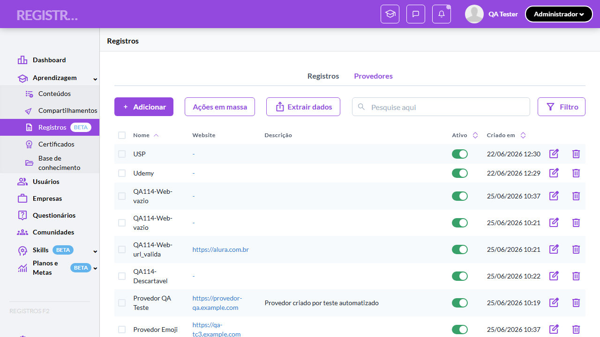

- 🎬 [Vídeo da execução (video.webm)](artifacts/projects-registros-externo-dd18e-res-e-estrutura-da-listagem-chromium/video.webm)

- 🎬 [Vídeo da execução (video-1.webm)](artifacts/projects-registros-externo-dd18e-res-e-estrutura-da-listagem-chromium/video-1.webm)

- 📦 **Trace** — [`trace.zip`](artifacts/projects-registros-externo-dd18e-res-e-estrutura-da-listagem-chromium/trace.zip)

  ```bash
  npx playwright show-trace outputs/registros-externos/reports/crud-de-provedores-e-bloqueio-de-exclusao-com-vinculo_20260625-141015/artifacts/projects-registros-externo-dd18e-res-e-estrutura-da-listagem-chromium/trace.zip
  ```

- 🎥 **Vídeo** — [`video.webm`](artifacts/projects-registros-externo-dd18e-res-e-estrutura-da-listagem-chromium/video.webm)

- 🎥 **Vídeo** — [`video-1.webm`](artifacts/projects-registros-externo-dd18e-res-e-estrutura-da-listagem-chromium/video-1.webm)


---

### ✅ Aprovado · TC10 · Validar visualização mobile da tab Provedores · 🟡 Normal

<a id="validar-visualizacao-mobile-da-tab-provedores"></a>_Arquivo:_ `tc10-visualizacao-mobile.spec.ts` · _Duração:_ 6.93s · _Browser:_ chromium

**Sumário (objetivo do caso):** Garantir auto-switch para cards em mobile com os elementos do card de provedor (RN 83). Pré-condição adicional: Viewport Mobile (360x740).

**Pré-condições:**

```
Ambiente Stage configurado e acessível
Funcionalidade "Registros de Aprendizagem" habilitada no contrato da organização
Usuário logado como Admin
Provedores cadastrados na organização, incluindo ao menos 1 com registros vinculados e 1 sem nenhum vínculo
Provedores criados pelos testes são removidos ao final (cleanup)
```

**Passos do caso (XML/TestLink + execução Playwright):**

_Cada linha reproduz um passo do XML; a coluna **Status** traz o resultado da execução (do step Allure correspondente). Linhas com "Pré-condição" são da execução automatizada (login, navegação inicial) — não fazem parte do roteiro do XML._

| # | Ação do passo | Resultado esperado | Status | Notas | Duração |
|---|---|---|:---:|---|---:|
| 1 | Acessar a tab "Provedores" como Admin com viewport Mobile (360x740) | Em vez de tabela, cards são exibidos com: checkbox + nome no topo, botões de Editar/Excluir, website com host limpo, descrição truncada e rodapé com switch "Ativo" + data de criação. | ✅ | — | 4.96s |

**Evidências:**

📁 _Pasta:_ [`artifacts/projects-registros-externo-69130-ão-mobile-da-tab-Provedores-chromium/`](artifacts/projects-registros-externo-69130-ão-mobile-da-tab-Provedores-chromium/)

- 📸 **Screenshot (screenshot)** — [`test-finished-1.png`](artifacts/projects-registros-externo-69130-ão-mobile-da-tab-Provedores-chromium/test-finished-1.png)

  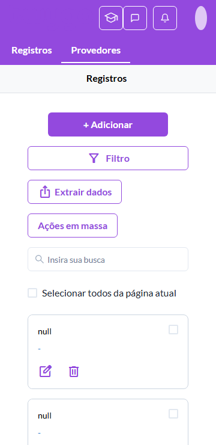

- 🎬 [Vídeo da execução (video.webm)](artifacts/projects-registros-externo-69130-ão-mobile-da-tab-Provedores-chromium/video.webm)

- 🎬 [Vídeo da execução (video-1.webm)](artifacts/projects-registros-externo-69130-ão-mobile-da-tab-Provedores-chromium/video-1.webm)

- 📦 **Trace** — [`trace.zip`](artifacts/projects-registros-externo-69130-ão-mobile-da-tab-Provedores-chromium/trace.zip)

  ```bash
  npx playwright show-trace outputs/registros-externos/reports/crud-de-provedores-e-bloqueio-de-exclusao-com-vinculo_20260625-141015/artifacts/projects-registros-externo-69130-ão-mobile-da-tab-Provedores-chromium/trace.zip
  ```

- 🎥 **Vídeo** — [`video.webm`](artifacts/projects-registros-externo-69130-ão-mobile-da-tab-Provedores-chromium/video.webm)

- 🎥 **Vídeo** — [`video-1.webm`](artifacts/projects-registros-externo-69130-ão-mobile-da-tab-Provedores-chromium/video-1.webm)


---

### ✅ Aprovado · TC2 · Validar criação de provedor · 🔴 Crítico

<a id="validar-criacao-de-provedor"></a>_Arquivo:_ `tc2-criacao-de-provedor.spec.ts` · _Duração:_ 27.70s · _Browser:_ chromium

**Sumário (objetivo do caso):** Garantir o fluxo completo de criação pela tela dedicada (RN 84).

**Pré-condições:**

```
Ambiente Stage configurado e acessível
Funcionalidade "Registros de Aprendizagem" habilitada no contrato da organização
Usuário logado como Admin
Provedores cadastrados na organização, incluindo ao menos 1 com registros vinculados e 1 sem nenhum vínculo
Provedores criados pelos testes são removidos ao final (cleanup)
```

**Passos do caso (XML/TestLink + execução Playwright):**

_Cada linha reproduz um passo do XML; a coluna **Status** traz o resultado da execução (do step Allure correspondente). Linhas com "Pré-condição" são da execução automatizada (login, navegação inicial) — não fazem parte do roteiro do XML._

| # | Ação do passo | Resultado esperado | Status | Notas | Duração |
|---|---|---|:---:|---|---:|
| — | _Pré-condição:_ 2-4. Preencher Nome, Website e Descrição | — | ✅ | — | 0.09s |
| 1 | Acessar a tab "Provedores" como Admin e clicar no botão "Adicionar" | Tela "Adicionar provedor" abre com campos "Nome", "Website", "Descrição" e switch "Ativo" ligado por default. | ✅ | — | 9.19s |
| 2 | Preencher o campo "Nome" com "Provedor QA Teste" | Campo exibe o valor. | ✅ | — | — |
| 3 | Preencher o campo "Website" com "https://provedor-qa.example.com" | Campo exibe o valor. | ✅ | — | — |
| 4 | Preencher o campo "Descrição" com "Provedor criado por teste automatizado" | Campo exibe o valor. | ✅ | — | — |
| 5 | Clicar no botão "Salvar" | Toast exibida: "Provedor adicionado". Sistema retorna para a listagem; "Provedor QA Teste" aparece na tabela. | ✅ | — | 8.57s |

**Evidências:**

📁 _Pasta:_ [`artifacts/projects-registros-externo-540dd-Validar-criação-de-provedor-chromium/`](artifacts/projects-registros-externo-540dd-Validar-criação-de-provedor-chromium/)

- 📸 **Screenshot (screenshot)** — [`test-finished-1.png`](artifacts/projects-registros-externo-540dd-Validar-criação-de-provedor-chromium/test-finished-1.png)

  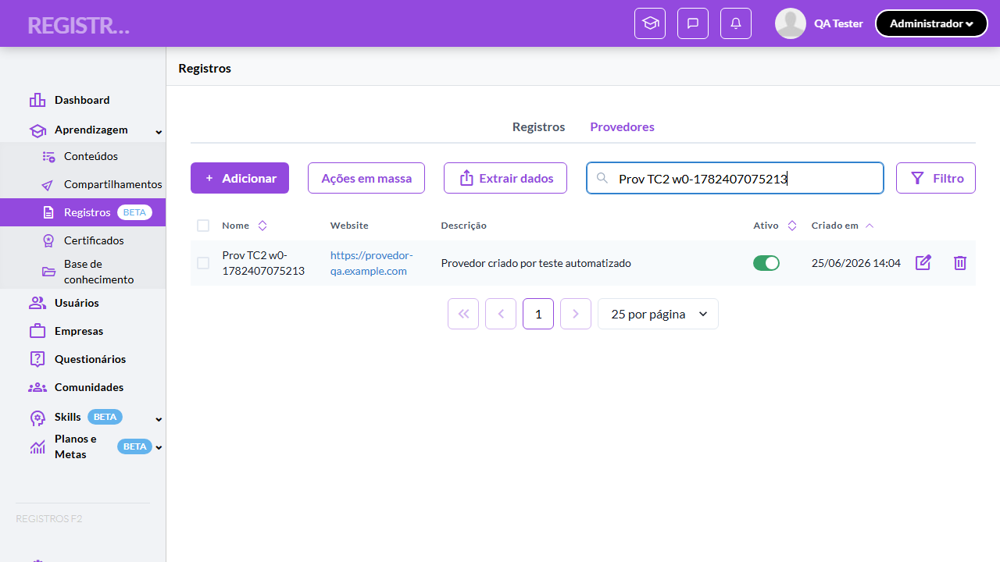

- 📸 **Screenshot (screenshot)** — [`test-finished-2.png`](artifacts/projects-registros-externo-540dd-Validar-criação-de-provedor-chromium/test-finished-2.png)

  

- 🎬 [Vídeo da execução (video.webm)](artifacts/projects-registros-externo-540dd-Validar-criação-de-provedor-chromium/video.webm)

- 🎬 [Vídeo da execução (video-1.webm)](artifacts/projects-registros-externo-540dd-Validar-criação-de-provedor-chromium/video-1.webm)

- 📦 **Trace** — [`trace.zip`](artifacts/projects-registros-externo-540dd-Validar-criação-de-provedor-chromium/trace.zip)

  ```bash
  npx playwright show-trace outputs/registros-externos/reports/crud-de-provedores-e-bloqueio-de-exclusao-com-vinculo_20260625-141015/artifacts/projects-registros-externo-540dd-Validar-criação-de-provedor-chromium/trace.zip
  ```

- 🎥 **Vídeo** — [`video.webm`](artifacts/projects-registros-externo-540dd-Validar-criação-de-provedor-chromium/video.webm)

- 🎥 **Vídeo** — [`video-1.webm`](artifacts/projects-registros-externo-540dd-Validar-criação-de-provedor-chromium/video-1.webm)


---

### ❌ Falhou · TC3 · Validações do campo "Nome" do provedor · 🔴 Crítico

<a id="validacoes-do-campo-nome-do-provedor"></a>_Arquivo:_ `tc3-validacoes-campo-nome.spec.ts` · _Duração:_ 88.49s · _Browser:_ chromium

> **❌ Por que falhou:** Error: "Emoji" deveria ser aceito
> _Step impactado:_ **5. Cenário "Emoji" → aceito**

**Sumário (objetivo do caso):** Validar a matriz de entradas do campo obrigatório "Nome" do provedor — categorias A, B, C, D.

**Pré-condições:**

```
Ambiente Stage configurado e acessível
Funcionalidade "Registros de Aprendizagem" habilitada no contrato da organização
Usuário logado como Admin
Provedores cadastrados na organização, incluindo ao menos 1 com registros vinculados e 1 sem nenhum vínculo
Provedores criados pelos testes são removidos ao final (cleanup)
```

**Passos do caso (XML/TestLink + execução Playwright):**

_Cada linha reproduz um passo do XML; a coluna **Status** traz o resultado da execução (do step Allure correspondente). Linhas com "Pré-condição" são da execução automatizada (login, navegação inicial) — não fazem parte do roteiro do XML._

| # | Ação do passo | Resultado esperado | Status | Notas | Duração |
|---|---|---|:---:|---|---:|
| — | _Pré-condição:_ Cenário "Vazio" → bloqueado | — | ✅ | — | 7.98s |
| — | _Pré-condição:_ Cenário "Só espaços" → bloqueado | — | ✅ | — | 8.09s |
| — | _Pré-condição:_ Cenário "1 caractere" → aceito | — | ✅ | — | 10.27s |
| — | _Pré-condição:_ Cenário "Acentos" → aceito | — | ✅ | — | 10.62s |
| — | _Pré-condição:_ Cenário "Emoji" → aceito | — | ❌ | Error: "Emoji" deveria ser aceito | 22.14s |
| — | _Pré-condição:_ Cenário "Script tag" → aceito | — | ✅ | — | 10.90s |
| — | _Pré-condição:_ Cenário "SQL injection" → aceito | — | ✅ | — | 10.37s |
| 1 | Acessar a tela "Adicionar provedor" como Admin | Form exibido. | ⊘ | Step não executado: o teste foi interrompido antes. Causa: Error: "Emoji" deveria ser aceito. | — |
| 2 | Submeter o formulário pelo botão "Salvar" com o campo "Nome" preenchido com o input de cada linha da Validation matrix | Comportamento bate com a coluna "Esperado"; casos válidos criam provedor (removido no cleanup) e inválidos bloqueiam com "Campo obrigatório". | ⊘ | Step não executado: o teste foi interrompido antes. Causa: Error: "Emoji" deveria ser aceito. | — |

**Evidências:**

📁 _Pasta:_ [`artifacts/projects-registros-externo-16a9d-s-do-campo-Nome-do-provedor-chromium/`](artifacts/projects-registros-externo-16a9d-s-do-campo-Nome-do-provedor-chromium/)

- 📸 **Screenshot (screenshot)** — [`test-failed-1.png`](artifacts/projects-registros-externo-16a9d-s-do-campo-Nome-do-provedor-chromium/test-failed-1.png)

  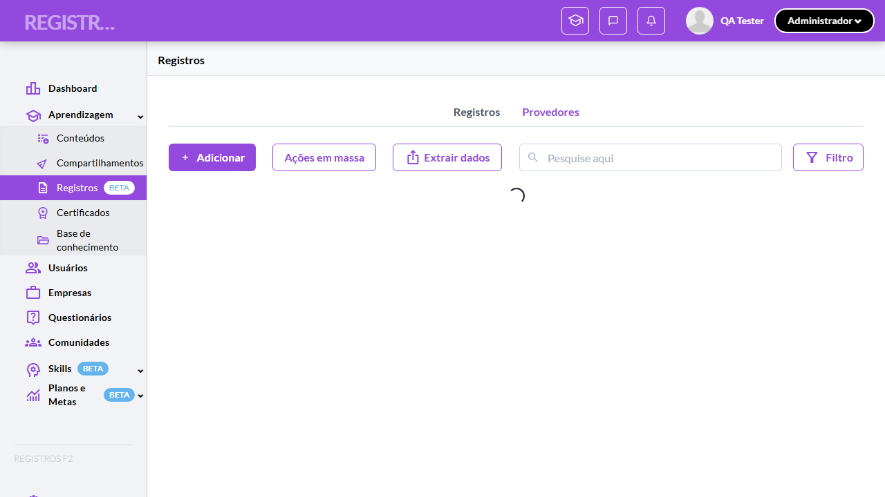

- 📸 **Screenshot (screenshot)** — [`test-failed-2.png`](artifacts/projects-registros-externo-16a9d-s-do-campo-Nome-do-provedor-chromium/test-failed-2.png)

  

- 🎬 [Vídeo da execução (video.webm)](artifacts/projects-registros-externo-16a9d-s-do-campo-Nome-do-provedor-chromium/video.webm)

- 🎬 [Vídeo da execução (video-1.webm)](artifacts/projects-registros-externo-16a9d-s-do-campo-Nome-do-provedor-chromium/video-1.webm)

- 📦 **Trace** — [`trace.zip`](artifacts/projects-registros-externo-16a9d-s-do-campo-Nome-do-provedor-chromium/trace.zip)

  ```bash
  npx playwright show-trace outputs/registros-externos/reports/crud-de-provedores-e-bloqueio-de-exclusao-com-vinculo_20260625-141015/artifacts/projects-registros-externo-16a9d-s-do-campo-Nome-do-provedor-chromium/trace.zip
  ```

- 🎥 **Vídeo** — [`video.webm`](artifacts/projects-registros-externo-16a9d-s-do-campo-Nome-do-provedor-chromium/video.webm)

- 🎥 **Vídeo** — [`video-1.webm`](artifacts/projects-registros-externo-16a9d-s-do-campo-Nome-do-provedor-chromium/video-1.webm)

- 📄 **DOM no momento da falha** — [`error-context.md`](artifacts/projects-registros-externo-16a9d-s-do-campo-Nome-do-provedor-chromium/error-context.md)

#### 🐛 Pronto para registro de bug

> ❓ **Análise automática:** Inconclusivo (precisa investigação manual) · Confiança 🔴 baixa
> _Por quê:_ Sem sinal Network in-scope ou padrão de erro conhecido — revisar trace
> _Bug-report estruturado:_ [`bug-reports/crud-de-provedores-e-bloqueio-de-exclusao-com-vinculo__validacoes-do-campo-nome-do-provedor.md`](bug-reports/crud-de-provedores-e-bloqueio-de-exclusao-com-vinculo__validacoes-do-campo-nome-do-provedor.md)

**Próximas ações sugeridas:**
- Sem evidência suficiente para classificar — abrir `trace.zip` (`npx playwright show-trace`) para ver passo a passo da execução.
- Reabrir o agente com o trace em mãos para reclassificar manualmente em uma das 4 categorias.

**Descrição do BUG:** [Crítico] Validações do campo "Nome" do provedor — Error: "Emoji" deveria ser aceito

**Passo a passo para reprodução:**
1. Pré: Ambiente Stage configurado e acessível
1. Pré: Funcionalidade "Registros de Aprendizagem" habilitada no contrato da organização
1. Pré: Usuário logado como Admin
1. Pré: Provedores cadastrados na organização, incluindo ao menos 1 com registros vinculados e 1 sem nenhum vínculo
1. Pré: Provedores criados pelos testes são removidos ao final (cleanup)
1. 1. Acessar a tela "Adicionar provedor" como Admin
1. 2. Submeter o formulário pelo botão "Salvar" com o campo "Nome" preenchido com o input de cada linha da Validation matrix

**Comportamento esperado:** 1. Form exibido. | 2. Comportamento bate com a coluna "Esperado"; casos válidos criam provedor (removido no cleanup) e inválidos bloqueiam com "Campo obrigatório".

**Comportamento atual:** Error: "Emoji" deveria ser aceito (falha aconteceu no passo 5: "Cenário "Emoji" → aceito")

**Informações:**

| Campo | Valor |
|---|---|
| URL | `https://registrosf2.stage.twygoead.com/o/37079/event_sources/new` |
| Login | Credenciais via env: `TWYGO_STAGING_REGISTROS_EXTERNOS_EMAIL` (consulte `.env`) |
| Senha | Credenciais via env: `TWYGO_STAGING_REGISTROS_EXTERNOS_PASSWORD` (consulte `.env`) |
| orgId | 37079 |
| Outros | Browser: chromium |
| Outros | runId: crud-de-provedores-e-bloqueio-de-exclusao-com-vinculo_20260625-141015 |
| Outros | Duração até a falha: 88.49s |
| Outros | Step impactado: 5. Cenário "Emoji" → aceito |

**Evidências:**

- Screenshot capturado pelo Playwright (screenshot): artifacts/projects-registros-externo-16a9d-s-do-campo-Nome-do-provedor-chromium/test-failed-1.png
- Vídeo da execução (video-1.webm): artifacts/projects-registros-externo-16a9d-s-do-campo-Nome-do-provedor-chromium/video-1.webm
- Vídeo da execução (video.webm): artifacts/projects-registros-externo-16a9d-s-do-campo-Nome-do-provedor-chromium/video.webm
- Snapshot do DOM/contexto da página (error-context.md): artifacts/projects-registros-externo-16a9d-s-do-campo-Nome-do-provedor-chromium/error-context.md
- Screenshot capturado pelo Playwright (screenshot): artifacts/projects-registros-externo-16a9d-s-do-campo-Nome-do-provedor-chromium/test-failed-2.png
- Snapshot do DOM/contexto da página (error-context.md): artifacts/projects-registros-externo-16a9d-s-do-campo-Nome-do-provedor-chromium/error-context.md
- Trace completo do Playwright (.zip) — `npx playwright show-trace`: artifacts/projects-registros-externo-16a9d-s-do-campo-Nome-do-provedor-chromium/trace.zip

<details><summary>📋 Ver texto agregado para copiar (Jira/GitHub/Linear)</summary>

```
Descrição do BUG
[Crítico] Validações do campo "Nome" do provedor — Error: "Emoji" deveria ser aceito

Passo a passo para reprodução
  Pré: Ambiente Stage configurado e acessível
  Pré: Funcionalidade "Registros de Aprendizagem" habilitada no contrato da organização
  Pré: Usuário logado como Admin
  Pré: Provedores cadastrados na organização, incluindo ao menos 1 com registros vinculados e 1 sem nenhum vínculo
  Pré: Provedores criados pelos testes são removidos ao final (cleanup)
  1. Acessar a tela "Adicionar provedor" como Admin
  2. Submeter o formulário pelo botão "Salvar" com o campo "Nome" preenchido com o input de cada linha da Validation matrix

Comportamento esperado
1. Form exibido. | 2. Comportamento bate com a coluna "Esperado"; casos válidos criam provedor (removido no cleanup) e inválidos bloqueiam com "Campo obrigatório".

Comportamento atual
Error: "Emoji" deveria ser aceito (falha aconteceu no passo 5: "Cenário "Emoji" → aceito")

Informações
- URL: https://registrosf2.stage.twygoead.com/o/37079/event_sources/new
- Login: Credenciais via env: `TWYGO_STAGING_REGISTROS_EXTERNOS_EMAIL` (consulte `.env`)
- Senha: Credenciais via env: `TWYGO_STAGING_REGISTROS_EXTERNOS_PASSWORD` (consulte `.env`)
- ID do ambiente (orgId): 37079
- Outros:
  - Browser: chromium
  - runId: crud-de-provedores-e-bloqueio-de-exclusao-com-vinculo_20260625-141015
  - Duração até a falha: 88.49s
  - Step impactado: 5. Cenário "Emoji" → aceito

Evidências
- Screenshot capturado pelo Playwright (screenshot): artifacts/projects-registros-externo-16a9d-s-do-campo-Nome-do-provedor-chromium/test-failed-1.png
- Vídeo da execução (video-1.webm): artifacts/projects-registros-externo-16a9d-s-do-campo-Nome-do-provedor-chromium/video-1.webm
- Vídeo da execução (video.webm): artifacts/projects-registros-externo-16a9d-s-do-campo-Nome-do-provedor-chromium/video.webm
- Snapshot do DOM/contexto da página (error-context.md): artifacts/projects-registros-externo-16a9d-s-do-campo-Nome-do-provedor-chromium/error-context.md
- Screenshot capturado pelo Playwright (screenshot): artifacts/projects-registros-externo-16a9d-s-do-campo-Nome-do-provedor-chromium/test-failed-2.png
- Snapshot do DOM/contexto da página (error-context.md): artifacts/projects-registros-externo-16a9d-s-do-campo-Nome-do-provedor-chromium/error-context.md
- Trace completo do Playwright (.zip) — `npx playwright show-trace`: artifacts/projects-registros-externo-16a9d-s-do-campo-Nome-do-provedor-chromium/trace.zip

Execução
- runId: crud-de-provedores-e-bloqueio-de-exclusao-com-vinculo_20260625-141015
- environment.json: staging-registros-externos
- testsuite: CRUD de Provedores e bloqueio de exclusão com vínculo
- testcase: Validações do campo "Nome" do provedor

```

</details>

<details><summary>🔧 Stack trace técnica completa (para desenvolvedor)</summary>

```
Error: "Emoji" deveria ser aceito

expect(received).toMatch(expected)

Expected pattern: /tab=event-sources-tab/
Received string:  "https://registrosf2.stage.twygoead.com/o/37079/event_sources/new"
```

</details>

---

### ✅ Aprovado · TC4 · Validações do campo "Website" do provedor · 🟡 Normal

<a id="validacoes-do-campo-website-do-provedor"></a>_Arquivo:_ `tc4-validacoes-campo-website.spec.ts` · _Duração:_ 41.70s · _Browser:_ chromium

**Sumário (objetivo do caso):** Validar a matriz do campo opcional "Website" (categoria E — tipo errado).

**Pré-condições:**

```
Ambiente Stage configurado e acessível
Funcionalidade "Registros de Aprendizagem" habilitada no contrato da organização
Usuário logado como Admin
Provedores cadastrados na organização, incluindo ao menos 1 com registros vinculados e 1 sem nenhum vínculo
Provedores criados pelos testes são removidos ao final (cleanup)
```

**Passos do caso (XML/TestLink + execução Playwright):**

_Cada linha reproduz um passo do XML; a coluna **Status** traz o resultado da execução (do step Allure correspondente). Linhas com "Pré-condição" são da execução automatizada (login, navegação inicial) — não fazem parte do roteiro do XML._

| # | Ação do passo | Resultado esperado | Status | Notas | Duração |
|---|---|---|:---:|---|---:|
| — | _Pré-condição:_ Website "Vazio" | — | ✅ | — | 8.76s |
| — | _Pré-condição:_ Website "URL válida" | — | ✅ | — | 8.33s |
| — | _Pré-condição:_ Website "Sem protocolo" | — | ✅ | — | 8.76s |
| — | _Pré-condição:_ Website "Texto inválido" | — | ✅ | — | 8.06s |
| 1 | Acessar a tela "Adicionar provedor" como Admin com o campo "Nome" preenchido | Form pronto. | ✅ | — | — |
| 2 | Submeter o formulário pelo botão "Salvar" com o campo "Website" preenchido com o input de cada linha da Validation matrix | Comportamento bate com a coluna "Esperado". | ✅ | — | — |

**Evidências:**

📁 _Pasta:_ [`artifacts/projects-registros-externo-eea9d-o-campo-Website-do-provedor-chromium/`](artifacts/projects-registros-externo-eea9d-o-campo-Website-do-provedor-chromium/)

- 📸 **Screenshot (screenshot)** — [`test-finished-1.png`](artifacts/projects-registros-externo-eea9d-o-campo-Website-do-provedor-chromium/test-finished-1.png)

  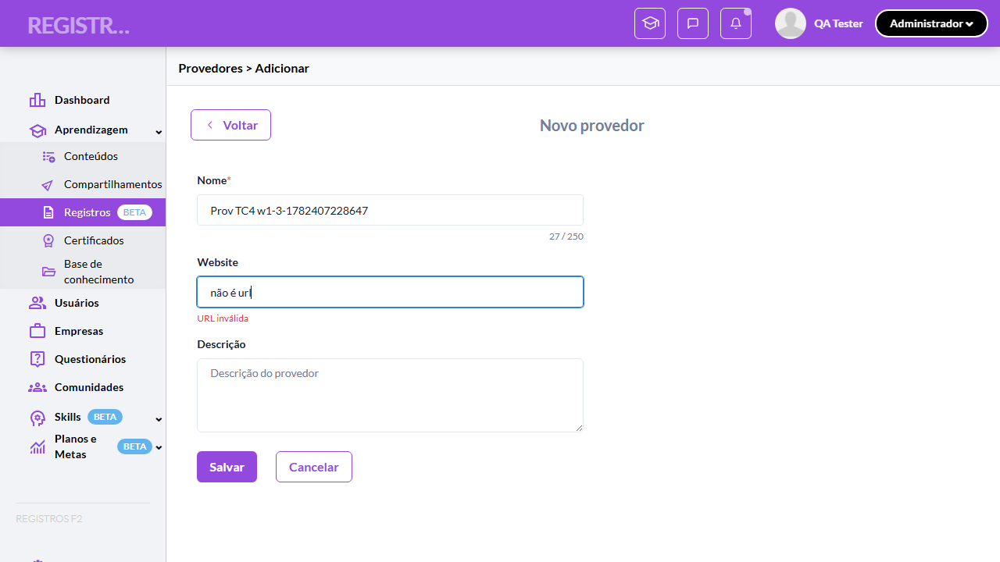

- 📸 **Screenshot (screenshot)** — [`test-finished-2.png`](artifacts/projects-registros-externo-eea9d-o-campo-Website-do-provedor-chromium/test-finished-2.png)

  

- 🎬 [Vídeo da execução (video.webm)](artifacts/projects-registros-externo-eea9d-o-campo-Website-do-provedor-chromium/video.webm)

- 🎬 [Vídeo da execução (video-1.webm)](artifacts/projects-registros-externo-eea9d-o-campo-Website-do-provedor-chromium/video-1.webm)

- 📦 **Trace** — [`trace.zip`](artifacts/projects-registros-externo-eea9d-o-campo-Website-do-provedor-chromium/trace.zip)

  ```bash
  npx playwright show-trace outputs/registros-externos/reports/crud-de-provedores-e-bloqueio-de-exclusao-com-vinculo_20260625-141015/artifacts/projects-registros-externo-eea9d-o-campo-Website-do-provedor-chromium/trace.zip
  ```

- 🎥 **Vídeo** — [`video.webm`](artifacts/projects-registros-externo-eea9d-o-campo-Website-do-provedor-chromium/video.webm)

- 🎥 **Vídeo** — [`video-1.webm`](artifacts/projects-registros-externo-eea9d-o-campo-Website-do-provedor-chromium/video-1.webm)


---

### ✅ Aprovado · TC5 · Validar edição de provedor · 🔴 Crítico

<a id="validar-edicao-de-provedor"></a>_Arquivo:_ `tc5-edicao-de-provedor.spec.ts` · _Duração:_ 31.71s · _Browser:_ chromium

**Sumário (objetivo do caso):** Garantir a edição pela tela dedicada pré-populada (RN 84).

**Pré-condições:**

```
Ambiente Stage configurado e acessível
Funcionalidade "Registros de Aprendizagem" habilitada no contrato da organização
Usuário logado como Admin
Provedores cadastrados na organização, incluindo ao menos 1 com registros vinculados e 1 sem nenhum vínculo
Provedores criados pelos testes são removidos ao final (cleanup)
```

**Passos do caso (XML/TestLink + execução Playwright):**

_Cada linha reproduz um passo do XML; a coluna **Status** traz o resultado da execução (do step Allure correspondente). Linhas com "Pré-condição" são da execução automatizada (login, navegação inicial) — não fazem parte do roteiro do XML._

| # | Ação do passo | Resultado esperado | Status | Notas | Duração |
|---|---|---|:---:|---|---:|
| — | _Pré-condição:_ Pré: criar um provedor para editar | — | ✅ | — | 17.58s |
| 1 | Acessar a tab "Provedores" como Admin e clicar no botão de editar (ícone de lápis) de um provedor existente | Tela "Editar provedor" abre com todos os campos pré-populados. | ✅ | — | 3.58s |
| 2 | Preencher o campo "Descrição" com "Descrição atualizada pelo teste" | Campo exibe o novo valor. | ✅ | — | 0.02s |
| 3 | Clicar no botão "Salvar" | Toast exibida: "Provedor salvo". Listagem reflete a descrição atualizada. | ✅ | — | 8.41s |

**Evidências:**

📁 _Pasta:_ [`artifacts/projects-registros-externo-4a190--Validar-edição-de-provedor-chromium/`](artifacts/projects-registros-externo-4a190--Validar-edição-de-provedor-chromium/)

- 📸 **Screenshot (screenshot)** — [`test-finished-1.png`](artifacts/projects-registros-externo-4a190--Validar-edição-de-provedor-chromium/test-finished-1.png)

  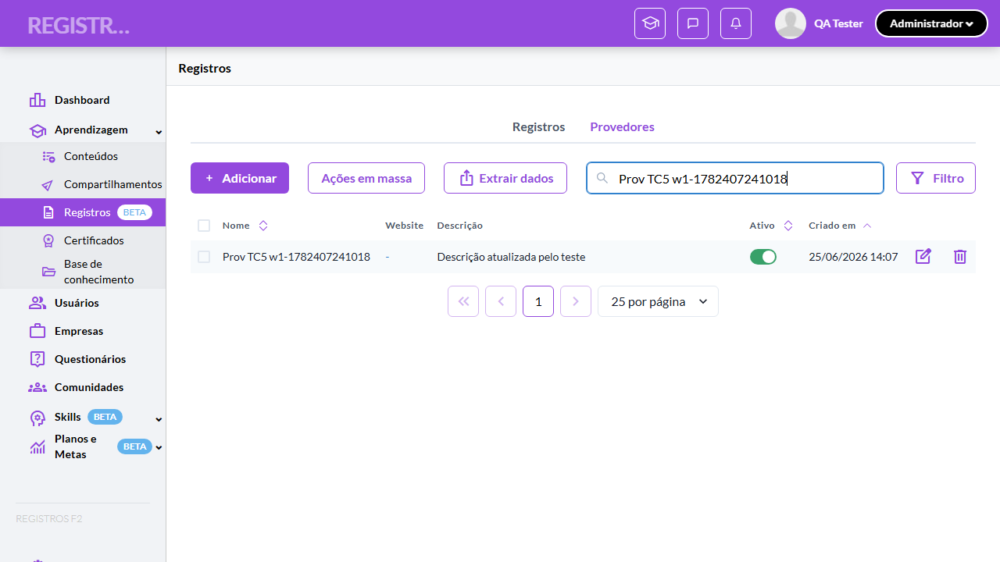

- 📸 **Screenshot (screenshot)** — [`test-finished-2.png`](artifacts/projects-registros-externo-4a190--Validar-edição-de-provedor-chromium/test-finished-2.png)

  

- 🎬 [Vídeo da execução (video.webm)](artifacts/projects-registros-externo-4a190--Validar-edição-de-provedor-chromium/video.webm)

- 🎬 [Vídeo da execução (video-1.webm)](artifacts/projects-registros-externo-4a190--Validar-edição-de-provedor-chromium/video-1.webm)

- 📦 **Trace** — [`trace.zip`](artifacts/projects-registros-externo-4a190--Validar-edição-de-provedor-chromium/trace.zip)

  ```bash
  npx playwright show-trace outputs/registros-externos/reports/crud-de-provedores-e-bloqueio-de-exclusao-com-vinculo_20260625-141015/artifacts/projects-registros-externo-4a190--Validar-edição-de-provedor-chromium/trace.zip
  ```

- 🎥 **Vídeo** — [`video.webm`](artifacts/projects-registros-externo-4a190--Validar-edição-de-provedor-chromium/video.webm)

- 🎥 **Vídeo** — [`video-1.webm`](artifacts/projects-registros-externo-4a190--Validar-edição-de-provedor-chromium/video-1.webm)


---

### ✅ Aprovado · TC6 · Validar toggle Ativo na linha com toasts · 🔴 Crítico

<a id="validar-toggle-ativo-na-linha-com-toasts"></a>_Arquivo:_ `tc6-toggle-ativo-na-linha.spec.ts` · _Duração:_ 31.50s · _Browser:_ chromium

**Sumário (objetivo do caso):** Garantir liga/desliga direto na linha sem abrir o form, com toasts específicos (RN 85).

**Pré-condições:**

```
Ambiente Stage configurado e acessível
Funcionalidade "Registros de Aprendizagem" habilitada no contrato da organização
Usuário logado como Admin
Provedores cadastrados na organização, incluindo ao menos 1 com registros vinculados e 1 sem nenhum vínculo
Provedores criados pelos testes são removidos ao final (cleanup)
```

**Passos do caso (XML/TestLink + execução Playwright):**

_Cada linha reproduz um passo do XML; a coluna **Status** traz o resultado da execução (do step Allure correspondente). Linhas com "Pré-condição" são da execução automatizada (login, navegação inicial) — não fazem parte do roteiro do XML._

| # | Ação do passo | Resultado esperado | Status | Notas | Duração |
|---|---|---|:---:|---|---:|
| — | _Pré-condição:_ Pré: criar provedor (Ativo por default) | — | ✅ | — | 17.41s |
| 1 | Acessar a tab "Provedores" como Admin e localizar um provedor com switch "Ativo" ligado | Switch verde ligado. | ✅ | — | 0.02s |
| 2 | Desativar o switch "Ativo" do provedor | Toast exibida: "Provedor desativado". Switch fica desligado sem abrir o form. | ✅ | — | 6.20s |
| 3 | Ativar o switch "Ativo" do mesmo provedor | Toast exibida: "Provedor ativado". Switch volta a ficar verde. | ✅ | — | 5.95s |

**Evidências:**

📁 _Pasta:_ [`artifacts/projects-registros-externo-bd38d-e-Ativo-na-linha-com-toasts-chromium/`](artifacts/projects-registros-externo-bd38d-e-Ativo-na-linha-com-toasts-chromium/)

- 📸 **Screenshot (screenshot)** — [`test-finished-1.png`](artifacts/projects-registros-externo-bd38d-e-Ativo-na-linha-com-toasts-chromium/test-finished-1.png)

  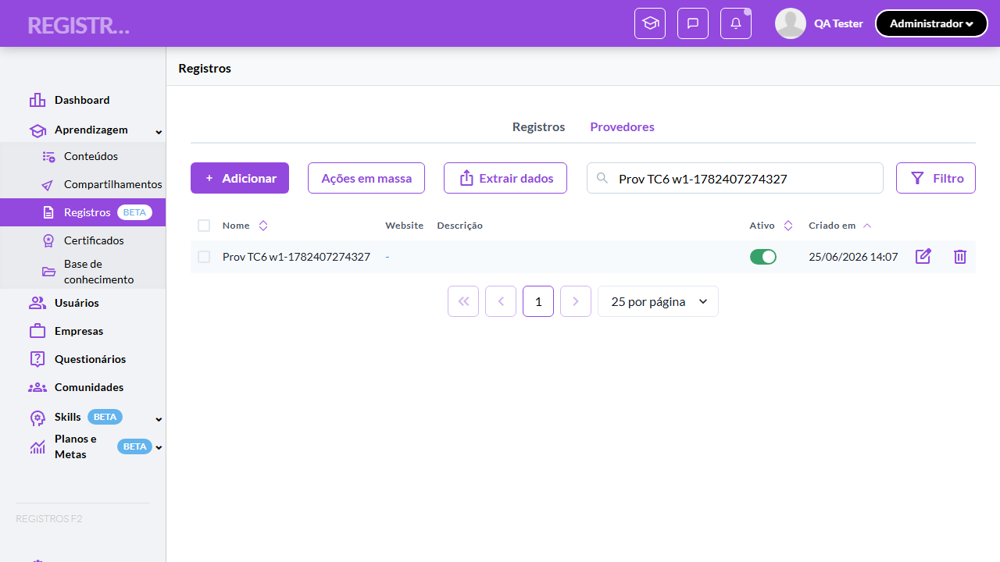

- 📸 **Screenshot (screenshot)** — [`test-finished-2.png`](artifacts/projects-registros-externo-bd38d-e-Ativo-na-linha-com-toasts-chromium/test-finished-2.png)

  

- 🎬 [Vídeo da execução (video.webm)](artifacts/projects-registros-externo-bd38d-e-Ativo-na-linha-com-toasts-chromium/video.webm)

- 🎬 [Vídeo da execução (video-1.webm)](artifacts/projects-registros-externo-bd38d-e-Ativo-na-linha-com-toasts-chromium/video-1.webm)

- 📦 **Trace** — [`trace.zip`](artifacts/projects-registros-externo-bd38d-e-Ativo-na-linha-com-toasts-chromium/trace.zip)

  ```bash
  npx playwright show-trace outputs/registros-externos/reports/crud-de-provedores-e-bloqueio-de-exclusao-com-vinculo_20260625-141015/artifacts/projects-registros-externo-bd38d-e-Ativo-na-linha-com-toasts-chromium/trace.zip
  ```

- 🎥 **Vídeo** — [`video.webm`](artifacts/projects-registros-externo-bd38d-e-Ativo-na-linha-com-toasts-chromium/video.webm)

- 🎥 **Vídeo** — [`video-1.webm`](artifacts/projects-registros-externo-bd38d-e-Ativo-na-linha-com-toasts-chromium/video-1.webm)


---

### ✅ Aprovado · TC7 · Validar efeito do provedor inativo nos dropdowns e registros existentes · 🔴 Crítico

<a id="validar-efeito-do-provedor-inativo-nos-dropdowns-e-registros-existentes"></a>_Arquivo:_ `tc7-provedor-inativo-dropdown-e-registros.spec.ts` · _Duração:_ 34.86s · _Browser:_ chromium

**Sumário (objetivo do caso):** Garantir que provedor inativo some do dropdown de novos registros mas permanece visível nos registros que já o referenciam (RN 85).

**Pré-condições:**

```
Ambiente Stage configurado e acessível
Funcionalidade "Registros de Aprendizagem" habilitada no contrato da organização
Usuário logado como Admin
Provedores cadastrados na organização, incluindo ao menos 1 com registros vinculados e 1 sem nenhum vínculo
Provedores criados pelos testes são removidos ao final (cleanup)
```

**Passos do caso (XML/TestLink + execução Playwright):**

_Cada linha reproduz um passo do XML; a coluna **Status** traz o resultado da execução (do step Allure correspondente). Linhas com "Pré-condição" são da execução automatizada (login, navegação inicial) — não fazem parte do roteiro do XML._

| # | Ação do passo | Resultado esperado | Status | Notas | Duração |
|---|---|---|:---:|---|---:|
| 1 | Acessar a tab "Provedores" como Admin e desativar o switch de um provedor vinculado a registros existentes (ex: "Coursera") | Toast exibida: "Provedor desativado". | ✅ | — | 12.71s |
| 2 | Acessar o form "Adicionar registro" e clicar no campo "Provedor de aprendizagem" | Dropdown NÃO lista o provedor desativado. | ✅ | — | 5.79s |
| 3 | Voltar para a tab "Registros" e localizar um registro antigo do provedor desativado | Coluna "Provedor" continua exibindo o nome do provedor no registro existente. | ✅ | — | 5.79s |
| 4 | Reativar o switch do provedor (restauração) | Toast exibida: "Provedor ativado"; provedor volta ao dropdown. | ✅ | — | 6.77s |

**Evidências:**

📁 _Pasta:_ [`artifacts/projects-registros-externo-d25f8-owns-e-registros-existentes-chromium/`](artifacts/projects-registros-externo-d25f8-owns-e-registros-existentes-chromium/)

- 📸 **Screenshot (screenshot)** — [`test-finished-1.png`](artifacts/projects-registros-externo-d25f8-owns-e-registros-existentes-chromium/test-finished-1.png)

  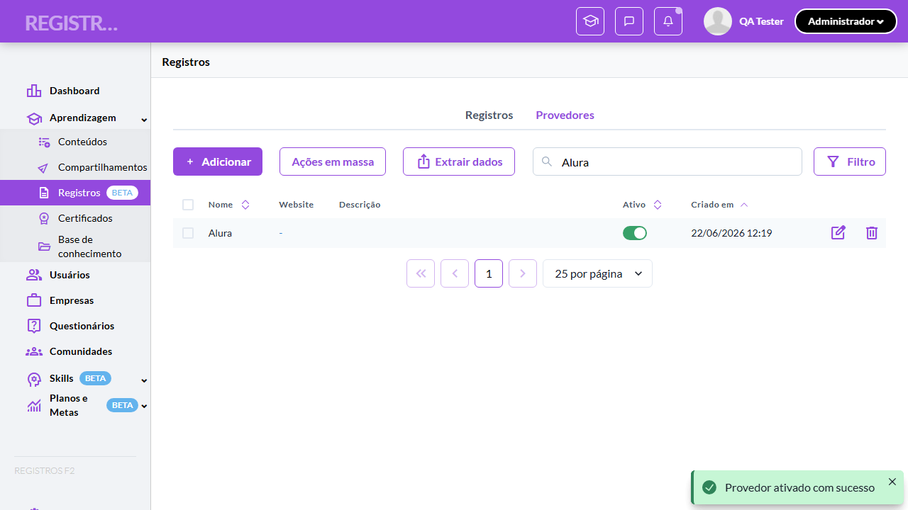

- 📸 **Screenshot (screenshot)** — [`test-finished-2.png`](artifacts/projects-registros-externo-d25f8-owns-e-registros-existentes-chromium/test-finished-2.png)

  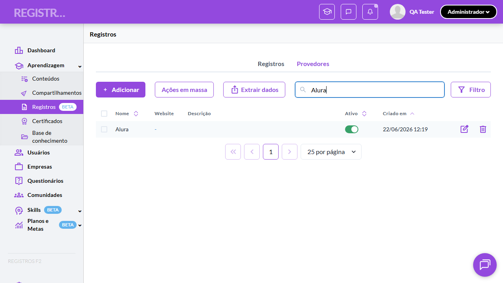

- 🎬 [Vídeo da execução (video.webm)](artifacts/projects-registros-externo-d25f8-owns-e-registros-existentes-chromium/video.webm)

- 🎬 [Vídeo da execução (video-1.webm)](artifacts/projects-registros-externo-d25f8-owns-e-registros-existentes-chromium/video-1.webm)

- 📦 **Trace** — [`trace.zip`](artifacts/projects-registros-externo-d25f8-owns-e-registros-existentes-chromium/trace.zip)

  ```bash
  npx playwright show-trace outputs/registros-externos/reports/crud-de-provedores-e-bloqueio-de-exclusao-com-vinculo_20260625-141015/artifacts/projects-registros-externo-d25f8-owns-e-registros-existentes-chromium/trace.zip
  ```

- 🎥 **Vídeo** — [`video.webm`](artifacts/projects-registros-externo-d25f8-owns-e-registros-existentes-chromium/video.webm)

- 🎥 **Vídeo** — [`video-1.webm`](artifacts/projects-registros-externo-d25f8-owns-e-registros-existentes-chromium/video-1.webm)


---

### ✅ Aprovado · TC8 · Validar exclusão de provedor sem vínculo · 🔴 Crítico

<a id="validar-exclusao-de-provedor-sem-vinculo"></a>_Arquivo:_ `tc8-exclusao-provedor-sem-vinculo.spec.ts` · _Duração:_ 27.14s · _Browser:_ chromium

**Sumário (objetivo do caso):** Garantir a confirmação destrutiva e exclusão de provedor sem registros vinculados (RN 86).

**Pré-condições:**

```
Ambiente Stage configurado e acessível
Funcionalidade "Registros de Aprendizagem" habilitada no contrato da organização
Usuário logado como Admin
Provedores cadastrados na organização, incluindo ao menos 1 com registros vinculados e 1 sem nenhum vínculo
Provedores criados pelos testes são removidos ao final (cleanup)
```

**Passos do caso (XML/TestLink + execução Playwright):**

_Cada linha reproduz um passo do XML; a coluna **Status** traz o resultado da execução (do step Allure correspondente). Linhas com "Pré-condição" são da execução automatizada (login, navegação inicial) — não fazem parte do roteiro do XML._

| # | Ação do passo | Resultado esperado | Status | Notas | Duração |
|---|---|---|:---:|---|---:|
| — | _Pré-condição:_ Pré: criar provedor sem vínculo | — | ✅ | — | 22.35s |
| — | _Pré-condição:_ 1-2. Excluir → modal destrutivo → Cancelar mantém na lista | — | ✅ | — | 0.56s |
| 1 | Acessar a tab "Provedores" como Admin e clicar no botão de excluir (ícone de lixeira) de um provedor sem registros vinculados | Modal de confirmação destrutiva abre com alerta "Esta ação não pode ser desfeita.". | ✅ | — | — |
| 2 | Clicar no botão "Cancelar" | Modal fecha; provedor permanece na lista. | ✅ | — | — |
| 3 | Clicar novamente no botão de excluir e confirmar a exclusão | Toast exibida: "Provedor excluído". Provedor some da listagem. | ✅ | — | 0.93s |

**Evidências:**

📁 _Pasta:_ [`artifacts/projects-registros-externo-7449a-são-de-provedor-sem-vínculo-chromium/`](artifacts/projects-registros-externo-7449a-são-de-provedor-sem-vínculo-chromium/)

- 📸 **Screenshot (screenshot)** — [`test-finished-1.png`](artifacts/projects-registros-externo-7449a-são-de-provedor-sem-vínculo-chromium/test-finished-1.png)

  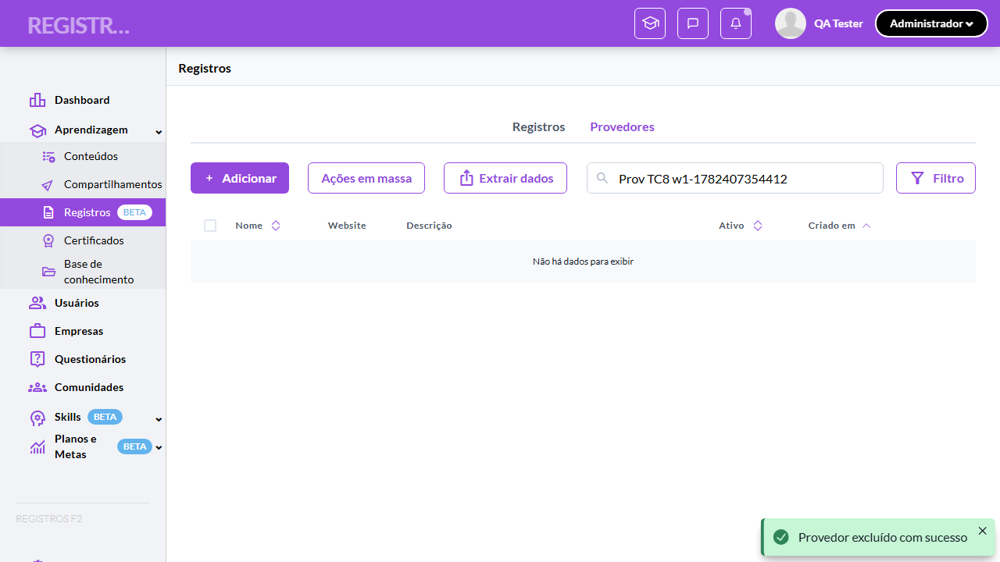

- 📸 **Screenshot (screenshot)** — [`test-finished-2.png`](artifacts/projects-registros-externo-7449a-são-de-provedor-sem-vínculo-chromium/test-finished-2.png)

  

- 🎬 [Vídeo da execução (video.webm)](artifacts/projects-registros-externo-7449a-são-de-provedor-sem-vínculo-chromium/video.webm)

- 🎬 [Vídeo da execução (video-1.webm)](artifacts/projects-registros-externo-7449a-são-de-provedor-sem-vínculo-chromium/video-1.webm)

- 📦 **Trace** — [`trace.zip`](artifacts/projects-registros-externo-7449a-são-de-provedor-sem-vínculo-chromium/trace.zip)

  ```bash
  npx playwright show-trace outputs/registros-externos/reports/crud-de-provedores-e-bloqueio-de-exclusao-com-vinculo_20260625-141015/artifacts/projects-registros-externo-7449a-são-de-provedor-sem-vínculo-chromium/trace.zip
  ```

- 🎥 **Vídeo** — [`video.webm`](artifacts/projects-registros-externo-7449a-são-de-provedor-sem-vínculo-chromium/video.webm)

- 🎥 **Vídeo** — [`video-1.webm`](artifacts/projects-registros-externo-7449a-são-de-provedor-sem-vínculo-chromium/video-1.webm)


---

### ✅ Aprovado · TC9 · Validar bloqueio de exclusão de provedor com vínculo · 🔴 Crítico

<a id="validar-bloqueio-de-exclusao-de-provedor-com-vinculo"></a>_Arquivo:_ `tc9-bloqueio-exclusao-com-vinculo.spec.ts` · _Duração:_ 19.02s · _Browser:_ chromium

**Sumário (objetivo do caso):** Garantir o AlertDialog informativo com contagem de vínculos e botão único "Entendi" (RN 87).

**Pré-condições:**

```
Ambiente Stage configurado e acessível
Funcionalidade "Registros de Aprendizagem" habilitada no contrato da organização
Usuário logado como Admin
Provedores cadastrados na organização, incluindo ao menos 1 com registros vinculados e 1 sem nenhum vínculo
Provedores criados pelos testes são removidos ao final (cleanup)
```

**Passos do caso (XML/TestLink + execução Playwright):**

_Cada linha reproduz um passo do XML; a coluna **Status** traz o resultado da execução (do step Allure correspondente). Linhas com "Pré-condição" são da execução automatizada (login, navegação inicial) — não fazem parte do roteiro do XML._

| # | Ação do passo | Resultado esperado | Status | Notas | Duração |
|---|---|---|:---:|---|---:|
| 1 | Acessar a tab "Provedores" como Admin e clicar no botão de excluir de um provedor COM registros vinculados | AlertDialog informativo abre com ícone amarelo e texto "Provedor não pode ser excluído. Existem {N} registros vinculados." | ✅ | — | 0.53s |
| 2 | Verificar o botão "Entendi" do modal | Apenas o botão "Entendi" é exibido (sem opção de confirmação destrutiva). | ✅ | — | 0.40s |
| 3 | Clicar no botão "Entendi" | Modal fecha; provedor permanece intacto na listagem; nenhum toast de exclusão. | ✅ | — | 6.84s |

**Evidências:**

📁 _Pasta:_ [`artifacts/projects-registros-externo-1ed87-são-de-provedor-com-vínculo-chromium/`](artifacts/projects-registros-externo-1ed87-são-de-provedor-com-vínculo-chromium/)

- 📸 **Screenshot (screenshot)** — [`test-finished-1.png`](artifacts/projects-registros-externo-1ed87-são-de-provedor-com-vínculo-chromium/test-finished-1.png)

  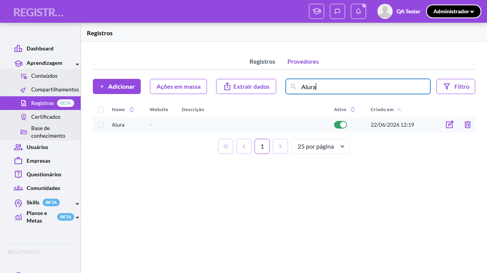

- 🎬 [Vídeo da execução (video.webm)](artifacts/projects-registros-externo-1ed87-são-de-provedor-com-vínculo-chromium/video.webm)

- 🎬 [Vídeo da execução (video-1.webm)](artifacts/projects-registros-externo-1ed87-são-de-provedor-com-vínculo-chromium/video-1.webm)

- 📦 **Trace** — [`trace.zip`](artifacts/projects-registros-externo-1ed87-são-de-provedor-com-vínculo-chromium/trace.zip)

  ```bash
  npx playwright show-trace outputs/registros-externos/reports/crud-de-provedores-e-bloqueio-de-exclusao-com-vinculo_20260625-141015/artifacts/projects-registros-externo-1ed87-são-de-provedor-com-vínculo-chromium/trace.zip
  ```

- 🎥 **Vídeo** — [`video.webm`](artifacts/projects-registros-externo-1ed87-são-de-provedor-com-vínculo-chromium/video.webm)

- 🎥 **Vídeo** — [`video-1.webm`](artifacts/projects-registros-externo-1ed87-são-de-provedor-com-vínculo-chromium/video-1.webm)


---
