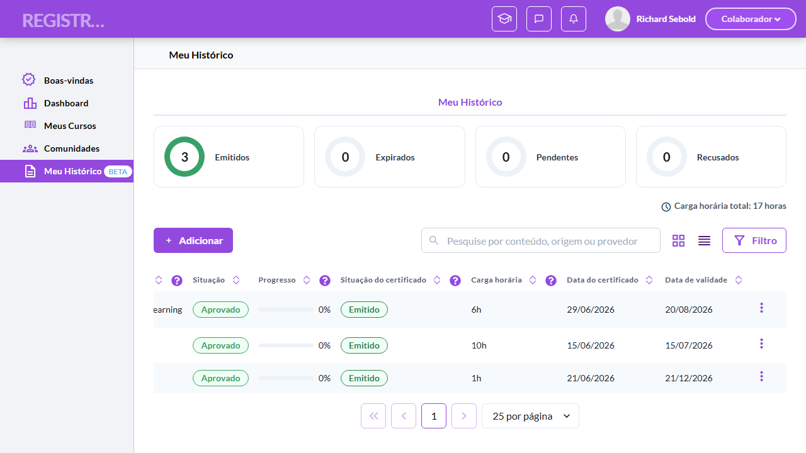
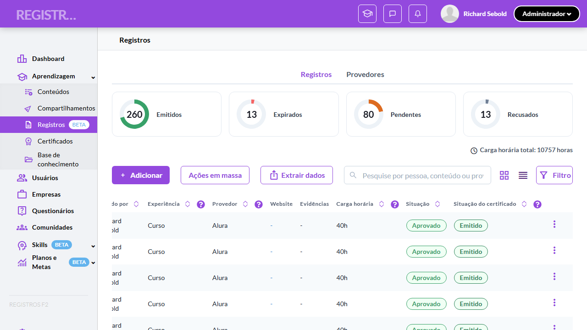
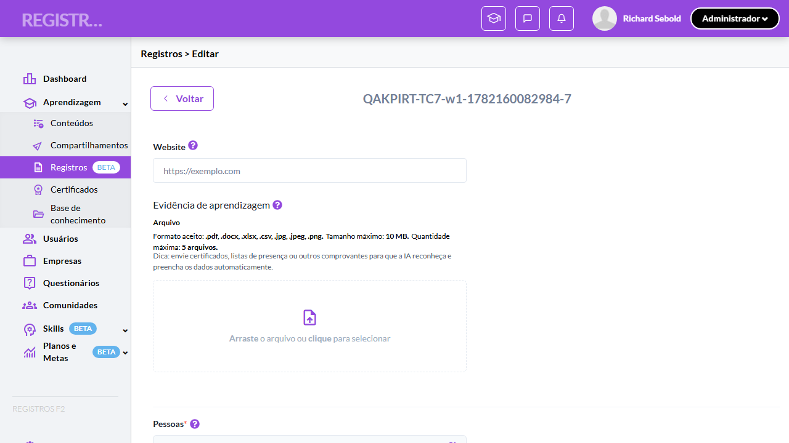
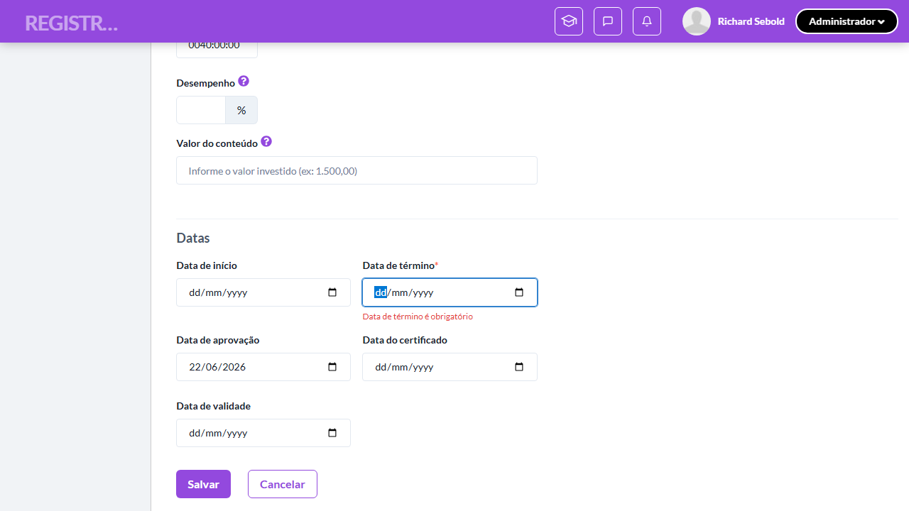
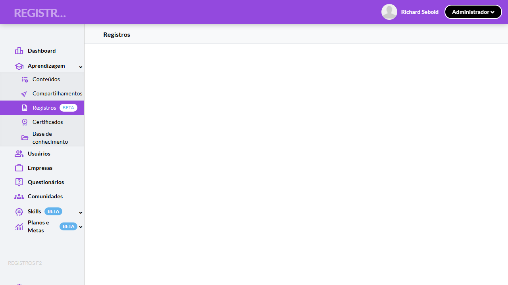
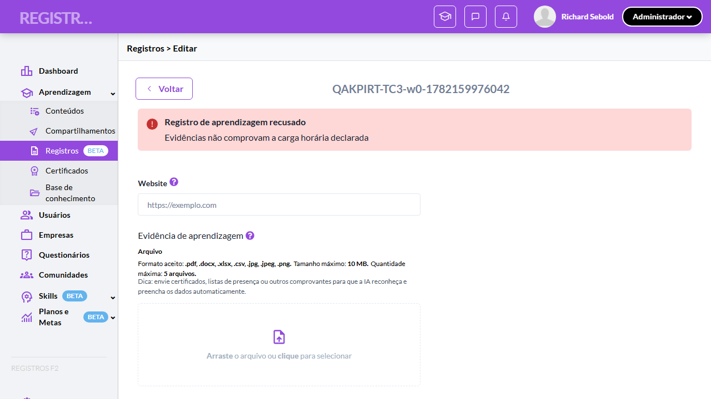

# Casos de teste — Registros de Aprendizagem

[← Voltar ao dashboard](index.md)

Lista detalhada por testsuite. Cada caso traz: o que era esperado pelo XML, quais steps foram executados, evidências (screenshots/trace), texto pronto pra registro de bug e — quando houver falha — uma explicação em PT-BR do motivo.

## Editar registro de aprendizagem (matriz perfil × origem × status e banners)

_10 caso(s) — 2 aprovado(s), 8 falha(s)_

### ❌ Falhou · TC1 · Validar disponibilidade do "Editar" para o Aluno (matriz origem × status) · 🔴 Crítico

<a id="validar-disponibilidade-do-editar-para-o-aluno-matriz-origem-status"></a>_Arquivo:_ `tc1-disponibilidade-editar-aluno.spec.ts` · _Duração:_ 31.06s · _Browser:_ chromium

> **❌ Por que falhou:** Error: menu observado: [Editar, Excluir, Visualizar, Evidências, Histórico]
> _Step impactado:_ **2. Menu 3-pontos de um registro Externo Emitido**

**Sumário (objetivo do caso):** Garantir que o item "Editar" do menu 3 pontos do Aluno aparece apenas para Externo + (Pendente | Recusado | Expirado) e não é renderizado nos demais casos (RN 42).

**Pré-condições:**

```
Ambiente Stage configurado e acessível
Funcionalidade "Registros de Aprendizagem" habilitada no contrato da organização
Usuários disponíveis nos perfis Aluno e Admin
Aluno possui registros Externos nos status Pendente, Recusado (com justificativa registrada), Expirado e Emitido
Aluno possui ao menos 1 registro Interno e 1 Compartilhado
Admin tem acesso a registros Externos Emitido, Recusado, Expirado, Pendente e Substituído
Registro com provedor fora da lista padrão (ex. "UFSC") para o cenário de pré-população
```

**Passos do caso (XML/TestLink + execução Playwright):**

_Cada linha reproduz um passo do XML; a coluna **Status** traz o resultado da execução (do step Allure correspondente). Linhas com "Pré-condição" são da execução automatizada (login, navegação inicial) — não fazem parte do roteiro do XML._

| # | Ação do passo | Resultado esperado | Status | Notas | Duração |
|---|---|---|:---:|---|---:|
| — | _Pré-condição:_ Entrar como Colaborador e abrir "Meu histórico" | — | ✅ | — | 21.14s |
| — | _Pré-condição:_ Menu 3-pontos de um registro Externo Emitido | — | ❌ | Error: menu observado: [Editar, Excluir, Visualizar, Evidências, Histórico] | 0.63s |
| 1 | Acessar a tela "Meu histórico" como Aluno e clicar no menu 3 pontos de um registro Externo Pendente | Menu exibe o item "Editar". | ⊘ | Step não executado: o teste foi interrompido antes. Causa: Error: menu observado: [Editar, Excluir, Visualizar, Evidências, Histórico]. | — |
| 2 | Clicar no menu 3 pontos de um registro Externo Recusado | Menu exibe o item "Editar". | ⊘ | Step não executado: o teste foi interrompido antes. Causa: Error: menu observado: [Editar, Excluir, Visualizar, Evidências, Histórico]. | — |
| 3 | Clicar no menu 3 pontos de um registro Externo Expirado | Menu exibe o item "Editar". | ⊘ | Step não executado: o teste foi interrompido antes. Causa: Error: menu observado: [Editar, Excluir, Visualizar, Evidências, Histórico]. | — |
| 4 | Clicar no menu 3 pontos de um registro Externo Emitido | Item "Editar" NÃO é exibido no menu (sem disabled — simplesmente ausente). | ⊘ | Step não executado: o teste foi interrompido antes. Causa: Error: menu observado: [Editar, Excluir, Visualizar, Evidências, Histórico]. | — |
| 5 | Clicar no menu 3 pontos de um registro Interno | Item "Editar" NÃO é exibido. | ⊘ | Step não executado: o teste foi interrompido antes. Causa: Error: menu observado: [Editar, Excluir, Visualizar, Evidências, Histórico]. | — |
| 6 | Clicar no menu 3 pontos de um registro Compartilhado | Item "Editar" NÃO é exibido. | ⊘ | Step não executado: o teste foi interrompido antes. Causa: Error: menu observado: [Editar, Excluir, Visualizar, Evidências, Histórico]. | — |

**Evidências:**

📁 _Pasta:_ [`artifacts/projects-registros-externo-ae6ca-uno-matriz-origem-×-status--chromium/`](artifacts/projects-registros-externo-ae6ca-uno-matriz-origem-×-status--chromium/)

- 📸 **Screenshot (screenshot)** — [`test-failed-1.png`](artifacts/projects-registros-externo-ae6ca-uno-matriz-origem-×-status--chromium/test-failed-1.png)

  

- 🎬 [Vídeo da execução (video.webm)](artifacts/projects-registros-externo-ae6ca-uno-matriz-origem-×-status--chromium/video.webm)

- 🎬 [Vídeo da execução (video-1.webm)](artifacts/projects-registros-externo-ae6ca-uno-matriz-origem-×-status--chromium/video-1.webm)

- 📦 **Trace** — [`trace.zip`](artifacts/projects-registros-externo-ae6ca-uno-matriz-origem-×-status--chromium/trace.zip)

  ```bash
  npx playwright show-trace outputs/registros-externos/reports/editar-registro-de-aprendizagem-matriz-perfil-origem-status-e-banners_20260622-195849/artifacts/projects-registros-externo-ae6ca-uno-matriz-origem-×-status--chromium/trace.zip
  ```

- 🎥 **Vídeo** — [`video.webm`](artifacts/projects-registros-externo-ae6ca-uno-matriz-origem-×-status--chromium/video.webm)

- 🎥 **Vídeo** — [`video-1.webm`](artifacts/projects-registros-externo-ae6ca-uno-matriz-origem-×-status--chromium/video-1.webm)

- 📄 **DOM no momento da falha** — [`error-context.md`](artifacts/projects-registros-externo-ae6ca-uno-matriz-origem-×-status--chromium/error-context.md)

#### 🐛 Pronto para registro de bug

> ❓ **Análise automática:** Inconclusivo (precisa investigação manual) · Confiança 🔴 baixa
> _Por quê:_ Sem sinal Network in-scope ou padrão de erro conhecido — revisar trace
> _Bug-report estruturado:_ [`bug-reports/editar-registro-de-aprendizagem-matriz-perfil-origem-status-e-banners__validar-disponibilidade-do-editar-para-o-aluno-matriz-origem-status.md`](bug-reports/editar-registro-de-aprendizagem-matriz-perfil-origem-status-e-banners__validar-disponibilidade-do-editar-para-o-aluno-matriz-origem-status.md)

**Próximas ações sugeridas:**
- Sem evidência suficiente para classificar — abrir `trace.zip` (`npx playwright show-trace`) para ver passo a passo da execução.
- Reabrir o agente com o trace em mãos para reclassificar manualmente em uma das 4 categorias.

**Descrição do BUG:** [Crítico] Validar disponibilidade do "Editar" para o Aluno (matriz origem × status) — Error: menu observado: [Editar, Excluir, Visualizar, Evidências, Histórico]

**Passo a passo para reprodução:**
1. Pré: Ambiente Stage configurado e acessível
1. Pré: Funcionalidade "Registros de Aprendizagem" habilitada no contrato da organização
1. Pré: Usuários disponíveis nos perfis Aluno e Admin
1. Pré: Aluno possui registros Externos nos status Pendente, Recusado (com justificativa registrada), Expirado e Emitido
1. Pré: Aluno possui ao menos 1 registro Interno e 1 Compartilhado
1. Pré: Admin tem acesso a registros Externos Emitido, Recusado, Expirado, Pendente e Substituído
1. Pré: Registro com provedor fora da lista padrão (ex. "UFSC") para o cenário de pré-população
1. 1. Acessar a tela "Meu histórico" como Aluno e clicar no menu 3 pontos de um registro Externo Pendente
1. 2. Clicar no menu 3 pontos de um registro Externo Recusado
1. 3. Clicar no menu 3 pontos de um registro Externo Expirado
1. 4. Clicar no menu 3 pontos de um registro Externo Emitido
1. 5. Clicar no menu 3 pontos de um registro Interno
1. 6. Clicar no menu 3 pontos de um registro Compartilhado

**Comportamento esperado:** Menu exibe o item "Editar".

**Comportamento atual:** Error: menu observado: [Editar, Excluir, Visualizar, Evidências, Histórico] (falha aconteceu no passo 2: "Menu 3-pontos de um registro Externo Emitido", que deveria resultar em: Menu exibe o item "Editar".)

**Informações:**

| Campo | Valor |
|---|---|
| URL | `https://registrosf2.stage.twygoead.com/` |
| Login | Credenciais via env: `TWYGO_STAGING_REGISTROS_EXTERNOS_EMAIL` (consulte `.env`) |
| Senha | Credenciais via env: `TWYGO_STAGING_REGISTROS_EXTERNOS_PASSWORD` (consulte `.env`) |
| orgId | 37079 |
| Outros | Browser: chromium |
| Outros | runId: editar-registro-de-aprendizagem-matriz-perfil-origem-status-e-banners_20260622-195849 |
| Outros | Duração até a falha: 31.06s |
| Outros | Step impactado: 2. Menu 3-pontos de um registro Externo Emitido |

**Evidências:**

- Screenshot capturado pelo Playwright (screenshot): artifacts/projects-registros-externo-ae6ca-uno-matriz-origem-×-status--chromium/test-failed-1.png
- Vídeo da execução (video-1.webm): artifacts/projects-registros-externo-ae6ca-uno-matriz-origem-×-status--chromium/video-1.webm
- Vídeo da execução (video.webm): artifacts/projects-registros-externo-ae6ca-uno-matriz-origem-×-status--chromium/video.webm
- Snapshot do DOM/contexto da página (error-context.md): artifacts/projects-registros-externo-ae6ca-uno-matriz-origem-×-status--chromium/error-context.md
- Trace completo do Playwright (.zip) — `npx playwright show-trace`: artifacts/projects-registros-externo-ae6ca-uno-matriz-origem-×-status--chromium/trace.zip

<details><summary>📋 Ver texto agregado para copiar (Jira/GitHub/Linear)</summary>

```
Descrição do BUG
[Crítico] Validar disponibilidade do "Editar" para o Aluno (matriz origem × status) — Error: menu observado: [Editar, Excluir, Visualizar, Evidências, Histórico]

Passo a passo para reprodução
  Pré: Ambiente Stage configurado e acessível
  Pré: Funcionalidade "Registros de Aprendizagem" habilitada no contrato da organização
  Pré: Usuários disponíveis nos perfis Aluno e Admin
  Pré: Aluno possui registros Externos nos status Pendente, Recusado (com justificativa registrada), Expirado e Emitido
  Pré: Aluno possui ao menos 1 registro Interno e 1 Compartilhado
  Pré: Admin tem acesso a registros Externos Emitido, Recusado, Expirado, Pendente e Substituído
  Pré: Registro com provedor fora da lista padrão (ex. "UFSC") para o cenário de pré-população
  1. Acessar a tela "Meu histórico" como Aluno e clicar no menu 3 pontos de um registro Externo Pendente
  2. Clicar no menu 3 pontos de um registro Externo Recusado
  3. Clicar no menu 3 pontos de um registro Externo Expirado
  4. Clicar no menu 3 pontos de um registro Externo Emitido
  5. Clicar no menu 3 pontos de um registro Interno
  6. Clicar no menu 3 pontos de um registro Compartilhado

Comportamento esperado
Menu exibe o item "Editar".

Comportamento atual
Error: menu observado: [Editar, Excluir, Visualizar, Evidências, Histórico] (falha aconteceu no passo 2: "Menu 3-pontos de um registro Externo Emitido", que deveria resultar em: Menu exibe o item "Editar".)

Informações
- URL: https://registrosf2.stage.twygoead.com/
- Login: Credenciais via env: `TWYGO_STAGING_REGISTROS_EXTERNOS_EMAIL` (consulte `.env`)
- Senha: Credenciais via env: `TWYGO_STAGING_REGISTROS_EXTERNOS_PASSWORD` (consulte `.env`)
- ID do ambiente (orgId): 37079
- Outros:
  - Browser: chromium
  - runId: editar-registro-de-aprendizagem-matriz-perfil-origem-status-e-banners_20260622-195849
  - Duração até a falha: 31.06s
  - Step impactado: 2. Menu 3-pontos de um registro Externo Emitido

Evidências
- Screenshot capturado pelo Playwright (screenshot): artifacts/projects-registros-externo-ae6ca-uno-matriz-origem-×-status--chromium/test-failed-1.png
- Vídeo da execução (video-1.webm): artifacts/projects-registros-externo-ae6ca-uno-matriz-origem-×-status--chromium/video-1.webm
- Vídeo da execução (video.webm): artifacts/projects-registros-externo-ae6ca-uno-matriz-origem-×-status--chromium/video.webm
- Snapshot do DOM/contexto da página (error-context.md): artifacts/projects-registros-externo-ae6ca-uno-matriz-origem-×-status--chromium/error-context.md
- Trace completo do Playwright (.zip) — `npx playwright show-trace`: artifacts/projects-registros-externo-ae6ca-uno-matriz-origem-×-status--chromium/trace.zip

Execução
- runId: editar-registro-de-aprendizagem-matriz-perfil-origem-status-e-banners_20260622-195849
- environment.json: staging-registros-externos
- testsuite: Editar registro de aprendizagem (matriz perfil × origem × status e banners)
- testcase: Validar disponibilidade do "Editar" para o Aluno (matriz origem × status)

```

</details>

<details><summary>🔧 Stack trace técnica completa (para desenvolvedor)</summary>

```
Error: menu observado: [Editar, Excluir, Visualizar, Evidências, Histórico]

expect(received).not.toContain(expected) // indexOf

Expected value: not "Editar"
Received array:     ["Editar", "Excluir", "Visualizar", "Evidências", "Histórico"]
```

</details>

---

### ❌ Falhou · TC10 · Validar banner verde de registro Emitido · 🔴 Crítico

<a id="validar-banner-verde-de-registro-emitido"></a>_Arquivo:_ `tc10-banner-verde-emitido.spec.ts` · _Duração:_ 31.80s · _Browser:_ chromium

> **❌ Por que falhou:** O elemento esperado não apareceu na tela (locator: getByText('Certificado aprovado').first()).
> _Step impactado:_ **2. Banner verde "Certificado aprovado" + botão "Histórico" (RN46)**

**Sumário (objetivo do caso):** Garantir o banner verde "Certificado aprovado" com botão "Histórico" em registro Emitido (RN 46).

**Pré-condições:**

```
Ambiente Stage configurado e acessível
Funcionalidade "Registros de Aprendizagem" habilitada no contrato da organização
Usuários disponíveis nos perfis Aluno e Admin
Aluno possui registros Externos nos status Pendente, Recusado (com justificativa registrada), Expirado e Emitido
Aluno possui ao menos 1 registro Interno e 1 Compartilhado
Admin tem acesso a registros Externos Emitido, Recusado, Expirado, Pendente e Substituído
Registro com provedor fora da lista padrão (ex. "UFSC") para o cenário de pré-população
```

**Passos do caso (XML/TestLink + execução Playwright):**

_Cada linha reproduz um passo do XML; a coluna **Status** traz o resultado da execução (do step Allure correspondente). Linhas com "Pré-condição" são da execução automatizada (login, navegação inicial) — não fazem parte do roteiro do XML._

| # | Ação do passo | Resultado esperado | Status | Notas | Duração |
|---|---|---|:---:|---|---:|
| — | _Pré-condição:_ Admin: abrir "Editar" de um Externo Emitido | — | ✅ | — | 18.48s |
| — | _Pré-condição:_ Banner verde "Certificado aprovado" + botão "Histórico" (RN46) | — | ❌ | O elemento esperado não apareceu na tela (locator: getByText('Certificado aprovado').first()). | 10.02s |
| 1 | Acessar o form de edição como Admin de um registro Externo Emitido | Banner verde é exibido no topo com o texto "Certificado aprovado" e botão "Histórico" à direita. | ⊘ | Step não executado: o teste foi interrompido antes. Causa: O elemento esperado não apareceu na tela (locator: getByText('Certificado aprovado').first()).. | — |
| 2 | Clicar no botão "Histórico" do banner | Drawer "Histórico - {conteúdo}" abre com a trilha do registro. | ⊘ | Step não executado: o teste foi interrompido antes. Causa: O elemento esperado não apareceu na tela (locator: getByText('Certificado aprovado').first()).. | — |

**Evidências:**

📁 _Pasta:_ [`artifacts/projects-registros-externo-176cf-r-verde-de-registro-Emitido-chromium/`](artifacts/projects-registros-externo-176cf-r-verde-de-registro-Emitido-chromium/)

- 📸 **Screenshot (screenshot)** — [`test-failed-1.png`](artifacts/projects-registros-externo-176cf-r-verde-de-registro-Emitido-chromium/test-failed-1.png)

  

- 🎬 [Vídeo da execução (video.webm)](artifacts/projects-registros-externo-176cf-r-verde-de-registro-Emitido-chromium/video.webm)

- 🎬 [Vídeo da execução (video-1.webm)](artifacts/projects-registros-externo-176cf-r-verde-de-registro-Emitido-chromium/video-1.webm)

- 📦 **Trace** — [`trace.zip`](artifacts/projects-registros-externo-176cf-r-verde-de-registro-Emitido-chromium/trace.zip)

  ```bash
  npx playwright show-trace outputs/registros-externos/reports/editar-registro-de-aprendizagem-matriz-perfil-origem-status-e-banners_20260622-195849/artifacts/projects-registros-externo-176cf-r-verde-de-registro-Emitido-chromium/trace.zip
  ```

- 🎥 **Vídeo** — [`video.webm`](artifacts/projects-registros-externo-176cf-r-verde-de-registro-Emitido-chromium/video.webm)

- 🎥 **Vídeo** — [`video-1.webm`](artifacts/projects-registros-externo-176cf-r-verde-de-registro-Emitido-chromium/video-1.webm)

- 📄 **DOM no momento da falha** — [`error-context.md`](artifacts/projects-registros-externo-176cf-r-verde-de-registro-Emitido-chromium/error-context.md)

#### 🐛 Pronto para registro de bug

> ❓ **Análise automática:** Inconclusivo (precisa investigação manual) · Confiança 🔴 baixa
> _Por quê:_ Sem sinal Network in-scope ou padrão de erro conhecido — revisar trace
> _Bug-report estruturado:_ [`bug-reports/editar-registro-de-aprendizagem-matriz-perfil-origem-status-e-banners__validar-banner-verde-de-registro-emitido.md`](bug-reports/editar-registro-de-aprendizagem-matriz-perfil-origem-status-e-banners__validar-banner-verde-de-registro-emitido.md)

**Próximas ações sugeridas:**
- Sem evidência suficiente para classificar — abrir `trace.zip` (`npx playwright show-trace`) para ver passo a passo da execução.
- Reabrir o agente com o trace em mãos para reclassificar manualmente em uma das 4 categorias.

**Descrição do BUG:** [Crítico] Validar banner verde de registro Emitido — O elemento esperado não apareceu na tela (locator: getByText('Certificado aprovado').first()).

**Passo a passo para reprodução:**
1. Pré: Ambiente Stage configurado e acessível
1. Pré: Funcionalidade "Registros de Aprendizagem" habilitada no contrato da organização
1. Pré: Usuários disponíveis nos perfis Aluno e Admin
1. Pré: Aluno possui registros Externos nos status Pendente, Recusado (com justificativa registrada), Expirado e Emitido
1. Pré: Aluno possui ao menos 1 registro Interno e 1 Compartilhado
1. Pré: Admin tem acesso a registros Externos Emitido, Recusado, Expirado, Pendente e Substituído
1. Pré: Registro com provedor fora da lista padrão (ex. "UFSC") para o cenário de pré-população
1. 1. Acessar o form de edição como Admin de um registro Externo Emitido
1. 2. Clicar no botão "Histórico" do banner

**Comportamento esperado:** Drawer "Histórico - {conteúdo}" abre com a trilha do registro.

**Comportamento atual:** O elemento esperado não apareceu na tela (locator: getByText('Certificado aprovado').first()). (falha aconteceu no passo 2: "Banner verde "Certificado aprovado" + botão "Histórico" (RN46)", que deveria resultar em: Drawer "Histórico - {conteúdo}" abre com a trilha do registro.)

**Informações:**

| Campo | Valor |
|---|---|
| URL | `https://exemplo.com` |
| Login | Credenciais via env: `TWYGO_STAGING_REGISTROS_EXTERNOS_EMAIL` (consulte `.env`) |
| Senha | Credenciais via env: `TWYGO_STAGING_REGISTROS_EXTERNOS_PASSWORD` (consulte `.env`) |
| orgId | 37079 |
| Outros | Browser: chromium |
| Outros | runId: editar-registro-de-aprendizagem-matriz-perfil-origem-status-e-banners_20260622-195849 |
| Outros | Duração até a falha: 31.80s |
| Outros | Step impactado: 2. Banner verde "Certificado aprovado" + botão "Histórico" (RN46) |

**Evidências:**

- Screenshot capturado pelo Playwright (screenshot): artifacts/projects-registros-externo-176cf-r-verde-de-registro-Emitido-chromium/test-failed-1.png
- Vídeo da execução (video-1.webm): artifacts/projects-registros-externo-176cf-r-verde-de-registro-Emitido-chromium/video-1.webm
- Vídeo da execução (video.webm): artifacts/projects-registros-externo-176cf-r-verde-de-registro-Emitido-chromium/video.webm
- Snapshot do DOM/contexto da página (error-context.md): artifacts/projects-registros-externo-176cf-r-verde-de-registro-Emitido-chromium/error-context.md
- Trace completo do Playwright (.zip) — `npx playwright show-trace`: artifacts/projects-registros-externo-176cf-r-verde-de-registro-Emitido-chromium/trace.zip

<details><summary>📋 Ver texto agregado para copiar (Jira/GitHub/Linear)</summary>

```
Descrição do BUG
[Crítico] Validar banner verde de registro Emitido — O elemento esperado não apareceu na tela (locator: getByText('Certificado aprovado').first()).

Passo a passo para reprodução
  Pré: Ambiente Stage configurado e acessível
  Pré: Funcionalidade "Registros de Aprendizagem" habilitada no contrato da organização
  Pré: Usuários disponíveis nos perfis Aluno e Admin
  Pré: Aluno possui registros Externos nos status Pendente, Recusado (com justificativa registrada), Expirado e Emitido
  Pré: Aluno possui ao menos 1 registro Interno e 1 Compartilhado
  Pré: Admin tem acesso a registros Externos Emitido, Recusado, Expirado, Pendente e Substituído
  Pré: Registro com provedor fora da lista padrão (ex. "UFSC") para o cenário de pré-população
  1. Acessar o form de edição como Admin de um registro Externo Emitido
  2. Clicar no botão "Histórico" do banner

Comportamento esperado
Drawer "Histórico - {conteúdo}" abre com a trilha do registro.

Comportamento atual
O elemento esperado não apareceu na tela (locator: getByText('Certificado aprovado').first()). (falha aconteceu no passo 2: "Banner verde "Certificado aprovado" + botão "Histórico" (RN46)", que deveria resultar em: Drawer "Histórico - {conteúdo}" abre com a trilha do registro.)

Informações
- URL: https://exemplo.com
- Login: Credenciais via env: `TWYGO_STAGING_REGISTROS_EXTERNOS_EMAIL` (consulte `.env`)
- Senha: Credenciais via env: `TWYGO_STAGING_REGISTROS_EXTERNOS_PASSWORD` (consulte `.env`)
- ID do ambiente (orgId): 37079
- Outros:
  - Browser: chromium
  - runId: editar-registro-de-aprendizagem-matriz-perfil-origem-status-e-banners_20260622-195849
  - Duração até a falha: 31.80s
  - Step impactado: 2. Banner verde "Certificado aprovado" + botão "Histórico" (RN46)

Evidências
- Screenshot capturado pelo Playwright (screenshot): artifacts/projects-registros-externo-176cf-r-verde-de-registro-Emitido-chromium/test-failed-1.png
- Vídeo da execução (video-1.webm): artifacts/projects-registros-externo-176cf-r-verde-de-registro-Emitido-chromium/video-1.webm
- Vídeo da execução (video.webm): artifacts/projects-registros-externo-176cf-r-verde-de-registro-Emitido-chromium/video.webm
- Snapshot do DOM/contexto da página (error-context.md): artifacts/projects-registros-externo-176cf-r-verde-de-registro-Emitido-chromium/error-context.md
- Trace completo do Playwright (.zip) — `npx playwright show-trace`: artifacts/projects-registros-externo-176cf-r-verde-de-registro-Emitido-chromium/trace.zip

Execução
- runId: editar-registro-de-aprendizagem-matriz-perfil-origem-status-e-banners_20260622-195849
- environment.json: staging-registros-externos
- testsuite: Editar registro de aprendizagem (matriz perfil × origem × status e banners)
- testcase: Validar banner verde de registro Emitido

```

</details>

<details><summary>🔧 Stack trace técnica completa (para desenvolvedor)</summary>

```
Error: expect(locator).toBeVisible() failed

Locator: getByText('Certificado aprovado').first()
Expected: visible
Timeout: 10000ms
Error: element(s) not found

Call log:
  - Expect "toBeVisible" with timeout 10000ms
  - waiting for getByText('Certificado aprovado').first()

```

</details>

---

### ❌ Falhou · TC2 · Validar disponibilidade do "Editar" para o Admin (matriz origem × status) · 🔴 Crítico

<a id="validar-disponibilidade-do-editar-para-o-admin-matriz-origem-status"></a>_Arquivo:_ `tc2-disponibilidade-editar-admin.spec.ts` · _Duração:_ 26.23s · _Browser:_ chromium

> **❌ Por que falhou:** Error: seed: Externo Pendente
> _Step impactado:_ **3. Externo Pendente → "Avaliar" primário, sem "Editar" (AT TC2.4)**

**Sumário (objetivo do caso):** Garantir que Admin vê "Editar" apenas em Externo + (Emitido | Recusado | Expirado); Pendente usa "Avaliar"; Substituído/Interno/Compartilhado não editam (RN 42).

**Pré-condições:**

```
Ambiente Stage configurado e acessível
Funcionalidade "Registros de Aprendizagem" habilitada no contrato da organização
Usuários disponíveis nos perfis Aluno e Admin
Aluno possui registros Externos nos status Pendente, Recusado (com justificativa registrada), Expirado e Emitido
Aluno possui ao menos 1 registro Interno e 1 Compartilhado
Admin tem acesso a registros Externos Emitido, Recusado, Expirado, Pendente e Substituído
Registro com provedor fora da lista padrão (ex. "UFSC") para o cenário de pré-população
```

**Passos do caso (XML/TestLink + execução Playwright):**

_Cada linha reproduz um passo do XML; a coluna **Status** traz o resultado da execução (do step Allure correspondente). Linhas com "Pré-condição" são da execução automatizada (login, navegação inicial) — não fazem parte do roteiro do XML._

| # | Ação do passo | Resultado esperado | Status | Notas | Duração |
|---|---|---|:---:|---|---:|
| — | _Pré-condição:_ Abrir "Aprendizagem > Registros" (Admin) | — | ✅ | — | 20.76s |
| — | _Pré-condição:_ Externo Emitido → "Editar" presente, sem "Avaliar" (AT TC2.1) | — | ✅ | — | 0.79s |
| — | _Pré-condição:_ Externo Pendente → "Avaliar" primário, sem "Editar" (AT TC2.4) | — | ❌ | Error: seed: Externo Pendente | 0.05s |
| 1 | Acessar a tela "Aprendizagem > Registros" como Admin e clicar no menu 3 pontos de um registro Externo Emitido | Menu exibe o item "Editar". | ⊘ | Step não executado: o teste foi interrompido antes. Causa: Error: seed: Externo Pendente. | — |
| 2 | Clicar no menu 3 pontos de um registro Externo Recusado | Menu exibe "Editar". | ⊘ | Step não executado: o teste foi interrompido antes. Causa: Error: seed: Externo Pendente. | — |
| 3 | Clicar no menu 3 pontos de um registro Externo Expirado | Menu exibe "Editar". | ⊘ | Step não executado: o teste foi interrompido antes. Causa: Error: seed: Externo Pendente. | — |
| 4 | Clicar no menu 3 pontos de um registro Externo Pendente | Menu exibe "Avaliar" como item primário e NÃO exibe "Editar". | ⊘ | Step não executado: o teste foi interrompido antes. Causa: Error: seed: Externo Pendente. | — |
| 5 | Clicar no menu 3 pontos de um registro Externo Substituído | Item "Editar" NÃO é exibido. | ⊘ | Step não executado: o teste foi interrompido antes. Causa: Error: seed: Externo Pendente. | — |
| 6 | Clicar no menu 3 pontos de um registro Interno | Item "Editar" NÃO é exibido. | ⊘ | Step não executado: o teste foi interrompido antes. Causa: Error: seed: Externo Pendente. | — |

**Evidências:**

📁 _Pasta:_ [`artifacts/projects-registros-externo-913c9-min-matriz-origem-×-status--chromium/`](artifacts/projects-registros-externo-913c9-min-matriz-origem-×-status--chromium/)

- 📸 **Screenshot (screenshot)** — [`test-failed-1.png`](artifacts/projects-registros-externo-913c9-min-matriz-origem-×-status--chromium/test-failed-1.png)

  

- 🎬 [Vídeo da execução (video.webm)](artifacts/projects-registros-externo-913c9-min-matriz-origem-×-status--chromium/video.webm)

- 🎬 [Vídeo da execução (video-1.webm)](artifacts/projects-registros-externo-913c9-min-matriz-origem-×-status--chromium/video-1.webm)

- 📦 **Trace** — [`trace.zip`](artifacts/projects-registros-externo-913c9-min-matriz-origem-×-status--chromium/trace.zip)

  ```bash
  npx playwright show-trace outputs/registros-externos/reports/editar-registro-de-aprendizagem-matriz-perfil-origem-status-e-banners_20260622-195849/artifacts/projects-registros-externo-913c9-min-matriz-origem-×-status--chromium/trace.zip
  ```

- 🎥 **Vídeo** — [`video.webm`](artifacts/projects-registros-externo-913c9-min-matriz-origem-×-status--chromium/video.webm)

- 🎥 **Vídeo** — [`video-1.webm`](artifacts/projects-registros-externo-913c9-min-matriz-origem-×-status--chromium/video-1.webm)

- 📄 **DOM no momento da falha** — [`error-context.md`](artifacts/projects-registros-externo-913c9-min-matriz-origem-×-status--chromium/error-context.md)

#### 🐛 Pronto para registro de bug

> ❓ **Análise automática:** Inconclusivo (precisa investigação manual) · Confiança 🔴 baixa
> _Por quê:_ Sem sinal Network in-scope ou padrão de erro conhecido — revisar trace
> _Bug-report estruturado:_ [`bug-reports/editar-registro-de-aprendizagem-matriz-perfil-origem-status-e-banners__validar-disponibilidade-do-editar-para-o-admin-matriz-origem-status.md`](bug-reports/editar-registro-de-aprendizagem-matriz-perfil-origem-status-e-banners__validar-disponibilidade-do-editar-para-o-admin-matriz-origem-status.md)

**Próximas ações sugeridas:**
- Sem evidência suficiente para classificar — abrir `trace.zip` (`npx playwright show-trace`) para ver passo a passo da execução.
- Reabrir o agente com o trace em mãos para reclassificar manualmente em uma das 4 categorias.

**Descrição do BUG:** [Crítico] Validar disponibilidade do "Editar" para o Admin (matriz origem × status) — Error: seed: Externo Pendente

**Passo a passo para reprodução:**
1. Pré: Ambiente Stage configurado e acessível
1. Pré: Funcionalidade "Registros de Aprendizagem" habilitada no contrato da organização
1. Pré: Usuários disponíveis nos perfis Aluno e Admin
1. Pré: Aluno possui registros Externos nos status Pendente, Recusado (com justificativa registrada), Expirado e Emitido
1. Pré: Aluno possui ao menos 1 registro Interno e 1 Compartilhado
1. Pré: Admin tem acesso a registros Externos Emitido, Recusado, Expirado, Pendente e Substituído
1. Pré: Registro com provedor fora da lista padrão (ex. "UFSC") para o cenário de pré-população
1. 1. Acessar a tela "Aprendizagem > Registros" como Admin e clicar no menu 3 pontos de um registro Externo Emitido
1. 2. Clicar no menu 3 pontos de um registro Externo Recusado
1. 3. Clicar no menu 3 pontos de um registro Externo Expirado
1. 4. Clicar no menu 3 pontos de um registro Externo Pendente
1. 5. Clicar no menu 3 pontos de um registro Externo Substituído
1. 6. Clicar no menu 3 pontos de um registro Interno

**Comportamento esperado:** Menu exibe "Editar".

**Comportamento atual:** Error: seed: Externo Pendente (falha aconteceu no passo 3: "Externo Pendente → "Avaliar" primário, sem "Editar" (AT TC2.4)", que deveria resultar em: Menu exibe "Editar".)

**Informações:**

| Campo | Valor |
|---|---|
| URL | `https://registrosf2.stage.twygoead.com/` |
| Login | Credenciais via env: `TWYGO_STAGING_REGISTROS_EXTERNOS_EMAIL` (consulte `.env`) |
| Senha | Credenciais via env: `TWYGO_STAGING_REGISTROS_EXTERNOS_PASSWORD` (consulte `.env`) |
| orgId | 37079 |
| Outros | Browser: chromium |
| Outros | runId: editar-registro-de-aprendizagem-matriz-perfil-origem-status-e-banners_20260622-195849 |
| Outros | Duração até a falha: 26.23s |
| Outros | Step impactado: 3. Externo Pendente → "Avaliar" primário, sem "Editar" (AT TC2.4) |

**Evidências:**

- Screenshot capturado pelo Playwright (screenshot): artifacts/projects-registros-externo-913c9-min-matriz-origem-×-status--chromium/test-failed-1.png
- Vídeo da execução (video-1.webm): artifacts/projects-registros-externo-913c9-min-matriz-origem-×-status--chromium/video-1.webm
- Vídeo da execução (video.webm): artifacts/projects-registros-externo-913c9-min-matriz-origem-×-status--chromium/video.webm
- Snapshot do DOM/contexto da página (error-context.md): artifacts/projects-registros-externo-913c9-min-matriz-origem-×-status--chromium/error-context.md
- Trace completo do Playwright (.zip) — `npx playwright show-trace`: artifacts/projects-registros-externo-913c9-min-matriz-origem-×-status--chromium/trace.zip

<details><summary>📋 Ver texto agregado para copiar (Jira/GitHub/Linear)</summary>

```
Descrição do BUG
[Crítico] Validar disponibilidade do "Editar" para o Admin (matriz origem × status) — Error: seed: Externo Pendente

Passo a passo para reprodução
  Pré: Ambiente Stage configurado e acessível
  Pré: Funcionalidade "Registros de Aprendizagem" habilitada no contrato da organização
  Pré: Usuários disponíveis nos perfis Aluno e Admin
  Pré: Aluno possui registros Externos nos status Pendente, Recusado (com justificativa registrada), Expirado e Emitido
  Pré: Aluno possui ao menos 1 registro Interno e 1 Compartilhado
  Pré: Admin tem acesso a registros Externos Emitido, Recusado, Expirado, Pendente e Substituído
  Pré: Registro com provedor fora da lista padrão (ex. "UFSC") para o cenário de pré-população
  1. Acessar a tela "Aprendizagem > Registros" como Admin e clicar no menu 3 pontos de um registro Externo Emitido
  2. Clicar no menu 3 pontos de um registro Externo Recusado
  3. Clicar no menu 3 pontos de um registro Externo Expirado
  4. Clicar no menu 3 pontos de um registro Externo Pendente
  5. Clicar no menu 3 pontos de um registro Externo Substituído
  6. Clicar no menu 3 pontos de um registro Interno

Comportamento esperado
Menu exibe "Editar".

Comportamento atual
Error: seed: Externo Pendente (falha aconteceu no passo 3: "Externo Pendente → "Avaliar" primário, sem "Editar" (AT TC2.4)", que deveria resultar em: Menu exibe "Editar".)

Informações
- URL: https://registrosf2.stage.twygoead.com/
- Login: Credenciais via env: `TWYGO_STAGING_REGISTROS_EXTERNOS_EMAIL` (consulte `.env`)
- Senha: Credenciais via env: `TWYGO_STAGING_REGISTROS_EXTERNOS_PASSWORD` (consulte `.env`)
- ID do ambiente (orgId): 37079
- Outros:
  - Browser: chromium
  - runId: editar-registro-de-aprendizagem-matriz-perfil-origem-status-e-banners_20260622-195849
  - Duração até a falha: 26.23s
  - Step impactado: 3. Externo Pendente → "Avaliar" primário, sem "Editar" (AT TC2.4)

Evidências
- Screenshot capturado pelo Playwright (screenshot): artifacts/projects-registros-externo-913c9-min-matriz-origem-×-status--chromium/test-failed-1.png
- Vídeo da execução (video-1.webm): artifacts/projects-registros-externo-913c9-min-matriz-origem-×-status--chromium/video-1.webm
- Vídeo da execução (video.webm): artifacts/projects-registros-externo-913c9-min-matriz-origem-×-status--chromium/video.webm
- Snapshot do DOM/contexto da página (error-context.md): artifacts/projects-registros-externo-913c9-min-matriz-origem-×-status--chromium/error-context.md
- Trace completo do Playwright (.zip) — `npx playwright show-trace`: artifacts/projects-registros-externo-913c9-min-matriz-origem-×-status--chromium/trace.zip

Execução
- runId: editar-registro-de-aprendizagem-matriz-perfil-origem-status-e-banners_20260622-195849
- environment.json: staging-registros-externos
- testsuite: Editar registro de aprendizagem (matriz perfil × origem × status e banners)
- testcase: Validar disponibilidade do "Editar" para o Admin (matriz origem × status)

```

</details>

<details><summary>🔧 Stack trace técnica completa (para desenvolvedor)</summary>

```
Error: seed: Externo Pendente

expect(received).not.toBeNull()

Received: null
```

</details>

---

### ❌ Falhou · TC3 · Validar cabeçalhos do form de edição por perfil · 🔴 Crítico

<a id="validar-cabecalhos-do-form-de-edicao-por-perfil"></a>_Arquivo:_ `tc3-cabecalhos-form-por-perfil.spec.ts` · _Duração:_ 42.44s · _Browser:_ chromium

> **❌ Por que falhou:** O elemento esperado não apareceu na tela (locator: getByText('Editar registro', { exact: true }).first()).
> _Step impactado:_ **1. Admin: abrir "Editar" de um Externo Emitido**

**Sumário (objetivo do caso):** Garantir os cabeçalhos "Editar registro de aprendizagem" (Aluno) e "Editar registro" (Admin) (RN 42).

**Pré-condições:**

```
Ambiente Stage configurado e acessível
Funcionalidade "Registros de Aprendizagem" habilitada no contrato da organização
Usuários disponíveis nos perfis Aluno e Admin
Aluno possui registros Externos nos status Pendente, Recusado (com justificativa registrada), Expirado e Emitido
Aluno possui ao menos 1 registro Interno e 1 Compartilhado
Admin tem acesso a registros Externos Emitido, Recusado, Expirado, Pendente e Substituído
Registro com provedor fora da lista padrão (ex. "UFSC") para o cenário de pré-população
```

**Passos do caso (XML/TestLink + execução Playwright):**

_Cada linha reproduz um passo do XML; a coluna **Status** traz o resultado da execução (do step Allure correspondente). Linhas com "Pré-condição" são da execução automatizada (login, navegação inicial) — não fazem parte do roteiro do XML._

| # | Ação do passo | Resultado esperado | Status | Notas | Duração |
|---|---|---|:---:|---|---:|
| — | _Pré-condição:_ Admin: abrir "Editar" de um Externo Emitido | — | ❌ | O elemento esperado não apareceu na tela (locator: getByText('Editar registro', { exact: true }).first()). | 36.21s |
| 1 | Acessar a tela "Meu histórico" como Aluno e clicar em "Editar" no menu de um registro Externo Pendente | Form abre com cabeçalho "Editar registro de aprendizagem". | ⊘ | Step não executado: o teste foi interrompido antes. Causa: O elemento esperado não apareceu na tela (locator: getByText('Editar registro', { exact: true }).first()).. | — |
| 2 | Acessar a tela "Aprendizagem > Registros" como Admin e clicar em "Editar" no menu de um registro Externo Emitido | Form abre com cabeçalho "Editar registro". | ⊘ | Step não executado: o teste foi interrompido antes. Causa: O elemento esperado não apareceu na tela (locator: getByText('Editar registro', { exact: true }).first()).. | — |

**Evidências:**

📁 _Pasta:_ [`artifacts/projects-registros-externo-a1028-o-form-de-edição-por-perfil-chromium/`](artifacts/projects-registros-externo-a1028-o-form-de-edição-por-perfil-chromium/)

- 📸 **Screenshot (screenshot)** — [`test-failed-1.png`](artifacts/projects-registros-externo-a1028-o-form-de-edição-por-perfil-chromium/test-failed-1.png)

  

- 🎬 [Vídeo da execução (video.webm)](artifacts/projects-registros-externo-a1028-o-form-de-edição-por-perfil-chromium/video.webm)

- 🎬 [Vídeo da execução (video-1.webm)](artifacts/projects-registros-externo-a1028-o-form-de-edição-por-perfil-chromium/video-1.webm)

- 📦 **Trace** — [`trace.zip`](artifacts/projects-registros-externo-a1028-o-form-de-edição-por-perfil-chromium/trace.zip)

  ```bash
  npx playwright show-trace outputs/registros-externos/reports/editar-registro-de-aprendizagem-matriz-perfil-origem-status-e-banners_20260622-195849/artifacts/projects-registros-externo-a1028-o-form-de-edição-por-perfil-chromium/trace.zip
  ```

- 🎥 **Vídeo** — [`video.webm`](artifacts/projects-registros-externo-a1028-o-form-de-edição-por-perfil-chromium/video.webm)

- 🎥 **Vídeo** — [`video-1.webm`](artifacts/projects-registros-externo-a1028-o-form-de-edição-por-perfil-chromium/video-1.webm)

- 📄 **DOM no momento da falha** — [`error-context.md`](artifacts/projects-registros-externo-a1028-o-form-de-edição-por-perfil-chromium/error-context.md)

#### 🐛 Pronto para registro de bug

> ❓ **Análise automática:** Inconclusivo (precisa investigação manual) · Confiança 🔴 baixa
> _Por quê:_ Sem sinal Network in-scope ou padrão de erro conhecido — revisar trace
> _Bug-report estruturado:_ [`bug-reports/editar-registro-de-aprendizagem-matriz-perfil-origem-status-e-banners__validar-cabecalhos-do-form-de-edicao-por-perfil.md`](bug-reports/editar-registro-de-aprendizagem-matriz-perfil-origem-status-e-banners__validar-cabecalhos-do-form-de-edicao-por-perfil.md)

**Próximas ações sugeridas:**
- Sem evidência suficiente para classificar — abrir `trace.zip` (`npx playwright show-trace`) para ver passo a passo da execução.
- Reabrir o agente com o trace em mãos para reclassificar manualmente em uma das 4 categorias.

**Descrição do BUG:** [Crítico] Validar cabeçalhos do form de edição por perfil — O elemento esperado não apareceu na tela (locator: getByText('Editar registro', { exact: true }).first()).

**Passo a passo para reprodução:**
1. Pré: Ambiente Stage configurado e acessível
1. Pré: Funcionalidade "Registros de Aprendizagem" habilitada no contrato da organização
1. Pré: Usuários disponíveis nos perfis Aluno e Admin
1. Pré: Aluno possui registros Externos nos status Pendente, Recusado (com justificativa registrada), Expirado e Emitido
1. Pré: Aluno possui ao menos 1 registro Interno e 1 Compartilhado
1. Pré: Admin tem acesso a registros Externos Emitido, Recusado, Expirado, Pendente e Substituído
1. Pré: Registro com provedor fora da lista padrão (ex. "UFSC") para o cenário de pré-população
1. 1. Acessar a tela "Meu histórico" como Aluno e clicar em "Editar" no menu de um registro Externo Pendente
1. 2. Acessar a tela "Aprendizagem > Registros" como Admin e clicar em "Editar" no menu de um registro Externo Emitido

**Comportamento esperado:** Form abre com cabeçalho "Editar registro de aprendizagem".

**Comportamento atual:** O elemento esperado não apareceu na tela (locator: getByText('Editar registro', { exact: true }).first()). (falha aconteceu no passo 1: "Admin: abrir "Editar" de um Externo Emitido", que deveria resultar em: Form abre com cabeçalho "Editar registro de aprendizagem".)

**Informações:**

| Campo | Valor |
|---|---|
| URL | `https://exemplo.com` |
| Login | Credenciais via env: `TWYGO_STAGING_REGISTROS_EXTERNOS_EMAIL` (consulte `.env`) |
| Senha | Credenciais via env: `TWYGO_STAGING_REGISTROS_EXTERNOS_PASSWORD` (consulte `.env`) |
| orgId | 37079 |
| Outros | Browser: chromium |
| Outros | runId: editar-registro-de-aprendizagem-matriz-perfil-origem-status-e-banners_20260622-195849 |
| Outros | Duração até a falha: 42.44s |
| Outros | Step impactado: 1. Admin: abrir "Editar" de um Externo Emitido |

**Evidências:**

- Screenshot capturado pelo Playwright (screenshot): artifacts/projects-registros-externo-a1028-o-form-de-edição-por-perfil-chromium/test-failed-1.png
- Vídeo da execução (video-1.webm): artifacts/projects-registros-externo-a1028-o-form-de-edição-por-perfil-chromium/video-1.webm
- Vídeo da execução (video.webm): artifacts/projects-registros-externo-a1028-o-form-de-edição-por-perfil-chromium/video.webm
- Snapshot do DOM/contexto da página (error-context.md): artifacts/projects-registros-externo-a1028-o-form-de-edição-por-perfil-chromium/error-context.md
- Trace completo do Playwright (.zip) — `npx playwright show-trace`: artifacts/projects-registros-externo-a1028-o-form-de-edição-por-perfil-chromium/trace.zip

<details><summary>📋 Ver texto agregado para copiar (Jira/GitHub/Linear)</summary>

```
Descrição do BUG
[Crítico] Validar cabeçalhos do form de edição por perfil — O elemento esperado não apareceu na tela (locator: getByText('Editar registro', { exact: true }).first()).

Passo a passo para reprodução
  Pré: Ambiente Stage configurado e acessível
  Pré: Funcionalidade "Registros de Aprendizagem" habilitada no contrato da organização
  Pré: Usuários disponíveis nos perfis Aluno e Admin
  Pré: Aluno possui registros Externos nos status Pendente, Recusado (com justificativa registrada), Expirado e Emitido
  Pré: Aluno possui ao menos 1 registro Interno e 1 Compartilhado
  Pré: Admin tem acesso a registros Externos Emitido, Recusado, Expirado, Pendente e Substituído
  Pré: Registro com provedor fora da lista padrão (ex. "UFSC") para o cenário de pré-população
  1. Acessar a tela "Meu histórico" como Aluno e clicar em "Editar" no menu de um registro Externo Pendente
  2. Acessar a tela "Aprendizagem > Registros" como Admin e clicar em "Editar" no menu de um registro Externo Emitido

Comportamento esperado
Form abre com cabeçalho "Editar registro de aprendizagem".

Comportamento atual
O elemento esperado não apareceu na tela (locator: getByText('Editar registro', { exact: true }).first()). (falha aconteceu no passo 1: "Admin: abrir "Editar" de um Externo Emitido", que deveria resultar em: Form abre com cabeçalho "Editar registro de aprendizagem".)

Informações
- URL: https://exemplo.com
- Login: Credenciais via env: `TWYGO_STAGING_REGISTROS_EXTERNOS_EMAIL` (consulte `.env`)
- Senha: Credenciais via env: `TWYGO_STAGING_REGISTROS_EXTERNOS_PASSWORD` (consulte `.env`)
- ID do ambiente (orgId): 37079
- Outros:
  - Browser: chromium
  - runId: editar-registro-de-aprendizagem-matriz-perfil-origem-status-e-banners_20260622-195849
  - Duração até a falha: 42.44s
  - Step impactado: 1. Admin: abrir "Editar" de um Externo Emitido

Evidências
- Screenshot capturado pelo Playwright (screenshot): artifacts/projects-registros-externo-a1028-o-form-de-edição-por-perfil-chromium/test-failed-1.png
- Vídeo da execução (video-1.webm): artifacts/projects-registros-externo-a1028-o-form-de-edição-por-perfil-chromium/video-1.webm
- Vídeo da execução (video.webm): artifacts/projects-registros-externo-a1028-o-form-de-edição-por-perfil-chromium/video.webm
- Snapshot do DOM/contexto da página (error-context.md): artifacts/projects-registros-externo-a1028-o-form-de-edição-por-perfil-chromium/error-context.md
- Trace completo do Playwright (.zip) — `npx playwright show-trace`: artifacts/projects-registros-externo-a1028-o-form-de-edição-por-perfil-chromium/trace.zip

Execução
- runId: editar-registro-de-aprendizagem-matriz-perfil-origem-status-e-banners_20260622-195849
- environment.json: staging-registros-externos
- testsuite: Editar registro de aprendizagem (matriz perfil × origem × status e banners)
- testcase: Validar cabeçalhos do form de edição por perfil

```

</details>

<details><summary>🔧 Stack trace técnica completa (para desenvolvedor)</summary>

```
Error: expect(locator).toBeVisible() failed

Locator: getByText('Editar registro', { exact: true }).first()
Expected: visible
Timeout: 10000ms
Error: element(s) not found

Call log:
  - Expect "toBeVisible" with timeout 10000ms
  - waiting for getByText('Editar registro', { exact: true }).first()

```

</details>

---

### ❌ Falhou · TC4 · Validar pré-população dos campos na edição · 🔴 Crítico

<a id="validar-pre-populacao-dos-campos-na-edicao"></a>_Arquivo:_ `tc4-pre-populacao-campos.spec.ts` · _Duração:_ 39.73s · _Browser:_ chromium

> **❌ Por que falhou:** Valor preenchido no campo não bate com o esperado (esperado: /\d{4}-\d{2}-\d{2}/).
> _Step impactado:_ **2. Datas e carga horária pré-populadas (RN43)**

**Sumário (objetivo do caso):** Garantir que o form abre com todos os campos preenchidos, datas convertidas para o input date e provedor fora da lista padrão pré-selecionado (RN 43).

**Pré-condições:**

```
Ambiente Stage configurado e acessível
Funcionalidade "Registros de Aprendizagem" habilitada no contrato da organização
Usuários disponíveis nos perfis Aluno e Admin
Aluno possui registros Externos nos status Pendente, Recusado (com justificativa registrada), Expirado e Emitido
Aluno possui ao menos 1 registro Interno e 1 Compartilhado
Admin tem acesso a registros Externos Emitido, Recusado, Expirado, Pendente e Substituído
Registro com provedor fora da lista padrão (ex. "UFSC") para o cenário de pré-população
```

**Passos do caso (XML/TestLink + execução Playwright):**

_Cada linha reproduz um passo do XML; a coluna **Status** traz o resultado da execução (do step Allure correspondente). Linhas com "Pré-condição" são da execução automatizada (login, navegação inicial) — não fazem parte do roteiro do XML._

| # | Ação do passo | Resultado esperado | Status | Notas | Duração |
|---|---|---|:---:|---|---:|
| — | _Pré-condição:_ Abrir "Editar" de um Externo Emitido | — | ✅ | — | 26.33s |
| — | _Pré-condição:_ Datas e carga horária pré-populadas (RN43) | — | ❌ | Valor preenchido no campo não bate com o esperado (esperado: /\d{4}-\d{2}-\d{2}/). | 10.03s |
| 1 | Acessar a tela "Meu histórico" como Aluno e clicar em "Editar" de um registro Externo Pendente com todos os campos preenchidos e provedor "UFSC" (fora da lista padrão) | Form abre com todos os campos pré-populados com os valores do registro. | ⊘ | Step não executado: o teste foi interrompido antes. Causa: Valor preenchido no campo não bate com o esperado (esperado: /\d{4}-\d{2}-\d{2}/).. | — |
| 2 | Verificar o campo "Provedor de aprendizagem" | Provedor "UFSC" aparece selecionado no dropdown (entrou via lista de provedores extras). | ⊘ | Step não executado: o teste foi interrompido antes. Causa: Valor preenchido no campo não bate com o esperado (esperado: /\d{4}-\d{2}-\d{2}/).. | — |
| 3 | Verificar os campos de data "Data de início", "Data de término", "Data do certificado" e "Data de validade" | Datas exibem os valores do registro no formato do input date (dd/mm/aaaa visível). | ⊘ | Step não executado: o teste foi interrompido antes. Causa: Valor preenchido no campo não bate com o esperado (esperado: /\d{4}-\d{2}-\d{2}/).. | — |

**Evidências:**

📁 _Pasta:_ [`artifacts/projects-registros-externo-92130-ulação-dos-campos-na-edição-chromium/`](artifacts/projects-registros-externo-92130-ulação-dos-campos-na-edição-chromium/)

- 📸 **Screenshot (screenshot)** — [`test-failed-1.png`](artifacts/projects-registros-externo-92130-ulação-dos-campos-na-edição-chromium/test-failed-1.png)

  

- 🎬 [Vídeo da execução (video.webm)](artifacts/projects-registros-externo-92130-ulação-dos-campos-na-edição-chromium/video.webm)

- 🎬 [Vídeo da execução (video-1.webm)](artifacts/projects-registros-externo-92130-ulação-dos-campos-na-edição-chromium/video-1.webm)

- 📦 **Trace** — [`trace.zip`](artifacts/projects-registros-externo-92130-ulação-dos-campos-na-edição-chromium/trace.zip)

  ```bash
  npx playwright show-trace outputs/registros-externos/reports/editar-registro-de-aprendizagem-matriz-perfil-origem-status-e-banners_20260622-195849/artifacts/projects-registros-externo-92130-ulação-dos-campos-na-edição-chromium/trace.zip
  ```

- 🎥 **Vídeo** — [`video.webm`](artifacts/projects-registros-externo-92130-ulação-dos-campos-na-edição-chromium/video.webm)

- 🎥 **Vídeo** — [`video-1.webm`](artifacts/projects-registros-externo-92130-ulação-dos-campos-na-edição-chromium/video-1.webm)

- 📄 **DOM no momento da falha** — [`error-context.md`](artifacts/projects-registros-externo-92130-ulação-dos-campos-na-edição-chromium/error-context.md)

#### 🐛 Pronto para registro de bug

> ❓ **Análise automática:** Inconclusivo (precisa investigação manual) · Confiança 🔴 baixa
> _Por quê:_ Sem sinal Network in-scope ou padrão de erro conhecido — revisar trace
> _Bug-report estruturado:_ [`bug-reports/editar-registro-de-aprendizagem-matriz-perfil-origem-status-e-banners__validar-pre-populacao-dos-campos-na-edicao.md`](bug-reports/editar-registro-de-aprendizagem-matriz-perfil-origem-status-e-banners__validar-pre-populacao-dos-campos-na-edicao.md)

**Próximas ações sugeridas:**
- Sem evidência suficiente para classificar — abrir `trace.zip` (`npx playwright show-trace`) para ver passo a passo da execução.
- Reabrir o agente com o trace em mãos para reclassificar manualmente em uma das 4 categorias.

**Descrição do BUG:** [Crítico] Validar pré-população dos campos na edição — Valor preenchido no campo não bate com o esperado (esperado: /\d{4}-\d{2}-\d{2}/).

**Passo a passo para reprodução:**
1. Pré: Ambiente Stage configurado e acessível
1. Pré: Funcionalidade "Registros de Aprendizagem" habilitada no contrato da organização
1. Pré: Usuários disponíveis nos perfis Aluno e Admin
1. Pré: Aluno possui registros Externos nos status Pendente, Recusado (com justificativa registrada), Expirado e Emitido
1. Pré: Aluno possui ao menos 1 registro Interno e 1 Compartilhado
1. Pré: Admin tem acesso a registros Externos Emitido, Recusado, Expirado, Pendente e Substituído
1. Pré: Registro com provedor fora da lista padrão (ex. "UFSC") para o cenário de pré-população
1. 1. Acessar a tela "Meu histórico" como Aluno e clicar em "Editar" de um registro Externo Pendente com todos os campos preenchidos e provedor "UFSC" (fora da lista padrão)
1. 2. Verificar o campo "Provedor de aprendizagem"
1. 3. Verificar os campos de data "Data de início", "Data de término", "Data do certificado" e "Data de validade"

**Comportamento esperado:** Provedor "UFSC" aparece selecionado no dropdown (entrou via lista de provedores extras).

**Comportamento atual:** Valor preenchido no campo não bate com o esperado (esperado: /\d{4}-\d{2}-\d{2}/). (falha aconteceu no passo 2: "Datas e carga horária pré-populadas (RN43)", que deveria resultar em: Provedor "UFSC" aparece selecionado no dropdown (entrou via lista de provedores extras).)

**Informações:**

| Campo | Valor |
|---|---|
| URL | `https://exemplo.com` |
| Login | Credenciais via env: `TWYGO_STAGING_REGISTROS_EXTERNOS_EMAIL` (consulte `.env`) |
| Senha | Credenciais via env: `TWYGO_STAGING_REGISTROS_EXTERNOS_PASSWORD` (consulte `.env`) |
| orgId | 37079 |
| Outros | Browser: chromium |
| Outros | runId: editar-registro-de-aprendizagem-matriz-perfil-origem-status-e-banners_20260622-195849 |
| Outros | Duração até a falha: 39.73s |
| Outros | Step impactado: 2. Datas e carga horária pré-populadas (RN43) |

**Evidências:**

- Screenshot capturado pelo Playwright (screenshot): artifacts/projects-registros-externo-92130-ulação-dos-campos-na-edição-chromium/test-failed-1.png
- Vídeo da execução (video-1.webm): artifacts/projects-registros-externo-92130-ulação-dos-campos-na-edição-chromium/video-1.webm
- Vídeo da execução (video.webm): artifacts/projects-registros-externo-92130-ulação-dos-campos-na-edição-chromium/video.webm
- Snapshot do DOM/contexto da página (error-context.md): artifacts/projects-registros-externo-92130-ulação-dos-campos-na-edição-chromium/error-context.md
- Trace completo do Playwright (.zip) — `npx playwright show-trace`: artifacts/projects-registros-externo-92130-ulação-dos-campos-na-edição-chromium/trace.zip

<details><summary>📋 Ver texto agregado para copiar (Jira/GitHub/Linear)</summary>

```
Descrição do BUG
[Crítico] Validar pré-população dos campos na edição — Valor preenchido no campo não bate com o esperado (esperado: /\d{4}-\d{2}-\d{2}/).

Passo a passo para reprodução
  Pré: Ambiente Stage configurado e acessível
  Pré: Funcionalidade "Registros de Aprendizagem" habilitada no contrato da organização
  Pré: Usuários disponíveis nos perfis Aluno e Admin
  Pré: Aluno possui registros Externos nos status Pendente, Recusado (com justificativa registrada), Expirado e Emitido
  Pré: Aluno possui ao menos 1 registro Interno e 1 Compartilhado
  Pré: Admin tem acesso a registros Externos Emitido, Recusado, Expirado, Pendente e Substituído
  Pré: Registro com provedor fora da lista padrão (ex. "UFSC") para o cenário de pré-população
  1. Acessar a tela "Meu histórico" como Aluno e clicar em "Editar" de um registro Externo Pendente com todos os campos preenchidos e provedor "UFSC" (fora da lista padrão)
  2. Verificar o campo "Provedor de aprendizagem"
  3. Verificar os campos de data "Data de início", "Data de término", "Data do certificado" e "Data de validade"

Comportamento esperado
Provedor "UFSC" aparece selecionado no dropdown (entrou via lista de provedores extras).

Comportamento atual
Valor preenchido no campo não bate com o esperado (esperado: /\d{4}-\d{2}-\d{2}/). (falha aconteceu no passo 2: "Datas e carga horária pré-populadas (RN43)", que deveria resultar em: Provedor "UFSC" aparece selecionado no dropdown (entrou via lista de provedores extras).)

Informações
- URL: https://exemplo.com
- Login: Credenciais via env: `TWYGO_STAGING_REGISTROS_EXTERNOS_EMAIL` (consulte `.env`)
- Senha: Credenciais via env: `TWYGO_STAGING_REGISTROS_EXTERNOS_PASSWORD` (consulte `.env`)
- ID do ambiente (orgId): 37079
- Outros:
  - Browser: chromium
  - runId: editar-registro-de-aprendizagem-matriz-perfil-origem-status-e-banners_20260622-195849
  - Duração até a falha: 39.73s
  - Step impactado: 2. Datas e carga horária pré-populadas (RN43)

Evidências
- Screenshot capturado pelo Playwright (screenshot): artifacts/projects-registros-externo-92130-ulação-dos-campos-na-edição-chromium/test-failed-1.png
- Vídeo da execução (video-1.webm): artifacts/projects-registros-externo-92130-ulação-dos-campos-na-edição-chromium/video-1.webm
- Vídeo da execução (video.webm): artifacts/projects-registros-externo-92130-ulação-dos-campos-na-edição-chromium/video.webm
- Snapshot do DOM/contexto da página (error-context.md): artifacts/projects-registros-externo-92130-ulação-dos-campos-na-edição-chromium/error-context.md
- Trace completo do Playwright (.zip) — `npx playwright show-trace`: artifacts/projects-registros-externo-92130-ulação-dos-campos-na-edição-chromium/trace.zip

Execução
- runId: editar-registro-de-aprendizagem-matriz-perfil-origem-status-e-banners_20260622-195849
- environment.json: staging-registros-externos
- testsuite: Editar registro de aprendizagem (matriz perfil × origem × status e banners)
- testcase: Validar pré-população dos campos na edição

```

</details>

<details><summary>🔧 Stack trace técnica completa (para desenvolvedor)</summary>

```
Error: expect(locator).toHaveValue(expected) failed

Locator: locator('input[name="startDate"]')
Expected pattern: /\d{4}-\d{2}-\d{2}/
Received string:  ""
Timeout: 10000ms

Call log:
  - Expect "toHaveValue" with timeout 10000ms
  - waiting for locator('input[name="startDate"]')
    14 × locator resolved to <input value="" type="date" placeholder="" id="startDate" name="startDate" inputmode="text" autocomplete="on" class="chakra-input css-1k4krg8"/>
       - unexpected value ""

```

</details>

---

### ❌ Falhou · TC5 · Validar campo Pessoa desabilitado na edição do Admin · 🔴 Crítico

<a id="validar-campo-pessoa-desabilitado-na-edicao-do-admin"></a>_Arquivo:_ `tc5-campo-pessoa-desabilitado-admin.spec.ts` · _Duração:_ 40.87s · _Browser:_ chromium

> **❌ Por que falhou:** Error: expect(locator).toBeDisabled() failed
> _Step impactado:_ **2. Campo Pessoa desabilitado (RN43)**

**Sumário (objetivo do caso):** Garantir que registro existente tem dono fixo — campo "Pessoa" disabled em admin-editar (RN 43).

**Pré-condições:**

```
Ambiente Stage configurado e acessível
Funcionalidade "Registros de Aprendizagem" habilitada no contrato da organização
Usuários disponíveis nos perfis Aluno e Admin
Aluno possui registros Externos nos status Pendente, Recusado (com justificativa registrada), Expirado e Emitido
Aluno possui ao menos 1 registro Interno e 1 Compartilhado
Admin tem acesso a registros Externos Emitido, Recusado, Expirado, Pendente e Substituído
Registro com provedor fora da lista padrão (ex. "UFSC") para o cenário de pré-população
```

**Passos do caso (XML/TestLink + execução Playwright):**

_Cada linha reproduz um passo do XML; a coluna **Status** traz o resultado da execução (do step Allure correspondente). Linhas com "Pré-condição" são da execução automatizada (login, navegação inicial) — não fazem parte do roteiro do XML._

| # | Ação do passo | Resultado esperado | Status | Notas | Duração |
|---|---|---|:---:|---|---:|
| — | _Pré-condição:_ Admin: abrir "Editar" de um Externo Emitido | — | ✅ | — | 27.57s |
| — | _Pré-condição:_ Campo Pessoa desabilitado (RN43) | — | ❌ | Error: expect(locator).toBeDisabled() failed | 10.03s |
| 1 | Acessar a tela "Aprendizagem > Registros" como Admin e clicar em "Editar" de um registro Externo Emitido | Form "Editar registro" abre pré-populado. | ⊘ | Step não executado: o teste foi interrompido antes. Causa: Error: expect(locator).toBeDisabled() failed. | — |
| 2 | Verificar o campo "Pessoa" | Campo exibe a pessoa do registro e está desabilitado (não permite troca). | ⊘ | Step não executado: o teste foi interrompido antes. Causa: Error: expect(locator).toBeDisabled() failed. | — |

**Evidências:**

📁 _Pasta:_ [`artifacts/projects-registros-externo-9b47d-bilitado-na-edição-do-Admin-chromium/`](artifacts/projects-registros-externo-9b47d-bilitado-na-edição-do-Admin-chromium/)

- 📸 **Screenshot (screenshot)** — [`test-failed-1.png`](artifacts/projects-registros-externo-9b47d-bilitado-na-edição-do-Admin-chromium/test-failed-1.png)

  

- 🎬 [Vídeo da execução (video.webm)](artifacts/projects-registros-externo-9b47d-bilitado-na-edição-do-Admin-chromium/video.webm)

- 🎬 [Vídeo da execução (video-1.webm)](artifacts/projects-registros-externo-9b47d-bilitado-na-edição-do-Admin-chromium/video-1.webm)

- 📦 **Trace** — [`trace.zip`](artifacts/projects-registros-externo-9b47d-bilitado-na-edição-do-Admin-chromium/trace.zip)

  ```bash
  npx playwright show-trace outputs/registros-externos/reports/editar-registro-de-aprendizagem-matriz-perfil-origem-status-e-banners_20260622-195849/artifacts/projects-registros-externo-9b47d-bilitado-na-edição-do-Admin-chromium/trace.zip
  ```

- 🎥 **Vídeo** — [`video.webm`](artifacts/projects-registros-externo-9b47d-bilitado-na-edição-do-Admin-chromium/video.webm)

- 🎥 **Vídeo** — [`video-1.webm`](artifacts/projects-registros-externo-9b47d-bilitado-na-edição-do-Admin-chromium/video-1.webm)

- 📄 **DOM no momento da falha** — [`error-context.md`](artifacts/projects-registros-externo-9b47d-bilitado-na-edição-do-Admin-chromium/error-context.md)

#### 🐛 Pronto para registro de bug

> ❓ **Análise automática:** Inconclusivo (precisa investigação manual) · Confiança 🔴 baixa
> _Por quê:_ Sem sinal Network in-scope ou padrão de erro conhecido — revisar trace
> _Bug-report estruturado:_ [`bug-reports/editar-registro-de-aprendizagem-matriz-perfil-origem-status-e-banners__validar-campo-pessoa-desabilitado-na-edicao-do-admin.md`](bug-reports/editar-registro-de-aprendizagem-matriz-perfil-origem-status-e-banners__validar-campo-pessoa-desabilitado-na-edicao-do-admin.md)

**Próximas ações sugeridas:**
- Sem evidência suficiente para classificar — abrir `trace.zip` (`npx playwright show-trace`) para ver passo a passo da execução.
- Reabrir o agente com o trace em mãos para reclassificar manualmente em uma das 4 categorias.

**Descrição do BUG:** [Crítico] Validar campo Pessoa desabilitado na edição do Admin — Error: expect(locator).toBeDisabled() failed

**Passo a passo para reprodução:**
1. Pré: Ambiente Stage configurado e acessível
1. Pré: Funcionalidade "Registros de Aprendizagem" habilitada no contrato da organização
1. Pré: Usuários disponíveis nos perfis Aluno e Admin
1. Pré: Aluno possui registros Externos nos status Pendente, Recusado (com justificativa registrada), Expirado e Emitido
1. Pré: Aluno possui ao menos 1 registro Interno e 1 Compartilhado
1. Pré: Admin tem acesso a registros Externos Emitido, Recusado, Expirado, Pendente e Substituído
1. Pré: Registro com provedor fora da lista padrão (ex. "UFSC") para o cenário de pré-população
1. 1. Acessar a tela "Aprendizagem > Registros" como Admin e clicar em "Editar" de um registro Externo Emitido
1. 2. Verificar o campo "Pessoa"

**Comportamento esperado:** Campo exibe a pessoa do registro e está desabilitado (não permite troca).

**Comportamento atual:** Error: expect(locator).toBeDisabled() failed (falha aconteceu no passo 2: "Campo Pessoa desabilitado (RN43)", que deveria resultar em: Campo exibe a pessoa do registro e está desabilitado (não permite troca).)

**Informações:**

| Campo | Valor |
|---|---|
| URL | `https://exemplo.com` |
| Login | Credenciais via env: `TWYGO_STAGING_REGISTROS_EXTERNOS_EMAIL` (consulte `.env`) |
| Senha | Credenciais via env: `TWYGO_STAGING_REGISTROS_EXTERNOS_PASSWORD` (consulte `.env`) |
| orgId | 37079 |
| Outros | Browser: chromium |
| Outros | runId: editar-registro-de-aprendizagem-matriz-perfil-origem-status-e-banners_20260622-195849 |
| Outros | Duração até a falha: 40.87s |
| Outros | Step impactado: 2. Campo Pessoa desabilitado (RN43) |

**Evidências:**

- Screenshot capturado pelo Playwright (screenshot): artifacts/projects-registros-externo-9b47d-bilitado-na-edição-do-Admin-chromium/test-failed-1.png
- Vídeo da execução (video-1.webm): artifacts/projects-registros-externo-9b47d-bilitado-na-edição-do-Admin-chromium/video-1.webm
- Vídeo da execução (video.webm): artifacts/projects-registros-externo-9b47d-bilitado-na-edição-do-Admin-chromium/video.webm
- Snapshot do DOM/contexto da página (error-context.md): artifacts/projects-registros-externo-9b47d-bilitado-na-edição-do-Admin-chromium/error-context.md
- Trace completo do Playwright (.zip) — `npx playwright show-trace`: artifacts/projects-registros-externo-9b47d-bilitado-na-edição-do-Admin-chromium/trace.zip

<details><summary>📋 Ver texto agregado para copiar (Jira/GitHub/Linear)</summary>

```
Descrição do BUG
[Crítico] Validar campo Pessoa desabilitado na edição do Admin — Error: expect(locator).toBeDisabled() failed

Passo a passo para reprodução
  Pré: Ambiente Stage configurado e acessível
  Pré: Funcionalidade "Registros de Aprendizagem" habilitada no contrato da organização
  Pré: Usuários disponíveis nos perfis Aluno e Admin
  Pré: Aluno possui registros Externos nos status Pendente, Recusado (com justificativa registrada), Expirado e Emitido
  Pré: Aluno possui ao menos 1 registro Interno e 1 Compartilhado
  Pré: Admin tem acesso a registros Externos Emitido, Recusado, Expirado, Pendente e Substituído
  Pré: Registro com provedor fora da lista padrão (ex. "UFSC") para o cenário de pré-população
  1. Acessar a tela "Aprendizagem > Registros" como Admin e clicar em "Editar" de um registro Externo Emitido
  2. Verificar o campo "Pessoa"

Comportamento esperado
Campo exibe a pessoa do registro e está desabilitado (não permite troca).

Comportamento atual
Error: expect(locator).toBeDisabled() failed (falha aconteceu no passo 2: "Campo Pessoa desabilitado (RN43)", que deveria resultar em: Campo exibe a pessoa do registro e está desabilitado (não permite troca).)

Informações
- URL: https://exemplo.com
- Login: Credenciais via env: `TWYGO_STAGING_REGISTROS_EXTERNOS_EMAIL` (consulte `.env`)
- Senha: Credenciais via env: `TWYGO_STAGING_REGISTROS_EXTERNOS_PASSWORD` (consulte `.env`)
- ID do ambiente (orgId): 37079
- Outros:
  - Browser: chromium
  - runId: editar-registro-de-aprendizagem-matriz-perfil-origem-status-e-banners_20260622-195849
  - Duração até a falha: 40.87s
  - Step impactado: 2. Campo Pessoa desabilitado (RN43)

Evidências
- Screenshot capturado pelo Playwright (screenshot): artifacts/projects-registros-externo-9b47d-bilitado-na-edição-do-Admin-chromium/test-failed-1.png
- Vídeo da execução (video-1.webm): artifacts/projects-registros-externo-9b47d-bilitado-na-edição-do-Admin-chromium/video-1.webm
- Vídeo da execução (video.webm): artifacts/projects-registros-externo-9b47d-bilitado-na-edição-do-Admin-chromium/video.webm
- Snapshot do DOM/contexto da página (error-context.md): artifacts/projects-registros-externo-9b47d-bilitado-na-edição-do-Admin-chromium/error-context.md
- Trace completo do Playwright (.zip) — `npx playwright show-trace`: artifacts/projects-registros-externo-9b47d-bilitado-na-edição-do-Admin-chromium/trace.zip

Execução
- runId: editar-registro-de-aprendizagem-matriz-perfil-origem-status-e-banners_20260622-195849
- environment.json: staging-registros-externos
- testsuite: Editar registro de aprendizagem (matriz perfil × origem × status e banners)
- testcase: Validar campo Pessoa desabilitado na edição do Admin

```

</details>

<details><summary>🔧 Stack trace técnica completa (para desenvolvedor)</summary>

```
Error: expect(locator).toBeDisabled() failed

Locator:  getByTestId('people-selector-input')
Expected: disabled
Received: enabled
Timeout:  10000ms

Call log:
  - Expect "toBeDisabled" with timeout 10000ms
  - waiting for getByTestId('people-selector-input')
    14 × locator resolved to <div id="people" class="css-179lbir" data-test-id="people-selector-input">…</div>
       - unexpected value "enabled"

```

</details>

---

### ✅ Aprovado · TC6 · Validar validação de obrigatórios na edição · 🔴 Crítico

<a id="validar-validacao-de-obrigatorios-na-edicao"></a>_Arquivo:_ `tc6-validacao-obrigatorios-edicao.spec.ts` · _Duração:_ 35.24s · _Browser:_ chromium

**Sumário (objetivo do caso):** Garantir que a mesma matriz de obrigatórios da criação vale na edição (RN 43 + RN 40).

**Pré-condições:**

```
Ambiente Stage configurado e acessível
Funcionalidade "Registros de Aprendizagem" habilitada no contrato da organização
Usuários disponíveis nos perfis Aluno e Admin
Aluno possui registros Externos nos status Pendente, Recusado (com justificativa registrada), Expirado e Emitido
Aluno possui ao menos 1 registro Interno e 1 Compartilhado
Admin tem acesso a registros Externos Emitido, Recusado, Expirado, Pendente e Substituído
Registro com provedor fora da lista padrão (ex. "UFSC") para o cenário de pré-população
```

**Passos do caso (XML/TestLink + execução Playwright):**

_Cada linha reproduz um passo do XML; a coluna **Status** traz o resultado da execução (do step Allure correspondente). Linhas com "Pré-condição" são da execução automatizada (login, navegação inicial) — não fazem parte do roteiro do XML._

| # | Ação do passo | Resultado esperado | Status | Notas | Duração |
|---|---|---|:---:|---|---:|
| — | _Pré-condição:_ Abrir "Editar" de um Externo Emitido | — | ✅ | — | 30.36s |
| — | _Pré-condição:_ Limpar "Data de término *" e tentar salvar | — | ✅ | — | 1.05s |
| 1 | Acessar o form de edição de um registro Externo Pendente como Aluno | Form pré-populado. | ✅ | — | — |
| 2 | Para cada linha da Validation matrix, limpar o campo indicado e clicar no botão "Salvar edição" | Campo exibe borda vermelha + "Campo obrigatório" e a edição não é salva. | ✅ | — | — |

**Evidências:**

📁 _Pasta:_ [`artifacts/projects-registros-externo-f0fb0-o-de-obrigatórios-na-edição-chromium/`](artifacts/projects-registros-externo-f0fb0-o-de-obrigatórios-na-edição-chromium/)

- 📸 **Screenshot (screenshot)** — [`test-finished-1.png`](artifacts/projects-registros-externo-f0fb0-o-de-obrigatórios-na-edição-chromium/test-finished-1.png)

  

- 🎬 [Vídeo da execução (video.webm)](artifacts/projects-registros-externo-f0fb0-o-de-obrigatórios-na-edição-chromium/video.webm)

- 🎬 [Vídeo da execução (video-1.webm)](artifacts/projects-registros-externo-f0fb0-o-de-obrigatórios-na-edição-chromium/video-1.webm)

- 📦 **Trace** — [`trace.zip`](artifacts/projects-registros-externo-f0fb0-o-de-obrigatórios-na-edição-chromium/trace.zip)

  ```bash
  npx playwright show-trace outputs/registros-externos/reports/editar-registro-de-aprendizagem-matriz-perfil-origem-status-e-banners_20260622-195849/artifacts/projects-registros-externo-f0fb0-o-de-obrigatórios-na-edição-chromium/trace.zip
  ```

- 🎥 **Vídeo** — [`video.webm`](artifacts/projects-registros-externo-f0fb0-o-de-obrigatórios-na-edição-chromium/video.webm)

- 🎥 **Vídeo** — [`video-1.webm`](artifacts/projects-registros-externo-f0fb0-o-de-obrigatórios-na-edição-chromium/video-1.webm)


---

### ✅ Aprovado · TC7 · Validar labels dinâmicos e toasts de salvamento por perfil · 🔴 Crítico

<a id="validar-labels-dinamicos-e-toasts-de-salvamento-por-perfil"></a>_Arquivo:_ `tc7-labels-toasts-salvamento.spec.ts` · _Duração:_ 35.00s · _Browser:_ chromium

**Sumário (objetivo do caso):** Garantir labels "Salvar edição"/"Salvar" e toasts "Edição salva"/"Registro salvo" conforme o perfil (RN 44).

**Pré-condições:**

```
Ambiente Stage configurado e acessível
Funcionalidade "Registros de Aprendizagem" habilitada no contrato da organização
Usuários disponíveis nos perfis Aluno e Admin
Aluno possui registros Externos nos status Pendente, Recusado (com justificativa registrada), Expirado e Emitido
Aluno possui ao menos 1 registro Interno e 1 Compartilhado
Admin tem acesso a registros Externos Emitido, Recusado, Expirado, Pendente e Substituído
Registro com provedor fora da lista padrão (ex. "UFSC") para o cenário de pré-população
```

**Passos do caso (XML/TestLink + execução Playwright):**

_Cada linha reproduz um passo do XML; a coluna **Status** traz o resultado da execução (do step Allure correspondente). Linhas com "Pré-condição" são da execução automatizada (login, navegação inicial) — não fazem parte do roteiro do XML._

| # | Ação do passo | Resultado esperado | Status | Notas | Duração |
|---|---|---|:---:|---|---:|
| — | _Pré-condição:_ Admin: abrir "Editar" de um Externo Emitido | — | ✅ | — | 26.44s |
| — | _Pré-condição:_ Rodapé exibe botão "Salvar" | — | ✅ | — | 0.02s |
| — | _Pré-condição:_ Salvar persiste a edição e retorna à lista | — | ✅ | — | 1.30s |
| 1 | Acessar o form de edição como Aluno (registro Externo Pendente) | Rodapé exibe botão principal "Salvar edição" (roxo). | ✅ | — | — |
| 2 | Selecionar "Workshop" no dropdown "Tipo de experiência" | Opção fica selecionada. | ✅ | — | — |
| 3 | Clicar no botão "Salvar edição" | Toast exibida: "Edição salva". Sistema retorna para a lista. | ✅ | — | — |
| 4 | Acessar o form de edição como Admin (registro Externo Emitido) | Rodapé exibe botão principal "Salvar" (roxo). | ✅ | — | — |
| 5 | Selecionar "Mentoria" no dropdown "Tipo de experiência" | Opção fica selecionada. | ✅ | — | — |
| 6 | Clicar no botão "Salvar" | Toast exibida: "Registro salvo". Sistema retorna para a lista; a linha reflete o valor alterado. | ✅ | — | — |

**Evidências:**

📁 _Pasta:_ [`artifacts/projects-registros-externo-d6ff6-ts-de-salvamento-por-perfil-chromium/`](artifacts/projects-registros-externo-d6ff6-ts-de-salvamento-por-perfil-chromium/)

- 📸 **Screenshot (screenshot)** — [`test-finished-1.png`](artifacts/projects-registros-externo-d6ff6-ts-de-salvamento-por-perfil-chromium/test-finished-1.png)

  

- 🎬 [Vídeo da execução (video.webm)](artifacts/projects-registros-externo-d6ff6-ts-de-salvamento-por-perfil-chromium/video.webm)

- 🎬 [Vídeo da execução (video-1.webm)](artifacts/projects-registros-externo-d6ff6-ts-de-salvamento-por-perfil-chromium/video-1.webm)

- 📦 **Trace** — [`trace.zip`](artifacts/projects-registros-externo-d6ff6-ts-de-salvamento-por-perfil-chromium/trace.zip)

  ```bash
  npx playwright show-trace outputs/registros-externos/reports/editar-registro-de-aprendizagem-matriz-perfil-origem-status-e-banners_20260622-195849/artifacts/projects-registros-externo-d6ff6-ts-de-salvamento-por-perfil-chromium/trace.zip
  ```

- 🎥 **Vídeo** — [`video.webm`](artifacts/projects-registros-externo-d6ff6-ts-de-salvamento-por-perfil-chromium/video.webm)

- 🎥 **Vídeo** — [`video-1.webm`](artifacts/projects-registros-externo-d6ff6-ts-de-salvamento-por-perfil-chromium/video-1.webm)


---

### ❌ Falhou · TC8 · Validar presença condicional do botão "Excluir" no rodapé · 🔴 Crítico

<a id="validar-presenca-condicional-do-botao-excluir-no-rodape"></a>_Arquivo:_ `tc8-botao-excluir-condicional.spec.ts` · _Duração:_ 37.80s · _Browser:_ chromium

> **❌ Por que falhou:** O elemento esperado não apareceu na tela (locator: getByRole('button', { name: 'Excluir', exact: true })).
> _Step impactado:_ **2. Rodapé exibe botão "Excluir" (AT TC8.3 / RN45)**

**Sumário (objetivo do caso):** Garantir que o "Excluir" do rodapé só aparece quando a regra de exclusão permite — sem disabled+tooltip (RN 45, RN 55).

**Pré-condições:**

```
Ambiente Stage configurado e acessível
Funcionalidade "Registros de Aprendizagem" habilitada no contrato da organização
Usuários disponíveis nos perfis Aluno e Admin
Aluno possui registros Externos nos status Pendente, Recusado (com justificativa registrada), Expirado e Emitido
Aluno possui ao menos 1 registro Interno e 1 Compartilhado
Admin tem acesso a registros Externos Emitido, Recusado, Expirado, Pendente e Substituído
Registro com provedor fora da lista padrão (ex. "UFSC") para o cenário de pré-população
```

**Passos do caso (XML/TestLink + execução Playwright):**

_Cada linha reproduz um passo do XML; a coluna **Status** traz o resultado da execução (do step Allure correspondente). Linhas com "Pré-condição" são da execução automatizada (login, navegação inicial) — não fazem parte do roteiro do XML._

| # | Ação do passo | Resultado esperado | Status | Notas | Duração |
|---|---|---|:---:|---|---:|
| — | _Pré-condição:_ Admin: abrir "Editar" de um Externo Emitido | — | ✅ | — | 24.82s |
| — | _Pré-condição:_ Rodapé exibe botão "Excluir" (AT TC8.3 / RN45) | — | ❌ | O elemento esperado não apareceu na tela (locator: getByRole('button', { name: 'Excluir', exact: true })). | 10.03s |
| 1 | Acessar o form de edição como Aluno de um registro Externo Pendente | Rodapé exibe botão "Excluir" (vermelho) além de "Salvar edição" e "Cancelar". | ⊘ | Step não executado: o teste foi interrompido antes. Causa: O elemento esperado não apareceu na tela (locator: getByRole('button', { name: 'Excluir', exact: true })).. | — |
| 2 | Acessar o form de edição como Aluno de um registro Externo Recusado | Botão "Excluir" NÃO é exibido (aluno só exclui Pendente). | ⊘ | Step não executado: o teste foi interrompido antes. Causa: O elemento esperado não apareceu na tela (locator: getByRole('button', { name: 'Excluir', exact: true })).. | — |
| 3 | Acessar o form de edição como Admin de um registro Externo Emitido | Rodapé exibe botão "Excluir". | ⊘ | Step não executado: o teste foi interrompido antes. Causa: O elemento esperado não apareceu na tela (locator: getByRole('button', { name: 'Excluir', exact: true })).. | — |

**Evidências:**

📁 _Pasta:_ [`artifacts/projects-registros-externo-e9769--do-botão-Excluir-no-rodapé-chromium/`](artifacts/projects-registros-externo-e9769--do-botão-Excluir-no-rodapé-chromium/)

- 📸 **Screenshot (screenshot)** — [`test-failed-1.png`](artifacts/projects-registros-externo-e9769--do-botão-Excluir-no-rodapé-chromium/test-failed-1.png)

  

- 🎬 [Vídeo da execução (video.webm)](artifacts/projects-registros-externo-e9769--do-botão-Excluir-no-rodapé-chromium/video.webm)

- 🎬 [Vídeo da execução (video-1.webm)](artifacts/projects-registros-externo-e9769--do-botão-Excluir-no-rodapé-chromium/video-1.webm)

- 📦 **Trace** — [`trace.zip`](artifacts/projects-registros-externo-e9769--do-botão-Excluir-no-rodapé-chromium/trace.zip)

  ```bash
  npx playwright show-trace outputs/registros-externos/reports/editar-registro-de-aprendizagem-matriz-perfil-origem-status-e-banners_20260622-195849/artifacts/projects-registros-externo-e9769--do-botão-Excluir-no-rodapé-chromium/trace.zip
  ```

- 🎥 **Vídeo** — [`video.webm`](artifacts/projects-registros-externo-e9769--do-botão-Excluir-no-rodapé-chromium/video.webm)

- 🎥 **Vídeo** — [`video-1.webm`](artifacts/projects-registros-externo-e9769--do-botão-Excluir-no-rodapé-chromium/video-1.webm)

- 📄 **DOM no momento da falha** — [`error-context.md`](artifacts/projects-registros-externo-e9769--do-botão-Excluir-no-rodapé-chromium/error-context.md)

#### 🐛 Pronto para registro de bug

> ❓ **Análise automática:** Inconclusivo (precisa investigação manual) · Confiança 🔴 baixa
> _Por quê:_ Sem sinal Network in-scope ou padrão de erro conhecido — revisar trace
> _Bug-report estruturado:_ [`bug-reports/editar-registro-de-aprendizagem-matriz-perfil-origem-status-e-banners__validar-presenca-condicional-do-botao-excluir-no-rodape.md`](bug-reports/editar-registro-de-aprendizagem-matriz-perfil-origem-status-e-banners__validar-presenca-condicional-do-botao-excluir-no-rodape.md)

**Próximas ações sugeridas:**
- Sem evidência suficiente para classificar — abrir `trace.zip` (`npx playwright show-trace`) para ver passo a passo da execução.
- Reabrir o agente com o trace em mãos para reclassificar manualmente em uma das 4 categorias.

**Descrição do BUG:** [Crítico] Validar presença condicional do botão "Excluir" no rodapé — O elemento esperado não apareceu na tela (locator: getByRole('button', { name: 'Excluir', exact: true })).

**Passo a passo para reprodução:**
1. Pré: Ambiente Stage configurado e acessível
1. Pré: Funcionalidade "Registros de Aprendizagem" habilitada no contrato da organização
1. Pré: Usuários disponíveis nos perfis Aluno e Admin
1. Pré: Aluno possui registros Externos nos status Pendente, Recusado (com justificativa registrada), Expirado e Emitido
1. Pré: Aluno possui ao menos 1 registro Interno e 1 Compartilhado
1. Pré: Admin tem acesso a registros Externos Emitido, Recusado, Expirado, Pendente e Substituído
1. Pré: Registro com provedor fora da lista padrão (ex. "UFSC") para o cenário de pré-população
1. 1. Acessar o form de edição como Aluno de um registro Externo Pendente
1. 2. Acessar o form de edição como Aluno de um registro Externo Recusado
1. 3. Acessar o form de edição como Admin de um registro Externo Emitido

**Comportamento esperado:** Botão "Excluir" NÃO é exibido (aluno só exclui Pendente).

**Comportamento atual:** O elemento esperado não apareceu na tela (locator: getByRole('button', { name: 'Excluir', exact: true })). (falha aconteceu no passo 2: "Rodapé exibe botão "Excluir" (AT TC8.3 / RN45)", que deveria resultar em: Botão "Excluir" NÃO é exibido (aluno só exclui Pendente).)

**Informações:**

| Campo | Valor |
|---|---|
| URL | `https://exemplo.com` |
| Login | Credenciais via env: `TWYGO_STAGING_REGISTROS_EXTERNOS_EMAIL` (consulte `.env`) |
| Senha | Credenciais via env: `TWYGO_STAGING_REGISTROS_EXTERNOS_PASSWORD` (consulte `.env`) |
| orgId | 37079 |
| Outros | Browser: chromium |
| Outros | runId: editar-registro-de-aprendizagem-matriz-perfil-origem-status-e-banners_20260622-195849 |
| Outros | Duração até a falha: 37.80s |
| Outros | Step impactado: 2. Rodapé exibe botão "Excluir" (AT TC8.3 / RN45) |

**Evidências:**

- Screenshot capturado pelo Playwright (screenshot): artifacts/projects-registros-externo-e9769--do-botão-Excluir-no-rodapé-chromium/test-failed-1.png
- Vídeo da execução (video-1.webm): artifacts/projects-registros-externo-e9769--do-botão-Excluir-no-rodapé-chromium/video-1.webm
- Vídeo da execução (video.webm): artifacts/projects-registros-externo-e9769--do-botão-Excluir-no-rodapé-chromium/video.webm
- Snapshot do DOM/contexto da página (error-context.md): artifacts/projects-registros-externo-e9769--do-botão-Excluir-no-rodapé-chromium/error-context.md
- Trace completo do Playwright (.zip) — `npx playwright show-trace`: artifacts/projects-registros-externo-e9769--do-botão-Excluir-no-rodapé-chromium/trace.zip

<details><summary>📋 Ver texto agregado para copiar (Jira/GitHub/Linear)</summary>

```
Descrição do BUG
[Crítico] Validar presença condicional do botão "Excluir" no rodapé — O elemento esperado não apareceu na tela (locator: getByRole('button', { name: 'Excluir', exact: true })).

Passo a passo para reprodução
  Pré: Ambiente Stage configurado e acessível
  Pré: Funcionalidade "Registros de Aprendizagem" habilitada no contrato da organização
  Pré: Usuários disponíveis nos perfis Aluno e Admin
  Pré: Aluno possui registros Externos nos status Pendente, Recusado (com justificativa registrada), Expirado e Emitido
  Pré: Aluno possui ao menos 1 registro Interno e 1 Compartilhado
  Pré: Admin tem acesso a registros Externos Emitido, Recusado, Expirado, Pendente e Substituído
  Pré: Registro com provedor fora da lista padrão (ex. "UFSC") para o cenário de pré-população
  1. Acessar o form de edição como Aluno de um registro Externo Pendente
  2. Acessar o form de edição como Aluno de um registro Externo Recusado
  3. Acessar o form de edição como Admin de um registro Externo Emitido

Comportamento esperado
Botão "Excluir" NÃO é exibido (aluno só exclui Pendente).

Comportamento atual
O elemento esperado não apareceu na tela (locator: getByRole('button', { name: 'Excluir', exact: true })). (falha aconteceu no passo 2: "Rodapé exibe botão "Excluir" (AT TC8.3 / RN45)", que deveria resultar em: Botão "Excluir" NÃO é exibido (aluno só exclui Pendente).)

Informações
- URL: https://exemplo.com
- Login: Credenciais via env: `TWYGO_STAGING_REGISTROS_EXTERNOS_EMAIL` (consulte `.env`)
- Senha: Credenciais via env: `TWYGO_STAGING_REGISTROS_EXTERNOS_PASSWORD` (consulte `.env`)
- ID do ambiente (orgId): 37079
- Outros:
  - Browser: chromium
  - runId: editar-registro-de-aprendizagem-matriz-perfil-origem-status-e-banners_20260622-195849
  - Duração até a falha: 37.80s
  - Step impactado: 2. Rodapé exibe botão "Excluir" (AT TC8.3 / RN45)

Evidências
- Screenshot capturado pelo Playwright (screenshot): artifacts/projects-registros-externo-e9769--do-botão-Excluir-no-rodapé-chromium/test-failed-1.png
- Vídeo da execução (video-1.webm): artifacts/projects-registros-externo-e9769--do-botão-Excluir-no-rodapé-chromium/video-1.webm
- Vídeo da execução (video.webm): artifacts/projects-registros-externo-e9769--do-botão-Excluir-no-rodapé-chromium/video.webm
- Snapshot do DOM/contexto da página (error-context.md): artifacts/projects-registros-externo-e9769--do-botão-Excluir-no-rodapé-chromium/error-context.md
- Trace completo do Playwright (.zip) — `npx playwright show-trace`: artifacts/projects-registros-externo-e9769--do-botão-Excluir-no-rodapé-chromium/trace.zip

Execução
- runId: editar-registro-de-aprendizagem-matriz-perfil-origem-status-e-banners_20260622-195849
- environment.json: staging-registros-externos
- testsuite: Editar registro de aprendizagem (matriz perfil × origem × status e banners)
- testcase: Validar presença condicional do botão "Excluir" no rodapé

```

</details>

<details><summary>🔧 Stack trace técnica completa (para desenvolvedor)</summary>

```
Error: expect(locator).toBeVisible() failed

Locator: getByRole('button', { name: 'Excluir', exact: true })
Expected: visible
Timeout: 10000ms
Error: element(s) not found

Call log:
  - Expect "toBeVisible" with timeout 10000ms
  - waiting for getByRole('button', { name: 'Excluir', exact: true })

```

</details>

---

### ❌ Falhou · TC9 · Validar banner vermelho de registro Recusado com justificativa · 🔴 Crítico

<a id="validar-banner-vermelho-de-registro-recusado-com-justificativa"></a>_Arquivo:_ `tc9-banner-vermelho-recusado.spec.ts` · _Duração:_ 43.89s · _Browser:_ chromium

> **❌ Por que falhou:** O elemento esperado não apareceu na tela (locator: getByRole('button', { name: /Histórico/i }).first()).
> _Step impactado:_ **2. Banner vermelho + botão "Histórico" (RN46)**

**Sumário (objetivo do caso):** Garantir o banner vermelho com título, justificativa do evento de recusa e botão "Histórico" (RN 46).

**Pré-condições:**

```
Ambiente Stage configurado e acessível
Funcionalidade "Registros de Aprendizagem" habilitada no contrato da organização
Usuários disponíveis nos perfis Aluno e Admin
Aluno possui registros Externos nos status Pendente, Recusado (com justificativa registrada), Expirado e Emitido
Aluno possui ao menos 1 registro Interno e 1 Compartilhado
Admin tem acesso a registros Externos Emitido, Recusado, Expirado, Pendente e Substituído
Registro com provedor fora da lista padrão (ex. "UFSC") para o cenário de pré-população
```

**Passos do caso (XML/TestLink + execução Playwright):**

_Cada linha reproduz um passo do XML; a coluna **Status** traz o resultado da execução (do step Allure correspondente). Linhas com "Pré-condição" são da execução automatizada (login, navegação inicial) — não fazem parte do roteiro do XML._

| # | Ação do passo | Resultado esperado | Status | Notas | Duração |
|---|---|---|:---:|---|---:|
| — | _Pré-condição:_ Abrir "Editar" de um Externo Recusado | — | ✅ | — | 30.14s |
| — | _Pré-condição:_ Banner vermelho + botão "Histórico" (RN46) | — | ❌ | O elemento esperado não apareceu na tela (locator: getByRole('button', { name: /Histórico/i }).first()). | 10.05s |
| 1 | Acessar o form de edição como Aluno de um registro Externo Recusado (justificativa registrada: "As evidências enviadas não comprovam a carga horária declarada.") | Banner vermelho é exibido no topo do form com título "Registro de aprendizagem recusado" e o texto da justificativa. | ⊘ | Step não executado: o teste foi interrompido antes. Causa: O elemento esperado não apareceu na tela (locator: getByRole('button', { name: /Histórico/i }).first()).. | — |
| 2 | Verificar o botão "Histórico" à direita do banner | Botão "Histórico" (outline roxo) é exibido. | ⊘ | Step não executado: o teste foi interrompido antes. Causa: O elemento esperado não apareceu na tela (locator: getByRole('button', { name: /Histórico/i }).first()).. | — |
| 3 | Clicar no botão "Histórico" | Drawer "Histórico - {conteúdo}" abre exibindo a trilha do registro, incluindo o evento de recusa com a justificativa. | ⊘ | Step não executado: o teste foi interrompido antes. Causa: O elemento esperado não apareceu na tela (locator: getByRole('button', { name: /Histórico/i }).first()).. | — |

**Evidências:**

📁 _Pasta:_ [`artifacts/projects-registros-externo-81da6--Recusado-com-justificativa-chromium/`](artifacts/projects-registros-externo-81da6--Recusado-com-justificativa-chromium/)

- 📸 **Screenshot (screenshot)** — [`test-failed-1.png`](artifacts/projects-registros-externo-81da6--Recusado-com-justificativa-chromium/test-failed-1.png)

  

- 🎬 [Vídeo da execução (video.webm)](artifacts/projects-registros-externo-81da6--Recusado-com-justificativa-chromium/video.webm)

- 🎬 [Vídeo da execução (video-1.webm)](artifacts/projects-registros-externo-81da6--Recusado-com-justificativa-chromium/video-1.webm)

- 📦 **Trace** — [`trace.zip`](artifacts/projects-registros-externo-81da6--Recusado-com-justificativa-chromium/trace.zip)

  ```bash
  npx playwright show-trace outputs/registros-externos/reports/editar-registro-de-aprendizagem-matriz-perfil-origem-status-e-banners_20260622-195849/artifacts/projects-registros-externo-81da6--Recusado-com-justificativa-chromium/trace.zip
  ```

- 🎥 **Vídeo** — [`video.webm`](artifacts/projects-registros-externo-81da6--Recusado-com-justificativa-chromium/video.webm)

- 🎥 **Vídeo** — [`video-1.webm`](artifacts/projects-registros-externo-81da6--Recusado-com-justificativa-chromium/video-1.webm)

- 📄 **DOM no momento da falha** — [`error-context.md`](artifacts/projects-registros-externo-81da6--Recusado-com-justificativa-chromium/error-context.md)

#### 🐛 Pronto para registro de bug

**Descrição do BUG:** [Crítico] Validar banner vermelho de registro Recusado com justificativa — O elemento esperado não apareceu na tela (locator: getByRole('button', { name: /Histórico/i }).first()).

**Passo a passo para reprodução:**
1. Pré: Ambiente Stage configurado e acessível
1. Pré: Funcionalidade "Registros de Aprendizagem" habilitada no contrato da organização
1. Pré: Usuários disponíveis nos perfis Aluno e Admin
1. Pré: Aluno possui registros Externos nos status Pendente, Recusado (com justificativa registrada), Expirado e Emitido
1. Pré: Aluno possui ao menos 1 registro Interno e 1 Compartilhado
1. Pré: Admin tem acesso a registros Externos Emitido, Recusado, Expirado, Pendente e Substituído
1. Pré: Registro com provedor fora da lista padrão (ex. "UFSC") para o cenário de pré-população
1. 1. Acessar o form de edição como Aluno de um registro Externo Recusado (justificativa registrada: "As evidências enviadas não comprovam a carga horária declarada.")
1. 2. Verificar o botão "Histórico" à direita do banner
1. 3. Clicar no botão "Histórico"

**Comportamento esperado:** Botão "Histórico" (outline roxo) é exibido.

**Comportamento atual:** O elemento esperado não apareceu na tela (locator: getByRole('button', { name: /Histórico/i }).first()). (falha aconteceu no passo 2: "Banner vermelho + botão "Histórico" (RN46)", que deveria resultar em: Botão "Histórico" (outline roxo) é exibido.)

**Informações:**

| Campo | Valor |
|---|---|
| URL | `https://exemplo.com` |
| Login | Credenciais via env: `TWYGO_STAGING_REGISTROS_EXTERNOS_EMAIL` (consulte `.env`) |
| Senha | Credenciais via env: `TWYGO_STAGING_REGISTROS_EXTERNOS_PASSWORD` (consulte `.env`) |
| orgId | 37079 |
| Outros | Browser: chromium |
| Outros | runId: editar-registro-de-aprendizagem-matriz-perfil-origem-status-e-banners_20260622-195849 |
| Outros | Duração até a falha: 43.89s |
| Outros | Step impactado: 2. Banner vermelho + botão "Histórico" (RN46) |

**Evidências:**

- Screenshot capturado pelo Playwright (screenshot): artifacts/projects-registros-externo-81da6--Recusado-com-justificativa-chromium/test-failed-1.png
- Vídeo da execução (video-1.webm): artifacts/projects-registros-externo-81da6--Recusado-com-justificativa-chromium/video-1.webm
- Vídeo da execução (video.webm): artifacts/projects-registros-externo-81da6--Recusado-com-justificativa-chromium/video.webm
- Snapshot do DOM/contexto da página (error-context.md): artifacts/projects-registros-externo-81da6--Recusado-com-justificativa-chromium/error-context.md
- Trace completo do Playwright (.zip) — `npx playwright show-trace`: artifacts/projects-registros-externo-81da6--Recusado-com-justificativa-chromium/trace.zip

<details><summary>📋 Ver texto agregado para copiar (Jira/GitHub/Linear)</summary>

```
Descrição do BUG
[Crítico] Validar banner vermelho de registro Recusado com justificativa — O elemento esperado não apareceu na tela (locator: getByRole('button', { name: /Histórico/i }).first()).

Passo a passo para reprodução
  Pré: Ambiente Stage configurado e acessível
  Pré: Funcionalidade "Registros de Aprendizagem" habilitada no contrato da organização
  Pré: Usuários disponíveis nos perfis Aluno e Admin
  Pré: Aluno possui registros Externos nos status Pendente, Recusado (com justificativa registrada), Expirado e Emitido
  Pré: Aluno possui ao menos 1 registro Interno e 1 Compartilhado
  Pré: Admin tem acesso a registros Externos Emitido, Recusado, Expirado, Pendente e Substituído
  Pré: Registro com provedor fora da lista padrão (ex. "UFSC") para o cenário de pré-população
  1. Acessar o form de edição como Aluno de um registro Externo Recusado (justificativa registrada: "As evidências enviadas não comprovam a carga horária declarada.")
  2. Verificar o botão "Histórico" à direita do banner
  3. Clicar no botão "Histórico"

Comportamento esperado
Botão "Histórico" (outline roxo) é exibido.

Comportamento atual
O elemento esperado não apareceu na tela (locator: getByRole('button', { name: /Histórico/i }).first()). (falha aconteceu no passo 2: "Banner vermelho + botão "Histórico" (RN46)", que deveria resultar em: Botão "Histórico" (outline roxo) é exibido.)

Informações
- URL: https://exemplo.com
- Login: Credenciais via env: `TWYGO_STAGING_REGISTROS_EXTERNOS_EMAIL` (consulte `.env`)
- Senha: Credenciais via env: `TWYGO_STAGING_REGISTROS_EXTERNOS_PASSWORD` (consulte `.env`)
- ID do ambiente (orgId): 37079
- Outros:
  - Browser: chromium
  - runId: editar-registro-de-aprendizagem-matriz-perfil-origem-status-e-banners_20260622-195849
  - Duração até a falha: 43.89s
  - Step impactado: 2. Banner vermelho + botão "Histórico" (RN46)

Evidências
- Screenshot capturado pelo Playwright (screenshot): artifacts/projects-registros-externo-81da6--Recusado-com-justificativa-chromium/test-failed-1.png
- Vídeo da execução (video-1.webm): artifacts/projects-registros-externo-81da6--Recusado-com-justificativa-chromium/video-1.webm
- Vídeo da execução (video.webm): artifacts/projects-registros-externo-81da6--Recusado-com-justificativa-chromium/video.webm
- Snapshot do DOM/contexto da página (error-context.md): artifacts/projects-registros-externo-81da6--Recusado-com-justificativa-chromium/error-context.md
- Trace completo do Playwright (.zip) — `npx playwright show-trace`: artifacts/projects-registros-externo-81da6--Recusado-com-justificativa-chromium/trace.zip

Execução
- runId: editar-registro-de-aprendizagem-matriz-perfil-origem-status-e-banners_20260622-195849
- environment.json: staging-registros-externos
- testsuite: Editar registro de aprendizagem (matriz perfil × origem × status e banners)
- testcase: Validar banner vermelho de registro Recusado com justificativa

```

</details>

<details><summary>🔧 Stack trace técnica completa (para desenvolvedor)</summary>

```
Error: expect(locator).toBeVisible() failed

Locator: getByRole('button', { name: /Histórico/i }).first()
Expected: visible
Timeout: 10000ms
Error: element(s) not found

Call log:
  - Expect "toBeVisible" with timeout 10000ms
  - waiting for getByRole('button', { name: /Histórico/i }).first()

```

</details>

---
