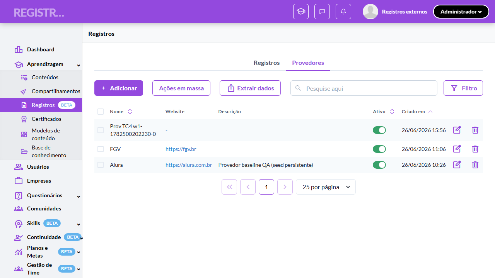
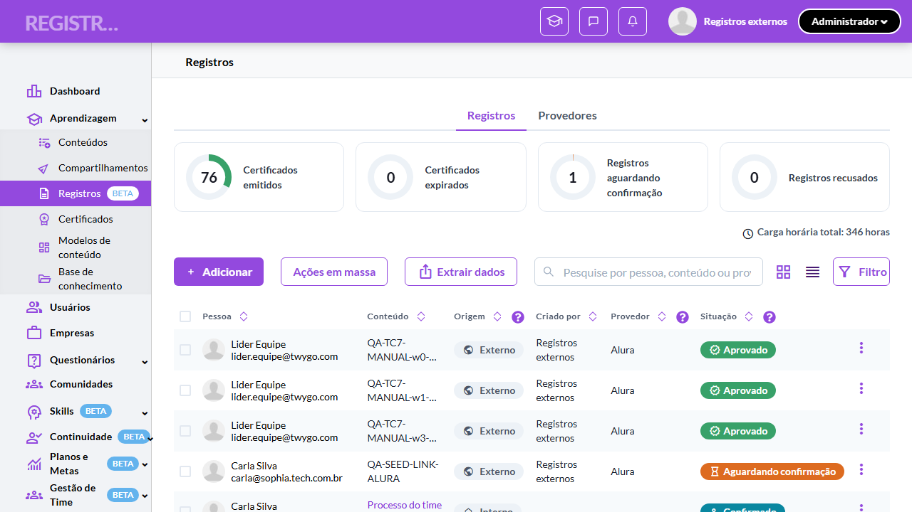
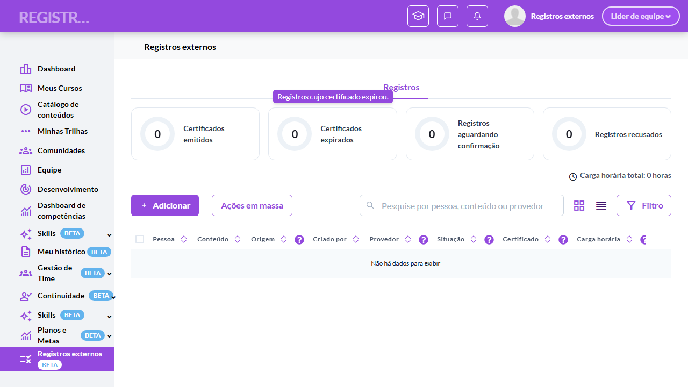

# Casos de teste — Registros de Aprendizagem

[← Voltar ao dashboard](index.md)

Lista detalhada por testsuite. Cada caso traz: o que era esperado pelo XML, quais steps foram executados, evidências (screenshots/trace), texto pronto pra registro de bug e — quando houver falha — uma explicação em PT-BR do motivo.

## Escopo do Líder, pessoas inativadas e origem Compartilhado

_12 caso(s) — 3 aprovado(s), 0 falha(s), 9 ignorado(s)_

### ✅ Aprovado · Validar matriz de escopo Líder vs Admin (lado Admin) 

<a id="validar-matriz-de-escopo-lider-vs-admin-lado-admin"></a>_Arquivo:_ `tc1-matriz-escopo-lider-vs-admin.spec.ts` · _Duração:_ 26.42s · _Browser:_ chromium

**Passos do caso (XML/TestLink + execução Playwright):**

_Cada linha reproduz um passo do XML; a coluna **Status** traz o resultado da execução (do step Allure correspondente). Linhas com "Pré-condição" são da execução automatizada (login, navegação inicial) — não fazem parte do roteiro do XML._

| # | Ação do passo | Resultado esperado | Status | Notas | Duração |
|---|---|---|:---:|---|---:|
| — | _Pré-condição:_ 1. Admin acessa Registros → lista exibe registros de toda a org | — | ✅ | — | 12.02s |
| — | _Pré-condição:_ 4. Admin clica na tab "Provedores" → listagem completa (não filtra por liderado) | — | ✅ | — | 8.11s |

**Evidências:**

📁 _Pasta:_ [`artifacts/projects-registros-externo-3e97f--Líder-vs-Admin-lado-Admin--chromium/`](artifacts/projects-registros-externo-3e97f--Líder-vs-Admin-lado-Admin--chromium/)

- 📸 **Screenshot (screenshot)** — [`test-finished-1.png`](artifacts/projects-registros-externo-3e97f--Líder-vs-Admin-lado-Admin--chromium/test-finished-1.png)

  

- 🎬 [Vídeo da execução (video.webm)](artifacts/projects-registros-externo-3e97f--Líder-vs-Admin-lado-Admin--chromium/video.webm)

- 🎬 [Vídeo da execução (video-1.webm)](artifacts/projects-registros-externo-3e97f--Líder-vs-Admin-lado-Admin--chromium/video-1.webm)

- 📦 **Trace** — [`trace.zip`](artifacts/projects-registros-externo-3e97f--Líder-vs-Admin-lado-Admin--chromium/trace.zip)

  ```bash
  npx playwright show-trace outputs/registros-externos/reports/escopo-do-lider-pessoas-inativadas-e-origem-compartilhado_20260630-143200/artifacts/projects-registros-externo-3e97f--Líder-vs-Admin-lado-Admin--chromium/trace.zip
  ```

- 🎥 **Vídeo** — [`video.webm`](artifacts/projects-registros-externo-3e97f--Líder-vs-Admin-lado-Admin--chromium/video.webm)

- 🎥 **Vídeo** — [`video-1.webm`](artifacts/projects-registros-externo-3e97f--Líder-vs-Admin-lado-Admin--chromium/video-1.webm)


---

### ⊘ Ignorado · Validar escopo restrito do Líder (lista e dropdown Pessoa) 

<a id="validar-escopo-restrito-do-lider-lista-e-dropdown-pessoa"></a>_Arquivo:_ `tc1-matriz-escopo-lider-vs-admin.spec.ts` · _Duração:_ 1.57s · _Browser:_ chromium

> **⊘ Por que foi ignorado:** Marcado para revisão (test.fixme): seed-ausente: ≥2 liderados diretos COM registros sob o líder (team_leader 4301564). Rota /o/{org}/team/records + endpoint /records/stats?in_use_mode_layout=true&team_scope=true confirmados no recon modo-de-uso (corrige recon §9). Destinatário: QA Lead (seed de liderados).

**Passos do caso (XML/TestLink + execução Playwright):**

_Cada linha reproduz um passo do XML; a coluna **Status** traz o resultado da execução (do step Allure correspondente). Linhas com "Pré-condição" são da execução automatizada (login, navegação inicial) — não fazem parte do roteiro do XML._

_Sem steps Allure ou metadata XML para este testcase._

**Evidências:**

📁 _Pasta:_ [`artifacts/projects-registros-externo-d43e7-er-lista-e-dropdown-Pessoa--chromium/`](artifacts/projects-registros-externo-d43e7-er-lista-e-dropdown-Pessoa--chromium/)

- 📸 **Screenshot (screenshot)** — [`test-finished-1.png`](artifacts/projects-registros-externo-d43e7-er-lista-e-dropdown-Pessoa--chromium/test-finished-1.png)

  

- 🎬 [Vídeo da execução (video.webm)](artifacts/projects-registros-externo-d43e7-er-lista-e-dropdown-Pessoa--chromium/video.webm)

- 🎬 [Vídeo da execução (video-1.webm)](artifacts/projects-registros-externo-d43e7-er-lista-e-dropdown-Pessoa--chromium/video-1.webm)

- 📦 **Trace** — [`trace.zip`](artifacts/projects-registros-externo-d43e7-er-lista-e-dropdown-Pessoa--chromium/trace.zip)

  ```bash
  npx playwright show-trace outputs/registros-externos/reports/escopo-do-lider-pessoas-inativadas-e-origem-compartilhado_20260630-143200/artifacts/projects-registros-externo-d43e7-er-lista-e-dropdown-Pessoa--chromium/trace.zip
  ```

- 🎥 **Vídeo** — [`video.webm`](artifacts/projects-registros-externo-d43e7-er-lista-e-dropdown-Pessoa--chromium/video.webm)

- 🎥 **Vídeo** — [`video-1.webm`](artifacts/projects-registros-externo-d43e7-er-lista-e-dropdown-Pessoa--chromium/video-1.webm)

#### ⏳ Pendente — execução automatizada não realizada

- **Severidade do caso (XML):** —
- **Motivo declarado pelo spec:** seed-ausente: ≥2 liderados diretos COM registros sob o líder (team_leader 4301564). Rota /o/{org}/team/records + endpoint /records/stats?in_use_mode_layout=true&team_scope=true confirmados no recon modo-de-uso (corrige recon §9). Destinatário: QA Lead (seed de liderados).
- **Categoria:** _não declarada_ — pra próxima revisão, ajustar o spec para `test.fixme(true, '[Categoria] motivo')` com uma das categorias canônicas (xml-desatualizado | seed-ausente | dep-externa | bloqueio-temporario).

**Roteiro do XML (para validação manual):**
1. — (sem steps documentados no XML)

> Esse caso não bloqueia a build, mas precisa de validação manual ou ajuste no agente.


---

### ⊘ Ignorado · TC10 · Validar permanência de Compartilhados após inativação da org parceira · 🟡 Normal

<a id="validar-permanencia-de-compartilhados-apos-inativacao-da-org-parceira"></a>_Arquivo:_ `tc10-permanencia-compartilhados-apos-inativacao-org.spec.ts` · _Duração:_ 1.49s · _Browser:_ chromium

> **⊘ Por que foi ignorado:** Marcado para revisão (test.fixme): seed-ausente: origem "Compartilhado" / org parceira inexistente (recon: shared_events = 0); além disso o passo 2 inativa uma ORG inteira (destrutivo, difícil reverter). Destinatário: QA Lead/infra (seed) + produto (confirmar política de preservação, Spike S11).

**Sumário (objetivo do caso):** Garantir preservação do histórico do aluno quando a org de origem é inativada (h17 cenário 07 — política do Spike S11, confirmar com produto).

**Pré-condições:**

```
Ambiente Stage configurado e acessível
Funcionalidade "Registros de Aprendizagem" habilitada no contrato da organização
Usuário Líder com liderados diretos definidos na estrutura organizacional (e usuário fora da equipe com registros)
Usuário Admin com acesso a toda a organização
Pessoa inativável com registros conhecidos (ex. 3 Emitidos + 1 Pendente)
Organização parceira com compartilhamento configurado e registros Compartilhados replicados na organização principal
Aluno com vínculo em duas organizações com registros distintos (cenário multi-org)
```

**Passos do caso (XML/TestLink + execução Playwright):**

_Cada linha reproduz um passo do XML; a coluna **Status** traz o resultado da execução (do step Allure correspondente). Linhas com "Pré-condição" são da execução automatizada (login, navegação inicial) — não fazem parte do roteiro do XML._

| # | Ação do passo | Resultado esperado | Status | Notas | Duração |
|---|---|---|:---:|---|---:|
| 1 | Acessar a tela "Aprendizagem > Registros" como Admin da organização receptora com registros Compartilhados da parceira P | Registros Compartilhados visíveis. | ⊘ | Step não executado — Marcado para revisão (test.fixme): seed-ausente: origem "Compartilhado" / org parceira inexistente (recon: shared_events = 0); além disso o passo 2 inativa uma ORG inteira (destrutivo, difícil reverter). Destinatário: QA Lead/infra (seed) + produto (confirmar política de preservação, Spike S11). | — |
| 2 | Inativar a organização parceira P (operação administrativa) | Parceira inativada. | ⊘ | Step não executado — Marcado para revisão (test.fixme): seed-ausente: origem "Compartilhado" / org parceira inexistente (recon: shared_events = 0); além disso o passo 2 inativa uma ORG inteira (destrutivo, difícil reverter). Destinatário: QA Lead/infra (seed) + produto (confirmar política de preservação, Spike S11). | — |
| 3 | Recarregar a lista da organização receptora | Os registros Compartilhados PERMANECEM acessíveis (preservação de histórico do aluno). | ⊘ | Step não executado — Marcado para revisão (test.fixme): seed-ausente: origem "Compartilhado" / org parceira inexistente (recon: shared_events = 0); além disso o passo 2 inativa uma ORG inteira (destrutivo, difícil reverter). Destinatário: QA Lead/infra (seed) + produto (confirmar política de preservação, Spike S11). | — |

**Evidências:**

📁 _Pasta:_ [`artifacts/projects-registros-externo-71fff--inativação-da-org-parceira-chromium/`](artifacts/projects-registros-externo-71fff--inativação-da-org-parceira-chromium/)

- 📸 **Screenshot (screenshot)** — [`test-finished-1.png`](artifacts/projects-registros-externo-71fff--inativação-da-org-parceira-chromium/test-finished-1.png)

  

- 🎬 [Vídeo da execução (video.webm)](artifacts/projects-registros-externo-71fff--inativação-da-org-parceira-chromium/video.webm)

- 🎬 [Vídeo da execução (video-1.webm)](artifacts/projects-registros-externo-71fff--inativação-da-org-parceira-chromium/video-1.webm)

- 📦 **Trace** — [`trace.zip`](artifacts/projects-registros-externo-71fff--inativação-da-org-parceira-chromium/trace.zip)

  ```bash
  npx playwright show-trace outputs/registros-externos/reports/escopo-do-lider-pessoas-inativadas-e-origem-compartilhado_20260630-143200/artifacts/projects-registros-externo-71fff--inativação-da-org-parceira-chromium/trace.zip
  ```

- 🎥 **Vídeo** — [`video.webm`](artifacts/projects-registros-externo-71fff--inativação-da-org-parceira-chromium/video.webm)

- 🎥 **Vídeo** — [`video-1.webm`](artifacts/projects-registros-externo-71fff--inativação-da-org-parceira-chromium/video-1.webm)

#### ⏳ Pendente — execução automatizada não realizada

- **Severidade do caso (XML):** Normal
- **Motivo declarado pelo spec:** seed-ausente: origem "Compartilhado" / org parceira inexistente (recon: shared_events = 0); além disso o passo 2 inativa uma ORG inteira (destrutivo, difícil reverter). Destinatário: QA Lead/infra (seed) + produto (confirmar política de preservação, Spike S11).
- **Categoria:** _não declarada_ — pra próxima revisão, ajustar o spec para `test.fixme(true, '[Categoria] motivo')` com uma das categorias canônicas (xml-desatualizado | seed-ausente | dep-externa | bloqueio-temporario).

**Roteiro do XML (para validação manual):**
1. Pré: Ambiente Stage configurado e acessível
1. Pré: Funcionalidade "Registros de Aprendizagem" habilitada no contrato da organização
1. Pré: Usuário Líder com liderados diretos definidos na estrutura organizacional (e usuário fora da equipe com registros)
1. Pré: Usuário Admin com acesso a toda a organização
1. Pré: Pessoa inativável com registros conhecidos (ex. 3 Emitidos + 1 Pendente)
1. Pré: Organização parceira com compartilhamento configurado e registros Compartilhados replicados na organização principal
1. Pré: Aluno com vínculo em duas organizações com registros distintos (cenário multi-org)
1. 1. Acessar a tela "Aprendizagem > Registros" como Admin da organização receptora com registros Compartilhados da parceira P
1. 2. Inativar a organização parceira P (operação administrativa)
1. 3. Recarregar a lista da organização receptora

> Esse caso não bloqueia a build, mas precisa de validação manual ou ajuste no agente.


---

### ⊘ Ignorado · TC2 · Validar 403 e toast ao atuar fora do escopo do Líder · 🔴 Crítico

<a id="validar-403-e-toast-ao-atuar-fora-do-escopo-do-lider"></a>_Arquivo:_ `tc2-403-toast-fora-do-escopo-lider.spec.ts` · _Duração:_ 1.44s · _Browser:_ chromium

> **⊘ Por que foi ignorado:** Marcado para revisão (test.fixme): seed-ausente: liderado + pessoa fora da equipe (cada um com registro) e rota de aprovação a confirmar via recon de API. Escopo de Líder confirmado existente (corrige recon §9). Destinatário: QA Lead (seed) + recon de API de ação.

**Sumário (objetivo do caso):** Garantir validação de escopo no submit: Líder atuando sobre registro de não-liderado recebe 403 com toast (RN 94).

**Pré-condições:**

```
Ambiente Stage configurado e acessível
Funcionalidade "Registros de Aprendizagem" habilitada no contrato da organização
Usuário Líder com liderados diretos definidos na estrutura organizacional (e usuário fora da equipe com registros)
Usuário Admin com acesso a toda a organização
Pessoa inativável com registros conhecidos (ex. 3 Emitidos + 1 Pendente)
Organização parceira com compartilhamento configurado e registros Compartilhados replicados na organização principal
Aluno com vínculo em duas organizações com registros distintos (cenário multi-org)
```

**Passos do caso (XML/TestLink + execução Playwright):**

_Cada linha reproduz um passo do XML; a coluna **Status** traz o resultado da execução (do step Allure correspondente). Linhas com "Pré-condição" são da execução automatizada (login, navegação inicial) — não fazem parte do roteiro do XML._

| # | Ação do passo | Resultado esperado | Status | Notas | Duração |
|---|---|---|:---:|---|---:|
| 1 | Enviar request de aprovação como Líder para um registro de pessoa fora da sua equipe (via API direta, simulando bypass do front) | Resposta HTTP 403. | ⊘ | Step não executado — Marcado para revisão (test.fixme): seed-ausente: liderado + pessoa fora da equipe (cada um com registro) e rota de aprovação a confirmar via recon de API. Escopo de Líder confirmado existente (corrige recon §9). Destinatário: QA Lead (seed) + recon de API de ação. | — |
| 2 | Verificar o toast "Sem permissão pra atuar nesse registro" exibido pelo front ao receber 403 em uma ação de avaliação | Toast vermelho exibida: "Sem permissão pra atuar nesse registro"; registro permanece inalterado. | ⊘ | Step não executado — Marcado para revisão (test.fixme): seed-ausente: liderado + pessoa fora da equipe (cada um com registro) e rota de aprovação a confirmar via recon de API. Escopo de Líder confirmado existente (corrige recon §9). Destinatário: QA Lead (seed) + recon de API de ação. | — |

**Evidências:**

📁 _Pasta:_ [`artifacts/projects-registros-externo-9107f-uar-fora-do-escopo-do-Líder-chromium/`](artifacts/projects-registros-externo-9107f-uar-fora-do-escopo-do-Líder-chromium/)

- 📸 **Screenshot (screenshot)** — [`test-finished-1.png`](artifacts/projects-registros-externo-9107f-uar-fora-do-escopo-do-Líder-chromium/test-finished-1.png)

  

- 🎬 [Vídeo da execução (video.webm)](artifacts/projects-registros-externo-9107f-uar-fora-do-escopo-do-Líder-chromium/video.webm)

- 🎬 [Vídeo da execução (video-1.webm)](artifacts/projects-registros-externo-9107f-uar-fora-do-escopo-do-Líder-chromium/video-1.webm)

- 📦 **Trace** — [`trace.zip`](artifacts/projects-registros-externo-9107f-uar-fora-do-escopo-do-Líder-chromium/trace.zip)

  ```bash
  npx playwright show-trace outputs/registros-externos/reports/escopo-do-lider-pessoas-inativadas-e-origem-compartilhado_20260630-143200/artifacts/projects-registros-externo-9107f-uar-fora-do-escopo-do-Líder-chromium/trace.zip
  ```

- 🎥 **Vídeo** — [`video.webm`](artifacts/projects-registros-externo-9107f-uar-fora-do-escopo-do-Líder-chromium/video.webm)

- 🎥 **Vídeo** — [`video-1.webm`](artifacts/projects-registros-externo-9107f-uar-fora-do-escopo-do-Líder-chromium/video-1.webm)

#### ⏳ Pendente — execução automatizada não realizada

- **Severidade do caso (XML):** Crítico
- **Motivo declarado pelo spec:** seed-ausente: liderado + pessoa fora da equipe (cada um com registro) e rota de aprovação a confirmar via recon de API. Escopo de Líder confirmado existente (corrige recon §9). Destinatário: QA Lead (seed) + recon de API de ação.
- **Categoria:** _não declarada_ — pra próxima revisão, ajustar o spec para `test.fixme(true, '[Categoria] motivo')` com uma das categorias canônicas (xml-desatualizado | seed-ausente | dep-externa | bloqueio-temporario).

**Roteiro do XML (para validação manual):**
1. Pré: Ambiente Stage configurado e acessível
1. Pré: Funcionalidade "Registros de Aprendizagem" habilitada no contrato da organização
1. Pré: Usuário Líder com liderados diretos definidos na estrutura organizacional (e usuário fora da equipe com registros)
1. Pré: Usuário Admin com acesso a toda a organização
1. Pré: Pessoa inativável com registros conhecidos (ex. 3 Emitidos + 1 Pendente)
1. Pré: Organização parceira com compartilhamento configurado e registros Compartilhados replicados na organização principal
1. Pré: Aluno com vínculo em duas organizações com registros distintos (cenário multi-org)
1. 1. Enviar request de aprovação como Líder para um registro de pessoa fora da sua equipe (via API direta, simulando bypass do front)
1. 2. Verificar o toast "Sem permissão pra atuar nesse registro" exibido pelo front ao receber 403 em uma ação de avaliação

> Esse caso não bloqueia a build, mas precisa de validação manual ou ajuste no agente.


---

### ⊘ Ignorado · TC3 · Validar preservação de ações antigas após mudança de hierarquia · 🔴 Crítico

<a id="validar-preservacao-de-acoes-antigas-apos-mudanca-de-hierarquia"></a>_Arquivo:_ `tc3-preservacao-acoes-apos-mudanca-hierarquia.spec.ts` · _Duração:_ 1.29s · _Browser:_ chromium

> **⊘ Por que foi ignorado:** Marcado para revisão (test.fixme): seed-ausente: liderado com registro aprovável + ação de remover liderado da equipe (/team_leaders/4301564/users) a validar/reverter. Visão de time confirmada existente (corrige recon §9). Destinatário: QA Lead (seed + reversibilidade).

**Sumário (objetivo do caso):** Garantir que registros já aprovados pelo Líder continuam válidos após ele perder o liderado (RN 95).

**Pré-condições:**

```
Ambiente Stage configurado e acessível
Funcionalidade "Registros de Aprendizagem" habilitada no contrato da organização
Usuário Líder com liderados diretos definidos na estrutura organizacional (e usuário fora da equipe com registros)
Usuário Admin com acesso a toda a organização
Pessoa inativável com registros conhecidos (ex. 3 Emitidos + 1 Pendente)
Organização parceira com compartilhamento configurado e registros Compartilhados replicados na organização principal
Aluno com vínculo em duas organizações com registros distintos (cenário multi-org)
```

**Passos do caso (XML/TestLink + execução Playwright):**

_Cada linha reproduz um passo do XML; a coluna **Status** traz o resultado da execução (do step Allure correspondente). Linhas com "Pré-condição" são da execução automatizada (login, navegação inicial) — não fazem parte do roteiro do XML._

| # | Ação do passo | Resultado esperado | Status | Notas | Duração |
|---|---|---|:---:|---|---:|
| 1 | Aprovar um registro de um liderado como Líder | Toast "Registro aprovado"; registro fica Emitido. | ⊘ | Step não executado — Marcado para revisão (test.fixme): seed-ausente: liderado com registro aprovável + ação de remover liderado da equipe (/team_leaders/4301564/users) a validar/reverter. Visão de time confirmada existente (corrige recon §9). Destinatário: QA Lead (seed + reversibilidade). | — |
| 2 | Remover o liderado da equipe do Líder via estrutura organizacional | Operação concluída. | ⊘ | Step não executado — Marcado para revisão (test.fixme): seed-ausente: liderado com registro aprovável + ação de remover liderado da equipe (/team_leaders/4301564/users) a validar/reverter. Visão de time confirmada existente (corrige recon §9). Destinatário: QA Lead (seed + reversibilidade). | — |
| 3 | Acessar a lista como Admin e localizar o registro aprovado | Registro permanece Emitido/Aprovado (a aprovação antiga não é revertida). | ⊘ | Step não executado — Marcado para revisão (test.fixme): seed-ausente: liderado com registro aprovável + ação de remover liderado da equipe (/team_leaders/4301564/users) a validar/reverter. Visão de time confirmada existente (corrige recon §9). Destinatário: QA Lead (seed + reversibilidade). | — |
| 4 | Acessar a lista como Líder | Registro não aparece mais na lista do Líder (perdeu capacidade de novas ações sobre a pessoa). | ⊘ | Step não executado — Marcado para revisão (test.fixme): seed-ausente: liderado com registro aprovável + ação de remover liderado da equipe (/team_leaders/4301564/users) a validar/reverter. Visão de time confirmada existente (corrige recon §9). Destinatário: QA Lead (seed + reversibilidade). | — |

**Evidências:**

📁 _Pasta:_ [`artifacts/projects-registros-externo-73957--após-mudança-de-hierarquia-chromium/`](artifacts/projects-registros-externo-73957--após-mudança-de-hierarquia-chromium/)

- 📸 **Screenshot (screenshot)** — [`test-finished-1.png`](artifacts/projects-registros-externo-73957--após-mudança-de-hierarquia-chromium/test-finished-1.png)

  

- 🎬 [Vídeo da execução (video.webm)](artifacts/projects-registros-externo-73957--após-mudança-de-hierarquia-chromium/video.webm)

- 🎬 [Vídeo da execução (video-1.webm)](artifacts/projects-registros-externo-73957--após-mudança-de-hierarquia-chromium/video-1.webm)

- 📦 **Trace** — [`trace.zip`](artifacts/projects-registros-externo-73957--após-mudança-de-hierarquia-chromium/trace.zip)

  ```bash
  npx playwright show-trace outputs/registros-externos/reports/escopo-do-lider-pessoas-inativadas-e-origem-compartilhado_20260630-143200/artifacts/projects-registros-externo-73957--após-mudança-de-hierarquia-chromium/trace.zip
  ```

- 🎥 **Vídeo** — [`video.webm`](artifacts/projects-registros-externo-73957--após-mudança-de-hierarquia-chromium/video.webm)

- 🎥 **Vídeo** — [`video-1.webm`](artifacts/projects-registros-externo-73957--após-mudança-de-hierarquia-chromium/video-1.webm)

#### ⏳ Pendente — execução automatizada não realizada

- **Severidade do caso (XML):** Crítico
- **Motivo declarado pelo spec:** seed-ausente: liderado com registro aprovável + ação de remover liderado da equipe (/team_leaders/4301564/users) a validar/reverter. Visão de time confirmada existente (corrige recon §9). Destinatário: QA Lead (seed + reversibilidade).
- **Categoria:** _não declarada_ — pra próxima revisão, ajustar o spec para `test.fixme(true, '[Categoria] motivo')` com uma das categorias canônicas (xml-desatualizado | seed-ausente | dep-externa | bloqueio-temporario).

**Roteiro do XML (para validação manual):**
1. Pré: Ambiente Stage configurado e acessível
1. Pré: Funcionalidade "Registros de Aprendizagem" habilitada no contrato da organização
1. Pré: Usuário Líder com liderados diretos definidos na estrutura organizacional (e usuário fora da equipe com registros)
1. Pré: Usuário Admin com acesso a toda a organização
1. Pré: Pessoa inativável com registros conhecidos (ex. 3 Emitidos + 1 Pendente)
1. Pré: Organização parceira com compartilhamento configurado e registros Compartilhados replicados na organização principal
1. Pré: Aluno com vínculo em duas organizações com registros distintos (cenário multi-org)
1. 1. Aprovar um registro de um liderado como Líder
1. 2. Remover o liderado da equipe do Líder via estrutura organizacional
1. 3. Acessar a lista como Admin e localizar o registro aprovado
1. 4. Acessar a lista como Líder

> Esse caso não bloqueia a build, mas precisa de validação manual ou ajuste no agente.


---

### ⊘ Ignorado · TC4 · Validar sumiço completo de pessoas inativadas · 🔴 Crítico

<a id="validar-sumico-completo-de-pessoas-inativadas"></a>_Arquivo:_ `tc4-sumico-pessoas-inativadas.spec.ts` · _Duração:_ 1.51s · _Browser:_ chromium

> **⊘ Por que foi ignorado:** Marcado para revisão (test.fixme): seed-ausente: pessoa inativável com distribuição conhecida (ex. 3 Emitidos + 1 Pendente) e rota da admin de usuários a confirmar (/professionals veio vazio). Destinatário: QA Lead (seed).

**Sumário (objetivo do caso):** Garantir que registros de pessoa inativada somem do KPI, da lista e da extração, sem toggle de exibição (RN 96).

**Pré-condições:**

```
Ambiente Stage configurado e acessível
Funcionalidade "Registros de Aprendizagem" habilitada no contrato da organização
Usuário Líder com liderados diretos definidos na estrutura organizacional (e usuário fora da equipe com registros)
Usuário Admin com acesso a toda a organização
Pessoa inativável com registros conhecidos (ex. 3 Emitidos + 1 Pendente)
Organização parceira com compartilhamento configurado e registros Compartilhados replicados na organização principal
Aluno com vínculo em duas organizações com registros distintos (cenário multi-org)
```

**Passos do caso (XML/TestLink + execução Playwright):**

_Cada linha reproduz um passo do XML; a coluna **Status** traz o resultado da execução (do step Allure correspondente). Linhas com "Pré-condição" são da execução automatizada (login, navegação inicial) — não fazem parte do roteiro do XML._

| # | Ação do passo | Resultado esperado | Status | Notas | Duração |
|---|---|---|:---:|---|---:|
| 1 | Acessar a tela "Aprendizagem > Registros" como Admin e anotar KPIs e a presença dos registros da pessoa-alvo (ex: 3 Emitidos + 1 Pendente) | Registros visíveis; KPIs contabilizam. | ⊘ | Step não executado — Marcado para revisão (test.fixme): seed-ausente: pessoa inativável com distribuição conhecida (ex. 3 Emitidos + 1 Pendente) e rota da admin de usuários a confirmar (/professionals veio vazio). Destinatário: QA Lead (seed). | — |
| 2 | Inativar a pessoa na administração de usuários da organização | Pessoa inativada com sucesso. | ⊘ | Step não executado — Marcado para revisão (test.fixme): seed-ausente: pessoa inativável com distribuição conhecida (ex. 3 Emitidos + 1 Pendente) e rota da admin de usuários a confirmar (/professionals veio vazio). Destinatário: QA Lead (seed). | — |
| 3 | Recarregar a tela "Aprendizagem > Registros" | KPIs decrementados (-3 Emitidos, -1 Pendentes); registros da pessoa não aparecem na lista; busca pelo nome retorna "Nenhum registro encontrado". | ⊘ | Step não executado — Marcado para revisão (test.fixme): seed-ausente: pessoa inativável com distribuição conhecida (ex. 3 Emitidos + 1 Pendente) e rota da admin de usuários a confirmar (/professionals veio vazio). Destinatário: QA Lead (seed). | — |
| 4 | Verificar a interface por um eventual filtro "mostrar inativos" | Nenhum toggle de exibição de inativos existe (regra silenciosa). | ⊘ | Step não executado — Marcado para revisão (test.fixme): seed-ausente: pessoa inativável com distribuição conhecida (ex. 3 Emitidos + 1 Pendente) e rota da admin de usuários a confirmar (/professionals veio vazio). Destinatário: QA Lead (seed). | — |
| 5 | Disparar extração de Dados CSV com escopo "Todos" e conferir o pacote (etapa manual) | Registros da pessoa inativada NÃO constam no arquivo extraído. | ⊘ | Step não executado — Marcado para revisão (test.fixme): seed-ausente: pessoa inativável com distribuição conhecida (ex. 3 Emitidos + 1 Pendente) e rota da admin de usuários a confirmar (/professionals veio vazio). Destinatário: QA Lead (seed). | — |

**Evidências:**

📁 _Pasta:_ [`artifacts/projects-registros-externo-06add-pleto-de-pessoas-inativadas-chromium/`](artifacts/projects-registros-externo-06add-pleto-de-pessoas-inativadas-chromium/)

- 📸 **Screenshot (screenshot)** — [`test-finished-1.png`](artifacts/projects-registros-externo-06add-pleto-de-pessoas-inativadas-chromium/test-finished-1.png)

  

- 🎬 [Vídeo da execução (video.webm)](artifacts/projects-registros-externo-06add-pleto-de-pessoas-inativadas-chromium/video.webm)

- 🎬 [Vídeo da execução (video-1.webm)](artifacts/projects-registros-externo-06add-pleto-de-pessoas-inativadas-chromium/video-1.webm)

- 📦 **Trace** — [`trace.zip`](artifacts/projects-registros-externo-06add-pleto-de-pessoas-inativadas-chromium/trace.zip)

  ```bash
  npx playwright show-trace outputs/registros-externos/reports/escopo-do-lider-pessoas-inativadas-e-origem-compartilhado_20260630-143200/artifacts/projects-registros-externo-06add-pleto-de-pessoas-inativadas-chromium/trace.zip
  ```

- 🎥 **Vídeo** — [`video.webm`](artifacts/projects-registros-externo-06add-pleto-de-pessoas-inativadas-chromium/video.webm)

- 🎥 **Vídeo** — [`video-1.webm`](artifacts/projects-registros-externo-06add-pleto-de-pessoas-inativadas-chromium/video-1.webm)

#### ⏳ Pendente — execução automatizada não realizada

- **Severidade do caso (XML):** Crítico
- **Motivo declarado pelo spec:** seed-ausente: pessoa inativável com distribuição conhecida (ex. 3 Emitidos + 1 Pendente) e rota da admin de usuários a confirmar (/professionals veio vazio). Destinatário: QA Lead (seed).
- **Categoria:** _não declarada_ — pra próxima revisão, ajustar o spec para `test.fixme(true, '[Categoria] motivo')` com uma das categorias canônicas (xml-desatualizado | seed-ausente | dep-externa | bloqueio-temporario).

**Roteiro do XML (para validação manual):**
1. Pré: Ambiente Stage configurado e acessível
1. Pré: Funcionalidade "Registros de Aprendizagem" habilitada no contrato da organização
1. Pré: Usuário Líder com liderados diretos definidos na estrutura organizacional (e usuário fora da equipe com registros)
1. Pré: Usuário Admin com acesso a toda a organização
1. Pré: Pessoa inativável com registros conhecidos (ex. 3 Emitidos + 1 Pendente)
1. Pré: Organização parceira com compartilhamento configurado e registros Compartilhados replicados na organização principal
1. Pré: Aluno com vínculo em duas organizações com registros distintos (cenário multi-org)
1. 1. Acessar a tela "Aprendizagem > Registros" como Admin e anotar KPIs e a presença dos registros da pessoa-alvo (ex: 3 Emitidos + 1 Pendente)
1. 2. Inativar a pessoa na administração de usuários da organização
1. 3. Recarregar a tela "Aprendizagem > Registros"
1. 4. Verificar a interface por um eventual filtro "mostrar inativos"
1. 5. Disparar extração de Dados CSV com escopo "Todos" e conferir o pacote (etapa manual)

> Esse caso não bloqueia a build, mas precisa de validação manual ou ajuste no agente.


---

### ✅ Aprovado · TC5 · Validar coerência permanente entre KPI e lista · 🔴 Crítico

<a id="validar-coerencia-permanente-entre-kpi-e-lista"></a>_Arquivo:_ `tc5-coerencia-kpi-x-lista.spec.ts` · _Duração:_ 21.68s · _Browser:_ chromium

**Sumário (objetivo do caso):** Garantir que o mesmo critério de pessoa ativa + escopo + soft-delete vale para /stats e /list — número do card bate com as linhas (RN 96.5).

**Pré-condições:**

```
Ambiente Stage configurado e acessível
Funcionalidade "Registros de Aprendizagem" habilitada no contrato da organização
Usuário Líder com liderados diretos definidos na estrutura organizacional (e usuário fora da equipe com registros)
Usuário Admin com acesso a toda a organização
Pessoa inativável com registros conhecidos (ex. 3 Emitidos + 1 Pendente)
Organização parceira com compartilhamento configurado e registros Compartilhados replicados na organização principal
Aluno com vínculo em duas organizações com registros distintos (cenário multi-org)
```

**Passos do caso (XML/TestLink + execução Playwright):**

_Cada linha reproduz um passo do XML; a coluna **Status** traz o resultado da execução (do step Allure correspondente). Linhas com "Pré-condição" são da execução automatizada (login, navegação inicial) — não fazem parte do roteiro do XML._

| # | Ação do passo | Resultado esperado | Status | Notas | Duração |
|---|---|---|:---:|---|---:|
| — | _Pré-condição:_ 2a. total_general de /records/stats é a fonte de verdade do KPI | — | ✅ | — | 0.56s |
| — | _Pré-condição:_ 2b. Total da listagem (API, todas as páginas) == total_general (invariante KPI×lista, RN 96.5) | — | ✅ | — | 0.56s |
| — | _Pré-condição:_ 2c. Cross-check de UI (best-effort): 1ª página renderiza linhas coerentes | — | ✅ | — | 0.07s |
| 1 | Acessar a tela "Aprendizagem > Registros" como Admin e somar as contagens dos 4 KPI cards mais os status sem card (via filtros) | Total geral calculado. | ✅ | — | 10.89s |
| 2 | Comparar com o total de linhas da lista sem filtros (somando a paginação) | Número de linhas é exatamente igual ao total geral dos KPIs — nenhuma divergência. | ✅ | — | — |
| 3 | Repetir a comparação logado como Líder | Contagens do Líder também batem exatamente com as linhas visíveis do seu escopo. | ✅ | — | — |

**Evidências:**

📁 _Pasta:_ [`artifacts/projects-registros-externo-591a3-ermanente-entre-KPI-e-lista-chromium/`](artifacts/projects-registros-externo-591a3-ermanente-entre-KPI-e-lista-chromium/)

- 📸 **Screenshot (screenshot)** — [`test-finished-1.png`](artifacts/projects-registros-externo-591a3-ermanente-entre-KPI-e-lista-chromium/test-finished-1.png)

  

- 🎬 [Vídeo da execução (video.webm)](artifacts/projects-registros-externo-591a3-ermanente-entre-KPI-e-lista-chromium/video.webm)

- 🎬 [Vídeo da execução (video-1.webm)](artifacts/projects-registros-externo-591a3-ermanente-entre-KPI-e-lista-chromium/video-1.webm)

- 📦 **Trace** — [`trace.zip`](artifacts/projects-registros-externo-591a3-ermanente-entre-KPI-e-lista-chromium/trace.zip)

  ```bash
  npx playwright show-trace outputs/registros-externos/reports/escopo-do-lider-pessoas-inativadas-e-origem-compartilhado_20260630-143200/artifacts/projects-registros-externo-591a3-ermanente-entre-KPI-e-lista-chromium/trace.zip
  ```

- 🎥 **Vídeo** — [`video.webm`](artifacts/projects-registros-externo-591a3-ermanente-entre-KPI-e-lista-chromium/video.webm)

- 🎥 **Vídeo** — [`video-1.webm`](artifacts/projects-registros-externo-591a3-ermanente-entre-KPI-e-lista-chromium/video-1.webm)


---

### ✅ Aprovado · Validar coerência KPI × lista no escopo do Líder 

<a id="validar-coerencia-kpi-lista-no-escopo-do-lider"></a>_Arquivo:_ `tc5-coerencia-kpi-x-lista.spec.ts` · _Duração:_ 37.10s · _Browser:_ chromium

**Passos do caso (XML/TestLink + execução Playwright):**

_Cada linha reproduz um passo do XML; a coluna **Status** traz o resultado da execução (do step Allure correspondente). Linhas com "Pré-condição" são da execução automatizada (login, navegação inicial) — não fazem parte do roteiro do XML._

| # | Ação do passo | Resultado esperado | Status | Notas | Duração |
|---|---|---|:---:|---|---:|
| — | _Pré-condição:_ 1. Ler o total geral do Admin (org inteira) como referência de escopo | — | ✅ | — | 12.71s |
| — | _Pré-condição:_ 2. Abrir "Gestão de Time > Registros" e ler o /stats escopado ao time | — | ✅ | — | 16.83s |
| — | _Pré-condição:_ 3a. O escopo do Líder é um SUBCONJUNTO da org (prova de escopo, RN 93) | — | ✅ | — | 0.00s |
| — | _Pré-condição:_ 3b. Coerência KPI × lista dentro do escopo do Líder (RN 96.5) | — | ✅ | — | 0.07s |

**Evidências:**

📁 _Pasta:_ [`artifacts/projects-registros-externo-a81f1--×-lista-no-escopo-do-Líder-chromium/`](artifacts/projects-registros-externo-a81f1--×-lista-no-escopo-do-Líder-chromium/)

- 📸 **Screenshot (screenshot)** — [`test-finished-1.png`](artifacts/projects-registros-externo-a81f1--×-lista-no-escopo-do-Líder-chromium/test-finished-1.png)

  

- 🎬 [Vídeo da execução (video.webm)](artifacts/projects-registros-externo-a81f1--×-lista-no-escopo-do-Líder-chromium/video.webm)

- 🎬 [Vídeo da execução (video-1.webm)](artifacts/projects-registros-externo-a81f1--×-lista-no-escopo-do-Líder-chromium/video-1.webm)

- 📦 **Trace** — [`trace.zip`](artifacts/projects-registros-externo-a81f1--×-lista-no-escopo-do-Líder-chromium/trace.zip)

  ```bash
  npx playwright show-trace outputs/registros-externos/reports/escopo-do-lider-pessoas-inativadas-e-origem-compartilhado_20260630-143200/artifacts/projects-registros-externo-a81f1--×-lista-no-escopo-do-Líder-chromium/trace.zip
  ```

- 🎥 **Vídeo** — [`video.webm`](artifacts/projects-registros-externo-a81f1--×-lista-no-escopo-do-Líder-chromium/video.webm)

- 🎥 **Vídeo** — [`video-1.webm`](artifacts/projects-registros-externo-a81f1--×-lista-no-escopo-do-Líder-chromium/video-1.webm)


---

### ⊘ Ignorado · TC6 · Validar apresentação e menu restrito de registros Compartilhados · 🔴 Crítico

<a id="validar-apresentacao-e-menu-restrito-de-registros-compartilhados"></a>_Arquivo:_ `tc6-apresentacao-menu-restrito-compartilhado.spec.ts` · _Duração:_ 1.76s · _Browser:_ chromium

> **⊘ Por que foi ignorado:** Marcado para revisão (test.fixme): seed-ausente: origem "Compartilhado" inexistente — recon modo-de-uso confirmou granted/received_shared_events = 0 e badges só external/internal. Exige org parceira + compartilhamento de registro replicado. Destinatário: QA Lead/infra (seed de compartilhamento).

**Sumário (objetivo do caso):** Garantir chip "Compartilhado", menu com apenas Visualizar + Histórico e ausência de Evidências (RN 97, 98).

**Pré-condições:**

```
Ambiente Stage configurado e acessível
Funcionalidade "Registros de Aprendizagem" habilitada no contrato da organização
Usuário Líder com liderados diretos definidos na estrutura organizacional (e usuário fora da equipe com registros)
Usuário Admin com acesso a toda a organização
Pessoa inativável com registros conhecidos (ex. 3 Emitidos + 1 Pendente)
Organização parceira com compartilhamento configurado e registros Compartilhados replicados na organização principal
Aluno com vínculo em duas organizações com registros distintos (cenário multi-org)
```

**Passos do caso (XML/TestLink + execução Playwright):**

_Cada linha reproduz um passo do XML; a coluna **Status** traz o resultado da execução (do step Allure correspondente). Linhas com "Pré-condição" são da execução automatizada (login, navegação inicial) — não fazem parte do roteiro do XML._

| # | Ação do passo | Resultado esperado | Status | Notas | Duração |
|---|---|---|:---:|---|---:|
| 1 | Acessar a tela "Aprendizagem > Registros" como Admin e localizar um registro Compartilhado | Linha exibe chip "Compartilhado" na coluna Origem. | ⊘ | Step não executado — Marcado para revisão (test.fixme): seed-ausente: origem "Compartilhado" inexistente — recon modo-de-uso confirmou granted/received_shared_events = 0 e badges só external/internal. Exige org parceira + compartilhamento de registro replicado. Destinatário: QA Lead/infra (seed de compartilhamento). | — |
| 2 | Clicar no menu 3 pontos do registro Compartilhado | Menu exibe APENAS "Visualizar" e "Histórico"; itens "Editar", "Avaliar", "Excluir" e "Evidências" NÃO são renderizados. | ⊘ | Step não executado — Marcado para revisão (test.fixme): seed-ausente: origem "Compartilhado" inexistente — recon modo-de-uso confirmou granted/received_shared_events = 0 e badges só external/internal. Exige org parceira + compartilhamento de registro replicado. Destinatário: QA Lead/infra (seed de compartilhamento). | — |
| 3 | Clicar no item "Visualizar" | Tela standalone do certificado abre em nova aba. | ⊘ | Step não executado — Marcado para revisão (test.fixme): seed-ausente: origem "Compartilhado" inexistente — recon modo-de-uso confirmou granted/received_shared_events = 0 e badges só external/internal. Exige org parceira + compartilhamento de registro replicado. Destinatário: QA Lead/infra (seed de compartilhamento). | — |
| 4 | Clicar no item "Histórico" do registro Compartilhado | Drawer abre com a trilha contendo apenas o evento "criado". | ⊘ | Step não executado — Marcado para revisão (test.fixme): seed-ausente: origem "Compartilhado" inexistente — recon modo-de-uso confirmou granted/received_shared_events = 0 e badges só external/internal. Exige org parceira + compartilhamento de registro replicado. Destinatário: QA Lead/infra (seed de compartilhamento). | — |

**Evidências:**

📁 _Pasta:_ [`artifacts/projects-registros-externo-164e5-de-registros-Compartilhados-chromium/`](artifacts/projects-registros-externo-164e5-de-registros-Compartilhados-chromium/)

- 📸 **Screenshot (screenshot)** — [`test-finished-1.png`](artifacts/projects-registros-externo-164e5-de-registros-Compartilhados-chromium/test-finished-1.png)

  

- 🎬 [Vídeo da execução (video.webm)](artifacts/projects-registros-externo-164e5-de-registros-Compartilhados-chromium/video.webm)

- 🎬 [Vídeo da execução (video-1.webm)](artifacts/projects-registros-externo-164e5-de-registros-Compartilhados-chromium/video-1.webm)

- 📦 **Trace** — [`trace.zip`](artifacts/projects-registros-externo-164e5-de-registros-Compartilhados-chromium/trace.zip)

  ```bash
  npx playwright show-trace outputs/registros-externos/reports/escopo-do-lider-pessoas-inativadas-e-origem-compartilhado_20260630-143200/artifacts/projects-registros-externo-164e5-de-registros-Compartilhados-chromium/trace.zip
  ```

- 🎥 **Vídeo** — [`video.webm`](artifacts/projects-registros-externo-164e5-de-registros-Compartilhados-chromium/video.webm)

- 🎥 **Vídeo** — [`video-1.webm`](artifacts/projects-registros-externo-164e5-de-registros-Compartilhados-chromium/video-1.webm)

#### ⏳ Pendente — execução automatizada não realizada

- **Severidade do caso (XML):** Crítico
- **Motivo declarado pelo spec:** seed-ausente: origem "Compartilhado" inexistente — recon modo-de-uso confirmou granted/received_shared_events = 0 e badges só external/internal. Exige org parceira + compartilhamento de registro replicado. Destinatário: QA Lead/infra (seed de compartilhamento).
- **Categoria:** _não declarada_ — pra próxima revisão, ajustar o spec para `test.fixme(true, '[Categoria] motivo')` com uma das categorias canônicas (xml-desatualizado | seed-ausente | dep-externa | bloqueio-temporario).

**Roteiro do XML (para validação manual):**
1. Pré: Ambiente Stage configurado e acessível
1. Pré: Funcionalidade "Registros de Aprendizagem" habilitada no contrato da organização
1. Pré: Usuário Líder com liderados diretos definidos na estrutura organizacional (e usuário fora da equipe com registros)
1. Pré: Usuário Admin com acesso a toda a organização
1. Pré: Pessoa inativável com registros conhecidos (ex. 3 Emitidos + 1 Pendente)
1. Pré: Organização parceira com compartilhamento configurado e registros Compartilhados replicados na organização principal
1. Pré: Aluno com vínculo em duas organizações com registros distintos (cenário multi-org)
1. 1. Acessar a tela "Aprendizagem > Registros" como Admin e localizar um registro Compartilhado
1. 2. Clicar no menu 3 pontos do registro Compartilhado
1. 3. Clicar no item "Visualizar"
1. 4. Clicar no item "Histórico" do registro Compartilhado

> Esse caso não bloqueia a build, mas precisa de validação manual ou ajuste no agente.


---

### ⊘ Ignorado · TC7 · Validar bloqueio de modificação de Compartilhado via API (403) · 🔴 Crítico

<a id="validar-bloqueio-de-modificacao-de-compartilhado-via-api-403"></a>_Arquivo:_ `tc7-bloqueio-modificacao-compartilhado-api.spec.ts` · _Duração:_ 1.81s · _Browser:_ chromium

> **⊘ Por que foi ignorado:** Marcado para revisão (test.fixme): seed-ausente: nenhum registro origem "Compartilhado" na org (recon modo-de-uso: shared_events = 0) → sem id para exercer PATCH/DELETE. Destinatário: QA Lead/infra (seed de compartilhamento).

**Sumário (objetivo do caso):** Garantir que tentativas de edição/exclusão de registro Compartilhado via API direta retornam 403 (RN 98.1 — h17 cenário 06).

**Pré-condições:**

```
Ambiente Stage configurado e acessível
Funcionalidade "Registros de Aprendizagem" habilitada no contrato da organização
Usuário Líder com liderados diretos definidos na estrutura organizacional (e usuário fora da equipe com registros)
Usuário Admin com acesso a toda a organização
Pessoa inativável com registros conhecidos (ex. 3 Emitidos + 1 Pendente)
Organização parceira com compartilhamento configurado e registros Compartilhados replicados na organização principal
Aluno com vínculo em duas organizações com registros distintos (cenário multi-org)
```

**Passos do caso (XML/TestLink + execução Playwright):**

_Cada linha reproduz um passo do XML; a coluna **Status** traz o resultado da execução (do step Allure correspondente). Linhas com "Pré-condição" são da execução automatizada (login, navegação inicial) — não fazem parte do roteiro do XML._

| # | Ação do passo | Resultado esperado | Status | Notas | Duração |
|---|---|---|:---:|---|---:|
| 1 | Enviar request PATCH de edição para um registro Compartilhado como Admin da organização receptora | Resposta HTTP 403; registro permanece inalterado. | ⊘ | Step não executado — Marcado para revisão (test.fixme): seed-ausente: nenhum registro origem "Compartilhado" na org (recon modo-de-uso: shared_events = 0) → sem id para exercer PATCH/DELETE. Destinatário: QA Lead/infra (seed de compartilhamento). | — |
| 2 | Enviar request DELETE para o mesmo registro | Resposta HTTP 403. | ⊘ | Step não executado — Marcado para revisão (test.fixme): seed-ausente: nenhum registro origem "Compartilhado" na org (recon modo-de-uso: shared_events = 0) → sem id para exercer PATCH/DELETE. Destinatário: QA Lead/infra (seed de compartilhamento). | — |

**Evidências:**

📁 _Pasta:_ [`artifacts/projects-registros-externo-6ada3--Compartilhado-via-API-403--chromium/`](artifacts/projects-registros-externo-6ada3--Compartilhado-via-API-403--chromium/)

- 📸 **Screenshot (screenshot)** — [`test-finished-1.png`](artifacts/projects-registros-externo-6ada3--Compartilhado-via-API-403--chromium/test-finished-1.png)

  

- 🎬 [Vídeo da execução (video.webm)](artifacts/projects-registros-externo-6ada3--Compartilhado-via-API-403--chromium/video.webm)

- 🎬 [Vídeo da execução (video-1.webm)](artifacts/projects-registros-externo-6ada3--Compartilhado-via-API-403--chromium/video-1.webm)

- 📦 **Trace** — [`trace.zip`](artifacts/projects-registros-externo-6ada3--Compartilhado-via-API-403--chromium/trace.zip)

  ```bash
  npx playwright show-trace outputs/registros-externos/reports/escopo-do-lider-pessoas-inativadas-e-origem-compartilhado_20260630-143200/artifacts/projects-registros-externo-6ada3--Compartilhado-via-API-403--chromium/trace.zip
  ```

- 🎥 **Vídeo** — [`video.webm`](artifacts/projects-registros-externo-6ada3--Compartilhado-via-API-403--chromium/video.webm)

- 🎥 **Vídeo** — [`video-1.webm`](artifacts/projects-registros-externo-6ada3--Compartilhado-via-API-403--chromium/video-1.webm)

#### ⏳ Pendente — execução automatizada não realizada

- **Severidade do caso (XML):** Crítico
- **Motivo declarado pelo spec:** seed-ausente: nenhum registro origem "Compartilhado" na org (recon modo-de-uso: shared_events = 0) → sem id para exercer PATCH/DELETE. Destinatário: QA Lead/infra (seed de compartilhamento).
- **Categoria:** _não declarada_ — pra próxima revisão, ajustar o spec para `test.fixme(true, '[Categoria] motivo')` com uma das categorias canônicas (xml-desatualizado | seed-ausente | dep-externa | bloqueio-temporario).

**Roteiro do XML (para validação manual):**
1. Pré: Ambiente Stage configurado e acessível
1. Pré: Funcionalidade "Registros de Aprendizagem" habilitada no contrato da organização
1. Pré: Usuário Líder com liderados diretos definidos na estrutura organizacional (e usuário fora da equipe com registros)
1. Pré: Usuário Admin com acesso a toda a organização
1. Pré: Pessoa inativável com registros conhecidos (ex. 3 Emitidos + 1 Pendente)
1. Pré: Organização parceira com compartilhamento configurado e registros Compartilhados replicados na organização principal
1. Pré: Aluno com vínculo em duas organizações com registros distintos (cenário multi-org)
1. 1. Enviar request PATCH de edição para um registro Compartilhado como Admin da organização receptora
1. 2. Enviar request DELETE para o mesmo registro

> Esse caso não bloqueia a build, mas precisa de validação manual ou ajuste no agente.


---

### ⊘ Ignorado · TC8 · Validar isolamento multi-organização do Aluno · 🔴 Crítico

<a id="validar-isolamento-multi-organizacao-do-aluno"></a>_Arquivo:_ `tc8-isolamento-multiorg-aluno.spec.ts` · _Duração:_ 1.56s · _Browser:_ chromium

> **⊘ Por que foi ignorado:** Marcado para revisão (test.fixme): seed-ausente: 2ª organização (org Y) com o MESMO aluno vinculado (10 registros na X, 4 na Y). Não há seletor multi-org na sessão atual nem env de org Y. Destinatário: QA Lead/infra (provisionar org Y + vincular usuário + entrada em environment.json).

**Sumário (objetivo do caso):** Garantir que cada org tem seu próprio "Meu histórico" sem consolidação (RN 20.1 — h17 cenário 05).

**Pré-condições:**

```
Ambiente Stage configurado e acessível
Funcionalidade "Registros de Aprendizagem" habilitada no contrato da organização
Usuário Líder com liderados diretos definidos na estrutura organizacional (e usuário fora da equipe com registros)
Usuário Admin com acesso a toda a organização
Pessoa inativável com registros conhecidos (ex. 3 Emitidos + 1 Pendente)
Organização parceira com compartilhamento configurado e registros Compartilhados replicados na organização principal
Aluno com vínculo em duas organizações com registros distintos (cenário multi-org)
```

**Passos do caso (XML/TestLink + execução Playwright):**

_Cada linha reproduz um passo do XML; a coluna **Status** traz o resultado da execução (do step Allure correspondente). Linhas com "Pré-condição" são da execução automatizada (login, navegação inicial) — não fazem parte do roteiro do XML._

| # | Ação do passo | Resultado esperado | Status | Notas | Duração |
|---|---|---|:---:|---|---:|
| 1 | Acessar a tela "Meu histórico" como Aluno logado na organização X (com 10 registros) | Lista e KPIs exibem somente os 10 registros da organização X. | ⊘ | Step não executado — Marcado para revisão (test.fixme): seed-ausente: 2ª organização (org Y) com o MESMO aluno vinculado (10 registros na X, 4 na Y). Não há seletor multi-org na sessão atual nem env de org Y. Destinatário: QA Lead/infra (provisionar org Y + vincular usuário + entrada em environment.json). | — |
| 2 | Trocar para a organização Y (onde o aluno tem 4 registros) | Lista e KPIs exibem somente os 4 registros da organização Y; nada da organização X aparece. | ⊘ | Step não executado — Marcado para revisão (test.fixme): seed-ausente: 2ª organização (org Y) com o MESMO aluno vinculado (10 registros na X, 4 na Y). Não há seletor multi-org na sessão atual nem env de org Y. Destinatário: QA Lead/infra (provisionar org Y + vincular usuário + entrada em environment.json). | — |

**Evidências:**

📁 _Pasta:_ [`artifacts/projects-registros-externo-4d511--multi-organização-do-Aluno-chromium/`](artifacts/projects-registros-externo-4d511--multi-organização-do-Aluno-chromium/)

- 📸 **Screenshot (screenshot)** — [`test-finished-1.png`](artifacts/projects-registros-externo-4d511--multi-organização-do-Aluno-chromium/test-finished-1.png)

  

- 🎬 [Vídeo da execução (video.webm)](artifacts/projects-registros-externo-4d511--multi-organização-do-Aluno-chromium/video.webm)

- 🎬 [Vídeo da execução (video-1.webm)](artifacts/projects-registros-externo-4d511--multi-organização-do-Aluno-chromium/video-1.webm)

- 📦 **Trace** — [`trace.zip`](artifacts/projects-registros-externo-4d511--multi-organização-do-Aluno-chromium/trace.zip)

  ```bash
  npx playwright show-trace outputs/registros-externos/reports/escopo-do-lider-pessoas-inativadas-e-origem-compartilhado_20260630-143200/artifacts/projects-registros-externo-4d511--multi-organização-do-Aluno-chromium/trace.zip
  ```

- 🎥 **Vídeo** — [`video.webm`](artifacts/projects-registros-externo-4d511--multi-organização-do-Aluno-chromium/video.webm)

- 🎥 **Vídeo** — [`video-1.webm`](artifacts/projects-registros-externo-4d511--multi-organização-do-Aluno-chromium/video-1.webm)

#### ⏳ Pendente — execução automatizada não realizada

- **Severidade do caso (XML):** Crítico
- **Motivo declarado pelo spec:** seed-ausente: 2ª organização (org Y) com o MESMO aluno vinculado (10 registros na X, 4 na Y). Não há seletor multi-org na sessão atual nem env de org Y. Destinatário: QA Lead/infra (provisionar org Y + vincular usuário + entrada em environment.json).
- **Categoria:** _não declarada_ — pra próxima revisão, ajustar o spec para `test.fixme(true, '[Categoria] motivo')` com uma das categorias canônicas (xml-desatualizado | seed-ausente | dep-externa | bloqueio-temporario).

**Roteiro do XML (para validação manual):**
1. Pré: Ambiente Stage configurado e acessível
1. Pré: Funcionalidade "Registros de Aprendizagem" habilitada no contrato da organização
1. Pré: Usuário Líder com liderados diretos definidos na estrutura organizacional (e usuário fora da equipe com registros)
1. Pré: Usuário Admin com acesso a toda a organização
1. Pré: Pessoa inativável com registros conhecidos (ex. 3 Emitidos + 1 Pendente)
1. Pré: Organização parceira com compartilhamento configurado e registros Compartilhados replicados na organização principal
1. Pré: Aluno com vínculo em duas organizações com registros distintos (cenário multi-org)
1. 1. Acessar a tela "Meu histórico" como Aluno logado na organização X (com 10 registros)
1. 2. Trocar para a organização Y (onde o aluno tem 4 registros)

> Esse caso não bloqueia a build, mas precisa de validação manual ou ajuste no agente.


---

### ⊘ Ignorado · TC9 · Validar isolamento entre organizações no perfil Admin · 🔴 Crítico

<a id="validar-isolamento-entre-organizacoes-no-perfil-admin"></a>_Arquivo:_ `tc9-isolamento-orgs-perfil-admin.spec.ts` · _Duração:_ 1.50s · _Browser:_ chromium

> **⊘ Por que foi ignorado:** Marcado para revisão (test.fixme): seed-ausente: 2ª organização (org Y) com o MESMO usuário Admin vinculado e registros em ambas. Mesma dependência do TC8. Destinatário: QA Lead/infra (provisionar org Y + vincular usuário).

**Sumário (objetivo do caso):** Garantir que Admin não atua em registros de outra org mesmo com vínculo duplo (h17 cenários 02/04).

**Pré-condições:**

```
Ambiente Stage configurado e acessível
Funcionalidade "Registros de Aprendizagem" habilitada no contrato da organização
Usuário Líder com liderados diretos definidos na estrutura organizacional (e usuário fora da equipe com registros)
Usuário Admin com acesso a toda a organização
Pessoa inativável com registros conhecidos (ex. 3 Emitidos + 1 Pendente)
Organização parceira com compartilhamento configurado e registros Compartilhados replicados na organização principal
Aluno com vínculo em duas organizações com registros distintos (cenário multi-org)
```

**Passos do caso (XML/TestLink + execução Playwright):**

_Cada linha reproduz um passo do XML; a coluna **Status** traz o resultado da execução (do step Allure correspondente). Linhas com "Pré-condição" são da execução automatizada (login, navegação inicial) — não fazem parte do roteiro do XML._

| # | Ação do passo | Resultado esperado | Status | Notas | Duração |
|---|---|---|:---:|---|---:|
| 1 | Consultar o endpoint de stats como Admin da organização Y | Resposta contém apenas contagens da organização Y. | ⊘ | Step não executado — Marcado para revisão (test.fixme): seed-ausente: 2ª organização (org Y) com o MESMO usuário Admin vinculado e registros em ambas. Mesma dependência do TC8. Destinatário: QA Lead/infra (provisionar org Y + vincular usuário). | — |
| 2 | Enviar request de aprovação como Admin da organização Y para registro da organização X | Resposta HTTP 403. | ⊘ | Step não executado — Marcado para revisão (test.fixme): seed-ausente: 2ª organização (org Y) com o MESMO usuário Admin vinculado e registros em ambas. Mesma dependência do TC8. Destinatário: QA Lead/infra (provisionar org Y + vincular usuário). | — |

**Evidências:**

📁 _Pasta:_ [`artifacts/projects-registros-externo-8a05f-rganizações-no-perfil-Admin-chromium/`](artifacts/projects-registros-externo-8a05f-rganizações-no-perfil-Admin-chromium/)

- 📸 **Screenshot (screenshot)** — [`test-finished-1.png`](artifacts/projects-registros-externo-8a05f-rganizações-no-perfil-Admin-chromium/test-finished-1.png)

  

- 🎬 [Vídeo da execução (video.webm)](artifacts/projects-registros-externo-8a05f-rganizações-no-perfil-Admin-chromium/video.webm)

- 🎬 [Vídeo da execução (video-1.webm)](artifacts/projects-registros-externo-8a05f-rganizações-no-perfil-Admin-chromium/video-1.webm)

- 📦 **Trace** — [`trace.zip`](artifacts/projects-registros-externo-8a05f-rganizações-no-perfil-Admin-chromium/trace.zip)

  ```bash
  npx playwright show-trace outputs/registros-externos/reports/escopo-do-lider-pessoas-inativadas-e-origem-compartilhado_20260630-143200/artifacts/projects-registros-externo-8a05f-rganizações-no-perfil-Admin-chromium/trace.zip
  ```

- 🎥 **Vídeo** — [`video.webm`](artifacts/projects-registros-externo-8a05f-rganizações-no-perfil-Admin-chromium/video.webm)

- 🎥 **Vídeo** — [`video-1.webm`](artifacts/projects-registros-externo-8a05f-rganizações-no-perfil-Admin-chromium/video-1.webm)

#### ⏳ Pendente — execução automatizada não realizada

- **Severidade do caso (XML):** Crítico
- **Motivo declarado pelo spec:** seed-ausente: 2ª organização (org Y) com o MESMO usuário Admin vinculado e registros em ambas. Mesma dependência do TC8. Destinatário: QA Lead/infra (provisionar org Y + vincular usuário).
- **Categoria:** _não declarada_ — pra próxima revisão, ajustar o spec para `test.fixme(true, '[Categoria] motivo')` com uma das categorias canônicas (xml-desatualizado | seed-ausente | dep-externa | bloqueio-temporario).

**Roteiro do XML (para validação manual):**
1. Pré: Ambiente Stage configurado e acessível
1. Pré: Funcionalidade "Registros de Aprendizagem" habilitada no contrato da organização
1. Pré: Usuário Líder com liderados diretos definidos na estrutura organizacional (e usuário fora da equipe com registros)
1. Pré: Usuário Admin com acesso a toda a organização
1. Pré: Pessoa inativável com registros conhecidos (ex. 3 Emitidos + 1 Pendente)
1. Pré: Organização parceira com compartilhamento configurado e registros Compartilhados replicados na organização principal
1. Pré: Aluno com vínculo em duas organizações com registros distintos (cenário multi-org)
1. 1. Consultar o endpoint de stats como Admin da organização Y
1. 2. Enviar request de aprovação como Admin da organização Y para registro da organização X

> Esse caso não bloqueia a build, mas precisa de validação manual ou ajuste no agente.


---
