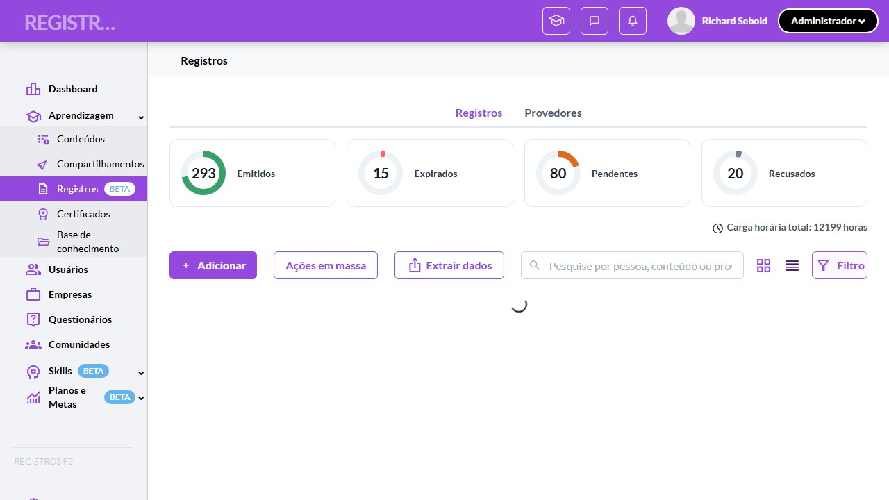
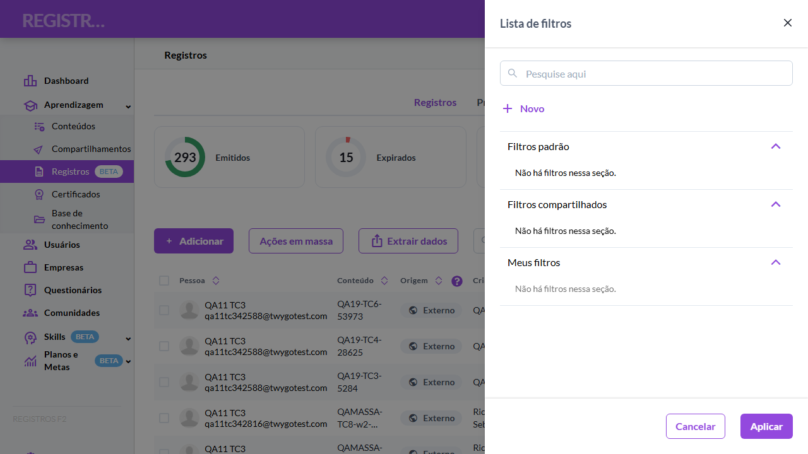
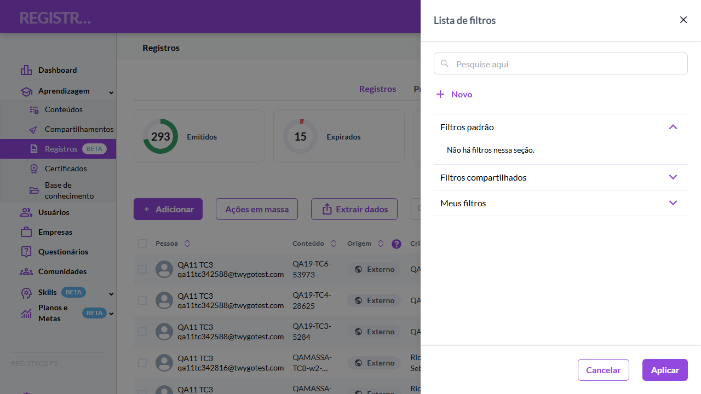
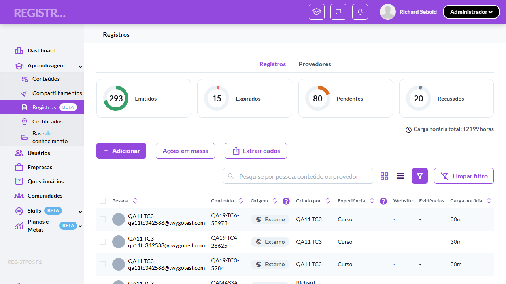
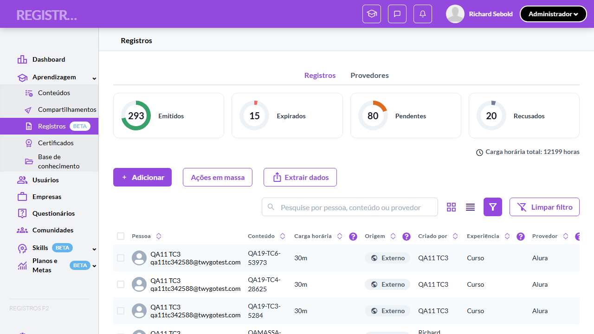
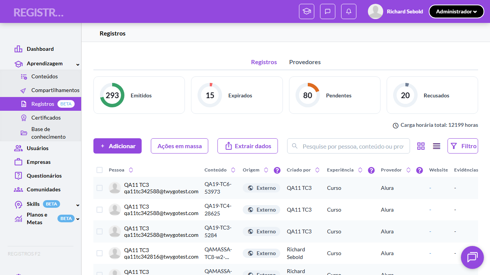
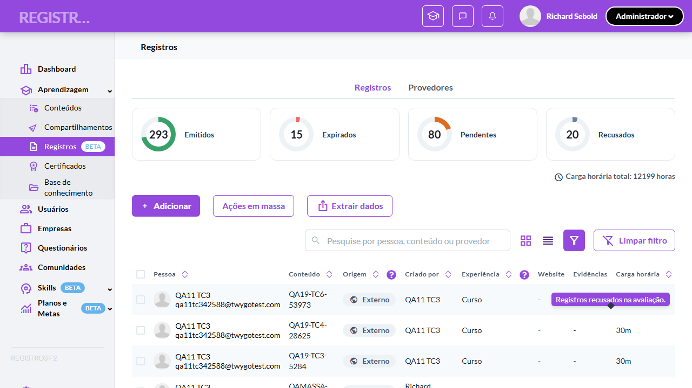

# Casos de teste — Registros de Aprendizagem

[← Voltar ao dashboard](index.md)

Lista detalhada por testsuite. Cada caso traz: o que era esperado pelo XML, quais steps foram executados, evidências (screenshots/trace), texto pronto pra registro de bug e — quando houver falha — uma explicação em PT-BR do motivo.

## Filtros via drawer e personalização de colunas (DnD)

_10 caso(s) — 6 aprovado(s), 0 falha(s), 4 ignorado(s)_

### ✅ Aprovado · TC1 · Validar abertura do drawer e estado ativo do botão Filtro · 🔴 Crítico

<a id="validar-abertura-do-drawer-e-estado-ativo-do-botao-filtro"></a>_Arquivo:_ `tc1-abertura-drawer-e-estado-ativo-botao-filtro.spec.ts` · _Duração:_ 16.44s · _Browser:_ chromium

**Sumário (objetivo do caso):** Garantir que o botão "Filtro" abre o drawer e reflete estado ativo com sufixo (N) quando há filtro aplicado (RN 63).

**Pré-condições:**

```
Ambiente Stage configurado e acessível
Funcionalidade "Registros de Aprendizagem" habilitada no contrato da organização
Usuário logado como Admin (cenários de coluna) e usuário Aluno disponível (cenários de sincronização com KPI)
Registros distribuídos entre os 4 status com provedores variados para os filtros padrão e combinatórias
```

**Passos do caso (XML/TestLink + execução Playwright):**

_Cada linha reproduz um passo do XML; a coluna **Status** traz o resultado da execução (do step Allure correspondente). Linhas com "Pré-condição" são da execução automatizada (login, navegação inicial) — não fazem parte do roteiro do XML._

| # | Ação do passo | Resultado esperado | Status | Notas | Duração |
|---|---|---|:---:|---|---:|
| 1 | Acessar a tela "Aprendizagem > Registros" como Admin | Botão "Filtro" exibido em variante outline (sem filtro ativo). | ✅ | — | 6.84s |
| 2 | Clicar no botão "Filtro" | Drawer "Lista de filtros" abre à direita. | ✅ | — | 0.65s |
| 3 | Aplicar o filtro padrão "Pendentes" pelo botão "Aplicar" | Drawer fecha; lista filtra; botão "Filtro" muda para variante sólida com sufixo "(1)". | ✅ | — | 2.85s |
| 4 | Clicar no botão "Limpar filtro" da toolbar | Filtro é removido; botão "Filtro" volta à variante outline. | ✅ | — | 0.36s |

**Evidências:**

📁 _Pasta:_ [`artifacts/projects-registros-externo-98407-stado-ativo-do-botão-Filtro-chromium/`](artifacts/projects-registros-externo-98407-stado-ativo-do-botão-Filtro-chromium/)

- 📸 **Screenshot (screenshot)** — [`test-finished-1.png`](artifacts/projects-registros-externo-98407-stado-ativo-do-botão-Filtro-chromium/test-finished-1.png)

  

- 📸 **Screenshot (screenshot)** — [`test-finished-2.png`](artifacts/projects-registros-externo-98407-stado-ativo-do-botão-Filtro-chromium/test-finished-2.png)

  

- 🎬 [Vídeo da execução (video.webm)](artifacts/projects-registros-externo-98407-stado-ativo-do-botão-Filtro-chromium/video.webm)

- 🎬 [Vídeo da execução (video-1.webm)](artifacts/projects-registros-externo-98407-stado-ativo-do-botão-Filtro-chromium/video-1.webm)

- 📦 **Trace** — [`trace.zip`](artifacts/projects-registros-externo-98407-stado-ativo-do-botão-Filtro-chromium/trace.zip)

  ```bash
  npx playwright show-trace outputs/registros-externos/reports/filtros-via-drawer-e-personalizacao-de-colunas-dnd_20260624-101412/artifacts/projects-registros-externo-98407-stado-ativo-do-botão-Filtro-chromium/trace.zip
  ```

- 🎥 **Vídeo** — [`video.webm`](artifacts/projects-registros-externo-98407-stado-ativo-do-botão-Filtro-chromium/video.webm)

- 🎥 **Vídeo** — [`video-1.webm`](artifacts/projects-registros-externo-98407-stado-ativo-do-botão-Filtro-chromium/video-1.webm)


---

### ⊘ Ignorado · TC10 · Validar combinação de 2 filtros + busca textual (combinatória mínima) · 🔴 Crítico

<a id="validar-combinacao-de-2-filtros-busca-textual-combinatoria-minima"></a>_Arquivo:_ `tc10-combinacao-2-filtros-mais-busca-textual.spec.ts` · _Duração:_ 1.00s · _Browser:_ chromium

> **⊘ Por que foi ignorado:** Marcado para revisão (test.fixme): AT desatualizada / feature não entregue no BETA: o grupo "Filtros padrão" do drawer não possui os radios Válidos/Expirados/Pendentes/Recusados (exibe "Não há filtros nessa seção."; radioCount=0 no recon 2026-06-23). Sem eles, este cenário não é exercível. Destinatário: AT / QA Lead (rever RN 63–66 vs build registrosf2).

**Sumário (objetivo do caso):** Garantir interseção de filtro padrão + colunas personalizadas + busca textual simultâneos — cobertura combinatória mínima do contrato 1.1.

**Pré-condições:**

```
Ambiente Stage configurado e acessível
Funcionalidade "Registros de Aprendizagem" habilitada no contrato da organização
Usuário logado como Admin (cenários de coluna) e usuário Aluno disponível (cenários de sincronização com KPI)
Registros distribuídos entre os 4 status com provedores variados para os filtros padrão e combinatórias
```

**Passos do caso (XML/TestLink + execução Playwright):**

_Cada linha reproduz um passo do XML; a coluna **Status** traz o resultado da execução (do step Allure correspondente). Linhas com "Pré-condição" são da execução automatizada (login, navegação inicial) — não fazem parte do roteiro do XML._

| # | Ação do passo | Resultado esperado | Status | Notas | Duração |
|---|---|---|:---:|---|---:|
| 1 | Acessar a tela "Aprendizagem > Registros" como Admin e aplicar o filtro padrão "Válidos" pelo drawer | Lista filtra para registros válidos (Emitidos); botão "Filtro" fica sólido "(1)". | ⊘ | Step não executado — Marcado para revisão (test.fixme): AT desatualizada / feature não entregue no BETA: o grupo "Filtros padrão" do drawer não possui os radios Válidos/Expirados/Pendentes/Recusados (exibe "Não há filtros nessa seção."; radioCount=0 no recon 2026-06-23). Sem eles, este cenário não é exercível. Destinatário: AT / QA Lead (rever RN 63–66 vs build registrosf2). | — |
| 2 | Abrir a view "Filtro rápido", desmarcar a coluna "Criado por" e aplicar | Tabela some com a coluna "Criado por" mantendo o filtro "Válidos" ativo. | ⊘ | Step não executado — Marcado para revisão (test.fixme): AT desatualizada / feature não entregue no BETA: o grupo "Filtros padrão" do drawer não possui os radios Válidos/Expirados/Pendentes/Recusados (exibe "Não há filtros nessa seção."; radioCount=0 no recon 2026-06-23). Sem eles, este cenário não é exercível. Destinatário: AT / QA Lead (rever RN 63–66 vs build registrosf2). | — |
| 3 | Preencher o campo de busca com "Coursera" | Lista exibe apenas registros Emitidos do provedor "Coursera" (interseção dos 3 critérios); colunas personalizadas permanecem. | ⊘ | Step não executado — Marcado para revisão (test.fixme): AT desatualizada / feature não entregue no BETA: o grupo "Filtros padrão" do drawer não possui os radios Válidos/Expirados/Pendentes/Recusados (exibe "Não há filtros nessa seção."; radioCount=0 no recon 2026-06-23). Sem eles, este cenário não é exercível. Destinatário: AT / QA Lead (rever RN 63–66 vs build registrosf2). | — |
| 4 | Clicar no botão "Limpar filtro" | Filtro padrão é removido; busca permanece aplicada; lista mostra todos os registros "Coursera". | ⊘ | Step não executado — Marcado para revisão (test.fixme): AT desatualizada / feature não entregue no BETA: o grupo "Filtros padrão" do drawer não possui os radios Válidos/Expirados/Pendentes/Recusados (exibe "Não há filtros nessa seção."; radioCount=0 no recon 2026-06-23). Sem eles, este cenário não é exercível. Destinatário: AT / QA Lead (rever RN 63–66 vs build registrosf2). | — |

**Evidências:**

📁 _Pasta:_ [`artifacts/projects-registros-externo-d9722-extual-combinatória-mínima--chromium/`](artifacts/projects-registros-externo-d9722-extual-combinatória-mínima--chromium/)

- 📸 **Screenshot (screenshot)** — [`test-finished-1.png`](artifacts/projects-registros-externo-d9722-extual-combinatória-mínima--chromium/test-finished-1.png)

  

- 🎬 [Vídeo da execução (video.webm)](artifacts/projects-registros-externo-d9722-extual-combinatória-mínima--chromium/video.webm)

- 🎬 [Vídeo da execução (video-1.webm)](artifacts/projects-registros-externo-d9722-extual-combinatória-mínima--chromium/video-1.webm)

- 📦 **Trace** — [`trace.zip`](artifacts/projects-registros-externo-d9722-extual-combinatória-mínima--chromium/trace.zip)

  ```bash
  npx playwright show-trace outputs/registros-externos/reports/filtros-via-drawer-e-personalizacao-de-colunas-dnd_20260624-101412/artifacts/projects-registros-externo-d9722-extual-combinatória-mínima--chromium/trace.zip
  ```

- 🎥 **Vídeo** — [`video.webm`](artifacts/projects-registros-externo-d9722-extual-combinatória-mínima--chromium/video.webm)

- 🎥 **Vídeo** — [`video-1.webm`](artifacts/projects-registros-externo-d9722-extual-combinatória-mínima--chromium/video-1.webm)

#### ⏳ Pendente — execução automatizada não realizada

- **Severidade do caso (XML):** Crítico
- **Motivo declarado pelo spec:** AT desatualizada / feature não entregue no BETA: o grupo "Filtros padrão" do drawer não possui os radios Válidos/Expirados/Pendentes/Recusados (exibe "Não há filtros nessa seção."; radioCount=0 no recon 2026-06-23). Sem eles, este cenário não é exercível. Destinatário: AT / QA Lead (rever RN 63–66 vs build registrosf2).
- **Categoria:** _não declarada_ — pra próxima revisão, ajustar o spec para `test.fixme(true, '[Categoria] motivo')` com uma das categorias canônicas (xml-desatualizado | seed-ausente | dep-externa | bloqueio-temporario).

**Roteiro do XML (para validação manual):**
1. Pré: Ambiente Stage configurado e acessível
1. Pré: Funcionalidade "Registros de Aprendizagem" habilitada no contrato da organização
1. Pré: Usuário logado como Admin (cenários de coluna) e usuário Aluno disponível (cenários de sincronização com KPI)
1. Pré: Registros distribuídos entre os 4 status com provedores variados para os filtros padrão e combinatórias
1. 1. Acessar a tela "Aprendizagem > Registros" como Admin e aplicar o filtro padrão "Válidos" pelo drawer
1. 2. Abrir a view "Filtro rápido", desmarcar a coluna "Criado por" e aplicar
1. 3. Preencher o campo de busca com "Coursera"
1. 4. Clicar no botão "Limpar filtro"

> Esse caso não bloqueia a build, mas precisa de validação manual ou ajuste no agente.


---

### ✅ Aprovado · TC2 · Validar estrutura do drawer "Lista de filtros" · 🔴 Crítico

<a id="validar-estrutura-do-drawer-lista-de-filtros"></a>_Arquivo:_ `tc2-estrutura-drawer-lista-de-filtros.spec.ts` · _Duração:_ 11.50s · _Browser:_ chromium

**Sumário (objetivo do caso):** Garantir busca, link Novo, 3 grupos colapsáveis com filtros padrão e empty states (RN 64).

**Pré-condições:**

```
Ambiente Stage configurado e acessível
Funcionalidade "Registros de Aprendizagem" habilitada no contrato da organização
Usuário logado como Admin (cenários de coluna) e usuário Aluno disponível (cenários de sincronização com KPI)
Registros distribuídos entre os 4 status com provedores variados para os filtros padrão e combinatórias
```

**Passos do caso (XML/TestLink + execução Playwright):**

_Cada linha reproduz um passo do XML; a coluna **Status** traz o resultado da execução (do step Allure correspondente). Linhas com "Pré-condição" são da execução automatizada (login, navegação inicial) — não fazem parte do roteiro do XML._

| # | Ação do passo | Resultado esperado | Status | Notas | Duração |
|---|---|---|:---:|---|---:|
| 1 | Acessar a tela "Aprendizagem > Registros" como Admin e clicar no botão "Filtro" | Drawer abre com header "Lista de filtros", campo de busca no topo e botão "Novo". | ✅ | — | 8.02s |
| 2 | Verificar o grupo "Filtros padrão" (aberto por default) | 4 filtros radio exibidos: "Válidos", "Expirados", "Pendentes", "Recusados", cada um com ícone de informação e botão de duplicar. | ✅ | — | 0.12s |
| 3 | Clicar no grupo "Filtros compartilhados" | Grupo expande exibindo a mensagem "Em breve — filtros criados pela equipe vão aparecer aqui." | ✅ | — | 0.18s |
| 4 | Clicar no grupo "Meus filtros" | Grupo expande exibindo "Em breve — filtros que você criar ou duplicar ficam aqui." | ✅ | — | 0.16s |
| 5 | Verificar o footer do drawer com os botões "Cancelar" e "Aplicar" | Botões "Cancelar" (outline) e "Aplicar" (sólido roxo). | ✅ | — | 0.05s |
| 6 | Clicar no botão de duplicar do filtro "Válidos" | Toast exibida: "Em breve". | ✅ | — | — |

**Evidências:**

📁 _Pasta:_ [`artifacts/projects-registros-externo-50618-do-drawer-Lista-de-filtros--chromium/`](artifacts/projects-registros-externo-50618-do-drawer-Lista-de-filtros--chromium/)

- 📸 **Screenshot (screenshot)** — [`test-finished-1.png`](artifacts/projects-registros-externo-50618-do-drawer-Lista-de-filtros--chromium/test-finished-1.png)

  

- 🎬 [Vídeo da execução (video.webm)](artifacts/projects-registros-externo-50618-do-drawer-Lista-de-filtros--chromium/video.webm)

- 🎬 [Vídeo da execução (video-1.webm)](artifacts/projects-registros-externo-50618-do-drawer-Lista-de-filtros--chromium/video-1.webm)

- 📦 **Trace** — [`trace.zip`](artifacts/projects-registros-externo-50618-do-drawer-Lista-de-filtros--chromium/trace.zip)

  ```bash
  npx playwright show-trace outputs/registros-externos/reports/filtros-via-drawer-e-personalizacao-de-colunas-dnd_20260624-101412/artifacts/projects-registros-externo-50618-do-drawer-Lista-de-filtros--chromium/trace.zip
  ```

- 🎥 **Vídeo** — [`video.webm`](artifacts/projects-registros-externo-50618-do-drawer-Lista-de-filtros--chromium/video.webm)

- 🎥 **Vídeo** — [`video-1.webm`](artifacts/projects-registros-externo-50618-do-drawer-Lista-de-filtros--chromium/video-1.webm)


---

### ⊘ Ignorado · TC3 · Validar busca interna da lista de filtros · 🟡 Normal

<a id="validar-busca-interna-da-lista-de-filtros"></a>_Arquivo:_ `tc3-busca-interna-da-lista-de-filtros.spec.ts` · _Duração:_ 0.84s · _Browser:_ chromium

> **⊘ Por que foi ignorado:** Marcado para revisão (test.fixme): AT desatualizada / feature não entregue no BETA: o grupo "Filtros padrão" do drawer não possui os radios Válidos/Expirados/Pendentes/Recusados (exibe "Não há filtros nessa seção."; radioCount=0 no recon 2026-06-23). Sem eles, este cenário não é exercível. Destinatário: AT / QA Lead (rever RN 63–66 vs build registrosf2).

**Sumário (objetivo do caso):** Garantir que a busca do drawer filtra os filtros pelo label (RN 64).

**Pré-condições:**

```
Ambiente Stage configurado e acessível
Funcionalidade "Registros de Aprendizagem" habilitada no contrato da organização
Usuário logado como Admin (cenários de coluna) e usuário Aluno disponível (cenários de sincronização com KPI)
Registros distribuídos entre os 4 status com provedores variados para os filtros padrão e combinatórias
```

**Passos do caso (XML/TestLink + execução Playwright):**

_Cada linha reproduz um passo do XML; a coluna **Status** traz o resultado da execução (do step Allure correspondente). Linhas com "Pré-condição" são da execução automatizada (login, navegação inicial) — não fazem parte do roteiro do XML._

| # | Ação do passo | Resultado esperado | Status | Notas | Duração |
|---|---|---|:---:|---|---:|
| 1 | Abrir o drawer "Lista de filtros" | 4 filtros padrão visíveis. | ⊘ | Step não executado — Marcado para revisão (test.fixme): AT desatualizada / feature não entregue no BETA: o grupo "Filtros padrão" do drawer não possui os radios Válidos/Expirados/Pendentes/Recusados (exibe "Não há filtros nessa seção."; radioCount=0 no recon 2026-06-23). Sem eles, este cenário não é exercível. Destinatário: AT / QA Lead (rever RN 63–66 vs build registrosf2). | — |
| 2 | Preencher o campo de busca do drawer com "Pend" | Apenas o filtro "Pendentes" permanece visível na lista. | ⊘ | Step não executado — Marcado para revisão (test.fixme): AT desatualizada / feature não entregue no BETA: o grupo "Filtros padrão" do drawer não possui os radios Válidos/Expirados/Pendentes/Recusados (exibe "Não há filtros nessa seção."; radioCount=0 no recon 2026-06-23). Sem eles, este cenário não é exercível. Destinatário: AT / QA Lead (rever RN 63–66 vs build registrosf2). | — |
| 3 | Limpar o campo de busca | Os 4 filtros padrão voltam a aparecer. | ⊘ | Step não executado — Marcado para revisão (test.fixme): AT desatualizada / feature não entregue no BETA: o grupo "Filtros padrão" do drawer não possui os radios Válidos/Expirados/Pendentes/Recusados (exibe "Não há filtros nessa seção."; radioCount=0 no recon 2026-06-23). Sem eles, este cenário não é exercível. Destinatário: AT / QA Lead (rever RN 63–66 vs build registrosf2). | — |

**Evidências:**

📁 _Pasta:_ [`artifacts/projects-registros-externo-7f178-interna-da-lista-de-filtros-chromium/`](artifacts/projects-registros-externo-7f178-interna-da-lista-de-filtros-chromium/)

- 📸 **Screenshot (screenshot)** — [`test-finished-1.png`](artifacts/projects-registros-externo-7f178-interna-da-lista-de-filtros-chromium/test-finished-1.png)

  

- 🎬 [Vídeo da execução (video.webm)](artifacts/projects-registros-externo-7f178-interna-da-lista-de-filtros-chromium/video.webm)

- 🎬 [Vídeo da execução (video-1.webm)](artifacts/projects-registros-externo-7f178-interna-da-lista-de-filtros-chromium/video-1.webm)

- 📦 **Trace** — [`trace.zip`](artifacts/projects-registros-externo-7f178-interna-da-lista-de-filtros-chromium/trace.zip)

  ```bash
  npx playwright show-trace outputs/registros-externos/reports/filtros-via-drawer-e-personalizacao-de-colunas-dnd_20260624-101412/artifacts/projects-registros-externo-7f178-interna-da-lista-de-filtros-chromium/trace.zip
  ```

- 🎥 **Vídeo** — [`video.webm`](artifacts/projects-registros-externo-7f178-interna-da-lista-de-filtros-chromium/video.webm)

- 🎥 **Vídeo** — [`video-1.webm`](artifacts/projects-registros-externo-7f178-interna-da-lista-de-filtros-chromium/video-1.webm)

#### ⏳ Pendente — execução automatizada não realizada

- **Severidade do caso (XML):** Normal
- **Motivo declarado pelo spec:** AT desatualizada / feature não entregue no BETA: o grupo "Filtros padrão" do drawer não possui os radios Válidos/Expirados/Pendentes/Recusados (exibe "Não há filtros nessa seção."; radioCount=0 no recon 2026-06-23). Sem eles, este cenário não é exercível. Destinatário: AT / QA Lead (rever RN 63–66 vs build registrosf2).
- **Categoria:** _não declarada_ — pra próxima revisão, ajustar o spec para `test.fixme(true, '[Categoria] motivo')` com uma das categorias canônicas (xml-desatualizado | seed-ausente | dep-externa | bloqueio-temporario).

**Roteiro do XML (para validação manual):**
1. Pré: Ambiente Stage configurado e acessível
1. Pré: Funcionalidade "Registros de Aprendizagem" habilitada no contrato da organização
1. Pré: Usuário logado como Admin (cenários de coluna) e usuário Aluno disponível (cenários de sincronização com KPI)
1. Pré: Registros distribuídos entre os 4 status com provedores variados para os filtros padrão e combinatórias
1. 1. Abrir o drawer "Lista de filtros"
1. 2. Preencher o campo de busca do drawer com "Pend"
1. 3. Limpar o campo de busca

> Esse caso não bloqueia a build, mas precisa de validação manual ou ajuste no agente.


---

### ⊘ Ignorado · TC4 · Validar comportamento de pending (aplicar, cancelar, ressincronizar) · 🔴 Crítico

<a id="validar-comportamento-de-pending-aplicar-cancelar-ressincronizar"></a>_Arquivo:_ `tc4-pending-aplicar-cancelar-ressincronizar.spec.ts` · _Duração:_ 0.84s · _Browser:_ chromium

> **⊘ Por que foi ignorado:** Marcado para revisão (test.fixme): AT desatualizada / feature não entregue no BETA: o grupo "Filtros padrão" do drawer não possui os radios Válidos/Expirados/Pendentes/Recusados (exibe "Não há filtros nessa seção."; radioCount=0 no recon 2026-06-23). Sem eles, este cenário não é exercível. Destinatário: AT / QA Lead (rever RN 63–66 vs build registrosf2).

**Sumário (objetivo do caso):** Garantir que a seleção pendente só vira filtro efetivo no Aplicar, é descartada no Cancelar/X e ressincroniza a cada abertura (RN 65).

**Pré-condições:**

```
Ambiente Stage configurado e acessível
Funcionalidade "Registros de Aprendizagem" habilitada no contrato da organização
Usuário logado como Admin (cenários de coluna) e usuário Aluno disponível (cenários de sincronização com KPI)
Registros distribuídos entre os 4 status com provedores variados para os filtros padrão e combinatórias
```

**Passos do caso (XML/TestLink + execução Playwright):**

_Cada linha reproduz um passo do XML; a coluna **Status** traz o resultado da execução (do step Allure correspondente). Linhas com "Pré-condição" são da execução automatizada (login, navegação inicial) — não fazem parte do roteiro do XML._

| # | Ação do passo | Resultado esperado | Status | Notas | Duração |
|---|---|---|:---:|---|---:|
| 1 | Abrir o drawer "Lista de filtros" e selecionar o radio "Pendentes" | Radio "Pendentes" selecionado (pending). | ⊘ | Step não executado — Marcado para revisão (test.fixme): AT desatualizada / feature não entregue no BETA: o grupo "Filtros padrão" do drawer não possui os radios Válidos/Expirados/Pendentes/Recusados (exibe "Não há filtros nessa seção."; radioCount=0 no recon 2026-06-23). Sem eles, este cenário não é exercível. Destinatário: AT / QA Lead (rever RN 63–66 vs build registrosf2). | — |
| 2 | Clicar no botão de fechar (X) do drawer | Drawer fecha; lista NÃO filtra; botão "Filtro" permanece outline. | ⊘ | Step não executado — Marcado para revisão (test.fixme): AT desatualizada / feature não entregue no BETA: o grupo "Filtros padrão" do drawer não possui os radios Válidos/Expirados/Pendentes/Recusados (exibe "Não há filtros nessa seção."; radioCount=0 no recon 2026-06-23). Sem eles, este cenário não é exercível. Destinatário: AT / QA Lead (rever RN 63–66 vs build registrosf2). | — |
| 3 | Reabrir o drawer | Nenhum radio selecionado (pending descartado ressincronizou com o filtro efetivo vazio). | ⊘ | Step não executado — Marcado para revisão (test.fixme): AT desatualizada / feature não entregue no BETA: o grupo "Filtros padrão" do drawer não possui os radios Válidos/Expirados/Pendentes/Recusados (exibe "Não há filtros nessa seção."; radioCount=0 no recon 2026-06-23). Sem eles, este cenário não é exercível. Destinatário: AT / QA Lead (rever RN 63–66 vs build registrosf2). | — |
| 4 | Aplicar o filtro "Pendentes" pelo botão "Aplicar" | Drawer fecha; lista filtra por Pendentes. | ⊘ | Step não executado — Marcado para revisão (test.fixme): AT desatualizada / feature não entregue no BETA: o grupo "Filtros padrão" do drawer não possui os radios Válidos/Expirados/Pendentes/Recusados (exibe "Não há filtros nessa seção."; radioCount=0 no recon 2026-06-23). Sem eles, este cenário não é exercível. Destinatário: AT / QA Lead (rever RN 63–66 vs build registrosf2). | — |
| 5 | Reabrir o drawer | Radio "Pendentes" já aparece selecionado (pending ressincronizado com o filtro aplicado). | ⊘ | Step não executado — Marcado para revisão (test.fixme): AT desatualizada / feature não entregue no BETA: o grupo "Filtros padrão" do drawer não possui os radios Válidos/Expirados/Pendentes/Recusados (exibe "Não há filtros nessa seção."; radioCount=0 no recon 2026-06-23). Sem eles, este cenário não é exercível. Destinatário: AT / QA Lead (rever RN 63–66 vs build registrosf2). | — |
| 6 | Clicar no radio "Pendentes" já selecionado | Radio deseleciona (toggle). | ⊘ | Step não executado — Marcado para revisão (test.fixme): AT desatualizada / feature não entregue no BETA: o grupo "Filtros padrão" do drawer não possui os radios Válidos/Expirados/Pendentes/Recusados (exibe "Não há filtros nessa seção."; radioCount=0 no recon 2026-06-23). Sem eles, este cenário não é exercível. Destinatário: AT / QA Lead (rever RN 63–66 vs build registrosf2). | — |
| 7 | Clicar no botão "Aplicar" | Filtro é removido; lista volta a exibir todos os registros. | ⊘ | Step não executado — Marcado para revisão (test.fixme): AT desatualizada / feature não entregue no BETA: o grupo "Filtros padrão" do drawer não possui os radios Válidos/Expirados/Pendentes/Recusados (exibe "Não há filtros nessa seção."; radioCount=0 no recon 2026-06-23). Sem eles, este cenário não é exercível. Destinatário: AT / QA Lead (rever RN 63–66 vs build registrosf2). | — |

**Evidências:**

📁 _Pasta:_ [`artifacts/projects-registros-externo-aa05f-ar-cancelar-ressincronizar--chromium/`](artifacts/projects-registros-externo-aa05f-ar-cancelar-ressincronizar--chromium/)

- 📸 **Screenshot (screenshot)** — [`test-finished-1.png`](artifacts/projects-registros-externo-aa05f-ar-cancelar-ressincronizar--chromium/test-finished-1.png)

  

- 🎬 [Vídeo da execução (video.webm)](artifacts/projects-registros-externo-aa05f-ar-cancelar-ressincronizar--chromium/video.webm)

- 🎬 [Vídeo da execução (video-1.webm)](artifacts/projects-registros-externo-aa05f-ar-cancelar-ressincronizar--chromium/video-1.webm)

- 📦 **Trace** — [`trace.zip`](artifacts/projects-registros-externo-aa05f-ar-cancelar-ressincronizar--chromium/trace.zip)

  ```bash
  npx playwright show-trace outputs/registros-externos/reports/filtros-via-drawer-e-personalizacao-de-colunas-dnd_20260624-101412/artifacts/projects-registros-externo-aa05f-ar-cancelar-ressincronizar--chromium/trace.zip
  ```

- 🎥 **Vídeo** — [`video.webm`](artifacts/projects-registros-externo-aa05f-ar-cancelar-ressincronizar--chromium/video.webm)

- 🎥 **Vídeo** — [`video-1.webm`](artifacts/projects-registros-externo-aa05f-ar-cancelar-ressincronizar--chromium/video-1.webm)

#### ⏳ Pendente — execução automatizada não realizada

- **Severidade do caso (XML):** Crítico
- **Motivo declarado pelo spec:** AT desatualizada / feature não entregue no BETA: o grupo "Filtros padrão" do drawer não possui os radios Válidos/Expirados/Pendentes/Recusados (exibe "Não há filtros nessa seção."; radioCount=0 no recon 2026-06-23). Sem eles, este cenário não é exercível. Destinatário: AT / QA Lead (rever RN 63–66 vs build registrosf2).
- **Categoria:** _não declarada_ — pra próxima revisão, ajustar o spec para `test.fixme(true, '[Categoria] motivo')` com uma das categorias canônicas (xml-desatualizado | seed-ausente | dep-externa | bloqueio-temporario).

**Roteiro do XML (para validação manual):**
1. Pré: Ambiente Stage configurado e acessível
1. Pré: Funcionalidade "Registros de Aprendizagem" habilitada no contrato da organização
1. Pré: Usuário logado como Admin (cenários de coluna) e usuário Aluno disponível (cenários de sincronização com KPI)
1. Pré: Registros distribuídos entre os 4 status com provedores variados para os filtros padrão e combinatórias
1. 1. Abrir o drawer "Lista de filtros" e selecionar o radio "Pendentes"
1. 2. Clicar no botão de fechar (X) do drawer
1. 3. Reabrir o drawer
1. 4. Aplicar o filtro "Pendentes" pelo botão "Aplicar"
1. 5. Reabrir o drawer
1. 6. Clicar no radio "Pendentes" já selecionado
1. 7. Clicar no botão "Aplicar"

> Esse caso não bloqueia a build, mas precisa de validação manual ou ajuste no agente.


---

### ⊘ Ignorado · TC5 · Validar sincronização KPI cards ↔ drawer (Aluno) · 🔴 Crítico

<a id="validar-sincronizacao-kpi-cards-drawer-aluno"></a>_Arquivo:_ `tc5-sincronizacao-kpi-cards-drawer-aluno.spec.ts` · _Duração:_ 0.84s · _Browser:_ chromium

> **⊘ Por que foi ignorado:** Marcado para revisão (test.fixme): AT desatualizada / feature não entregue no BETA: o grupo "Filtros padrão" do drawer não possui os radios Válidos/Expirados/Pendentes/Recusados (exibe "Não há filtros nessa seção."; radioCount=0 no recon 2026-06-23). Sem eles, este cenário não é exercível. Destinatário: AT / QA Lead (rever RN 63–66 vs build registrosf2).

**Sumário (objetivo do caso):** Garantir que KPI card e radios do drawer manipulam o mesmo estado de filtro (RN 66).

**Pré-condições:**

```
Ambiente Stage configurado e acessível
Funcionalidade "Registros de Aprendizagem" habilitada no contrato da organização
Usuário logado como Admin (cenários de coluna) e usuário Aluno disponível (cenários de sincronização com KPI)
Registros distribuídos entre os 4 status com provedores variados para os filtros padrão e combinatórias
```

**Passos do caso (XML/TestLink + execução Playwright):**

_Cada linha reproduz um passo do XML; a coluna **Status** traz o resultado da execução (do step Allure correspondente). Linhas com "Pré-condição" são da execução automatizada (login, navegação inicial) — não fazem parte do roteiro do XML._

| # | Ação do passo | Resultado esperado | Status | Notas | Duração |
|---|---|---|:---:|---|---:|
| 1 | Acessar a tela "Meu histórico" como Aluno e clicar no KPI card "Pendentes" | Lista filtra por Pendentes; card fica ativo. | ⊘ | Step não executado — Marcado para revisão (test.fixme): AT desatualizada / feature não entregue no BETA: o grupo "Filtros padrão" do drawer não possui os radios Válidos/Expirados/Pendentes/Recusados (exibe "Não há filtros nessa seção."; radioCount=0 no recon 2026-06-23). Sem eles, este cenário não é exercível. Destinatário: AT / QA Lead (rever RN 63–66 vs build registrosf2). | — |
| 2 | Clicar no botão "Filtro" | Drawer abre com o radio correspondente a "Pendentes" já selecionado. | ⊘ | Step não executado — Marcado para revisão (test.fixme): AT desatualizada / feature não entregue no BETA: o grupo "Filtros padrão" do drawer não possui os radios Válidos/Expirados/Pendentes/Recusados (exibe "Não há filtros nessa seção."; radioCount=0 no recon 2026-06-23). Sem eles, este cenário não é exercível. Destinatário: AT / QA Lead (rever RN 63–66 vs build registrosf2). | — |
| 3 | Aplicar o filtro "Recusados" pelo botão "Aplicar" do drawer | Lista filtra por Recusados; KPI card "Recusados" assume o estado ativo e "Pendentes" perde. | ⊘ | Step não executado — Marcado para revisão (test.fixme): AT desatualizada / feature não entregue no BETA: o grupo "Filtros padrão" do drawer não possui os radios Válidos/Expirados/Pendentes/Recusados (exibe "Não há filtros nessa seção."; radioCount=0 no recon 2026-06-23). Sem eles, este cenário não é exercível. Destinatário: AT / QA Lead (rever RN 63–66 vs build registrosf2). | — |

**Evidências:**

📁 _Pasta:_ [`artifacts/projects-registros-externo-a0928-o-KPI-cards-↔-drawer-Aluno--chromium/`](artifacts/projects-registros-externo-a0928-o-KPI-cards-↔-drawer-Aluno--chromium/)

- 📸 **Screenshot (screenshot)** — [`test-finished-1.png`](artifacts/projects-registros-externo-a0928-o-KPI-cards-↔-drawer-Aluno--chromium/test-finished-1.png)

  

- 🎬 [Vídeo da execução (video.webm)](artifacts/projects-registros-externo-a0928-o-KPI-cards-↔-drawer-Aluno--chromium/video.webm)

- 🎬 [Vídeo da execução (video-1.webm)](artifacts/projects-registros-externo-a0928-o-KPI-cards-↔-drawer-Aluno--chromium/video-1.webm)

- 📦 **Trace** — [`trace.zip`](artifacts/projects-registros-externo-a0928-o-KPI-cards-↔-drawer-Aluno--chromium/trace.zip)

  ```bash
  npx playwright show-trace outputs/registros-externos/reports/filtros-via-drawer-e-personalizacao-de-colunas-dnd_20260624-101412/artifacts/projects-registros-externo-a0928-o-KPI-cards-↔-drawer-Aluno--chromium/trace.zip
  ```

- 🎥 **Vídeo** — [`video.webm`](artifacts/projects-registros-externo-a0928-o-KPI-cards-↔-drawer-Aluno--chromium/video.webm)

- 🎥 **Vídeo** — [`video-1.webm`](artifacts/projects-registros-externo-a0928-o-KPI-cards-↔-drawer-Aluno--chromium/video-1.webm)

#### ⏳ Pendente — execução automatizada não realizada

- **Severidade do caso (XML):** Crítico
- **Motivo declarado pelo spec:** AT desatualizada / feature não entregue no BETA: o grupo "Filtros padrão" do drawer não possui os radios Válidos/Expirados/Pendentes/Recusados (exibe "Não há filtros nessa seção."; radioCount=0 no recon 2026-06-23). Sem eles, este cenário não é exercível. Destinatário: AT / QA Lead (rever RN 63–66 vs build registrosf2).
- **Categoria:** _não declarada_ — pra próxima revisão, ajustar o spec para `test.fixme(true, '[Categoria] motivo')` com uma das categorias canônicas (xml-desatualizado | seed-ausente | dep-externa | bloqueio-temporario).

**Roteiro do XML (para validação manual):**
1. Pré: Ambiente Stage configurado e acessível
1. Pré: Funcionalidade "Registros de Aprendizagem" habilitada no contrato da organização
1. Pré: Usuário logado como Admin (cenários de coluna) e usuário Aluno disponível (cenários de sincronização com KPI)
1. Pré: Registros distribuídos entre os 4 status com provedores variados para os filtros padrão e combinatórias
1. 1. Acessar a tela "Meu histórico" como Aluno e clicar no KPI card "Pendentes"
1. 2. Clicar no botão "Filtro"
1. 3. Aplicar o filtro "Recusados" pelo botão "Aplicar" do drawer

> Esse caso não bloqueia a build, mas precisa de validação manual ou ajuste no agente.


---

### ✅ Aprovado · TC6 · Validar navegação para a view "Filtro rápido" · 🔴 Crítico

<a id="validar-navegacao-para-a-view-filtro-rapido"></a>_Arquivo:_ `tc6-navegacao-para-view-filtro-rapido.spec.ts` · _Duração:_ 13.06s · _Browser:_ chromium

**Sumário (objetivo do caso):** Garantir a navegação Lista de filtros ↔ Filtro rápido e a estrutura da view de personalização (RN 67, 68).

**Pré-condições:**

```
Ambiente Stage configurado e acessível
Funcionalidade "Registros de Aprendizagem" habilitada no contrato da organização
Usuário logado como Admin (cenários de coluna) e usuário Aluno disponível (cenários de sincronização com KPI)
Registros distribuídos entre os 4 status com provedores variados para os filtros padrão e combinatórias
```

**Passos do caso (XML/TestLink + execução Playwright):**

_Cada linha reproduz um passo do XML; a coluna **Status** traz o resultado da execução (do step Allure correspondente). Linhas com "Pré-condição" são da execução automatizada (login, navegação inicial) — não fazem parte do roteiro do XML._

| # | Ação do passo | Resultado esperado | Status | Notas | Duração |
|---|---|---|:---:|---|---:|
| 1 | Abrir o drawer "Lista de filtros" e clicar no botão "Novo" | Header do drawer muda para "Filtro rápido"; link de voltar "Lista de filtros" aparece no topo. | ✅ | — | 8.55s |
| 2 | Verificar o grupo "Colunas para filtrar" | Grupo aberto exibindo o botão outline "+ Opções de filtro". | ✅ | — | 0.08s |
| 3 | Clicar no botão "+ Opções de filtro" | Toast exibida: "Em breve" (filtro avançado fora desta entrega). | ✅ | — | 0.25s |
| 4 | Verificar o grupo "Colunas para exibir" | Lista de colunas com checkbox + drag handle em cada item; colunas default marcadas (Pessoa, Conteúdo, Origem, Criado por, Provedor, Situação do registro, Situação do certificado, Carga horária). | ✅ | — | 0.32s |
| 5 | Clicar no link "Lista de filtros" | Drawer volta para a view "Lista de filtros". | ✅ | — | 0.56s |

**Evidências:**

📁 _Pasta:_ [`artifacts/projects-registros-externo-70e8e--para-a-view-Filtro-rápido--chromium/`](artifacts/projects-registros-externo-70e8e--para-a-view-Filtro-rápido--chromium/)

- 📸 **Screenshot (screenshot)** — [`test-finished-1.png`](artifacts/projects-registros-externo-70e8e--para-a-view-Filtro-rápido--chromium/test-finished-1.png)

  

- 🎬 [Vídeo da execução (video.webm)](artifacts/projects-registros-externo-70e8e--para-a-view-Filtro-rápido--chromium/video.webm)

- 🎬 [Vídeo da execução (video-1.webm)](artifacts/projects-registros-externo-70e8e--para-a-view-Filtro-rápido--chromium/video-1.webm)

- 📦 **Trace** — [`trace.zip`](artifacts/projects-registros-externo-70e8e--para-a-view-Filtro-rápido--chromium/trace.zip)

  ```bash
  npx playwright show-trace outputs/registros-externos/reports/filtros-via-drawer-e-personalizacao-de-colunas-dnd_20260624-101412/artifacts/projects-registros-externo-70e8e--para-a-view-Filtro-rápido--chromium/trace.zip
  ```

- 🎥 **Vídeo** — [`video.webm`](artifacts/projects-registros-externo-70e8e--para-a-view-Filtro-rápido--chromium/video.webm)

- 🎥 **Vídeo** — [`video-1.webm`](artifacts/projects-registros-externo-70e8e--para-a-view-Filtro-rápido--chromium/video-1.webm)


---

### ✅ Aprovado · TC7 · Validar ligar/desligar colunas e refletir na tabela · 🔴 Crítico

<a id="validar-ligar-desligar-colunas-e-refletir-na-tabela"></a>_Arquivo:_ `tc7-ligar-desligar-colunas-reflete-na-tabela.spec.ts` · _Duração:_ 15.38s · _Browser:_ chromium

**Sumário (objetivo do caso):** Garantir que marcar/desmarcar colunas e aplicar atualiza a tabela imediatamente, com checkbox e ações fixos nas pontas (RN 70).

**Pré-condições:**

```
Ambiente Stage configurado e acessível
Funcionalidade "Registros de Aprendizagem" habilitada no contrato da organização
Usuário logado como Admin (cenários de coluna) e usuário Aluno disponível (cenários de sincronização com KPI)
Registros distribuídos entre os 4 status com provedores variados para os filtros padrão e combinatórias
```

**Passos do caso (XML/TestLink + execução Playwright):**

_Cada linha reproduz um passo do XML; a coluna **Status** traz o resultado da execução (do step Allure correspondente). Linhas com "Pré-condição" são da execução automatizada (login, navegação inicial) — não fazem parte do roteiro do XML._

| # | Ação do passo | Resultado esperado | Status | Notas | Duração |
|---|---|---|:---:|---|---:|
| 1 | Abrir a view "Filtro rápido" do drawer como Admin | Lista de colunas exibida. | ✅ | — | 8.29s |
| 2 | Desmarcar o checkbox da coluna "Provedor" | Checkbox desmarcado. | ✅ | — | 0.35s |
| 3 | Marcar o checkbox da coluna "Website" | Checkbox marcado. | ✅ | — | 0.31s |
| 4 | Clicar no botão "Aplicar" | Drawer fecha; tabela remove a coluna "Provedor" e exibe a coluna "Website"; checkbox de seleção permanece como primeira coluna e ações como última. | ✅ | — | 1.65s |

**Evidências:**

📁 _Pasta:_ [`artifacts/projects-registros-externo-9a84f-olunas-e-refletir-na-tabela-chromium/`](artifacts/projects-registros-externo-9a84f-olunas-e-refletir-na-tabela-chromium/)

- 📸 **Screenshot (screenshot)** — [`test-finished-1.png`](artifacts/projects-registros-externo-9a84f-olunas-e-refletir-na-tabela-chromium/test-finished-1.png)

  

- 📸 **Screenshot (screenshot)** — [`test-finished-2.png`](artifacts/projects-registros-externo-9a84f-olunas-e-refletir-na-tabela-chromium/test-finished-2.png)

  

- 🎬 [Vídeo da execução (video.webm)](artifacts/projects-registros-externo-9a84f-olunas-e-refletir-na-tabela-chromium/video.webm)

- 🎬 [Vídeo da execução (video-1.webm)](artifacts/projects-registros-externo-9a84f-olunas-e-refletir-na-tabela-chromium/video-1.webm)

- 📦 **Trace** — [`trace.zip`](artifacts/projects-registros-externo-9a84f-olunas-e-refletir-na-tabela-chromium/trace.zip)

  ```bash
  npx playwright show-trace outputs/registros-externos/reports/filtros-via-drawer-e-personalizacao-de-colunas-dnd_20260624-101412/artifacts/projects-registros-externo-9a84f-olunas-e-refletir-na-tabela-chromium/trace.zip
  ```

- 🎥 **Vídeo** — [`video.webm`](artifacts/projects-registros-externo-9a84f-olunas-e-refletir-na-tabela-chromium/video.webm)

- 🎥 **Vídeo** — [`video-1.webm`](artifacts/projects-registros-externo-9a84f-olunas-e-refletir-na-tabela-chromium/video-1.webm)


---

### ✅ Aprovado · TC8 · Validar reordenação de colunas via drag and drop · 🔴 Crítico

<a id="validar-reordenacao-de-colunas-via-drag-and-drop"></a>_Arquivo:_ `tc8-reordenacao-colunas-drag-and-drop.spec.ts` · _Duração:_ 15.61s · _Browser:_ chromium

**Sumário (objetivo do caso):** Garantir o DnD pelo handle com a tabela refletindo a nova ordem (RN 69).

**Pré-condições:**

```
Ambiente Stage configurado e acessível
Funcionalidade "Registros de Aprendizagem" habilitada no contrato da organização
Usuário logado como Admin (cenários de coluna) e usuário Aluno disponível (cenários de sincronização com KPI)
Registros distribuídos entre os 4 status com provedores variados para os filtros padrão e combinatórias
```

**Passos do caso (XML/TestLink + execução Playwright):**

_Cada linha reproduz um passo do XML; a coluna **Status** traz o resultado da execução (do step Allure correspondente). Linhas com "Pré-condição" são da execução automatizada (login, navegação inicial) — não fazem parte do roteiro do XML._

| # | Ação do passo | Resultado esperado | Status | Notas | Duração |
|---|---|---|:---:|---|---:|
| 1 | Abrir a view "Filtro rápido" do drawer como Admin | Lista de colunas com drag handle em cada linha. | ✅ | — | 8.03s |
| 2 | Passar o mouse sobre o drag handle da coluna "Carga horária" | Tooltip exibida: "Arraste para reordenar". | ✅ | — | 0.03s |
| 3 | Arrastar a coluna "Carga horária" (pelo handle) para antes da coluna "Origem" | Linha reposiciona na lista durante o drag com feedback visual (fundo destacado). | ✅ | — | 2.22s |
| 4 | Clicar no botão "Aplicar" | Tabela exibe "Carga horária" antes de "Origem" na ordem das colunas. | ✅ | — | 1.23s |

**Evidências:**

📁 _Pasta:_ [`artifacts/projects-registros-externo-fb45c-e-colunas-via-drag-and-drop-chromium/`](artifacts/projects-registros-externo-fb45c-e-colunas-via-drag-and-drop-chromium/)

- 📸 **Screenshot (screenshot)** — [`test-finished-1.png`](artifacts/projects-registros-externo-fb45c-e-colunas-via-drag-and-drop-chromium/test-finished-1.png)

  

- 📸 **Screenshot (screenshot)** — [`test-finished-2.png`](artifacts/projects-registros-externo-fb45c-e-colunas-via-drag-and-drop-chromium/test-finished-2.png)

  

- 🎬 [Vídeo da execução (video.webm)](artifacts/projects-registros-externo-fb45c-e-colunas-via-drag-and-drop-chromium/video.webm)

- 🎬 [Vídeo da execução (video-1.webm)](artifacts/projects-registros-externo-fb45c-e-colunas-via-drag-and-drop-chromium/video-1.webm)

- 📦 **Trace** — [`trace.zip`](artifacts/projects-registros-externo-fb45c-e-colunas-via-drag-and-drop-chromium/trace.zip)

  ```bash
  npx playwright show-trace outputs/registros-externos/reports/filtros-via-drawer-e-personalizacao-de-colunas-dnd_20260624-101412/artifacts/projects-registros-externo-fb45c-e-colunas-via-drag-and-drop-chromium/trace.zip
  ```

- 🎥 **Vídeo** — [`video.webm`](artifacts/projects-registros-externo-fb45c-e-colunas-via-drag-and-drop-chromium/video.webm)

- 🎥 **Vídeo** — [`video-1.webm`](artifacts/projects-registros-externo-fb45c-e-colunas-via-drag-and-drop-chromium/video-1.webm)


---

### ✅ Aprovado · TC9 · Validar reset suave do drawer e não persistência da customização · 🔴 Crítico

<a id="validar-reset-suave-do-drawer-e-nao-persistencia-da-customizacao"></a>_Arquivo:_ `tc9-reset-suave-e-persistencia-da-customizacao.spec.ts` · _Duração:_ 21.51s · _Browser:_ chromium

**Sumário (objetivo do caso):** Garantir que reabrir o drawer volta à view "lista" com colunas default, e que a customização não persiste entre sessões (RN 70 + premissa).

**Pré-condições:**

```
Ambiente Stage configurado e acessível
Funcionalidade "Registros de Aprendizagem" habilitada no contrato da organização
Usuário logado como Admin (cenários de coluna) e usuário Aluno disponível (cenários de sincronização com KPI)
Registros distribuídos entre os 4 status com provedores variados para os filtros padrão e combinatórias
```

**Passos do caso (XML/TestLink + execução Playwright):**

_Cada linha reproduz um passo do XML; a coluna **Status** traz o resultado da execução (do step Allure correspondente). Linhas com "Pré-condição" são da execução automatizada (login, navegação inicial) — não fazem parte do roteiro do XML._

| # | Ação do passo | Resultado esperado | Status | Notas | Duração |
|---|---|---|:---:|---|---:|
| 1 | Abrir a view "Filtro rápido", desmarcar "Provedor" e aplicar | Tabela sem a coluna "Provedor". | ✅ | — | 10.60s |
| 2 | Reabrir o drawer "Filtro" | Drawer abre na view "Lista de filtros" (não na view "Filtro rápido"). | ✅ | — | 0.29s |
| 3 | Clicar no botão "Novo" | Lista de colunas exibe o estado default novamente (visão de edição resetada). | ✅ | — | 0.55s |
| 4 | Recarregar a página | Tabela volta às colunas default (customização não persistida entre sessões). | ✅ | — | 5.75s |

**Evidências:**

📁 _Pasta:_ [`artifacts/projects-registros-externo-59a7a-ersistência-da-customização-chromium/`](artifacts/projects-registros-externo-59a7a-ersistência-da-customização-chromium/)

- 📸 **Screenshot (screenshot)** — [`test-finished-1.png`](artifacts/projects-registros-externo-59a7a-ersistência-da-customização-chromium/test-finished-1.png)

  

- 📸 **Screenshot (screenshot)** — [`test-finished-2.png`](artifacts/projects-registros-externo-59a7a-ersistência-da-customização-chromium/test-finished-2.png)

  

- 🎬 [Vídeo da execução (video.webm)](artifacts/projects-registros-externo-59a7a-ersistência-da-customização-chromium/video.webm)

- 🎬 [Vídeo da execução (video-1.webm)](artifacts/projects-registros-externo-59a7a-ersistência-da-customização-chromium/video-1.webm)

- 📦 **Trace** — [`trace.zip`](artifacts/projects-registros-externo-59a7a-ersistência-da-customização-chromium/trace.zip)

  ```bash
  npx playwright show-trace outputs/registros-externos/reports/filtros-via-drawer-e-personalizacao-de-colunas-dnd_20260624-101412/artifacts/projects-registros-externo-59a7a-ersistência-da-customização-chromium/trace.zip
  ```

- 🎥 **Vídeo** — [`video.webm`](artifacts/projects-registros-externo-59a7a-ersistência-da-customização-chromium/video.webm)

- 🎥 **Vídeo** — [`video-1.webm`](artifacts/projects-registros-externo-59a7a-ersistência-da-customização-chromium/video-1.webm)


---
