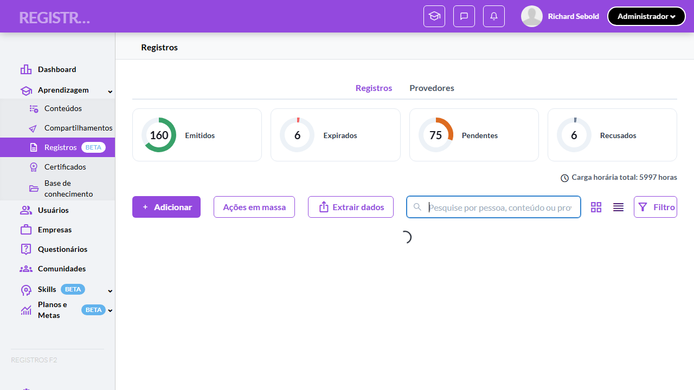
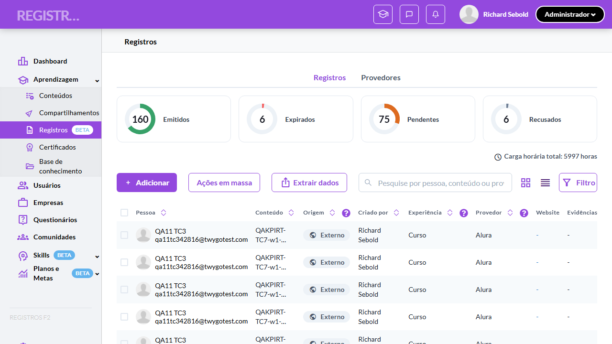
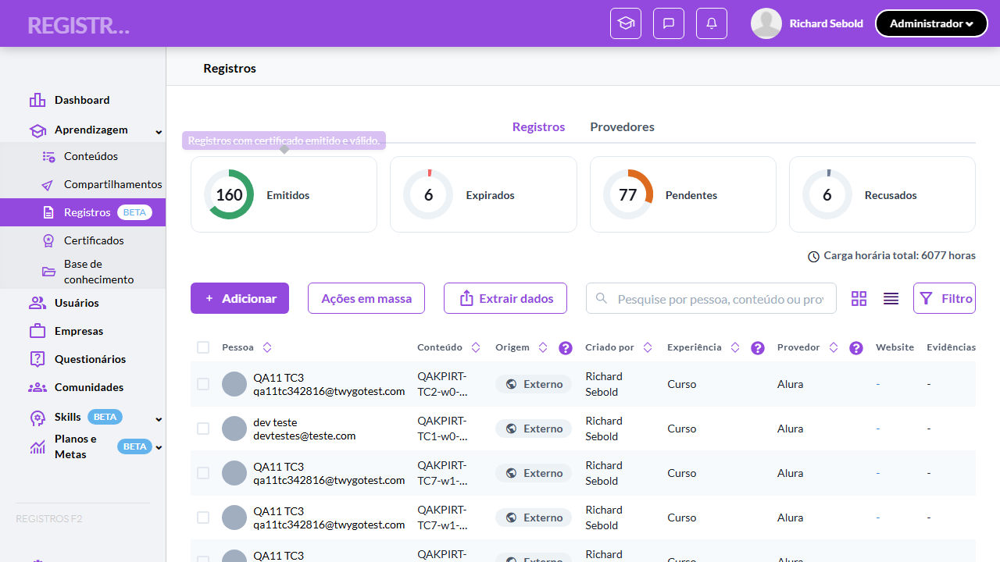

# Casos de teste — Registros de Aprendizagem

[← Voltar ao dashboard](index.md)

Lista detalhada por testsuite. Cada caso traz: o que era esperado pelo XML, quais steps foram executados, evidências (screenshots/trace), texto pronto pra registro de bug e — quando houver falha — uma explicação em PT-BR do motivo.

## KPI cards como dashboard estático (Admin/Líder)

_9 caso(s) — 3 aprovado(s), 1 falha(s), 5 ignorado(s)_

### ✅ Aprovado · TC4 · Validar que a contagem não reage a filtros do drawer · 🔴 Crítico

<a id="validar-que-a-contagem-nao-reage-a-filtros-do-drawer"></a>_Arquivo:_ `validar-contagem-nao-reage-a-filtros-do-drawer.spec.ts` · _Duração:_ 14.07s · _Browser:_ chromium

**Sumário (objetivo do caso):** Garantir que a contagem do Admin é puramente informativa — não reage a filtros aplicados (RN 31).

**Pré-condições:**

```
Ambiente Stage configurado e acessível
Funcionalidade "Registros de Aprendizagem" habilitada no contrato da organização
Usuário logado como Admin
Usuário Líder disponível com liderados diretos cadastrados (alguns com registros)
Organização possui registros com distribuição conhecida entre os 6 status
Pessoa inativada com registros existente na organização (para o cenário de exclusão da contagem)
Registro Emitido com data de validade no dia corrente (para o cenário de expiração — pode exigir manipulação de massa de dados)
```

**Passos do caso (XML/TestLink + execução Playwright):**

_Cada linha reproduz um passo do XML; a coluna **Status** traz o resultado da execução (do step Allure correspondente). Linhas com "Pré-condição" são da execução automatizada (login, navegação inicial) — não fazem parte do roteiro do XML._

| # | Ação do passo | Resultado esperado | Status | Notas | Duração |
|---|---|---|:---:|---|---:|
| — | _Pré-condição:_ 2-3. Aplicar filtro padrão "Pendentes" no drawer → contagens inalteradas (RN 31) | — | ✅ | — | 1.21s |
| 1 | Acessar a tela "Aprendizagem > Registros" como Admin e anotar os números dos 4 cards | Cards exibem as contagens totais da organização. | ✅ | — | 6.96s |
| 2 | Aplicar o filtro padrão "Pendentes" pelo botão "Aplicar" do drawer de filtros | Lista filtra para registros pendentes. | ✅ | — | — |
| 3 | Verificar os números dos 4 KPI cards "Emitidos", "Expirados", "Pendentes" e "Recusados" | Números permanecem exatamente os mesmos (não reagem ao filtro). | ✅ | — | — |
| 4 | Preencher o campo de busca com o nome de uma pessoa | Lista filtra; números dos KPIs continuam inalterados. | ✅ | — | 1.00s |

**Evidências:**

📁 _Pasta:_ [`artifacts/projects-registros-externo-daa5a-o-reage-a-filtros-do-drawer-chromium/`](artifacts/projects-registros-externo-daa5a-o-reage-a-filtros-do-drawer-chromium/)

- 📸 **Screenshot (screenshot)** — [`test-finished-1.png`](artifacts/projects-registros-externo-daa5a-o-reage-a-filtros-do-drawer-chromium/test-finished-1.png)

  

- 🎬 [Vídeo da execução (video.webm)](artifacts/projects-registros-externo-daa5a-o-reage-a-filtros-do-drawer-chromium/video.webm)

- 🎬 [Vídeo da execução (video-1.webm)](artifacts/projects-registros-externo-daa5a-o-reage-a-filtros-do-drawer-chromium/video-1.webm)

- 📦 **Trace** — [`trace.zip`](artifacts/projects-registros-externo-daa5a-o-reage-a-filtros-do-drawer-chromium/trace.zip)

  ```bash
  npx playwright show-trace outputs/registros-externos/reports/kpi-cards-como-dashboard-estatico-admin-lider_20260622-171323/artifacts/projects-registros-externo-daa5a-o-reage-a-filtros-do-drawer-chromium/trace.zip
  ```

- 🎥 **Vídeo** — [`video.webm`](artifacts/projects-registros-externo-daa5a-o-reage-a-filtros-do-drawer-chromium/video.webm)

- 🎥 **Vídeo** — [`video-1.webm`](artifacts/projects-registros-externo-daa5a-o-reage-a-filtros-do-drawer-chromium/video-1.webm)


---

### ⊘ Ignorado · TC5 · Validar escopo da contagem do Líder (liderados diretos) · 🔴 Crítico

<a id="validar-escopo-da-contagem-do-lider-liderados-diretos"></a>_Arquivo:_ `validar-escopo-da-contagem-do-lider.spec.ts` · _Duração:_ 0.83s · _Browser:_ chromium

> **⊘ Por que foi ignorado:** Marcado para revisão (test.fixme): seed/credencial ausente: usuário Líder com liderados de distribuição conhecida (RN 22). Destinatário: QA Lead.

**Sumário (objetivo do caso):** Garantir que o Líder vê contagens cobrindo apenas os liderados diretos (RN 22).

**Pré-condições:**

```
Ambiente Stage configurado e acessível
Funcionalidade "Registros de Aprendizagem" habilitada no contrato da organização
Usuário logado como Admin
Usuário Líder disponível com liderados diretos cadastrados (alguns com registros)
Organização possui registros com distribuição conhecida entre os 6 status
Pessoa inativada com registros existente na organização (para o cenário de exclusão da contagem)
Registro Emitido com data de validade no dia corrente (para o cenário de expiração — pode exigir manipulação de massa de dados)
```

**Passos do caso (XML/TestLink + execução Playwright):**

_Cada linha reproduz um passo do XML; a coluna **Status** traz o resultado da execução (do step Allure correspondente). Linhas com "Pré-condição" são da execução automatizada (login, navegação inicial) — não fazem parte do roteiro do XML._

| # | Ação do passo | Resultado esperado | Status | Notas | Duração |
|---|---|---|:---:|---|---:|
| 1 | Acessar a tela "Aprendizagem > Registros" logado como Líder cuja equipe tem distribuição conhecida (ex: 18 Emitidos, 2 Pendentes, 0 Expirados, 0 Recusados) | Cards exibem "18", "0", "2", "0" — apenas registros dos liderados diretos. | ⊘ | Step não executado — Marcado para revisão (test.fixme): seed/credencial ausente: usuário Líder com liderados de distribuição conhecida (RN 22). Destinatário: QA Lead. | — |
| 2 | Verificar os cards zerados ("Expirados" e "Recusados") | Exibem "0" com anel cinza completo, mantendo o mesmo peso visual dos demais. | ⊘ | Step não executado — Marcado para revisão (test.fixme): seed/credencial ausente: usuário Líder com liderados de distribuição conhecida (RN 22). Destinatário: QA Lead. | — |
| 3 | Verificar o label "Carga horária total: {X} horas" no escopo do Líder | Soma cobre apenas as cargas horárias dos registros dos liderados. | ⊘ | Step não executado — Marcado para revisão (test.fixme): seed/credencial ausente: usuário Líder com liderados de distribuição conhecida (RN 22). Destinatário: QA Lead. | — |

**Evidências:**

📁 _Pasta:_ [`artifacts/projects-registros-externo-2623d-do-Líder-liderados-diretos--chromium/`](artifacts/projects-registros-externo-2623d-do-Líder-liderados-diretos--chromium/)

- 📸 **Screenshot (screenshot)** — [`test-finished-1.png`](artifacts/projects-registros-externo-2623d-do-Líder-liderados-diretos--chromium/test-finished-1.png)

  

- 🎬 [Vídeo da execução (video.webm)](artifacts/projects-registros-externo-2623d-do-Líder-liderados-diretos--chromium/video.webm)

- 🎬 [Vídeo da execução (video-1.webm)](artifacts/projects-registros-externo-2623d-do-Líder-liderados-diretos--chromium/video-1.webm)

- 📦 **Trace** — [`trace.zip`](artifacts/projects-registros-externo-2623d-do-Líder-liderados-diretos--chromium/trace.zip)

  ```bash
  npx playwright show-trace outputs/registros-externos/reports/kpi-cards-como-dashboard-estatico-admin-lider_20260622-171323/artifacts/projects-registros-externo-2623d-do-Líder-liderados-diretos--chromium/trace.zip
  ```

- 🎥 **Vídeo** — [`video.webm`](artifacts/projects-registros-externo-2623d-do-Líder-liderados-diretos--chromium/video.webm)

- 🎥 **Vídeo** — [`video-1.webm`](artifacts/projects-registros-externo-2623d-do-Líder-liderados-diretos--chromium/video-1.webm)

#### ⏳ Pendente — execução automatizada não realizada

- **Severidade do caso (XML):** Crítico
- **Motivo declarado pelo spec:** seed/credencial ausente: usuário Líder com liderados de distribuição conhecida (RN 22). Destinatário: QA Lead.
- **Categoria:** _não declarada_ — pra próxima revisão, ajustar o spec para `test.fixme(true, '[Categoria] motivo')` com uma das categorias canônicas (xml-desatualizado | seed-ausente | dep-externa | bloqueio-temporario).

**Roteiro do XML (para validação manual):**
1. Pré: Ambiente Stage configurado e acessível
1. Pré: Funcionalidade "Registros de Aprendizagem" habilitada no contrato da organização
1. Pré: Usuário logado como Admin
1. Pré: Usuário Líder disponível com liderados diretos cadastrados (alguns com registros)
1. Pré: Organização possui registros com distribuição conhecida entre os 6 status
1. Pré: Pessoa inativada com registros existente na organização (para o cenário de exclusão da contagem)
1. Pré: Registro Emitido com data de validade no dia corrente (para o cenário de expiração — pode exigir manipulação de massa de dados)
1. 1. Acessar a tela "Aprendizagem > Registros" logado como Líder cuja equipe tem distribuição conhecida (ex: 18 Emitidos, 2 Pendentes, 0 Expirados, 0 Recusados)
1. 2. Verificar os cards zerados ("Expirados" e "Recusados")
1. 3. Verificar o label "Carga horária total: {X} horas" no escopo do Líder

> Esse caso não bloqueia a build, mas precisa de validação manual ou ajuste no agente.


---

### ⊘ Ignorado · TC8 · Validar estado "tudo zero" no Admin de organização nova · 🟡 Normal

<a id="validar-estado-tudo-zero-no-admin-de-organizacao-nova"></a>_Arquivo:_ `validar-estado-tudo-zero-no-admin-de-org-nova.spec.ts` · _Duração:_ 0.88s · _Browser:_ chromium

> **⊘ Por que foi ignorado:** Marcado para revisão (test.fixme): seed/ambiente ausente: org Admin sem nenhum registro (RN 36). Destinatário: QA Lead.

**Sumário (objetivo do caso):** Garantir que Admin de org recém-contratada (zero registros) vê os 4 cards zerados com anéis cinza completos (RN 36).

**Pré-condições:**

```
Ambiente Stage configurado e acessível
Funcionalidade "Registros de Aprendizagem" habilitada no contrato da organização
Usuário logado como Admin
Usuário Líder disponível com liderados diretos cadastrados (alguns com registros)
Organização possui registros com distribuição conhecida entre os 6 status
Pessoa inativada com registros existente na organização (para o cenário de exclusão da contagem)
Registro Emitido com data de validade no dia corrente (para o cenário de expiração — pode exigir manipulação de massa de dados)
```

**Passos do caso (XML/TestLink + execução Playwright):**

_Cada linha reproduz um passo do XML; a coluna **Status** traz o resultado da execução (do step Allure correspondente). Linhas com "Pré-condição" são da execução automatizada (login, navegação inicial) — não fazem parte do roteiro do XML._

| # | Ação do passo | Resultado esperado | Status | Notas | Duração |
|---|---|---|:---:|---|---:|
| 1 | Acessar a tela "Aprendizagem > Registros" como Admin de organização sem nenhum registro | Faixa exibe 4 cards com "0" em preto bold e anel cinza claro completo; sem dimming ou encolhimento. | ⊘ | Step não executado — Marcado para revisão (test.fixme): seed/ambiente ausente: org Admin sem nenhum registro (RN 36). Destinatário: QA Lead. | — |
| 2 | Clicar em um dos cards zerados | Nenhum efeito (cards do Admin permanecem estáticos mesmo zerados). | ⊘ | Step não executado — Marcado para revisão (test.fixme): seed/ambiente ausente: org Admin sem nenhum registro (RN 36). Destinatário: QA Lead. | — |

**Evidências:**

📁 _Pasta:_ [`artifacts/projects-registros-externo-3b432-o-Admin-de-organização-nova-chromium/`](artifacts/projects-registros-externo-3b432-o-Admin-de-organização-nova-chromium/)

- 📸 **Screenshot (screenshot)** — [`test-finished-1.png`](artifacts/projects-registros-externo-3b432-o-Admin-de-organização-nova-chromium/test-finished-1.png)

  

- 🎬 [Vídeo da execução (video.webm)](artifacts/projects-registros-externo-3b432-o-Admin-de-organização-nova-chromium/video.webm)

- 🎬 [Vídeo da execução (video-1.webm)](artifacts/projects-registros-externo-3b432-o-Admin-de-organização-nova-chromium/video-1.webm)

- 📦 **Trace** — [`trace.zip`](artifacts/projects-registros-externo-3b432-o-Admin-de-organização-nova-chromium/trace.zip)

  ```bash
  npx playwright show-trace outputs/registros-externos/reports/kpi-cards-como-dashboard-estatico-admin-lider_20260622-171323/artifacts/projects-registros-externo-3b432-o-Admin-de-organização-nova-chromium/trace.zip
  ```

- 🎥 **Vídeo** — [`video.webm`](artifacts/projects-registros-externo-3b432-o-Admin-de-organização-nova-chromium/video.webm)

- 🎥 **Vídeo** — [`video-1.webm`](artifacts/projects-registros-externo-3b432-o-Admin-de-organização-nova-chromium/video-1.webm)

#### ⏳ Pendente — execução automatizada não realizada

- **Severidade do caso (XML):** Normal
- **Motivo declarado pelo spec:** seed/ambiente ausente: org Admin sem nenhum registro (RN 36). Destinatário: QA Lead.
- **Categoria:** _não declarada_ — pra próxima revisão, ajustar o spec para `test.fixme(true, '[Categoria] motivo')` com uma das categorias canônicas (xml-desatualizado | seed-ausente | dep-externa | bloqueio-temporario).

**Roteiro do XML (para validação manual):**
1. Pré: Ambiente Stage configurado e acessível
1. Pré: Funcionalidade "Registros de Aprendizagem" habilitada no contrato da organização
1. Pré: Usuário logado como Admin
1. Pré: Usuário Líder disponível com liderados diretos cadastrados (alguns com registros)
1. Pré: Organização possui registros com distribuição conhecida entre os 6 status
1. Pré: Pessoa inativada com registros existente na organização (para o cenário de exclusão da contagem)
1. Pré: Registro Emitido com data de validade no dia corrente (para o cenário de expiração — pode exigir manipulação de massa de dados)
1. 1. Acessar a tela "Aprendizagem > Registros" como Admin de organização sem nenhum registro
1. 2. Clicar em um dos cards zerados

> Esse caso não bloqueia a build, mas precisa de validação manual ou ajuste no agente.


---

### ✅ Aprovado · TC1 · Validar estrutura, cores e label de carga horária no Admin · 🔴 Crítico

<a id="validar-estrutura-cores-e-label-de-carga-horaria-no-admin"></a>_Arquivo:_ `validar-estrutura-cores-e-carga-horaria-no-admin.spec.ts` · _Duração:_ 12.76s · _Browser:_ chromium

**Sumário (objetivo do caso):** Garantir que o Admin vê os 4 cards com mesma estrutura visual do Aluno e contagem cobrindo toda a organização (RN 18, RN 21).

**Pré-condições:**

```
Ambiente Stage configurado e acessível
Funcionalidade "Registros de Aprendizagem" habilitada no contrato da organização
Usuário logado como Admin
Usuário Líder disponível com liderados diretos cadastrados (alguns com registros)
Organização possui registros com distribuição conhecida entre os 6 status
Pessoa inativada com registros existente na organização (para o cenário de exclusão da contagem)
Registro Emitido com data de validade no dia corrente (para o cenário de expiração — pode exigir manipulação de massa de dados)
```

**Passos do caso (XML/TestLink + execução Playwright):**

_Cada linha reproduz um passo do XML; a coluna **Status** traz o resultado da execução (do step Allure correspondente). Linhas com "Pré-condição" são da execução automatizada (login, navegação inicial) — não fazem parte do roteiro do XML._

| # | Ação do passo | Resultado esperado | Status | Notas | Duração |
|---|---|---|:---:|---|---:|
| 1 | Acessar a tela "Aprendizagem > Registros" como Admin | 4 cards exibidos ("Emitidos", "Expirados", "Pendentes", "Recusados") com donut, número e label; cores: verde, vermelho, laranja e cinza respectivamente. | ✅ | — | 7.88s |
| 2 | Verificar os números dos cards "Emitidos", "Expirados", "Pendentes" e "Recusados" contra a massa de dados conhecida da organização | Contagens refletem todos os registros da organização ativa (todas as pessoas ativas). | ✅ | — | 0.27s |
| 3 | Verificar o label "Carga horária total: {X} horas" | "Carga horária total: {X} horas" com a soma das cargas da organização inteira. | ✅ | — | 0.23s |

**Evidências:**

📁 _Pasta:_ [`artifacts/projects-registros-externo-7ca9b-l-de-carga-horária-no-Admin-chromium/`](artifacts/projects-registros-externo-7ca9b-l-de-carga-horária-no-Admin-chromium/)

- 📸 **Screenshot (screenshot)** — [`test-finished-1.png`](artifacts/projects-registros-externo-7ca9b-l-de-carga-horária-no-Admin-chromium/test-finished-1.png)

  

- 🎬 [Vídeo da execução (video.webm)](artifacts/projects-registros-externo-7ca9b-l-de-carga-horária-no-Admin-chromium/video.webm)

- 🎬 [Vídeo da execução (video-1.webm)](artifacts/projects-registros-externo-7ca9b-l-de-carga-horária-no-Admin-chromium/video-1.webm)

- 📦 **Trace** — [`trace.zip`](artifacts/projects-registros-externo-7ca9b-l-de-carga-horária-no-Admin-chromium/trace.zip)

  ```bash
  npx playwright show-trace outputs/registros-externos/reports/kpi-cards-como-dashboard-estatico-admin-lider_20260622-171323/artifacts/projects-registros-externo-7ca9b-l-de-carga-horária-no-Admin-chromium/trace.zip
  ```

- 🎥 **Vídeo** — [`video.webm`](artifacts/projects-registros-externo-7ca9b-l-de-carga-horária-no-Admin-chromium/video.webm)

- 🎥 **Vídeo** — [`video-1.webm`](artifacts/projects-registros-externo-7ca9b-l-de-carga-horária-no-Admin-chromium/video-1.webm)


---

### ⊘ Ignorado · TC6 · Validar exclusão de pessoas inativadas da contagem · 🔴 Crítico

<a id="validar-exclusao-de-pessoas-inativadas-da-contagem"></a>_Arquivo:_ `validar-exclusao-de-pessoas-inativadas-da-contagem.spec.ts` · _Duração:_ 0.87s · _Browser:_ chromium

> **⊘ Por que foi ignorado:** Marcado para revisão (test.fixme): seed ausente: pessoa inativada com registros + nome conhecido (RN 24). Destinatário: QA Lead.

**Sumário (objetivo do caso):** Garantir que registros de pessoas inativadas não contam no KPI nem aparecem na lista (RN 24).

**Pré-condições:**

```
Ambiente Stage configurado e acessível
Funcionalidade "Registros de Aprendizagem" habilitada no contrato da organização
Usuário logado como Admin
Usuário Líder disponível com liderados diretos cadastrados (alguns com registros)
Organização possui registros com distribuição conhecida entre os 6 status
Pessoa inativada com registros existente na organização (para o cenário de exclusão da contagem)
Registro Emitido com data de validade no dia corrente (para o cenário de expiração — pode exigir manipulação de massa de dados)
```

**Passos do caso (XML/TestLink + execução Playwright):**

_Cada linha reproduz um passo do XML; a coluna **Status** traz o resultado da execução (do step Allure correspondente). Linhas com "Pré-condição" são da execução automatizada (login, navegação inicial) — não fazem parte do roteiro do XML._

| # | Ação do passo | Resultado esperado | Status | Notas | Duração |
|---|---|---|:---:|---|---:|
| 1 | Acessar a tela "Aprendizagem > Registros" como Admin em organização com pessoa inativada que possui registros (ex: 3 Emitidos) | Números dos cards NÃO incluem os registros da pessoa inativada. | ⊘ | Step não executado — Marcado para revisão (test.fixme): seed ausente: pessoa inativada com registros + nome conhecido (RN 24). Destinatário: QA Lead. | — |
| 2 | Preencher o campo de busca com o nome da pessoa inativada | Lista exibe "Nenhum registro encontrado". | ⊘ | Step não executado — Marcado para revisão (test.fixme): seed ausente: pessoa inativada com registros + nome conhecido (RN 24). Destinatário: QA Lead. | — |

**Evidências:**

📁 _Pasta:_ [`artifacts/projects-registros-externo-2752b-soas-inativadas-da-contagem-chromium/`](artifacts/projects-registros-externo-2752b-soas-inativadas-da-contagem-chromium/)

- 📸 **Screenshot (screenshot)** — [`test-finished-1.png`](artifacts/projects-registros-externo-2752b-soas-inativadas-da-contagem-chromium/test-finished-1.png)

  

- 🎬 [Vídeo da execução (video.webm)](artifacts/projects-registros-externo-2752b-soas-inativadas-da-contagem-chromium/video.webm)

- 🎬 [Vídeo da execução (video-1.webm)](artifacts/projects-registros-externo-2752b-soas-inativadas-da-contagem-chromium/video-1.webm)

- 📦 **Trace** — [`trace.zip`](artifacts/projects-registros-externo-2752b-soas-inativadas-da-contagem-chromium/trace.zip)

  ```bash
  npx playwright show-trace outputs/registros-externos/reports/kpi-cards-como-dashboard-estatico-admin-lider_20260622-171323/artifacts/projects-registros-externo-2752b-soas-inativadas-da-contagem-chromium/trace.zip
  ```

- 🎥 **Vídeo** — [`video.webm`](artifacts/projects-registros-externo-2752b-soas-inativadas-da-contagem-chromium/video.webm)

- 🎥 **Vídeo** — [`video-1.webm`](artifacts/projects-registros-externo-2752b-soas-inativadas-da-contagem-chromium/video-1.webm)

#### ⏳ Pendente — execução automatizada não realizada

- **Severidade do caso (XML):** Crítico
- **Motivo declarado pelo spec:** seed ausente: pessoa inativada com registros + nome conhecido (RN 24). Destinatário: QA Lead.
- **Categoria:** _não declarada_ — pra próxima revisão, ajustar o spec para `test.fixme(true, '[Categoria] motivo')` com uma das categorias canônicas (xml-desatualizado | seed-ausente | dep-externa | bloqueio-temporario).

**Roteiro do XML (para validação manual):**
1. Pré: Ambiente Stage configurado e acessível
1. Pré: Funcionalidade "Registros de Aprendizagem" habilitada no contrato da organização
1. Pré: Usuário logado como Admin
1. Pré: Usuário Líder disponível com liderados diretos cadastrados (alguns com registros)
1. Pré: Organização possui registros com distribuição conhecida entre os 6 status
1. Pré: Pessoa inativada com registros existente na organização (para o cenário de exclusão da contagem)
1. Pré: Registro Emitido com data de validade no dia corrente (para o cenário de expiração — pode exigir manipulação de massa de dados)
1. 1. Acessar a tela "Aprendizagem > Registros" como Admin em organização com pessoa inativada que possui registros (ex: 3 Emitidos)
1. 2. Preencher o campo de busca com o nome da pessoa inativada

> Esse caso não bloqueia a build, mas precisa de validação manual ou ajuste no agente.


---

### ⊘ Ignorado · TC9 · Validar Líder com 0 liderados (todos os cards zerados) · 🟡 Normal

<a id="validar-lider-com-0-liderados-todos-os-cards-zerados"></a>_Arquivo:_ `validar-lider-com-0-liderados.spec.ts` · _Duração:_ 0.89s · _Browser:_ chromium

> **⊘ Por que foi ignorado:** Marcado para revisão (test.fixme): seed/credencial ausente: usuário Líder sem liderados diretos (RN 22, RN 36). Destinatário: QA Lead.

**Sumário (objetivo do caso):** Garantir que Líder recém-promovido sem time vê os 4 cards zerados (cenário 08 de h17).

**Pré-condições:**

```
Ambiente Stage configurado e acessível
Funcionalidade "Registros de Aprendizagem" habilitada no contrato da organização
Usuário logado como Admin
Usuário Líder disponível com liderados diretos cadastrados (alguns com registros)
Organização possui registros com distribuição conhecida entre os 6 status
Pessoa inativada com registros existente na organização (para o cenário de exclusão da contagem)
Registro Emitido com data de validade no dia corrente (para o cenário de expiração — pode exigir manipulação de massa de dados)
```

**Passos do caso (XML/TestLink + execução Playwright):**

_Cada linha reproduz um passo do XML; a coluna **Status** traz o resultado da execução (do step Allure correspondente). Linhas com "Pré-condição" são da execução automatizada (login, navegação inicial) — não fazem parte do roteiro do XML._

| # | Ação do passo | Resultado esperado | Status | Notas | Duração |
|---|---|---|:---:|---|---:|
| 1 | Acessar a tela "Aprendizagem > Registros" logado como Líder sem nenhum liderado direto | 4 cards exibem "0" com anéis cinza completos; lista exibe "Nenhum registro encontrado". | ⊘ | Step não executado — Marcado para revisão (test.fixme): seed/credencial ausente: usuário Líder sem liderados diretos (RN 22, RN 36). Destinatário: QA Lead. | — |

**Evidências:**

📁 _Pasta:_ [`artifacts/projects-registros-externo-61901-dos-todos-os-cards-zerados--chromium/`](artifacts/projects-registros-externo-61901-dos-todos-os-cards-zerados--chromium/)

- 📸 **Screenshot (screenshot)** — [`test-finished-1.png`](artifacts/projects-registros-externo-61901-dos-todos-os-cards-zerados--chromium/test-finished-1.png)

  

- 🎬 [Vídeo da execução (video.webm)](artifacts/projects-registros-externo-61901-dos-todos-os-cards-zerados--chromium/video.webm)

- 🎬 [Vídeo da execução (video-1.webm)](artifacts/projects-registros-externo-61901-dos-todos-os-cards-zerados--chromium/video-1.webm)

- 📦 **Trace** — [`trace.zip`](artifacts/projects-registros-externo-61901-dos-todos-os-cards-zerados--chromium/trace.zip)

  ```bash
  npx playwright show-trace outputs/registros-externos/reports/kpi-cards-como-dashboard-estatico-admin-lider_20260622-171323/artifacts/projects-registros-externo-61901-dos-todos-os-cards-zerados--chromium/trace.zip
  ```

- 🎥 **Vídeo** — [`video.webm`](artifacts/projects-registros-externo-61901-dos-todos-os-cards-zerados--chromium/video.webm)

- 🎥 **Vídeo** — [`video-1.webm`](artifacts/projects-registros-externo-61901-dos-todos-os-cards-zerados--chromium/video-1.webm)

#### ⏳ Pendente — execução automatizada não realizada

- **Severidade do caso (XML):** Normal
- **Motivo declarado pelo spec:** seed/credencial ausente: usuário Líder sem liderados diretos (RN 22, RN 36). Destinatário: QA Lead.
- **Categoria:** _não declarada_ — pra próxima revisão, ajustar o spec para `test.fixme(true, '[Categoria] motivo')` com uma das categorias canônicas (xml-desatualizado | seed-ausente | dep-externa | bloqueio-temporario).

**Roteiro do XML (para validação manual):**
1. Pré: Ambiente Stage configurado e acessível
1. Pré: Funcionalidade "Registros de Aprendizagem" habilitada no contrato da organização
1. Pré: Usuário logado como Admin
1. Pré: Usuário Líder disponível com liderados diretos cadastrados (alguns com registros)
1. Pré: Organização possui registros com distribuição conhecida entre os 6 status
1. Pré: Pessoa inativada com registros existente na organização (para o cenário de exclusão da contagem)
1. Pré: Registro Emitido com data de validade no dia corrente (para o cenário de expiração — pode exigir manipulação de massa de dados)
1. 1. Acessar a tela "Aprendizagem > Registros" logado como Líder sem nenhum liderado direto

> Esse caso não bloqueia a build, mas precisa de validação manual ou ajuste no agente.


---

### ✅ Aprovado · TC3 · Validar não-clicabilidade dos cards no Admin · 🔴 Crítico

<a id="validar-nao-clicabilidade-dos-cards-no-admin"></a>_Arquivo:_ `validar-nao-clicabilidade-dos-cards-no-admin.spec.ts` · _Duração:_ 14.29s · _Browser:_ chromium

**Sumário (objetivo do caso):** Garantir que cards do Admin/Líder não respondem a clique, hover ou estados de seleção (RN 30).

**Pré-condições:**

```
Ambiente Stage configurado e acessível
Funcionalidade "Registros de Aprendizagem" habilitada no contrato da organização
Usuário logado como Admin
Usuário Líder disponível com liderados diretos cadastrados (alguns com registros)
Organização possui registros com distribuição conhecida entre os 6 status
Pessoa inativada com registros existente na organização (para o cenário de exclusão da contagem)
Registro Emitido com data de validade no dia corrente (para o cenário de expiração — pode exigir manipulação de massa de dados)
```

**Passos do caso (XML/TestLink + execução Playwright):**

_Cada linha reproduz um passo do XML; a coluna **Status** traz o resultado da execução (do step Allure correspondente). Linhas com "Pré-condição" são da execução automatizada (login, navegação inicial) — não fazem parte do roteiro do XML._

| # | Ação do passo | Resultado esperado | Status | Notas | Duração |
|---|---|---|:---:|---|---:|
| 1 | Acessar a tela "Aprendizagem > Registros" como Admin | Cards exibidos sem cursor pointer ao passar o mouse. | ✅ | — | 7.54s |
| 2 | Passar o mouse sobre o card "Pendentes" | Nenhuma elevação/transform ocorre; cursor permanece default; apenas o tooltip aparece. | ✅ | — | 0.27s |
| 3 | Clicar no card "Pendentes" | Nenhum efeito: lista não filtra, card não ganha estado "selected", nenhum card fica dimmed. | ✅ | — | 0.52s |

**Evidências:**

📁 _Pasta:_ [`artifacts/projects-registros-externo-6aefd-bilidade-dos-cards-no-Admin-chromium/`](artifacts/projects-registros-externo-6aefd-bilidade-dos-cards-no-Admin-chromium/)

- 📸 **Screenshot (screenshot)** — [`test-finished-1.png`](artifacts/projects-registros-externo-6aefd-bilidade-dos-cards-no-Admin-chromium/test-finished-1.png)

  

- 🎬 [Vídeo da execução (video.webm)](artifacts/projects-registros-externo-6aefd-bilidade-dos-cards-no-Admin-chromium/video.webm)

- 🎬 [Vídeo da execução (video-1.webm)](artifacts/projects-registros-externo-6aefd-bilidade-dos-cards-no-Admin-chromium/video-1.webm)

- 📦 **Trace** — [`trace.zip`](artifacts/projects-registros-externo-6aefd-bilidade-dos-cards-no-Admin-chromium/trace.zip)

  ```bash
  npx playwright show-trace outputs/registros-externos/reports/kpi-cards-como-dashboard-estatico-admin-lider_20260622-171323/artifacts/projects-registros-externo-6aefd-bilidade-dos-cards-no-Admin-chromium/trace.zip
  ```

- 🎥 **Vídeo** — [`video.webm`](artifacts/projects-registros-externo-6aefd-bilidade-dos-cards-no-Admin-chromium/video.webm)

- 🎥 **Vídeo** — [`video-1.webm`](artifacts/projects-registros-externo-6aefd-bilidade-dos-cards-no-Admin-chromium/video-1.webm)


---

### ❌ Falhou · TC2 · Validar tooltips no tom institucional do Admin · 🔴 Crítico

<a id="validar-tooltips-no-tom-institucional-do-admin"></a>_Arquivo:_ `validar-tooltips-no-tom-institucional-do-admin.spec.ts` · _Duração:_ 12.67s · _Browser:_ chromium

> **❌ Por que falhou:** Error: expect(received).toBe(expected) // Object.is equality
> _Step impactado:_ **2. Tooltip do card "Emitidos"**

**Sumário (objetivo do caso):** Garantir os textos literais institucionais dos tooltips do Admin/Líder (RN 18.3.2).

**Pré-condições:**

```
Ambiente Stage configurado e acessível
Funcionalidade "Registros de Aprendizagem" habilitada no contrato da organização
Usuário logado como Admin
Usuário Líder disponível com liderados diretos cadastrados (alguns com registros)
Organização possui registros com distribuição conhecida entre os 6 status
Pessoa inativada com registros existente na organização (para o cenário de exclusão da contagem)
Registro Emitido com data de validade no dia corrente (para o cenário de expiração — pode exigir manipulação de massa de dados)
```

**Passos do caso (XML/TestLink + execução Playwright):**

_Cada linha reproduz um passo do XML; a coluna **Status** traz o resultado da execução (do step Allure correspondente). Linhas com "Pré-condição" são da execução automatizada (login, navegação inicial) — não fazem parte do roteiro do XML._

| # | Ação do passo | Resultado esperado | Status | Notas | Duração |
|---|---|---|:---:|---|---:|
| 1 | Acessar a tela "Aprendizagem > Registros" como Admin | 4 cards exibidos. | ✅ | — | 7.43s |
| 2 | Passar o mouse sobre o card "Emitidos" | Tooltip exibida: "Registros aprovados e dentro do prazo de validade na organização." | ❌ | Error: expect(received).toBe(expected) // Object.is equality | 0.22s |
| 3 | Passar o mouse sobre o card "Expirados" | Tooltip exibida: "Registros cuja data de validade já passou. Sinaliza necessidade de recertificação." | ⊘ | Step não executado: o teste foi interrompido antes. Causa: Error: expect(received).toBe(expected) // Object.is equality. | — |
| 4 | Passar o mouse sobre o card "Pendentes" | Tooltip exibida: "Registros externos aguardando avaliação. Use o menu de ação ou as ações em massa pra aprovar/recusar." | ⊘ | Step não executado: o teste foi interrompido antes. Causa: Error: expect(received).toBe(expected) // Object.is equality. | — |
| 5 | Passar o mouse sobre o card "Recusados" | Tooltip exibida: "Registros externos recusados na avaliação. Veja o motivo na ficha individual." | ⊘ | Step não executado: o teste foi interrompido antes. Causa: Error: expect(received).toBe(expected) // Object.is equality. | — |

**Evidências:**

📁 _Pasta:_ [`artifacts/projects-registros-externo-b015c--tom-institucional-do-Admin-chromium/`](artifacts/projects-registros-externo-b015c--tom-institucional-do-Admin-chromium/)

- 📸 **Screenshot (screenshot)** — [`test-failed-1.png`](artifacts/projects-registros-externo-b015c--tom-institucional-do-Admin-chromium/test-failed-1.png)

  

- 🎬 [Vídeo da execução (video.webm)](artifacts/projects-registros-externo-b015c--tom-institucional-do-Admin-chromium/video.webm)

- 🎬 [Vídeo da execução (video-1.webm)](artifacts/projects-registros-externo-b015c--tom-institucional-do-Admin-chromium/video-1.webm)

- 📦 **Trace** — [`trace.zip`](artifacts/projects-registros-externo-b015c--tom-institucional-do-Admin-chromium/trace.zip)

  ```bash
  npx playwright show-trace outputs/registros-externos/reports/kpi-cards-como-dashboard-estatico-admin-lider_20260622-171323/artifacts/projects-registros-externo-b015c--tom-institucional-do-Admin-chromium/trace.zip
  ```

- 🎥 **Vídeo** — [`video.webm`](artifacts/projects-registros-externo-b015c--tom-institucional-do-Admin-chromium/video.webm)

- 🎥 **Vídeo** — [`video-1.webm`](artifacts/projects-registros-externo-b015c--tom-institucional-do-Admin-chromium/video-1.webm)

- 📄 **DOM no momento da falha** — [`error-context.md`](artifacts/projects-registros-externo-b015c--tom-institucional-do-Admin-chromium/error-context.md)

#### 🐛 Pronto para registro de bug

> ❓ **Análise automática:** Inconclusivo (precisa investigação manual) · Confiança 🔴 baixa
> _Por quê:_ Sem sinal Network in-scope ou padrão de erro conhecido — revisar trace
> _Bug-report estruturado:_ [`bug-reports/kpi-cards-como-dashboard-estatico-admin-lider__validar-tooltips-no-tom-institucional-do-admin.md`](bug-reports/kpi-cards-como-dashboard-estatico-admin-lider__validar-tooltips-no-tom-institucional-do-admin.md)

**Próximas ações sugeridas:**
- Sem evidência suficiente para classificar — abrir `trace.zip` (`npx playwright show-trace`) para ver passo a passo da execução.
- Reabrir o agente com o trace em mãos para reclassificar manualmente em uma das 4 categorias.

**Descrição do BUG:** [Crítico] Validar tooltips no tom institucional do Admin — Error: expect(received).toBe(expected) // Object.is equality

**Passo a passo para reprodução:**
1. Pré: Ambiente Stage configurado e acessível
1. Pré: Funcionalidade "Registros de Aprendizagem" habilitada no contrato da organização
1. Pré: Usuário logado como Admin
1. Pré: Usuário Líder disponível com liderados diretos cadastrados (alguns com registros)
1. Pré: Organização possui registros com distribuição conhecida entre os 6 status
1. Pré: Pessoa inativada com registros existente na organização (para o cenário de exclusão da contagem)
1. Pré: Registro Emitido com data de validade no dia corrente (para o cenário de expiração — pode exigir manipulação de massa de dados)
1. 1. Acessar a tela "Aprendizagem > Registros" como Admin
1. 2. Passar o mouse sobre o card "Emitidos"
1. 3. Passar o mouse sobre o card "Expirados"
1. 4. Passar o mouse sobre o card "Pendentes"
1. 5. Passar o mouse sobre o card "Recusados"

**Comportamento esperado:** Tooltip exibida: "Registros aprovados e dentro do prazo de validade na organização."

**Comportamento atual:** Error: expect(received).toBe(expected) // Object.is equality (falha aconteceu no passo 2: "Tooltip do card "Emitidos"", que deveria resultar em: Tooltip exibida: "Registros aprovados e dentro do prazo de validade na organização.")

**Informações:**

| Campo | Valor |
|---|---|
| URL | `https://registrosf2.stage.twygoead.com/` |
| Login | Credenciais via env: `TWYGO_STAGING_REGISTROS_EXTERNOS_EMAIL` (consulte `.env`) |
| Senha | Credenciais via env: `TWYGO_STAGING_REGISTROS_EXTERNOS_PASSWORD` (consulte `.env`) |
| orgId | 37079 |
| Outros | Browser: chromium |
| Outros | runId: kpi-cards-como-dashboard-estatico-admin-lider_20260622-171323 |
| Outros | Duração até a falha: 12.67s |
| Outros | Step impactado: 2. Tooltip do card "Emitidos" |

**Evidências:**

- Screenshot capturado pelo Playwright (screenshot): artifacts/projects-registros-externo-b015c--tom-institucional-do-Admin-chromium/test-failed-1.png
- Vídeo da execução (video-1.webm): artifacts/projects-registros-externo-b015c--tom-institucional-do-Admin-chromium/video-1.webm
- Vídeo da execução (video.webm): artifacts/projects-registros-externo-b015c--tom-institucional-do-Admin-chromium/video.webm
- Snapshot do DOM/contexto da página (error-context.md): artifacts/projects-registros-externo-b015c--tom-institucional-do-Admin-chromium/error-context.md
- Trace completo do Playwright (.zip) — `npx playwright show-trace`: artifacts/projects-registros-externo-b015c--tom-institucional-do-Admin-chromium/trace.zip

<details><summary>📋 Ver texto agregado para copiar (Jira/GitHub/Linear)</summary>

```
Descrição do BUG
[Crítico] Validar tooltips no tom institucional do Admin — Error: expect(received).toBe(expected) // Object.is equality

Passo a passo para reprodução
  Pré: Ambiente Stage configurado e acessível
  Pré: Funcionalidade "Registros de Aprendizagem" habilitada no contrato da organização
  Pré: Usuário logado como Admin
  Pré: Usuário Líder disponível com liderados diretos cadastrados (alguns com registros)
  Pré: Organização possui registros com distribuição conhecida entre os 6 status
  Pré: Pessoa inativada com registros existente na organização (para o cenário de exclusão da contagem)
  Pré: Registro Emitido com data de validade no dia corrente (para o cenário de expiração — pode exigir manipulação de massa de dados)
  1. Acessar a tela "Aprendizagem > Registros" como Admin
  2. Passar o mouse sobre o card "Emitidos"
  3. Passar o mouse sobre o card "Expirados"
  4. Passar o mouse sobre o card "Pendentes"
  5. Passar o mouse sobre o card "Recusados"

Comportamento esperado
Tooltip exibida: "Registros aprovados e dentro do prazo de validade na organização."

Comportamento atual
Error: expect(received).toBe(expected) // Object.is equality (falha aconteceu no passo 2: "Tooltip do card "Emitidos"", que deveria resultar em: Tooltip exibida: "Registros aprovados e dentro do prazo de validade na organização.")

Informações
- URL: https://registrosf2.stage.twygoead.com/
- Login: Credenciais via env: `TWYGO_STAGING_REGISTROS_EXTERNOS_EMAIL` (consulte `.env`)
- Senha: Credenciais via env: `TWYGO_STAGING_REGISTROS_EXTERNOS_PASSWORD` (consulte `.env`)
- ID do ambiente (orgId): 37079
- Outros:
  - Browser: chromium
  - runId: kpi-cards-como-dashboard-estatico-admin-lider_20260622-171323
  - Duração até a falha: 12.67s
  - Step impactado: 2. Tooltip do card "Emitidos"

Evidências
- Screenshot capturado pelo Playwright (screenshot): artifacts/projects-registros-externo-b015c--tom-institucional-do-Admin-chromium/test-failed-1.png
- Vídeo da execução (video-1.webm): artifacts/projects-registros-externo-b015c--tom-institucional-do-Admin-chromium/video-1.webm
- Vídeo da execução (video.webm): artifacts/projects-registros-externo-b015c--tom-institucional-do-Admin-chromium/video.webm
- Snapshot do DOM/contexto da página (error-context.md): artifacts/projects-registros-externo-b015c--tom-institucional-do-Admin-chromium/error-context.md
- Trace completo do Playwright (.zip) — `npx playwright show-trace`: artifacts/projects-registros-externo-b015c--tom-institucional-do-Admin-chromium/trace.zip

Execução
- runId: kpi-cards-como-dashboard-estatico-admin-lider_20260622-171323
- environment.json: staging-registros-externos
- testsuite: KPI cards como dashboard estático (Admin/Líder)
- testcase: Validar tooltips no tom institucional do Admin

```

</details>

<details><summary>🔧 Stack trace técnica completa (para desenvolvedor)</summary>

```
Error: expect(received).toBe(expected) // Object.is equality

Expected: "Registros aprovados e dentro do prazo de validade na organização."
Received: "Registros com certificado emitido e válido."
```

</details>

---

### ⊘ Ignorado · TC7 · Validar transição Emitido → Expirado ao cruzar a data de validade · 🔴 Crítico

<a id="validar-transicao-emitido-expirado-ao-cruzar-a-data-de-validade"></a>_Arquivo:_ `validar-transicao-emitido-expirado-ao-cruzar-validade.spec.ts` · _Duração:_ 1.02s · _Browser:_ chromium

> **⊘ Por que foi ignorado:** Marcado para revisão (test.fixme): dependência externa/Spike S1: massa com validade no instante do teste + refresh async não definido (RN 25). Destinatário: QA Lead + dev.

**Sumário (objetivo do caso):** Garantir que registro com data de validade vencida reflete como Expirado no KPI sem reload manual (RN 25 — Spike S1; estratégia de detecção é decisão do dev).

**Pré-condições:**

```
Ambiente Stage configurado e acessível
Funcionalidade "Registros de Aprendizagem" habilitada no contrato da organização
Usuário logado como Admin
Usuário Líder disponível com liderados diretos cadastrados (alguns com registros)
Organização possui registros com distribuição conhecida entre os 6 status
Pessoa inativada com registros existente na organização (para o cenário de exclusão da contagem)
Registro Emitido com data de validade no dia corrente (para o cenário de expiração — pode exigir manipulação de massa de dados)
```

**Passos do caso (XML/TestLink + execução Playwright):**

_Cada linha reproduz um passo do XML; a coluna **Status** traz o resultado da execução (do step Allure correspondente). Linhas com "Pré-condição" são da execução automatizada (login, navegação inicial) — não fazem parte do roteiro do XML._

| # | Ação do passo | Resultado esperado | Status | Notas | Duração |
|---|---|---|:---:|---|---:|
| 1 | Acessar a tela "Aprendizagem > Registros" como Admin com registro Emitido cuja data de validade vence no momento do teste (massa de dados manipulada) | Card "Emitidos" inclui o registro; card "Expirados" não. | ⊘ | Step não executado — Marcado para revisão (test.fixme): dependência externa/Spike S1: massa com validade no instante do teste + refresh async não definido (RN 25). Destinatário: QA Lead + dev. | — |
| 2 | Aguardar o registro cruzar a data de validade com a tela aberta (próximo ciclo de refresh) | Card "Emitidos" decrementa 1 e card "Expirados" incrementa 1, sem reload manual da página. | ⊘ | Step não executado — Marcado para revisão (test.fixme): dependência externa/Spike S1: massa com validade no instante do teste + refresh async não definido (RN 25). Destinatário: QA Lead + dev. | — |

**Evidências:**

📁 _Pasta:_ [`artifacts/projects-registros-externo-fbc41-o-cruzar-a-data-de-validade-chromium/`](artifacts/projects-registros-externo-fbc41-o-cruzar-a-data-de-validade-chromium/)

- 📸 **Screenshot (screenshot)** — [`test-finished-1.png`](artifacts/projects-registros-externo-fbc41-o-cruzar-a-data-de-validade-chromium/test-finished-1.png)

  

- 🎬 [Vídeo da execução (video.webm)](artifacts/projects-registros-externo-fbc41-o-cruzar-a-data-de-validade-chromium/video.webm)

- 🎬 [Vídeo da execução (video-1.webm)](artifacts/projects-registros-externo-fbc41-o-cruzar-a-data-de-validade-chromium/video-1.webm)

- 📦 **Trace** — [`trace.zip`](artifacts/projects-registros-externo-fbc41-o-cruzar-a-data-de-validade-chromium/trace.zip)

  ```bash
  npx playwright show-trace outputs/registros-externos/reports/kpi-cards-como-dashboard-estatico-admin-lider_20260622-171323/artifacts/projects-registros-externo-fbc41-o-cruzar-a-data-de-validade-chromium/trace.zip
  ```

- 🎥 **Vídeo** — [`video.webm`](artifacts/projects-registros-externo-fbc41-o-cruzar-a-data-de-validade-chromium/video.webm)

- 🎥 **Vídeo** — [`video-1.webm`](artifacts/projects-registros-externo-fbc41-o-cruzar-a-data-de-validade-chromium/video-1.webm)

#### ⏳ Pendente — execução automatizada não realizada

- **Severidade do caso (XML):** Crítico
- **Motivo declarado pelo spec:** dependência externa/Spike S1: massa com validade no instante do teste + refresh async não definido (RN 25). Destinatário: QA Lead + dev.
- **Categoria:** _não declarada_ — pra próxima revisão, ajustar o spec para `test.fixme(true, '[Categoria] motivo')` com uma das categorias canônicas (xml-desatualizado | seed-ausente | dep-externa | bloqueio-temporario).

**Roteiro do XML (para validação manual):**
1. Pré: Ambiente Stage configurado e acessível
1. Pré: Funcionalidade "Registros de Aprendizagem" habilitada no contrato da organização
1. Pré: Usuário logado como Admin
1. Pré: Usuário Líder disponível com liderados diretos cadastrados (alguns com registros)
1. Pré: Organização possui registros com distribuição conhecida entre os 6 status
1. Pré: Pessoa inativada com registros existente na organização (para o cenário de exclusão da contagem)
1. Pré: Registro Emitido com data de validade no dia corrente (para o cenário de expiração — pode exigir manipulação de massa de dados)
1. 1. Acessar a tela "Aprendizagem > Registros" como Admin com registro Emitido cuja data de validade vence no momento do teste (massa de dados manipulada)
1. 2. Aguardar o registro cruzar a data de validade com a tela aberta (próximo ciclo de refresh)

> Esse caso não bloqueia a build, mas precisa de validação manual ou ajuste no agente.


---
