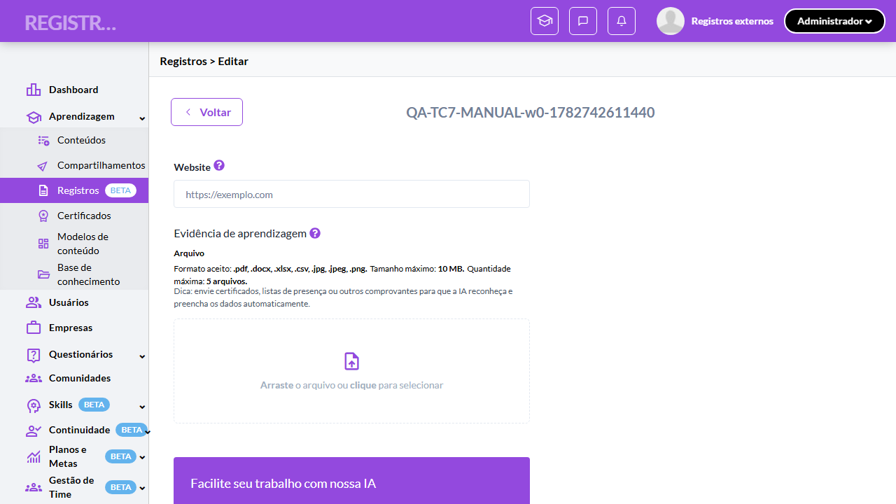
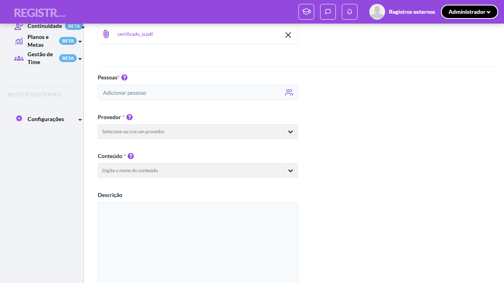
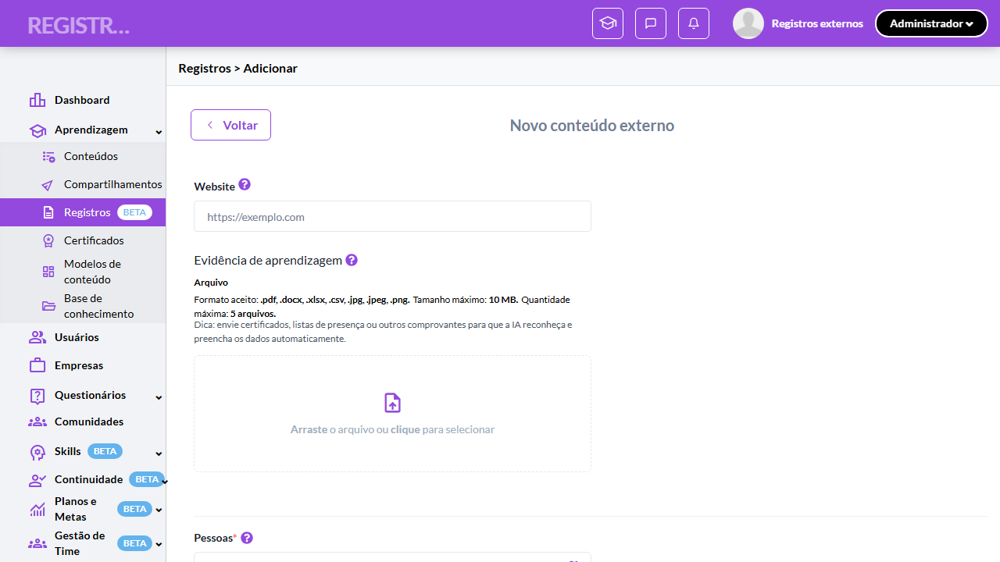
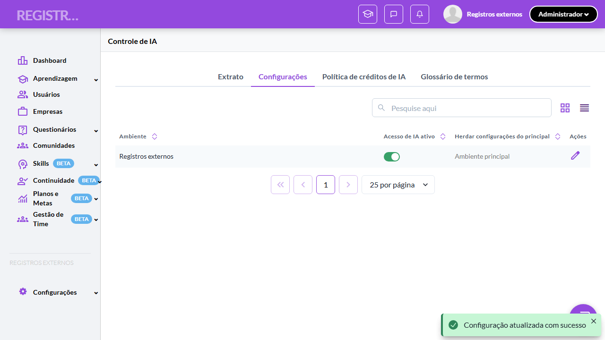
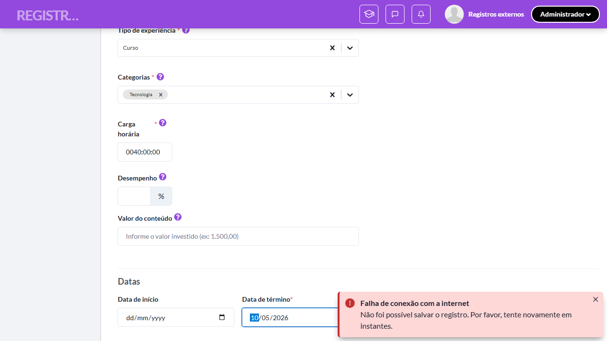
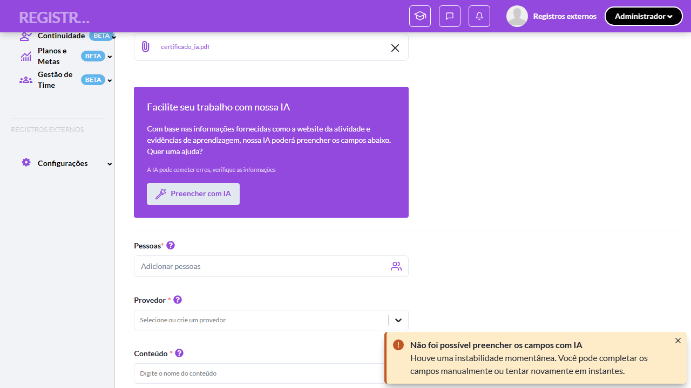

# Casos de teste — Registros de Aprendizagem

[← Voltar ao dashboard](index.md)

Lista detalhada por testsuite. Cada caso traz: o que era esperado pelo XML, quais steps foram executados, evidências (screenshots/trace), texto pronto pra registro de bug e — quando houver falha — uma explicação em PT-BR do motivo.

## Preenchimento com IA e crédito de IA (3 estados e modais por perfil)

_14 caso(s) — 5 aprovado(s), 0 falha(s), 9 ignorado(s)_

### ✅ Aprovado · Validar presença do card promocional de IA nos modos editáveis (Admin: adicionar e editar) 

<a id="validar-presenca-do-card-promocional-de-ia-nos-modos-editaveis-admin-adicionar-e-editar"></a>_Arquivo:_ `tc1-card-promocional-de-ia-nos-modos-editaveis.spec.ts` · _Duração:_ 30.98s · _Browser:_ chromium

**Passos do caso (XML/TestLink + execução Playwright):**

_Cada linha reproduz um passo do XML; a coluna **Status** traz o resultado da execução (do step Allure correspondente). Linhas com "Pré-condição" são da execução automatizada (login, navegação inicial) — não fazem parte do roteiro do XML._

| # | Ação do passo | Resultado esperado | Status | Notas | Duração |
|---|---|---|:---:|---|---:|
| — | _Pré-condição:_ 1. Form "Adicionar registro" como Admin → card de IA com título, botão e disclaimer | — | ✅ | — | 15.35s |
| — | _Pré-condição:_ 3. Form de EDIÇÃO de um registro Externo (Admin) → card de IA exibido | — | ✅ | — | 9.24s |

**Evidências:**

📁 _Pasta:_ [`artifacts/projects-registros-externo-44451-s-Admin-adicionar-e-editar--chromium/`](artifacts/projects-registros-externo-44451-s-Admin-adicionar-e-editar--chromium/)

- 📸 **Screenshot (screenshot)** — [`test-finished-1.png`](artifacts/projects-registros-externo-44451-s-Admin-adicionar-e-editar--chromium/test-finished-1.png)

  

- 🎬 [Vídeo da execução (video.webm)](artifacts/projects-registros-externo-44451-s-Admin-adicionar-e-editar--chromium/video.webm)

- 🎬 [Vídeo da execução (video-1.webm)](artifacts/projects-registros-externo-44451-s-Admin-adicionar-e-editar--chromium/video-1.webm)

- 📦 **Trace** — [`trace.zip`](artifacts/projects-registros-externo-44451-s-Admin-adicionar-e-editar--chromium/trace.zip)

  ```bash
  npx playwright show-trace outputs/registros-externos/reports/preenchimento-com-ia-e-credito-de-ia-3-estados-e-modais-por-perfil_20260629-170852/artifacts/projects-registros-externo-44451-s-Admin-adicionar-e-editar--chromium/trace.zip
  ```

- 🎥 **Vídeo** — [`video.webm`](artifacts/projects-registros-externo-44451-s-Admin-adicionar-e-editar--chromium/video.webm)

- 🎥 **Vídeo** — [`video-1.webm`](artifacts/projects-registros-externo-44451-s-Admin-adicionar-e-editar--chromium/video-1.webm)


---

### ⊘ Ignorado · Validar card de IA no form de adição como Aluno (perfil Aluno ausente) 

<a id="validar-card-de-ia-no-form-de-adicao-como-aluno-perfil-aluno-ausente"></a>_Arquivo:_ `tc1-card-promocional-de-ia-nos-modos-editaveis.spec.ts` · _Duração:_ 0.00s · _Browser:_ chromium

> **⊘ Por que foi ignorado:** [REVISAR] Motivo do skip não declarado no spec. Edite o `test.fixme(true, "[Categoria] motivo")` indicando uma das categorias canônicas: xml-desatualizado | seed-ausente | dep-externa | bloqueio-temporario.

**Passos do caso (XML/TestLink + execução Playwright):**

_Cada linha reproduz um passo do XML; a coluna **Status** traz o resultado da execução (do step Allure correspondente). Linhas com "Pré-condição" são da execução automatizada (login, navegação inicial) — não fazem parte do roteiro do XML._

_Sem steps Allure ou metadata XML para este testcase._

**Evidências:**

_Sem evidências anexadas._

#### ⏳ Pendente — execução automatizada não realizada

- **Severidade do caso (XML):** —
- **Categoria:** ⚠️ Não declarada
- **Motivo declarado pelo spec:** _ausente_
- **Próximo passo:** Editar o spec para declarar `test.fixme(true, '[Categoria] motivo')` com uma das categorias canônicas (xml-desatualizado | seed-ausente | dep-externa | bloqueio-temporario). Sem declaração, leitor leigo não sabe quem precisa agir.

**Roteiro do XML (para validação manual):**
1. — (sem steps documentados no XML)

> Esse caso não bloqueia a build, mas precisa de validação manual ou ajuste no agente.


---

### ⊘ Ignorado · Validar ausência do card de IA em Visualizar e Avaliar (passos 4-5) 

<a id="validar-ausencia-do-card-de-ia-em-visualizar-e-avaliar-passos-4-5"></a>_Arquivo:_ `tc1-card-promocional-de-ia-nos-modos-editaveis.spec.ts` · _Duração:_ 0.00s · _Browser:_ chromium

> **⊘ Por que foi ignorado:** [REVISAR] Motivo do skip não declarado no spec. Edite o `test.fixme(true, "[Categoria] motivo")` indicando uma das categorias canônicas: xml-desatualizado | seed-ausente | dep-externa | bloqueio-temporario.

**Passos do caso (XML/TestLink + execução Playwright):**

_Cada linha reproduz um passo do XML; a coluna **Status** traz o resultado da execução (do step Allure correspondente). Linhas com "Pré-condição" são da execução automatizada (login, navegação inicial) — não fazem parte do roteiro do XML._

_Sem steps Allure ou metadata XML para este testcase._

**Evidências:**

_Sem evidências anexadas._

#### ⏳ Pendente — execução automatizada não realizada

- **Severidade do caso (XML):** —
- **Categoria:** ⚠️ Não declarada
- **Motivo declarado pelo spec:** _ausente_
- **Próximo passo:** Editar o spec para declarar `test.fixme(true, '[Categoria] motivo')` com uma das categorias canônicas (xml-desatualizado | seed-ausente | dep-externa | bloqueio-temporario). Sem declaração, leitor leigo não sabe quem precisa agir.

**Roteiro do XML (para validação manual):**
1. — (sem steps documentados no XML)

> Esse caso não bloqueia a build, mas precisa de validação manual ou ajuste no agente.


---

### ✅ Aprovado · Validar estado habilitada + com crédito (form aceita o preenchimento por IA) 

<a id="validar-estado-habilitada-com-credito-form-aceita-o-preenchimento-por-ia"></a>_Arquivo:_ `tc2-habilitada-com-credito-fluxo-de-sucesso.spec.ts` · _Duração:_ 18.34s · _Browser:_ chromium

**Passos do caso (XML/TestLink + execução Playwright):**

_Cada linha reproduz um passo do XML; a coluna **Status** traz o resultado da execução (do step Allure correspondente). Linhas com "Pré-condição" são da execução automatizada (login, navegação inicial) — não fazem parte do roteiro do XML._

| # | Ação do passo | Resultado esperado | Status | Notas | Duração |
|---|---|---|:---:|---|---:|
| — | _Pré-condição:_ 1. Acessar form "Adicionar registro" como Admin → botão exibido desabilitado | — | ✅ | — | 10.77s |
| — | _Pré-condição:_ 2. Upload de "certificado_ia.pdf" → botão "Preencher com IA" habilita | — | ✅ | — | 0.59s |
| — | _Pré-condição:_ 3. Clicar "Preencher com IA" → back aceita o request (POST ai_fill 2xx) | — | ✅ | — | 1.75s |

**Evidências:**

📁 _Pasta:_ [`artifacts/projects-registros-externo-47c9e-ita-o-preenchimento-por-IA--chromium/`](artifacts/projects-registros-externo-47c9e-ita-o-preenchimento-por-IA--chromium/)

- 📸 **Screenshot (screenshot)** — [`test-finished-1.png`](artifacts/projects-registros-externo-47c9e-ita-o-preenchimento-por-IA--chromium/test-finished-1.png)

  

- 🎬 [Vídeo da execução (video.webm)](artifacts/projects-registros-externo-47c9e-ita-o-preenchimento-por-IA--chromium/video.webm)

- 🎬 [Vídeo da execução (video-1.webm)](artifacts/projects-registros-externo-47c9e-ita-o-preenchimento-por-IA--chromium/video-1.webm)

- 📦 **Trace** — [`trace.zip`](artifacts/projects-registros-externo-47c9e-ita-o-preenchimento-por-IA--chromium/trace.zip)

  ```bash
  npx playwright show-trace outputs/registros-externos/reports/preenchimento-com-ia-e-credito-de-ia-3-estados-e-modais-por-perfil_20260629-170852/artifacts/projects-registros-externo-47c9e-ita-o-preenchimento-por-IA--chromium/trace.zip
  ```

- 🎥 **Vídeo** — [`video.webm`](artifacts/projects-registros-externo-47c9e-ita-o-preenchimento-por-IA--chromium/video.webm)

- 🎥 **Vídeo** — [`video-1.webm`](artifacts/projects-registros-externo-47c9e-ita-o-preenchimento-por-IA--chromium/video-1.webm)


---

### ⊘ Ignorado · Validar preenchimento visual de Tipo/Categorias + toast verde (IA stage lenta) 

<a id="validar-preenchimento-visual-de-tipo-categorias-toast-verde-ia-stage-lenta"></a>_Arquivo:_ `tc2-habilitada-com-credito-fluxo-de-sucesso.spec.ts` · _Duração:_ 0.00s · _Browser:_ chromium

> **⊘ Por que foi ignorado:** [REVISAR] Motivo do skip não declarado no spec. Edite o `test.fixme(true, "[Categoria] motivo")` indicando uma das categorias canônicas: xml-desatualizado | seed-ausente | dep-externa | bloqueio-temporario.

**Passos do caso (XML/TestLink + execução Playwright):**

_Cada linha reproduz um passo do XML; a coluna **Status** traz o resultado da execução (do step Allure correspondente). Linhas com "Pré-condição" são da execução automatizada (login, navegação inicial) — não fazem parte do roteiro do XML._

_Sem steps Allure ou metadata XML para este testcase._

**Evidências:**

_Sem evidências anexadas._

#### ⏳ Pendente — execução automatizada não realizada

- **Severidade do caso (XML):** —
- **Categoria:** ⚠️ Não declarada
- **Motivo declarado pelo spec:** _ausente_
- **Próximo passo:** Editar o spec para declarar `test.fixme(true, '[Categoria] motivo')` com uma das categorias canônicas (xml-desatualizado | seed-ausente | dep-externa | bloqueio-temporario). Sem declaração, leitor leigo não sabe quem precisa agir.

**Roteiro do XML (para validação manual):**
1. — (sem steps documentados no XML)

> Esse caso não bloqueia a build, mas precisa de validação manual ou ajuste no agente.


---

### ⊘ Ignorado · TC3 · Validar estado habilitada + sem crédito no Admin (modal com Contato) · 🔴 Crítico

<a id="validar-estado-habilitada-sem-credito-no-admin-modal-com-contato"></a>_Arquivo:_ `tc3-sem-credito-admin-modal-contato.spec.ts` · _Duração:_ 0.00s · _Browser:_ chromium

> **⊘ Por que foi ignorado:** [REVISAR] Motivo do skip não declarado no spec. Edite o `test.fixme(true, "[Categoria] motivo")` indicando uma das categorias canônicas: xml-desatualizado | seed-ausente | dep-externa | bloqueio-temporario.

**Sumário (objetivo do caso):** Garantir o modal "Limite de créditos atingido" do Admin com corpo completo e CTA "Contato" (RN 90).

**Pré-condições:**

```
Ambiente Stage configurado e acessível
Funcionalidade "Registros de Aprendizagem" habilitada no contrato da organização
Funcionalidade de IA configurável na organização (habilitada/desabilitada) e crédito de IA controlável (com/sem) — via Super Admin ou configuração da Organization
Usuários disponíveis nos perfis Aluno e Admin
Arquivo de evidência "certificado_ia.pdf" disponível para upload
```

**Passos do caso (XML/TestLink + execução Playwright):**

_Cada linha reproduz um passo do XML; a coluna **Status** traz o resultado da execução (do step Allure correspondente). Linhas com "Pré-condição" são da execução automatizada (login, navegação inicial) — não fazem parte do roteiro do XML._

| # | Ação do passo | Resultado esperado | Status | Notas | Duração |
|---|---|---|:---:|---|---:|
| 1 | Acessar o form "Adicionar registro" como Admin em organização com IA habilitada e SEM crédito | Botão "Preencher com IA" desabilitado até upload. | ⊘ | Step não executado — [REVISAR] Motivo do skip não declarado no spec. Edite o `test.fixme(true, "[Categoria] motivo")` indicando uma das categorias canônicas: xml-desatualizado \| seed-ausente \| dep-externa \| bloqueio-temporario. | — |
| 2 | Fazer upload do arquivo "certificado_ia.pdf" | Botão fica habilitado. | ⊘ | Step não executado — [REVISAR] Motivo do skip não declarado no spec. Edite o `test.fixme(true, "[Categoria] motivo")` indicando uma das categorias canônicas: xml-desatualizado \| seed-ausente \| dep-externa \| bloqueio-temporario. | — |
| 3 | Clicar no botão "Preencher com IA" | Modal "Limite de créditos atingido" abre (top-center) com corpo "Todos os créditos disponíveis foram utilizados. Para continuar, entre em contato com o suporte ou aguarde a renovação." e botão "Contato" (roxo sólido); X de dismiss no header. | ⊘ | Step não executado — [REVISAR] Motivo do skip não declarado no spec. Edite o `test.fixme(true, "[Categoria] motivo")` indicando uma das categorias canônicas: xml-desatualizado \| seed-ausente \| dep-externa \| bloqueio-temporario. | — |
| 4 | Clicar no X do modal | Modal fecha; campos do form permanecem inalterados. | ⊘ | Step não executado — [REVISAR] Motivo do skip não declarado no spec. Edite o `test.fixme(true, "[Categoria] motivo")` indicando uma das categorias canônicas: xml-desatualizado \| seed-ausente \| dep-externa \| bloqueio-temporario. | — |

**Evidências:**

_Sem evidências anexadas._

#### ⏳ Pendente — execução automatizada não realizada

- **Severidade do caso (XML):** Crítico
- **Categoria:** ⚠️ Não declarada
- **Motivo declarado pelo spec:** _ausente_
- **Próximo passo:** Editar o spec para declarar `test.fixme(true, '[Categoria] motivo')` com uma das categorias canônicas (xml-desatualizado | seed-ausente | dep-externa | bloqueio-temporario). Sem declaração, leitor leigo não sabe quem precisa agir.

**Roteiro do XML (para validação manual):**
1. Pré: Ambiente Stage configurado e acessível
1. Pré: Funcionalidade "Registros de Aprendizagem" habilitada no contrato da organização
1. Pré: Funcionalidade de IA configurável na organização (habilitada/desabilitada) e crédito de IA controlável (com/sem) — via Super Admin ou configuração da Organization
1. Pré: Usuários disponíveis nos perfis Aluno e Admin
1. Pré: Arquivo de evidência "certificado_ia.pdf" disponível para upload
1. 1. Acessar o form "Adicionar registro" como Admin em organização com IA habilitada e SEM crédito
1. 2. Fazer upload do arquivo "certificado_ia.pdf"
1. 3. Clicar no botão "Preencher com IA"
1. 4. Clicar no X do modal

> Esse caso não bloqueia a build, mas precisa de validação manual ou ajuste no agente.


---

### ⊘ Ignorado · TC4 · Validar estado habilitada + sem crédito no Aluno (modal com Fechar) · 🔴 Crítico

<a id="validar-estado-habilitada-sem-credito-no-aluno-modal-com-fechar"></a>_Arquivo:_ `tc4-sem-credito-aluno-modal-fechar.spec.ts` · _Duração:_ 0.00s · _Browser:_ chromium

> **⊘ Por que foi ignorado:** [REVISAR] Motivo do skip não declarado no spec. Edite o `test.fixme(true, "[Categoria] motivo")` indicando uma das categorias canônicas: xml-desatualizado | seed-ausente | dep-externa | bloqueio-temporario.

**Sumário (objetivo do caso):** Garantir a variação por perfil do modal: corpo curto e botão "Fechar" para o Aluno (RN 90).

**Pré-condições:**

```
Ambiente Stage configurado e acessível
Funcionalidade "Registros de Aprendizagem" habilitada no contrato da organização
Funcionalidade de IA configurável na organização (habilitada/desabilitada) e crédito de IA controlável (com/sem) — via Super Admin ou configuração da Organization
Usuários disponíveis nos perfis Aluno e Admin
Arquivo de evidência "certificado_ia.pdf" disponível para upload
```

**Passos do caso (XML/TestLink + execução Playwright):**

_Cada linha reproduz um passo do XML; a coluna **Status** traz o resultado da execução (do step Allure correspondente). Linhas com "Pré-condição" são da execução automatizada (login, navegação inicial) — não fazem parte do roteiro do XML._

| # | Ação do passo | Resultado esperado | Status | Notas | Duração |
|---|---|---|:---:|---|---:|
| 1 | Acessar o form "Adicionar registro de aprendizagem" como Aluno em organização com IA habilitada e SEM crédito | Card de IA visível; botão desabilitado até upload. | ⊘ | Step não executado — [REVISAR] Motivo do skip não declarado no spec. Edite o `test.fixme(true, "[Categoria] motivo")` indicando uma das categorias canônicas: xml-desatualizado \| seed-ausente \| dep-externa \| bloqueio-temporario. | — |
| 2 | Fazer upload do arquivo "certificado_ia.pdf" | Botão "Preencher com IA" habilitado. | ⊘ | Step não executado — [REVISAR] Motivo do skip não declarado no spec. Edite o `test.fixme(true, "[Categoria] motivo")` indicando uma das categorias canônicas: xml-desatualizado \| seed-ausente \| dep-externa \| bloqueio-temporario. | — |
| 3 | Clicar no botão "Preencher com IA" | Modal "Limite de créditos atingido" abre com corpo curto "Todos os créditos disponíveis foram utilizados." e botão "Fechar" (sem botão "Contato"). | ⊘ | Step não executado — [REVISAR] Motivo do skip não declarado no spec. Edite o `test.fixme(true, "[Categoria] motivo")` indicando uma das categorias canônicas: xml-desatualizado \| seed-ausente \| dep-externa \| bloqueio-temporario. | — |
| 4 | Clicar no botão "Fechar" | Modal fecha. | ⊘ | Step não executado — [REVISAR] Motivo do skip não declarado no spec. Edite o `test.fixme(true, "[Categoria] motivo")` indicando uma das categorias canônicas: xml-desatualizado \| seed-ausente \| dep-externa \| bloqueio-temporario. | — |

**Evidências:**

_Sem evidências anexadas._

#### ⏳ Pendente — execução automatizada não realizada

- **Severidade do caso (XML):** Crítico
- **Categoria:** ⚠️ Não declarada
- **Motivo declarado pelo spec:** _ausente_
- **Próximo passo:** Editar o spec para declarar `test.fixme(true, '[Categoria] motivo')` com uma das categorias canônicas (xml-desatualizado | seed-ausente | dep-externa | bloqueio-temporario). Sem declaração, leitor leigo não sabe quem precisa agir.

**Roteiro do XML (para validação manual):**
1. Pré: Ambiente Stage configurado e acessível
1. Pré: Funcionalidade "Registros de Aprendizagem" habilitada no contrato da organização
1. Pré: Funcionalidade de IA configurável na organização (habilitada/desabilitada) e crédito de IA controlável (com/sem) — via Super Admin ou configuração da Organization
1. Pré: Usuários disponíveis nos perfis Aluno e Admin
1. Pré: Arquivo de evidência "certificado_ia.pdf" disponível para upload
1. 1. Acessar o form "Adicionar registro de aprendizagem" como Aluno em organização com IA habilitada e SEM crédito
1. 2. Fazer upload do arquivo "certificado_ia.pdf"
1. 3. Clicar no botão "Preencher com IA"
1. 4. Clicar no botão "Fechar"

> Esse caso não bloqueia a build, mas precisa de validação manual ou ajuste no agente.


---

### ✅ Aprovado · Validar estado funcionalidade desabilitada (card de IA não é renderizado) 

<a id="validar-estado-funcionalidade-desabilitada-card-de-ia-nao-e-renderizado"></a>_Arquivo:_ `tc5-funcionalidade-desabilitada-toast-vermelho.spec.ts` · _Duração:_ 24.85s · _Browser:_ chromium

**Passos do caso (XML/TestLink + execução Playwright):**

_Cada linha reproduz um passo do XML; a coluna **Status** traz o resultado da execução (do step Allure correspondente). Linhas com "Pré-condição" são da execução automatizada (login, navegação inicial) — não fazem parte do roteiro do XML._

| # | Ação do passo | Resultado esperado | Status | Notas | Duração |
|---|---|---|:---:|---|---:|
| — | _Pré-condição:_ Pré: desligar "Acesso de IA" da organização | — | ✅ | — | 10.73s |
| — | _Pré-condição:_ 1. Form "Adicionar registro" como Admin com IA OFF → card de IA AUSENTE | — | ✅ | — | 8.20s |

**Evidências:**

📁 _Pasta:_ [`artifacts/projects-registros-externo-c68f4-rd-de-IA-não-é-renderizado--chromium/`](artifacts/projects-registros-externo-c68f4-rd-de-IA-não-é-renderizado--chromium/)

- 📸 **Screenshot (screenshot)** — [`test-finished-1.png`](artifacts/projects-registros-externo-c68f4-rd-de-IA-não-é-renderizado--chromium/test-finished-1.png)

  

- 🎬 [Vídeo da execução (video.webm)](artifacts/projects-registros-externo-c68f4-rd-de-IA-não-é-renderizado--chromium/video.webm)

- 🎬 [Vídeo da execução (video-1.webm)](artifacts/projects-registros-externo-c68f4-rd-de-IA-não-é-renderizado--chromium/video-1.webm)

- 📦 **Trace** — [`trace.zip`](artifacts/projects-registros-externo-c68f4-rd-de-IA-não-é-renderizado--chromium/trace.zip)

  ```bash
  npx playwright show-trace outputs/registros-externos/reports/preenchimento-com-ia-e-credito-de-ia-3-estados-e-modais-por-perfil_20260629-170852/artifacts/projects-registros-externo-c68f4-rd-de-IA-não-é-renderizado--chromium/trace.zip
  ```

- 🎥 **Vídeo** — [`video.webm`](artifacts/projects-registros-externo-c68f4-rd-de-IA-não-é-renderizado--chromium/video.webm)

- 🎥 **Vídeo** — [`video-1.webm`](artifacts/projects-registros-externo-c68f4-rd-de-IA-não-é-renderizado--chromium/video-1.webm)


---

### ⊘ Ignorado · Validar toast vermelho / 403 de funcionalidade desabilitada (modelo não exposto) 

<a id="validar-toast-vermelho-403-de-funcionalidade-desabilitada-modelo-nao-exposto"></a>_Arquivo:_ `tc5-funcionalidade-desabilitada-toast-vermelho.spec.ts` · _Duração:_ 0.00s · _Browser:_ chromium

> **⊘ Por que foi ignorado:** [REVISAR] Motivo do skip não declarado no spec. Edite o `test.fixme(true, "[Categoria] motivo")` indicando uma das categorias canônicas: xml-desatualizado | seed-ausente | dep-externa | bloqueio-temporario.

**Passos do caso (XML/TestLink + execução Playwright):**

_Cada linha reproduz um passo do XML; a coluna **Status** traz o resultado da execução (do step Allure correspondente). Linhas com "Pré-condição" são da execução automatizada (login, navegação inicial) — não fazem parte do roteiro do XML._

_Sem steps Allure ou metadata XML para este testcase._

**Evidências:**

📁 _Pasta:_ [`artifacts/projects-registros-externo-585a8-ilitada-modelo-não-exposto--chromium/`](artifacts/projects-registros-externo-585a8-ilitada-modelo-não-exposto--chromium/)

- 📸 **Screenshot (screenshot)** — [`test-finished-1.png`](artifacts/projects-registros-externo-585a8-ilitada-modelo-não-exposto--chromium/test-finished-1.png)

  

- 📦 **Trace** — [`trace.zip`](artifacts/projects-registros-externo-585a8-ilitada-modelo-não-exposto--chromium/trace.zip)

  ```bash
  npx playwright show-trace outputs/registros-externos/reports/preenchimento-com-ia-e-credito-de-ia-3-estados-e-modais-por-perfil_20260629-170852/artifacts/projects-registros-externo-585a8-ilitada-modelo-não-exposto--chromium/trace.zip
  ```

#### ⏳ Pendente — execução automatizada não realizada

- **Severidade do caso (XML):** —
- **Categoria:** ⚠️ Não declarada
- **Motivo declarado pelo spec:** _ausente_
- **Próximo passo:** Editar o spec para declarar `test.fixme(true, '[Categoria] motivo')` com uma das categorias canônicas (xml-desatualizado | seed-ausente | dep-externa | bloqueio-temporario). Sem declaração, leitor leigo não sabe quem precisa agir.

**Roteiro do XML (para validação manual):**
1. — (sem steps documentados no XML)

> Esse caso não bloqueia a build, mas precisa de validação manual ou ajuste no agente.


---

### ⊘ Ignorado · TC6 · Validar toggle de crédito de IA na TopBar · 🔴 Crítico

<a id="validar-toggle-de-credito-de-ia-na-topbar"></a>_Arquivo:_ `tc6-toggle-de-credito-de-ia-na-topbar.spec.ts` · _Duração:_ 0.00s · _Browser:_ chromium

> **⊘ Por que foi ignorado:** [REVISAR] Motivo do skip não declarado no spec. Edite o `test.fixme(true, "[Categoria] motivo")` indicando uma das categorias canônicas: xml-desatualizado | seed-ausente | dep-externa | bloqueio-temporario.

**Sumário (objetivo do caso):** Garantir o toggle sparkle da TopBar: cores por estado, tooltip e propagação para o form (RN 91, 92).

**Pré-condições:**

```
Ambiente Stage configurado e acessível
Funcionalidade "Registros de Aprendizagem" habilitada no contrato da organização
Funcionalidade de IA configurável na organização (habilitada/desabilitada) e crédito de IA controlável (com/sem) — via Super Admin ou configuração da Organization
Usuários disponíveis nos perfis Aluno e Admin
Arquivo de evidência "certificado_ia.pdf" disponível para upload
```

**Passos do caso (XML/TestLink + execução Playwright):**

_Cada linha reproduz um passo do XML; a coluna **Status** traz o resultado da execução (do step Allure correspondente). Linhas com "Pré-condição" são da execução automatizada (login, navegação inicial) — não fazem parte do roteiro do XML._

| # | Ação do passo | Resultado esperado | Status | Notas | Duração |
|---|---|---|:---:|---|---:|
| 1 | Acessar a aplicação como Admin com crédito de IA disponível | Ícone sparkle na TopBar exibido na cor amarela (com crédito). | ⊘ | Step não executado — [REVISAR] Motivo do skip não declarado no spec. Edite o `test.fixme(true, "[Categoria] motivo")` indicando uma das categorias canônicas: xml-desatualizado \| seed-ausente \| dep-externa \| bloqueio-temporario. | — |
| 2 | Passar o mouse sobre o ícone sparkle | Tooltip explica o estado atual e convida a alternar. | ⊘ | Step não executado — [REVISAR] Motivo do skip não declarado no spec. Edite o `test.fixme(true, "[Categoria] motivo")` indicando uma das categorias canônicas: xml-desatualizado \| seed-ausente \| dep-externa \| bloqueio-temporario. | — |
| 3 | Clicar no ícone sparkle (alternar para sem crédito) | Ícone muda para a cor roxa (sem crédito). | ⊘ | Step não executado — [REVISAR] Motivo do skip não declarado no spec. Edite o `test.fixme(true, "[Categoria] motivo")` indicando uma das categorias canônicas: xml-desatualizado \| seed-ausente \| dep-externa \| bloqueio-temporario. | — |
| 4 | Acionar o botão "Preencher com IA" no form "Adicionar registro" após upload de arquivo | Modal "Limite de créditos atingido" abre (flag propagou para o form). | ⊘ | Step não executado — [REVISAR] Motivo do skip não declarado no spec. Edite o `test.fixme(true, "[Categoria] motivo")` indicando uma das categorias canônicas: xml-desatualizado \| seed-ausente \| dep-externa \| bloqueio-temporario. | — |
| 5 | Voltar a TopBar e clicar no sparkle novamente (restaurar crédito) | Ícone volta ao amarelo. | ⊘ | Step não executado — [REVISAR] Motivo do skip não declarado no spec. Edite o `test.fixme(true, "[Categoria] motivo")` indicando uma das categorias canônicas: xml-desatualizado \| seed-ausente \| dep-externa \| bloqueio-temporario. | — |

**Evidências:**

_Sem evidências anexadas._

#### ⏳ Pendente — execução automatizada não realizada

- **Severidade do caso (XML):** Crítico
- **Categoria:** ⚠️ Não declarada
- **Motivo declarado pelo spec:** _ausente_
- **Próximo passo:** Editar o spec para declarar `test.fixme(true, '[Categoria] motivo')` com uma das categorias canônicas (xml-desatualizado | seed-ausente | dep-externa | bloqueio-temporario). Sem declaração, leitor leigo não sabe quem precisa agir.

**Roteiro do XML (para validação manual):**
1. Pré: Ambiente Stage configurado e acessível
1. Pré: Funcionalidade "Registros de Aprendizagem" habilitada no contrato da organização
1. Pré: Funcionalidade de IA configurável na organização (habilitada/desabilitada) e crédito de IA controlável (com/sem) — via Super Admin ou configuração da Organization
1. Pré: Usuários disponíveis nos perfis Aluno e Admin
1. Pré: Arquivo de evidência "certificado_ia.pdf" disponível para upload
1. 1. Acessar a aplicação como Admin com crédito de IA disponível
1. 2. Passar o mouse sobre o ícone sparkle
1. 3. Clicar no ícone sparkle (alternar para sem crédito)
1. 4. Acionar o botão "Preencher com IA" no form "Adicionar registro" após upload de arquivo
1. 5. Voltar a TopBar e clicar no sparkle novamente (restaurar crédito)

> Esse caso não bloqueia a build, mas precisa de validação manual ou ajuste no agente.


---

### ✅ Aprovado · TC7 · Validar que uso manual não consome crédito de IA · 🟡 Normal

<a id="validar-que-uso-manual-nao-consome-credito-de-ia"></a>_Arquivo:_ `tc7-uso-manual-nao-consome-credito.spec.ts` · _Duração:_ 22.51s · _Browser:_ chromium

**Sumário (objetivo do caso):** Garantir que salvar registro sem usar IA não registra consumo (h16 cenário 04 — verificação complementar em logs/DB na suíte de Logs).

**Pré-condições:**

```
Ambiente Stage configurado e acessível
Funcionalidade "Registros de Aprendizagem" habilitada no contrato da organização
Funcionalidade de IA configurável na organização (habilitada/desabilitada) e crédito de IA controlável (com/sem) — via Super Admin ou configuração da Organization
Usuários disponíveis nos perfis Aluno e Admin
Arquivo de evidência "certificado_ia.pdf" disponível para upload
```

**Passos do caso (XML/TestLink + execução Playwright):**

_Cada linha reproduz um passo do XML; a coluna **Status** traz o resultado da execução (do step Allure correspondente). Linhas com "Pré-condição" são da execução automatizada (login, navegação inicial) — não fazem parte do roteiro do XML._

| # | Ação do passo | Resultado esperado | Status | Notas | Duração |
|---|---|---|:---:|---|---:|
| 1 | Acessar o form "Adicionar registro de aprendizagem" como Aluno com crédito disponível | Card de IA visível. | ✅ | — | 10.79s |
| 2 | Enviar o formulário pelo botão "Enviar para aprovação" com os campos obrigatórios preenchidos manualmente | Toast de sucesso exibida; nenhuma chamada de IA é disparada (sem toast de IA, sem consumo registrado). | ✅ | — | 5.25s |

**Evidências:**

📁 _Pasta:_ [`artifacts/projects-registros-externo-ed328-l-não-consome-crédito-de-IA-chromium/`](artifacts/projects-registros-externo-ed328-l-não-consome-crédito-de-IA-chromium/)

- 📸 **Screenshot (screenshot)** — [`test-finished-1.png`](artifacts/projects-registros-externo-ed328-l-não-consome-crédito-de-IA-chromium/test-finished-1.png)

  

- 🎬 [Vídeo da execução (video.webm)](artifacts/projects-registros-externo-ed328-l-não-consome-crédito-de-IA-chromium/video.webm)

- 🎬 [Vídeo da execução (video-1.webm)](artifacts/projects-registros-externo-ed328-l-não-consome-crédito-de-IA-chromium/video-1.webm)

- 📦 **Trace** — [`trace.zip`](artifacts/projects-registros-externo-ed328-l-não-consome-crédito-de-IA-chromium/trace.zip)

  ```bash
  npx playwright show-trace outputs/registros-externos/reports/preenchimento-com-ia-e-credito-de-ia-3-estados-e-modais-por-perfil_20260629-170852/artifacts/projects-registros-externo-ed328-l-não-consome-crédito-de-IA-chromium/trace.zip
  ```

- 🎥 **Vídeo** — [`video.webm`](artifacts/projects-registros-externo-ed328-l-não-consome-crédito-de-IA-chromium/video.webm)

- 🎥 **Vídeo** — [`video-1.webm`](artifacts/projects-registros-externo-ed328-l-não-consome-crédito-de-IA-chromium/video-1.webm)


---

### ⊘ Ignorado · Validar persistência do registro manual + toast de sucesso (bug: registro indeletável) 

<a id="validar-persistencia-do-registro-manual-toast-de-sucesso-bug-registro-indeletavel"></a>_Arquivo:_ `tc7-uso-manual-nao-consome-credito.spec.ts` · _Duração:_ 0.00s · _Browser:_ chromium

> **⊘ Por que foi ignorado:** [REVISAR] Motivo do skip não declarado no spec. Edite o `test.fixme(true, "[Categoria] motivo")` indicando uma das categorias canônicas: xml-desatualizado | seed-ausente | dep-externa | bloqueio-temporario.

**Passos do caso (XML/TestLink + execução Playwright):**

_Cada linha reproduz um passo do XML; a coluna **Status** traz o resultado da execução (do step Allure correspondente). Linhas com "Pré-condição" são da execução automatizada (login, navegação inicial) — não fazem parte do roteiro do XML._

_Sem steps Allure ou metadata XML para este testcase._

**Evidências:**

_Sem evidências anexadas._

#### ⏳ Pendente — execução automatizada não realizada

- **Severidade do caso (XML):** —
- **Categoria:** ⚠️ Não declarada
- **Motivo declarado pelo spec:** _ausente_
- **Próximo passo:** Editar o spec para declarar `test.fixme(true, '[Categoria] motivo')` com uma das categorias canônicas (xml-desatualizado | seed-ausente | dep-externa | bloqueio-temporario). Sem declaração, leitor leigo não sabe quem precisa agir.

**Roteiro do XML (para validação manual):**
1. — (sem steps documentados no XML)

> Esse caso não bloqueia a build, mas precisa de validação manual ou ajuste no agente.


---

### ✅ Aprovado · TC8 · Validar tratamento de timeout/erro da IA · 🔴 Crítico

<a id="validar-tratamento-de-timeout-erro-da-ia"></a>_Arquivo:_ `tc8-timeout-erro-da-ia.spec.ts` · _Duração:_ 20.54s · _Browser:_ chromium

**Sumário (objetivo do caso):** Garantir o toast de erro genérico quando a chamada da IA falha (h16 cenário 05 — Spike S9).

**Pré-condições:**

```
Ambiente Stage configurado e acessível
Funcionalidade "Registros de Aprendizagem" habilitada no contrato da organização
Funcionalidade de IA configurável na organização (habilitada/desabilitada) e crédito de IA controlável (com/sem) — via Super Admin ou configuração da Organization
Usuários disponíveis nos perfis Aluno e Admin
Arquivo de evidência "certificado_ia.pdf" disponível para upload
```

**Passos do caso (XML/TestLink + execução Playwright):**

_Cada linha reproduz um passo do XML; a coluna **Status** traz o resultado da execução (do step Allure correspondente). Linhas com "Pré-condição" são da execução automatizada (login, navegação inicial) — não fazem parte do roteiro do XML._

| # | Ação do passo | Resultado esperado | Status | Notas | Duração |
|---|---|---|:---:|---|---:|
| — | _Pré-condição:_ Pré: mockar /records/ai_fill com 500 | — | ✅ | — | 0.00s |
| 1 | Acessar o form "Adicionar registro" como Admin com IA habilitada + crédito, com a integração de IA indisponível/lenta (condição simulada no ambiente) | Card de IA visível. | ✅ | — | 11.05s |
| 2 | Acionar o botão "Preencher com IA" após upload do arquivo "certificado_ia.pdf" | Toast de erro exibida: "Não foi possível preencher com IA. Tente novamente."; campos não são alterados. | ✅ | — | 3.13s |

**Evidências:**

📁 _Pasta:_ [`artifacts/projects-registros-externo-98d7d-mento-de-timeout-erro-da-IA-chromium/`](artifacts/projects-registros-externo-98d7d-mento-de-timeout-erro-da-IA-chromium/)

- 📸 **Screenshot (screenshot)** — [`test-finished-1.png`](artifacts/projects-registros-externo-98d7d-mento-de-timeout-erro-da-IA-chromium/test-finished-1.png)

  

- 🎬 [Vídeo da execução (video.webm)](artifacts/projects-registros-externo-98d7d-mento-de-timeout-erro-da-IA-chromium/video.webm)

- 🎬 [Vídeo da execução (video-1.webm)](artifacts/projects-registros-externo-98d7d-mento-de-timeout-erro-da-IA-chromium/video-1.webm)

- 📦 **Trace** — [`trace.zip`](artifacts/projects-registros-externo-98d7d-mento-de-timeout-erro-da-IA-chromium/trace.zip)

  ```bash
  npx playwright show-trace outputs/registros-externos/reports/preenchimento-com-ia-e-credito-de-ia-3-estados-e-modais-por-perfil_20260629-170852/artifacts/projects-registros-externo-98d7d-mento-de-timeout-erro-da-IA-chromium/trace.zip
  ```

- 🎥 **Vídeo** — [`video.webm`](artifacts/projects-registros-externo-98d7d-mento-de-timeout-erro-da-IA-chromium/video.webm)

- 🎥 **Vídeo** — [`video-1.webm`](artifacts/projects-registros-externo-98d7d-mento-de-timeout-erro-da-IA-chromium/video-1.webm)


---

### ⊘ Ignorado · Validar bloqueio no back para request sem requisitos (403) — AT modela 403 síncrono; produto responde 204 assíncrono 

<a id="validar-bloqueio-no-back-para-request-sem-requisitos-403-at-modela-403-sincrono-produto-responde-204-assincrono"></a>_Arquivo:_ `tc9-bloqueio-no-back-403.spec.ts` · _Duração:_ 0.00s · _Browser:_ chromium

> **⊘ Por que foi ignorado:** [REVISAR] Motivo do skip não declarado no spec. Edite o `test.fixme(true, "[Categoria] motivo")` indicando uma das categorias canônicas: xml-desatualizado | seed-ausente | dep-externa | bloqueio-temporario.

**Passos do caso (XML/TestLink + execução Playwright):**

_Cada linha reproduz um passo do XML; a coluna **Status** traz o resultado da execução (do step Allure correspondente). Linhas com "Pré-condição" são da execução automatizada (login, navegação inicial) — não fazem parte do roteiro do XML._

_Sem steps Allure ou metadata XML para este testcase._

**Evidências:**

_Sem evidências anexadas._

#### ⏳ Pendente — execução automatizada não realizada

- **Severidade do caso (XML):** —
- **Categoria:** ⚠️ Não declarada
- **Motivo declarado pelo spec:** _ausente_
- **Próximo passo:** Editar o spec para declarar `test.fixme(true, '[Categoria] motivo')` com uma das categorias canônicas (xml-desatualizado | seed-ausente | dep-externa | bloqueio-temporario). Sem declaração, leitor leigo não sabe quem precisa agir.

**Roteiro do XML (para validação manual):**
1. — (sem steps documentados no XML)

> Esse caso não bloqueia a build, mas precisa de validação manual ou ajuste no agente.


---
