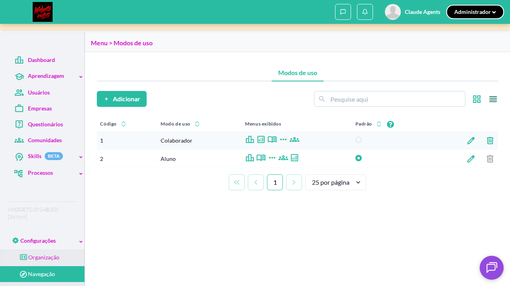

# [spec-fragil] Acessar listagem com a feature flag desabilitada

> _Categoria confiança: **alta** — Locator bate em N elementos — seletor não-único_
> _Gerado em 2026-05-15T14:47:46.738Z · commit f0907b3_

## Identificação
- **Suite**: Listagem de painéis
- **TC**: Acessar listagem com a feature flag desabilitada
- **Spec**: `projects/widgets/tests/features/listagem-de-paineis/feature-flag-desabilitada.spec.ts`
- **Erro em**: `D:\twygo-agents-qa\agent-playwright\projects\widgets\tests\features\listagem-de-paineis\feature-flag-desabilitada.spec.ts:43:47`
- **Status**: failed (17225ms)

## Ambiente
- **Env**: staging-widgets (`https://widgets.stage.twygoead.com/`)
- **OrgId**: 36988
- **Usuário**: claude@teste.com
- **Browser**: chromium
- **Build/commit**: f0907b3

## Reprodução
- **Pré-condições**: storageState pré-logado em `outputs/.auth/storage.json`, perfil Administrador.
- **Passo-a-passo**:
  1. 1. Acessar /use_modes e verificar tabs — ✅
  2. 2. Verificar que a tab 'Painéis' não aparece com a flag off — ❌ **falhou aqui**
- **Taxa**: 1/1 nesta execução `[REVISAR taxa real — rodar 3+ vezes]`

## Comportamento
- **Esperado**: [REVISAR — preencher com expectedresults do XML do step que falhou]
- **Observado**:
  ```
  Error: expect(locator).toHaveCount(expected) failed
  
  Locator:  getByRole('tab', { name: 'Painéis' })
  Expected: 0
  Received: 1
  Timeout:  10000ms
  
  Call log:
  ```

## Evidência técnica

### Network
_Sem HTTP 4xx/5xx capturados pela fixture exploratória nesta execução._

### Attachments
- 
- [video](../test-artifacts/projects-widgets-tests-fea-0c79e-a-feature-flag-desabilitada-chromium/video-1.webm)
- [video](../test-artifacts/projects-widgets-tests-fea-0c79e-a-feature-flag-desabilitada-chromium/video.webm)
- [error-context](../test-artifacts/projects-widgets-tests-fea-0c79e-a-feature-flag-desabilitada-chromium/error-context.md)
- [trace](../test-artifacts/projects-widgets-tests-fea-0c79e-a-feature-flag-desabilitada-chromium/trace.zip)

### IDs envolvidos
- orgId: 36988

## Escopo
- **Reproduz em outro usuário?** `[REVISAR isolamento]`
- **Reproduz em outro env?** `[REVISAR isolamento]`
- **Regressão?** desconhecida `[REVISAR regressão]`
- **Workaround**: nenhum identificado `[REVISAR workaround]`

## Impacto
- **Severity sugerida**: **baixa** `[REVISAR severity]`
- **Impacto qualitativo**: desconhecido `[REVISAR impacto]`

---

> _Gerado por `gerar-bug-report-de-tc-red` v1.0.0. Campos `[REVISAR]` exigem validação humana antes de abrir task._