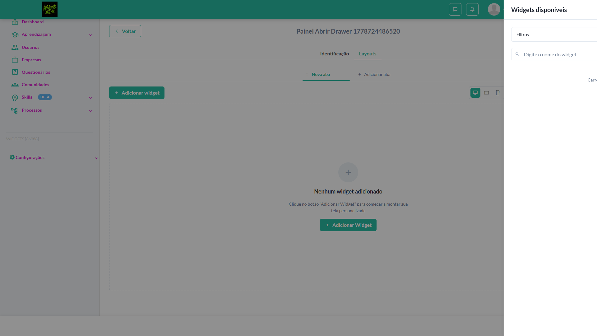
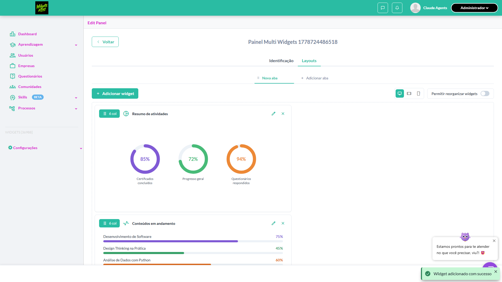
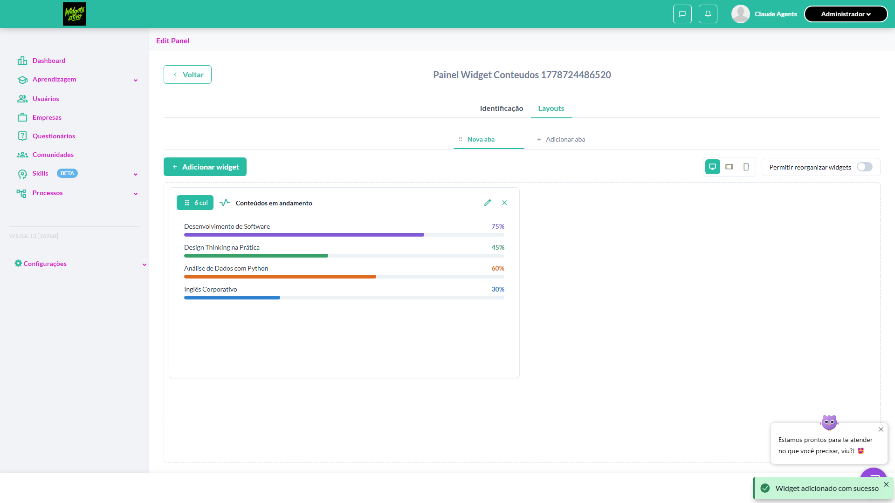
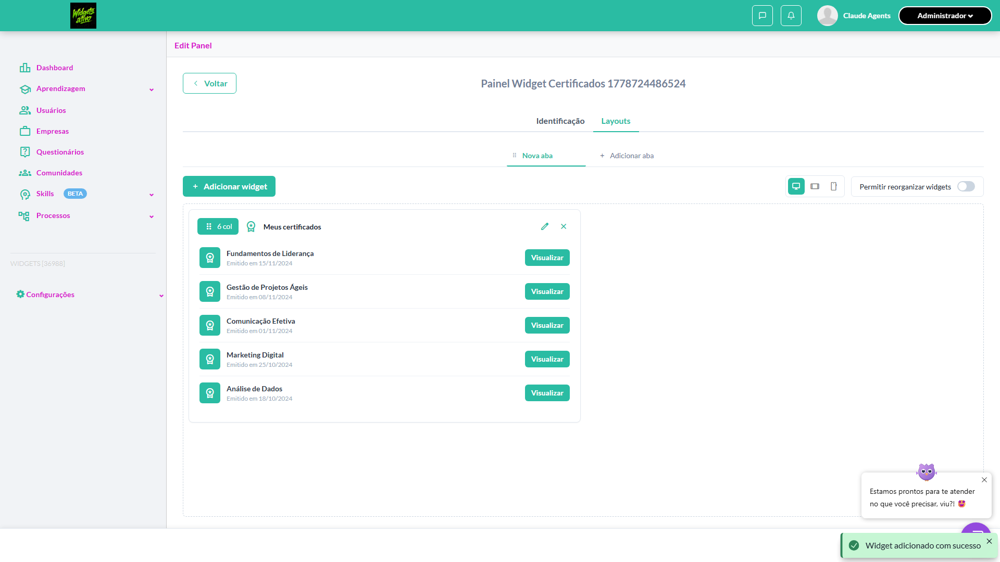
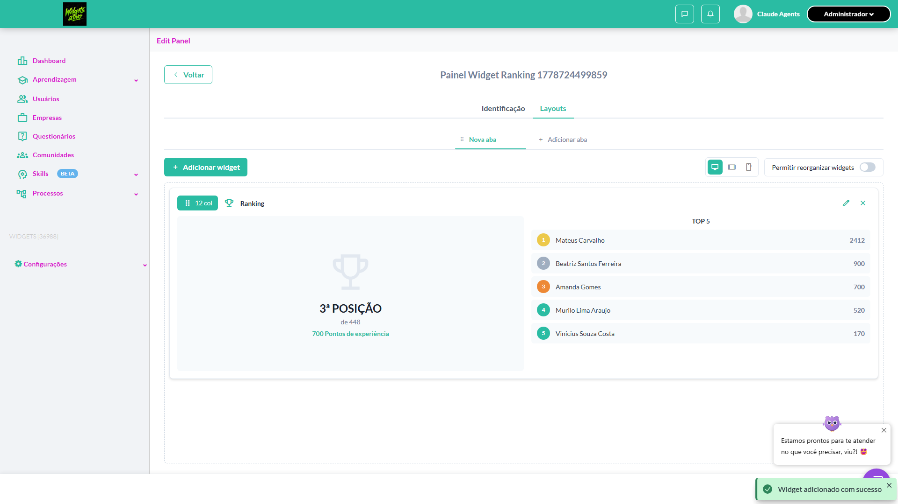
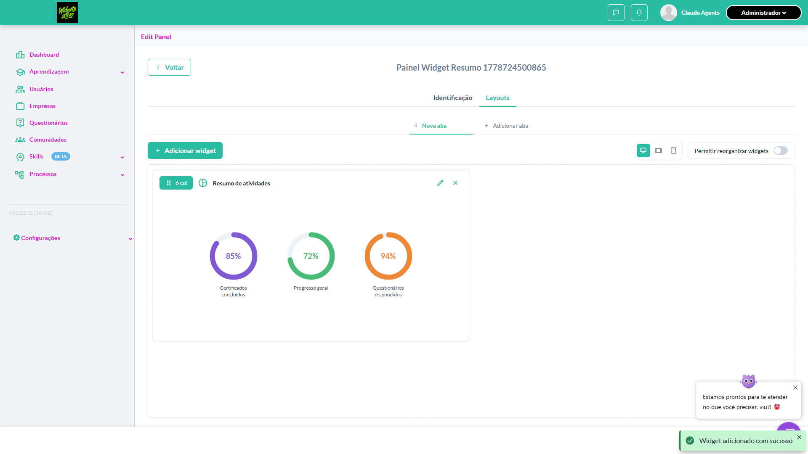
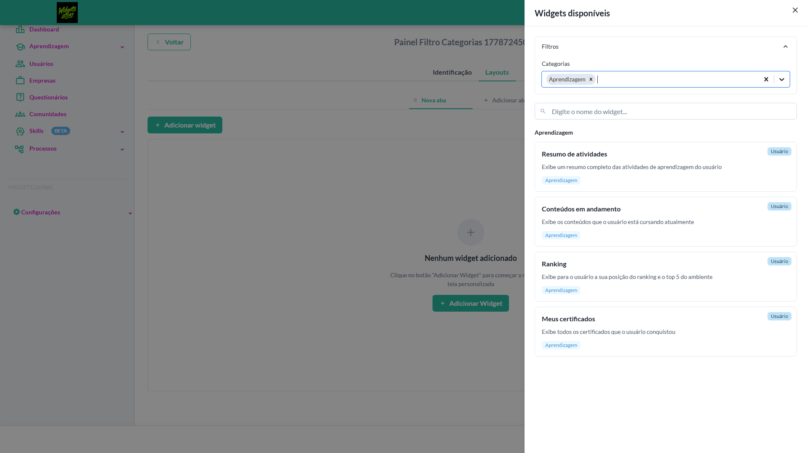
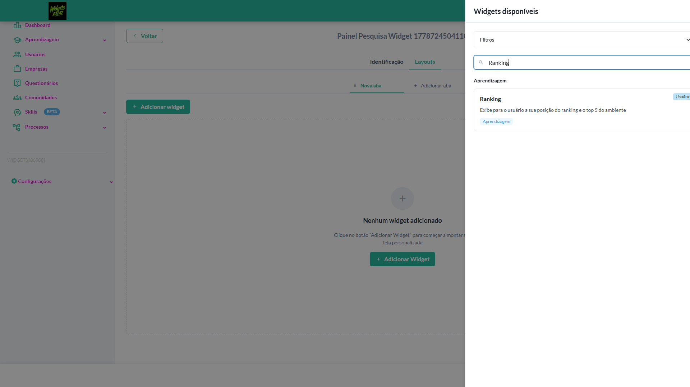
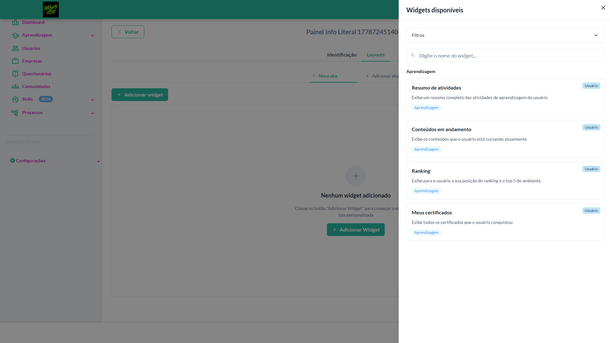
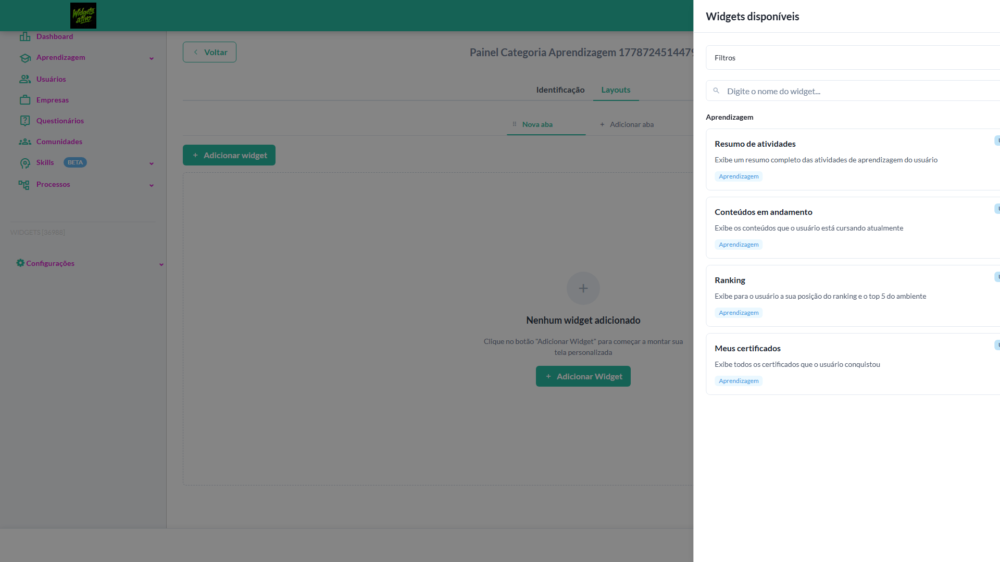

# Casos de teste — Widgets

[← Voltar ao dashboard](index.md)

Lista detalhada por testsuite. Cada caso traz: o que era esperado pelo XML, quais steps foram executados, evidências (screenshots/trace), texto pronto pra registro de bug e — quando houver falha — uma explicação em PT-BR do motivo.

## Adicionar widgets

_11 caso(s) — 11 aprovado(s), 0 falha(s)_

### ✅ Aprovado · TC1 · Abrir drawer de widgets disponíveis · 🔴 Crítico

<a id="abrir-drawer-de-widgets-disponiveis"></a>_Arquivo:_ `abrir-drawer-widgets.spec.ts` · _Duração:_ 12.69s · _Browser:_ chromium

**Sumário (objetivo do caso):** Validar abertura do drawer (R9 RN66, RN67).

**Pré-condições:**

```
Ambiente Stage configurado Funcionalidade 'Gestão de Painéis' habilitada no contrato Feature flag 'habilitar_paineis_do_usuario' ativa Usuário logado como Admin Painel em edição com aba selecionada
```

**Passos do caso (XML/TestLink + execução Playwright):**

_Cada linha reproduz um passo do XML; a coluna **Status** traz o resultado da execução (do step Allure correspondente). Linhas com "Pré-condição" são da execução automatizada (login, navegação inicial) — não fazem parte do roteiro do XML._

| # | Ação do passo | Resultado esperado | Status | Notas | Duração |
|---|---|---|:---:|---|---:|
| — | _Pré-condição:_ Pré-condição: criar painel e abrir Layouts | — | ✅ | — | 10.46s |
| 1 | Acessar a aba 'Layouts' do painel em edição | Layout é exibido | ✅ | — | 0.20s |
| 2 | Clicar no botão '+ Adicionar widget' da toolbar | Drawer lateral é aberto com título 'Widgets disponíveis' | ✅ | — | — |

**Evidências:**

📁 _Pasta:_ [`artifacts/projects-widgets-tests-fea-914e4-awer-de-widgets-disponíveis-chromium/`](artifacts/projects-widgets-tests-fea-914e4-awer-de-widgets-disponíveis-chromium/)

- 📸 **Screenshot (screenshot)** — [`test-finished-1.png`](artifacts/projects-widgets-tests-fea-914e4-awer-de-widgets-disponíveis-chromium/test-finished-1.png)

  

- 🎬 [Vídeo da execução (video.webm)](artifacts/projects-widgets-tests-fea-914e4-awer-de-widgets-disponíveis-chromium/video.webm)

- 🎬 [Vídeo da execução (video-1.webm)](artifacts/projects-widgets-tests-fea-914e4-awer-de-widgets-disponíveis-chromium/video-1.webm)

- 📦 **Trace** — [`trace.zip`](artifacts/projects-widgets-tests-fea-914e4-awer-de-widgets-disponíveis-chromium/trace.zip)

  ```bash
  npx playwright show-trace outputs/widgets/reports/adicionar-widgets_20260513-230847/artifacts/projects-widgets-tests-fea-914e4-awer-de-widgets-disponíveis-chromium/trace.zip
  ```

- 🎥 **Vídeo** — [`video.webm`](artifacts/projects-widgets-tests-fea-914e4-awer-de-widgets-disponíveis-chromium/video.webm)

- 🎥 **Vídeo** — [`video-1.webm`](artifacts/projects-widgets-tests-fea-914e4-awer-de-widgets-disponíveis-chromium/video-1.webm)


---

### ✅ Aprovado · TC11 · Adicionar múltiplos widgets em sequência · 🔴 Crítico

<a id="adicionar-multiplos-widgets-em-sequencia"></a>_Arquivo:_ `adicionar-multiplos-widgets-sequencia.spec.ts` · _Duração:_ 16.53s · _Browser:_ chromium

**Sumário (objetivo do caso):** Validar empilhamento e cálculo de próxima posição.

**Pré-condições:**

```
Ambiente Stage configurado Funcionalidade 'Gestão de Painéis' habilitada no contrato Feature flag 'habilitar_paineis_do_usuario' ativa Usuário logado como Admin Painel em edição com aba 'Nova aba' vazia
```

**Passos do caso (XML/TestLink + execução Playwright):**

_Cada linha reproduz um passo do XML; a coluna **Status** traz o resultado da execução (do step Allure correspondente). Linhas com "Pré-condição" são da execução automatizada (login, navegação inicial) — não fazem parte do roteiro do XML._

| # | Ação do passo | Resultado esperado | Status | Notas | Duração |
|---|---|---|:---:|---|---:|
| — | _Pré-condição:_ Pré-condição: criar painel e abrir Layouts | — | ✅ | — | 9.17s |
| — | _Pré-condição:_ Adicionar widget 1: Resumo de atividades | — | ✅ | — | 1.69s |
| — | _Pré-condição:_ Adicionar widget 2: Conteúdos em andamento | — | ✅ | — | 0.94s |
| — | _Pré-condição:_ Adicionar widget 3: Ranking | — | ✅ | — | 1.35s |
| — | _Pré-condição:_ Adicionar widget 4: Meus certificados | — | ✅ | — | 0.94s |
| — | _Pré-condição:_ Validar total final de 4 widgets | — | ✅ | — | 0.02s |
| 1 | Abrir o drawer de widgets disponíveis | Drawer é exibido | ✅ | — | — |
| 2 | Clicar no widget 'Resumo das atividades' | Widget é adicionado e ocupa a primeira posição do grid | ✅ | — | — |
| 3 | Clicar no widget 'Conteúdos em andamento' | Widget é adicionado e posicionado abaixo/à direita do anterior conforme próxima posição calculada | ✅ | — | — |
| 4 | Clicar no widget 'Meus certificados' | Widget é adicionado e posicionado na próxima posição disponível | ✅ | — | — |

**Evidências:**

📁 _Pasta:_ [`artifacts/projects-widgets-tests-fea-8a89b-tiplos-widgets-em-sequência-chromium/`](artifacts/projects-widgets-tests-fea-8a89b-tiplos-widgets-em-sequência-chromium/)

- 📸 **Screenshot (screenshot)** — [`test-finished-1.png`](artifacts/projects-widgets-tests-fea-8a89b-tiplos-widgets-em-sequência-chromium/test-finished-1.png)

  

- 🎬 [Vídeo da execução (video.webm)](artifacts/projects-widgets-tests-fea-8a89b-tiplos-widgets-em-sequência-chromium/video.webm)

- 🎬 [Vídeo da execução (video-1.webm)](artifacts/projects-widgets-tests-fea-8a89b-tiplos-widgets-em-sequência-chromium/video-1.webm)

- 📦 **Trace** — [`trace.zip`](artifacts/projects-widgets-tests-fea-8a89b-tiplos-widgets-em-sequência-chromium/trace.zip)

  ```bash
  npx playwright show-trace outputs/widgets/reports/adicionar-widgets_20260513-230847/artifacts/projects-widgets-tests-fea-8a89b-tiplos-widgets-em-sequência-chromium/trace.zip
  ```

- 🎥 **Vídeo** — [`video.webm`](artifacts/projects-widgets-tests-fea-8a89b-tiplos-widgets-em-sequência-chromium/video.webm)

- 🎥 **Vídeo** — [`video-1.webm`](artifacts/projects-widgets-tests-fea-8a89b-tiplos-widgets-em-sequência-chromium/video-1.webm)


---

### ✅ Aprovado · TC8 · Adicionar widget 'Conteúdos em andamento' · 🔴 Crítico

<a id="adicionar-widget-conteudos-em-andamento"></a>_Arquivo:_ `adicionar-widget-conteudos-andamento.spec.ts` · _Duração:_ 13.60s · _Browser:_ chromium

**Sumário (objetivo do caso):** Validar adição com largura padrão (R9 RN83.1).

**Pré-condições:**

```
Ambiente Stage configurado Funcionalidade 'Gestão de Painéis' habilitada no contrato Feature flag 'habilitar_paineis_do_usuario' ativa Usuário logado como Admin Painel em edição com aba 'Nova aba' vazia
```

**Passos do caso (XML/TestLink + execução Playwright):**

_Cada linha reproduz um passo do XML; a coluna **Status** traz o resultado da execução (do step Allure correspondente). Linhas com "Pré-condição" são da execução automatizada (login, navegação inicial) — não fazem parte do roteiro do XML._

| # | Ação do passo | Resultado esperado | Status | Notas | Duração |
|---|---|---|:---:|---|---:|
| — | _Pré-condição:_ Pré-condição: criar painel e abrir Layouts | — | ✅ | — | 9.05s |
| 1 | Abrir o drawer de widgets disponíveis | Drawer é exibido | ✅ | — | 2.27s |
| 2 | Clicar no widget 'Conteúdos em andamento' | Widget é adicionado ao layout e toast exibida: "Widget adicionado com sucesso" | ✅ | — | 0.03s |
| 3 | Verificar a largura do widget no grid | Widget ocupa 6 colunas do grid | ✅ | — | — |

**Evidências:**

📁 _Pasta:_ [`artifacts/projects-widgets-tests-fea-6822c-get-Conteúdos-em-andamento--chromium/`](artifacts/projects-widgets-tests-fea-6822c-get-Conteúdos-em-andamento--chromium/)

- 📸 **Screenshot (screenshot)** — [`test-finished-1.png`](artifacts/projects-widgets-tests-fea-6822c-get-Conteúdos-em-andamento--chromium/test-finished-1.png)

  

- 🎬 [Vídeo da execução (video.webm)](artifacts/projects-widgets-tests-fea-6822c-get-Conteúdos-em-andamento--chromium/video.webm)

- 🎬 [Vídeo da execução (video-1.webm)](artifacts/projects-widgets-tests-fea-6822c-get-Conteúdos-em-andamento--chromium/video-1.webm)

- 📦 **Trace** — [`trace.zip`](artifacts/projects-widgets-tests-fea-6822c-get-Conteúdos-em-andamento--chromium/trace.zip)

  ```bash
  npx playwright show-trace outputs/widgets/reports/adicionar-widgets_20260513-230847/artifacts/projects-widgets-tests-fea-6822c-get-Conteúdos-em-andamento--chromium/trace.zip
  ```

- 🎥 **Vídeo** — [`video.webm`](artifacts/projects-widgets-tests-fea-6822c-get-Conteúdos-em-andamento--chromium/video.webm)

- 🎥 **Vídeo** — [`video-1.webm`](artifacts/projects-widgets-tests-fea-6822c-get-Conteúdos-em-andamento--chromium/video-1.webm)


---

### ✅ Aprovado · TC10 · Adicionar widget 'Meus certificados' · 🔴 Crítico

<a id="adicionar-widget-meus-certificados"></a>_Arquivo:_ `adicionar-widget-meus-certificados.spec.ts` · _Duração:_ 14.05s · _Browser:_ chromium

**Sumário (objetivo do caso):** Validar adição com largura padrão (R9 RN83.1).

**Pré-condições:**

```
Ambiente Stage configurado Funcionalidade 'Gestão de Painéis' habilitada no contrato Feature flag 'habilitar_paineis_do_usuario' ativa Usuário logado como Admin Painel em edição com aba 'Nova aba' vazia
```

**Passos do caso (XML/TestLink + execução Playwright):**

_Cada linha reproduz um passo do XML; a coluna **Status** traz o resultado da execução (do step Allure correspondente). Linhas com "Pré-condição" são da execução automatizada (login, navegação inicial) — não fazem parte do roteiro do XML._

| # | Ação do passo | Resultado esperado | Status | Notas | Duração |
|---|---|---|:---:|---|---:|
| — | _Pré-condição:_ Pré-condição: criar painel e abrir Layouts | — | ✅ | — | 9.51s |
| 1 | Abrir o drawer de widgets disponíveis | Drawer é exibido | ✅ | — | 2.22s |
| 2 | Clicar no widget 'Conteúdos em andamento' | Widget é adicionado ao layout e toast exibida: "Widget adicionado com sucesso" | ✅ | — | 0.04s |
| 3 | Verificar a largura do widget no grid | Widget ocupa 6 colunas do grid | ✅ | — | — |

**Evidências:**

📁 _Pasta:_ [`artifacts/projects-widgets-tests-fea-35d61-r-widget-Meus-certificados--chromium/`](artifacts/projects-widgets-tests-fea-35d61-r-widget-Meus-certificados--chromium/)

- 📸 **Screenshot (screenshot)** — [`test-finished-1.png`](artifacts/projects-widgets-tests-fea-35d61-r-widget-Meus-certificados--chromium/test-finished-1.png)

  

- 🎬 [Vídeo da execução (video.webm)](artifacts/projects-widgets-tests-fea-35d61-r-widget-Meus-certificados--chromium/video.webm)

- 🎬 [Vídeo da execução (video-1.webm)](artifacts/projects-widgets-tests-fea-35d61-r-widget-Meus-certificados--chromium/video-1.webm)

- 📦 **Trace** — [`trace.zip`](artifacts/projects-widgets-tests-fea-35d61-r-widget-Meus-certificados--chromium/trace.zip)

  ```bash
  npx playwright show-trace outputs/widgets/reports/adicionar-widgets_20260513-230847/artifacts/projects-widgets-tests-fea-35d61-r-widget-Meus-certificados--chromium/trace.zip
  ```

- 🎥 **Vídeo** — [`video.webm`](artifacts/projects-widgets-tests-fea-35d61-r-widget-Meus-certificados--chromium/video.webm)

- 🎥 **Vídeo** — [`video-1.webm`](artifacts/projects-widgets-tests-fea-35d61-r-widget-Meus-certificados--chromium/video-1.webm)


---

### ✅ Aprovado · TC9 · Adicionar widget 'Ranking' · 🔴 Crítico

<a id="adicionar-widget-ranking"></a>_Arquivo:_ `adicionar-widget-ranking.spec.ts` · _Duração:_ 12.53s · _Browser:_ chromium

**Sumário (objetivo do caso):** Validar largura específica do Ranking (R9 RN83.1).

**Pré-condições:**

```
Ambiente Stage configurado Funcionalidade 'Gestão de Painéis' habilitada no contrato Feature flag 'habilitar_paineis_do_usuario' ativa Usuário logado como Admin Painel em edição com aba 'Nova aba' vazia
```

**Passos do caso (XML/TestLink + execução Playwright):**

_Cada linha reproduz um passo do XML; a coluna **Status** traz o resultado da execução (do step Allure correspondente). Linhas com "Pré-condição" são da execução automatizada (login, navegação inicial) — não fazem parte do roteiro do XML._

| # | Ação do passo | Resultado esperado | Status | Notas | Duração |
|---|---|---|:---:|---|---:|
| — | _Pré-condição:_ Pré-condição: criar painel e abrir Layouts | — | ✅ | — | 8.60s |
| 1 | Abrir o drawer de widgets disponíveis | Drawer é exibido | ✅ | — | 1.74s |
| 2 | Clicar no widget 'Ranking' | Widget é adicionado ao layout e toast exibida: "Widget adicionado com sucesso" | ✅ | — | 0.03s |
| 3 | Verificar exibição e a largura do widget no grid | Widget Ranking é exibido com sucesso e deve ocupar a largura padrão diferente de 6 colunas (exceção descrita na documentação) | ✅ | — | — |

**Evidências:**

📁 _Pasta:_ [`artifacts/projects-widgets-tests-fea-3358e-s-Adicionar-widget-Ranking--chromium/`](artifacts/projects-widgets-tests-fea-3358e-s-Adicionar-widget-Ranking--chromium/)

- 📸 **Screenshot (screenshot)** — [`test-finished-1.png`](artifacts/projects-widgets-tests-fea-3358e-s-Adicionar-widget-Ranking--chromium/test-finished-1.png)

  

- 🎬 [Vídeo da execução (video.webm)](artifacts/projects-widgets-tests-fea-3358e-s-Adicionar-widget-Ranking--chromium/video.webm)

- 🎬 [Vídeo da execução (video-1.webm)](artifacts/projects-widgets-tests-fea-3358e-s-Adicionar-widget-Ranking--chromium/video-1.webm)

- 📦 **Trace** — [`trace.zip`](artifacts/projects-widgets-tests-fea-3358e-s-Adicionar-widget-Ranking--chromium/trace.zip)

  ```bash
  npx playwright show-trace outputs/widgets/reports/adicionar-widgets_20260513-230847/artifacts/projects-widgets-tests-fea-3358e-s-Adicionar-widget-Ranking--chromium/trace.zip
  ```

- 🎥 **Vídeo** — [`video.webm`](artifacts/projects-widgets-tests-fea-3358e-s-Adicionar-widget-Ranking--chromium/video.webm)

- 🎥 **Vídeo** — [`video-1.webm`](artifacts/projects-widgets-tests-fea-3358e-s-Adicionar-widget-Ranking--chromium/video-1.webm)


---

### ✅ Aprovado · TC7 · Adicionar widget 'Resumo das atividades' · 🔴 Crítico

<a id="adicionar-widget-resumo-das-atividades"></a>_Arquivo:_ `adicionar-widget-resumo-atividades.spec.ts` · _Duração:_ 12.57s · _Browser:_ chromium

**Sumário (objetivo do caso):** Validar adição de widget (R9 RN80, RN81, RN83).

**Pré-condições:**

```
Ambiente Stage configurado Funcionalidade 'Gestão de Painéis' habilitada no contrato Feature flag 'habilitar_paineis_do_usuario' ativa Usuário logado como Admin Painel em edição com aba 'Nova aba' vazia
```

**Passos do caso (XML/TestLink + execução Playwright):**

_Cada linha reproduz um passo do XML; a coluna **Status** traz o resultado da execução (do step Allure correspondente). Linhas com "Pré-condição" são da execução automatizada (login, navegação inicial) — não fazem parte do roteiro do XML._

| # | Ação do passo | Resultado esperado | Status | Notas | Duração |
|---|---|---|:---:|---|---:|
| — | _Pré-condição:_ Pré-condição: criar painel e abrir Layouts | — | ✅ | — | 8.67s |
| 1 | Abrir o drawer de widgets disponíveis | Drawer é exibido | ✅ | — | 1.74s |
| 2 | Clicar no widget 'Resumo das atividades' | Widget é adicionado ao layout da aba ativa e toast exibida: "Widget adicionado com sucesso" | ✅ | — | 0.04s |
| 3 | Verificar a posição do widget no layout | Widget 'Resumo das atividades' é exibido no layout (largura padrão diferente de 6 colunas conforme exceção) | ✅ | — | — |

**Evidências:**

📁 _Pasta:_ [`artifacts/projects-widgets-tests-fea-3886c-dget-Resumo-das-atividades--chromium/`](artifacts/projects-widgets-tests-fea-3886c-dget-Resumo-das-atividades--chromium/)

- 📸 **Screenshot (screenshot)** — [`test-finished-1.png`](artifacts/projects-widgets-tests-fea-3886c-dget-Resumo-das-atividades--chromium/test-finished-1.png)

  

- 🎬 [Vídeo da execução (video.webm)](artifacts/projects-widgets-tests-fea-3886c-dget-Resumo-das-atividades--chromium/video.webm)

- 🎬 [Vídeo da execução (video-1.webm)](artifacts/projects-widgets-tests-fea-3886c-dget-Resumo-das-atividades--chromium/video-1.webm)

- 📦 **Trace** — [`trace.zip`](artifacts/projects-widgets-tests-fea-3886c-dget-Resumo-das-atividades--chromium/trace.zip)

  ```bash
  npx playwright show-trace outputs/widgets/reports/adicionar-widgets_20260513-230847/artifacts/projects-widgets-tests-fea-3886c-dget-Resumo-das-atividades--chromium/trace.zip
  ```

- 🎥 **Vídeo** — [`video.webm`](artifacts/projects-widgets-tests-fea-3886c-dget-Resumo-das-atividades--chromium/video.webm)

- 🎥 **Vídeo** — [`video-1.webm`](artifacts/projects-widgets-tests-fea-3886c-dget-Resumo-das-atividades--chromium/video-1.webm)


---

### ✅ Aprovado · TC5 · Filtrar widgets pelo multi select 'Categorias' · 🟡 Normal

<a id="filtrar-widgets-pelo-multi-select-categorias"></a>_Arquivo:_ `filtrar-widgets-categorias.spec.ts` · _Duração:_ 12.60s · _Browser:_ chromium

**Sumário (objetivo do caso):** Validar filtro por categoria (R9 RN69.1).

**Pré-condições:**

```
Ambiente Stage configurado Funcionalidade 'Gestão de Painéis' habilitada no contrato Feature flag 'habilitar_paineis_do_usuario' ativa Usuário logado como Admin Painel em edição com aba selecionada
```

**Passos do caso (XML/TestLink + execução Playwright):**

_Cada linha reproduz um passo do XML; a coluna **Status** traz o resultado da execução (do step Allure correspondente). Linhas com "Pré-condição" são da execução automatizada (login, navegação inicial) — não fazem parte do roteiro do XML._

| # | Ação do passo | Resultado esperado | Status | Notas | Duração |
|---|---|---|:---:|---|---:|
| — | _Pré-condição:_ Pré-condição: criar painel e abrir drawer | — | ✅ | — | 9.63s |
| 1 | Abrir o drawer e expandir os filtros | Filtros são exibidos com 'Todos' e 'Aprendizagem' | ✅ | — | 0.97s |
| 2 | Selecionar apenas 'Aprendizagem' no multi select | Listagem exibe somente widgets da categoria 'Aprendizagem' | ✅ | — | 0.17s |
| 3 | Selecionar 'Todos' | Listagem exibe todos os widgets disponíveis | ✅ | — | 0.07s |

**Evidências:**

📁 _Pasta:_ [`artifacts/projects-widgets-tests-fea-0e9cf-lo-multi-select-Categorias--chromium/`](artifacts/projects-widgets-tests-fea-0e9cf-lo-multi-select-Categorias--chromium/)

- 📸 **Screenshot (screenshot)** — [`test-finished-1.png`](artifacts/projects-widgets-tests-fea-0e9cf-lo-multi-select-Categorias--chromium/test-finished-1.png)

  

- 🎬 [Vídeo da execução (video.webm)](artifacts/projects-widgets-tests-fea-0e9cf-lo-multi-select-Categorias--chromium/video.webm)

- 🎬 [Vídeo da execução (video-1.webm)](artifacts/projects-widgets-tests-fea-0e9cf-lo-multi-select-Categorias--chromium/video-1.webm)

- 📦 **Trace** — [`trace.zip`](artifacts/projects-widgets-tests-fea-0e9cf-lo-multi-select-Categorias--chromium/trace.zip)

  ```bash
  npx playwright show-trace outputs/widgets/reports/adicionar-widgets_20260513-230847/artifacts/projects-widgets-tests-fea-0e9cf-lo-multi-select-Categorias--chromium/trace.zip
  ```

- 🎥 **Vídeo** — [`video.webm`](artifacts/projects-widgets-tests-fea-0e9cf-lo-multi-select-Categorias--chromium/video.webm)

- 🎥 **Vídeo** — [`video-1.webm`](artifacts/projects-widgets-tests-fea-0e9cf-lo-multi-select-Categorias--chromium/video-1.webm)


---

### ✅ Aprovado · TC6 · Pesquisar widget pelo nome no drawer · 🟡 Normal

<a id="pesquisar-widget-pelo-nome-no-drawer"></a>_Arquivo:_ `pesquisar-widget-nome.spec.ts` · _Duração:_ 11.70s · _Browser:_ chromium

**Sumário (objetivo do caso):** Validar campo de busca (R9 RN70).

**Pré-condições:**

```
Ambiente Stage configurado Funcionalidade 'Gestão de Painéis' habilitada no contrato Feature flag 'habilitar_paineis_do_usuario' ativa Usuário logado como Admin Painel em edição com aba selecionada
```

**Passos do caso (XML/TestLink + execução Playwright):**

_Cada linha reproduz um passo do XML; a coluna **Status** traz o resultado da execução (do step Allure correspondente). Linhas com "Pré-condição" são da execução automatizada (login, navegação inicial) — não fazem parte do roteiro do XML._

| # | Ação do passo | Resultado esperado | Status | Notas | Duração |
|---|---|---|:---:|---|---:|
| — | _Pré-condição:_ Pré-condição: criar painel e abrir drawer | — | ✅ | — | 9.73s |
| 1 | Abrir o drawer de widgets disponíveis | Drawer é exibido | ✅ | — | 0.04s |
| 2 | Preencher o campo 'Buscar' com 'Ranking' | Listagem exibe somente o widget 'Ranking' | ✅ | — | 0.17s |
| 3 | Limpar o campo 'Buscar' | Listagem volta a exibir todos os widgets | ✅ | — | — |
| 4 | Preencher o campo 'Buscar' com 'XXXX9999' | Listagem do drawer exibe estado vazio sem widgets | ✅ | — | — |

**Evidências:**

📁 _Pasta:_ [`artifacts/projects-widgets-tests-fea-acac0--widget-pelo-nome-no-drawer-chromium/`](artifacts/projects-widgets-tests-fea-acac0--widget-pelo-nome-no-drawer-chromium/)

- 📸 **Screenshot (screenshot)** — [`test-finished-1.png`](artifacts/projects-widgets-tests-fea-acac0--widget-pelo-nome-no-drawer-chromium/test-finished-1.png)

  

- 🎬 [Vídeo da execução (video.webm)](artifacts/projects-widgets-tests-fea-acac0--widget-pelo-nome-no-drawer-chromium/video.webm)

- 🎬 [Vídeo da execução (video-1.webm)](artifacts/projects-widgets-tests-fea-acac0--widget-pelo-nome-no-drawer-chromium/video-1.webm)

- 📦 **Trace** — [`trace.zip`](artifacts/projects-widgets-tests-fea-acac0--widget-pelo-nome-no-drawer-chromium/trace.zip)

  ```bash
  npx playwright show-trace outputs/widgets/reports/adicionar-widgets_20260513-230847/artifacts/projects-widgets-tests-fea-acac0--widget-pelo-nome-no-drawer-chromium/trace.zip
  ```

- 🎥 **Vídeo** — [`video.webm`](artifacts/projects-widgets-tests-fea-acac0--widget-pelo-nome-no-drawer-chromium/video.webm)

- 🎥 **Vídeo** — [`video-1.webm`](artifacts/projects-widgets-tests-fea-acac0--widget-pelo-nome-no-drawer-chromium/video-1.webm)


---

### ✅ Aprovado · TC2 · Validar componentes do drawer de widgets · 🔴 Crítico

<a id="validar-componentes-do-drawer-de-widgets"></a>_Arquivo:_ `validar-componentes-drawer.spec.ts` · _Duração:_ 11.18s · _Browser:_ chromium

**Sumário (objetivo do caso):** Validar campos de filtro, busca e listagem (R9 RN67, RN68, RN69, RN69.1, RN70).

**Pré-condições:**

```
Ambiente Stage configurado Funcionalidade 'Gestão de Painéis' habilitada no contrato Feature flag 'habilitar_paineis_do_usuario' ativa Usuário logado como Admin Painel em edição com aba selecionada
```

**Passos do caso (XML/TestLink + execução Playwright):**

_Cada linha reproduz um passo do XML; a coluna **Status** traz o resultado da execução (do step Allure correspondente). Linhas com "Pré-condição" são da execução automatizada (login, navegação inicial) — não fazem parte do roteiro do XML._

| # | Ação do passo | Resultado esperado | Status | Notas | Duração |
|---|---|---|:---:|---|---:|
| — | _Pré-condição:_ Pré-condição: criar painel e abrir drawer | — | ✅ | — | 9.46s |
| 1 | Abrir o drawer de widgets disponíveis | Drawer 'Widgets disponíveis' é exibido | ✅ | — | 0.18s |
| 2 | Verificar a área de filtros | Bloco de filtros está colapsado por padrão | ✅ | — | — |
| 3 | Clicar no campo de filtros para expandir | Filtros são exibidos, incluindo o multi select 'Categorias' com opções 'Todos' e 'Aprendizagem' | ✅ | — | — |
| 4 | Verificar o campo 'Buscar' | Campo "Buscar" é exibido com placeholder "Digite o nome do widget..." | ✅ | — | — |

**Evidências:**

📁 _Pasta:_ [`artifacts/projects-widgets-tests-fea-b6b81-nentes-do-drawer-de-widgets-chromium/`](artifacts/projects-widgets-tests-fea-b6b81-nentes-do-drawer-de-widgets-chromium/)

- 📸 **Screenshot (screenshot)** — [`test-finished-1.png`](artifacts/projects-widgets-tests-fea-b6b81-nentes-do-drawer-de-widgets-chromium/test-finished-1.png)

  

- 🎬 [Vídeo da execução (video.webm)](artifacts/projects-widgets-tests-fea-b6b81-nentes-do-drawer-de-widgets-chromium/video.webm)

- 🎬 [Vídeo da execução (video-1.webm)](artifacts/projects-widgets-tests-fea-b6b81-nentes-do-drawer-de-widgets-chromium/video-1.webm)

- 📦 **Trace** — [`trace.zip`](artifacts/projects-widgets-tests-fea-b6b81-nentes-do-drawer-de-widgets-chromium/trace.zip)

  ```bash
  npx playwright show-trace outputs/widgets/reports/adicionar-widgets_20260513-230847/artifacts/projects-widgets-tests-fea-b6b81-nentes-do-drawer-de-widgets-chromium/trace.zip
  ```

- 🎥 **Vídeo** — [`video.webm`](artifacts/projects-widgets-tests-fea-b6b81-nentes-do-drawer-de-widgets-chromium/video.webm)

- 🎥 **Vídeo** — [`video-1.webm`](artifacts/projects-widgets-tests-fea-b6b81-nentes-do-drawer-de-widgets-chromium/video-1.webm)


---

### ✅ Aprovado · TC4 · Validar informação literal dos widgets · 🟡 Normal

<a id="validar-informacao-literal-dos-widgets"></a>_Arquivo:_ `validar-informacao-literal-widgets.spec.ts` · _Duração:_ 10.91s · _Browser:_ chromium

**Sumário (objetivo do caso):** Validar textos descritivos, badges e tags (R9 RN73-76).

**Pré-condições:**

```
Ambiente Stage configurado Funcionalidade 'Gestão de Painéis' habilitada no contrato Feature flag 'habilitar_paineis_do_usuario' ativa Usuário logado como Admin Painel em edição com aba selecionada
```

**Passos do caso (XML/TestLink + execução Playwright):**

_Cada linha reproduz um passo do XML; a coluna **Status** traz o resultado da execução (do step Allure correspondente). Linhas com "Pré-condição" são da execução automatizada (login, navegação inicial) — não fazem parte do roteiro do XML._

| # | Ação do passo | Resultado esperado | Status | Notas | Duração |
|---|---|---|:---:|---|---:|
| — | _Pré-condição:_ Pré-condição: criar painel e abrir drawer | — | ✅ | — | 9.04s |
| — | _Pré-condição:_ Validar widget Resumo de atividades | — | ✅ | — | 0.17s |
| — | _Pré-condição:_ Validar widget Conteúdos em andamento | — | ✅ | — | 0.06s |
| — | _Pré-condição:_ Validar widget Ranking | — | ✅ | — | 0.05s |
| — | _Pré-condição:_ Validar widget Meus certificados | — | ✅ | — | 0.06s |
| 1 | Abrir o drawer de widgets disponíveis | Drawer é exibido | ✅ | — | — |
| 2 | Verificar widget 'Resumo das atividades' | Descrição: "Exibe um resumo completo das atividades de aprendizagem do usuário"<br /> Badge: Usuário<br /> Tag: Aprendizagem<br /> Tooltip: exibe descrição completa do widget | ✅ | — | — |
| 3 | Verificar widget 'Conteúdos em andamento' | Descrição: "Exibe os conteúdos que o usuário está cursando atualmente"<br /> Badge: Usuário<br /> Tag: Aprendizagem<br /> Tooltip: exibe descrição completa do widget | ✅ | — | — |
| 4 | Verificar widget 'Ranking' | Descrição: "Exibe para o usuário a sua posição do ranking e o top 5 do ambiente"<br /> Badge: Usuário<br /> Tag: Aprendizagem<br /> Tooltip: exibe descrição completa do widget | ✅ | — | — |
| 5 | Verificar widget 'Meus certificados' | Descrição: "Exibe todos os certificados que o usuário conquistou"<br /> Badge: Usuário<br /> Tag: Aprendizagem<br /> Tooltip: exibe descrição completa do widget | ✅ | — | — |

**Evidências:**

📁 _Pasta:_ [`artifacts/projects-widgets-tests-fea-829ef-ormação-literal-dos-widgets-chromium/`](artifacts/projects-widgets-tests-fea-829ef-ormação-literal-dos-widgets-chromium/)

- 📸 **Screenshot (screenshot)** — [`test-finished-1.png`](artifacts/projects-widgets-tests-fea-829ef-ormação-literal-dos-widgets-chromium/test-finished-1.png)

  

- 🎬 [Vídeo da execução (video.webm)](artifacts/projects-widgets-tests-fea-829ef-ormação-literal-dos-widgets-chromium/video.webm)

- 🎬 [Vídeo da execução (video-1.webm)](artifacts/projects-widgets-tests-fea-829ef-ormação-literal-dos-widgets-chromium/video-1.webm)

- 📦 **Trace** — [`trace.zip`](artifacts/projects-widgets-tests-fea-829ef-ormação-literal-dos-widgets-chromium/trace.zip)

  ```bash
  npx playwright show-trace outputs/widgets/reports/adicionar-widgets_20260513-230847/artifacts/projects-widgets-tests-fea-829ef-ormação-literal-dos-widgets-chromium/trace.zip
  ```

- 🎥 **Vídeo** — [`video.webm`](artifacts/projects-widgets-tests-fea-829ef-ormação-literal-dos-widgets-chromium/video.webm)

- 🎥 **Vídeo** — [`video-1.webm`](artifacts/projects-widgets-tests-fea-829ef-ormação-literal-dos-widgets-chromium/video-1.webm)


---

### ✅ Aprovado · TC3 · Validar widgets disponíveis na categoria Aprendizagem · 🔴 Crítico

<a id="validar-widgets-disponiveis-na-categoria-aprendizagem"></a>_Arquivo:_ `validar-widgets-categoria-aprendizagem.spec.ts` · _Duração:_ 10.96s · _Browser:_ chromium

**Sumário (objetivo do caso):** Validar listagem completa dos widgets (R9 RN73-77).

**Pré-condições:**

```
Ambiente Stage configurado Funcionalidade 'Gestão de Painéis' habilitada no contrato Feature flag 'habilitar_paineis_do_usuario' ativa Usuário logado como Admin Painel em edição com aba selecionada
```

**Passos do caso (XML/TestLink + execução Playwright):**

_Cada linha reproduz um passo do XML; a coluna **Status** traz o resultado da execução (do step Allure correspondente). Linhas com "Pré-condição" são da execução automatizada (login, navegação inicial) — não fazem parte do roteiro do XML._

| # | Ação do passo | Resultado esperado | Status | Notas | Duração |
|---|---|---|:---:|---|---:|
| — | _Pré-condição:_ Pré-condição: criar painel e abrir drawer | — | ✅ | — | 9.21s |
| 1 | Abrir o drawer de widgets disponíveis e selecionar a categoria 'Aprendizagem' | Widgets são listados abaixo dos filtros, agrupados por categoria | ✅ | — | 0.18s |
| 2 | Verificar o agrupamento dos widgets | Devem estar agrupados na categoria 'Aprendizagem' e exibidos em formato de lista ou grid | ✅ | — | — |
| 3 | Verificar a apresentação de cada widget | Cada widget exibe: Nome, Descrição, tags associadas (quando aplicável, indicando a categoria) e badge (indicando o perfil: Usuário, Instrutor, Administrador) | ✅ | — | — |
| 4 | Verificar os widgets exibidos na categoria 'Aprendizagem' | Drawer exibe os widgets: 'Resumo das atividades', 'Conteúdos em andamento', 'Ranking', 'Meus certificados' | ✅ | — | — |

**Evidências:**

📁 _Pasta:_ [`artifacts/projects-widgets-tests-fea-c8243-s-na-categoria-Aprendizagem-chromium/`](artifacts/projects-widgets-tests-fea-c8243-s-na-categoria-Aprendizagem-chromium/)

- 📸 **Screenshot (screenshot)** — [`test-finished-1.png`](artifacts/projects-widgets-tests-fea-c8243-s-na-categoria-Aprendizagem-chromium/test-finished-1.png)

  

- 🎬 [Vídeo da execução (video.webm)](artifacts/projects-widgets-tests-fea-c8243-s-na-categoria-Aprendizagem-chromium/video.webm)

- 🎬 [Vídeo da execução (video-1.webm)](artifacts/projects-widgets-tests-fea-c8243-s-na-categoria-Aprendizagem-chromium/video-1.webm)

- 📦 **Trace** — [`trace.zip`](artifacts/projects-widgets-tests-fea-c8243-s-na-categoria-Aprendizagem-chromium/trace.zip)

  ```bash
  npx playwright show-trace outputs/widgets/reports/adicionar-widgets_20260513-230847/artifacts/projects-widgets-tests-fea-c8243-s-na-categoria-Aprendizagem-chromium/trace.zip
  ```

- 🎥 **Vídeo** — [`video.webm`](artifacts/projects-widgets-tests-fea-c8243-s-na-categoria-Aprendizagem-chromium/video.webm)

- 🎥 **Vídeo** — [`video-1.webm`](artifacts/projects-widgets-tests-fea-c8243-s-na-categoria-Aprendizagem-chromium/video-1.webm)


---
