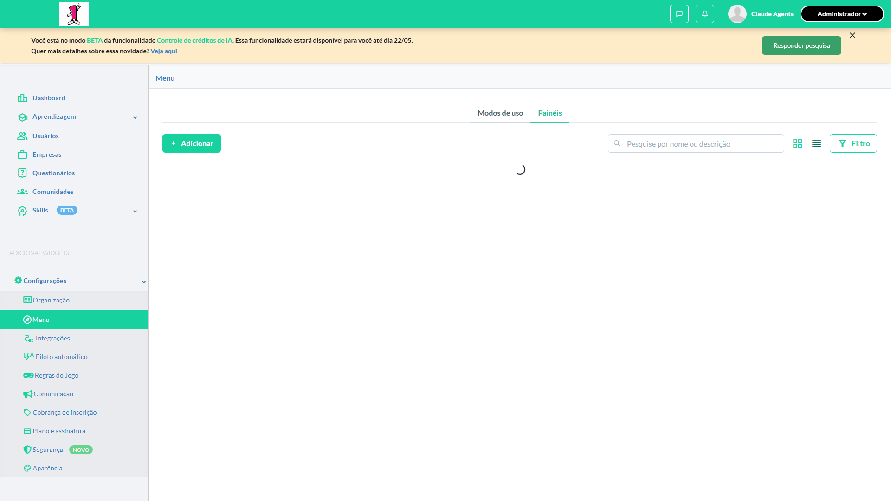
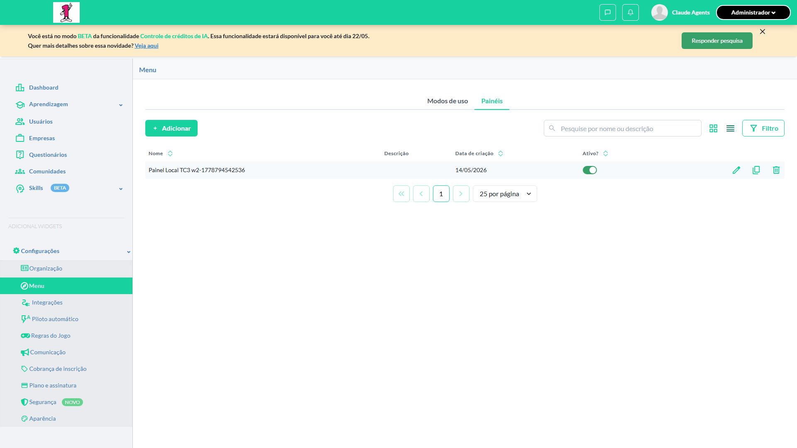
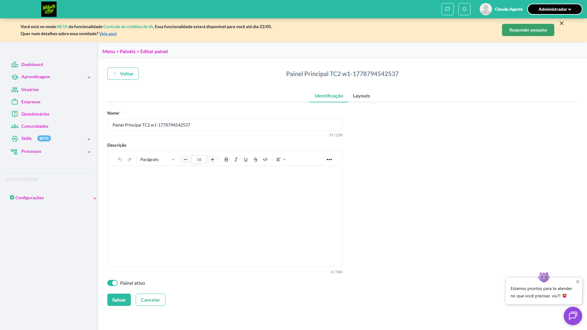
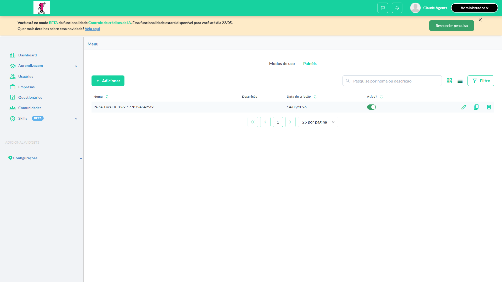
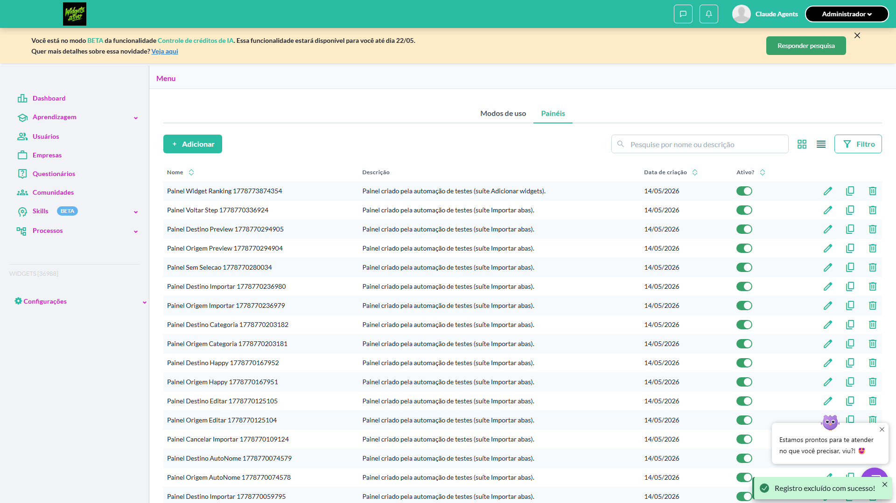
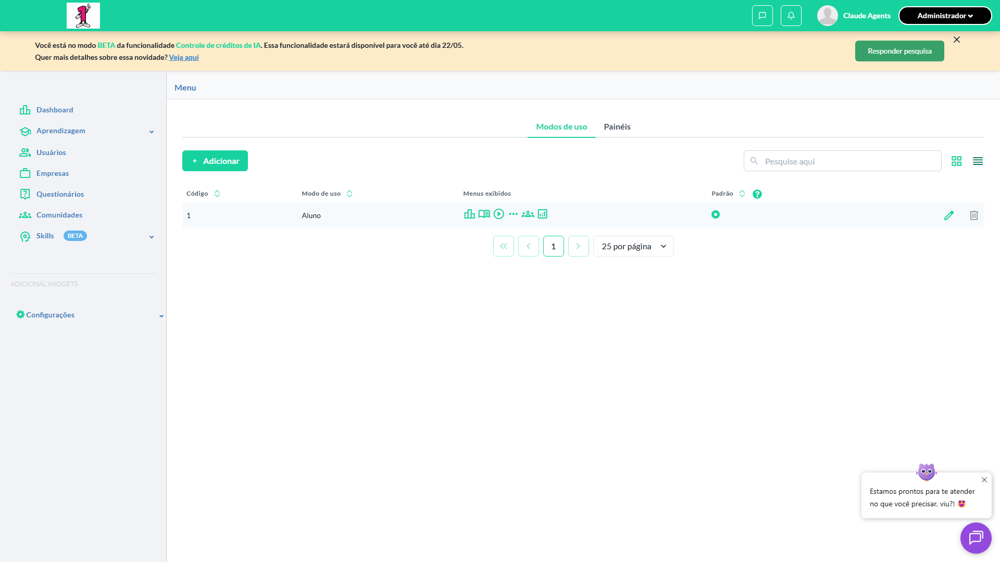
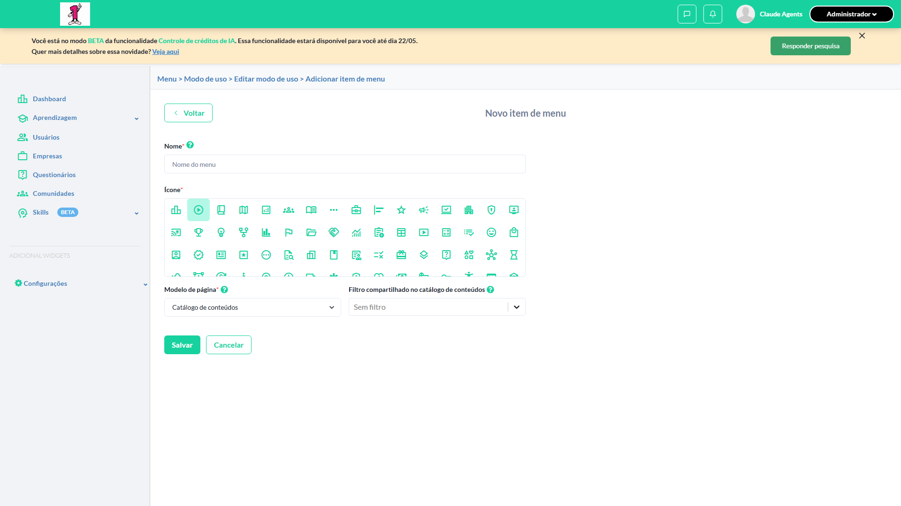
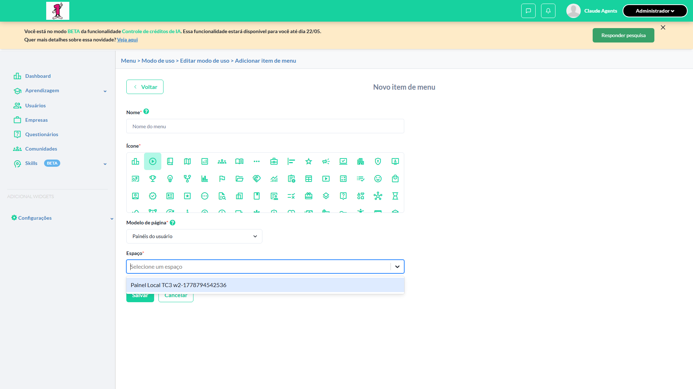
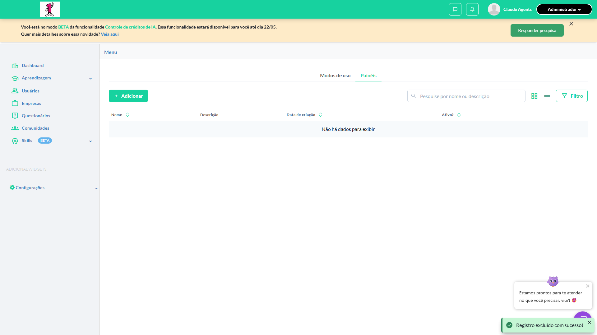

# Casos de teste — Widgets

[← Voltar ao dashboard](index.md)

Lista detalhada por testsuite. Cada caso traz: o que era esperado pelo XML, quais steps foram executados, evidências (screenshots/trace), texto pronto pra registro de bug e — quando houver falha — uma explicação em PT-BR do motivo.

## Ambientes adicionais

_3 caso(s) — 3 aprovado(s), 0 falha(s)_

### ✅ Aprovado · TC1 · Funcionalidade de Painéis em ambiente adicional · 🟡 Normal

<a id="funcionalidade-de-paineis-em-ambiente-adicional"></a>_Arquivo:_ `funcionalidade-ambiente-adicional.spec.ts` · _Duração:_ 10.74s · _Browser:_ chromium

**Sumário (objetivo do caso):** Validar disponibilidade da funcionalidade em ambientes adicionais.

**Pré-condições:**

```
Ambiente adicional configurado para a organização Funcionalidade 'Gestão de Painéis' habilitada Feature flag 'habilitar_paineis_do_usuario' ativa Usuário logado como Admin no ambiente adicional
```

**Passos do caso (XML/TestLink + execução Playwright):**

_Cada linha reproduz um passo do XML; a coluna **Status** traz o resultado da execução (do step Allure correspondente). Linhas com "Pré-condição" são da execução automatizada (login, navegação inicial) — não fazem parte do roteiro do XML._

| # | Ação do passo | Resultado esperado | Status | Notas | Duração |
|---|---|---|:---:|---|---:|
| 1 | Acessar Menu > Modos de uso no ambiente adicional | Tela é exibida | ✅ | — | 8.44s |
| 2 | Verificar a aba 'Painéis' | Aba 'Painéis' é exibida e listagem é carregada corretamente | ✅ | — | 0.20s |

**Evidências:**

📁 _Pasta:_ [`artifacts/projects-widgets-tests-fea-b1917-inéis-em-ambiente-adicional-chromium/`](artifacts/projects-widgets-tests-fea-b1917-inéis-em-ambiente-adicional-chromium/)

- 📸 **Screenshot (step-01-1-Acessar-Menu-Modos-de-uso-no-ambiente-adicional)** — [`step-01-1-Acessar-Menu-Modos-de-uso-no-ambiente-adicional-2eb06b65944d160e2dc7b3e902e0f611f5ba8852.png`](artifacts/projects-widgets-tests-fea-b1917-inéis-em-ambiente-adicional-chromium/step-01-1-Acessar-Menu-Modos-de-uso-no-ambiente-adicional-2eb06b65944d160e2dc7b3e902e0f611f5ba8852.png)

  

- 📸 **Screenshot (step-02-2-Verificar-a-aba-Pain-is-exibida-listagem-carrega)** — [`step-02-2-Verificar-a-aba-Pain-is-exibida-listagem-carrega-7b0a7c39b3e70a2799441c2b93f06f798814ca6e.png`](artifacts/projects-widgets-tests-fea-b1917-inéis-em-ambiente-adicional-chromium/step-02-2-Verificar-a-aba-Pain-is-exibida-listagem-carrega-7b0a7c39b3e70a2799441c2b93f06f798814ca6e.png)

  

- 📸 **Screenshot (screenshot)** — [`test-finished-1.png`](artifacts/projects-widgets-tests-fea-b1917-inéis-em-ambiente-adicional-chromium/test-finished-1.png)

  

- 🎬 [Vídeo da execução (video.webm)](artifacts/projects-widgets-tests-fea-b1917-inéis-em-ambiente-adicional-chromium/video.webm)

- 🎬 [Vídeo da execução (video-1.webm)](artifacts/projects-widgets-tests-fea-b1917-inéis-em-ambiente-adicional-chromium/video-1.webm)

- 📦 **Trace** — [`trace.zip`](artifacts/projects-widgets-tests-fea-b1917-inéis-em-ambiente-adicional-chromium/trace.zip)

  ```bash
  npx playwright show-trace outputs/widgets/reports/ambientes-adicionais_20260514-183619/artifacts/projects-widgets-tests-fea-b1917-inéis-em-ambiente-adicional-chromium/trace.zip
  ```

- 🎥 **Vídeo** — [`video.webm`](artifacts/projects-widgets-tests-fea-b1917-inéis-em-ambiente-adicional-chromium/video.webm)

- 🎥 **Vídeo** — [`video-1.webm`](artifacts/projects-widgets-tests-fea-b1917-inéis-em-ambiente-adicional-chromium/video-1.webm)


---

### ✅ Aprovado · TC2 · Painéis criados no ambiente principal não são exibidos no ambiente adicional · 🟡 Normal

<a id="paineis-criados-no-ambiente-principal-nao-sao-exibidos-no-ambiente-adicional"></a>_Arquivo:_ `isolamento-paineis-entre-ambientes.spec.ts` · _Duração:_ 5.94s · _Browser:_ chromium

**Sumário (objetivo do caso):** Validar isolamento de dados entre ambientes.

**Pré-condições:**

```
Organização com ambiente principal e adicional Painel 'Painel Principal' criado no ambiente principal
```

**Passos do caso (XML/TestLink + execução Playwright):**

_Cada linha reproduz um passo do XML; a coluna **Status** traz o resultado da execução (do step Allure correspondente). Linhas com "Pré-condição" são da execução automatizada (login, navegação inicial) — não fazem parte do roteiro do XML._

| # | Ação do passo | Resultado esperado | Status | Notas | Duração |
|---|---|---|:---:|---|---:|
| — | _Pré-condição:_ 2. Validar AUSÊNCIA do painel do principal no adicional | — | ✅ | — | 0.08s |
| 1 | Acessar a aba 'Painéis' no ambiente adicional | Listagem do ambiente adicional NÃO contém 'Painel Principal' | ✅ | — | 4.25s |

**Evidências:**

📁 _Pasta:_ [`artifacts/projects-widgets-tests-fea-c91b0-bidos-no-ambiente-adicional-chromium/`](artifacts/projects-widgets-tests-fea-c91b0-bidos-no-ambiente-adicional-chromium/)

- 📸 **Screenshot (screenshot)** — [`test-finished-1.png`](artifacts/projects-widgets-tests-fea-c91b0-bidos-no-ambiente-adicional-chromium/test-finished-1.png)

  

- 📸 **Screenshot (step-01-1-Acessar-a-aba-Pain-is-no-ambiente-adicional)** — [`step-01-1-Acessar-a-aba-Pain-is-no-ambiente-adicional-22435e266a239b9286452bce2b2aafdc4accf90a.png`](artifacts/projects-widgets-tests-fea-c91b0-bidos-no-ambiente-adicional-chromium/step-01-1-Acessar-a-aba-Pain-is-no-ambiente-adicional-22435e266a239b9286452bce2b2aafdc4accf90a.png)

  

- 📸 **Screenshot (step-02-2-Validar-AUS-NCIA-do-painel-do-principal-no-adicional)** — [`step-02-2-Validar-AUS-NCIA-do-painel-do-principal-no-adicional-831a0b7459187b25a10c5e44fa6513ff21b05a00.png`](artifacts/projects-widgets-tests-fea-c91b0-bidos-no-ambiente-adicional-chromium/step-02-2-Validar-AUS-NCIA-do-painel-do-principal-no-adicional-831a0b7459187b25a10c5e44fa6513ff21b05a00.png)

  

- 📸 **Screenshot (screenshot)** — [`test-finished-2.png`](artifacts/projects-widgets-tests-fea-c91b0-bidos-no-ambiente-adicional-chromium/test-finished-2.png)

  

- 📸 **Screenshot (screenshot)** — [`test-finished-3.png`](artifacts/projects-widgets-tests-fea-c91b0-bidos-no-ambiente-adicional-chromium/test-finished-3.png)

  

- 🎬 [Vídeo da execução (video.webm)](artifacts/projects-widgets-tests-fea-c91b0-bidos-no-ambiente-adicional-chromium/video.webm)

- 🎬 [Vídeo da execução (video-1.webm)](artifacts/projects-widgets-tests-fea-c91b0-bidos-no-ambiente-adicional-chromium/video-1.webm)

- 📦 **Trace** — [`trace.zip`](artifacts/projects-widgets-tests-fea-c91b0-bidos-no-ambiente-adicional-chromium/trace.zip)

  ```bash
  npx playwright show-trace outputs/widgets/reports/ambientes-adicionais_20260514-183619/artifacts/projects-widgets-tests-fea-c91b0-bidos-no-ambiente-adicional-chromium/trace.zip
  ```

- 🎥 **Vídeo** — [`video.webm`](artifacts/projects-widgets-tests-fea-c91b0-bidos-no-ambiente-adicional-chromium/video.webm)

- 🎥 **Vídeo** — [`video-1.webm`](artifacts/projects-widgets-tests-fea-c91b0-bidos-no-ambiente-adicional-chromium/video-1.webm)


---

### ✅ Aprovado · TC3 · Modo de uso configurado em ambiente adicional usa painel local · ⚪ Menor

<a id="modo-de-uso-configurado-em-ambiente-adicional-usa-painel-local"></a>_Arquivo:_ `modo-uso-ambiente-adicional-painel-local.spec.ts` · _Duração:_ 7.10s · _Browser:_ chromium

**Sumário (objetivo do caso):** Validar configuração isolada por ambiente.

**Pré-condições:**

```
Ambiente adicional configurado Painel 'Painel Local' criado no ambiente adicional
```

**Passos do caso (XML/TestLink + execução Playwright):**

_Cada linha reproduz um passo do XML; a coluna **Status** traz o resultado da execução (do step Allure correspondente). Linhas com "Pré-condição" são da execução automatizada (login, navegação inicial) — não fazem parte do roteiro do XML._

| # | Ação do passo | Resultado esperado | Status | Notas | Duração |
|---|---|---|:---:|---|---:|
| 1 | Acessar a configuração de modo de uso no ambiente adicional | Formulário é exibido | ✅ | — | 4.78s |
| 2 | Selecionar 'Painéis do usuário' e abrir o dropdown 'Espaço' | Dropdown lista apenas painéis do ambiente adicional ('Painel Local') | ✅ | — | 0.36s |

**Evidências:**

📁 _Pasta:_ [`artifacts/projects-widgets-tests-fea-16854--adicional-usa-painel-local-chromium/`](artifacts/projects-widgets-tests-fea-16854--adicional-usa-painel-local-chromium/)

- 📸 **Screenshot (screenshot)** — [`test-finished-1.png`](artifacts/projects-widgets-tests-fea-16854--adicional-usa-painel-local-chromium/test-finished-1.png)

  

- 📸 **Screenshot (step-01-1-Acessar-a-configura-o-de-modo-de-uso-no-ambiente-adicional)** — [`step-01-1-Acessar-a-configura-o-de-modo-de-uso-no-ambiente-adicional-3ba78645e9101ac278faa3ff8cba2caa0171a85d.png`](artifacts/projects-widgets-tests-fea-16854--adicional-usa-painel-local-chromium/step-01-1-Acessar-a-configura-o-de-modo-de-uso-no-ambiente-adicional-3ba78645e9101ac278faa3ff8cba2caa0171a85d.png)

  

- 📸 **Screenshot (step-02-2-Selecionar-Pain-is-do-usu-rio-e-abrir-dropdown-Espa-o)** — [`step-02-2-Selecionar-Pain-is-do-usu-rio-e-abrir-dropdown-Espa-o-5c3852907e9965bc4bab410e791739321333ac98.png`](artifacts/projects-widgets-tests-fea-16854--adicional-usa-painel-local-chromium/step-02-2-Selecionar-Pain-is-do-usu-rio-e-abrir-dropdown-Espa-o-5c3852907e9965bc4bab410e791739321333ac98.png)

  

- 📸 **Screenshot (screenshot)** — [`test-finished-2.png`](artifacts/projects-widgets-tests-fea-16854--adicional-usa-painel-local-chromium/test-finished-2.png)

  

- 📸 **Screenshot (screenshot)** — [`test-finished-3.png`](artifacts/projects-widgets-tests-fea-16854--adicional-usa-painel-local-chromium/test-finished-3.png)

  

- 🎬 [Vídeo da execução (video.webm)](artifacts/projects-widgets-tests-fea-16854--adicional-usa-painel-local-chromium/video.webm)

- 🎬 [Vídeo da execução (video-1.webm)](artifacts/projects-widgets-tests-fea-16854--adicional-usa-painel-local-chromium/video-1.webm)

- 📦 **Trace** — [`trace.zip`](artifacts/projects-widgets-tests-fea-16854--adicional-usa-painel-local-chromium/trace.zip)

  ```bash
  npx playwright show-trace outputs/widgets/reports/ambientes-adicionais_20260514-183619/artifacts/projects-widgets-tests-fea-16854--adicional-usa-painel-local-chromium/trace.zip
  ```

- 🎥 **Vídeo** — [`video.webm`](artifacts/projects-widgets-tests-fea-16854--adicional-usa-painel-local-chromium/video.webm)

- 🎥 **Vídeo** — [`video-1.webm`](artifacts/projects-widgets-tests-fea-16854--adicional-usa-painel-local-chromium/video-1.webm)


---
