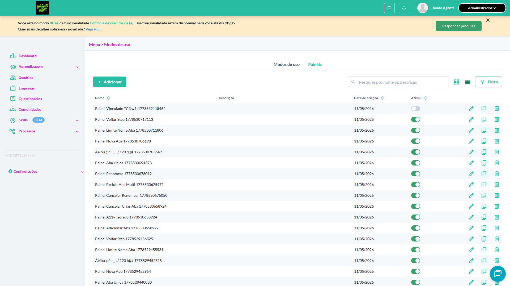
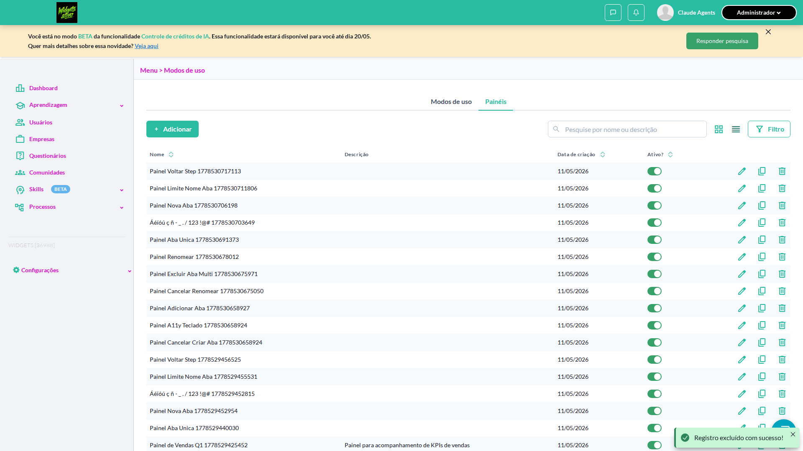

# Casos de teste — Widgets

[← Voltar ao dashboard](index.md)

Lista detalhada por testsuite. Cada caso traz: o que era esperado pelo XML, quais steps foram executados, evidências (screenshots/trace), texto pronto pra registro de bug e — quando houver falha — uma explicação em PT-BR do motivo.

## Ativar / Inativar painel

_5 caso(s) — 3 aprovado(s), 1 falha(s), 1 ignorado(s)_

### ✅ Aprovado · Ativar um painel previamente inativo · 🔴 Crítico

<a id="ativar-um-painel-previamente-inativo"></a>_Arquivo:_ `ativar-painel-inativo.spec.ts` · _Duração:_ 10.02s · _Browser:_ chromium

**Sumário (objetivo do caso):** Validar reativação via switch (R2 RN12).

**Pré-condições:**

```
Ambiente Stage configurado Funcionalidade 'Gestão de Painéis' habilitada no contrato Feature flag 'habilitar_paineis_do_usuario' ativa Usuário logado como Admin Existe painel 'Painel QA Teste' cadastrado e inativo
```

**Passos do caso (XML/TestLink + execução Playwright):**

_Cada linha reproduz um passo do XML; a coluna **Status** traz o resultado da execução (do step Allure correspondente). Linhas com "Pré-condição" são da execução automatizada (login, navegação inicial) — não fazem parte do roteiro do XML._

| # | Ação do passo | Resultado esperado | Status | Notas | Duração |
|---|---|---|:---:|---|---:|
| 1 | Acessar a aba 'Painéis' em Configurações > Menu | Listagem é exibida com 'Painel QA Teste' inativo | ✅ | — | 7.16s |
| 2 | Clicar no switch da coluna 'Ativo' na linha 'Painel QA Teste' | Switch fica ligado e estado 'Ativo' é persistido | ✅ | — | 0.81s |

**Evidências:**

_Sem evidências anexadas._


---

### ❌ Falhou · Tentar inativar painel associado a modos de uso exibe modal de bloqueio 

<a id="tentar-inativar-painel-associado-a-modos-de-uso-exibe-modal-de-bloqueio"></a>_Arquivo:_ `inativar-painel-associado-modal.spec.ts` · _Duração:_ 19.41s · _Browser:_ chromium

> **❌ Por que falhou:** O elemento esperado não apareceu na tela (locator: locator('.chakra-modal__content').filter({ has: locator('[data-test-id="panel-in-use-modal-confirm"]') })).
> _Step impactado:_ **2. Clicar no switch "Ativo" da linha "Painel Vinculado TC3 w1-1778532118462" e verificar modal "Painel em uso"**

**Passos do caso (XML/TestLink + execução Playwright):**

_Cada linha reproduz um passo do XML; a coluna **Status** traz o resultado da execução (do step Allure correspondente). Linhas com "Pré-condição" são da execução automatizada (login, navegação inicial) — não fazem parte do roteiro do XML._

| # | Ação do passo | Resultado esperado | Status | Notas | Duração |
|---|---|---|:---:|---|---:|
| — | _Pré-condição:_ 1. Acessar a aba "Painéis" com o painel vinculado ativo | — | ✅ | — | 6.94s |
| — | _Pré-condição:_ 2. Clicar no switch "Ativo" da linha "Painel Vinculado TC3 w1-1778532118462" e verificar modal "Painel em uso" | — | ❌ | O elemento esperado não apareceu na tela (locator: locator('.chakra-modal__content').filter({ has: locator('[data-test-id="panel-in-use-modal-confirm"]') })). | 10.07s |

**Evidências:**





- 📦 [Trace do Playwright (trace.zip)](../../test-artifacts/projects-widgets-tests-fea-18075-uso-exibe-modal-de-bloqueio-chromium/trace.zip) — abra com `npx playwright show-trace`

- 📄 [Snapshot do DOM no momento da falha (`error-context.md`)](../../test-artifacts/projects-widgets-tests-fea-18075-uso-exibe-modal-de-bloqueio-chromium/error-context.md)

#### 🐛 Pronto para registro de bug

**Descrição do BUG:** [—] Tentar inativar painel associado a modos de uso exibe modal de bloqueio — O elemento esperado não apareceu na tela (locator: locator('.chakra-modal__content').filter({ has: locator('[data-test-id="panel-in-use-modal-confirm"]') })).

**Passo a passo para reprodução:**
1. — (sem steps documentados no XML)

**Comportamento esperado:** —

**Comportamento atual:** O elemento esperado não apareceu na tela (locator: locator('.chakra-modal__content').filter({ has: locator('[data-test-id="panel-in-use-modal-confirm"]') })).

**Informações:**

| Campo | Valor |
|---|---|
| URL | `https://widgets.stage.twygoead.com/` |
| Login | ${TWYGO_STAGING_WIDGETS_EMAIL} |
| Senha | ${TWYGO_STAGING_WIDGETS_PASSWORD} |
| orgId | 36988 |
| Outros | Browser: chromium |
| Outros | runId: ativar-inativar-painel_20260511-174319 |
| Outros | Duração até a falha: 19.41s |
| Outros | Step impactado: 2. 2. Clicar no switch "Ativo" da linha "Painel Vinculado TC3 w1-1778532118462" e verificar modal "Painel em uso" |

**Evidências:**

- Screenshot capturado pelo Playwright (screenshot): ../../test-artifacts/projects-widgets-tests-fea-18075-uso-exibe-modal-de-bloqueio-chromium/test-failed-1.png
- Snapshot do DOM/contexto da página (error-context.md): ../../test-artifacts/projects-widgets-tests-fea-18075-uso-exibe-modal-de-bloqueio-chromium/error-context.md
- Screenshot capturado pelo Playwright (screenshot): ../../test-artifacts/projects-widgets-tests-fea-18075-uso-exibe-modal-de-bloqueio-chromium/test-failed-2.png
- Snapshot do DOM/contexto da página (error-context.md): ../../test-artifacts/projects-widgets-tests-fea-18075-uso-exibe-modal-de-bloqueio-chromium/error-context.md
- Trace completo do Playwright (.zip) — `npx playwright show-trace`: ../../test-artifacts/projects-widgets-tests-fea-18075-uso-exibe-modal-de-bloqueio-chromium/trace.zip

<details><summary>📋 Ver texto agregado para copiar (Jira/GitHub/Linear)</summary>

```
Descrição do BUG
[—] Tentar inativar painel associado a modos de uso exibe modal de bloqueio — O elemento esperado não apareceu na tela (locator: locator('.chakra-modal__content').filter({ has: locator('[data-test-id="panel-in-use-modal-confirm"]') })).

Passo a passo para reprodução
  — (sem steps documentados no XML)

Comportamento esperado
—

Comportamento atual
O elemento esperado não apareceu na tela (locator: locator('.chakra-modal__content').filter({ has: locator('[data-test-id="panel-in-use-modal-confirm"]') })).

Informações
- URL: https://widgets.stage.twygoead.com/
- Login: ${TWYGO_STAGING_WIDGETS_EMAIL}
- Senha: ${TWYGO_STAGING_WIDGETS_PASSWORD}
- ID do ambiente (orgId): 36988
- Outros:
  - Browser: chromium
  - runId: ativar-inativar-painel_20260511-174319
  - Duração até a falha: 19.41s
  - Step impactado: 2. 2. Clicar no switch "Ativo" da linha "Painel Vinculado TC3 w1-1778532118462" e verificar modal "Painel em uso"

Evidências
- Screenshot capturado pelo Playwright (screenshot): ../../test-artifacts/projects-widgets-tests-fea-18075-uso-exibe-modal-de-bloqueio-chromium/test-failed-1.png
- Snapshot do DOM/contexto da página (error-context.md): ../../test-artifacts/projects-widgets-tests-fea-18075-uso-exibe-modal-de-bloqueio-chromium/error-context.md
- Screenshot capturado pelo Playwright (screenshot): ../../test-artifacts/projects-widgets-tests-fea-18075-uso-exibe-modal-de-bloqueio-chromium/test-failed-2.png
- Snapshot do DOM/contexto da página (error-context.md): ../../test-artifacts/projects-widgets-tests-fea-18075-uso-exibe-modal-de-bloqueio-chromium/error-context.md
- Trace completo do Playwright (.zip) — `npx playwright show-trace`: ../../test-artifacts/projects-widgets-tests-fea-18075-uso-exibe-modal-de-bloqueio-chromium/trace.zip

Execução
- runId: ativar-inativar-painel_20260511-174319
- environment.json: staging-widgets
- testsuite: Ativar / Inativar painel
- testcase: Tentar inativar painel associado a modos de uso exibe modal de bloqueio

```

</details>

<details><summary>🔧 Stack trace técnica completa (para desenvolvedor)</summary>

```
Error: expect(locator).toBeVisible() failed

Locator: locator('.chakra-modal__content').filter({ has: locator('[data-test-id="panel-in-use-modal-confirm"]') })
Expected: visible
Timeout: 10000ms
Error: element(s) not found

Call log:
  - Expect "toBeVisible" with timeout 10000ms
  - waiting for locator('.chakra-modal__content').filter({ has: locator('[data-test-id="panel-in-use-modal-confirm"]') })

```

</details>

---

### ✅ Aprovado · Inativar um painel não associado a nenhum modo de uso · 🔴 Crítico

<a id="inativar-um-painel-nao-associado-a-nenhum-modo-de-uso"></a>_Arquivo:_ `inativar-painel-nao-associado.spec.ts` · _Duração:_ 14.70s · _Browser:_ chromium

**Sumário (objetivo do caso):** Validar inativação direta via switch da coluna 'Ativo' (R2 RN12).

**Pré-condições:**

```
Ambiente Stage configurado Funcionalidade 'Gestão de Painéis' habilitada no contrato Feature flag 'habilitar_paineis_do_usuario' ativa Usuário logado como Admin Existe painel 'Painel QA Teste' cadastrado e ativo, sem associação com modo de uso
```

**Passos do caso (XML/TestLink + execução Playwright):**

_Cada linha reproduz um passo do XML; a coluna **Status** traz o resultado da execução (do step Allure correspondente). Linhas com "Pré-condição" são da execução automatizada (login, navegação inicial) — não fazem parte do roteiro do XML._

| # | Ação do passo | Resultado esperado | Status | Notas | Duração |
|---|---|---|:---:|---|---:|
| 1 | Acessar a aba 'Painéis' em Configurações > Menu | Listagem é exibida com 'Painel QA Teste' ativo | ✅ | — | 7.38s |
| 2 | Clicar no switch da coluna 'Ativo' na linha 'Painel QA Teste' | Switch fica desligado e estado 'Inativo' é persistido | ✅ | — | 0.83s |
| 3 | Recarregar a página | Painel 'Painel QA Teste' permanece com switch desligado na coluna 'Ativo' | ✅ | — | 4.28s |

**Evidências:**

_Sem evidências anexadas._


---

### ✅ Aprovado · Verificar persistência do estado Ativo após reload · 🟡 Normal

<a id="verificar-persistencia-do-estado-ativo-apos-reload"></a>_Arquivo:_ `persistencia-estado-ativo-reload.spec.ts` · _Duração:_ 15.46s · _Browser:_ chromium

**Sumário (objetivo do caso):** Validar persistência das alterações de status.

**Pré-condições:**

```
Ambiente Stage configurado Funcionalidade 'Gestão de Painéis' habilitada no contrato Feature flag 'habilitar_paineis_do_usuario' ativa Usuário logado como Admin Existem painéis ativos e inativos
```

**Passos do caso (XML/TestLink + execução Playwright):**

_Cada linha reproduz um passo do XML; a coluna **Status** traz o resultado da execução (do step Allure correspondente). Linhas com "Pré-condição" são da execução automatizada (login, navegação inicial) — não fazem parte do roteiro do XML._

| # | Ação do passo | Resultado esperado | Status | Notas | Duração |
|---|---|---|:---:|---|---:|
| 1 | Acessar a aba 'Painéis' em Configurações > Menu | Listagem é exibida | ✅ | — | 7.58s |
| 2 | Alterar o switch 'Ativo' de um painel para o estado oposto | Switch reflete o novo estado | ✅ | — | 0.86s |
| 3 | Recarregar a página (F5) | Listagem é recarregada e o switch mantém o estado alterado | ✅ | — | 4.71s |

**Evidências:**

_Sem evidências anexadas._


---

### ⊘ Ignorado · Tentar reativar menu de modo de uso vinculado a painel inativo exibe modal 

<a id="tentar-reativar-menu-de-modo-de-uso-vinculado-a-painel-inativo-exibe-modal"></a>_Arquivo:_ `reativar-modo-uso-painel-inativo.spec.ts` · _Duração:_ 0.50s · _Browser:_ chromium

> **⊘ Por que foi ignorado:** Marcado para revisão (test.fixme): requer (1) "Painel QA Teste" inativo + (2) menu de modo de uso vinculado a esse painel (campo "Modelo de página") e inativo. Cenário não reproduzível no seed atual (sem Painel QA Teste; menus seedados não têm vínculo conhecido com painéis inativos). Selectors do modal e da row do menu específico a confirmar live quando seed existir.

**Passos do caso (XML/TestLink + execução Playwright):**

_Cada linha reproduz um passo do XML; a coluna **Status** traz o resultado da execução (do step Allure correspondente). Linhas com "Pré-condição" são da execução automatizada (login, navegação inicial) — não fazem parte do roteiro do XML._

_Sem steps Allure ou metadata XML para este testcase._

**Evidências:**

_Sem evidências anexadas._

#### ⏳ Pendente — execução automatizada não realizada

- **Severidade do caso (XML):** —
- **Motivo do skip / fixme:** requer (1) "Painel QA Teste" inativo + (2) menu de modo de uso vinculado a esse painel (campo "Modelo de página") e inativo. Cenário não reproduzível no seed atual (sem Painel QA Teste; menus seedados não têm vínculo conhecido com painéis inativos). Selectors do modal e da row do menu específico a confirmar live quando seed existir.

**Roteiro do XML (para validação manual):**
1. — (sem steps documentados no XML)

> Esse caso não bloqueia a build, mas precisa de validação manual ou ajuste no agente.


---
