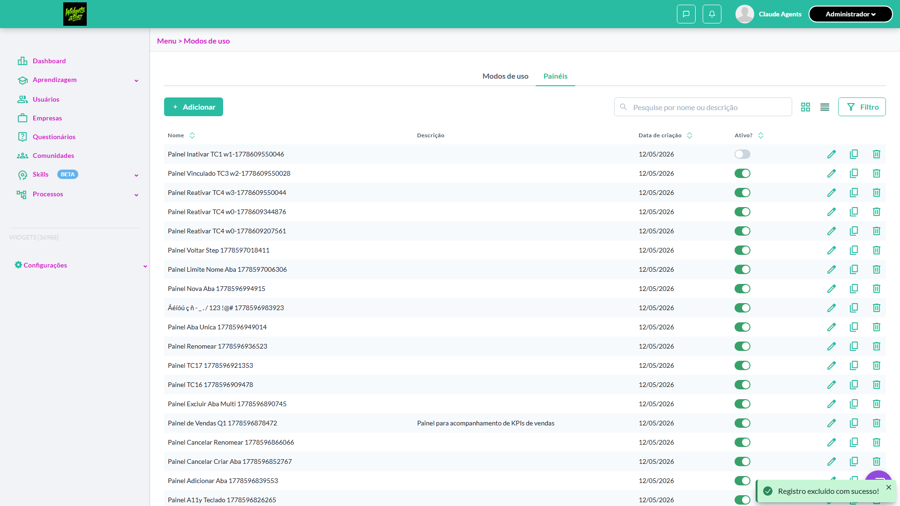
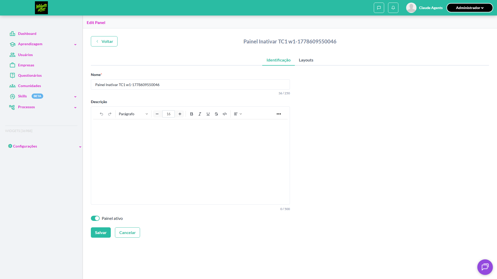
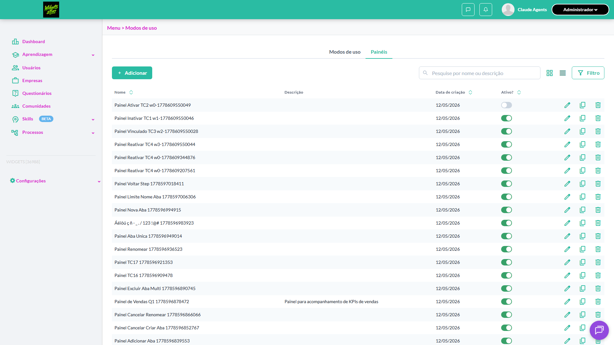
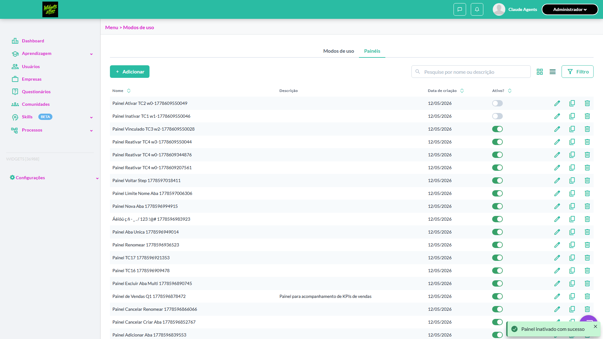
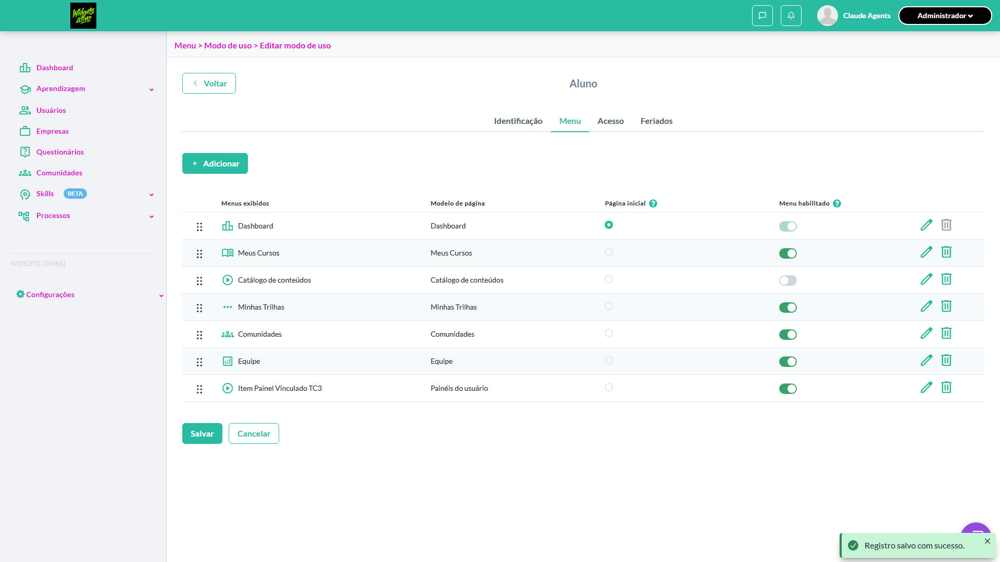
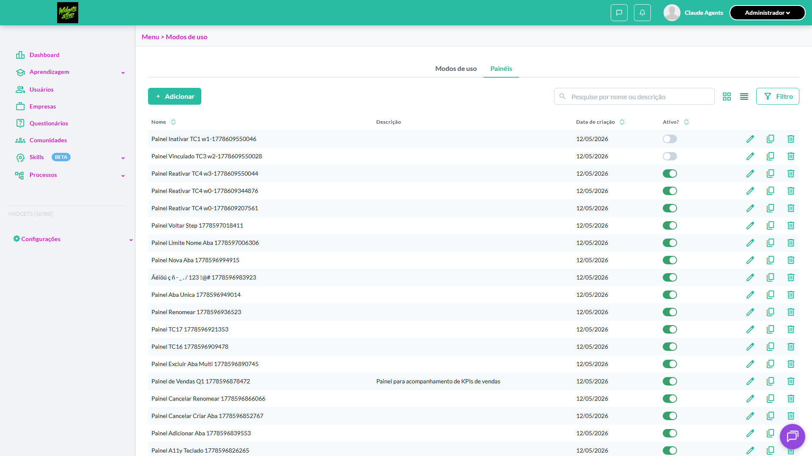
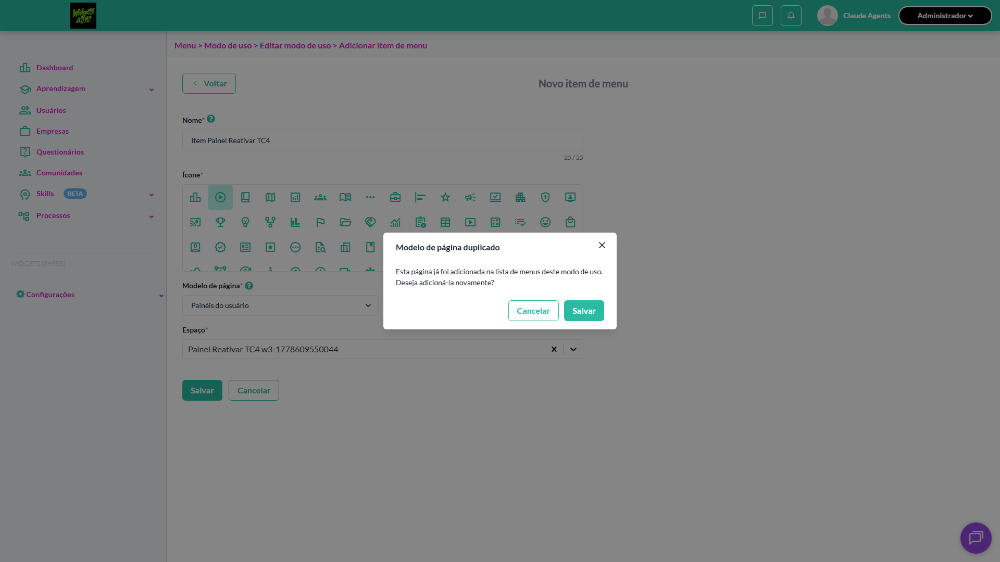
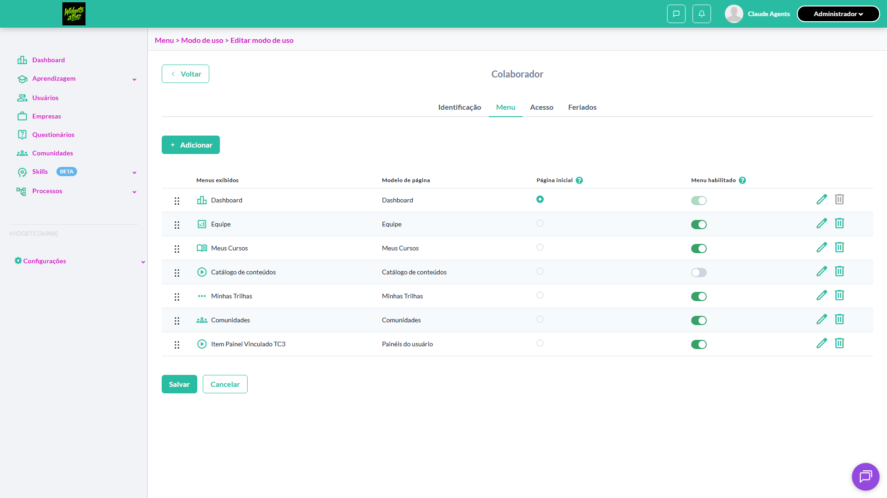

# Casos de teste — Widgets

[← Voltar ao dashboard](index.md)

Lista detalhada por testsuite. Cada caso traz: o que era esperado pelo XML, quais steps foram executados, evidências (screenshots/trace), texto pronto pra registro de bug e — quando houver falha — uma explicação em PT-BR do motivo.

## Ativar / Inativar painel

_5 caso(s) — 3 aprovado(s), 2 falha(s)_

### ✅ Aprovado · Ativar um painel previamente inativo · 🔴 Crítico

<a id="ativar-um-painel-previamente-inativo"></a>_Arquivo:_ `ativar-painel-previamente-inativo.spec.ts` · _Duração:_ 10.38s · _Browser:_ chromium

**Sumário (objetivo do caso):** Validar reativação via switch (R2 RN12).

**Pré-condições:**

```
Ambiente Stage configurado Funcionalidade 'Gestão de Painéis' habilitada no contrato Feature flag 'habilitar_paineis_do_usuario' ativa Usuário logado como Admin Existe painel 'Painel QA Teste' cadastrado e inativo
```

**Passos do caso (XML/TestLink + execução Playwright):**

_Cada linha reproduz um passo do XML; a coluna **Status** traz o resultado da execução (do step Allure correspondente). Linhas com "Pré-condição" são da execução automatizada (login, navegação inicial) — não fazem parte do roteiro do XML._

| # | Ação do passo | Resultado esperado | Status | Notas | Duração |
|---|---|---|:---:|---|---:|
| 1 | Acessar a aba 'Painéis' em Configurações > Menu | Listagem é exibida com 'Painel QA Teste' inativo | ✅ | — | 6.49s |
| 2 | Clicar no switch da coluna 'Ativo' na linha 'Painel QA Teste' | Switch fica ligado e estado 'Ativo' é persistido | ✅ | — | 0.90s |

**Evidências:**




- 📦 [Trace do Playwright (trace.zip)](artifacts/projects-widgets-tests-fea-1b617--painel-previamente-inativo-chromium/trace.zip) — abra com `npx playwright show-trace`


---

### ✅ Aprovado · Inativar um painel não associado a nenhum modo de uso · 🔴 Crítico

<a id="inativar-um-painel-nao-associado-a-nenhum-modo-de-uso"></a>_Arquivo:_ `inativar-painel-nao-associado.spec.ts` · _Duração:_ 17.77s · _Browser:_ chromium

**Sumário (objetivo do caso):** Validar inativação direta via switch da coluna 'Ativo' (R2 RN12).

**Pré-condições:**

```
Ambiente Stage configurado Funcionalidade 'Gestão de Painéis' habilitada no contrato Feature flag 'habilitar_paineis_do_usuario' ativa Usuário logado como Admin Existe painel 'Painel QA Teste' cadastrado e ativo, sem associação com modo de uso
```

**Passos do caso (XML/TestLink + execução Playwright):**

_Cada linha reproduz um passo do XML; a coluna **Status** traz o resultado da execução (do step Allure correspondente). Linhas com "Pré-condição" são da execução automatizada (login, navegação inicial) — não fazem parte do roteiro do XML._

| # | Ação do passo | Resultado esperado | Status | Notas | Duração |
|---|---|---|:---:|---|---:|
| 1 | Acessar a aba 'Painéis' em Configurações > Menu | Listagem é exibida com 'Painel QA Teste' ativo | ✅ | — | 6.59s |
| 2 | Clicar no switch da coluna 'Ativo' na linha 'Painel QA Teste' | Switch fica desligado e estado 'Inativo' é persistido | ✅ | — | 1.10s |
| 3 | Recarregar a página | Painel 'Painel QA Teste' permanece com switch desligado na coluna 'Ativo' | ✅ | — | 7.22s |

**Evidências:**








- 📦 [Trace do Playwright (trace.zip)](artifacts/projects-widgets-tests-fea-e307b-ociado-a-nenhum-modo-de-uso-chromium/trace.zip) — abra com `npx playwright show-trace`


---

### ❌ Falhou · Tentar inativar painel associado a um ou mais modos de uso · 🔴 Crítico

<a id="tentar-inativar-painel-associado-a-um-ou-mais-modos-de-uso"></a>_Arquivo:_ `tentar-inativar-painel-associado.spec.ts` · _Duração:_ 19.47s · _Browser:_ chromium

> **❌ Por que falhou:** O elemento esperado não apareceu na tela (locator: locator('.chakra-modal__content').filter({ has: locator('[data-test-id="panel-in-use-modal-confirm"]') })).
> _Step impactado:_ **2. Clicar no switch da coluna 'Ativo' na linha 'Painel Vinculado'**

**Sumário (objetivo do caso):** Validar modal informativo de bloqueio (R2 RN12.1).

**Pré-condições:**

```
Ambiente Stage configurado Funcionalidade 'Gestão de Painéis' habilitada no contrato Feature flag 'habilitar_paineis_do_usuario' ativa Usuário logado como Admin Existe painel 'Painel Vinculado' associado a 2 menus de modos de uso ativos
```

**Passos do caso (XML/TestLink + execução Playwright):**

_Cada linha reproduz um passo do XML; a coluna **Status** traz o resultado da execução (do step Allure correspondente). Linhas com "Pré-condição" são da execução automatizada (login, navegação inicial) — não fazem parte do roteiro do XML._

| # | Ação do passo | Resultado esperado | Status | Notas | Duração |
|---|---|---|:---:|---|---:|
| 1 | Acessar a aba 'Painéis' em Configurações > Menu | Listagem é exibida com 'Painel Vinculado' ativo | ✅ | — | 6.52s |
| 2 | Clicar no switch da coluna 'Ativo' na linha 'Painel Vinculado' | Modal informativo é exibido listando os menus que utilizam o painel e informando que não pode ser desativado | ❌ | O elemento esperado não apareceu na tela (locator: locator('.chakra-modal__content').filter({ has: locator('[data-test-id="panel-in-use-modal-confirm"]') })). | 10.11s |
| 3 | Clicar no botão 'Fechar' ou 'OK' do modal | Modal é fechado e switch permanece ligado (painel continua ativo) | ⊘ | Step não executado: o teste foi interrompido antes. Causa: O elemento esperado não apareceu na tela (locator: locator('.chakra-modal__content').filter({ has: locator('[data-test-id="panel-in-use-modal-confirm"]') })).. | — |

**Evidências:**







- 📦 [Trace do Playwright (trace.zip)](artifacts/projects-widgets-tests-fea-69a3a-o-a-um-ou-mais-modos-de-uso-chromium/trace.zip) — abra com `npx playwright show-trace`

- 📄 [Snapshot do DOM no momento da falha (`error-context.md`)](artifacts/projects-widgets-tests-fea-69a3a-o-a-um-ou-mais-modos-de-uso-chromium/error-context.md)

#### 🐛 Pronto para registro de bug

**Descrição do BUG:** [Crítico] Tentar inativar painel associado a um ou mais modos de uso — O elemento esperado não apareceu na tela (locator: locator('.chakra-modal__content').filter({ has: locator('[data-test-id="panel-in-use-modal-confirm"]') })).

**Passo a passo para reprodução:**
1. Pré: Ambiente Stage configurado Funcionalidade 'Gestão de Painéis' habilitada no contrato Feature flag 'habilitar_paineis_do_usuario' ativa Usuário logado como Admin Existe painel 'Painel Vinculado' associado a 2 menus de modos de uso ativos
1. 1. Acessar a aba 'Painéis' em Configurações > Menu
1. 2. Clicar no switch da coluna 'Ativo' na linha 'Painel Vinculado'
1. 3. Clicar no botão 'Fechar' ou 'OK' do modal

**Comportamento esperado:** Modal informativo é exibido listando os menus que utilizam o painel e informando que não pode ser desativado

**Comportamento atual:** O elemento esperado não apareceu na tela (locator: locator('.chakra-modal__content').filter({ has: locator('[data-test-id="panel-in-use-modal-confirm"]') })).

**Informações:**

| Campo | Valor |
|---|---|
| URL | `https://widgets.stage.twygoead.com/` |
| Login | ${TWYGO_STAGING_WIDGETS_EMAIL} |
| Senha | ${TWYGO_STAGING_WIDGETS_PASSWORD} |
| orgId | 36988 |
| Outros | Browser: chromium |
| Outros | runId: ativar-inativar-painel_20260512-151359 |
| Outros | Duração até a falha: 19.47s |
| Outros | Step impactado: 2. 2. Clicar no switch da coluna 'Ativo' na linha 'Painel Vinculado' |

**Evidências:**

- Screenshot capturado pelo Playwright (screenshot): artifacts/projects-widgets-tests-fea-69a3a-o-a-um-ou-mais-modos-de-uso-chromium/test-finished-1.png
- Screenshot capturado pelo Playwright (step-01-1-Acessar-a-aba-Pain-is-em-Configura-es-Menu): artifacts/attachments/step-01-1-Acessar-a-aba-Pain-is-em-Configura-es-Menu-b987c84157ff4f8f71de006cf32669f656d10388.png
- Screenshot capturado pelo Playwright (screenshot): artifacts/projects-widgets-tests-fea-69a3a-o-a-um-ou-mais-modos-de-uso-chromium/test-failed-2.png
- Snapshot do DOM/contexto da página (error-context.md): artifacts/projects-widgets-tests-fea-69a3a-o-a-um-ou-mais-modos-de-uso-chromium/error-context.md
- Screenshot capturado pelo Playwright (screenshot): artifacts/projects-widgets-tests-fea-69a3a-o-a-um-ou-mais-modos-de-uso-chromium/test-failed-3.png
- Snapshot do DOM/contexto da página (error-context.md): artifacts/projects-widgets-tests-fea-69a3a-o-a-um-ou-mais-modos-de-uso-chromium/error-context.md
- Trace completo do Playwright (.zip) — `npx playwright show-trace`: artifacts/projects-widgets-tests-fea-69a3a-o-a-um-ou-mais-modos-de-uso-chromium/trace.zip

<details><summary>📋 Ver texto agregado para copiar (Jira/GitHub/Linear)</summary>

```
Descrição do BUG
[Crítico] Tentar inativar painel associado a um ou mais modos de uso — O elemento esperado não apareceu na tela (locator: locator('.chakra-modal__content').filter({ has: locator('[data-test-id="panel-in-use-modal-confirm"]') })).

Passo a passo para reprodução
  Pré: Ambiente Stage configurado Funcionalidade 'Gestão de Painéis' habilitada no contrato Feature flag 'habilitar_paineis_do_usuario' ativa Usuário logado como Admin Existe painel 'Painel Vinculado' associado a 2 menus de modos de uso ativos
  1. Acessar a aba 'Painéis' em Configurações > Menu
  2. Clicar no switch da coluna 'Ativo' na linha 'Painel Vinculado'
  3. Clicar no botão 'Fechar' ou 'OK' do modal

Comportamento esperado
Modal informativo é exibido listando os menus que utilizam o painel e informando que não pode ser desativado

Comportamento atual
O elemento esperado não apareceu na tela (locator: locator('.chakra-modal__content').filter({ has: locator('[data-test-id="panel-in-use-modal-confirm"]') })).

Informações
- URL: https://widgets.stage.twygoead.com/
- Login: ${TWYGO_STAGING_WIDGETS_EMAIL}
- Senha: ${TWYGO_STAGING_WIDGETS_PASSWORD}
- ID do ambiente (orgId): 36988
- Outros:
  - Browser: chromium
  - runId: ativar-inativar-painel_20260512-151359
  - Duração até a falha: 19.47s
  - Step impactado: 2. 2. Clicar no switch da coluna 'Ativo' na linha 'Painel Vinculado'

Evidências
- Screenshot capturado pelo Playwright (screenshot): artifacts/projects-widgets-tests-fea-69a3a-o-a-um-ou-mais-modos-de-uso-chromium/test-finished-1.png
- Screenshot capturado pelo Playwright (step-01-1-Acessar-a-aba-Pain-is-em-Configura-es-Menu): artifacts/attachments/step-01-1-Acessar-a-aba-Pain-is-em-Configura-es-Menu-b987c84157ff4f8f71de006cf32669f656d10388.png
- Screenshot capturado pelo Playwright (screenshot): artifacts/projects-widgets-tests-fea-69a3a-o-a-um-ou-mais-modos-de-uso-chromium/test-failed-2.png
- Snapshot do DOM/contexto da página (error-context.md): artifacts/projects-widgets-tests-fea-69a3a-o-a-um-ou-mais-modos-de-uso-chromium/error-context.md
- Screenshot capturado pelo Playwright (screenshot): artifacts/projects-widgets-tests-fea-69a3a-o-a-um-ou-mais-modos-de-uso-chromium/test-failed-3.png
- Snapshot do DOM/contexto da página (error-context.md): artifacts/projects-widgets-tests-fea-69a3a-o-a-um-ou-mais-modos-de-uso-chromium/error-context.md
- Trace completo do Playwright (.zip) — `npx playwright show-trace`: artifacts/projects-widgets-tests-fea-69a3a-o-a-um-ou-mais-modos-de-uso-chromium/trace.zip

Execução
- runId: ativar-inativar-painel_20260512-151359
- environment.json: staging-widgets
- testsuite: Ativar / Inativar painel
- testcase: Tentar inativar painel associado a um ou mais modos de uso

```

</details>

<details><summary>🔧 Stack trace técnica completa (para desenvolvedor)</summary>

```
Error: expect(locator).toBeVisible() failed

Locator: locator('.chakra-modal__content').filter({ has: locator('[data-test-id="panel-in-use-modal-confirm"]') })
Expected: visible
Timeout: 10000ms
Error: element(s) not found

Call log:
  - Expect "toBeVisible" with timeout 10000ms
  - waiting for locator('.chakra-modal__content').filter({ has: locator('[data-test-id="panel-in-use-modal-confirm"]') })

```

</details>

---

### ❌ Falhou · Tentar reativar modo de uso vinculado a um painel inativo · 🔴 Crítico

<a id="tentar-reativar-modo-de-uso-vinculado-a-um-painel-inativo"></a>_Arquivo:_ `tentar-reativar-modo-uso-painel-inativo.spec.ts` · _Duração:_ 0.00s · _Browser:_ chromium

> **❌ Por que falhou:** A página não navegou para a URL esperada dentro do tempo limite.

**Sumário (objetivo do caso):** Validar bloqueio descrito em R15 RN93.

**Pré-condições:**

```
Ambiente Stage configurado Funcionalidade 'Gestão de Painéis' habilitada no contrato Feature flag 'habilitar_paineis_do_usuario' ativa Usuário logado como Admin Existe menu de modo de uso vinculado ao painel 'Painel QA Teste' que está inativo Menu está inativo
```

**Passos do caso (XML/TestLink + execução Playwright):**

_Cada linha reproduz um passo do XML; a coluna **Status** traz o resultado da execução (do step Allure correspondente). Linhas com "Pré-condição" são da execução automatizada (login, navegação inicial) — não fazem parte do roteiro do XML._

| # | Ação do passo | Resultado esperado | Status | Notas | Duração |
|---|---|---|:---:|---|---:|
| 1 | Acessar Menu > Modos de uso | Tela de Modos de uso é exibida | ⊘ | Step não executado: o teste foi interrompido antes. Causa: A página não navegou para a URL esperada dentro do tempo limite.. | — |
| 2 | Clicar no switch de ativação do menu vinculado a 'Painel QA Teste' | Modal informativo é exibido informando que o painel está inativo e não pode ser reativado | ⊘ | Step não executado: o teste foi interrompido antes. Causa: A página não navegou para a URL esperada dentro do tempo limite.. | — |
| 3 | Clicar no botão 'Fechar' do modal | Modal é fechado e menu permanece inativo | ⊘ | Step não executado: o teste foi interrompido antes. Causa: A página não navegou para a URL esperada dentro do tempo limite.. | — |

**Evidências:**





- 📦 [Trace do Playwright (trace.zip)](artifacts/projects-widgets-tests-fea-9ba3f-nculado-a-um-painel-inativo-chromium/trace.zip) — abra com `npx playwright show-trace`

- 📄 [Snapshot do DOM no momento da falha (`error-context.md`)](artifacts/projects-widgets-tests-fea-9ba3f-nculado-a-um-painel-inativo-chromium/error-context.md)

#### 🐛 Pronto para registro de bug

**Descrição do BUG:** [Crítico] Tentar reativar modo de uso vinculado a um painel inativo — A página não navegou para a URL esperada dentro do tempo limite.

**Passo a passo para reprodução:**
1. Pré: Ambiente Stage configurado Funcionalidade 'Gestão de Painéis' habilitada no contrato Feature flag 'habilitar_paineis_do_usuario' ativa Usuário logado como Admin Existe menu de modo de uso vinculado ao painel 'Painel QA Teste' que está inativo Menu está inativo
1. 1. Acessar Menu > Modos de uso
1. 2. Clicar no switch de ativação do menu vinculado a 'Painel QA Teste'
1. 3. Clicar no botão 'Fechar' do modal

**Comportamento esperado:** 1. Tela de Modos de uso é exibida | 2. Modal informativo é exibido informando que o painel está inativo e não pode ser reativado | 3. Modal é fechado e menu permanece inativo

**Comportamento atual:** A página não navegou para a URL esperada dentro do tempo limite.

**Informações:**

| Campo | Valor |
|---|---|
| URL | `/o/{orgId}/use_modes/{useModeId}/use_mode_itens/new` |
| Login | ${TWYGO_STAGING_WIDGETS_EMAIL} |
| Senha | ${TWYGO_STAGING_WIDGETS_PASSWORD} |
| orgId | 36988 |
| Outros | Browser: chromium |
| Outros | runId: ativar-inativar-painel_20260512-151359 |
| Outros | Duração até a falha: 0.00s |

**Evidências:**

- Screenshot capturado pelo Playwright (screenshot): artifacts/projects-widgets-tests-fea-9ba3f-nculado-a-um-painel-inativo-chromium/test-failed-1.png
- Snapshot do DOM/contexto da página (error-context.md): artifacts/projects-widgets-tests-fea-9ba3f-nculado-a-um-painel-inativo-chromium/error-context.md
- Screenshot capturado pelo Playwright (screenshot): artifacts/projects-widgets-tests-fea-9ba3f-nculado-a-um-painel-inativo-chromium/test-failed-2.png
- Snapshot do DOM/contexto da página (error-context.md): artifacts/projects-widgets-tests-fea-9ba3f-nculado-a-um-painel-inativo-chromium/error-context.md
- Trace completo do Playwright (.zip) — `npx playwright show-trace`: artifacts/projects-widgets-tests-fea-9ba3f-nculado-a-um-painel-inativo-chromium/trace.zip

<details><summary>📋 Ver texto agregado para copiar (Jira/GitHub/Linear)</summary>

```
Descrição do BUG
[Crítico] Tentar reativar modo de uso vinculado a um painel inativo — A página não navegou para a URL esperada dentro do tempo limite.

Passo a passo para reprodução
  Pré: Ambiente Stage configurado Funcionalidade 'Gestão de Painéis' habilitada no contrato Feature flag 'habilitar_paineis_do_usuario' ativa Usuário logado como Admin Existe menu de modo de uso vinculado ao painel 'Painel QA Teste' que está inativo Menu está inativo
  1. Acessar Menu > Modos de uso
  2. Clicar no switch de ativação do menu vinculado a 'Painel QA Teste'
  3. Clicar no botão 'Fechar' do modal

Comportamento esperado
1. Tela de Modos de uso é exibida | 2. Modal informativo é exibido informando que o painel está inativo e não pode ser reativado | 3. Modal é fechado e menu permanece inativo

Comportamento atual
A página não navegou para a URL esperada dentro do tempo limite.

Informações
- URL: /o/{orgId}/use_modes/{useModeId}/use_mode_itens/new
- Login: ${TWYGO_STAGING_WIDGETS_EMAIL}
- Senha: ${TWYGO_STAGING_WIDGETS_PASSWORD}
- ID do ambiente (orgId): 36988
- Outros:
  - Browser: chromium
  - runId: ativar-inativar-painel_20260512-151359
  - Duração até a falha: 0.00s

Evidências
- Screenshot capturado pelo Playwright (screenshot): artifacts/projects-widgets-tests-fea-9ba3f-nculado-a-um-painel-inativo-chromium/test-failed-1.png
- Snapshot do DOM/contexto da página (error-context.md): artifacts/projects-widgets-tests-fea-9ba3f-nculado-a-um-painel-inativo-chromium/error-context.md
- Screenshot capturado pelo Playwright (screenshot): artifacts/projects-widgets-tests-fea-9ba3f-nculado-a-um-painel-inativo-chromium/test-failed-2.png
- Snapshot do DOM/contexto da página (error-context.md): artifacts/projects-widgets-tests-fea-9ba3f-nculado-a-um-painel-inativo-chromium/error-context.md
- Trace completo do Playwright (.zip) — `npx playwright show-trace`: artifacts/projects-widgets-tests-fea-9ba3f-nculado-a-um-painel-inativo-chromium/trace.zip

Execução
- runId: ativar-inativar-painel_20260512-151359
- environment.json: staging-widgets
- testsuite: Ativar / Inativar painel
- testcase: Tentar reativar modo de uso vinculado a um painel inativo

```

</details>

<details><summary>🔧 Stack trace técnica completa (para desenvolvedor)</summary>

```
TimeoutError: page.waitForURL: Timeout 30000ms exceeded.
=========================== logs ===========================
waiting for navigation until "load"
============================================================
```

</details>

---

### ✅ Aprovado · Verificar persistência do estado Ativo após reload · 🟡 Normal

<a id="verificar-persistencia-do-estado-ativo-apos-reload"></a>_Arquivo:_ `verificar-persistencia-estado-ativo.spec.ts` · _Duração:_ 14.61s · _Browser:_ chromium

**Sumário (objetivo do caso):** Validar persistência das alterações de status.

**Pré-condições:**

```
Ambiente Stage configurado Funcionalidade 'Gestão de Painéis' habilitada no contrato Feature flag 'habilitar_paineis_do_usuario' ativa Usuário logado como Admin Existem painéis ativos e inativos
```

**Passos do caso (XML/TestLink + execução Playwright):**

_Cada linha reproduz um passo do XML; a coluna **Status** traz o resultado da execução (do step Allure correspondente). Linhas com "Pré-condição" são da execução automatizada (login, navegação inicial) — não fazem parte do roteiro do XML._

| # | Ação do passo | Resultado esperado | Status | Notas | Duração |
|---|---|---|:---:|---|---:|
| 1 | Acessar a aba 'Painéis' em Configurações > Menu | Listagem é exibida | ✅ | — | 6.44s |
| 2 | Alterar o switch 'Ativo' de um painel para o estado oposto | Switch reflete o novo estado | ✅ | — | 1.15s |
| 3 | Recarregar a página (F5) | Listagem é recarregada e o switch mantém o estado alterado | ✅ | — | 4.25s |

**Evidências:**


- 📦 [Trace do Playwright (trace.zip)](artifacts/projects-widgets-tests-fea-98ec4-do-estado-Ativo-após-reload-chromium/trace.zip) — abra com `npx playwright show-trace`


---
