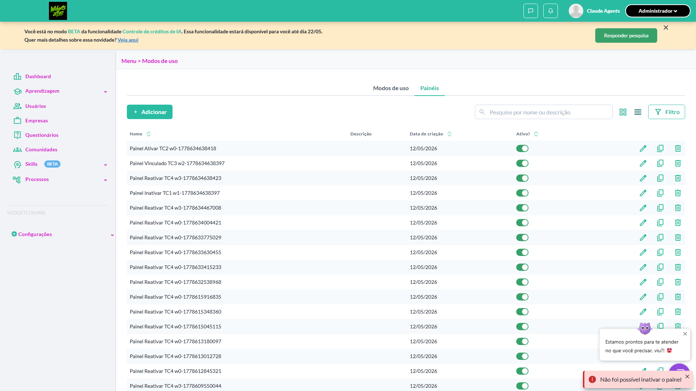
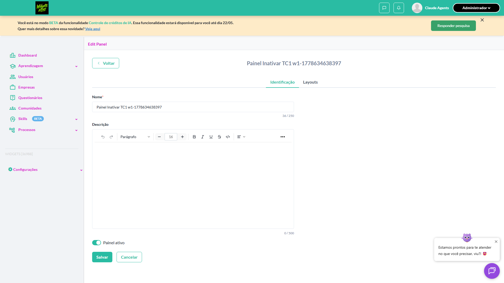
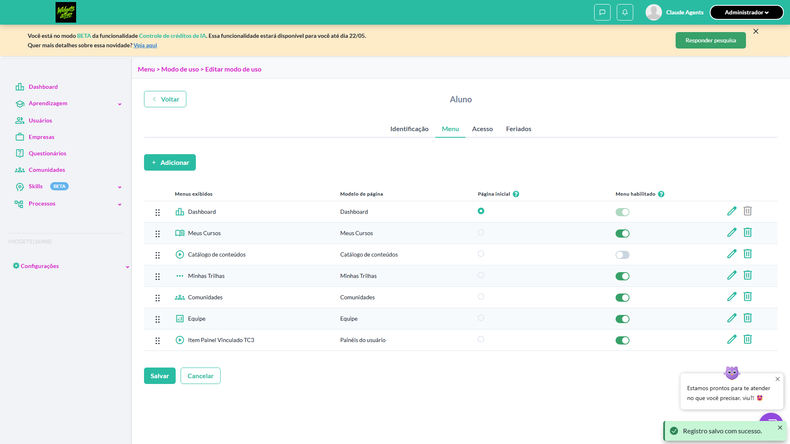
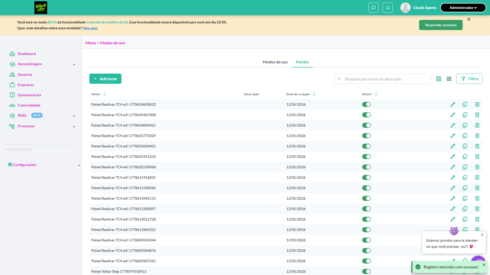
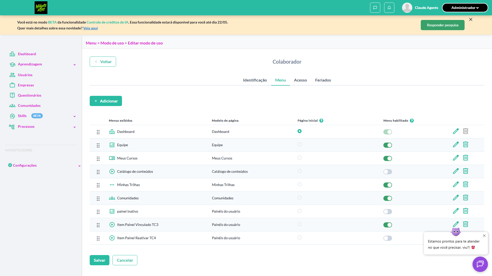
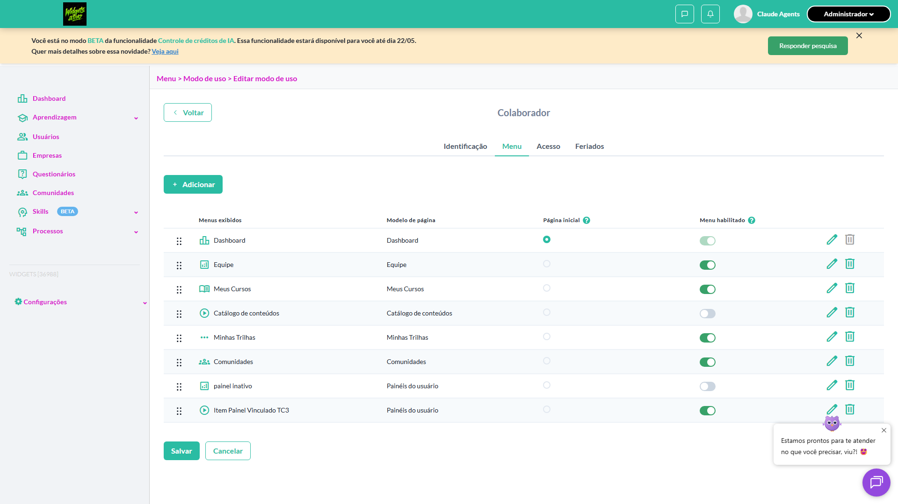
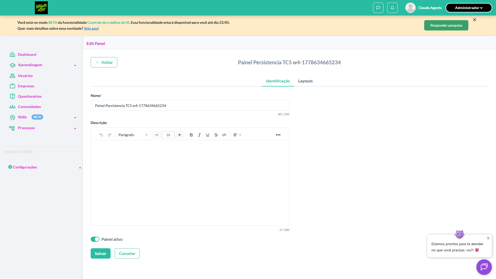
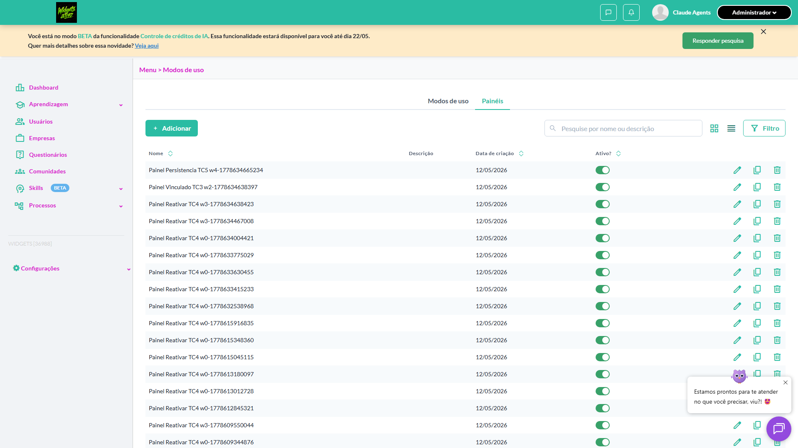
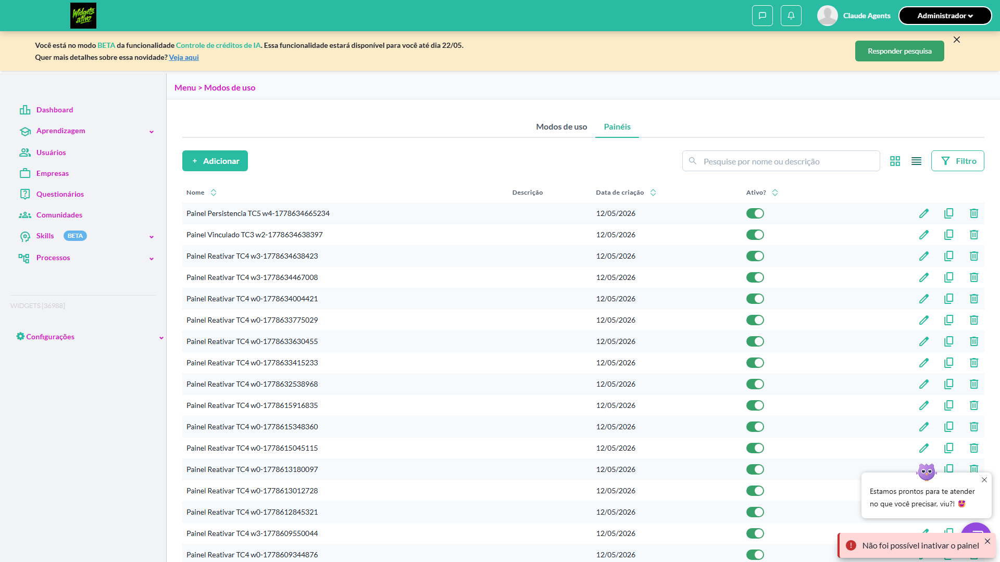
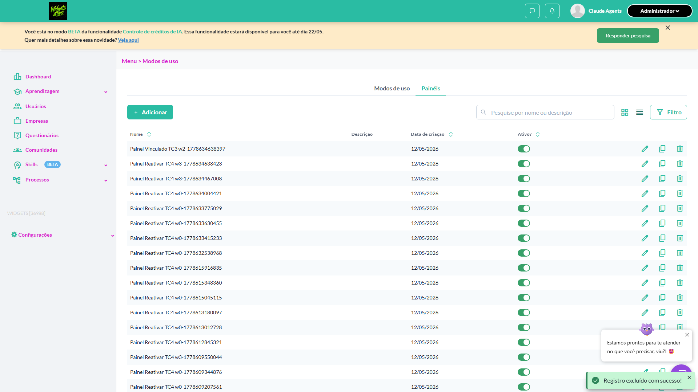

# Casos de teste — Widgets

[← Voltar ao dashboard](index.md)

Lista detalhada por testsuite. Cada caso traz: o que era esperado pelo XML, quais steps foram executados, evidências (screenshots/trace), texto pronto pra registro de bug e — quando houver falha — uma explicação em PT-BR do motivo.

## Ativar / Inativar painel

_5 caso(s) — 0 aprovado(s), 4 falha(s), 1 ignorado(s)_

### ❌ Falhou · Ativar um painel previamente inativo · 🔴 Crítico

<a id="ativar-um-painel-previamente-inativo"></a>_Arquivo:_ `ativar-painel-previamente-inativo.spec.ts` · _Duração:_ 0.00s · _Browser:_ chromium

> **❌ Por que falhou:** Error: aguardando toggle ou modal após click no switch de "Painel Ativar TC2 w0-1778634638418"

**Sumário (objetivo do caso):** Validar reativação via switch (R2 RN12).

**Pré-condições:**

```
Ambiente Stage configurado Funcionalidade 'Gestão de Painéis' habilitada no contrato Feature flag 'habilitar_paineis_do_usuario' ativa Usuário logado como Admin Existe painel 'Painel QA Teste' cadastrado e inativo
```

**Passos do caso (XML/TestLink + execução Playwright):**

_Cada linha reproduz um passo do XML; a coluna **Status** traz o resultado da execução (do step Allure correspondente). Linhas com "Pré-condição" são da execução automatizada (login, navegação inicial) — não fazem parte do roteiro do XML._

| # | Ação do passo | Resultado esperado | Status | Notas | Duração |
|---|---|---|:---:|---|---:|
| 1 | Acessar a aba 'Painéis' em Configurações > Menu | Listagem é exibida com 'Painel QA Teste' inativo | ⊘ | Step não executado: o teste foi interrompido antes. Causa: Error: aguardando toggle ou modal após click no switch de "Painel Ativar TC2 w0-1778634638418". | — |
| 2 | Clicar no switch da coluna 'Ativo' na linha 'Painel QA Teste' | Switch fica ligado e estado 'Ativo' é persistido | ⊘ | Step não executado: o teste foi interrompido antes. Causa: Error: aguardando toggle ou modal após click no switch de "Painel Ativar TC2 w0-1778634638418". | — |

**Evidências:**




- 📦 [Trace do Playwright (trace.zip)](artifacts/projects-widgets-tests-fea-1b617--painel-previamente-inativo-chromium/trace.zip) — abra com `npx playwright show-trace`

- 📄 [Snapshot do DOM no momento da falha (`error-context.md`)](artifacts/projects-widgets-tests-fea-1b617--painel-previamente-inativo-chromium/error-context.md)

#### 🐛 Pronto para registro de bug

**Descrição do BUG:** [Crítico] Ativar um painel previamente inativo — Error: aguardando toggle ou modal após click no switch de "Painel Ativar TC2 w0-1778634638418"

**Passo a passo para reprodução:**
1. Pré: Ambiente Stage configurado Funcionalidade 'Gestão de Painéis' habilitada no contrato Feature flag 'habilitar_paineis_do_usuario' ativa Usuário logado como Admin Existe painel 'Painel QA Teste' cadastrado e inativo
1. 1. Acessar a aba 'Painéis' em Configurações > Menu
1. 2. Clicar no switch da coluna 'Ativo' na linha 'Painel QA Teste'

**Comportamento esperado:** 1. Listagem é exibida com 'Painel QA Teste' inativo | 2. Switch fica ligado e estado 'Ativo' é persistido

**Comportamento atual:** Error: aguardando toggle ou modal após click no switch de "Painel Ativar TC2 w0-1778634638418"

**Informações:**

| Campo | Valor |
|---|---|
| URL | `https://widgets.stage.twygoead.com/` |
| Login | ${TWYGO_STAGING_WIDGETS_EMAIL} |
| Senha | ${TWYGO_STAGING_WIDGETS_PASSWORD} |
| orgId | 36988 |
| Outros | Browser: chromium |
| Outros | runId: ativar-inativar-painel_20260512-221150 |
| Outros | Duração até a falha: 0.00s |

**Evidências:**

- Screenshot capturado pelo Playwright (screenshot): artifacts/projects-widgets-tests-fea-1b617--painel-previamente-inativo-chromium/test-failed-1.png
- Snapshot do DOM/contexto da página (error-context.md): artifacts/projects-widgets-tests-fea-1b617--painel-previamente-inativo-chromium/error-context.md
- Screenshot capturado pelo Playwright (screenshot): artifacts/projects-widgets-tests-fea-1b617--painel-previamente-inativo-chromium/test-failed-2.png
- Snapshot do DOM/contexto da página (error-context.md): artifacts/projects-widgets-tests-fea-1b617--painel-previamente-inativo-chromium/error-context.md
- Trace completo do Playwright (.zip) — `npx playwright show-trace`: artifacts/projects-widgets-tests-fea-1b617--painel-previamente-inativo-chromium/trace.zip

<details><summary>📋 Ver texto agregado para copiar (Jira/GitHub/Linear)</summary>

```
Descrição do BUG
[Crítico] Ativar um painel previamente inativo — Error: aguardando toggle ou modal após click no switch de "Painel Ativar TC2 w0-1778634638418"

Passo a passo para reprodução
  Pré: Ambiente Stage configurado Funcionalidade 'Gestão de Painéis' habilitada no contrato Feature flag 'habilitar_paineis_do_usuario' ativa Usuário logado como Admin Existe painel 'Painel QA Teste' cadastrado e inativo
  1. Acessar a aba 'Painéis' em Configurações > Menu
  2. Clicar no switch da coluna 'Ativo' na linha 'Painel QA Teste'

Comportamento esperado
1. Listagem é exibida com 'Painel QA Teste' inativo | 2. Switch fica ligado e estado 'Ativo' é persistido

Comportamento atual
Error: aguardando toggle ou modal após click no switch de "Painel Ativar TC2 w0-1778634638418"

Informações
- URL: https://widgets.stage.twygoead.com/
- Login: ${TWYGO_STAGING_WIDGETS_EMAIL}
- Senha: ${TWYGO_STAGING_WIDGETS_PASSWORD}
- ID do ambiente (orgId): 36988
- Outros:
  - Browser: chromium
  - runId: ativar-inativar-painel_20260512-221150
  - Duração até a falha: 0.00s

Evidências
- Screenshot capturado pelo Playwright (screenshot): artifacts/projects-widgets-tests-fea-1b617--painel-previamente-inativo-chromium/test-failed-1.png
- Snapshot do DOM/contexto da página (error-context.md): artifacts/projects-widgets-tests-fea-1b617--painel-previamente-inativo-chromium/error-context.md
- Screenshot capturado pelo Playwright (screenshot): artifacts/projects-widgets-tests-fea-1b617--painel-previamente-inativo-chromium/test-failed-2.png
- Snapshot do DOM/contexto da página (error-context.md): artifacts/projects-widgets-tests-fea-1b617--painel-previamente-inativo-chromium/error-context.md
- Trace completo do Playwright (.zip) — `npx playwright show-trace`: artifacts/projects-widgets-tests-fea-1b617--painel-previamente-inativo-chromium/trace.zip

Execução
- runId: ativar-inativar-painel_20260512-221150
- environment.json: staging-widgets
- testsuite: Ativar / Inativar painel
- testcase: Ativar um painel previamente inativo

```

</details>

<details><summary>🔧 Stack trace técnica completa (para desenvolvedor)</summary>

```
Error: aguardando toggle ou modal após click no switch de "Painel Ativar TC2 w0-1778634638418"

expect(received).not.toBe(expected) // Object.is equality

Expected: not "pending"

Call Log:
- Timeout 5000ms exceeded while waiting on the predicate
```

</details>

---

### ❌ Falhou · Inativar um painel não associado a nenhum modo de uso · 🔴 Crítico

<a id="inativar-um-painel-nao-associado-a-nenhum-modo-de-uso"></a>_Arquivo:_ `inativar-painel-nao-associado.spec.ts` · _Duração:_ 12.78s · _Browser:_ chromium

> **❌ Por que falhou:** Error: aguardando toggle ou modal após click no switch de "Painel Inativar TC1 w1-1778634638397"
> _Step impactado:_ **2. Clicar no switch da coluna 'Ativo' na linha do painel**

**Sumário (objetivo do caso):** Validar inativação direta via switch da coluna 'Ativo' (R2 RN12).

**Pré-condições:**

```
Ambiente Stage configurado Funcionalidade 'Gestão de Painéis' habilitada no contrato Feature flag 'habilitar_paineis_do_usuario' ativa Usuário logado como Admin Existe painel 'Painel QA Teste' cadastrado e ativo, sem associação com modo de uso
```

**Passos do caso (XML/TestLink + execução Playwright):**

_Cada linha reproduz um passo do XML; a coluna **Status** traz o resultado da execução (do step Allure correspondente). Linhas com "Pré-condição" são da execução automatizada (login, navegação inicial) — não fazem parte do roteiro do XML._

| # | Ação do passo | Resultado esperado | Status | Notas | Duração |
|---|---|---|:---:|---|---:|
| 1 | Acessar a aba 'Painéis' em Configurações > Menu | Listagem é exibida com 'Painel QA Teste' ativo | ✅ | — | 5.37s |
| 2 | Clicar no switch da coluna 'Ativo' na linha 'Painel QA Teste' | Switch fica desligado e estado 'Inativo' é persistido | ❌ | Error: aguardando toggle ou modal após click no switch de "Painel Inativar TC1 w1-1778634638397" | 4.43s |
| 3 | Recarregar a página | Painel 'Painel QA Teste' permanece com switch desligado na coluna 'Ativo' | ⊘ | Step não executado: o teste foi interrompido antes. Causa: Error: aguardando toggle ou modal após click no switch de "Painel Inativar TC1 w1-1778634638397". | — |

**Evidências:**




- 🎬 [Vídeo da execução (video.webm)](artifacts/projects-widgets-tests-fea-e307b-ociado-a-nenhum-modo-de-uso-chromium/video.webm)

- 🎬 [Vídeo da execução (video-1.webm)](artifacts/projects-widgets-tests-fea-e307b-ociado-a-nenhum-modo-de-uso-chromium/video-1.webm)

- 📦 [Trace do Playwright (trace.zip)](artifacts/projects-widgets-tests-fea-e307b-ociado-a-nenhum-modo-de-uso-chromium/trace.zip) — abra com `npx playwright show-trace`

- 📄 [Snapshot do DOM no momento da falha (`error-context.md`)](artifacts/projects-widgets-tests-fea-e307b-ociado-a-nenhum-modo-de-uso-chromium/error-context.md)

#### 🐛 Pronto para registro de bug

**Descrição do BUG:** [Crítico] Inativar um painel não associado a nenhum modo de uso — Error: aguardando toggle ou modal após click no switch de "Painel Inativar TC1 w1-1778634638397"

**Passo a passo para reprodução:**
1. Pré: Ambiente Stage configurado Funcionalidade 'Gestão de Painéis' habilitada no contrato Feature flag 'habilitar_paineis_do_usuario' ativa Usuário logado como Admin Existe painel 'Painel QA Teste' cadastrado e ativo, sem associação com modo de uso
1. 1. Acessar a aba 'Painéis' em Configurações > Menu
1. 2. Clicar no switch da coluna 'Ativo' na linha 'Painel QA Teste'
1. 3. Recarregar a página

**Comportamento esperado:** Switch fica desligado e estado 'Inativo' é persistido

**Comportamento atual:** Error: aguardando toggle ou modal após click no switch de "Painel Inativar TC1 w1-1778634638397"

**Informações:**

| Campo | Valor |
|---|---|
| URL | `https://widgets.stage.twygoead.com/` |
| Login | ${TWYGO_STAGING_WIDGETS_EMAIL} |
| Senha | ${TWYGO_STAGING_WIDGETS_PASSWORD} |
| orgId | 36988 |
| Outros | Browser: chromium |
| Outros | runId: ativar-inativar-painel_20260512-221150 |
| Outros | Duração até a falha: 12.78s |
| Outros | Step impactado: 2. 2. Clicar no switch da coluna 'Ativo' na linha do painel |

**Evidências:**

- Screenshot capturado pelo Playwright (screenshot): artifacts/projects-widgets-tests-fea-e307b-ociado-a-nenhum-modo-de-uso-chromium/test-finished-1.png
- Screenshot capturado pelo Playwright (step-01-1-Acessar-a-aba-Pain-is-em-Configura-es-Menu): artifacts/attachments/step-01-1-Acessar-a-aba-Pain-is-em-Configura-es-Menu-ca6a7448d4f15898b4b11d47d13cb78df43d652d.png
- Screenshot capturado pelo Playwright (screenshot): artifacts/projects-widgets-tests-fea-e307b-ociado-a-nenhum-modo-de-uso-chromium/test-failed-2.png
- Vídeo da execução (video-1.webm): artifacts/projects-widgets-tests-fea-e307b-ociado-a-nenhum-modo-de-uso-chromium/video-1.webm
- Vídeo da execução (video.webm): artifacts/projects-widgets-tests-fea-e307b-ociado-a-nenhum-modo-de-uso-chromium/video.webm
- Snapshot do DOM/contexto da página (error-context.md): artifacts/projects-widgets-tests-fea-e307b-ociado-a-nenhum-modo-de-uso-chromium/error-context.md
- Screenshot capturado pelo Playwright (screenshot): artifacts/projects-widgets-tests-fea-e307b-ociado-a-nenhum-modo-de-uso-chromium/test-failed-3.png
- Snapshot do DOM/contexto da página (error-context.md): artifacts/projects-widgets-tests-fea-e307b-ociado-a-nenhum-modo-de-uso-chromium/error-context.md
- Trace completo do Playwright (.zip) — `npx playwright show-trace`: artifacts/projects-widgets-tests-fea-e307b-ociado-a-nenhum-modo-de-uso-chromium/trace.zip

<details><summary>📋 Ver texto agregado para copiar (Jira/GitHub/Linear)</summary>

```
Descrição do BUG
[Crítico] Inativar um painel não associado a nenhum modo de uso — Error: aguardando toggle ou modal após click no switch de "Painel Inativar TC1 w1-1778634638397"

Passo a passo para reprodução
  Pré: Ambiente Stage configurado Funcionalidade 'Gestão de Painéis' habilitada no contrato Feature flag 'habilitar_paineis_do_usuario' ativa Usuário logado como Admin Existe painel 'Painel QA Teste' cadastrado e ativo, sem associação com modo de uso
  1. Acessar a aba 'Painéis' em Configurações > Menu
  2. Clicar no switch da coluna 'Ativo' na linha 'Painel QA Teste'
  3. Recarregar a página

Comportamento esperado
Switch fica desligado e estado 'Inativo' é persistido

Comportamento atual
Error: aguardando toggle ou modal após click no switch de "Painel Inativar TC1 w1-1778634638397"

Informações
- URL: https://widgets.stage.twygoead.com/
- Login: ${TWYGO_STAGING_WIDGETS_EMAIL}
- Senha: ${TWYGO_STAGING_WIDGETS_PASSWORD}
- ID do ambiente (orgId): 36988
- Outros:
  - Browser: chromium
  - runId: ativar-inativar-painel_20260512-221150
  - Duração até a falha: 12.78s
  - Step impactado: 2. 2. Clicar no switch da coluna 'Ativo' na linha do painel

Evidências
- Screenshot capturado pelo Playwright (screenshot): artifacts/projects-widgets-tests-fea-e307b-ociado-a-nenhum-modo-de-uso-chromium/test-finished-1.png
- Screenshot capturado pelo Playwright (step-01-1-Acessar-a-aba-Pain-is-em-Configura-es-Menu): artifacts/attachments/step-01-1-Acessar-a-aba-Pain-is-em-Configura-es-Menu-ca6a7448d4f15898b4b11d47d13cb78df43d652d.png
- Screenshot capturado pelo Playwright (screenshot): artifacts/projects-widgets-tests-fea-e307b-ociado-a-nenhum-modo-de-uso-chromium/test-failed-2.png
- Vídeo da execução (video-1.webm): artifacts/projects-widgets-tests-fea-e307b-ociado-a-nenhum-modo-de-uso-chromium/video-1.webm
- Vídeo da execução (video.webm): artifacts/projects-widgets-tests-fea-e307b-ociado-a-nenhum-modo-de-uso-chromium/video.webm
- Snapshot do DOM/contexto da página (error-context.md): artifacts/projects-widgets-tests-fea-e307b-ociado-a-nenhum-modo-de-uso-chromium/error-context.md
- Screenshot capturado pelo Playwright (screenshot): artifacts/projects-widgets-tests-fea-e307b-ociado-a-nenhum-modo-de-uso-chromium/test-failed-3.png
- Snapshot do DOM/contexto da página (error-context.md): artifacts/projects-widgets-tests-fea-e307b-ociado-a-nenhum-modo-de-uso-chromium/error-context.md
- Trace completo do Playwright (.zip) — `npx playwright show-trace`: artifacts/projects-widgets-tests-fea-e307b-ociado-a-nenhum-modo-de-uso-chromium/trace.zip

Execução
- runId: ativar-inativar-painel_20260512-221150
- environment.json: staging-widgets
- testsuite: Ativar / Inativar painel
- testcase: Inativar um painel não associado a nenhum modo de uso

```

</details>

<details><summary>🔧 Stack trace técnica completa (para desenvolvedor)</summary>

```
Error: aguardando toggle ou modal após click no switch de "Painel Inativar TC1 w1-1778634638397"

expect(received).not.toBe(expected) // Object.is equality

Expected: not "pending"

Call Log:
- Timeout 5000ms exceeded while waiting on the predicate
```

</details>

---

### ❌ Falhou · Tentar inativar painel associado a um ou mais modos de uso · 🔴 Crítico

<a id="tentar-inativar-painel-associado-a-um-ou-mais-modos-de-uso"></a>_Arquivo:_ `tentar-inativar-painel-associado.spec.ts` · _Duração:_ 18.32s · _Browser:_ chromium

> **❌ Por que falhou:** O elemento esperado não apareceu na tela (locator: locator('.chakra-modal__content').filter({ has: locator('[data-test-id="panel-in-use-modal-confirm"]') })).
> _Step impactado:_ **2. Clicar no switch da coluna 'Ativo' na linha 'Painel Vinculado'**

**Sumário (objetivo do caso):** Validar modal informativo de bloqueio (R2 RN12.1).

**Pré-condições:**

```
Ambiente Stage configurado Funcionalidade 'Gestão de Painéis' habilitada no contrato Feature flag 'habilitar_paineis_do_usuario' ativa Usuário logado como Admin Existe painel 'Painel Vinculado' associado a 2 menus de modos de uso ativos
```

**Passos do caso (XML/TestLink + execução Playwright):**

_Cada linha reproduz um passo do XML; a coluna **Status** traz o resultado da execução (do step Allure correspondente). Linhas com "Pré-condição" são da execução automatizada (login, navegação inicial) — não fazem parte do roteiro do XML._

| # | Ação do passo | Resultado esperado | Status | Notas | Duração |
|---|---|---|:---:|---|---:|
| 1 | Acessar a aba 'Painéis' em Configurações > Menu | Listagem é exibida com 'Painel Vinculado' ativo | ✅ | — | 5.62s |
| 2 | Clicar no switch da coluna 'Ativo' na linha 'Painel Vinculado' | Modal informativo é exibido listando os menus que utilizam o painel e informando que não pode ser desativado | ❌ | O elemento esperado não apareceu na tela (locator: locator('.chakra-modal__content').filter({ has: locator('[data-test-id="panel-in-use-modal-confirm"]') })). | 10.11s |
| 3 | Clicar no botão 'Fechar' ou 'OK' do modal | Modal é fechado e switch permanece ligado (painel continua ativo) | ⊘ | Step não executado: o teste foi interrompido antes. Causa: O elemento esperado não apareceu na tela (locator: locator('.chakra-modal__content').filter({ has: locator('[data-test-id="panel-in-use-modal-confirm"]') })).. | — |

**Evidências:**






- 🎬 [Vídeo da execução (video.webm)](artifacts/projects-widgets-tests-fea-69a3a-o-a-um-ou-mais-modos-de-uso-chromium/video.webm)

- 🎬 [Vídeo da execução (video-1.webm)](artifacts/projects-widgets-tests-fea-69a3a-o-a-um-ou-mais-modos-de-uso-chromium/video-1.webm)

- 📦 [Trace do Playwright (trace.zip)](artifacts/projects-widgets-tests-fea-69a3a-o-a-um-ou-mais-modos-de-uso-chromium/trace.zip) — abra com `npx playwright show-trace`

- 📄 [Snapshot do DOM no momento da falha (`error-context.md`)](artifacts/projects-widgets-tests-fea-69a3a-o-a-um-ou-mais-modos-de-uso-chromium/error-context.md)

#### 🐛 Pronto para registro de bug

**Descrição do BUG:** [Crítico] Tentar inativar painel associado a um ou mais modos de uso — O elemento esperado não apareceu na tela (locator: locator('.chakra-modal__content').filter({ has: locator('[data-test-id="panel-in-use-modal-confirm"]') })).

**Passo a passo para reprodução:**
1. Pré: Ambiente Stage configurado Funcionalidade 'Gestão de Painéis' habilitada no contrato Feature flag 'habilitar_paineis_do_usuario' ativa Usuário logado como Admin Existe painel 'Painel Vinculado' associado a 2 menus de modos de uso ativos
1. 1. Acessar a aba 'Painéis' em Configurações > Menu
1. 2. Clicar no switch da coluna 'Ativo' na linha 'Painel Vinculado'
1. 3. Clicar no botão 'Fechar' ou 'OK' do modal

**Comportamento esperado:** Modal informativo é exibido listando os menus que utilizam o painel e informando que não pode ser desativado

**Comportamento atual:** O elemento esperado não apareceu na tela (locator: locator('.chakra-modal__content').filter({ has: locator('[data-test-id="panel-in-use-modal-confirm"]') })).

**Informações:**

| Campo | Valor |
|---|---|
| URL | `https://widgets.stage.twygoead.com/` |
| Login | ${TWYGO_STAGING_WIDGETS_EMAIL} |
| Senha | ${TWYGO_STAGING_WIDGETS_PASSWORD} |
| orgId | 36988 |
| Outros | Browser: chromium |
| Outros | runId: ativar-inativar-painel_20260512-221150 |
| Outros | Duração até a falha: 18.32s |
| Outros | Step impactado: 2. 2. Clicar no switch da coluna 'Ativo' na linha 'Painel Vinculado' |

**Evidências:**

- Screenshot capturado pelo Playwright (screenshot): artifacts/projects-widgets-tests-fea-69a3a-o-a-um-ou-mais-modos-de-uso-chromium/test-finished-1.png
- Screenshot capturado pelo Playwright (step-01-1-Acessar-a-aba-Pain-is-em-Configura-es-Menu): artifacts/attachments/step-01-1-Acessar-a-aba-Pain-is-em-Configura-es-Menu-b987c84157ff4f8f71de006cf32669f656d10388.png
- Screenshot capturado pelo Playwright (screenshot): artifacts/projects-widgets-tests-fea-69a3a-o-a-um-ou-mais-modos-de-uso-chromium/test-failed-2.png
- Vídeo da execução (video-1.webm): artifacts/projects-widgets-tests-fea-69a3a-o-a-um-ou-mais-modos-de-uso-chromium/video-1.webm
- Vídeo da execução (video.webm): artifacts/projects-widgets-tests-fea-69a3a-o-a-um-ou-mais-modos-de-uso-chromium/video.webm
- Snapshot do DOM/contexto da página (error-context.md): artifacts/projects-widgets-tests-fea-69a3a-o-a-um-ou-mais-modos-de-uso-chromium/error-context.md
- Screenshot capturado pelo Playwright (screenshot): artifacts/projects-widgets-tests-fea-69a3a-o-a-um-ou-mais-modos-de-uso-chromium/test-failed-3.png
- Snapshot do DOM/contexto da página (error-context.md): artifacts/projects-widgets-tests-fea-69a3a-o-a-um-ou-mais-modos-de-uso-chromium/error-context.md
- Trace completo do Playwright (.zip) — `npx playwright show-trace`: artifacts/projects-widgets-tests-fea-69a3a-o-a-um-ou-mais-modos-de-uso-chromium/trace.zip

<details><summary>📋 Ver texto agregado para copiar (Jira/GitHub/Linear)</summary>

```
Descrição do BUG
[Crítico] Tentar inativar painel associado a um ou mais modos de uso — O elemento esperado não apareceu na tela (locator: locator('.chakra-modal__content').filter({ has: locator('[data-test-id="panel-in-use-modal-confirm"]') })).

Passo a passo para reprodução
  Pré: Ambiente Stage configurado Funcionalidade 'Gestão de Painéis' habilitada no contrato Feature flag 'habilitar_paineis_do_usuario' ativa Usuário logado como Admin Existe painel 'Painel Vinculado' associado a 2 menus de modos de uso ativos
  1. Acessar a aba 'Painéis' em Configurações > Menu
  2. Clicar no switch da coluna 'Ativo' na linha 'Painel Vinculado'
  3. Clicar no botão 'Fechar' ou 'OK' do modal

Comportamento esperado
Modal informativo é exibido listando os menus que utilizam o painel e informando que não pode ser desativado

Comportamento atual
O elemento esperado não apareceu na tela (locator: locator('.chakra-modal__content').filter({ has: locator('[data-test-id="panel-in-use-modal-confirm"]') })).

Informações
- URL: https://widgets.stage.twygoead.com/
- Login: ${TWYGO_STAGING_WIDGETS_EMAIL}
- Senha: ${TWYGO_STAGING_WIDGETS_PASSWORD}
- ID do ambiente (orgId): 36988
- Outros:
  - Browser: chromium
  - runId: ativar-inativar-painel_20260512-221150
  - Duração até a falha: 18.32s
  - Step impactado: 2. 2. Clicar no switch da coluna 'Ativo' na linha 'Painel Vinculado'

Evidências
- Screenshot capturado pelo Playwright (screenshot): artifacts/projects-widgets-tests-fea-69a3a-o-a-um-ou-mais-modos-de-uso-chromium/test-finished-1.png
- Screenshot capturado pelo Playwright (step-01-1-Acessar-a-aba-Pain-is-em-Configura-es-Menu): artifacts/attachments/step-01-1-Acessar-a-aba-Pain-is-em-Configura-es-Menu-b987c84157ff4f8f71de006cf32669f656d10388.png
- Screenshot capturado pelo Playwright (screenshot): artifacts/projects-widgets-tests-fea-69a3a-o-a-um-ou-mais-modos-de-uso-chromium/test-failed-2.png
- Vídeo da execução (video-1.webm): artifacts/projects-widgets-tests-fea-69a3a-o-a-um-ou-mais-modos-de-uso-chromium/video-1.webm
- Vídeo da execução (video.webm): artifacts/projects-widgets-tests-fea-69a3a-o-a-um-ou-mais-modos-de-uso-chromium/video.webm
- Snapshot do DOM/contexto da página (error-context.md): artifacts/projects-widgets-tests-fea-69a3a-o-a-um-ou-mais-modos-de-uso-chromium/error-context.md
- Screenshot capturado pelo Playwright (screenshot): artifacts/projects-widgets-tests-fea-69a3a-o-a-um-ou-mais-modos-de-uso-chromium/test-failed-3.png
- Snapshot do DOM/contexto da página (error-context.md): artifacts/projects-widgets-tests-fea-69a3a-o-a-um-ou-mais-modos-de-uso-chromium/error-context.md
- Trace completo do Playwright (.zip) — `npx playwright show-trace`: artifacts/projects-widgets-tests-fea-69a3a-o-a-um-ou-mais-modos-de-uso-chromium/trace.zip

Execução
- runId: ativar-inativar-painel_20260512-221150
- environment.json: staging-widgets
- testsuite: Ativar / Inativar painel
- testcase: Tentar inativar painel associado a um ou mais modos de uso

```

</details>

<details><summary>🔧 Stack trace técnica completa (para desenvolvedor)</summary>

```
Error: expect(locator).toBeVisible() failed

Locator: locator('.chakra-modal__content').filter({ has: locator('[data-test-id="panel-in-use-modal-confirm"]') })
Expected: visible
Timeout: 10000ms
Error: element(s) not found

Call log:
  - Expect "toBeVisible" with timeout 10000ms
  - waiting for locator('.chakra-modal__content').filter({ has: locator('[data-test-id="panel-in-use-modal-confirm"]') })

```

</details>

---

### ⊘ Ignorado · Tentar reativar modo de uso vinculado a um painel inativo · 🔴 Crítico

<a id="tentar-reativar-modo-de-uso-vinculado-a-um-painel-inativo"></a>_Arquivo:_ `tentar-reativar-modo-uso-painel-inativo.spec.ts` · _Duração:_ 0.62s · _Browser:_ chromium

> **⊘ Por que foi ignorado:** Marcado para revisão (test.fixme): Bloqueado por bug env-específico no staging-widgets (org 36988): GET /panels/{id}/linked_menus retorna 500 (NoMethodError em use_mode_item.rb#title_for, mesma raiz do TC3) APENAS na sessão automatizada como user "Claude Agents", causando PATCH /panels/{id}/change_status → 422 e falha em ensureInactive() do seed. Fluxo manual passa no mesmo env via Jam: jam.dev/c/89dc08fe-9048-4701-a018-9b34c1ddcc80. Infra do spec (POM helpers, beforeAll completo, asserção #toast-inactive-panel) está pronta — quando o backend fixar title_for, remover este fixme destrava o teste sem mais mudanças.

**Sumário (objetivo do caso):** Validar bloqueio descrito em R15 RN93.

**Pré-condições:**

```
Ambiente Stage configurado Funcionalidade 'Gestão de Painéis' habilitada no contrato Feature flag 'habilitar_paineis_do_usuario' ativa Usuário logado como Admin Existe menu de modo de uso vinculado ao painel 'Painel QA Teste' que está inativo Menu está inativo
```

**Passos do caso (XML/TestLink + execução Playwright):**

_Cada linha reproduz um passo do XML; a coluna **Status** traz o resultado da execução (do step Allure correspondente). Linhas com "Pré-condição" são da execução automatizada (login, navegação inicial) — não fazem parte do roteiro do XML._

| # | Ação do passo | Resultado esperado | Status | Notas | Duração |
|---|---|---|:---:|---|---:|
| 1 | Acessar Menu > Modos de uso | Tela de Modos de uso é exibida | ⊘ | Step não executado — Marcado para revisão (test.fixme): Bloqueado por bug env-específico no staging-widgets (org 36988): GET /panels/{id}/linked_menus retorna 500 (NoMethodError em use_mode_item.rb#title_for, mesma raiz do TC3) APENAS na sessão automatizada como user "Claude Agents", causando PATCH /panels/{id}/change_status → 422 e falha em ensureInactive() do seed. Fluxo manual passa no mesmo env via Jam: jam.dev/c/89dc08fe-9048-4701-a018-9b34c1ddcc80. Infra do spec (POM helpers, beforeAll completo, asserção #toast-inactive-panel) está pronta — quando o backend fixar title_for, remover este fixme destrava o teste sem mais mudanças. | — |
| 2 | Clicar no switch de ativação do menu vinculado a 'Painel QA Teste' | Modal informativo é exibido informando que o painel está inativo e não pode ser reativado | ⊘ | Step não executado — Marcado para revisão (test.fixme): Bloqueado por bug env-específico no staging-widgets (org 36988): GET /panels/{id}/linked_menus retorna 500 (NoMethodError em use_mode_item.rb#title_for, mesma raiz do TC3) APENAS na sessão automatizada como user "Claude Agents", causando PATCH /panels/{id}/change_status → 422 e falha em ensureInactive() do seed. Fluxo manual passa no mesmo env via Jam: jam.dev/c/89dc08fe-9048-4701-a018-9b34c1ddcc80. Infra do spec (POM helpers, beforeAll completo, asserção #toast-inactive-panel) está pronta — quando o backend fixar title_for, remover este fixme destrava o teste sem mais mudanças. | — |
| 3 | Clicar no botão 'Fechar' do modal | Modal é fechado e menu permanece inativo | ⊘ | Step não executado — Marcado para revisão (test.fixme): Bloqueado por bug env-específico no staging-widgets (org 36988): GET /panels/{id}/linked_menus retorna 500 (NoMethodError em use_mode_item.rb#title_for, mesma raiz do TC3) APENAS na sessão automatizada como user "Claude Agents", causando PATCH /panels/{id}/change_status → 422 e falha em ensureInactive() do seed. Fluxo manual passa no mesmo env via Jam: jam.dev/c/89dc08fe-9048-4701-a018-9b34c1ddcc80. Infra do spec (POM helpers, beforeAll completo, asserção #toast-inactive-panel) está pronta — quando o backend fixar title_for, remover este fixme destrava o teste sem mais mudanças. | — |

**Evidências:**






- 🎬 [Vídeo da execução (video.webm)](artifacts/projects-widgets-tests-fea-9ba3f-nculado-a-um-painel-inativo-chromium/video.webm)

- 🎬 [Vídeo da execução (video-1.webm)](artifacts/projects-widgets-tests-fea-9ba3f-nculado-a-um-painel-inativo-chromium/video-1.webm)

- 📦 [Trace do Playwright (trace.zip)](artifacts/projects-widgets-tests-fea-9ba3f-nculado-a-um-painel-inativo-chromium/trace.zip) — abra com `npx playwright show-trace`

#### ⏳ Pendente — execução automatizada não realizada

- **Severidade do caso (XML):** Crítico
- **Motivo do skip / fixme:** Bloqueado por bug env-específico no staging-widgets (org 36988): GET /panels/{id}/linked_menus retorna 500 (NoMethodError em use_mode_item.rb#title_for, mesma raiz do TC3) APENAS na sessão automatizada como user "Claude Agents", causando PATCH /panels/{id}/change_status → 422 e falha em ensureInactive() do seed. Fluxo manual passa no mesmo env via Jam: jam.dev/c/89dc08fe-9048-4701-a018-9b34c1ddcc80. Infra do spec (POM helpers, beforeAll completo, asserção #toast-inactive-panel) está pronta — quando o backend fixar title_for, remover este fixme destrava o teste sem mais mudanças.

**Roteiro do XML (para validação manual):**
1. Pré: Ambiente Stage configurado Funcionalidade 'Gestão de Painéis' habilitada no contrato Feature flag 'habilitar_paineis_do_usuario' ativa Usuário logado como Admin Existe menu de modo de uso vinculado ao painel 'Painel QA Teste' que está inativo Menu está inativo
1. 1. Acessar Menu > Modos de uso
1. 2. Clicar no switch de ativação do menu vinculado a 'Painel QA Teste'
1. 3. Clicar no botão 'Fechar' do modal

> Esse caso não bloqueia a build, mas precisa de validação manual ou ajuste no agente.


---

### ❌ Falhou · Verificar persistência do estado Ativo após reload · 🟡 Normal

<a id="verificar-persistencia-do-estado-ativo-apos-reload"></a>_Arquivo:_ `verificar-persistencia-estado-ativo.spec.ts` · _Duração:_ 11.92s · _Browser:_ chromium

> **❌ Por que falhou:** Error: aguardando toggle ou modal após click no switch de "Painel Persistencia TC5 w4-1778634665234"
> _Step impactado:_ **2. Alterar o switch 'Ativo' do painel para o estado oposto**

**Sumário (objetivo do caso):** Validar persistência das alterações de status.

**Pré-condições:**

```
Ambiente Stage configurado Funcionalidade 'Gestão de Painéis' habilitada no contrato Feature flag 'habilitar_paineis_do_usuario' ativa Usuário logado como Admin Existem painéis ativos e inativos
```

**Passos do caso (XML/TestLink + execução Playwright):**

_Cada linha reproduz um passo do XML; a coluna **Status** traz o resultado da execução (do step Allure correspondente). Linhas com "Pré-condição" são da execução automatizada (login, navegação inicial) — não fazem parte do roteiro do XML._

| # | Ação do passo | Resultado esperado | Status | Notas | Duração |
|---|---|---|:---:|---|---:|
| 1 | Acessar a aba 'Painéis' em Configurações > Menu | Listagem é exibida | ✅ | — | 5.00s |
| 2 | Alterar o switch 'Ativo' de um painel para o estado oposto | Switch reflete o novo estado | ❌ | Error: aguardando toggle ou modal após click no switch de "Painel Persistencia TC5 w4-1778634665234" | 4.33s |
| 3 | Recarregar a página (F5) | Listagem é recarregada e o switch mantém o estado alterado | ⊘ | Step não executado: o teste foi interrompido antes. Causa: Error: aguardando toggle ou modal após click no switch de "Painel Persistencia TC5 w4-1778634665234". | — |

**Evidências:**









- 🎬 [Vídeo da execução (video.webm)](artifacts/projects-widgets-tests-fea-98ec4-do-estado-Ativo-após-reload-chromium/video.webm)

- 🎬 [Vídeo da execução (video-1.webm)](artifacts/projects-widgets-tests-fea-98ec4-do-estado-Ativo-após-reload-chromium/video-1.webm)

- 📦 [Trace do Playwright (trace.zip)](artifacts/projects-widgets-tests-fea-98ec4-do-estado-Ativo-após-reload-chromium/trace.zip) — abra com `npx playwright show-trace`

- 📄 [Snapshot do DOM no momento da falha (`error-context.md`)](artifacts/projects-widgets-tests-fea-98ec4-do-estado-Ativo-após-reload-chromium/error-context.md)

#### 🐛 Pronto para registro de bug

**Descrição do BUG:** [Normal] Verificar persistência do estado Ativo após reload — Error: aguardando toggle ou modal após click no switch de "Painel Persistencia TC5 w4-1778634665234"

**Passo a passo para reprodução:**
1. Pré: Ambiente Stage configurado Funcionalidade 'Gestão de Painéis' habilitada no contrato Feature flag 'habilitar_paineis_do_usuario' ativa Usuário logado como Admin Existem painéis ativos e inativos
1. 1. Acessar a aba 'Painéis' em Configurações > Menu
1. 2. Alterar o switch 'Ativo' de um painel para o estado oposto
1. 3. Recarregar a página (F5)

**Comportamento esperado:** Switch reflete o novo estado

**Comportamento atual:** Error: aguardando toggle ou modal após click no switch de "Painel Persistencia TC5 w4-1778634665234"

**Informações:**

| Campo | Valor |
|---|---|
| URL | `https://widgets.stage.twygoead.com/` |
| Login | ${TWYGO_STAGING_WIDGETS_EMAIL} |
| Senha | ${TWYGO_STAGING_WIDGETS_PASSWORD} |
| orgId | 36988 |
| Outros | Browser: chromium |
| Outros | runId: ativar-inativar-painel_20260512-221150 |
| Outros | Duração até a falha: 11.92s |
| Outros | Step impactado: 2. 2. Alterar o switch 'Ativo' do painel para o estado oposto |

**Evidências:**

- Screenshot capturado pelo Playwright (screenshot): artifacts/projects-widgets-tests-fea-98ec4-do-estado-Ativo-após-reload-chromium/test-finished-1.png
- Screenshot capturado pelo Playwright (step-01-1-Acessar-a-aba-Pain-is-em-Configura-es-Menu): artifacts/attachments/step-01-1-Acessar-a-aba-Pain-is-em-Configura-es-Menu-7ac29ec03234203aa5bef422ac1bede075504d6a.png
- Screenshot capturado pelo Playwright (screenshot): artifacts/projects-widgets-tests-fea-98ec4-do-estado-Ativo-após-reload-chromium/test-failed-2.png
- Vídeo da execução (video-1.webm): artifacts/projects-widgets-tests-fea-98ec4-do-estado-Ativo-após-reload-chromium/video-1.webm
- Vídeo da execução (video.webm): artifacts/projects-widgets-tests-fea-98ec4-do-estado-Ativo-após-reload-chromium/video.webm
- Snapshot do DOM/contexto da página (error-context.md): artifacts/projects-widgets-tests-fea-98ec4-do-estado-Ativo-após-reload-chromium/error-context.md
- Screenshot capturado pelo Playwright (screenshot): artifacts/projects-widgets-tests-fea-98ec4-do-estado-Ativo-após-reload-chromium/test-failed-3.png
- Snapshot do DOM/contexto da página (error-context.md): artifacts/projects-widgets-tests-fea-98ec4-do-estado-Ativo-após-reload-chromium/error-context.md
- Trace completo do Playwright (.zip) — `npx playwright show-trace`: artifacts/projects-widgets-tests-fea-98ec4-do-estado-Ativo-após-reload-chromium/trace.zip

<details><summary>📋 Ver texto agregado para copiar (Jira/GitHub/Linear)</summary>

```
Descrição do BUG
[Normal] Verificar persistência do estado Ativo após reload — Error: aguardando toggle ou modal após click no switch de "Painel Persistencia TC5 w4-1778634665234"

Passo a passo para reprodução
  Pré: Ambiente Stage configurado Funcionalidade 'Gestão de Painéis' habilitada no contrato Feature flag 'habilitar_paineis_do_usuario' ativa Usuário logado como Admin Existem painéis ativos e inativos
  1. Acessar a aba 'Painéis' em Configurações > Menu
  2. Alterar o switch 'Ativo' de um painel para o estado oposto
  3. Recarregar a página (F5)

Comportamento esperado
Switch reflete o novo estado

Comportamento atual
Error: aguardando toggle ou modal após click no switch de "Painel Persistencia TC5 w4-1778634665234"

Informações
- URL: https://widgets.stage.twygoead.com/
- Login: ${TWYGO_STAGING_WIDGETS_EMAIL}
- Senha: ${TWYGO_STAGING_WIDGETS_PASSWORD}
- ID do ambiente (orgId): 36988
- Outros:
  - Browser: chromium
  - runId: ativar-inativar-painel_20260512-221150
  - Duração até a falha: 11.92s
  - Step impactado: 2. 2. Alterar o switch 'Ativo' do painel para o estado oposto

Evidências
- Screenshot capturado pelo Playwright (screenshot): artifacts/projects-widgets-tests-fea-98ec4-do-estado-Ativo-após-reload-chromium/test-finished-1.png
- Screenshot capturado pelo Playwright (step-01-1-Acessar-a-aba-Pain-is-em-Configura-es-Menu): artifacts/attachments/step-01-1-Acessar-a-aba-Pain-is-em-Configura-es-Menu-7ac29ec03234203aa5bef422ac1bede075504d6a.png
- Screenshot capturado pelo Playwright (screenshot): artifacts/projects-widgets-tests-fea-98ec4-do-estado-Ativo-após-reload-chromium/test-failed-2.png
- Vídeo da execução (video-1.webm): artifacts/projects-widgets-tests-fea-98ec4-do-estado-Ativo-após-reload-chromium/video-1.webm
- Vídeo da execução (video.webm): artifacts/projects-widgets-tests-fea-98ec4-do-estado-Ativo-após-reload-chromium/video.webm
- Snapshot do DOM/contexto da página (error-context.md): artifacts/projects-widgets-tests-fea-98ec4-do-estado-Ativo-após-reload-chromium/error-context.md
- Screenshot capturado pelo Playwright (screenshot): artifacts/projects-widgets-tests-fea-98ec4-do-estado-Ativo-após-reload-chromium/test-failed-3.png
- Snapshot do DOM/contexto da página (error-context.md): artifacts/projects-widgets-tests-fea-98ec4-do-estado-Ativo-após-reload-chromium/error-context.md
- Trace completo do Playwright (.zip) — `npx playwright show-trace`: artifacts/projects-widgets-tests-fea-98ec4-do-estado-Ativo-após-reload-chromium/trace.zip

Execução
- runId: ativar-inativar-painel_20260512-221150
- environment.json: staging-widgets
- testsuite: Ativar / Inativar painel
- testcase: Verificar persistência do estado Ativo após reload

```

</details>

<details><summary>🔧 Stack trace técnica completa (para desenvolvedor)</summary>

```
Error: aguardando toggle ou modal após click no switch de "Painel Persistencia TC5 w4-1778634665234"

expect(received).not.toBe(expected) // Object.is equality

Expected: not "pending"

Call Log:
- Timeout 5000ms exceeded while waiting on the predicate
```

</details>

---
