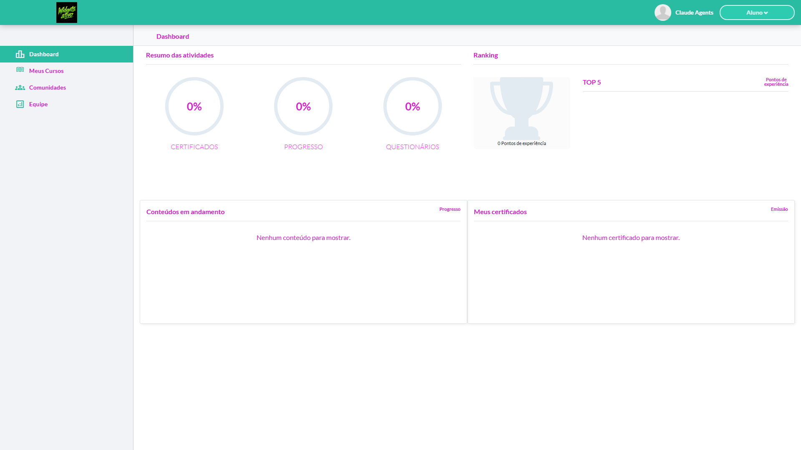
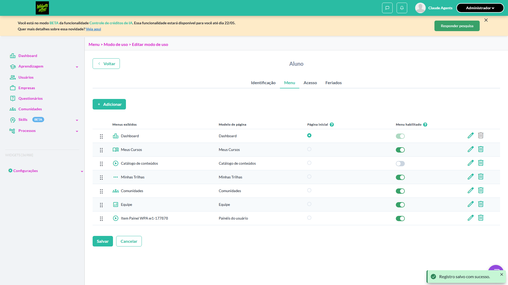
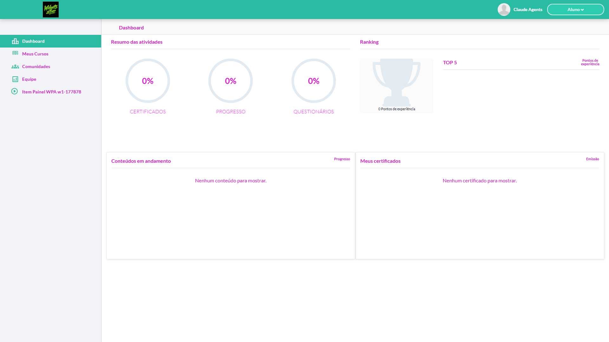
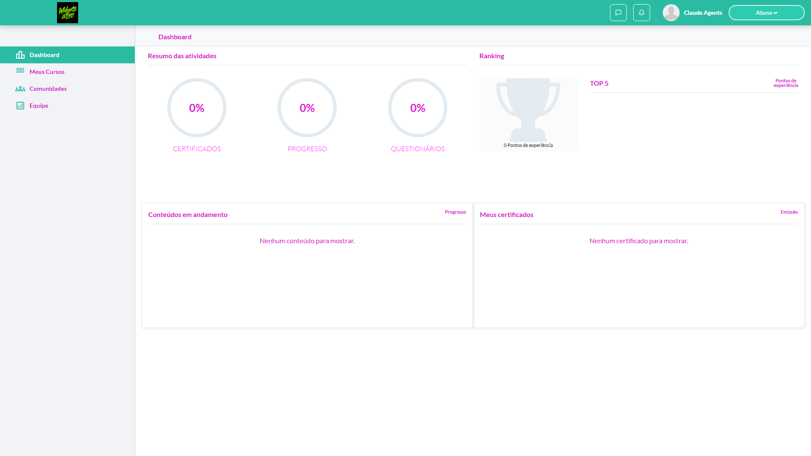
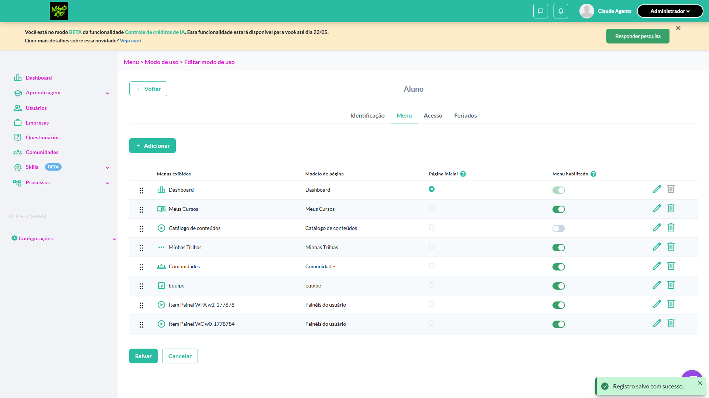
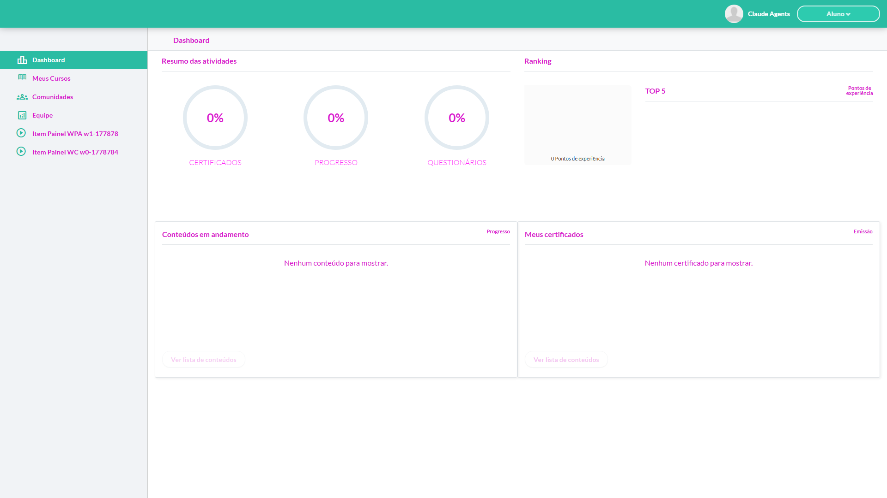
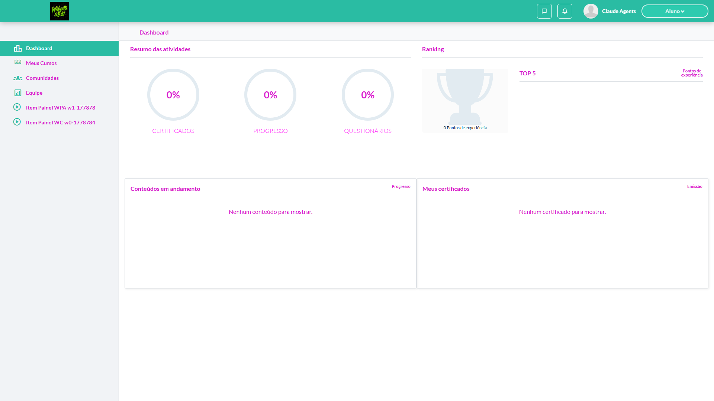
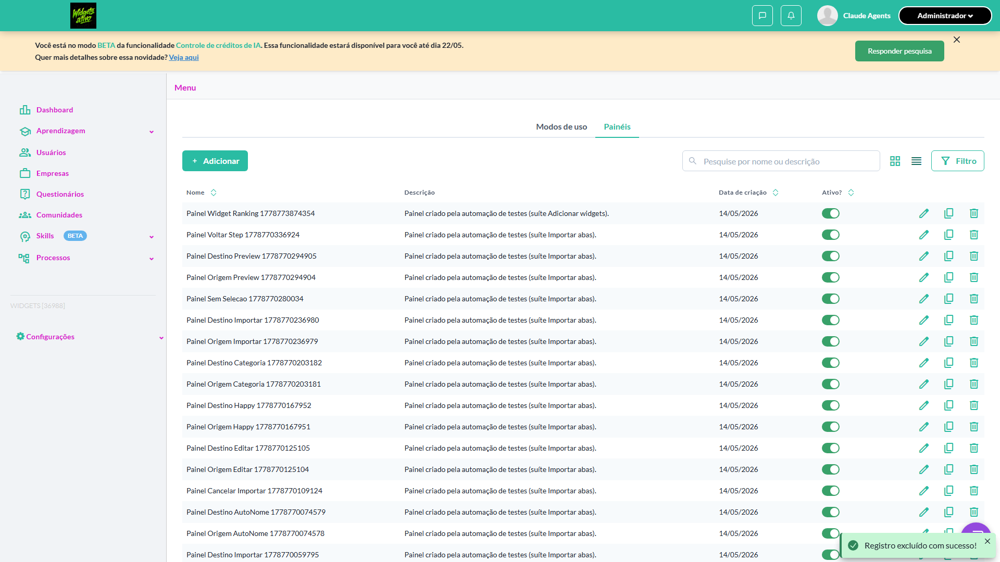

# Casos de teste — Widgets

[← Voltar ao dashboard](index.md)

Lista detalhada por testsuite. Cada caso traz: o que era esperado pelo XML, quais steps foram executados, evidências (screenshots/trace), texto pronto pra registro de bug e — quando houver falha — uma explicação em PT-BR do motivo.

## Dashboard - Visão do aluno

_8 caso(s) — 6 aprovado(s), 2 falha(s)_

### ✅ Aprovado · TC7 · Aluno acessa painel sem widgets configurados · ⚪ Menor

<a id="aluno-acessa-painel-sem-widgets-configurados"></a>_Arquivo:_ `aluno-painel-sem-widgets.spec.ts` · _Duração:_ 10.33s · _Browser:_ chromium

**Sumário (objetivo do caso):** Validar comportamento de painel vazio.

**Pré-condições:**

```
Ambiente Stage configurado Funcionalidade 'Gestão de Painéis' habilitada no contrato Feature flag 'habilitar_paineis_do_usuario' ativa Usuário logado como Aluno Menu configurado com painel cuja aba ativa não possui widgets
```

**Passos do caso (XML/TestLink + execução Playwright):**

_Cada linha reproduz um passo do XML; a coluna **Status** traz o resultado da execução (do step Allure correspondente). Linhas com "Pré-condição" são da execução automatizada (login, navegação inicial) — não fazem parte do roteiro do XML._

| # | Ação do passo | Resultado esperado | Status | Notas | Duração |
|---|---|---|:---:|---|---:|
| 1 | Acessar o menu do painel | Painel é exibido | ✅ | — | 3.49s |
| 2 | Verificar o conteúdo da aba | Aba é exibida vazia (sem o estado vazio de admin) ou conforme regra do produto para visão readonly | ✅ | — | 0.54s |

**Evidências:**

📁 _Pasta:_ [`artifacts/projects-widgets-tests-fea-2c3e3-el-sem-widgets-configurados-chromium/`](artifacts/projects-widgets-tests-fea-2c3e3-el-sem-widgets-configurados-chromium/)

- 📸 **Screenshot (step-01-1-Acessar-painel-do-aluno-switch-para-perfil-Aluno-via-popov)** — [`step-01-1-Acessar-painel-do-aluno-switch-para-perfil-Aluno-via-popov-e6ea1a0cdcba01d74f10f7a914a6981e14062f68.png`](artifacts/projects-widgets-tests-fea-2c3e3-el-sem-widgets-configurados-chromium/step-01-1-Acessar-painel-do-aluno-switch-para-perfil-Aluno-via-popov-e6ea1a0cdcba01d74f10f7a914a6981e14062f68.png)

  

- 📸 **Screenshot (step-02-2-Verificar-que-empty-state-de-admin-N-O-aparece-na-vis-o-Al)** — [`step-02-2-Verificar-que-empty-state-de-admin-N-O-aparece-na-vis-o-Al-bff4682945c9810ca6616d72bb6329361bbd46fe.png`](artifacts/projects-widgets-tests-fea-2c3e3-el-sem-widgets-configurados-chromium/step-02-2-Verificar-que-empty-state-de-admin-N-O-aparece-na-vis-o-Al-bff4682945c9810ca6616d72bb6329361bbd46fe.png)

  

- 📸 **Screenshot (screenshot)** — [`test-finished-1.png`](artifacts/projects-widgets-tests-fea-2c3e3-el-sem-widgets-configurados-chromium/test-finished-1.png)

  

- 🎬 [Vídeo da execução (video.webm)](artifacts/projects-widgets-tests-fea-2c3e3-el-sem-widgets-configurados-chromium/video.webm)

- 🎬 [Vídeo da execução (video-1.webm)](artifacts/projects-widgets-tests-fea-2c3e3-el-sem-widgets-configurados-chromium/video-1.webm)

- 📦 **Trace** — [`trace.zip`](artifacts/projects-widgets-tests-fea-2c3e3-el-sem-widgets-configurados-chromium/trace.zip)

  ```bash
  npx playwright show-trace outputs/widgets/reports/dashboard-visao-do-aluno_20260514-154951/artifacts/projects-widgets-tests-fea-2c3e3-el-sem-widgets-configurados-chromium/trace.zip
  ```

- 🎥 **Vídeo** — [`video.webm`](artifacts/projects-widgets-tests-fea-2c3e3-el-sem-widgets-configurados-chromium/video.webm)

- 🎥 **Vídeo** — [`video-1.webm`](artifacts/projects-widgets-tests-fea-2c3e3-el-sem-widgets-configurados-chromium/video-1.webm)


---

### ❌ Falhou · TC8 · Exibição de um widget por aba · 🟡 Normal

<a id="exibicao-de-um-widget-por-aba"></a>_Arquivo:_ `exibir-widget-por-aba.spec.ts` · _Duração:_ 37.30s · _Browser:_ chromium

> **❌ Por que falhou:** Não foi possível clicar o elemento — ele não ficou disponível em 30s (locator: getByRole('link', { name: 'Item Painel WPA w1-1778784497809' })).
> _Step impactado:_ **2. Clicar no item de menu "Item Painel WPA w1-1778784497809"**

**Sumário (objetivo do caso):** Validar navegação entre abas (R11 RN89.1).

**Pré-condições:**

```
Ambiente Stage configurado Funcionalidade 'Gestão de Painéis' habilitada no contrato Feature flag 'habilitar_paineis_do_usuario' ativa Usuário logado como Aluno Menu configurado com painel que possui 5 abas, sendo 1 para cada widget e uma última que adiciona os 4 widgets na mesma aba
```

**Passos do caso (XML/TestLink + execução Playwright):**

_Cada linha reproduz um passo do XML; a coluna **Status** traz o resultado da execução (do step Allure correspondente). Linhas com "Pré-condição" são da execução automatizada (login, navegação inicial) — não fazem parte do roteiro do XML._

| # | Ação do passo | Resultado esperado | Status | Notas | Duração |
|---|---|---|:---:|---|---:|
| 1 | Acessar o menu do painel | As 5 "abas" são exibidas | ✅ | — | 2.91s |
| 2 | Navegar em cada uma das abas | Cada um dos widgets deve ser carregado carregado conforme configurado | ❌ | Não foi possível clicar o elemento — ele não ficou disponível em 30s (locator: getByRole('link', { name: 'Item Painel WPA w1-1778784497809' })). | 30.09s |

**Evidências:**

📁 _Pasta:_ [`artifacts/projects-widgets-tests-fea-f04e2-ibição-de-um-widget-por-aba-chromium/`](artifacts/projects-widgets-tests-fea-f04e2-ibição-de-um-widget-por-aba-chromium/)

- 📸 **Screenshot (screenshot)** — [`test-finished-1.png`](artifacts/projects-widgets-tests-fea-f04e2-ibição-de-um-widget-por-aba-chromium/test-finished-1.png)

  

- 📸 **Screenshot (step-01-1-Switch-para-perfil-Aluno-via-popover)** — [`step-01-1-Switch-para-perfil-Aluno-via-popover-c29e484928b10238ea7a42c4cb7e8ed25233eb3d.png`](artifacts/projects-widgets-tests-fea-f04e2-ibição-de-um-widget-por-aba-chromium/step-01-1-Switch-para-perfil-Aluno-via-popover-c29e484928b10238ea7a42c4cb7e8ed25233eb3d.png)

  

- 📸 **Screenshot (screenshot)** — [`test-failed-2.png`](artifacts/projects-widgets-tests-fea-f04e2-ibição-de-um-widget-por-aba-chromium/test-failed-2.png)

  

- 📸 **Screenshot (screenshot)** — [`test-failed-3.png`](artifacts/projects-widgets-tests-fea-f04e2-ibição-de-um-widget-por-aba-chromium/test-failed-3.png)

  

- 🎬 [Vídeo da execução (video.webm)](artifacts/projects-widgets-tests-fea-f04e2-ibição-de-um-widget-por-aba-chromium/video.webm)

- 🎬 [Vídeo da execução (video-1.webm)](artifacts/projects-widgets-tests-fea-f04e2-ibição-de-um-widget-por-aba-chromium/video-1.webm)

- 📦 **Trace** — [`trace.zip`](artifacts/projects-widgets-tests-fea-f04e2-ibição-de-um-widget-por-aba-chromium/trace.zip)

  ```bash
  npx playwright show-trace outputs/widgets/reports/dashboard-visao-do-aluno_20260514-154951/artifacts/projects-widgets-tests-fea-f04e2-ibição-de-um-widget-por-aba-chromium/trace.zip
  ```

- 🎥 **Vídeo** — [`video.webm`](artifacts/projects-widgets-tests-fea-f04e2-ibição-de-um-widget-por-aba-chromium/video.webm)

- 🎥 **Vídeo** — [`video-1.webm`](artifacts/projects-widgets-tests-fea-f04e2-ibição-de-um-widget-por-aba-chromium/video-1.webm)

- 📄 **DOM no momento da falha** — [`error-context.md`](artifacts/projects-widgets-tests-fea-f04e2-ibição-de-um-widget-por-aba-chromium/error-context.md)

#### 🐛 Pronto para registro de bug

**Descrição do BUG:** [Normal] Exibição de um widget por aba — Não foi possível clicar o elemento — ele não ficou disponível em 30s (locator: getByRole('link', { name: 'Item Painel WPA w1-1778784497809' })).

**Passo a passo para reprodução:**
1. Pré: Ambiente Stage configurado Funcionalidade 'Gestão de Painéis' habilitada no contrato Feature flag 'habilitar_paineis_do_usuario' ativa Usuário logado como Aluno Menu configurado com painel que possui 5 abas, sendo 1 para cada widget e uma última que adiciona os 4 widgets na mesma aba
1. 1. Acessar o menu do painel
1. 2. Navegar em cada uma das abas

**Comportamento esperado:** Cada um dos widgets deve ser carregado carregado conforme configurado

**Comportamento atual:** Não foi possível clicar o elemento — ele não ficou disponível em 30s (locator: getByRole('link', { name: 'Item Painel WPA w1-1778784497809' })).

**Informações:**

| Campo | Valor |
|---|---|
| URL | `https://widgets.stage.twygoead.com/` |
| Login | ${TWYGO_STAGING_WIDGETS_EMAIL} |
| Senha | ${TWYGO_STAGING_WIDGETS_PASSWORD} |
| orgId | 36988 |
| Outros | Browser: chromium |
| Outros | runId: dashboard-visao-do-aluno_20260514-154951 |
| Outros | Duração até a falha: 37.30s |
| Outros | Step impactado: 2. 2. Clicar no item de menu "Item Painel WPA w1-1778784497809" |

**Evidências:**

- Screenshot capturado pelo Playwright (screenshot): artifacts/projects-widgets-tests-fea-f04e2-ibição-de-um-widget-por-aba-chromium/test-finished-1.png
- Screenshot capturado pelo Playwright (step-01-1-Switch-para-perfil-Aluno-via-popover): artifacts/projects-widgets-tests-fea-f04e2-ibição-de-um-widget-por-aba-chromium/step-01-1-Switch-para-perfil-Aluno-via-popover-c29e484928b10238ea7a42c4cb7e8ed25233eb3d.png
- Screenshot capturado pelo Playwright (screenshot): artifacts/projects-widgets-tests-fea-f04e2-ibição-de-um-widget-por-aba-chromium/test-failed-2.png
- Vídeo da execução (video-1.webm): artifacts/projects-widgets-tests-fea-f04e2-ibição-de-um-widget-por-aba-chromium/video-1.webm
- Vídeo da execução (video.webm): artifacts/projects-widgets-tests-fea-f04e2-ibição-de-um-widget-por-aba-chromium/video.webm
- Snapshot do DOM/contexto da página (error-context.md): artifacts/projects-widgets-tests-fea-f04e2-ibição-de-um-widget-por-aba-chromium/error-context.md
- Screenshot capturado pelo Playwright (screenshot): artifacts/projects-widgets-tests-fea-f04e2-ibição-de-um-widget-por-aba-chromium/test-failed-3.png
- Snapshot do DOM/contexto da página (error-context.md): artifacts/projects-widgets-tests-fea-f04e2-ibição-de-um-widget-por-aba-chromium/error-context.md
- Trace completo do Playwright (.zip) — `npx playwright show-trace`: artifacts/projects-widgets-tests-fea-f04e2-ibição-de-um-widget-por-aba-chromium/trace.zip

<details><summary>📋 Ver texto agregado para copiar (Jira/GitHub/Linear)</summary>

```
Descrição do BUG
[Normal] Exibição de um widget por aba — Não foi possível clicar o elemento — ele não ficou disponível em 30s (locator: getByRole('link', { name: 'Item Painel WPA w1-1778784497809' })).

Passo a passo para reprodução
  Pré: Ambiente Stage configurado Funcionalidade 'Gestão de Painéis' habilitada no contrato Feature flag 'habilitar_paineis_do_usuario' ativa Usuário logado como Aluno Menu configurado com painel que possui 5 abas, sendo 1 para cada widget e uma última que adiciona os 4 widgets na mesma aba
  1. Acessar o menu do painel
  2. Navegar em cada uma das abas

Comportamento esperado
Cada um dos widgets deve ser carregado carregado conforme configurado

Comportamento atual
Não foi possível clicar o elemento — ele não ficou disponível em 30s (locator: getByRole('link', { name: 'Item Painel WPA w1-1778784497809' })).

Informações
- URL: https://widgets.stage.twygoead.com/
- Login: ${TWYGO_STAGING_WIDGETS_EMAIL}
- Senha: ${TWYGO_STAGING_WIDGETS_PASSWORD}
- ID do ambiente (orgId): 36988
- Outros:
  - Browser: chromium
  - runId: dashboard-visao-do-aluno_20260514-154951
  - Duração até a falha: 37.30s
  - Step impactado: 2. 2. Clicar no item de menu "Item Painel WPA w1-1778784497809"

Evidências
- Screenshot capturado pelo Playwright (screenshot): artifacts/projects-widgets-tests-fea-f04e2-ibição-de-um-widget-por-aba-chromium/test-finished-1.png
- Screenshot capturado pelo Playwright (step-01-1-Switch-para-perfil-Aluno-via-popover): artifacts/projects-widgets-tests-fea-f04e2-ibição-de-um-widget-por-aba-chromium/step-01-1-Switch-para-perfil-Aluno-via-popover-c29e484928b10238ea7a42c4cb7e8ed25233eb3d.png
- Screenshot capturado pelo Playwright (screenshot): artifacts/projects-widgets-tests-fea-f04e2-ibição-de-um-widget-por-aba-chromium/test-failed-2.png
- Vídeo da execução (video-1.webm): artifacts/projects-widgets-tests-fea-f04e2-ibição-de-um-widget-por-aba-chromium/video-1.webm
- Vídeo da execução (video.webm): artifacts/projects-widgets-tests-fea-f04e2-ibição-de-um-widget-por-aba-chromium/video.webm
- Snapshot do DOM/contexto da página (error-context.md): artifacts/projects-widgets-tests-fea-f04e2-ibição-de-um-widget-por-aba-chromium/error-context.md
- Screenshot capturado pelo Playwright (screenshot): artifacts/projects-widgets-tests-fea-f04e2-ibição-de-um-widget-por-aba-chromium/test-failed-3.png
- Snapshot do DOM/contexto da página (error-context.md): artifacts/projects-widgets-tests-fea-f04e2-ibição-de-um-widget-por-aba-chromium/error-context.md
- Trace completo do Playwright (.zip) — `npx playwright show-trace`: artifacts/projects-widgets-tests-fea-f04e2-ibição-de-um-widget-por-aba-chromium/trace.zip

Execução
- runId: dashboard-visao-do-aluno_20260514-154951
- environment.json: staging-widgets
- testsuite: Dashboard - Visão do aluno
- testcase: Exibição de um widget por aba

```

</details>

<details><summary>🔧 Stack trace técnica completa (para desenvolvedor)</summary>

```
TimeoutError: locator.click: Timeout 30000ms exceeded.
Call log:
  - waiting for getByRole('link', { name: 'Item Painel WPA w1-1778784497809' })

```

</details>

---

### ✅ Aprovado · TC2 · Renderizar widget 'Conteúdos em andamento' para o aluno · 🔴 Crítico

<a id="renderizar-widget-conteudos-em-andamento-para-o-aluno"></a>_Arquivo:_ `renderizar-widget-conteudos-andamento.spec.ts` · _Duração:_ 9.44s · _Browser:_ chromium

**Sumário (objetivo do caso):** Validar exibição do widget com dados reais.

**Pré-condições:**

```
Ambiente Stage configurado Funcionalidade 'Gestão de Painéis' habilitada no contrato Feature flag 'habilitar_paineis_do_usuario' ativa Usuário logado como Aluno Aluno possui conteúdos em andamento Menu configurado com painel contendo widget 'Conteúdos em andamento'
```

**Passos do caso (XML/TestLink + execução Playwright):**

_Cada linha reproduz um passo do XML; a coluna **Status** traz o resultado da execução (do step Allure correspondente). Linhas com "Pré-condição" são da execução automatizada (login, navegação inicial) — não fazem parte do roteiro do XML._

| # | Ação do passo | Resultado esperado | Status | Notas | Duração |
|---|---|---|:---:|---|---:|
| 1 | Acessar o menu do painel | Painel é exibido | ✅ | — | 3.54s |
| 2 | Verificar o widget 'Conteúdos em andamento' | Widget exibe a lista de conteúdos que o aluno está cursando atualmente | ✅ | — | 0.52s |

**Evidências:**

📁 _Pasta:_ [`artifacts/projects-widgets-tests-fea-4c16b-s-em-andamento-para-o-aluno-chromium/`](artifacts/projects-widgets-tests-fea-4c16b-s-em-andamento-para-o-aluno-chromium/)

- 📸 **Screenshot (step-01-1-Acessar-painel-do-aluno-switch-para-perfil-Aluno-via-popov)** — [`step-01-1-Acessar-painel-do-aluno-switch-para-perfil-Aluno-via-popov-eff442bd67d2467c3ed2b2c581ce8b48da52302c.png`](artifacts/projects-widgets-tests-fea-4c16b-s-em-andamento-para-o-aluno-chromium/step-01-1-Acessar-painel-do-aluno-switch-para-perfil-Aluno-via-popov-eff442bd67d2467c3ed2b2c581ce8b48da52302c.png)

  

- 📸 **Screenshot (step-02-2-Verificar-widget-Conte-dos-em-andamento-vis-vel)** — [`step-02-2-Verificar-widget-Conte-dos-em-andamento-vis-vel-d5257f7867702f725ecf04de942101686110ea77.png`](artifacts/projects-widgets-tests-fea-4c16b-s-em-andamento-para-o-aluno-chromium/step-02-2-Verificar-widget-Conte-dos-em-andamento-vis-vel-d5257f7867702f725ecf04de942101686110ea77.png)

  

- 📸 **Screenshot (screenshot)** — [`test-finished-1.png`](artifacts/projects-widgets-tests-fea-4c16b-s-em-andamento-para-o-aluno-chromium/test-finished-1.png)

  

- 🎬 [Vídeo da execução (video.webm)](artifacts/projects-widgets-tests-fea-4c16b-s-em-andamento-para-o-aluno-chromium/video.webm)

- 🎬 [Vídeo da execução (video-1.webm)](artifacts/projects-widgets-tests-fea-4c16b-s-em-andamento-para-o-aluno-chromium/video-1.webm)

- 📦 **Trace** — [`trace.zip`](artifacts/projects-widgets-tests-fea-4c16b-s-em-andamento-para-o-aluno-chromium/trace.zip)

  ```bash
  npx playwright show-trace outputs/widgets/reports/dashboard-visao-do-aluno_20260514-154951/artifacts/projects-widgets-tests-fea-4c16b-s-em-andamento-para-o-aluno-chromium/trace.zip
  ```

- 🎥 **Vídeo** — [`video.webm`](artifacts/projects-widgets-tests-fea-4c16b-s-em-andamento-para-o-aluno-chromium/video.webm)

- 🎥 **Vídeo** — [`video-1.webm`](artifacts/projects-widgets-tests-fea-4c16b-s-em-andamento-para-o-aluno-chromium/video-1.webm)


---

### ✅ Aprovado · TC4 · Renderizar widget 'Meus certificados' para o aluno · 🔴 Crítico

<a id="renderizar-widget-meus-certificados-para-o-aluno"></a>_Arquivo:_ `renderizar-widget-meus-certificados.spec.ts` · _Duração:_ 9.28s · _Browser:_ chromium

**Sumário (objetivo do caso):** Validar exibição do widget de certificados.

**Pré-condições:**

```
Ambiente Stage configurado Funcionalidade 'Gestão de Painéis' habilitada no contrato Feature flag 'habilitar_paineis_do_usuario' ativa Usuário logado como Aluno Aluno possui certificados conquistados Menu configurado com painel contendo widget 'Meus certificados'
```

**Passos do caso (XML/TestLink + execução Playwright):**

_Cada linha reproduz um passo do XML; a coluna **Status** traz o resultado da execução (do step Allure correspondente). Linhas com "Pré-condição" são da execução automatizada (login, navegação inicial) — não fazem parte do roteiro do XML._

| # | Ação do passo | Resultado esperado | Status | Notas | Duração |
|---|---|---|:---:|---|---:|
| 1 | Acessar o menu do painel | Painel é exibido | ✅ | — | 3.85s |
| 2 | Verificar o widget 'Meus certificados' | Widget exibe a lista de certificados conquistados pelo aluno | ✅ | — | 0.41s |

**Evidências:**

📁 _Pasta:_ [`artifacts/projects-widgets-tests-fea-ceba1-s-certificados-para-o-aluno-chromium/`](artifacts/projects-widgets-tests-fea-ceba1-s-certificados-para-o-aluno-chromium/)

- 📸 **Screenshot (step-01-1-Acessar-painel-do-aluno-switch-para-perfil-Aluno-via-popov)** — [`step-01-1-Acessar-painel-do-aluno-switch-para-perfil-Aluno-via-popov-f771ea158dbaf3d476e7b6c9e480b1ae2b5d508b.png`](artifacts/projects-widgets-tests-fea-ceba1-s-certificados-para-o-aluno-chromium/step-01-1-Acessar-painel-do-aluno-switch-para-perfil-Aluno-via-popov-f771ea158dbaf3d476e7b6c9e480b1ae2b5d508b.png)

  

- 📸 **Screenshot (step-02-2-Verificar-widget-Meus-certificados-vis-vel)** — [`step-02-2-Verificar-widget-Meus-certificados-vis-vel-62dcb5f84eec09829c442a21c89cc7eadce64e3f.png`](artifacts/projects-widgets-tests-fea-ceba1-s-certificados-para-o-aluno-chromium/step-02-2-Verificar-widget-Meus-certificados-vis-vel-62dcb5f84eec09829c442a21c89cc7eadce64e3f.png)

  

- 📸 **Screenshot (screenshot)** — [`test-finished-1.png`](artifacts/projects-widgets-tests-fea-ceba1-s-certificados-para-o-aluno-chromium/test-finished-1.png)

  

- 🎬 [Vídeo da execução (video.webm)](artifacts/projects-widgets-tests-fea-ceba1-s-certificados-para-o-aluno-chromium/video.webm)

- 🎬 [Vídeo da execução (video-1.webm)](artifacts/projects-widgets-tests-fea-ceba1-s-certificados-para-o-aluno-chromium/video-1.webm)

- 📦 **Trace** — [`trace.zip`](artifacts/projects-widgets-tests-fea-ceba1-s-certificados-para-o-aluno-chromium/trace.zip)

  ```bash
  npx playwright show-trace outputs/widgets/reports/dashboard-visao-do-aluno_20260514-154951/artifacts/projects-widgets-tests-fea-ceba1-s-certificados-para-o-aluno-chromium/trace.zip
  ```

- 🎥 **Vídeo** — [`video.webm`](artifacts/projects-widgets-tests-fea-ceba1-s-certificados-para-o-aluno-chromium/video.webm)

- 🎥 **Vídeo** — [`video-1.webm`](artifacts/projects-widgets-tests-fea-ceba1-s-certificados-para-o-aluno-chromium/video-1.webm)


---

### ✅ Aprovado · TC3 · Renderizar widget 'Ranking' para o aluno · 🔴 Crítico

<a id="renderizar-widget-ranking-para-o-aluno"></a>_Arquivo:_ `renderizar-widget-ranking.spec.ts` · _Duração:_ 8.68s · _Browser:_ chromium

**Sumário (objetivo do caso):** Validar exibição do widget Ranking.

**Pré-condições:**

```
Ambiente Stage configurado Funcionalidade 'Gestão de Painéis' habilitada no contrato Feature flag 'habilitar_paineis_do_usuario' ativa Usuário logado como Aluno Aluno possui posição no ranking Menu configurado com painel contendo widget 'Ranking'
```

**Passos do caso (XML/TestLink + execução Playwright):**

_Cada linha reproduz um passo do XML; a coluna **Status** traz o resultado da execução (do step Allure correspondente). Linhas com "Pré-condição" são da execução automatizada (login, navegação inicial) — não fazem parte do roteiro do XML._

| # | Ação do passo | Resultado esperado | Status | Notas | Duração |
|---|---|---|:---:|---|---:|
| 1 | Acessar o menu do painel | Painel é exibido | ✅ | — | 2.94s |
| 2 | Verificar o widget 'Ranking' | Widget exibe posição do aluno e o top 5 do ambiente | ✅ | — | 0.57s |

**Evidências:**

📁 _Pasta:_ [`artifacts/projects-widgets-tests-fea-6506e-widget-Ranking-para-o-aluno-chromium/`](artifacts/projects-widgets-tests-fea-6506e-widget-Ranking-para-o-aluno-chromium/)

- 📸 **Screenshot (step-01-1-Acessar-painel-do-aluno-switch-para-perfil-Aluno-via-popov)** — [`step-01-1-Acessar-painel-do-aluno-switch-para-perfil-Aluno-via-popov-aee11aa776b79c493f0845f44cc32d7d03fcd082.png`](artifacts/projects-widgets-tests-fea-6506e-widget-Ranking-para-o-aluno-chromium/step-01-1-Acessar-painel-do-aluno-switch-para-perfil-Aluno-via-popov-aee11aa776b79c493f0845f44cc32d7d03fcd082.png)

  

- 📸 **Screenshot (step-02-2-Verificar-widget-Ranking-com-posi-o-do-aluno-e-top-5)** — [`step-02-2-Verificar-widget-Ranking-com-posi-o-do-aluno-e-top-5-2721a4238bf5d145924e20b606bb0bf2640b96f6.png`](artifacts/projects-widgets-tests-fea-6506e-widget-Ranking-para-o-aluno-chromium/step-02-2-Verificar-widget-Ranking-com-posi-o-do-aluno-e-top-5-2721a4238bf5d145924e20b606bb0bf2640b96f6.png)

  

- 📸 **Screenshot (screenshot)** — [`test-finished-1.png`](artifacts/projects-widgets-tests-fea-6506e-widget-Ranking-para-o-aluno-chromium/test-finished-1.png)

  

- 🎬 [Vídeo da execução (video.webm)](artifacts/projects-widgets-tests-fea-6506e-widget-Ranking-para-o-aluno-chromium/video.webm)

- 🎬 [Vídeo da execução (video-1.webm)](artifacts/projects-widgets-tests-fea-6506e-widget-Ranking-para-o-aluno-chromium/video-1.webm)

- 📦 **Trace** — [`trace.zip`](artifacts/projects-widgets-tests-fea-6506e-widget-Ranking-para-o-aluno-chromium/trace.zip)

  ```bash
  npx playwright show-trace outputs/widgets/reports/dashboard-visao-do-aluno_20260514-154951/artifacts/projects-widgets-tests-fea-6506e-widget-Ranking-para-o-aluno-chromium/trace.zip
  ```

- 🎥 **Vídeo** — [`video.webm`](artifacts/projects-widgets-tests-fea-6506e-widget-Ranking-para-o-aluno-chromium/video.webm)

- 🎥 **Vídeo** — [`video-1.webm`](artifacts/projects-widgets-tests-fea-6506e-widget-Ranking-para-o-aluno-chromium/video-1.webm)


---

### ✅ Aprovado · TC1 · Renderizar widget 'Resumo das atividades' para o aluno · 🔴 Crítico

<a id="renderizar-widget-resumo-das-atividades-para-o-aluno"></a>_Arquivo:_ `renderizar-widget-resumo-atividades.spec.ts` · _Duração:_ 9.35s · _Browser:_ chromium

**Sumário (objetivo do caso):** Validar exibição do widget com dados reais.

**Pré-condições:**

```
Ambiente Stage configurado Funcionalidade 'Gestão de Painéis' habilitada no contrato Feature flag 'habilitar_paineis_do_usuario' ativa Usuário logado como Aluno Aluno possui histórico de atividades de aprendizagem Menu configurado com painel contendo widget 'Resumo das atividades'
```

**Passos do caso (XML/TestLink + execução Playwright):**

_Cada linha reproduz um passo do XML; a coluna **Status** traz o resultado da execução (do step Allure correspondente). Linhas com "Pré-condição" são da execução automatizada (login, navegação inicial) — não fazem parte do roteiro do XML._

| # | Ação do passo | Resultado esperado | Status | Notas | Duração |
|---|---|---|:---:|---|---:|
| 1 | Acessar o menu do painel | Painel é exibido | ✅ | — | 3.12s |
| 2 | Verificar o widget 'Resumo das atividades' | Widget exibe os dados de aprendizagem do usuário (mesmos dados disponíveis no dashboard legado) | ✅ | — | 0.53s |

**Evidências:**

📁 _Pasta:_ [`artifacts/projects-widgets-tests-fea-8fbe4-das-atividades-para-o-aluno-chromium/`](artifacts/projects-widgets-tests-fea-8fbe4-das-atividades-para-o-aluno-chromium/)

- 📸 **Screenshot (step-01-1-Acessar-painel-do-aluno-switch-para-perfil-Aluno-via-popov)** — [`step-01-1-Acessar-painel-do-aluno-switch-para-perfil-Aluno-via-popov-4da56c0b69ad27e5c5b10a5c44ed5051d9a7ba6a.png`](artifacts/projects-widgets-tests-fea-8fbe4-das-atividades-para-o-aluno-chromium/step-01-1-Acessar-painel-do-aluno-switch-para-perfil-Aluno-via-popov-4da56c0b69ad27e5c5b10a5c44ed5051d9a7ba6a.png)

  

- 📸 **Screenshot (step-02-2-Verificar-widget-Resumo-das-atividades-vis-vel)** — [`step-02-2-Verificar-widget-Resumo-das-atividades-vis-vel-0e615682fa9ba1766eb8e22d6b4598828e063bd2.png`](artifacts/projects-widgets-tests-fea-8fbe4-das-atividades-para-o-aluno-chromium/step-02-2-Verificar-widget-Resumo-das-atividades-vis-vel-0e615682fa9ba1766eb8e22d6b4598828e063bd2.png)

  

- 📸 **Screenshot (screenshot)** — [`test-finished-1.png`](artifacts/projects-widgets-tests-fea-8fbe4-das-atividades-para-o-aluno-chromium/test-finished-1.png)

  

- 🎬 [Vídeo da execução (video.webm)](artifacts/projects-widgets-tests-fea-8fbe4-das-atividades-para-o-aluno-chromium/video.webm)

- 🎬 [Vídeo da execução (video-1.webm)](artifacts/projects-widgets-tests-fea-8fbe4-das-atividades-para-o-aluno-chromium/video-1.webm)

- 📦 **Trace** — [`trace.zip`](artifacts/projects-widgets-tests-fea-8fbe4-das-atividades-para-o-aluno-chromium/trace.zip)

  ```bash
  npx playwright show-trace outputs/widgets/reports/dashboard-visao-do-aluno_20260514-154951/artifacts/projects-widgets-tests-fea-8fbe4-das-atividades-para-o-aluno-chromium/trace.zip
  ```

- 🎥 **Vídeo** — [`video.webm`](artifacts/projects-widgets-tests-fea-8fbe4-das-atividades-para-o-aluno-chromium/video.webm)

- 🎥 **Vídeo** — [`video-1.webm`](artifacts/projects-widgets-tests-fea-8fbe4-das-atividades-para-o-aluno-chromium/video-1.webm)


---

### ❌ Falhou · TC5 · Renderização de widget configurado com título e ícone customizados · 🟡 Normal

<a id="renderizacao-de-widget-configurado-com-titulo-e-icone-customizados"></a>_Arquivo:_ `widget-customizacoes-aplicadas.spec.ts` · _Duração:_ 37.33s · _Browser:_ chromium

> **❌ Por que falhou:** Não foi possível clicar o elemento — ele não ficou disponível em 30s (locator: getByRole('link', { name: 'Item Painel WC w0-1778784508756' })).
> _Step impactado:_ **2. Clicar no item de menu "Item Painel WC w0-1778784508756"**

**Sumário (objetivo do caso):** Validar persistência das customizações para a visão do aluno.

**Pré-condições:**

```
Ambiente Stage configurado Funcionalidade 'Gestão de Painéis' habilitada no contrato Feature flag 'habilitar_paineis_do_usuario' ativa Usuário logado como Aluno Widget 'Resumo das atividades' configurado com Mostrar título=ON, Título='Meu Resumo' e Ícone customizado
```

**Passos do caso (XML/TestLink + execução Playwright):**

_Cada linha reproduz um passo do XML; a coluna **Status** traz o resultado da execução (do step Allure correspondente). Linhas com "Pré-condição" são da execução automatizada (login, navegação inicial) — não fazem parte do roteiro do XML._

| # | Ação do passo | Resultado esperado | Status | Notas | Duração |
|---|---|---|:---:|---|---:|
| 1 | Acessar o menu do painel como aluno | Painel é exibido | ✅ | — | 2.80s |
| 2 | Verificar o widget 'Resumo das atividades' | Widget exibe o título 'Meu Resumo' e o ícone customizado configurados pelo Admin | ❌ | Não foi possível clicar o elemento — ele não ficou disponível em 30s (locator: getByRole('link', { name: 'Item Painel WC w0-1778784508756' })). | 30.10s |

**Evidências:**

📁 _Pasta:_ [`artifacts/projects-widgets-tests-fea-acd6f-título-e-ícone-customizados-chromium/`](artifacts/projects-widgets-tests-fea-acd6f-título-e-ícone-customizados-chromium/)

- 📸 **Screenshot (screenshot)** — [`test-finished-1.png`](artifacts/projects-widgets-tests-fea-acd6f-título-e-ícone-customizados-chromium/test-finished-1.png)

  

- 📸 **Screenshot (step-01-1-Switch-para-perfil-Aluno-via-popover)** — [`step-01-1-Switch-para-perfil-Aluno-via-popover-33918a65697780b2f5c89988f0cde7db36b6e14d.png`](artifacts/projects-widgets-tests-fea-acd6f-título-e-ícone-customizados-chromium/step-01-1-Switch-para-perfil-Aluno-via-popover-33918a65697780b2f5c89988f0cde7db36b6e14d.png)

  

- 📸 **Screenshot (screenshot)** — [`test-failed-2.png`](artifacts/projects-widgets-tests-fea-acd6f-título-e-ícone-customizados-chromium/test-failed-2.png)

  

- 📸 **Screenshot (screenshot)** — [`test-failed-3.png`](artifacts/projects-widgets-tests-fea-acd6f-título-e-ícone-customizados-chromium/test-failed-3.png)

  

- 🎬 [Vídeo da execução (video.webm)](artifacts/projects-widgets-tests-fea-acd6f-título-e-ícone-customizados-chromium/video.webm)

- 🎬 [Vídeo da execução (video-1.webm)](artifacts/projects-widgets-tests-fea-acd6f-título-e-ícone-customizados-chromium/video-1.webm)

- 📦 **Trace** — [`trace.zip`](artifacts/projects-widgets-tests-fea-acd6f-título-e-ícone-customizados-chromium/trace.zip)

  ```bash
  npx playwright show-trace outputs/widgets/reports/dashboard-visao-do-aluno_20260514-154951/artifacts/projects-widgets-tests-fea-acd6f-título-e-ícone-customizados-chromium/trace.zip
  ```

- 🎥 **Vídeo** — [`video.webm`](artifacts/projects-widgets-tests-fea-acd6f-título-e-ícone-customizados-chromium/video.webm)

- 🎥 **Vídeo** — [`video-1.webm`](artifacts/projects-widgets-tests-fea-acd6f-título-e-ícone-customizados-chromium/video-1.webm)

- 📄 **DOM no momento da falha** — [`error-context.md`](artifacts/projects-widgets-tests-fea-acd6f-título-e-ícone-customizados-chromium/error-context.md)

#### 🐛 Pronto para registro de bug

**Descrição do BUG:** [Normal] Renderização de widget configurado com título e ícone customizados — Não foi possível clicar o elemento — ele não ficou disponível em 30s (locator: getByRole('link', { name: 'Item Painel WC w0-1778784508756' })).

**Passo a passo para reprodução:**
1. Pré: Ambiente Stage configurado Funcionalidade 'Gestão de Painéis' habilitada no contrato Feature flag 'habilitar_paineis_do_usuario' ativa Usuário logado como Aluno Widget 'Resumo das atividades' configurado com Mostrar título=ON, Título='Meu Resumo' e Ícone customizado
1. 1. Acessar o menu do painel como aluno
1. 2. Verificar o widget 'Resumo das atividades'

**Comportamento esperado:** Widget exibe o título 'Meu Resumo' e o ícone customizado configurados pelo Admin

**Comportamento atual:** Não foi possível clicar o elemento — ele não ficou disponível em 30s (locator: getByRole('link', { name: 'Item Painel WC w0-1778784508756' })).

**Informações:**

| Campo | Valor |
|---|---|
| URL | `https://widgets.stage.twygoead.com/` |
| Login | ${TWYGO_STAGING_WIDGETS_EMAIL} |
| Senha | ${TWYGO_STAGING_WIDGETS_PASSWORD} |
| orgId | 36988 |
| Outros | Browser: chromium |
| Outros | runId: dashboard-visao-do-aluno_20260514-154951 |
| Outros | Duração até a falha: 37.33s |
| Outros | Step impactado: 2. 2. Clicar no item de menu "Item Painel WC w0-1778784508756" |

**Evidências:**

- Screenshot capturado pelo Playwright (screenshot): artifacts/projects-widgets-tests-fea-acd6f-título-e-ícone-customizados-chromium/test-finished-1.png
- Screenshot capturado pelo Playwright (step-01-1-Switch-para-perfil-Aluno-via-popover): artifacts/projects-widgets-tests-fea-acd6f-título-e-ícone-customizados-chromium/step-01-1-Switch-para-perfil-Aluno-via-popover-33918a65697780b2f5c89988f0cde7db36b6e14d.png
- Screenshot capturado pelo Playwright (screenshot): artifacts/projects-widgets-tests-fea-acd6f-título-e-ícone-customizados-chromium/test-failed-2.png
- Vídeo da execução (video-1.webm): artifacts/projects-widgets-tests-fea-acd6f-título-e-ícone-customizados-chromium/video-1.webm
- Vídeo da execução (video.webm): artifacts/projects-widgets-tests-fea-acd6f-título-e-ícone-customizados-chromium/video.webm
- Snapshot do DOM/contexto da página (error-context.md): artifacts/projects-widgets-tests-fea-acd6f-título-e-ícone-customizados-chromium/error-context.md
- Screenshot capturado pelo Playwright (screenshot): artifacts/projects-widgets-tests-fea-acd6f-título-e-ícone-customizados-chromium/test-failed-3.png
- Snapshot do DOM/contexto da página (error-context.md): artifacts/projects-widgets-tests-fea-acd6f-título-e-ícone-customizados-chromium/error-context.md
- Trace completo do Playwright (.zip) — `npx playwright show-trace`: artifacts/projects-widgets-tests-fea-acd6f-título-e-ícone-customizados-chromium/trace.zip

<details><summary>📋 Ver texto agregado para copiar (Jira/GitHub/Linear)</summary>

```
Descrição do BUG
[Normal] Renderização de widget configurado com título e ícone customizados — Não foi possível clicar o elemento — ele não ficou disponível em 30s (locator: getByRole('link', { name: 'Item Painel WC w0-1778784508756' })).

Passo a passo para reprodução
  Pré: Ambiente Stage configurado Funcionalidade 'Gestão de Painéis' habilitada no contrato Feature flag 'habilitar_paineis_do_usuario' ativa Usuário logado como Aluno Widget 'Resumo das atividades' configurado com Mostrar título=ON, Título='Meu Resumo' e Ícone customizado
  1. Acessar o menu do painel como aluno
  2. Verificar o widget 'Resumo das atividades'

Comportamento esperado
Widget exibe o título 'Meu Resumo' e o ícone customizado configurados pelo Admin

Comportamento atual
Não foi possível clicar o elemento — ele não ficou disponível em 30s (locator: getByRole('link', { name: 'Item Painel WC w0-1778784508756' })).

Informações
- URL: https://widgets.stage.twygoead.com/
- Login: ${TWYGO_STAGING_WIDGETS_EMAIL}
- Senha: ${TWYGO_STAGING_WIDGETS_PASSWORD}
- ID do ambiente (orgId): 36988
- Outros:
  - Browser: chromium
  - runId: dashboard-visao-do-aluno_20260514-154951
  - Duração até a falha: 37.33s
  - Step impactado: 2. 2. Clicar no item de menu "Item Painel WC w0-1778784508756"

Evidências
- Screenshot capturado pelo Playwright (screenshot): artifacts/projects-widgets-tests-fea-acd6f-título-e-ícone-customizados-chromium/test-finished-1.png
- Screenshot capturado pelo Playwright (step-01-1-Switch-para-perfil-Aluno-via-popover): artifacts/projects-widgets-tests-fea-acd6f-título-e-ícone-customizados-chromium/step-01-1-Switch-para-perfil-Aluno-via-popover-33918a65697780b2f5c89988f0cde7db36b6e14d.png
- Screenshot capturado pelo Playwright (screenshot): artifacts/projects-widgets-tests-fea-acd6f-título-e-ícone-customizados-chromium/test-failed-2.png
- Vídeo da execução (video-1.webm): artifacts/projects-widgets-tests-fea-acd6f-título-e-ícone-customizados-chromium/video-1.webm
- Vídeo da execução (video.webm): artifacts/projects-widgets-tests-fea-acd6f-título-e-ícone-customizados-chromium/video.webm
- Snapshot do DOM/contexto da página (error-context.md): artifacts/projects-widgets-tests-fea-acd6f-título-e-ícone-customizados-chromium/error-context.md
- Screenshot capturado pelo Playwright (screenshot): artifacts/projects-widgets-tests-fea-acd6f-título-e-ícone-customizados-chromium/test-failed-3.png
- Snapshot do DOM/contexto da página (error-context.md): artifacts/projects-widgets-tests-fea-acd6f-título-e-ícone-customizados-chromium/error-context.md
- Trace completo do Playwright (.zip) — `npx playwright show-trace`: artifacts/projects-widgets-tests-fea-acd6f-título-e-ícone-customizados-chromium/trace.zip

Execução
- runId: dashboard-visao-do-aluno_20260514-154951
- environment.json: staging-widgets
- testsuite: Dashboard - Visão do aluno
- testcase: Renderização de widget configurado com título e ícone customizados

```

</details>

<details><summary>🔧 Stack trace técnica completa (para desenvolvedor)</summary>

```
TimeoutError: locator.click: Timeout 30000ms exceeded.
Call log:
  - waiting for getByRole('link', { name: 'Item Painel WC w0-1778784508756' })

```

</details>

---

### ✅ Aprovado · TC6 · Renderização de widget configurado sem título e ícone customizados · 🟡 Normal

<a id="renderizacao-de-widget-configurado-sem-titulo-e-icone-customizados"></a>_Arquivo:_ `widget-sem-customizacoes.spec.ts` · _Duração:_ 7.83s · _Browser:_ chromium

**Sumário (objetivo do caso):** Validar persistência das customizações para a visão do aluno.

**Pré-condições:**

```
Ambiente Stage configurado Funcionalidade 'Gestão de Painéis' habilitada no contrato Feature flag 'habilitar_paineis_do_usuario' ativa Usuário logado como Aluno Widget 'Resumo das atividades' configurado com Mostrar título=OFF e Ícone customizado=OFF
```

**Passos do caso (XML/TestLink + execução Playwright):**

_Cada linha reproduz um passo do XML; a coluna **Status** traz o resultado da execução (do step Allure correspondente). Linhas com "Pré-condição" são da execução automatizada (login, navegação inicial) — não fazem parte do roteiro do XML._

| # | Ação do passo | Resultado esperado | Status | Notas | Duração |
|---|---|---|:---:|---|---:|
| 1 | Acessar o menu do painel como aluno | Painel é exibido | ✅ | — | 2.88s |
| 2 | Verificar o widget 'Resumo das atividades' | Widget é exibido sem 'Meu Resumo' e sem ícone | ✅ | — | 0.50s |

**Evidências:**

📁 _Pasta:_ [`artifacts/projects-widgets-tests-fea-1b7b3-título-e-ícone-customizados-chromium/`](artifacts/projects-widgets-tests-fea-1b7b3-título-e-ícone-customizados-chromium/)

- 📸 **Screenshot (step-01-1-Acessar-painel-do-aluno-switch-para-perfil-Aluno-via-popov)** — [`step-01-1-Acessar-painel-do-aluno-switch-para-perfil-Aluno-via-popov-d4c18c6543850f556cf961cd639c1065adae8848.png`](artifacts/projects-widgets-tests-fea-1b7b3-título-e-ícone-customizados-chromium/step-01-1-Acessar-painel-do-aluno-switch-para-perfil-Aluno-via-popov-d4c18c6543850f556cf961cd639c1065adae8848.png)

  

- 📸 **Screenshot (step-02-2-Verificar-widget-exibe-t-tulo-default-e-nenhum-t-tulo-cust)** — [`step-02-2-Verificar-widget-exibe-t-tulo-default-e-nenhum-t-tulo-cust-16b9ad4cf4a3c27c7b2769eb24af93ec9183c7cd.png`](artifacts/projects-widgets-tests-fea-1b7b3-título-e-ícone-customizados-chromium/step-02-2-Verificar-widget-exibe-t-tulo-default-e-nenhum-t-tulo-cust-16b9ad4cf4a3c27c7b2769eb24af93ec9183c7cd.png)

  

- 📸 **Screenshot (screenshot)** — [`test-finished-1.png`](artifacts/projects-widgets-tests-fea-1b7b3-título-e-ícone-customizados-chromium/test-finished-1.png)

  

- 🎬 [Vídeo da execução (video.webm)](artifacts/projects-widgets-tests-fea-1b7b3-título-e-ícone-customizados-chromium/video.webm)

- 🎬 [Vídeo da execução (video-1.webm)](artifacts/projects-widgets-tests-fea-1b7b3-título-e-ícone-customizados-chromium/video-1.webm)

- 📦 **Trace** — [`trace.zip`](artifacts/projects-widgets-tests-fea-1b7b3-título-e-ícone-customizados-chromium/trace.zip)

  ```bash
  npx playwright show-trace outputs/widgets/reports/dashboard-visao-do-aluno_20260514-154951/artifacts/projects-widgets-tests-fea-1b7b3-título-e-ícone-customizados-chromium/trace.zip
  ```

- 🎥 **Vídeo** — [`video.webm`](artifacts/projects-widgets-tests-fea-1b7b3-título-e-ícone-customizados-chromium/video.webm)

- 🎥 **Vídeo** — [`video-1.webm`](artifacts/projects-widgets-tests-fea-1b7b3-título-e-ícone-customizados-chromium/video-1.webm)


---
