# Casos de teste — Widgets

[← Voltar ao dashboard](index.md)

Lista detalhada por testsuite. Cada caso traz: o que era esperado pelo XML, quais steps foram executados, evidências (screenshots/trace), texto pronto pra registro de bug e — quando houver falha — uma explicação em PT-BR do motivo.

## Duplicar painéis

_6 caso(s) — 4 aprovado(s), 2 falha(s)_

### ✅ Aprovado · Duplicar painel ativo — status do painel duplicado 

<a id="duplicar-painel-ativo-status-do-painel-duplicado"></a>_Arquivo:_ `duplicar-painel-ativo-status-copia.spec.ts` · _Duração:_ 9.58s · _Browser:_ chromium

**Passos do caso (XML/TestLink + execução Playwright):**

_Cada linha reproduz um passo do XML; a coluna **Status** traz o resultado da execução (do step Allure correspondente). Linhas com "Pré-condição" são da execução automatizada (login, navegação inicial) — não fazem parte do roteiro do XML._

| # | Ação do passo | Resultado esperado | Status | Notas | Duração |
|---|---|---|:---:|---|---:|
| — | _Pré-condição:_ 1. Acessar a listagem de Painéis e verificar que o painel está ativo | — | ✅ | — | 5.77s |
| — | _Pré-condição:_ 2. Clicar no ícone 'Duplicar' da linha "Painel Ativo TC1.2 w0-1778611165954" e verificar a cópia na listagem | — | ✅ | — | 0.68s |
| — | _Pré-condição:_ 3. Verificar que o switch "Ativo?" da cópia está DESMARCADO e o do original permanece MARCADO | — | ✅ | — | 0.04s |

**Evidências:**

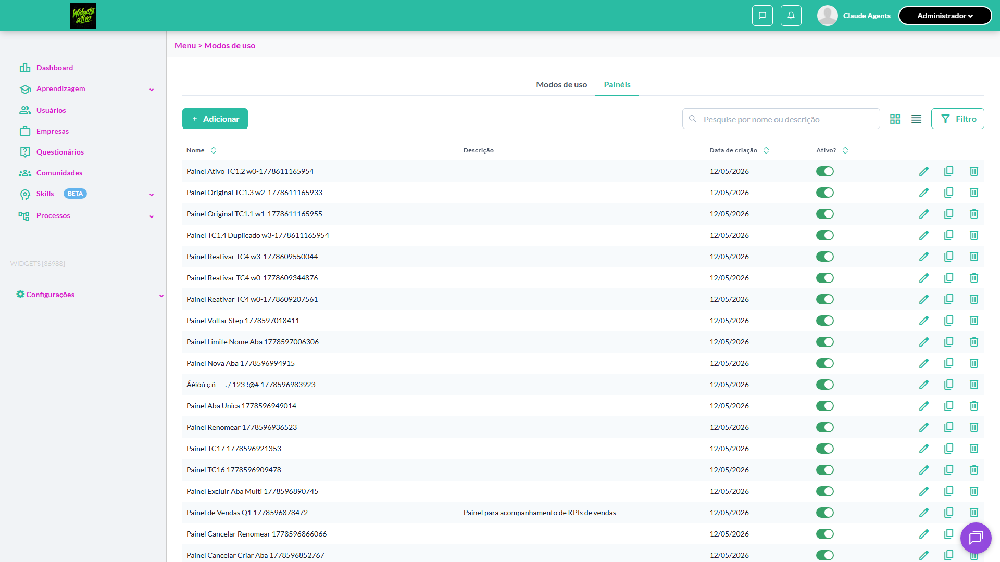

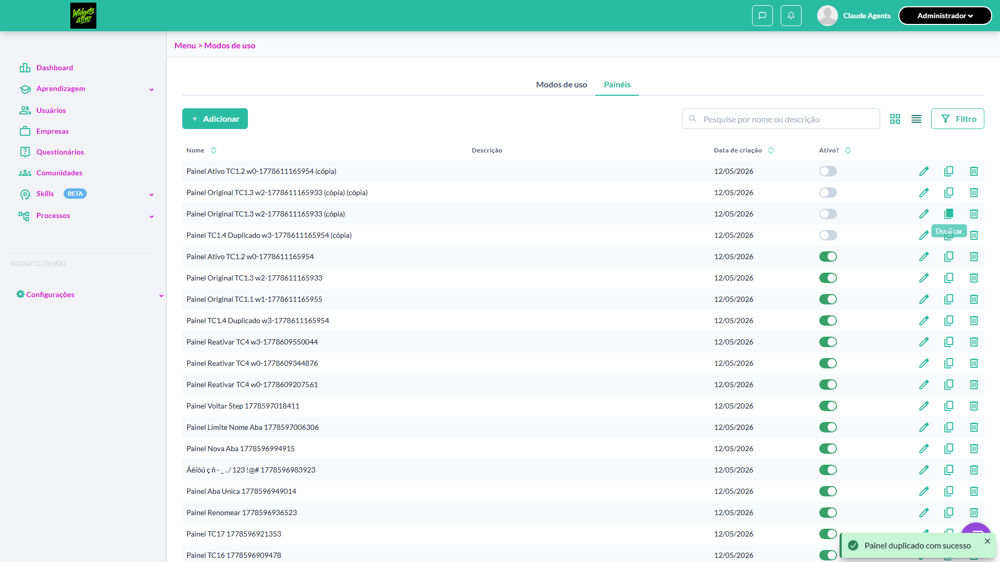

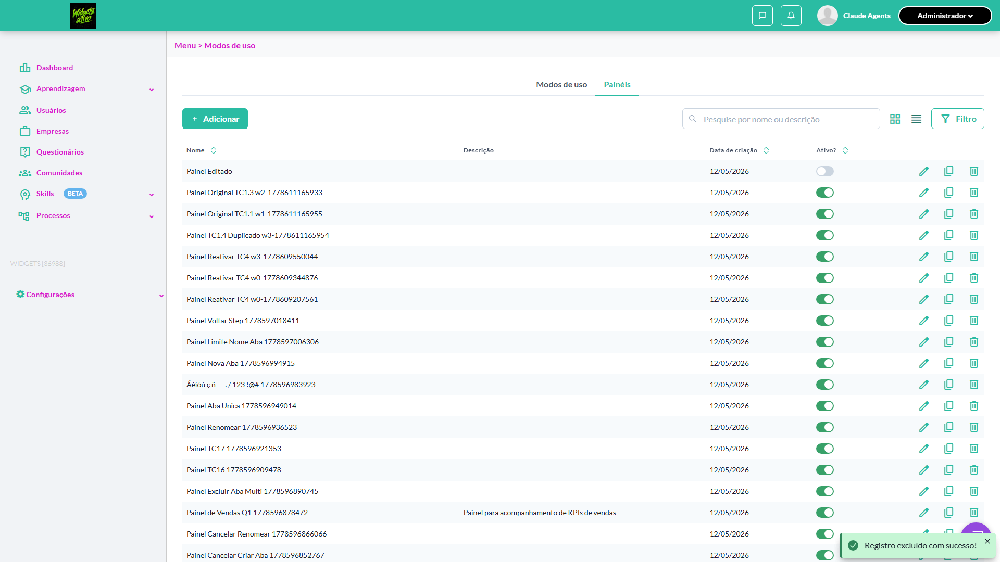

- 🎬 [Vídeo da execução (video.webm)](artifacts/projects-widgets-tests-fea-f98bc--status-do-painel-duplicado-chromium/video.webm)

- 🎬 [Vídeo da execução (video-1.webm)](artifacts/projects-widgets-tests-fea-f98bc--status-do-painel-duplicado-chromium/video-1.webm)

- 📦 [Trace do Playwright (trace.zip)](artifacts/projects-widgets-tests-fea-f98bc--status-do-painel-duplicado-chromium/trace.zip) — abra com `npx playwright show-trace`


---

### ❌ Falhou · Duplicar painel próprio com várias abas e widgets · 🔴 Crítico

<a id="duplicar-painel-proprio-com-varias-abas-e-widgets"></a>_Arquivo:_ `duplicar-painel-varias-abas-widgets.spec.ts` · _Duração:_ 0.00s · _Browser:_ chromium

> **❌ Por que falhou:** Não foi possível clicar o elemento — ele não ficou disponível em 30s (locator: getByTestId('tabs-navigation-add-button')).

**Sumário (objetivo do caso):** Validar duplicação completa (R4 RN19, RN20).

**Pré-condições:**

```
Ambiente Stage configurado Funcionalidade 'Gestão de Painéis' habilitada no contrato Feature flag 'habilitar_paineis_do_usuario' ativa Usuário logado como Admin Existe painel próprio 'Painel Original' com 3 abas e 5 widgets configurados
```

**Passos do caso (XML/TestLink + execução Playwright):**

_Cada linha reproduz um passo do XML; a coluna **Status** traz o resultado da execução (do step Allure correspondente). Linhas com "Pré-condição" são da execução automatizada (login, navegação inicial) — não fazem parte do roteiro do XML._

| # | Ação do passo | Resultado esperado | Status | Notas | Duração |
|---|---|---|:---:|---|---:|
| 1 | Acessar a aba 'Painéis' em Configurações > Menu | Listagem é exibida com 'Painel Original' | ⊘ | Step não executado: o teste foi interrompido antes. Causa: Não foi possível clicar o elemento — ele não ficou disponível em 30s (locator: getByTestId('tabs-navigation-add-button')).. | — |
| 2 | Clicar no ícone 'Duplicar' na linha do 'Painel Original' | Painel é duplicado e listagem é atualizada | ⊘ | Step não executado: o teste foi interrompido antes. Causa: Não foi possível clicar o elemento — ele não ficou disponível em 30s (locator: getByTestId('tabs-navigation-add-button')).. | — |
| 3 | Verificar o novo painel no final da listagem | Novo painel '[Cópia] Painel Original' é exibido na última posição | ⊘ | Step não executado: o teste foi interrompido antes. Causa: Não foi possível clicar o elemento — ele não ficou disponível em 30s (locator: getByTestId('tabs-navigation-add-button')).. | — |
| 4 | Abrir o painel '[Cópia] Painel Original' | Painel duplicado contém as 3 abas e os 5 widgets do painel original com configurações preservadas | ⊘ | Step não executado: o teste foi interrompido antes. Causa: Não foi possível clicar o elemento — ele não ficou disponível em 30s (locator: getByTestId('tabs-navigation-add-button')).. | — |

**Evidências:**

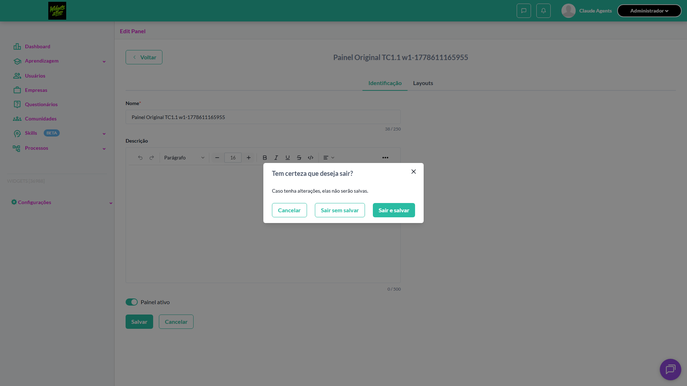


- 📦 [Trace do Playwright (trace.zip)](artifacts/projects-widgets-tests-fea-59657-o-com-várias-abas-e-widgets-chromium/trace.zip) — abra com `npx playwright show-trace`

- 📄 [Snapshot do DOM no momento da falha (`error-context.md`)](artifacts/projects-widgets-tests-fea-59657-o-com-várias-abas-e-widgets-chromium/error-context.md)

#### 🐛 Pronto para registro de bug

**Descrição do BUG:** [Crítico] Duplicar painel próprio com várias abas e widgets — Não foi possível clicar o elemento — ele não ficou disponível em 30s (locator: getByTestId('tabs-navigation-add-button')).

**Passo a passo para reprodução:**
1. Pré: Ambiente Stage configurado Funcionalidade 'Gestão de Painéis' habilitada no contrato Feature flag 'habilitar_paineis_do_usuario' ativa Usuário logado como Admin Existe painel próprio 'Painel Original' com 3 abas e 5 widgets configurados
1. 1. Acessar a aba 'Painéis' em Configurações > Menu
1. 2. Clicar no ícone 'Duplicar' na linha do 'Painel Original'
1. 3. Verificar o novo painel no final da listagem
1. 4. Abrir o painel '[Cópia] Painel Original'

**Comportamento esperado:** 1. Listagem é exibida com 'Painel Original' | 2. Painel é duplicado e listagem é atualizada | 3. Novo painel '[Cópia] Painel Original' é exibido na última posição | 4. Painel duplicado contém as 3 abas e os 5 widgets do painel original com configurações preservadas

**Comportamento atual:** Não foi possível clicar o elemento — ele não ficou disponível em 30s (locator: getByTestId('tabs-navigation-add-button')).

**Informações:**

| Campo | Valor |
|---|---|
| URL | `https://widgets.stage.twygoead.com/` |
| Login | ${TWYGO_STAGING_WIDGETS_EMAIL} |
| Senha | ${TWYGO_STAGING_WIDGETS_PASSWORD} |
| orgId | 36988 |
| Outros | Browser: chromium |
| Outros | runId: duplicar-paineis_20260512-154037 |
| Outros | Duração até a falha: 0.00s |

**Evidências:**

- Screenshot capturado pelo Playwright (screenshot): artifacts/projects-widgets-tests-fea-59657-o-com-várias-abas-e-widgets-chromium/test-failed-1.png
- Snapshot do DOM/contexto da página (error-context.md): artifacts/projects-widgets-tests-fea-59657-o-com-várias-abas-e-widgets-chromium/error-context.md
- Screenshot capturado pelo Playwright (screenshot): artifacts/projects-widgets-tests-fea-59657-o-com-várias-abas-e-widgets-chromium/test-failed-2.png
- Snapshot do DOM/contexto da página (error-context.md): artifacts/projects-widgets-tests-fea-59657-o-com-várias-abas-e-widgets-chromium/error-context.md
- Trace completo do Playwright (.zip) — `npx playwright show-trace`: artifacts/projects-widgets-tests-fea-59657-o-com-várias-abas-e-widgets-chromium/trace.zip

<details><summary>📋 Ver texto agregado para copiar (Jira/GitHub/Linear)</summary>

```
Descrição do BUG
[Crítico] Duplicar painel próprio com várias abas e widgets — Não foi possível clicar o elemento — ele não ficou disponível em 30s (locator: getByTestId('tabs-navigation-add-button')).

Passo a passo para reprodução
  Pré: Ambiente Stage configurado Funcionalidade 'Gestão de Painéis' habilitada no contrato Feature flag 'habilitar_paineis_do_usuario' ativa Usuário logado como Admin Existe painel próprio 'Painel Original' com 3 abas e 5 widgets configurados
  1. Acessar a aba 'Painéis' em Configurações > Menu
  2. Clicar no ícone 'Duplicar' na linha do 'Painel Original'
  3. Verificar o novo painel no final da listagem
  4. Abrir o painel '[Cópia] Painel Original'

Comportamento esperado
1. Listagem é exibida com 'Painel Original' | 2. Painel é duplicado e listagem é atualizada | 3. Novo painel '[Cópia] Painel Original' é exibido na última posição | 4. Painel duplicado contém as 3 abas e os 5 widgets do painel original com configurações preservadas

Comportamento atual
Não foi possível clicar o elemento — ele não ficou disponível em 30s (locator: getByTestId('tabs-navigation-add-button')).

Informações
- URL: https://widgets.stage.twygoead.com/
- Login: ${TWYGO_STAGING_WIDGETS_EMAIL}
- Senha: ${TWYGO_STAGING_WIDGETS_PASSWORD}
- ID do ambiente (orgId): 36988
- Outros:
  - Browser: chromium
  - runId: duplicar-paineis_20260512-154037
  - Duração até a falha: 0.00s

Evidências
- Screenshot capturado pelo Playwright (screenshot): artifacts/projects-widgets-tests-fea-59657-o-com-várias-abas-e-widgets-chromium/test-failed-1.png
- Snapshot do DOM/contexto da página (error-context.md): artifacts/projects-widgets-tests-fea-59657-o-com-várias-abas-e-widgets-chromium/error-context.md
- Screenshot capturado pelo Playwright (screenshot): artifacts/projects-widgets-tests-fea-59657-o-com-várias-abas-e-widgets-chromium/test-failed-2.png
- Snapshot do DOM/contexto da página (error-context.md): artifacts/projects-widgets-tests-fea-59657-o-com-várias-abas-e-widgets-chromium/error-context.md
- Trace completo do Playwright (.zip) — `npx playwright show-trace`: artifacts/projects-widgets-tests-fea-59657-o-com-várias-abas-e-widgets-chromium/trace.zip

Execução
- runId: duplicar-paineis_20260512-154037
- environment.json: staging-widgets
- testsuite: Duplicar painéis
- testcase: Duplicar painel próprio com várias abas e widgets

```

</details>

<details><summary>🔧 Stack trace técnica completa (para desenvolvedor)</summary>

```
TimeoutError: locator.click: Timeout 30000ms exceeded.
Call log:
  - waiting for getByTestId('tabs-navigation-add-button')

```

</details>

---

### ✅ Aprovado · Duplicar painel várias vezes · 🟡 Normal

<a id="duplicar-painel-varias-vezes"></a>_Arquivo:_ `duplicar-painel-varias-vezes.spec.ts` · _Duração:_ 11.52s · _Browser:_ chromium

**Sumário (objetivo do caso):** Validar geração de múltiplas cópias com nomes únicos.

**Pré-condições:**

```
Ambiente Stage configurado Funcionalidade 'Gestão de Painéis' habilitada no contrato Feature flag 'habilitar_paineis_do_usuario' ativa Usuário logado como Admin Existe painel 'Painel Original'
```

**Passos do caso (XML/TestLink + execução Playwright):**

_Cada linha reproduz um passo do XML; a coluna **Status** traz o resultado da execução (do step Allure correspondente). Linhas com "Pré-condição" são da execução automatizada (login, navegação inicial) — não fazem parte do roteiro do XML._

| # | Ação do passo | Resultado esperado | Status | Notas | Duração |
|---|---|---|:---:|---|---:|
| 1 | Acessar a aba 'Painéis' em Configurações > Menu | Listagem é exibida | ✅ | — | 7.04s |
| 2 | Clicar no ícone 'Duplicar' na linha do 'Painel Original' | Painel '[Cópia] Painel Original' é criado | ✅ | — | 0.64s |
| 3 | Clicar novamente no ícone 'Duplicar' na linha do 'Painel Original' | Outra cópia é criada com nome único (ex: '[Cópia] Painel Original (2)' ou similar) | ✅ | — | 0.82s |

**Evidências:**

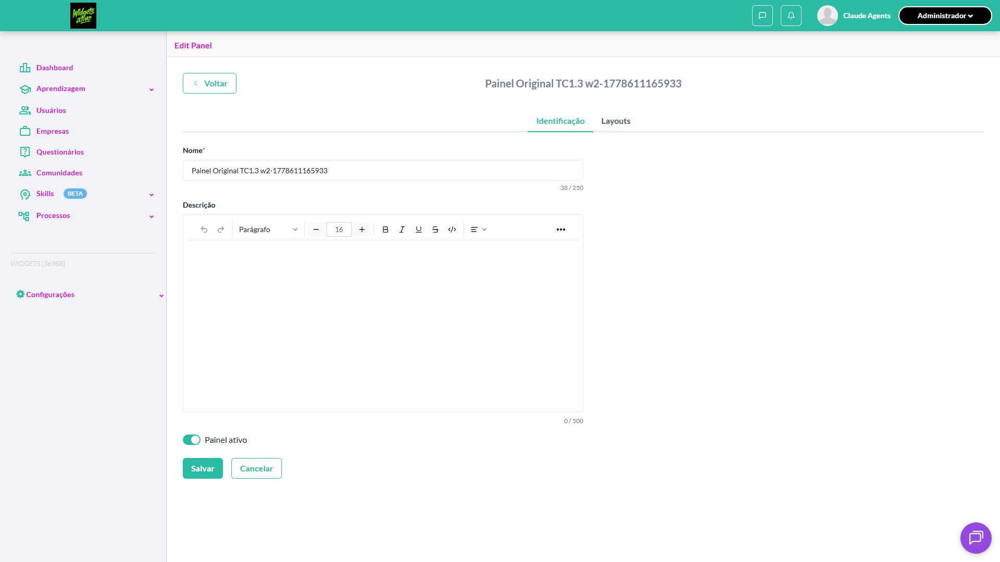

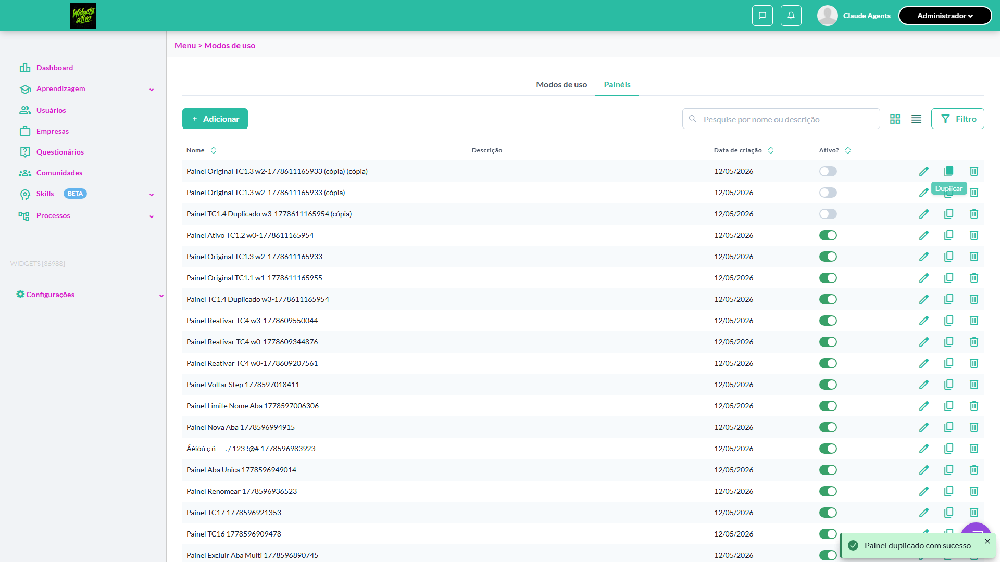

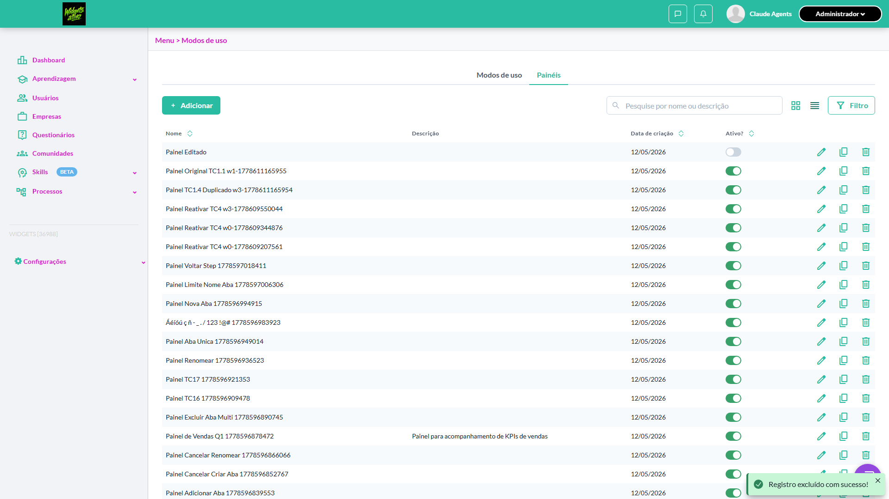

- 🎬 [Vídeo da execução (video.webm)](artifacts/projects-widgets-tests-fea-e5f83-uplicar-painel-várias-vezes-chromium/video.webm)

- 🎬 [Vídeo da execução (video-1.webm)](artifacts/projects-widgets-tests-fea-e5f83-uplicar-painel-várias-vezes-chromium/video-1.webm)

- 📦 [Trace do Playwright (trace.zip)](artifacts/projects-widgets-tests-fea-e5f83-uplicar-painel-várias-vezes-chromium/trace.zip) — abra com `npx playwright show-trace`


---

### ✅ Aprovado · Editar painel duplicado · 🟡 Normal

<a id="editar-painel-duplicado"></a>_Arquivo:_ `editar-painel-duplicado.spec.ts` · _Duração:_ 15.31s · _Browser:_ chromium

**Sumário (objetivo do caso):** Validar que cópia é independente do original.

**Pré-condições:**

```
Ambiente Stage configurado Funcionalidade 'Gestão de Painéis' habilitada no contrato Feature flag 'habilitar_paineis_do_usuario' ativa Usuário logado como Admin Existe painel duplicado '[Cópia] Painel Original'
```

**Passos do caso (XML/TestLink + execução Playwright):**

_Cada linha reproduz um passo do XML; a coluna **Status** traz o resultado da execução (do step Allure correspondente). Linhas com "Pré-condição" são da execução automatizada (login, navegação inicial) — não fazem parte do roteiro do XML._

| # | Ação do passo | Resultado esperado | Status | Notas | Duração |
|---|---|---|:---:|---|---:|
| 1 | Acessar a aba 'Painéis' em Configurações > Menu | Listagem é exibida | ✅ | — | 5.69s |
| 2 | Clicar no ícone 'Editar' na linha de '[Cópia] Painel Original' | Tela de edição é exibida | ✅ | — | 3.26s |
| 3 | Alterar o nome para 'Painel Editado' e salvar | Nome é atualizado para 'Painel Editado' | ✅ | — | 0.23s |
| 4 | Verificar o painel original na listagem | Painel 'Painel Original' permanece com nome inalterado | ✅ | — | 3.23s |

**Evidências:**


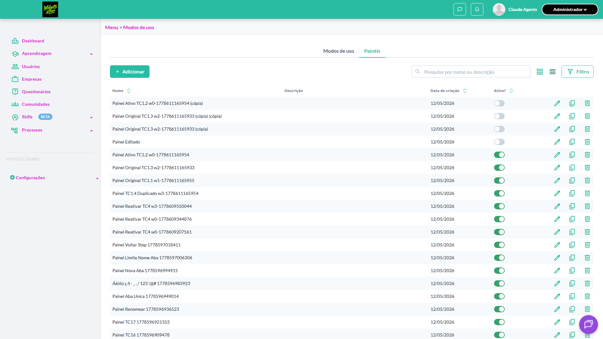


- 🎬 [Vídeo da execução (video.webm)](artifacts/projects-widgets-tests-fea-0dbbc-éis-Editar-painel-duplicado-chromium/video.webm)

- 🎬 [Vídeo da execução (video-1.webm)](artifacts/projects-widgets-tests-fea-0dbbc-éis-Editar-painel-duplicado-chromium/video-1.webm)

- 📦 [Trace do Playwright (trace.zip)](artifacts/projects-widgets-tests-fea-0dbbc-éis-Editar-painel-duplicado-chromium/trace.zip) — abra com `npx playwright show-trace`


---

### ✅ Aprovado · Excluir painel duplicado · 🟡 Normal

<a id="excluir-painel-duplicado"></a>_Arquivo:_ `excluir-painel-duplicado.spec.ts` · _Duração:_ 9.83s · _Browser:_ chromium

**Sumário (objetivo do caso):** Validar que cópia é independente do original.

**Pré-condições:**

```
Ambiente Stage configurado Funcionalidade 'Gestão de Painéis' habilitada no contrato Feature flag 'habilitar_paineis_do_usuario' ativa Usuário logado como Admin Existe painel duplicado '[Cópia] Painel Original'
```

**Passos do caso (XML/TestLink + execução Playwright):**

_Cada linha reproduz um passo do XML; a coluna **Status** traz o resultado da execução (do step Allure correspondente). Linhas com "Pré-condição" são da execução automatizada (login, navegação inicial) — não fazem parte do roteiro do XML._

| # | Ação do passo | Resultado esperado | Status | Notas | Duração |
|---|---|---|:---:|---|---:|
| 1 | Acessar a aba 'Painéis' em Configurações > Menu | Listagem é exibida | ✅ | — | 5.55s |
| 2 | Clicar no ícone 'Excluir' na linha de '[Cópia] Painel Original' | Modal de confirmação de exclusão é exibido | ✅ | — | 0.14s |
| 3 | Confirmar exclusão | Painel duplicado é excluído com sucesso | ✅ | — | 1.37s |

**Evidências:**


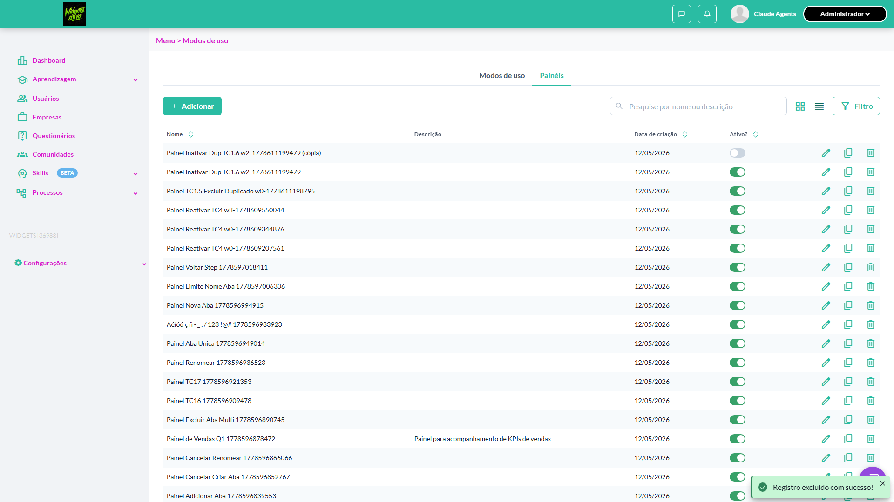


- 🎬 [Vídeo da execução (video.webm)](artifacts/projects-widgets-tests-fea-4ccaa-is-Excluir-painel-duplicado-chromium/video.webm)

- 🎬 [Vídeo da execução (video-1.webm)](artifacts/projects-widgets-tests-fea-4ccaa-is-Excluir-painel-duplicado-chromium/video-1.webm)

- 📦 [Trace do Playwright (trace.zip)](artifacts/projects-widgets-tests-fea-4ccaa-is-Excluir-painel-duplicado-chromium/trace.zip) — abra com `npx playwright show-trace`


---

### ❌ Falhou · Inativar painel duplicado · 🟡 Normal

<a id="inativar-painel-duplicado"></a>_Arquivo:_ `inativar-painel-duplicado.spec.ts` · _Duração:_ 12.42s · _Browser:_ chromium

> **❌ Por que falhou:** Error: aguardando toggle ou modal após click no switch de "Painel Inativar Dup TC1.6 w2-1778611199479 (cópia)"
> _Step impactado:_ **2. Ativar o painel duplicado "Painel Inativar Dup TC1.6 w2-1778611199479 (cópia)" clicando no switch "Ativo?"**

**Sumário (objetivo do caso):** Validar que cópia é independente do original.

**Pré-condições:**

```
Ambiente Stage configurado Funcionalidade 'Gestão de Painéis' habilitada no contrato Feature flag 'habilitar_paineis_do_usuario' ativa Usuário logado como Admin Existe painel duplicado '[Cópia] Painel Original'
```

**Passos do caso (XML/TestLink + execução Playwright):**

_Cada linha reproduz um passo do XML; a coluna **Status** traz o resultado da execução (do step Allure correspondente). Linhas com "Pré-condição" são da execução automatizada (login, navegação inicial) — não fazem parte do roteiro do XML._

| # | Ação do passo | Resultado esperado | Status | Notas | Duração |
|---|---|---|:---:|---|---:|
| 1 | Acessar a aba 'Painéis' em Configurações > Menu | Listagem é exibida | ✅ | — | 5.24s |
| 2 | Clicar no ícone 'Inativar' na linha de '[Cópia] Painel Original' | Painel é inativado com sucesso | ❌ | Error: aguardando toggle ou modal após click no switch de "Painel Inativar Dup TC1.6 w2-1778611199479 (cópia)" | 4.42s |

**Evidências:**

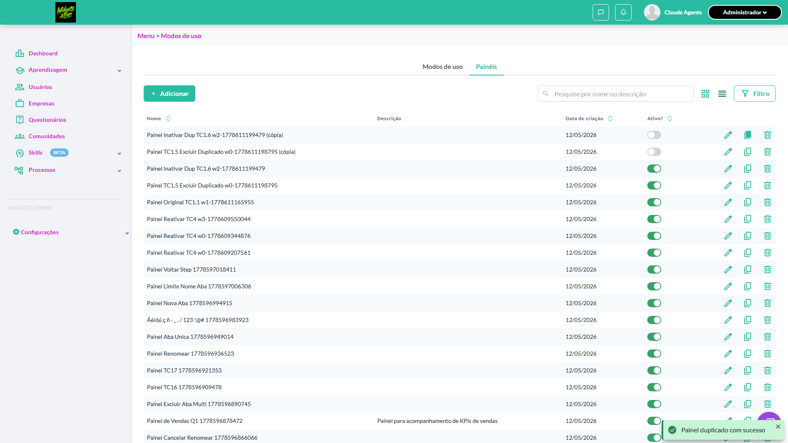

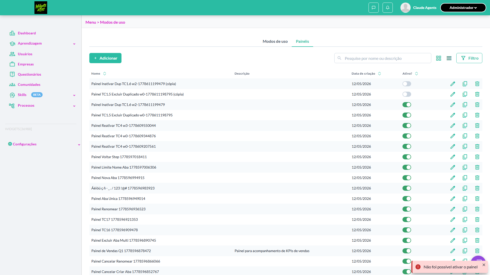

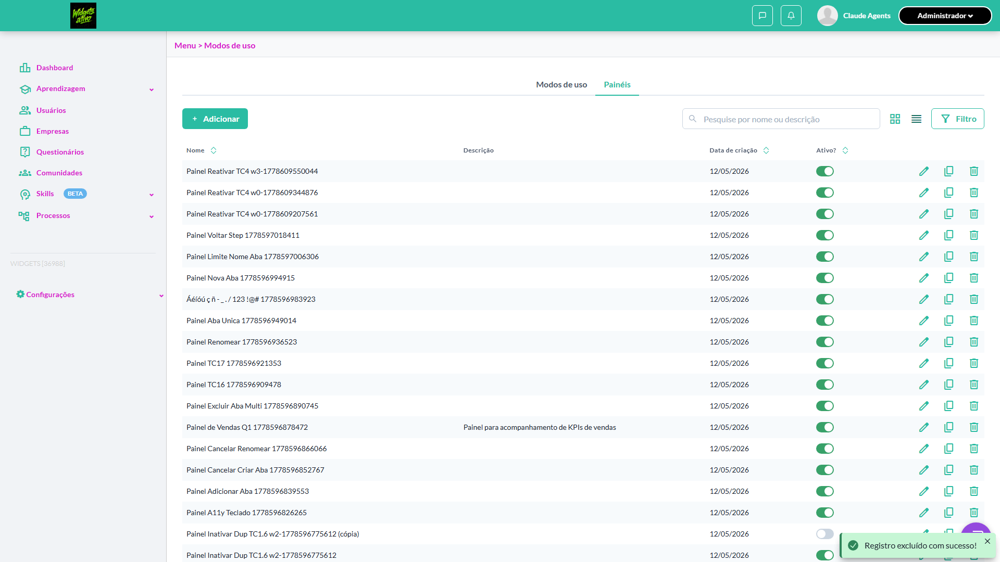

- 🎬 [Vídeo da execução (video.webm)](artifacts/projects-widgets-tests-fea-34902-s-Inativar-painel-duplicado-chromium/video.webm)

- 🎬 [Vídeo da execução (video-1.webm)](artifacts/projects-widgets-tests-fea-34902-s-Inativar-painel-duplicado-chromium/video-1.webm)

- 📦 [Trace do Playwright (trace.zip)](artifacts/projects-widgets-tests-fea-34902-s-Inativar-painel-duplicado-chromium/trace.zip) — abra com `npx playwright show-trace`

- 📄 [Snapshot do DOM no momento da falha (`error-context.md`)](artifacts/projects-widgets-tests-fea-34902-s-Inativar-painel-duplicado-chromium/error-context.md)

#### 🐛 Pronto para registro de bug

**Descrição do BUG:** [Normal] Inativar painel duplicado — Error: aguardando toggle ou modal após click no switch de "Painel Inativar Dup TC1.6 w2-1778611199479 (cópia)"

**Passo a passo para reprodução:**
1. Pré: Ambiente Stage configurado Funcionalidade 'Gestão de Painéis' habilitada no contrato Feature flag 'habilitar_paineis_do_usuario' ativa Usuário logado como Admin Existe painel duplicado '[Cópia] Painel Original'
1. 1. Acessar a aba 'Painéis' em Configurações > Menu
1. 2. Clicar no ícone 'Inativar' na linha de '[Cópia] Painel Original'

**Comportamento esperado:** Painel é inativado com sucesso

**Comportamento atual:** Error: aguardando toggle ou modal após click no switch de "Painel Inativar Dup TC1.6 w2-1778611199479 (cópia)"

**Informações:**

| Campo | Valor |
|---|---|
| URL | `https://widgets.stage.twygoead.com/` |
| Login | ${TWYGO_STAGING_WIDGETS_EMAIL} |
| Senha | ${TWYGO_STAGING_WIDGETS_PASSWORD} |
| orgId | 36988 |
| Outros | Browser: chromium |
| Outros | runId: duplicar-paineis_20260512-154037 |
| Outros | Duração até a falha: 12.42s |
| Outros | Step impactado: 2. 2. Ativar o painel duplicado "Painel Inativar Dup TC1.6 w2-1778611199479 (cópia)" clicando no switch "Ativo?" |

**Evidências:**

- Screenshot capturado pelo Playwright (screenshot): artifacts/projects-widgets-tests-fea-34902-s-Inativar-painel-duplicado-chromium/test-finished-1.png
- Screenshot capturado pelo Playwright (screenshot): artifacts/projects-widgets-tests-fea-34902-s-Inativar-painel-duplicado-chromium/test-failed-2.png
- Vídeo da execução (video-1.webm): artifacts/projects-widgets-tests-fea-34902-s-Inativar-painel-duplicado-chromium/video-1.webm
- Vídeo da execução (video.webm): artifacts/projects-widgets-tests-fea-34902-s-Inativar-painel-duplicado-chromium/video.webm
- Snapshot do DOM/contexto da página (error-context.md): artifacts/projects-widgets-tests-fea-34902-s-Inativar-painel-duplicado-chromium/error-context.md
- Screenshot capturado pelo Playwright (screenshot): artifacts/projects-widgets-tests-fea-34902-s-Inativar-painel-duplicado-chromium/test-failed-3.png
- Snapshot do DOM/contexto da página (error-context.md): artifacts/projects-widgets-tests-fea-34902-s-Inativar-painel-duplicado-chromium/error-context.md
- Trace completo do Playwright (.zip) — `npx playwright show-trace`: artifacts/projects-widgets-tests-fea-34902-s-Inativar-painel-duplicado-chromium/trace.zip

<details><summary>📋 Ver texto agregado para copiar (Jira/GitHub/Linear)</summary>

```
Descrição do BUG
[Normal] Inativar painel duplicado — Error: aguardando toggle ou modal após click no switch de "Painel Inativar Dup TC1.6 w2-1778611199479 (cópia)"

Passo a passo para reprodução
  Pré: Ambiente Stage configurado Funcionalidade 'Gestão de Painéis' habilitada no contrato Feature flag 'habilitar_paineis_do_usuario' ativa Usuário logado como Admin Existe painel duplicado '[Cópia] Painel Original'
  1. Acessar a aba 'Painéis' em Configurações > Menu
  2. Clicar no ícone 'Inativar' na linha de '[Cópia] Painel Original'

Comportamento esperado
Painel é inativado com sucesso

Comportamento atual
Error: aguardando toggle ou modal após click no switch de "Painel Inativar Dup TC1.6 w2-1778611199479 (cópia)"

Informações
- URL: https://widgets.stage.twygoead.com/
- Login: ${TWYGO_STAGING_WIDGETS_EMAIL}
- Senha: ${TWYGO_STAGING_WIDGETS_PASSWORD}
- ID do ambiente (orgId): 36988
- Outros:
  - Browser: chromium
  - runId: duplicar-paineis_20260512-154037
  - Duração até a falha: 12.42s
  - Step impactado: 2. 2. Ativar o painel duplicado "Painel Inativar Dup TC1.6 w2-1778611199479 (cópia)" clicando no switch "Ativo?"

Evidências
- Screenshot capturado pelo Playwright (screenshot): artifacts/projects-widgets-tests-fea-34902-s-Inativar-painel-duplicado-chromium/test-finished-1.png
- Screenshot capturado pelo Playwright (screenshot): artifacts/projects-widgets-tests-fea-34902-s-Inativar-painel-duplicado-chromium/test-failed-2.png
- Vídeo da execução (video-1.webm): artifacts/projects-widgets-tests-fea-34902-s-Inativar-painel-duplicado-chromium/video-1.webm
- Vídeo da execução (video.webm): artifacts/projects-widgets-tests-fea-34902-s-Inativar-painel-duplicado-chromium/video.webm
- Snapshot do DOM/contexto da página (error-context.md): artifacts/projects-widgets-tests-fea-34902-s-Inativar-painel-duplicado-chromium/error-context.md
- Screenshot capturado pelo Playwright (screenshot): artifacts/projects-widgets-tests-fea-34902-s-Inativar-painel-duplicado-chromium/test-failed-3.png
- Snapshot do DOM/contexto da página (error-context.md): artifacts/projects-widgets-tests-fea-34902-s-Inativar-painel-duplicado-chromium/error-context.md
- Trace completo do Playwright (.zip) — `npx playwright show-trace`: artifacts/projects-widgets-tests-fea-34902-s-Inativar-painel-duplicado-chromium/trace.zip

Execução
- runId: duplicar-paineis_20260512-154037
- environment.json: staging-widgets
- testsuite: Duplicar painéis
- testcase: Inativar painel duplicado

```

</details>

<details><summary>🔧 Stack trace técnica completa (para desenvolvedor)</summary>

```
Error: aguardando toggle ou modal após click no switch de "Painel Inativar Dup TC1.6 w2-1778611199479 (cópia)"

expect(received).not.toBe(expected) // Object.is equality

Expected: not "pending"

Call Log:
- Timeout 5000ms exceeded while waiting on the predicate
```

</details>

---
