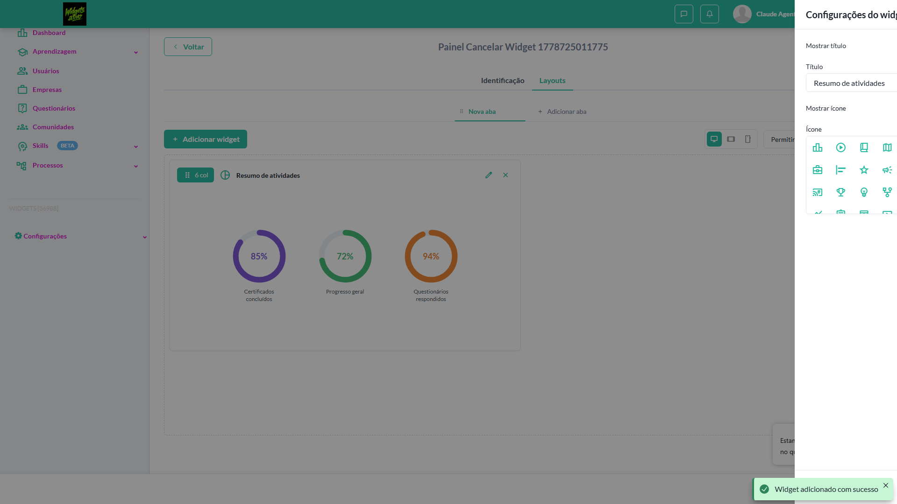
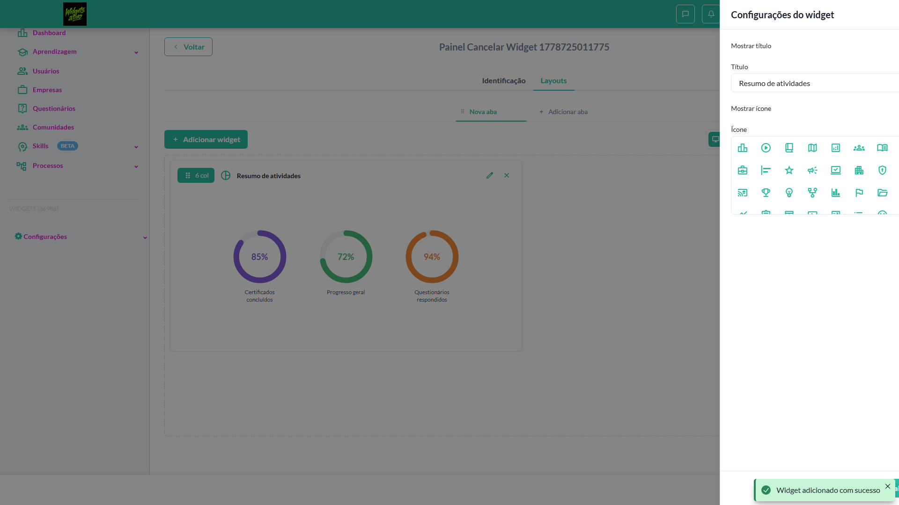
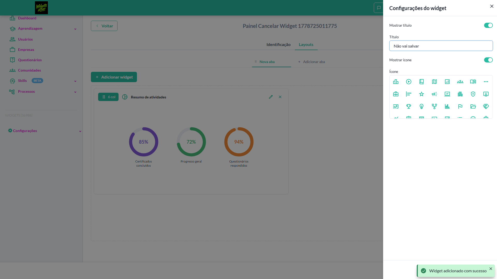
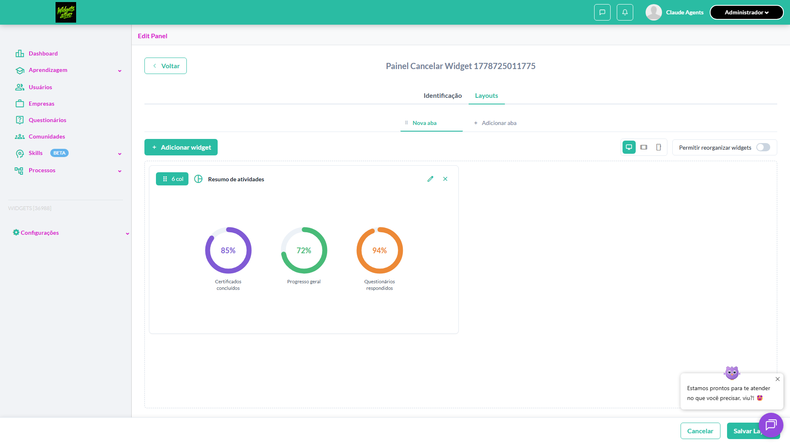
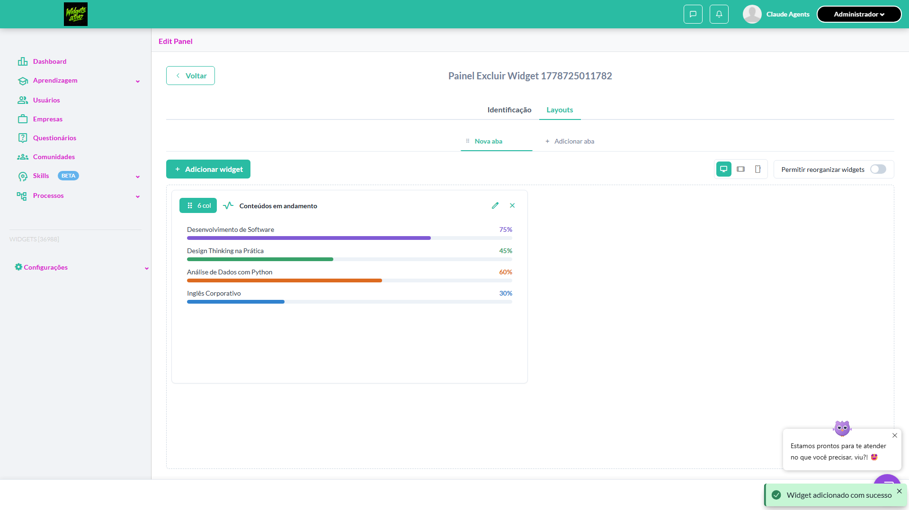
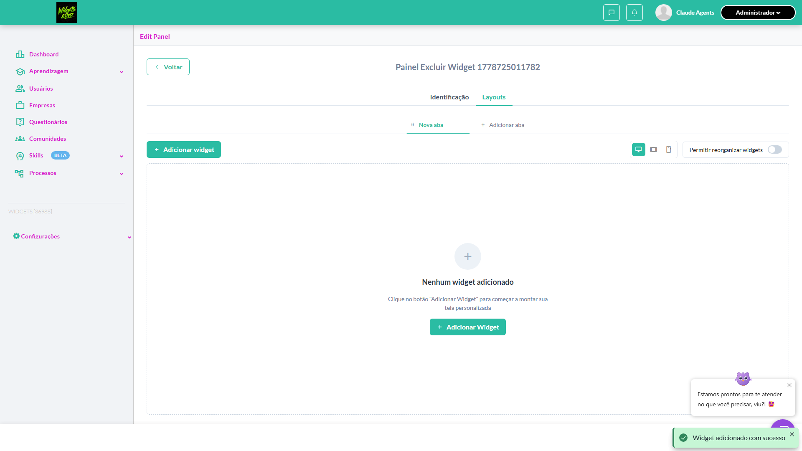
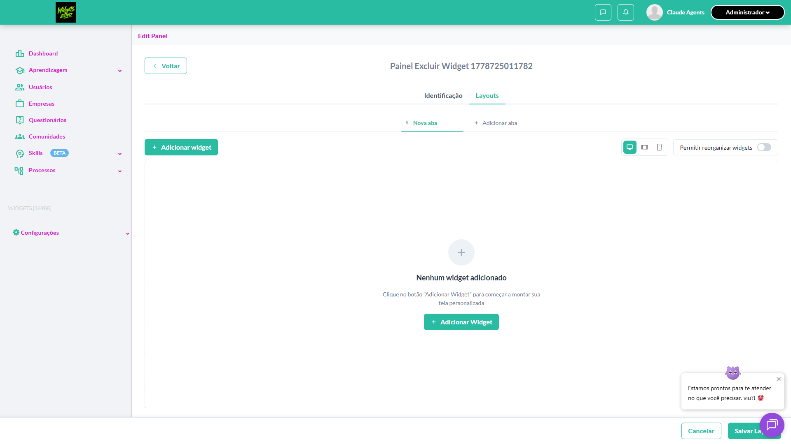
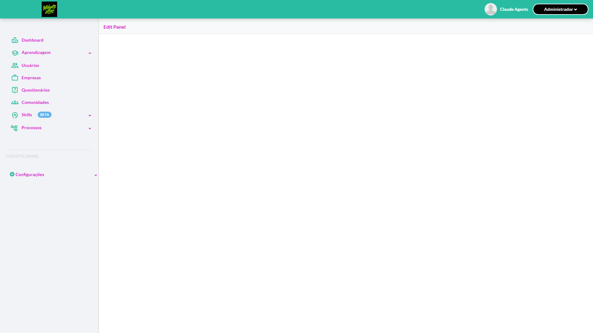
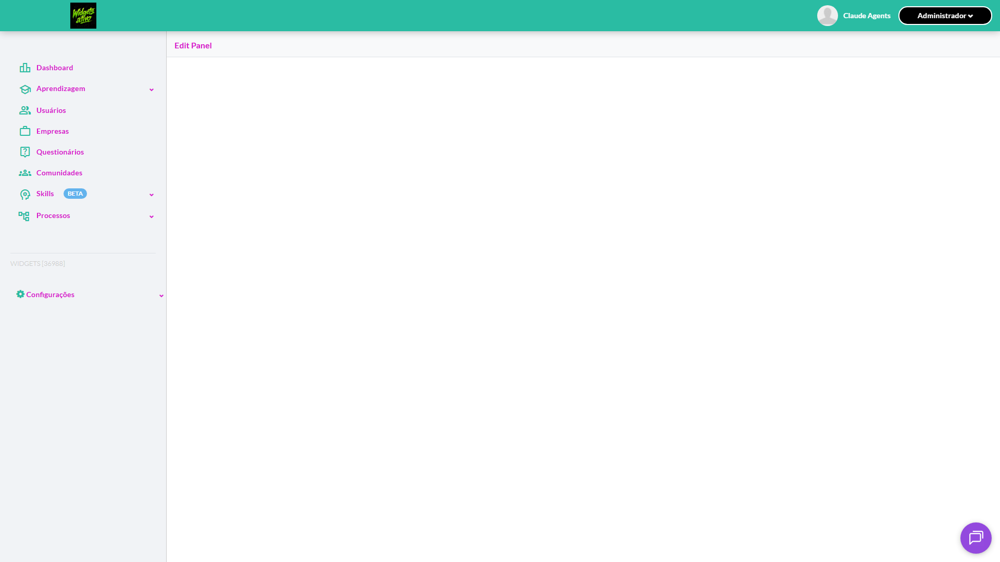
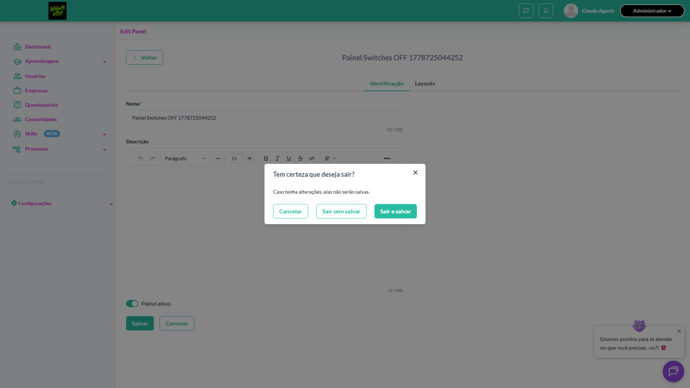

# Casos de teste — Widgets

[← Voltar ao dashboard](index.md)

Lista detalhada por testsuite. Cada caso traz: o que era esperado pelo XML, quais steps foram executados, evidências (screenshots/trace), texto pronto pra registro de bug e — quando houver falha — uma explicação em PT-BR do motivo.

## Editar/Excluir widgets

_6 caso(s) — 2 aprovado(s), 4 falha(s)_

### ✅ Aprovado · TC3 · Cancelar alterações no drawer de configurações do widget · 🟡 Normal

<a id="cancelar-alteracoes-no-drawer-de-configuracoes-do-widget"></a>_Arquivo:_ `cancelar-alteracoes-drawer-widget.spec.ts` · _Duração:_ 19.93s · _Browser:_ chromium

**Sumário (objetivo do caso):** Validar ação Cancelar do drawer (R10 RN86.1).

**Pré-condições:**

```
Ambiente Stage configurado Funcionalidade 'Gestão de Painéis' habilitada no contrato Feature flag 'habilitar_paineis_do_usuario' ativa Usuário logado como Admin Drawer 'Configurações do widget' aberto para o widget 'Resumo das atividades' Widget originalmente sem título customizado
```

**Passos do caso (XML/TestLink + execução Playwright):**

_Cada linha reproduz um passo do XML; a coluna **Status** traz o resultado da execução (do step Allure correspondente). Linhas com "Pré-condição" são da execução automatizada (login, navegação inicial) — não fazem parte do roteiro do XML._

| # | Ação do passo | Resultado esperado | Status | Notas | Duração |
|---|---|---|:---:|---|---:|
| — | _Pré-condição:_ Pré-condição: painel com widget alvo + drawer aberto | — | ✅ | — | 12.68s |
| 1 | Ativar o switch 'Mostrar título' | Switch fica ligado | ✅ | — | 0.11s |
| 2 | Preencher o campo 'Título' com 'Não vai salvar' | Campo aceita o valor | ✅ | — | 0.15s |
| 3 | Clicar no botão 'Cancelar' do drawer | Drawer é fechado sem persistir alterações | ✅ | — | 4.83s |
| 4 | Verificar o widget no layout | Widget mantém o título original (sem 'Não vai salvar') | ✅ | — | 0.07s |

**Evidências:**

📁 _Pasta:_ [`artifacts/projects-widgets-tests-fea-cba27--de-configurações-do-widget-chromium/`](artifacts/projects-widgets-tests-fea-cba27--de-configurações-do-widget-chromium/)

- 📸 **Screenshot (step-01-Pr--condi-o-painel-com-widget-alvo-drawer-aberto)** — [`step-01-Pr--condi-o-painel-com-widget-alvo-drawer-aberto-64fbc60e8ab154ad533937c40438df34faac7643.png`](artifacts/projects-widgets-tests-fea-cba27--de-configurações-do-widget-chromium/step-01-Pr--condi-o-painel-com-widget-alvo-drawer-aberto-64fbc60e8ab154ad533937c40438df34faac7643.png)

  

- 📸 **Screenshot (step-02-1-Ativar-switch-Mostrar-t-tulo)** — [`step-02-1-Ativar-switch-Mostrar-t-tulo-7ab7162cddbc73c8f0761bdc394f014cec6cb84c.png`](artifacts/projects-widgets-tests-fea-cba27--de-configurações-do-widget-chromium/step-02-1-Ativar-switch-Mostrar-t-tulo-7ab7162cddbc73c8f0761bdc394f014cec6cb84c.png)

  

- 📸 **Screenshot (step-03-2-Preencher-T-tulo-com-valor-descart-vel)** — [`step-03-2-Preencher-T-tulo-com-valor-descart-vel-4d96aaa3eea3ceefbfb7b44e850e517bffccabcd.png`](artifacts/projects-widgets-tests-fea-cba27--de-configurações-do-widget-chromium/step-03-2-Preencher-T-tulo-com-valor-descart-vel-4d96aaa3eea3ceefbfb7b44e850e517bffccabcd.png)

  

- 📸 **Screenshot (step-04-3-Clicar-em-Cancelar-drawer-fecha-sem-persistir)** — [`step-04-3-Clicar-em-Cancelar-drawer-fecha-sem-persistir-77b0ee047e4a157e2ceac29cb57b3862674f6355.png`](artifacts/projects-widgets-tests-fea-cba27--de-configurações-do-widget-chromium/step-04-3-Clicar-em-Cancelar-drawer-fecha-sem-persistir-77b0ee047e4a157e2ceac29cb57b3862674f6355.png)

  

- 📸 **Screenshot (step-05-4-Widget-mant-m-o-t-tulo-original-altera-o-descartada)** — [`step-05-4-Widget-mant-m-o-t-tulo-original-altera-o-descartada-05cea66ca81e6a154aeec9649e10b44673b0d0df.png`](artifacts/projects-widgets-tests-fea-cba27--de-configurações-do-widget-chromium/step-05-4-Widget-mant-m-o-t-tulo-original-altera-o-descartada-05cea66ca81e6a154aeec9649e10b44673b0d0df.png)

  

- 📸 **Screenshot (screenshot)** — [`test-finished-1.png`](artifacts/projects-widgets-tests-fea-cba27--de-configurações-do-widget-chromium/test-finished-1.png)

  

- 🎬 [Vídeo da execução (video.webm)](artifacts/projects-widgets-tests-fea-cba27--de-configurações-do-widget-chromium/video.webm)

- 🎬 [Vídeo da execução (video-1.webm)](artifacts/projects-widgets-tests-fea-cba27--de-configurações-do-widget-chromium/video-1.webm)

- 📦 **Trace** — [`trace.zip`](artifacts/projects-widgets-tests-fea-cba27--de-configurações-do-widget-chromium/trace.zip)

  ```bash
  npx playwright show-trace outputs/widgets/reports/editar-excluir-widgets_20260513-231812/artifacts/projects-widgets-tests-fea-cba27--de-configurações-do-widget-chromium/trace.zip
  ```

- 🎥 **Vídeo** — [`video.webm`](artifacts/projects-widgets-tests-fea-cba27--de-configurações-do-widget-chromium/video.webm)

- 🎥 **Vídeo** — [`video-1.webm`](artifacts/projects-widgets-tests-fea-cba27--de-configurações-do-widget-chromium/video-1.webm)


---

### ❌ Falhou · TC1 · Drawer de configurações ao 'Editar' Widget · 🔴 Crítico

<a id="drawer-de-configuracoes-ao-editar-widget"></a>_Arquivo:_ `drawer-configuracoes-editar-widget.spec.ts` · _Duração:_ 41.39s · _Browser:_ chromium

> **❌ Por que falhou:** Não foi possível clicar o elemento — ele não ficou disponível em 30s (locator: locator('[data-test-id="widgets-grid-empty-state-add-button"]')).
> _Step impactado:_ **1. Criar painel e adicionar widget alvo na aba Layouts**

**Sumário (objetivo do caso):** Validar abertura e componentes do drawer de edição (R10 RN84 RN85).

**Pré-condições:**

```
Ambiente Stage configurado Funcionalidade 'Gestão de Painéis' habilitada no contrato Feature flag 'habilitar_paineis_do_usuario' ativa Usuário logado como Admin Painel em edição com aba contendo o widget 'Resumo das atividades'
```

**Passos do caso (XML/TestLink + execução Playwright):**

_Cada linha reproduz um passo do XML; a coluna **Status** traz o resultado da execução (do step Allure correspondente). Linhas com "Pré-condição" são da execução automatizada (login, navegação inicial) — não fazem parte do roteiro do XML._

| # | Ação do passo | Resultado esperado | Status | Notas | Duração |
|---|---|---|:---:|---|---:|
| 1 | Acessar a aba 'Layouts' do painel em edição | Layout é exibido com o widget | ❌ | Não foi possível clicar o elemento — ele não ficou disponível em 30s (locator: locator('[data-test-id="widgets-grid-empty-state-add-button"]')). | 39.52s |
| 2 | Clicar no ícone 'Editar' (lápis) do widget 'Resumo das atividades' | Drawer com o título 'Configurações do widget' é exibido | ⊘ | Step não executado: o teste foi interrompido antes. Causa: Não foi possível clicar o elemento — ele não ficou disponível em 30s (locator: locator('[data-test-id="widgets-grid-empty-state-add-button"]')).. | — |
| 3 | Verificar os campos do drawer | Drawer contém: switch 'Mostrar título', campo 'Título' (input texto, máx. 255 caracteres), switch 'Mostrar ícone', campo 'Ícone' (componente seletor de ícones) | ⊘ | Step não executado: o teste foi interrompido antes. Causa: Não foi possível clicar o elemento — ele não ficou disponível em 30s (locator: locator('[data-test-id="widgets-grid-empty-state-add-button"]')).. | — |
| 4 | Verificar os botões do drawer | Botões 'Cancelar' e 'Salvar' são exibidos no rodapé do drawer | ⊘ | Step não executado: o teste foi interrompido antes. Causa: Não foi possível clicar o elemento — ele não ficou disponível em 30s (locator: locator('[data-test-id="widgets-grid-empty-state-add-button"]')).. | — |

**Evidências:**

📁 _Pasta:_ [`artifacts/projects-widgets-tests-fea-e77bb-figurações-ao-Editar-Widget-chromium/`](artifacts/projects-widgets-tests-fea-e77bb-figurações-ao-Editar-Widget-chromium/)

- 📸 **Screenshot (screenshot)** — [`test-failed-1.png`](artifacts/projects-widgets-tests-fea-e77bb-figurações-ao-Editar-Widget-chromium/test-failed-1.png)

  

- 🎬 [Vídeo da execução (video.webm)](artifacts/projects-widgets-tests-fea-e77bb-figurações-ao-Editar-Widget-chromium/video.webm)

- 🎬 [Vídeo da execução (video-1.webm)](artifacts/projects-widgets-tests-fea-e77bb-figurações-ao-Editar-Widget-chromium/video-1.webm)

- 📦 **Trace** — [`trace.zip`](artifacts/projects-widgets-tests-fea-e77bb-figurações-ao-Editar-Widget-chromium/trace.zip)

  ```bash
  npx playwright show-trace outputs/widgets/reports/editar-excluir-widgets_20260513-231812/artifacts/projects-widgets-tests-fea-e77bb-figurações-ao-Editar-Widget-chromium/trace.zip
  ```

- 🎥 **Vídeo** — [`video.webm`](artifacts/projects-widgets-tests-fea-e77bb-figurações-ao-Editar-Widget-chromium/video.webm)

- 🎥 **Vídeo** — [`video-1.webm`](artifacts/projects-widgets-tests-fea-e77bb-figurações-ao-Editar-Widget-chromium/video-1.webm)

- 📄 **DOM no momento da falha** — [`error-context.md`](artifacts/projects-widgets-tests-fea-e77bb-figurações-ao-Editar-Widget-chromium/error-context.md)

#### 🐛 Pronto para registro de bug

**Descrição do BUG:** [Crítico] Drawer de configurações ao 'Editar' Widget — Não foi possível clicar o elemento — ele não ficou disponível em 30s (locator: locator('[data-test-id="widgets-grid-empty-state-add-button"]')).

**Passo a passo para reprodução:**
1. Pré: Ambiente Stage configurado Funcionalidade 'Gestão de Painéis' habilitada no contrato Feature flag 'habilitar_paineis_do_usuario' ativa Usuário logado como Admin Painel em edição com aba contendo o widget 'Resumo das atividades'
1. 1. Acessar a aba 'Layouts' do painel em edição
1. 2. Clicar no ícone 'Editar' (lápis) do widget 'Resumo das atividades'
1. 3. Verificar os campos do drawer
1. 4. Verificar os botões do drawer

**Comportamento esperado:** Layout é exibido com o widget

**Comportamento atual:** Não foi possível clicar o elemento — ele não ficou disponível em 30s (locator: locator('[data-test-id="widgets-grid-empty-state-add-button"]')).

**Informações:**

| Campo | Valor |
|---|---|
| URL | `https://widgets.stage.twygoead.com/` |
| Login | ${TWYGO_STAGING_WIDGETS_EMAIL} |
| Senha | ${TWYGO_STAGING_WIDGETS_PASSWORD} |
| orgId | 36988 |
| Outros | Browser: chromium |
| Outros | runId: editar-excluir-widgets_20260513-231812 |
| Outros | Duração até a falha: 41.39s |
| Outros | Step impactado: 1. 1. Criar painel e adicionar widget alvo na aba Layouts |

**Evidências:**

- Screenshot capturado pelo Playwright (screenshot): artifacts/projects-widgets-tests-fea-e77bb-figurações-ao-Editar-Widget-chromium/test-failed-1.png
- Vídeo da execução (video-1.webm): artifacts/projects-widgets-tests-fea-e77bb-figurações-ao-Editar-Widget-chromium/video-1.webm
- Vídeo da execução (video.webm): artifacts/projects-widgets-tests-fea-e77bb-figurações-ao-Editar-Widget-chromium/video.webm
- Snapshot do DOM/contexto da página (error-context.md): artifacts/projects-widgets-tests-fea-e77bb-figurações-ao-Editar-Widget-chromium/error-context.md
- Trace completo do Playwright (.zip) — `npx playwright show-trace`: artifacts/projects-widgets-tests-fea-e77bb-figurações-ao-Editar-Widget-chromium/trace.zip

<details><summary>📋 Ver texto agregado para copiar (Jira/GitHub/Linear)</summary>

```
Descrição do BUG
[Crítico] Drawer de configurações ao 'Editar' Widget — Não foi possível clicar o elemento — ele não ficou disponível em 30s (locator: locator('[data-test-id="widgets-grid-empty-state-add-button"]')).

Passo a passo para reprodução
  Pré: Ambiente Stage configurado Funcionalidade 'Gestão de Painéis' habilitada no contrato Feature flag 'habilitar_paineis_do_usuario' ativa Usuário logado como Admin Painel em edição com aba contendo o widget 'Resumo das atividades'
  1. Acessar a aba 'Layouts' do painel em edição
  2. Clicar no ícone 'Editar' (lápis) do widget 'Resumo das atividades'
  3. Verificar os campos do drawer
  4. Verificar os botões do drawer

Comportamento esperado
Layout é exibido com o widget

Comportamento atual
Não foi possível clicar o elemento — ele não ficou disponível em 30s (locator: locator('[data-test-id="widgets-grid-empty-state-add-button"]')).

Informações
- URL: https://widgets.stage.twygoead.com/
- Login: ${TWYGO_STAGING_WIDGETS_EMAIL}
- Senha: ${TWYGO_STAGING_WIDGETS_PASSWORD}
- ID do ambiente (orgId): 36988
- Outros:
  - Browser: chromium
  - runId: editar-excluir-widgets_20260513-231812
  - Duração até a falha: 41.39s
  - Step impactado: 1. 1. Criar painel e adicionar widget alvo na aba Layouts

Evidências
- Screenshot capturado pelo Playwright (screenshot): artifacts/projects-widgets-tests-fea-e77bb-figurações-ao-Editar-Widget-chromium/test-failed-1.png
- Vídeo da execução (video-1.webm): artifacts/projects-widgets-tests-fea-e77bb-figurações-ao-Editar-Widget-chromium/video-1.webm
- Vídeo da execução (video.webm): artifacts/projects-widgets-tests-fea-e77bb-figurações-ao-Editar-Widget-chromium/video.webm
- Snapshot do DOM/contexto da página (error-context.md): artifacts/projects-widgets-tests-fea-e77bb-figurações-ao-Editar-Widget-chromium/error-context.md
- Trace completo do Playwright (.zip) — `npx playwright show-trace`: artifacts/projects-widgets-tests-fea-e77bb-figurações-ao-Editar-Widget-chromium/trace.zip

Execução
- runId: editar-excluir-widgets_20260513-231812
- environment.json: staging-widgets
- testsuite: Editar/Excluir widgets
- testcase: Drawer de configurações ao 'Editar' Widget

```

</details>

<details><summary>🔧 Stack trace técnica completa (para desenvolvedor)</summary>

```
TimeoutError: locator.click: Timeout 30000ms exceeded.
Call log:
  - waiting for locator('[data-test-id="widgets-grid-empty-state-add-button"]')

```

</details>

---

### ✅ Aprovado · TC5 · Excluir widget pelo ícone 'x' · 🔴 Crítico

<a id="excluir-widget-pelo-icone-x"></a>_Arquivo:_ `excluir-widget-icone-x.spec.ts` · _Duração:_ 31.81s · _Browser:_ chromium

**Sumário (objetivo do caso):** Validar exclusão do widget (R10 RN87).

**Pré-condições:**

```
Ambiente Stage configurado Funcionalidade 'Gestão de Painéis' habilitada no contrato Feature flag 'habilitar_paineis_do_usuario' ativa Usuário logado como Admin Painel em edição com aba contendo widget 'Conteúdos em andamento'
```

**Passos do caso (XML/TestLink + execução Playwright):**

_Cada linha reproduz um passo do XML; a coluna **Status** traz o resultado da execução (do step Allure correspondente). Linhas com "Pré-condição" são da execução automatizada (login, navegação inicial) — não fazem parte do roteiro do XML._

| # | Ação do passo | Resultado esperado | Status | Notas | Duração |
|---|---|---|:---:|---|---:|
| — | _Pré-condição:_ Pré-condição: painel com widget alvo na aba Layouts | — | ✅ | — | 13.27s |
| 1 | Acessar a aba 'Layouts' do painel em edição | Layout é exibido com o widget | ✅ | — | 0.20s |
| 2 | Clicar no ícone 'Excluir' (x) do widget 'Conteúdos em andamento' | Widget é removido do layout | ✅ | — | 4.97s |
| 3 | Clicar no botão 'Salvar layout' | Layout é persistido sem o widget excluído | ✅ | — | 1.84s |

**Evidências:**

📁 _Pasta:_ [`artifacts/projects-widgets-tests-fea-b5e37-xcluir-widget-pelo-ícone-x--chromium/`](artifacts/projects-widgets-tests-fea-b5e37-xcluir-widget-pelo-ícone-x--chromium/)

- 📸 **Screenshot (step-01-Pr--condi-o-painel-com-widget-alvo-na-aba-Layouts)** — [`step-01-Pr--condi-o-painel-com-widget-alvo-na-aba-Layouts-d2d37ae5bd262ec2307c4f7a914150c74befe2f2.png`](artifacts/projects-widgets-tests-fea-b5e37-xcluir-widget-pelo-ícone-x--chromium/step-01-Pr--condi-o-painel-com-widget-alvo-na-aba-Layouts-d2d37ae5bd262ec2307c4f7a914150c74befe2f2.png)

  

- 📸 **Screenshot (step-02-1-Clicar-no-cone-Excluir-x-do-widget)** — [`step-02-1-Clicar-no-cone-Excluir-x-do-widget-6b6da535b441eaf09c36b79d34a037f103dfc6fe.png`](artifacts/projects-widgets-tests-fea-b5e37-xcluir-widget-pelo-ícone-x--chromium/step-02-1-Clicar-no-cone-Excluir-x-do-widget-6b6da535b441eaf09c36b79d34a037f103dfc6fe.png)

  

- 📸 **Screenshot (step-03-2-Clicar-em-Salvar-Layout-para-persistir)** — [`step-03-2-Clicar-em-Salvar-Layout-para-persistir-8f7ebdd71263807df46e07caacf64f65089cece1.png`](artifacts/projects-widgets-tests-fea-b5e37-xcluir-widget-pelo-ícone-x--chromium/step-03-2-Clicar-em-Salvar-Layout-para-persistir-8f7ebdd71263807df46e07caacf64f65089cece1.png)

  

- 📸 **Screenshot (step-04-3-Recarregar-layout-e-validar-persist-ncia-da-remo-o)** — [`step-04-3-Recarregar-layout-e-validar-persist-ncia-da-remo-o-277284cd08fd81427a281627d05bd71bd6907a07.png`](artifacts/projects-widgets-tests-fea-b5e37-xcluir-widget-pelo-ícone-x--chromium/step-04-3-Recarregar-layout-e-validar-persist-ncia-da-remo-o-277284cd08fd81427a281627d05bd71bd6907a07.png)

  

- 📸 **Screenshot (screenshot)** — [`test-finished-1.png`](artifacts/projects-widgets-tests-fea-b5e37-xcluir-widget-pelo-ícone-x--chromium/test-finished-1.png)

  

- 🎬 [Vídeo da execução (video.webm)](artifacts/projects-widgets-tests-fea-b5e37-xcluir-widget-pelo-ícone-x--chromium/video.webm)

- 🎬 [Vídeo da execução (video-1.webm)](artifacts/projects-widgets-tests-fea-b5e37-xcluir-widget-pelo-ícone-x--chromium/video-1.webm)

- 📦 **Trace** — [`trace.zip`](artifacts/projects-widgets-tests-fea-b5e37-xcluir-widget-pelo-ícone-x--chromium/trace.zip)

  ```bash
  npx playwright show-trace outputs/widgets/reports/editar-excluir-widgets_20260513-231812/artifacts/projects-widgets-tests-fea-b5e37-xcluir-widget-pelo-ícone-x--chromium/trace.zip
  ```

- 🎥 **Vídeo** — [`video.webm`](artifacts/projects-widgets-tests-fea-b5e37-xcluir-widget-pelo-ícone-x--chromium/video.webm)

- 🎥 **Vídeo** — [`video-1.webm`](artifacts/projects-widgets-tests-fea-b5e37-xcluir-widget-pelo-ícone-x--chromium/video-1.webm)


---

### ❌ Falhou · TC4 · Limite de 255 caracteres no campo 'Título' do drawer · ⚪ Menor

<a id="limite-de-255-caracteres-no-campo-titulo-do-drawer"></a>_Arquivo:_ `limite-titulo-drawer-widget.spec.ts` · _Duração:_ 41.89s · _Browser:_ chromium

> **❌ Por que falhou:** Não foi possível clicar o elemento — ele não ficou disponível em 30s (locator: locator('[data-test-id="widgets-grid-empty-state-add-button"]')).
> _Step impactado:_ **Pré-condição: painel com widget + drawer aberto**

**Sumário (objetivo do caso):** Validar limitação do campo Título.

**Pré-condições:**

```
Ambiente Stage configurado Funcionalidade 'Gestão de Painéis' habilitada no contrato Feature flag 'habilitar_paineis_do_usuario' ativa Usuário logado como Admin Drawer 'Configurações do widget' aberto para um widget
```

**Passos do caso (XML/TestLink + execução Playwright):**

_Cada linha reproduz um passo do XML; a coluna **Status** traz o resultado da execução (do step Allure correspondente). Linhas com "Pré-condição" são da execução automatizada (login, navegação inicial) — não fazem parte do roteiro do XML._

| # | Ação do passo | Resultado esperado | Status | Notas | Duração |
|---|---|---|:---:|---|---:|
| — | _Pré-condição:_ Pré-condição: painel com widget + drawer aberto | — | ❌ | Não foi possível clicar o elemento — ele não ficou disponível em 30s (locator: locator('[data-test-id="widgets-grid-empty-state-add-button"]')). | 39.94s |
| 1 | Preencher o campo 'Título' com 256 caracteres | Campo aceita no máximo 255 caracteres ou exibe mensagem de limite excedido | ⊘ | Step não executado: o teste foi interrompido antes. Causa: Não foi possível clicar o elemento — ele não ficou disponível em 30s (locator: locator('[data-test-id="widgets-grid-empty-state-add-button"]')).. | — |

**Evidências:**

📁 _Pasta:_ [`artifacts/projects-widgets-tests-fea-0668f-s-no-campo-Título-do-drawer-chromium/`](artifacts/projects-widgets-tests-fea-0668f-s-no-campo-Título-do-drawer-chromium/)

- 📸 **Screenshot (screenshot)** — [`test-failed-1.png`](artifacts/projects-widgets-tests-fea-0668f-s-no-campo-Título-do-drawer-chromium/test-failed-1.png)

  

- 🎬 [Vídeo da execução (video.webm)](artifacts/projects-widgets-tests-fea-0668f-s-no-campo-Título-do-drawer-chromium/video.webm)

- 🎬 [Vídeo da execução (video-1.webm)](artifacts/projects-widgets-tests-fea-0668f-s-no-campo-Título-do-drawer-chromium/video-1.webm)

- 📦 **Trace** — [`trace.zip`](artifacts/projects-widgets-tests-fea-0668f-s-no-campo-Título-do-drawer-chromium/trace.zip)

  ```bash
  npx playwright show-trace outputs/widgets/reports/editar-excluir-widgets_20260513-231812/artifacts/projects-widgets-tests-fea-0668f-s-no-campo-Título-do-drawer-chromium/trace.zip
  ```

- 🎥 **Vídeo** — [`video.webm`](artifacts/projects-widgets-tests-fea-0668f-s-no-campo-Título-do-drawer-chromium/video.webm)

- 🎥 **Vídeo** — [`video-1.webm`](artifacts/projects-widgets-tests-fea-0668f-s-no-campo-Título-do-drawer-chromium/video-1.webm)

- 📄 **DOM no momento da falha** — [`error-context.md`](artifacts/projects-widgets-tests-fea-0668f-s-no-campo-Título-do-drawer-chromium/error-context.md)

#### 🐛 Pronto para registro de bug

**Descrição do BUG:** [Menor] Limite de 255 caracteres no campo 'Título' do drawer — Não foi possível clicar o elemento — ele não ficou disponível em 30s (locator: locator('[data-test-id="widgets-grid-empty-state-add-button"]')).

**Passo a passo para reprodução:**
1. Pré: Ambiente Stage configurado Funcionalidade 'Gestão de Painéis' habilitada no contrato Feature flag 'habilitar_paineis_do_usuario' ativa Usuário logado como Admin Drawer 'Configurações do widget' aberto para um widget
1. 1. Preencher o campo 'Título' com 256 caracteres

**Comportamento esperado:** Campo aceita no máximo 255 caracteres ou exibe mensagem de limite excedido

**Comportamento atual:** Não foi possível clicar o elemento — ele não ficou disponível em 30s (locator: locator('[data-test-id="widgets-grid-empty-state-add-button"]')).

**Informações:**

| Campo | Valor |
|---|---|
| URL | `https://widgets.stage.twygoead.com/` |
| Login | ${TWYGO_STAGING_WIDGETS_EMAIL} |
| Senha | ${TWYGO_STAGING_WIDGETS_PASSWORD} |
| orgId | 36988 |
| Outros | Browser: chromium |
| Outros | runId: editar-excluir-widgets_20260513-231812 |
| Outros | Duração até a falha: 41.89s |
| Outros | Step impactado: 1. Pré-condição: painel com widget + drawer aberto |

**Evidências:**

- Screenshot capturado pelo Playwright (screenshot): artifacts/projects-widgets-tests-fea-0668f-s-no-campo-Título-do-drawer-chromium/test-failed-1.png
- Vídeo da execução (video-1.webm): artifacts/projects-widgets-tests-fea-0668f-s-no-campo-Título-do-drawer-chromium/video-1.webm
- Vídeo da execução (video.webm): artifacts/projects-widgets-tests-fea-0668f-s-no-campo-Título-do-drawer-chromium/video.webm
- Snapshot do DOM/contexto da página (error-context.md): artifacts/projects-widgets-tests-fea-0668f-s-no-campo-Título-do-drawer-chromium/error-context.md
- Trace completo do Playwright (.zip) — `npx playwright show-trace`: artifacts/projects-widgets-tests-fea-0668f-s-no-campo-Título-do-drawer-chromium/trace.zip

<details><summary>📋 Ver texto agregado para copiar (Jira/GitHub/Linear)</summary>

```
Descrição do BUG
[Menor] Limite de 255 caracteres no campo 'Título' do drawer — Não foi possível clicar o elemento — ele não ficou disponível em 30s (locator: locator('[data-test-id="widgets-grid-empty-state-add-button"]')).

Passo a passo para reprodução
  Pré: Ambiente Stage configurado Funcionalidade 'Gestão de Painéis' habilitada no contrato Feature flag 'habilitar_paineis_do_usuario' ativa Usuário logado como Admin Drawer 'Configurações do widget' aberto para um widget
  1. Preencher o campo 'Título' com 256 caracteres

Comportamento esperado
Campo aceita no máximo 255 caracteres ou exibe mensagem de limite excedido

Comportamento atual
Não foi possível clicar o elemento — ele não ficou disponível em 30s (locator: locator('[data-test-id="widgets-grid-empty-state-add-button"]')).

Informações
- URL: https://widgets.stage.twygoead.com/
- Login: ${TWYGO_STAGING_WIDGETS_EMAIL}
- Senha: ${TWYGO_STAGING_WIDGETS_PASSWORD}
- ID do ambiente (orgId): 36988
- Outros:
  - Browser: chromium
  - runId: editar-excluir-widgets_20260513-231812
  - Duração até a falha: 41.89s
  - Step impactado: 1. Pré-condição: painel com widget + drawer aberto

Evidências
- Screenshot capturado pelo Playwright (screenshot): artifacts/projects-widgets-tests-fea-0668f-s-no-campo-Título-do-drawer-chromium/test-failed-1.png
- Vídeo da execução (video-1.webm): artifacts/projects-widgets-tests-fea-0668f-s-no-campo-Título-do-drawer-chromium/video-1.webm
- Vídeo da execução (video.webm): artifacts/projects-widgets-tests-fea-0668f-s-no-campo-Título-do-drawer-chromium/video.webm
- Snapshot do DOM/contexto da página (error-context.md): artifacts/projects-widgets-tests-fea-0668f-s-no-campo-Título-do-drawer-chromium/error-context.md
- Trace completo do Playwright (.zip) — `npx playwright show-trace`: artifacts/projects-widgets-tests-fea-0668f-s-no-campo-Título-do-drawer-chromium/trace.zip

Execução
- runId: editar-excluir-widgets_20260513-231812
- environment.json: staging-widgets
- testsuite: Editar/Excluir widgets
- testcase: Limite de 255 caracteres no campo 'Título' do drawer

```

</details>

<details><summary>🔧 Stack trace técnica completa (para desenvolvedor)</summary>

```
TimeoutError: locator.click: Timeout 30000ms exceeded.
Call log:
  - waiting for locator('[data-test-id="widgets-grid-empty-state-add-button"]')

```

</details>

---

### ❌ Falhou · TC2 · Salvar alterações no drawer de configurações do widget · 🔴 Crítico

<a id="salvar-alteracoes-no-drawer-de-configuracoes-do-widget"></a>_Arquivo:_ `salvar-alteracoes-drawer-widget.spec.ts` · _Duração:_ 40.89s · _Browser:_ chromium

> **❌ Por que falhou:** Não foi possível clicar o elemento — ele não ficou disponível em 30s (locator: locator('[data-test-id="widgets-grid-empty-state-add-button"]')).
> _Step impactado:_ **Pré-condição: painel com widget alvo + drawer de edição aberto**

**Sumário (objetivo do caso):** Validar persistência das configurações (R10 RN86).

**Pré-condições:**

```
Ambiente Stage configurado Funcionalidade 'Gestão de Painéis' habilitada no contrato Feature flag 'habilitar_paineis_do_usuario' ativa Usuário logado como Admin Drawer 'Configurações do widget' aberto para o widget 'Resumo das atividades'
```

**Passos do caso (XML/TestLink + execução Playwright):**

_Cada linha reproduz um passo do XML; a coluna **Status** traz o resultado da execução (do step Allure correspondente). Linhas com "Pré-condição" são da execução automatizada (login, navegação inicial) — não fazem parte do roteiro do XML._

| # | Ação do passo | Resultado esperado | Status | Notas | Duração |
|---|---|---|:---:|---|---:|
| — | _Pré-condição:_ Pré-condição: painel com widget alvo + drawer de edição aberto | — | ❌ | Não foi possível clicar o elemento — ele não ficou disponível em 30s (locator: locator('[data-test-id="widgets-grid-empty-state-add-button"]')). | 39.42s |
| 1 | Ativar o switch 'Mostrar título' | Switch fica ligado | ⊘ | Step não executado: o teste foi interrompido antes. Causa: Não foi possível clicar o elemento — ele não ficou disponível em 30s (locator: locator('[data-test-id="widgets-grid-empty-state-add-button"]')).. | — |
| 2 | Preencher o campo 'Título' com 'Resumo Personalizado' | Campo aceita o valor | ⊘ | Step não executado: o teste foi interrompido antes. Causa: Não foi possível clicar o elemento — ele não ficou disponível em 30s (locator: locator('[data-test-id="widgets-grid-empty-state-add-button"]')).. | — |
| 3 | Ativar o switch 'Mostrar ícone' | Switch fica ligado | ⊘ | Step não executado: o teste foi interrompido antes. Causa: Não foi possível clicar o elemento — ele não ficou disponível em 30s (locator: locator('[data-test-id="widgets-grid-empty-state-add-button"]')).. | — |
| 4 | Selecionar um ícone no componente 'Ícone' | Ícone é selecionado | ⊘ | Step não executado: o teste foi interrompido antes. Causa: Não foi possível clicar o elemento — ele não ficou disponível em 30s (locator: locator('[data-test-id="widgets-grid-empty-state-add-button"]')).. | — |
| 5 | Clicar no botão 'Salvar' do drawer | Drawer é fechado e toast exibida: "Configurações salvas com sucesso" | ⊘ | Step não executado: o teste foi interrompido antes. Causa: Não foi possível clicar o elemento — ele não ficou disponível em 30s (locator: locator('[data-test-id="widgets-grid-empty-state-add-button"]')).. | — |
| 6 | Verificar o widget no layout | Widget exibe título 'Resumo Personalizado' e o ícone selecionado | ⊘ | Step não executado: o teste foi interrompido antes. Causa: Não foi possível clicar o elemento — ele não ficou disponível em 30s (locator: locator('[data-test-id="widgets-grid-empty-state-add-button"]')).. | — |

**Evidências:**

📁 _Pasta:_ [`artifacts/projects-widgets-tests-fea-f0582--de-configurações-do-widget-chromium/`](artifacts/projects-widgets-tests-fea-f0582--de-configurações-do-widget-chromium/)

- 📸 **Screenshot (screenshot)** — [`test-failed-1.png`](artifacts/projects-widgets-tests-fea-f0582--de-configurações-do-widget-chromium/test-failed-1.png)

  

- 🎬 [Vídeo da execução (video.webm)](artifacts/projects-widgets-tests-fea-f0582--de-configurações-do-widget-chromium/video.webm)

- 🎬 [Vídeo da execução (video-1.webm)](artifacts/projects-widgets-tests-fea-f0582--de-configurações-do-widget-chromium/video-1.webm)

- 📦 **Trace** — [`trace.zip`](artifacts/projects-widgets-tests-fea-f0582--de-configurações-do-widget-chromium/trace.zip)

  ```bash
  npx playwright show-trace outputs/widgets/reports/editar-excluir-widgets_20260513-231812/artifacts/projects-widgets-tests-fea-f0582--de-configurações-do-widget-chromium/trace.zip
  ```

- 🎥 **Vídeo** — [`video.webm`](artifacts/projects-widgets-tests-fea-f0582--de-configurações-do-widget-chromium/video.webm)

- 🎥 **Vídeo** — [`video-1.webm`](artifacts/projects-widgets-tests-fea-f0582--de-configurações-do-widget-chromium/video-1.webm)

- 📄 **DOM no momento da falha** — [`error-context.md`](artifacts/projects-widgets-tests-fea-f0582--de-configurações-do-widget-chromium/error-context.md)

#### 🐛 Pronto para registro de bug

**Descrição do BUG:** [Crítico] Salvar alterações no drawer de configurações do widget — Não foi possível clicar o elemento — ele não ficou disponível em 30s (locator: locator('[data-test-id="widgets-grid-empty-state-add-button"]')).

**Passo a passo para reprodução:**
1. Pré: Ambiente Stage configurado Funcionalidade 'Gestão de Painéis' habilitada no contrato Feature flag 'habilitar_paineis_do_usuario' ativa Usuário logado como Admin Drawer 'Configurações do widget' aberto para o widget 'Resumo das atividades'
1. 1. Ativar o switch 'Mostrar título'
1. 2. Preencher o campo 'Título' com 'Resumo Personalizado'
1. 3. Ativar o switch 'Mostrar ícone'
1. 4. Selecionar um ícone no componente 'Ícone'
1. 5. Clicar no botão 'Salvar' do drawer
1. 6. Verificar o widget no layout

**Comportamento esperado:** Switch fica ligado

**Comportamento atual:** Não foi possível clicar o elemento — ele não ficou disponível em 30s (locator: locator('[data-test-id="widgets-grid-empty-state-add-button"]')).

**Informações:**

| Campo | Valor |
|---|---|
| URL | `https://widgets.stage.twygoead.com/` |
| Login | ${TWYGO_STAGING_WIDGETS_EMAIL} |
| Senha | ${TWYGO_STAGING_WIDGETS_PASSWORD} |
| orgId | 36988 |
| Outros | Browser: chromium |
| Outros | runId: editar-excluir-widgets_20260513-231812 |
| Outros | Duração até a falha: 40.89s |
| Outros | Step impactado: 1. Pré-condição: painel com widget alvo + drawer de edição aberto |

**Evidências:**

- Screenshot capturado pelo Playwright (screenshot): artifacts/projects-widgets-tests-fea-f0582--de-configurações-do-widget-chromium/test-failed-1.png
- Vídeo da execução (video-1.webm): artifacts/projects-widgets-tests-fea-f0582--de-configurações-do-widget-chromium/video-1.webm
- Vídeo da execução (video.webm): artifacts/projects-widgets-tests-fea-f0582--de-configurações-do-widget-chromium/video.webm
- Snapshot do DOM/contexto da página (error-context.md): artifacts/projects-widgets-tests-fea-f0582--de-configurações-do-widget-chromium/error-context.md
- Trace completo do Playwright (.zip) — `npx playwright show-trace`: artifacts/projects-widgets-tests-fea-f0582--de-configurações-do-widget-chromium/trace.zip

<details><summary>📋 Ver texto agregado para copiar (Jira/GitHub/Linear)</summary>

```
Descrição do BUG
[Crítico] Salvar alterações no drawer de configurações do widget — Não foi possível clicar o elemento — ele não ficou disponível em 30s (locator: locator('[data-test-id="widgets-grid-empty-state-add-button"]')).

Passo a passo para reprodução
  Pré: Ambiente Stage configurado Funcionalidade 'Gestão de Painéis' habilitada no contrato Feature flag 'habilitar_paineis_do_usuario' ativa Usuário logado como Admin Drawer 'Configurações do widget' aberto para o widget 'Resumo das atividades'
  1. Ativar o switch 'Mostrar título'
  2. Preencher o campo 'Título' com 'Resumo Personalizado'
  3. Ativar o switch 'Mostrar ícone'
  4. Selecionar um ícone no componente 'Ícone'
  5. Clicar no botão 'Salvar' do drawer
  6. Verificar o widget no layout

Comportamento esperado
Switch fica ligado

Comportamento atual
Não foi possível clicar o elemento — ele não ficou disponível em 30s (locator: locator('[data-test-id="widgets-grid-empty-state-add-button"]')).

Informações
- URL: https://widgets.stage.twygoead.com/
- Login: ${TWYGO_STAGING_WIDGETS_EMAIL}
- Senha: ${TWYGO_STAGING_WIDGETS_PASSWORD}
- ID do ambiente (orgId): 36988
- Outros:
  - Browser: chromium
  - runId: editar-excluir-widgets_20260513-231812
  - Duração até a falha: 40.89s
  - Step impactado: 1. Pré-condição: painel com widget alvo + drawer de edição aberto

Evidências
- Screenshot capturado pelo Playwright (screenshot): artifacts/projects-widgets-tests-fea-f0582--de-configurações-do-widget-chromium/test-failed-1.png
- Vídeo da execução (video-1.webm): artifacts/projects-widgets-tests-fea-f0582--de-configurações-do-widget-chromium/video-1.webm
- Vídeo da execução (video.webm): artifacts/projects-widgets-tests-fea-f0582--de-configurações-do-widget-chromium/video.webm
- Snapshot do DOM/contexto da página (error-context.md): artifacts/projects-widgets-tests-fea-f0582--de-configurações-do-widget-chromium/error-context.md
- Trace completo do Playwright (.zip) — `npx playwright show-trace`: artifacts/projects-widgets-tests-fea-f0582--de-configurações-do-widget-chromium/trace.zip

Execução
- runId: editar-excluir-widgets_20260513-231812
- environment.json: staging-widgets
- testsuite: Editar/Excluir widgets
- testcase: Salvar alterações no drawer de configurações do widget

```

</details>

<details><summary>🔧 Stack trace técnica completa (para desenvolvedor)</summary>

```
TimeoutError: locator.click: Timeout 30000ms exceeded.
Call log:
  - waiting for locator('[data-test-id="widgets-grid-empty-state-add-button"]')

```

</details>

---

### ❌ Falhou · TC6 · Switches 'Mostrar título' e 'Mostrar ícone' desligados · 🟡 Normal

<a id="switches-mostrar-titulo-e-mostrar-icone-desligados"></a>_Arquivo:_ `switches-titulo-icone-desligados.spec.ts` · _Duração:_ 46.66s · _Browser:_ chromium

> **❌ Por que falhou:** Não foi possível clicar o elemento — ele não ficou disponível em 30s (locator: locator('[data-test-id="widgets-grid-empty-state-add-button"]')).
> _Step impactado:_ **Pré-condição: painel com widget + drawer aberto**

**Sumário (objetivo do caso):** Validar comportamento quando switches estão desligados.

**Pré-condições:**

```
Ambiente Stage configurado Funcionalidade 'Gestão de Painéis' habilitada no contrato Feature flag 'habilitar_paineis_do_usuario' ativa Usuário logado como Admin Drawer 'Configurações do widget' aberto
```

**Passos do caso (XML/TestLink + execução Playwright):**

_Cada linha reproduz um passo do XML; a coluna **Status** traz o resultado da execução (do step Allure correspondente). Linhas com "Pré-condição" são da execução automatizada (login, navegação inicial) — não fazem parte do roteiro do XML._

| # | Ação do passo | Resultado esperado | Status | Notas | Duração |
|---|---|---|:---:|---|---:|
| — | _Pré-condição:_ Pré-condição: painel com widget + drawer aberto | — | ❌ | Não foi possível clicar o elemento — ele não ficou disponível em 30s (locator: locator('[data-test-id="widgets-grid-empty-state-add-button"]')). | 45.17s |
| 1 | Desativar o switch 'Mostrar título' | Campo 'Título' fica desabilitado | ⊘ | Step não executado: o teste foi interrompido antes. Causa: Não foi possível clicar o elemento — ele não ficou disponível em 30s (locator: locator('[data-test-id="widgets-grid-empty-state-add-button"]')).. | — |
| 2 | Desativar o switch 'Mostrar ícone' | Campo 'Ícone' fica desabilitado | ⊘ | Step não executado: o teste foi interrompido antes. Causa: Não foi possível clicar o elemento — ele não ficou disponível em 30s (locator: locator('[data-test-id="widgets-grid-empty-state-add-button"]')).. | — |
| 3 | Clicar no botão 'Salvar' do drawer | Drawer é fechado e toast exibida: "Configurações salvas com sucesso" | ⊘ | Step não executado: o teste foi interrompido antes. Causa: Não foi possível clicar o elemento — ele não ficou disponível em 30s (locator: locator('[data-test-id="widgets-grid-empty-state-add-button"]')).. | — |
| 4 | Verificar o widget no layout | Widget é exibido sem título e sem ícone | ⊘ | Step não executado: o teste foi interrompido antes. Causa: Não foi possível clicar o elemento — ele não ficou disponível em 30s (locator: locator('[data-test-id="widgets-grid-empty-state-add-button"]')).. | — |

**Evidências:**

📁 _Pasta:_ [`artifacts/projects-widgets-tests-fea-d9e3d--e-Mostrar-ícone-desligados-chromium/`](artifacts/projects-widgets-tests-fea-d9e3d--e-Mostrar-ícone-desligados-chromium/)

- 📸 **Screenshot (screenshot)** — [`test-failed-1.png`](artifacts/projects-widgets-tests-fea-d9e3d--e-Mostrar-ícone-desligados-chromium/test-failed-1.png)

  

- 🎬 [Vídeo da execução (video.webm)](artifacts/projects-widgets-tests-fea-d9e3d--e-Mostrar-ícone-desligados-chromium/video.webm)

- 🎬 [Vídeo da execução (video-1.webm)](artifacts/projects-widgets-tests-fea-d9e3d--e-Mostrar-ícone-desligados-chromium/video-1.webm)

- 📦 **Trace** — [`trace.zip`](artifacts/projects-widgets-tests-fea-d9e3d--e-Mostrar-ícone-desligados-chromium/trace.zip)

  ```bash
  npx playwright show-trace outputs/widgets/reports/editar-excluir-widgets_20260513-231812/artifacts/projects-widgets-tests-fea-d9e3d--e-Mostrar-ícone-desligados-chromium/trace.zip
  ```

- 🎥 **Vídeo** — [`video.webm`](artifacts/projects-widgets-tests-fea-d9e3d--e-Mostrar-ícone-desligados-chromium/video.webm)

- 🎥 **Vídeo** — [`video-1.webm`](artifacts/projects-widgets-tests-fea-d9e3d--e-Mostrar-ícone-desligados-chromium/video-1.webm)

- 📄 **DOM no momento da falha** — [`error-context.md`](artifacts/projects-widgets-tests-fea-d9e3d--e-Mostrar-ícone-desligados-chromium/error-context.md)

#### 🐛 Pronto para registro de bug

**Descrição do BUG:** [Normal] Switches 'Mostrar título' e 'Mostrar ícone' desligados — Não foi possível clicar o elemento — ele não ficou disponível em 30s (locator: locator('[data-test-id="widgets-grid-empty-state-add-button"]')).

**Passo a passo para reprodução:**
1. Pré: Ambiente Stage configurado Funcionalidade 'Gestão de Painéis' habilitada no contrato Feature flag 'habilitar_paineis_do_usuario' ativa Usuário logado como Admin Drawer 'Configurações do widget' aberto
1. 1. Desativar o switch 'Mostrar título'
1. 2. Desativar o switch 'Mostrar ícone'
1. 3. Clicar no botão 'Salvar' do drawer
1. 4. Verificar o widget no layout

**Comportamento esperado:** Campo 'Título' fica desabilitado

**Comportamento atual:** Não foi possível clicar o elemento — ele não ficou disponível em 30s (locator: locator('[data-test-id="widgets-grid-empty-state-add-button"]')).

**Informações:**

| Campo | Valor |
|---|---|
| URL | `https://widgets.stage.twygoead.com/` |
| Login | ${TWYGO_STAGING_WIDGETS_EMAIL} |
| Senha | ${TWYGO_STAGING_WIDGETS_PASSWORD} |
| orgId | 36988 |
| Outros | Browser: chromium |
| Outros | runId: editar-excluir-widgets_20260513-231812 |
| Outros | Duração até a falha: 46.66s |
| Outros | Step impactado: 1. Pré-condição: painel com widget + drawer aberto |

**Evidências:**

- Screenshot capturado pelo Playwright (screenshot): artifacts/projects-widgets-tests-fea-d9e3d--e-Mostrar-ícone-desligados-chromium/test-failed-1.png
- Vídeo da execução (video-1.webm): artifacts/projects-widgets-tests-fea-d9e3d--e-Mostrar-ícone-desligados-chromium/video-1.webm
- Vídeo da execução (video.webm): artifacts/projects-widgets-tests-fea-d9e3d--e-Mostrar-ícone-desligados-chromium/video.webm
- Snapshot do DOM/contexto da página (error-context.md): artifacts/projects-widgets-tests-fea-d9e3d--e-Mostrar-ícone-desligados-chromium/error-context.md
- Trace completo do Playwright (.zip) — `npx playwright show-trace`: artifacts/projects-widgets-tests-fea-d9e3d--e-Mostrar-ícone-desligados-chromium/trace.zip

<details><summary>📋 Ver texto agregado para copiar (Jira/GitHub/Linear)</summary>

```
Descrição do BUG
[Normal] Switches 'Mostrar título' e 'Mostrar ícone' desligados — Não foi possível clicar o elemento — ele não ficou disponível em 30s (locator: locator('[data-test-id="widgets-grid-empty-state-add-button"]')).

Passo a passo para reprodução
  Pré: Ambiente Stage configurado Funcionalidade 'Gestão de Painéis' habilitada no contrato Feature flag 'habilitar_paineis_do_usuario' ativa Usuário logado como Admin Drawer 'Configurações do widget' aberto
  1. Desativar o switch 'Mostrar título'
  2. Desativar o switch 'Mostrar ícone'
  3. Clicar no botão 'Salvar' do drawer
  4. Verificar o widget no layout

Comportamento esperado
Campo 'Título' fica desabilitado

Comportamento atual
Não foi possível clicar o elemento — ele não ficou disponível em 30s (locator: locator('[data-test-id="widgets-grid-empty-state-add-button"]')).

Informações
- URL: https://widgets.stage.twygoead.com/
- Login: ${TWYGO_STAGING_WIDGETS_EMAIL}
- Senha: ${TWYGO_STAGING_WIDGETS_PASSWORD}
- ID do ambiente (orgId): 36988
- Outros:
  - Browser: chromium
  - runId: editar-excluir-widgets_20260513-231812
  - Duração até a falha: 46.66s
  - Step impactado: 1. Pré-condição: painel com widget + drawer aberto

Evidências
- Screenshot capturado pelo Playwright (screenshot): artifacts/projects-widgets-tests-fea-d9e3d--e-Mostrar-ícone-desligados-chromium/test-failed-1.png
- Vídeo da execução (video-1.webm): artifacts/projects-widgets-tests-fea-d9e3d--e-Mostrar-ícone-desligados-chromium/video-1.webm
- Vídeo da execução (video.webm): artifacts/projects-widgets-tests-fea-d9e3d--e-Mostrar-ícone-desligados-chromium/video.webm
- Snapshot do DOM/contexto da página (error-context.md): artifacts/projects-widgets-tests-fea-d9e3d--e-Mostrar-ícone-desligados-chromium/error-context.md
- Trace completo do Playwright (.zip) — `npx playwright show-trace`: artifacts/projects-widgets-tests-fea-d9e3d--e-Mostrar-ícone-desligados-chromium/trace.zip

Execução
- runId: editar-excluir-widgets_20260513-231812
- environment.json: staging-widgets
- testsuite: Editar/Excluir widgets
- testcase: Switches 'Mostrar título' e 'Mostrar ícone' desligados

```

</details>

<details><summary>🔧 Stack trace técnica completa (para desenvolvedor)</summary>

```
TimeoutError: locator.click: Timeout 30000ms exceeded.
Call log:
  - waiting for locator('[data-test-id="widgets-grid-empty-state-add-button"]')

```

</details>

---
