# Casos de teste — Widgets

[← Voltar ao dashboard](index.md)

Lista detalhada por testsuite. Cada caso traz: o que era esperado pelo XML, quais steps foram executados, evidências (screenshots/trace), texto pronto pra registro de bug e — quando houver falha — uma explicação em PT-BR do motivo.

## Editar/Excluir widgets

_6 caso(s) — 5 aprovado(s), 1 falha(s)_

### ❌ Falhou · TC3 · Cancelar alterações no drawer de configurações do widget · 🟡 Normal

<a id="cancelar-alteracoes-no-drawer-de-configuracoes-do-widget"></a>_Arquivo:_ `cancelar-alteracoes-drawer-widget.spec.ts` · _Duração:_ 67.79s · _Browser:_ chromium

> **❌ Por que falhou:** A página não navegou para a URL esperada dentro do tempo limite.
> _Step impactado:_ **Pré-condição: painel com widget alvo + drawer aberto**

**Sumário (objetivo do caso):** Validar ação Cancelar do drawer (R10 RN86.1).

**Pré-condições:**

```
Ambiente Stage configurado Funcionalidade 'Gestão de Painéis' habilitada no contrato Feature flag 'habilitar_paineis_do_usuario' ativa Usuário logado como Admin Drawer 'Configurações do widget' aberto para o widget 'Resumo das atividades' Widget originalmente sem título customizado
```

**Passos do caso (XML/TestLink + execução Playwright):**

_Cada linha reproduz um passo do XML; a coluna **Status** traz o resultado da execução (do step Allure correspondente). Linhas com "Pré-condição" são da execução automatizada (login, navegação inicial) — não fazem parte do roteiro do XML._

| # | Ação do passo | Resultado esperado | Status | Notas | Duração |
|---|---|---|:---:|---|---:|
| — | _Pré-condição:_ Pré-condição: painel com widget alvo + drawer aberto | — | ❌ | A página não navegou para a URL esperada dentro do tempo limite. | 65.79s |
| 1 | Ativar o switch 'Mostrar título' | Switch fica ligado | ⊘ | Step não executado: o teste foi interrompido antes. Causa: A página não navegou para a URL esperada dentro do tempo limite.. | — |
| 2 | Preencher o campo 'Título' com 'Não vai salvar' | Campo aceita o valor | ⊘ | Step não executado: o teste foi interrompido antes. Causa: A página não navegou para a URL esperada dentro do tempo limite.. | — |
| 3 | Clicar no botão 'Cancelar' do drawer | Drawer é fechado sem persistir alterações | ⊘ | Step não executado: o teste foi interrompido antes. Causa: A página não navegou para a URL esperada dentro do tempo limite.. | — |
| 4 | Verificar o widget no layout | Widget mantém o título original (sem 'Não vai salvar') | ⊘ | Step não executado: o teste foi interrompido antes. Causa: A página não navegou para a URL esperada dentro do tempo limite.. | — |

**Evidências:**

📁 _Pasta:_ [`artifacts/projects-widgets-tests-fea-cba27--de-configurações-do-widget-chromium/`](artifacts/projects-widgets-tests-fea-cba27--de-configurações-do-widget-chromium/)

- 📸 **Screenshot (screenshot)** — [`test-failed-1.png`](artifacts/projects-widgets-tests-fea-cba27--de-configurações-do-widget-chromium/test-failed-1.png)

  

- 🎬 [Vídeo da execução (video.webm)](artifacts/projects-widgets-tests-fea-cba27--de-configurações-do-widget-chromium/video.webm)

- 🎬 [Vídeo da execução (video-1.webm)](artifacts/projects-widgets-tests-fea-cba27--de-configurações-do-widget-chromium/video-1.webm)

- 📦 **Trace** — [`trace.zip`](artifacts/projects-widgets-tests-fea-cba27--de-configurações-do-widget-chromium/trace.zip)

  ```bash
  npx playwright show-trace outputs/widgets/reports/editar-excluir-widgets_20260513-232140/artifacts/projects-widgets-tests-fea-cba27--de-configurações-do-widget-chromium/trace.zip
  ```

- 🎥 **Vídeo** — [`video.webm`](artifacts/projects-widgets-tests-fea-cba27--de-configurações-do-widget-chromium/video.webm)

- 🎥 **Vídeo** — [`video-1.webm`](artifacts/projects-widgets-tests-fea-cba27--de-configurações-do-widget-chromium/video-1.webm)

- 📄 **DOM no momento da falha** — [`error-context.md`](artifacts/projects-widgets-tests-fea-cba27--de-configurações-do-widget-chromium/error-context.md)

#### 🐛 Pronto para registro de bug

**Descrição do BUG:** [Normal] Cancelar alterações no drawer de configurações do widget — A página não navegou para a URL esperada dentro do tempo limite.

**Passo a passo para reprodução:**
1. Pré: Ambiente Stage configurado Funcionalidade 'Gestão de Painéis' habilitada no contrato Feature flag 'habilitar_paineis_do_usuario' ativa Usuário logado como Admin Drawer 'Configurações do widget' aberto para o widget 'Resumo das atividades' Widget originalmente sem título customizado
1. 1. Ativar o switch 'Mostrar título'
1. 2. Preencher o campo 'Título' com 'Não vai salvar'
1. 3. Clicar no botão 'Cancelar' do drawer
1. 4. Verificar o widget no layout

**Comportamento esperado:** Switch fica ligado

**Comportamento atual:** A página não navegou para a URL esperada dentro do tempo limite.

**Informações:**

| Campo | Valor |
|---|---|
| URL | `https://widgets.stage.twygoead.com/` |
| Login | ${TWYGO_STAGING_WIDGETS_EMAIL} |
| Senha | ${TWYGO_STAGING_WIDGETS_PASSWORD} |
| orgId | 36988 |
| Outros | Browser: chromium |
| Outros | runId: editar-excluir-widgets_20260513-232140 |
| Outros | Duração até a falha: 67.79s |
| Outros | Step impactado: 1. Pré-condição: painel com widget alvo + drawer aberto |

**Evidências:**

- Screenshot capturado pelo Playwright (screenshot): artifacts/projects-widgets-tests-fea-cba27--de-configurações-do-widget-chromium/test-failed-1.png
- Vídeo da execução (video-1.webm): artifacts/projects-widgets-tests-fea-cba27--de-configurações-do-widget-chromium/video-1.webm
- Vídeo da execução (video.webm): artifacts/projects-widgets-tests-fea-cba27--de-configurações-do-widget-chromium/video.webm
- Snapshot do DOM/contexto da página (error-context.md): artifacts/projects-widgets-tests-fea-cba27--de-configurações-do-widget-chromium/error-context.md
- Trace completo do Playwright (.zip) — `npx playwright show-trace`: artifacts/projects-widgets-tests-fea-cba27--de-configurações-do-widget-chromium/trace.zip

<details><summary>📋 Ver texto agregado para copiar (Jira/GitHub/Linear)</summary>

```
Descrição do BUG
[Normal] Cancelar alterações no drawer de configurações do widget — A página não navegou para a URL esperada dentro do tempo limite.

Passo a passo para reprodução
  Pré: Ambiente Stage configurado Funcionalidade 'Gestão de Painéis' habilitada no contrato Feature flag 'habilitar_paineis_do_usuario' ativa Usuário logado como Admin Drawer 'Configurações do widget' aberto para o widget 'Resumo das atividades' Widget originalmente sem título customizado
  1. Ativar o switch 'Mostrar título'
  2. Preencher o campo 'Título' com 'Não vai salvar'
  3. Clicar no botão 'Cancelar' do drawer
  4. Verificar o widget no layout

Comportamento esperado
Switch fica ligado

Comportamento atual
A página não navegou para a URL esperada dentro do tempo limite.

Informações
- URL: https://widgets.stage.twygoead.com/
- Login: ${TWYGO_STAGING_WIDGETS_EMAIL}
- Senha: ${TWYGO_STAGING_WIDGETS_PASSWORD}
- ID do ambiente (orgId): 36988
- Outros:
  - Browser: chromium
  - runId: editar-excluir-widgets_20260513-232140
  - Duração até a falha: 67.79s
  - Step impactado: 1. Pré-condição: painel com widget alvo + drawer aberto

Evidências
- Screenshot capturado pelo Playwright (screenshot): artifacts/projects-widgets-tests-fea-cba27--de-configurações-do-widget-chromium/test-failed-1.png
- Vídeo da execução (video-1.webm): artifacts/projects-widgets-tests-fea-cba27--de-configurações-do-widget-chromium/video-1.webm
- Vídeo da execução (video.webm): artifacts/projects-widgets-tests-fea-cba27--de-configurações-do-widget-chromium/video.webm
- Snapshot do DOM/contexto da página (error-context.md): artifacts/projects-widgets-tests-fea-cba27--de-configurações-do-widget-chromium/error-context.md
- Trace completo do Playwright (.zip) — `npx playwright show-trace`: artifacts/projects-widgets-tests-fea-cba27--de-configurações-do-widget-chromium/trace.zip

Execução
- runId: editar-excluir-widgets_20260513-232140
- environment.json: staging-widgets
- testsuite: Editar/Excluir widgets
- testcase: Cancelar alterações no drawer de configurações do widget

```

</details>

<details><summary>🔧 Stack trace técnica completa (para desenvolvedor)</summary>

```
TimeoutError: page.waitForURL: Timeout 60000ms exceeded.
=========================== logs ===========================
waiting for navigation until "load"
============================================================
```

</details>

---

### ✅ Aprovado · TC1 · Drawer de configurações ao 'Editar' Widget · 🔴 Crítico

<a id="drawer-de-configuracoes-ao-editar-widget"></a>_Arquivo:_ `drawer-configuracoes-editar-widget.spec.ts` · _Duração:_ 17.87s · _Browser:_ chromium

**Sumário (objetivo do caso):** Validar abertura e componentes do drawer de edição (R10 RN84 RN85).

**Pré-condições:**

```
Ambiente Stage configurado Funcionalidade 'Gestão de Painéis' habilitada no contrato Feature flag 'habilitar_paineis_do_usuario' ativa Usuário logado como Admin Painel em edição com aba contendo o widget 'Resumo das atividades'
```

**Passos do caso (XML/TestLink + execução Playwright):**

_Cada linha reproduz um passo do XML; a coluna **Status** traz o resultado da execução (do step Allure correspondente). Linhas com "Pré-condição" são da execução automatizada (login, navegação inicial) — não fazem parte do roteiro do XML._

| # | Ação do passo | Resultado esperado | Status | Notas | Duração |
|---|---|---|:---:|---|---:|
| 1 | Acessar a aba 'Layouts' do painel em edição | Layout é exibido com o widget | ✅ | — | 10.51s |
| 2 | Clicar no ícone 'Editar' (lápis) do widget 'Resumo das atividades' | Drawer com o título 'Configurações do widget' é exibido | ✅ | — | 0.27s |
| 3 | Verificar os campos do drawer | Drawer contém: switch 'Mostrar título', campo 'Título' (input texto, máx. 255 caracteres), switch 'Mostrar ícone', campo 'Ícone' (componente seletor de ícones) | ✅ | — | 0.23s |
| 4 | Verificar os botões do drawer | Botões 'Cancelar' e 'Salvar' são exibidos no rodapé do drawer | ✅ | — | 4.85s |

**Evidências:**

📁 _Pasta:_ [`artifacts/projects-widgets-tests-fea-e77bb-figurações-ao-Editar-Widget-chromium/`](artifacts/projects-widgets-tests-fea-e77bb-figurações-ao-Editar-Widget-chromium/)

- 📸 **Screenshot (step-01-1-Criar-painel-e-adicionar-widget-alvo-na-aba-Layouts)** — [`step-01-1-Criar-painel-e-adicionar-widget-alvo-na-aba-Layouts-911f420fa333800091d04b65e7451a9b783d5c17.png`](artifacts/projects-widgets-tests-fea-e77bb-figurações-ao-Editar-Widget-chromium/step-01-1-Criar-painel-e-adicionar-widget-alvo-na-aba-Layouts-911f420fa333800091d04b65e7451a9b783d5c17.png)

  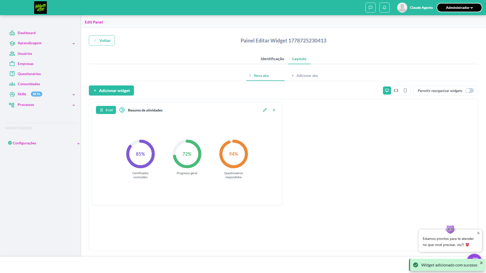

- 📸 **Screenshot (step-02-2-Clicar-no-cone-Editar-l-pis-do-widget)** — [`step-02-2-Clicar-no-cone-Editar-l-pis-do-widget-f5e604a825dc68e2bb64f304356844dc6e83d4b4.png`](artifacts/projects-widgets-tests-fea-e77bb-figurações-ao-Editar-Widget-chromium/step-02-2-Clicar-no-cone-Editar-l-pis-do-widget-f5e604a825dc68e2bb64f304356844dc6e83d4b4.png)

  

- 📸 **Screenshot (step-03-3-Verificar-campos-do-drawer-switches-input-seletor-de-cone)** — [`step-03-3-Verificar-campos-do-drawer-switches-input-seletor-de-cone-cb0068b2f4198337e942b6c4eae8386af9e7fe67.png`](artifacts/projects-widgets-tests-fea-e77bb-figurações-ao-Editar-Widget-chromium/step-03-3-Verificar-campos-do-drawer-switches-input-seletor-de-cone-cb0068b2f4198337e942b6c4eae8386af9e7fe67.png)

  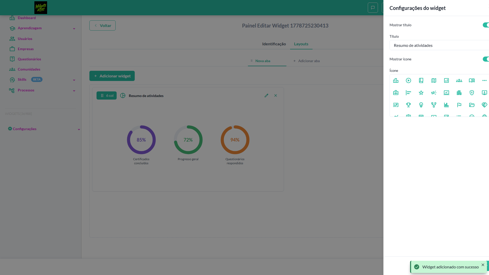

- 📸 **Screenshot (step-04-4-Verificar-bot-es-Cancelar-e-Salvar-no-rodap-do-drawer)** — [`step-04-4-Verificar-bot-es-Cancelar-e-Salvar-no-rodap-do-drawer-29eb281fdfc2a2418e1254ec18c76553a2bf48ed.png`](artifacts/projects-widgets-tests-fea-e77bb-figurações-ao-Editar-Widget-chromium/step-04-4-Verificar-bot-es-Cancelar-e-Salvar-no-rodap-do-drawer-29eb281fdfc2a2418e1254ec18c76553a2bf48ed.png)

  

- 📸 **Screenshot (screenshot)** — [`test-finished-1.png`](artifacts/projects-widgets-tests-fea-e77bb-figurações-ao-Editar-Widget-chromium/test-finished-1.png)

  

- 🎬 [Vídeo da execução (video.webm)](artifacts/projects-widgets-tests-fea-e77bb-figurações-ao-Editar-Widget-chromium/video.webm)

- 🎬 [Vídeo da execução (video-1.webm)](artifacts/projects-widgets-tests-fea-e77bb-figurações-ao-Editar-Widget-chromium/video-1.webm)

- 📦 **Trace** — [`trace.zip`](artifacts/projects-widgets-tests-fea-e77bb-figurações-ao-Editar-Widget-chromium/trace.zip)

  ```bash
  npx playwright show-trace outputs/widgets/reports/editar-excluir-widgets_20260513-232140/artifacts/projects-widgets-tests-fea-e77bb-figurações-ao-Editar-Widget-chromium/trace.zip
  ```

- 🎥 **Vídeo** — [`video.webm`](artifacts/projects-widgets-tests-fea-e77bb-figurações-ao-Editar-Widget-chromium/video.webm)

- 🎥 **Vídeo** — [`video-1.webm`](artifacts/projects-widgets-tests-fea-e77bb-figurações-ao-Editar-Widget-chromium/video-1.webm)


---

### ✅ Aprovado · TC5 · Excluir widget pelo ícone 'x' · 🔴 Crítico

<a id="excluir-widget-pelo-icone-x"></a>_Arquivo:_ `excluir-widget-icone-x.spec.ts` · _Duração:_ 20.99s · _Browser:_ chromium

**Sumário (objetivo do caso):** Validar exclusão do widget (R10 RN87).

**Pré-condições:**

```
Ambiente Stage configurado Funcionalidade 'Gestão de Painéis' habilitada no contrato Feature flag 'habilitar_paineis_do_usuario' ativa Usuário logado como Admin Painel em edição com aba contendo widget 'Conteúdos em andamento'
```

**Passos do caso (XML/TestLink + execução Playwright):**

_Cada linha reproduz um passo do XML; a coluna **Status** traz o resultado da execução (do step Allure correspondente). Linhas com "Pré-condição" são da execução automatizada (login, navegação inicial) — não fazem parte do roteiro do XML._

| # | Ação do passo | Resultado esperado | Status | Notas | Duração |
|---|---|---|:---:|---|---:|
| — | _Pré-condição:_ Pré-condição: painel com widget alvo na aba Layouts | — | ✅ | — | 11.16s |
| 1 | Acessar a aba 'Layouts' do painel em edição | Layout é exibido com o widget | ✅ | — | 0.16s |
| 2 | Clicar no ícone 'Excluir' (x) do widget 'Conteúdos em andamento' | Widget é removido do layout | ✅ | — | 5.00s |
| 3 | Clicar no botão 'Salvar layout' | Layout é persistido sem o widget excluído | ✅ | — | 2.62s |

**Evidências:**

📁 _Pasta:_ [`artifacts/projects-widgets-tests-fea-b5e37-xcluir-widget-pelo-ícone-x--chromium/`](artifacts/projects-widgets-tests-fea-b5e37-xcluir-widget-pelo-ícone-x--chromium/)

- 📸 **Screenshot (step-01-Pr--condi-o-painel-com-widget-alvo-na-aba-Layouts)** — [`step-01-Pr--condi-o-painel-com-widget-alvo-na-aba-Layouts-d2d37ae5bd262ec2307c4f7a914150c74befe2f2.png`](artifacts/projects-widgets-tests-fea-b5e37-xcluir-widget-pelo-ícone-x--chromium/step-01-Pr--condi-o-painel-com-widget-alvo-na-aba-Layouts-d2d37ae5bd262ec2307c4f7a914150c74befe2f2.png)

  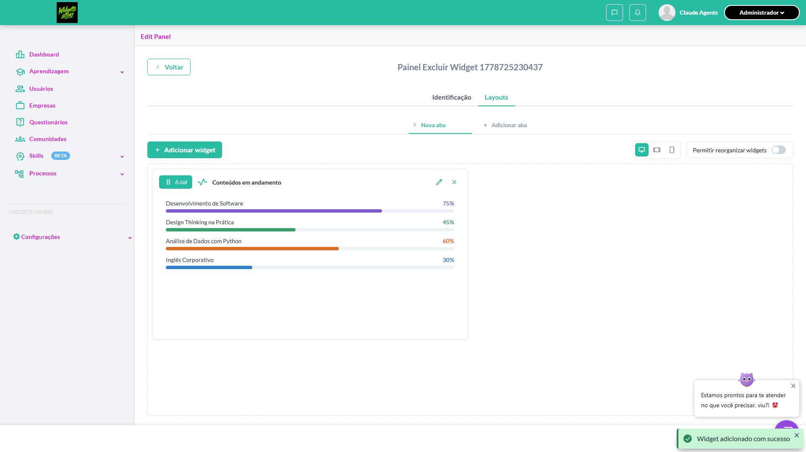

- 📸 **Screenshot (step-02-1-Clicar-no-cone-Excluir-x-do-widget)** — [`step-02-1-Clicar-no-cone-Excluir-x-do-widget-6b6da535b441eaf09c36b79d34a037f103dfc6fe.png`](artifacts/projects-widgets-tests-fea-b5e37-xcluir-widget-pelo-ícone-x--chromium/step-02-1-Clicar-no-cone-Excluir-x-do-widget-6b6da535b441eaf09c36b79d34a037f103dfc6fe.png)

  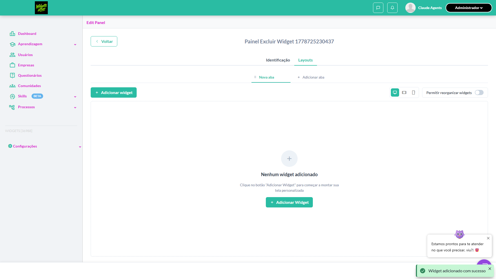

- 📸 **Screenshot (step-03-2-Clicar-em-Salvar-Layout-para-persistir)** — [`step-03-2-Clicar-em-Salvar-Layout-para-persistir-8f7ebdd71263807df46e07caacf64f65089cece1.png`](artifacts/projects-widgets-tests-fea-b5e37-xcluir-widget-pelo-ícone-x--chromium/step-03-2-Clicar-em-Salvar-Layout-para-persistir-8f7ebdd71263807df46e07caacf64f65089cece1.png)

  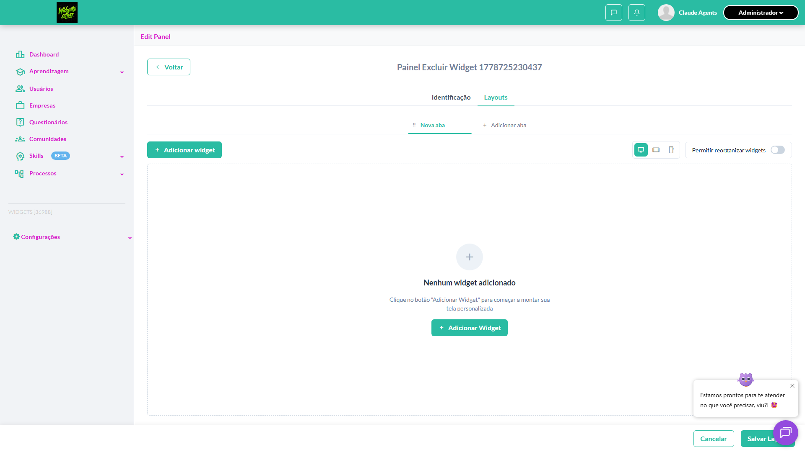

- 📸 **Screenshot (step-04-3-Recarregar-layout-e-validar-persist-ncia-da-remo-o)** — [`step-04-3-Recarregar-layout-e-validar-persist-ncia-da-remo-o-277284cd08fd81427a281627d05bd71bd6907a07.png`](artifacts/projects-widgets-tests-fea-b5e37-xcluir-widget-pelo-ícone-x--chromium/step-04-3-Recarregar-layout-e-validar-persist-ncia-da-remo-o-277284cd08fd81427a281627d05bd71bd6907a07.png)

  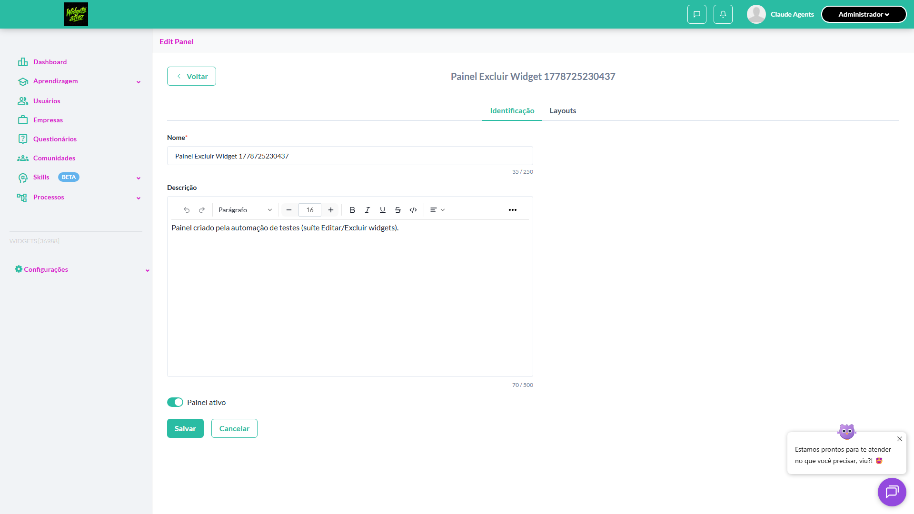

- 📸 **Screenshot (screenshot)** — [`test-finished-1.png`](artifacts/projects-widgets-tests-fea-b5e37-xcluir-widget-pelo-ícone-x--chromium/test-finished-1.png)

  

- 🎬 [Vídeo da execução (video.webm)](artifacts/projects-widgets-tests-fea-b5e37-xcluir-widget-pelo-ícone-x--chromium/video.webm)

- 🎬 [Vídeo da execução (video-1.webm)](artifacts/projects-widgets-tests-fea-b5e37-xcluir-widget-pelo-ícone-x--chromium/video-1.webm)

- 📦 **Trace** — [`trace.zip`](artifacts/projects-widgets-tests-fea-b5e37-xcluir-widget-pelo-ícone-x--chromium/trace.zip)

  ```bash
  npx playwright show-trace outputs/widgets/reports/editar-excluir-widgets_20260513-232140/artifacts/projects-widgets-tests-fea-b5e37-xcluir-widget-pelo-ícone-x--chromium/trace.zip
  ```

- 🎥 **Vídeo** — [`video.webm`](artifacts/projects-widgets-tests-fea-b5e37-xcluir-widget-pelo-ícone-x--chromium/video.webm)

- 🎥 **Vídeo** — [`video-1.webm`](artifacts/projects-widgets-tests-fea-b5e37-xcluir-widget-pelo-ícone-x--chromium/video-1.webm)


---

### ✅ Aprovado · TC4 · Limite de 255 caracteres no campo 'Título' do drawer · ⚪ Menor

<a id="limite-de-255-caracteres-no-campo-titulo-do-drawer"></a>_Arquivo:_ `limite-titulo-drawer-widget.spec.ts` · _Duração:_ 18.00s · _Browser:_ chromium

**Sumário (objetivo do caso):** Validar limitação do campo Título.

**Pré-condições:**

```
Ambiente Stage configurado Funcionalidade 'Gestão de Painéis' habilitada no contrato Feature flag 'habilitar_paineis_do_usuario' ativa Usuário logado como Admin Drawer 'Configurações do widget' aberto para um widget
```

**Passos do caso (XML/TestLink + execução Playwright):**

_Cada linha reproduz um passo do XML; a coluna **Status** traz o resultado da execução (do step Allure correspondente). Linhas com "Pré-condição" são da execução automatizada (login, navegação inicial) — não fazem parte do roteiro do XML._

| # | Ação do passo | Resultado esperado | Status | Notas | Duração |
|---|---|---|:---:|---|---:|
| — | _Pré-condição:_ Pré-condição: painel com widget + drawer aberto | — | ✅ | — | 10.75s |
| — | _Pré-condição:_ 2. Preencher com 256 caracteres — campo trunca em 255 | — | ✅ | — | 0.26s |
| — | _Pré-condição:_ 3. Fechar drawer com Cancelar | — | ✅ | — | 4.85s |
| 1 | Preencher o campo 'Título' com 256 caracteres | Campo aceita no máximo 255 caracteres ou exibe mensagem de limite excedido | ✅ | — | 0.12s |

**Evidências:**

📁 _Pasta:_ [`artifacts/projects-widgets-tests-fea-0668f-s-no-campo-Título-do-drawer-chromium/`](artifacts/projects-widgets-tests-fea-0668f-s-no-campo-Título-do-drawer-chromium/)

- 📸 **Screenshot (step-01-Pr--condi-o-painel-com-widget-drawer-aberto)** — [`step-01-Pr--condi-o-painel-com-widget-drawer-aberto-36f139818ea8e3183615508af4b41d14f31b6bbf.png`](artifacts/projects-widgets-tests-fea-0668f-s-no-campo-Título-do-drawer-chromium/step-01-Pr--condi-o-painel-com-widget-drawer-aberto-36f139818ea8e3183615508af4b41d14f31b6bbf.png)

  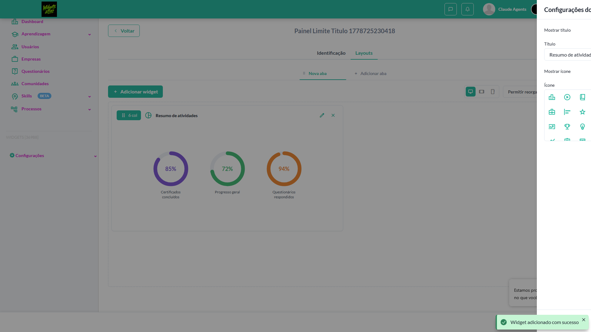

- 📸 **Screenshot (step-02-1-Verificar-atributo-maxlength-255-no-input-T-tulo)** — [`step-02-1-Verificar-atributo-maxlength-255-no-input-T-tulo-745d1085899c54c2772f5a472d821e272c0afd24.png`](artifacts/projects-widgets-tests-fea-0668f-s-no-campo-Título-do-drawer-chromium/step-02-1-Verificar-atributo-maxlength-255-no-input-T-tulo-745d1085899c54c2772f5a472d821e272c0afd24.png)

  

- 📸 **Screenshot (step-03-2-Preencher-com-256-caracteres-campo-trunca-em-255)** — [`step-03-2-Preencher-com-256-caracteres-campo-trunca-em-255-21e85a32d4a207bc6520f109be8fe9a3130d7103.png`](artifacts/projects-widgets-tests-fea-0668f-s-no-campo-Título-do-drawer-chromium/step-03-2-Preencher-com-256-caracteres-campo-trunca-em-255-21e85a32d4a207bc6520f109be8fe9a3130d7103.png)

  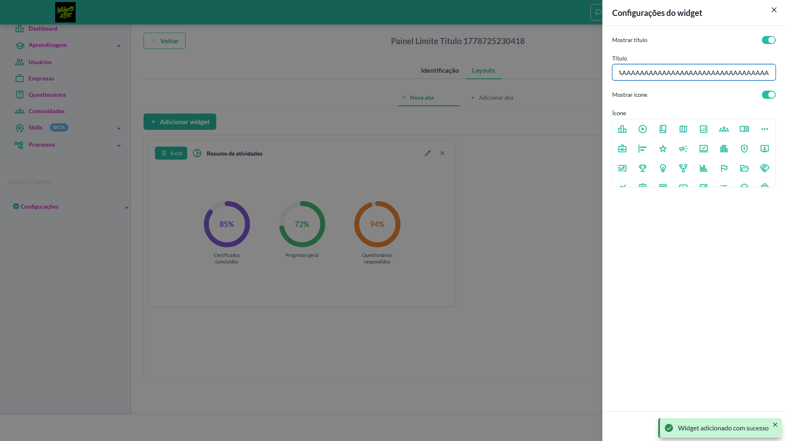

- 📸 **Screenshot (step-04-3-Fechar-drawer-com-Cancelar)** — [`step-04-3-Fechar-drawer-com-Cancelar-85f64647a105f738db92cffab5323f8666761880.png`](artifacts/projects-widgets-tests-fea-0668f-s-no-campo-Título-do-drawer-chromium/step-04-3-Fechar-drawer-com-Cancelar-85f64647a105f738db92cffab5323f8666761880.png)

  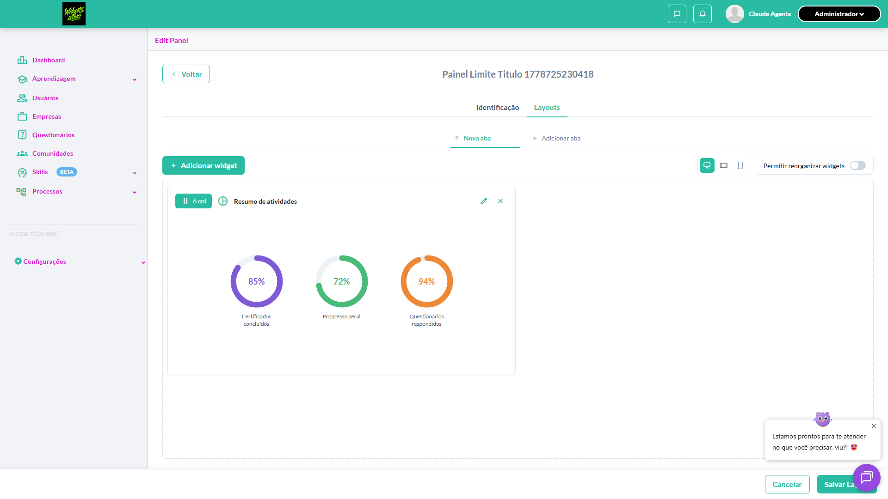

- 📸 **Screenshot (screenshot)** — [`test-finished-1.png`](artifacts/projects-widgets-tests-fea-0668f-s-no-campo-Título-do-drawer-chromium/test-finished-1.png)

  

- 🎬 [Vídeo da execução (video.webm)](artifacts/projects-widgets-tests-fea-0668f-s-no-campo-Título-do-drawer-chromium/video.webm)

- 🎬 [Vídeo da execução (video-1.webm)](artifacts/projects-widgets-tests-fea-0668f-s-no-campo-Título-do-drawer-chromium/video-1.webm)

- 📦 **Trace** — [`trace.zip`](artifacts/projects-widgets-tests-fea-0668f-s-no-campo-Título-do-drawer-chromium/trace.zip)

  ```bash
  npx playwright show-trace outputs/widgets/reports/editar-excluir-widgets_20260513-232140/artifacts/projects-widgets-tests-fea-0668f-s-no-campo-Título-do-drawer-chromium/trace.zip
  ```

- 🎥 **Vídeo** — [`video.webm`](artifacts/projects-widgets-tests-fea-0668f-s-no-campo-Título-do-drawer-chromium/video.webm)

- 🎥 **Vídeo** — [`video-1.webm`](artifacts/projects-widgets-tests-fea-0668f-s-no-campo-Título-do-drawer-chromium/video-1.webm)


---

### ✅ Aprovado · TC2 · Salvar alterações no drawer de configurações do widget · 🔴 Crítico

<a id="salvar-alteracoes-no-drawer-de-configuracoes-do-widget"></a>_Arquivo:_ `salvar-alteracoes-drawer-widget.spec.ts` · _Duração:_ 17.32s · _Browser:_ chromium

**Sumário (objetivo do caso):** Validar persistência das configurações (R10 RN86).

**Pré-condições:**

```
Ambiente Stage configurado Funcionalidade 'Gestão de Painéis' habilitada no contrato Feature flag 'habilitar_paineis_do_usuario' ativa Usuário logado como Admin Drawer 'Configurações do widget' aberto para o widget 'Resumo das atividades'
```

**Passos do caso (XML/TestLink + execução Playwright):**

_Cada linha reproduz um passo do XML; a coluna **Status** traz o resultado da execução (do step Allure correspondente). Linhas com "Pré-condição" são da execução automatizada (login, navegação inicial) — não fazem parte do roteiro do XML._

| # | Ação do passo | Resultado esperado | Status | Notas | Duração |
|---|---|---|:---:|---|---:|
| — | _Pré-condição:_ Pré-condição: painel com widget alvo + drawer de edição aberto | — | ✅ | — | 9.78s |
| 1 | Ativar o switch 'Mostrar título' | Switch fica ligado | ✅ | — | 0.13s |
| 2 | Preencher o campo 'Título' com 'Resumo Personalizado' | Campo aceita o valor | ✅ | — | 0.15s |
| 3 | Ativar o switch 'Mostrar ícone' | Switch fica ligado | ✅ | — | 0.12s |
| 4 | Selecionar um ícone no componente 'Ícone' | Ícone é selecionado | ✅ | — | 0.14s |
| 5 | Clicar no botão 'Salvar' do drawer | Drawer é fechado e toast exibida: "Configurações salvas com sucesso" | ✅ | — | 4.89s |
| 6 | Verificar o widget no layout | Widget exibe título 'Resumo Personalizado' e o ícone selecionado | ✅ | — | 0.13s |

**Evidências:**

📁 _Pasta:_ [`artifacts/projects-widgets-tests-fea-f0582--de-configurações-do-widget-chromium/`](artifacts/projects-widgets-tests-fea-f0582--de-configurações-do-widget-chromium/)

- 📸 **Screenshot (step-01-Pr--condi-o-painel-com-widget-alvo-drawer-de-edi-o-aberto)** — [`step-01-Pr--condi-o-painel-com-widget-alvo-drawer-de-edi-o-aberto-4bc86b33b420f03ffcfbe2da6d8c8a3734450eab.png`](artifacts/projects-widgets-tests-fea-f0582--de-configurações-do-widget-chromium/step-01-Pr--condi-o-painel-com-widget-alvo-drawer-de-edi-o-aberto-4bc86b33b420f03ffcfbe2da6d8c8a3734450eab.png)

  

- 📸 **Screenshot (step-02-1-Ativar-o-switch-Mostrar-t-tulo)** — [`step-02-1-Ativar-o-switch-Mostrar-t-tulo-9240bbffc1aea00d5aca66c7549aaf3ca303d957.png`](artifacts/projects-widgets-tests-fea-f0582--de-configurações-do-widget-chromium/step-02-1-Ativar-o-switch-Mostrar-t-tulo-9240bbffc1aea00d5aca66c7549aaf3ca303d957.png)

  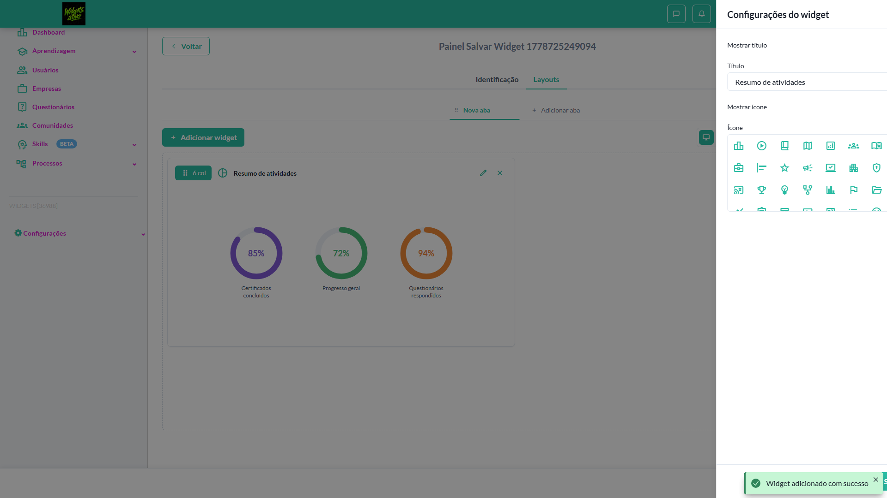

- 📸 **Screenshot (step-03-2-Preencher-o-campo-T-tulo-com-o-valor-customizado)** — [`step-03-2-Preencher-o-campo-T-tulo-com-o-valor-customizado-da7c0734ef3f8d07f58bed864bf7580748028336.png`](artifacts/projects-widgets-tests-fea-f0582--de-configurações-do-widget-chromium/step-03-2-Preencher-o-campo-T-tulo-com-o-valor-customizado-da7c0734ef3f8d07f58bed864bf7580748028336.png)

  

- 📸 **Screenshot (step-04-3-Ativar-o-switch-Mostrar-cone)** — [`step-04-3-Ativar-o-switch-Mostrar-cone-ee770c65823deda3e76f1aa8c4fd57c90c58a055.png`](artifacts/projects-widgets-tests-fea-f0582--de-configurações-do-widget-chromium/step-04-3-Ativar-o-switch-Mostrar-cone-ee770c65823deda3e76f1aa8c4fd57c90c58a055.png)

  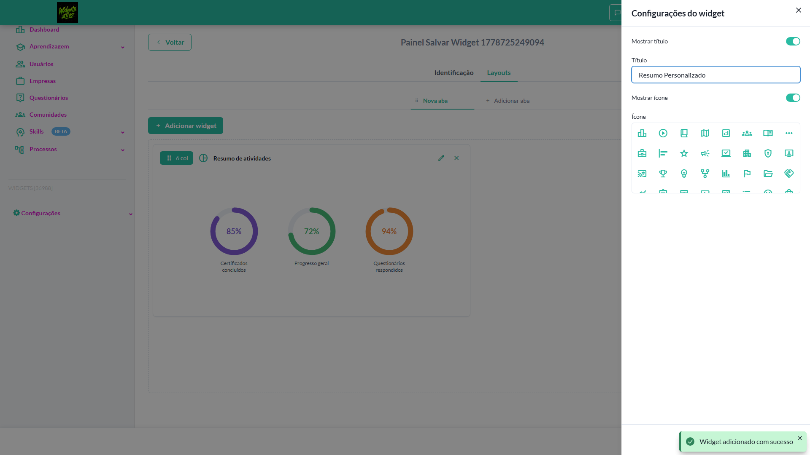

- 📸 **Screenshot (step-05-4-Selecionar-um-cone-no-grid)** — [`step-05-4-Selecionar-um-cone-no-grid-4112bbc78ee333490115f8c00de235176b8154e8.png`](artifacts/projects-widgets-tests-fea-f0582--de-configurações-do-widget-chromium/step-05-4-Selecionar-um-cone-no-grid-4112bbc78ee333490115f8c00de235176b8154e8.png)

  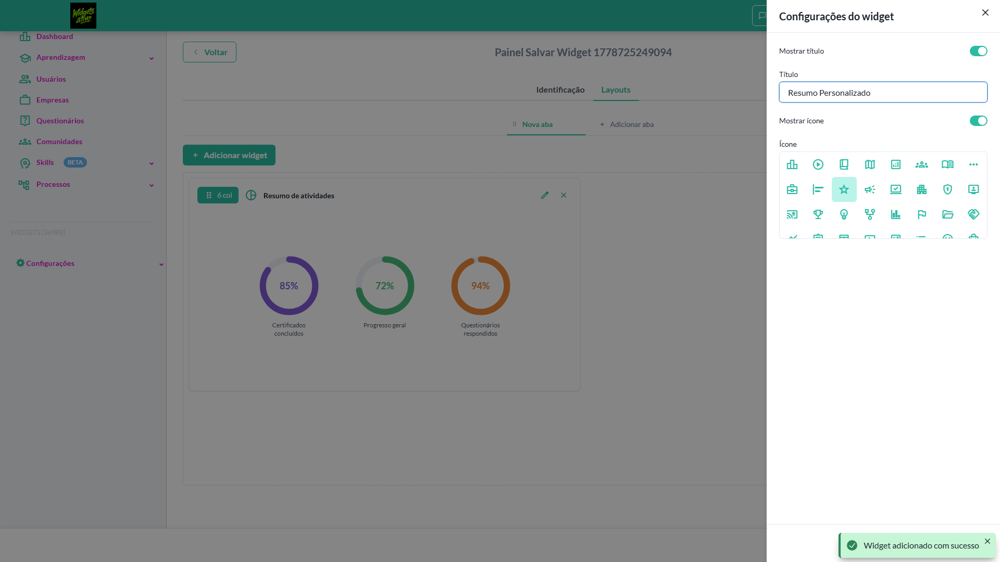

- 📸 **Screenshot (step-06-5-Clicar-em-Salvar-e-validar-toast-de-sucesso)** — [`step-06-5-Clicar-em-Salvar-e-validar-toast-de-sucesso-118520a37ffe9955447771c4b6d6fa8bc18101f3.png`](artifacts/projects-widgets-tests-fea-f0582--de-configurações-do-widget-chromium/step-06-5-Clicar-em-Salvar-e-validar-toast-de-sucesso-118520a37ffe9955447771c4b6d6fa8bc18101f3.png)

  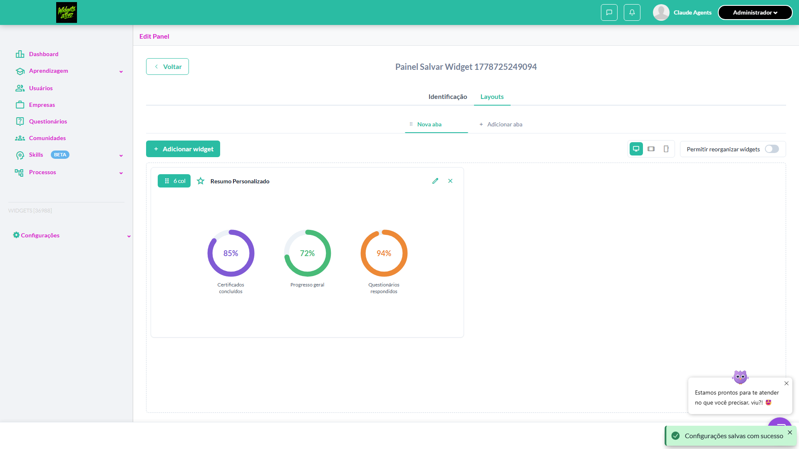

- 📸 **Screenshot (step-07-6-Verificar-widget-no-layout-exibindo-o-novo-t-tulo)** — [`step-07-6-Verificar-widget-no-layout-exibindo-o-novo-t-tulo-94603a425f77d3f73b3325723db4cfacec08a5b8.png`](artifacts/projects-widgets-tests-fea-f0582--de-configurações-do-widget-chromium/step-07-6-Verificar-widget-no-layout-exibindo-o-novo-t-tulo-94603a425f77d3f73b3325723db4cfacec08a5b8.png)

  

- 📸 **Screenshot (screenshot)** — [`test-finished-1.png`](artifacts/projects-widgets-tests-fea-f0582--de-configurações-do-widget-chromium/test-finished-1.png)

  

- 🎬 [Vídeo da execução (video.webm)](artifacts/projects-widgets-tests-fea-f0582--de-configurações-do-widget-chromium/video.webm)

- 🎬 [Vídeo da execução (video-1.webm)](artifacts/projects-widgets-tests-fea-f0582--de-configurações-do-widget-chromium/video-1.webm)

- 📦 **Trace** — [`trace.zip`](artifacts/projects-widgets-tests-fea-f0582--de-configurações-do-widget-chromium/trace.zip)

  ```bash
  npx playwright show-trace outputs/widgets/reports/editar-excluir-widgets_20260513-232140/artifacts/projects-widgets-tests-fea-f0582--de-configurações-do-widget-chromium/trace.zip
  ```

- 🎥 **Vídeo** — [`video.webm`](artifacts/projects-widgets-tests-fea-f0582--de-configurações-do-widget-chromium/video.webm)

- 🎥 **Vídeo** — [`video-1.webm`](artifacts/projects-widgets-tests-fea-f0582--de-configurações-do-widget-chromium/video-1.webm)


---

### ✅ Aprovado · TC6 · Switches 'Mostrar título' e 'Mostrar ícone' desligados · 🟡 Normal

<a id="switches-mostrar-titulo-e-mostrar-icone-desligados"></a>_Arquivo:_ `switches-titulo-icone-desligados.spec.ts` · _Duração:_ 17.47s · _Browser:_ chromium

**Sumário (objetivo do caso):** Validar comportamento quando switches estão desligados.

**Pré-condições:**

```
Ambiente Stage configurado Funcionalidade 'Gestão de Painéis' habilitada no contrato Feature flag 'habilitar_paineis_do_usuario' ativa Usuário logado como Admin Drawer 'Configurações do widget' aberto
```

**Passos do caso (XML/TestLink + execução Playwright):**

_Cada linha reproduz um passo do XML; a coluna **Status** traz o resultado da execução (do step Allure correspondente). Linhas com "Pré-condição" são da execução automatizada (login, navegação inicial) — não fazem parte do roteiro do XML._

| # | Ação do passo | Resultado esperado | Status | Notas | Duração |
|---|---|---|:---:|---|---:|
| — | _Pré-condição:_ Pré-condição: painel com widget + drawer aberto | — | ✅ | — | 9.70s |
| 1 | Desativar o switch 'Mostrar título' | Campo 'Título' fica desabilitado | ✅ | — | 0.56s |
| 2 | Desativar o switch 'Mostrar ícone' | Campo 'Ícone' fica desabilitado | ✅ | — | 0.20s |
| 3 | Clicar no botão 'Salvar' do drawer | Drawer é fechado e toast exibida: "Configurações salvas com sucesso" | ✅ | — | 4.93s |
| 4 | Verificar o widget no layout | Widget é exibido sem título e sem ícone | ✅ | — | 0.10s |

**Evidências:**

📁 _Pasta:_ [`artifacts/projects-widgets-tests-fea-d9e3d--e-Mostrar-ícone-desligados-chromium/`](artifacts/projects-widgets-tests-fea-d9e3d--e-Mostrar-ícone-desligados-chromium/)

- 📸 **Screenshot (step-01-Pr--condi-o-painel-com-widget-drawer-aberto)** — [`step-01-Pr--condi-o-painel-com-widget-drawer-aberto-cfcda7633d73de3f25542384ad5a2fd5273532ec.png`](artifacts/projects-widgets-tests-fea-d9e3d--e-Mostrar-ícone-desligados-chromium/step-01-Pr--condi-o-painel-com-widget-drawer-aberto-cfcda7633d73de3f25542384ad5a2fd5273532ec.png)

  

- 📸 **Screenshot (step-02-1-Desativar-switch-Mostrar-t-tulo)** — [`step-02-1-Desativar-switch-Mostrar-t-tulo-23db4227f76d6e697b7478612a4f2c2f1289a937.png`](artifacts/projects-widgets-tests-fea-d9e3d--e-Mostrar-ícone-desligados-chromium/step-02-1-Desativar-switch-Mostrar-t-tulo-23db4227f76d6e697b7478612a4f2c2f1289a937.png)

  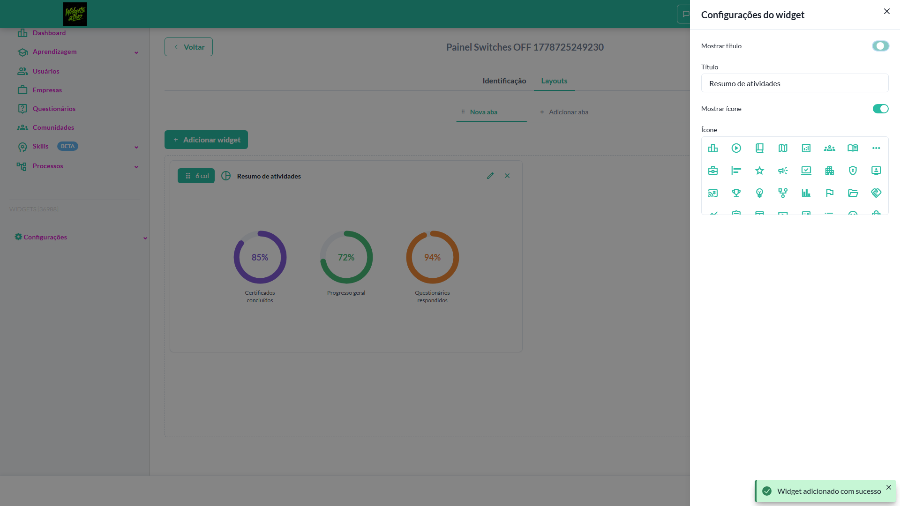

- 📸 **Screenshot (step-03-2-Desativar-switch-Mostrar-cone)** — [`step-03-2-Desativar-switch-Mostrar-cone-c4437ff11dcbdf73667dc3a4df64b29e5c0bf039.png`](artifacts/projects-widgets-tests-fea-d9e3d--e-Mostrar-ícone-desligados-chromium/step-03-2-Desativar-switch-Mostrar-cone-c4437ff11dcbdf73667dc3a4df64b29e5c0bf039.png)

  

- 📸 **Screenshot (step-04-3-Clicar-em-Salvar-e-validar-toast)** — [`step-04-3-Clicar-em-Salvar-e-validar-toast-0cbeef21020970289d1dc63f3237266d5e813bc0.png`](artifacts/projects-widgets-tests-fea-d9e3d--e-Mostrar-ícone-desligados-chromium/step-04-3-Clicar-em-Salvar-e-validar-toast-0cbeef21020970289d1dc63f3237266d5e813bc0.png)

  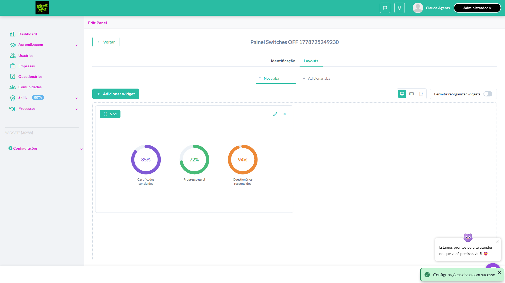

- 📸 **Screenshot (step-05-4-Widget-no-grid-sem-t-tulo-e-sem-cone)** — [`step-05-4-Widget-no-grid-sem-t-tulo-e-sem-cone-bbb2ab1df8e2103863b702b0d0119840ca95bdf9.png`](artifacts/projects-widgets-tests-fea-d9e3d--e-Mostrar-ícone-desligados-chromium/step-05-4-Widget-no-grid-sem-t-tulo-e-sem-cone-bbb2ab1df8e2103863b702b0d0119840ca95bdf9.png)

  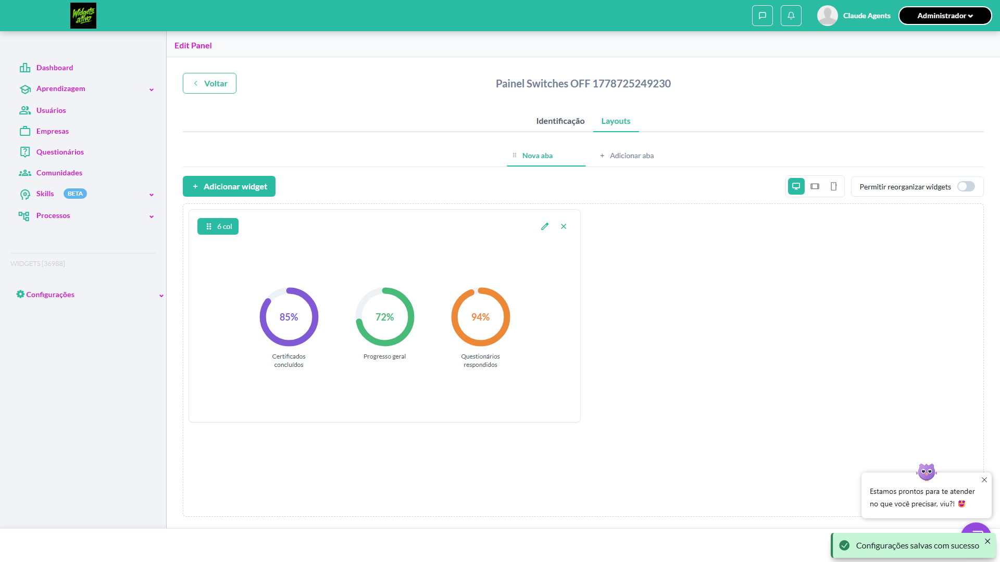

- 📸 **Screenshot (screenshot)** — [`test-finished-1.png`](artifacts/projects-widgets-tests-fea-d9e3d--e-Mostrar-ícone-desligados-chromium/test-finished-1.png)

  

- 🎬 [Vídeo da execução (video.webm)](artifacts/projects-widgets-tests-fea-d9e3d--e-Mostrar-ícone-desligados-chromium/video.webm)

- 🎬 [Vídeo da execução (video-1.webm)](artifacts/projects-widgets-tests-fea-d9e3d--e-Mostrar-ícone-desligados-chromium/video-1.webm)

- 📦 **Trace** — [`trace.zip`](artifacts/projects-widgets-tests-fea-d9e3d--e-Mostrar-ícone-desligados-chromium/trace.zip)

  ```bash
  npx playwright show-trace outputs/widgets/reports/editar-excluir-widgets_20260513-232140/artifacts/projects-widgets-tests-fea-d9e3d--e-Mostrar-ícone-desligados-chromium/trace.zip
  ```

- 🎥 **Vídeo** — [`video.webm`](artifacts/projects-widgets-tests-fea-d9e3d--e-Mostrar-ícone-desligados-chromium/video.webm)

- 🎥 **Vídeo** — [`video-1.webm`](artifacts/projects-widgets-tests-fea-d9e3d--e-Mostrar-ícone-desligados-chromium/video-1.webm)


---
