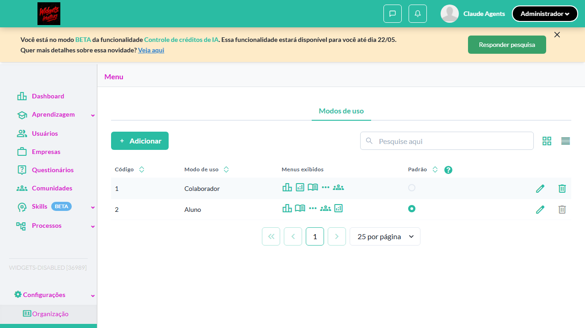
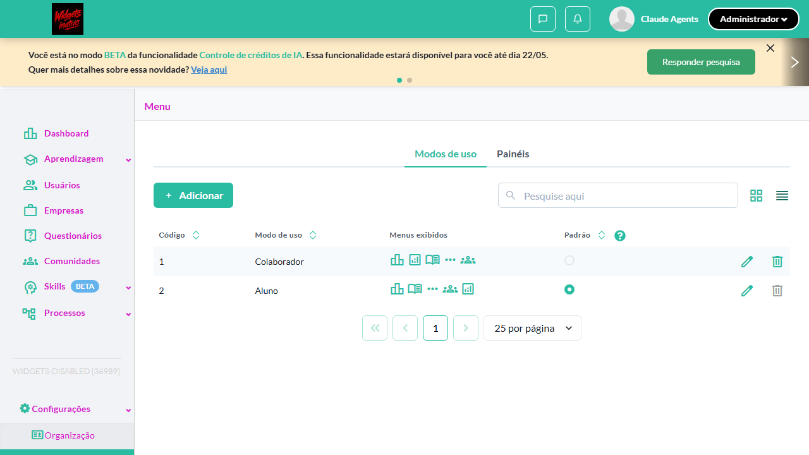
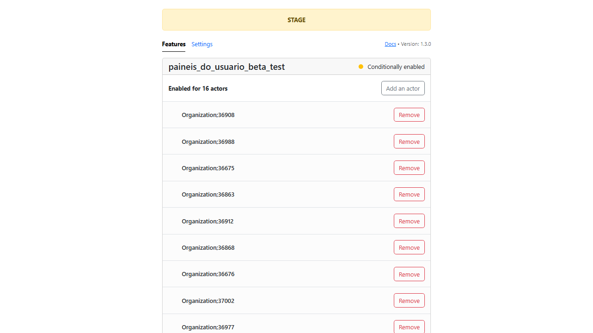

# Casos de teste — Widgets

[← Voltar ao dashboard](index.md)

Lista detalhada por testsuite. Cada caso traz: o que era esperado pelo XML, quais steps foram executados, evidências (screenshots/trace), texto pronto pra registro de bug e — quando houver falha — uma explicação em PT-BR do motivo.

## Feature flag

_5 caso(s) — 2 aprovado(s), 0 falha(s), 3 ignorado(s)_

### ✅ Aprovado · TC1 · Feature flag desabilitada - aba 'Painéis' não é exibida para Admin · 🔴 Crítico

<a id="feature-flag-desabilitada-aba-paineis-nao-e-exibida-para-admin"></a>_Arquivo:_ `flag-desabilitada-aba-paineis-nao-exibida.spec.ts` · _Duração:_ 6.68s · _Browser:_ chromium

**Sumário (objetivo do caso):** Validar ocultação total do módulo (R1).

**Pré-condições:**

```
Ambiente Stage configurado Funcionalidade 'Gestão de Painéis' habilitada no contrato Feature flag 'habilitar_paineis_do_usuario' DESABILITADA Usuário logado como Admin
```

**Passos do caso (XML/TestLink + execução Playwright):**

_Cada linha reproduz um passo do XML; a coluna **Status** traz o resultado da execução (do step Allure correspondente). Linhas com "Pré-condição" são da execução automatizada (login, navegação inicial) — não fazem parte do roteiro do XML._

| # | Ação do passo | Resultado esperado | Status | Notas | Duração |
|---|---|---|:---:|---|---:|
| — | _Pré-condição:_ 2. Verificar que a aba 'Painéis' NÃO aparece (R1 — ocultação total) | — | ✅ | — | 0.07s |
| 1 | Acessar Menu > Modos de uso | Tela é exibida sem a aba 'Painéis' | ✅ | — | 4.67s |

**Evidências:**

📁 _Pasta:_ [`artifacts/projects-widgets-tests-fea-8f70e-is-não-é-exibida-para-Admin-chromium/`](artifacts/projects-widgets-tests-fea-8f70e-is-não-é-exibida-para-Admin-chromium/)

- 📸 **Screenshot (step-01-1-Acessar-use_modes-no-env-com-flag-desabilitada)** — [`step-01-1-Acessar-use-modes-no-env-com-flag-desabilitada-f807c2c3b0b26e88c74cffea4e82b0b46f931d9c.png`](artifacts/projects-widgets-tests-fea-8f70e-is-não-é-exibida-para-Admin-chromium/step-01-1-Acessar-use-modes-no-env-com-flag-desabilitada-f807c2c3b0b26e88c74cffea4e82b0b46f931d9c.png)

  

- 📸 **Screenshot (step-02-2-Verificar-que-a-aba-Pain-is-N-O-aparece-R1-oculta-o-total)** — [`step-02-2-Verificar-que-a-aba-Pain-is-N-O-aparece-R1-oculta-o-total-8582bf0b986f1ee5527b04737d98f435bd380e4f.png`](artifacts/projects-widgets-tests-fea-8f70e-is-não-é-exibida-para-Admin-chromium/step-02-2-Verificar-que-a-aba-Pain-is-N-O-aparece-R1-oculta-o-total-8582bf0b986f1ee5527b04737d98f435bd380e4f.png)

  

- 📸 **Screenshot (screenshot)** — [`test-finished-1.png`](artifacts/projects-widgets-tests-fea-8f70e-is-não-é-exibida-para-Admin-chromium/test-finished-1.png)

  

- 🎬 [Vídeo da execução (video.webm)](artifacts/projects-widgets-tests-fea-8f70e-is-não-é-exibida-para-Admin-chromium/video.webm)

- 🎬 [Vídeo da execução (video-1.webm)](artifacts/projects-widgets-tests-fea-8f70e-is-não-é-exibida-para-Admin-chromium/video-1.webm)

- 📦 **Trace** — [`trace.zip`](artifacts/projects-widgets-tests-fea-8f70e-is-não-é-exibida-para-Admin-chromium/trace.zip)

  ```bash
  npx playwright show-trace outputs/widgets/reports/feature-flag_20260515-095908/artifacts/projects-widgets-tests-fea-8f70e-is-não-é-exibida-para-Admin-chromium/trace.zip
  ```

- 🎥 **Vídeo** — [`video.webm`](artifacts/projects-widgets-tests-fea-8f70e-is-não-é-exibida-para-Admin-chromium/video.webm)

- 🎥 **Vídeo** — [`video-1.webm`](artifacts/projects-widgets-tests-fea-8f70e-is-não-é-exibida-para-Admin-chromium/video-1.webm)


---

### ⊘ Ignorado · TC2 · Feature flag habilitada com painéis criados - menu do aluno acessível · 🔴 Crítico

<a id="feature-flag-habilitada-com-paineis-criados-menu-do-aluno-acessivel"></a>_Arquivo:_ `flag-habilitada-menu-aluno-acessivel.spec.ts` · _Duração:_ 0.66s · _Browser:_ chromium

> **⊘ Por que foi ignorado:** Marcado para revisão (test.fixme): seed ausente: requer credencial de perfil Aluno. Ver dashboard-visao-do-aluno/_README.md.

**Sumário (objetivo do caso):** Validar acesso do aluno com flag ativa.

**Pré-condições:**

```
Ambiente Stage configurado Flag ativa Menu de modo de uso configurado com painel ativo Usuário logado como Aluno
```

**Passos do caso (XML/TestLink + execução Playwright):**

_Cada linha reproduz um passo do XML; a coluna **Status** traz o resultado da execução (do step Allure correspondente). Linhas com "Pré-condição" são da execução automatizada (login, navegação inicial) — não fazem parte do roteiro do XML._

| # | Ação do passo | Resultado esperado | Status | Notas | Duração |
|---|---|---|:---:|---|---:|
| 1 | Acessar o menu configurado com painel | Painel é exibido normalmente para o aluno | ⊘ | Step não executado — Marcado para revisão (test.fixme): seed ausente: requer credencial de perfil Aluno. Ver dashboard-visao-do-aluno/_README.md. | — |

**Evidências:**

📁 _Pasta:_ [`artifacts/projects-widgets-tests-fea-59c47-s---menu-do-aluno-acessível-chromium/`](artifacts/projects-widgets-tests-fea-59c47-s---menu-do-aluno-acessível-chromium/)

- 📸 **Screenshot (screenshot)** — [`test-finished-1.png`](artifacts/projects-widgets-tests-fea-59c47-s---menu-do-aluno-acessível-chromium/test-finished-1.png)

  

- 🎬 [Vídeo da execução (video.webm)](artifacts/projects-widgets-tests-fea-59c47-s---menu-do-aluno-acessível-chromium/video.webm)

- 🎬 [Vídeo da execução (video-1.webm)](artifacts/projects-widgets-tests-fea-59c47-s---menu-do-aluno-acessível-chromium/video-1.webm)

- 📦 **Trace** — [`trace.zip`](artifacts/projects-widgets-tests-fea-59c47-s---menu-do-aluno-acessível-chromium/trace.zip)

  ```bash
  npx playwright show-trace outputs/widgets/reports/feature-flag_20260515-095908/artifacts/projects-widgets-tests-fea-59c47-s---menu-do-aluno-acessível-chromium/trace.zip
  ```

- 🎥 **Vídeo** — [`video.webm`](artifacts/projects-widgets-tests-fea-59c47-s---menu-do-aluno-acessível-chromium/video.webm)

- 🎥 **Vídeo** — [`video-1.webm`](artifacts/projects-widgets-tests-fea-59c47-s---menu-do-aluno-acessível-chromium/video-1.webm)

#### ⏳ Pendente — execução automatizada não realizada

- **Severidade do caso (XML):** Crítico
- **Motivo do skip / fixme:** seed ausente: requer credencial de perfil Aluno. Ver dashboard-visao-do-aluno/_README.md.

**Roteiro do XML (para validação manual):**
1. Pré: Ambiente Stage configurado Flag ativa Menu de modo de uso configurado com painel ativo Usuário logado como Aluno
1. 1. Acessar o menu configurado com painel

> Esse caso não bloqueia a build, mas precisa de validação manual ou ajuste no agente.


---

### ⊘ Ignorado · TC4 · Menu marcado como 'Padrão' com flag desabilitada · 🟡 Normal

<a id="menu-marcado-como-padrao-com-flag-desabilitada"></a>_Arquivo:_ `menu-padrao-com-flag-desabilitada.spec.ts` · _Duração:_ 0.66s · _Browser:_ chromium

> **⊘ Por que foi ignorado:** Marcado para revisão (test.fixme): seed ausente: requer menu marcado como 'Padrão' + transição flag on→off no mesmo env. Mesmo bloqueio de transicao-flag-on-off-com-paineis.spec.ts.

**Sumário (objetivo do caso):** Validar comportamento de menu padrão quando flag fica off.

**Pré-condições:**

```
Ambiente Stage configurado Flag inicialmente ATIVA Menu vinculado ao painel marcado como 'Padrão' Usuário logado como Aluno
```

**Passos do caso (XML/TestLink + execução Playwright):**

_Cada linha reproduz um passo do XML; a coluna **Status** traz o resultado da execução (do step Allure correspondente). Linhas com "Pré-condição" são da execução automatizada (login, navegação inicial) — não fazem parte do roteiro do XML._

| # | Ação do passo | Resultado esperado | Status | Notas | Duração |
|---|---|---|:---:|---|---:|
| 1 | Desabilitar a feature flag para a organização | Flag é desabilitada | ⊘ | Step não executado — Marcado para revisão (test.fixme): seed ausente: requer menu marcado como 'Padrão' + transição flag on→off no mesmo env. Mesmo bloqueio de transicao-flag-on-off-com-paineis.spec.ts. | — |
| 2 | Acessar a aplicação como aluno | Sistema NÃO usa o menu de painel como página padrão; aluno é redirecionado para o dashboard legado ou outro modo de uso disponível | ⊘ | Step não executado — Marcado para revisão (test.fixme): seed ausente: requer menu marcado como 'Padrão' + transição flag on→off no mesmo env. Mesmo bloqueio de transicao-flag-on-off-com-paineis.spec.ts. | — |

**Evidências:**

📁 _Pasta:_ [`artifacts/projects-widgets-tests-fea-2653f-adrão-com-flag-desabilitada-chromium/`](artifacts/projects-widgets-tests-fea-2653f-adrão-com-flag-desabilitada-chromium/)

- 📸 **Screenshot (screenshot)** — [`test-finished-1.png`](artifacts/projects-widgets-tests-fea-2653f-adrão-com-flag-desabilitada-chromium/test-finished-1.png)

  

- 🎬 [Vídeo da execução (video.webm)](artifacts/projects-widgets-tests-fea-2653f-adrão-com-flag-desabilitada-chromium/video.webm)

- 🎬 [Vídeo da execução (video-1.webm)](artifacts/projects-widgets-tests-fea-2653f-adrão-com-flag-desabilitada-chromium/video-1.webm)

- 📦 **Trace** — [`trace.zip`](artifacts/projects-widgets-tests-fea-2653f-adrão-com-flag-desabilitada-chromium/trace.zip)

  ```bash
  npx playwright show-trace outputs/widgets/reports/feature-flag_20260515-095908/artifacts/projects-widgets-tests-fea-2653f-adrão-com-flag-desabilitada-chromium/trace.zip
  ```

- 🎥 **Vídeo** — [`video.webm`](artifacts/projects-widgets-tests-fea-2653f-adrão-com-flag-desabilitada-chromium/video.webm)

- 🎥 **Vídeo** — [`video-1.webm`](artifacts/projects-widgets-tests-fea-2653f-adrão-com-flag-desabilitada-chromium/video-1.webm)

#### ⏳ Pendente — execução automatizada não realizada

- **Severidade do caso (XML):** Normal
- **Motivo do skip / fixme:** seed ausente: requer menu marcado como 'Padrão' + transição flag on→off no mesmo env. Mesmo bloqueio de transicao-flag-on-off-com-paineis.spec.ts.

**Roteiro do XML (para validação manual):**
1. Pré: Ambiente Stage configurado Flag inicialmente ATIVA Menu vinculado ao painel marcado como 'Padrão' Usuário logado como Aluno
1. 1. Desabilitar a feature flag para a organização
1. 2. Acessar a aplicação como aluno

> Esse caso não bloqueia a build, mas precisa de validação manual ou ajuste no agente.


---

### ✅ Aprovado · TC5 · Transição: flag desabilitada -> habilitada · 🟡 Normal

<a id="transicao-flag-desabilitada-habilitada"></a>_Arquivo:_ `transicao-flag-off-on.spec.ts` · _Duração:_ 46.04s · _Browser:_ chromium

**Sumário (objetivo do caso):** Validar reativação do módulo.

**Pré-condições:**

```
Ambiente Stage configurado Flag inicialmente DESABILITADA Usuário logado como Admin
```

**Passos do caso (XML/TestLink + execução Playwright):**

_Cada linha reproduz um passo do XML; a coluna **Status** traz o resultado da execução (do step Allure correspondente). Linhas com "Pré-condição" são da execução automatizada (login, navegação inicial) — não fazem parte do roteiro do XML._

| # | Ação do passo | Resultado esperado | Status | Notas | Duração |
|---|---|---|:---:|---|---:|
| 1 | Acessar Menu > Modos de uso (flag desabilitada) | Aba 'Painéis' NÃO é exibida | ✅ | — | 4.63s |
| 2 | Habilitar a feature flag para a organização | Flag é habilitada | ✅ | — | 3.39s |
| 3 | Recarregar a tela de Modos de uso | Aba 'Painéis' passa a ser exibida | ✅ | — | 36.08s |
| 4 | Acessar o menu como aluno | Painel é exibido | ✅ | — | — |

**Evidências:**

📁 _Pasta:_ [`artifacts/projects-widgets-tests-fea-08ad4-g-desabilitada---habilitada-chromium/`](artifacts/projects-widgets-tests-fea-08ad4-g-desabilitada---habilitada-chromium/)

- 📸 **Screenshot (step-01-1-Estado-inicial-flag-off-aba-Pain-is-oculta)** — [`step-01-1-Estado-inicial-flag-off-aba-Pain-is-oculta-425c71cdc9b7a302515dc23f218e8711a27feb7c.png`](artifacts/projects-widgets-tests-fea-08ad4-g-desabilitada---habilitada-chromium/step-01-1-Estado-inicial-flag-off-aba-Pain-is-oculta-425c71cdc9b7a302515dc23f218e8711a27feb7c.png)

  

- 📸 **Screenshot (step-02-2-Habilitar-flag-para-a-org-via-Flipper-Admin)** — [`step-02-2-Habilitar-flag-para-a-org-via-Flipper-Admin-03917f5a78f8cc442ee29ada67c5188450a06886.png`](artifacts/projects-widgets-tests-fea-08ad4-g-desabilitada---habilitada-chromium/step-02-2-Habilitar-flag-para-a-org-via-Flipper-Admin-03917f5a78f8cc442ee29ada67c5188450a06886.png)

  

- 📸 **Screenshot (step-03-3-Recarregar-use_modes-aba-Pain-is-aparece)** — [`step-03-3-Recarregar-use-modes-aba-Pain-is-aparece-1f5a536d11668c7fd3f03e912a06a7d5d089eccb.png`](artifacts/projects-widgets-tests-fea-08ad4-g-desabilitada---habilitada-chromium/step-03-3-Recarregar-use-modes-aba-Pain-is-aparece-1f5a536d11668c7fd3f03e912a06a7d5d089eccb.png)

  

- 📸 **Screenshot (screenshot)** — [`test-finished-1.png`](artifacts/projects-widgets-tests-fea-08ad4-g-desabilitada---habilitada-chromium/test-finished-1.png)

  

- 📸 **Screenshot (screenshot)** — [`test-finished-2.png`](artifacts/projects-widgets-tests-fea-08ad4-g-desabilitada---habilitada-chromium/test-finished-2.png)

  

- 📸 **Screenshot (screenshot)** — [`test-finished-3.png`](artifacts/projects-widgets-tests-fea-08ad4-g-desabilitada---habilitada-chromium/test-finished-3.png)

  

- 🎬 [Vídeo da execução (video.webm)](artifacts/projects-widgets-tests-fea-08ad4-g-desabilitada---habilitada-chromium/video.webm)

- 🎬 [Vídeo da execução (video-1.webm)](artifacts/projects-widgets-tests-fea-08ad4-g-desabilitada---habilitada-chromium/video-1.webm)

- 📦 **Trace** — [`trace.zip`](artifacts/projects-widgets-tests-fea-08ad4-g-desabilitada---habilitada-chromium/trace.zip)

  ```bash
  npx playwright show-trace outputs/widgets/reports/feature-flag_20260515-095908/artifacts/projects-widgets-tests-fea-08ad4-g-desabilitada---habilitada-chromium/trace.zip
  ```

- 🎥 **Vídeo** — [`video.webm`](artifacts/projects-widgets-tests-fea-08ad4-g-desabilitada---habilitada-chromium/video.webm)

- 🎥 **Vídeo** — [`video-1.webm`](artifacts/projects-widgets-tests-fea-08ad4-g-desabilitada---habilitada-chromium/video-1.webm)


---

### ⊘ Ignorado · TC3 · Transição: flag habilitada -> desabilitada com painéis aplicados · 🔴 Crítico

<a id="transicao-flag-habilitada-desabilitada-com-paineis-aplicados"></a>_Arquivo:_ `transicao-flag-on-off-com-paineis.spec.ts` · _Duração:_ 0.53s · _Browser:_ chromium

> **⊘ Por que foi ignorado:** Marcado para revisão (test.fixme): seed ausente: requer painel + menu vinculado pré-criados na org 36989 (staging-widgets-disabled) E perfil Aluno via ProfileSwitcher. Toggle de flag em si já está destravado por testar-feature-flag-twygo — pendência é APENAS o seed de dados persistente.

**Sumário (objetivo do caso):** Validar ocultação do menu com widgets na visão do aluno.

**Pré-condições:**

```
Ambiente Stage configurado Flag inicialmente ATIVA Menu de modo de uso configurado com painel Usuário logado como Aluno
```

**Passos do caso (XML/TestLink + execução Playwright):**

_Cada linha reproduz um passo do XML; a coluna **Status** traz o resultado da execução (do step Allure correspondente). Linhas com "Pré-condição" são da execução automatizada (login, navegação inicial) — não fazem parte do roteiro do XML._

| # | Ação do passo | Resultado esperado | Status | Notas | Duração |
|---|---|---|:---:|---|---:|
| 1 | Acessar o menu como aluno (flag ativa) | Painel é exibido | ⊘ | Step não executado — Marcado para revisão (test.fixme): seed ausente: requer painel + menu vinculado pré-criados na org 36989 (staging-widgets-disabled) E perfil Aluno via ProfileSwitcher. Toggle de flag em si já está destravado por testar-feature-flag-twygo — pendência é APENAS o seed de dados persistente. | — |
| 2 | Desabilitar a feature flag para a organização | Flag é desabilitada | ⊘ | Step não executado — Marcado para revisão (test.fixme): seed ausente: requer painel + menu vinculado pré-criados na org 36989 (staging-widgets-disabled) E perfil Aluno via ProfileSwitcher. Toggle de flag em si já está destravado por testar-feature-flag-twygo — pendência é APENAS o seed de dados persistente. | — |
| 3 | Recarregar a aplicação como aluno | Menu vinculado ao painel é ocultado da visão do aluno | ⊘ | Step não executado — Marcado para revisão (test.fixme): seed ausente: requer painel + menu vinculado pré-criados na org 36989 (staging-widgets-disabled) E perfil Aluno via ProfileSwitcher. Toggle de flag em si já está destravado por testar-feature-flag-twygo — pendência é APENAS o seed de dados persistente. | — |

**Evidências:**

📁 _Pasta:_ [`artifacts/projects-widgets-tests-fea-47f22-itada-com-painéis-aplicados-chromium/`](artifacts/projects-widgets-tests-fea-47f22-itada-com-painéis-aplicados-chromium/)

- 📸 **Screenshot (screenshot)** — [`test-finished-1.png`](artifacts/projects-widgets-tests-fea-47f22-itada-com-painéis-aplicados-chromium/test-finished-1.png)

  

- 🎬 [Vídeo da execução (video.webm)](artifacts/projects-widgets-tests-fea-47f22-itada-com-painéis-aplicados-chromium/video.webm)

- 🎬 [Vídeo da execução (video-1.webm)](artifacts/projects-widgets-tests-fea-47f22-itada-com-painéis-aplicados-chromium/video-1.webm)

- 📦 **Trace** — [`trace.zip`](artifacts/projects-widgets-tests-fea-47f22-itada-com-painéis-aplicados-chromium/trace.zip)

  ```bash
  npx playwright show-trace outputs/widgets/reports/feature-flag_20260515-095908/artifacts/projects-widgets-tests-fea-47f22-itada-com-painéis-aplicados-chromium/trace.zip
  ```

- 🎥 **Vídeo** — [`video.webm`](artifacts/projects-widgets-tests-fea-47f22-itada-com-painéis-aplicados-chromium/video.webm)

- 🎥 **Vídeo** — [`video-1.webm`](artifacts/projects-widgets-tests-fea-47f22-itada-com-painéis-aplicados-chromium/video-1.webm)

#### ⏳ Pendente — execução automatizada não realizada

- **Severidade do caso (XML):** Crítico
- **Motivo do skip / fixme:** seed ausente: requer painel + menu vinculado pré-criados na org 36989 (staging-widgets-disabled) E perfil Aluno via ProfileSwitcher. Toggle de flag em si já está destravado por testar-feature-flag-twygo — pendência é APENAS o seed de dados persistente.

**Roteiro do XML (para validação manual):**
1. Pré: Ambiente Stage configurado Flag inicialmente ATIVA Menu de modo de uso configurado com painel Usuário logado como Aluno
1. 1. Acessar o menu como aluno (flag ativa)
1. 2. Desabilitar a feature flag para a organização
1. 3. Recarregar a aplicação como aluno

> Esse caso não bloqueia a build, mas precisa de validação manual ou ajuste no agente.


---
