# Casos de teste — Widgets

[← Voltar ao dashboard](index.md)

Lista detalhada por testsuite. Cada caso traz: o que era esperado pelo XML, quais steps foram executados, evidências (screenshots/trace), texto pronto pra registro de bug e — quando houver falha — uma explicação em PT-BR do motivo.

## Feature flag

_5 caso(s) — 4 aprovado(s), 0 falha(s), 1 ignorado(s)_

### ✅ Aprovado · TC1 · Feature flag desabilitada - aba 'Painéis' não é exibida para Admin · 🔴 Crítico

<a id="feature-flag-desabilitada-aba-paineis-nao-e-exibida-para-admin"></a>_Arquivo:_ `flag-desabilitada-aba-paineis-nao-exibida.spec.ts` · _Duração:_ 46.08s · _Browser:_ chromium

**Sumário (objetivo do caso):** Validar ocultação total do módulo (R1).

**Pré-condições:**

```
Ambiente Stage configurado Funcionalidade 'Gestão de Painéis' habilitada no contrato Feature flag 'habilitar_paineis_do_usuario' DESABILITADA Usuário logado como Admin
```

**Passos do caso (XML/TestLink + execução Playwright):**

_Cada linha reproduz um passo do XML; a coluna **Status** traz o resultado da execução (do step Allure correspondente). Linhas com "Pré-condição" são da execução automatizada (login, navegação inicial) — não fazem parte do roteiro do XML._

| # | Ação do passo | Resultado esperado | Status | Notas | Duração |
|---|---|---|:---:|---|---:|
| — | _Pré-condição:_ 1+2. Acessar /use_modes + aba Painéis ausente | — | ✅ | — | 44.20s |
| 1 | Acessar Menu > Modos de uso | Tela é exibida sem a aba 'Painéis' | ✅ | — | — |

**Evidências:**

📁 _Pasta:_ [`artifacts/projects-widgets-tests-fea-8f70e-is-não-é-exibida-para-Admin-chromium/`](artifacts/projects-widgets-tests-fea-8f70e-is-não-é-exibida-para-Admin-chromium/)

- 📸 **Screenshot (screenshot)** — [`test-finished-1.png`](artifacts/projects-widgets-tests-fea-8f70e-is-não-é-exibida-para-Admin-chromium/test-finished-1.png)

  

- 📸 **Screenshot (step-01-1-2-Acessar-use_modes-aba-Pain-is-ausente)** — [`step-01-1-2-Acessar-use-modes-aba-Pain-is-ausente-37c024a31110f7bedcd78a2ce633b2791185bbde.png`](artifacts/projects-widgets-tests-fea-8f70e-is-não-é-exibida-para-Admin-chromium/step-01-1-2-Acessar-use-modes-aba-Pain-is-ausente-37c024a31110f7bedcd78a2ce633b2791185bbde.png)

  

- 📸 **Screenshot (screenshot)** — [`test-finished-2.png`](artifacts/projects-widgets-tests-fea-8f70e-is-não-é-exibida-para-Admin-chromium/test-finished-2.png)

  

- 📸 **Screenshot (screenshot)** — [`test-finished-3.png`](artifacts/projects-widgets-tests-fea-8f70e-is-não-é-exibida-para-Admin-chromium/test-finished-3.png)

  

- 🎬 [Vídeo da execução (video.webm)](artifacts/projects-widgets-tests-fea-8f70e-is-não-é-exibida-para-Admin-chromium/video.webm)

- 🎬 [Vídeo da execução (video-1.webm)](artifacts/projects-widgets-tests-fea-8f70e-is-não-é-exibida-para-Admin-chromium/video-1.webm)

- 📦 **Trace** — [`trace.zip`](artifacts/projects-widgets-tests-fea-8f70e-is-não-é-exibida-para-Admin-chromium/trace.zip)

  ```bash
  npx playwright show-trace outputs/widgets/reports/feature-flag_20260515-131014/artifacts/projects-widgets-tests-fea-8f70e-is-não-é-exibida-para-Admin-chromium/trace.zip
  ```

- 🎥 **Vídeo** — [`video.webm`](artifacts/projects-widgets-tests-fea-8f70e-is-não-é-exibida-para-Admin-chromium/video.webm)

- 🎥 **Vídeo** — [`video-1.webm`](artifacts/projects-widgets-tests-fea-8f70e-is-não-é-exibida-para-Admin-chromium/video-1.webm)


---

### ✅ Aprovado · TC2 · Feature flag habilitada com painéis criados - menu do aluno acessível · 🔴 Crítico

<a id="feature-flag-habilitada-com-paineis-criados-menu-do-aluno-acessivel"></a>_Arquivo:_ `flag-habilitada-menu-aluno-acessivel.spec.ts` · _Duração:_ 78.41s · _Browser:_ chromium

**Sumário (objetivo do caso):** Validar acesso do aluno com flag ativa.

**Pré-condições:**

```
Ambiente Stage configurado Flag ativa Menu de modo de uso configurado com painel ativo Usuário logado como Aluno
```

**Passos do caso (XML/TestLink + execução Playwright):**

_Cada linha reproduz um passo do XML; a coluna **Status** traz o resultado da execução (do step Allure correspondente). Linhas com "Pré-condição" são da execução automatizada (login, navegação inicial) — não fazem parte do roteiro do XML._

| # | Ação do passo | Resultado esperado | Status | Notas | Duração |
|---|---|---|:---:|---|---:|
| — | _Pré-condição:_ 2. Como Admin: criar painel novo (toggle propagação cache) | — | ✅ | — | 53.40s |
| — | _Pré-condição:_ 3. Descobrir useModeId do Aluno e associar painel ao menu | — | ✅ | — | 13.75s |
| — | _Pré-condição:_ 4. Switch para perfil Aluno | — | ✅ | — | 2.60s |
| — | _Pré-condição:_ 5. Menu Painéis (item criado) acessível na visão Aluno | — | ✅ | — | 0.07s |
| 1 | Acessar o menu configurado com painel | Painel é exibido normalmente para o aluno | ✅ | — | 6.72s |

**Evidências:**

📁 _Pasta:_ [`artifacts/projects-widgets-tests-fea-59c47-s---menu-do-aluno-acessível-chromium/`](artifacts/projects-widgets-tests-fea-59c47-s---menu-do-aluno-acessível-chromium/)

- 📸 **Screenshot (step-01-1-Habilitar-contrato-user_panels-flag-via-Super-Admin-Flippe)** — [`step-01-1-Habilitar-contrato-user-panels-flag-via-Super-Admin-Flippe-fcdf560754ff77d7e9e8ad69c97e790e779dba66.png`](artifacts/projects-widgets-tests-fea-59c47-s---menu-do-aluno-acessível-chromium/step-01-1-Habilitar-contrato-user-panels-flag-via-Super-Admin-Flippe-fcdf560754ff77d7e9e8ad69c97e790e779dba66.png)

  

- 📸 **Screenshot (step-02-2-Como-Admin-criar-painel-novo-toggle-propaga-o-cache)** — [`step-02-2-Como-Admin-criar-painel-novo-toggle-propaga-o-cache-76407945deb014d7b7b5321f18ecfaeb5f36fa97.png`](artifacts/projects-widgets-tests-fea-59c47-s---menu-do-aluno-acessível-chromium/step-02-2-Como-Admin-criar-painel-novo-toggle-propaga-o-cache-76407945deb014d7b7b5321f18ecfaeb5f36fa97.png)

  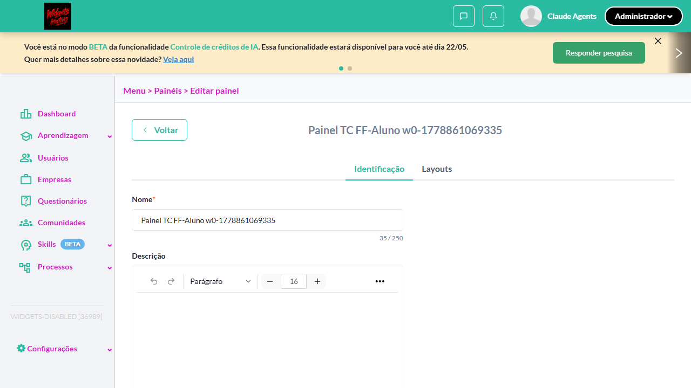

- 📸 **Screenshot (step-03-3-Descobrir-useModeId-do-Aluno-e-associar-painel-ao-menu)** — [`step-03-3-Descobrir-useModeId-do-Aluno-e-associar-painel-ao-menu-2e1482f094053c6d7cf951b47fb285662531a552.png`](artifacts/projects-widgets-tests-fea-59c47-s---menu-do-aluno-acessível-chromium/step-03-3-Descobrir-useModeId-do-Aluno-e-associar-painel-ao-menu-2e1482f094053c6d7cf951b47fb285662531a552.png)

  

- 📸 **Screenshot (step-04-4-Switch-para-perfil-Aluno)** — [`step-04-4-Switch-para-perfil-Aluno-1499c8a2a7a7497d34ee800e65e1161a8b673c7e.png`](artifacts/projects-widgets-tests-fea-59c47-s---menu-do-aluno-acessível-chromium/step-04-4-Switch-para-perfil-Aluno-1499c8a2a7a7497d34ee800e65e1161a8b673c7e.png)

  

- 📸 **Screenshot (step-05-5-Menu-Pain-is-item-criado-acess-vel-na-vis-o-Aluno)** — [`step-05-5-Menu-Pain-is-item-criado-acess-vel-na-vis-o-Aluno-29ffd0855c574c460dfe5169174aa46fe37ca3e3.png`](artifacts/projects-widgets-tests-fea-59c47-s---menu-do-aluno-acessível-chromium/step-05-5-Menu-Pain-is-item-criado-acess-vel-na-vis-o-Aluno-29ffd0855c574c460dfe5169174aa46fe37ca3e3.png)

  

- 📸 **Screenshot (screenshot)** — [`test-finished-1.png`](artifacts/projects-widgets-tests-fea-59c47-s---menu-do-aluno-acessível-chromium/test-finished-1.png)

  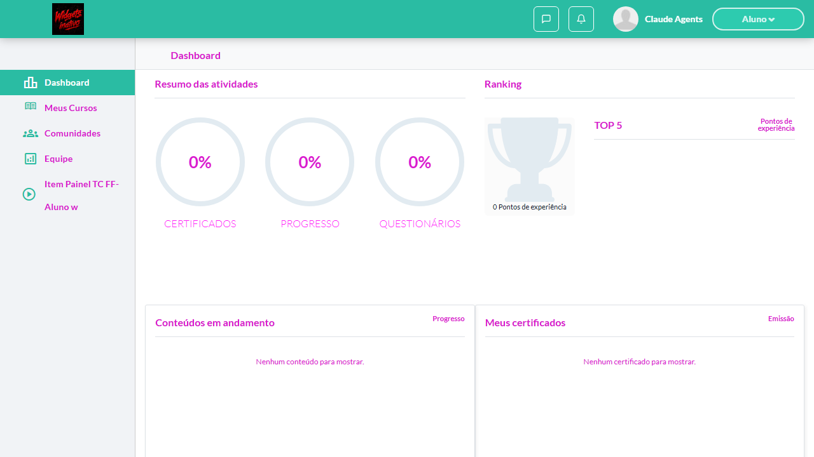

- 📸 **Screenshot (screenshot)** — [`test-finished-2.png`](artifacts/projects-widgets-tests-fea-59c47-s---menu-do-aluno-acessível-chromium/test-finished-2.png)

  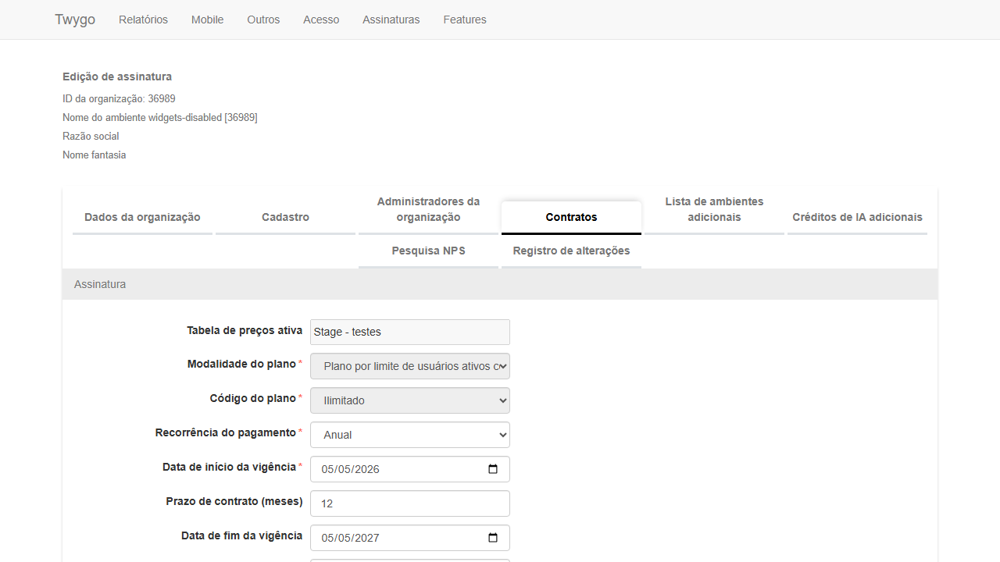

- 📸 **Screenshot (screenshot)** — [`test-finished-3.png`](artifacts/projects-widgets-tests-fea-59c47-s---menu-do-aluno-acessível-chromium/test-finished-3.png)

  

- 📸 **Screenshot (screenshot)** — [`test-finished-4.png`](artifacts/projects-widgets-tests-fea-59c47-s---menu-do-aluno-acessível-chromium/test-finished-4.png)

  

- 📸 **Screenshot (screenshot)** — [`test-finished-5.png`](artifacts/projects-widgets-tests-fea-59c47-s---menu-do-aluno-acessível-chromium/test-finished-5.png)

  

- 📸 **Screenshot (screenshot)** — [`test-finished-6.png`](artifacts/projects-widgets-tests-fea-59c47-s---menu-do-aluno-acessível-chromium/test-finished-6.png)

  

- 🎬 [Vídeo da execução (video.webm)](artifacts/projects-widgets-tests-fea-59c47-s---menu-do-aluno-acessível-chromium/video.webm)

- 🎬 [Vídeo da execução (video-1.webm)](artifacts/projects-widgets-tests-fea-59c47-s---menu-do-aluno-acessível-chromium/video-1.webm)

- 📦 **Trace** — [`trace.zip`](artifacts/projects-widgets-tests-fea-59c47-s---menu-do-aluno-acessível-chromium/trace.zip)

  ```bash
  npx playwright show-trace outputs/widgets/reports/feature-flag_20260515-131014/artifacts/projects-widgets-tests-fea-59c47-s---menu-do-aluno-acessível-chromium/trace.zip
  ```

- 🎥 **Vídeo** — [`video.webm`](artifacts/projects-widgets-tests-fea-59c47-s---menu-do-aluno-acessível-chromium/video.webm)

- 🎥 **Vídeo** — [`video-1.webm`](artifacts/projects-widgets-tests-fea-59c47-s---menu-do-aluno-acessível-chromium/video-1.webm)


---

### ✅ Aprovado · TC4 · Menu marcado como 'Padrão' com flag desabilitada · 🟡 Normal

<a id="menu-marcado-como-padrao-com-flag-desabilitada"></a>_Arquivo:_ `menu-padrao-com-flag-desabilitada.spec.ts` · _Duração:_ 63.79s · _Browser:_ chromium

**Sumário (objetivo do caso):** Validar comportamento de menu padrão quando flag fica off.

**Pré-condições:**

```
Ambiente Stage configurado Flag inicialmente ATIVA Menu vinculado ao painel marcado como 'Padrão' Usuário logado como Aluno
```

**Passos do caso (XML/TestLink + execução Playwright):**

_Cada linha reproduz um passo do XML; a coluna **Status** traz o resultado da execução (do step Allure correspondente). Linhas com "Pré-condição" são da execução automatizada (login, navegação inicial) — não fazem parte do roteiro do XML._

| # | Ação do passo | Resultado esperado | Status | Notas | Duração |
|---|---|---|:---:|---|---:|
| — | _Pré-condição:_ 3. Admin: criar painel + associar ao useMode Aluno | — | ✅ | — | 25.27s |
| — | _Pré-condição:_ 4. Marcar item painel como Página inicial (padrão) do useMode Aluno | — | ✅ | — | 5.11s |
| — | _Pré-condição:_ 5. Switch Admin + desabilitar flag | — | ✅ | — | 6.34s |
| — | _Pré-condição:_ 6. Switch Aluno: app não quebra + redireciona pra rota disponível | — | ✅ | — | 4.29s |
| 1 | Desabilitar a feature flag para a organização | Flag é desabilitada | ✅ | — | 6.72s |
| 2 | Acessar a aplicação como aluno | Sistema NÃO usa o menu de painel como página padrão; aluno é redirecionado para o dashboard legado ou outro modo de uso disponível | ✅ | — | 13.48s |

**Evidências:**

📁 _Pasta:_ [`artifacts/projects-widgets-tests-fea-2653f-adrão-com-flag-desabilitada-chromium/`](artifacts/projects-widgets-tests-fea-2653f-adrão-com-flag-desabilitada-chromium/)

- 📸 **Screenshot (step-01-1-Habilitar-contrato-flag)** — [`step-01-1-Habilitar-contrato-flag-5ea293beab5af2d20cd89e5fbe90a9a8a5670bf4.png`](artifacts/projects-widgets-tests-fea-2653f-adrão-com-flag-desabilitada-chromium/step-01-1-Habilitar-contrato-flag-5ea293beab5af2d20cd89e5fbe90a9a8a5670bf4.png)

  

- 📸 **Screenshot (step-02-2-Descobrir-useModeId-Aluno-limpar-rf-os)** — [`step-02-2-Descobrir-useModeId-Aluno-limpar-rf-os-44558ae90d2597727bdda7fb83139ac5d3911157.png`](artifacts/projects-widgets-tests-fea-2653f-adrão-com-flag-desabilitada-chromium/step-02-2-Descobrir-useModeId-Aluno-limpar-rf-os-44558ae90d2597727bdda7fb83139ac5d3911157.png)

  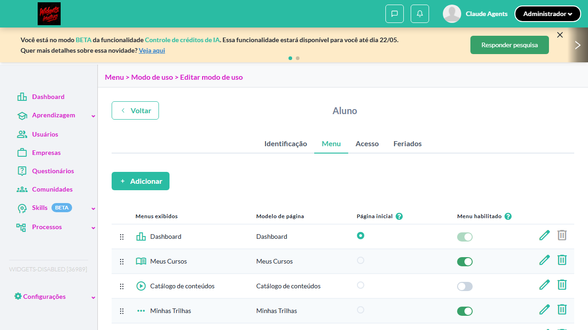

- 📸 **Screenshot (step-03-3-Admin-criar-painel-associar-ao-useMode-Aluno)** — [`step-03-3-Admin-criar-painel-associar-ao-useMode-Aluno-a6870c19a738f57a2f3101822d073510c4dc8418.png`](artifacts/projects-widgets-tests-fea-2653f-adrão-com-flag-desabilitada-chromium/step-03-3-Admin-criar-painel-associar-ao-useMode-Aluno-a6870c19a738f57a2f3101822d073510c4dc8418.png)

  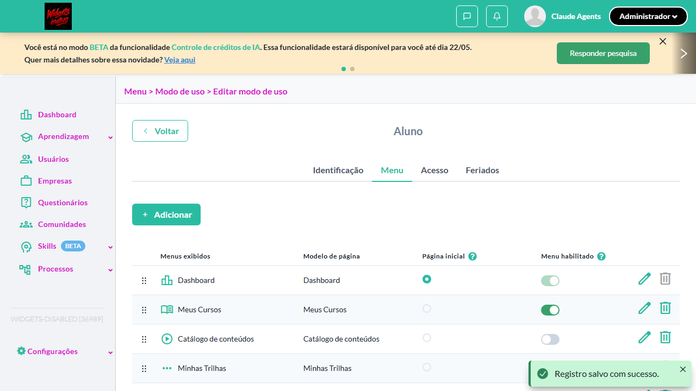

- 📸 **Screenshot (step-04-4-Marcar-item-painel-como-P-gina-inicial-padr-o-do-useMode-A)** — [`step-04-4-Marcar-item-painel-como-P-gina-inicial-padr-o-do-useMode-A-2519d1df803a1ebce78277b06ca9ad87729ddbef.png`](artifacts/projects-widgets-tests-fea-2653f-adrão-com-flag-desabilitada-chromium/step-04-4-Marcar-item-painel-como-P-gina-inicial-padr-o-do-useMode-A-2519d1df803a1ebce78277b06ca9ad87729ddbef.png)

  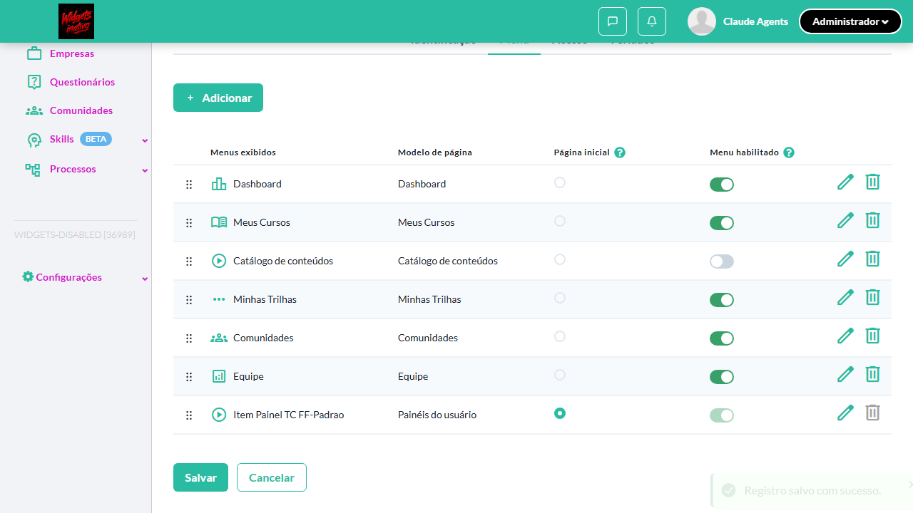

- 📸 **Screenshot (step-05-5-Switch-Admin-desabilitar-flag)** — [`step-05-5-Switch-Admin-desabilitar-flag-aa2c8e5bf2a90a2b5d3d24780cad5ee0fc28c358.png`](artifacts/projects-widgets-tests-fea-2653f-adrão-com-flag-desabilitada-chromium/step-05-5-Switch-Admin-desabilitar-flag-aa2c8e5bf2a90a2b5d3d24780cad5ee0fc28c358.png)

  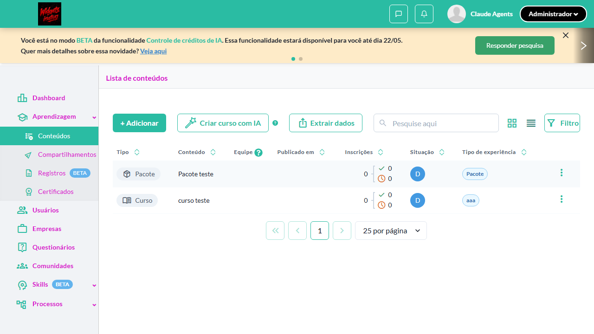

- 📸 **Screenshot (step-06-6-Switch-Aluno-app-n-o-quebra-redireciona-pra-rota-dispon-ve)** — [`step-06-6-Switch-Aluno-app-n-o-quebra-redireciona-pra-rota-dispon-ve-4024425588c7a22969c3f6de0da53a1abb654039.png`](artifacts/projects-widgets-tests-fea-2653f-adrão-com-flag-desabilitada-chromium/step-06-6-Switch-Aluno-app-n-o-quebra-redireciona-pra-rota-dispon-ve-4024425588c7a22969c3f6de0da53a1abb654039.png)

  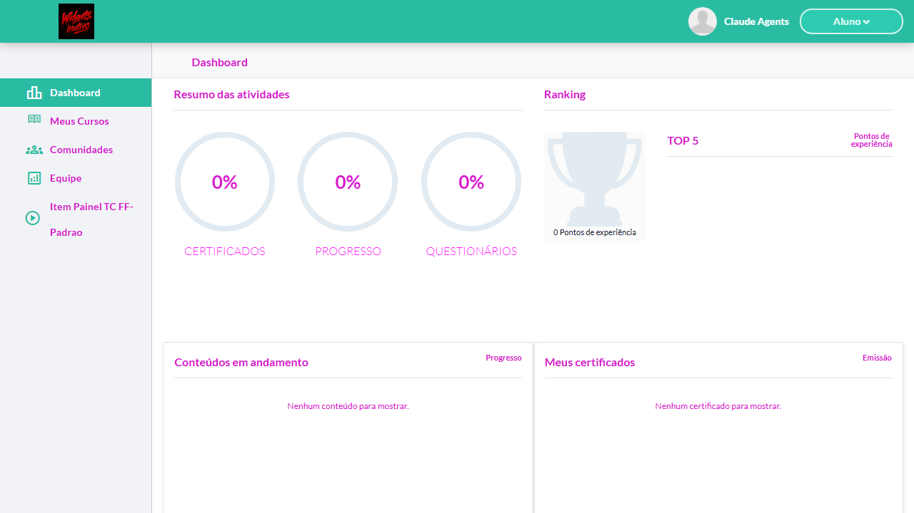

- 📸 **Screenshot (screenshot)** — [`test-finished-1.png`](artifacts/projects-widgets-tests-fea-2653f-adrão-com-flag-desabilitada-chromium/test-finished-1.png)

  

- 📸 **Screenshot (screenshot)** — [`test-finished-2.png`](artifacts/projects-widgets-tests-fea-2653f-adrão-com-flag-desabilitada-chromium/test-finished-2.png)

  

- 📸 **Screenshot (screenshot)** — [`test-finished-3.png`](artifacts/projects-widgets-tests-fea-2653f-adrão-com-flag-desabilitada-chromium/test-finished-3.png)

  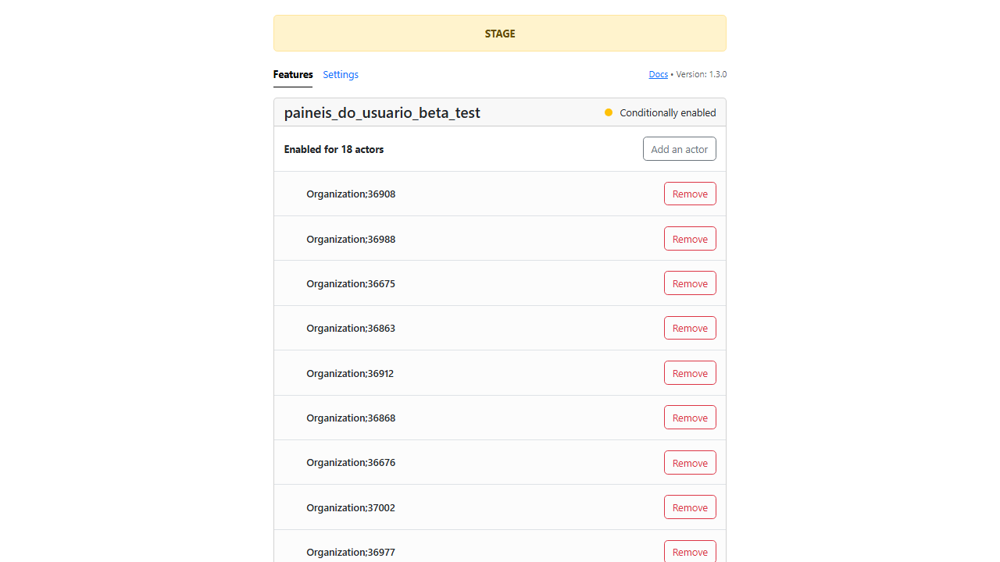

- 📸 **Screenshot (screenshot)** — [`test-finished-4.png`](artifacts/projects-widgets-tests-fea-2653f-adrão-com-flag-desabilitada-chromium/test-finished-4.png)

  

- 📸 **Screenshot (screenshot)** — [`test-finished-5.png`](artifacts/projects-widgets-tests-fea-2653f-adrão-com-flag-desabilitada-chromium/test-finished-5.png)

  

- 📸 **Screenshot (screenshot)** — [`test-finished-6.png`](artifacts/projects-widgets-tests-fea-2653f-adrão-com-flag-desabilitada-chromium/test-finished-6.png)

  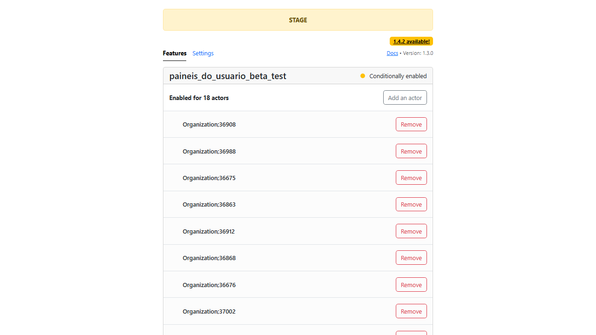

- 📸 **Screenshot (screenshot)** — [`test-finished-8.png`](artifacts/projects-widgets-tests-fea-2653f-adrão-com-flag-desabilitada-chromium/test-finished-8.png)

  

- 📸 **Screenshot (screenshot)** — [`test-finished-7.png`](artifacts/projects-widgets-tests-fea-2653f-adrão-com-flag-desabilitada-chromium/test-finished-7.png)

  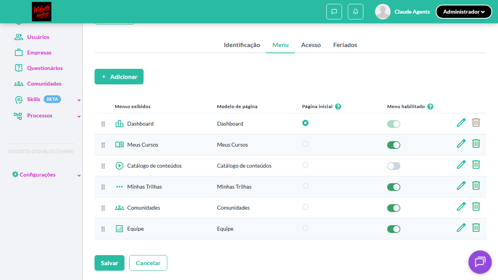

- 🎬 [Vídeo da execução (video.webm)](artifacts/projects-widgets-tests-fea-2653f-adrão-com-flag-desabilitada-chromium/video.webm)

- 🎬 [Vídeo da execução (video-1.webm)](artifacts/projects-widgets-tests-fea-2653f-adrão-com-flag-desabilitada-chromium/video-1.webm)

- 📦 **Trace** — [`trace.zip`](artifacts/projects-widgets-tests-fea-2653f-adrão-com-flag-desabilitada-chromium/trace.zip)

  ```bash
  npx playwright show-trace outputs/widgets/reports/feature-flag_20260515-131014/artifacts/projects-widgets-tests-fea-2653f-adrão-com-flag-desabilitada-chromium/trace.zip
  ```

- 🎥 **Vídeo** — [`video.webm`](artifacts/projects-widgets-tests-fea-2653f-adrão-com-flag-desabilitada-chromium/video.webm)

- 🎥 **Vídeo** — [`video-1.webm`](artifacts/projects-widgets-tests-fea-2653f-adrão-com-flag-desabilitada-chromium/video-1.webm)


---

### ✅ Aprovado · TC5 · Transição: flag desabilitada -> habilitada · 🟡 Normal

<a id="transicao-flag-desabilitada-habilitada"></a>_Arquivo:_ `transicao-flag-off-on.spec.ts` · _Duração:_ 52.17s · _Browser:_ chromium

**Sumário (objetivo do caso):** Validar reativação do módulo.

**Pré-condições:**

```
Ambiente Stage configurado Flag inicialmente DESABILITADA Usuário logado como Admin
```

**Passos do caso (XML/TestLink + execução Playwright):**

_Cada linha reproduz um passo do XML; a coluna **Status** traz o resultado da execução (do step Allure correspondente). Linhas com "Pré-condição" são da execução automatizada (login, navegação inicial) — não fazem parte do roteiro do XML._

| # | Ação do passo | Resultado esperado | Status | Notas | Duração |
|---|---|---|:---:|---|---:|
| — | _Pré-condição:_ 0. Setup: contrato ON (plan), flag OFF (estado inicial do TC) | — | ✅ | — | 6.04s |
| 1 | Acessar Menu > Modos de uso (flag desabilitada) | Aba 'Painéis' NÃO é exibida | ✅ | — | 4.44s |
| 2 | Habilitar a feature flag para a organização | Flag é habilitada | ✅ | — | 3.48s |
| 3 | Recarregar a tela de Modos de uso | Aba 'Painéis' passa a ser exibida | ✅ | — | 36.35s |
| 4 | Acessar o menu como aluno | Painel é exibido | ✅ | — | — |

**Evidências:**

📁 _Pasta:_ [`artifacts/projects-widgets-tests-fea-08ad4-g-desabilitada---habilitada-chromium/`](artifacts/projects-widgets-tests-fea-08ad4-g-desabilitada---habilitada-chromium/)

- 📸 **Screenshot (step-01-0-Setup-contrato-ON-plan-flag-OFF-estado-inicial-do-TC)** — [`step-01-0-Setup-contrato-ON-plan-flag-OFF-estado-inicial-do-TC-fe4493d8e747eaae06430c5c4cd0364a1b7f2fec.png`](artifacts/projects-widgets-tests-fea-08ad4-g-desabilitada---habilitada-chromium/step-01-0-Setup-contrato-ON-plan-flag-OFF-estado-inicial-do-TC-fe4493d8e747eaae06430c5c4cd0364a1b7f2fec.png)

  

- 📸 **Screenshot (step-02-1-Estado-inicial-flag-off-aba-Pain-is-oculta)** — [`step-02-1-Estado-inicial-flag-off-aba-Pain-is-oculta-fad4290a4dfd2deb27255bb68c14a317810946e5.png`](artifacts/projects-widgets-tests-fea-08ad4-g-desabilitada---habilitada-chromium/step-02-1-Estado-inicial-flag-off-aba-Pain-is-oculta-fad4290a4dfd2deb27255bb68c14a317810946e5.png)

  

- 📸 **Screenshot (step-03-2-Habilitar-flag-para-a-org-via-Flipper-Admin)** — [`step-03-2-Habilitar-flag-para-a-org-via-Flipper-Admin-0a8cb5596d9a537ecf0e6fa01a105e442b6b56b2.png`](artifacts/projects-widgets-tests-fea-08ad4-g-desabilitada---habilitada-chromium/step-03-2-Habilitar-flag-para-a-org-via-Flipper-Admin-0a8cb5596d9a537ecf0e6fa01a105e442b6b56b2.png)

  

- 📸 **Screenshot (step-04-3-Recarregar-use_modes-aba-Pain-is-aparece)** — [`step-04-3-Recarregar-use-modes-aba-Pain-is-aparece-b991f164afffece29b6d630216c1e93d79363322.png`](artifacts/projects-widgets-tests-fea-08ad4-g-desabilitada---habilitada-chromium/step-04-3-Recarregar-use-modes-aba-Pain-is-aparece-b991f164afffece29b6d630216c1e93d79363322.png)

  

- 📸 **Screenshot (screenshot)** — [`test-finished-1.png`](artifacts/projects-widgets-tests-fea-08ad4-g-desabilitada---habilitada-chromium/test-finished-1.png)

  

- 📸 **Screenshot (screenshot)** — [`test-finished-3.png`](artifacts/projects-widgets-tests-fea-08ad4-g-desabilitada---habilitada-chromium/test-finished-3.png)

  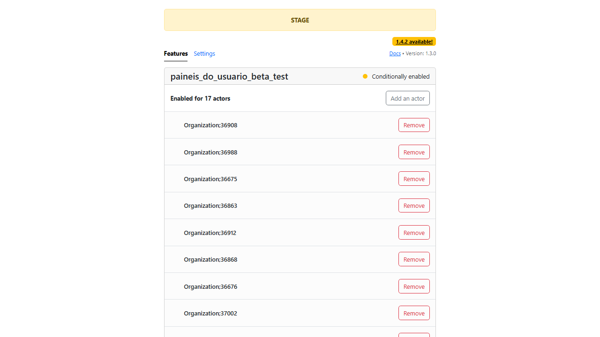

- 📸 **Screenshot (screenshot)** — [`test-finished-2.png`](artifacts/projects-widgets-tests-fea-08ad4-g-desabilitada---habilitada-chromium/test-finished-2.png)

  

- 📸 **Screenshot (screenshot)** — [`test-finished-4.png`](artifacts/projects-widgets-tests-fea-08ad4-g-desabilitada---habilitada-chromium/test-finished-4.png)

  

- 📸 **Screenshot (screenshot)** — [`test-finished-6.png`](artifacts/projects-widgets-tests-fea-08ad4-g-desabilitada---habilitada-chromium/test-finished-6.png)

  

- 📸 **Screenshot (screenshot)** — [`test-finished-5.png`](artifacts/projects-widgets-tests-fea-08ad4-g-desabilitada---habilitada-chromium/test-finished-5.png)

  

- 🎬 [Vídeo da execução (video.webm)](artifacts/projects-widgets-tests-fea-08ad4-g-desabilitada---habilitada-chromium/video.webm)

- 🎬 [Vídeo da execução (video-1.webm)](artifacts/projects-widgets-tests-fea-08ad4-g-desabilitada---habilitada-chromium/video-1.webm)

- 📦 **Trace** — [`trace.zip`](artifacts/projects-widgets-tests-fea-08ad4-g-desabilitada---habilitada-chromium/trace.zip)

  ```bash
  npx playwright show-trace outputs/widgets/reports/feature-flag_20260515-131014/artifacts/projects-widgets-tests-fea-08ad4-g-desabilitada---habilitada-chromium/trace.zip
  ```

- 🎥 **Vídeo** — [`video.webm`](artifacts/projects-widgets-tests-fea-08ad4-g-desabilitada---habilitada-chromium/video.webm)

- 🎥 **Vídeo** — [`video-1.webm`](artifacts/projects-widgets-tests-fea-08ad4-g-desabilitada---habilitada-chromium/video-1.webm)


---

### ⊘ Ignorado · TC3 · Transição: flag habilitada -> desabilitada com painéis aplicados · 🔴 Crítico

<a id="transicao-flag-habilitada-desabilitada-com-paineis-aplicados"></a>_Arquivo:_ `transicao-flag-on-off-com-paineis.spec.ts` · _Duração:_ 0.57s · _Browser:_ chromium

> **⊘ Por que foi ignorado:** Marcado para revisão (test.fixme): cache server-side Twygo > test.timeout: após revert flag, sidebar Aluno mantém links /panel_viewer/ por janela maior que 120s; toPass+reload não cobre. Setup funciona (testar-feature-flag-twygo + alterar-funcionalidade-contrato-twygo). Destravar: endpoint admin pra invalidate cache OU estender test.timeout pra 300s.

**Sumário (objetivo do caso):** Validar ocultação do menu com widgets na visão do aluno.

**Pré-condições:**

```
Ambiente Stage configurado Flag inicialmente ATIVA Menu de modo de uso configurado com painel Usuário logado como Aluno
```

**Passos do caso (XML/TestLink + execução Playwright):**

_Cada linha reproduz um passo do XML; a coluna **Status** traz o resultado da execução (do step Allure correspondente). Linhas com "Pré-condição" são da execução automatizada (login, navegação inicial) — não fazem parte do roteiro do XML._

| # | Ação do passo | Resultado esperado | Status | Notas | Duração |
|---|---|---|:---:|---|---:|
| 1 | Acessar o menu como aluno (flag ativa) | Painel é exibido | ⊘ | Step não executado — Marcado para revisão (test.fixme): cache server-side Twygo > test.timeout: após revert flag, sidebar Aluno mantém links /panel_viewer/ por janela maior que 120s; toPass+reload não cobre. Setup funciona (testar-feature-flag-twygo + alterar-funcionalidade-contrato-twygo). Destravar: endpoint admin pra invalidate cache OU estender test.timeout pra 300s. | — |
| 2 | Desabilitar a feature flag para a organização | Flag é desabilitada | ⊘ | Step não executado — Marcado para revisão (test.fixme): cache server-side Twygo > test.timeout: após revert flag, sidebar Aluno mantém links /panel_viewer/ por janela maior que 120s; toPass+reload não cobre. Setup funciona (testar-feature-flag-twygo + alterar-funcionalidade-contrato-twygo). Destravar: endpoint admin pra invalidate cache OU estender test.timeout pra 300s. | — |
| 3 | Recarregar a aplicação como aluno | Menu vinculado ao painel é ocultado da visão do aluno | ⊘ | Step não executado — Marcado para revisão (test.fixme): cache server-side Twygo > test.timeout: após revert flag, sidebar Aluno mantém links /panel_viewer/ por janela maior que 120s; toPass+reload não cobre. Setup funciona (testar-feature-flag-twygo + alterar-funcionalidade-contrato-twygo). Destravar: endpoint admin pra invalidate cache OU estender test.timeout pra 300s. | — |

**Evidências:**

📁 _Pasta:_ [`artifacts/projects-widgets-tests-fea-47f22-itada-com-painéis-aplicados-chromium/`](artifacts/projects-widgets-tests-fea-47f22-itada-com-painéis-aplicados-chromium/)

- 📸 **Screenshot (screenshot)** — [`test-finished-1.png`](artifacts/projects-widgets-tests-fea-47f22-itada-com-painéis-aplicados-chromium/test-finished-1.png)

  

- 🎬 [Vídeo da execução (video.webm)](artifacts/projects-widgets-tests-fea-47f22-itada-com-painéis-aplicados-chromium/video.webm)

- 🎬 [Vídeo da execução (video-1.webm)](artifacts/projects-widgets-tests-fea-47f22-itada-com-painéis-aplicados-chromium/video-1.webm)

- 📦 **Trace** — [`trace.zip`](artifacts/projects-widgets-tests-fea-47f22-itada-com-painéis-aplicados-chromium/trace.zip)

  ```bash
  npx playwright show-trace outputs/widgets/reports/feature-flag_20260515-131014/artifacts/projects-widgets-tests-fea-47f22-itada-com-painéis-aplicados-chromium/trace.zip
  ```

- 🎥 **Vídeo** — [`video.webm`](artifacts/projects-widgets-tests-fea-47f22-itada-com-painéis-aplicados-chromium/video.webm)

- 🎥 **Vídeo** — [`video-1.webm`](artifacts/projects-widgets-tests-fea-47f22-itada-com-painéis-aplicados-chromium/video-1.webm)

#### ⏳ Pendente — execução automatizada não realizada

- **Severidade do caso (XML):** Crítico
- **Motivo do skip / fixme:** cache server-side Twygo > test.timeout: após revert flag, sidebar Aluno mantém links /panel_viewer/ por janela maior que 120s; toPass+reload não cobre. Setup funciona (testar-feature-flag-twygo + alterar-funcionalidade-contrato-twygo). Destravar: endpoint admin pra invalidate cache OU estender test.timeout pra 300s.

**Roteiro do XML (para validação manual):**
1. Pré: Ambiente Stage configurado Flag inicialmente ATIVA Menu de modo de uso configurado com painel Usuário logado como Aluno
1. 1. Acessar o menu como aluno (flag ativa)
1. 2. Desabilitar a feature flag para a organização
1. 3. Recarregar a aplicação como aluno

> Esse caso não bloqueia a build, mas precisa de validação manual ou ajuste no agente.


---
