# Casos de teste — Widgets

[← Voltar ao dashboard](index.md)

Lista detalhada por testsuite. Cada caso traz: o que era esperado pelo XML, quais steps foram executados, evidências (screenshots/trace), texto pronto pra registro de bug e — quando houver falha — uma explicação em PT-BR do motivo.

## Importar abas

_11 caso(s) — 4 aprovado(s), 6 falha(s), 1 ignorado(s)_

### ✅ Aprovado · TC1 · Acessar o fluxo de Importar de outro painel · 🔴 Crítico

<a id="acessar-o-fluxo-de-importar-de-outro-painel"></a>_Arquivo:_ `acessar-fluxo-importar-painel.spec.ts` · _Duração:_ 15.66s · _Browser:_ chromium

**Sumário (objetivo do caso):** Validar acesso ao step de importação (R7 RN42, RN43).

**Pré-condições:**

```
Ambiente Stage configurado Funcionalidade 'Gestão de Painéis' habilitada no contrato Feature flag 'habilitar_paineis_do_usuario' ativa Usuário logado como Admin Painel em edição com pelo menos uma aba Existem outros painéis com abas e widgets disponíveis
```

**Passos do caso (XML/TestLink + execução Playwright):**

_Cada linha reproduz um passo do XML; a coluna **Status** traz o resultado da execução (do step Allure correspondente). Linhas com "Pré-condição" são da execução automatizada (login, navegação inicial) — não fazem parte do roteiro do XML._

| # | Ação do passo | Resultado esperado | Status | Notas | Duração |
|---|---|---|:---:|---|---:|
| 1 | Acessar a aba 'Layouts' do painel em edição | Aba existente é exibida | ✅ | — | 12.90s |
| 2 | Clicar no botão 'Adicionar aba' | Modal 'Adicionar nova aba' é exibido com subtítulo 'Escolha como deseja criar a nova aba' | ✅ | — | 0.31s |
| 3 | Validar botão da opção 'Importar de outro painel' | Deve exibir um ícone de download<br /> Com a descrição:<br /> Reutilize uma aba existente de outro painel | ✅ | — | 0.11s |
| 4 | Clicar na opção 'Importar de outro painel' | Avança step no modal exibindo: <br /> Título: Adicionar nova aba<br /> Subtítulo: Importar de outro painel<br /> Campo: Painel de origem | ✅ | — | 0.36s |
| 5 | Verificar outras opções do step | Nenhuma outra opção ou preview de aba deve ser exibida enquanto painel de origem não estiver selecionado | ✅ | — | 0.14s |

**Evidências:**

📁 _Pasta:_ [`artifacts/projects-widgets-tests-fea-cfe25-de-Importar-de-outro-painel-chromium/`](artifacts/projects-widgets-tests-fea-cfe25-de-Importar-de-outro-painel-chromium/)

- 📸 **Screenshot (step-01-1-Criar-Painel-Destino-e-abrir-tab-Layouts)** — [`step-01-1-Criar-Painel-Destino-e-abrir-tab-Layouts-f0a7c2fd98142ae3fcf03700be38c852a076d486.png`](artifacts/projects-widgets-tests-fea-cfe25-de-Importar-de-outro-painel-chromium/step-01-1-Criar-Painel-Destino-e-abrir-tab-Layouts-f0a7c2fd98142ae3fcf03700be38c852a076d486.png)

  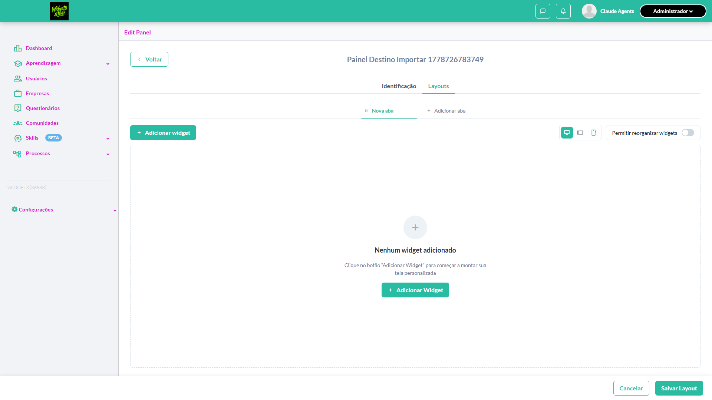

- 📸 **Screenshot (step-02-2-Clicar-em-Adicionar-aba-e-verificar-modal-step-1)** — [`step-02-2-Clicar-em-Adicionar-aba-e-verificar-modal-step-1-d781b44454967eb368758eeda4dd8b359c9d02c1.png`](artifacts/projects-widgets-tests-fea-cfe25-de-Importar-de-outro-painel-chromium/step-02-2-Clicar-em-Adicionar-aba-e-verificar-modal-step-1-d781b44454967eb368758eeda4dd8b359c9d02c1.png)

  

- 📸 **Screenshot (step-03-3-Verificar-op-o-Importar-de-outro-painel-com-descri-o-e-con)** — [`step-03-3-Verificar-op-o-Importar-de-outro-painel-com-descri-o-e-con-6fb9a5463806f016d289726ce809bd9198678fa3.png`](artifacts/projects-widgets-tests-fea-cfe25-de-Importar-de-outro-painel-chromium/step-03-3-Verificar-op-o-Importar-de-outro-painel-com-descri-o-e-con-6fb9a5463806f016d289726ce809bd9198678fa3.png)

  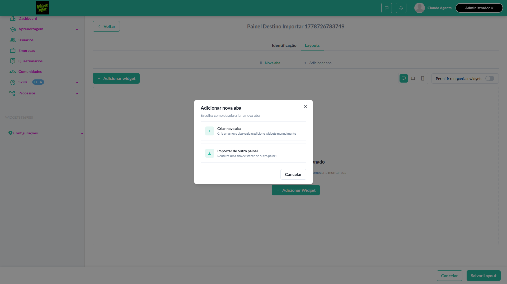

- 📸 **Screenshot (step-04-4-Clicar-em-Importar-de-outro-painel-e-verificar-step-2-do-m)** — [`step-04-4-Clicar-em-Importar-de-outro-painel-e-verificar-step-2-do-m-52e5f7137d779cb1395bc49d996364a7bc2c76fd.png`](artifacts/projects-widgets-tests-fea-cfe25-de-Importar-de-outro-painel-chromium/step-04-4-Clicar-em-Importar-de-outro-painel-e-verificar-step-2-do-m-52e5f7137d779cb1395bc49d996364a7bc2c76fd.png)

  

- 📸 **Screenshot (step-05-5-Verificar-bot-es-do-step-2-Voltar-Cancelar-e-Importar-aba-)** — [`step-05-5-Verificar-bot-es-do-step-2-Voltar-Cancelar-e-Importar-aba--42b2635cd2500e67792f063e3e074a13040d71ef.png`](artifacts/projects-widgets-tests-fea-cfe25-de-Importar-de-outro-painel-chromium/step-05-5-Verificar-bot-es-do-step-2-Voltar-Cancelar-e-Importar-aba--42b2635cd2500e67792f063e3e074a13040d71ef.png)

  

- 📸 **Screenshot (screenshot)** — [`test-finished-1.png`](artifacts/projects-widgets-tests-fea-cfe25-de-Importar-de-outro-painel-chromium/test-finished-1.png)

  

- 🎬 [Vídeo da execução (video.webm)](artifacts/projects-widgets-tests-fea-cfe25-de-Importar-de-outro-painel-chromium/video.webm)

- 🎬 [Vídeo da execução (video-1.webm)](artifacts/projects-widgets-tests-fea-cfe25-de-Importar-de-outro-painel-chromium/video-1.webm)

- 📦 **Trace** — [`trace.zip`](artifacts/projects-widgets-tests-fea-cfe25-de-Importar-de-outro-painel-chromium/trace.zip)

  ```bash
  npx playwright show-trace outputs/widgets/reports/importar-abas_20260513-234755/artifacts/projects-widgets-tests-fea-cfe25-de-Importar-de-outro-painel-chromium/trace.zip
  ```

- 🎥 **Vídeo** — [`video.webm`](artifacts/projects-widgets-tests-fea-cfe25-de-Importar-de-outro-painel-chromium/video.webm)

- 🎥 **Vídeo** — [`video-1.webm`](artifacts/projects-widgets-tests-fea-cfe25-de-Importar-de-outro-painel-chromium/video-1.webm)


---

### ❌ Falhou · Auto-preencher 'Nome da nova aba' com nome original e validar limite de 255 caracteres 

<a id="auto-preencher-nome-da-nova-aba-com-nome-original-e-validar-limite-de-255-caracteres"></a>_Arquivo:_ `auto-preencher-nome-aba-importada.spec.ts` · _Duração:_ 33.66s · _Browser:_ chromium

> **❌ Por que falhou:** O locator usado bate com mais de um elemento ao mesmo tempo (strict mode).
> _Step impactado:_ **1. Criar Painel Origem com Aba X seedada e abrir modal de importar do Painel Destino**

**Passos do caso (XML/TestLink + execução Playwright):**

_Cada linha reproduz um passo do XML; a coluna **Status** traz o resultado da execução (do step Allure correspondente). Linhas com "Pré-condição" são da execução automatizada (login, navegação inicial) — não fazem parte do roteiro do XML._

| # | Ação do passo | Resultado esperado | Status | Notas | Duração |
|---|---|---|:---:|---|---:|
| — | _Pré-condição:_ 1. Criar Painel Origem com Aba X seedada e abrir modal de importar do Painel Destino | — | ❌ | O locator usado bate com mais de um elemento ao mesmo tempo (strict mode). | 31.74s |

**Evidências:**

📁 _Pasta:_ [`artifacts/projects-widgets-tests-fea-03512-ar-limite-de-255-caracteres-chromium/`](artifacts/projects-widgets-tests-fea-03512-ar-limite-de-255-caracteres-chromium/)

- 📸 **Screenshot (screenshot)** — [`test-failed-1.png`](artifacts/projects-widgets-tests-fea-03512-ar-limite-de-255-caracteres-chromium/test-failed-1.png)

  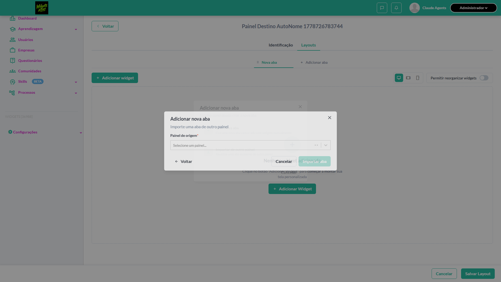

- 🎬 [Vídeo da execução (video.webm)](artifacts/projects-widgets-tests-fea-03512-ar-limite-de-255-caracteres-chromium/video.webm)

- 🎬 [Vídeo da execução (video-1.webm)](artifacts/projects-widgets-tests-fea-03512-ar-limite-de-255-caracteres-chromium/video-1.webm)

- 📦 **Trace** — [`trace.zip`](artifacts/projects-widgets-tests-fea-03512-ar-limite-de-255-caracteres-chromium/trace.zip)

  ```bash
  npx playwright show-trace outputs/widgets/reports/importar-abas_20260513-234755/artifacts/projects-widgets-tests-fea-03512-ar-limite-de-255-caracteres-chromium/trace.zip
  ```

- 🎥 **Vídeo** — [`video.webm`](artifacts/projects-widgets-tests-fea-03512-ar-limite-de-255-caracteres-chromium/video.webm)

- 🎥 **Vídeo** — [`video-1.webm`](artifacts/projects-widgets-tests-fea-03512-ar-limite-de-255-caracteres-chromium/video-1.webm)

- 📄 **DOM no momento da falha** — [`error-context.md`](artifacts/projects-widgets-tests-fea-03512-ar-limite-de-255-caracteres-chromium/error-context.md)

#### 🐛 Pronto para registro de bug

**Descrição do BUG:** [—] Auto-preencher 'Nome da nova aba' com nome original e validar limite de 255 caracteres — O locator usado bate com mais de um elemento ao mesmo tempo (strict mode).

**Passo a passo para reprodução:**
1. — (sem steps documentados no XML)

**Comportamento esperado:** —

**Comportamento atual:** O locator usado bate com mais de um elemento ao mesmo tempo (strict mode).

**Informações:**

| Campo | Valor |
|---|---|
| URL | `https://widgets.stage.twygoead.com/` |
| Login | ${TWYGO_STAGING_WIDGETS_EMAIL} |
| Senha | ${TWYGO_STAGING_WIDGETS_PASSWORD} |
| orgId | 36988 |
| Outros | Browser: chromium |
| Outros | runId: importar-abas_20260513-234755 |
| Outros | Duração até a falha: 33.66s |
| Outros | Step impactado: 1. 1. Criar Painel Origem com Aba X seedada e abrir modal de importar do Painel Destino |

**Evidências:**

- Screenshot capturado pelo Playwright (screenshot): artifacts/projects-widgets-tests-fea-03512-ar-limite-de-255-caracteres-chromium/test-failed-1.png
- Vídeo da execução (video-1.webm): artifacts/projects-widgets-tests-fea-03512-ar-limite-de-255-caracteres-chromium/video-1.webm
- Vídeo da execução (video.webm): artifacts/projects-widgets-tests-fea-03512-ar-limite-de-255-caracteres-chromium/video.webm
- Snapshot do DOM/contexto da página (error-context.md): artifacts/projects-widgets-tests-fea-03512-ar-limite-de-255-caracteres-chromium/error-context.md
- Trace completo do Playwright (.zip) — `npx playwright show-trace`: artifacts/projects-widgets-tests-fea-03512-ar-limite-de-255-caracteres-chromium/trace.zip

<details><summary>📋 Ver texto agregado para copiar (Jira/GitHub/Linear)</summary>

```
Descrição do BUG
[—] Auto-preencher 'Nome da nova aba' com nome original e validar limite de 255 caracteres — O locator usado bate com mais de um elemento ao mesmo tempo (strict mode).

Passo a passo para reprodução
  — (sem steps documentados no XML)

Comportamento esperado
—

Comportamento atual
O locator usado bate com mais de um elemento ao mesmo tempo (strict mode).

Informações
- URL: https://widgets.stage.twygoead.com/
- Login: ${TWYGO_STAGING_WIDGETS_EMAIL}
- Senha: ${TWYGO_STAGING_WIDGETS_PASSWORD}
- ID do ambiente (orgId): 36988
- Outros:
  - Browser: chromium
  - runId: importar-abas_20260513-234755
  - Duração até a falha: 33.66s
  - Step impactado: 1. 1. Criar Painel Origem com Aba X seedada e abrir modal de importar do Painel Destino

Evidências
- Screenshot capturado pelo Playwright (screenshot): artifacts/projects-widgets-tests-fea-03512-ar-limite-de-255-caracteres-chromium/test-failed-1.png
- Vídeo da execução (video-1.webm): artifacts/projects-widgets-tests-fea-03512-ar-limite-de-255-caracteres-chromium/video-1.webm
- Vídeo da execução (video.webm): artifacts/projects-widgets-tests-fea-03512-ar-limite-de-255-caracteres-chromium/video.webm
- Snapshot do DOM/contexto da página (error-context.md): artifacts/projects-widgets-tests-fea-03512-ar-limite-de-255-caracteres-chromium/error-context.md
- Trace completo do Playwright (.zip) — `npx playwright show-trace`: artifacts/projects-widgets-tests-fea-03512-ar-limite-de-255-caracteres-chromium/trace.zip

Execução
- runId: importar-abas_20260513-234755
- environment.json: staging-widgets
- testsuite: Importar abas
- testcase: Auto-preencher 'Nome da nova aba' com nome original e validar limite de 255 caracteres

```

</details>

<details><summary>🔧 Stack trace técnica completa (para desenvolvedor)</summary>

```
Error: locator.fill: Error: strict mode violation: getByTestId('import-tab-modal-panel-select').locator('input') resolved to 2 elements:
    1) <input value="" type="text" tabindex="0" role="combobox" autocorrect="off" autocomplete="off" spellcheck="false" aria-haspopup="true" autocapitalize="none" aria-expanded="false" aria-autocomplete="list" aria-activedescendant="" id="react-select-3-input" class="select-field__input" aria-describedby="react-select-3-placeholder"/> aka locator('#react-select-3-input')
    2) <input value="" type="hidden" name="import-tab-panel-select"/> aka locator('input[name="import-tab-panel-select"]')

Call log:
  - waiting for getByTestId('import-tab-modal-panel-select').locator('input')

```

</details>

---

### ✅ Aprovado · TC8 · Cancelar importação · 🟡 Normal

<a id="cancelar-importacao"></a>_Arquivo:_ `cancelar-importacao.spec.ts` · _Duração:_ 15.88s · _Browser:_ chromium

**Sumário (objetivo do caso):** Validar ação Cancelar.

**Pré-condições:**

```
Ambiente Stage configurado Funcionalidade 'Gestão de Painéis' habilitada no contrato Feature flag 'habilitar_paineis_do_usuario' ativa Usuário logado como Admin Modal de importação aberto
```

**Passos do caso (XML/TestLink + execução Playwright):**

_Cada linha reproduz um passo do XML; a coluna **Status** traz o resultado da execução (do step Allure correspondente). Linhas com "Pré-condição" são da execução automatizada (login, navegação inicial) — não fazem parte do roteiro do XML._

| # | Ação do passo | Resultado esperado | Status | Notas | Duração |
|---|---|---|:---:|---|---:|
| — | _Pré-condição:_ 3. Clicar 'Cancelar' do step 2 e validar que nenhuma aba é criada | — | ✅ | — | 0.32s |
| 1 | Estar no step 'Importar de outro painel' com campos preenchidos | Modal exibido | ✅ | — | 13.43s |
| 2 | Clicar no botão 'Cancelar' | Modal é fechado e nenhuma aba é importada | ✅ | — | 0.10s |

**Evidências:**

📁 _Pasta:_ [`artifacts/projects-widgets-tests-fea-52090-ar-abas-Cancelar-importação-chromium/`](artifacts/projects-widgets-tests-fea-52090-ar-abas-Cancelar-importação-chromium/)

- 📸 **Screenshot (step-01-1-Criar-painel-abrir-Layouts-e-ir-at-o-step-2-do-modal-de-im)** — [`step-01-1-Criar-painel-abrir-Layouts-e-ir-at-o-step-2-do-modal-de-im-c836129cf55900676e0b244924245d6a41b2ac0e.png`](artifacts/projects-widgets-tests-fea-52090-ar-abas-Cancelar-importação-chromium/step-01-1-Criar-painel-abrir-Layouts-e-ir-at-o-step-2-do-modal-de-im-c836129cf55900676e0b244924245d6a41b2ac0e.png)

  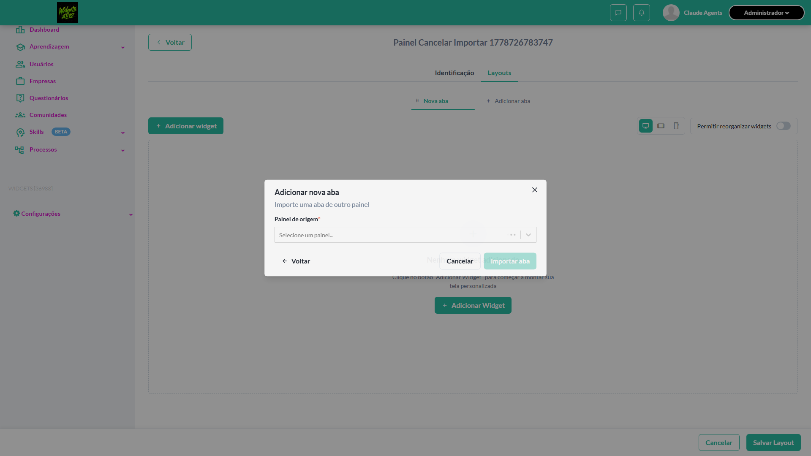

- 📸 **Screenshot (step-02-2-Registrar-count-de-abas-como-baseline-antes-de-cancelar)** — [`step-02-2-Registrar-count-de-abas-como-baseline-antes-de-cancelar-4d76516516c24bb4b85b96ca7e37439690689685.png`](artifacts/projects-widgets-tests-fea-52090-ar-abas-Cancelar-importação-chromium/step-02-2-Registrar-count-de-abas-como-baseline-antes-de-cancelar-4d76516516c24bb4b85b96ca7e37439690689685.png)

  

- 📸 **Screenshot (step-03-3-Clicar-Cancelar-do-step-2-e-validar-que-nenhuma-aba-criada)** — [`step-03-3-Clicar-Cancelar-do-step-2-e-validar-que-nenhuma-aba-criada-f9a11c631d4da145eed272bb47578164a1054d00.png`](artifacts/projects-widgets-tests-fea-52090-ar-abas-Cancelar-importação-chromium/step-03-3-Clicar-Cancelar-do-step-2-e-validar-que-nenhuma-aba-criada-f9a11c631d4da145eed272bb47578164a1054d00.png)

  

- 📸 **Screenshot (screenshot)** — [`test-finished-1.png`](artifacts/projects-widgets-tests-fea-52090-ar-abas-Cancelar-importação-chromium/test-finished-1.png)

  

- 🎬 [Vídeo da execução (video.webm)](artifacts/projects-widgets-tests-fea-52090-ar-abas-Cancelar-importação-chromium/video.webm)

- 🎬 [Vídeo da execução (video-1.webm)](artifacts/projects-widgets-tests-fea-52090-ar-abas-Cancelar-importação-chromium/video-1.webm)

- 📦 **Trace** — [`trace.zip`](artifacts/projects-widgets-tests-fea-52090-ar-abas-Cancelar-importação-chromium/trace.zip)

  ```bash
  npx playwright show-trace outputs/widgets/reports/importar-abas_20260513-234755/artifacts/projects-widgets-tests-fea-52090-ar-abas-Cancelar-importação-chromium/trace.zip
  ```

- 🎥 **Vídeo** — [`video.webm`](artifacts/projects-widgets-tests-fea-52090-ar-abas-Cancelar-importação-chromium/video.webm)

- 🎥 **Vídeo** — [`video-1.webm`](artifacts/projects-widgets-tests-fea-52090-ar-abas-Cancelar-importação-chromium/video-1.webm)


---

### ❌ Falhou · TC11 · Editar aba importada · ⚪ Menor

<a id="editar-aba-importada"></a>_Arquivo:_ `editar-aba-importada.spec.ts` · _Duração:_ 33.43s · _Browser:_ chromium

> **❌ Por que falhou:** O locator usado bate com mais de um elemento ao mesmo tempo (strict mode).
> _Step impactado:_ **1. Setup — Painel Origem + Painel Destino + importar Aba X como "Aba Importada"**

**Sumário (objetivo do caso):** Validar edição de uma aba importada

**Pré-condições:**

```
Ambiente Stage configurado Funcionalidade 'Gestão de Painéis' habilitada no contrato Feature flag 'habilitar_paineis_do_usuario' ativa Usuário logado como Admin Realizar a importação de uma aba com nome 'Editar aba Importada'
```

**Passos do caso (XML/TestLink + execução Playwright):**

_Cada linha reproduz um passo do XML; a coluna **Status** traz o resultado da execução (do step Allure correspondente). Linhas com "Pré-condição" são da execução automatizada (login, navegação inicial) — não fazem parte do roteiro do XML._

| # | Ação do passo | Resultado esperado | Status | Notas | Duração |
|---|---|---|:---:|---|---:|
| 1 | Editar nome da aba já importada | Nome é editado com sucesso | ❌ | O locator usado bate com mais de um elemento ao mesmo tempo (strict mode). | 31.45s |
| 2 | Adicionar/Remover/Mover Widgets de aba importada | Ações são realizadas e salvas com sucesso | ⊘ | Step não executado: o teste foi interrompido antes. Causa: O locator usado bate com mais de um elemento ao mesmo tempo (strict mode).. | — |

**Evidências:**

📁 _Pasta:_ [`artifacts/projects-widgets-tests-fea-fbe87-r-abas-Editar-aba-importada-chromium/`](artifacts/projects-widgets-tests-fea-fbe87-r-abas-Editar-aba-importada-chromium/)

- 📸 **Screenshot (screenshot)** — [`test-failed-1.png`](artifacts/projects-widgets-tests-fea-fbe87-r-abas-Editar-aba-importada-chromium/test-failed-1.png)

  

- 🎬 [Vídeo da execução (video.webm)](artifacts/projects-widgets-tests-fea-fbe87-r-abas-Editar-aba-importada-chromium/video.webm)

- 🎬 [Vídeo da execução (video-1.webm)](artifacts/projects-widgets-tests-fea-fbe87-r-abas-Editar-aba-importada-chromium/video-1.webm)

- 📦 **Trace** — [`trace.zip`](artifacts/projects-widgets-tests-fea-fbe87-r-abas-Editar-aba-importada-chromium/trace.zip)

  ```bash
  npx playwright show-trace outputs/widgets/reports/importar-abas_20260513-234755/artifacts/projects-widgets-tests-fea-fbe87-r-abas-Editar-aba-importada-chromium/trace.zip
  ```

- 🎥 **Vídeo** — [`video.webm`](artifacts/projects-widgets-tests-fea-fbe87-r-abas-Editar-aba-importada-chromium/video.webm)

- 🎥 **Vídeo** — [`video-1.webm`](artifacts/projects-widgets-tests-fea-fbe87-r-abas-Editar-aba-importada-chromium/video-1.webm)

- 📄 **DOM no momento da falha** — [`error-context.md`](artifacts/projects-widgets-tests-fea-fbe87-r-abas-Editar-aba-importada-chromium/error-context.md)

#### 🐛 Pronto para registro de bug

**Descrição do BUG:** [Menor] Editar aba importada — O locator usado bate com mais de um elemento ao mesmo tempo (strict mode).

**Passo a passo para reprodução:**
1. Pré: Ambiente Stage configurado Funcionalidade 'Gestão de Painéis' habilitada no contrato Feature flag 'habilitar_paineis_do_usuario' ativa Usuário logado como Admin Realizar a importação de uma aba com nome 'Editar aba Importada'
1. 1. Editar nome da aba já importada
1. 2. Adicionar/Remover/Mover Widgets de aba importada

**Comportamento esperado:** Nome é editado com sucesso

**Comportamento atual:** O locator usado bate com mais de um elemento ao mesmo tempo (strict mode).

**Informações:**

| Campo | Valor |
|---|---|
| URL | `https://widgets.stage.twygoead.com/` |
| Login | ${TWYGO_STAGING_WIDGETS_EMAIL} |
| Senha | ${TWYGO_STAGING_WIDGETS_PASSWORD} |
| orgId | 36988 |
| Outros | Browser: chromium |
| Outros | runId: importar-abas_20260513-234755 |
| Outros | Duração até a falha: 33.43s |
| Outros | Step impactado: 1. 1. Setup — Painel Origem + Painel Destino + importar Aba X como "Aba Importada" |

**Evidências:**

- Screenshot capturado pelo Playwright (screenshot): artifacts/projects-widgets-tests-fea-fbe87-r-abas-Editar-aba-importada-chromium/test-failed-1.png
- Vídeo da execução (video-1.webm): artifacts/projects-widgets-tests-fea-fbe87-r-abas-Editar-aba-importada-chromium/video-1.webm
- Vídeo da execução (video.webm): artifacts/projects-widgets-tests-fea-fbe87-r-abas-Editar-aba-importada-chromium/video.webm
- Snapshot do DOM/contexto da página (error-context.md): artifacts/projects-widgets-tests-fea-fbe87-r-abas-Editar-aba-importada-chromium/error-context.md
- Trace completo do Playwright (.zip) — `npx playwright show-trace`: artifacts/projects-widgets-tests-fea-fbe87-r-abas-Editar-aba-importada-chromium/trace.zip

<details><summary>📋 Ver texto agregado para copiar (Jira/GitHub/Linear)</summary>

```
Descrição do BUG
[Menor] Editar aba importada — O locator usado bate com mais de um elemento ao mesmo tempo (strict mode).

Passo a passo para reprodução
  Pré: Ambiente Stage configurado Funcionalidade 'Gestão de Painéis' habilitada no contrato Feature flag 'habilitar_paineis_do_usuario' ativa Usuário logado como Admin Realizar a importação de uma aba com nome 'Editar aba Importada'
  1. Editar nome da aba já importada
  2. Adicionar/Remover/Mover Widgets de aba importada

Comportamento esperado
Nome é editado com sucesso

Comportamento atual
O locator usado bate com mais de um elemento ao mesmo tempo (strict mode).

Informações
- URL: https://widgets.stage.twygoead.com/
- Login: ${TWYGO_STAGING_WIDGETS_EMAIL}
- Senha: ${TWYGO_STAGING_WIDGETS_PASSWORD}
- ID do ambiente (orgId): 36988
- Outros:
  - Browser: chromium
  - runId: importar-abas_20260513-234755
  - Duração até a falha: 33.43s
  - Step impactado: 1. 1. Setup — Painel Origem + Painel Destino + importar Aba X como "Aba Importada"

Evidências
- Screenshot capturado pelo Playwright (screenshot): artifacts/projects-widgets-tests-fea-fbe87-r-abas-Editar-aba-importada-chromium/test-failed-1.png
- Vídeo da execução (video-1.webm): artifacts/projects-widgets-tests-fea-fbe87-r-abas-Editar-aba-importada-chromium/video-1.webm
- Vídeo da execução (video.webm): artifacts/projects-widgets-tests-fea-fbe87-r-abas-Editar-aba-importada-chromium/video.webm
- Snapshot do DOM/contexto da página (error-context.md): artifacts/projects-widgets-tests-fea-fbe87-r-abas-Editar-aba-importada-chromium/error-context.md
- Trace completo do Playwright (.zip) — `npx playwright show-trace`: artifacts/projects-widgets-tests-fea-fbe87-r-abas-Editar-aba-importada-chromium/trace.zip

Execução
- runId: importar-abas_20260513-234755
- environment.json: staging-widgets
- testsuite: Importar abas
- testcase: Editar aba importada

```

</details>

<details><summary>🔧 Stack trace técnica completa (para desenvolvedor)</summary>

```
Error: locator.fill: Error: strict mode violation: getByTestId('import-tab-modal-panel-select').locator('input') resolved to 2 elements:
    1) <input value="" type="text" tabindex="0" role="combobox" autocorrect="off" autocomplete="off" spellcheck="false" aria-haspopup="true" autocapitalize="none" aria-expanded="false" aria-autocomplete="list" aria-activedescendant="" id="react-select-3-input" class="select-field__input" aria-describedby="react-select-3-placeholder"/> aka locator('#react-select-3-input')
    2) <input value="" type="hidden" name="import-tab-panel-select"/> aka locator('input[name="import-tab-panel-select"]')

Call log:
  - waiting for getByTestId('import-tab-modal-panel-select').locator('input')

```

</details>

---

### ❌ Falhou · TC6 · Importar aba (happy path) · 🔴 Crítico

<a id="importar-aba-happy-path"></a>_Arquivo:_ `importar-aba-happy-path.spec.ts` · _Duração:_ 33.32s · _Browser:_ chromium

> **❌ Por que falhou:** O locator usado bate com mais de um elemento ao mesmo tempo (strict mode).
> _Step impactado:_ **1. Setup — Painel Origem + Aba X + Painel Destino + modal step 2 preenchido**

**Sumário (objetivo do caso):** Validar importação completa (R7 RN50, RN51, RN52, RN53).

**Pré-condições:**

```
Ambiente Stage configurado Funcionalidade 'Gestão de Painéis' habilitada no contrato Feature flag 'habilitar_paineis_do_usuario' ativa Usuário logado como Admin Modal de importação aberto, 'Painel Origem' e 'Aba X' (2 widgets) selecionados, 'Nome da nova aba' = 'Aba Importada'
```

**Passos do caso (XML/TestLink + execução Playwright):**

_Cada linha reproduz um passo do XML; a coluna **Status** traz o resultado da execução (do step Allure correspondente). Linhas com "Pré-condição" são da execução automatizada (login, navegação inicial) — não fazem parte do roteiro do XML._

| # | Ação do passo | Resultado esperado | Status | Notas | Duração |
|---|---|---|:---:|---|---:|
| 1 | Clicar no botão 'Importar aba' | Modal é fechado, nova aba "Aba Importada" é criada e selecionada como aba ativa, toast exibida: "Aba importada com sucesso" | ❌ | O locator usado bate com mais de um elemento ao mesmo tempo (strict mode). | 31.23s |
| 2 | Verificar a aba importada | 'Aba Importada' é exibida e contém os 2 widgets copiados da 'Aba X' do 'Painel Origem' | ⊘ | Step não executado: o teste foi interrompido antes. Causa: O locator usado bate com mais de um elemento ao mesmo tempo (strict mode).. | — |

**Evidências:**

📁 _Pasta:_ [`artifacts/projects-widgets-tests-fea-97d34-as-Importar-aba-happy-path--chromium/`](artifacts/projects-widgets-tests-fea-97d34-as-Importar-aba-happy-path--chromium/)

- 📸 **Screenshot (screenshot)** — [`test-failed-1.png`](artifacts/projects-widgets-tests-fea-97d34-as-Importar-aba-happy-path--chromium/test-failed-1.png)

  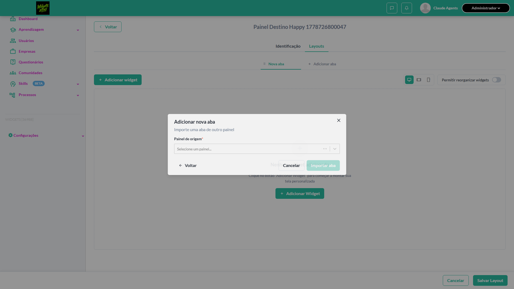

- 🎬 [Vídeo da execução (video.webm)](artifacts/projects-widgets-tests-fea-97d34-as-Importar-aba-happy-path--chromium/video.webm)

- 🎬 [Vídeo da execução (video-1.webm)](artifacts/projects-widgets-tests-fea-97d34-as-Importar-aba-happy-path--chromium/video-1.webm)

- 📦 **Trace** — [`trace.zip`](artifacts/projects-widgets-tests-fea-97d34-as-Importar-aba-happy-path--chromium/trace.zip)

  ```bash
  npx playwright show-trace outputs/widgets/reports/importar-abas_20260513-234755/artifacts/projects-widgets-tests-fea-97d34-as-Importar-aba-happy-path--chromium/trace.zip
  ```

- 🎥 **Vídeo** — [`video.webm`](artifacts/projects-widgets-tests-fea-97d34-as-Importar-aba-happy-path--chromium/video.webm)

- 🎥 **Vídeo** — [`video-1.webm`](artifacts/projects-widgets-tests-fea-97d34-as-Importar-aba-happy-path--chromium/video-1.webm)

- 📄 **DOM no momento da falha** — [`error-context.md`](artifacts/projects-widgets-tests-fea-97d34-as-Importar-aba-happy-path--chromium/error-context.md)

#### 🐛 Pronto para registro de bug

**Descrição do BUG:** [Crítico] Importar aba (happy path) — O locator usado bate com mais de um elemento ao mesmo tempo (strict mode).

**Passo a passo para reprodução:**
1. Pré: Ambiente Stage configurado Funcionalidade 'Gestão de Painéis' habilitada no contrato Feature flag 'habilitar_paineis_do_usuario' ativa Usuário logado como Admin Modal de importação aberto, 'Painel Origem' e 'Aba X' (2 widgets) selecionados, 'Nome da nova aba' = 'Aba Importada'
1. 1. Clicar no botão 'Importar aba'
1. 2. Verificar a aba importada

**Comportamento esperado:** Modal é fechado, nova aba "Aba Importada" é criada e selecionada como aba ativa, toast exibida: "Aba importada com sucesso"

**Comportamento atual:** O locator usado bate com mais de um elemento ao mesmo tempo (strict mode).

**Informações:**

| Campo | Valor |
|---|---|
| URL | `https://widgets.stage.twygoead.com/` |
| Login | ${TWYGO_STAGING_WIDGETS_EMAIL} |
| Senha | ${TWYGO_STAGING_WIDGETS_PASSWORD} |
| orgId | 36988 |
| Outros | Browser: chromium |
| Outros | runId: importar-abas_20260513-234755 |
| Outros | Duração até a falha: 33.32s |
| Outros | Step impactado: 1. 1. Setup — Painel Origem + Aba X + Painel Destino + modal step 2 preenchido |

**Evidências:**

- Screenshot capturado pelo Playwright (screenshot): artifacts/projects-widgets-tests-fea-97d34-as-Importar-aba-happy-path--chromium/test-failed-1.png
- Vídeo da execução (video-1.webm): artifacts/projects-widgets-tests-fea-97d34-as-Importar-aba-happy-path--chromium/video-1.webm
- Vídeo da execução (video.webm): artifacts/projects-widgets-tests-fea-97d34-as-Importar-aba-happy-path--chromium/video.webm
- Snapshot do DOM/contexto da página (error-context.md): artifacts/projects-widgets-tests-fea-97d34-as-Importar-aba-happy-path--chromium/error-context.md
- Trace completo do Playwright (.zip) — `npx playwright show-trace`: artifacts/projects-widgets-tests-fea-97d34-as-Importar-aba-happy-path--chromium/trace.zip

<details><summary>📋 Ver texto agregado para copiar (Jira/GitHub/Linear)</summary>

```
Descrição do BUG
[Crítico] Importar aba (happy path) — O locator usado bate com mais de um elemento ao mesmo tempo (strict mode).

Passo a passo para reprodução
  Pré: Ambiente Stage configurado Funcionalidade 'Gestão de Painéis' habilitada no contrato Feature flag 'habilitar_paineis_do_usuario' ativa Usuário logado como Admin Modal de importação aberto, 'Painel Origem' e 'Aba X' (2 widgets) selecionados, 'Nome da nova aba' = 'Aba Importada'
  1. Clicar no botão 'Importar aba'
  2. Verificar a aba importada

Comportamento esperado
Modal é fechado, nova aba "Aba Importada" é criada e selecionada como aba ativa, toast exibida: "Aba importada com sucesso"

Comportamento atual
O locator usado bate com mais de um elemento ao mesmo tempo (strict mode).

Informações
- URL: https://widgets.stage.twygoead.com/
- Login: ${TWYGO_STAGING_WIDGETS_EMAIL}
- Senha: ${TWYGO_STAGING_WIDGETS_PASSWORD}
- ID do ambiente (orgId): 36988
- Outros:
  - Browser: chromium
  - runId: importar-abas_20260513-234755
  - Duração até a falha: 33.32s
  - Step impactado: 1. 1. Setup — Painel Origem + Aba X + Painel Destino + modal step 2 preenchido

Evidências
- Screenshot capturado pelo Playwright (screenshot): artifacts/projects-widgets-tests-fea-97d34-as-Importar-aba-happy-path--chromium/test-failed-1.png
- Vídeo da execução (video-1.webm): artifacts/projects-widgets-tests-fea-97d34-as-Importar-aba-happy-path--chromium/video-1.webm
- Vídeo da execução (video.webm): artifacts/projects-widgets-tests-fea-97d34-as-Importar-aba-happy-path--chromium/video.webm
- Snapshot do DOM/contexto da página (error-context.md): artifacts/projects-widgets-tests-fea-97d34-as-Importar-aba-happy-path--chromium/error-context.md
- Trace completo do Playwright (.zip) — `npx playwright show-trace`: artifacts/projects-widgets-tests-fea-97d34-as-Importar-aba-happy-path--chromium/trace.zip

Execução
- runId: importar-abas_20260513-234755
- environment.json: staging-widgets
- testsuite: Importar abas
- testcase: Importar aba (happy path)

```

</details>

<details><summary>🔧 Stack trace técnica completa (para desenvolvedor)</summary>

```
Error: locator.fill: Error: strict mode violation: getByTestId('import-tab-modal-panel-select').locator('input') resolved to 2 elements:
    1) <input value="" type="text" tabindex="0" role="combobox" autocorrect="off" autocomplete="off" spellcheck="false" aria-haspopup="true" autocapitalize="none" aria-expanded="false" aria-autocomplete="list" aria-activedescendant="" id="react-select-3-input" class="select-field__input" aria-describedby="react-select-3-placeholder"/> aka locator('#react-select-3-input')
    2) <input value="" type="hidden" name="import-tab-panel-select"/> aka locator('input[name="import-tab-panel-select"]')

Call log:
  - waiting for getByTestId('import-tab-modal-panel-select').locator('input')

```

</details>

---

### ⊘ Ignorado · TC10 · Importar aba com painel sem abas disponíveis · ⚪ Menor

<a id="importar-aba-com-painel-sem-abas-disponiveis"></a>_Arquivo:_ `importar-painel-sem-abas.spec.ts` · _Duração:_ 0.53s · _Browser:_ chromium

> **⊘ Por que foi ignorado:** Marcado para revisão (test.fixme): Spec/XML desatualizado: o env staging-widgets não permite painel "sem abas" — todo painel já é criado com a aba padrão "Nova aba". A aba padrão não aparece como opção no dropdown "Aba disponível", então o react-select mostra "Nenhuma aba encontrada" para qualquer painel recém-criado. Destinatário: AT/QA Lead — confirmar com produto se este estado é equivalente de "sem abas" ou se existe outro estado possível (ver feedback_panel_layout_save_no_persist.md também).

**Sumário (objetivo do caso):** Validar comportamento quando painel não tem abas (cenário de borda).

**Pré-condições:**

```
Ambiente Stage configurado Funcionalidade 'Gestão de Painéis' habilitada no contrato Feature flag 'habilitar_paineis_do_usuario' ativa Usuário logado como Admin Existe painel 'Painel Vazio' sem abas registradas (caso possível)
```

**Passos do caso (XML/TestLink + execução Playwright):**

_Cada linha reproduz um passo do XML; a coluna **Status** traz o resultado da execução (do step Allure correspondente). Linhas com "Pré-condição" são da execução automatizada (login, navegação inicial) — não fazem parte do roteiro do XML._

| # | Ação do passo | Resultado esperado | Status | Notas | Duração |
|---|---|---|:---:|---|---:|
| 1 | Iniciar o fluxo de importação | Modal exibido | ⊘ | Step não executado — Marcado para revisão (test.fixme): Spec/XML desatualizado: o env staging-widgets não permite painel "sem abas" — todo painel já é criado com a aba padrão "Nova aba". A aba padrão não aparece como opção no dropdown "Aba disponível", então o react-select mostra "Nenhuma aba encontrada" para qualquer painel recém-criado. Destinatário: AT/QA Lead — confirmar com produto se este estado é equivalente de "sem abas" ou se existe outro estado possível (ver feedback_panel_layout_save_no_persist.md também). | — |
| 2 | Selecionar 'Painel Vazio' no campo 'Painel de origem' | Campo 'Aba disponível' exibe estado vazio ou mensagem informando que não há abas disponíveis | ⊘ | Step não executado — Marcado para revisão (test.fixme): Spec/XML desatualizado: o env staging-widgets não permite painel "sem abas" — todo painel já é criado com a aba padrão "Nova aba". A aba padrão não aparece como opção no dropdown "Aba disponível", então o react-select mostra "Nenhuma aba encontrada" para qualquer painel recém-criado. Destinatário: AT/QA Lead — confirmar com produto se este estado é equivalente de "sem abas" ou se existe outro estado possível (ver feedback_panel_layout_save_no_persist.md também). | — |

**Evidências:**

📁 _Pasta:_ [`artifacts/projects-widgets-tests-fea-7e252-painel-sem-abas-disponíveis-chromium/`](artifacts/projects-widgets-tests-fea-7e252-painel-sem-abas-disponíveis-chromium/)

- 📸 **Screenshot (screenshot)** — [`test-finished-1.png`](artifacts/projects-widgets-tests-fea-7e252-painel-sem-abas-disponíveis-chromium/test-finished-1.png)

  

- 🎬 [Vídeo da execução (video.webm)](artifacts/projects-widgets-tests-fea-7e252-painel-sem-abas-disponíveis-chromium/video.webm)

- 🎬 [Vídeo da execução (video-1.webm)](artifacts/projects-widgets-tests-fea-7e252-painel-sem-abas-disponíveis-chromium/video-1.webm)

- 📦 **Trace** — [`trace.zip`](artifacts/projects-widgets-tests-fea-7e252-painel-sem-abas-disponíveis-chromium/trace.zip)

  ```bash
  npx playwright show-trace outputs/widgets/reports/importar-abas_20260513-234755/artifacts/projects-widgets-tests-fea-7e252-painel-sem-abas-disponíveis-chromium/trace.zip
  ```

- 🎥 **Vídeo** — [`video.webm`](artifacts/projects-widgets-tests-fea-7e252-painel-sem-abas-disponíveis-chromium/video.webm)

- 🎥 **Vídeo** — [`video-1.webm`](artifacts/projects-widgets-tests-fea-7e252-painel-sem-abas-disponíveis-chromium/video-1.webm)

#### ⏳ Pendente — execução automatizada não realizada

- **Severidade do caso (XML):** Menor
- **Motivo do skip / fixme:** Spec/XML desatualizado: o env staging-widgets não permite painel "sem abas" — todo painel já é criado com a aba padrão "Nova aba". A aba padrão não aparece como opção no dropdown "Aba disponível", então o react-select mostra "Nenhuma aba encontrada" para qualquer painel recém-criado. Destinatário: AT/QA Lead — confirmar com produto se este estado é equivalente de "sem abas" ou se existe outro estado possível (ver feedback_panel_layout_save_no_persist.md também).

**Roteiro do XML (para validação manual):**
1. Pré: Ambiente Stage configurado Funcionalidade 'Gestão de Painéis' habilitada no contrato Feature flag 'habilitar_paineis_do_usuario' ativa Usuário logado como Admin Existe painel 'Painel Vazio' sem abas registradas (caso possível)
1. 1. Iniciar o fluxo de importação
1. 2. Selecionar 'Painel Vazio' no campo 'Painel de origem'

> Esse caso não bloqueia a build, mas precisa de validação manual ou ajuste no agente.


---

### ❌ Falhou · TC5 · Selecionar Categoria na importação · 🟡 Normal

<a id="selecionar-categoria-na-importacao"></a>_Arquivo:_ `selecionar-categoria-importacao.spec.ts` · _Duração:_ 34.63s · _Browser:_ chromium

> **❌ Por que falhou:** O locator usado bate com mais de um elemento ao mesmo tempo (strict mode).
> _Step impactado:_ **1. Setup — Painel Origem + Painel Destino + Aba X selecionada no modal**

**Sumário (objetivo do caso):** Validar campo Categoria (R7 RN49).

**Pré-condições:**

```
Ambiente Stage configurado Funcionalidade 'Gestão de Painéis' habilitada no contrato Feature flag 'habilitar_paineis_do_usuario' ativa Usuário logado como Admin Modal de importação aberto
```

**Passos do caso (XML/TestLink + execução Playwright):**

_Cada linha reproduz um passo do XML; a coluna **Status** traz o resultado da execução (do step Allure correspondente). Linhas com "Pré-condição" são da execução automatizada (login, navegação inicial) — não fazem parte do roteiro do XML._

| # | Ação do passo | Resultado esperado | Status | Notas | Duração |
|---|---|---|:---:|---|---:|
| 1 | Selecionar painel e aba no fluxo de importação | Campo 'Categoria' é exibido | ❌ | O locator usado bate com mais de um elemento ao mesmo tempo (strict mode). | 32.78s |
| 2 | Selecionar 'Aprendizagem' no dropdown 'Categoria' | Opção é selecionada | ⊘ | Step não executado: o teste foi interrompido antes. Causa: O locator usado bate com mais de um elemento ao mesmo tempo (strict mode).. | — |

**Evidências:**

📁 _Pasta:_ [`artifacts/projects-widgets-tests-fea-98f94-nar-Categoria-na-importação-chromium/`](artifacts/projects-widgets-tests-fea-98f94-nar-Categoria-na-importação-chromium/)

- 📸 **Screenshot (screenshot)** — [`test-failed-1.png`](artifacts/projects-widgets-tests-fea-98f94-nar-Categoria-na-importação-chromium/test-failed-1.png)

  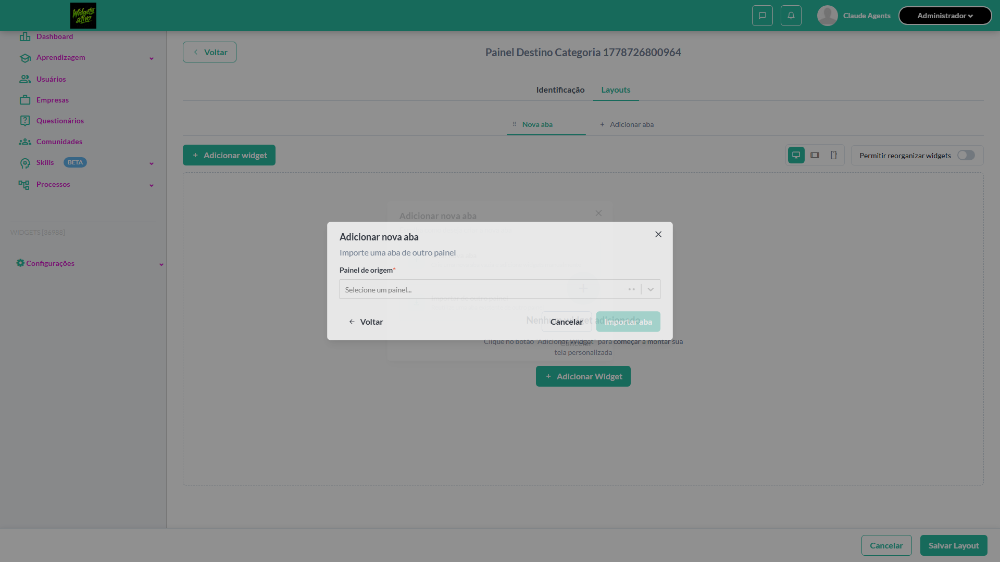

- 🎬 [Vídeo da execução (video.webm)](artifacts/projects-widgets-tests-fea-98f94-nar-Categoria-na-importação-chromium/video.webm)

- 🎬 [Vídeo da execução (video-1.webm)](artifacts/projects-widgets-tests-fea-98f94-nar-Categoria-na-importação-chromium/video-1.webm)

- 📦 **Trace** — [`trace.zip`](artifacts/projects-widgets-tests-fea-98f94-nar-Categoria-na-importação-chromium/trace.zip)

  ```bash
  npx playwright show-trace outputs/widgets/reports/importar-abas_20260513-234755/artifacts/projects-widgets-tests-fea-98f94-nar-Categoria-na-importação-chromium/trace.zip
  ```

- 🎥 **Vídeo** — [`video.webm`](artifacts/projects-widgets-tests-fea-98f94-nar-Categoria-na-importação-chromium/video.webm)

- 🎥 **Vídeo** — [`video-1.webm`](artifacts/projects-widgets-tests-fea-98f94-nar-Categoria-na-importação-chromium/video-1.webm)

- 📄 **DOM no momento da falha** — [`error-context.md`](artifacts/projects-widgets-tests-fea-98f94-nar-Categoria-na-importação-chromium/error-context.md)

#### 🐛 Pronto para registro de bug

**Descrição do BUG:** [Normal] Selecionar Categoria na importação — O locator usado bate com mais de um elemento ao mesmo tempo (strict mode).

**Passo a passo para reprodução:**
1. Pré: Ambiente Stage configurado Funcionalidade 'Gestão de Painéis' habilitada no contrato Feature flag 'habilitar_paineis_do_usuario' ativa Usuário logado como Admin Modal de importação aberto
1. 1. Selecionar painel e aba no fluxo de importação
1. 2. Selecionar 'Aprendizagem' no dropdown 'Categoria'

**Comportamento esperado:** Campo 'Categoria' é exibido

**Comportamento atual:** O locator usado bate com mais de um elemento ao mesmo tempo (strict mode).

**Informações:**

| Campo | Valor |
|---|---|
| URL | `https://widgets.stage.twygoead.com/` |
| Login | ${TWYGO_STAGING_WIDGETS_EMAIL} |
| Senha | ${TWYGO_STAGING_WIDGETS_PASSWORD} |
| orgId | 36988 |
| Outros | Browser: chromium |
| Outros | runId: importar-abas_20260513-234755 |
| Outros | Duração até a falha: 34.63s |
| Outros | Step impactado: 1. 1. Setup — Painel Origem + Painel Destino + Aba X selecionada no modal |

**Evidências:**

- Screenshot capturado pelo Playwright (screenshot): artifacts/projects-widgets-tests-fea-98f94-nar-Categoria-na-importação-chromium/test-failed-1.png
- Vídeo da execução (video-1.webm): artifacts/projects-widgets-tests-fea-98f94-nar-Categoria-na-importação-chromium/video-1.webm
- Vídeo da execução (video.webm): artifacts/projects-widgets-tests-fea-98f94-nar-Categoria-na-importação-chromium/video.webm
- Snapshot do DOM/contexto da página (error-context.md): artifacts/projects-widgets-tests-fea-98f94-nar-Categoria-na-importação-chromium/error-context.md
- Trace completo do Playwright (.zip) — `npx playwright show-trace`: artifacts/projects-widgets-tests-fea-98f94-nar-Categoria-na-importação-chromium/trace.zip

<details><summary>📋 Ver texto agregado para copiar (Jira/GitHub/Linear)</summary>

```
Descrição do BUG
[Normal] Selecionar Categoria na importação — O locator usado bate com mais de um elemento ao mesmo tempo (strict mode).

Passo a passo para reprodução
  Pré: Ambiente Stage configurado Funcionalidade 'Gestão de Painéis' habilitada no contrato Feature flag 'habilitar_paineis_do_usuario' ativa Usuário logado como Admin Modal de importação aberto
  1. Selecionar painel e aba no fluxo de importação
  2. Selecionar 'Aprendizagem' no dropdown 'Categoria'

Comportamento esperado
Campo 'Categoria' é exibido

Comportamento atual
O locator usado bate com mais de um elemento ao mesmo tempo (strict mode).

Informações
- URL: https://widgets.stage.twygoead.com/
- Login: ${TWYGO_STAGING_WIDGETS_EMAIL}
- Senha: ${TWYGO_STAGING_WIDGETS_PASSWORD}
- ID do ambiente (orgId): 36988
- Outros:
  - Browser: chromium
  - runId: importar-abas_20260513-234755
  - Duração até a falha: 34.63s
  - Step impactado: 1. 1. Setup — Painel Origem + Painel Destino + Aba X selecionada no modal

Evidências
- Screenshot capturado pelo Playwright (screenshot): artifacts/projects-widgets-tests-fea-98f94-nar-Categoria-na-importação-chromium/test-failed-1.png
- Vídeo da execução (video-1.webm): artifacts/projects-widgets-tests-fea-98f94-nar-Categoria-na-importação-chromium/video-1.webm
- Vídeo da execução (video.webm): artifacts/projects-widgets-tests-fea-98f94-nar-Categoria-na-importação-chromium/video.webm
- Snapshot do DOM/contexto da página (error-context.md): artifacts/projects-widgets-tests-fea-98f94-nar-Categoria-na-importação-chromium/error-context.md
- Trace completo do Playwright (.zip) — `npx playwright show-trace`: artifacts/projects-widgets-tests-fea-98f94-nar-Categoria-na-importação-chromium/trace.zip

Execução
- runId: importar-abas_20260513-234755
- environment.json: staging-widgets
- testsuite: Importar abas
- testcase: Selecionar Categoria na importação

```

</details>

<details><summary>🔧 Stack trace técnica completa (para desenvolvedor)</summary>

```
Error: locator.fill: Error: strict mode violation: getByTestId('import-tab-modal-panel-select').locator('input') resolved to 2 elements:
    1) <input value="" type="text" tabindex="0" role="combobox" autocorrect="off" autocomplete="off" spellcheck="false" aria-haspopup="true" autocapitalize="none" aria-expanded="false" aria-autocomplete="list" aria-activedescendant="" id="react-select-3-input" class="select-field__input" aria-describedby="react-select-3-placeholder"/> aka locator('#react-select-3-input')
    2) <input value="" type="hidden" name="import-tab-panel-select"/> aka locator('input[name="import-tab-panel-select"]')

Call log:
  - waiting for getByTestId('import-tab-modal-panel-select').locator('input')

```

</details>

---

### ❌ Falhou · TC2 · Selecionar painel de origem e listar abas disponíveis · 🔴 Crítico

<a id="selecionar-painel-de-origem-e-listar-abas-disponiveis"></a>_Arquivo:_ `selecionar-painel-origem-listar-abas.spec.ts` · _Duração:_ 40.23s · _Browser:_ chromium

> **❌ Por que falhou:** O locator usado bate com mais de um elemento ao mesmo tempo (strict mode).
> _Step impactado:_ **3. Selecionar painel de origem e verificar campo "Aba disponível" aparece**

**Sumário (objetivo do caso):** Validar carregamento das abas (R7 RN44, RN45).

**Pré-condições:**

```
Ambiente Stage configurado Funcionalidade 'Gestão de Painéis' habilitada no contrato Feature flag 'habilitar_paineis_do_usuario' ativa Usuário logado como Admin Painel em edição Existe painel 'Painel Origem' com 2 abas: 'Aba X' (2 widgets) e 'Aba Y' (3 widgets)
```

**Passos do caso (XML/TestLink + execução Playwright):**

_Cada linha reproduz um passo do XML; a coluna **Status** traz o resultado da execução (do step Allure correspondente). Linhas com "Pré-condição" são da execução automatizada (login, navegação inicial) — não fazem parte do roteiro do XML._

| # | Ação do passo | Resultado esperado | Status | Notas | Duração |
|---|---|---|:---:|---|---:|
| — | _Pré-condição:_ 3. Selecionar painel de origem e verificar campo "Aba disponível" aparece | — | ❌ | O locator usado bate com mais de um elemento ao mesmo tempo (strict mode). | 0.02s |
| 1 | Iniciar o fluxo Importar de outro painel | Modal de importação é exibido com 'Painel de origem' | ✅ | — | 28.43s |
| 2 | Selecionar 'Painel Origem' no select 'Painel de origem' | Campo 'Aba disponível' é exibido listando 'Aba X (2 widgets)' e 'Aba Y (3 widgets)' | ✅ | — | 9.78s |

**Evidências:**

📁 _Pasta:_ [`artifacts/projects-widgets-tests-fea-2e450-m-e-listar-abas-disponíveis-chromium/`](artifacts/projects-widgets-tests-fea-2e450-m-e-listar-abas-disponíveis-chromium/)

- 📸 **Screenshot (step-01-1-Criar-Painel-Origem-com-Aba-X-e-Aba-Y-seedadas)** — [`step-01-1-Criar-Painel-Origem-com-Aba-X-e-Aba-Y-seedadas-f8336e7d09ebe3246ccf68cc087fe03ddbfcec5e.png`](artifacts/projects-widgets-tests-fea-2e450-m-e-listar-abas-disponíveis-chromium/step-01-1-Criar-Painel-Origem-com-Aba-X-e-Aba-Y-seedadas-f8336e7d09ebe3246ccf68cc087fe03ddbfcec5e.png)

  

- 📸 **Screenshot (step-02-2-Criar-Painel-Destino-e-abrir-modal-Importar-de-outro-paine)** — [`step-02-2-Criar-Painel-Destino-e-abrir-modal-Importar-de-outro-paine-a579784e1eb3059e0c139507e352b1ff765e0338.png`](artifacts/projects-widgets-tests-fea-2e450-m-e-listar-abas-disponíveis-chromium/step-02-2-Criar-Painel-Destino-e-abrir-modal-Importar-de-outro-paine-a579784e1eb3059e0c139507e352b1ff765e0338.png)

  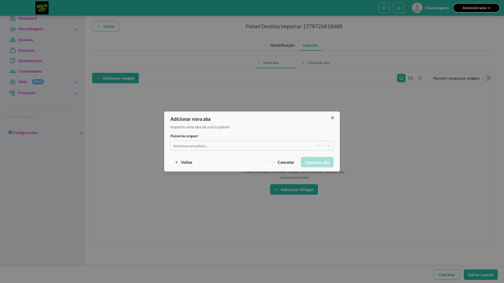

- 📸 **Screenshot (screenshot)** — [`test-failed-1.png`](artifacts/projects-widgets-tests-fea-2e450-m-e-listar-abas-disponíveis-chromium/test-failed-1.png)

  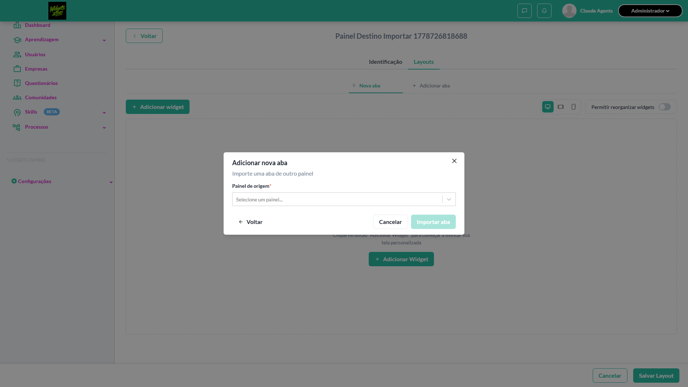

- 🎬 [Vídeo da execução (video.webm)](artifacts/projects-widgets-tests-fea-2e450-m-e-listar-abas-disponíveis-chromium/video.webm)

- 🎬 [Vídeo da execução (video-1.webm)](artifacts/projects-widgets-tests-fea-2e450-m-e-listar-abas-disponíveis-chromium/video-1.webm)

- 📦 **Trace** — [`trace.zip`](artifacts/projects-widgets-tests-fea-2e450-m-e-listar-abas-disponíveis-chromium/trace.zip)

  ```bash
  npx playwright show-trace outputs/widgets/reports/importar-abas_20260513-234755/artifacts/projects-widgets-tests-fea-2e450-m-e-listar-abas-disponíveis-chromium/trace.zip
  ```

- 🎥 **Vídeo** — [`video.webm`](artifacts/projects-widgets-tests-fea-2e450-m-e-listar-abas-disponíveis-chromium/video.webm)

- 🎥 **Vídeo** — [`video-1.webm`](artifacts/projects-widgets-tests-fea-2e450-m-e-listar-abas-disponíveis-chromium/video-1.webm)

- 📄 **DOM no momento da falha** — [`error-context.md`](artifacts/projects-widgets-tests-fea-2e450-m-e-listar-abas-disponíveis-chromium/error-context.md)

#### 🐛 Pronto para registro de bug

**Descrição do BUG:** [Crítico] Selecionar painel de origem e listar abas disponíveis — O locator usado bate com mais de um elemento ao mesmo tempo (strict mode).

**Passo a passo para reprodução:**
1. Pré: Ambiente Stage configurado Funcionalidade 'Gestão de Painéis' habilitada no contrato Feature flag 'habilitar_paineis_do_usuario' ativa Usuário logado como Admin Painel em edição Existe painel 'Painel Origem' com 2 abas: 'Aba X' (2 widgets) e 'Aba Y' (3 widgets)
1. 1. Iniciar o fluxo Importar de outro painel
1. 2. Selecionar 'Painel Origem' no select 'Painel de origem'

**Comportamento esperado:** 1. Modal de importação é exibido com 'Painel de origem' | 2. Campo 'Aba disponível' é exibido listando 'Aba X (2 widgets)' e 'Aba Y (3 widgets)'

**Comportamento atual:** O locator usado bate com mais de um elemento ao mesmo tempo (strict mode).

**Informações:**

| Campo | Valor |
|---|---|
| URL | `https://widgets.stage.twygoead.com/` |
| Login | ${TWYGO_STAGING_WIDGETS_EMAIL} |
| Senha | ${TWYGO_STAGING_WIDGETS_PASSWORD} |
| orgId | 36988 |
| Outros | Browser: chromium |
| Outros | runId: importar-abas_20260513-234755 |
| Outros | Duração até a falha: 40.23s |
| Outros | Step impactado: 3. 3. Selecionar painel de origem e verificar campo "Aba disponível" aparece |

**Evidências:**

- Screenshot capturado pelo Playwright (step-01-1-Criar-Painel-Origem-com-Aba-X-e-Aba-Y-seedadas): artifacts/projects-widgets-tests-fea-2e450-m-e-listar-abas-disponíveis-chromium/step-01-1-Criar-Painel-Origem-com-Aba-X-e-Aba-Y-seedadas-f8336e7d09ebe3246ccf68cc087fe03ddbfcec5e.png
- Screenshot capturado pelo Playwright (step-02-2-Criar-Painel-Destino-e-abrir-modal-Importar-de-outro-paine): artifacts/projects-widgets-tests-fea-2e450-m-e-listar-abas-disponíveis-chromium/step-02-2-Criar-Painel-Destino-e-abrir-modal-Importar-de-outro-paine-a579784e1eb3059e0c139507e352b1ff765e0338.png
- Screenshot capturado pelo Playwright (screenshot): artifacts/projects-widgets-tests-fea-2e450-m-e-listar-abas-disponíveis-chromium/test-failed-1.png
- Vídeo da execução (video-1.webm): artifacts/projects-widgets-tests-fea-2e450-m-e-listar-abas-disponíveis-chromium/video-1.webm
- Vídeo da execução (video.webm): artifacts/projects-widgets-tests-fea-2e450-m-e-listar-abas-disponíveis-chromium/video.webm
- Snapshot do DOM/contexto da página (error-context.md): artifacts/projects-widgets-tests-fea-2e450-m-e-listar-abas-disponíveis-chromium/error-context.md
- Trace completo do Playwright (.zip) — `npx playwright show-trace`: artifacts/projects-widgets-tests-fea-2e450-m-e-listar-abas-disponíveis-chromium/trace.zip

<details><summary>📋 Ver texto agregado para copiar (Jira/GitHub/Linear)</summary>

```
Descrição do BUG
[Crítico] Selecionar painel de origem e listar abas disponíveis — O locator usado bate com mais de um elemento ao mesmo tempo (strict mode).

Passo a passo para reprodução
  Pré: Ambiente Stage configurado Funcionalidade 'Gestão de Painéis' habilitada no contrato Feature flag 'habilitar_paineis_do_usuario' ativa Usuário logado como Admin Painel em edição Existe painel 'Painel Origem' com 2 abas: 'Aba X' (2 widgets) e 'Aba Y' (3 widgets)
  1. Iniciar o fluxo Importar de outro painel
  2. Selecionar 'Painel Origem' no select 'Painel de origem'

Comportamento esperado
1. Modal de importação é exibido com 'Painel de origem' | 2. Campo 'Aba disponível' é exibido listando 'Aba X (2 widgets)' e 'Aba Y (3 widgets)'

Comportamento atual
O locator usado bate com mais de um elemento ao mesmo tempo (strict mode).

Informações
- URL: https://widgets.stage.twygoead.com/
- Login: ${TWYGO_STAGING_WIDGETS_EMAIL}
- Senha: ${TWYGO_STAGING_WIDGETS_PASSWORD}
- ID do ambiente (orgId): 36988
- Outros:
  - Browser: chromium
  - runId: importar-abas_20260513-234755
  - Duração até a falha: 40.23s
  - Step impactado: 3. 3. Selecionar painel de origem e verificar campo "Aba disponível" aparece

Evidências
- Screenshot capturado pelo Playwright (step-01-1-Criar-Painel-Origem-com-Aba-X-e-Aba-Y-seedadas): artifacts/projects-widgets-tests-fea-2e450-m-e-listar-abas-disponíveis-chromium/step-01-1-Criar-Painel-Origem-com-Aba-X-e-Aba-Y-seedadas-f8336e7d09ebe3246ccf68cc087fe03ddbfcec5e.png
- Screenshot capturado pelo Playwright (step-02-2-Criar-Painel-Destino-e-abrir-modal-Importar-de-outro-paine): artifacts/projects-widgets-tests-fea-2e450-m-e-listar-abas-disponíveis-chromium/step-02-2-Criar-Painel-Destino-e-abrir-modal-Importar-de-outro-paine-a579784e1eb3059e0c139507e352b1ff765e0338.png
- Screenshot capturado pelo Playwright (screenshot): artifacts/projects-widgets-tests-fea-2e450-m-e-listar-abas-disponíveis-chromium/test-failed-1.png
- Vídeo da execução (video-1.webm): artifacts/projects-widgets-tests-fea-2e450-m-e-listar-abas-disponíveis-chromium/video-1.webm
- Vídeo da execução (video.webm): artifacts/projects-widgets-tests-fea-2e450-m-e-listar-abas-disponíveis-chromium/video.webm
- Snapshot do DOM/contexto da página (error-context.md): artifacts/projects-widgets-tests-fea-2e450-m-e-listar-abas-disponíveis-chromium/error-context.md
- Trace completo do Playwright (.zip) — `npx playwright show-trace`: artifacts/projects-widgets-tests-fea-2e450-m-e-listar-abas-disponíveis-chromium/trace.zip

Execução
- runId: importar-abas_20260513-234755
- environment.json: staging-widgets
- testsuite: Importar abas
- testcase: Selecionar painel de origem e listar abas disponíveis

```

</details>

<details><summary>🔧 Stack trace técnica completa (para desenvolvedor)</summary>

```
Error: locator.fill: Error: strict mode violation: getByTestId('import-tab-modal-panel-select').locator('input') resolved to 2 elements:
    1) <input value="" type="text" tabindex="0" role="combobox" autocorrect="off" autocomplete="off" spellcheck="false" aria-haspopup="true" autocapitalize="none" aria-expanded="false" aria-autocomplete="list" aria-activedescendant="" id="react-select-3-input" class="select-field__input" aria-describedby="react-select-3-placeholder"/> aka locator('#react-select-3-input')
    2) <input value="" type="hidden" name="import-tab-panel-select"/> aka locator('input[name="import-tab-panel-select"]')

Call log:
  - waiting for getByTestId('import-tab-modal-panel-select').locator('input')

```

</details>

---

### ✅ Aprovado · TC9 · Tentar importar sem selecionar painel de origem · 🟡 Normal

<a id="tentar-importar-sem-selecionar-painel-de-origem"></a>_Arquivo:_ `tentar-importar-sem-painel.spec.ts` · _Duração:_ 15.30s · _Browser:_ chromium

**Sumário (objetivo do caso):** Validar campo obrigatório.

**Pré-condições:**

```
Ambiente Stage configurado Funcionalidade 'Gestão de Painéis' habilitada no contrato Feature flag 'habilitar_paineis_do_usuario' ativa Usuário logado como Admin Modal de importação aberto
```

**Passos do caso (XML/TestLink + execução Playwright):**

_Cada linha reproduz um passo do XML; a coluna **Status** traz o resultado da execução (do step Allure correspondente). Linhas com "Pré-condição" são da execução automatizada (login, navegação inicial) — não fazem parte do roteiro do XML._

| # | Ação do passo | Resultado esperado | Status | Notas | Duração |
|---|---|---|:---:|---|---:|
| — | _Pré-condição:_ 3. Verificar botão 'Importar aba' está DISABLED sem painel selecionado | — | ✅ | — | 0.10s |
| 1 | Estar no step 'Importar de outro painel' sem selecionar painel | Campos seguintes ('Aba disponível', 'Nome da nova aba') não são exibidos | ✅ | — | 13.28s |
| 2 | Tentar acionar 'Importar aba' (se botão estiver visível) | Botão está desabilitado ou exibe erro de campo obrigatório no 'Painel de origem' | ✅ | — | 0.10s |

**Evidências:**

📁 _Pasta:_ [`artifacts/projects-widgets-tests-fea-9f900-selecionar-painel-de-origem-chromium/`](artifacts/projects-widgets-tests-fea-9f900-selecionar-painel-de-origem-chromium/)

- 📸 **Screenshot (step-01-1-Criar-painel-e-abrir-modal-step-2-de-importar-sem-sele-o)** — [`step-01-1-Criar-painel-e-abrir-modal-step-2-de-importar-sem-sele-o-968f25b7c80432849190e0994273272e1034a11a.png`](artifacts/projects-widgets-tests-fea-9f900-selecionar-painel-de-origem-chromium/step-01-1-Criar-painel-e-abrir-modal-step-2-de-importar-sem-sele-o-968f25b7c80432849190e0994273272e1034a11a.png)

  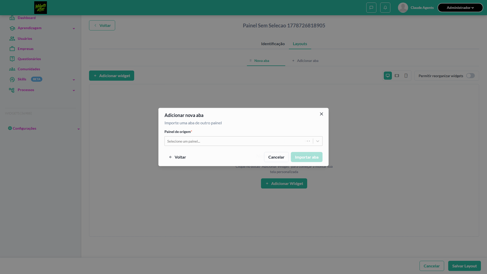

- 📸 **Screenshot (step-02-2-Verificar-que-Aba-dispon-vel-n-o-aparece-enquanto-Painel-d)** — [`step-02-2-Verificar-que-Aba-dispon-vel-n-o-aparece-enquanto-Painel-d-0638777c8e4e9056c0efe1f6f8e3775086421f16.png`](artifacts/projects-widgets-tests-fea-9f900-selecionar-painel-de-origem-chromium/step-02-2-Verificar-que-Aba-dispon-vel-n-o-aparece-enquanto-Painel-d-0638777c8e4e9056c0efe1f6f8e3775086421f16.png)

  

- 📸 **Screenshot (step-03-3-Verificar-bot-o-Importar-aba-est-DISABLED-sem-painel-selec)** — [`step-03-3-Verificar-bot-o-Importar-aba-est-DISABLED-sem-painel-selec-10938e3d02ea0a488d5d33d24717f893d0a15550.png`](artifacts/projects-widgets-tests-fea-9f900-selecionar-painel-de-origem-chromium/step-03-3-Verificar-bot-o-Importar-aba-est-DISABLED-sem-painel-selec-10938e3d02ea0a488d5d33d24717f893d0a15550.png)

  

- 📸 **Screenshot (screenshot)** — [`test-finished-1.png`](artifacts/projects-widgets-tests-fea-9f900-selecionar-painel-de-origem-chromium/test-finished-1.png)

  

- 🎬 [Vídeo da execução (video.webm)](artifacts/projects-widgets-tests-fea-9f900-selecionar-painel-de-origem-chromium/video.webm)

- 🎬 [Vídeo da execução (video-1.webm)](artifacts/projects-widgets-tests-fea-9f900-selecionar-painel-de-origem-chromium/video-1.webm)

- 📦 **Trace** — [`trace.zip`](artifacts/projects-widgets-tests-fea-9f900-selecionar-painel-de-origem-chromium/trace.zip)

  ```bash
  npx playwright show-trace outputs/widgets/reports/importar-abas_20260513-234755/artifacts/projects-widgets-tests-fea-9f900-selecionar-painel-de-origem-chromium/trace.zip
  ```

- 🎥 **Vídeo** — [`video.webm`](artifacts/projects-widgets-tests-fea-9f900-selecionar-painel-de-origem-chromium/video.webm)

- 🎥 **Vídeo** — [`video-1.webm`](artifacts/projects-widgets-tests-fea-9f900-selecionar-painel-de-origem-chromium/video-1.webm)


---

### ❌ Falhou · TC3 · Visualizar preview da aba selecionada · 🔴 Crítico

<a id="visualizar-preview-da-aba-selecionada"></a>_Arquivo:_ `visualizar-preview-aba.spec.ts` · _Duração:_ 37.97s · _Browser:_ chromium

> **❌ Por que falhou:** O locator usado bate com mais de um elemento ao mesmo tempo (strict mode).
> _Step impactado:_ **2. Criar Painel Destino e selecionar Painel Origem no modal de importar aba**

**Sumário (objetivo do caso):** Validar exibição de preview com widgets (R7 RN46).

**Pré-condições:**

```
Ambiente Stage configurado Funcionalidade 'Gestão de Painéis' habilitada no contrato Feature flag 'habilitar_paineis_do_usuario' ativa Usuário logado como Admin Modal de importação aberto com 'Painel Origem' selecionado e abas listadas
```

**Passos do caso (XML/TestLink + execução Playwright):**

_Cada linha reproduz um passo do XML; a coluna **Status** traz o resultado da execução (do step Allure correspondente). Linhas com "Pré-condição" são da execução automatizada (login, navegação inicial) — não fazem parte do roteiro do XML._

| # | Ação do passo | Resultado esperado | Status | Notas | Duração |
|---|---|---|:---:|---|---:|
| — | _Pré-condição:_ 2. Criar Painel Destino e selecionar Painel Origem no modal de importar aba | — | ❌ | O locator usado bate com mais de um elemento ao mesmo tempo (strict mode). | 9.09s |
| 1 | Selecionar 'Aba X (2 widgets)' no campo 'Aba disponível' | Preview é exibido com nome da aba, quantidade de widgets e a lista de widgets inclusos | ✅ | — | 26.92s |

**Evidências:**

📁 _Pasta:_ [`artifacts/projects-widgets-tests-fea-42643--preview-da-aba-selecionada-chromium/`](artifacts/projects-widgets-tests-fea-42643--preview-da-aba-selecionada-chromium/)

- 📸 **Screenshot (step-01-1-Criar-Painel-Origem-com-Aba-X-e-Aba-Y-seedadas)** — [`step-01-1-Criar-Painel-Origem-com-Aba-X-e-Aba-Y-seedadas-86d52b526bb5d5e84b520db10ff4cd945f17d469.png`](artifacts/projects-widgets-tests-fea-42643--preview-da-aba-selecionada-chromium/step-01-1-Criar-Painel-Origem-com-Aba-X-e-Aba-Y-seedadas-86d52b526bb5d5e84b520db10ff4cd945f17d469.png)

  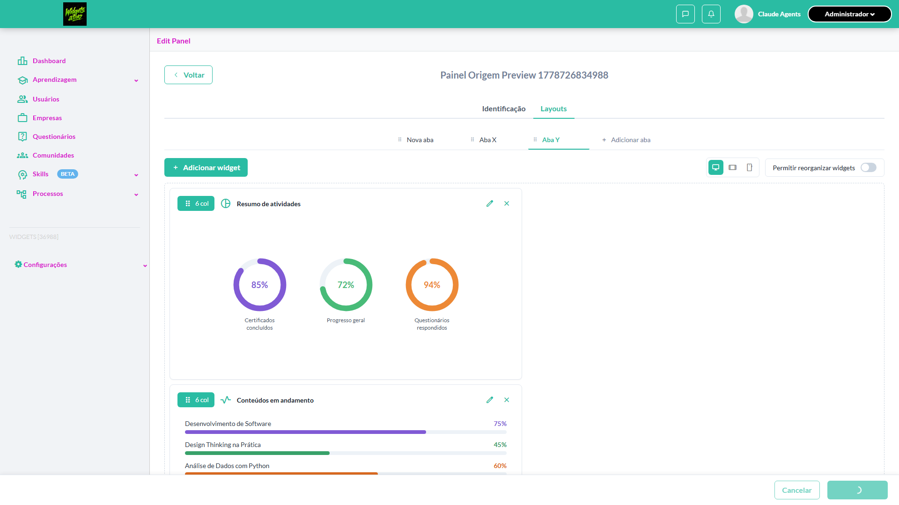

- 📸 **Screenshot (screenshot)** — [`test-failed-1.png`](artifacts/projects-widgets-tests-fea-42643--preview-da-aba-selecionada-chromium/test-failed-1.png)

  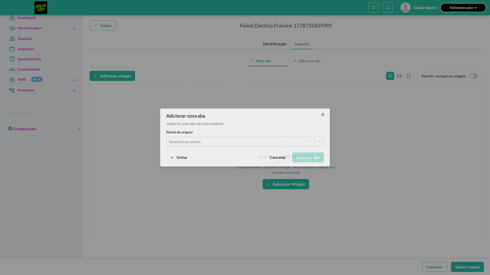

- 🎬 [Vídeo da execução (video.webm)](artifacts/projects-widgets-tests-fea-42643--preview-da-aba-selecionada-chromium/video.webm)

- 🎬 [Vídeo da execução (video-1.webm)](artifacts/projects-widgets-tests-fea-42643--preview-da-aba-selecionada-chromium/video-1.webm)

- 📦 **Trace** — [`trace.zip`](artifacts/projects-widgets-tests-fea-42643--preview-da-aba-selecionada-chromium/trace.zip)

  ```bash
  npx playwright show-trace outputs/widgets/reports/importar-abas_20260513-234755/artifacts/projects-widgets-tests-fea-42643--preview-da-aba-selecionada-chromium/trace.zip
  ```

- 🎥 **Vídeo** — [`video.webm`](artifacts/projects-widgets-tests-fea-42643--preview-da-aba-selecionada-chromium/video.webm)

- 🎥 **Vídeo** — [`video-1.webm`](artifacts/projects-widgets-tests-fea-42643--preview-da-aba-selecionada-chromium/video-1.webm)

- 📄 **DOM no momento da falha** — [`error-context.md`](artifacts/projects-widgets-tests-fea-42643--preview-da-aba-selecionada-chromium/error-context.md)

#### 🐛 Pronto para registro de bug

**Descrição do BUG:** [Crítico] Visualizar preview da aba selecionada — O locator usado bate com mais de um elemento ao mesmo tempo (strict mode).

**Passo a passo para reprodução:**
1. Pré: Ambiente Stage configurado Funcionalidade 'Gestão de Painéis' habilitada no contrato Feature flag 'habilitar_paineis_do_usuario' ativa Usuário logado como Admin Modal de importação aberto com 'Painel Origem' selecionado e abas listadas
1. 1. Selecionar 'Aba X (2 widgets)' no campo 'Aba disponível'

**Comportamento esperado:** 1. Preview é exibido com nome da aba, quantidade de widgets e a lista de widgets inclusos

**Comportamento atual:** O locator usado bate com mais de um elemento ao mesmo tempo (strict mode).

**Informações:**

| Campo | Valor |
|---|---|
| URL | `https://widgets.stage.twygoead.com/` |
| Login | ${TWYGO_STAGING_WIDGETS_EMAIL} |
| Senha | ${TWYGO_STAGING_WIDGETS_PASSWORD} |
| orgId | 36988 |
| Outros | Browser: chromium |
| Outros | runId: importar-abas_20260513-234755 |
| Outros | Duração até a falha: 37.97s |
| Outros | Step impactado: 2. 2. Criar Painel Destino e selecionar Painel Origem no modal de importar aba |

**Evidências:**

- Screenshot capturado pelo Playwright (step-01-1-Criar-Painel-Origem-com-Aba-X-e-Aba-Y-seedadas): artifacts/projects-widgets-tests-fea-42643--preview-da-aba-selecionada-chromium/step-01-1-Criar-Painel-Origem-com-Aba-X-e-Aba-Y-seedadas-86d52b526bb5d5e84b520db10ff4cd945f17d469.png
- Screenshot capturado pelo Playwright (screenshot): artifacts/projects-widgets-tests-fea-42643--preview-da-aba-selecionada-chromium/test-failed-1.png
- Vídeo da execução (video-1.webm): artifacts/projects-widgets-tests-fea-42643--preview-da-aba-selecionada-chromium/video-1.webm
- Vídeo da execução (video.webm): artifacts/projects-widgets-tests-fea-42643--preview-da-aba-selecionada-chromium/video.webm
- Snapshot do DOM/contexto da página (error-context.md): artifacts/projects-widgets-tests-fea-42643--preview-da-aba-selecionada-chromium/error-context.md
- Trace completo do Playwright (.zip) — `npx playwright show-trace`: artifacts/projects-widgets-tests-fea-42643--preview-da-aba-selecionada-chromium/trace.zip

<details><summary>📋 Ver texto agregado para copiar (Jira/GitHub/Linear)</summary>

```
Descrição do BUG
[Crítico] Visualizar preview da aba selecionada — O locator usado bate com mais de um elemento ao mesmo tempo (strict mode).

Passo a passo para reprodução
  Pré: Ambiente Stage configurado Funcionalidade 'Gestão de Painéis' habilitada no contrato Feature flag 'habilitar_paineis_do_usuario' ativa Usuário logado como Admin Modal de importação aberto com 'Painel Origem' selecionado e abas listadas
  1. Selecionar 'Aba X (2 widgets)' no campo 'Aba disponível'

Comportamento esperado
1. Preview é exibido com nome da aba, quantidade de widgets e a lista de widgets inclusos

Comportamento atual
O locator usado bate com mais de um elemento ao mesmo tempo (strict mode).

Informações
- URL: https://widgets.stage.twygoead.com/
- Login: ${TWYGO_STAGING_WIDGETS_EMAIL}
- Senha: ${TWYGO_STAGING_WIDGETS_PASSWORD}
- ID do ambiente (orgId): 36988
- Outros:
  - Browser: chromium
  - runId: importar-abas_20260513-234755
  - Duração até a falha: 37.97s
  - Step impactado: 2. 2. Criar Painel Destino e selecionar Painel Origem no modal de importar aba

Evidências
- Screenshot capturado pelo Playwright (step-01-1-Criar-Painel-Origem-com-Aba-X-e-Aba-Y-seedadas): artifacts/projects-widgets-tests-fea-42643--preview-da-aba-selecionada-chromium/step-01-1-Criar-Painel-Origem-com-Aba-X-e-Aba-Y-seedadas-86d52b526bb5d5e84b520db10ff4cd945f17d469.png
- Screenshot capturado pelo Playwright (screenshot): artifacts/projects-widgets-tests-fea-42643--preview-da-aba-selecionada-chromium/test-failed-1.png
- Vídeo da execução (video-1.webm): artifacts/projects-widgets-tests-fea-42643--preview-da-aba-selecionada-chromium/video-1.webm
- Vídeo da execução (video.webm): artifacts/projects-widgets-tests-fea-42643--preview-da-aba-selecionada-chromium/video.webm
- Snapshot do DOM/contexto da página (error-context.md): artifacts/projects-widgets-tests-fea-42643--preview-da-aba-selecionada-chromium/error-context.md
- Trace completo do Playwright (.zip) — `npx playwright show-trace`: artifacts/projects-widgets-tests-fea-42643--preview-da-aba-selecionada-chromium/trace.zip

Execução
- runId: importar-abas_20260513-234755
- environment.json: staging-widgets
- testsuite: Importar abas
- testcase: Visualizar preview da aba selecionada

```

</details>

<details><summary>🔧 Stack trace técnica completa (para desenvolvedor)</summary>

```
Error: locator.fill: Error: strict mode violation: getByTestId('import-tab-modal-panel-select').locator('input') resolved to 2 elements:
    1) <input value="" type="text" tabindex="0" role="combobox" autocorrect="off" autocomplete="off" spellcheck="false" aria-haspopup="true" autocapitalize="none" aria-expanded="false" aria-autocomplete="list" aria-activedescendant="" id="react-select-3-input" class="select-field__input" aria-describedby="react-select-3-placeholder"/> aka locator('#react-select-3-input')
    2) <input value="" type="hidden" name="import-tab-panel-select"/> aka locator('input[name="import-tab-panel-select"]')

Call log:
  - waiting for getByTestId('import-tab-modal-panel-select').locator('input')

```

</details>

---

### ✅ Aprovado · TC7 · Voltar do step de importação para a seleção de tipo · 🟡 Normal

<a id="voltar-do-step-de-importacao-para-a-selecao-de-tipo"></a>_Arquivo:_ `voltar-step-importacao.spec.ts` · _Duração:_ 13.97s · _Browser:_ chromium

**Sumário (objetivo do caso):** Validar ação Voltar (R7).

**Pré-condições:**

```
Ambiente Stage configurado Funcionalidade 'Gestão de Painéis' habilitada no contrato Feature flag 'habilitar_paineis_do_usuario' ativa Usuário logado como Admin Modal de importação aberto
```

**Passos do caso (XML/TestLink + execução Playwright):**

_Cada linha reproduz um passo do XML; a coluna **Status** traz o resultado da execução (do step Allure correspondente). Linhas com "Pré-condição" são da execução automatizada (login, navegação inicial) — não fazem parte do roteiro do XML._

| # | Ação do passo | Resultado esperado | Status | Notas | Duração |
|---|---|---|:---:|---|---:|
| — | _Pré-condição:_ 3. Verificar que modal retorna ao step 1 com as opções iniciais visíveis | — | ✅ | — | 0.15s |
| 1 | Estar no step 'Importar de outro painel' | Modal exibido com campos de painel/aba | ✅ | — | 11.98s |
| 2 | Clicar no botão 'Voltar' | Modal retorna ao step de seleção entre 'Criar nova aba' e 'Importar de outro painel' | ✅ | — | 0.22s |

**Evidências:**

📁 _Pasta:_ [`artifacts/projects-widgets-tests-fea-fbd59-ação-para-a-seleção-de-tipo-chromium/`](artifacts/projects-widgets-tests-fea-fbd59-ação-para-a-seleção-de-tipo-chromium/)

- 📸 **Screenshot (step-01-1-Criar-painel-abrir-Layouts-e-navegar-at-o-step-2-de-Import)** — [`step-01-1-Criar-painel-abrir-Layouts-e-navegar-at-o-step-2-de-Import-64c6cd44c185d2080f98e8a0341af5f811ad87f7.png`](artifacts/projects-widgets-tests-fea-fbd59-ação-para-a-seleção-de-tipo-chromium/step-01-1-Criar-painel-abrir-Layouts-e-navegar-at-o-step-2-de-Import-64c6cd44c185d2080f98e8a0341af5f811ad87f7.png)

  

- 📸 **Screenshot (step-02-2-Clicar-no-bot-o-Voltar-arrow_back-do-step-2)** — [`step-02-2-Clicar-no-bot-o-Voltar-arrow-back-do-step-2-9dea57dd1223419972bf557adc61591c393c76c4.png`](artifacts/projects-widgets-tests-fea-fbd59-ação-para-a-seleção-de-tipo-chromium/step-02-2-Clicar-no-bot-o-Voltar-arrow-back-do-step-2-9dea57dd1223419972bf557adc61591c393c76c4.png)

  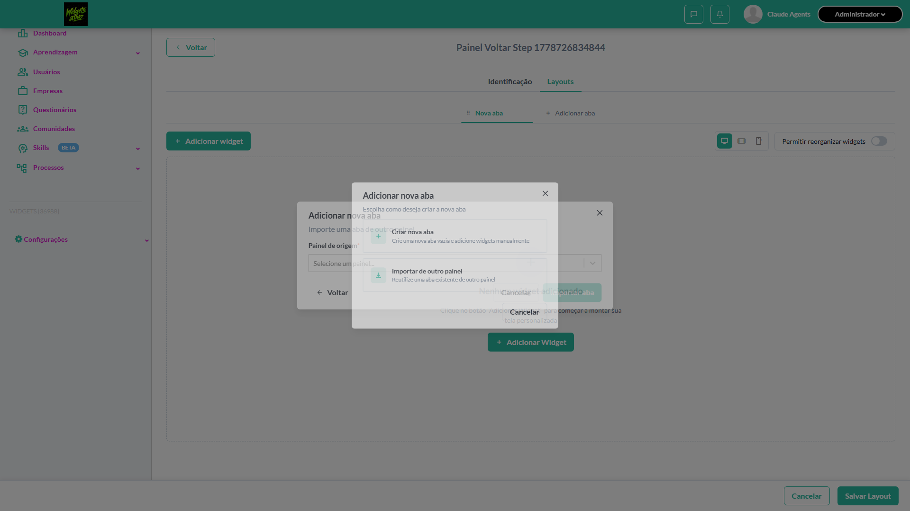

- 📸 **Screenshot (step-03-3-Verificar-que-modal-retorna-ao-step-1-com-as-op-es-iniciai)** — [`step-03-3-Verificar-que-modal-retorna-ao-step-1-com-as-op-es-iniciai-6b0b4aa45d9791e75e65b5827950a9c67120fb9b.png`](artifacts/projects-widgets-tests-fea-fbd59-ação-para-a-seleção-de-tipo-chromium/step-03-3-Verificar-que-modal-retorna-ao-step-1-com-as-op-es-iniciai-6b0b4aa45d9791e75e65b5827950a9c67120fb9b.png)

  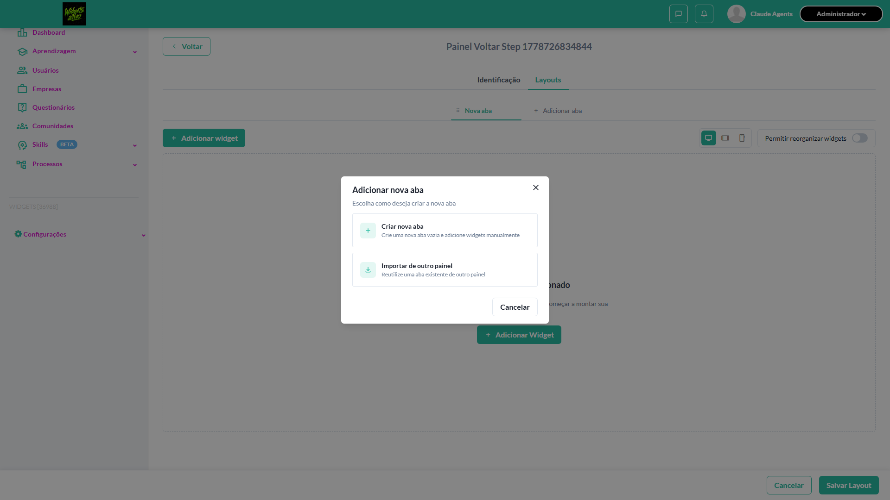

- 📸 **Screenshot (screenshot)** — [`test-finished-1.png`](artifacts/projects-widgets-tests-fea-fbd59-ação-para-a-seleção-de-tipo-chromium/test-finished-1.png)

  

- 🎬 [Vídeo da execução (video.webm)](artifacts/projects-widgets-tests-fea-fbd59-ação-para-a-seleção-de-tipo-chromium/video.webm)

- 🎬 [Vídeo da execução (video-1.webm)](artifacts/projects-widgets-tests-fea-fbd59-ação-para-a-seleção-de-tipo-chromium/video-1.webm)

- 📦 **Trace** — [`trace.zip`](artifacts/projects-widgets-tests-fea-fbd59-ação-para-a-seleção-de-tipo-chromium/trace.zip)

  ```bash
  npx playwright show-trace outputs/widgets/reports/importar-abas_20260513-234755/artifacts/projects-widgets-tests-fea-fbd59-ação-para-a-seleção-de-tipo-chromium/trace.zip
  ```

- 🎥 **Vídeo** — [`video.webm`](artifacts/projects-widgets-tests-fea-fbd59-ação-para-a-seleção-de-tipo-chromium/video.webm)

- 🎥 **Vídeo** — [`video-1.webm`](artifacts/projects-widgets-tests-fea-fbd59-ação-para-a-seleção-de-tipo-chromium/video-1.webm)


---
