# Casos de teste — Widgets

[← Voltar ao dashboard](index.md)

Lista detalhada por testsuite. Cada caso traz: o que era esperado pelo XML, quais steps foram executados, evidências (screenshots/trace), texto pronto pra registro de bug e — quando houver falha — uma explicação em PT-BR do motivo.

## Layout das abas

_11 caso(s) — 10 aprovado(s), 1 falha(s)_

### ✅ Aprovado · TC11 · Validar acessibilidade por teclado aba 'Layout' · ⚪ Menor

<a id="validar-acessibilidade-por-teclado-aba-layout"></a>_Arquivo:_ `acessibilidade-teclado-layout.spec.ts` · _Duração:_ 81.68s · _Browser:_ chromium

**Sumário (objetivo do caso):** Validar usabilidade conforme requisito da planilha (QA 2.1).

**Pré-condições:**

```
Ambiente Stage configurado Funcionalidade 'Gestão de Painéis' habilitada no contrato Feature flag 'habilitar_paineis_do_usuario' ativa Usuário logado como Admin
```

**Passos do caso (XML/TestLink + execução Playwright):**

_Cada linha reproduz um passo do XML; a coluna **Status** traz o resultado da execução (do step Allure correspondente). Linhas com "Pré-condição" são da execução automatizada (login, navegação inicial) — não fazem parte do roteiro do XML._

| # | Ação do passo | Resultado esperado | Status | Notas | Duração |
|---|---|---|:---:|---|---:|
| 1 | Acessar aba 'Layout' | Configurações das abas são carregadas | ✅ | — | 71.09s |
| 2 | Pressionar a tecla 'Tab' repetidamente | Foco percorre os campos em ordem | ✅ | — | 1.44s |
| 3 | Pressionar a tecla 'Enter' no botão '+ Adicionar Widget' com foco | Sistema redireciona para adição de widget | ✅ | — | 1.11s |
| 4 | Pressionar a tecla 'Esc' na tela aberta | Sistema retorna para o estado vazio ou abas criadas | ✅ | — | 1.45s |

**Evidências:**

📁 _Pasta:_ [`artifacts/projects-widgets-tests-fea-f5690-ade-por-teclado-aba-Layout--chromium/`](artifacts/projects-widgets-tests-fea-f5690-ade-por-teclado-aba-Layout--chromium/)

- 📸 **Screenshot (step-01-1-Setup-painel-em-Layouts-grid-vazio-inicial)** — [`step-01-1-Setup-painel-em-Layouts-grid-vazio-inicial-63da296fbda29e6f53134118ca788d15e0c48e9f.png`](artifacts/projects-widgets-tests-fea-f5690-ade-por-teclado-aba-Layout--chromium/step-01-1-Setup-painel-em-Layouts-grid-vazio-inicial-63da296fbda29e6f53134118ca788d15e0c48e9f.png)

  

- 📸 **Screenshot (step-02-2-Validar-focusabilidade-dos-bot-es-da-toolbar-de-a-es)** — [`step-02-2-Validar-focusabilidade-dos-bot-es-da-toolbar-de-a-es-3486e56702c3c4c7396adedfc4c598b5619dabb1.png`](artifacts/projects-widgets-tests-fea-f5690-ade-por-teclado-aba-Layout--chromium/step-02-2-Validar-focusabilidade-dos-bot-es-da-toolbar-de-a-es-3486e56702c3c4c7396adedfc4c598b5619dabb1.png)

  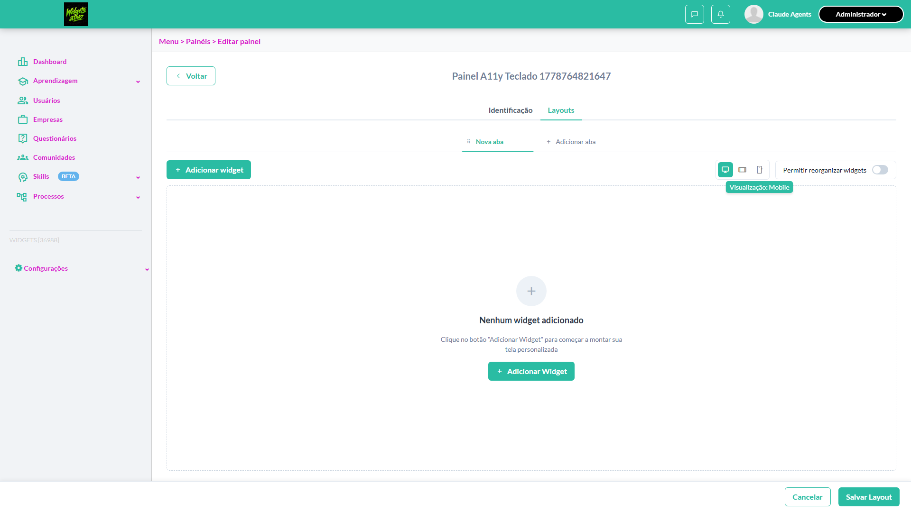

- 📸 **Screenshot (step-03-3-Validar-focusabilidade-do-switch-reorganizar-input-checkbo)** — [`step-03-3-Validar-focusabilidade-do-switch-reorganizar-input-checkbo-3765ec5a5f43fe68c083316640788ff27e7f1320.png`](artifacts/projects-widgets-tests-fea-f5690-ade-por-teclado-aba-Layout--chromium/step-03-3-Validar-focusabilidade-do-switch-reorganizar-input-checkbo-3765ec5a5f43fe68c083316640788ff27e7f1320.png)

  

- 📸 **Screenshot (step-04-4-Validar-focusabilidade-dos-bot-es-do-footer-Cancelar-Salva)** — [`step-04-4-Validar-focusabilidade-dos-bot-es-do-footer-Cancelar-Salva-bf037c013e1d7b31e4fcd1b5c6bbb2d7b0cca0d8.png`](artifacts/projects-widgets-tests-fea-f5690-ade-por-teclado-aba-Layout--chromium/step-04-4-Validar-focusabilidade-dos-bot-es-do-footer-Cancelar-Salva-bf037c013e1d7b31e4fcd1b5c6bbb2d7b0cca0d8.png)

  

- 📸 **Screenshot (screenshot)** — [`test-finished-1.png`](artifacts/projects-widgets-tests-fea-f5690-ade-por-teclado-aba-Layout--chromium/test-finished-1.png)

  

- 🎬 [Vídeo da execução (video.webm)](artifacts/projects-widgets-tests-fea-f5690-ade-por-teclado-aba-Layout--chromium/video.webm)

- 🎬 [Vídeo da execução (video-1.webm)](artifacts/projects-widgets-tests-fea-f5690-ade-por-teclado-aba-Layout--chromium/video-1.webm)

- 📦 **Trace** — [`trace.zip`](artifacts/projects-widgets-tests-fea-f5690-ade-por-teclado-aba-Layout--chromium/trace.zip)

  ```bash
  npx playwright show-trace outputs/widgets/reports/layout-das-abas_20260514-111819/artifacts/projects-widgets-tests-fea-f5690-ade-por-teclado-aba-Layout--chromium/trace.zip
  ```

- 🎥 **Vídeo** — [`video.webm`](artifacts/projects-widgets-tests-fea-f5690-ade-por-teclado-aba-Layout--chromium/video.webm)

- 🎥 **Vídeo** — [`video-1.webm`](artifacts/projects-widgets-tests-fea-f5690-ade-por-teclado-aba-Layout--chromium/video-1.webm)


---

### ✅ Aprovado · TC5 · Ativar switch 'Permitir reorganizar widgets' e mover widget · 🟡 Normal

<a id="ativar-switch-permitir-reorganizar-widgets-e-mover-widget"></a>_Arquivo:_ `ativar-switch-reorganizar-mover-widget.spec.ts` · _Duração:_ 83.33s · _Browser:_ chromium

**Sumário (objetivo do caso):** Validar reorganização habilitada (R8 RN59, RN59.1).

**Pré-condições:**

```
Ambiente Stage configurado Funcionalidade 'Gestão de Painéis' habilitada no contrato Feature flag 'habilitar_paineis_do_usuario' ativa Usuário logado como Admin Painel em edição com aba contendo dois widgets
```

**Passos do caso (XML/TestLink + execução Playwright):**

_Cada linha reproduz um passo do XML; a coluna **Status** traz o resultado da execução (do step Allure correspondente). Linhas com "Pré-condição" são da execução automatizada (login, navegação inicial) — não fazem parte do roteiro do XML._

| # | Ação do passo | Resultado esperado | Status | Notas | Duração |
|---|---|---|:---:|---|---:|
| 1 | Acessar a aba 'Layouts' do painel em edição no modo Desktop | Layout é exibido com os widgets | ✅ | — | 75.39s |
| 2 | Ativar o switch 'Permitir reorganizar widgets' | Switch fica ligado e widgets exibem indicação visual de que são arrastáveis | ✅ | — | 0.63s |
| 3 | Arrastar o primeiro widget para a posição do segundo | Widgets trocam de posição no grid | ✅ | — | 1.73s |

**Evidências:**

📁 _Pasta:_ [`artifacts/projects-widgets-tests-fea-66a07-izar-widgets-e-mover-widget-chromium/`](artifacts/projects-widgets-tests-fea-66a07-izar-widgets-e-mover-widget-chromium/)

- 📸 **Screenshot (step-01-1-Setup-painel-com-2-widgets-e-switch-reorganizar-OFF)** — [`step-01-1-Setup-painel-com-2-widgets-e-switch-reorganizar-OFF-7c4b26ff53d965ee7f0495fa78691a7bd43c21ed.png`](artifacts/projects-widgets-tests-fea-66a07-izar-widgets-e-mover-widget-chromium/step-01-1-Setup-painel-com-2-widgets-e-switch-reorganizar-OFF-7c4b26ff53d965ee7f0495fa78691a7bd43c21ed.png)

  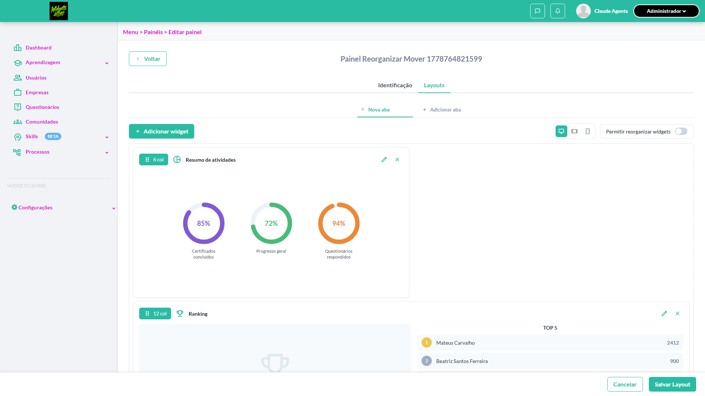

- 📸 **Screenshot (step-02-2-Ativar-switch-Permitir-reorganizar-widgets-click-force-tru)** — [`step-02-2-Ativar-switch-Permitir-reorganizar-widgets-click-force-tru-d1b8039299091b9d33d1c247be8810ecbeac7e62.png`](artifacts/projects-widgets-tests-fea-66a07-izar-widgets-e-mover-widget-chromium/step-02-2-Ativar-switch-Permitir-reorganizar-widgets-click-force-tru-d1b8039299091b9d33d1c247be8810ecbeac7e62.png)

  

- 📸 **Screenshot (step-03-3-Arrastar-primeiro-widget-e-verificar-mudan-a-visual)** — [`step-03-3-Arrastar-primeiro-widget-e-verificar-mudan-a-visual-b7c4e4a9add0c58bf38c950cf32cf68880e52539.png`](artifacts/projects-widgets-tests-fea-66a07-izar-widgets-e-mover-widget-chromium/step-03-3-Arrastar-primeiro-widget-e-verificar-mudan-a-visual-b7c4e4a9add0c58bf38c950cf32cf68880e52539.png)

  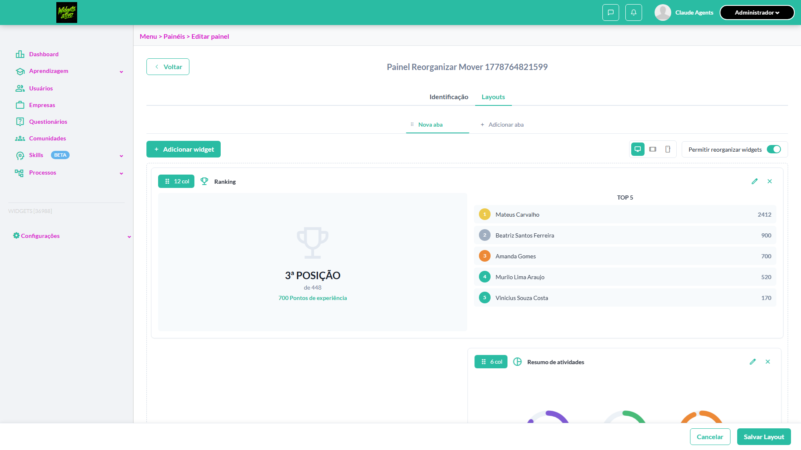

- 📸 **Screenshot (screenshot)** — [`test-finished-1.png`](artifacts/projects-widgets-tests-fea-66a07-izar-widgets-e-mover-widget-chromium/test-finished-1.png)

  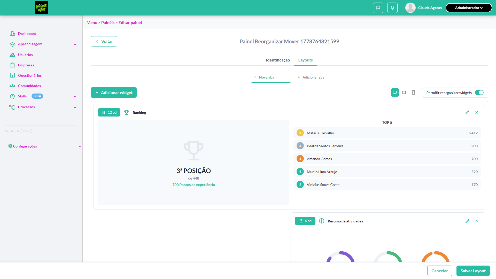

- 🎬 [Vídeo da execução (video.webm)](artifacts/projects-widgets-tests-fea-66a07-izar-widgets-e-mover-widget-chromium/video.webm)

- 🎬 [Vídeo da execução (video-1.webm)](artifacts/projects-widgets-tests-fea-66a07-izar-widgets-e-mover-widget-chromium/video-1.webm)

- 📦 **Trace** — [`trace.zip`](artifacts/projects-widgets-tests-fea-66a07-izar-widgets-e-mover-widget-chromium/trace.zip)

  ```bash
  npx playwright show-trace outputs/widgets/reports/layout-das-abas_20260514-111819/artifacts/projects-widgets-tests-fea-66a07-izar-widgets-e-mover-widget-chromium/trace.zip
  ```

- 🎥 **Vídeo** — [`video.webm`](artifacts/projects-widgets-tests-fea-66a07-izar-widgets-e-mover-widget-chromium/video.webm)

- 🎥 **Vídeo** — [`video-1.webm`](artifacts/projects-widgets-tests-fea-66a07-izar-widgets-e-mover-widget-chromium/video-1.webm)


---

### ✅ Aprovado · TC9 · Cancelar edição com alterações não salvas · 🟡 Normal

<a id="cancelar-edicao-com-alteracoes-nao-salvas"></a>_Arquivo:_ `cancelar-edicao-com-alteracoes.spec.ts` · _Duração:_ 90.24s · _Browser:_ chromium

**Sumário (objetivo do caso):** Validar ação 'Cancelar' (R8 RN65, RN65.1).

**Pré-condições:**

```
Ambiente Stage configurado Funcionalidade 'Gestão de Painéis' habilitada no contrato Feature flag 'habilitar_paineis_do_usuario' ativa Usuário logado como Admin Painel em edição com alterações não salvas
```

**Passos do caso (XML/TestLink + execução Playwright):**

_Cada linha reproduz um passo do XML; a coluna **Status** traz o resultado da execução (do step Allure correspondente). Linhas com "Pré-condição" são da execução automatizada (login, navegação inicial) — não fazem parte do roteiro do XML._

| # | Ação do passo | Resultado esperado | Status | Notas | Duração |
|---|---|---|:---:|---|---:|
| — | _Pré-condição:_ 3. Validar que dialog beforeunload foi disparado (sinal de alteração pendente) | — | ✅ | — | 0.18s |
| 1 | Estar na aba 'Layouts' com alterações não salvas | Layout é exibido com alterações pendentes | ✅ | — | 83.55s |
| 2 | Clicar no botão 'Cancelar' da barra de rodapé | Sistema descarta alterações e retorna para a listagem de painéis | ✅ | — | 0.37s |

**Evidências:**

📁 _Pasta:_ [`artifacts/projects-widgets-tests-fea-c08c6-o-com-alterações-não-salvas-chromium/`](artifacts/projects-widgets-tests-fea-c08c6-o-com-alterações-não-salvas-chromium/)

- 📸 **Screenshot (step-01-1-Setup-painel-com-1-widget-criando-altera-o-n-o-salva)** — [`step-01-1-Setup-painel-com-1-widget-criando-altera-o-n-o-salva-c37524779dd363f6f1bb2933982cb80abeabefe9.png`](artifacts/projects-widgets-tests-fea-c08c6-o-com-alterações-não-salvas-chromium/step-01-1-Setup-painel-com-1-widget-criando-altera-o-n-o-salva-c37524779dd363f6f1bb2933982cb80abeabefe9.png)

  

- 📸 **Screenshot (step-02-2-Clicar-Cancelar-e-capturar-beforeunload-dialog-nativo-dism)** — [`step-02-2-Clicar-Cancelar-e-capturar-beforeunload-dialog-nativo-dism-524762559727983687618180dfc266f6bf2d984b.png`](artifacts/projects-widgets-tests-fea-c08c6-o-com-alterações-não-salvas-chromium/step-02-2-Clicar-Cancelar-e-capturar-beforeunload-dialog-nativo-dism-524762559727983687618180dfc266f6bf2d984b.png)

  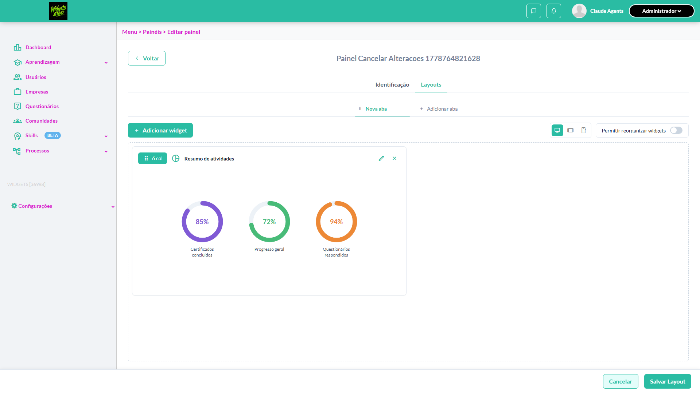

- 📸 **Screenshot (step-03-3-Validar-que-dialog-beforeunload-foi-disparado-sinal-de-alt)** — [`step-03-3-Validar-que-dialog-beforeunload-foi-disparado-sinal-de-alt-14d5b82fd96f0f66a423b552b9895d1bfc98a8b6.png`](artifacts/projects-widgets-tests-fea-c08c6-o-com-alterações-não-salvas-chromium/step-03-3-Validar-que-dialog-beforeunload-foi-disparado-sinal-de-alt-14d5b82fd96f0f66a423b552b9895d1bfc98a8b6.png)

  

- 📸 **Screenshot (screenshot)** — [`test-finished-1.png`](artifacts/projects-widgets-tests-fea-c08c6-o-com-alterações-não-salvas-chromium/test-finished-1.png)

  

- 🎬 [Vídeo da execução (video.webm)](artifacts/projects-widgets-tests-fea-c08c6-o-com-alterações-não-salvas-chromium/video.webm)

- 🎬 [Vídeo da execução (video-1.webm)](artifacts/projects-widgets-tests-fea-c08c6-o-com-alterações-não-salvas-chromium/video-1.webm)

- 📦 **Trace** — [`trace.zip`](artifacts/projects-widgets-tests-fea-c08c6-o-com-alterações-não-salvas-chromium/trace.zip)

  ```bash
  npx playwright show-trace outputs/widgets/reports/layout-das-abas_20260514-111819/artifacts/projects-widgets-tests-fea-c08c6-o-com-alterações-não-salvas-chromium/trace.zip
  ```

- 🎥 **Vídeo** — [`video.webm`](artifacts/projects-widgets-tests-fea-c08c6-o-com-alterações-não-salvas-chromium/video.webm)

- 🎥 **Vídeo** — [`video-1.webm`](artifacts/projects-widgets-tests-fea-c08c6-o-com-alterações-não-salvas-chromium/video-1.webm)


---

### ✅ Aprovado · TC7 · Estado vazio da aba sem widgets · 🔴 Crítico

<a id="estado-vazio-da-aba-sem-widgets"></a>_Arquivo:_ `estado-vazio-sem-widgets.spec.ts` · _Duração:_ 80.65s · _Browser:_ chromium

**Sumário (objetivo do caso):** Validar estado vazio com título, descrição e botão (R8 RN61, RN62, RN63).

**Pré-condições:**

```
Ambiente Stage configurado Funcionalidade 'Gestão de Painéis' habilitada no contrato Feature flag 'habilitar_paineis_do_usuario' ativa Usuário logado como Admin Painel em edição com aba 'Nova aba' sem widgets
```

**Passos do caso (XML/TestLink + execução Playwright):**

_Cada linha reproduz um passo do XML; a coluna **Status** traz o resultado da execução (do step Allure correspondente). Linhas com "Pré-condição" são da execução automatizada (login, navegação inicial) — não fazem parte do roteiro do XML._

| # | Ação do passo | Resultado esperado | Status | Notas | Duração |
|---|---|---|:---:|---|---:|
| 1 | Acessar a aba 'Layouts' do painel em edição | Aba 'Nova aba' é exibida sem widgets | ✅ | — | 68.02s |
| 2 | Verificar o estado vazio da área de layout | Ícone ilustrativo centralizado é exibido, título "Nenhum widget adicionado", descrição "Clique no botão "Adicionar Widget" para começar a montar sua tela personalizada" e botão primário "+ Adicionar Widget" | ✅ | — | 1.12s |
| 3 | Clicar no botão '+ Adicionar Widget' do estado vazio | Drawer 'Widgets disponíveis' é aberto (mesma ação do botão da toolbar) | ✅ | — | 1.23s |

**Evidências:**

📁 _Pasta:_ [`artifacts/projects-widgets-tests-fea-e27f8-do-vazio-da-aba-sem-widgets-chromium/`](artifacts/projects-widgets-tests-fea-e27f8-do-vazio-da-aba-sem-widgets-chromium/)

- 📸 **Screenshot (step-01-1-Setup-criar-painel-SEM-adicionar-widgets)** — [`step-01-1-Setup-criar-painel-SEM-adicionar-widgets-153e3402159b295dbd77fa2142612b6deb95bcb4.png`](artifacts/projects-widgets-tests-fea-e27f8-do-vazio-da-aba-sem-widgets-chromium/step-01-1-Setup-criar-painel-SEM-adicionar-widgets-153e3402159b295dbd77fa2142612b6deb95bcb4.png)

  

- 📸 **Screenshot (step-02-2-Validar-conte-do-do-empty-state-t-tulo-descri-o-CTA)** — [`step-02-2-Validar-conte-do-do-empty-state-t-tulo-descri-o-CTA-6bdf6f1ad0cdd9f338bea14950c4698a51ad4061.png`](artifacts/projects-widgets-tests-fea-e27f8-do-vazio-da-aba-sem-widgets-chromium/step-02-2-Validar-conte-do-do-empty-state-t-tulo-descri-o-CTA-6bdf6f1ad0cdd9f338bea14950c4698a51ad4061.png)

  

- 📸 **Screenshot (step-03-3-Clicar-Adicionar-Widget-do-empty-state-e-validar-abertura-)** — [`step-03-3-Clicar-Adicionar-Widget-do-empty-state-e-validar-abertura--c338b5a62802699a1ec381accb8e000ce9415dda.png`](artifacts/projects-widgets-tests-fea-e27f8-do-vazio-da-aba-sem-widgets-chromium/step-03-3-Clicar-Adicionar-Widget-do-empty-state-e-validar-abertura--c338b5a62802699a1ec381accb8e000ce9415dda.png)

  

- 📸 **Screenshot (screenshot)** — [`test-finished-1.png`](artifacts/projects-widgets-tests-fea-e27f8-do-vazio-da-aba-sem-widgets-chromium/test-finished-1.png)

  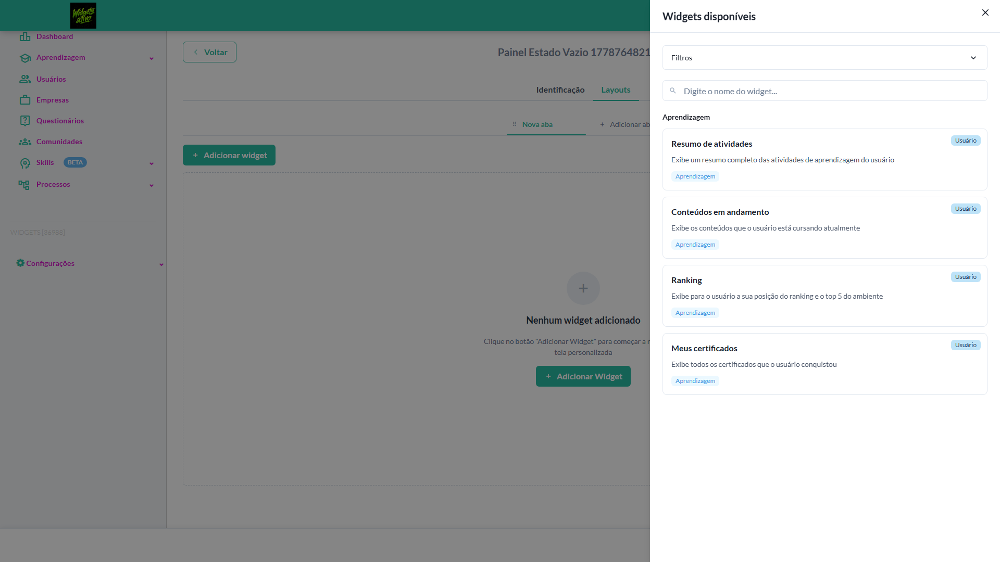

- 🎬 [Vídeo da execução (video.webm)](artifacts/projects-widgets-tests-fea-e27f8-do-vazio-da-aba-sem-widgets-chromium/video.webm)

- 🎬 [Vídeo da execução (video-1.webm)](artifacts/projects-widgets-tests-fea-e27f8-do-vazio-da-aba-sem-widgets-chromium/video-1.webm)

- 📦 **Trace** — [`trace.zip`](artifacts/projects-widgets-tests-fea-e27f8-do-vazio-da-aba-sem-widgets-chromium/trace.zip)

  ```bash
  npx playwright show-trace outputs/widgets/reports/layout-das-abas_20260514-111819/artifacts/projects-widgets-tests-fea-e27f8-do-vazio-da-aba-sem-widgets-chromium/trace.zip
  ```

- 🎥 **Vídeo** — [`video.webm`](artifacts/projects-widgets-tests-fea-e27f8-do-vazio-da-aba-sem-widgets-chromium/video.webm)

- 🎥 **Vídeo** — [`video-1.webm`](artifacts/projects-widgets-tests-fea-e27f8-do-vazio-da-aba-sem-widgets-chromium/video-1.webm)


---

### ❌ Falhou · TC8 · Salvar layout pela barra de rodapé · 🔴 Crítico

<a id="salvar-layout-pela-barra-de-rodape"></a>_Arquivo:_ `salvar-layout-rodape.spec.ts` · _Duração:_ 84.35s · _Browser:_ chromium

> **❌ Por que falhou:** Error: expect(locator).toHaveCount(expected) failed
> _Step impactado:_ **3. Recarregar página e validar persistência do layout**

**Sumário (objetivo do caso):** Validar persistência via 'Salvar layout' (R8 RN65, RN65.2).

**Pré-condições:**

```
Ambiente Stage configurado Funcionalidade 'Gestão de Painéis' habilitada no contrato Feature flag 'habilitar_paineis_do_usuario' ativa Usuário logado como Admin Painel em edição com aba contendo widget recém-adicionado
```

**Passos do caso (XML/TestLink + execução Playwright):**

_Cada linha reproduz um passo do XML; a coluna **Status** traz o resultado da execução (do step Allure correspondente). Linhas com "Pré-condição" são da execução automatizada (login, navegação inicial) — não fazem parte do roteiro do XML._

| # | Ação do passo | Resultado esperado | Status | Notas | Duração |
|---|---|---|:---:|---|---:|
| 1 | Acessar a aba 'Layouts' do painel em edição | Layout é exibido com o widget | ✅ | — | 52.25s |
| 2 | Clicar no botão 'Salvar layout' da barra de rodapé | Layout é persistido, sistema redireciona para a listagem de painéis e o painel aparece na listagem | ✅ | — | 1.43s |
| 3 | Reabrir o painel salvo | Aba e widgets continuam exibidos exatamente como salvos | ❌ | Error: expect(locator).toHaveCount(expected) failed | 20.50s |

**Evidências:**

📁 _Pasta:_ [`artifacts/projects-widgets-tests-fea-7f9ad-layout-pela-barra-de-rodapé-chromium/`](artifacts/projects-widgets-tests-fea-7f9ad-layout-pela-barra-de-rodapé-chromium/)

- 📸 **Screenshot (step-01-1-Setup-painel-com-1-widget-adicionado-toast-limpo)** — [`step-01-1-Setup-painel-com-1-widget-adicionado-toast-limpo-68c2e37049641ec93f05f7e3d15be82af529d0e6.png`](artifacts/projects-widgets-tests-fea-7f9ad-layout-pela-barra-de-rodapé-chromium/step-01-1-Setup-painel-com-1-widget-adicionado-toast-limpo-68c2e37049641ec93f05f7e3d15be82af529d0e6.png)

  

- 📸 **Screenshot (step-02-2-Clicar-Salvar-Layout-force-true-por-causa-do-iframe-HubSpo)** — [`step-02-2-Clicar-Salvar-Layout-force-true-por-causa-do-iframe-HubSpo-d9416e17614abec6b27fbc41bc26a3c649220219.png`](artifacts/projects-widgets-tests-fea-7f9ad-layout-pela-barra-de-rodapé-chromium/step-02-2-Clicar-Salvar-Layout-force-true-por-causa-do-iframe-HubSpo-d9416e17614abec6b27fbc41bc26a3c649220219.png)

  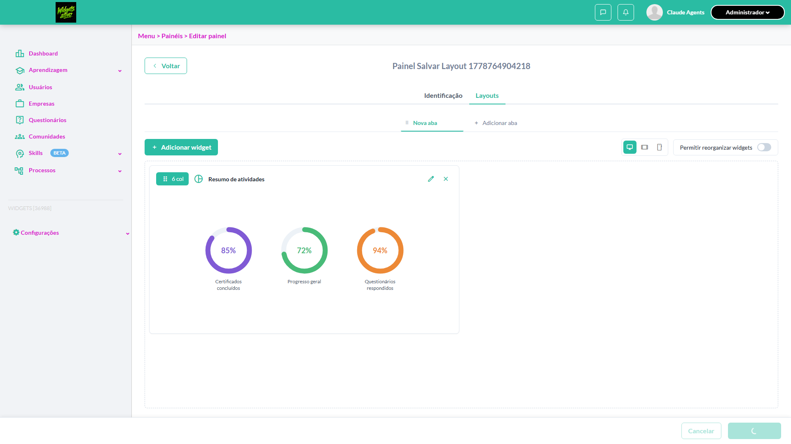

- 📸 **Screenshot (screenshot)** — [`test-failed-1.png`](artifacts/projects-widgets-tests-fea-7f9ad-layout-pela-barra-de-rodapé-chromium/test-failed-1.png)

  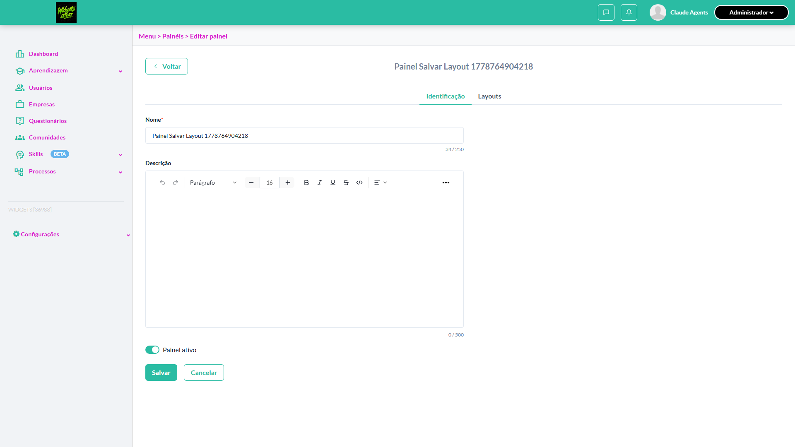

- 🎬 [Vídeo da execução (video.webm)](artifacts/projects-widgets-tests-fea-7f9ad-layout-pela-barra-de-rodapé-chromium/video.webm)

- 🎬 [Vídeo da execução (video-1.webm)](artifacts/projects-widgets-tests-fea-7f9ad-layout-pela-barra-de-rodapé-chromium/video-1.webm)

- 📦 **Trace** — [`trace.zip`](artifacts/projects-widgets-tests-fea-7f9ad-layout-pela-barra-de-rodapé-chromium/trace.zip)

  ```bash
  npx playwright show-trace outputs/widgets/reports/layout-das-abas_20260514-111819/artifacts/projects-widgets-tests-fea-7f9ad-layout-pela-barra-de-rodapé-chromium/trace.zip
  ```

- 🎥 **Vídeo** — [`video.webm`](artifacts/projects-widgets-tests-fea-7f9ad-layout-pela-barra-de-rodapé-chromium/video.webm)

- 🎥 **Vídeo** — [`video-1.webm`](artifacts/projects-widgets-tests-fea-7f9ad-layout-pela-barra-de-rodapé-chromium/video-1.webm)

- 📄 **DOM no momento da falha** — [`error-context.md`](artifacts/projects-widgets-tests-fea-7f9ad-layout-pela-barra-de-rodapé-chromium/error-context.md)

#### 🐛 Pronto para registro de bug

**Descrição do BUG:** [Crítico] Salvar layout pela barra de rodapé — Error: expect(locator).toHaveCount(expected) failed

**Passo a passo para reprodução:**
1. Pré: Ambiente Stage configurado Funcionalidade 'Gestão de Painéis' habilitada no contrato Feature flag 'habilitar_paineis_do_usuario' ativa Usuário logado como Admin Painel em edição com aba contendo widget recém-adicionado
1. 1. Acessar a aba 'Layouts' do painel em edição
1. 2. Clicar no botão 'Salvar layout' da barra de rodapé
1. 3. Reabrir o painel salvo

**Comportamento esperado:** Aba e widgets continuam exibidos exatamente como salvos

**Comportamento atual:** Error: expect(locator).toHaveCount(expected) failed

**Informações:**

| Campo | Valor |
|---|---|
| URL | `https://widgets.stage.twygoead.com/` |
| Login | ${TWYGO_STAGING_WIDGETS_EMAIL} |
| Senha | ${TWYGO_STAGING_WIDGETS_PASSWORD} |
| orgId | 36988 |
| Outros | Browser: chromium |
| Outros | runId: layout-das-abas_20260514-111819 |
| Outros | Duração até a falha: 84.35s |
| Outros | Step impactado: 3. 3. Recarregar página e validar persistência do layout |

**Evidências:**

- Screenshot capturado pelo Playwright (step-01-1-Setup-painel-com-1-widget-adicionado-toast-limpo): artifacts/projects-widgets-tests-fea-7f9ad-layout-pela-barra-de-rodapé-chromium/step-01-1-Setup-painel-com-1-widget-adicionado-toast-limpo-68c2e37049641ec93f05f7e3d15be82af529d0e6.png
- Screenshot capturado pelo Playwright (step-02-2-Clicar-Salvar-Layout-force-true-por-causa-do-iframe-HubSpo): artifacts/projects-widgets-tests-fea-7f9ad-layout-pela-barra-de-rodapé-chromium/step-02-2-Clicar-Salvar-Layout-force-true-por-causa-do-iframe-HubSpo-d9416e17614abec6b27fbc41bc26a3c649220219.png
- Screenshot capturado pelo Playwright (screenshot): artifacts/projects-widgets-tests-fea-7f9ad-layout-pela-barra-de-rodapé-chromium/test-failed-1.png
- Vídeo da execução (video-1.webm): artifacts/projects-widgets-tests-fea-7f9ad-layout-pela-barra-de-rodapé-chromium/video-1.webm
- Vídeo da execução (video.webm): artifacts/projects-widgets-tests-fea-7f9ad-layout-pela-barra-de-rodapé-chromium/video.webm
- Snapshot do DOM/contexto da página (error-context.md): artifacts/projects-widgets-tests-fea-7f9ad-layout-pela-barra-de-rodapé-chromium/error-context.md
- Trace completo do Playwright (.zip) — `npx playwright show-trace`: artifacts/projects-widgets-tests-fea-7f9ad-layout-pela-barra-de-rodapé-chromium/trace.zip

<details><summary>📋 Ver texto agregado para copiar (Jira/GitHub/Linear)</summary>

```
Descrição do BUG
[Crítico] Salvar layout pela barra de rodapé — Error: expect(locator).toHaveCount(expected) failed

Passo a passo para reprodução
  Pré: Ambiente Stage configurado Funcionalidade 'Gestão de Painéis' habilitada no contrato Feature flag 'habilitar_paineis_do_usuario' ativa Usuário logado como Admin Painel em edição com aba contendo widget recém-adicionado
  1. Acessar a aba 'Layouts' do painel em edição
  2. Clicar no botão 'Salvar layout' da barra de rodapé
  3. Reabrir o painel salvo

Comportamento esperado
Aba e widgets continuam exibidos exatamente como salvos

Comportamento atual
Error: expect(locator).toHaveCount(expected) failed

Informações
- URL: https://widgets.stage.twygoead.com/
- Login: ${TWYGO_STAGING_WIDGETS_EMAIL}
- Senha: ${TWYGO_STAGING_WIDGETS_PASSWORD}
- ID do ambiente (orgId): 36988
- Outros:
  - Browser: chromium
  - runId: layout-das-abas_20260514-111819
  - Duração até a falha: 84.35s
  - Step impactado: 3. 3. Recarregar página e validar persistência do layout

Evidências
- Screenshot capturado pelo Playwright (step-01-1-Setup-painel-com-1-widget-adicionado-toast-limpo): artifacts/projects-widgets-tests-fea-7f9ad-layout-pela-barra-de-rodapé-chromium/step-01-1-Setup-painel-com-1-widget-adicionado-toast-limpo-68c2e37049641ec93f05f7e3d15be82af529d0e6.png
- Screenshot capturado pelo Playwright (step-02-2-Clicar-Salvar-Layout-force-true-por-causa-do-iframe-HubSpo): artifacts/projects-widgets-tests-fea-7f9ad-layout-pela-barra-de-rodapé-chromium/step-02-2-Clicar-Salvar-Layout-force-true-por-causa-do-iframe-HubSpo-d9416e17614abec6b27fbc41bc26a3c649220219.png
- Screenshot capturado pelo Playwright (screenshot): artifacts/projects-widgets-tests-fea-7f9ad-layout-pela-barra-de-rodapé-chromium/test-failed-1.png
- Vídeo da execução (video-1.webm): artifacts/projects-widgets-tests-fea-7f9ad-layout-pela-barra-de-rodapé-chromium/video-1.webm
- Vídeo da execução (video.webm): artifacts/projects-widgets-tests-fea-7f9ad-layout-pela-barra-de-rodapé-chromium/video.webm
- Snapshot do DOM/contexto da página (error-context.md): artifacts/projects-widgets-tests-fea-7f9ad-layout-pela-barra-de-rodapé-chromium/error-context.md
- Trace completo do Playwright (.zip) — `npx playwright show-trace`: artifacts/projects-widgets-tests-fea-7f9ad-layout-pela-barra-de-rodapé-chromium/trace.zip

Execução
- runId: layout-das-abas_20260514-111819
- environment.json: staging-widgets
- testsuite: Layout das abas
- testcase: Salvar layout pela barra de rodapé

```

</details>

<details><summary>🔧 Stack trace técnica completa (para desenvolvedor)</summary>

```
Error: expect(locator).toHaveCount(expected) failed

Locator:  locator('[data-test-id^="widgets-grid-item-"]')
Expected: 1
Received: 0
Timeout:  10000ms

Call log:
  - Expect "toHaveCount" with timeout 10000ms
  - waiting for locator('[data-test-id^="widgets-grid-item-"]')
    13 × locator resolved to 0 elements
       - unexpected value "0"

```

</details>

---

### ✅ Aprovado · TC6 · Switch desativado: tentar arrastar widget · 🟡 Normal

<a id="switch-desativado-tentar-arrastar-widget"></a>_Arquivo:_ `switch-desativado-tentar-arrastar.spec.ts` · _Duração:_ 67.36s · _Browser:_ chromium

**Sumário (objetivo do caso):** Validar bloqueio de reorganização com switch desligado (R8 RN60).

**Pré-condições:**

```
Ambiente Stage configurado Funcionalidade 'Gestão de Painéis' habilitada no contrato Feature flag 'habilitar_paineis_do_usuario' ativa Usuário logado como Admin Painel em edição com aba contendo dois widgets
```

**Passos do caso (XML/TestLink + execução Playwright):**

_Cada linha reproduz um passo do XML; a coluna **Status** traz o resultado da execução (do step Allure correspondente). Linhas com "Pré-condição" são da execução automatizada (login, navegação inicial) — não fazem parte do roteiro do XML._

| # | Ação do passo | Resultado esperado | Status | Notas | Duração |
|---|---|---|:---:|---|---:|
| 1 | Acessar a aba 'Layouts' do painel em edição no modo Desktop | Layout é exibido com os widgets | ✅ | — | 59.91s |
| 2 | Manter o switch 'Permitir reorganizar widgets' desligado | Switch permanece desligado | ✅ | — | 1.14s |
| 3 | Tentar arrastar um widget | Widget não é movido (drag bloqueado) e nenhuma alteração ocorre no layout | ✅ | — | 0.50s |

**Evidências:**

📁 _Pasta:_ [`artifacts/projects-widgets-tests-fea-c08e5-vado-tentar-arrastar-widget-chromium/`](artifacts/projects-widgets-tests-fea-c08e5-vado-tentar-arrastar-widget-chromium/)

- 📸 **Screenshot (step-01-1-Setup-painel-com-1-widget-e-switch-OFF-default)** — [`step-01-1-Setup-painel-com-1-widget-e-switch-OFF-default-7558915192ee26df5cb0bb5c20c4634e54615212.png`](artifacts/projects-widgets-tests-fea-c08e5-vado-tentar-arrastar-widget-chromium/step-01-1-Setup-painel-com-1-widget-e-switch-OFF-default-7558915192ee26df5cb0bb5c20c4634e54615212.png)

  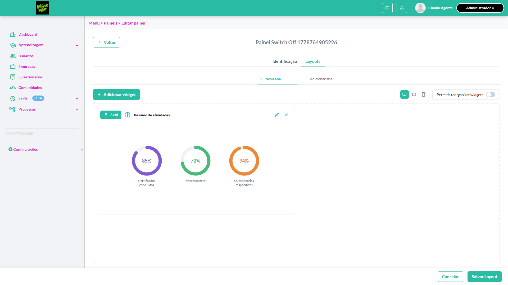

- 📸 **Screenshot (step-02-2-Tentar-arrastar-widget-com-switch-OFF-n-o-deve-mover)** — [`step-02-2-Tentar-arrastar-widget-com-switch-OFF-n-o-deve-mover-ff467af6d6556f17b684fd7bf45e28cf3342dac7.png`](artifacts/projects-widgets-tests-fea-c08e5-vado-tentar-arrastar-widget-chromium/step-02-2-Tentar-arrastar-widget-com-switch-OFF-n-o-deve-mover-ff467af6d6556f17b684fd7bf45e28cf3342dac7.png)

  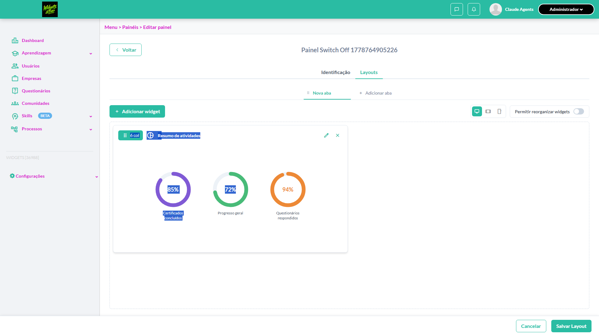

- 📸 **Screenshot (step-03-3-Ativar-switch-e-validar-que-drag-handle-volta-a-responder)** — [`step-03-3-Ativar-switch-e-validar-que-drag-handle-volta-a-responder-1f23524b8757e90ffc0fc9dc34c24a15de620805.png`](artifacts/projects-widgets-tests-fea-c08e5-vado-tentar-arrastar-widget-chromium/step-03-3-Ativar-switch-e-validar-que-drag-handle-volta-a-responder-1f23524b8757e90ffc0fc9dc34c24a15de620805.png)

  

- 📸 **Screenshot (screenshot)** — [`test-finished-1.png`](artifacts/projects-widgets-tests-fea-c08e5-vado-tentar-arrastar-widget-chromium/test-finished-1.png)

  

- 🎬 [Vídeo da execução (video.webm)](artifacts/projects-widgets-tests-fea-c08e5-vado-tentar-arrastar-widget-chromium/video.webm)

- 🎬 [Vídeo da execução (video-1.webm)](artifacts/projects-widgets-tests-fea-c08e5-vado-tentar-arrastar-widget-chromium/video-1.webm)

- 📦 **Trace** — [`trace.zip`](artifacts/projects-widgets-tests-fea-c08e5-vado-tentar-arrastar-widget-chromium/trace.zip)

  ```bash
  npx playwright show-trace outputs/widgets/reports/layout-das-abas_20260514-111819/artifacts/projects-widgets-tests-fea-c08e5-vado-tentar-arrastar-widget-chromium/trace.zip
  ```

- 🎥 **Vídeo** — [`video.webm`](artifacts/projects-widgets-tests-fea-c08e5-vado-tentar-arrastar-widget-chromium/video.webm)

- 🎥 **Vídeo** — [`video-1.webm`](artifacts/projects-widgets-tests-fea-c08e5-vado-tentar-arrastar-widget-chromium/video-1.webm)


---

### ✅ Aprovado · TC10 · Toolbar permanece fixa ao rolar a área de layout · ⚪ Menor

<a id="toolbar-permanece-fixa-ao-rolar-a-area-de-layout"></a>_Arquivo:_ `toolbar-sticky-rolar.spec.ts` · _Duração:_ 108.76s · _Browser:_ chromium

**Sumário (objetivo do caso):** Validar comportamento sticky da toolbar (R8 RN54).

**Pré-condições:**

```
Ambiente Stage configurado Funcionalidade 'Gestão de Painéis' habilitada no contrato Feature flag 'habilitar_paineis_do_usuario' ativa Usuário logado como Admin Painel em edição com aba contendo muitos widgets
```

**Passos do caso (XML/TestLink + execução Playwright):**

_Cada linha reproduz um passo do XML; a coluna **Status** traz o resultado da execução (do step Allure correspondente). Linhas com "Pré-condição" são da execução automatizada (login, navegação inicial) — não fazem parte do roteiro do XML._

| # | Ação do passo | Resultado esperado | Status | Notas | Duração |
|---|---|---|:---:|---|---:|
| 1 | Acessar a aba 'Layouts' do painel em edição | Layout é exibido com vários widgets | ✅ | — | 97.60s |
| 2 | Rolar verticalmente a área de layout | Barra de ferramentas permanece visível e fixa no topo durante a rolagem | ✅ | — | 0.48s |
| 3 | Rolar verticalmente até o final | Barra de rodapé com 'Cancelar' e 'Salvar layout' permanece visível e fixa no rodapé | ✅ | — | 0.34s |

**Evidências:**

📁 _Pasta:_ [`artifacts/projects-widgets-tests-fea-960fe-a-ao-rolar-a-área-de-layout-chromium/`](artifacts/projects-widgets-tests-fea-960fe-a-ao-rolar-a-área-de-layout-chromium/)

- 📸 **Screenshot (step-01-1-Setup-painel-com-4-widgets-para-gerar-altura-suficiente-pr)** — [`step-01-1-Setup-painel-com-4-widgets-para-gerar-altura-suficiente-pr-b4d4eb262d613b9b9090144968a02724e5b61d4c.png`](artifacts/projects-widgets-tests-fea-960fe-a-ao-rolar-a-área-de-layout-chromium/step-01-1-Setup-painel-com-4-widgets-para-gerar-altura-suficiente-pr-b4d4eb262d613b9b9090144968a02724e5b61d4c.png)

  

- 📸 **Screenshot (step-02-2-Scroll-para-baixo-End-e-validar-rodap-permanece-vis-vel)** — [`step-02-2-Scroll-para-baixo-End-e-validar-rodap-permanece-vis-vel-dba35fddc52ec74efa62125aecd119c511986728.png`](artifacts/projects-widgets-tests-fea-960fe-a-ao-rolar-a-área-de-layout-chromium/step-02-2-Scroll-para-baixo-End-e-validar-rodap-permanece-vis-vel-dba35fddc52ec74efa62125aecd119c511986728.png)

  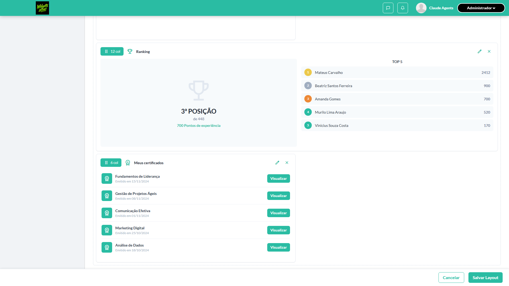

- 📸 **Screenshot (step-03-3-Scroll-para-topo-Home-e-validar-toolbar-de-a-es-vis-vel)** — [`step-03-3-Scroll-para-topo-Home-e-validar-toolbar-de-a-es-vis-vel-803099b859e508d58f1a096e4ea88c014ce8df7a.png`](artifacts/projects-widgets-tests-fea-960fe-a-ao-rolar-a-área-de-layout-chromium/step-03-3-Scroll-para-topo-Home-e-validar-toolbar-de-a-es-vis-vel-803099b859e508d58f1a096e4ea88c014ce8df7a.png)

  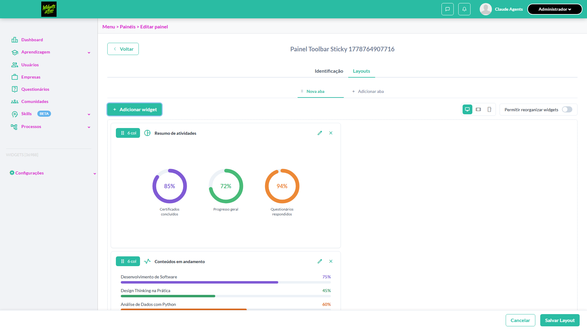

- 📸 **Screenshot (screenshot)** — [`test-finished-1.png`](artifacts/projects-widgets-tests-fea-960fe-a-ao-rolar-a-área-de-layout-chromium/test-finished-1.png)

  

- 🎬 [Vídeo da execução (video.webm)](artifacts/projects-widgets-tests-fea-960fe-a-ao-rolar-a-área-de-layout-chromium/video.webm)

- 🎬 [Vídeo da execução (video-1.webm)](artifacts/projects-widgets-tests-fea-960fe-a-ao-rolar-a-área-de-layout-chromium/video-1.webm)

- 📦 **Trace** — [`trace.zip`](artifacts/projects-widgets-tests-fea-960fe-a-ao-rolar-a-área-de-layout-chromium/trace.zip)

  ```bash
  npx playwright show-trace outputs/widgets/reports/layout-das-abas_20260514-111819/artifacts/projects-widgets-tests-fea-960fe-a-ao-rolar-a-área-de-layout-chromium/trace.zip
  ```

- 🎥 **Vídeo** — [`video.webm`](artifacts/projects-widgets-tests-fea-960fe-a-ao-rolar-a-área-de-layout-chromium/video.webm)

- 🎥 **Vídeo** — [`video-1.webm`](artifacts/projects-widgets-tests-fea-960fe-a-ao-rolar-a-área-de-layout-chromium/video-1.webm)


---

### ✅ Aprovado · TC3 · Trocar visualização para Mobile (360) e validar alerta · 🔴 Crítico

<a id="trocar-visualizacao-para-mobile-360-e-validar-alerta"></a>_Arquivo:_ `trocar-visualizacao-mobile.spec.ts` · _Duração:_ 79.31s · _Browser:_ chromium

**Sumário (objetivo do caso):** Validar comportamento e alerta no modo Mobile (R8 RN57.2).

**Pré-condições:**

```
Ambiente Stage configurado Funcionalidade 'Gestão de Painéis' habilitada no contrato Feature flag 'habilitar_paineis_do_usuario' ativa Usuário logado como Admin Painel em edição com aba contendo widgets
```

**Passos do caso (XML/TestLink + execução Playwright):**

_Cada linha reproduz um passo do XML; a coluna **Status** traz o resultado da execução (do step Allure correspondente). Linhas com "Pré-condição" são da execução automatizada (login, navegação inicial) — não fazem parte do roteiro do XML._

| # | Ação do passo | Resultado esperado | Status | Notas | Duração |
|---|---|---|:---:|---|---:|
| 1 | Acessar a aba 'Layouts' do painel em edição | Layout é exibido no modo Desktop<br /> Com switch 'Permitir reorganizar widgets' habilitado | ✅ | — | 69.44s |
| 2 | Clicar no controle 'Visualização: Mobile' | Layout é renderizado em 360px e alerta exibido: 'Visualização (Mobile) — edição disponível no Desktop' | ✅ | — | 1.13s |
| 3 | Verificar o switch 'Permitir reorganizar widgets' | Switch fica desabilitado e exibe tooltip 'Edição disponível apenas no modo Desktop' | ✅ | — | 0.52s |

**Evidências:**

📁 _Pasta:_ [`artifacts/projects-widgets-tests-fea-32f8d-Mobile-360-e-validar-alerta-chromium/`](artifacts/projects-widgets-tests-fea-32f8d-Mobile-360-e-validar-alerta-chromium/)

- 📸 **Screenshot (step-01-1-Setup-painel-em-Layouts-no-modo-Desktop)** — [`step-01-1-Setup-painel-em-Layouts-no-modo-Desktop-87085523e76cfbd9d1e7d4a75b36b0d66f4e1b2e.png`](artifacts/projects-widgets-tests-fea-32f8d-Mobile-360-e-validar-alerta-chromium/step-01-1-Setup-painel-em-Layouts-no-modo-Desktop-87085523e76cfbd9d1e7d4a75b36b0d66f4e1b2e.png)

  

- 📸 **Screenshot (step-02-2-Clicar-Visualiza-o-Mobile-e-validar-alerta-switch-desabili)** — [`step-02-2-Clicar-Visualiza-o-Mobile-e-validar-alerta-switch-desabili-e49f3bea61d20bef0724eb749217fedbe0fde6eb.png`](artifacts/projects-widgets-tests-fea-32f8d-Mobile-360-e-validar-alerta-chromium/step-02-2-Clicar-Visualiza-o-Mobile-e-validar-alerta-switch-desabili-e49f3bea61d20bef0724eb749217fedbe0fde6eb.png)

  

- 📸 **Screenshot (step-03-3-Validar-car-ter-informativo-do-alerta-Mobile)** — [`step-03-3-Validar-car-ter-informativo-do-alerta-Mobile-98c95a4eaea9ecc8b732de087bcd87ab3cea8184.png`](artifacts/projects-widgets-tests-fea-32f8d-Mobile-360-e-validar-alerta-chromium/step-03-3-Validar-car-ter-informativo-do-alerta-Mobile-98c95a4eaea9ecc8b732de087bcd87ab3cea8184.png)

  

- 📸 **Screenshot (screenshot)** — [`test-finished-1.png`](artifacts/projects-widgets-tests-fea-32f8d-Mobile-360-e-validar-alerta-chromium/test-finished-1.png)

  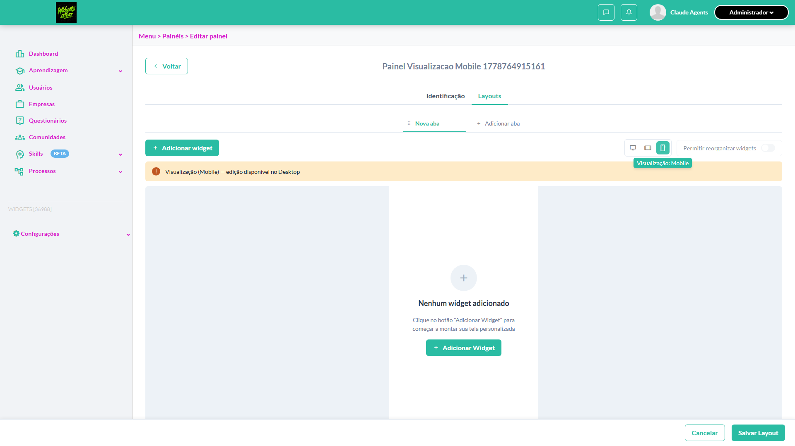

- 🎬 [Vídeo da execução (video.webm)](artifacts/projects-widgets-tests-fea-32f8d-Mobile-360-e-validar-alerta-chromium/video.webm)

- 🎬 [Vídeo da execução (video-1.webm)](artifacts/projects-widgets-tests-fea-32f8d-Mobile-360-e-validar-alerta-chromium/video-1.webm)

- 📦 **Trace** — [`trace.zip`](artifacts/projects-widgets-tests-fea-32f8d-Mobile-360-e-validar-alerta-chromium/trace.zip)

  ```bash
  npx playwright show-trace outputs/widgets/reports/layout-das-abas_20260514-111819/artifacts/projects-widgets-tests-fea-32f8d-Mobile-360-e-validar-alerta-chromium/trace.zip
  ```

- 🎥 **Vídeo** — [`video.webm`](artifacts/projects-widgets-tests-fea-32f8d-Mobile-360-e-validar-alerta-chromium/video.webm)

- 🎥 **Vídeo** — [`video-1.webm`](artifacts/projects-widgets-tests-fea-32f8d-Mobile-360-e-validar-alerta-chromium/video-1.webm)


---

### ✅ Aprovado · TC2 · Trocar visualização para Tablet (768) e validar alerta · 🔴 Crítico

<a id="trocar-visualizacao-para-tablet-768-e-validar-alerta"></a>_Arquivo:_ `trocar-visualizacao-tablet.spec.ts` · _Duração:_ 49.25s · _Browser:_ chromium

**Sumário (objetivo do caso):** Validar comportamento e alerta no modo Tablet (R8 RN57, RN57.1).

**Pré-condições:**

```
Ambiente Stage configurado Funcionalidade 'Gestão de Painéis' habilitada no contrato Feature flag 'habilitar_paineis_do_usuario' ativa Usuário logado como Admin Painel em edição com aba contendo widgets
```

**Passos do caso (XML/TestLink + execução Playwright):**

_Cada linha reproduz um passo do XML; a coluna **Status** traz o resultado da execução (do step Allure correspondente). Linhas com "Pré-condição" são da execução automatizada (login, navegação inicial) — não fazem parte do roteiro do XML._

| # | Ação do passo | Resultado esperado | Status | Notas | Duração |
|---|---|---|:---:|---|---:|
| 1 | Acessar a aba 'Layouts' do painel em edição | Layout é exibido no modo Desktop por padrão<br /> Com switch 'Permitir reorganizar widgets' habilitado | ✅ | — | 42.94s |
| 2 | Clicar no controle 'Visualização: Tablet' | Layout é renderizado em 768px e alerta exibido: 'Visualização (Tablet) — edição disponível no Desktop' | ✅ | — | 0.90s |
| 3 | Verificar o switch 'Permitir reorganizar widgets' | Switch fica desabilitado e exibe tooltip 'Edição disponível apenas no modo Desktop' ao passar o cursor | ✅ | — | 0.59s |

**Evidências:**

📁 _Pasta:_ [`artifacts/projects-widgets-tests-fea-06fd1-Tablet-768-e-validar-alerta-chromium/`](artifacts/projects-widgets-tests-fea-06fd1-Tablet-768-e-validar-alerta-chromium/)

- 📸 **Screenshot (step-01-1-Setup-painel-em-Layouts-no-modo-Desktop-default)** — [`step-01-1-Setup-painel-em-Layouts-no-modo-Desktop-default-67343d7972194d4ac91ad035b7cef21a3ce9ae4e.png`](artifacts/projects-widgets-tests-fea-06fd1-Tablet-768-e-validar-alerta-chromium/step-01-1-Setup-painel-em-Layouts-no-modo-Desktop-default-67343d7972194d4ac91ad035b7cef21a3ce9ae4e.png)

  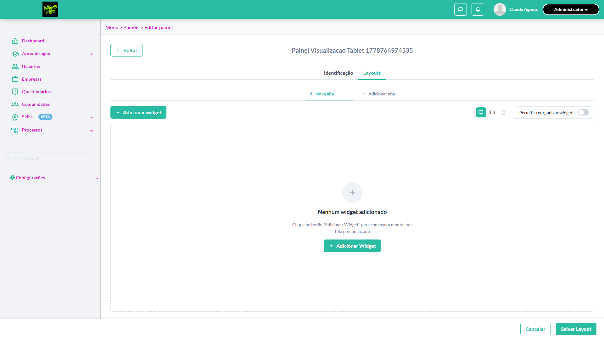

- 📸 **Screenshot (step-02-2-Clicar-Visualiza-o-Tablet-e-validar-mudan-a-de-estado)** — [`step-02-2-Clicar-Visualiza-o-Tablet-e-validar-mudan-a-de-estado-941eaa4132d85c6d590cd8cf11bb71c11bbdeeb0.png`](artifacts/projects-widgets-tests-fea-06fd1-Tablet-768-e-validar-alerta-chromium/step-02-2-Clicar-Visualiza-o-Tablet-e-validar-mudan-a-de-estado-941eaa4132d85c6d590cd8cf11bb71c11bbdeeb0.png)

  

- 📸 **Screenshot (step-03-3-Validar-que-alerta-informativo-e-edi-o-fica-bloqueada-em-T)** — [`step-03-3-Validar-que-alerta-informativo-e-edi-o-fica-bloqueada-em-T-a6d1e803d70aa212c8f31e95f17c2aa938374314.png`](artifacts/projects-widgets-tests-fea-06fd1-Tablet-768-e-validar-alerta-chromium/step-03-3-Validar-que-alerta-informativo-e-edi-o-fica-bloqueada-em-T-a6d1e803d70aa212c8f31e95f17c2aa938374314.png)

  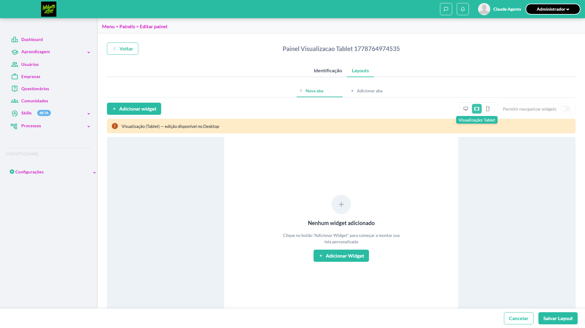

- 📸 **Screenshot (screenshot)** — [`test-finished-1.png`](artifacts/projects-widgets-tests-fea-06fd1-Tablet-768-e-validar-alerta-chromium/test-finished-1.png)

  

- 🎬 [Vídeo da execução (video.webm)](artifacts/projects-widgets-tests-fea-06fd1-Tablet-768-e-validar-alerta-chromium/video.webm)

- 🎬 [Vídeo da execução (video-1.webm)](artifacts/projects-widgets-tests-fea-06fd1-Tablet-768-e-validar-alerta-chromium/video-1.webm)

- 📦 **Trace** — [`trace.zip`](artifacts/projects-widgets-tests-fea-06fd1-Tablet-768-e-validar-alerta-chromium/trace.zip)

  ```bash
  npx playwright show-trace outputs/widgets/reports/layout-das-abas_20260514-111819/artifacts/projects-widgets-tests-fea-06fd1-Tablet-768-e-validar-alerta-chromium/trace.zip
  ```

- 🎥 **Vídeo** — [`video.webm`](artifacts/projects-widgets-tests-fea-06fd1-Tablet-768-e-validar-alerta-chromium/video.webm)

- 🎥 **Vídeo** — [`video-1.webm`](artifacts/projects-widgets-tests-fea-06fd1-Tablet-768-e-validar-alerta-chromium/video-1.webm)


---

### ✅ Aprovado · TC1 · Validar barra de ferramentas fixa no topo da área de layout · 🔴 Crítico

<a id="validar-barra-de-ferramentas-fixa-no-topo-da-area-de-layout"></a>_Arquivo:_ `validar-toolbar-fixa.spec.ts` · _Duração:_ 67.95s · _Browser:_ chromium

**Sumário (objetivo do caso):** Validar componentes da toolbar (R8 RN54, RN55).

**Pré-condições:**

```
Ambiente Stage configurado Funcionalidade 'Gestão de Painéis' habilitada no contrato Feature flag 'habilitar_paineis_do_usuario' ativa Usuário logado como Admin Painel em edição com aba 'Nova aba' selecionada
```

**Passos do caso (XML/TestLink + execução Playwright):**

_Cada linha reproduz um passo do XML; a coluna **Status** traz o resultado da execução (do step Allure correspondente). Linhas com "Pré-condição" são da execução automatizada (login, navegação inicial) — não fazem parte do roteiro do XML._

| # | Ação do passo | Resultado esperado | Status | Notas | Duração |
|---|---|---|:---:|---|---:|
| 1 | Acessar a aba 'Layouts' do painel em edição | Barra de ferramentas é exibida no topo da área de layout, fixa enquanto rola | ✅ | — | 62.74s |
| 2 | Verificar os elementos da toolbar | Botão '+ Adicionar widget' à esquerda; controles 'Visualização: Desktop', 'Visualização: Tablet', 'Visualização: Mobile' e switch 'Permitir reorganizar widgets' à direita | ✅ | — | 0.40s |

**Evidências:**

📁 _Pasta:_ [`artifacts/projects-widgets-tests-fea-99416-a-no-topo-da-área-de-layout-chromium/`](artifacts/projects-widgets-tests-fea-99416-a-no-topo-da-área-de-layout-chromium/)

- 📸 **Screenshot (step-01-1-Criar-painel-abrir-Layouts-e-validar-componentes-da-toolba)** — [`step-01-1-Criar-painel-abrir-Layouts-e-validar-componentes-da-toolba-f74c6695191f6a8fc3a7ed7c00ad556266d40656.png`](artifacts/projects-widgets-tests-fea-99416-a-no-topo-da-área-de-layout-chromium/step-01-1-Criar-painel-abrir-Layouts-e-validar-componentes-da-toolba-f74c6695191f6a8fc3a7ed7c00ad556266d40656.png)

  

- 📸 **Screenshot (step-02-2-Verificar-rodap-position-fixed-com-bot-es-Cancelar-e-Salva)** — [`step-02-2-Verificar-rodap-position-fixed-com-bot-es-Cancelar-e-Salva-d05ef3fbe1d45f59e1bf99b7921109a41676de9f.png`](artifacts/projects-widgets-tests-fea-99416-a-no-topo-da-área-de-layout-chromium/step-02-2-Verificar-rodap-position-fixed-com-bot-es-Cancelar-e-Salva-d05ef3fbe1d45f59e1bf99b7921109a41676de9f.png)

  

- 📸 **Screenshot (screenshot)** — [`test-finished-1.png`](artifacts/projects-widgets-tests-fea-99416-a-no-topo-da-área-de-layout-chromium/test-finished-1.png)

  

- 🎬 [Vídeo da execução (video.webm)](artifacts/projects-widgets-tests-fea-99416-a-no-topo-da-área-de-layout-chromium/video.webm)

- 🎬 [Vídeo da execução (video-1.webm)](artifacts/projects-widgets-tests-fea-99416-a-no-topo-da-área-de-layout-chromium/video-1.webm)

- 📦 **Trace** — [`trace.zip`](artifacts/projects-widgets-tests-fea-99416-a-no-topo-da-área-de-layout-chromium/trace.zip)

  ```bash
  npx playwright show-trace outputs/widgets/reports/layout-das-abas_20260514-111819/artifacts/projects-widgets-tests-fea-99416-a-no-topo-da-área-de-layout-chromium/trace.zip
  ```

- 🎥 **Vídeo** — [`video.webm`](artifacts/projects-widgets-tests-fea-99416-a-no-topo-da-área-de-layout-chromium/video.webm)

- 🎥 **Vídeo** — [`video-1.webm`](artifacts/projects-widgets-tests-fea-99416-a-no-topo-da-área-de-layout-chromium/video-1.webm)


---

### ✅ Aprovado · TC4 · Voltar para visualização Desktop após Tablet/Mobile · 🟡 Normal

<a id="voltar-para-visualizacao-desktop-apos-tablet-mobile"></a>_Arquivo:_ `voltar-desktop.spec.ts` · _Duração:_ 54.61s · _Browser:_ chromium

**Sumário (objetivo do caso):** Validar volta ao modo Desktop e reativação do switch.

**Pré-condições:**

```
Ambiente Stage configurado Funcionalidade 'Gestão de Painéis' habilitada no contrato Feature flag 'habilitar_paineis_do_usuario' ativa Usuário logado como Admin Painel em edição com aba contendo widgets
```

**Passos do caso (XML/TestLink + execução Playwright):**

_Cada linha reproduz um passo do XML; a coluna **Status** traz o resultado da execução (do step Allure correspondente). Linhas com "Pré-condição" são da execução automatizada (login, navegação inicial) — não fazem parte do roteiro do XML._

| # | Ação do passo | Resultado esperado | Status | Notas | Duração |
|---|---|---|:---:|---|---:|
| 1 | Acessar a aba 'Layouts' do painel em edição | Layout é exibido | ✅ | — | 47.87s |
| 2 | Clicar no controle 'Visualização: Tablet' | Layout é renderizado em 768px | ✅ | — | 0.21s |
| 3 | Clicar no controle 'Visualização: Desktop' | Layout é renderizado em largura Desktop e alerta de Tablet/Mobile NÃO é exibido | ✅ | — | 0.49s |
| 4 | Verificar o switch 'Permitir reorganizar widgets' | Switch fica habilitado novamente | ✅ | — | 0.15s |

**Evidências:**

📁 _Pasta:_ [`artifacts/projects-widgets-tests-fea-0fd86--Desktop-após-Tablet-Mobile-chromium/`](artifacts/projects-widgets-tests-fea-0fd86--Desktop-após-Tablet-Mobile-chromium/)

- 📸 **Screenshot (step-01-1-Setup-painel-em-Layouts-e-trocar-para-Tablet-primeiro)** — [`step-01-1-Setup-painel-em-Layouts-e-trocar-para-Tablet-primeiro-027034715ee5b9935572593fcbbc2e17a969244e.png`](artifacts/projects-widgets-tests-fea-0fd86--Desktop-após-Tablet-Mobile-chromium/step-01-1-Setup-painel-em-Layouts-e-trocar-para-Tablet-primeiro-027034715ee5b9935572593fcbbc2e17a969244e.png)

  

- 📸 **Screenshot (step-02-2-Verificar-estado-em-Tablet-antes-de-voltar)** — [`step-02-2-Verificar-estado-em-Tablet-antes-de-voltar-a85128e7b8e3bd9c6073d6ca7aa6f409cdb9b7ec.png`](artifacts/projects-widgets-tests-fea-0fd86--Desktop-após-Tablet-Mobile-chromium/step-02-2-Verificar-estado-em-Tablet-antes-de-voltar-a85128e7b8e3bd9c6073d6ca7aa6f409cdb9b7ec.png)

  

- 📸 **Screenshot (step-03-3-Clicar-Visualiza-o-Desktop-e-validar-retorno)** — [`step-03-3-Clicar-Visualiza-o-Desktop-e-validar-retorno-7cad44c5cd486dc917be468fb3b8325f2ae7bee6.png`](artifacts/projects-widgets-tests-fea-0fd86--Desktop-após-Tablet-Mobile-chromium/step-03-3-Clicar-Visualiza-o-Desktop-e-validar-retorno-7cad44c5cd486dc917be468fb3b8325f2ae7bee6.png)

  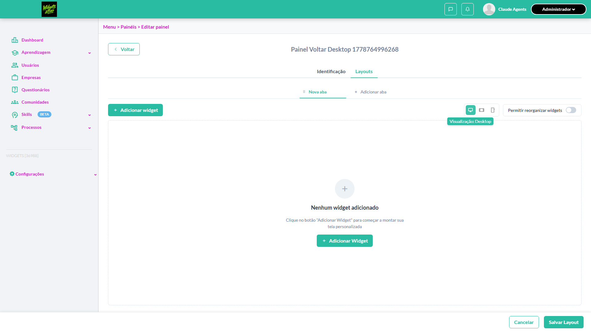

- 📸 **Screenshot (step-04-4-Validar-reativa-o-do-switch-reorganizar-em-Desktop)** — [`step-04-4-Validar-reativa-o-do-switch-reorganizar-em-Desktop-30ecd7b6fc66c0c05b4773ed52b47f5e55e0e715.png`](artifacts/projects-widgets-tests-fea-0fd86--Desktop-após-Tablet-Mobile-chromium/step-04-4-Validar-reativa-o-do-switch-reorganizar-em-Desktop-30ecd7b6fc66c0c05b4773ed52b47f5e55e0e715.png)

  

- 📸 **Screenshot (screenshot)** — [`test-finished-1.png`](artifacts/projects-widgets-tests-fea-0fd86--Desktop-após-Tablet-Mobile-chromium/test-finished-1.png)

  

- 🎬 [Vídeo da execução (video.webm)](artifacts/projects-widgets-tests-fea-0fd86--Desktop-após-Tablet-Mobile-chromium/video.webm)

- 🎬 [Vídeo da execução (video-1.webm)](artifacts/projects-widgets-tests-fea-0fd86--Desktop-após-Tablet-Mobile-chromium/video-1.webm)

- 📦 **Trace** — [`trace.zip`](artifacts/projects-widgets-tests-fea-0fd86--Desktop-após-Tablet-Mobile-chromium/trace.zip)

  ```bash
  npx playwright show-trace outputs/widgets/reports/layout-das-abas_20260514-111819/artifacts/projects-widgets-tests-fea-0fd86--Desktop-após-Tablet-Mobile-chromium/trace.zip
  ```

- 🎥 **Vídeo** — [`video.webm`](artifacts/projects-widgets-tests-fea-0fd86--Desktop-após-Tablet-Mobile-chromium/video.webm)

- 🎥 **Vídeo** — [`video-1.webm`](artifacts/projects-widgets-tests-fea-0fd86--Desktop-após-Tablet-Mobile-chromium/video-1.webm)


---
