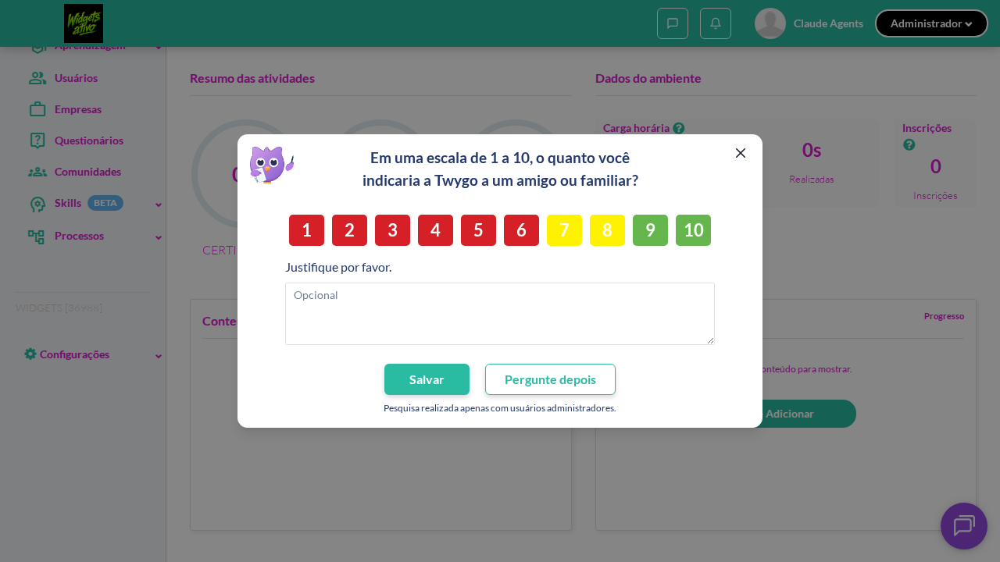
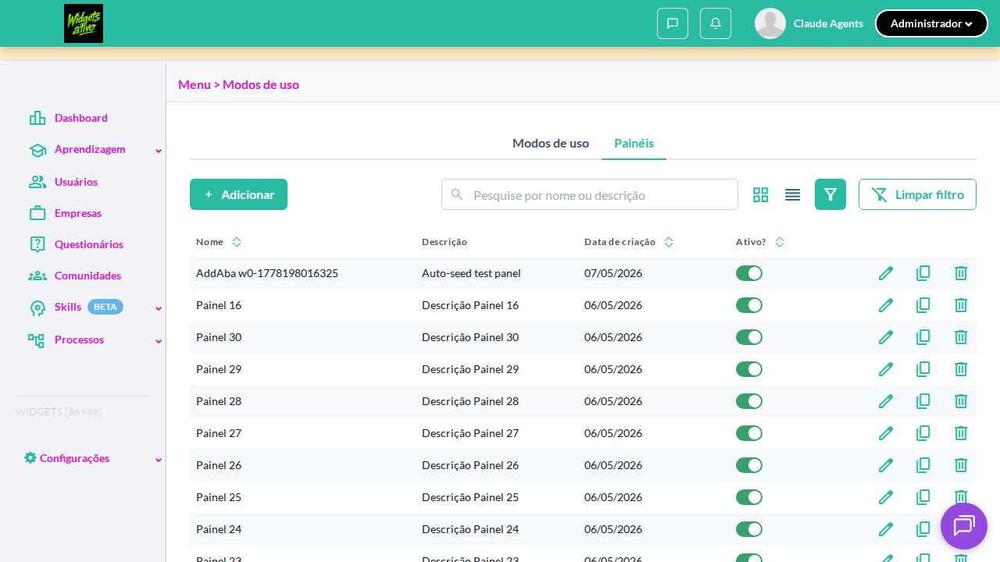
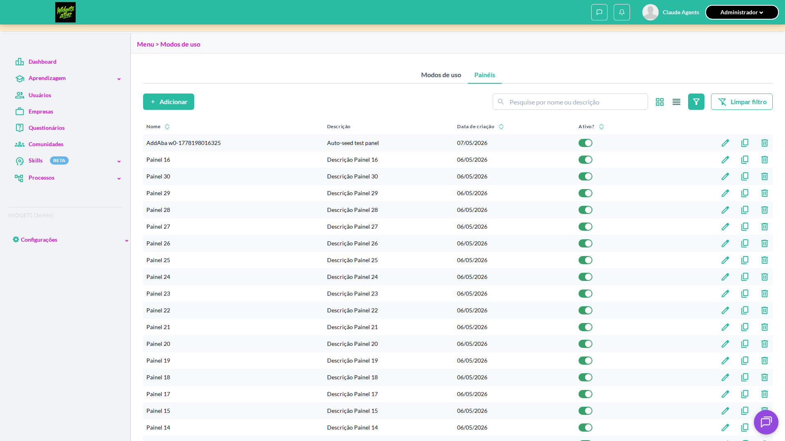

# Casos de teste — Widgets

[← Voltar ao dashboard](index.md)

Lista detalhada por testsuite. Cada caso traz: o que era esperado pelo XML, quais steps foram executados, evidências (screenshots/trace), texto pronto pra registro de bug e — quando houver falha — uma explicação em PT-BR do motivo.

## Listagem de painéis

_8 caso(s) — 4 aprovado(s), 4 falha(s)_

### ❌ Falhou · Acessar a listagem de Painéis a partir do Menu 

<a id="acessar-a-listagem-de-paineis-a-partir-do-menu"></a>_Arquivo:_ `acessar-listagem-paineis-menu.spec.ts` · _Duração:_ 41.50s · _Browser:_ chromium

> **❌ Por que falhou:** Não foi possível clicar o elemento — ele não ficou disponível em 30s (locator: locator('#menu a[name="settings-main-menu"]')).
> _Step impactado:_ **1. Clicar no link 'Menu' da sidebar lateral**

**Passos do caso (XML/TestLink + execução Playwright):**

_Cada linha reproduz um passo do XML; a coluna **Status** traz o resultado da execução (do step Allure correspondente). Linhas com "Pré-condição" são da execução automatizada (login, navegação inicial) — não fazem parte do roteiro do XML._

| # | Ação do passo | Resultado esperado | Status | Notas | Duração |
|---|---|---|:---:|---|---:|
| — | _Pré-condição:_ 1. Clicar no link 'Menu' da sidebar lateral | — | ❌ | Não foi possível clicar o elemento — ele não ficou disponível em 30s (locator: locator('#menu a[name="settings-main-menu"]')). | 39.58s |

**Evidências:**



- 📦 [Trace do Playwright (trace.zip)](../../test-artifacts/projects-widgets-tests-fea-ff427-de-Painéis-a-partir-do-Menu-chromium/trace.zip) — abra com `npx playwright show-trace`

- 📄 [Snapshot do DOM no momento da falha (`error-context.md`)](../../test-artifacts/projects-widgets-tests-fea-ff427-de-Painéis-a-partir-do-Menu-chromium/error-context.md)

#### 🐛 Pronto para registro de bug

**Descrição do BUG:** [—] Acessar a listagem de Painéis a partir do Menu — Não foi possível clicar o elemento — ele não ficou disponível em 30s (locator: locator('#menu a[name="settings-main-menu"]')).

**Passo a passo para reprodução:**
1. — (sem steps documentados no XML)

**Comportamento esperado:** —

**Comportamento atual:** Não foi possível clicar o elemento — ele não ficou disponível em 30s (locator: locator('#menu a[name="settings-main-menu"]')).

**Informações:**

| Campo | Valor |
|---|---|
| URL | `https://widgets.stage.twygoead.com/` |
| Login | ${TWYGO_STAGING_WIDGETS_EMAIL} |
| Senha | ${TWYGO_STAGING_WIDGETS_PASSWORD} |
| orgId | 36988 |
| Outros | Browser: chromium |
| Outros | runId: listagem-de-paineis_20260508-152704 |
| Outros | Duração até a falha: 41.50s |
| Outros | Step impactado: 1. 1. Clicar no link 'Menu' da sidebar lateral |

**Evidências:**

- Screenshot capturado pelo Playwright (screenshot): ../../test-artifacts/projects-widgets-tests-fea-ff427-de-Painéis-a-partir-do-Menu-chromium/test-failed-1.png
- Snapshot do DOM/contexto da página (error-context.md): ../../test-artifacts/projects-widgets-tests-fea-ff427-de-Painéis-a-partir-do-Menu-chromium/error-context.md
- Trace completo do Playwright (.zip) — `npx playwright show-trace`: ../../test-artifacts/projects-widgets-tests-fea-ff427-de-Painéis-a-partir-do-Menu-chromium/trace.zip

<details><summary>📋 Ver texto agregado para copiar (Jira/GitHub/Linear)</summary>

```
Descrição do BUG
[—] Acessar a listagem de Painéis a partir do Menu — Não foi possível clicar o elemento — ele não ficou disponível em 30s (locator: locator('#menu a[name="settings-main-menu"]')).

Passo a passo para reprodução
  — (sem steps documentados no XML)

Comportamento esperado
—

Comportamento atual
Não foi possível clicar o elemento — ele não ficou disponível em 30s (locator: locator('#menu a[name="settings-main-menu"]')).

Informações
- URL: https://widgets.stage.twygoead.com/
- Login: ${TWYGO_STAGING_WIDGETS_EMAIL}
- Senha: ${TWYGO_STAGING_WIDGETS_PASSWORD}
- ID do ambiente (orgId): 36988
- Outros:
  - Browser: chromium
  - runId: listagem-de-paineis_20260508-152704
  - Duração até a falha: 41.50s
  - Step impactado: 1. 1. Clicar no link 'Menu' da sidebar lateral

Evidências
- Screenshot capturado pelo Playwright (screenshot): ../../test-artifacts/projects-widgets-tests-fea-ff427-de-Painéis-a-partir-do-Menu-chromium/test-failed-1.png
- Snapshot do DOM/contexto da página (error-context.md): ../../test-artifacts/projects-widgets-tests-fea-ff427-de-Painéis-a-partir-do-Menu-chromium/error-context.md
- Trace completo do Playwright (.zip) — `npx playwright show-trace`: ../../test-artifacts/projects-widgets-tests-fea-ff427-de-Painéis-a-partir-do-Menu-chromium/trace.zip

Execução
- runId: listagem-de-paineis_20260508-152704
- environment.json: staging-widgets
- testsuite: Listagem de painéis
- testcase: Acessar a listagem de Painéis a partir do Menu

```

</details>

<details><summary>🔧 Stack trace técnica completa (para desenvolvedor)</summary>

```
TimeoutError: locator.click: Timeout 30000ms exceeded.
Call log:
  - waiting for locator('#menu a[name="settings-main-menu"]')
    - locator resolved to <a name="settings-main-menu">…</a>
  - attempting click action
    2 × waiting for element to be visible, enabled and stable
      - element is visible, enabled and stable
      - scrolling into view if needed
      - done scrolling
      - <div tabindex="-1" class="chakra-modal__content-container css-wl0d9u">…</div> from <div class="chakra-portal">…</div> subtree intercepts pointer events
    - retrying click action
    - waiting 20ms
    2 × waiting for element to be visible, enabled and stable
      - element is visible, enabled and stable
      - scrolling into view if needed
      - done scrolling
      - <div tabindex="-1" class="chakra-modal__content-container css-wl0d9u">…</div> from <div class="chakra-portal">…</div> subtree intercepts pointer events
    - retrying click action
      - waiting 100ms
    57 × waiting for element to be visible, enabled and stable
       - element is visible, enabled and stable
       - scrolling into view if needed
       - done scrolling
       - <div tabindex="-1" class="chakra-modal__content-container css-wl0d9u">…</div> from <div class="chakra-portal">…</div> subtree intercepts pointer events
     - retrying click action
       - waiting 500ms

```

</details>

---

### ❌ Falhou · Validar acessibilidade por teclado (TAB / setas / ENTER / ESC) 

<a id="validar-acessibilidade-por-teclado-tab-setas-enter-esc"></a>_Arquivo:_ `acessibilidade-teclado.spec.ts` · _Duração:_ 52.03s · _Browser:_ chromium

> **❌ Por que falhou:** TimeoutError: locator.waitFor: Timeout 30000ms exceeded.
> _Step impactado:_ **1. Acessar a listagem de Painéis**

**Passos do caso (XML/TestLink + execução Playwright):**

_Cada linha reproduz um passo do XML; a coluna **Status** traz o resultado da execução (do step Allure correspondente). Linhas com "Pré-condição" são da execução automatizada (login, navegação inicial) — não fazem parte do roteiro do XML._

| # | Ação do passo | Resultado esperado | Status | Notas | Duração |
|---|---|---|:---:|---|---:|
| — | _Pré-condição:_ 1. Acessar a listagem de Painéis | — | ❌ | TimeoutError: locator.waitFor: Timeout 30000ms exceeded. | 40.34s |

**Evidências:**



- 📦 [Trace do Playwright (trace.zip)](../../test-artifacts/projects-widgets-tests-fea-b00fe-eclado-TAB-setas-ENTER-ESC--chromium/trace.zip) — abra com `npx playwright show-trace`

- 📄 [Snapshot do DOM no momento da falha (`error-context.md`)](../../test-artifacts/projects-widgets-tests-fea-b00fe-eclado-TAB-setas-ENTER-ESC--chromium/error-context.md)

#### 🐛 Pronto para registro de bug

**Descrição do BUG:** [—] Validar acessibilidade por teclado (TAB / setas / ENTER / ESC) — TimeoutError: locator.waitFor: Timeout 30000ms exceeded.

**Passo a passo para reprodução:**
1. — (sem steps documentados no XML)

**Comportamento esperado:** —

**Comportamento atual:** TimeoutError: locator.waitFor: Timeout 30000ms exceeded.

**Informações:**

| Campo | Valor |
|---|---|
| URL | `https://widgets.stage.twygoead.com/` |
| Login | ${TWYGO_STAGING_WIDGETS_EMAIL} |
| Senha | ${TWYGO_STAGING_WIDGETS_PASSWORD} |
| orgId | 36988 |
| Outros | Browser: chromium |
| Outros | runId: listagem-de-paineis_20260508-152704 |
| Outros | Duração até a falha: 52.03s |
| Outros | Step impactado: 1. 1. Acessar a listagem de Painéis |

**Evidências:**

- Screenshot capturado pelo Playwright (screenshot): ../../test-artifacts/projects-widgets-tests-fea-b00fe-eclado-TAB-setas-ENTER-ESC--chromium/test-failed-1.png
- Snapshot do DOM/contexto da página (error-context.md): ../../test-artifacts/projects-widgets-tests-fea-b00fe-eclado-TAB-setas-ENTER-ESC--chromium/error-context.md
- Trace completo do Playwright (.zip) — `npx playwright show-trace`: ../../test-artifacts/projects-widgets-tests-fea-b00fe-eclado-TAB-setas-ENTER-ESC--chromium/trace.zip

<details><summary>📋 Ver texto agregado para copiar (Jira/GitHub/Linear)</summary>

```
Descrição do BUG
[—] Validar acessibilidade por teclado (TAB / setas / ENTER / ESC) — TimeoutError: locator.waitFor: Timeout 30000ms exceeded.

Passo a passo para reprodução
  — (sem steps documentados no XML)

Comportamento esperado
—

Comportamento atual
TimeoutError: locator.waitFor: Timeout 30000ms exceeded.

Informações
- URL: https://widgets.stage.twygoead.com/
- Login: ${TWYGO_STAGING_WIDGETS_EMAIL}
- Senha: ${TWYGO_STAGING_WIDGETS_PASSWORD}
- ID do ambiente (orgId): 36988
- Outros:
  - Browser: chromium
  - runId: listagem-de-paineis_20260508-152704
  - Duração até a falha: 52.03s
  - Step impactado: 1. 1. Acessar a listagem de Painéis

Evidências
- Screenshot capturado pelo Playwright (screenshot): ../../test-artifacts/projects-widgets-tests-fea-b00fe-eclado-TAB-setas-ENTER-ESC--chromium/test-failed-1.png
- Snapshot do DOM/contexto da página (error-context.md): ../../test-artifacts/projects-widgets-tests-fea-b00fe-eclado-TAB-setas-ENTER-ESC--chromium/error-context.md
- Trace completo do Playwright (.zip) — `npx playwright show-trace`: ../../test-artifacts/projects-widgets-tests-fea-b00fe-eclado-TAB-setas-ENTER-ESC--chromium/trace.zip

Execução
- runId: listagem-de-paineis_20260508-152704
- environment.json: staging-widgets
- testsuite: Listagem de painéis
- testcase: Validar acessibilidade por teclado (TAB / setas / ENTER / ESC)

```

</details>

<details><summary>🔧 Stack trace técnica completa (para desenvolvedor)</summary>

```
TimeoutError: locator.waitFor: Timeout 30000ms exceeded.
Call log:
  - waiting for getByRole('tab', { name: 'Painéis' }) to be visible

```

</details>

---

### ❌ Falhou · Alternar entre visualização em lista e cards · 🟡 Normal

<a id="alternar-entre-visualizacao-em-lista-e-cards"></a>_Arquivo:_ `alternar-lista-cards.spec.ts` · _Duração:_ 42.57s · _Browser:_ chromium

> **❌ Por que falhou:** TimeoutError: locator.waitFor: Timeout 30000ms exceeded.
> _Step impactado:_ **1. Acessar a listagem (default em 1920x1080 é 'Lista')**

**Sumário (objetivo do caso):** Validar troca de visualização lista/cards e persistência da seleção do usuário (R2).

**Pré-condições:**

```
Ambiente Stage configurado Funcionalidade 'Gestão de Painéis' habilitada no contrato Feature flag 'habilitar_paineis_do_usuario' ativa Usuário logado como Admin Existem painéis previamente cadastrados na organização
```

**Passos do caso (XML/TestLink + execução Playwright):**

_Cada linha reproduz um passo do XML; a coluna **Status** traz o resultado da execução (do step Allure correspondente). Linhas com "Pré-condição" são da execução automatizada (login, navegação inicial) — não fazem parte do roteiro do XML._

| # | Ação do passo | Resultado esperado | Status | Notas | Duração |
|---|---|---|:---:|---|---:|
| 1 | Acessar a aba 'Painéis' em Configurações > Menu | Listagem é exibida no modo 'Lista' por padrão | ❌ | TimeoutError: locator.waitFor: Timeout 30000ms exceeded. | 40.68s |
| 2 | Clicar no controle de visualização 'Cards' | Listagem é renderizada em formato de cards | ⊘ | Step não executado: o teste foi interrompido antes. Causa: TimeoutError: locator.waitFor: Timeout 30000ms exceeded.. | — |
| 3 | Clicar no controle de visualização 'Lista' | Listagem volta a ser renderizada em formato de tabela com as colunas padrão | ⊘ | Step não executado: o teste foi interrompido antes. Causa: TimeoutError: locator.waitFor: Timeout 30000ms exceeded.. | — |

**Evidências:**



- 📦 [Trace do Playwright (trace.zip)](../../test-artifacts/projects-widgets-tests-fea-ee775-sualização-em-lista-e-cards-chromium/trace.zip) — abra com `npx playwright show-trace`

- 📄 [Snapshot do DOM no momento da falha (`error-context.md`)](../../test-artifacts/projects-widgets-tests-fea-ee775-sualização-em-lista-e-cards-chromium/error-context.md)

#### 🐛 Pronto para registro de bug

**Descrição do BUG:** [Normal] Alternar entre visualização em lista e cards — TimeoutError: locator.waitFor: Timeout 30000ms exceeded.

**Passo a passo para reprodução:**
1. Pré: Ambiente Stage configurado Funcionalidade 'Gestão de Painéis' habilitada no contrato Feature flag 'habilitar_paineis_do_usuario' ativa Usuário logado como Admin Existem painéis previamente cadastrados na organização
1. 1. Acessar a aba 'Painéis' em Configurações > Menu
1. 2. Clicar no controle de visualização 'Cards'
1. 3. Clicar no controle de visualização 'Lista'

**Comportamento esperado:** Listagem é exibida no modo 'Lista' por padrão

**Comportamento atual:** TimeoutError: locator.waitFor: Timeout 30000ms exceeded.

**Informações:**

| Campo | Valor |
|---|---|
| URL | `https://widgets.stage.twygoead.com/` |
| Login | ${TWYGO_STAGING_WIDGETS_EMAIL} |
| Senha | ${TWYGO_STAGING_WIDGETS_PASSWORD} |
| orgId | 36988 |
| Outros | Browser: chromium |
| Outros | runId: listagem-de-paineis_20260508-152704 |
| Outros | Duração até a falha: 42.57s |
| Outros | Step impactado: 1. 1. Acessar a listagem (default em 1920x1080 é 'Lista') |

**Evidências:**

- Screenshot capturado pelo Playwright (screenshot): ../../test-artifacts/projects-widgets-tests-fea-ee775-sualização-em-lista-e-cards-chromium/test-failed-1.png
- Snapshot do DOM/contexto da página (error-context.md): ../../test-artifacts/projects-widgets-tests-fea-ee775-sualização-em-lista-e-cards-chromium/error-context.md
- Trace completo do Playwright (.zip) — `npx playwright show-trace`: ../../test-artifacts/projects-widgets-tests-fea-ee775-sualização-em-lista-e-cards-chromium/trace.zip

<details><summary>📋 Ver texto agregado para copiar (Jira/GitHub/Linear)</summary>

```
Descrição do BUG
[Normal] Alternar entre visualização em lista e cards — TimeoutError: locator.waitFor: Timeout 30000ms exceeded.

Passo a passo para reprodução
  Pré: Ambiente Stage configurado Funcionalidade 'Gestão de Painéis' habilitada no contrato Feature flag 'habilitar_paineis_do_usuario' ativa Usuário logado como Admin Existem painéis previamente cadastrados na organização
  1. Acessar a aba 'Painéis' em Configurações > Menu
  2. Clicar no controle de visualização 'Cards'
  3. Clicar no controle de visualização 'Lista'

Comportamento esperado
Listagem é exibida no modo 'Lista' por padrão

Comportamento atual
TimeoutError: locator.waitFor: Timeout 30000ms exceeded.

Informações
- URL: https://widgets.stage.twygoead.com/
- Login: ${TWYGO_STAGING_WIDGETS_EMAIL}
- Senha: ${TWYGO_STAGING_WIDGETS_PASSWORD}
- ID do ambiente (orgId): 36988
- Outros:
  - Browser: chromium
  - runId: listagem-de-paineis_20260508-152704
  - Duração até a falha: 42.57s
  - Step impactado: 1. 1. Acessar a listagem (default em 1920x1080 é 'Lista')

Evidências
- Screenshot capturado pelo Playwright (screenshot): ../../test-artifacts/projects-widgets-tests-fea-ee775-sualização-em-lista-e-cards-chromium/test-failed-1.png
- Snapshot do DOM/contexto da página (error-context.md): ../../test-artifacts/projects-widgets-tests-fea-ee775-sualização-em-lista-e-cards-chromium/error-context.md
- Trace completo do Playwright (.zip) — `npx playwright show-trace`: ../../test-artifacts/projects-widgets-tests-fea-ee775-sualização-em-lista-e-cards-chromium/trace.zip

Execução
- runId: listagem-de-paineis_20260508-152704
- environment.json: staging-widgets
- testsuite: Listagem de painéis
- testcase: Alternar entre visualização em lista e cards

```

</details>

<details><summary>🔧 Stack trace técnica completa (para desenvolvedor)</summary>

```
TimeoutError: locator.waitFor: Timeout 30000ms exceeded.
Call log:
  - waiting for getByRole('tab', { name: 'Painéis' }) to be visible

```

</details>

---

### ❌ Falhou · Acessar listagem com a feature flag desabilitada · 🔴 Crítico

<a id="acessar-listagem-com-a-feature-flag-desabilitada"></a>_Arquivo:_ `feature-flag-desabilitada.spec.ts` · _Duração:_ 22.11s · _Browser:_ chromium

> **❌ Por que falhou:** O elemento esperado não apareceu na tela (locator: getByRole('tab', { name: 'Modos de uso' })).
> _Step impactado:_ **1. Acessar /use_modes e verificar tabs**

**Sumário (objetivo do caso):** Garantir que aba 'Painéis' não é exibida quando a flag está desabilitada (R1).

**Pré-condições:**

```
Ambiente Stage configurado Funcionalidade 'Gestão de Painéis' habilitada no contrato Feature flag 'habilitar_paineis_do_usuario' DESABILITADA Usuário logado como Admin
```

**Passos do caso (XML/TestLink + execução Playwright):**

_Cada linha reproduz um passo do XML; a coluna **Status** traz o resultado da execução (do step Allure correspondente). Linhas com "Pré-condição" são da execução automatizada (login, navegação inicial) — não fazem parte do roteiro do XML._

| # | Ação do passo | Resultado esperado | Status | Notas | Duração |
|---|---|---|:---:|---|---:|
| 1 | Acessar Menu > Modos de uso | Tela de Modos de uso é exibida | ❌ | O elemento esperado não apareceu na tela (locator: getByRole('tab', { name: 'Modos de uso' })). | 20.43s |
| 2 | Verificar a presença da aba 'Painéis' | Aba 'Painéis' NÃO é exibida na tela de Modos de uso | ⊘ | Step não executado: o teste foi interrompido antes. Causa: O elemento esperado não apareceu na tela (locator: getByRole('tab', { name: 'Modos de uso' })).. | — |
| 3 | Acessar diretamente pela rota da aba 'Painéis' | Mensagem padrão de que a página não existe | ⊘ | Step não executado: o teste foi interrompido antes. Causa: O elemento esperado não apareceu na tela (locator: getByRole('tab', { name: 'Modos de uso' })).. | — |

**Evidências:**


- 📦 [Trace do Playwright (trace.zip)](../../test-artifacts/projects-widgets-tests-fea-0c79e-a-feature-flag-desabilitada-chromium/trace.zip) — abra com `npx playwright show-trace`

- 📄 [Snapshot do DOM no momento da falha (`error-context.md`)](../../test-artifacts/projects-widgets-tests-fea-0c79e-a-feature-flag-desabilitada-chromium/error-context.md)

#### 🐛 Pronto para registro de bug

**Descrição do BUG:** [Crítico] Acessar listagem com a feature flag desabilitada — O elemento esperado não apareceu na tela (locator: getByRole('tab', { name: 'Modos de uso' })).

**Passo a passo para reprodução:**
1. Pré: Ambiente Stage configurado Funcionalidade 'Gestão de Painéis' habilitada no contrato Feature flag 'habilitar_paineis_do_usuario' DESABILITADA Usuário logado como Admin
1. 1. Acessar Menu > Modos de uso
1. 2. Verificar a presença da aba 'Painéis'
1. 3. Acessar diretamente pela rota da aba 'Painéis'

**Comportamento esperado:** Tela de Modos de uso é exibida

**Comportamento atual:** O elemento esperado não apareceu na tela (locator: getByRole('tab', { name: 'Modos de uso' })).

**Informações:**

| Campo | Valor |
|---|---|
| URL | `https://widgets.stage.twygoead.com/` |
| Login | ${TWYGO_STAGING_WIDGETS_EMAIL} |
| Senha | ${TWYGO_STAGING_WIDGETS_PASSWORD} |
| orgId | 36989 |
| Outros | Browser: chromium |
| Outros | runId: listagem-de-paineis_20260508-152704 |
| Outros | Duração até a falha: 22.11s |
| Outros | Step impactado: 1. 1. Acessar /use_modes e verificar tabs |

**Evidências:**

- Screenshot capturado pelo Playwright (screenshot): ../../test-artifacts/projects-widgets-tests-fea-0c79e-a-feature-flag-desabilitada-chromium/test-failed-1.png
- Snapshot do DOM/contexto da página (error-context.md): ../../test-artifacts/projects-widgets-tests-fea-0c79e-a-feature-flag-desabilitada-chromium/error-context.md
- Trace completo do Playwright (.zip) — `npx playwright show-trace`: ../../test-artifacts/projects-widgets-tests-fea-0c79e-a-feature-flag-desabilitada-chromium/trace.zip

<details><summary>📋 Ver texto agregado para copiar (Jira/GitHub/Linear)</summary>

```
Descrição do BUG
[Crítico] Acessar listagem com a feature flag desabilitada — O elemento esperado não apareceu na tela (locator: getByRole('tab', { name: 'Modos de uso' })).

Passo a passo para reprodução
  Pré: Ambiente Stage configurado Funcionalidade 'Gestão de Painéis' habilitada no contrato Feature flag 'habilitar_paineis_do_usuario' DESABILITADA Usuário logado como Admin
  1. Acessar Menu > Modos de uso
  2. Verificar a presença da aba 'Painéis'
  3. Acessar diretamente pela rota da aba 'Painéis'

Comportamento esperado
Tela de Modos de uso é exibida

Comportamento atual
O elemento esperado não apareceu na tela (locator: getByRole('tab', { name: 'Modos de uso' })).

Informações
- URL: https://widgets.stage.twygoead.com/
- Login: ${TWYGO_STAGING_WIDGETS_EMAIL}
- Senha: ${TWYGO_STAGING_WIDGETS_PASSWORD}
- ID do ambiente (orgId): 36989
- Outros:
  - Browser: chromium
  - runId: listagem-de-paineis_20260508-152704
  - Duração até a falha: 22.11s
  - Step impactado: 1. 1. Acessar /use_modes e verificar tabs

Evidências
- Screenshot capturado pelo Playwright (screenshot): ../../test-artifacts/projects-widgets-tests-fea-0c79e-a-feature-flag-desabilitada-chromium/test-failed-1.png
- Snapshot do DOM/contexto da página (error-context.md): ../../test-artifacts/projects-widgets-tests-fea-0c79e-a-feature-flag-desabilitada-chromium/error-context.md
- Trace completo do Playwright (.zip) — `npx playwright show-trace`: ../../test-artifacts/projects-widgets-tests-fea-0c79e-a-feature-flag-desabilitada-chromium/trace.zip

Execução
- runId: listagem-de-paineis_20260508-152704
- environment.json: staging-widgets
- testsuite: Listagem de painéis
- testcase: Acessar listagem com a feature flag desabilitada

```

</details>

<details><summary>🔧 Stack trace técnica completa (para desenvolvedor)</summary>

```
Error: expect(locator).toBeVisible() failed

Locator: getByRole('tab', { name: 'Modos de uso' })
Expected: visible
Timeout: 10000ms
Error: element(s) not found

Call log:
  - Expect "toBeVisible" with timeout 10000ms
  - waiting for getByRole('tab', { name: 'Modos de uso' })

```

</details>

---

### ✅ Aprovado · Ordenar listagem por cada coluna · 🟡 Normal

<a id="ordenar-listagem-por-cada-coluna"></a>_Arquivo:_ `ordenar-colunas.spec.ts` · _Duração:_ 12.41s · _Browser:_ chromium

**Sumário (objetivo do caso):** Validar ordenação ascendente/descendente em cada coluna ordenável (R2).

**Pré-condições:**

```
Ambiente Stage configurado Funcionalidade 'Gestão de Painéis' habilitada no contrato Feature flag 'habilitar_paineis_do_usuario' ativa Usuário logado como Admin Existem ao menos 3 painéis cadastrados
```

**Passos do caso (XML/TestLink + execução Playwright):**

_Cada linha reproduz um passo do XML; a coluna **Status** traz o resultado da execução (do step Allure correspondente). Linhas com "Pré-condição" são da execução automatizada (login, navegação inicial) — não fazem parte do roteiro do XML._

| # | Ação do passo | Resultado esperado | Status | Notas | Duração |
|---|---|---|:---:|---|---:|
| 1 | Acessar a aba 'Painéis' em Configurações > Menu | Listagem é exibida com ordenação padrão | ✅ | — | 7.38s |
| 2 | Clicar no cabeçalho da coluna 'Nome' | Linhas são reordenadas em ordem alfabética crescente pelo nome | ✅ | — | 0.40s |
| 3 | Clicar novamente no cabeçalho da coluna 'Nome' | Linhas são reordenadas em ordem alfabética decrescente pelo nome | ✅ | — | 0.56s |
| 4 | Clicar no cabeçalho da coluna 'Descrição' | Linhas são reordenadas em ordem alfabética crescente pela descrição | ✅ | — | 0.52s |
| 5 | Clicar novamente no cabeçalho da coluna 'Descrição' | Linhas são reordenadas em ordem alfabética decrescente pelo nome | ✅ | — | 0.51s |
| 6 | Clicar no cabeçalho da coluna 'Provedora' | Linhas são reordenadas em ordem alfabética crescente pelo nome do provedor | ✅ | — | 0.58s |
| 7 | Clicar novamente no cabeçalho da coluna 'Provedora' | Linhas são reordenadas em ordem alfabética decrescente pelo nome do provedor | ✅ | — | 0.60s |
| 8 | Clicar no cabeçalho da coluna 'Data de criação' | Linhas são reordenadas pela data de criação na ordem de data mais antiga para a mais recente | ✅ | — | — |
| 9 | Clicar novamente no cabeçalho da coluna 'Data de criação' | Linhas são reordenadas pela data de criação na ordem de data mais recente para a mais antiga | ✅ | — | — |
| 10 | Clicar no cabeçalho da coluna 'Ativo' | Linhas são ordenadas de inativos para ativos | ✅ | — | — |
| 11 | Clicar novamente no cabeçalho da coluna 'Ativo' | Linhas são ordenadas de ativos para inativos | ✅ | — | — |

**Evidências:**

_Sem evidências anexadas._


---

### ✅ Aprovado · Paginação da listagem com volume de painéis · 🟡 Normal

<a id="paginacao-da-listagem-com-volume-de-paineis"></a>_Arquivo:_ `paginacao-listagem.spec.ts` · _Duração:_ 9.35s · _Browser:_ chromium

**Sumário (objetivo do caso):** Validar paginação quando há mais painéis que o limite por página.

**Pré-condições:**

```
Ambiente Stage configurado Funcionalidade 'Gestão de Painéis' habilitada no contrato Feature flag 'habilitar_paineis_do_usuario' ativa Usuário logado como Admin Existem mais de 25 painéis cadastrados
```

**Passos do caso (XML/TestLink + execução Playwright):**

_Cada linha reproduz um passo do XML; a coluna **Status** traz o resultado da execução (do step Allure correspondente). Linhas com "Pré-condição" são da execução automatizada (login, navegação inicial) — não fazem parte do roteiro do XML._

| # | Ação do passo | Resultado esperado | Status | Notas | Duração |
|---|---|---|:---:|---|---:|
| 1 | Acessar a aba 'Painéis' em Configurações > Menu | Listagem é exibida com paginação no rodapé | ✅ | — | 6.50s |
| 2 | Clicar no botão 'Próxima página' do paginador | Sistema avança uma página e exibe os próximos registros | ✅ | — | 0.55s |
| 3 | Clicar no botão 'Página anterior' do paginador | Sistema retorna para a página anterior | ✅ | — | 0.45s |

**Evidências:**

_Sem evidências anexadas._


---

### ✅ Aprovado · Validar colunas exibidas na visualização em lista · 🔴 Crítico

<a id="validar-colunas-exibidas-na-visualizacao-em-lista"></a>_Arquivo:_ `validar-colunas-lista.spec.ts` · _Duração:_ 9.43s · _Browser:_ chromium

**Sumário (objetivo do caso):** Validar colunas Nome, Descrição, Provedora, Data de criação, Ativo e Ações (R2).

**Pré-condições:**

```
Ambiente Stage configurado Funcionalidade 'Gestão de Painéis' habilitada no contrato Feature flag 'habilitar_paineis_do_usuario' ativa Usuário logado como Admin Existem painéis previamente cadastrados na organização
```

**Passos do caso (XML/TestLink + execução Playwright):**

_Cada linha reproduz um passo do XML; a coluna **Status** traz o resultado da execução (do step Allure correspondente). Linhas com "Pré-condição" são da execução automatizada (login, navegação inicial) — não fazem parte do roteiro do XML._

| # | Ação do passo | Resultado esperado | Status | Notas | Duração |
|---|---|---|:---:|---|---:|
| — | _Pré-condição:_ 4. Verificar ícones de ação (editar/duplicar/excluir) na primeira linha | — | ✅ | — | 0.05s |
| 1 | Acessar a aba 'Painéis' em Configurações > Menu no modo 'Lista' | Tabela exibe os cabeçalhos: 'Nome', 'Descrição', 'Provedora', 'Data de criação', 'Ativo', 'Ações' | ✅ | — | 7.08s |
| 2 | Verificar a coluna 'Ativo' | Coluna 'Ativo' apresenta um switch por linha indicando estado ativo/inativo | ✅ | — | 0.08s |
| 3 | Verificar a coluna 'Ações' | Coluna 'Ações' exibe os ícones de 'Editar', 'Duplicar' e 'Excluir' em cada linha | ✅ | — | 0.02s |

**Evidências:**

_Sem evidências anexadas._


---

### ✅ Aprovado · Validar componentes obrigatórios da listagem de painéis · 🔴 Crítico

<a id="validar-componentes-obrigatorios-da-listagem-de-paineis"></a>_Arquivo:_ `validar-componentes-obrigatorios.spec.ts` · _Duração:_ 9.64s · _Browser:_ chromium

**Sumário (objetivo do caso):** Verificar presença de botão Adicionar, campo de pesquisa e visualizações lista/cards (R2).

**Pré-condições:**

```
Ambiente Stage configurado Funcionalidade 'Gestão de Painéis' habilitada no contrato Feature flag 'habilitar_paineis_do_usuario' ativa Usuário logado como Admin
```

**Passos do caso (XML/TestLink + execução Playwright):**

_Cada linha reproduz um passo do XML; a coluna **Status** traz o resultado da execução (do step Allure correspondente). Linhas com "Pré-condição" são da execução automatizada (login, navegação inicial) — não fazem parte do roteiro do XML._

| # | Ação do passo | Resultado esperado | Status | Notas | Duração |
|---|---|---|:---:|---|---:|
| — | _Pré-condição:_ 5. Verificar grid de cards renderiza com pelo menos 1 painel | — | ✅ | — | 0.03s |
| 1 | Acessar a aba 'Painéis' em Configurações > Menu | Listagem de painéis é exibida | ✅ | — | 7.41s |
| 2 | Verificar a presença do botão de criação | Botão '+ Adicionar' é exibido no topo da listagem | ✅ | — | 0.03s |
| 3 | Verificar a presença do campo de pesquisa | Campo de pesquisa é exibido no topo da listagem | ✅ | — | 0.02s |
| 4 | Verificar os modos de visualização disponíveis | Controles 'Lista' e 'Cards' são exibidos; modo 'Lista' está selecionado por padrão | ✅ | — | 0.02s |

**Evidências:**

_Sem evidências anexadas._


---
